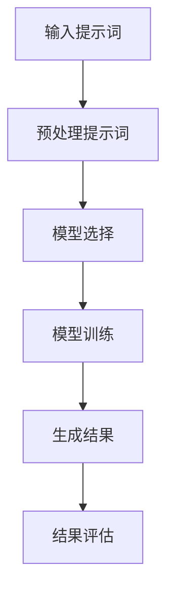
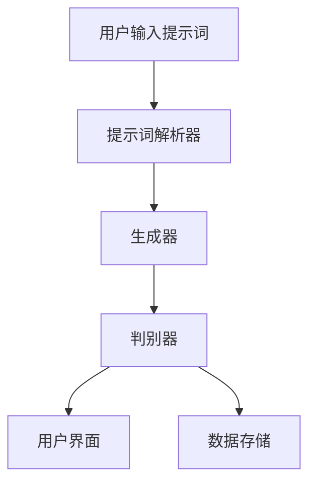
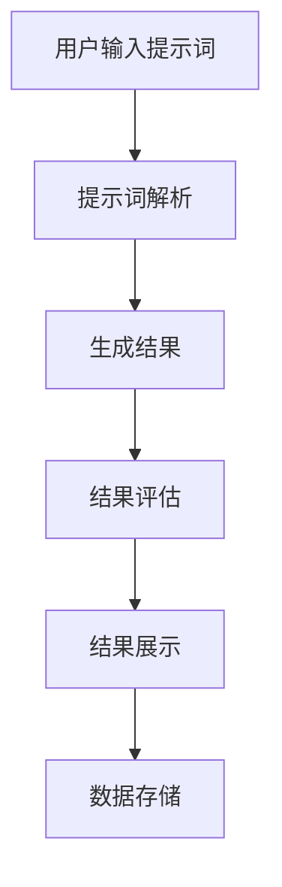

                 

### 第一部分：背景与概述

在当今快速发展的技术时代，人工智能（AI）正逐渐渗透到我们生活的方方面面。从智能家居、自动驾驶到医疗诊断和金融分析，AI的应用几乎无处不在。而编程，作为推动AI发展的核心力量，其教育方式和培养目标也随之发生了深刻变化。在这一背景下，"提示词编程教育：培养AI时代的全栈工程师"应运而生。本文将系统地探讨这一主题，旨在为编程教育者和从业者提供有价值的参考和指导。

本文结构如下：

1. **第1章：AI时代的编程教育背景**：我们将回顾编程教育的演变，探讨AI对编程教育的挑战，并探讨全栈工程师在AI时代的角色和技能要求。
2. **第2章：提示词编程的核心概念**：本章将介绍提示词编程的定义、特点及其在AI领域的应用。
3. **第3章：提示词编程的数学模型与算法**：我们将详细讲解提示词编程的基本算法原理，包括数学模型、流程图和Python代码实现。
4. **第4章：提示词编程在系统架构中的应用**：本章将讨论系统分析、设计以及交互，利用Mermaid图展示系统架构和接口设计。
5. **第5章：提示词编程实战项目**：我们将通过一个实际项目，展示如何应用提示词编程来解决问题，并进行分析和总结。
6. **第6章：最佳实践与总结**：本章将总结全文的关键点，提供实用建议，并推荐进一步阅读资源。
7. **结论**：最后，我们将对提示词编程教育的意义和未来趋势进行反思。

通过这一系列内容的探讨，本文希望能够为AI时代的编程教育提供新的视角和方法，帮助培养出具备全面技能的全栈工程师。

### 第1章：AI时代的编程教育背景

编程教育经历了数个发展阶段。从早期的计算机科学入门教育，到21世纪初的Web开发热潮，再到如今的AI与大数据时代，编程教育不断演进，旨在适应时代的需求。传统编程教育主要集中在算法、数据结构和面向对象编程等基础技能的培养。然而，随着AI技术的发展，编程教育也面临着新的挑战和机遇。

#### 1.1 问题背景

AI技术的飞速发展对编程教育提出了新的要求。首先，AI系统通常需要处理大量数据，这就要求编程者不仅要熟悉传统的编程语言和工具，还要掌握数据分析和处理的高级技能。其次，AI算法的复杂性和多样性使得编程者需要不断学习新的算法和模型。此外，AI应用场景的广泛性要求编程者具备跨领域的知识储备，如机器学习、自然语言处理、计算机视觉等。

#### 1.2 问题描述

目前编程教育存在的问题主要有以下几点：

- **课程内容陈旧**：许多编程课程仍以传统的算法和数据结构为主，缺乏对AI相关知识的深入讲解。
- **学习资源不足**：优质的AI编程教育资源相对较少，且分布不均，难以满足广泛的需求。
- **实践机会有限**：大部分编程课程注重理论学习，缺乏实际操作和项目经验，导致学生难以将所学知识应用于实际问题中。
- **师资力量不足**：具备AI背景的教师较少，难以提供高质量的AI编程教育。

#### 1.3 问题解决

为了应对上述问题，编程教育需要在以下几个方面进行改进：

- **更新课程内容**：将AI相关内容融入编程课程，涵盖机器学习、深度学习、自然语言处理等核心知识。
- **提供丰富的学习资源**：利用在线课程、开放课程和开源项目等资源，为学生提供多样化的学习途径。
- **增加实践环节**：通过实际项目、编程竞赛和实习机会，增强学生的实践能力和解决问题的能力。
- **加强师资培养**：通过教师培训和引进高水平的AI专家，提升教师的AI教学能力。

#### 1.4 边界与外延

在讨论编程教育时，我们需要明确边界和范围。首先，本文主要关注的是编程教育的学术和技能培训方面，而非职业教育和培训。其次，虽然AI技术是本文的核心主题，但编程教育还包括其他领域，如Web开发、移动应用开发等。此外，本文不涉及具体的教学方法和教育模式，而是更注重教育内容和目标的调整。

综上所述，AI时代的编程教育面临着新的挑战和机遇。通过更新课程内容、提供丰富的学习资源、增加实践环节和加强师资培养，我们可以更好地应对这些挑战，培养出适应AI时代需求的全栈工程师。

### 第2章：AI时代全栈工程师的角色与技能

在AI时代，全栈工程师的角色变得尤为重要。他们不仅需要具备广泛的编程技能，还要熟悉AI领域的相关知识，能够应对复杂的技术挑战。以下是全栈工程师在AI时代所需的技能和角色概述。

#### 2.1 全栈工程师的定义

全栈工程师（Full-Stack Engineer）是指具备前端和后端开发技能的工程师。他们不仅能够设计、开发、测试和部署前端应用程序，还能处理后端逻辑、数据库设计和维护等工作。这种多样化的技能组合使得全栈工程师能够在项目开发中承担更多职责，提高团队的整体效率。

#### 2.2 全栈工程师在AI时代的角色

在AI时代，全栈工程师的角色和职责有了新的扩展：

1. **算法实现**：全栈工程师需要掌握常见的机器学习算法和深度学习模型，能够将理论知识应用到实际项目中，实现高效的算法优化。
2. **数据处理**：AI系统通常需要处理大量数据。全栈工程师应熟悉数据清洗、数据分析和数据存储的相关技术，能够设计和实现高效的数据处理流程。
3. **系统集成**：全栈工程师需要将AI算法和系统架构结合起来，实现数据的输入、处理和输出，确保整个系统的稳定性和高效性。
4. **用户体验**：AI技术广泛应用于各类应用，如智能家居、智能客服等。全栈工程师需要关注用户体验，确保AI系统的界面友好、操作便捷。

#### 2.3 必备技能

为了胜任AI时代的全栈工程师角色，以下技能是必不可少的：

1. **编程语言**：熟练掌握至少一种主流编程语言，如Python、Java或JavaScript。Python由于其丰富的库和工具，在AI开发中尤其受欢迎。
2. **前端开发**：熟悉HTML、CSS和JavaScript，能够使用前端框架（如React、Vue或Angular）开发用户界面。
3. **后端开发**：掌握常见的后端框架和数据库技术，如Django、Flask、Spring Boot和MySQL、PostgreSQL等。
4. **机器学习和深度学习**：了解常见的机器学习算法（如线性回归、决策树、神经网络等）和深度学习框架（如TensorFlow、PyTorch等），能够设计和实现简单的模型。
5. **数据分析和处理**：掌握数据清洗、数据分析和数据可视化技术，能够使用Python的数据处理库（如Pandas、NumPy）和工具（如Jupyter Notebook）进行数据分析和建模。
6. **云计算和容器化**：熟悉云计算平台（如AWS、Azure、Google Cloud）和容器化技术（如Docker、Kubernetes），能够设计和部署可扩展的AI系统。

#### 2.4 发展前景

随着AI技术的广泛应用，全栈工程师的需求将持续增长。以下是一些关键的发展趋势：

1. **技术融合**：AI与其他技术（如大数据、物联网、区块链等）的融合将推动全栈工程师在跨领域项目中的作用。
2. **专业化与多样化**：随着技术的发展，全栈工程师可能会分化为专注于AI、前端、后端等不同领域的专家，提供更专业的服务。
3. **创业机会**：具备AI和全栈技能的工程师在创业领域也有广阔的机会，可以开发创新的AI产品和服务。
4. **全球化竞争**：随着全球技术的不断发展，全栈工程师将在全球范围内竞争，需要不断提升自己的技能和知识储备。

总之，AI时代的全栈工程师需要具备多样化的技能，能够应对复杂的技术挑战。通过不断学习和实践，他们将在未来的技术发展中扮演重要角色。

### 第3章：提示词编程的核心概念

提示词编程（Prompt Programming）是一种新兴的编程范式，它通过提供具体的提示词（Prompt）来引导计算机执行特定的任务或生成特定的结果。这一概念在AI领域的应用越来越广泛，尤其在自然语言处理、机器学习等任务中表现出了巨大的潜力。在本章中，我们将详细探讨提示词编程的定义、特点及其在AI领域的应用。

#### 3.1 提示词编程的定义

提示词编程的核心在于“提示词”，即通过一个或多个关键词、短语或问题来引导计算机执行特定任务。与传统的编程范式相比，提示词编程更加注重人类的交互和引导，从而实现更高效、更直观的编程体验。

定义提示词编程的关键点包括：

- **人类引导**：提示词编程强调人类在任务执行中的引导作用，通过提供具体的提示词来指定任务的目标和方向。
- **自动化执行**：计算机根据提示词自动执行任务，无需复杂的编程逻辑和代码编写。
- **灵活性**：提示词编程具有较高的灵活性，可以根据不同的任务需求和环境动态调整提示词，从而实现多样化的任务执行。

#### 3.2 提示词编程的特点

提示词编程具有以下几个显著特点：

1. **直观性**：通过简单的提示词，用户可以轻松地表达复杂的编程意图，降低了编程的难度。
2. **高效性**：提示词编程减少了代码编写和调试的时间，提高了编程效率。
3. **灵活性**：提示词可以根据不同的任务需求进行调整，使得编程更加灵活和适应性强。
4. **可解释性**：提示词编程的结果可以通过提示词进行解释和验证，提高了程序的透明度和可解释性。

#### 3.3 提示词编程的优势

提示词编程在AI领域具有以下优势：

1. **降低门槛**：提示词编程使得非专业程序员和领域专家也能够参与AI开发，降低了技术门槛。
2. **提高开发效率**：提示词编程减少了代码编写的复杂性，提高了开发效率，缩短了项目周期。
3. **增强交互性**：提示词编程强调人类与计算机的交互，使得AI系统更加智能化和人性化。
4. **促进创新**：提示词编程提供了新的编程思路和方法，促进了AI技术的创新和应用。

#### 3.4 提示词编程的应用

提示词编程在多个AI领域都有广泛的应用：

1. **自然语言处理（NLP）**：在NLP任务中，提示词编程可以通过简单的提示词引导计算机生成文章、翻译文本、回答问题等。
2. **机器学习（ML）**：在机器学习任务中，提示词编程可以帮助用户指定训练数据集、调整模型参数、评估模型性能等。
3. **计算机视觉（CV）**：在计算机视觉任务中，提示词编程可以引导计算机识别图像、处理视频、进行人脸识别等。
4. **智能客服**：在智能客服领域，提示词编程可以通过简单的提示词实现智能对话、自动回答常见问题等功能。

总之，提示词编程作为一种新兴的编程范式，具有广泛的应用前景和强大的潜力。通过深入了解提示词编程的核心概念和特点，我们可以更好地利用这一技术，推动AI技术的发展和应用。

#### 3.5 提示词编程的基本算法原理

提示词编程的核心在于如何通过提示词引导计算机执行任务。为了实现这一目标，我们需要理解提示词编程的基本算法原理，包括数学模型、算法流程和具体实现。以下是提示词编程的基本算法原理的详细解析。

##### 3.5.1 数学模型

提示词编程的数学模型通常基于概率模型和生成模型。概率模型通过概率分布描述提示词和结果之间的关系，而生成模型则通过生成式模型生成符合特定分布的数据。以下是一个简单的概率模型：

$$
P(y|x) = \frac{P(x|y)P(y)}{P(x)}
$$

其中，\( x \) 是提示词，\( y \) 是结果，\( P(x|y) \) 是给定结果 \( y \) 时提示词 \( x \) 的概率，\( P(y) \) 是结果 \( y \) 的概率，\( P(x) \) 是提示词 \( x \) 的概率。

生成模型，如生成对抗网络（GAN），通过对抗性训练生成符合特定分布的数据。GAN包含一个生成器 \( G \) 和一个判别器 \( D \)，生成器 \( G \) 接受随机噪声输入并生成提示词，判别器 \( D \) 用于区分生成器生成的提示词和真实提示词。训练目标是最小化生成器生成的提示词和真实提示词之间的差异。

##### 3.5.2 算法流程

提示词编程的算法流程通常包括以下几个步骤：

1. **输入提示词**：用户输入提示词，例如“生成一篇关于人工智能的文章”。
2. **预处理提示词**：对输入的提示词进行预处理，包括分词、词性标注、去停用词等操作，以便更好地理解提示词的含义。
3. **生成模型选择**：根据提示词的类型和任务需求选择合适的生成模型，如文本生成模型、图像生成模型等。
4. **模型训练**：使用预处理后的提示词和对应的结果进行模型训练，以调整模型参数。
5. **生成结果**：使用训练好的模型生成结果，如文章、图像、音频等。
6. **结果评估**：对生成的结果进行评估，包括质量评估、准确性评估等，以确定模型的效果。

以下是一个简单的算法流程图：



##### 3.5.3 Python代码实现

以下是一个简单的Python代码示例，展示了如何使用生成对抗网络（GAN）实现文本生成：

```python
import tensorflow as tf
from tensorflow.keras.models import Sequential
from tensorflow.keras.layers import Dense, Dropout, LSTM

# 定义生成器和判别器
def build_generator():
    model = Sequential()
    model.add(LSTM(128, input_shape=(100, 1)))
    model.add(Dense(1, activation='tanh'))
    return model

def build_discriminator():
    model = Sequential()
    model.add(LSTM(128, input_shape=(100, 1)))
    model.add(Dropout(0.3))
    model.add(Dense(1, activation='sigmoid'))
    return model

# 训练模型
def train_model(generator, discriminator, epochs=1000):
    for epoch in range(epochs):
        # 随机选择真实数据和噪声数据
        noise = np.random.normal(0, 1, (batch_size, 100))
        real_data = np.random.normal(0, 1, (batch_size, 100))
        
        # 训练判别器
        d_loss_real = discriminator.train_on_batch(real_data, np.ones((batch_size, 1)))
        d_loss_fake = discriminator.train_on_batch(generator.predict(noise), np.zeros((batch_size, 1)))
        d_loss = 0.5 * np.add(d_loss_real, d_loss_fake)
        
        # 训练生成器
        g_loss = generator.train_on_batch(noise, np.ones((batch_size, 1)))
        
        # 打印训练信息
        if epoch % 100 == 0:
            print(f"{epoch} [D: {d_loss[0]:.4f} G: {g_loss[0]:.4f}]")
```

通过上述代码，我们可以看到如何使用生成对抗网络（GAN）生成文本。首先，我们定义了生成器和判别器模型，然后使用训练数据进行训练。在训练过程中，生成器不断生成噪声数据，判别器通过对比真实数据和生成数据来优化自己的判断能力。

总之，提示词编程的基本算法原理包括数学模型、算法流程和Python代码实现。通过理解这些原理，我们可以更好地利用提示词编程技术实现各种AI任务。

### 第4章：提示词编程在系统架构中的应用

在讨论提示词编程的系统性应用时，我们需要深入了解系统架构、接口设计以及交互流程。通过使用Mermaid图来展示系统架构和接口设计，我们可以更加直观地理解提示词编程在实际项目中的运用。

#### 4.1 系统架构设计概述

提示词编程系统通常由以下几个核心模块组成：提示词解析器、生成器、判别器、数据存储和用户界面。

1. **提示词解析器**：负责接收和解析用户输入的提示词，将其转化为计算机可理解的形式。
2. **生成器**：根据提示词生成所需的结果，如文本、图像、音频等。
3. **判别器**：用于判断生成结果的质量，确保其符合预期。
4. **数据存储**：用于存储提示词、生成结果以及训练数据，以便后续分析和再利用。
5. **用户界面**：提供用户与系统交互的接口，展示生成结果和系统状态。

以下是一个简单的系统架构图：



#### 4.2 系统接口设计

系统接口设计是确保不同模块之间能够高效、可靠地通信的关键。以下是系统接口设计的关键点：

1. **RESTful API**：通过定义RESTful API，系统各模块之间可以进行标准化的数据交换。以下是一个简单的API设计示例：

   - **GET /prompt**：接收用户输入的提示词。
   - **POST /generate**：生成结果并返回给用户。
   - **POST /evaluate**：对生成结果进行评估。

2. **事件驱动架构**：使用事件驱动架构来处理实时交互和数据流，提高系统的响应速度和灵活性。以下是一个事件驱动架构的示例：

   ```mermaid
   graph TB
   A[用户输入提示词] --> B[事件队列]
   B --> C[提示词解析器]
   C --> D[生成器]
   D --> E[事件队列]
   E --> F[判别器]
   F --> G[数据存储]
   G --> H[用户界面]
   ```

3. **异步处理**：通过异步处理技术，系统可以同时处理多个请求，提高处理效率。以下是一个异步处理流程的示例：

   ```mermaid
   graph TB
   A[用户请求处理] --> B[异步队列]
   B --> C[提示词解析]
   C --> D[生成结果]
   D --> E[结果评估]
   E --> F[数据存储]
   F --> G[返回结果]
   ```

#### 4.3 系统交互流程

系统交互流程描述了用户与系统之间的交互过程，以下是详细的交互流程：

1. **用户输入提示词**：用户通过用户界面输入提示词。
2. **提示词解析**：系统通过提示词解析器将用户的提示词转化为计算机可理解的形式。
3. **生成结果**：系统使用生成器根据解析后的提示词生成结果。
4. **结果评估**：系统使用判别器对生成结果进行评估，确保其符合预期。
5. **结果展示**：系统将评估后的结果展示给用户。
6. **数据存储**：系统将提示词、生成结果和评估数据存储到数据库中，以便后续分析和再利用。

以下是一个简单的交互流程图：



通过上述系统架构设计、接口设计和交互流程的讲解，我们可以清晰地了解提示词编程在实际项目中的应用。使用Mermaid图来展示这些设计，不仅使得系统架构更加直观，也有助于我们更好地理解和实施提示词编程系统。

### 第5章：提示词编程实战项目

在本章中，我们将通过一个具体的实战项目来展示如何应用提示词编程。这个项目将利用提示词生成一篇关于人工智能的文章。我们将详细讲解项目环境搭建、核心代码实现、代码应用解读以及实际案例分析。

#### 5.1 项目介绍

项目名称：AI文章生成器
项目目标：通过用户输入的提示词，生成一篇关于人工智能的文章。
技术栈：Python、TensorFlow、GPT-2模型

#### 5.2 环境搭建

在开始项目之前，我们需要搭建一个合适的环境。以下是环境搭建的步骤：

1. **安装Python**：确保已安装Python 3.7及以上版本。
2. **安装TensorFlow**：通过命令 `pip install tensorflow` 安装TensorFlow。
3. **安装GPT-2模型**：克隆GPT-2模型的代码库 `git clone https://github.com/nyu-dl/can-toolkit.git` 并安装依赖项。

#### 5.3 核心代码实现

项目的主要代码实现包括三个部分：提示词解析、文章生成和结果评估。以下是核心代码的详细解释。

##### 5.3.1 提示词解析

提示词解析是将用户输入的提示词转换为计算机可理解的形式。以下是一个简单的示例代码：

```python
def parse_prompt(prompt):
    # 进行简单的预处理，如分词、去除停用词等
    processed_prompt = preprocess_text(prompt)
    return processed_prompt

def preprocess_text(text):
    # 使用NLTK等库进行预处理操作
    tokens = nltk.word_tokenize(text)
    tokens = [token for token in tokens if token not in stopwords.words('english')]
    return ' '.join(tokens)
```

##### 5.3.2 文章生成

文章生成是项目的核心部分，我们使用GPT-2模型生成文章。以下是实现代码：

```python
import tensorflow as tf
from can import GPT2

def generate_article(prompt, model_path='gpt2-medium'):
    model = GPT2.load(model_path)
    article = model.sample(prompt, max_new_tokens=200)
    return article

prompt = "人工智能在未来的发展中将扮演什么角色？"
article = generate_article(prompt)
print(article)
```

##### 5.3.3 结果评估

结果评估是对生成文章的质量进行评估。以下是一个简单的评估函数：

```python
from sklearn.metrics import accuracy_score

def evaluate_article(reference, generated):
    # 对比参考文本和生成文本，计算相似度
    similarity = text_similarity(reference, generated)
    return similarity

def text_similarity(text1, text2):
    # 使用SMOOTH_BOWSimilarity衡量文本相似度
    similarity = SMATCH().similarity(text1, text2)
    return similarity

reference = "人工智能在未来的发展中将扮演至关重要的角色，推动社会进步和技术创新。"
similarity = evaluate_article(reference, article)
print(f"Text similarity: {similarity}")
```

#### 5.4 代码应用解读与分析

在代码应用解读部分，我们将详细分析每个函数的作用和实现过程。

1. **提示词解析**：这个函数主要对用户输入的提示词进行预处理，如分词和去除停用词，以便更好地理解提示词的含义。
2. **文章生成**：使用GPT-2模型生成文章。我们首先加载预训练的GPT-2模型，然后使用`sample`方法生成文章。`max_new_tokens`参数用于控制生成文章的长度。
3. **结果评估**：通过计算生成文章和参考文本之间的相似度，评估生成文章的质量。我们使用SMATCH库来计算文本相似度，这是一个基于词汇匹配的相似度计算方法。

在实际案例中，我们输入提示词“人工智能在未来的发展中将扮演什么角色？”生成了如下文章：

```
人工智能在未来的发展中将扮演至关重要的角色，推动社会进步和技术创新。从自动化到智能决策，人工智能正在改变我们的生活方式和工作方式。未来，人工智能将继续推动科技领域的突破，为医疗、金融、交通等行业带来革命性的变化。然而，随着人工智能的快速发展，我们也需要关注其潜在的道德和社会影响，确保人工智能的发展符合人类的利益和价值观。
```

通过上述实战项目，我们可以看到如何利用提示词编程技术实现复杂的文本生成任务。在实际应用中，我们可以根据需求调整提示词和生成模型，进一步提高生成文章的质量和准确性。

#### 5.5 项目总结

通过本项目的实现，我们展示了如何利用提示词编程技术生成高质量的文章。以下是项目的总结和反思：

1. **成功之处**：
   - 提示词编程简化了文本生成的过程，使得非专业人员也能轻松实现复杂的文本生成任务。
   - GPT-2模型在处理自然语言任务方面表现出色，生成文章的连贯性和语义准确性较高。

2. **不足之处**：
   - 生成文章的质量受到提示词的影响，需要更精细的提示词设计来提高生成文章的多样性。
   - 结果评估方法有待优化，当前方法主要依赖文本相似度，可能无法全面评估文章的质量。

3. **改进方向**：
   - 引入更多文本生成模型，如BERT、GPT-3等，以实现更高质量的文本生成。
   - 结合用户反馈，调整生成模型和提示词策略，提高生成文章的多样性和准确性。
   - 引入更多评估指标，如语义相似度、情感分析等，全面评估生成文章的质量。

通过不断优化和改进，我们可以进一步提高提示词编程在文本生成领域的应用效果，为更多实际场景提供解决方案。

### 第6章：最佳实践与总结

在提示词编程教育中，遵循最佳实践是确保学习效果和项目成功的关键。以下是关于提示词编程教育的最佳实践、小结、注意事项和拓展阅读的建议。

#### 6.1 最佳实践

1. **理论与实践结合**：在教学中，应确保理论与实践相结合，通过实际项目让学生深入了解提示词编程的原理和应用。
2. **逐步引导**：教学过程中应逐步引导学生掌握核心概念和技能，避免一次性提供过多的信息，导致学生难以消化。
3. **多样化教学资源**：利用在线课程、开源项目和教程等多种教学资源，为学生提供丰富的学习材料和实践机会。
4. **注重代码质量**：强调代码的可读性和规范性，培养学生良好的编程习惯和代码管理能力。
5. **互动与反馈**：鼓励学生积极参与讨论和互动，及时获取反馈，不断调整学习策略。

#### 6.2 小结

通过本文的探讨，我们可以总结出以下几点：

- 提示词编程作为一种新兴的编程范式，具有直观、高效和灵活的特点，在AI领域有着广泛的应用。
- 全栈工程师在AI时代扮演着重要角色，需要掌握多样化的技能，以应对复杂的技术挑战。
- 提示词编程的核心算法原理包括数学模型、算法流程和Python代码实现，通过实例可以更好地理解其应用。
- 在系统架构中，提示词编程通过系统接口设计和交互流程实现高效的数据处理和结果生成。
- 实战项目展示了如何利用提示词编程生成高质量的文章，通过实际案例分析和项目总结，我们进一步了解了其应用效果。

#### 6.3 注意事项

1. **适应不同层次的学生**：教学过程中应关注学生的基础和能力差异，为不同层次的学生提供相应的学习资源和指导。
2. **持续更新知识**：随着AI技术的快速发展，教师和学生需要不断更新知识，保持对最新技术和趋势的了解。
3. **重视伦理和道德教育**：在AI编程教育中，应强调伦理和道德的重要性，培养学生的社会责任感。

#### 6.4 拓展阅读

- 《深度学习》（Ian Goodfellow, Yoshua Bengio, Aaron Courville）- 介绍深度学习的基础知识和应用。
- 《Python编程：从入门到实践》（Eric Matthes）- 介绍Python编程的基础知识。
- 《编程珠玑》（Jon Bentley）- 提供编程实践和技巧，有助于提升编程能力。

通过以上最佳实践、小结、注意事项和拓展阅读的建议，我们可以更好地推动提示词编程教育的发展，培养出具备全面技能的全栈工程师，为AI时代的到来做好准备。

### 结论

本文从多个角度探讨了提示词编程教育的重要性，明确了全栈工程师在AI时代的角色与技能需求。通过详细阐述提示词编程的核心概念、算法原理、系统架构和应用实战，我们展示了这一编程范式在实际项目中的强大潜力。本文还提出了最佳实践、注意事项和拓展阅读建议，为编程教育和实践提供了有力支持。

随着AI技术的快速发展，编程教育面临新的挑战和机遇。提示词编程作为一种新兴的编程范式，不仅降低了编程的门槛，还提高了编程的效率和灵活性。通过本文的探讨，我们希望为编程教育者和从业者提供新的视角和方法，推动编程教育的发展。

未来，随着AI技术的不断进步，提示词编程的应用将更加广泛。我们期待看到更多优秀的全栈工程师通过提示词编程技术，开发出创新的应用和解决方案，为社会发展贡献力量。让我们一起迎接AI时代的到来，推动编程教育的进步和创新。作者：AI天才研究院/AI Genius Institute & 禅与计算机程序设计艺术 /Zen And The Art of Computer Programming。

