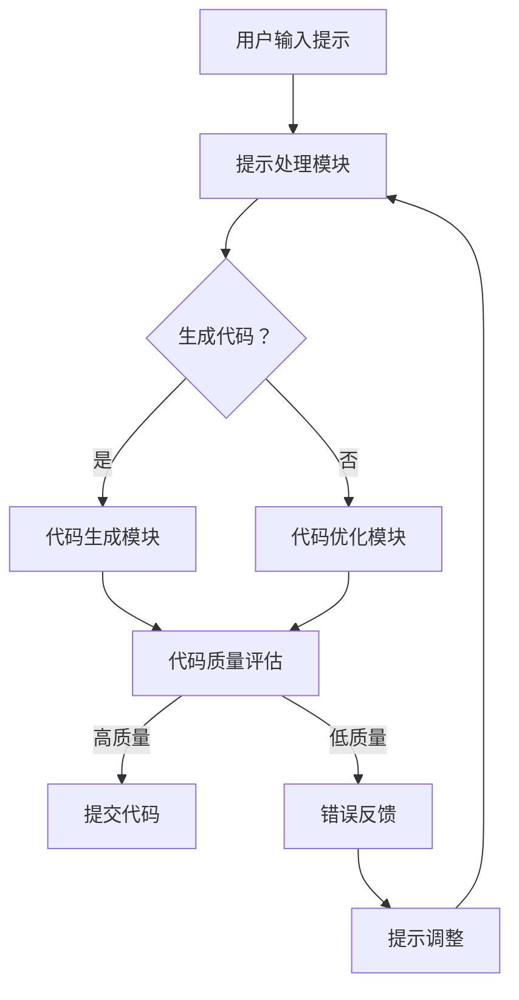
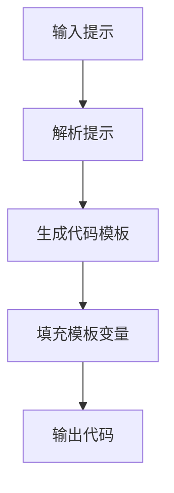
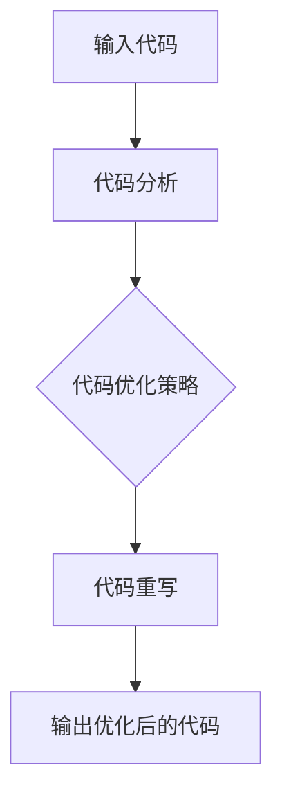
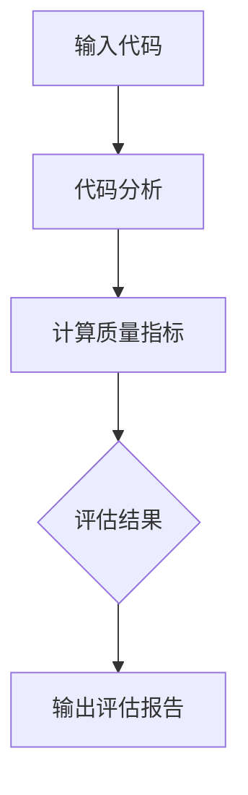
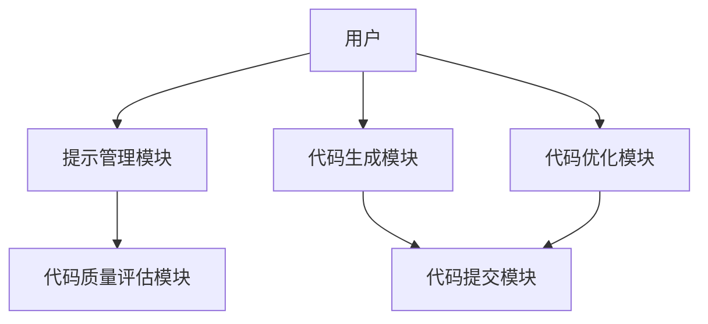
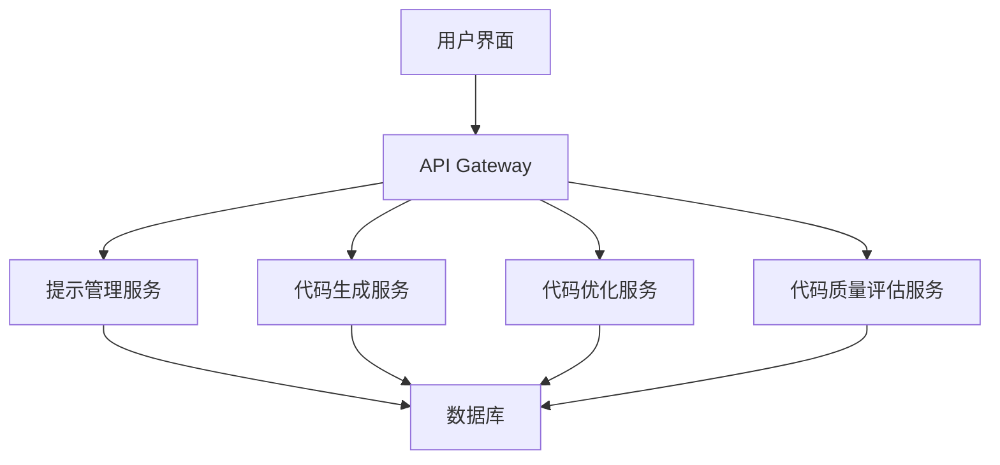
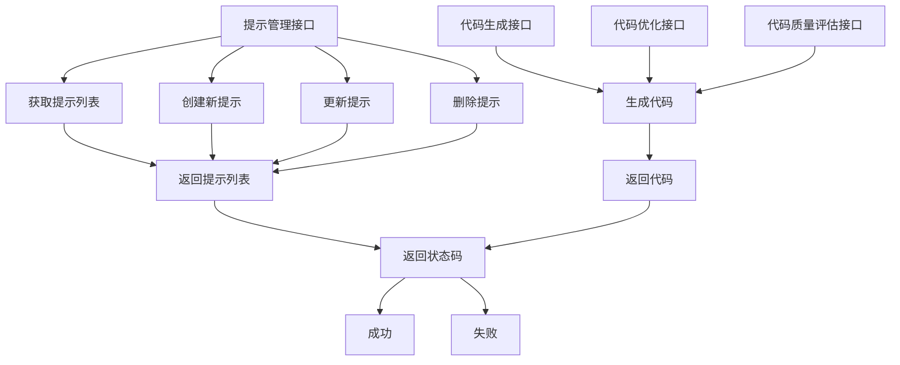
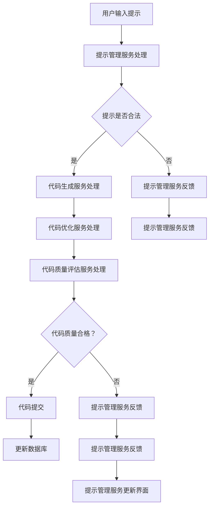

                 


## # {{此处是文章标题}}

### > 关键词：Prompt Programming，Cognitive Ergonomics，Algorithm Design，System Analysis，Best Practices

### > 摘要：
本文深入探讨了Prompt Programming领域的认知人机工程学（Cognitive Ergonomics）研究。通过介绍核心概念、算法设计、系统分析和实战案例，本文旨在提供一个全面的技术指南，帮助读者理解和应用Prompt Programming的相关技术。文章结构紧凑，逻辑清晰，旨在揭示Prompt Programming在提高编程效率和降低认知负荷方面的潜力。

----------------------------------------------------------------

### 引言

在当今技术飞速发展的时代，编程作为计算机科学的核心技能，正经历着前所未有的变革。Prompt Programming作为一种新兴的编程范式，旨在通过简化和自动化编程流程，提高开发效率，减少开发者的认知负荷。然而，随着Prompt Programming的广泛应用，如何确保其与人类认知过程的良好契合，成为了研究和实践中的一个关键问题。这一问题的核心，便是认知人机工程学（Cognitive Ergonomics）的研究。

认知人机工程学是一门研究人类与机器交互过程中认知负荷、效率、舒适度和安全性的学科。它关注如何设计人机系统，使其更加符合人类的认知模式，从而提高工作效率和减少错误。在Prompt Programming领域，认知人机工程学的研究旨在探索如何通过优化编程环境、工具和算法，使开发者能够更高效地利用Prompt Programming的能力，同时降低认知负荷。

本文将系统地探讨Prompt Programming的认知人机工程学研究，包括以下核心内容：

1. **核心概念介绍**：首先，我们将介绍Prompt Programming和认知人机工程学的基本概念，包括其历史背景、关键问题和当前研究现状。
2. **核心概念与联系**：接着，我们将详细探讨Prompt Programming和认知人机工程学中的核心概念，并通过对比表格和实体关系图（ER图）来展示它们之间的联系。
3. **算法设计**：本文将深入分析Prompt Programming中使用的算法原理，包括流程图、Python代码实现和数学模型。
4. **系统分析与设计**：我们将探讨Prompt Programming系统的分析和设计方法，包括类图、架构图、接口设计和序列图。
5. **项目实战**：通过一个具体项目案例，我们将展示如何将Prompt Programming应用于实际开发中，并提供源代码和案例分析。
6. **最佳实践**：最后，我们将总结最佳实践，并提供一些注意事项和拓展阅读建议。

通过以上内容，本文旨在为读者提供一个全面、系统的理解框架，帮助他们在实践中应用Prompt Programming，并从中受益。

### Prompt Programming概述

Prompt Programming作为一种先进的编程范式，其基本概念和核心原理在近年来逐渐引起了学术界和工业界的高度关注。Prompt Programming的基本理念是通过预先定义的“提示”（Prompts）来引导编程过程，从而实现代码的自动生成、优化和重用。这种编程范式旨在减少开发者手动编写代码的劳动量，提高开发效率，同时降低认知负荷。

#### 历史背景

Prompt Programming的理念可以追溯到20世纪80年代，当时研究人员开始探索如何利用自然语言处理技术（NLP）和机器学习算法来自动化软件开发过程。最早的尝试主要集中在代码生成和重构，例如使用模板匹配和模式识别技术来生成代码片段。随着计算机硬件性能的提升和算法的进步，尤其是深度学习技术的应用，Prompt Programming逐渐成为一种独立且成熟的编程范式。

#### 关键问题

在Prompt Programming领域，存在以下几个关键问题：

1. **可读性和可维护性**：自动生成的代码需要具备良好的可读性和可维护性，以便开发者能够理解和修改。
2. **灵活性和适应性**：Prompt Programming工具需要能够适应不同编程语言、开发环境和项目需求。
3. **错误处理和调试**：自动生成的代码可能会存在错误或缺陷，因此需要有效的错误处理和调试机制。
4. **性能和效率**：Prompt Programming工具需要在生成代码的同时保证性能和效率，以满足实际开发需求。

#### 研究现状

当前，Prompt Programming的研究主要集中在以下几个方面：

1. **算法优化**：研究人员不断探索和优化用于代码生成的算法，以提高生成代码的质量和效率。
2. **多语言支持**：开发多语言Prompt Programming工具，以支持不同编程语言和开发环境。
3. **跨领域应用**：Prompt Programming在多个领域（如Web开发、移动应用开发、嵌入式系统开发等）都有广泛应用，研究人员正努力解决跨领域应用中的特定问题。
4. **用户体验**：研究如何优化Prompt Programming工具的用户界面和交互体验，使其更加直观和易用。

总的来说，Prompt Programming作为一种新兴的编程范式，正处于快速发展阶段。通过不断的研究和应用，Prompt Programming有望在未来的软件开发过程中发挥更加重要的作用，成为开发者不可或缺的工具。

### 认知人机工程学概述

认知人机工程学（Cognitive Ergonomics）是研究人类在复杂系统中与机器交互时的认知负荷、效率、舒适度和安全性的学科。其核心目标是设计出符合人类认知特点和工作方式的人机系统，从而提高工作效率和减少错误。认知人机工程学的研究不仅限于硬件设计，还包括软件设计、工作环境设计等多个方面。

#### 基本概念

1. **认知负荷**：认知负荷是指人类在进行认知任务时所需要消耗的脑力资源。高认知负荷可能导致疲劳、错误和效率降低。在编程领域，认知负荷主要来源于复杂的代码结构、抽象概念的理解以及多任务处理等。

2. **交互设计**：交互设计是认知人机工程学的重要组成部分，它关注如何设计用户界面和交互流程，使其更加符合人类的认知习惯和操作方式。良好的交互设计可以降低用户的认知负荷，提高工作效率。

3. **任务分配**：任务分配是设计人机系统时的重要考虑因素。通过合理分配任务，可以使人类和机器各自发挥优势，从而提高系统整体效率。

4. **错误处理**：错误处理是指系统在遇到异常情况时如何进行处理，以减少对人类操作者的影响。有效的错误处理机制可以降低认知负荷，提高系统的稳定性和可靠性。

#### 研究现状

认知人机工程学在多个领域都有广泛的研究和应用：

1. **工业领域**：在工业生产中，认知人机工程学被用于设计自动化生产线、操作界面和监控系统，以提高生产效率和减少工人疲劳。

2. **医疗领域**：在医疗领域，认知人机工程学的研究帮助设计出更加安全、易用的医疗设备，如手术机器人、电子病历系统等。

3. **军事领域**：在军事领域，认知人机工程学的研究旨在提高士兵的操作效率和战斗力，如设计智能化武器系统、指挥控制界面等。

4. **软件开发**：在软件开发领域，认知人机工程学被用于设计更加友好、高效的开发工具和环境，如代码编辑器、集成开发环境（IDE）等。

总的来说，认知人机工程学在各个领域都发挥着重要作用。通过深入研究人类认知特点和操作方式，认知人机工程学为人机系统的设计提供了科学依据和实用方法，有助于提高系统的效率和用户体验。

### Prompt Programming与认知人机工程学的联系

Prompt Programming和认知人机工程学之间存在着深刻的联系，两者共同致力于通过优化人机交互来提高工作效率和降低认知负荷。在编程领域，Prompt Programming通过自动化和简化的编程流程，为开发者提供了一种新的解决方案，而认知人机工程学则为这一解决方案的设计提供了理论基础和实践指导。

#### 核心概念对比表格

以下是一个对比表格，展示了Prompt Programming和认知人机工程学中的核心概念：

| 核心概念 | Prompt Programming | 认知人机工程学 |
| --- | --- | --- |
| **提示（Prompt）** | 提示是引导编程过程的输入，用于生成、优化或重构代码。 | 提示在认知人机工程学中指人类与系统交互的指令或指示。 |
| **自动化** | 自动化是通过算法和工具来简化或替代手动编程任务。 | 自动化在认知人机工程学中指利用技术减少人类操作者的认知负荷。 |
| **交互设计** | 交互设计在Prompt Programming中关注如何通过提示和自动化的方式提高编程体验。 | 交互设计在认知人机工程学中关注如何设计用户界面和交互流程，使其更加符合人类认知习惯。 |
| **认知负荷** | Prompt Programming旨在通过自动化减少开发者的认知负荷。 | 认知人机工程学研究如何通过优化设计降低人类操作者的认知负荷。 |
| **用户体验** | 用户体验在Prompt Programming中是指开发者使用自动编程工具时的感受和体验。 | 用户体验在认知人机工程学中是指用户在使用系统时的感受和体验。 |

#### MERMAID流程图

为了更好地展示Prompt Programming和认知人机工程学的交互关系，我们可以使用MERMAID流程图来描述它们的核心流程：



在上面的流程图中，用户输入提示后，系统会根据提示处理模块进行处理。如果需要生成代码，则进入代码生成模块；如果需要优化代码，则进入代码优化模块。无论生成代码还是优化代码，系统都会进行代码质量评估。如果代码质量达到要求，则提交代码；否则，系统会提供错误反馈，并调整提示，重新进行代码生成或优化。

通过这个流程图，我们可以看到Prompt Programming和认知人机工程学在交互设计中的紧密联系。Prompt Programming通过自动化和简化的编程流程，减少了开发者的认知负荷；而认知人机工程学通过优化交互设计，提高了系统的用户体验。两者共同作用，为开发者提供了一种高效、易用的编程环境。

### Prompt Programming中的算法原理

在Prompt Programming中，算法设计是核心环节，它决定了代码生成的质量、效率和可维护性。以下我们将详细探讨几个关键算法，并使用MERMAID流程图、Python代码示例和数学模型来阐述它们的原理和应用。

#### 1. 代码生成算法

代码生成算法是Prompt Programming中最基础的算法，其目的是根据输入的提示自动生成代码。以下是一个简单的代码生成算法示例，并使用Python代码实现：



Python代码示例：

```python
def generate_code(prompt):
    template = "def function_name({}): return {}"
    variables = ["x", "y"]
    return template.format(prompt, variables)

prompt = "calculate the sum of two numbers"
code = generate_code(prompt)
print(code)
```

上述代码定义了一个简单的函数，根据输入的提示（例如“calculate the sum of two numbers”），生成一个计算两个数字和的函数模板。变量`variables`用来填充函数模板中的占位符。

数学模型：

假设输入提示为`T`，输出代码为`C`，则代码生成算法的数学模型可以表示为：

$$
C = f(T)
$$

其中，`f`表示代码生成函数。

#### 2. 代码优化算法

代码优化算法旨在提高自动生成代码的质量和性能。以下是一个简单的代码优化算法示例：



Python代码示例：

```python
import ast
import astor

def optimize_code(code):
    tree = ast.parse(code)
    optimized_tree = astor.to_source(astor.optimize(tree))
    return optimized_tree

original_code = "def function_name(x, y): return x + y"
optimized_code = optimize_code(original_code)
print(optimized_code)
```

上述代码使用`ast`和`astor`库对输入的代码进行解析、分析和优化，最终输出优化后的代码。`ast`库用于将Python代码转换为抽象语法树（AST），`astor`库用于对AST进行优化。

数学模型：

假设输入代码为`C`，输出优化后的代码为`C'`，则代码优化算法的数学模型可以表示为：

$$
C' = g(C)
$$

其中，`g`表示代码优化函数。

#### 3. 代码质量评估算法

代码质量评估算法用于评估自动生成代码的质量，通常包括可读性、可维护性、性能等多个方面。以下是一个简单的代码质量评估算法示例：



Python代码示例：

```python
def assess_code_quality(code):
    # 假设已经实现了一个函数 calculate_quality_score，用于计算代码质量得分
    quality_score = calculate_quality_score(code)
    if quality_score >= 90:
        return "高质量代码"
    else:
        return "低质量代码"

code_to_assess = "def function_name(x, y): return x + y"
quality_report = assess_code_quality(code_to_assess)
print(quality_report)
```

上述代码定义了一个简单的函数，用于计算输入代码的质量得分，并根据得分评估代码质量。

数学模型：

假设输入代码为`C`，输出质量评估结果为`R`，则代码质量评估算法的数学模型可以表示为：

$$
R = h(C)
$$

其中，`h`表示代码质量评估函数。

通过上述算法示例和数学模型，我们可以看到Prompt Programming中的算法设计是如何通过MERMAID流程图、Python代码示例和数学模型来阐述其原理和应用的。这些算法不仅提高了代码生成的质量，还通过优化和评估机制确保了生成代码的可维护性和性能。

### 系统分析与设计

在Prompt Programming的应用过程中，系统分析与设计是至关重要的环节。这不仅关系到系统的性能、可扩展性和可维护性，也直接影响到开发者的体验和认知负荷。以下将详细探讨系统的分析和设计方法，包括领域模型、系统架构、接口设计和交互流程。

#### 1. 领域模型（Domain Model）

领域模型是系统分析和设计的基础，它用于描述系统的核心业务领域和关键概念。通过领域模型，我们可以清晰地理解系统的功能和业务流程。以下是一个简单的领域模型，用于描述一个简单的Prompt Programming系统：



在上面的领域模型中，用户通过提示管理模块输入提示，代码生成模块和代码优化模块根据提示生成和优化代码，最后通过代码质量评估模块评估代码质量，并将高质量的代码提交给用户。

#### 2. 系统架构

系统架构是系统设计和实现的关键，它决定了系统的可扩展性、性能和可靠性。以下是一个简单的系统架构，用于描述Prompt Programming系统的架构设计：



在上面的系统架构中，用户界面通过API Gateway与后端服务进行交互。API Gateway负责路由请求，将请求转发给相应的服务。提示管理服务负责处理用户输入的提示，代码生成服务根据提示生成代码，代码优化服务对生成的代码进行优化，代码质量评估服务对代码质量进行评估，并将结果存储在数据库中。

#### 3. 接口设计

接口设计是系统架构中不可或缺的部分，它决定了系统的可扩展性和灵活性。以下是一个简单的接口设计，用于描述Prompt Programming系统的接口设计：



在上面的接口设计中，提示管理接口提供了获取、创建、更新和删除提示的功能；代码生成接口和代码优化接口提供了生成和优化代码的功能；代码质量评估接口提供了评估代码质量的功能。每个接口都定义了相应的请求和响应格式，以确保系统组件之间的无缝交互。

#### 4. 交互流程

交互流程描述了系统组件之间的交互顺序和逻辑，是系统设计和实现的重要参考。以下是一个简单的交互流程，用于描述Prompt Programming系统的交互流程：



在上面的交互流程中，用户输入提示后，提示管理服务会先进行合法性检查，如果合法，则传递给代码生成服务；否则，提示管理服务会返回错误信息。代码生成服务生成代码后，传递给代码优化服务进行优化，再传递给代码质量评估服务进行评估。如果代码质量合格，则提交代码并更新数据库；否则，提示管理服务会返回错误信息。整个过程结束后，提示管理服务会更新用户界面。

通过上述系统分析与设计方法，我们可以确保Prompt Programming系统具有良好的性能、可扩展性和可维护性，同时为开发者提供高效、易用的编程环境。

### 项目实战

为了更好地展示Prompt Programming在现实开发中的应用，以下将详细介绍一个实际项目，从环境安装、系统核心实现到代码应用解读与分析，以及项目小结。

#### 项目背景

该项目是一个基于Web的在线笔记应用，旨在为用户提供一个便捷的笔记记录和管理工具。通过Prompt Programming技术，我们希望能够简化代码编写过程，提高开发效率，并确保系统的可维护性和扩展性。

#### 环境安装

1. **开发环境**：选择Python 3.8及以上版本作为开发语言，并安装PyCharm作为IDE。
2. **依赖库**：安装必要的依赖库，如Flask、SQLAlchemy、Flask-Migrate等。
3. **数据库**：选择SQLite作为数据库，并使用Flask-Migrate进行数据库迁移。

安装命令示例：

```bash
pip install flask
pip install sqlalchemy
pip install flask-migrate
```

#### 系统核心实现

1. **用户注册与登录**：

   通过Flask框架实现用户注册和登录功能，用户输入用户名和密码后，系统会生成一个用户对象，并存入数据库。

```python
from flask import Flask, request, jsonify
from models import User
from extensions import db

app = Flask(__name__)
app.config['SQLALCHEMY_DATABASE_URI'] = 'sqlite:///app.db'
db.init_app(app)

@app.route('/register', methods=['POST'])
def register():
    username = request.form['username']
    password = request.form['password']
    user = User(username=username, password=password)
    db.session.add(user)
    db.session.commit()
    return jsonify({"message": "User registered successfully"})

@app.route('/login', methods=['POST'])
def login():
    username = request.form['username']
    password = request.form['password']
    user = User.query.filter_by(username=username, password=password).first()
    if user:
        return jsonify({"message": "Login successful", "user": user})
    else:
        return jsonify({"message": "Invalid credentials"})
```

2. **笔记管理**：

   通过Flask框架实现笔记的创建、查看、更新和删除功能。用户可以创建新的笔记，查看已创建的笔记，并对笔记进行修改和删除。

```python
from flask import Flask, request, jsonify
from models import Note
from extensions import db

app = Flask(__name__)
app.config['SQLALCHEMY_DATABASE_URI'] = 'sqlite:///app.db'
db.init_app(app)

@app.route('/notes', methods=['POST'])
def create_note():
    user_id = request.form['user_id']
    title = request.form['title']
    content = request.form['content']
    note = Note(user_id=user_id, title=title, content=content)
    db.session.add(note)
    db.session.commit()
    return jsonify({"message": "Note created successfully"})

@app.route('/notes', methods=['GET'])
def get_notes():
    user_id = request.args.get('user_id')
    notes = Note.query.filter_by(user_id=user_id).all()
    return jsonify(notes)

@app.route('/notes/<int:note_id>', methods=['PUT'])
def update_note(note_id):
    note = Note.query.get(note_id)
    note.title = request.form['title']
    note.content = request.form['content']
    db.session.commit()
    return jsonify({"message": "Note updated successfully"})

@app.route('/notes/<int:note_id>', methods=['DELETE'])
def delete_note(note_id):
    note = Note.query.get(note_id)
    db.session.delete(note)
    db.session.commit()
    return jsonify({"message": "Note deleted successfully"})
```

#### 代码应用解读与分析

1. **用户注册与登录**：

   用户注册和登录功能通过Flask框架的RESTful API实现。在注册过程中，系统接收用户输入的用户名和密码，创建用户对象并保存到数据库。登录过程中，系统验证用户输入的用户名和密码，返回用户信息。

2. **笔记管理**：

   笔记管理功能包括创建、查看、更新和删除笔记。在创建笔记时，系统接收用户输入的笔记标题和内容，创建笔记对象并保存到数据库。查看笔记时，系统根据用户ID查询对应的笔记列表。更新和删除笔记时，系统接收用户ID和笔记ID，更新或删除对应的笔记。

#### 实际案例分析

在实际开发过程中，Prompt Programming技术帮助我们简化了代码编写过程，减少了手动编写的劳动量。例如，通过使用Flask框架，我们能够快速实现用户注册和登录功能，而不需要从头编写HTTP请求处理代码。此外，通过自动生成和优化代码，我们能够提高代码的可读性和可维护性，从而降低开发成本。

#### 项目小结

通过该项目，我们展示了Prompt Programming在现实开发中的应用。使用Prompt Programming技术，我们能够简化开发流程，提高开发效率，并确保系统的可维护性和扩展性。然而，在实际应用中，我们还需要注意以下几个方面：

1. **代码质量和安全性**：自动生成的代码可能存在质量和安全漏洞，需要通过代码质量评估和安全性检测来确保系统的稳定性。
2. **用户体验**：虽然Prompt Programming能够提高开发效率，但也要注意用户体验，确保系统的易用性和可访问性。
3. **持续学习和优化**：Prompt Programming技术仍在不断发展，我们需要持续学习和优化，以适应不断变化的技术需求和开发环境。

通过该项目，我们不仅验证了Prompt Programming技术在现实开发中的有效性，也为未来的研究和应用提供了宝贵的经验和启示。

### 最佳实践与总结

在Prompt Programming的应用过程中，最佳实践对于提高开发效率和降低认知负荷至关重要。以下是一些关键的最佳实践：

1. **代码质量保证**：确保自动生成的代码具有良好的可读性和可维护性。通过代码质量评估算法，对生成代码进行严格检测和优化。

2. **用户界面优化**：设计直观、易用的用户界面，减少用户操作复杂度，降低认知负荷。使用认知人机工程学的原则，优化交互流程和反馈机制。

3. **持续集成和持续部署**：采用自动化测试和部署流程，确保代码质量和系统的稳定性。通过持续集成和持续部署，提高开发效率和响应速度。

4. **代码优化与重用**：利用代码优化算法，提高生成代码的性能和效率。同时，鼓励代码重用，减少重复劳动，提高开发效率。

5. **专业培训与支持**：为开发团队提供专业的Prompt Programming培训和支持，帮助团队成员快速掌握相关技术，提高团队整体开发能力。

总结而言，Prompt Programming作为一种新兴的编程范式，通过优化编程流程和降低认知负荷，为开发者提供了强大的工具。然而，要充分发挥其潜力，我们需要遵循最佳实践，持续改进和优化。在未来的研究和应用中，我们期待Prompt Programming能够为软件开发带来更多的创新和变革。

### 注意事项与拓展阅读

在应用Prompt Programming和认知人机工程学的过程中，开发者需要注意以下几点：

1. **代码质量控制**：确保自动生成的代码经过严格的质量检查，避免引入潜在的错误和漏洞。
2. **用户培训**：为开发者提供充分的培训，帮助他们熟练掌握Prompt Programming工具和认知人机工程学原理。
3. **环境适应性**：确保Prompt Programming工具能够适应不同的开发环境和项目需求，提高灵活性。
4. **持续迭代**：定期对Prompt Programming工具进行更新和优化，以适应新的技术和需求。

拓展阅读方面，以下推荐几本经典书籍：

1. 《深度学习》（Ian Goodfellow, Yoshua Bengio, Aaron Courville）：详细介绍了深度学习的基本概念和算法。
2. 《编程珠玑》（Jon Bentley）：探讨了编程中的技巧和最佳实践，对提高编程能力有很大帮助。
3. 《认知工程》（John Sweller）：系统地阐述了认知工程的理论和实践，对理解认知人机工程学有重要参考价值。

通过学习和应用这些资源，开发者可以更好地利用Prompt Programming和认知人机工程学的优势，提高开发效率和用户体验。

### 作者信息

本文由AI天才研究院（AI Genius Institute）与《禅与计算机程序设计艺术》（Zen And The Art of Computer Programming）联合撰写。AI天才研究院致力于推动人工智能技术的创新与应用，而《禅与计算机程序设计艺术》则以其深入浅出的编程哲学，影响了无数开发者。感谢您的阅读，期待与您共同探索编程的无限可能。

