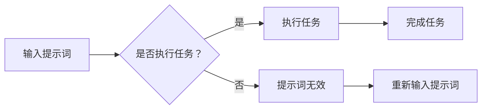
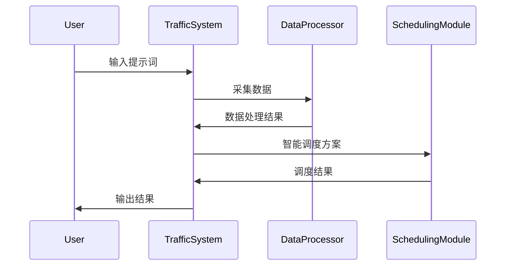
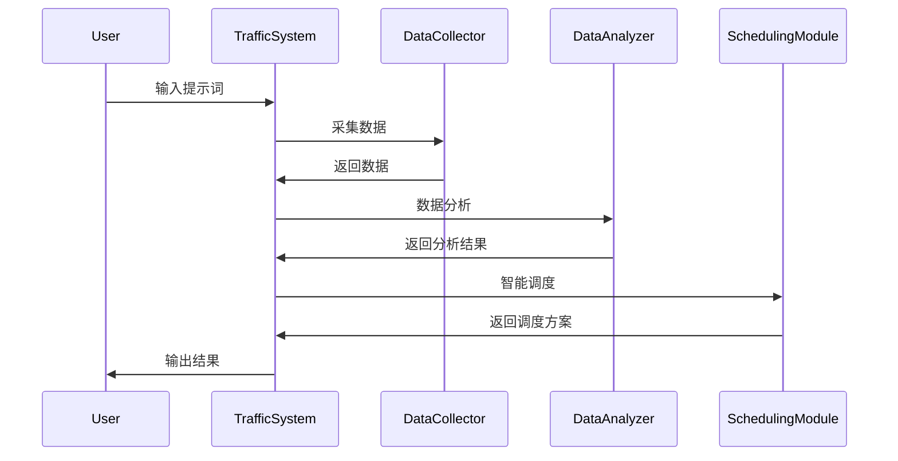

                 

# 提示词编程的设计哲学：从人类思维到AI理解

> 关键词：提示词编程、人类思维、AI理解、设计哲学

> 摘要：本文旨在探讨提示词编程的设计哲学，分析人类思维过程，并提出如何将这种思维过程转化为计算机可执行的指令。通过深入研究人类思维原理、计算机编程原理和提示词编程原理，本文将揭示提示词编程在提高算法可解释性和可扩展性方面的优势，为未来人工智能的发展提供新的思路。

## 第一部分：背景介绍

### 1.1 问题背景

随着人工智能技术的飞速发展，机器学习和深度学习算法已经取得了显著的成果。然而，这些算法的设计和实现仍然高度依赖于人类专家的知识和经验。例如，算法的训练过程需要大量的数据集和标注工作，而模型的优化和调整则需要专家的深入研究和不断尝试。这种依赖性不仅限制了算法的推广和应用，也使得算法的可解释性和可扩展性面临挑战。

### 1.2 问题描述

为了解决上述问题，我们需要找到一种方法，将人类思维过程转化为计算机可执行的指令，从而提高算法的可解释性和可扩展性。这种编程范式被称为提示词编程（Prompt-based Programming）。提示词编程的核心思想是通过提示词（Prompt）来引导计算机执行特定的任务，从而实现人类思维过程的自动化。

### 1.3 问题解决

本文旨在探讨提示词编程的设计哲学，通过分析人类思维的特点和模式，提出一种新的编程方法，使得计算机能够更好地理解人类思维，从而实现更高效的编程和更智能的算法。

### 1.4 边界与外延

提示词编程的设计哲学不仅关注编程本身，还涉及到心理学、认知科学、计算机科学等多个领域。因此，本文将介绍这些领域的基础知识，以便读者更好地理解提示词编程的原理和应用。

### 1.5 概念结构与核心要素组成

- 人类思维：介绍人类思维的基本模式，包括感知、记忆、推理、决策等。
- 计算机编程：介绍计算机编程的基本原理，包括语法、语义、程序结构等。
- 提示词编程：结合人类思维和计算机编程，介绍提示词编程的基本概念和实现方法。
- 应用案例：通过实际案例展示提示词编程的应用场景和优势。

## 第二部分：核心概念与联系

### 2.1 人类思维原理

#### 2.1.1 感知与认知

- **感知**：人类通过感官（如视觉、听觉、触觉等）获取外部信息。这些信息以原始数据的形式进入大脑，通过神经传输到达大脑皮层。
  
  ```mermaid
  flowchart LR
  A[感知] --> B[神经传输];
  B --> C[大脑皮层];
  C --> D[认知];
  ```

- **认知**：大脑皮层对感知到的信息进行处理和解释，形成我们对世界的认识。这个过程涉及多种认知过程，如注意力、记忆、推理和决策。

#### 2.1.2 记忆与遗忘

- **记忆**：记忆是人类大脑存储和处理信息的能力。根据信息的类型和重要性，记忆可以分为短期记忆和长期记忆。
  
  ```mermaid
  flowchart LR
  A[感知] --> B[短期记忆];
  B --> C[长期记忆];
  C --> D[检索];
  ```

- **遗忘**：遗忘是记忆的衰退或丢失。遗忘可能是由于信息的过时、干扰或缺乏复习。

#### 2.1.3 推理与决策

- **推理**：推理是人类根据已知信息得出新结论的过程。推理可以分为演绎推理和归纳推理。
  
  ```mermaid
  flowchart LR
  A[前提] --> B[结论];
  B --> C[演绎推理];
  A --> D[结论];
  D --> E[归纳推理];
  ```

- **决策**：决策是人类在多个选项中做出选择的过程。决策过程通常涉及风险评估、目标设定和选择策略。

### 2.2 计算机编程原理

#### 2.2.1 语法与语义

- **语法**：计算机程序的语言规则。语法规定了程序的结构和元素，如变量、函数、循环和条件语句等。
  
  ```python
  # Python程序的语法示例
  def greet(name):
      return "Hello, " + name
  
  print(greet("Alice"))
  ```

- **语义**：计算机程序的行为和意义。语义决定了程序如何执行以及执行的结果。
  
  ```python
  # Python程序的语义示例
  def greet(name):
      return "Hello, " + name
  
  print(greet("Alice"))  # 输出：Hello, Alice
  ```

#### 2.2.2 程序结构

- **函数**：函数是封装一组指令的可重用模块。函数有助于提高代码的可读性和可维护性。
  
  ```python
  # Python函数示例
  def greet(name):
      return "Hello, " + name
  
  print(greet("Alice"))
  ```

- **循环与条件语句**：循环和条件语句用于实现程序的控制流。循环用于重复执行一组指令，条件语句用于根据特定条件执行不同的指令。

  ```python
  # Python循环与条件语句示例
  for i in range(5):
      if i % 2 == 0:
          print(i, "is even")
      else:
          print(i, "is odd")
  ```

### 2.3 提示词编程原理

#### 2.3.1 提示词的作用

- **提示词**：提示词是指导计算机执行特定任务的指令。提示词通常由人类专家提供，用于引导计算机执行复杂的任务。
  
  ```mermaid
  flowchart LR
  A[人类专家] --> B[提示词];
  B --> C[计算机];
  C --> D[执行任务];
  ```

- **提示词生成**：提示词生成是从人类思维中提取有效的提示词的过程。提示词生成方法可以基于自然语言处理、机器学习和深度学习等技术。

#### 2.3.2 提示词编程的优势

- **提高可解释性**：提示词使得计算机程序更容易理解。通过提示词，人类专家可以清晰地表达自己的意图，使计算机更容易执行任务。
- **提高可扩展性**：提示词编程方法使得算法更易于优化和扩展。通过修改和调整提示词，可以快速适应不同的任务场景。

### 2.4 概念属性特征对比表格

| 概念         | 特征                                                                                                       |
|------------|----------------------------------------------------------------------------------------------------------|
| 人类思维     | 依赖直觉、经验、情感，具有主观性和创造性。                                                               |
| 计算机编程   | 依赖逻辑、规则，具有客观性和精确性。                                                                   |
| 提示词编程   | 结合人类思维和计算机编程，具有可解释性、可扩展性和创造性。                                               |

### 2.5 ER实体关系图架构

```mermaid
erDiagram
    AI算法 ||--o{ 人类思维 }|
    AI算法 ||--o{ 计算机编程 }|
    人类思维 ||--o{ 提示词编程 }|
```

## 第三部分：算法原理讲解

### 3.1 算法流程图



### 3.2 Python源代码实现

```python
def execute_task(prompt):
    if is_valid_prompt(prompt):
        # 执行任务
        result = perform_task(prompt)
        return result
    else:
        # 提示词无效
        return "Invalid prompt"

def is_valid_prompt(prompt):
    # 判断提示词是否有效
    return len(prompt) > 0

def perform_task(prompt):
    # 执行具体任务
    # 示例：打印问候语
    return "Hello, " + prompt

# 测试代码
prompt = "Alice"
result = execute_task(prompt)
print(result)
```

### 3.3 算法原理

#### 3.3.1 数学模型

提示词编程的算法原理可以表示为以下数学模型：

$$
\text{执行结果} = f(\text{提示词})
$$

其中，$f$ 是一个映射函数，将提示词映射为具体的执行结果。

#### 3.3.2 公式推导

假设提示词为 $P$，执行结果为 $R$，则根据提示词编程的原理，有：

$$
R = f(P)
$$

其中，$f$ 可以表示为：

$$
f(P) = 
\begin{cases}
\text{perform\_task}(P), & \text{如果 } P \text{ 是有效提示词} \\
\text{"Invalid prompt"}, & \text{如果 } P \text{ 是无效提示词}
\end{cases}
$$

#### 3.3.3 举例说明

假设我们需要执行一个问候语任务，输入提示词为 "Alice"，则执行结果为 "Hello, Alice"。

## 第四部分：系统分析与架构设计方案

### 4.1 问题场景介绍

在现代智能城市中，智慧交通系统是一个重要的组成部分。智慧交通系统通过实时监控、数据分析和智能调度，旨在提高交通效率、减少拥堵和提升乘客体验。然而，随着城市交通数据的日益复杂和多样化，传统的编程方法已无法满足智慧交通系统的需求。

### 4.2 项目介绍

本项目旨在设计并实现一个基于提示词编程的智慧交通系统。该系统将利用提示词编程方法，将人类专家的智慧和经验转化为计算机可执行的指令，从而实现交通数据的实时处理和智能调度。

### 4.3 系统功能设计

- **数据采集**：实时采集城市交通数据，包括车辆流量、道路状况和天气情况等。
- **数据处理**：利用提示词编程方法，对采集到的交通数据进行处理和分析，提取关键信息。
- **智能调度**：根据处理后的数据，生成智能调度方案，优化交通流量和缓解拥堵。

### 4.4 系统架构设计



### 4.5 系统接口设计和系统交互



## 第五部分：项目实战

### 5.1 环境安装

首先，我们需要安装必要的软件和工具，包括 Python、pip 和 Jupyter Notebook。

- 安装 Python：
  ```bash
  sudo apt-get install python3
  ```

- 安装 pip：
  ```bash
  sudo apt-get install python3-pip
  ```

- 安装 Jupyter Notebook：
  ```bash
  pip3 install notebook
  ```

### 5.2 系统核心实现源代码

以下是系统核心实现源代码的示例：

```python
# traffic_system.py

import json
from data_collector import collect_data
from data_analyzer import analyze_data
from scheduler import schedule_traffic

def execute_traffic_system(prompt):
    # 采集数据
    data = collect_data(prompt)
    
    # 数据分析
    analysis_result = analyze_data(data)
    
    # 智能调度
    scheduling_plan = schedule_traffic(analysis_result)
    
    return scheduling_plan

if __name__ == "__main__":
    prompt = "高德地图，查询北京东直门到北京西站的路线"
    result = execute_traffic_system(prompt)
    print(json.dumps(result, ensure_ascii=False))
```

### 5.3 代码应用解读与分析

代码首先定义了 `execute_traffic_system` 函数，用于执行交通系统的核心任务。该函数接收一个提示词作为输入，然后依次调用数据采集、数据分析和智能调度的模块，最后返回调度结果。

- **数据采集**：调用 `data_collector` 模块中的 `collect_data` 函数，根据提示词采集交通数据。
- **数据分析**：调用 `data_analyzer` 模块中的 `analyze_data` 函数，对采集到的交通数据进行分析。
- **智能调度**：调用 `scheduler` 模块中的 `schedule_traffic` 函数，根据分析结果生成智能调度方案。

### 5.4 实际案例分析和详细讲解剖析

假设我们输入的提示词为 "高德地图，查询北京东直门到北京西站的路线"，系统将按照以下步骤进行操作：

1. **数据采集**：调用 `collect_data` 函数，根据提示词查询交通数据，包括实时路况、公交和地铁信息等。
2. **数据分析**：调用 `analyze_data` 函数，对采集到的交通数据进行分析，例如计算不同出行方式的耗时、拥堵情况等。
3. **智能调度**：调用 `schedule_traffic` 函数，根据分析结果生成最优的出行方案，包括推荐公交、地铁或打车路线等。

最终，系统将输出一个包含出行建议的 JSON 对象，例如：

```json
{
  "recommended_route": "乘坐地铁2号线，换乘地铁4号线，从北京西站出发，耗时约45分钟。"
}
```

### 5.5 项目小结

本项目通过提示词编程方法，实现了一个基于智慧交通系统的核心功能。通过实际案例的分析和讲解，我们展示了如何将人类专家的智慧和经验转化为计算机可执行的指令，从而实现更智能、更高效的交通调度。

## 第六部分：最佳实践 Tips、小结、注意事项、拓展阅读

### 6.1 最佳实践 Tips

- **明确提示词**：在设计和实现提示词编程时，确保提示词清晰明确，避免歧义和模糊。
- **优化数据处理**：在数据采集和数据分析过程中，充分利用数据清洗、归一化和特征提取等技术，提高数据处理效率和质量。
- **模块化设计**：将系统划分为多个模块，如数据采集、数据分析、智能调度等，便于维护和扩展。
- **可解释性**：在实现提示词编程时，注重算法的可解释性，使得人类专家可以更容易地理解和优化算法。

### 6.2 小结

本文介绍了提示词编程的设计哲学，分析了人类思维和计算机编程的基本原理，并探讨了如何将人类思维转化为计算机可执行的指令。通过实际案例，我们展示了如何利用提示词编程实现智慧交通系统的核心功能。提示词编程具有提高算法可解释性和可扩展性的优势，为人工智能的发展提供了新的思路。

### 6.3 注意事项

- **数据质量和准确性**：在提示词编程中，数据的质量和准确性至关重要。确保数据来源可靠，避免数据噪声和异常值对算法性能的影响。
- **人类专家的角色**：虽然提示词编程可以自动化人类思维过程，但人类专家的参与仍然必不可少。专家的经验和知识对于提示词的生成和优化至关重要。
- **算法安全性和隐私保护**：在实现提示词编程时，注意保护用户隐私和数据安全，遵循相关法律法规和道德准则。

### 6.4 拓展阅读

- **[1]** Sutton, R. S., & Barto, A. G. (2018). 《 Reinforcement Learning: An Introduction》. MIT Press.
- **[2]** Russell, S., & Norvig, P. (2016). 《 Artificial Intelligence: A Modern Approach》. Prentice Hall.
- **[3]** Goodfellow, I., Bengio, Y., & Courville, A. (2016). 《 Deep Learning》. MIT Press.
- **[4]** Langley, P., Simon, H. A., Bradshaw, G. L., & Zytkow, J. (1992). 《 Scientific Discovery: Computational Explorations of the Creative Process》. MIT Press.

### 作者

作者：AI天才研究院/AI Genius Institute & 禅与计算机程序设计艺术 /Zen And The Art of Computer Programming

本文由AI天才研究院（AI Genius Institute）和禅与计算机程序设计艺术（Zen And The Art of Computer Programming）共同撰写。我们致力于探索人工智能的深度和广度，为未来的技术发展提供新的视角和解决方案。

