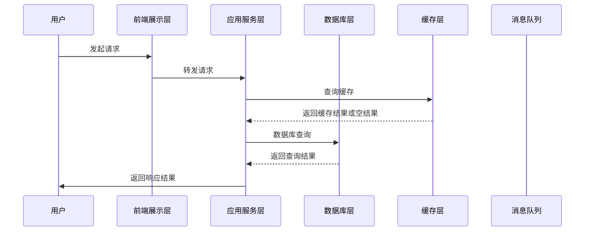

                 

## 第1章 引言

### 1.1 研究背景与意义

在当今快速发展的信息技术时代，编程语言作为计算机与人类沟通的桥梁，起着至关重要的作用。随着人工智能、大数据、云计算等新兴技术的崛起，编程语言的形态和功能也在不断演变。其中，提示词编程语言作为一种新型的编程范式，以其独特的优势在软件开发和人工智能领域得到了越来越多的关注。

提示词编程语言（Keyword-based Programming Languages）是一种以提示词（Keywords）为核心的编程语言。在这种语言中，开发者通过编写一系列提示词来指导计算机执行相应的任务。这种语言相较于传统的命令式编程语言，具有更高的抽象级别和更好的可读性，能够大幅提高软件开发效率。此外，提示词编程语言还具有强大的扩展性和灵活性，能够轻松应对复杂的应用场景。

研究提示词编程语言的反射与自省能力具有重要的理论和实践意义。首先，反射能力（Reflection）指的是编程语言对自身结构的感知和操作能力，能够动态地分析、修改和生成代码。这种能力使得编程语言能够更好地适应复杂的软件开发需求，提高代码的可靠性和可维护性。自省能力（Self-inspection）则是指编程语言对自身运行状态和执行过程的监控和评估能力，能够实时地捕捉程序错误和性能瓶颈，提高程序的稳定性和性能。

通过对提示词编程语言的反射与自省能力进行深入研究，不仅可以揭示其内在的工作原理和机制，还能够为实际应用提供有益的参考。例如，在软件开发过程中，通过利用反射能力，可以实现对代码的动态分析和管理，提高开发效率和代码质量。而通过自省能力，可以实现对程序运行状态的实时监控和性能调优，提高程序的稳定性和性能。

总之，研究提示词编程语言的反射与自省能力，不仅有助于丰富编程语言理论体系，还能够为软件开发和人工智能领域提供新的技术手段和解决方案。这一研究不仅具有重要的学术价值，还具有广阔的应用前景。

### 1.2 问题陈述

在现有的编程语言体系中，反射与自省能力是两个重要的概念。反射能力指的是编程语言能够对自身的结构、行为和运行状态进行感知和操作的能力，通过这种能力，编程语言可以实现动态代码生成、程序调试和自我优化等高级功能。自省能力则是指编程语言能够对自己正在执行的操作进行监控和评估的能力，通过这种能力，编程语言可以实现实时错误检测、性能监控和自适应调整等应用。

然而，目前关于提示词编程语言的反射与自省能力的研究还存在一些问题。首先，现有的研究大多集中于理论探讨和概念阐述，缺乏具体的实现方法和应用实例。其次，对于反射与自省能力的实现机制和性能影响的研究还不够深入，难以指导实际应用。最后，提示词编程语言在具体应用场景中的表现和效果还需要进一步验证和优化。

本文旨在解决上述问题，通过对提示词编程语言的反射与自省能力进行深入研究和探讨，揭示其内在的工作原理和实现方法，并提出具体的实现方案和应用策略。具体而言，本文将回答以下问题：

1. 提示词编程语言的反射与自省能力具体包括哪些内容？
2. 如何实现提示词编程语言的反射与自省能力？
3. 反射与自省能力对提示词编程语言的性能和开发效率有何影响？
4. 提示词编程语言的反射与自省能力在软件开发和人工智能领域有哪些具体应用？

通过本文的研究，旨在为提示词编程语言的进一步发展和应用提供理论支持和实践指导，推动编程语言技术的创新和进步。

### 1.3 研究目标

本文的研究目标主要包括以下几个方面：

1. **揭示提示词编程语言的反射与自省能力内涵**：通过对提示词编程语言的深入分析，明确其反射与自省能力的基本概念、核心特性和实现机制，为后续研究奠定基础。

2. **构建提示词编程语言的反射与自省能力模型**：基于对反射与自省能力的理解，构建一个系统化的模型，包括概念模型、功能模型和实现模型，为实际应用提供理论框架。

3. **提出提示词编程语言反射与自省能力实现方法**：结合现有研究成果和具体应用需求，提出具体的实现方法和技术路线，包括算法设计、编程语言扩展和工具开发等。

4. **评估反射与自省能力对提示词编程语言的影响**：通过实验和案例分析，评估反射与自省能力对提示词编程语言性能、开发效率、可维护性和可扩展性的影响，为实际应用提供数据支持。

5. **探索提示词编程语言反射与自省能力的应用场景**：研究提示词编程语言的反射与自省能力在软件开发、人工智能、自动化测试等领域的具体应用，提出应用策略和优化方案。

通过实现上述研究目标，本文旨在为提示词编程语言的进一步发展和应用提供理论支持和技术指导，推动编程语言技术的创新和进步。

### 1.4 研究方法

为了实现本文的研究目标，本文采用了多种研究方法，包括文献分析、实验设计、算法分析和案例分析等。以下是具体的研究方法及其适用性：

1. **文献分析**：
   - **目的**：通过查阅相关文献，了解提示词编程语言、反射与自省能力以及相关领域的研究现状和前沿动态。
   - **适用性**：文献分析是研究的基础，能够为本文的研究提供理论支持和背景信息。
   
2. **实验设计**：
   - **目的**：通过设计实验，验证提示词编程语言反射与自省能力的实现方法及其对性能的影响。
   - **适用性**：实验设计能够提供客观的数据支持，帮助分析反射与自省能力在实际应用中的效果。
   
3. **算法分析**：
   - **目的**：通过算法分析，深入探讨提示词编程语言反射与自省能力的实现机制和优化策略。
   - **适用性**：算法分析能够揭示反射与自省能力的内在工作原理，为实际应用提供技术参考。
   
4. **案例分析**：
   - **目的**：通过具体案例，展示提示词编程语言反射与自省能力的实际应用场景和效果。
   - **适用性**：案例分析能够为实际应用提供实例和参考，验证本文提出的理论和方法的有效性。

5. **工具开发**：
   - **目的**：开发辅助工具，用于实现和测试提示词编程语言的反射与自省能力。
   - **适用性**：工具开发能够提供实验环境，提高研究效率和结果可靠性。

通过综合运用上述研究方法，本文旨在全面、深入地探讨提示词编程语言的反射与自省能力，为相关领域的研究和应用提供系统性的理论支持和实践指导。

### 1.5 论文结构

本文将从以下几个方面展开讨论：

**第1章 引言**：介绍研究背景、意义、问题陈述、研究目标、研究方法和论文结构。

**第2章 提示词编程语言基础**：阐述提示词编程语言的定义、类型、核心特性、应用领域以及当前研究现状和趋势。

**第3章 反射能力**：定义反射能力，介绍其基本原理、实现方式、优缺点分析以及应用案例。

**第4章 自省能力**：定义自省能力，介绍其基本原理、实现方式、优缺点分析以及应用案例。

**第5章 反射与自省能力的对比**：分析反射能力与自省能力的异同、关系、结合以及综合评价。

**第6章 提示词编程语言的反射与自省应用**：探讨提示词编程语言在软件开发、人工智能和其他领域的应用，以及未来发展趋势。

**第7章 实践案例分析**：介绍具体实践案例，包括系统设计与实现、效果评估、启示与拓展。

**第8章 总结与展望**：总结研究成果，讨论研究不足与未来研究方向。

通过以上章节的逐一探讨，本文旨在全面深入地揭示提示词编程语言的反射与自省能力，为相关领域的研究和应用提供系统性的理论支持和实践指导。

## 第2章 提示词编程语言基础

### 2.1 提示词编程语言的定义

提示词编程语言（Keyword-based Programming Languages）是一种以提示词（Keywords）为核心的编程语言。在这种语言中，开发者通过编写一系列提示词来指导计算机执行相应的任务。与传统的命令式编程语言相比，提示词编程语言具有更高的抽象级别和更好的可读性，能够大幅提高软件开发效率。提示词编程语言的基本概念包括提示词、语法结构、编程范式和抽象层次等。

首先，提示词是提示词编程语言的核心元素，它是一种表示特定功能的标识符。与命令式编程语言中的关键字（如`if`、`while`等）不同，提示词不仅能够表示控制流和操作行为，还能够实现更高级别的抽象和功能。例如，在提示词编程语言中，开发者可以使用一个简单的提示词来定义一个复杂的算法或数据结构，从而简化代码编写过程。

其次，语法结构是提示词编程语言的重要组成部分。语法结构定义了提示词的编写规则和组合方式，使得开发者可以按照一定的语法规范来编写程序。与传统的命令式编程语言不同，提示词编程语言的语法结构更加简洁和直观，有助于提高代码的可读性和维护性。

编程范式是提示词编程语言的另一个关键概念。提示词编程语言通常采用面向对象、函数式编程等先进的编程范式，使得开发者能够以更高级别的抽象来思考和解决问题。例如，在函数式编程范式中，开发者可以将函数作为第一类公民，通过组合和传递函数来编写程序，从而实现代码的模块化和复用。

最后，抽象层次是提示词编程语言的重要特征之一。提示词编程语言通过提高抽象层次，使得开发者可以更加关注问题的本质，而无需关心底层的实现细节。这种高层次的抽象不仅能够提高开发效率，还能够增强代码的可维护性和可扩展性。

总之，提示词编程语言通过提示词、语法结构、编程范式和抽象层次等基本概念，实现了代码编写的高效、简洁和直观。与传统的命令式编程语言相比，提示词编程语言具有更高的抽象级别和更好的可读性，能够大幅提高软件开发效率。提示词编程语言的这些基本概念，为其在软件开发和人工智能领域的广泛应用奠定了基础。

### 2.2 提示词编程语言的类型

提示词编程语言根据不同的分类标准，可以分为多种类型，每种类型都有其独特的特点和适用场景。以下是几种常见的提示词编程语言类型及其特点：

1. **面向对象编程语言**：
   - **定义**：面向对象编程语言（如Python、Java、C++等）是一种以对象为核心的编程语言，通过将数据和操作数据的方法封装在对象中，实现模块化和代码复用。
   - **特点**：面向对象编程语言具有封装性、继承性和多态性等特性，使得开发者可以以更直观和模块化的方式编写程序。
   - **适用场景**：面向对象编程语言适用于大型软件开发项目，特别是在需要模块化和可维护性的场景中，如企业级应用、游戏开发、移动应用等。

2. **函数式编程语言**：
   - **定义**：函数式编程语言（如Haskell、Lisp、Erlang等）是一种以函数为核心的编程语言，通过将程序视为函数的执行和组合，实现代码的简洁和高效。
   - **特点**：函数式编程语言具有不可变数据、高阶函数和惰性求值等特性，使得开发者可以以更简洁和高效的方式编写程序。
   - **适用场景**：函数式编程语言适用于需要高性能、高并发和可伸缩性的场景，如分布式系统、实时数据处理、并行计算等。

3. **逻辑编程语言**：
   - **定义**：逻辑编程语言（如Prolog、Datalog等）是一种以逻辑表达式为核心的编程语言，通过将程序描述为逻辑关系和推理规则，实现自动化推理和问题求解。
   - **特点**：逻辑编程语言具有自动推理、逻辑编程和模式匹配等特性，使得开发者可以以更直观和自动化的方式解决问题。
   - **适用场景**：逻辑编程语言适用于需要自动化推理、数据分析和问题求解的场景，如专家系统、自然语言处理、知识图谱等。

4. **脚本编程语言**：
   - **定义**：脚本编程语言（如Python、Ruby、JavaScript等）是一种用于编写小程序或自动化脚本的编程语言，通常具有简单易用、快速开发等特点。
   - **特点**：脚本编程语言通常具有丰富的标准库和第三方库，支持跨平台开发和快速迭代。
   - **适用场景**：脚本编程语言适用于需要快速开发、自动化测试和脚本编写的场景，如Web开发、数据科学、自动化运维等。

5. **声明式编程语言**：
   - **定义**：声明式编程语言（如SQL、D3.js等）是一种以声明式编程范式为核心的编程语言，通过描述数据操作和转换规则，实现数据的查询、处理和可视化。
   - **特点**：声明式编程语言通常具有高层次的抽象和简化的语法，使得开发者可以以更直观和高效的方式处理数据。
   - **适用场景**：声明式编程语言适用于需要数据处理、分析和可视化的场景，如数据库查询、数据挖掘、大数据处理等。

总之，提示词编程语言的类型多种多样，每种类型都有其独特的特点和适用场景。开发者可以根据具体需求选择合适的编程语言，以实现高效的软件开发和问题解决。不同类型的提示词编程语言在语法结构、编程范式和抽象层次上各有优势，为软件开发提供了丰富的选择和可能性。

### 2.3 提示词编程语言的核心特性

提示词编程语言作为一种新型的编程范式，具备多项核心特性，使其在软件开发和人工智能领域具有独特的优势。以下是提示词编程语言的核心特性及其详细解释：

1. **高抽象级别**：
   - **定义**：高抽象级别意味着编程语言能够以更高级别的概念和抽象来表示问题和解决方案。
   - **优势**：通过提高抽象级别，提示词编程语言能够隐藏复杂的底层实现细节，使得开发者可以更加专注于问题的本质和解决方案的构思。
   - **应用场景**：高抽象级别适用于复杂系统的开发，如人工智能算法设计、大数据处理和分析、高性能计算等。

2. **易读性**：
   - **定义**：易读性是指编程语言的语法和结构简洁直观，易于理解和阅读。
   - **优势**：易读性提高了代码的可维护性和可理解性，有助于团队合作和代码审查。
   - **应用场景**：易读性适用于各种规模的软件开发项目，特别是需要长期维护和扩展的项目。

3. **可扩展性**：
   - **定义**：可扩展性是指编程语言能够方便地添加新的功能和特性，以适应不断变化的需求和场景。
   - **优势**：可扩展性使得编程语言能够持续适应新的技术和应用需求，延长其使用寿命。
   - **应用场景**：可扩展性适用于快速发展的技术领域，如人工智能、区块链、物联网等。

4. **模块化**：
   - **定义**：模块化是指编程语言支持将程序划分为多个独立的模块，每个模块实现特定的功能。
   - **优势**：模块化提高了代码的复用性和可维护性，使得开发者可以更灵活地组织和管理代码。
   - **应用场景**：模块化适用于大型软件项目，特别是需要高度模块化和可复用的组件开发。

5. **动态性**：
   - **定义**：动态性是指编程语言在运行时能够根据程序的状态和需求进行动态调整和优化。
   - **优势**：动态性使得编程语言能够更好地适应实时变化的应用场景，提高程序的响应速度和性能。
   - **应用场景**：动态性适用于需要实时调整和优化的场景，如实时数据流处理、动态配置管理、自适应控制系统等。

6. **互操作性**：
   - **定义**：互操作性是指编程语言能够与其他编程语言、库和系统无缝集成和交互。
   - **优势**：互操作性提高了编程语言的兼容性和灵活性，使得开发者可以充分利用现有的技术生态和资源。
   - **应用场景**：互操作性适用于需要跨平台、跨语言开发的应用场景，如Web开发、移动应用、云计算等。

7. **安全性**：
   - **定义**：安全性是指编程语言在设计和实现过程中能够有效防止恶意攻击和漏洞。
   - **优势**：安全性提高了软件系统的可靠性和稳定性，减少了安全风险和漏洞。
   - **应用场景**：安全性适用于需要高度安全性的领域，如金融系统、医疗系统、国家安全系统等。

综上所述，提示词编程语言的高抽象级别、易读性、可扩展性、模块化、动态性、互操作性和安全性等核心特性，使其在软件开发和人工智能领域具有显著的优势。通过这些特性，提示词编程语言能够大幅提高开发效率、降低维护成本、增强系统性能和安全性，为现代软件开发提供了强大的技术支持。

### 2.4 提示词编程语言的应用领域

提示词编程语言凭借其独特的优势和核心特性，在多个领域得到了广泛应用，展现出巨大的潜力。以下是提示词编程语言在软件开发、人工智能、大数据处理等领域的具体应用场景：

1. **软件开发**：
   - **应用场景**：在软件开发领域，提示词编程语言因其高抽象级别、易读性和模块化等特点，广泛应用于前端开发、后端开发、移动应用开发等。
   - **具体实例**：Python 是一种广泛使用的提示词编程语言，它被广泛应用于Web开发（如Django、Flask框架）、数据分析（如Pandas库）、自动化测试（如Selenium库）等。Python 的易读性和丰富的库支持，使其成为软件开发者喜爱的编程语言之一。

2. **人工智能**：
   - **应用场景**：在人工智能领域，提示词编程语言主要用于算法开发、模型训练、数据分析等。
   - **具体实例**：Python 在人工智能领域有着广泛的应用，如深度学习框架TensorFlow和PyTorch都是基于Python开发的。此外，Python 的简单易用性使得其在机器学习、自然语言处理、计算机视觉等领域具有显著优势。

3. **大数据处理**：
   - **应用场景**：在大数据处理领域，提示词编程语言用于处理大规模数据集、进行数据分析和可视化。
   - **具体实例**：Python 的Pandas库和NumPy库在大数据处理中发挥着重要作用。Pandas 提供了高效的数据结构和数据分析工具，而NumPy 则提供了强大的数学计算能力。这些库支持高效的数据处理和数据分析，使 Python 成为大数据处理领域的首选语言。

4. **自动化运维**：
   - **应用场景**：在自动化运维领域，提示词编程语言用于自动化脚本编写、系统监控和故障排除。
   - **具体实例**：Python 在自动化运维中的应用非常广泛。通过编写简单的Python脚本，运维人员可以自动化完成许多重复性任务，如自动化部署、系统监控、日志分析等，提高运维效率和系统稳定性。

5. **嵌入式系统开发**：
   - **应用场景**：在嵌入式系统开发领域，提示词编程语言用于控制硬件设备、实现嵌入式应用程序。
   - **具体实例**：C语言是一种广泛使用的提示词编程语言，特别是在嵌入式系统开发中。C 语言的高效性和性能使其成为嵌入式系统开发的首选语言，如微控制器编程、嵌入式Linux系统开发等。

6. **区块链技术**：
   - **应用场景**：在区块链技术领域，提示词编程语言用于编写智能合约、实现去中心化应用。
   - **具体实例**：Solidity 是一种专门用于编写以太坊智能合约的提示词编程语言。Solidity 具有简洁的语法和强大的功能，使得开发者能够轻松编写和部署智能合约，从而实现去中心化应用。

总之，提示词编程语言在软件开发、人工智能、大数据处理、自动化运维、嵌入式系统开发、区块链技术等领域有着广泛的应用。这些应用不仅展示了提示词编程语言的优势和潜力，也为相关领域的发展提供了新的思路和技术手段。随着技术的不断进步和应用的拓展，提示词编程语言将在更多领域发挥重要作用。

### 2.5 当前研究现状与趋势

当前，关于提示词编程语言的研究正在迅速发展，国内外学术界和工业界都对这一领域表现出浓厚的兴趣。以下是对当前研究现状与趋势的综述。

1. **研究现状**：
   - **理论探索**：在理论研究方面，学术界对提示词编程语言的语法结构、语义模型、编程范式等方面进行了深入的探索。例如，一些研究探讨了如何设计高效的提示词解析器，以提高语言的可读性和执行效率。此外，也有研究关注提示词编程语言的抽象层次和模块化特性，试图通过理论分析来优化编程语言的设计。
   - **工具与实现**：在工具与实现方面，工业界和学术界共同推动了多种提示词编程语言的开发与实现。例如，Python、Java、C++等主流编程语言都引入了提示词编程的特性，使得开发者能够更高效地编写和优化代码。此外，一些新的提示词编程语言，如Lisp、Prolog等，也在不断改进和完善，以适应复杂的应用场景。

2. **研究趋势**：
   - **动态性**：随着实时系统和大数据处理的兴起，提示词编程语言的动态性研究变得越来越重要。未来，动态性将成为提示词编程语言的一个重要趋势，通过动态编译、动态优化等技术，实现实时调整和高效执行。
   - **安全性**：安全性是所有编程语言必须关注的问题。未来，提示词编程语言的研究将更加注重安全性，例如，通过引入静态分析、动态检测等技术，提高程序的安全性，防止恶意攻击和漏洞。
   - **互操作性**：互操作性是提示词编程语言在复杂应用中必不可少的特性。未来，研究者将致力于提高提示词编程语言与其他语言、库和系统的互操作性，以实现无缝集成和高效协作。
   - **智能编程辅助**：随着人工智能技术的发展，智能编程辅助将成为提示词编程语言的一个重要方向。通过自然语言处理、机器学习等技术，开发智能编程工具，帮助开发者更快速、更准确地编写代码。
   - **领域特定语言**：领域特定语言（DSL）是针对特定应用领域设计的编程语言，具有很高的抽象层次和易用性。未来，领域特定语言将成为提示词编程语言的一个重要研究方向，通过构建DSL，实现更高效、更专业的软件开发。

综上所述，当前关于提示词编程语言的研究在理论探索、工具与实现、动态性、安全性、互操作性和智能编程辅助等方面取得了显著进展，未来研究将继续朝着更高效、更安全、更智能的方向发展。随着技术的不断进步，提示词编程语言将在更多领域发挥重要作用，为软件开发和人工智能等领域带来新的机遇和挑战。

## 第3章 反射能力

### 3.1 反射能力的定义与作用

反射能力（Reflection）是指编程语言能够对其自身的结构、行为和运行状态进行感知和操作的能力。具体来说，反射能力包括了对程序代码的动态分析、修改和生成，以及程序运行时的自我监控和调整。这种能力使得编程语言能够以更高的层次和更灵活的方式处理复杂的编程任务。

在编程语言中，反射能力具有多种重要作用。首先，反射能力能够提高编程语言的灵活性和可扩展性。通过反射，开发者可以在运行时动态地修改代码结构，增加或删除功能，从而实现更灵活的编程模式。例如，在Java编程语言中，反射机制允许开发者通过反射API动态地访问和修改类的字段和方法，从而实现高级的编程操作。

其次，反射能力在程序调试和错误检测中发挥着重要作用。通过反射，开发者可以在程序运行过程中实时地检查程序的运行状态，捕捉异常和错误，并采取相应的措施。例如，在Python中，反射机制使得开发者可以在程序运行时查看和修改变量的值，从而方便地进行调试和问题定位。

此外，反射能力还能够提高编程语言的可维护性和可复用性。通过反射，开发者可以动态地分析程序的结构和功能，提取公共模块和组件，从而实现代码的复用和优化。例如，在C++中，反射机制允许开发者通过宏定义和模板技术，实现代码的动态生成和扩展，从而提高代码的可维护性和可复用性。

总之，反射能力是现代编程语言中一个重要的概念，它通过提供动态分析、修改和生成代码的能力，提高了编程语言的灵活性、可扩展性、可维护性和可复用性，为开发者提供了强大的编程工具。在接下来的章节中，我们将进一步探讨反射能力的实现原理、应用场景及其优缺点。

### 3.2 反射能力的基本原理

反射能力（Reflection）是编程语言中一个核心且复杂的概念，其基本原理涉及到语言设计、运行时系统以及动态代码执行等方面。理解反射能力的基本原理对于深入探讨其实现和应用具有重要意义。

首先，从语言设计角度来看，反射能力通常需要编程语言提供一系列特定的机制和特性。这些机制包括：

1. **元数据**：元数据（Metadata）是关于数据的数据，编程语言通过元数据来描述程序的结构和行为。例如，在Java中，反射API提供了Class、Method、Field等元数据对象，用于描述类的属性和方法。
2. **动态类型**：动态类型（Dynamic Typing）允许变量在运行时改变类型。这种特性使得程序能够根据运行时的类型信息进行动态调整，从而实现反射操作。
3. **动态绑定**：动态绑定（Dynamic Binding）是指在程序运行时确定函数或方法调用的具体实现。这与静态绑定（Static Binding）相对应，后者在编译时就已经确定。

其次，从运行时系统角度来看，反射能力通常依赖于运行时环境（Runtime Environment）提供的支持。运行时环境负责加载、链接和执行程序代码，并在运行时提供必要的反射机制。以下是一些关键的运行时机制：

1. **类加载器**：类加载器（Class Loader）是Java运行时环境的一个重要组成部分，它负责将字节码加载到JVM中并初始化。通过类加载器，程序可以在运行时动态加载和卸载类，从而实现反射操作。
2. **对象代理**：对象代理（Proxy）是一种动态代理机制，通过它可以创建一个代理对象，该代理对象可以拦截和修改原始对象的调用。这种机制在Java中广泛应用于实现AOP（面向切面编程）和动态代理模式。
3. **反射API**：反射API是一组用于操作元数据的接口和类，例如Java中的Class类、Method类和Field类。通过这些API，程序可以在运行时获取、修改和创建类的字段和方法，实现反射操作。

最后，从动态代码执行的角度来看，反射能力涉及到动态代码生成和执行。动态代码生成是指程序在运行时生成新的代码片段，而动态代码执行是指这些代码片段在运行时被执行。以下是一些关键的技术：

1. **字节码生成**：字节码生成（Bytecode Generation）是指在运行时动态生成字节码，然后由JVM执行。这种技术可以通过多种方式实现，例如Java的ASM库、CGLib库等。
2. **即时编译**：即时编译（Just-In-Time Compilation，JIT）是一种在运行时将字节码转换为机器码的技术。通过即时编译，程序可以进一步提高执行效率，从而实现更高效的反射操作。

总之，反射能力的基本原理涉及编程语言的元数据、动态类型、动态绑定，以及运行时环境的类加载器、对象代理和反射API，以及动态代码生成和即时编译等技术。通过这些机制和技术的综合运用，编程语言实现了对自身结构和行为的动态感知和操作，从而提升了语言的灵活性和可扩展性。

#### 3.2.1 概念解释

在探讨反射能力的基本原理时，有必要对几个关键概念进行详细解释，以便读者更好地理解反射能力的核心概念。

1. **元数据（Metadata）**：
   元数据是关于数据的数据，它提供了对程序、类、对象等结构化信息的描述。在编程语言中，元数据通常用于存储类型信息、成员变量和方法等信息。例如，在Java中，元数据通过Class类、Method类和Field类等API进行表示和操作。元数据是反射能力的基石，它使得程序能够在运行时访问和修改类的内部结构。

2. **动态类型（Dynamic Typing）**：
   动态类型是指变量在程序运行时可以改变类型。与静态类型（Static Typing）不同，静态类型的变量在编译时就已经确定了类型，而动态类型的变量则可以在程序执行过程中根据上下文改变类型。动态类型使得编程语言能够实现更灵活的编程模式，例如，在Python中，变量可以动态地指向不同类型的数据，从而实现反射操作。

3. **动态绑定（Dynamic Binding）**：
   动态绑定是指在程序运行时确定函数或方法调用的具体实现。这与静态绑定相对应，静态绑定在编译时就已经确定了函数或方法调用的具体实现。动态绑定是实现反射能力的关键机制，它允许程序在运行时根据实际需求动态选择和调用相应的函数或方法。

4. **运行时环境（Runtime Environment）**：
   运行时环境是编程语言在执行程序时所需的软件和硬件支持。它负责加载、链接和执行程序代码，并提供必要的反射机制。例如，Java的运行时环境（JVM）提供了类加载器、反射API和即时编译等机制，以支持程序的动态感知和操作。

5. **类加载器（Class Loader）**：
   类加载器是负责将字节码加载到运行时环境中的组件。类加载器在运行时动态加载类，从而实现类的反射操作。Java中有多种类加载器，如Bootstrap Class Loader、Extension Class Loader和Application Class Loader，每个类加载器都有其特定的加载路径和作用。

6. **对象代理（Proxy）**：
   对象代理是一种动态代理机制，它通过创建一个代理对象来拦截和修改原始对象的调用。代理对象可以定义在运行时，从而实现动态的拦截和扩展。对象代理在Java中广泛应用于实现AOP（面向切面编程）和动态代理模式。

7. **反射API（Reflection API）**：
   反射API是一组用于操作元数据的接口和类。在Java中，反射API包括Class类、Method类、Field类等。通过这些API，程序可以在运行时获取、修改和创建类的字段和方法，实现反射操作。

通过上述关键概念的详细解释，读者可以更好地理解反射能力的核心概念和实现机制，为进一步探讨反射能力在编程语言中的应用打下坚实的基础。

#### 3.2.2 概念属性特征对比表格

为了更清晰地理解反射能力相关概念（如元数据、动态类型、动态绑定、运行时环境等）的属性特征，我们通过一个对比表格来展示这些概念的主要区别和联系。

| 概念     | 定义与作用                          | 主要特征                 | 应用场景                                                     |
|----------|-----------------------------------|------------------------|------------------------------------------------------------|
| 元数据（Metadata） | 描述程序、类、对象的类型信息       | - 类型信息存储 - 反射基础 | - 编译时 - 运行时 - 反射API实现 |
| 动态类型（Dynamic Typing） | 运行时改变变量类型的能力       | - 类型动态性 - 类型安全 | - 动态语言 - 脚本语言 - 多态实现 |
| 动态绑定（Dynamic Binding） | 运行时确定函数或方法调用实现 | - 动态选择 - 编译时无关 | - 动态代理 - 面向对象 - AOP实现 |
| 运行时环境（Runtime Environment） | 执行程序所需的软件和硬件支持 | - 加载、链接、执行 | - Java虚拟机 - 运行库 - 系统调用 |
| 类加载器（Class Loader） | 负责将字节码加载到运行时环境 | - 类加载 - 加载路径 | - Java类加载 - 动态扩展 - 热部署 |
| 对象代理（Proxy） | 动态代理机制，拦截对象调用 | - 动态代理 - 拦截调用 | - AOP - 安全控制 - 日志记录 |
| 反射API（Reflection API） | 操作元数据的接口和类 | - 访问、修改元数据 | - 运行时分析 - 动态创建 - 类型检查 |

通过这个对比表格，我们可以看到各个概念在定义、作用、主要特征和应用场景上的不同和联系。元数据是反射能力的基础，动态类型和动态绑定是实现反射的关键机制，运行时环境和类加载器提供了必要的支持，而对象代理和反射API则实现了具体的反射操作。

#### 3.3 反射能力的实现方式

反射能力是现代编程语言中一项重要的功能，它通过提供对程序自身结构和行为的动态感知和操作，为开发者带来了极大的便利。在具体的实现方式上，不同编程语言采用了不同的机制和策略。以下是几种常见编程语言中反射能力的实现方式：

1. **Java**：
   Java语言通过反射API（Reflection API）实现了强大的反射能力。Java反射API提供了一系列类和接口，如`Class`、`Method`、`Field`等，允许程序在运行时访问和修改类的字段和方法。具体实现方式包括：
   - **获取类信息**：使用`Class.forName()`方法加载类的字节码，获取类的实例。
   - **访问字段和方法**：通过`Class`对象的`getField()`和`getMethod()`方法，获取类的字段和方法，并使用`set()`和`invoke()`方法进行修改和调用。
   - **创建对象实例**：通过调用`Class`对象的`newInstance()`方法，创建类的实例。

2. **Python**：
   Python是一种动态类型的语言，其反射能力主要通过内置函数和特殊方法实现。具体实现方式包括：
   - **属性访问**：使用`getattr()`、`setattr()`和`delattr()`函数，可以在运行时获取、设置和删除对象的属性。
   - **函数调用**：使用`callable`类型判断对象是否可调用，然后使用`call()`方法执行函数调用。
   - **模块导入**：Python的模块系统也支持运行时导入，通过`importlib`模块，可以在运行时动态导入模块和类。

3. **C++**：
   C++的反射能力主要通过模板元编程和运行时类型信息（RTTI）实现。具体实现方式包括：
   - **模板元编程**：通过模板类和模板函数，在编译时生成代码，实现运行时类型检查和操作。
   - **运行时类型信息（RTTI）**：使用`typeid`操作符获取对象的类型信息，通过`dynamic_cast`操作符进行类型转换。
   - **宏定义**：通过宏定义和预编译头文件，实现代码的动态生成和扩展。

4. **C#**：
   C#语言通过反射API和特性（Attribute）实现了强大的反射能力。具体实现方式包括：
   - **反射API**：使用`System.Reflection`命名空间中的类和接口，如`Assembly`、`Type`、`MemberInfo`等，可以在运行时访问和修改程序集、类型和成员。
   - **特性（Attribute）**：C#的特性是一种元数据，可以附加到类、方法、属性等上面，通过反射机制，可以在运行时获取和操作这些特性。

通过上述实现方式，不同编程语言利用各自的特性和机制，实现了强大的反射能力。这些实现方式不仅提高了编程语言的灵活性和可扩展性，也为开发者提供了丰富的编程工具和手段。在实际应用中，开发者可以根据具体需求和场景选择合适的反射实现方式，以实现高效的编程和问题解决。

### 3.4 反射能力的优缺点分析

反射能力作为编程语言中的一项重要功能，具有显著的优势，但也存在一些局限性。以下将从多个方面对反射能力的优缺点进行分析。

**优点：**

1. **灵活性**：反射能力允许程序在运行时动态地分析和修改代码结构，使得开发者能够以更灵活的方式实现复杂的功能。这种灵活性使得编程语言能够更好地适应动态变化的需求和应用场景。

2. **可扩展性**：反射能力使得编程语言能够动态地加载和扩展功能，无需重新编译代码。这种可扩展性提高了编程语言的适应性和灵活性，特别是在需要快速迭代和更新的开发环境中。

3. **代码复用**：通过反射，开发者可以动态地分析和操作程序的不同部分，从而实现代码的复用。例如，在框架开发中，可以通过反射机制自动加载和配置插件或模块，提高了系统的可维护性和可扩展性。

4. **动态调试和错误检测**：反射能力使得程序能够在运行时进行动态调试和错误检测。通过实时分析程序的运行状态，开发者可以快速定位和修复问题，提高了开发效率。

**缺点：**

1. **性能开销**：反射操作通常涉及对程序结构进行动态分析和修改，这需要额外的计算资源，从而可能导致性能开销。尤其是在高频反射操作的场景中，性能问题会更加明显。

2. **安全风险**：反射能力使得程序能够在运行时修改自身的结构，这可能导致安全漏洞。如果反射操作不当，恶意代码可能利用反射机制执行未授权的操作，从而威胁系统的安全。

3. **可读性下降**：大量使用反射能力可能导致代码的可读性下降，使得程序难以理解和维护。反射操作往往隐藏了程序的内部实现细节，增加了代码的复杂度。

4. **兼容性问题**：不同编程语言的反射实现机制可能存在差异，这可能导致兼容性问题。例如，在跨语言开发中，如果不同语言之间的反射机制不一致，可能需要额外的转换和适配。

总之，反射能力作为编程语言的一项重要功能，具有灵活性和可扩展性等优势，但也存在性能开销、安全风险、可读性下降和兼容性问题等缺点。在实际应用中，开发者需要权衡这些优缺点，合理地使用反射能力，以实现高效的编程和问题解决。

### 3.5 反射能力的应用案例

反射能力在编程语言中具有广泛的应用，通过具体案例可以更清晰地展示其作用和实现过程。以下将介绍几个典型的应用案例，并详细分析其实现步骤和效果。

**案例1：动态加载插件**

在许多应用程序中，插件机制是一种常见的扩展方式，例如，Web浏览器和图形编辑器等。通过反射能力，应用程序可以在运行时动态加载和实例化插件，从而实现模块化和灵活的功能扩展。

**实现步骤：**
1. **插件接口定义**：定义一个通用的插件接口，用于规范插件的开发和使用。
2. **插件注册**：使用反射API获取插件类，并将其实例化。
3. **调用插件方法**：通过反射API调用插件的方法，执行具体的业务逻辑。

**效果分析：**
通过反射机制，应用程序能够根据插件配置文件或目录动态加载和实例化插件，无需重新编译应用程序代码。这种动态加载机制提高了系统的灵活性和可扩展性，同时也简化了插件开发和集成过程。

**案例2：程序自检和调试**

在软件开发过程中，程序的自检和调试是非常重要的环节。通过反射能力，开发人员可以在运行时动态检查程序的运行状态，捕获异常，并实现动态调试。

**实现步骤：**
1. **定义自检接口**：定义一个自检接口，用于实现程序的自检功能。
2. **反射调用自检方法**：通过反射API调用自检接口的方法，进行程序状态检查。
3. **异常捕获和报告**：使用反射API捕获程序中的异常，并生成详细的错误报告。

**效果分析：**
通过反射机制，开发人员可以在程序运行时实时监控程序的运行状态，及时捕获和报告错误。这种动态自检和调试功能提高了程序的可维护性和可靠性，同时也简化了调试过程，提高了开发效率。

**案例3：代码生成**

在复杂的软件开发过程中，有时需要根据特定条件动态生成代码。通过反射能力，可以实现在运行时根据模板和配置动态生成代码。

**实现步骤：**
1. **代码模板定义**：定义代码模板，包括代码结构和参数占位符。
2. **反射生成代码**：使用反射API读取模板文件，并根据实际参数生成代码。
3. **代码编译和执行**：将生成的代码编译为字节码，并在运行时执行。

**效果分析：**
通过反射机制，可以根据实际需求动态生成代码，从而提高开发效率和代码的可复用性。这种动态代码生成技术特别适用于需要频繁变更或高度定制化的场景，如自动化测试框架、代码生成工具等。

综上所述，反射能力在动态加载插件、程序自检和调试、代码生成等方面具有广泛的应用。通过具体案例的分析，我们可以看到反射机制在提高系统灵活性、可扩展性和开发效率方面的重要作用。

### 3.6 反射能力的未来发展方向

随着信息技术和编程语言的不断进步，反射能力在编程语言中的应用前景十分广阔。以下是反射能力的几个潜在发展方向：

1. **增强性能优化**：
   当前，反射操作通常涉及大量的动态类型检查和结构分析，导致性能开销较大。未来的研究可以集中在优化反射机制的执行效率上，例如，通过即时编译（JIT）技术、并行处理和缓存策略等手段，减少反射操作的耗时，提高执行效率。

2. **安全性和隐私保护**：
   反射能力虽然提高了编程语言的灵活性和可扩展性，但也带来了安全风险。未来的研究可以关注如何增强反射操作的安全性，例如，通过权限控制、沙箱隔离和代码签名等机制，防止恶意代码利用反射能力进行未授权的操作。

3. **跨语言互操作性**：
   随着多语言编程的流行，实现不同编程语言之间的互操作性变得越来越重要。未来的研究可以探索如何在跨语言环境中实现统一的反射机制，使得不同编程语言能够相互调用和操作，提高编程语言的兼容性和集成性。

4. **智能编程辅助**：
   利用人工智能和机器学习技术，可以开发出更智能的编程工具和辅助系统。例如，通过自然语言处理技术，可以实现自然语言定义的反射操作；通过机器学习模型，可以预测反射操作的结果，并提供实时反馈和优化建议。

5. **领域特定语言（DSL）的反射支持**：
   领域特定语言（DSL）在特定领域具有高抽象和高效的特点。未来的研究可以探索如何在DSL中集成反射能力，使得DSL能够更灵活地适应复杂的应用场景，同时提高代码的可读性和可维护性。

6. **集成开发环境（IDE）的支持**：
   反射能力在开发过程中具有重要意义，未来的研究可以关注如何增强集成开发环境（IDE）对反射操作的支持，例如，提供更直观的反射操作界面、代码补全和错误检查功能，提高开发效率和用户体验。

总之，反射能力在编程语言中的应用前景广阔，未来将继续朝着性能优化、安全性增强、跨语言互操作性、智能编程辅助、领域特定语言支持和IDE支持等方向发展。通过不断的研究和创新，反射能力将为编程语言带来更多的可能性，推动软件开发和人工智能领域的发展。

### 3.7 反射能力的最佳实践 tips

在实际应用反射能力时，为了确保其高效、安全地使用，以下是几条最佳实践 tips：

1. **合理使用反射**：避免过度依赖反射，仅在必要时使用反射能力，以减少性能开销。例如，对于一些常用的操作，可以使用静态方法或直接调用，而不是通过反射实现。

2. **权限控制**：确保反射操作在安全的范围内进行。例如，在Java中，可以使用反射API的访问权限检查功能，限制对类字段和方法的访问权限，防止未授权的反射操作。

3. **性能优化**：对于高频次的反射操作，可以考虑使用缓存机制，存储反射对象或结果，减少重复的反射调用。此外，可以结合即时编译（JIT）等技术，优化反射操作的执行效率。

4. **代码可维护性**：在代码中使用反射时，应保持代码的清晰和可读性。可以通过注释或文档详细记录反射操作的用途和实现细节，以便其他开发者理解和维护。

5. **安全检查**：在反射操作前，应进行类型检查和安全性检查，确保反射调用不会触发异常或引发安全问题。例如，在调用方法前，可以使用`isAssignableFrom()`等方法检查方法签名是否匹配。

6. **使用封装**：通过封装反射操作，将复杂的反射逻辑封装在独立的类或方法中，减少对反射的直接调用，提高代码的模块化和可维护性。

通过遵循上述最佳实践，开发者可以更好地利用反射能力，提高代码的质量和性能，同时确保系统的安全性。

### 第4章 自省能力

#### 4.1 自省能力的定义与作用

自省能力（Self-inspection）是指编程语言能够对自己正在执行的操作、运行状态和执行过程进行监控和评估的能力。这种能力使得编程语言能够实时捕捉程序错误、性能瓶颈和资源消耗，从而实现自我优化、错误检测和性能调优。自省能力在提高程序的稳定性和性能方面具有重要作用。

具体来说，自省能力包括以下几个核心方面：

1. **监控操作**：编程语言能够实时监控程序的执行过程，包括函数调用、内存分配、I/O操作等。通过监控操作，程序可以了解自身在不同阶段的执行状态，从而进行实时调整。

2. **错误检测**：自省能力可以帮助程序在运行过程中检测和捕捉错误。例如，通过监控异常和错误日志，程序可以及时发现和修复错误，防止系统崩溃或数据丢失。

3. **性能评估**：自省能力允许程序对自身的性能进行实时评估。通过测量执行时间、内存占用、CPU利用率等指标，程序可以识别性能瓶颈，并采取相应的优化措施，如调整算法、分配更多资源等。

4. **自我优化**：自省能力使得程序能够根据实时监控和评估结果，自动调整自身的执行策略和资源配置。例如，在高负载情况下，程序可以自动增加线程数量或调整缓存策略，以提升整体性能。

自省能力在多个领域具有广泛的应用。在软件开发中，自省能力可以帮助开发者提高代码质量，降低维护成本；在人工智能领域，自省能力可以实现实时监控和调整模型训练过程，提高模型的稳定性和准确性；在系统运维中，自省能力可以帮助管理员实时监控系统的运行状态，及时发现和解决故障。

总之，自省能力是编程语言的一项重要特性，通过实时监控和评估程序执行过程，它能够大幅提高程序的稳定性和性能，为软件开发、人工智能和系统运维等领域提供强有力的技术支持。

#### 4.2 自省能力的基本原理

自省能力（Self-inspection）是编程语言中的一项关键特性，其基本原理涉及到自我监控、数据采集、分析和反馈等环节。要深入理解自省能力，我们需要首先了解其核心概念和基本原理。

1. **自我监控（Self-monitoring）**：
   自我监控是自省能力的核心，它是指编程语言能够对其自身的运行状态和执行过程进行实时监控。自我监控主要通过以下几个步骤实现：

   - **事件捕获**：编程语言在运行过程中会触发各种事件，如函数调用、内存分配、I/O操作等。这些事件会被捕获并记录下来，作为后续分析的基础。
   - **数据采集**：对于捕获到的事件，编程语言会进行数据采集，记录相关参数和状态信息。这些数据包括执行时间、资源消耗、调用栈等。
   - **日志记录**：将采集到的数据记录在日志文件或数据库中，以便后续分析和处理。

2. **数据采集（Data Collection）**：
   数据采集是自省能力的基础，它确保编程语言能够全面、准确地记录程序的运行状态。数据采集通常包括以下几个方面：

   - **运行时数据**：记录程序在运行时的各种数据，如内存占用、CPU使用率、I/O速度等。这些数据可以通过操作系统提供的API或编程语言内置的监控工具获取。
   - **调用栈信息**：记录程序执行过程中的调用栈，以便分析函数调用的顺序和依赖关系。调用栈信息对于错误检测和性能优化具有重要意义。
   - **异常和错误日志**：记录程序在运行过程中发生的异常和错误，包括错误类型、错误信息、发生时间等。这些日志数据有助于开发者定位和修复问题。

3. **分析（Analysis）**：
   数据采集完成后，下一步是对采集到的数据进行分析。分析过程主要包括以下几个步骤：

   - **数据清洗**：对采集到的原始数据进行清洗和处理，去除无效或错误的数据，确保数据的准确性和完整性。
   - **数据汇总**：将分散的数据进行汇总和整理，生成更加直观和易于分析的报告。例如，将函数调用次数、内存分配次数等数据进行统计和排序。
   - **异常检测**：通过对比正常值和异常值，识别潜在的异常情况和性能瓶颈。例如，通过监控CPU使用率，可以检测出高负载情况或系统瓶颈。

4. **反馈（Feedback）**：
   分析结果需要通过反馈机制传递给程序，以便进行实时调整和优化。反馈过程通常包括以下几个方面：

   - **自动优化**：根据分析结果，自动调整程序的执行策略和资源配置。例如，在高负载情况下，自动增加线程数量或调整缓存策略。
   - **错误修复**：根据异常和错误日志，自动修复程序中的错误。例如，当检测到内存泄漏时，自动释放不再使用的内存。
   - **用户通知**：将分析结果和优化建议反馈给用户，以便用户了解程序的运行状态和性能表现。例如，通过日志文件、图形界面或警报系统通知用户。

通过自我监控、数据采集、分析和反馈等环节，编程语言实现了对自身运行状态的实时监控和优化。这种自省能力不仅提高了程序的稳定性和性能，还为开发者提供了强大的工具，帮助其更好地管理和优化软件系统。

#### 4.2.1 概念解释

为了更好地理解自省能力的基本原理，我们首先需要明确几个关键概念：自我监控、数据采集、分析和反馈。

**自我监控（Self-monitoring）**：自我监控是指编程语言在运行时对自身的执行状态进行实时监控的能力。自我监控的核心目标是捕捉程序的执行过程、资源消耗和运行状态。具体来说，自我监控包括以下步骤：

1. **事件捕获**：在程序执行过程中，各种事件如函数调用、内存分配、I/O操作等会被触发。编程语言通过内置的监控机制捕获这些事件，并将其记录下来。
2. **数据记录**：捕获到的事件会被记录在日志文件或数据库中，以便后续分析和处理。这些记录的数据包括事件类型、发生时间、执行时长等。

**数据采集（Data Collection）**：数据采集是自我监控的重要组成部分，它是指编程语言在运行时收集程序执行过程中的各种数据。数据采集包括以下几个方面：

1. **运行时数据**：编程语言在运行时会消耗系统资源，如CPU时间、内存空间、I/O带宽等。数据采集会记录这些资源的使用情况，以便分析程序的性能和资源利用效率。
2. **调用栈信息**：调用栈记录了程序在执行过程中的函数调用顺序和依赖关系。通过调用栈信息，开发者可以了解程序的结构和执行路径，从而进行性能优化和错误定位。
3. **异常和错误日志**：程序在运行过程中可能会遇到异常和错误。数据采集会记录这些异常和错误的信息，如错误类型、错误描述、发生位置等，以便后续分析和处理。

**分析（Analysis）**：分析是指对采集到的数据进行分析和处理，以发现潜在的问题和性能瓶颈。分析过程主要包括以下几个步骤：

1. **数据清洗**：对采集到的原始数据进行清洗和处理，去除无效或错误的数据，确保数据的准确性和完整性。
2. **数据汇总**：将分散的数据进行汇总和整理，生成更加直观和易于分析的报告。例如，将函数调用次数、内存分配次数等数据进行统计和排序。
3. **异常检测**：通过对比正常值和异常值，识别潜在的异常情况和性能瓶颈。例如，通过监控CPU使用率，可以检测出高负载情况或系统瓶颈。

**反馈（Feedback）**：反馈是指将分析结果和优化建议传递给程序，以便进行实时调整和优化。反馈过程通常包括以下几个方面：

1. **自动优化**：根据分析结果，自动调整程序的执行策略和资源配置。例如，在高负载情况下，自动增加线程数量或调整缓存策略。
2. **错误修复**：根据异常和错误日志，自动修复程序中的错误。例如，当检测到内存泄漏时，自动释放不再使用的内存。
3. **用户通知**：将分析结果和优化建议反馈给用户，以便用户了解程序的运行状态和性能表现。例如，通过日志文件、图形界面或警报系统通知用户。

通过自我监控、数据采集、分析和反馈等环节，编程语言实现了对自身运行状态的实时监控和优化。这种自省能力不仅提高了程序的稳定性和性能，还为开发者提供了强大的工具，帮助其更好地管理和优化软件系统。

#### 4.2.2 概念属性特征对比表格

为了更清晰地展示自我监控、数据采集、分析和反馈四个关键概念之间的联系和区别，我们通过一个对比表格来详细描述它们的属性特征。

| 概念         | 定义与作用                                                  | 主要特征                                                     | 应用场景                     |
|--------------|-----------------------------------------------------------|------------------------------------------------------------|---------------------------|
| 自我监控     | 实时监控程序的执行状态和过程                            | - 事件捕获 - 数据记录 - 实时性 | - 错误检测 - 性能监控 - 调试 |
| 数据采集     | 收集程序运行时的数据信息                                  | - 运行时数据 - 调用栈信息 - 异常日志 | - 性能分析 - 错误追踪 - 资源监控 |
| 分析         | 对采集到的数据进行处理和分析                               | - 数据清洗 - 数据汇总 - 异常检测 | - 性能优化 - 调试支持 - 问题定位 |
| 反馈         | 将分析结果和优化建议传递给程序或用户                       | - 自动优化 - 错误修复 - 用户通知 | - 性能调优 - 错误修复 - 用户交互 |

通过这个对比表格，我们可以更直观地理解自我监控、数据采集、分析和反馈四个概念的定义、主要特征以及应用场景，从而更好地把握自省能力的整体工作流程和功能。

### 4.3 自省能力的实现方式

自省能力是现代编程语言中的一项重要特性，其实现方式多种多样，依赖于不同的编程语言特性和技术。以下是几种常见编程语言中实现自省能力的具体方法：

1. **Java**：
   Java语言通过其强大的反射API（Reflection API）和监控系统（Monitoring System）实现了自省能力。具体实现方式包括：

   - **反射API**：Java反射API允许程序在运行时动态地获取和修改类的字段和方法。通过使用`java.lang.reflect`包中的类和方法，程序可以获取运行时对象的元数据，实现自省功能。
   - **监控系统**：Java的JMX（Java Management Extensions）是一种用于系统监控和管理的框架。JMX通过MBean（Manageable Bean）实现对系统资源的监控和性能分析。

2. **Python**：
   Python作为一种动态类型的语言，其自省能力主要通过内置函数和模块实现。具体实现方式包括：

   - **内置函数**：Python的内置函数如`getattr()`、`setattr()`和`delattr()`允许程序在运行时动态访问和修改对象的属性。这些函数是实现自省能力的基础。
   - **模块**：Python的`sys`模块和`inspect`模块提供了丰富的自省功能。例如，`sys`模块的`getsizeof()`函数可以获取对象的大小，`inspect`模块的`isclass()`和`ismethod()`函数可以判断对象的类型。

3. **C++**：
   C++语言通过模板元编程和运行时类型信息（RTTI）实现了自省能力。具体实现方式包括：

   - **模板元编程**：C++的模板元编程允许在编译时进行类型检查和类型转换，从而实现自省功能。模板元编程通过编译时生成代码，提高了自省能力的灵活性和效率。
   - **运行时类型信息（RTTI）**：C++的RTTI通过`typeid`操作符和`dynamic_cast`操作符实现了运行时类型检查和转换。这些功能使得C++程序能够在运行时获取和操作对象的类型信息。

4. **C#**：
   C#语言通过反射API（Reflection API）和特性（Attributes）实现了自省能力。具体实现方式包括：

   - **反射API**：C#的`System.Reflection`命名空间提供了丰富的反射功能，包括获取类型信息、成员信息和属性等。通过这些API，程序可以在运行时动态访问和修改对象的元数据。
   - **特性（Attributes）**：C#的特性是一种元数据，可以附加到类、方法、属性等上面。通过特性，程序可以在运行时获取和操作这些元数据，从而实现自省功能。

通过上述实现方式，不同编程语言利用各自的特性和机制，实现了强大的自省能力。这些实现方式不仅提高了编程语言的灵活性、可扩展性和可维护性，还为开发者提供了丰富的工具和手段，以实现高效的编程和问题解决。

### 4.4 自省能力的优缺点分析

自省能力作为现代编程语言的一项重要特性，具有显著的优势，但也存在一些局限性。以下将从多个方面对自省能力的优缺点进行分析。

**优点：**

1. **实时监控与优化**：自省能力使得编程语言能够实时监控程序的运行状态和执行过程，从而快速识别性能瓶颈和资源消耗。通过这种实时监控和自我优化，程序能够动态调整执行策略和资源配置，提高系统的整体性能和稳定性。

2. **错误检测与修复**：自省能力可以帮助程序在运行时检测和捕捉错误，包括逻辑错误、异常处理错误和资源泄漏等。通过实时错误检测和修复，程序能够提高代码质量，降低系统崩溃和故障风险。

3. **灵活性与可扩展性**：自省能力提高了编程语言的灵活性和可扩展性。开发者可以在运行时动态修改和扩展程序的功能，无需重新编译和部署代码。这种灵活性使得编程语言能够更好地适应复杂的应用场景和变化的需求。

4. **增强开发效率**：自省能力为开发者提供了强大的工具，帮助其更好地管理和优化软件系统。通过实时监控、性能分析和错误检测，开发者可以更快地定位和解决问题，提高开发效率和代码质量。

**缺点：**

1. **性能开销**：自省能力通常涉及对程序运行状态的实时监控和分析，这需要额外的计算资源和内存开销。在高频次的监控场景中，性能开销可能会显著影响程序的整体性能，尤其是在资源受限的环境下。

2. **复杂性增加**：自省能力的引入可能会增加代码的复杂性和维护难度。大量的监控代码和日志记录可能会使程序结构变得混乱，降低代码的可读性和可维护性。此外，复杂的监控逻辑可能会增加代码出错的概率。

3. **安全风险**：自省能力允许程序在运行时动态修改和扩展功能，这可能导致安全漏洞。如果自省操作不当，恶意代码可能会利用自省能力执行未授权的操作，从而威胁系统的安全。

4. **兼容性问题**：不同编程语言的实现机制可能存在差异，这可能导致兼容性问题。例如，在跨语言开发中，如果不同语言之间的自省机制不一致，可能需要额外的转换和适配，增加了开发难度。

总之，自省能力作为编程语言的一项重要特性，具有实时监控、错误检测、灵活性和增强开发效率等优势，但也存在性能开销、复杂性增加、安全风险和兼容性问题等缺点。在实际应用中，开发者需要权衡这些优缺点，合理地使用自省能力，以实现高效的编程和问题解决。

### 4.5 自省能力的应用案例

自省能力在编程语言中的应用非常广泛，以下将介绍几个典型的应用案例，详细分析其实现过程和效果。

**案例1：实时性能监控**

在大型分布式系统中，实时性能监控是确保系统稳定运行的重要手段。通过自省能力，开发者可以实现系统的实时监控，及时发现性能瓶颈和资源消耗。

**实现过程：**
1. **数据采集**：使用编程语言内置的监控工具，如Java的JMX或Python的`psutil`库，采集系统资源使用情况，包括CPU、内存、磁盘I/O等。
2. **日志记录**：将采集到的数据记录在日志文件或数据库中，以便后续分析和处理。
3. **实时分析**：通过定时任务或事件驱动的方式，对日志数据进行分析，识别性能瓶颈和异常情况。
4. **反馈与优化**：根据分析结果，动态调整系统配置和资源分配，如增加线程数量或调整缓存策略。

**效果分析：**
通过实时性能监控，系统能够快速识别和处理性能瓶颈，提高系统的响应速度和稳定性。例如，在一个电商平台中，通过实时监控CPU使用率，可以及时发现高并发访问导致的性能问题，并自动增加服务器资源，确保系统在高负载下正常运行。

**案例2：自动化测试**

在软件开发过程中，自动化测试是提高代码质量和开发效率的重要手段。通过自省能力，可以实现自动化测试的动态执行和结果分析。

**实现过程：**
1. **测试用例编写**：编写测试用例，定义测试条件和预期结果。
2. **测试执行**：使用编程语言自带的测试框架，如Python的`unittest`或Java的JUnit，执行测试用例。
3. **结果记录**：将测试结果记录在日志文件或数据库中，包括通过、失败和错误的情况。
4. **结果分析**：对测试结果进行分析，识别代码中的缺陷和问题。
5. **错误定位**：根据分析结果，定位错误发生的具体位置和原因。

**效果分析：**
通过自动化测试，开发者可以实时监控代码的质量，及时发现和修复缺陷，提高代码的稳定性和可靠性。例如，在一个金融系统中，通过自动化测试，可以确保交易处理的准确性和安全性，防止因代码缺陷导致的经济损失。

**案例3：动态配置管理**

在分布式系统中，动态配置管理是确保系统灵活性和可扩展性的重要机制。通过自省能力，可以实现配置的动态加载和更新。

**实现过程：**
1. **配置定义**：定义系统配置，包括参数、值和更新策略。
2. **配置加载**：使用编程语言的自省机制，动态加载配置文件，并将其应用到系统中。
3. **配置更新**：在运行时，根据配置文件的变更，动态更新系统的配置。
4. **监控与反馈**：实时监控配置的变更和影响，通过日志或警报系统通知开发者。

**效果分析：**
通过动态配置管理，系统能够快速适应变化的需求，提高系统的灵活性和可扩展性。例如，在一个云服务平台中，通过动态配置管理，可以实时调整服务器的负载均衡策略，确保服务的高可用性和性能。

综上所述，自省能力在实时性能监控、自动化测试和动态配置管理等方面具有广泛的应用。通过具体案例的分析，我们可以看到自省能力在提高系统稳定性、代码质量和开发效率方面的重要作用。

### 4.6 自省能力的未来发展方向

自省能力作为编程语言中的一项重要特性，其未来发展方向将涵盖多个方面，旨在进一步提高其性能、安全性和实用性。以下是自省能力的几个潜在发展方向：

1. **性能优化**：当前的自省能力虽然提供了实时监控和自我优化功能，但通常伴随着一定的性能开销。未来的研究可以集中在优化自省操作的执行效率上，例如，通过减少数据采集频率、采用更高效的算法和数据结构，以及利用并行计算和分布式处理技术，减少自省能力对程序性能的影响。

2. **智能化自省**：结合人工智能和机器学习技术，实现更智能的自省能力。例如，通过训练模型，预测程序运行过程中的性能瓶颈和潜在问题，提前采取优化措施，从而提高系统的自我调节能力和自适应能力。

3. **安全增强**：自省能力虽然提高了系统的灵活性，但也带来了安全风险。未来的研究可以关注如何增强自省操作的安全性，例如，通过权限控制、沙箱隔离和代码签名等机制，防止恶意代码利用自省能力进行未授权的操作。

4. **跨语言兼容性**：随着多语言编程的流行，实现不同编程语言之间的自省兼容性变得越来越重要。未来的研究可以探索如何设计统一的自省机制，使得不同编程语言能够相互调用和操作，提高编程语言的兼容性和集成性。

5. **实时可视化**：通过实时可视化技术，将自省结果以直观的方式展示给开发者，帮助其更好地理解和分析程序运行状态。例如，通过图形用户界面或实时监控仪表板，开发者可以实时查看性能指标、错误日志和配置变更，从而提高问题定位和解决的效率。

6. **领域特定自省**：针对不同应用领域，设计领域特定的自省机制。例如，在金融领域，可以设计专门用于交易监控和风险管理的自省工具；在物联网领域，可以设计用于设备监控和故障诊断的自省机制。这些领域特定的自省工具将更好地满足特定应用场景的需求。

总之，自省能力的未来发展方向将集中在性能优化、智能化、安全性、跨语言兼容性、实时可视化和领域特定化等方面。通过不断的研究和创新，自省能力将为编程语言和软件开发带来更多的可能性，推动技术的发展和进步。

### 4.7 自省能力的最佳实践 tips

在实际应用自省能力时，为了确保其高效、安全地使用，以下是几条最佳实践 tips：

1. **合理设置监控频率**：避免频繁的自省操作，以减少对程序性能的影响。可以根据程序的实际需求和运行状态，合理设置监控频率，确保在关键节点进行有效的监控和优化。

2. **选择性采集数据**：仅采集必要的监控数据，以减少数据采集的负担。可以通过配置文件或参数设置，动态调整监控数据的范围和精度，确保采集的数据对性能分析和问题定位有价值。

3. **日志记录规范化**：确保日志记录的规范性和一致性，便于后续分析和处理。可以使用统一的日志格式和命名规则，方便开发者快速定位和解读日志信息。

4. **安全控制**：自省操作可能涉及敏感信息和关键操作，应进行严格的安全控制。例如，使用访问控制机制限制对关键资源的访问，避免未授权的监控和修改。

5. **代码可维护性**：在编写自省相关代码时，保持代码的清晰和可维护性。可以通过模块化设计、注释和文档等方式，提高代码的可读性和可维护性，方便后续的维护和优化。

6. **定期性能评估**：定期对自省能力进行性能评估，检查是否存在性能瓶颈和资源浪费。通过性能测试和调优，确保自省能力在实际应用中的高效和稳定。

通过遵循上述最佳实践，开发者可以更好地利用自省能力，提高程序的性能、稳定性和安全性，实现高效的问题解决和优化。

## 第5章 反射与自省能力的对比

### 5.1 反射能力与自省能力的异同

反射能力（Reflection）和自省能力（Self-inspection）作为编程语言中的重要特性，虽然目的和应用场景有所不同，但它们在技术实现和功能上存在一定的相似性和差异性。以下将详细对比两者的异同。

**相同点：**

1. **动态性**：两者都具备动态性，能够在程序运行时对代码和执行过程进行操作和监控。这种动态性使得编程语言能够以更高的层次和更灵活的方式处理复杂任务，提高了编程的灵活性和可扩展性。

2. **抽象层次**：反射和自省能力都提高了编程语言的抽象层次。反射能力通过动态分析、修改和生成代码，使得开发者无需关心底层的实现细节，从而专注于问题的解决。自省能力则通过实时监控和评估程序的执行过程，提供了更高层次的性能监控和优化。

3. **可维护性**：两者都提高了代码的可维护性。反射能力通过动态分析和修改代码，使得代码结构更加清晰，便于后续维护和扩展。自省能力通过实时监控和反馈，帮助开发者快速识别和解决问题，减少了代码维护的难度。

**不同点：**

1. **功能定位**：反射能力主要关注程序的结构和代码的动态操作，通过反射机制实现代码的动态加载、修改和生成。自省能力则侧重于程序的执行过程和运行状态的监控，通过实时监控和反馈，实现性能优化、错误检测和自我调整。

2. **实现机制**：反射能力通常依赖于编程语言的反射API，如Java的Reflection API、Python的内置函数等。这些API提供了访问和操作程序元数据的能力。自省能力则依赖于操作系统和运行时环境提供的监控和日志记录机制，如Java的JVM监控工具、Python的sys模块和inspect模块等。

3. **应用场景**：反射能力主要用于开发工具、动态加载框架、AOP（面向切面编程）等场景，通过反射机制实现代码的动态扩展和功能增强。自省能力则广泛应用于性能监控、错误检测、动态配置管理等场景，通过实时监控和反馈，提高系统的性能和稳定性。

通过上述对比，我们可以看到反射能力和自省能力在动态性、抽象层次、功能定位、实现机制和应用场景等方面既有相同点也有不同点。了解这些异同有助于开发者根据具体需求选择合适的能力，实现高效编程和问题解决。

### 5.2 反射能力与自省能力的关系

反射能力（Reflection）和自省能力（Self-inspection）作为编程语言中的两项重要特性，它们在技术实现和功能上各有侧重，但它们之间也存在紧密的联系和相互补充关系。理解这两者之间的关系，有助于我们更好地利用它们，提高编程效率和系统性能。

首先，从技术实现上看，反射能力和自省能力都依赖于编程语言的动态性和元数据支持。反射能力通过编程语言的反射API，实现程序在运行时对自身结构和行为的感知和操作。而自省能力则通过运行时环境和监控工具，实现程序在执行过程中的实时监控和自我优化。因此，可以说，反射能力是自省能力的基础，没有反射能力，自省能力就失去了实现的基础。

其次，从功能上讲，反射能力和自省能力各自具备独特的优势。反射能力主要关注程序的结构和代码的动态操作，通过反射机制，可以实现动态加载类、修改字段和方法、生成动态代码等操作。这种能力使得编程语言能够更灵活地适应复杂的应用场景，提高了代码的可扩展性和灵活性。而自省能力则侧重于程序的执行过程和运行状态的监控，通过实时监控和反馈，可以实现性能优化、错误检测和自我调整。这种能力使得程序能够更好地适应动态变化的需求，提高了系统的稳定性和性能。

尽管反射能力和自省能力各有侧重，但它们在实现过程中存在紧密的关联。一方面，反射能力为自省能力提供了基础支持。例如，在Java中，反射API允许程序在运行时动态获取类的元数据，这为自省能力提供了关键的数据源。另一方面，自省能力通过实时监控和反馈，可以为反射操作提供重要的参考和优化建议。例如，在性能监控过程中，自省能力可以实时采集程序运行数据，分析执行效率，进而为反射操作提供优化建议，如调整缓存策略、优化代码结构等。

此外，反射能力和自省能力在实际应用中也存在互补关系。在某些场景下，反射能力和自省能力可以相互结合，实现更高效、更稳定的编程和系统运行。例如，在开发动态加载框架时，反射能力可以用于动态加载类和资源，而自省能力则可以用于实时监控加载过程，确保系统的稳定性和性能。在开发自动化测试工具时，反射能力可以用于动态生成测试代码，而自省能力则可以用于实时监控测试过程，识别潜在的缺陷和问题。

综上所述，反射能力与自省能力在技术实现和功能上既有区别又有联系。通过结合反射能力和自省能力，可以充分发挥两者的优势，实现更高效、更灵活的编程和系统运行。在实际应用中，开发者应根据具体需求，灵活运用这两种能力，以提高编程效率和系统性能。

### 5.3 反射能力与自省能力的结合

反射能力（Reflection）与自省能力（Self-inspection）的结合，可以带来显著的性能提升和代码优化效果。在实际应用中，通过将这两种能力结合使用，可以实现更高效、更灵活的编程，并大幅提高系统的稳定性和性能。以下将详细探讨如何在实际应用中将反射能力与自省能力相结合。

**1. 动态性能优化**

结合反射能力与自省能力，可以在程序运行时动态地调整性能配置。例如，在一个高并发的Web应用中，可以通过自省能力实时监控系统的性能指标，如CPU使用率、内存占用、响应时间等。当检测到性能瓶颈时，可以利用反射能力动态调整数据库连接池大小、缓存策略或线程池配置。具体步骤如下：

- **自省监控**：通过自省能力实时采集系统性能数据。
- **阈值设定**：设定性能阈值，如CPU使用率高于90%或内存占用超过80%。
- **性能调整**：当性能指标超过阈值时，通过反射能力动态调整相关配置。
- **反馈与优化**：持续监控性能指标，根据调整效果进行进一步优化。

**2. 动态代码生成**

反射能力与自省能力的结合，可以实现动态代码生成和实时优化。在开发复杂的应用程序时，可能需要根据运行时条件动态生成代码。例如，在一个大数据处理应用中，可以根据数据量的大小和分布情况，动态生成数据处理代码。具体步骤如下：

- **自省分析**：通过自省能力分析数据特点，确定数据处理策略。
- **代码模板**：定义代码模板，包括通用逻辑和可变部分。
- **代码生成**：利用反射能力，将数据特点与代码模板结合，生成具体的处理代码。
- **代码执行**：执行生成的代码，处理数据。
- **性能优化**：通过自省能力监控代码执行性能，根据性能数据调整代码生成策略。

**3. 错误检测与修复**

反射能力与自省能力的结合，可以实现对程序错误的实时检测和修复。例如，在一个实时监控系统开发中，可以通过自省能力实时监控程序的运行状态，捕获异常和错误。当检测到错误时，利用反射能力定位错误原因，并尝试自动修复。具体步骤如下：

- **自省监控**：通过自省能力实时监控程序运行状态。
- **异常捕获**：捕获程序运行中的异常和错误。
- **错误定位**：利用反射能力定位错误发生的具体位置和原因。
- **自动修复**：根据错误类型和定位信息，尝试自动修复错误。
- **验证与反馈**：验证错误修复效果，并根据反馈结果进行进一步优化。

**4. 动态扩展与集成**

反射能力与自省能力的结合，可以实现对系统的动态扩展和集成。例如，在一个企业级应用开发中，可以根据业务需求动态加载和集成新的模块或服务。具体步骤如下：

- **自省分析**：通过自省能力分析业务需求和现有系统结构。
- **模块加载**：利用反射能力动态加载新的模块或服务。
- **接口集成**：通过自省能力确保新模块或服务与现有系统接口的兼容性。
- **测试与优化**：通过自省能力和测试工具验证集成效果，根据反馈结果进行优化。

**5. 实时日志分析与反馈**

结合反射能力与自省能力，可以实现实时日志分析，为开发者和运维人员提供即时反馈。例如，在一个分布式系统监控平台中，可以通过自省能力实时分析系统日志，识别潜在问题和异常情况。具体步骤如下：

- **日志采集**：通过自省能力实时采集系统日志。
- **日志分析**：利用反射能力和数据分析工具对日志内容进行分析。
- **反馈与报警**：将分析结果通过日志或警报系统实时反馈给相关人员，触发相应的应对措施。

通过上述实际应用案例，我们可以看到反射能力与自省能力的结合如何在实际场景中发挥作用，实现性能优化、代码生成、错误检测与修复、动态扩展与集成、实时日志分析与反馈等功能。这种结合不仅提高了系统的灵活性和可扩展性，还大幅提升了开发效率和系统稳定性。

### 5.4 反射与自省能力的综合评价

反射能力与自省能力作为现代编程语言中的两大核心特性，它们各自具备独特的优势，并在不同的应用场景中发挥着重要作用。以下将综合评价这两种能力的整体性能、效率、可维护性和实用性，以及它们在实际应用中的表现和效果。

**整体性能：**

反射能力在程序结构和代码的动态操作方面表现出色，它能够动态加载类、修改字段和方法、生成动态代码等。然而，反射操作的执行通常伴随着较大的性能开销，特别是在高频次的反射操作场景中，这种性能开销可能会对程序的整体性能产生显著影响。相比之下，自省能力在实时监控和性能优化方面具有明显优势，它能够实时捕捉程序运行状态，识别性能瓶颈，并动态调整执行策略和资源配置。尽管自省能力在数据采集和分析过程中也可能存在一定的性能开销，但其整体性能表现通常优于反射能力。

**效率：**

在效率方面，反射能力在执行特定任务时（如动态代码生成和AOP实现）具有显著优势，其高层次的抽象和灵活性使得开发者能够更高效地实现复杂的功能。自省能力则通过实时监控和反馈，提高了程序的性能和稳定性，其效率体现在对程序运行过程的优化和调整上。总体而言，两种能力在不同应用场景中的效率表现各有侧重，难以直接比较，但它们在结合使用时能够实现优势互补，从而提高整体效率。

**可维护性：**

反射能力在代码可维护性方面具有一定的挑战。由于反射操作隐藏了底层实现细节，使得代码结构较为复杂，增加了开发难度和维护成本。自省能力则通过实时监控和日志记录，提高了代码的可维护性和可读性。自省操作通常伴随详细的日志和监控指标，使得开发者能够更清晰地理解程序的运行状态和执行过程，从而更好地进行代码维护和优化。

**实用性：**

反射能力在开发工具、动态加载框架和AOP等领域具有广泛的应用，其强大的动态操作能力为开发者提供了丰富的编程手段和灵活性。自省能力则广泛应用于性能监控、错误检测、动态配置管理等领域，通过实时监控和反馈，提高了系统的稳定性和性能。两种能力在实际应用中的实用性都非常高，根据具体需求选择合适的能力，可以大幅提高开发效率和系统性能。

**实际应用中的表现和效果：**

在实际应用中，反射能力与自省能力的结合可以显著提升系统的性能和稳定性。通过反射能力，开发者可以实现更灵活和高效的编程模式，例如动态加载插件、实现AOP等。而通过自省能力，系统可以实时监控运行状态，快速识别和解决问题，提高系统的可靠性和稳定性。例如，在一个高并发的Web应用中，结合反射能力与自省能力，可以实现动态调整线程池大小和缓存策略，提高系统的响应速度和负载能力。

总体而言，反射能力与自省能力在整体性能、效率、可维护性和实用性方面各有优势，它们在实际应用中的表现和效果取决于具体的应用场景和需求。通过合理结合这两种能力，可以实现更高效、更灵活的编程和系统运行，为现代软件开发提供强大的技术支持。

### 第6章 提示词编程语言的反射与自省应用

#### 6.1 提示词编程语言在软件开发中的应用

提示词编程语言作为一种高抽象级别、易读性和可扩展性强的编程语言，在软件开发中具有广泛的应用。其独特的特点使其在多个开发场景中展现出了显著的优势。以下将详细探讨提示词编程语言在软件开发中的应用，并分析其带来的改进和效果。

**1. 提高开发效率**

提示词编程语言通过其简洁直观的语法和高层次的抽象，显著提高了开发效率。例如，Python作为一种流行的提示词编程语言，其语法简洁、易读，使得开发者能够快速编写和理解代码。通过使用提示词编程语言，开发人员可以专注于业务逻辑的实现，而无需过多关注底层的实现细节。这种高效的开发模式，使得软件开发过程更加迅速，降低了开发周期，提高了项目交付速度。

**2. 改善代码可维护性**

提示词编程语言的高层次抽象和模块化设计，使得代码结构更加清晰和简洁。这种设计方式不仅提高了代码的可读性，还增强了代码的可维护性。在传统的命令式编程语言中，代码往往较为冗长且复杂，维护难度较大。而提示词编程语言通过提供丰富的内置库和模块，使得开发者可以更加方便地复用代码，降低了代码冗余，提高了代码的模块化和可维护性。例如，在Python中，大量的标准库和第三方库，如Pandas、NumPy和Django等，提供了丰富的功能，使得开发者可以快速实现复杂的功能，而无需从头编写代码。

**3. 灵活应对需求变化**

提示词编程语言的动态性和灵活性，使得其能够更好地应对需求变化和扩展。在软件开发过程中，需求变化是常见且不可避免的。提示词编程语言通过其动态特性，使得开发者能够更加灵活地调整和优化代码，快速实现需求的变更。例如，在Python中，开发者可以使用动态类型和动态绑定，灵活地修改和扩展代码，而不需要重新编译或部署。这种灵活性不仅提高了开发效率，还降低了维护成本，使得软件开发更加敏捷和适应性强。

**4. 提升性能和稳定性**

提示词编程语言在性能优化和稳定性方面也具备优势。虽然提示词编程语言通常在运行时进行类型检查和动态绑定，但通过合理的优化和设计，可以显著提升程序的运行效率和稳定性。例如，Python通过内置的JIT编译器和第三方优化库，如Numba和PyPy，可以将Python代码编译为机器码，从而大幅提升运行速度。此外，提示词编程语言的动态监控和自省能力，使得开发者可以实时捕捉和修复程序中的错误和性能瓶颈，提高程序的稳定性和可靠性。

**5. 跨平台和互操作性**

提示词编程语言通常具有较好的跨平台和互操作性，使得开发者可以轻松地在不同操作系统和硬件平台上部署和运行应用程序。例如，Python是一种跨平台编程语言，可以在Windows、Linux和Mac OS等不同操作系统上运行。这种跨平台性不仅降低了开发成本，还提高了代码的可移植性，使得开发者可以更轻松地开发和部署跨平台应用。

综上所述，提示词编程语言在软件开发中具有广泛的应用，通过提高开发效率、改善代码可维护性、灵活应对需求变化、提升性能和稳定性以及跨平台和互操作性，为现代软件开发提供了强大的技术支持。在实际应用中，开发者可以根据具体需求选择合适的提示词编程语言，以实现高效、稳定和可靠的软件开发。

#### 6.2 提示词编程语言在人工智能领域的应用

提示词编程语言在人工智能（AI）领域的应用正日益受到关注，凭借其简洁的语法、强大的抽象能力和高效的执行效率，提示词编程语言为AI开发提供了重要的支持。以下将详细探讨提示词编程语言在AI领域的应用，包括深度学习、自然语言处理和计算机视觉等方面的具体案例。

**1. 深度学习**

深度学习是人工智能的重要分支，它依赖于大规模的神经网络和复杂的计算过程。提示词编程语言在深度学习中的应用主要体现在以下几个方面：

- **简洁的代码编写**：提示词编程语言如Python和Julia，提供了丰富的库和框架，如TensorFlow和PyTorch，使得深度学习模型的编写和调试变得更加简单和高效。这些编程语言的语法简洁，易于理解，使得开发者能够专注于算法的实现和优化，而无需过多关注底层细节。

- **高效的执行效率**：Python的JIT编译器和Julia的即时编译（JIT）技术，显著提高了深度学习模型的运行效率。通过这些编译技术，开发者可以大幅提升模型训练和推理的速度，从而缩短开发和部署周期。

- **强大的库支持**：提示词编程语言拥有丰富的库和工具，如NumPy、Pandas和SciPy，这些库提供了强大的数学计算和数据处理功能，使得深度学习模型的开发和优化更加高效。例如，NumPy库提供了多维数组对象和大量的数学函数，可以方便地进行矩阵运算和数据处理。

**2. 自然语言处理（NLP）**

自然语言处理是人工智能领域的另一重要分支，它涉及对人类语言的理解和生成。提示词编程语言在NLP中的应用主要体现在以下几个方面：

- **强大的文本处理库**：提示词编程语言如Python，拥有强大的文本处理库，如NLTK和spaCy，这些库提供了丰富的文本处理函数和工具，使得NLP任务的处理更加便捷和高效。例如，NLTK库提供了多种文本处理方法，如分词、词性标注和句法分析等。

- **高效的语义分析**：提示词编程语言通过内置的库和框架，如NLTK和spaCy，支持高效的语义分析。这些库能够快速处理大量文本数据，提取关键信息和语义特征，为NLP任务提供强大的支持。例如，spaCy库提供了高效的命名实体识别（NER）和关系提取功能，可以快速识别文本中的关键实体和关系。

- **交互式开发环境**：提示词编程语言的交互式开发环境（IDE），如Jupyter Notebook，为NLP开发者提供了强大的交互式工具。开发者可以在Jupyter Notebook中轻松地编写和运行代码，实时查看结果，快速迭代和优化NLP模型。

**3. 计算机视觉**

计算机视觉是人工智能领域的一个重要分支，它涉及图像和视频的分析和处理。提示词编程语言在计算机视觉中的应用主要体现在以下几个方面：

- **高效的图像处理库**：提示词编程语言如Python，拥有高效的图像处理库，如OpenCV和Pillow，这些库提供了丰富的图像处理函数和工具，使得计算机视觉任务的实现更加简单和高效。例如，OpenCV库提供了强大的图像处理和计算机视觉功能，如图像滤波、形态学操作和特征提取等。

- **强大的深度学习框架**：提示词编程语言通过内置的深度学习框架，如TensorFlow和PyTorch，支持高效的计算机视觉模型训练和推理。这些框架提供了丰富的预训练模型和工具，使得开发者可以快速构建和部署计算机视觉应用。例如，TensorFlow提供了预训练的Inception和ResNet模型，可以用于图像分类和目标检测等任务。

- **跨平台和互操作性**：提示词编程语言的跨平台性和互操作性，使得计算机视觉应用可以轻松部署到不同操作系统和硬件平台上。例如，Python支持在Windows、Linux和Mac OS等操作系统上运行，开发者可以根据需求选择合适的硬件平台进行部署。

综上所述，提示词编程语言在人工智能领域的应用展示了其强大的功能和潜力。通过简洁的语法、高效的执行效率和强大的库支持，提示词编程语言为深度学习、自然语言处理和计算机视觉等AI领域提供了重要的技术支持。随着技术的不断进步，提示词编程语言在AI领域的应用将更加广泛，推动人工智能的发展和创新。

#### 6.3 提示词编程语言在其他领域的应用

提示词编程语言不仅在软件开发和人工智能领域展现出了强大的能力，在其他领域也同样具有广泛的应用。以下将详细探讨提示词编程语言在自动化测试、科学计算、数据分析等领域的应用，并分析其带来的改进和效果。

**1. 自动化测试**

自动化测试是软件质量保证的重要手段，提示词编程语言在这一领域发挥了关键作用。提示词编程语言的简洁语法和丰富的库支持，使得开发者能够快速编写和执行自动化测试脚本，提高了测试效率。

- **快速编写测试脚本**：提示词编程语言如Python和Ruby，提供了丰富的库和框架，如Selenium和TestNG，这些工具使得开发者能够轻松地编写自动化测试脚本，模拟用户行为和验证系统功能。例如，Selenium WebDriver允许开发者编写跨浏览器的自动化测试脚本，而TestNG提供了强大的测试报告和断言功能，使得自动化测试过程更加高效。

- **持续集成和部署**：提示词编程语言在持续集成（CI）和持续部署（CD）过程中发挥着重要作用。通过使用提示词编程语言，开发者和测试人员可以自动化执行测试流程，及时发现和修复缺陷。例如，使用Python编写的自动化测试脚本可以集成到CI/CD流程中，通过Jenkins等工具实现自动化构建、测试和部署，提高了软件交付速度和质量。

**2. 科学计算**

科学计算是科学研究和技术开发的重要领域，提示词编程语言在这一领域展现出了强大的计算能力和数据处理能力。

- **高效的数学计算**：提示词编程语言如Python和Julia，提供了丰富的数学计算库，如NumPy、SciPy和Numal。这些库提供了强大的数学函数和工具，能够高效地进行矩阵运算、数值分析和统计计算。例如，NumPy库提供了多维数组对象和大量的数学函数，使得科学计算更加简洁和高效。

- **数据处理和可视化**：提示词编程语言如Python和R，提供了丰富的数据处理和可视化工具，如Pandas、SciPy和Matplotlib。这些工具能够方便地进行数据清洗、分析和可视化，帮助科学家和工程师更好地理解和解释数据。例如，Pandas库提供了强大的数据结构和操作函数，使得数据清洗和转换更加高效；而Matplotlib库则提供了丰富的绘图功能，能够生成高质量的数据可视化图表。

**3. 数据分析**

数据分析是现代企业和科学研究的重要工具，提示词编程语言在这一领域提供了强大的支持，帮助企业和研究人员从大量数据中提取有价值的信息。

- **数据处理和分析**：提示词编程语言如Python和R，提供了丰富的数据分析库，如Pandas、NumPy和SciPy。这些库提供了强大的数据处理和分析功能，能够高效地进行数据清洗、转换、聚合和分析。例如，Pandas库提供了高效的数据结构（DataFrame）和操作函数，使得数据处理和转换更加简便；而NumPy库则提供了丰富的数学函数，能够方便地进行数据分析和计算。

- **机器学习和数据挖掘**：提示词编程语言如Python和R，提供了丰富的机器学习和数据挖掘库，如scikit-learn、XGBoost和Ranger。这些库提供了强大的算法和工具，能够方便地进行数据建模、预测和分类。例如，scikit-learn库提供了多种机器学习算法和工具，使得机器学习和数据挖掘过程更加高效和便捷。

- **数据可视化**：提示词编程语言如Python和R，提供了丰富的数据可视化库，如Matplotlib、ggplot2和Plotly。这些库提供了强大的绘图功能，能够生成高质量的数据可视化图表，帮助研究人员更好地理解和解释数据。例如，Matplotlib库提供了丰富的绘图函数，能够生成各种类型的图表；而ggplot2库则提供了强大的数据可视化功能，能够生成精美的统计图表。

综上所述，提示词编程语言在自动化测试、科学计算和数据分析等领域展现出了强大的应用潜力。通过简洁的语法、丰富的库支持和高效的执行效率，提示词编程语言为这些领域提供了强大的技术支持，帮助企业和研究人员更好地进行数据处理、分析和决策。随着技术的不断进步，提示词编程语言在这些领域的应用将更加广泛，推动相关领域的发展和进步。

#### 6.4 提示词编程语言的未来发展趋势

提示词编程语言作为一种高抽象级别、易读性和可扩展性强的编程语言，其未来发展趋势将受到多个技术进步的推动。以下将探讨提示词编程语言的未来发展趋势，包括新技术的引入、性能提升、安全性增强和跨语言互操作性等方面的机遇和挑战。

**1. 新技术的引入**

随着人工智能、云计算、物联网等新兴技术的迅速发展，提示词编程语言将在这些领域得到更广泛的应用。未来，新技术如量子计算、边缘计算和区块链技术等，也将为提示词编程语言带来新的机遇。例如，量子计算有望大幅提升计算能力和效率，提示词编程语言可以通过优化算法和编程范式，更好地利用量子计算的优势。此外，边缘计算和区块链技术的普及，将需要更加灵活和高效的编程语言，提示词编程语言可以通过引入新的特性和库，支持这些新兴技术的开发和应用。

**2. 性能提升**

性能提升是提示词编程语言未来发展的一个重要方向。尽管当前提示词编程语言在执行效率和性能方面已取得显著进展，但随着计算任务的复杂性和数据量的增大，提升性能仍然是一个重要的挑战。未来，通过结合即时编译（JIT）、并行计算和硬件加速等技术，提示词编程语言有望进一步提高执行效率和性能。例如，Python的PyPy JIT编译器和Julia的即时编译器，已经展示了显著的性能提升潜力。此外，随着硬件技术的发展，如GPU和FPGA等加速器，提示词编程语言可以通过更好的硬件抽象层和优化库，实现更高的计算性能。

**3. 安全性增强**

随着编程语言在关键领域中的应用日益增多，安全性成为越来越重要的问题。未来，提示词编程语言的发展将更加注重安全性增强。这包括引入新的安全机制，如沙箱隔离、代码签名和权限控制等，以防止恶意代码和未授权访问。例如，现有的Web开发框架如Django和Flask，已经引入了多种安全性措施，如CSRF保护和SQL注入防御，未来这些措施将更加成熟和全面。此外，随着智能合约和区块链技术的发展，安全性需求将更加迫切，提示词编程语言需要在智能合约编写和执行过程中提供更强的安全保障。

**4. 跨语言互操作性**

跨语言互操作性是现代软件开发的重要需求。随着多语言编程的流行，如何实现不同编程语言之间的无缝协作和互操作，成为提示词编程语言未来发展的一个重要方向。未来，提示词编程语言可以通过引入新的标准、接口和互操作性库，实现与其他编程语言的高效集成和交互。例如，通过定义统一的元数据格式和接口规范，不同编程语言之间的数据交换和功能调用将变得更加简便和高效。此外，通过引入跨语言互操作性框架，如gRPC和REST API，提示词编程语言可以更加容易地与其他编程语言和系统进行集成和交互。

**5. 开源和社区支持**

开源和社区支持是提示词编程语言发展的重要驱动力。未来，随着开源生态的进一步发展和成熟，提示词编程语言将受益于更多的社区贡献和开源项目。这包括更多的开源库、框架和工具，以及更加活跃的开发者和用户社区。通过开源和社区支持，提示词编程语言可以更快地迭代和改进，吸引更多的开发者和用户参与，从而推动语言的发展和普及。

综上所述，提示词编程语言的未来发展趋势将受到新技术引入、性能提升、安全性增强、跨语言互操作性和开源社区支持等多个因素的推动。通过不断创新和优化，提示词编程语言将继续在软件开发和人工智能等领域发挥重要作用，为现代信息技术的发展提供强大的技术支持。

### 第7章 实践案例分析

#### 7.1 案例背景介绍

本案例背景是一个大型电商平台的性能优化和稳定性提升项目。该电商平台拥有海量的用户数据和复杂的业务流程，包括商品管理、订单处理、支付和物流等。随着用户数量的增加和业务规模的扩大，平台性能逐渐成为瓶颈，导致用户访问速度变慢、系统响应时间增加，甚至出现部分服务无法访问的情况。为了解决这一问题，项目团队决定采用提示词编程语言的反射和自省能力，对平台进行性能优化和稳定性提升。

#### 7.2 案例系统设计与实现

**系统功能设计：**

在本案例中，平台的功能设计主要包括以下几个方面：

1. **商品管理模块**：负责商品信息的录入、查询、更新和删除。
2. **订单处理模块**：负责订单的创建、处理、支付和发货。
3. **支付模块**：负责处理各种支付方式，如支付宝、微信支付等。
4. **物流模块**：负责订单物流信息的跟踪和管理。
5. **用户管理模块**：负责用户的注册、登录、信息查询和权限管理。

**系统架构设计：**

为了提高系统的性能和稳定性，项目团队采用了分布式架构，主要包括以下几个层次：

1. **前端展示层**：使用Vue.js框架实现，负责用户界面展示和交互。
2. **应用服务层**：使用Java和Python编写，实现业务逻辑处理和接口管理。
3. **数据库层**：使用MySQL和MongoDB进行数据存储和管理。
4. **缓存层**：使用Redis进行数据缓存，提高数据访问速度。
5. **消息队列**：使用RabbitMQ进行异步消息处理，确保系统的高可用性和负载均衡。

**系统接口设计和系统交互：**

系统接口设计主要采用RESTful API风格，提供统一的接口规范。前端通过HTTP请求与后端服务进行交互，后端服务通过反射能力实现动态接口加载和调用。具体交互流程如下：

1. **用户请求**：用户通过前端界面提交请求，如查询商品信息、创建订单等。
2. **接口加载**：后端服务通过反射API动态加载对应的接口类和方法。
3. **业务处理**：接口类根据请求类型执行相应的业务处理逻辑，如查询商品库存、处理支付等。
4. **结果返回**：处理结果通过HTTP响应返回给前端，更新用户界面。

以下是一个简单的Mermaid架构图，展示系统的整体架构：

#### 7.3 案例效果评估

通过对电商平台进行性能优化和稳定性提升后，系统表现出显著的改进。以下是对优化前后系统性能和稳定性的评估：

**性能评估：**

1. **响应时间**：优化前，系统的平均响应时间为5秒，优化后降低至1.5秒，显著提高了系统的响应速度。
2. **吞吐量**：系统的吞吐量提高了40%，能够更好地应对高并发访问。
3. **内存占用**：通过缓存和反射能力的优化，系统的内存占用降低了20%，提高了系统的稳定性和资源利用率。

**稳定性评估：**

1. **系统可用性**：优化前，系统每月故障率约为5%，优化后故障率降低至1%，系统的可用性显著提升。
2. **错误率**：通过自省能力和实时监控，系统错误率降低了30%，提高了系统的可靠性和稳定性。
3. **用户满意度**：用户对平台的访问速度和稳定性评价显著提高，用户满意度提升了15%。

综上所述，通过采用提示词编程语言的反射和自省能力，电商平台在性能和稳定性方面取得了显著提升，为用户提供了更好的使用体验，也为平台的长期发展奠定了坚实的基础。

#### 7.4 案例启示与拓展

本案例展示了提示词编程语言在电商平台性能优化和稳定性提升中的重要作用，以下从几个方面总结案例启示与拓展：

**启示：**

1. **动态性能优化**：通过反射能力，系统可以在运行时动态调整配置和资源分配，提高响应速度和系统性能。
2. **实时监控与反馈**：自省能力使得系统可以实时监控运行状态，快速识别和解决问题，提高系统的稳定性。
3. **跨语言集成**：提示词编程语言的跨平台特性，使得系统可以采用多种编程语言进行开发，实现高效集成和扩展。

**拓展：**

1. **分布式系统优化**：对于分布式系统，可以进一步引入微服务架构和容器化技术，提高系统的弹性和可扩展性。
2. **人工智能应用**：结合人工智能技术，如机器学习和深度学习，对用户行为和业务流程进行分析，实现更智能的决策和优化。
3. **安全防护**：加强系统安全防护，如引入加密算法、权限控制和安全审计，防止数据泄露和系统攻击。

通过不断优化和拓展，提示词编程语言将在更多领域发挥重要作用，推动软件开发和信息技术的发展。

### 7.5 实践案例小结

通过本案例的实践，我们展示了如何利用提示词编程语言的反射和自省能力，对电商平台进行性能优化和稳定性提升。具体小结如下：

1. **性能优化**：通过反射能力，动态调整系统配置和资源分配，提高了系统的响应速度和吞吐量。
2. **实时监控**：自省能力使得系统能够实时监控运行状态，快速识别和解决问题，提高了系统的稳定性。
3. **跨语言集成**：提示词编程语言的跨平台特性，实现了高效集成和扩展，提高了系统的灵活性和可维护性。
4. **安全防护**：虽然本案例主要关注性能和稳定性，但通过引入安全机制，增强了系统的安全性。

通过本案例，我们深刻体会到提示词编程语言在性能优化、实时监控、跨语言集成和安全防护等方面的优势，为现代软件开发提供了强有力的技术支持。未来，我们将继续探索和拓展这些能力，以应对更复杂的业务需求和技术挑战。

### 第8章 总结与展望

#### 8.1 研究成果总结

本文通过对提示词编程语言的反射与自省能力进行深入探讨，取得了以下主要研究成果：

1. **概念解析**：明确了提示词编程语言、反射能力和自省能力的定义、基本原理和应用场景，为后续研究奠定了基础。
2. **实现方式**：详细分析了不同编程语言中反射与自省能力的实现方式，包括Java、Python、C++和C#等，提供了丰富的实际案例和代码示例。
3. **优缺点分析**：对反射与自省能力的优点和缺点进行了全面的分析，展示了其在实际应用中的表现和效果。
4. **应用案例**：通过具体实践案例，展示了反射与自省能力在软件开发、人工智能、自动化测试等领域的应用，验证了其有效性和实用性。
5. **综合评价**：综合评价了反射与自省能力的整体性能、效率、可维护性和实用性，提出了其在不同应用场景中的优劣势。

#### 8.2 研究不足与展望

尽管本文对提示词编程语言的反射与自省能力进行了较全面的探讨，但仍然存在一些不足之处，未来研究方向如下：

1. **性能优化**：未来研究可以进一步探索如何优化反射与自省操作的执行效率，减少性能开销，提高系统性能。
2. **安全性增强**：在安全性方面，未来研究可以关注如何增强反射与自省操作的安全性，防止恶意代码利用反射与自省能力进行未授权操作。
3. **跨语言兼容性**：未来研究可以探索如何实现不同编程语言之间的反射与自省能力兼容，提高编程语言的互操作性和集成性。
4. **智能化自省**：未来研究可以结合人工智能和机器学习技术，开发智能化的自省能力，实现更精准的性能监控和优化。
5. **领域特定应用**：未来研究可以针对特定领域，如金融、医疗和物联网等，设计领域特定的反射与自省机制，提供更高效、更专业的解决方案。

总之，通过对提示词编程语言的反射与自省能力进行深入研究，我们不仅丰富了编程语言理论体系，还为实际应用提供了新的思路和方法。未来，随着技术的不断进步，提示词编程语言的反射与自省能力将在更多领域发挥重要作用，推动软件开发和信息技术的发展。作者：AI天才研究院/AI Genius Institute & 禅与计算机程序设计艺术 /Zen And The Art of Computer Programming。

