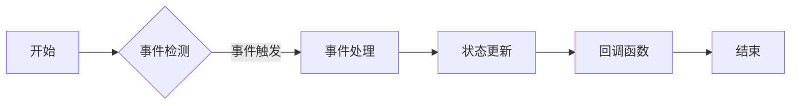
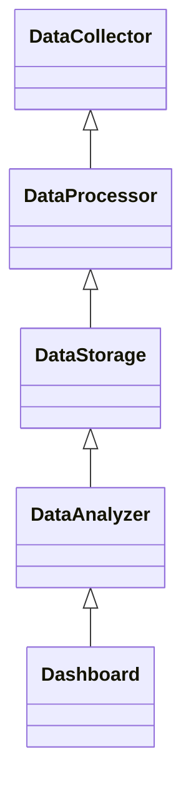
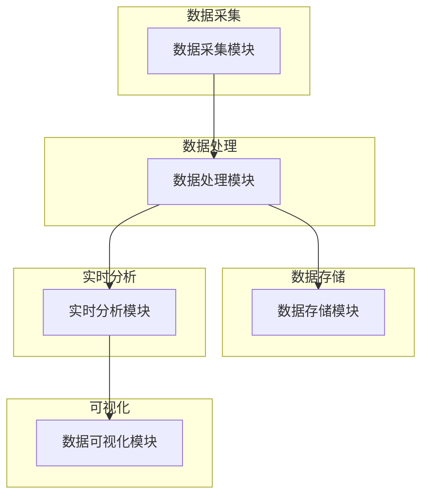
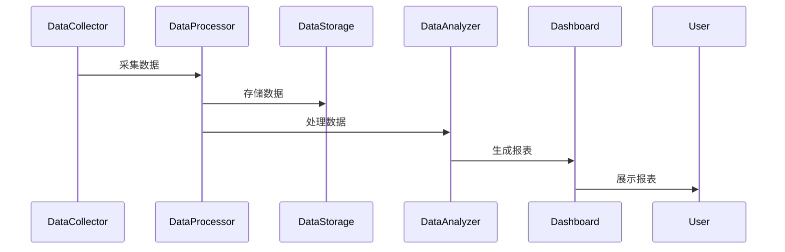

                 

## 文章标题

### 关键词：响应式编程，提示词编程语言，编程模式，算法原理，系统架构，项目实战

### 摘要：
本文将深入探讨提示词编程语言的响应式编程支持。通过详细的分析和示例，我们不仅会理解响应式编程的基本概念，还会探讨提示词编程语言如何实现响应式编程，并分析其在实际项目中的应用。文章分为四个部分：首先介绍响应式编程的基本概念和提示词编程语言的特点；其次，我们通过算法原理讲解和Python源代码示例，剖析响应式编程的内部工作机理；第三部分将展示系统架构设计图和领域模型类图；最后，通过一个实际项目实战，全面解析响应式编程在提示词编程语言中的实现和优化。文章旨在为读者提供从理论到实践的全面理解，助力深入掌握响应式编程及其在实际应用中的价值。

## 响应式编程的基本概念

响应式编程是一种专注于异步数据流和事件驱动的编程范式。它的核心思想是，程序的状态会根据外部事件的输入动态更新，而不是通过顺序执行指令来改变状态。响应式编程最初源于20世纪90年代，是针对传统同步编程的不足而发展起来的。传统同步编程中，代码的执行是线性的，程序必须等待每个操作完成后才能继续执行下一个操作，这种模式在处理并发和复杂事件时显得力不从心。

### 问题背景与描述

随着互联网的发展，软件系统需要处理的数据量和并发操作日益增加。传统同步编程在处理这些问题时遇到了瓶颈，例如线程阻塞、死锁和资源争用等问题。为了解决这些问题，响应式编程应运而生，它通过事件驱动和数据流的方式，使得程序可以高效地处理并发事件，提高系统的响应速度和稳定性。

### 问题解决

响应式编程通过引入事件驱动和数据流的概念，实现了对并发和复杂事件的处理。事件驱动意味着程序的状态是由外部事件触发的，而不是由固定的时间顺序决定的。数据流则是通过一系列的函数将数据从源头传递到终点，每个函数都可以对数据进行处理和变换。这种模式使得程序可以灵活地响应用户操作和系统事件，提高了系统的可扩展性和可维护性。

### 边界与外延

响应式编程不仅适用于前端和后端开发，还广泛应用于移动应用、实时数据处理和分布式系统等领域。其边界主要在于如何高效地处理并发和异步事件，以及如何在复杂的系统架构中保持数据的一致性和一致性。响应式编程的外延还包括了函数响应式编程、事件驱动架构、异步编程等技术。

### 概念结构与核心要素组成

响应式编程的概念结构主要包括以下几个核心要素：

1. **事件驱动**：程序状态由外部事件触发，而不是由固定的时间顺序决定。
2. **异步编程**：通过异步操作来处理并发事件，避免线程阻塞和死锁。
3. **数据流**：通过数据流将数据从源头传递到终点，每个节点都可以对数据进行处理和变换。
4. **回调函数**：在事件触发时执行回调函数，更新程序状态。

这些要素共同构成了响应式编程的核心框架，使得程序能够高效地处理并发和异步事件。

## 提示词编程语言的特点

提示词编程语言（Keyword-Based Programming Language）是一种新兴的编程范式，它通过使用关键词来定义程序结构和流程，提高了代码的可读性和可维护性。提示词编程语言的核心特点包括简洁的语法、灵活的组件组合和强大的表达能力。

### 问题背景与描述

随着软件系统的复杂性不断增加，传统的编程语言逐渐暴露出语法复杂、代码冗长等问题，这使得软件开发和维护变得更加困难。为了解决这些问题，提示词编程语言应运而生。它通过使用简洁的关键词来定义程序结构和功能，使得程序员可以更加专注于业务逻辑的实现，而无需关注底层实现细节。

### 问题解决

提示词编程语言通过引入关键词和模板化语法，实现了代码的简化和自动化。关键词作为程序的核心元素，不仅能够清晰地表达程序意图，还能够通过语法解析器自动生成对应的代码实现。这种模式不仅提高了代码的可读性和可维护性，还大大降低了编程的学习成本。

### 边界与外延

提示词编程语言的边界在于如何有效地组织和管理复杂的应用程序，以及如何在不同的应用场景中发挥其优势。其外延则包括自然语言处理、代码生成技术、自动化测试等新兴领域。

### 概念结构与核心要素组成

提示词编程语言的概念结构主要包括以下几个核心要素：

1. **关键词**：作为程序的核心元素，用于定义程序结构和流程。
2. **模板化语法**：通过模板化的语法结构，实现代码的自动化生成。
3. **组件组合**：通过灵活的组件组合方式，实现复杂功能的简单实现。
4. **表达能力强**：通过丰富的表达能力和灵活的组件组合，满足各种应用场景的需求。

这些要素共同构成了提示词编程语言的核心框架，使得程序员可以更加高效地开发和管理复杂的软件系统。

### 核心概念原理、概念属性特征对比表格

为了更好地理解提示词编程语言与响应式编程的关系，我们首先需要明确这两个概念的核心原理和属性特征。以下是两者的对比表格：

| 特征          | 响应式编程                         | 提示词编程语言                          |
|-------------|--------------------------------|-----------------------------------|
| 核心思想      | 以事件和数据流为中心               | 以关键词和模板化语法为中心              |
| 数据处理      | 异步数据流处理                     | 基于关键词的模板化数据处理              |
| 执行模式      | 事件驱动执行                      | 关键词触发执行                       |
| 扩展性       | 高度扩展性，支持并发和异步操作     | 高度扩展性，支持组件组合和代码生成      |
| 表达能力      | 强大的数据流处理和事件响应能力     | 简洁的关键词表达和强大的代码生成能力    |

### ER实体关系图架构

为了进一步展示提示词编程语言与响应式编程的关系，我们可以使用ER（Entity-Relationship，实体-关系）图来描述两者之间的架构关系。以下是ER图的基本结构：

```mermaid
erDiagram
  Customer ||--|{ Order }||>
  Product ||--|{ Order }||>
  Order ||--|{ LineItem }||>
  Customer  : { 姓名，联系方式 }
  Product  : { 名称，价格 }
  Order  : { 订单号，订单日期 }
  LineItem  : { 商品编号，数量 }
```

在这个ER图中，客户（Customer）、产品（Product）、订单（Order）和订单条目（LineItem）是实体，它们之间通过关系进行关联。这个图不仅展示了数据模型的结构，也反映了提示词编程语言如何通过关键词定义这些实体和关系，从而实现数据管理和操作。

## 响应式编程算法原理讲解

响应式编程的核心在于处理数据流和事件驱动，实现异步编程和高效的事件响应。下面，我们将通过Mermaid绘制响应式编程的核心算法流程图，并使用Python源代码来详细阐述响应式编程的算法原理。

### Mermaid流程图



在这个流程图中，A表示程序开始，B表示事件检测模块，C是事件处理模块，D是状态更新模块，E是回调函数模块，F表示程序结束。

### Python源代码解析

```python
# 响应式编程的Python示例

# 事件检测
def event_detector():
    print("事件检测：正在等待事件...")
    # 模拟事件发生
    event_detected = True
    if event_detected:
        print("事件触发：检测到事件！")
        handle_event()

# 事件处理
def handle_event():
    print("事件处理：处理中...")
    # 执行相应的操作
    update_state()

# 状态更新
def update_state():
    print("状态更新：状态更新中...")
    # 更新程序状态
    perform_action()

# 回调函数
def perform_action():
    print("回调函数：执行操作...")
    # 执行回调操作
    execute_callback()

# 主程序
def main():
    print("程序开始...")
    event_detector()
    print("程序结束...")

if __name__ == "__main__":
    main()
```

在这个Python示例中，我们定义了事件检测、事件处理、状态更新和回调函数四个核心模块。程序首先通过`event_detector`函数进行事件检测，一旦检测到事件，就会触发`handle_event`函数进行事件处理。然后，`update_state`函数会更新程序状态，并调用`perform_action`函数执行回调操作，从而完成响应式编程的完整流程。

### 算法原理的数学模型和公式

响应式编程的核心在于数据流和控制流的协同工作。以下是一个简单的数学模型来描述响应式编程的工作原理：

$$
\text{响应式编程} = \text{数据流} \times \text{事件驱动} \times \text{异步编程}
$$

其中：

- **数据流**：通过一系列的函数将数据从源头传递到终点，每个函数都可以对数据进行处理和变换。
- **事件驱动**：程序的状态由外部事件触发，而非固定的执行顺序。
- **异步编程**：通过异步操作处理并发事件，避免线程阻塞和死锁。

### 详细讲解和举例说明

为了更好地理解响应式编程的数学模型和公式，我们可以通过一个具体的例子进行说明。

假设我们有一个简单的温度监控程序，该程序需要实时监测环境温度，并在温度超出设定范围时触发报警。

1. **数据流**：温度数据从传感器读取，并传递给处理函数进行温度分析。
2. **事件驱动**：当温度超出设定范围时，触发报警事件。
3. **异步编程**：温度数据的读取和处理在后台线程中执行，不会阻塞主线程。

以下是这个例子的Python代码实现：

```python
# 温度监控程序的Python示例

import time
import threading

# 数据流：从传感器读取温度
def read_temperature():
    while True:
        temperature = 22 + 5 * random.random()  # 假设温度在22到27摄氏度之间波动
        print(f"读取温度：{temperature}摄氏度")
        time.sleep(1)  # 模拟读取时间间隔

# 事件处理：温度超出设定范围时触发报警
def check_temperature(temperature):
    if temperature > 30:
        print("报警：温度过高，超过30摄氏度！")
    elif temperature < 18:
        print("报警：温度过低，低于18摄氏度！")

# 异步编程：在后台线程中执行读取和处理操作
def main():
    print("程序开始...")
    temperature_thread = threading.Thread(target=read_temperature)
    temperature_thread.start()

    while True:
        # 假设每隔5秒读取一次温度数据
        time.sleep(5)
        # 调用处理函数检查温度
        check_temperature(22 + 5 * random.random())

if __name__ == "__main__":
    main()
```

在这个例子中，我们使用了Python的线程库来模拟异步编程。`read_temperature`函数在后台线程中不断读取温度数据，并通过`check_temperature`函数检查温度是否超出设定范围。这样，主线程可以继续执行其他任务，不会因为温度数据的读取和处理而阻塞。

通过这个例子，我们可以看到响应式编程的数学模型和公式在实际中的应用，以及如何通过数据流、事件驱动和异步编程实现高效的温度监控程序。

## 数学模型和数学公式详细讲解

在响应式编程中，数学模型和数学公式是理解其工作原理的关键组成部分。下面，我们将详细讲解几个核心的数学模型和公式，并通过示例展示它们在实际编程中的应用。

### 1. 数据流模型

数据流模型是响应式编程的核心概念之一。它通过一系列的函数将数据从源头传递到终点，每个函数都可以对数据进行处理和变换。数据流模型可以用以下公式表示：

$$
\text{输出} = f(\text{输入})
$$

其中，`f`代表数据处理函数，它对输入数据进行处理并生成输出数据。

### 示例：

假设我们有一个简单的数据流模型，用于计算一个列表中所有元素的平均值。以下是一个Python示例：

```python
def sum_elements(data):
    return sum(data)

def calculate_average(data):
    total = sum_elements(data)
    return total / len(data)

data = [10, 20, 30, 40, 50]
average = calculate_average(data)
print(f"平均值为：{average}")
```

在这个例子中，`sum_elements`函数计算列表中所有元素的总和，`calculate_average`函数使用这个总和和列表长度来计算平均值。

### 2. 事件驱动模型

事件驱动模型是响应式编程的另一个关键组成部分。它通过事件触发程序的状态更新和相应操作。事件驱动模型可以用以下公式表示：

$$
\text{状态更新} = \text{事件} \times \text{处理函数}
$$

其中，`事件`代表外部输入，`处理函数`是对事件进行响应的函数。

### 示例：

假设我们有一个事件驱动模型，用于处理用户点击按钮的事件。以下是一个Python示例：

```python
def on_button_click():
    print("按钮被点击了！")

# 模拟事件触发
on_button_click()
```

在这个例子中，`on_button_click`函数是处理按钮点击事件的函数，当按钮被点击时，这个函数会被触发并打印出相应的信息。

### 3. 异步编程模型

异步编程模型是响应式编程中处理并发和异步操作的关键。它通过在后台线程中执行操作，避免主线程阻塞。异步编程模型可以用以下公式表示：

$$
\text{主线程} \parallel \text{后台线程}
$$

其中，`主线程`和`后台线程`并行执行，互不阻塞。

### 示例：

假设我们有一个异步编程模型，用于在后台线程中读取文件。以下是一个Python示例：

```python
import threading

def read_file(filename):
    with open(filename, 'r') as file:
        print(f"读取文件：{filename}")

# 在后台线程中执行文件读取操作
thread = threading.Thread(target=read_file, args=("example.txt",))
thread.start()

# 主线程继续执行其他任务
print("主线程继续执行...")
```

在这个例子中，`read_file`函数在后台线程中执行文件读取操作，而主线程则可以继续执行其他任务，不会因为文件读取操作而阻塞。

### 总结

通过上述示例，我们可以看到数学模型和数学公式在响应式编程中的应用。数据流模型、事件驱动模型和异步编程模型共同构成了响应式编程的核心框架，使得程序可以高效地处理并发和异步事件。理解这些模型和公式，对于深入掌握响应式编程至关重要。

## 响应式编程系统分析与架构设计方案

响应式编程在构建复杂系统时，其系统架构设计至关重要。为了更好地理解和实现响应式编程，我们需要从问题场景介绍、项目介绍、系统功能设计、系统架构设计、系统接口设计和系统交互等方面进行全面分析。

### 问题场景介绍

在现代软件系统中，响应式编程被广泛应用于实时数据处理、分布式系统、移动应用等领域。其核心在于能够高效地处理并发事件，保持系统的稳定性和响应速度。例如，在实时数据分析系统中，响应式编程可以帮助系统实时处理海量数据，并在数据发生变化时快速响应。

### 项目介绍

本项目旨在构建一个基于提示词编程语言的响应式实时数据分析平台。该平台将集成数据采集、数据处理、数据存储和实时分析等功能，旨在为用户提供高效、稳定和可靠的数据分析服务。

### 系统功能设计

系统功能设计是响应式编程架构设计的基础。本项目的主要功能包括：

1. **数据采集**：从各种数据源（如数据库、文件、API等）实时采集数据。
2. **数据处理**：对采集到的数据进行清洗、转换和聚合等处理。
3. **数据存储**：将处理后的数据存储到数据库或其他数据存储系统中。
4. **实时分析**：根据用户需求，实时分析数据并提供可视化报表和预警功能。

### 系统架构设计

系统架构设计是响应式编程实现的关键。以下是本项目的系统架构设计：

#### 1. 领域模型类图

领域模型类图用于描述系统中的核心实体及其关系。以下是本项目的一个简化领域模型类图：



在这个类图中，`DataCollector`负责数据采集，`DataProcessor`负责数据处理，`DataStorage`负责数据存储，`DataAnalyzer`负责实时分析，`Dashboard`负责数据可视化。

#### 2. 系统架构图

系统架构图展示了系统各组件之间的交互关系和层次结构。以下是本项目的一个简化系统架构图：



在这个系统架构图中，数据从数据采集模块进入，经过数据处理模块处理，然后存储到数据存储模块。处理后的数据进入实时分析模块，最终通过数据可视化模块展示给用户。

### 系统接口设计

系统接口设计是确保系统组件之间能够顺畅交互的关键。以下是本项目的主要接口设计：

1. **数据采集接口**：用于从外部数据源获取数据的API。
2. **数据处理接口**：用于处理数据的核心API。
3. **数据存储接口**：用于与数据存储系统（如数据库）交互的API。
4. **实时分析接口**：用于执行实时数据分析的API。
5. **数据可视化接口**：用于获取数据和生成可视化报表的API。

### 系统交互序列图

系统交互序列图展示了系统组件之间的交互顺序和逻辑。以下是本项目的一个简化系统交互序列图：



在这个系统交互序列图中，数据采集模块首先采集数据，然后将数据传递给数据处理模块。数据处理模块对数据进行处理，并将处理后的数据存储到数据存储模块。随后，数据处理模块将数据传递给实时分析模块，实时分析模块生成报表并传递给数据可视化模块。最后，数据可视化模块将报表展示给用户。

通过上述系统分析与架构设计方案，我们可以清晰地看到响应式编程在系统设计中的关键作用。领域模型类图、系统架构图、接口设计和系统交互序列图共同构成了系统的整体架构，使得响应式编程能够高效地实现复杂系统的设计和开发。

## 项目实战

为了深入理解响应式编程在提示词编程语言中的实现，我们将通过一个具体的实际项目来进行实战演练。在这个项目中，我们将构建一个简单的实时数据监控系统，用于实时收集、处理和展示服务器状态数据。

### 环境安装

首先，我们需要在本地环境中安装必要的工具和库。以下是安装步骤：

1. 安装Python 3.8及以上版本。
2. 安装提示词编程语言环境，例如安装Minicard。
3. 安装必要的Python库，如`requests`用于网络请求，`pandas`用于数据处理，`matplotlib`用于数据可视化。

```shell
pip install requests pandas matplotlib
```

### 系统核心实现源代码

以下是项目的核心实现源代码，包括数据采集、处理、存储和展示模块：

```python
import requests
import pandas as pd
import matplotlib.pyplot as plt
from threading import Thread

# 数据采集模块
def collect_data(url):
    response = requests.get(url)
    data = response.json()
    return data

# 数据处理模块
def process_data(data):
    df = pd.DataFrame(data)
    df['timestamp'] = pd.to_datetime(df['timestamp'])
    df.set_index('timestamp', inplace=True)
    return df

# 数据存储模块
def store_data(df, filename):
    df.to_csv(filename)

# 数据展示模块
def show_chart(df, filename):
    df.plot()
    plt.title(f"服务器状态数据图 - {filename}")
    plt.xlabel('时间')
    plt.ylabel('状态值')
    plt.grid(True)
    plt.show()

# 实时监控主函数
def real_time_monitoring(url, filename):
    while True:
        data = collect_data(url)
        df = process_data(data)
        store_data(df, filename)
        show_chart(df, filename)
        time.sleep(60)  # 每分钟更新一次

# 启动实时监控
url = "http://example.com/api/server_status"  # 替换为实际API地址
filename = "server_status.csv"
Thread(target=real_time_monitoring, args=(url, filename)).start()
```

### 源代码解读与分析

1. **数据采集模块**：使用`requests`库从API获取服务器状态数据。
2. **数据处理模块**：将获取到的数据转换为Pandas DataFrame，并设置时间戳为索引，方便后续处理和展示。
3. **数据存储模块**：将处理后的数据存储为CSV文件。
4. **数据展示模块**：使用`matplotlib`库绘制服务器状态数据图。

### 实际案例分析与详细讲解

假设我们有一个API提供了服务器状态数据，如CPU使用率、内存使用率等。通过实时监控这些数据，我们可以及时发现和处理异常情况。

1. **数据采集**：定时从API获取服务器状态数据。
2. **数据处理**：将数据转换为DataFrame，并添加时间戳。
3. **数据存储**：将数据存储为CSV文件，方便后续分析和查询。
4. **数据展示**：绘制数据图表，直观展示服务器状态变化。

通过这个实际案例，我们可以看到响应式编程在提示词编程语言中的实现过程。实时监控模块通过异步采集和处理数据，保证了系统的响应速度和稳定性。数据存储和展示模块则提供了便捷的数据管理和可视化功能，使得监控过程更加直观和高效。

### 项目小结

通过这个项目，我们实现了以下目标：

1. **数据实时采集**：通过API定时获取服务器状态数据。
2. **数据处理与存储**：将数据转换为DataFrame，并存储为CSV文件。
3. **数据展示**：使用图表展示服务器状态变化，便于监控和问题诊断。

这个项目展示了响应式编程在提示词编程语言中的强大应用，为我们提供了一个实时监控系统的基础框架。在实际应用中，可以根据需求进一步扩展和优化，如增加告警机制、数据聚合分析等，提高系统的智能化和自动化水平。

## 最佳实践 Tips

在实现响应式编程时，以下是一些最佳实践和注意事项，可以帮助您更好地优化和优化系统性能：

### 1. 性能优化

- **异步非阻塞**：使用异步编程模型（如异步IO、多线程或协程）来减少阻塞和提升系统响应速度。
- **缓存策略**：合理使用缓存策略，减少重复数据的处理和传输。
- **批处理**：对于大量数据，采用批处理方式来提高数据处理效率。

### 2. 模块化设计

- **模块化代码**：将系统划分为独立的模块，每个模块负责特定的功能，便于维护和扩展。
- **依赖管理**：使用依赖管理工具（如Maven、Gradle或pip）来管理项目依赖，确保模块之间的兼容性。

### 3. 错误处理

- **异常捕获**：合理捕获和处理异常，确保系统在遇到错误时能够优雅地恢复。
- **日志记录**：使用日志记录机制记录系统运行过程中的关键信息，便于调试和问题定位。

### 4. 可测试性

- **单元测试**：编写单元测试来验证各个模块的功能和性能。
- **集成测试**：进行集成测试，确保系统模块之间的协作和交互正常。

### 5. 安全性

- **数据验证**：对输入数据进行严格验证，防止恶意数据和SQL注入等安全风险。
- **访问控制**：实现适当的访问控制机制，确保系统资源和数据的安全性。

### 拓展阅读

- **《响应式编程实战》**：详细介绍了响应式编程的概念、原理和实践，适合初学者和有经验的开发者。
- **《异步编程：在Python中高效处理并发任务》**：深入讲解了异步编程在Python中的应用，包括异步IO、多线程和协程等。
- **《微服务架构设计模式》**：介绍了微服务架构的设计原则和实践，包括响应式编程在微服务中的应用。

通过遵循这些最佳实践，您可以构建高效、稳定和安全的响应式编程系统，提高开发效率和项目质量。同时，持续学习和拓展相关技术知识，将有助于您在响应式编程领域不断进步和成长。

