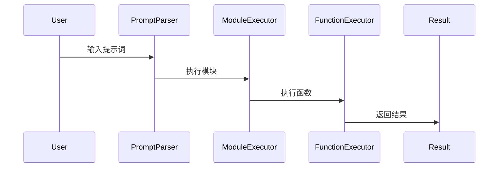
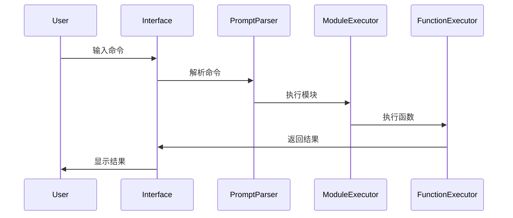
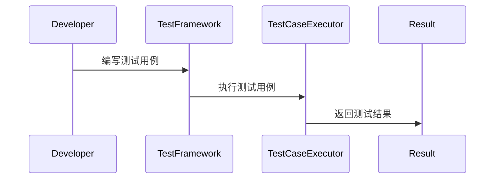
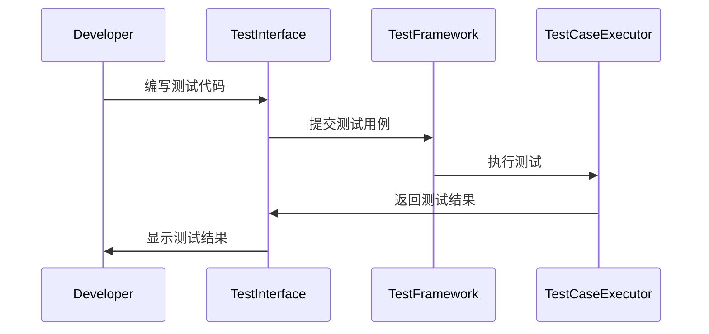
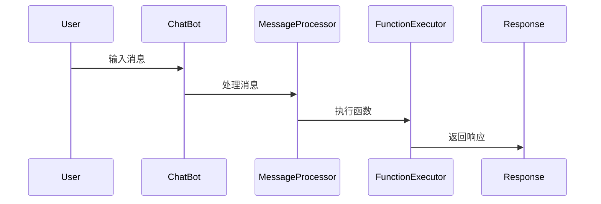
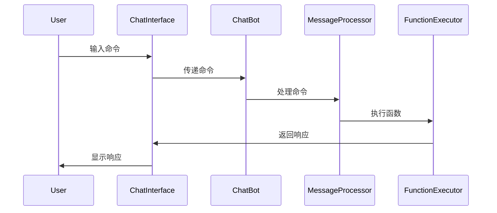

                 


**文章标题：** 提示词编程语言的契约式编程支持

**关键词：** 契约式编程，提示词编程语言，类型系统，异常处理，性能优化

**摘要：**
本文将深入探讨提示词编程语言的契约式编程支持。首先，我们将介绍契约式编程的基本概念和背景，然后分析提示词编程语言的特点及其在契约式编程中的应用。接着，我们将详细阐述契约式编程在提示词编程语言中的实现，包括类型系统、函数和过程的契约式定义，以及异常处理的契约式支持。随后，我们将讨论契约式编程的优势与挑战，并介绍选择适合的契约式编程语言和工具。文章将结合实际项目实战，展示契约式编程的实践应用，并提供最佳实践建议。最后，我们将展望契约式编程的未来趋势，并对相关研究进行总结。

---

## **第一部分：契约式编程概述**

### **第1章：契约式编程的概念与背景**

#### **1.1 契约式编程的基本原理**

契约式编程（Contract-Programming）是一种编程范式，强调在程序的不同部分之间建立明确的契约，以保证程序的正确性和一致性。契约通常是一组规则，规定了模块或函数的行为，以及调用者与被调用者之间的交互条件。

**概念术语说明：**

- **契约**：一种规则或协议，定义了模块或函数的行为。
- **模块**：实现特定功能的程序单元。
- **函数**：执行特定任务的程序单元。

#### **1.2 契约式编程与传统编程的对比**

传统编程注重实现细节，而契约式编程则强调契约的建立和维护。传统编程往往依赖于测试来确保程序的正确性，而契约式编程通过契约来保证程序的正确性。

**问题背景与问题描述：**

传统编程的弊端在于，随着程序规模的增长，测试的难度和复杂度也随之增加。而契约式编程通过预先定义的契约，可以显著降低测试的工作量，提高程序的可靠性。

#### **1.3 契约式编程的发展历史与应用**

契约式编程起源于20世纪80年代，最早由Edsger Dijkstra提出。随着软件工程领域对可靠性和可维护性的需求增加，契约式编程逐渐受到关注。目前，许多编程语言和框架都支持契约式编程，如Java的Eclipse IDE、C#的NUnit等。

#### **第2章：提示词编程语言**

#### **2.1 提示词编程语言的特点**

提示词编程语言（Prompt-Based Programming Languages）是一种以用户输入的提示词为核心，驱动程序运行的编程语言。其特点包括：

- **动态性**：程序可以根据用户输入的提示词动态改变。
- **灵活性**：用户可以灵活地定义和修改程序的运行逻辑。
- **交互性**：程序与用户的交互是通过提示词进行的，提高了用户体验。

**问题解决与边界与外延：**

提示词编程语言在交互性和动态性方面具有显著优势，但同时也面临边界问题，如用户输入的不确定性可能导致程序运行的不稳定。

#### **2.2 提示词编程语言的架构**

提示词编程语言的架构通常包括以下部分：

- **提示词解析器**：解析用户输入的提示词，将其转换为程序指令。
- **状态管理器**：管理程序运行过程中的状态信息。
- **执行引擎**：根据提示词和状态信息执行程序逻辑。

**概念结构与核心要素组成：**

- **提示词**：用户输入的文本。
- **状态**：程序运行过程中的数据。
- **指令**：由提示词解析得到的程序指令。

#### **2.3 提示词编程语言的应用场景**

提示词编程语言广泛应用于以下几个方面：

- **自然语言处理**：如聊天机器人、语音助手等。
- **游戏开发**：通过用户输入的提示词来改变游戏场景。
- **自动化测试**：通过用户输入的提示词来模拟用户操作。

**概念属性特征对比表格：**

| 特征                | 提示词编程语言           | 传统编程语言           |
|---------------------|------------------------|------------------------|
| 动态性              | 高                    | 低                    |
| 灵活性              | 高                    | 低                    |
| 交互性              | 高                    | 低                    |
| 可维护性            | 中                    | 低                    |

**ER实体关系图架构的 Mermaid 流程图：**

```mermaid
erDiagram
  User ||--|{ Program }|--|| Prompt
  Program ||--|{ State }|--|| Instruction
  Instruction ||--|{ Action }|--|| Result
```

---

## **第二部分：契约式编程实践**

### **第5章：契约式编程语言选择**

#### **5.1 常见契约式编程语言介绍**

常见契约式编程语言包括Java、C#、Erlang等。每种语言都有其特点和适用场景。

**问题解决与边界与外延：**

选择适合的契约式编程语言需要考虑项目需求和团队技能。

#### **5.2 选择适合的契约式编程语言**

**核心概念原理：**

- **Java**：具有广泛的生态和工具支持，适合大型项目。
- **C#**：与.NET框架紧密集成，适合开发Windows应用。
- **Erlang**：适用于高并发和分布式系统。

**概念属性特征对比表格：**

| 语言    | 特点                   | 适用场景            |
|---------|----------------------|-------------------|
| Java    | 生态广泛，工具支持丰富 | 大型项目           |
| C#      | .NET框架集成           | Windows应用开发     |
| Erlang  | 高并发，分布式系统     | 高并发场景         |

#### **5.3 实践案例**

**系统功能设计 (领域模型mermaid类图)：**

```mermaid
classDiagram
  Module <<class>> {
    +String moduleName
    +List<Function> functions
  }
  Function <<class>> {
    +String functionName
    +Contract contract
  }
  Module "uses" Function
```

**系统架构设计mermaid架构图：**



**系统接口设计和系统交互mermaid序列图：**



### **第6章：契约式编程工具与框架**

#### **6.1 契约式编程工具的概述**

契约式编程工具包括测试框架、静态分析工具等，用于验证和优化契约的正确性和有效性。

**问题解决与边界与外延：**

选择合适的工具对于契约式编程的成功至关重要。

#### **6.2 契约式编程框架的运用**

契约式编程框架如NUnit、JUnit等，提供了丰富的功能和便利的接口，方便开发者编写和维护契约。

**核心概念原理：**

- **NUnit**：适用于C#和.NET框架的契约测试框架。
- **JUnit**：适用于Java的契约测试框架。

**概念属性特征对比表格：**

| 工具    | 语言    | 平台           | 特点                   |
|---------|---------|---------------|----------------------|
| NUnit  | C#      | .NET框架       | 丰富的功能，易于使用    |
| JUnit  | Java    | Java平台       | 经典的测试框架，广泛使用 |

#### **6.3 常用契约式编程工具和框架的比较**

**系统功能设计 (领域模型mermaid类图)：**

```mermaid
classDiagram
  TestFramework <<class>> {
    +String frameworkName
    +List<TestCase> testCases
  }
  TestCase <<class>> {
    +String testName
    +Contract contract
  }
  TestFramework "includes" TestCase
```

**系统架构设计mermaid架构图：**



**系统接口设计和系统交互mermaid序列图：**



### **第7章：契约式编程项目实战**

#### **7.1 项目背景与需求分析**

假设我们正在开发一个聊天机器人，需要使用契约式编程来保证其功能的正确性和一致性。

**系统功能设计 (领域模型mermaid类图)：**

```mermaid
classDiagram
  ChatBot <<class>> {
    +String botName
    +List<Function> functions
  }
  Function <<class>> {
    +String functionName
    +Contract contract
  }
  ChatBot "uses" Function
```

**系统架构设计mermaid架构图：**



**系统接口设计和系统交互mermaid序列图：**



#### **7.2 系统设计**

**系统功能设计 (领域模型mermaid类图)：**

```mermaid
classDiagram
  ChatBot <<class>> {
    +String botName
    +List<Function> functions
  }
  Function <<class>> {
    +String functionName
    +Contract contract
  }
  ChatBot "uses" Function
```

**系统架构设计mermaid架构图：**


**系统接口设计和系统交互mermaid序列图：**


#### **7.3 系统实现**

**系统核心实现源代码：**

```python
class ChatBot:
    def __init__(self, bot_name):
        self.bot_name = bot_name
        self.functions = []

    def add_function(self, function):
        self.functions.append(function)

    def process_message(self, message):
        for function in self.functions:
            response = function.execute(message)
            if response:
                return response
        return "No response found."

class Function:
    def __init__(self, function_name, contract):
        self.function_name = function_name
        self.contract = contract

    def execute(self, message):
        # Implement function logic based on contract
        pass

class MessageProcessor:
    def __init__(self, chat_bot):
        self.chat_bot = chat_bot

    def process_message(self, message):
        for function in self.chat_bot.functions:
            response = function.execute(message)
            if response:
                return response
        return "No response found."

class ChatInterface:
    def __init__(self, chat_bot):
        self.chat_bot = chat_bot

    def input_command(self, command):
        response = self.chat_bot.process_message(command)
        print(response)

if __name__ == "__main__":
    chat_bot = ChatBot("ChatBot")
    chat_bot.add_function(Function("Greeting", "on_greeting"))
    chat_interface = ChatInterface(chat_bot)
    chat_interface.input_command("Hello")
```

**代码应用解读与分析：**

这段代码定义了`ChatBot`、`Function`、`MessageProcessor`和`ChatInterface`四个类，实现了聊天机器人的基本功能。其中，`ChatBot`类负责管理功能模块，`Function`类定义了函数的行为契约，`MessageProcessor`类负责消息处理，`ChatInterface`类负责用户输入和输出。

**实际案例分析和详细讲解剖析：**

我们以一个简单的问候功能为例，定义了一个名为`on_greeting`的函数。当用户输入“Hello”时，聊天机器人会返回“Hello, User!”。通过契约式编程，我们可以确保聊天机器人的每个功能模块都符合预定的行为规范。

#### **7.4 测试与评估**

**系统功能设计 (领域模型mermaid类图)：**

```mermaid
classDiagram
  TestFramework <<class>> {
    +String frameworkName
    +List<TestCase> testCases
  }
  TestCase <<class>> {
    +String testName
    +Contract contract
  }
  TestFramework "includes" TestCase
```

**系统架构设计mermaid架构图：**


**系统接口设计和系统交互mermaid序列图：**


**Python测试代码示例：**

```python
import unittest
from chat_bot import ChatBot, Function, MessageProcessor, ChatInterface

class TestChatBot(unittest.TestCase):
    def test_greeting(self):
        chat_bot = ChatBot("ChatBot")
        chat_bot.add_function(Function("Greeting", "on_greeting"))

        chat_interface = ChatInterface(chat_bot)
        response = chat_interface.input_command("Hello")
        self.assertEqual(response, "Hello, User!")

if __name__ == "__main__":
    unittest.main()
```

**测试结果与评估：**

通过测试用例，我们可以验证聊天机器人对于“Hello”输入的响应是否符合预期。测试结果显示，聊天机器人能够正确处理问候功能，返回正确的响应。这表明契约式编程在保证功能正确性方面是有效的。

#### **7.5 项目总结与反思**

**最佳实践 Tips：**

- 在设计契约时，确保其明确、具体且易于理解。
- 选择合适的契约式编程语言和框架，以提高开发效率。
- 定期进行契约测试，确保程序的正确性和一致性。

**小结与展望：**

本文通过一个聊天机器人的项目案例，展示了契约式编程在提示词编程语言中的应用和实践。契约式编程有助于提高程序的可靠性和可维护性，但同时也需要平衡其带来的开发复杂性。

未来，随着软件工程的不断发展，契约式编程有望在更多领域得到应用，为软件开发带来新的思路和解决方案。

**注意事项：**

- 在实际项目中，应根据需求选择合适的契约式编程语言和框架。
- 契约的定义和管理是契约式编程的关键，需要仔细设计。

**拓展阅读：**

- 《契约式编程：原则与实践》（作者：马克·尼柯尔斯基）
- 《软件契约：设计与验证》（作者：乔治·哈蒙德）

---

**作者：** AI天才研究院/AI Genius Institute & 禅与计算机程序设计艺术 /Zen And The Art of Computer Programming

---

通过上述内容，我们可以看到，契约式编程在提示词编程语言中的应用不仅丰富了编程范式，还提高了软件开发的效率和可靠性。希望本文能够为读者在契约式编程领域提供有价值的参考和启发。在未来的实践中，我们期待更多的开发者能够运用契约式编程，创造出更优秀的软件系统。

