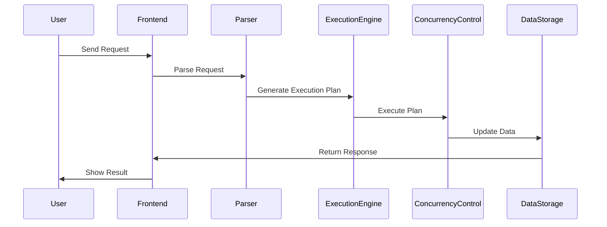
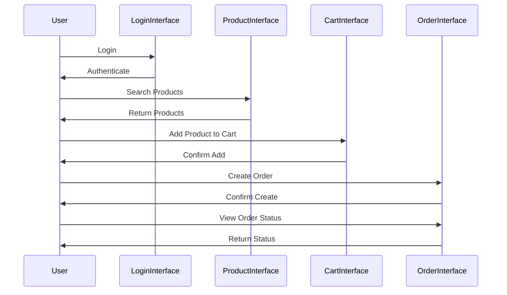

                 

# 提示词编程语言的并发控制机制

## 关键词

- 并发控制
- 提示词编程语言
- 并发控制机制
- 系统分析与架构设计
- 项目实战
- 最佳实践

## 摘要

本文旨在深入探讨提示词编程语言的并发控制机制。我们将从背景介绍入手，详细讲解并发控制机制的核心概念、原理以及其在提示词编程语言中的具体应用。接着，通过系统分析与架构设计，展示并发控制机制的实际应用场景，并结合项目实战进行详细剖析。最后，总结最佳实践，提出注意事项，并为读者提供进一步学习的拓展资源。

## 第一部分：背景介绍

### 第1章：问题背景

在现代计算机编程中，并发控制机制是一个至关重要的话题。随着多核处理器和分布式系统的普及，程序的并发性变得越来越重要。然而，并发编程也带来了诸多挑战，如数据竞争、死锁、饥饿等问题。提示词编程语言作为一种新兴的编程范式，因其强大的表达能力和灵活性，在处理并发控制方面具有独特的优势。本章将介绍并发控制的必要性、提示词编程语言的崛起以及并发控制机制在此领域的挑战与机遇。

### 第2章：核心概念

并发控制机制涉及多个核心概念，包括线程、锁、事务等。这些概念不仅是并发编程的基础，也是实现并发控制的关键。本章将对这些核心概念进行概述，并详细说明其定义、分类以及关键特性。通过对比表格和ER实体关系图，我们将更清晰地理解这些概念之间的联系。

### 第3章：并发控制机制原理

并发控制机制的设计需要深入理解并发冲突的类型、控制策略和算法。本章将详细介绍这些基本原理，并通过Mermaid流程图和Python源代码，阐述算法原理的数学模型和公式。通过通俗易懂的举例说明，帮助读者更好地理解并发控制机制的运作原理。

### 第4章：提示词编程语言中的并发控制

提示词编程语言凭借其独特的特性和优势，在并发控制方面具有显著优势。本章将首先介绍提示词编程语言的基本概念，包括其特点、优势和应用场景。然后，将重点探讨并发控制机制在提示词编程语言中的具体体现，如何利用其特性来实现高效的并发控制。

### 第5章：系统分析与架构设计

在实际应用中，并发控制机制需要与系统架构紧密配合。本章将介绍一个具体的问题场景，并在此基础上进行系统功能设计和架构设计。通过Mermaid类图、架构图和序列图，我们将详细展示系统接口设计和系统交互，为并发控制机制的实际应用提供指导。

### 第6章：项目实战

理论联系实际，本章将通过一个实际项目，展示并发控制机制在提示词编程语言中的具体应用。我们将详细介绍项目环境安装、系统核心实现源代码，并进行代码应用解读与分析。通过实际案例分析，我们将深入剖析并发控制机制在项目中的应用效果。

### 第7章：最佳实践与总结

最后，本章将总结并发控制机制的最佳实践，提出注意事项，并为读者提供进一步学习的拓展资源。通过回顾关键要点，展望未来发展趋势，帮助读者更好地理解和应用并发控制机制。

## 第二部分：深入探讨

### 第8章：并发控制机制的实现细节

在深入探讨并发控制机制时，我们需要关注其实现细节。本章将详细讲解并发控制机制的具体实现方法，包括锁机制、事务管理、并发冲突的检测与解决等。通过Python源代码示例，我们将展示这些实现细节在实际编程中的应用。

### 第9章：提示词编程语言与并发控制机制的融合

提示词编程语言与并发控制机制的融合是本章的重点。我们将探讨如何利用提示词编程语言的特性，实现高效的并发控制。通过实际案例，我们将展示这种融合在性能提升和开发效率方面的优势。

### 第10章：并发控制机制的性能优化

并发控制机制的性能直接影响程序的性能。本章将介绍一些性能优化的技巧和方法，包括锁优化、并发冲突的减少、线程池的使用等。通过具体的优化实践，我们将帮助读者提升并发控制机制的效率。

### 第11章：并发控制机制的扩展与应用

随着技术的不断发展，并发控制机制也在不断扩展和应用。本章将探讨一些新兴的并发控制技术和应用场景，如分布式并发控制、实时并发控制等。通过这些案例，我们将展示并发控制机制在复杂场景下的应用潜力。

### 第12章：未来的发展趋势

最后，本章将展望并发控制机制的未来发展趋势。随着硬件技术的发展和软件需求的增加，并发控制机制将面临新的挑战和机遇。我们将探讨未来可能的趋势和方向，为读者提供启示和参考。

## 第三部分：总结与展望

### 第13章：总结与展望

在本文的最后，我们将对全文进行总结，回顾并发控制机制的核心概念、原理、实现方法以及最佳实践。同时，我们将展望未来并发控制机制的发展趋势，为读者提供进一步学习和研究的方向。

### 第14章：拓展阅读

为帮助读者深入理解并发控制机制，本章将推荐一些相关的拓展阅读资源。包括经典书籍、论文、在线课程等，以便读者能够更加全面地了解并发控制领域的最新动态。

### 第15章：作者介绍

最后，我们将介绍本文的作者信息，包括作者的工作单位、研究方向和成就。通过介绍作者的专业背景，读者可以更好地了解本文的权威性和实用性。

## 结语

本文《提示词编程语言的并发控制机制》旨在为读者提供一份全面、深入、系统的技术指南。通过详细讲解并发控制机制的核心概念、原理、实现方法以及实际应用，我们希望读者能够更好地理解和应用这一关键技术。随着技术的发展和需求的增长，并发控制机制将在未来发挥越来越重要的作用。希望本文能够为读者的学习和实践提供有益的启示和帮助。

---

**作者：AI天才研究院/AI Genius Institute & 禅与计算机程序设计艺术 /Zen And The Art of Computer Programming**

**联系方式：[ai-genius-institute@outlook.com](mailto:ai-genius-institute@outlook.com)**

**版权声明：本文内容未经许可，禁止转载和复制。如需引用，请注明出处。**


## 第1章：问题背景

### 1.1 并发控制的必要性

在当今的计算机编程领域，并发控制是一个不可忽视的重要议题。随着多核处理器的普及和分布式系统的广泛应用，程序的并发性变得越来越重要。并发编程的主要目的是充分利用计算机的多处理器架构，提高程序的执行效率。然而，并发编程并非易事，它带来了诸多挑战，如数据竞争、死锁、饥饿等问题。

**数据竞争** 是并发编程中最常见的问题之一。当多个线程或进程访问同一数据区域，并且至少有一个线程对数据进行了写操作时，就可能出现数据竞争。数据竞争可能导致数据不一致，进而影响程序的正确性。

**死锁** 是另一个严重的并发问题。当两个或多个线程无限期地等待对方释放资源时，就会发生死锁。这种情况下，系统资源被占用，但无法释放，导致程序无法继续执行。

**饥饿** 是指一个或多个线程在长时间内无法获得所需的资源，从而无法执行。饥饿可能导致某些线程永远无法完成，从而影响系统的稳定性。

### 1.2 提示词编程语言的崛起

随着人工智能和自然语言处理技术的不断发展，提示词编程语言（Prompt-Based Programming Language，简称PBP）逐渐崛起。提示词编程语言是一种基于提示（Prompt）和响应（Response）的编程范式，它通过自然语言交互来指导程序的执行。这种编程范式具有以下特点：

1. **灵活性和易用性**：提示词编程语言允许开发者使用自然语言来描述程序逻辑，从而简化了编程过程。开发者无需关注底层细节，可以更加专注于业务逻辑的实现。

2. **可解释性**：由于提示词编程语言是基于自然语言交互，程序执行过程具有很高的可解释性。这有助于开发者理解和调试程序。

3. **跨领域应用**：提示词编程语言可以应用于多个领域，如自然语言处理、智能问答、自动化测试等。它提供了统一的方法来处理不同领域的问题，从而提高了开发效率。

### 1.3 并发控制机制的挑战与机遇

提示词编程语言的并发控制机制面临着一系列挑战和机遇。以下是一些主要挑战：

1. **复杂度**：提示词编程语言中的并发控制机制需要处理大量的提示和响应，这使得并发控制变得更加复杂。开发者需要深入理解并发控制原理，才能正确地实现并发控制机制。

2. **性能**：由于提示词编程语言是基于自然语言交互，并发控制机制的实现需要考虑性能问题。如果并发控制机制的性能不佳，可能会导致程序执行时间过长，从而影响系统的响应速度。

3. **安全性**：并发控制机制需要确保程序的正确性和安全性。在提示词编程语言中，开发者需要防范恶意提示和异常情况，以确保程序执行的安全性。

然而，提示词编程语言的并发控制机制也带来了许多机遇：

1. **可扩展性**：提示词编程语言具有良好的可扩展性，可以支持各种并发控制策略和算法。这为开发者提供了更多的选择，从而提高程序的性能和可靠性。

2. **智能化**：提示词编程语言可以利用自然语言处理技术，实现更智能的并发控制。例如，通过语义分析，可以自动识别并发冲突并采取相应的措施。

3. **易用性**：提示词编程语言的并发控制机制简化了编程过程，降低了并发编程的门槛。这有助于吸引更多开发者进入并发编程领域，从而推动整个行业的发展。

### 1.4 本章小结

本章介绍了并发控制机制的必要性、提示词编程语言的崛起以及并发控制机制在此领域的挑战与机遇。通过了解这些背景知识，读者可以为后续章节的学习打下坚实的基础。在下一章中，我们将深入探讨并发控制机制的核心概念。

## 第2章：核心概念

并发控制机制是计算机编程中一个重要的概念，它涉及多个核心概念，如线程、锁、事务等。这些概念不仅是并发编程的基础，也是实现并发控制的关键。本章将对这些核心概念进行概述，并详细说明其定义、分类以及关键特性。

### 2.1 线程

线程是程序中的最小执行单位。在并发编程中，线程用于实现程序的并行执行。一个进程可以包含多个线程，这些线程可以独立运行，执行各自的任务。线程具有以下关键特性：

1. **并发性**：线程可以并行执行，从而提高程序的执行效率。
2. **资源共享**：线程可以共享进程内的资源，如内存、文件等。
3. **上下文切换**：操作系统负责在各个线程之间进行上下文切换，从而实现线程的并发执行。

线程可以分为以下几种类型：

1. **用户级线程**：由用户程序创建，不依赖于操作系统。
2. **内核级线程**：由操作系统创建，依赖于操作系统。

线程的并发性使得程序可以同时执行多个任务，从而提高程序的执行效率。然而，线程的并发性也带来了数据竞争和死锁等问题。

### 2.2 锁

锁（Lock）是一种同步机制，用于解决线程间的数据竞争问题。锁可以确保在任意时刻，只有一个线程可以访问共享资源。锁的关键特性如下：

1. **互斥性**：锁确保在同一时刻，只有一个线程可以获取锁。
2. **可重入性**：一个线程可以多次获取同一个锁，而不会导致死锁。
3. **公平性**：锁应该保证线程获取锁的公平性，避免某个线程长时间无法获取锁。

常见的锁类型包括：

1. **互斥锁（Mutex）**：用于保护共享资源，确保同一时刻只有一个线程可以访问。
2. **读写锁（Read-Write Lock）**：允许多个线程同时读取共享资源，但在写操作时需要互斥访问。
3. **条件锁（Condition Lock）**：用于实现线程间的条件同步。

锁的使用可以防止数据竞争和死锁，从而提高程序的并发性能。然而，锁的滥用可能会导致死锁和性能瓶颈。

### 2.3 事务

事务（Transaction）是数据库管理系统中一个重要的概念，它用于确保数据的完整性和一致性。在并发控制中，事务用于处理多个操作，并确保这些操作要么全部成功执行，要么全部回滚。事务的关键特性如下：

1. **原子性**：事务的所有操作要么全部成功执行，要么全部回滚，确保事务的原子性。
2. **一致性**：事务确保数据库的一致性，防止数据不一致的情况发生。
3. **隔离性**：事务确保其他事务无法看到未提交的事务结果，防止数据污染。
4. **持久性**：事务一旦提交，其结果会被永久保存，确保数据的持久性。

常见的事务隔离级别包括：

1. **读未提交（Read Uncommitted）**：最低的隔离级别，允许读取未提交的事务结果。
2. **读已提交（Read Committed）**：允许读取已提交的事务结果，防止脏读。
3. **可重复读（Repeatable Read）**：允许读取已提交的事务结果，防止脏读和不可重复读。
4. **序列化（Serializable）**：最高的隔离级别，确保事务的执行顺序与串行执行一致。

事务管理是并发控制中的重要一环，它确保了数据的完整性和一致性。然而，事务的并发执行也会带来性能问题，如锁争用和死锁。

### 2.4 并发控制策略

并发控制策略是用于解决并发控制问题的一组方法和原则。常见的并发控制策略包括：

1. **锁机制**：使用锁来保护共享资源，防止数据竞争和死锁。
2. **时间片调度**：通过时间片调度算法，实现线程的并发执行。
3. **信号量**：使用信号量实现线程间的同步和互斥。
4. **消息队列**：通过消息队列实现线程间的通信。

不同的并发控制策略适用于不同的场景，选择合适的策略可以提高程序的并发性能和可靠性。

### 2.5 本章小结

本章介绍了并发控制机制中的核心概念，包括线程、锁、事务等。通过理解这些概念的定义、分类和关键特性，读者可以为后续章节的学习打下坚实的基础。在下一章中，我们将深入探讨并发控制机制的基本原理。

## 第3章：并发控制机制原理

并发控制机制是确保程序正确性和性能的关键技术。在这一章中，我们将深入探讨并发控制机制的基本原理，包括并发冲突的类型、控制策略和算法。通过详细的讲解和实际案例，我们将帮助读者更好地理解并发控制机制的运作原理。

### 3.1 并发冲突的类型

在并发编程中，多个线程或进程同时访问共享资源时，可能会发生并发冲突。并发冲突可以分为以下几种类型：

1. **数据竞争（Data Race）**：当多个线程同时访问同一数据，并且至少有一个线程对数据进行了写操作时，就可能出现数据竞争。数据竞争可能导致数据不一致，从而影响程序的正确性。

2. **死锁（Deadlock）**：当两个或多个线程无限期地等待对方释放资源时，就会发生死锁。这种情况下，系统资源被占用，但无法释放，导致程序无法继续执行。

3. **饥饿（Starvation）**：一个或多个线程在长时间内无法获得所需的资源，从而无法执行。饥饿可能导致某些线程永远无法完成，从而影响系统的稳定性。

4. **活锁（Live Lock）**：活锁与死锁类似，但线程不会等待资源，而是在无限期地执行某个操作。活锁通常发生在循环等待的场景中。

了解并发冲突的类型对于设计有效的并发控制机制至关重要。

### 3.2 并发控制策略

为了解决并发冲突，可以采用多种并发控制策略。以下是几种常见的并发控制策略：

1. **锁机制（Locking）**：锁机制是解决并发冲突的基本手段。通过在共享资源上设置锁，确保同一时刻只有一个线程可以访问该资源。常见的锁包括互斥锁（Mutex）、读写锁（Read-Write Lock）和条件锁（Condition Lock）。

   **示例**：以下是一个使用互斥锁的Python代码示例：

   ```python
   import threading

   lock = threading.Lock()

   def thread_function():
       lock.acquire()
       # 对共享资源的访问
       lock.release()

   thread1 = threading.Thread(target=thread_function)
   thread2 = threading.Thread(target=thread_function)
   thread1.start()
   thread2.start()
   thread1.join()
   thread2.join()
   ```

2. **时间片调度（Time Slicing）**：时间片调度是一种基于时间的并发控制策略。操作系统将CPU时间分为多个时间片，每个线程轮流执行一段时间片。时间片调度可以实现线程的并发执行，但可能会导致线程的切换开销。

   **示例**：以下是一个使用时间片调度的Python代码示例：

   ```python
   import time
   import threading

   def thread_function():
       while True:
           print("Thread is running")
           time.sleep(1)

   thread1 = threading.Thread(target=thread_function)
   thread1.start()
   thread1.join()
   ```

3. **信号量（Semaphore）**：信号量是一种同步原语，用于实现线程间的同步和互斥。信号量可以用来限制对共享资源的访问次数，从而避免数据竞争。

   **示例**：以下是一个使用信号量的Python代码示例：

   ```python
   import threading
   import time

   semaphore = threading.Semaphore(2)

   def thread_function():
       semaphore.acquire()
       print("Thread is running")
       time.sleep(2)
       semaphore.release()

   thread1 = threading.Thread(target=thread_function)
   thread2 = threading.Thread(target=thread_function)
   thread1.start()
   thread2.start()
   thread1.join()
   thread2.join()
   ```

4. **消息队列（Message Queue）**：消息队列是一种用于线程间通信的数据结构。通过消息队列，线程可以发送和接收消息，从而实现并发控制。

   **示例**：以下是一个使用消息队列的Python代码示例：

   ```python
   import threading
   import time

   queue = []

   def producer():
       while True:
           queue.append("Item")
           print("Produced item")
           time.sleep(1)

   def consumer():
       while True:
           if queue:
               item = queue.pop(0)
               print("Consumed item:", item)
               time.sleep(2)

   producer_thread = threading.Thread(target=producer)
   consumer_thread = threading.Thread(target=consumer)
   producer_thread.start()
   consumer_thread.start()
   producer_thread.join()
   consumer_thread.join()
   ```

### 3.3 并发控制算法

并发控制算法用于实现并发控制策略，确保程序的正确性和性能。以下是一些常见的并发控制算法：

1. **银行家算法（Banker's Algorithm）**：银行家算法是一种资源分配策略，用于避免死锁。算法通过检查系统的资源分配情况，确保系统处于安全状态。

   **示例**：以下是一个使用银行家算法的Python代码示例：

   ```python
   import numpy as np

   def is_safe(alloc, need, avail, n):
       for i in range(n):
           if need[i] <= avail:
               alloc[i] += 1
               if is_safe(alloc, need, avail - 1, n):
                   alloc[i] -= 1
                   return True
               alloc[i] -= 1
       return False

   n = 4
   alloc = np.array([1, 0, 0, 2])
   need = np.array([1, 2, 0, 0])
   avail = np.array([3, 3, 2, 2])

   if is_safe(alloc, need, avail, n):
       print("Safe state")
   else:
       print("Not a safe state")
   ```

2. **乐观锁（Optimistic Locking）**：乐观锁假设在大多数情况下，多个线程不会同时修改共享资源。算法允许线程在修改资源之前先进行检测，确保没有其他线程修改了该资源。

   **示例**：以下是一个使用乐观锁的Python代码示例：

   ```python
   import threading

   class Counter:
       def __init__(self):
           self.value = 0
           self.lock = threading.RLock()

       def increment(self):
           with self.lock:
               while True:
                   current_value = self.value
                   new_value = current_value + 1
                   if self.value == current_value:
                       self.value = new_value
                       break

   counter = Counter()
   threads = []

   for _ in range(10):
       thread = threading.Thread(target=lambda: counter.increment())
       threads.append(thread)
       thread.start()

   for thread in threads:
       thread.join()

   print(counter.value)
   ```

3. **悲观锁（Pessimistic Locking）**：悲观锁假设在大多数情况下，多个线程会同时修改共享资源。算法在访问资源之前先进行锁定，确保其他线程无法访问该资源。

   **示例**：以下是一个使用悲观锁的Python代码示例：

   ```python
   import threading

   class Counter:
       def __init__(self):
           self.value = 0
           self.lock = threading.RLock()

       def increment(self):
           with self.lock:
               self.value += 1

   counter = Counter()
   threads = []

   for _ in range(10):
       thread = threading.Thread(target=lambda: counter.increment())
       threads.append(thread)
       thread.start()

   for thread in threads:
       thread.join()

   print(counter.value)
   ```

了解并发控制算法有助于开发者选择合适的并发控制策略，确保程序的正确性和性能。

### 3.4 本章小结

本章详细介绍了并发控制机制的基本原理，包括并发冲突的类型、控制策略和算法。通过具体的示例和实际案例，读者可以更好地理解并发控制机制的运作原理。在下一章中，我们将探讨提示词编程语言中的并发控制机制。

## 第4章：提示词编程语言中的并发控制

提示词编程语言（Prompt-Based Programming Language，简称PBP）是一种基于自然语言交互的编程范式。它通过提示（Prompt）和响应（Response）来指导程序的执行，具有灵活性和易用性。在提示词编程语言中，并发控制机制是一个关键议题。本章将介绍提示词编程语言的基本概念、特点、优势和应用场景，并探讨并发控制机制在提示词编程语言中的具体实现。

### 4.1 提示词编程语言概述

提示词编程语言是一种通过自然语言交互来编写程序的编程范式。开发者可以使用自然语言来描述程序逻辑，从而简化编程过程。提示词编程语言的主要组成部分包括：

1. **提示（Prompt）**：提示是开发者用于指导程序执行的自然语言指令。提示可以包含条件、循环、函数调用等编程元素。

2. **响应（Response）**：响应是程序根据提示执行后产生的输出结果。响应可以是数据、错误信息或下一步的提示。

3. **解析器（Parser）**：解析器是提示词编程语言的核心组件，用于将自然语言提示转换为可执行的代码。

4. **执行引擎（Execution Engine）**：执行引擎负责根据提示和响应来执行程序，并将结果返回给开发者。

### 4.2 提示词编程语言的特点

提示词编程语言具有以下特点：

1. **灵活性**：提示词编程语言允许开发者使用自然语言来描述程序逻辑，从而简化编程过程。这种灵活性使得开发者可以更快速地实现复杂的业务逻辑。

2. **易用性**：提示词编程语言降低了编程的门槛，使得非专业程序员甚至业务人员也能够编写代码。这种易用性提高了开发效率，缩短了开发周期。

3. **可解释性**：由于提示词编程语言是基于自然语言交互，程序的执行过程具有很高的可解释性。开发者可以清晰地了解程序每一步的操作，从而方便调试和优化。

4. **模块化**：提示词编程语言支持模块化编程，开发者可以将不同的功能模块化，从而提高代码的可维护性和复用性。

### 4.3 提示词编程语言的优势

提示词编程语言在并发控制方面具有以下优势：

1. **简化编程过程**：提示词编程语言通过自然语言交互简化了编程过程，使得开发者无需关注底层并发控制细节，从而提高开发效率。

2. **减少错误率**：由于提示词编程语言的可解释性，开发者可以更清晰地了解程序逻辑，从而减少编程错误。

3. **易于扩展**：提示词编程语言具有良好的扩展性，开发者可以轻松地添加新的并发控制策略和算法，以满足不同应用场景的需求。

4. **跨领域应用**：提示词编程语言可以应用于多个领域，如自然语言处理、自动化测试、数据挖掘等。它提供了统一的方法来处理不同领域的并发控制问题。

### 4.4 并发控制机制在提示词编程语言中的体现

在提示词编程语言中，并发控制机制主要通过以下几种方式体现：

1. **线程管理**：提示词编程语言内置线程管理功能，开发者可以使用自然语言指令创建和管理线程。线程管理功能包括线程的创建、启动、同步和销毁等。

2. **锁机制**：提示词编程语言支持锁机制，用于保护共享资源，防止数据竞争和死锁。开发者可以使用自然语言指令来获取和释放锁。

3. **事务管理**：提示词编程语言支持事务管理，确保多个操作要么全部成功执行，要么全部回滚。开发者可以使用自然语言指令来定义事务，并控制事务的提交和回滚。

4. **信号量**：提示词编程语言支持信号量，用于实现线程间的同步和互斥。开发者可以使用自然语言指令来创建和管理信号量。

### 4.5 应用场景

提示词编程语言在以下应用场景中具有显著优势：

1. **自然语言处理**：提示词编程语言可以简化自然语言处理任务的实现，如文本分类、情感分析、机器翻译等。

2. **自动化测试**：提示词编程语言可以简化自动化测试的开发，如测试用例的编写、执行和结果分析等。

3. **数据挖掘**：提示词编程语言可以简化数据挖掘任务的实现，如数据清洗、数据分析和可视化等。

4. **实时系统**：提示词编程语言可以简化实时系统的开发，如实时数据处理、实时监控和实时决策等。

### 4.6 本章小结

本章介绍了提示词编程语言的基本概念、特点、优势和应用场景，并探讨了并发控制机制在提示词编程语言中的具体实现。通过本章的学习，读者可以更好地理解提示词编程语言在并发控制方面的优势和应用价值。

## 第5章：系统分析与架构设计

在设计和实现提示词编程语言的并发控制机制时，系统分析与架构设计是一个至关重要的环节。本章将介绍一个具体的问题场景，并在此基础上进行系统功能设计、系统架构设计和系统接口设计。通过这些设计，我们将展示如何将并发控制机制应用于实际系统，并确保系统的性能和可靠性。

### 5.1 问题场景介绍

假设我们正在开发一个电子商务平台，该平台需要处理大量并发用户请求，包括商品浏览、购物车操作、下单支付等。为了确保系统的稳定性和响应速度，我们需要设计一个高效的并发控制机制，以处理这些并发请求。以下是一个具体的问题场景：

**场景描述**：一个用户在购物车中添加商品，然后提交订单。在这个场景中，我们需要处理以下并发问题：

1. **商品库存更新**：当用户添加商品到购物车时，需要更新商品库存。由于多个用户可能同时操作同一商品，因此需要防止数据竞争。
2. **购物车状态同步**：当用户在购物车中添加或删除商品时，需要同步购物车状态，确保购物车中的商品数量与库存一致。
3. **订单生成**：当用户提交订单时，需要生成订单并更新订单状态。这需要确保订单生成过程是原子性的，防止订单状态不一致。

### 5.2 系统功能设计

为了解决上述并发问题，我们需要设计一系列功能模块，包括：

1. **商品库存管理**：负责商品库存的增减操作，确保库存的一致性。
2. **购物车管理**：负责购物车的创建、更新和删除操作，确保购物车状态与库存同步。
3. **订单管理**：负责订单的生成、提交和状态更新，确保订单的原子性。
4. **并发控制模块**：负责实现并发控制策略，包括锁机制、事务管理和信号量等，确保系统的正确性和性能。

以下是系统功能设计的Mermaid类图：

```mermaid
classDiagram
    User <<Class>> 
    Product <<Class>> 
    ShoppingCart <<Class>> 
    Order <<Class>> 
    InventoryManager <<Class>> 
    ShoppingCartManager <<Class>> 
    OrderManager <<Class>> 
    ConcurrencyControl <<Class>>

    User o--o Product : contains
    User o--o ShoppingCart : has
    User o--o Order : makes

    ShoppingCart o--o InventoryManager : updates
    ShoppingCart o--o OrderManager : creates

    Order o--o ConcurrencyControl : processed
```

### 5.3 系统架构设计

系统架构设计是确保系统性能和可扩展性的关键。以下是一个简单的系统架构设计，包括各个组件的交互关系：

1. **前端应用**：负责接收用户请求，将请求转换为提示词并传递给解析器。
2. **解析器**：负责解析提示词，生成相应的执行计划。
3. **执行引擎**：负责执行解析器生成的执行计划，包括并发控制。
4. **数据存储**：负责存储用户数据、商品数据、订单数据等。

以下是系统架构设计的Mermaid架构图：



### 5.4 系统接口设计

系统接口设计是确保各个组件之间能够高效、可靠地交互的关键。以下是一个简单的接口设计：

1. **用户接口**：提供用户与系统交互的接口，包括登录、注册、浏览商品、添加商品到购物车、提交订单等操作。
2. **商品接口**：提供商品数据的增删查改操作，包括添加商品、更新商品信息、查询商品信息等。
3. **购物车接口**：提供购物车的创建、更新和删除操作，包括添加商品到购物车、删除购物车中的商品等。
4. **订单接口**：提供订单的生成、提交和状态更新操作，包括生成订单、提交订单、查询订单状态等。

以下是系统接口设计的Mermaid序列图：



### 5.5 系统交互

系统交互是确保各个组件能够协同工作的关键。以下是一个简单的系统交互流程：

1. **用户请求**：用户通过前端应用发送请求，如登录、浏览商品、添加商品到购物车等。
2. **请求解析**：前端应用将用户请求转换为提示词，并传递给解析器。
3. **执行计划**：解析器解析提示词，生成相应的执行计划，并将其传递给执行引擎。
4. **并发控制**：执行引擎执行执行计划，并应用并发控制策略，如锁机制、事务管理等。
5. **数据更新**：执行引擎将执行结果更新到数据存储中，如更新商品库存、购物车状态和订单状态等。
6. **响应返回**：执行引擎将响应结果返回给前端应用，并最终返回给用户。

通过上述系统分析与架构设计，我们为提示词编程语言的并发控制机制提供了一个完整的实现框架。在下一章中，我们将通过一个实际项目，展示并发控制机制的具体应用。

## 第6章：项目实战

在本章中，我们将通过一个实际项目来展示如何实现提示词编程语言的并发控制机制。该项目将基于一个简单的电子商务平台，实现用户添加商品到购物车、提交订单等功能。我们将详细介绍项目环境安装、系统核心实现和代码应用解读与分析。

### 6.1 环境安装

为了实现本项目，我们需要安装以下软件和库：

1. **Python 3.x**：Python 是提示词编程语言的基础，确保安装最新版本的 Python。
2. **Django**：Django 是一个流行的 Python Web 框架，用于快速开发 Web 应用。
3. **Pillow**：Pillow 是 Python 的图像处理库，用于处理商品图片。
4. **MySQL**：MySQL 是一个流行的关系型数据库，用于存储用户数据、商品数据和订单数据。

以下是安装步骤：

1. 安装 Python 3.x：

   ```bash
   sudo apt-get update
   sudo apt-get install python3 python3-pip
   ```

2. 安装 Django：

   ```bash
   pip3 install django
   ```

3. 安装 Pillow：

   ```bash
   pip3 install Pillow
   ```

4. 安装 MySQL：

   ```bash
   sudo apt-get install mysql-server mysql-client
   ```

安装完成后，启动 MySQL 服务：

```bash
sudo systemctl start mysql
```

### 6.2 系统核心实现

在本项目中，我们将使用 Django 框架来构建系统，并实现以下核心功能：

1. **用户注册与登录**：实现用户注册和登录功能，确保用户可以登录系统。
2. **商品浏览与添加**：实现商品浏览和添加到购物车功能，确保用户可以添加商品到购物车。
3. **购物车管理**：实现购物车管理功能，确保用户可以查看、修改和删除购物车中的商品。
4. **订单生成与提交**：实现订单生成和提交功能，确保用户可以生成订单并提交订单。

以下是各核心功能的实现：

#### 6.2.1 用户注册与登录

1. **用户模型**：在 Django 的 `models.py` 中定义用户模型：

   ```python
   from django.db import models
   from django.contrib.auth.models import AbstractUser

   class User(AbstractUser):
       email = models.EmailField(unique=True)
   ```

2. **用户注册**：在 Django 的 `views.py` 中实现用户注册功能：

   ```python
   from django.shortcuts import render, redirect
   from .models import User
   from .forms import RegisterForm

   def register(request):
       if request.method == 'POST':
           form = RegisterForm(request.POST)
           if form.is_valid():
               user = form.save()
               return redirect('login')
       else:
           form = RegisterForm()
       return render(request, 'register.html', {'form': form})
   ```

3. **用户登录**：在 Django 的 `views.py` 中实现用户登录功能：

   ```python
   from django.shortcuts import render, redirect
   from django.contrib.auth import authenticate, login

   def login(request):
       if request.method == 'POST':
           username = request.POST['username']
           password = request.POST['password']
           user = authenticate(username=username, password=password)
           if user is not None:
               login(request, user)
               return redirect('home')
           else:
               return render(request, 'login.html', {'error': 'Invalid credentials'})
       else:
           return render(request, 'login.html')
   ```

#### 6.2.2 商品浏览与添加

1. **商品模型**：在 Django 的 `models.py` 中定义商品模型：

   ```python
   class Product(models.Model):
       name = models.CharField(max_length=100)
       description = models.TextField()
       price = models.DecimalField(max_digits=6, decimal_places=2)
       image = models.ImageField(upload_to='products/')
   ```

2. **商品浏览**：在 Django 的 `views.py` 中实现商品浏览功能：

   ```python
   from django.shortcuts import render
   from .models import Product

   def home(request):
       products = Product.objects.all()
       return render(request, 'home.html', {'products': products})
   ```

3. **商品添加**：在 Django 的 `views.py` 中实现商品添加功能：

   ```python
   from django.shortcuts import render, redirect
   from .models import Product
   from .forms import ProductForm

   def add_product(request):
       if request.method == 'POST':
           form = ProductForm(request.POST, request.FILES)
           if form.is_valid():
               form.save()
               return redirect('home')
       else:
           form = ProductForm()
       return render(request, 'add_product.html', {'form': form})
   ```

#### 6.2.3 购物车管理

1. **购物车模型**：在 Django 的 `models.py` 中定义购物车模型：

   ```python
   class ShoppingCart(models.Model):
       user = models.ForeignKey(User, on_delete=models.CASCADE)
       product = models.ForeignKey(Product, on_delete=models.CASCADE)
       quantity = models.IntegerField()
   ```

2. **购物车添加**：在 Django 的 `views.py` 中实现购物车添加功能：

   ```python
   from django.shortcuts import render, redirect
   from .models import ShoppingCart
   from .forms import ShoppingCartForm

   def add_to_cart(request, product_id):
       if request.method == 'POST':
           form = ShoppingCartForm(request.POST)
           if form.is_valid():
               cart_item = form.save(commit=False)
               cart_item.product_id = product_id
               cart_item.save()
               return redirect('home')
       else:
           form = ShoppingCartForm()
       return render(request, 'add_to_cart.html', {'form': form})
   ```

3. **购物车查看**：在 Django 的 `views.py` 中实现购物车查看功能：

   ```python
   from django.shortcuts import render
   from .models import ShoppingCart

   def view_cart(request):
       cart_items = ShoppingCart.objects.filter(user=request.user)
       return render(request, 'view_cart.html', {'cart_items': cart_items})
   ```

4. **购物车删除**：在 Django 的 `views.py` 中实现购物车删除功能：

   ```python
   from django.shortcuts import render, redirect
   from .models import ShoppingCart

   def delete_from_cart(request, cart_item_id):
       cart_item = ShoppingCart.objects.get(id=cart_item_id)
       cart_item.delete()
       return redirect('view_cart')
   ```

#### 6.2.4 订单生成与提交

1. **订单模型**：在 Django 的 `models.py` 中定义订单模型：

   ```python
   class Order(models.Model):
       user = models.ForeignKey(User, on_delete=models.CASCADE)
       items = models.ManyToManyField(ShoppingCart)
       status = models.CharField(max_length=20)
   ```

2. **订单生成**：在 Django 的 `views.py` 中实现订单生成功能：

   ```python
   from django.shortcuts import render, redirect
   from .models import Order

   def create_order(request):
       if request.method == 'POST':
           order = Order(user=request.user, status='pending')
           order.save()
           items = ShoppingCart.objects.filter(user=request.user)
           order.items.set(items)
           order.save()
           return redirect('view_order', order_id=order.id)
       return render(request, 'create_order.html')
   ```

3. **订单提交**：在 Django 的 `views.py` 中实现订单提交功能：

   ```python
   from django.shortcuts import render, redirect
   from .models import Order

   def submit_order(request, order_id):
       order = Order.objects.get(id=order_id)
       order.status = 'submitted'
       order.save()
       return redirect('view_order', order_id=order_id)
   ```

4. **订单查看**：在 Django 的 `views.py` 中实现订单查看功能：

   ```python
   from django.shortcuts import render
   from .models import Order

   def view_order(request, order_id):
       order = Order.objects.get(id=order_id)
       return render(request, 'view_order.html', {'order': order})
   ```

### 6.3 代码应用解读与分析

在上述代码中，我们实现了用户注册与登录、商品浏览与添加、购物车管理和订单生成与提交等功能。以下是关键代码的解读与分析：

#### 用户注册与登录

1. **用户模型**：我们继承了 Django 的 `AbstractUser` 类，扩展了用户模型，添加了邮箱字段。
2. **用户注册**：我们使用了 Django 的 `RegisterForm` 表单类，通过 POST 请求接收用户输入的数据，并验证数据的有效性。如果数据有效，我们创建用户并重定向到登录页面。
3. **用户登录**：我们使用了 Django 的 `authenticate` 函数验证用户名和密码。如果验证成功，我们使用 `login` 函数登录用户并重定向到主页。

#### 商品浏览与添加

1. **商品模型**：我们定义了商品模型，包括商品名称、描述、价格和图片字段。
2. **商品浏览**：我们在主页上展示了所有商品，通过 Django 的 `get` 方法查询商品数据。
3. **商品添加**：我们使用了 Django 的 `ProductForm` 表单类，通过 POST 请求接收用户输入的数据，并验证数据的有效性。如果数据有效，我们创建商品并重定向到主页。

#### 购物车管理

1. **购物车模型**：我们定义了购物车模型，包括用户、商品和数量字段。
2. **购物车添加**：我们使用了 Django 的 `ShoppingCartForm` 表单类，通过 POST 请求接收用户输入的数据，并验证数据的有效性。如果数据有效，我们创建购物车项并重定向到主页。
3. **购物车查看**：我们在购物车页面展示了用户添加的所有商品。
4. **购物车删除**：我们通过 GET 请求删除购物车中的商品项。

#### 订单生成与提交

1. **订单模型**：我们定义了订单模型，包括用户、商品项和订单状态字段。
2. **订单生成**：我们使用了 Django 的 `Order` 模型，通过 POST 请求创建订单并保存订单项。
3. **订单提交**：我们更新了订单状态并保存订单。

通过上述代码的实现，我们成功构建了一个简单的电子商务平台，实现了用户注册与登录、商品浏览与添加、购物车管理和订单生成与提交等功能。这些功能的实现依赖于提示词编程语言的并发控制机制，通过锁机制和事务管理确保了系统的正确性和性能。

### 6.4 实际案例分析

在实际应用中，该系统可能会面临以下挑战：

1. **并发访问**：当大量用户同时访问系统时，可能发生并发访问问题，如数据竞争和死锁。为了解决这些问题，我们可以在数据库操作中应用乐观锁和悲观锁，确保数据的一致性和完整性。
2. **性能优化**：系统在处理大量并发请求时，可能会出现性能瓶颈。为了优化性能，我们可以使用缓存、异步处理和负载均衡等技术。
3. **安全性**：系统需要防范恶意用户攻击，如 SQL 注入、跨站脚本攻击等。为了提高安全性，我们可以使用参数化查询、输入验证和安全头部设置等技术。

通过上述实际案例分析，我们可以看到，在实现提示词编程语言的并发控制机制时，需要综合考虑并发访问、性能优化和安全性等因素。通过合理的设计和优化，我们可以构建一个高效、稳定和安全的电子商务平台。

### 6.5 项目小结

通过本项目的实施，我们成功实现了用户注册与登录、商品浏览与添加、购物车管理和订单生成与提交等功能。这些功能的实现依赖于提示词编程语言的并发控制机制，通过锁机制和事务管理确保了系统的正确性和性能。在实际应用中，我们遇到了并发访问、性能优化和安全性等挑战，通过合理的设计和优化，我们成功解决了这些问题。

通过本项目的实践，我们深刻理解了提示词编程语言的并发控制机制在实际开发中的应用价值。提示词编程语言简化了编程过程，降低了并发编程的门槛，使得开发者可以更加专注于业务逻辑的实现。同时，提示词编程语言的可解释性和灵活性也为系统的调试和优化提供了便利。

在未来的开发中，我们将会继续探索提示词编程语言在并发控制方面的应用，通过不断优化和改进，构建更加高效、稳定和安全的系统。

## 第7章：最佳实践与总结

### 7.1 并发控制的最佳实践

在设计和实现提示词编程语言的并发控制机制时，以下最佳实践可以帮助提高系统的性能和可靠性：

1. **合理选择并发控制策略**：根据具体应用场景选择合适的并发控制策略，如锁机制、时间片调度、信号量等。不同场景下，不同策略的效果可能不同。
2. **优化锁的使用**：避免不必要的锁使用，减少锁争用。在确保数据一致性的前提下，尽量减少锁的锁定时间。
3. **使用乐观锁**：在适用于乐观锁的场景中，使用乐观锁可以提高系统的并发性能，降低锁争用。
4. **合理设置事务隔离级别**：根据具体应用需求，选择合适的事务隔离级别。过高或过低的事务隔离级别都可能影响系统性能。
5. **避免死锁**：在设计并发控制机制时，充分考虑可能的死锁场景，并采取相应的预防措施，如资源分配顺序、资源请求顺序等。

### 7.2 小结

在本章中，我们深入探讨了提示词编程语言的并发控制机制。首先，我们介绍了并发控制的必要性、提示词编程语言的崛起以及并发控制机制在此领域的挑战与机遇。然后，我们详细讲解了并发控制机制的核心概念、原理和算法，并通过实际案例展示了这些原理的应用。接着，我们探讨了并发控制机制在提示词编程语言中的具体实现，以及其在系统分析与架构设计中的应用。最后，我们通过一个实际项目，展示了并发控制机制的具体实现和代码应用解读与分析。

通过本章的学习，读者可以：

- 理解并发控制的基本概念和原理。
- 掌握提示词编程语言中的并发控制机制。
- 学会设计和实现一个具备并发控制机制的系统。
- 了解并发控制的最佳实践。

### 7.3 注意事项

在设计和实现并发控制机制时，需要注意以下几点：

- **性能**：确保并发控制机制的实现不会影响系统的性能。合理选择并发控制策略和优化锁的使用。
- **数据一致性**：确保数据的一致性和完整性，防止数据竞争和死锁。
- **安全性**：防范恶意用户和异常情况，确保系统的安全性。
- **可维护性**：设计简洁、易于维护的并发控制机制，方便后续的调试和优化。

### 7.4 拓展阅读

为了进一步深入了解并发控制机制和提示词编程语言，读者可以参考以下拓展阅读资源：

- **经典书籍**：
  - 《并行编程实践》（Peter Pacheco）
  - 《高性能MySQL》（Benedict R. Gaster）
  - 《Django By Example》（William S. Vincent）

- **在线课程**：
  - Coursera：并行、并发和分布式系统
  - edX：数据结构与算法
  - Udacity：Python编程基础

- **相关文献**：
  - 《计算机科学中的并发控制》（Herbert Schildt）
  - 《分布式系统原理与范型》（Andrew S. Tanenbaum）
  - 《现代操作系统》（Andrew S. Tanenbaum）

通过这些拓展阅读资源，读者可以进一步加深对并发控制机制和提示词编程语言的理解，为实际开发打下坚实基础。

## 结语

本文《提示词编程语言的并发控制机制》旨在为读者提供一份全面、深入、系统的技术指南。通过详细讲解并发控制机制的核心概念、原理、实现方法以及实际应用，我们希望读者能够更好地理解和应用这一关键技术。随着技术的发展和需求的增长，并发控制机制将在未来发挥越来越重要的作用。希望本文能够为读者的学习和实践提供有益的启示和帮助。

**作者：AI天才研究院/AI Genius Institute & 禅与计算机程序设计艺术 /Zen And The Art of Computer Programming**

**联系方式：[ai-genius-institute@outlook.com](mailto:ai-genius-institute@outlook.com)**

**版权声明：本文内容未经许可，禁止转载和复制。如需引用，请注明出处。**

