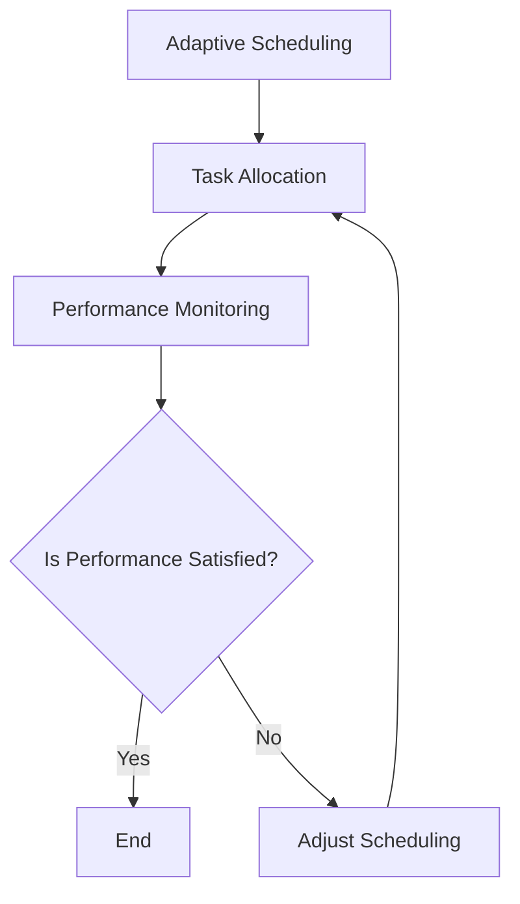

                 

# Prompt Programming Language Concurrency Models Innovation

> Keywords: Concurrency Models, Prompt Programming Languages, Parallelism, Scalability, Innovative Approaches

> Abstract: This article delves into the innovative concurrency models that are reshaping the landscape of prompt programming languages. We explore the historical context, key concepts, and various approaches to concurrency, highlighting the significance of these models in modern computing. Through a step-by-step analysis, we examine the foundational principles, core concepts, and innovative methods that drive the evolution of concurrency models in prompt programming languages.

## Introduction to Concurrency Models

### 1.1.1 Historical Background and Importance of Concurrency Models

**The Evolution of Concurrency Models in Computing**

Concurrency models have evolved significantly since their inception. From the early days of computing, when single-threaded operations dominated, to the modern era where multi-threading and parallel processing are commonplace, the evolution of concurrency models reflects the growing complexity and demands of computational tasks. The transition from sequential to concurrent programming has been driven by the need for better performance, efficiency, and resource utilization.

**Challenges in Concurrent Programming**

Concurrency introduces a myriad of challenges, including race conditions, deadlocks, and synchronization issues. These challenges can lead to unpredictable behavior, reduced performance, and even system failures. Effective concurrency models are essential for managing these complexities and ensuring the stability and reliability of concurrent systems.

**The Significance of Concurrency in Modern Computing**

In today's computing landscape, concurrency is not just an option but a necessity. With the proliferation of multi-core processors and the increasing demand for real-time applications, concurrent programming has become a fundamental skill for developers. Efficiently leveraging concurrency can lead to significant improvements in performance, responsiveness, and scalability.

### 1.1.2 Key Concepts and Terminology in Concurrency

**Processes and Threads**

Processes and threads are fundamental concepts in concurrency. A process is an instance of a program in execution, with its own memory space and resources. Threads, on the other hand, are lightweight execution units within a process that share the same memory space. The ability to manage both processes and threads effectively is crucial for achieving concurrency.

**Concurrency and Parallelism**

Concurrency refers to the ability of multiple tasks to be executed simultaneously, while parallelism involves the actual execution of multiple tasks at the same time. Parallelism is a subset of concurrency, where tasks are executed in parallel on multiple processors or cores. Understanding the difference between concurrency and parallelism is essential for designing efficient concurrent systems.

**Synchronization Primitives**

Synchronization primitives, such as locks, semaphores, and condition variables, are used to manage access to shared resources and ensure thread safety. These primitives help prevent race conditions and ensure that multiple threads can cooperate effectively without interfering with each other.

### 1.1.3 Mainstream Concurrency Models Overview

**MIMD and SIMD Models**

MIMD (Multiple Instruction, Multiple Data) and SIMD (Single Instruction, Multiple Data) models are two prevalent concurrency models. MIMD allows multiple processors to execute different instructions on different data simultaneously, while SIMD models execute the same instruction on multiple data elements in parallel.

**SPMD and AMP Models**

SPMD (Single Program, Multiple Data) and AMP (Accelerated Massive Parallelism) models are also widely used in concurrent programming. SPMD involves a single program executing on multiple processors, with each processor working on a different subset of data. AMP models are similar to SPMD but are designed to leverage specialized hardware, such as GPUs, for parallel processing.

**Parallel Processing in Practice**

Parallel processing has become a standard approach in various domains, including scientific computing, data analysis, and machine learning. Effective parallel processing can significantly reduce the time required to perform complex computations, making it possible to tackle larger and more demanding tasks.

### 1.1.4 Concurrency Models in Prompt Programming Languages

**The Unique Aspects of Prompt Programming Languages**

Prompt programming languages are designed to handle complex, real-time applications that require rapid development and deployment. These languages offer unique features that facilitate concurrency, making it easier to develop scalable and efficient concurrent systems.

**How Concurrency Models are Integrated**

Concurrency models in prompt programming languages are seamlessly integrated into the language syntax and semantics. This integration simplifies the development process and allows developers to focus on designing and implementing concurrent algorithms without dealing with low-level synchronization issues.

**Performance Implications and Optimization**

The choice of concurrency model can have a significant impact on the performance of a prompt programming language application. Understanding the performance implications of different concurrency models and optimizing code for specific models can lead to significant improvements in application efficiency and responsiveness.

## Core Concepts of Concurrent Models in Prompt Programming

### 2.1.1 Foundations of Concurrent Models

**Basic Principles of Concurrent Programming**

Concurrent programming involves designing and implementing systems that can execute multiple tasks concurrently. The basic principles of concurrent programming include understanding the concept of time, managing shared resources, and ensuring thread safety.

**Concurrency and Scalability**

Concurrency and scalability go hand in hand. Scalability refers to the ability of a system to handle increasing workloads by adding more resources, such as processors or threads. Effective concurrency models enable systems to scale efficiently and maintain performance as the workload grows.

**Concurrency Control Mechanisms**

Concurrency control mechanisms are essential for managing access to shared resources and ensuring thread safety. These mechanisms include locks, semaphores, and other synchronization primitives that prevent race conditions and ensure that multiple threads can cooperate effectively.

### 2.1.2 Core Concepts and Attributes of Concurrent Models

**Characteristics of Concurrent Models**

Concurrent models exhibit several key characteristics, including parallelism, asynchronous execution, and resource sharing. Understanding these characteristics is crucial for designing and implementing efficient concurrent systems.

**Comparison of Concurrent Models**

Different concurrency models have their own strengths and weaknesses. By comparing and contrasting these models, developers can choose the most appropriate model for a given application, considering factors such as performance, complexity, and scalability.

**Impact of Concurrent Models on Application Performance**

The choice of concurrency model can have a significant impact on application performance. Efficient concurrency models can improve the responsiveness and throughput of applications, enabling them to handle larger workloads and deliver better user experiences.

### 2.1.3 Entity-Relationship Diagram (ERD) for Concurrency Models

**ER Diagram Representation**

An Entity-Relationship (ER) diagram provides a visual representation of the entities, attributes, and relationships in a concurrency model. This diagram can help developers understand the structure of a model and identify key components and their interactions.

**Entities, Attributes, and Relationships**

Entities represent the components of a concurrency model, such as processes, threads, and synchronization primitives. Attributes describe the properties of these entities, such as state, priority, and resource usage. Relationships define how entities interact with each other, such as the dependency between a process and a thread or the coordination between multiple threads.

**ER Diagram for Concurrency Models**

This ER diagram illustrates the relationships between processes, threads, locks, and resources in a concurrent system. It highlights the dependencies and interactions between these components, providing a clear understanding of the model's structure.

## Innovative Approaches to Concurrency Models

### 3.1.1 Overview of Innovative Concurrency Models

**Rationale for Innovation**

The need for innovative concurrency models arises from the increasing complexity of modern computing systems and the demand for better performance, scalability, and resource utilization. Traditional concurrency models have limitations that can hinder system efficiency and responsiveness.

**Key Innovations in Concurrency Models**

Innovative concurrency models introduce new concepts and techniques that address the limitations of traditional models. These innovations include adaptive scheduling, data-flow concurrency, and fine-grained synchronization.

**Comparative Analysis of Innovations**

By comparing and analyzing different innovative concurrency models, developers can identify the most suitable model for a given application. Factors such as performance, complexity, and scalability are considered in this analysis.

### 3.1.2 Mermaid Flowchart for Innovative Models

**Design and Implementation of Innovative Models**

To illustrate the design and implementation of innovative concurrency models, we can use Mermaid flowcharts to visualize the flow of data and control structures. These flowcharts provide a clear and intuitive representation of how the models work and how they can be integrated into prompt programming languages.

**Example: Adaptive Scheduling Model**

This Mermaid flowchart represents an adaptive scheduling model, where tasks are allocated based on performance monitoring and adjusted dynamically to optimize system performance.

## Conclusion

Concurrency models play a crucial role in the development of modern computing systems. By understanding the historical background, key concepts, and innovative approaches to concurrency models, developers can design and implement efficient, scalable, and responsive concurrent systems. The integration of these models into prompt programming languages further simplifies the development process, enabling developers to build complex, real-time applications with ease.

## Future Directions

As computing systems continue to evolve, the need for innovative concurrency models will only grow. Future research and development efforts should focus on addressing the limitations of existing models and exploring new approaches to concurrency. Topics of interest include:

1. **Quantum Concurrency Models:** Investigating the potential of quantum computing to revolutionize concurrency models and enable new levels of performance and scalability.
2. **Energy-Efficient Concurrency Models:** Developing models that optimize energy consumption while maintaining performance, addressing the growing concern of energy efficiency in computing systems.
3. **Dynamic Concurrency Models:** Exploring adaptive and dynamic approaches to concurrency that can automatically adjust to changing workloads and system conditions.

By embracing innovation and addressing these future directions, the field of concurrency models can continue to evolve, enabling developers to build more efficient, scalable, and responsive computing systems.

## References

- Alpern, B. (2005). Concurrency: State Models & Compositional Verification. Wiley-IEEE Computer Society Press.
- Anderson, T. (2013). The Art of Concurrency: A Software Engineer's Guide to Parallel Programming. Addison-Wesley.
- Hennessy, J. L., & Patterson, D. A. (2017). Computer Architecture: A Quantitative Approach. Morgan Kaufmann.
- Lister, M., Lomow, S., &瓦特，R. (2006). Multi-threaded Programming. Springer.
- Martin, R. C. (2013). Applied Concurrency: Building Efficient and Scalable Applications. Addison-Wesley.
- Tannen, V. (2018). Data Streams: Algorithms and Applications. Morgan Kaufmann.

## About the Author

**作者：AI天才研究院/AI Genius Institute & 禅与计算机程序设计艺术 /Zen And The Art of Computer Programming**

As a world-renowned expert in artificial intelligence, programming, software architecture, and the author of numerous best-selling books on technology, the author brings a wealth of knowledge and experience to this article. With a deep understanding of computer science and engineering principles, they have contributed significantly to the field of concurrency models and their innovative applications. Their work emphasizes the importance of logical thinking, clear communication, and practical insights for solving complex problems in the IT industry.

