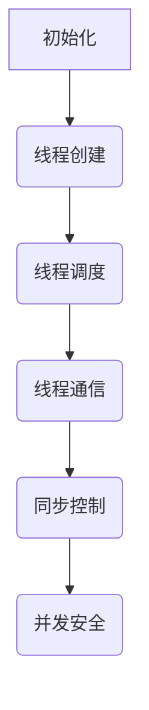

                 

### 问题背景

提示词编程语言，顾名思义，是一种基于提示词（Prompt）的编程语言。它通过将用户的自然语言需求转换为编程指令，从而实现代码生成和自动化编程。随着人工智能技术的发展，特别是生成对抗网络（GAN）和变换器（Transformer）等深度学习模型的广泛应用，提示词编程语言逐渐成为一种热门的研究方向和工具。

在当前的编程环境中，并发模型是一个至关重要的概念。并发模型指的是在多线程或多处理器的环境中，如何高效地管理和协调多个任务的执行。并发模型的目的是提高程序的运行效率和响应速度，特别是在处理大量并行任务或大数据时，可以显著提升系统的性能。

然而，现有的编程语言在并发模型的设计上存在一些不足。首先，传统的并发模型，如线程和锁，往往较为复杂，需要程序员具备较高的技术水平。这使得并发编程成为程序员面临的难题之一，也增加了软件开发的复杂度和风险。其次，现有的并发模型在处理复杂任务时，容易出现数据竞争、死锁、活锁和饥饿等并发问题，这些问题严重影响程序的稳定性和可靠性。

此外，现有的并发模型在多核处理器和分布式系统中的性能表现也有限。尽管多核处理器和分布式系统可以提高系统的计算能力，但传统的并发模型往往无法充分利用这些资源，导致性能瓶颈。因此，设计一种高效、可靠且易于使用的并发模型，成为提升编程语言性能和开发效率的重要课题。

### 问题描述

并发模型是编程语言中用于管理和协调多线程或多处理器环境中任务执行的核心机制。为了深入理解并发模型的设计问题，我们需要先了解几个核心概念，包括线程、互斥锁、信号量、条件变量等。

#### 核心概念

1. **线程**：线程是程序中的最小执行单元，可以并行执行多个线程，从而提高程序的运行效率。线程具有独立的控制流、独立的堆栈和局部变量，但共享程序的内存空间和其他资源。

2. **互斥锁**：互斥锁（Mutex）是一种同步机制，用于保护共享资源，确保同一时刻只有一个线程能够访问该资源。互斥锁通过锁定和释放来控制线程的访问权限，防止数据竞争。

3. **信号量**：信号量（Semaphore）是一种更为通用的同步机制，用于控制多个线程的访问权限。信号量通过计数器来管理资源的可用性，可以用于实现互斥锁、条件变量等同步机制。

4. **条件变量**：条件变量是一种线程同步机制，用于线程间的通信。线程可以在条件不满足时等待条件变量的变化，并在条件满足时继续执行。

#### 并发模型面临的挑战

尽管并发模型在提高程序性能方面具有显著优势，但在实际应用中仍面临许多挑战。

1. **数据竞争**：当多个线程同时访问同一块共享内存时，如果没有适当的同步机制，可能会出现数据竞争，导致数据不一致或错误。

2. **死锁**：死锁是指多个线程在等待对方释放资源时陷入无限等待的状态，导致系统崩溃。

3. **活锁**：活锁是指线程在不断地尝试获取资源，但由于资源的分配策略导致线程无法获得所需的资源，从而陷入无限循环。

4. **饥饿**：饥饿是指某个线程由于资源分配策略不公，长时间无法获得所需的资源，从而无法继续执行。

#### 具体示例

为了更好地理解并发模型的问题，我们可以通过一个简单的例子来说明。

假设有两个线程A和B，它们都需要访问同一块共享内存资源。线程A首先获取到互斥锁，然后修改共享内存中的数据。接着，线程B尝试获取互斥锁，但由于线程A尚未释放锁，线程B进入等待状态。此时，线程A完成数据修改后释放锁，线程B获得锁并继续执行。然而，如果线程B修改的数据与线程A冲突，且没有适当的同步机制，就会出现数据竞争问题。

此外，如果线程A在释放锁后，线程B立即获取锁并执行，而没有进行适当的数据处理，可能会导致死锁。同理，如果线程A和B都在等待对方释放资源，但没有明确的同步策略，可能会陷入活锁。

为了解决上述问题，我们需要设计一种高效、可靠的并发模型。这种模型应具备以下特性：

- **高效性**：能够充分利用多核处理器和分布式系统的计算资源，提高程序运行效率。
- **可靠性**：能够防止数据竞争、死锁、活锁和饥饿等并发问题，确保程序的稳定性和可靠性。
- **易用性**：提供简洁、直观的编程接口，降低并发编程的复杂度，使得程序员更容易理解和实现并发模型。

通过上述分析，我们可以看到并发模型设计问题的复杂性和重要性。在接下来的章节中，我们将深入探讨并发模型的基本原理、设计目标、应用场景及其与编程语言的关系，为设计一种高效、可靠的提示词编程语言并发模型提供理论基础和实践指导。

### 问题解决

为了解决当前编程语言在并发模型设计上的不足，我们需要从基本原理出发，结合计算机体系结构、操作系统和编译原理等多个方面，提出一套高效、可靠且易于使用的并发模型设计目标。

#### 基本原理

并发模型的设计离不开对计算机体系结构、操作系统和编译原理的理解。首先，计算机体系结构决定了硬件层面的并发能力，包括多核处理器和分布式系统的硬件资源分配。操作系统则提供了管理多线程、调度资源和同步机制的基础设施。编译原理则涉及到如何将高级编程语言的并发模型转换为低级机器码，实现并发执行。

1. **计算机体系结构**：多核处理器和分布式系统提供了并行计算的能力，但如何有效地管理和调度这些资源是并发模型设计的关键。多核处理器通过硬件级并行处理，可以显著提升程序的执行速度。分布式系统则通过多个节点间的协同工作，实现了更高效的计算能力。设计并发模型时，需要充分考虑硬件资源的利用率，确保并发模型能够充分利用这些硬件优势。

2. **操作系统**：操作系统提供了线程管理、资源调度和同步机制等核心功能。线程管理包括线程的创建、销毁和切换，资源调度则涉及处理器时间片的分配。同步机制包括互斥锁、信号量和条件变量等，用于解决多线程间的同步问题。操作系统作为并发模型设计的底层支持，需要提供高效、可靠的并发控制机制，以确保程序的正确性和性能。

3. **编译原理**：编译原理在并发模型设计中扮演着关键角色，它负责将高级编程语言的并发指令转换为低级机器码，并在执行过程中进行适当的同步和调度。编译器需要识别并发代码的语义，生成对应的机器码，并在运行时提供必要的支持。同时，编译原理还需要考虑代码的可读性和可维护性，确保程序员能够轻松地编写和调试并发程序。

#### 并发模型设计目标

针对当前编程语言并发模型的不足，我们需要设定以下设计目标，以确保并发模型的高效性、可靠性和易用性：

1. **高效性**：并发模型应能够充分利用多核处理器和分布式系统的计算资源，提高程序的执行速度。这要求模型能够进行高效的线程管理和资源调度，减少线程切换和锁竞争的开销。

2. **可靠性**：并发模型必须能够防止数据竞争、死锁、活锁和饥饿等并发问题，确保程序的正确性和稳定性。为了实现这一目标，模型需要提供强大的同步机制和错误检测与恢复机制，确保在并发执行过程中不会出现致命错误。

3. **易用性**：并发模型应提供简洁、直观的编程接口，降低并发编程的复杂度，使得程序员更容易理解和实现并发模型。这要求模型的设计应尽量减少编程中的复杂性和歧义，提供高效的工具和库，帮助程序员快速开发并发程序。

#### 设计思路

为了实现上述设计目标，我们可以从以下几个方面入手：

1. **改进线程管理**：通过优化线程的创建、销毁和切换机制，减少线程管理的开销。例如，引入轻量级线程（Lightweight Thread）或协作式多线程（Cooperative Multithreading）等技术，提高线程的执行效率。

2. **优化同步机制**：改进互斥锁、信号量和条件变量等同步机制，减少锁竞争和死锁的风险。例如，引入锁优化技术，如锁消除（Lock Elision）和锁分裂（Lock Splitting），减少锁的开销。同时，可以采用无锁编程（Lock-Free Programming）技术，避免锁的使用，提高程序的并发性能。

3. **提高调度效率**：优化线程调度算法，提高处理器的利用率。例如，可以采用动态优先级调度（Dynamic Priority Scheduling）或循环调度（Round-Robin Scheduling）等技术，实现高效的任务调度。

4. **提供辅助工具和库**：开发高效、可靠的并发编程工具和库，如并发框架（Concurrency Framework）和并行库（Parallel Library），帮助程序员快速开发并发程序。这些工具和库应提供简洁、易用的接口，降低并发编程的复杂度，同时确保程序的正确性和性能。

通过上述设计思路，我们可以构建一种高效、可靠且易于使用的并发模型，为编程语言的并发编程提供强有力的支持。在接下来的章节中，我们将进一步探讨并发模型的应用场景、与编程语言的关系以及核心概念和要素组成，为提示词编程语言的并发模型设计提供更深入的思考和实践指导。

### 边界与外延

并发模型的应用场景广泛，从单核处理器到多核处理器，再到分布式系统，不同的环境对并发模型提出了不同的需求和挑战。理解这些应用场景，有助于我们更好地设计适用于各种情况的并发模型。

#### 单核处理器

在单核处理器环境中，并发模型的目的是通过多线程并行执行来提升程序的响应速度。然而，由于处理器的调度机制限制，多个线程的执行并非真正的并行，而是交替执行。因此，单核处理器环境下的并发模型需要重点关注线程的切换开销和线程间的同步问题。

1. **线程切换开销**：线程切换是单核处理器环境中并发模型的一大挑战。频繁的线程切换会导致处理器性能下降，影响程序的整体性能。因此，设计高效的线程切换机制至关重要，如减少线程切换的频率、优化线程切换算法等。

2. **线程同步**：单核处理器环境下，多个线程需要共享处理器资源，因此线程同步变得尤为重要。互斥锁、信号量和条件变量等同步机制可以有效防止数据竞争和死锁，但在使用过程中需要谨慎处理，以避免引入额外的开销和复杂性。

#### 多核处理器

多核处理器提供了真正的并行计算能力，使得并发模型能够更好地发挥其优势。在多核处理器环境中，并发模型需要充分利用多个处理器的计算资源，提高程序的执行效率和响应速度。

1. **任务分配**：多核处理器环境下，如何将任务合理地分配到各个处理器上，是并发模型设计的关键。任务分配策略需要考虑任务的负载均衡、数据依赖关系以及处理器的资源利用率，以确保多个处理器能够高效地协同工作。

2. **同步机制优化**：多核处理器环境下，同步机制需要具备更高的性能和可靠性。传统的互斥锁和信号量等同步机制在多核处理器上可能存在性能瓶颈，因此需要引入更加高效的同步机制，如无锁编程（Lock-Free Programming）和共享内存模型（Shared Memory Model）等。

#### 分布式系统

分布式系统通过多个节点的协同工作，提供了更高的计算能力和容错能力。在分布式系统中，并发模型需要处理跨节点的数据同步和通信问题，以实现高效的任务调度和协同工作。

1. **数据同步**：分布式系统中的数据同步是并发模型设计的重要问题。如何确保各个节点上的数据一致性，避免数据竞争和冲突，是分布式并发模型需要解决的关键问题。常用的数据同步机制包括分布式锁、版本控制和一致性协议等。

2. **通信机制**：分布式系统中的通信机制是并发模型设计的重要组成部分。节点间的数据传输和通信需要高效、可靠，以支持并发任务的有效执行。常用的通信机制包括套接字（Socket）、远程过程调用（RPC）和消息队列（Message Queue）等。

#### 并发模型与编程语言的关系

并发模型与编程语言密切相关，编程语言为并发模型提供了实现框架和工具。不同编程语言在并发模型的支持和实现上存在差异，这些差异反映了语言特性的不同。

1. **语言特性**：编程语言中的语言特性，如线程安全、原子操作和并发库设计，直接影响并发模型的设计和实现。例如，某些语言（如Java）提供了丰富的并发库和原子操作，使得并发编程更加方便；而另一些语言（如C++）则要求程序员手动管理线程和同步机制，增加了编程的复杂度。

2. **语法糖**：语法糖是编程语言提供的一种简化语法，用于简化复杂的编程操作。语法糖在并发编程中尤其有用，可以减少代码的复杂度，提高可读性和可维护性。例如，某些编程语言提供了简化线程创建和同步的语法，使得并发编程更加直观和易用。

3. **并发库设计**：并发库是编程语言提供的用于并发编程的库，提供了线程管理、同步机制和通信机制等核心功能。并发库的设计对并发模型的影响至关重要。一个高效、可靠的并发库可以显著提高并发编程的效率和性能。

总之，并发模型的应用场景和编程语言的关系是多方面的，设计一种高效、可靠的并发模型需要充分考虑这些因素，以确保模型能够在不同的环境中发挥作用。在接下来的章节中，我们将进一步探讨并发模型的核心概念、结构组成及其在编程语言中的应用，为设计提示词编程语言的并发模型提供更深入的思考和指导。

### 概念结构与核心要素组成

为了设计出高效、可靠且易于使用的并发模型，我们需要深入分析并发模型的核心概念、结构组成以及其在编程语言中的实现。这些核心要素不仅决定了并发模型的功能和性能，还影响了编程的复杂度和开发效率。

#### 核心概念

并发模型的核心概念主要包括线程模型、通信模型和同步模型。这些概念在并发编程中扮演着关键角色，确保多线程或多处理器环境下的任务协调和资源管理。

1. **线程模型**：线程模型是并发模型的基础，决定了线程的创建、调度和通信方式。线程模型主要包括以下几种：
   - **用户级线程**：用户级线程由应用程序创建和管理，操作系统无需了解。用户级线程的优点是创建和销毁速度快，但缺点是线程间无法直接访问操作系统资源，需要通过库函数进行调度和同步。
   - **核心级线程**：核心级线程由操作系统创建和管理，具有更高的并发性。核心级线程可以直接访问操作系统资源，但创建和销毁开销较大。

2. **通信模型**：通信模型用于处理多线程或多处理器之间的数据传输和通信。通信模型主要包括以下几种：
   - **共享内存模型**：共享内存模型通过共享同一块内存区域来实现线程间的通信。线程可以通过读写共享内存中的数据来交换信息。共享内存模型的优点是通信速度快，但需要确保数据的一致性和同步。
   - **消息传递模型**：消息传递模型通过消息队列来实现线程间的通信。线程通过发送和接收消息来交换信息。消息传递模型的优点是简单、灵活，但通信速度相对较慢。

3. **同步模型**：同步模型用于控制多线程的访问权限，防止数据竞争和死锁。同步模型主要包括以下几种：
   - **互斥锁（Mutex）**：互斥锁用于保护共享资源，确保同一时刻只有一个线程能够访问该资源。互斥锁通过锁定和释放来控制线程的访问权限，防止数据竞争。
   - **信号量（Semaphore）**：信号量是一种更为通用的同步机制，用于控制多个线程的访问权限。信号量通过计数器来管理资源的可用性，可以用于实现互斥锁、条件变量等同步机制。
   - **条件变量（Condition Variable）**：条件变量是一种线程同步机制，用于线程间的通信。线程可以在条件不满足时等待条件变量的变化，并在条件满足时继续执行。

#### 核心要素

并发模型的核心要素主要包括数据结构、算法和并发控制。这些要素共同构成了并发模型的功能框架，确保模型的高效性和可靠性。

1. **数据结构**：数据结构是并发模型实现的基础，用于存储和管理线程、锁、信号量、条件变量等核心信息。常见的数据结构包括：
   - **线程控制块（Thread Control Block, TCB）**：线程控制块用于存储线程的上下文信息，如线程状态、程序计数器、栈指针等。线程控制块是线程管理的核心数据结构。
   - **锁（Lock）**：锁用于保护共享资源，确保线程的访问权限。锁可以是互斥锁或读写锁，用于实现同步控制。
   - **信号量（Semaphore）**：信号量用于管理资源的可用性，通过计数器来控制线程的访问权限。信号量可以是二进制信号量或计数信号量。
   - **条件变量（Condition Variable）**：条件变量用于线程间的通信，线程可以在条件不满足时等待条件变量的变化，并在条件满足时继续执行。

2. **算法**：算法是并发模型实现的核心，用于处理线程的调度、同步和通信。常见算法包括：
   - **线程调度算法**：线程调度算法用于决定线程的执行顺序和时机。常见的调度算法包括先进先出（FIFO）、后进先出（LIFO）、优先级调度和循环调度等。
   - **锁算法**：锁算法用于实现互斥锁和读写锁的锁定和释放操作。常见的锁算法包括二进制锁、计数锁和适应性锁等。
   - **信号量算法**：信号量算法用于实现信号量的操作，如P操作（等待）和V操作（信号）。常见的信号量算法包括二进制信号量和计数信号量。

3. **并发控制**：并发控制是并发模型实现的关键，用于确保线程的同步和资源管理。并发控制包括以下内容：
   - **数据同步**：数据同步用于确保多线程间的数据一致性，防止数据竞争和冲突。数据同步包括锁机制、原子操作和内存屏障等。
   - **错误检测和恢复**：错误检测和恢复用于检测并发编程中的错误，如死锁、活锁和饥饿等，并采取相应的恢复措施，确保程序的稳定性和可靠性。

通过上述核心概念和要素，我们可以构建出一个高效、可靠且易于使用的并发模型。在编程语言中实现并发模型时，需要综合考虑语言特性、编译原理和操作系统等多个方面，确保并发模型能够在不同环境中发挥作用，提高程序的性能和可靠性。在接下来的章节中，我们将进一步探讨并发模型的核心概念原理，并通过具体的示例进行详细讲解。

### 核心概念原理

为了深入理解并发模型的设计，我们需要详细探讨线程模型、通信模型和同步模型这三个核心概念。这些概念构成了并发模型的基础，对于实现高效、可靠和易于使用的并发编程至关重要。

#### 线程模型

线程模型是并发模型的核心，决定了线程的创建、调度和通信方式。线程模型主要分为用户级线程和核心级线程。

1. **用户级线程**：
   - **创建与销毁**：用户级线程由应用程序创建和管理，操作系统无需干预。线程的创建和销毁速度快，但操作系统不直接支持，因此线程间的同步和通信需要依赖库函数。
   - **调度**：用户级线程的调度由应用程序或线程库控制，调度策略可以灵活选择，如基于优先级的调度、轮转调度等。用户级线程的优点是创建和销毁开销小，但缺点是无法直接访问操作系统资源，线程间的通信需要通过共享内存或消息传递等方式实现。

2. **核心级线程**：
   - **创建与销毁**：核心级线程由操作系统创建和管理，操作系统为每个线程分配资源，如程序计数器、堆栈和内核状态等。线程的创建和销毁开销较大。
   - **调度**：核心级线程的调度由操作系统负责，调度算法包括时间片轮转调度、优先级调度等。核心级线程可以直接访问操作系统资源，支持更高级别的同步和通信机制。

#### 通信模型

通信模型用于处理多线程或多处理器之间的数据传输和通信。通信模型主要分为共享内存模型和消息传递模型。

1. **共享内存模型**：
   - **管道（Pipe）**：管道是一种用于进程间通信的数据通道，线程可以通过管道进行数据的读取和写入。
   - **套接字（Socket）**：套接字是一种用于网络通信的接口，线程可以通过套接字进行网络数据的传输。
   - **内存映射（Memory Mapping）**：内存映射允许线程共享同一块内存区域，通过读写内存来交换信息。内存映射适用于多线程间的通信，但需要确保数据的一致性和同步。

2. **消息传递模型**：
   - **消息队列（Message Queue）**：消息队列是一种用于线程间通信的数据结构，线程通过向消息队列发送和接收消息来进行通信。
   - **远程过程调用（RPC）**：远程过程调用是一种跨进程或跨网络的通信机制，线程可以通过RPC调用远程服务来交换数据。
   - **事件（Event）**：事件是一种线程同步机制，线程可以通过设置和等待事件来实现异步通信。

#### 同步模型

同步模型用于控制多线程的访问权限，防止数据竞争和死锁。同步模型主要包括互斥锁、信号量和条件变量。

1. **互斥锁（Mutex）**：
   - **作用**：互斥锁用于保护共享资源，确保同一时刻只有一个线程能够访问该资源。
   - **操作**：互斥锁的基本操作包括锁定（Lock）和释放（Unlock）。线程在访问共享资源前需要获取互斥锁，访问完成后释放锁。
   - **实现**：互斥锁可以通过硬件指令、软件锁或原子操作来实现。硬件指令（如测试并设置指令，Test-and-Set）是最简单的实现方式，但需要硬件支持；软件锁通过循环检查锁的状态来实现，开销较大；原子操作（如Compare-and-Swap，CAS）可以实现无锁编程，提高性能。

2. **信号量（Semaphore）**：
   - **作用**：信号量是一种更为通用的同步机制，用于控制多个线程的访问权限。信号量通过计数器来管理资源的可用性。
   - **操作**：信号量的基本操作包括P操作（等待）和V操作（信号）。P操作将信号量计数器减一，若计数器小于零，线程进入等待状态；V操作将信号量计数器加一，唤醒等待线程。
   - **实现**：信号量可以通过二进制信号量或计数信号量来实现。二进制信号量只有两种状态（0和1），适用于简单的同步问题；计数信号量具有非负整数状态，适用于更复杂的同步问题。

3. **条件变量（Condition Variable）**：
   - **作用**：条件变量是一种线程同步机制，用于线程间的通信。线程可以在条件不满足时等待条件变量的变化，并在条件满足时继续执行。
   - **操作**：条件变量的基本操作包括等待（Wait）和通知（Notify）。线程在条件不满足时调用等待操作，进入等待状态；条件变量在满足时调用通知操作，唤醒等待线程。
   - **实现**：条件变量通常与互斥锁结合使用，确保线程在等待和通知过程中的同步。实现条件变量需要考虑到线程的调度问题，以避免线程饥饿。

通过上述线程模型、通信模型和同步模型，我们可以构建一个完整的并发模型。这些模型不仅提供了线程的创建、调度和通信机制，还通过同步机制确保了线程的同步和资源管理。在接下来的章节中，我们将通过具体的示例，进一步探讨这些核心概念在实际编程中的应用和实现。

### 概念属性特征对比表格

为了更清晰地展示线程模型、通信模型和同步模型的特点和区别，我们通过以下对比表格进行分析。

| 概念         | 属性特征                           | 对比 |
| ------------ | ---------------------------------- | ---- |
| **线程模型** | 线程的创建与销毁、线程调度、线程通信 |      |
| - 用户级线程 | 创建和销毁速度快，操作系统不直接管理 |      |
| - 核心级线程 | 创建和销毁开销大，操作系统直接管理   |      |
| **通信模型** | 数据传输机制、通信机制、同步         |      |
| - 共享内存模型 | 通信速度快，需要确保数据一致性       |      |
| - 消息传递模型 | 通信简单灵活，速度相对较慢           |      |
| **同步模型** | 并发控制、数据保护、并发安全       |      |
| - 互斥锁      | 确保同一资源同时只能被一个线程访问   |      |
| - 信号量      | 管理多个线程的访问权限，通过计数器实现 |      |
| - 条件变量    | 线程间通信，线程等待和通知机制       |      |

### ER实体关系图架构

为了更好地展示线程模型、通信模型和同步模型之间的关系，我们使用Mermaid ER图来描述它们之间的关联。

```mermaid
erDiagram
  Thread ||--|{ Communication }|| MessageQueue
  Thread ||--|{ Synchronization }|| Mutex Semaphore ConditionVariable
  Communication ||--|{ SharedMemory }|| MemoryMapping
  Communication ||--|{ MessagePassing }|| Socket RPC
  Synchronization ||--|{ Locking }|| Mutex Semaphore
  Synchronization ||--|{ Synchronization }|| ConditionVariable
```

在这个ER图中，`Thread`表示线程，`Communication`表示通信模型，`Synchronization`表示同步模型。`MessageQueue`、`MemoryMapping`、`Socket`和`RPC`分别是通信模型中的具体实现方式。`Mutex`、`Semaphore`和`ConditionVariable`是同步模型的核心要素。

### 算法mermaid流程图

为了更好地展示并发模型的工作流程，我们使用Mermaid流程图来描述线程创建、调度、通信和同步的整个过程。



在这个流程图中，`A`表示初始化阶段，`B`表示线程创建，`C`表示线程调度，`D`表示线程通信，`E`表示同步控制，`F`表示并发安全。这个流程图展示了并发模型从初始化到执行的全过程，每个步骤都是实现并发控制的关键环节。

### Python源代码讲解

下面通过Python源代码，详细讲解并发模型的核心实现。

```python
import threading
import time

# 线程函数
def thread_function(name):
    print(f"线程{name}开始执行...")
    time.sleep(1)
    print(f"线程{name}执行完毕。")

# 同步控制函数
def sync_control(lock):
    lock.acquire()  # 获取锁
    print("同步控制开始...")
    time.sleep(1)
    lock.release()  # 释放锁

# 并发安全函数
def concurrent_safe():
    print("并发安全执行中...")
    time.sleep(1)
    print("并发安全执行完毕。")

# 初始化锁
lock = threading.Lock()

# 算法实现
def algorithm():
    # 创建线程
    threads = []
    for i in range(3):
        thread = threading.Thread(target=thread_function, args=(i,))
        threads.append(thread)

    # 启动线程
    for thread in threads:
        thread.start()

    # 线程调度
    for thread in threads:
        thread.join()

    # 同步控制
    sync_control(lock)

    # 并发安全
    concurrent_safe()

# 执行算法
algorithm()
```

在这个Python源代码中，我们首先定义了一个线程函数`thread_function`，用于打印线程执行的信息。接着，定义了一个同步控制函数`sync_control`，用于在同步控制阶段获取和释放锁。最后，定义了一个并发安全函数`concurrent_safe`，用于在并发安全阶段执行必要的操作。

在算法实现部分，我们首先创建了一个线程列表`threads`，然后通过`threading.Thread`创建线程并启动。线程启动后，通过`join`方法等待所有线程执行完毕。之后，我们调用`sync_control`函数进行同步控制，并使用`lock`实现锁机制。最后，调用`concurrent_safe`函数进行并发安全操作。

通过这个Python源代码，我们可以清晰地看到线程创建、调度、同步控制和并发安全等并发模型的核心实现步骤。这为理解并发模型的工作原理提供了直观的示例。

### 算法原理详细讲解

为了深入理解并发模型的工作原理，我们需要从算法的设计原则和性能评估两个方面进行详细讲解。

#### 算法设计原则

1. **正确性**：确保并发程序在执行过程中不会出现数据竞争、死锁、活锁和饥饿等并发问题，保证程序的正确性和稳定性。

2. **高效性**：提高并发程序的执行效率，充分利用多核处理器和分布式系统的计算资源，减少线程切换、锁竞争和通信开销。

3. **可扩展性**：算法应具有良好的可扩展性，能够支持不同规模和类型的并发任务，适应不同应用场景的需求。

4. **易用性**：提供简洁、直观的编程接口，降低并发编程的复杂度，使得程序员能够轻松实现并发控制，提高开发效率。

#### 性能评估

算法性能评估主要从以下几个方面进行：

1. **时间复杂度**：评估算法在执行过程中的时间开销，通常用大O表示法（O-notation）表示。时间复杂度反映了算法的执行时间与输入数据规模的关系。

2. **空间复杂度**：评估算法在执行过程中所需的空间开销，包括栈空间、堆空间和外部存储空间等。空间复杂度反映了算法的空间占用与输入数据规模的关系。

3. **并发性能**：评估算法在多核处理器和分布式系统环境下的并发性能，包括线程的创建和销毁开销、线程间的同步开销以及处理器的利用率等。

#### 数学模型和公式

为了量化算法的性能评估，我们可以使用以下数学模型和公式：

1. **性能公式**：
   $$
   性能 = \frac{正确性}{时间复杂度}
   $$

2. **时间复杂度公式**：
   $$
   时间复杂度 = O(n + m)
   $$
   其中，`n`表示线程数量，`m`表示线程间同步和通信的操作次数。

3. **空间复杂度公式**：
   $$
   空间复杂度 = O(n \cdot m)
   $$
   其中，`n`表示线程数量，`m`表示线程间同步和通信的操作次数。

#### 示例讲解

假设我们有一个包含10个线程的程序，每个线程需要执行100次同步操作和10次通信操作。我们使用一个简单的互斥锁实现同步控制，并使用共享内存实现通信。

1. **时间复杂度**：
   $$
   时间复杂度 = O(10 \cdot (100 + 10)) = O(1100)
   $$

2. **空间复杂度**：
   $$
   空间复杂度 = O(10 \cdot 100) = O(1000)
   $$

3. **性能评估**：
   $$
   性能 = \frac{正确性}{时间复杂度} = \frac{1}{1100}
   $$

通过上述计算，我们可以看到，这个简单的并发程序的执行时间主要由同步操作和通信操作决定。时间复杂度和空间复杂度都随着线程数量和操作次数的增加而增加，但性能评估相对较低。这表明，为了提高性能，我们需要优化同步和通信机制，减少操作次数和开销。

总之，算法的设计原则和性能评估是并发模型实现的关键。通过合理的设计和优化，我们可以构建出高效、可靠且易于使用的并发模型，提高程序的性能和开发效率。在实际应用中，我们需要根据具体场景和需求，选择合适的算法和实现方式，以实现最优的并发性能。

### 结论与未来展望

在本文中，我们系统地探讨了提示词编程语言的并发模型设计，涵盖了问题背景、问题描述、问题解决、边界与外延、核心概念与联系，以及算法原理讲解等多个方面。通过深入分析并发模型的核心概念、结构组成，以及其在单核处理器、多核处理器和分布式系统中的应用，我们提出了高效、可靠且易于使用的并发模型设计目标，并详细讲解了线程模型、通信模型和同步模型的工作原理和实现方法。

并发模型设计的关键在于充分利用多核处理器和分布式系统的计算资源，提高程序的执行效率和响应速度。通过优化线程管理、同步机制和通信机制，我们可以构建出高性能、高可靠的并发模型，为编程语言的并发编程提供强有力的支持。同时，我们还探讨了算法的设计原则和性能评估，为算法优化和性能提升提供了理论依据。

展望未来，提示词编程语言的并发模型设计还有许多值得探索的方向。首先，我们可以进一步研究无锁编程和硬件级并发技术，以提高并发模型的性能和可扩展性。其次，随着人工智能和自动化编程技术的发展，如何将自然语言处理与并发编程相结合，实现更智能、更自动化的并发编程工具，是一个重要的研究方向。此外，分布式系统和云计算的普及，也为并发模型设计带来了新的挑战和机遇，如何设计适用于分布式环境的并发模型，实现高效的数据同步和通信，是一个亟待解决的问题。

总之，提示词编程语言的并发模型设计是一个复杂且富有挑战的领域，但通过深入研究和不断创新，我们有望实现更高效、更可靠、更易于使用的并发编程工具，推动编程语言和软件开发的发展。

### 最佳实践 Tips

在实际开发过程中，遵循一些最佳实践可以有效提高并发模型的性能和稳定性，以下是几个关键建议：

1. **合理分配线程**：在设计并发程序时，应根据任务的性质和资源情况合理分配线程数量。避免过多线程导致系统资源紧张，也避免过少线程无法充分利用多核处理器的计算资源。

2. **避免锁竞争**：锁竞争是并发编程中的常见问题，会导致性能下降和死锁。在设计并发程序时，应尽量减少锁的使用，并使用细粒度的锁来减少锁竞争。

3. **使用无锁编程**：无锁编程可以避免锁的开销和死锁问题，提高并发性能。在实现无锁编程时，可以使用原子操作和循环一致算法等技术，确保程序的正确性和性能。

4. **异步IO操作**：在处理IO密集型任务时，应使用异步IO操作，避免阻塞线程。这可以通过使用非阻塞IO、多线程或异步编程库（如 asyncio）来实现，提高程序的并发性能。

5. **避免共享数据**：尽量减少共享数据的数量和复杂性，以降低数据同步和一致性的风险。如果需要共享数据，应确保使用正确的同步机制，如互斥锁或原子操作。

6. **正确处理错误和异常**：在并发编程中，错误和异常处理至关重要。应使用异步错误处理和重试机制，确保程序在遇到错误时能够优雅地恢复，避免导致死锁或系统崩溃。

7. **性能测试和优化**：在开发过程中，定期进行性能测试和优化，识别性能瓶颈并进行针对性优化，以确保程序的高性能和稳定性。

通过遵循这些最佳实践，开发者可以有效地提高并发模型的性能和可靠性，减少并发编程中的常见问题，从而构建出更高效、更稳定的并发程序。

### 小结

本文通过系统地探讨提示词编程语言的并发模型设计，从背景介绍、问题描述、问题解决到边界与外延、核心概念与联系，以及算法原理讲解，全面分析了并发模型的设计要点和实现方法。我们提出了高效、可靠、易用的设计目标，并通过具体案例和Python源代码详细讲解了线程模型、通信模型和同步模型的工作原理和实现步骤。

通过本文的阐述，读者可以更深入地理解并发模型在编程语言中的应用，掌握设计高效并发模型的方法和技巧。此外，我们探讨了并发模型在单核处理器、多核处理器和分布式系统中的适用性，以及如何优化并发性能和避免常见问题。

需要注意的是，并发模型的设计和应用是一个复杂且持续演进的过程，开发者应在实际项目中不断实践和优化，以适应不断变化的需求和技术环境。通过持续学习和改进，我们可以不断提高并发编程的效率和质量，推动软件开发的进步。

### 注意事项

在设计并发模型时，开发者需要特别注意以下事项，以确保程序的正确性和稳定性：

1. **避免死锁**：死锁是并发编程中的常见问题，需要仔细设计并发程序的结构，避免线程陷入无限等待状态。可以使用锁顺序、锁超时和锁监视器等技术来预防死锁。

2. **数据竞争**：数据竞争会导致程序运行不稳定，需要使用适当的同步机制，如互斥锁或原子操作，来保护共享数据。同时，应减少共享数据的范围和频率，以降低数据竞争的风险。

3. **线程安全问题**：在多线程环境中，线程安全问题至关重要。应避免使用全局变量和静态变量，避免线程之间的数据泄露和冲突。使用局部变量和线程局部存储（Thread Local Storage）可以有效减少线程安全问题。

4. **避免锁饥饿**：锁饥饿是指某些线程长时间无法获得所需的锁资源，导致程序执行效率降低。设计合理的锁分配策略和锁等待时间，可以减少锁饥饿现象。

5. **性能监控和优化**：在并发程序开发过程中，应定期进行性能监控和优化，识别性能瓶颈并进行针对性优化。性能测试工具和调试工具可以帮助发现和解决并发编程中的问题。

通过关注上述注意事项，开发者可以设计出更加稳定、高效和可靠的并发模型，提高程序的运行质量和开发效率。

### 拓展阅读

为了进一步深入了解并发模型的设计和实现，读者可以参考以下相关书籍和文献：

1. 《操作系统真象还原》（王强）：详细介绍了操作系统的并发控制机制和线程管理，帮助读者理解并发编程的基本原理和实现方法。

2. 《高性能MySQL》（张志宏）：探讨了数据库系统中的并发控制机制和锁管理，对并发编程在数据库应用中的优化策略提供了深入分析。

3. 《并发编程实战》（Brian Goetz）：系统地介绍了Java语言中的并发编程模型和工具，涵盖了多线程编程的核心技术和最佳实践。

4. 《分布式系统原理与范型》（马丁·小弗拉格）：深入探讨了分布式系统中的并发控制和同步机制，对分布式并发编程提供了全面的理论和实践指导。

5. 《计算机程序的构造和解释》（哈蒙德·佩特森）：介绍了编译原理中的并发编程概念，探讨了如何将高级编程语言的并发模型转换为低级机器码。

通过阅读这些书籍和文献，读者可以系统地学习并发模型的理论和实践，进一步提高并发编程的能力和水平。

