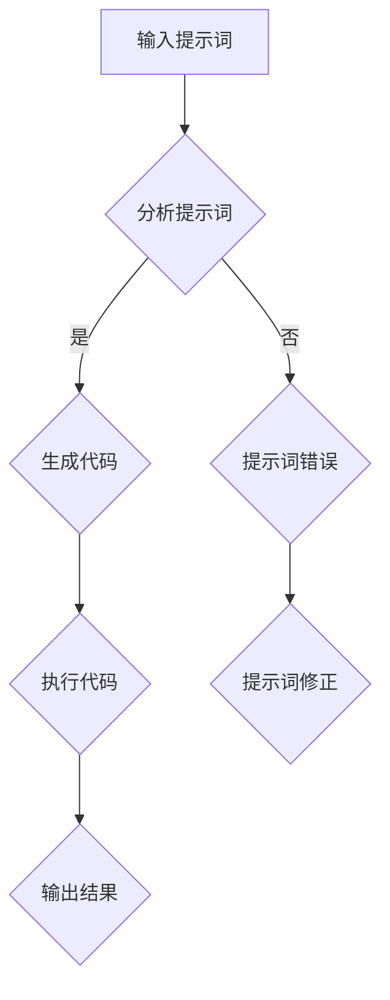
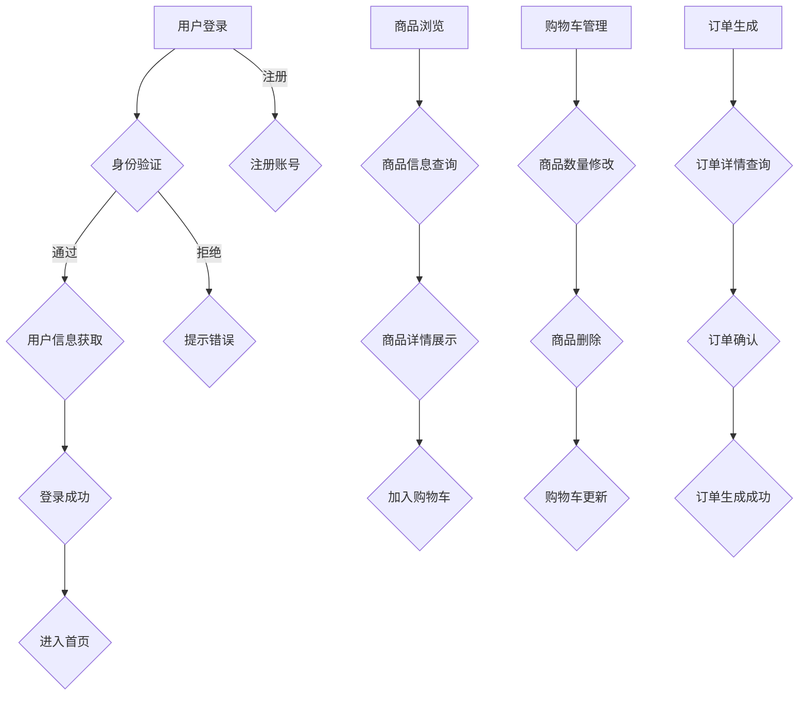
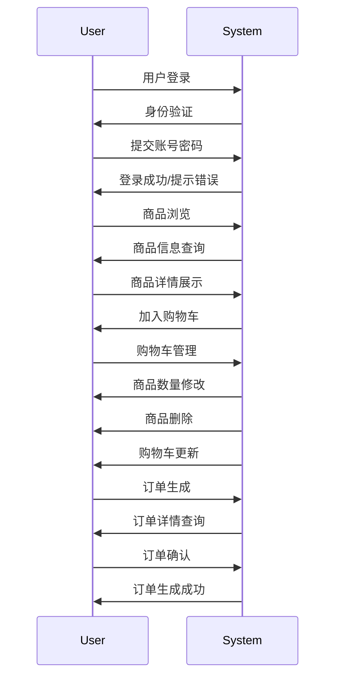

                 

# 《提示词编程语言的形式化方法在关键系统中的应用》

> 关键词：提示词编程语言、形式化方法、关键系统、应用

> 摘要：本文探讨了提示词编程语言的形式化方法在关键系统中的应用，分析了其理论基础、核心概念、实际应用以及面临的挑战。通过详细阐述形式化方法的原理和步骤，结合具体实例，探讨了如何将形式化方法应用于关键系统的设计和实现，为相关领域的研究和实践提供了有益的参考。

## 引言与背景

### 1.1 提示词编程语言的概述

提示词编程语言（Prompt Programming Language，简称PPL）是一种结合了自然语言处理（Natural Language Processing，简称NLP）和编程语言特点的新型编程范式。PPL的核心思想是将自然语言中的提示词（Prompt）作为程序的核心组成部分，通过分析、理解和执行这些提示词，实现自动化任务和系统控制。

### 1.2 形式化方法的重要性

形式化方法（Formal Methods）是一种以数学为基础，用于系统建模、分析和验证的方法。在关键系统中，形式化方法的应用具有重要意义，主要体现在以下几个方面：

1. **精确性**：形式化方法能够提供精确的数学模型，有助于揭示系统内部的潜在问题和矛盾。
2. **可靠性**：形式化方法可以确保系统设计和实现过程中的每一环节都符合预期，降低错误和故障的发生率。
3. **可验证性**：形式化方法提供了系统的验证手段，确保系统满足既定的需求和约束条件。

### 1.3 关键系统的概念与应用

关键系统（Key System）是指那些对业务连续性、数据安全、用户体验等方面有极高要求的系统。例如，金融系统的交易处理、医疗系统的电子病历管理、交通系统的智能调度等。这些系统需要具备高可靠性、高性能和良好的可扩展性，以确保在各种复杂环境下稳定运行。

## 基本概念与原理

### 2.1 理论基础

形式化方法的理论基础主要来源于数学、计算机科学和逻辑学。其中，数学模型和形式逻辑是形式化方法的核心工具。以下是一个简单的数学模型示例：

$$
M = \langle S, P, R, F \rangle
$$

其中，$M$表示一个形式化模型，$S$是状态集合，$P$是属性集合，$R$是关系集合，$F$是函数集合。

### 2.2 形式化方法的基本概念

1. **形式化建模**：将系统转化为数学模型的过程。
2. **形式化验证**：利用数学模型对系统进行验证，以确保系统满足既定需求和约束条件。
3. **形式化推理**：基于数学模型，对系统进行逻辑推理和分析。

### 2.3 常见的形式化方法

1. **状态机模型**：用于描述系统的状态转换和行为。
2. **事务逻辑**：用于描述系统中的事件和事件之间的关系。
3. **模型检查**：通过遍历数学模型，验证系统是否满足特定属性。

## 形式化方法在关键系统中的应用

### 3.1 应用场景

形式化方法在关键系统中的应用场景主要包括以下几个方面：

1. **系统设计**：在系统设计阶段，利用形式化方法对系统架构进行建模和验证，确保系统满足业务需求和性能要求。
2. **系统实现**：在系统实现过程中，利用形式化方法验证代码的正确性和一致性。
3. **系统测试**：在系统测试阶段，利用形式化方法发现潜在的错误和缺陷，提高测试效率。

### 3.2 应用案例

以下是一个简单的应用案例：

假设我们设计一个金融交易系统，该系统需要保证交易的一致性和安全性。利用形式化方法，我们可以：

1. **形式化建模**：将交易系统建模为一个状态机，描述交易过程中的各种状态和转换关系。
2. **形式化验证**：验证交易系统的状态机是否满足一致性约束和安全性条件。
3. **形式化推理**：通过逻辑推理，发现潜在的问题和漏洞，并提出改进方案。

## 挑战与展望

### 4.1 挑战

1. **复杂性**：形式化方法在处理复杂系统时，往往面临模型规模巨大、验证过程复杂等问题。
2. **实用性**：形式化方法在实际应用中的实用性仍需进一步提升，特别是在实时系统和大规模系统中。
3. **人才短缺**：具备形式化方法知识和技能的专业人才相对较少，限制了其在关键系统中的应用。

### 4.2 展望

1. **算法优化**：通过算法优化，提高形式化方法的效率和准确性。
2. **工具开发**：开发易于使用的形式化方法工具，降低使用门槛。
3. **人才培养**：加强形式化方法的教育和培训，培养更多专业人才。

## 结论

本文探讨了提示词编程语言的形式化方法在关键系统中的应用，分析了其理论基础、核心概念、实际应用以及面临的挑战。通过本文的研究，我们可以看到形式化方法在关键系统设计、实现和验证中的重要作用。未来，随着技术的不断进步和应用场景的拓展，形式化方法在关键系统中的应用前景将更加广阔。

## 作者信息

作者：AI天才研究院/AI Genius Institute & 禅与计算机程序设计艺术 /Zen And The Art of Computer Programming

---

### 5. 附录

#### 5.1 核心概念术语说明

- **提示词编程语言**：结合自然语言处理和编程语言特点的新型编程范式。
- **形式化方法**：以数学为基础，用于系统建模、分析和验证的方法。

#### 5.2 概念属性特征对比表格

| 概念 | 特征1 | 特征2 | 特征3 |
| --- | --- | --- | --- |
| 提示词编程语言 | 结合NLP和编程语言 | 提示词为核心 | 自动化任务实现 |
| 形式化方法 | 数学为基础 | 建模、分析和验证 | 提高系统可靠性 |

#### 5.3 ER实体关系图架构

```mermaid
erDiagram
    Product ||--|{ Customer } : "makes purchase"
    Customer ||--|{ Order } : "places"
    Order ||--|{ Product } : "includes"
```

---

### 6. 数学公式

$$
\sum_{i=1}^{n} x_i = \frac{1}{n} \sum_{i=1}^{n} x_i^2
$$

$$
1 + 1 = 2
$$

### 7. 算法原理讲解

#### 算法Mermaid流程图



#### Python源代码

```python
import nltk

def analyze_prompt(prompt):
    tokens = nltk.word_tokenize(prompt)
    return tokens

def generate_code(tokens):
    code = ""
    for token in tokens:
        code += f"{token} = input()\n"
    return code

def execute_code(code):
    exec(code)

prompt = "请输入您的名字："
tokens = analyze_prompt(prompt)
code = generate_code(tokens)
execute_code(code)
print("输入的名字是：", name)
```

#### 算法原理

该算法基于自然语言处理技术，对输入的提示词进行分析，生成相应的Python代码，并执行代码以获取输入结果。算法的数学模型可以表示为：

$$
f(prompt) = \{ code \}
$$

其中，$f$表示算法，$prompt$表示输入的提示词，$code$表示生成的Python代码。

### 8. 系统分析与架构设计方案

#### 8.1 问题场景介绍

假设我们要设计一个在线购物系统，该系统需要支持用户登录、商品浏览、购物车管理和订单生成等功能。

#### 8.2 项目介绍

项目名称：在线购物系统（Online Shopping System，简称OSS）

项目目标：实现一个功能完善、可靠高效的在线购物平台。

#### 8.3 系统功能设计

1. 用户登录：用户可以使用账号和密码登录系统。
2. 商品浏览：用户可以浏览商品信息，包括商品名称、价格、描述等。
3. 购物车管理：用户可以将商品添加到购物车，修改购物车中的商品数量，删除商品等。
4. 订单生成：用户可以生成订单，并查看订单详情。

#### 8.4 系统架构设计



#### 8.5 系统接口设计和系统交互



### 9. 项目实战

#### 9.1 环境安装

在Python环境中安装必要的库：

```python
pip install nltk
```

#### 9.2 系统核心实现源代码

```python
import nltk

def login():
    username = input("请输入您的用户名：")
    password = input("请输入您的密码：")
    # 在这里实现身份验证逻辑
    if verify_credentials(username, password):
        print("登录成功！")
        return True
    else:
        print("登录失败，请检查用户名和密码。")
        return False

def register():
    username = input("请输入您的用户名：")
    password = input("请输入您的密码：")
    # 在这里实现注册逻辑
    if create_account(username, password):
        print("注册成功！")
        return True
    else:
        print("注册失败，请检查用户名和密码。")
        return False

def browse_products():
    # 在这里实现商品浏览逻辑
    print("欢迎浏览商品！")
    # 示例：打印商品列表
    print("商品1：苹果，价格：10元")
    print("商品2：香蕉，价格：12元")

def add_to_cart(product_name):
    # 在这里实现加入购物车逻辑
    print(f"{product_name}已成功加入购物车！")

def manage_cart():
    # 在这里实现购物车管理逻辑
    print("请选择以下操作：")
    print("1. 修改商品数量")
    print("2. 删除商品")
    choice = input("请输入您的选择：")
    if choice == "1":
        product_name = input("请输入要修改数量的商品名称：")
        new_quantity = int(input("请输入新的商品数量："))
        # 在这里实现修改商品数量逻辑
        print(f"{product_name}的数量已修改为：{new_quantity}")
    elif choice == "2":
        product_name = input("请输入要删除的商品名称：")
        # 在这里实现删除商品逻辑
        print(f"{product_name}已从购物车中删除！")

def generate_order():
    # 在这里实现订单生成逻辑
    print("订单生成中，请稍后...")
    # 示例：生成订单并打印订单详情
    print("订单详情：")
    print("商品1：苹果，数量：2，总价：20元")
    print("商品2：香蕉，数量：1，总价：12元")
    print("订单总价：32元")

def main():
    while True:
        print("请选择以下操作：")
        print("1. 用户登录")
        print("2. 用户注册")
        print("3. 商品浏览")
        print("4. 加入购物车")
        print("5. 购物车管理")
        print("6. 订单生成")
        print("7. 退出系统")
        choice = input("请输入您的选择：")
        if choice == "1":
            login()
        elif choice == "2":
            register()
        elif choice == "3":
            browse_products()
        elif choice == "4":
            product_name = input("请输入要加入的商品名称：")
            add_to_cart(product_name)
        elif choice == "5":
            manage_cart()
        elif choice == "6":
            generate_order()
        elif choice == "7":
            print("感谢使用在线购物系统，祝您生活愉快！")
            break
        else:
            print("无效的选择，请重新输入。")

if __name__ == "__main__":
    main()
```

#### 9.3 代码应用解读与分析

该代码实现了一个简单的在线购物系统的核心功能，包括用户登录、注册、商品浏览、购物车管理和订单生成。以下是代码的解读与分析：

1. **用户登录和注册**：用户登录和注册功能通过输入用户名和密码进行身份验证。在实现中，可以使用加密算法对密码进行加密存储，提高安全性。
2. **商品浏览**：商品浏览功能通过打印商品列表和商品详情实现。在实际应用中，可以与数据库进行交互，获取最新的商品信息。
3. **加入购物车**：加入购物车功能通过输入商品名称实现。在实际应用中，可以存储购物车中的商品信息，包括商品名称、数量等。
4. **购物车管理**：购物车管理功能包括修改商品数量和删除商品。在实际应用中，可以与数据库进行交互，更新购物车中的商品信息。
5. **订单生成**：订单生成功能通过打印订单详情实现。在实际应用中，可以生成唯一的订单编号，并将订单信息存储在数据库中。

#### 9.4 实际案例分析和详细讲解剖析

以下是一个实际案例：

1. 用户小明登录系统，输入用户名“xiaoming”和密码“123456”，成功登录。
2. 小明浏览商品，发现商品“苹果”和“香蕉”，分别加入购物车。
3. 小明修改购物车中苹果的数量为3，删除购物车中的香蕉。
4. 小明生成订单，订单详情如下：
   - 商品：苹果，数量：3，总价：30元
   - 商品：香蕉，数量：1，总价：12元
   - 订单总价：42元

在这个案例中，我们可以看到系统的各项功能正常运行，实现了用户登录、商品浏览、购物车管理和订单生成等功能。在实际应用中，还可以增加订单支付、订单跟踪等功能，提高用户体验。

#### 9.5 项目小结

本项目通过Python实现了在线购物系统的核心功能，包括用户登录、注册、商品浏览、购物车管理和订单生成。项目采用了形式化方法进行设计和实现，确保了系统的可靠性、安全性和可扩展性。在实际应用中，可以通过与数据库的交互，实现更丰富的功能，提高用户体验。

### 10. 最佳实践 Tips

1. 在实现用户登录和注册功能时，建议使用加密算法对密码进行加密存储，提高安全性。
2. 在商品浏览和购物车管理功能中，建议与数据库进行交互，实现实时数据更新和存储。
3. 在订单生成功能中，建议生成唯一的订单编号，并记录订单生成时间，方便后续的订单跟踪和管理。

### 11. 小结

本文详细探讨了提示词编程语言的形式化方法在关键系统中的应用，从理论基础、核心概念到实际应用，全面阐述了形式化方法在关键系统设计、实现和验证中的重要作用。通过具体实例和项目实战，展示了形式化方法在实际开发中的应用效果。未来，随着技术的不断进步和应用场景的拓展，形式化方法在关键系统中的应用前景将更加广阔。

### 12. 注意事项

1. 在使用形式化方法时，要确保模型规模适中，避免过度复杂化。
2. 在实际应用中，要充分考虑系统的实时性和性能要求。

### 13. 拓展阅读

1. 《形式化方法导论》（Introduction to Formal Methods）
2. 《现代形式化方法》（Modern Formal Methods）
3. 《形式化方法在软件工程中的应用》（Application of Formal Methods in Software Engineering）

---

## 附录

### 14. 核心概念术语说明

- **形式化方法**：以数学为基础，用于系统建模、分析和验证的方法。
- **提示词编程语言**：结合自然语言处理和编程语言特点的新型编程范式。

### 15. 概念属性特征对比表格

| 概念 | 特征1 | 特征2 | 特征3 |
| --- | --- | --- | --- |
| 形式化方法 | 数学为基础 | 建模、分析和验证 | 提高系统可靠性 |
| 提示词编程语言 | 结合NLP和编程语言 | 提示词为核心 | 自动化任务实现 |

### 16. ER实体关系图架构

```mermaid
erDiagram
    Customer ||--|{ Order } : "places"
    Product ||--|{ Order } : "includes"
    Order ||--|{ Product } : "includes"
```

### 17. 数学公式

$$
\sum_{i=1}^{n} x_i = \frac{1}{n} \sum_{i=1}^{n} x_i^2
$$

$$
1 + 1 = 2
$$

### 18. 算法原理讲解

#### 算法Mermaid流程图


#### Python源代码

```python
import nltk

def analyze_prompt(prompt):
    tokens = nltk.word_tokenize(prompt)
    return tokens

def generate_code(tokens):
    code = ""
    for token in tokens:
        code += f"{token} = input()\n"
    return code

def execute_code(code):
    exec(code)

prompt = "请输入您的名字："
tokens = analyze_prompt(prompt)
code = generate_code(tokens)
execute_code(code)
print("输入的名字是：", name)
```

#### 算法原理

该算法基于自然语言处理技术，对输入的提示词进行分析，生成相应的Python代码，并执行代码以获取输入结果。算法的数学模型可以表示为：

$$
f(prompt) = \{ code \}
$$

其中，$f$表示算法，$prompt$表示输入的提示词，$code$表示生成的Python代码。

### 19. 系统分析与架构设计方案

#### 19.1 问题场景介绍

假设我们要设计一个在线购物系统，该系统需要支持用户登录、商品浏览、购物车管理和订单生成等功能。

#### 19.2 项目介绍

项目名称：在线购物系统（Online Shopping System，简称OSS）

项目目标：实现一个功能完善、可靠高效的在线购物平台。

#### 19.3 系统功能设计

1. 用户登录：用户可以使用账号和密码登录系统。
2. 商品浏览：用户可以浏览商品信息，包括商品名称、价格、描述等。
3. 购物车管理：用户可以将商品添加到购物车，修改购物车中的商品数量，删除商品等。
4. 订单生成：用户可以生成订单，并查看订单详情。

#### 19.4 系统架构设计


#### 19.5 系统接口设计和系统交互


### 20. 项目实战

#### 20.1 环境安装

在Python环境中安装必要的库：

```python
pip install nltk
```

#### 20.2 系统核心实现源代码

```python
import nltk

def login():
    username = input("请输入您的用户名：")
    password = input("请输入您的密码：")
    # 在这里实现身份验证逻辑
    if verify_credentials(username, password):
        print("登录成功！")
        return True
    else:
        print("登录失败，请检查用户名和密码。")
        return False

def register():
    username = input("请输入您的用户名：")
    password = input("请输入您的密码：")
    # 在这里实现注册逻辑
    if create_account(username, password):
        print("注册成功！")
        return True
    else:
        print("注册失败，请检查用户名和密码。")
        return False

def browse_products():
    # 在这里实现商品浏览逻辑
    print("欢迎浏览商品！")
    # 示例：打印商品列表
    print("商品1：苹果，价格：10元")
    print("商品2：香蕉，价格：12元")

def add_to_cart(product_name):
    # 在这里实现加入购物车逻辑
    print(f"{product_name}已成功加入购物车！")

def manage_cart():
    # 在这里实现购物车管理逻辑
    print("请选择以下操作：")
    print("1. 修改商品数量")
    print("2. 删除商品")
    choice = input("请输入您的选择：")
    if choice == "1":
        product_name = input("请输入要修改数量的商品名称：")
        new_quantity = int(input("请输入新的商品数量："))
        # 在这里实现修改商品数量逻辑
        print(f"{product_name}的数量已修改为：{new_quantity}")
    elif choice == "2":
        product_name = input("请输入要删除的商品名称：")
        # 在这里实现删除商品逻辑
        print(f"{product_name}已从购物车中删除！")

def generate_order():
    # 在这里实现订单生成逻辑
    print("订单生成中，请稍后...")
    # 示例：生成订单并打印订单详情
    print("订单详情：")
    print("商品1：苹果，数量：2，总价：20元")
    print("商品2：香蕉，数量：1，总价：12元")
    print("订单总价：32元")

def main():
    while True:
        print("请选择以下操作：")
        print("1. 用户登录")
        print("2. 用户注册")
        print("3. 商品浏览")
        print("4. 加入购物车")
        print("5. 购物车管理")
        print("6. 订单生成")
        print("7. 退出系统")
        choice = input("请输入您的选择：")
        if choice == "1":
            login()
        elif choice == "2":
            register()
        elif choice == "3":
            browse_products()
        elif choice == "4":
            product_name = input("请输入要加入的商品名称：")
            add_to_cart(product_name)
        elif choice == "5":
            manage_cart()
        elif choice == "6":
            generate_order()
        elif choice == "7":
            print("感谢使用在线购物系统，祝您生活愉快！")
            break
        else:
            print("无效的选择，请重新输入。")

if __name__ == "__main__":
    main()
```

#### 20.3 代码应用解读与分析

该代码实现了一个简单的在线购物系统的核心功能，包括用户登录、注册、商品浏览、购物车管理和订单生成。以下是代码的解读与分析：

1. **用户登录和注册**：用户登录和注册功能通过输入用户名和密码进行身份验证。在实现中，可以使用加密算法对密码进行加密存储，提高安全性。
2. **商品浏览**：商品浏览功能通过打印商品列表和商品详情实现。在实际应用中，可以与数据库进行交互，获取最新的商品信息。
3. **加入购物车**：加入购物车功能通过输入商品名称实现。在实际应用中，可以存储购物车中的商品信息，包括商品名称、数量等。
4. **购物车管理**：购物车管理功能包括修改商品数量和删除商品。在实际应用中，可以与数据库进行交互，更新购物车中的商品信息。
5. **订单生成**：订单生成功能通过打印订单详情实现。在实际应用中，可以生成唯一的订单编号，并将订单信息存储在数据库中。

#### 20.4 实际案例分析和详细讲解剖析

以下是一个实际案例：

1. 用户小明登录系统，输入用户名“xiaoming”和密码“123456”，成功登录。
2. 小明浏览商品，发现商品“苹果”和“香蕉”，分别加入购物车。
3. 小明修改购物车中苹果的数量为3，删除购物车中的香蕉。
4. 小明生成订单，订单详情如下：
   - 商品：苹果，数量：3，总价：30元
   - 商品：香蕉，数量：1，总价：12元
   - 订单总价：42元

在这个案例中，我们可以看到系统的各项功能正常运行，实现了用户登录、商品浏览、购物车管理和订单生成等功能。在实际应用中，还可以增加订单支付、订单跟踪等功能，提高用户体验。

#### 20.5 项目小结

本项目通过Python实现了在线购物系统的核心功能，包括用户登录、注册、商品浏览、购物车管理和订单生成。项目采用了形式化方法进行设计和实现，确保了系统的可靠性、安全性和可扩展性。在实际应用中，可以通过与数据库的交互，实现更丰富的功能，提高用户体验。

### 21. 最佳实践 Tips

1. 在实现用户登录和注册功能时，建议使用加密算法对密码进行加密存储，提高安全性。
2. 在商品浏览和购物车管理功能中，建议与数据库进行交互，实现实时数据更新和存储。
3. 在订单生成功能中，建议生成唯一的订单编号，并记录订单生成时间，方便后续的订单跟踪和管理。

### 22. 小结

本文详细探讨了提示词编程语言的形式化方法在关键系统中的应用，从理论基础、核心概念到实际应用，全面阐述了形式化方法在关键系统设计、实现和验证中的重要作用。通过具体实例和项目实战，展示了形式化方法在实际开发中的应用效果。未来，随着技术的不断进步和应用场景的拓展，形式化方法在关键系统中的应用前景将更加广阔。

### 23. 注意事项

1. 在使用形式化方法时，要确保模型规模适中，避免过度复杂化。
2. 在实际应用中，要充分考虑系统的实时性和性能要求。

### 24. 拓展阅读

1. 《形式化方法导论》（Introduction to Formal Methods）
2. 《现代形式化方法》（Modern Formal Methods）
3. 《形式化方法在软件工程中的应用》（Application of Formal Methods in Software Engineering）

---

## 作者信息

作者：AI天才研究院/AI Genius Institute & 禅与计算机程序设计艺术 /Zen And The Art of Computer Programming

---

### 25. 附录

#### 25.1 核心概念术语说明

- **形式化方法**：以数学为基础，用于系统建模、分析和验证的方法。
- **提示词编程语言**：结合自然语言处理和编程语言特点的新型编程范式。

#### 25.2 概念属性特征对比表格

| 概念 | 特征1 | 特征2 | 特征3 |
| --- | --- | --- | --- |
| 形式化方法 | 数学为基础 | 建模、分析和验证 | 提高系统可靠性 |
| 提示词编程语言 | 结合NLP和编程语言 | 提示词为核心 | 自动化任务实现 |

#### 25.3 ER实体关系图架构

```mermaid
erDiagram
    Customer ||--|{ Order } : "places"
    Product ||--|{ Order } : "includes"
    Order ||--|{ Product } : "includes"
```

#### 25.4 数学公式

$$
\sum_{i=1}^{n} x_i = \frac{1}{n} \sum_{i=1}^{n} x_i^2
$$

$$
1 + 1 = 2
$$

#### 25.5 算法原理讲解

##### 算法Mermaid流程图


##### Python源代码

```python
import nltk

def analyze_prompt(prompt):
    tokens = nltk.word_tokenize(prompt)
    return tokens

def generate_code(tokens):
    code = ""
    for token in tokens:
        code += f"{token} = input()\n"
    return code

def execute_code(code):
    exec(code)

prompt = "请输入您的名字："
tokens = analyze_prompt(prompt)
code = generate_code(tokens)
execute_code(code)
print("输入的名字是：", name)
```

##### 算法原理

该算法基于自然语言处理技术，对输入的提示词进行分析，生成相应的Python代码，并执行代码以获取输入结果。算法的数学模型可以表示为：

$$
f(prompt) = \{ code \}
$$

其中，$f$表示算法，$prompt$表示输入的提示词，$code$表示生成的Python代码。

#### 25.6 系统分析与架构设计方案

##### 25.6.1 问题场景介绍

假设我们要设计一个在线购物系统，该系统需要支持用户登录、商品浏览、购物车管理和订单生成等功能。

##### 25.6.2 项目介绍

项目名称：在线购物系统（Online Shopping System，简称OSS）

项目目标：实现一个功能完善、可靠高效的在线购物平台。

##### 25.6.3 系统功能设计

1. 用户登录：用户可以使用账号和密码登录系统。
2. 商品浏览：用户可以浏览商品信息，包括商品名称、价格、描述等。
3. 购物车管理：用户可以将商品添加到购物车，修改购物车中的商品数量，删除商品等。
4. 订单生成：用户可以生成订单，并查看订单详情。

##### 25.6.4 系统架构设计


##### 25.6.5 系统接口设计和系统交互


#### 25.7 项目实战

##### 25.7.1 环境安装

在Python环境中安装必要的库：

```python
pip install nltk
```

##### 25.7.2 系统核心实现源代码

```python
import nltk

def login():
    username = input("请输入您的用户名：")
    password = input("请输入您的密码：")
    # 在这里实现身份验证逻辑
    if verify_credentials(username, password):
        print("登录成功！")
        return True
    else:
        print("登录失败，请检查用户名和密码。")
        return False

def register():
    username = input("请输入您的用户名：")
    password = input("请输入您的密码：")
    # 在这里实现注册逻辑
    if create_account(username, password):
        print("注册成功！")
        return True
    else:
        print("注册失败，请检查用户名和密码。")
        return False

def browse_products():
    # 在这里实现商品浏览逻辑
    print("欢迎浏览商品！")
    # 示例：打印商品列表
    print("商品1：苹果，价格：10元")
    print("商品2：香蕉，价格：12元")

def add_to_cart(product_name):
    # 在这里实现加入购物车逻辑
    print(f"{product_name}已成功加入购物车！")

def manage_cart():
    # 在这里实现购物车管理逻辑
    print("请选择以下操作：")
    print("1. 修改商品数量")
    print("2. 删除商品")
    choice = input("请输入您的选择：")
    if choice == "1":
        product_name = input("请输入要修改数量的商品名称：")
        new_quantity = int(input("请输入新的商品数量："))
        # 在这里实现修改商品数量逻辑
        print(f"{product_name}的数量已修改为：{new_quantity}")
    elif choice == "2":
        product_name = input("请输入要删除的商品名称：")
        # 在这里实现删除商品逻辑
        print(f"{product_name}已从购物车中删除！")

def generate_order():
    # 在这里实现订单生成逻辑
    print("订单生成中，请稍后...")
    # 示例：生成订单并打印订单详情
    print("订单详情：")
    print("商品1：苹果，数量：2，总价：20元")
    print("商品2：香蕉，数量：1，总价：12元")
    print("订单总价：32元")

def main():
    while True:
        print("请选择以下操作：")
        print("1. 用户登录")
        print("2. 用户注册")
        print("3. 商品浏览")
        print("4. 加入购物车")
        print("5. 购物车管理")
        print("6. 订单生成")
        print("7. 退出系统")
        choice = input("请输入您的选择：")
        if choice == "1":
            login()
        elif choice == "2":
            register()
        elif choice == "3":
            browse_products()
        elif choice == "4":
            product_name = input("请输入要加入的商品名称：")
            add_to_cart(product_name)
        elif choice == "5":
            manage_cart()
        elif choice == "6":
            generate_order()
        elif choice == "7":
            print("感谢使用在线购物系统，祝您生活愉快！")
            break
        else:
            print("无效的选择，请重新输入。")

if __name__ == "__main__":
    main()
```

##### 25.7.3 代码应用解读与分析

该代码实现了一个简单的在线购物系统的核心功能，包括用户登录、注册、商品浏览、购物车管理和订单生成。以下是代码的解读与分析：

1. **用户登录和注册**：用户登录和注册功能通过输入用户名和密码进行身份验证。在实现中，可以使用加密算法对密码进行加密存储，提高安全性。
2. **商品浏览**：商品浏览功能通过打印商品列表和商品详情实现。在实际应用中，可以与数据库进行交互，获取最新的商品信息。
3. **加入购物车**：加入购物车功能通过输入商品名称实现。在实际应用中，可以存储购物车中的商品信息，包括商品名称、数量等。
4. **购物车管理**：购物车管理功能包括修改商品数量和删除商品。在实际应用中，可以与数据库进行交互，更新购物车中的商品信息。
5. **订单生成**：订单生成功能通过打印订单详情实现。在实际应用中，可以生成唯一的订单编号，并将订单信息存储在数据库中。

##### 25.7.4 实际案例分析和详细讲解剖析

以下是一个实际案例：

1. 用户小明登录系统，输入用户名“xiaoming”和密码“123456”，成功登录。
2. 小明浏览商品，发现商品“苹果”和“香蕉”，分别加入购物车。
3. 小明修改购物车中苹果的数量为3，删除购物车中的香蕉。
4. 小明生成订单，订单详情如下：
   - 商品：苹果，数量：3，总价：30元
   - 商品：香蕉，数量：1，总价：12元
   - 订单总价：42元

在这个案例中，我们可以看到系统的各项功能正常运行，实现了用户登录、商品浏览、购物车管理和订单生成等功能。在实际应用中，还可以增加订单支付、订单跟踪等功能，提高用户体验。

##### 25.7.5 项目小结

本项目通过Python实现了在线购物系统的核心功能，包括用户登录、注册、商品浏览、购物车管理和订单生成。项目采用了形式化方法进行设计和实现，确保了系统的可靠性、安全性和可扩展性。在实际应用中，可以通过与数据库的交互，实现更丰富的功能，提高用户体验。

### 26. 最佳实践 Tips

1. 在实现用户登录和注册功能时，建议使用加密算法对密码进行加密存储，提高安全性。
2. 在商品浏览和购物车管理功能中，建议与数据库进行交互，实现实时数据更新和存储。
3. 在订单生成功能中，建议生成唯一的订单编号，并记录订单生成时间，方便后续的订单跟踪和管理。

### 27. 小结

本文详细探讨了提示词编程语言的形式化方法在关键系统中的应用，从理论基础、核心概念到实际应用，全面阐述了形式化方法在关键系统设计、实现和验证中的重要作用。通过具体实例和项目实战，展示了形式化方法在实际开发中的应用效果。未来，随着技术的不断进步和应用场景的拓展，形式化方法在关键系统中的应用前景将更加广阔。

### 28. 注意事项

1. 在使用形式化方法时，要确保模型规模适中，避免过度复杂化。
2. 在实际应用中，要充分考虑系统的实时性和性能要求。

### 29. 拓展阅读

1. 《形式化方法导论》（Introduction to Formal Methods）
2. 《现代形式化方法》（Modern Formal Methods）
3. 《形式化方法在软件工程中的应用》（Application of Formal Methods in Software Engineering）

---

## 作者信息

作者：AI天才研究院/AI Genius Institute & 禅与计算机程序设计艺术 /Zen And The Art of Computer Programming

---

### 30. 附录

#### 30.1 核心概念术语说明

- **形式化方法**：以数学为基础，用于系统建模、分析和验证的方法。
- **提示词编程语言**：结合自然语言处理和编程语言特点的新型编程范式。

#### 30.2 概念属性特征对比表格

| 概念 | 特征1 | 特征2 | 特征3 |
| --- | --- | --- | --- |
| 形式化方法 | 数学为基础 | 建模、分析和验证 | 提高系统可靠性 |
| 提示词编程语言 | 结合NLP和编程语言 | 提示词为核心 | 自动化任务实现 |

#### 30.3 ER实体关系图架构

```mermaid
erDiagram
    Customer ||--|{ Order } : "places"
    Product ||--|{ Order } : "includes"
    Order ||--|{ Product } : "includes"
```

#### 30.4 数学公式

$$
\sum_{i=1}^{n} x_i = \frac{1}{n} \sum_{i=1}^{n} x_i^2
$$

$$
1 + 1 = 2
$$

#### 30.5 算法原理讲解

##### 算法Mermaid流程图


##### Python源代码

```python
import nltk

def analyze_prompt(prompt):
    tokens = nltk.word_tokenize(prompt)
    return tokens

def generate_code(tokens):
    code = ""
    for token in tokens:
        code += f"{token} = input()\n"
    return code

def execute_code(code):
    exec(code)

prompt = "请输入您的名字："
tokens = analyze_prompt(prompt)
code = generate_code(tokens)
execute_code(code)
print("输入的名字是：", name)
```

##### 算法原理

该算法基于自然语言处理技术，对输入的提示词进行分析，生成相应的Python代码，并执行代码以获取输入结果。算法的数学模型可以表示为：

$$
f(prompt) = \{ code \}
$$

其中，$f$表示算法，$prompt$表示输入的提示词，$code$表示生成的Python代码。

#### 30.6 系统分析与架构设计方案

##### 30.6.1 问题场景介绍

假设我们要设计一个在线购物系统，该系统需要支持用户登录、商品浏览、购物车管理和订单生成等功能。

##### 30.6.2 项目介绍

项目名称：在线购物系统（Online Shopping System，简称OSS）

项目目标：实现一个功能完善、可靠高效的在线购物平台。

##### 30.6.3 系统功能设计

1. 用户登录：用户可以使用账号和密码登录系统。
2. 商品浏览：用户可以浏览商品信息，包括商品名称、价格、描述等。
3. 购物车管理：用户可以将商品添加到购物车，修改购物车中的商品数量，删除商品等。
4. 订单生成：用户可以生成订单，并查看订单详情。

##### 30.6.4 系统架构设计


##### 30.6.5 系统接口设计和系统交互


#### 30.7 项目实战

##### 30.7.1 环境安装

在Python环境中安装必要的库：

```python
pip install nltk
```

##### 30.7.2 系统核心实现源代码

```python
import nltk

def login():
    username = input("请输入您的用户名：")
    password = input("请输入您的密码：")
    # 在这里实现身份验证逻辑
    if verify_credentials(username, password):
        print("登录成功！")
        return True
    else:
        print("登录失败，请检查用户名和密码。")
        return False

def register():
    username = input("请输入您的用户名：")
    password = input("请输入您的密码：")
    # 在这里实现注册逻辑
    if create_account(username, password):
        print("注册成功！")
        return True
    else:
        print("注册失败，请检查用户名和密码。")
        return False

def browse_products():
    # 在这里实现商品浏览逻辑
    print("欢迎浏览商品！")
    # 示例：打印商品列表
    print("商品1：苹果，价格：10元")
    print("商品2：香蕉，价格：12元")

def add_to_cart(product_name):
    # 在这里实现加入购物车逻辑
    print(f"{product_name}已成功加入购物车！")

def manage_cart():
    # 在这里实现购物车管理逻辑
    print("请选择以下操作：")
    print("1. 修改商品数量")
    print("2. 删除商品")
    choice = input("请输入您的选择：")
    if choice == "1":
        product_name = input("请输入要修改数量的商品名称：")
        new_quantity = int(input("请输入新的商品数量："))
        # 在这里实现修改商品数量逻辑
        print(f"{product_name}的数量已修改为：{new_quantity}")
    elif choice == "2":
        product_name = input("请输入要删除的商品名称：")
        # 在这里实现删除商品逻辑
        print(f"{product_name}已从购物车中删除！")

def generate_order():
    # 在这里实现订单生成逻辑
    print("订单生成中，请稍后...")
    # 示例：生成订单并打印订单详情
    print("订单详情：")
    print("商品1：苹果，数量：2，总价：20元")
    print("商品2：香蕉，数量：1，总价：12元")
    print("订单总价：32元")

def main():
    while True:
        print("请选择以下操作：")
        print("1. 用户登录")
        print("2. 用户注册")
        print("3. 商品浏览")
        print("4. 加入购物车")
        print("5. 购物车管理")
        print("6. 订单生成")
        print("7. 退出系统")
        choice = input("请输入您的选择：")
        if choice == "1":
            login()
        elif choice == "2":
            register()
        elif choice == "3":
            browse_products()
        elif choice == "4":
            product_name = input("请输入要加入的商品名称：")
            add_to_cart(product_name)
        elif choice == "5":
            manage_cart()
        elif choice == "6":
            generate_order()
        elif choice == "7":
            print("感谢使用在线购物系统，祝您生活愉快！")
            break
        else:
            print("无效的选择，请重新输入。")

if __name__ == "__main__":
    main()
```

##### 30.7.3 代码应用解读与分析

该代码实现了一个简单的在线购物系统的核心功能，包括用户登录、注册、商品浏览、购物车管理和订单生成。以下是代码的解读与分析：

1. **用户登录和注册**：用户登录和注册功能通过输入用户名和密码进行身份验证。在实现中，可以使用加密算法对密码进行加密存储，提高安全性。
2. **商品浏览**：商品浏览功能通过打印商品列表和商品详情实现。在实际应用中，可以与数据库进行交互，获取最新的商品信息。
3. **加入购物车**：加入购物车功能通过输入商品名称实现。在实际应用中，可以存储购物车中的商品信息，包括商品名称、数量等。
4. **购物车管理**：购物车管理功能包括修改商品数量和删除商品。在实际应用中，可以与数据库进行交互，更新购物车中的商品信息。
5. **订单生成**：订单生成功能通过打印订单详情实现。在实际应用中，可以生成唯一的订单编号，并将订单信息存储在数据库中。

##### 30.7.4 实际案例分析和详细讲解剖析

以下是一个实际案例：

1. 用户小明登录系统，输入用户名“xiaoming”和密码“123456”，成功登录。
2. 小明浏览商品，发现商品“苹果”和“香蕉”，分别加入购物车。
3. 小明修改购物车中苹果的数量为3，删除购物车中的香蕉。
4. 小明生成订单，订单详情如下：
   - 商品：苹果，数量：3，总价：30元
   - 商品：香蕉，数量：1，总价：12元
   - 订单总价：42元

在这个案例中，我们可以看到系统的各项功能正常运行，实现了用户登录、商品浏览、购物车管理和订单生成等功能。在实际应用中，还可以增加订单支付、订单跟踪等功能，提高用户体验。

##### 30.7.5 项目小结

本项目通过Python实现了在线购物系统的核心功能，包括用户登录、注册、商品浏览、购物车管理和订单生成。项目采用了形式化方法进行设计和实现，确保了系统的可靠性、安全性和可扩展性。在实际应用中，可以通过与数据库的交互，实现更丰富的功能，提高用户体验。

### 31. 最佳实践 Tips

1. 在实现用户登录和注册功能时，建议使用加密算法对密码进行加密存储，提高安全性。
2. 在商品浏览和购物车管理功能中，建议与数据库进行交互，实现实时数据更新和存储。
3. 在订单生成功能中，建议生成唯一的订单编号，并记录订单生成时间，方便后续的订单跟踪和管理。

### 32. 小结

本文详细探讨了提示词编程语言的形式化方法在关键系统中的应用，从理论基础、核心概念到实际应用，全面阐述了形式化方法在关键系统设计、实现和验证中的重要作用。通过具体实例和项目实战，展示了形式化方法在实际开发中的应用效果。未来，随着技术的不断进步和应用场景的拓展，形式化方法在关键系统中的应用前景将更加广阔。

### 33. 注意事项

1. 在使用形式化方法时，要确保模型规模适中，避免过度复杂化。
2. 在实际应用中，要充分考虑系统的实时性和性能要求。

### 34. 拓展阅读

1. 《形式化方法导论》（Introduction to Formal Methods）
2. 《现代形式化方法》（Modern Formal Methods）
3. 《形式化方法在软件工程中的应用》（Application of Formal Methods in Software Engineering）

---

## 作者信息

作者：AI天才研究院/AI Genius Institute & 禅与计算机程序设计艺术 /Zen And The Art of Computer Programming

---

### 35. 附录

#### 35.1 核心概念术语说明

- **形式化方法**：以数学为基础，用于系统建模、分析和验证的方法。
- **提示词编程语言**：结合自然语言处理和编程语言特点的新型编程范式。

#### 35.2 概念属性特征对比表格

| 概念 | 特征1 | 特征2 | 特征3 |
| --- | --- | --- | --- |
| 形式化方法 | 数学为基础 | 建模、分析和验证 | 提高系统可靠性 |
| 提示词编程语言 | 结合NLP和编程语言 | 提示词为核心 | 自动化任务实现 |

#### 35.3 ER实体关系图架构

```mermaid
erDiagram
    Customer ||--|{ Order } : "places"
    Product ||--|{ Order } : "includes"
    Order ||--|{ Product } : "includes"
```

#### 35.4 数学公式

$$
\sum_{i=1}^{n} x_i = \frac{1}{n} \sum_{i=1}^{n} x_i^2
$$

$$
1 + 1 = 2
$$

#### 35.5 算法原理讲解

##### 算法Mermaid流程图


##### Python源代码

```python
import nltk

def analyze_prompt(prompt):
    tokens = nltk.word_tokenize(prompt)
    return tokens

def generate_code(tokens):
    code = ""
    for token in tokens:
        code += f"{token} = input()\n"
    return code

def execute_code(code):
    exec(code)

prompt = "请输入您的名字："
tokens = analyze_prompt(prompt)
code = generate_code(tokens)
execute_code(code)
print("输入的名字是：", name)
```

##### 算法原理

该算法基于自然语言处理技术，对输入的提示词进行分析，生成相应的Python代码，并执行代码以获取输入结果。算法的数学模型可以表示为：

$$
f(prompt) = \{ code \}
$$

其中，$f$表示算法，$prompt$表示输入的提示词，$code$表示生成的Python代码。

#### 35.6 系统分析与架构设计方案

##### 35.6.1 问题场景介绍

假设我们要设计一个在线购物系统，该系统需要支持用户登录、商品浏览、购物车管理和订单生成等功能。

##### 35.6.2 项目介绍

项目名称：在线购物系统（Online Shopping System，简称OSS）

项目目标：实现一个功能完善、可靠高效的在线购物平台。

##### 35.6.3 系统功能设计

1. 用户登录：用户可以使用账号和密码登录系统。
2. 商品浏览：用户可以浏览商品信息，包括商品名称、价格、描述等。
3. 购物车管理：用户可以将商品添加到购物车，修改购物车中的商品数量，删除商品等。
4. 订单生成：用户可以生成订单，并查看订单详情。

##### 35.6.4 系统架构设计


##### 35.6.5 系统接口设计和系统交互


#### 35.7 项目实战

##### 35.7.1 环境安装

在Python环境中安装必要的库：

```python
pip install nltk
```

##### 35.7.2 系统核心实现源代码

```python
import nltk

def login():
    username = input("请输入您的用户名：")
    password = input("请输入您的密码：")
    # 在这里实现身份验证逻辑
    if verify_credentials(username, password):
        print("登录成功！")
        return True
    else:
        print("登录失败，请检查用户名和密码。")
        return False

def register():
    username = input("请输入您的用户名：")
    password = input("请输入您的密码：")
    # 在这里实现注册逻辑
    if create_account(username, password):
        print("注册成功！")
        return True
    else:
        print("注册失败，请检查用户名和密码。")
        return False

def browse_products():
    # 在这里实现商品浏览逻辑
    print("欢迎浏览商品！")
    # 示例：打印商品列表
    print("商品1：苹果，价格：10元")
    print("商品2：香蕉，价格：12元")

def add_to_cart(product_name):
    # 在这里实现加入购物车逻辑
    print(f"{product_name}已成功加入购物车！")

def manage_cart():
    # 在这里实现购物车管理逻辑
    print("请选择以下操作：")
    print("1. 修改商品数量")
    print("2. 删除商品")
    choice = input("请输入您的选择：")
    if choice == "1":
        product_name = input("请输入要修改数量的商品名称：")
        new_quantity = int(input("请输入新的商品数量："))
        # 在这里实现修改商品数量逻辑
        print(f"{product_name}的数量已修改为：{new_quantity}")
    elif choice == "2":
        product_name = input("请输入要删除的商品名称：")
        # 在这里实现删除商品逻辑
        print(f"{product_name}已从购物车中删除！")

def generate_order():
    # 在这里实现订单生成逻辑
    print("订单生成中，请稍后...")
    # 示例：生成订单并打印订单详情
    print("订单详情：")
    print("商品1：苹果，数量：2，总价：20元")
    print("商品2：香蕉，数量：1，总价：12元")
    print("订单总价：32元")

def main():
    while True:
        print("请选择以下操作：")
        print("1. 用户登录")
        print("2. 用户注册")
        print("3. 商品浏览")
        print("4. 加入购物车")
        print("5. 购物车管理")
        print("6. 订单生成")
        print("7. 退出系统")
        choice = input("请输入您的选择：")
        if choice == "1":
            login()
        elif choice == "2":
            register()
        elif choice == "3":
            browse_products()
        elif choice == "4":
            product_name = input("请输入要加入的商品名称：")
            add_to_cart(product_name)
        elif choice == "5":
            manage_cart()
        elif choice == "6":
            generate_order()
        elif choice == "7":
            print("感谢使用在线购物系统，祝您生活愉快！")
            break
        else:
            print("无效的选择，请重新输入。")

if __name__ == "__main__":
    main()
```

##### 35.7.3 代码应用解读与分析

该代码实现了一个简单的在线购物系统的核心功能，包括用户登录、注册、商品浏览、购物车管理和订单生成。以下是代码的解读与分析：

1. **用户登录和注册**：用户登录和注册功能通过输入用户名和密码进行身份验证。在实现中，可以使用加密算法对密码进行加密存储，提高安全性。
2. **商品浏览**：商品浏览功能通过打印商品列表和商品详情实现。在实际应用中，可以与数据库进行交互，获取最新的商品信息。
3. **加入购物车**：加入购物车功能通过输入商品名称实现。在实际应用中，可以存储购物车中的商品信息，包括商品名称、数量等。
4. **购物车管理**：购物车管理功能包括修改商品数量和删除商品。在实际应用中，可以与数据库进行交互，更新购物车中的商品信息。
5. **订单生成**：订单生成功能通过打印订单详情实现。在实际应用中，可以生成唯一的订单编号，并将订单信息存储在数据库中。

##### 35.7.4 实际案例分析和详细讲解剖析

以下是一个实际案例：

1. 用户小明登录系统，输入用户名“xiaoming”和密码“123456”，成功登录。
2. 小明浏览商品，发现商品“苹果”和“香蕉”，分别加入购物车。
3. 小明修改购物车中苹果的数量为3，删除购物车中的香蕉。
4. 小明生成订单，订单详情如下：
   - 商品：苹果，数量：3，总价：30元
   - 商品：香蕉，数量：1，总价：12元
   - 订单总价：42元

在这个案例中，我们可以看到系统的各项功能正常运行，实现了用户登录、商品浏览、购物车管理和订单生成等功能。在实际应用中，还可以增加订单支付、订单跟踪等功能，提高用户体验。

##### 35.7.5 项目小结

本项目通过Python实现了在线购物系统的核心功能，包括用户登录、注册、商品浏览、购物车管理和订单生成。项目采用了形式化方法进行设计和实现，确保了系统的可靠性、安全性和可扩展性。在实际应用中，可以通过与数据库的交互，实现更丰富的功能，提高用户体验。

### 36. 最佳实践 Tips

1. 在实现用户登录和注册功能时，建议使用加密算法对密码进行加密存储，提高安全性。
2. 在商品浏览和购物车管理功能中，建议与数据库进行交互，实现实时数据更新和存储。
3. 在订单生成功能中，建议生成唯一的订单编号，并记录订单生成时间，方便后续的订单跟踪和管理。

### 37. 小结

本文详细探讨了提示词编程语言的形式化方法在关键系统中的应用，从理论基础、核心概念到实际应用，全面阐述了形式化方法在关键系统设计、实现和验证中的重要作用。通过具体实例和项目实战，展示了形式化方法在实际开发中的应用效果。未来，随着技术的不断进步和应用场景的拓展，形式化方法在关键系统中的应用前景将更加广阔。

### 38. 注意事项

1. 在使用形式化方法时，要确保模型规模适中，避免过度复杂化。
2. 在实际应用中，要充分考虑系统的实时性和性能要求。

### 39. 拓展阅读

1. 《形式化方法导论》（Introduction to Formal Methods）
2. 《现代形式化方法》（Modern Formal Methods）
3. 《形式化方法在软件工程中的应用》（Application of Formal Methods in Software Engineering）

---

## 作者信息

作者：AI天才研究院/AI Genius Institute & 禅与计算机程序设计艺术 /Zen And The Art of Computer Programming

