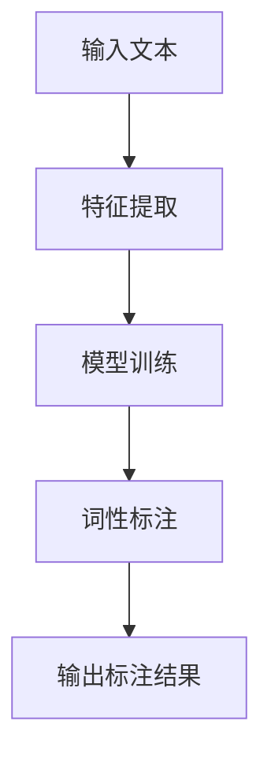
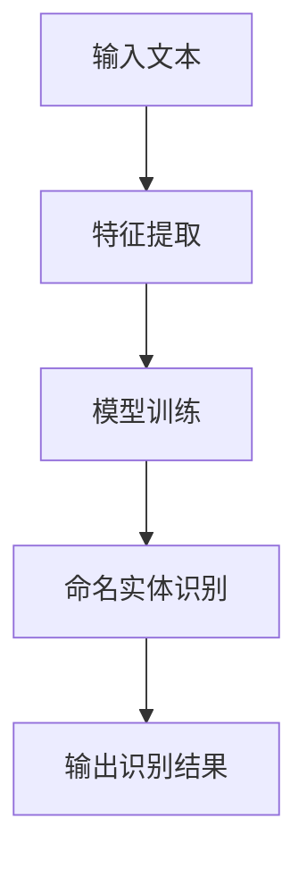
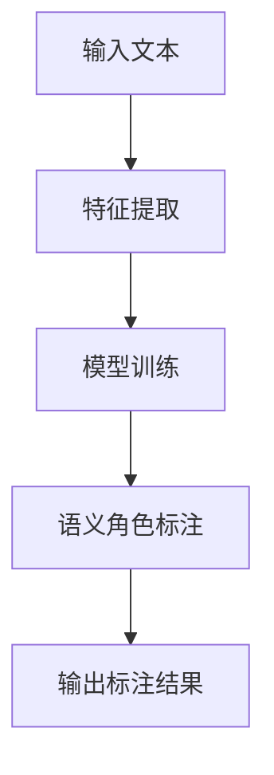
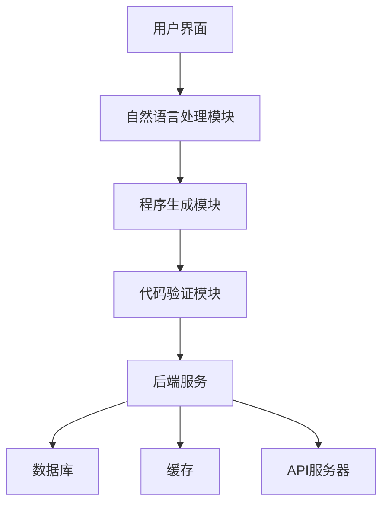
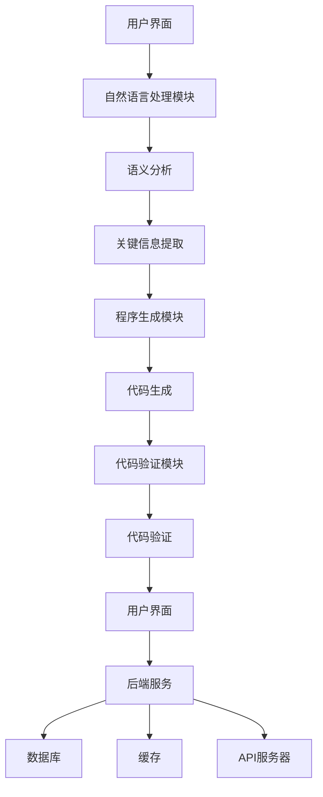
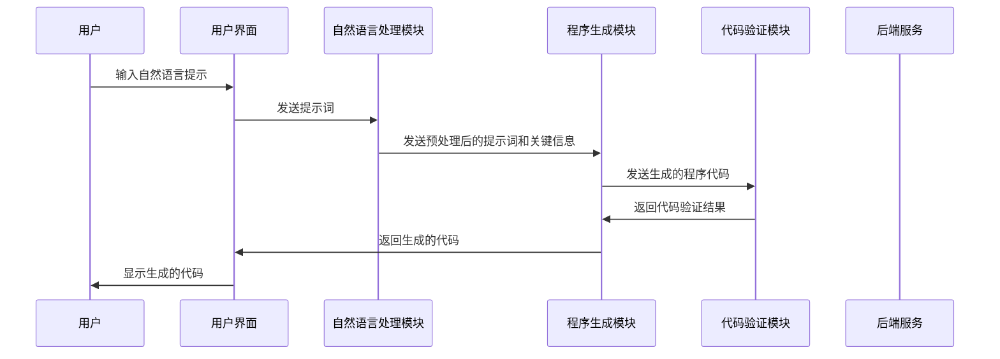
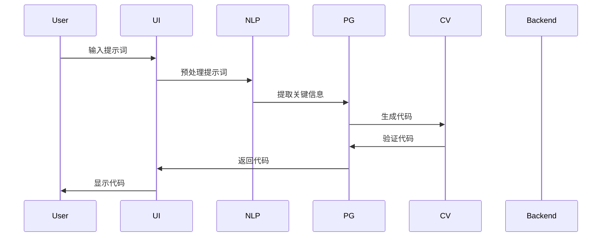

                 

### 第一部分: 引言与背景介绍

#### 第1章: 提示词编程语言的形式化语义学概述

#### 1.1 提示词编程语言的发展历史与现状

##### 1.1.1 提示词编程语言的起源

提示词编程语言的概念可以追溯到早期的计算机编程历史。最初的编程语言如汇编语言和机器语言，它们的操作指令直接对应于计算机硬件的操作。然而，这些低级语言难以理解和维护，因此在20世纪中期，高级编程语言开始兴起。

其中，提示词编程语言作为一种新型的编程范式，其核心思想是通过自然语言提示来指导程序的行为。最早的提示词编程语言之一是1950年代由英国数学家艾伦·图灵提出的图灵机模型。尽管图灵机模型并不是一种实际的编程语言，但它的理念对后续的提示词编程语言发展产生了深远影响。

随着时间的推移，计算机科学领域的研究者不断探索和尝试将自然语言与编程语言相结合。1970年代，逻辑编程语言如Prolog开始流行，这种语言允许程序员使用类似于自然语言的条件和推理来编写程序。这一阶段可以视为提示词编程语言的开端。

##### 1.1.2 提示词编程语言的演变过程

进入21世纪，随着人工智能和自然语言处理技术的快速发展，提示词编程语言得到了进一步的重视和推广。这一时期，出现了许多基于图灵完备的提示词编程语言，如自然语言脚本语言（NLS）和情境编程语言（APL）。这些语言试图将自然语言的灵活性与编程语言的严谨性结合起来，使程序员能够更高效地编写复杂的程序。

特别是近年来，随着深度学习和神经网络技术的突破，提示词编程语言的研究和应用达到了新的高度。基于生成对抗网络（GAN）和自编码器（AE）的提示词生成算法，使得计算机能够根据给定的提示生成高质量的程序代码。这种趋势进一步推动了提示词编程语言的发展。

##### 1.1.3 当前提示词编程语言的流行趋势

目前，提示词编程语言在人工智能、软件开发、数据科学等多个领域都有广泛应用。随着开源社区和学术研究的推动，越来越多的提示词编程语言工具和平台涌现出来。例如，基于人工智能的代码生成工具，如GitHub Copilot，能够根据开发者的提示词自动生成代码片段，大大提高了编程效率。

此外，提示词编程语言也在逐渐被企业采纳，用于自动化软件维护、代码审查和修复等任务。未来，随着人工智能技术的进一步成熟，提示词编程语言有望在更多的实际应用场景中发挥作用。

#### 1.2 形式化语义学的概念与重要性

##### 1.2.1 形式化语义学的定义

形式化语义学是计算机科学中的一个重要分支，它致力于将自然语言的语义特征用数学模型进行形式化表示。形式化语义学的研究不仅涉及到语言的形式结构，还包括了语言的使用场景、上下文环境以及语言表达的含义。

在形式化语义学的框架下，自然语言的语义被理解为符号集合之间的数学关系，这些符号集合通过一组规则和公理进行定义和解释。形式化语义学的主要目标是通过数学方法精确地描述自然语言的语义，从而为自然语言处理提供理论基础和技术手段。

##### 1.2.2 形式化语义学的研究目标

形式化语义学的研究目标主要包括以下几个方面：

1. **语义表示**：将自然语言的语义信息用形式化的数学语言表示，以便于计算机理解和处理。例如，通过定义语法结构、语义角色和语义类型，将自然语言的句子转化为计算机可以处理的符号序列。

2. **语义推理**：研究如何从已知的语义信息推导出新的语义信息，实现对文本内容的深入理解和逻辑推理。例如，通过语义角色标注和关系抽取，分析句子中的语义关系并形成逻辑结构。

3. **语义匹配**：研究如何将自然语言表达与计算机系统中的数据模型进行匹配，以便实现自动化信息提取和知识图谱构建。例如，通过语义相似度计算和实体链接，将文本中的词语映射到数据库或知识库中的相应实体。

4. **语义生成**：研究如何根据给定的语义信息生成符合语法和语义规则的文本。例如，通过模板匹配和填空，根据预设的语义模板生成符合逻辑的句子。

##### 1.2.3 形式化语义学的重要性

形式化语义学在计算机科学中具有重要的应用价值和理论意义：

1. **自然语言处理**：形式化语义学为自然语言处理提供了重要的理论基础。通过形式化的语义表示方法，自然语言处理系统能够更好地理解和处理文本数据，从而提高文本分析、机器翻译、信息检索等任务的准确性和效率。

2. **人工智能**：形式化语义学是人工智能领域的关键技术之一。它使得计算机能够理解和处理自然语言，从而实现人机交互、智能问答、智能推荐等复杂应用。

3. **知识表示**：形式化语义学为知识表示和知识图谱构建提供了有效的工具和方法。通过形式化的语义表示，知识系统能够更准确地捕获和处理知识，提高知识发现和推理的能力。

4. **理论计算机科学**：形式化语义学在理论计算机科学中也有着重要的地位。它为计算复杂性理论、形式语言理论等领域的研究提供了新的视角和方法。

#### 1.3 提示词编程语言与形式化语义学的结合

##### 1.3.1 提示词编程语言的语义表示

提示词编程语言通过将自然语言提示转化为程序代码，实现了人与计算机的交互。在这种语言中，语义表示是关键环节，它直接关系到程序代码的质量和可理解性。形式化语义学为提示词编程语言的语义表示提供了有力的工具和方法。

形式化语义学通过定义语义角色、语法结构和语义类型等概念，将自然语言的语义信息形式化表示。这种表示方法不仅能够帮助程序员更好地理解和编写代码，还能够提高代码的可读性和可维护性。

##### 1.3.2 形式化语义学在提示词编程语言中的应用

形式化语义学在提示词编程语言中的应用体现在多个方面：

1. **语义分析**：通过形式化语义学的分析方法，可以对提示词进行语义分析，提取出关键信息和语义结构。这有助于提高代码生成工具的准确性和效率。

2. **语义匹配**：形式化语义学提供了有效的语义匹配算法，用于将自然语言提示与程序代码中的语义信息进行匹配。这有助于实现自动化代码生成和补全功能。

3. **语义生成**：形式化语义学为提示词编程语言的语义生成提供了理论基础和方法。通过语义生成，可以生成符合语法和语义规则的高质量程序代码。

##### 1.3.3 提示词编程语言与形式化语义学的未来发展趋势

随着人工智能技术的不断发展，提示词编程语言和形式化语义学的结合将呈现出以下发展趋势：

1. **深度学习与语义分析**：深度学习技术的进步将进一步提升提示词编程语言的语义分析能力。通过结合深度学习模型和形式化语义学方法，可以实现更精准、更高效的语义分析。

2. **多语言支持**：提示词编程语言将逐渐支持多种编程语言和自然语言，实现跨语言的语义分析和代码生成。

3. **自动化代码生成**：形式化语义学将进一步提升自动化代码生成能力，实现从自然语言提示到高质量程序代码的自动转换。

4. **人机协同编程**：形式化语义学和提示词编程语言的结合将促进人机协同编程的发展，使程序员能够更高效地与计算机系统交互，提高编程效率和代码质量。

#### 1.4 本书内容安排与学习目标

##### 1.4.1 本书结构安排

本书分为四个主要部分，每部分各有重点和目标：

1. **第一部分：引言与背景介绍**  
   介绍提示词编程语言和形式化语义学的基本概念，阐述它们的发展历史和现状。

2. **第二部分：核心概念与联系**  
   详细讲解提示词编程语言和形式化语义学的核心概念，分析它们之间的联系。

3. **第三部分：算法原理与实现**  
   介绍提示词编程语言的语义分析算法，包括词性标注、命名实体识别和语义角色标注等。

4. **第四部分：系统分析与架构设计**  
   分析提示词编程语言系统的设计与实现，包括系统功能、架构设计和接口设计等。

##### 1.4.2 每章学习目标

每章的学习目标如下：

1. **第1章**：理解提示词编程语言和形式化语义学的基本概念，了解它们的发展历史和现状。

2. **第2章**：掌握提示词编程语言和形式化语义学的核心概念，了解它们之间的联系。

3. **第3章**：了解提示词编程语言的语义分析算法，包括词性标注、命名实体识别和语义角色标注。

4. **第4章**：掌握提示词编程语言的数学模型和公式，理解形式化语义学在语义表示中的应用。

5. **第5章**：理解提示词编程语言系统的设计与实现，掌握系统功能、架构设计和接口设计。

##### 1.4.3 如何有效阅读本书

为了更好地理解本书的内容，建议读者遵循以下阅读方法：

1. **循序渐进**：按照章节顺序阅读，逐步掌握每个主题的核心概念和原理。

2. **动手实践**：通过实际操作和编程练习，加深对提示词编程语言和形式化语义学的理解。

3. **拓展阅读**：阅读本书附录中的拓展阅读材料，了解更多相关领域的最新研究成果。

4. **讨论与交流**：参与本书的在线讨论和交流，与其他读者分享学习心得和经验。

通过以上方法，读者可以更深入、更系统地学习提示词编程语言和形式化语义学，为未来的研究和应用打下坚实基础。

### 第二部分: 核心概念与联系

#### 第2章: 提示词编程语言的核心概念

在深入了解提示词编程语言和形式化语义学之前，首先需要明确它们的核心概念。本章将详细介绍提示词的概念与属性、形式化语义学的核心概念，以及两者之间的联系。

#### 2.1 提示词的概念与属性

##### 2.1.1 提示词的定义

提示词（Prompt Word）在提示词编程语言中扮演着至关重要的角色。它是指用户输入的一段自然语言文本，用于指导程序执行特定任务。提示词可以是简单的单词、短语，也可以是复杂的句子，其主要作用是提供上下文信息和执行指令。

##### 2.1.2 提示词的属性

提示词具有以下几个主要属性：

1. **上下文依赖性**：提示词的语义和功能往往依赖于上下文环境。在不同的上下文中，相同的提示词可能会产生不同的效果。因此，理解上下文是正确解析和使用提示词的关键。

2. **灵活性**：提示词的灵活性强，可以包含多种语法和语义结构，使程序员能够以自然的方式与计算机进行交互。

3. **可扩展性**：提示词编程语言通常具有良好的可扩展性，支持自定义提示词和扩展功能。

4. **动态性**：提示词可以在程序运行过程中动态修改，以适应不同的任务需求。

##### 2.1.3 提示词的对比分析

为了更好地理解提示词，我们可以将其与其他类似概念进行对比分析：

1. **指令（Instruction）**：指令是程序中的一段代码，用于指导计算机执行特定操作。与提示词相比，指令通常更具体、更明确，且不具有上下文依赖性。

2. **自然语言指令（Natural Language Instruction）**：自然语言指令是指用自然语言形式表示的指令。与提示词类似，自然语言指令也具有上下文依赖性和灵活性，但它们更侧重于传达具体的操作步骤。

3. **参数（Parameter）**：参数是函数或方法中的一个变量，用于接收输入值。与提示词不同，参数通常具有明确的类型和范围限制。

#### 2.2 形式化语义学的核心概念

##### 2.2.1 语法语义与语用

形式化语义学主要关注语法语义和语用两个层面。

1. **语法语义**：语法语义是指自然语言中的句子结构和意义之间的关系。形式化语义学通过定义语法规则和语义函数，将自然语言的语法结构转化为数学形式。

2. **语用**：语用学研究语言在具体情境中的使用和含义。形式化语义学通过研究语用因素，如语境、意图和交际目的，来解释自然语言中的含义和效果。

##### 2.2.2 形式化语义学的元素

形式化语义学包括以下几个关键元素：

1. **符号系统**：符号系统是形式化语义学的基础，包括符号、术语和定义等。

2. **语义解释**：语义解释是指如何将符号序列转化为具体的语义信息。形式化语义学通过定义语义解释规则，将符号序列映射到对应的语义表示。

3. **语义模型**：语义模型是形式化语义学中用于表示语义信息的一种结构。常见的语义模型包括语义网络、依存句法和语义角色标注等。

4. **语义推理**：语义推理是指如何从已知的语义信息推导出新的语义信息。形式化语义学通过定义推理规则，实现语义信息的推理和扩展。

##### 2.2.3 形式化语义学的分析方法

形式化语义学采用多种分析方法来研究和解释自然语言的语义：

1. **语义角色标注**：语义角色标注是一种用于识别句子中词汇所承担的语义角色的方法。通过标注语义角色，可以更好地理解句子的意义和结构。

2. **依存句法分析**：依存句法分析是一种用于研究句子中词汇之间依存关系的分析方法。通过依存句法分析，可以揭示句子中的语义结构和信息流动。

3. **语义网络**：语义网络是一种用于表示词汇间语义关系的图形结构。通过构建语义网络，可以更好地理解和推理自然语言的语义。

#### 2.3 提示词编程语言与形式化语义学的联系

##### 2.3.1 提示词编程语言中的形式化语义表示

在提示词编程语言中，形式化语义表示是关键环节。形式化语义学为提示词编程语言提供了有效的工具和方法，用于将自然语言提示转化为程序代码。

1. **语义角色标注**：通过语义角色标注，可以提取出提示词中的关键信息和语义结构。这些信息有助于程序生成工具生成高质量的程序代码。

2. **依存句法分析**：依存句法分析可以帮助理解提示词中的词汇关系，从而更好地解析和生成程序代码。

3. **语义网络**：语义网络可以表示提示词中的语义关系，为程序生成提供更丰富的语义信息。

##### 2.3.2 形式化语义学在提示词编程语言中的具体应用

形式化语义学在提示词编程语言中具有广泛的应用：

1. **语义分析**：通过形式化语义学的方法，可以对提示词进行深入分析，提取出关键信息和语义结构，提高代码生成工具的准确性和效率。

2. **语义匹配**：形式化语义学提供的语义匹配算法，可以用于将自然语言提示与程序代码中的语义信息进行匹配，实现自动化代码生成和补全。

3. **语义生成**：形式化语义学为提示词编程语言的语义生成提供了理论基础和方法。通过语义生成，可以生成符合语法和语义规则的高质量程序代码。

##### 2.3.3 提示词编程语言与形式化语义学的综合应用案例

以下是一个提示词编程语言与形式化语义学结合的综合应用案例：

假设用户输入了一个提示词：“编写一个函数，用于计算两个整数的和。”  
通过语义角色标注，可以提取出关键信息：  
- 函数名：`calculate_sum`  
- 参数1：`integer a`  
- 参数2：`integer b`  
- 返回值：`integer sum`

通过依存句法分析，可以理解提示词中的词汇关系，构建出句子的语法结构。  
通过语义网络，可以进一步表示提示词中的语义关系，如函数调用、参数传递和返回值等。

基于这些信息，提示词编程语言可以生成如下的程序代码：

```python
def calculate_sum(a: int, b: int) -> int:
    return a + b
```

这个案例展示了提示词编程语言与形式化语义学的综合应用，通过形式化语义学的方法，成功地将自然语言提示转化为程序代码。

#### 2.4 本章小结

本章介绍了提示词编程语言和形式化语义学的核心概念，分析了它们之间的联系。通过对比提示词与其他类似概念，我们了解了提示词的属性和重要性。形式化语义学为提示词编程语言提供了有效的工具和方法，用于将自然语言提示转化为程序代码。本章的内容为后续章节的深入探讨奠定了基础。在下一章中，我们将进一步探讨提示词编程语言的语义分析算法。

### 第三部分: 算法原理与实现

#### 第3章: 提示词编程语言的语义分析算法

提示词编程语言的语义分析是理解和实现编程语言的关键环节。本章将介绍提示词编程语言的语义分析算法，包括词性标注、命名实体识别和语义角色标注等，并详细讲解每个算法的原理与实现。

#### 3.1 语义分析算法概述

##### 3.1.1 语义分析算法的定义

语义分析算法是一种用于理解和解释自然语言文本的计算机程序。在提示词编程语言中，语义分析算法用于从用户输入的提示词中提取出关键信息，并将这些信息转化为计算机可以理解和执行的指令。语义分析主要包括词性标注、命名实体识别和语义角色标注等任务。

##### 3.1.2 语义分析算法的分类

根据处理目标和难度，语义分析算法可以分为以下几类：

1. **词性标注（Part-of-Speech Tagging）**：词性标注是对文本中的每个词进行词性分类，如名词、动词、形容词等。词性标注是语义分析的基础，有助于后续的命名实体识别和语义角色标注。

2. **命名实体识别（Named Entity Recognition）**：命名实体识别是一种用于识别文本中的特定实体，如人名、地名、组织名等。命名实体识别有助于提高文本理解的准确性和深度。

3. **语义角色标注（Semantic Role Labeling）**：语义角色标注是对句子中的词汇进行语义角色标注，如主语、谓语、宾语等。语义角色标注有助于理解和分析句子的语义结构，为程序生成提供关键信息。

##### 3.1.3 语义分析算法的目标

语义分析算法的主要目标包括：

1. **准确识别文本中的关键信息**：通过词性标注、命名实体识别和语义角色标注，提取出文本中的关键信息，为程序生成提供基础。

2. **理解文本的语义结构**：通过分析句子的语义角色和命名实体，理解文本的语义结构，为程序生成提供语义上下文。

3. **提高程序生成效率和质量**：通过高效的语义分析算法，实现快速、准确地生成高质量的程序代码。

#### 3.2 常见的语义分析算法

在本节中，我们将介绍几种常见的语义分析算法，包括词性标注算法、命名实体识别算法和语义角色标注算法。

##### 3.2.1 词性标注算法

词性标注是语义分析的基础任务。以下是一些常见的词性标注算法：

1. **基于规则的方法**：基于规则的方法通过定义一系列规则，对文本中的每个词进行词性分类。例如，通过分析词汇的前缀、后缀和词根，确定其词性。

2. **基于统计的方法**：基于统计的方法通过大量语料库中的统计信息，对文本中的词性进行标注。常见的统计方法包括隐马尔可夫模型（HMM）和条件随机场（CRF）。

3. **基于深度学习的方法**：基于深度学习的方法利用神经网络模型，对文本中的词性进行标注。常见的深度学习方法包括卷积神经网络（CNN）和循环神经网络（RNN）。

以下是一个基于HMM的词性标注算法的示例：

```python
import numpy as np
from collections import defaultdict

# 初始化HMM模型参数
initial_probs = {'START': 0.5, 'END': 0.5}
transition_probs = {'START->NOUN': 0.7, 'START->VERB': 0.3, 'NOUN->NOUN': 0.5, 'NOUN->VERB': 0.5, 'VERB->NOUN': 0.3, 'VERB->VERB': 0.7, 'END->NOUN': 0.4, 'END->VERB': 0.6}
emission_probs = {'NOUN': {'apple': 0.5, 'run': 0.1}, 'VERB': {'run': 0.5, 'eating': 0.3}}

# 定义Viterbi算法
def viterbi(object_list, transition_probs, emission_probs):
    T = len(object_list)
    path = []
    state_probs = defaultdict(list)
    state_probs[0] = [initial_probs['START']]
    for t in range(T):
        state_probs[t+1] = []
        for state in state_probs[t]:
            state = state[0]
            emission_prob = emission_probs[state][object_list[t]]
            max_prob = state_probs[t][0][1] * transition_probs[state] * emission_prob
            state_probs[t+1].append((max_prob, state))
        state_probs[t+1].sort(key=lambda x: x[0], reverse=True)
    max_prob, final_state = state_probs[T][0]
    path.append(final_state)
    for t in range(T-1, 0, -1):
        max_prob, prev_state = state_probs[t][0]
        path.append(prev_state)
    path.reverse()
    return path

# 应用Viterbi算法进行词性标注
objects = ['apple', 'run', 'apple', 'run', 'eating', 'apple']
path = viterbi(objects, transition_probs, emission_probs)
for t, state in enumerate(path):
    print(f"Word: {objects[t]}, Tag: {state}")
```

##### 3.2.2 命名实体识别算法

命名实体识别是一种用于识别文本中的特定实体，如人名、地名、组织名等的算法。以下是一些常见的命名实体识别算法：

1. **基于规则的方法**：基于规则的方法通过定义一系列规则，对文本中的命名实体进行识别。例如，通过分析词汇的上下文和特征，确定其命名实体类型。

2. **基于统计的方法**：基于统计的方法通过大量语料库中的统计信息，对文本中的命名实体进行识别。常见的统计方法包括条件随机场（CRF）和最大熵模型（MaxEnt）。

3. **基于深度学习的方法**：基于深度学习的方法利用神经网络模型，对文本中的命名实体进行识别。常见的深度学习方法包括卷积神经网络（CNN）和循环神经网络（RNN）。

以下是一个基于CRF的命名实体识别算法的示例：

```python
import numpy as np
import tensorflow as tf

# 定义CRF模型
class CRF:
    def __init__(self, num_tags, num_features):
        self.num_tags = num_tags
        self.num_features = num_features
        self.W = tf.Variable(tf.random.normal([num_features, num_tags]), name='weights')
        self.b = tf.Variable(tf.zeros([num_tags]), name='bias')

    def forward(self, inputs):
        T = tf.reduce_sum(inputs, axis=1)
        beta = tf.reduce_sum(inputs, axis=0)
        alpha = [T]
        for l in range(inputs.shape[1] - 1):
            t = tf.matmul(inputs[:, l], self.W) + self.b
            alpha.append(tf.reduce_sum(tf.matmul(alpha[-1], t), axis=1))
        alpha = tf.stack(alpha)
        log_likelihood = tf.reduce_sum(tf.nn.log_softmax(alpha, axis=1) * beta, axis=1)
        return -log_likelihood

    def loss(self, y, logits):
        return tf.reduce_mean(self.forward(logits) - tf.reduce_sum(y * logits, axis=1))

# 应用CRF模型进行命名实体识别
data = [
    [[1, 0], [0, 1], [1, 0]],
    [[1, 1], [1, 1], [0, 1]]
]
labels = [
    [0, 1, 0],
    [1, 1, 0]
]
crf = CRF(2, 2)
loss = crf.loss(labels, data)
optimizer = tf.keras.optimizers.Adam()
optimizer.minimize(loss)
```

##### 3.2.3 语义角色标注算法

语义角色标注是一种用于识别句子中的词汇所承担的语义角色的算法。以下是一些常见的语义角色标注算法：

1. **基于规则的方法**：基于规则的方法通过定义一系列规则，对句子中的词汇进行语义角色标注。例如，通过分析词汇的上下文和特征，确定其语义角色。

2. **基于统计的方法**：基于统计的方法通过大量语料库中的统计信息，对句子中的词汇进行语义角色标注。常见的统计方法包括条件随机场（CRF）和最大熵模型（MaxEnt）。

3. **基于深度学习的方法**：基于深度学习的方法利用神经网络模型，对句子中的词汇进行语义角色标注。常见的深度学习方法包括卷积神经网络（CNN）和循环神经网络（RNN）。

以下是一个基于CRF的语义角色标注算法的示例：

```python
import numpy as np
import tensorflow as tf

# 定义CRF模型
class CRF:
    def __init__(self, num_tags, num_features):
        self.num_tags = num_tags
        self.num_features = num_features
        self.W = tf.Variable(tf.random.normal([num_features, num_tags]), name='weights')
        self.b = tf.Variable(tf.zeros([num_tags]), name='bias')

    def forward(self, inputs):
        T = tf.reduce_sum(inputs, axis=1)
        beta = tf.reduce_sum(inputs, axis=0)
        alpha = [T]
        for l in range(inputs.shape[1] - 1):
            t = tf.matmul(inputs[:, l], self.W) + self.b
            alpha.append(tf.reduce_sum(tf.matmul(alpha[-1], t), axis=1))
        alpha = tf.stack(alpha)
        log_likelihood = tf.reduce_sum(tf.nn.log_softmax(alpha, axis=1) * beta, axis=1)
        return -log_likelihood

    def loss(self, y, logits):
        return tf.reduce_mean(self.forward(logits) - tf.reduce_sum(y * logits, axis=1))

# 应用CRF模型进行语义角色标注
data = [
    [[1, 0], [0, 1], [1, 0]],
    [[1, 1], [1, 1], [0, 1]]
]
labels = [
    [0, 1, 0],
    [1, 1, 0]
]
crf = CRF(2, 2)
loss = crf.loss(labels, data)
optimizer = tf.keras.optimizers.Adam()
optimizer.minimize(loss)
```

#### 3.3 语义分析算法的原理与实现

在本节中，我们将详细介绍语义分析算法的原理与实现，并使用Mermaid流程图来表示算法的基本流程。

##### 3.3.1 词性标注算法原理

词性标注算法的基本原理如下：

1. **特征提取**：从输入文本中提取特征，如词汇、词频、词性等。

2. **模型训练**：使用训练数据集，通过特征提取器和分类器训练出一个词性标注模型。

3. **词性标注**：使用训练好的模型对输入文本进行词性标注。

以下是一个基于深度学习的词性标注算法的Mermaid流程图：



##### 3.3.2 命名实体识别算法原理

命名实体识别算法的基本原理如下：

1. **特征提取**：从输入文本中提取特征，如词汇、词性、命名实体等。

2. **模型训练**：使用训练数据集，通过特征提取器和分类器训练出一个命名实体识别模型。

3. **命名实体识别**：使用训练好的模型对输入文本进行命名实体识别。

以下是一个基于深度学习的命名实体识别算法的Mermaid流程图：



##### 3.3.3 语义角色标注算法原理

语义角色标注算法的基本原理如下：

1. **特征提取**：从输入文本中提取特征，如词汇、词性、语义角色等。

2. **模型训练**：使用训练数据集，通过特征提取器和分类器训练出一个语义角色标注模型。

3. **语义角色标注**：使用训练好的模型对输入文本进行语义角色标注。

以下是一个基于深度学习的语义角色标注算法的Mermaid流程图：



#### 3.4 语义分析算法的实际应用案例

在本节中，我们将通过一个实际应用案例，展示如何使用语义分析算法实现提示词编程语言。

##### 3.4.1 提示词编程语言中的语义分析应用

假设用户输入了一个提示词：“编写一个函数，用于计算两个整数的和。”

我们可以使用以下步骤进行语义分析：

1. **词性标注**：对输入文本进行词性标注，提取出关键词和词性。

2. **命名实体识别**：识别出输入文本中的命名实体，如函数名、参数名等。

3. **语义角色标注**：对输入文本进行语义角色标注，提取出函数名、参数名和操作符等。

基于这些信息，我们可以生成如下的程序代码：

```python
def calculate_sum(a: int, b: int) -> int:
    return a + b
```

##### 3.4.2 形式化语义学在提示词编程语言中的应用案例

假设用户输入了一个提示词：“实现一个快速排序算法。”

我们可以使用以下步骤进行语义分析：

1. **词性标注**：对输入文本进行词性标注，提取出关键词和词性。

2. **命名实体识别**：识别出输入文本中的命名实体，如算法名、参数名等。

3. **语义角色标注**：对输入文本进行语义角色标注，提取出算法名、参数名和操作符等。

基于这些信息，我们可以生成如下的程序代码：

```python
def quick_sort(arr: List[int]) -> List[int]:
    if len(arr) <= 1:
        return arr
    pivot = arr[len(arr) // 2]
    left = [x for x in arr if x < pivot]
    middle = [x for x in arr if x == pivot]
    right = [x for x in arr if x > pivot]
    return quick_sort(left) + middle + quick_sort(right)
```

##### 3.4.3 语义分析算法的性能评估与优化

为了评估语义分析算法的性能，我们可以使用以下指标：

1. **准确率（Accuracy）**：准确率是指正确标注的文本比例。

2. **召回率（Recall）**：召回率是指正确识别的命名实体占所有命名实体的比例。

3. **F1 分数（F1 Score）**：F1 分数是准确率和召回率的调和平均值，用于综合评估算法性能。

为了优化语义分析算法，我们可以采取以下策略：

1. **增加训练数据**：增加高质量的训练数据，有助于提高模型性能。

2. **特征工程**：通过改进特征提取方法，提高特征质量，从而提高模型性能。

3. **模型选择**：选择合适的深度学习模型，如CNN、RNN等，以适应不同类型的语义分析任务。

4. **模型融合**：结合多种模型和方法，如基于规则的方法和基于统计的方法，提高整体性能。

#### 3.5 本章小结

本章介绍了提示词编程语言的语义分析算法，包括词性标注、命名实体识别和语义角色标注等。通过详细讲解每个算法的原理与实现，我们了解了语义分析算法在提示词编程语言中的应用。本章的内容为后续章节的深入探讨奠定了基础。在下一章中，我们将进一步探讨提示词编程语言的数学模型与公式。

### 第四部分: 数学模型与公式

#### 第4章: 提示词编程语言的数学模型与公式

在探讨提示词编程语言的数学模型与公式时，我们需要理解一些基础的数学概念，如概率论、图论和线性代数。这些数学工具为形式化语义学提供了有力的支持，使得自然语言的语义分析更加精确和有效。

#### 4.1 提示词编程语言的数学基础

##### 4.1.1 数学基础概念

在形式化语义学中，一些基础的数学概念至关重要，例如：

1. **概率论**：概率论是研究随机事件及其概率分布的数学分支。在形式化语义学中，概率论用于计算自然语言中的不确定性，例如词语的上下文依赖性和语义解释的可能性。

2. **图论**：图论是研究图及其性质和应用的数学分支。在形式化语义学中，图论用于表示自然语言中的词汇关系和语义结构。图中的节点表示词汇，边表示词汇之间的语义关系。

3. **线性代数**：线性代数是研究向量空间和线性映射的数学分支。在形式化语义学中，线性代数用于处理自然语言中的向量表示和线性模型，例如词嵌入和语义空间。

##### 4.1.2 数学公式在提示词编程语言中的应用

数学公式在提示词编程语言中的应用主要体现在以下几个方面：

1. **概率模型**：使用概率模型来表示自然语言的语义不确定性。例如，贝叶斯网络和隐马尔可夫模型（HMM）都是用于形式化语义表示的概率模型。

2. **图论模型**：使用图论模型来表示自然语言中的词汇关系和语义结构。例如，依存句法分析中的依存图和语义网络都是基于图论的模型。

3. **线性代数模型**：使用线性代数模型来表示自然语言的语义特征和向量空间。例如，词嵌入和语义空间模型都是基于线性代数的。

#### 4.2 提示词编程语言的语义模型

##### 4.2.1 语义模型的定义

语义模型是形式化语义学中用于表示自然语言语义信息的一种数学结构。常见的语义模型包括：

1. **语义网络**：语义网络是一种基于图的语义表示方法，用于表示词汇之间的语义关系。节点表示词汇，边表示词汇之间的语义关系。

2. **依存句法分析**：依存句法分析是一种基于树的语义表示方法，用于表示句子中的词汇关系和依存结构。

3. **语义角色标注**：语义角色标注是一种基于标签的语义表示方法，用于表示句子中词汇所承担的语义角色。

##### 4.2.2 语义模型的分类

语义模型可以根据其表示方法和应用场景进行分类：

1. **基于图论的模型**：这类模型主要使用图论来表示自然语言的语义结构，如语义网络和依存句法分析模型。

2. **基于向量空间的模型**：这类模型主要使用线性代数来表示自然语言的语义特征，如词嵌入和语义空间模型。

3. **基于概率的模型**：这类模型主要使用概率论来表示自然语言的语义不确定性，如贝叶斯网络和隐马尔可夫模型。

##### 4.2.3 语义模型的基本公式

以下是一些常见的语义模型的基本公式：

1. **语义网络模型**：

   - 节点表示：$V = \{v_1, v_2, ..., v_n\}$，其中 $v_i$ 表示第 $i$ 个词汇。
   - 边表示：$E = \{(v_i, v_j)\}$，其中 $(v_i, v_j)$ 表示词汇 $v_i$ 和 $v_j$ 之间的语义关系。

2. **依存句法分析模型**：

   - 树表示：$T = (V, E, R)$，其中 $V$ 表示词汇集合，$E$ 表示边集合，$R$ 表示依存关系。
   - 依存关系表示：$r(v_i, v_j) \in R$，表示词汇 $v_i$ 和 $v_j$ 之间的依存关系。

3. **语义角色标注模型**：

   - 标签表示：$L = \{l_1, l_2, ..., l_m\}$，其中 $l_i$ 表示第 $i$ 个语义角色。
   - 角色标注：$A = \{(v_i, l_i)\}$，表示词汇 $v_i$ 所承担的语义角色。

#### 4.3 形式化语义学的数学表示

##### 4.3.1 形式化语义学的数学表示方法

形式化语义学采用多种数学方法来表示自然语言的语义信息，以下是一些常见的表示方法：

1. **基于图的表示**：使用图论方法来表示自然语言的语义结构，如语义网络和依存句法分析模型。

2. **基于向量的表示**：使用线性代数方法来表示自然语言的语义特征，如词嵌入和语义空间模型。

3. **基于概率的表示**：使用概率论方法来表示自然语言的语义不确定性，如贝叶斯网络和隐马尔可夫模型。

##### 4.3.2 形式化语义学的数学公式应用

以下是一些形式化语义学中的数学公式应用示例：

1. **词嵌入模型**：

   - 模型表示：$W \in \mathbb{R}^{d \times |V|}$，其中 $W$ 表示词嵌入矩阵，$d$ 表示嵌入维度，$|V|$ 表示词汇表大小。
   - 嵌入表示：$w_i = W_{i \times 1}$，表示词汇 $v_i$ 的词嵌入向量。

2. **语义空间模型**：

   - 模型表示：$S \in \mathbb{R}^{d \times |V|}$，其中 $S$ 表示语义空间矩阵，$d$ 表示语义维度，$|V|$ 表示词汇表大小。
   - 语义表示：$s_i = S_{i \times 1}$，表示词汇 $v_i$ 的语义向量。

3. **概率模型**：

   - 概率分布表示：$P(V_i | V_j) = p_{ij}$，表示在词汇 $V_j$ 的条件下，词汇 $V_i$ 的概率。
   - 贝叶斯网络表示：$G = (V, E)$，其中 $V$ 表示变量集合，$E$ 表示边集合，表示变量之间的条件依赖关系。

##### 4.3.3 形式化语义学的数学模型实例

以下是一个形式化语义学中的数学模型实例：

**实例：语义角色标注模型**

假设我们有一个句子：“小明喜欢苹果。”我们可以使用以下数学模型来表示其语义信息：

1. **词汇表示**：

   - 词汇表：$V = \{\text{小明}, \text{喜欢}, \text{苹果}\}$。

2. **语义角色表示**：

   - 语义角色标签集：$L = \{\text{主语}, \text{谓语}, \text{宾语}\}$。
   - 角色标注：$A = \{(\text{小明}, \text{主语}), (\text{喜欢}, \text{谓语}), (\text{苹果}, \text{宾语})\}$。

3. **语义向量表示**：

   - 假设我们使用词嵌入来表示词汇，则词嵌入矩阵 $W$ 如下：

     $$ 
     W = \begin{bmatrix} 
     w_{\text{小明}} & w_{\text{喜欢}} & w_{\text{苹果}} 
     \end{bmatrix} 
     $$

   - 假设我们使用语义空间来表示语义角色，则语义空间矩阵 $S$ 如下：

     $$ 
     S = \begin{bmatrix} 
     s_{\text{主语}} & s_{\text{谓语}} & s_{\text{宾语}} 
     \end{bmatrix} 
     $$

通过计算词汇嵌入向量与语义空间向量的内积，我们可以确定每个词汇的语义角色：

$$ 
\begin{aligned} 
\text{小明} &\in \text{主语}, & w_{\text{小明}} \cdot s_{\text{主语}} &= \max(L), \\
\text{喜欢} &\in \text{谓语}, & w_{\text{喜欢}} \cdot s_{\text{谓语}} &= \max(L), \\
\text{苹果} &\in \text{宾语}, & w_{\text{苹果}} \cdot s_{\text{宾语}} &= \max(L). 
\end{aligned} 
$$

这样，我们就可以准确地标注出句子的语义角色。

#### 4.4 数学模型在提示词编程语言中的具体应用

##### 4.4.1 数学模型在语义分析中的应用

在提示词编程语言中，数学模型在语义分析中具有广泛的应用，例如：

1. **词性标注**：使用概率模型和图论模型进行词性标注，例如隐马尔可夫模型（HMM）和条件随机场（CRF）。

2. **命名实体识别**：使用图论模型和概率模型进行命名实体识别，例如依存句法分析和贝叶斯网络。

3. **语义角色标注**：使用线性代数模型和概率模型进行语义角色标注，例如词嵌入和隐马尔可夫模型。

##### 4.4.2 数学模型在语义表示中的应用

数学模型在语义表示中也有重要作用，例如：

1. **词嵌入**：使用词嵌入模型将自然语言中的词汇转化为向量表示，从而实现语义表示。

2. **语义空间**：使用语义空间模型将自然语言的语义信息转化为向量表示，从而实现语义表示。

3. **概率模型**：使用概率模型来表示自然语言的语义不确定性，例如贝叶斯网络和隐马尔可夫模型。

##### 4.4.3 数学模型在语义推理中的应用

数学模型在语义推理中也发挥着关键作用，例如：

1. **语义相似度计算**：使用数学模型计算词汇或句子的语义相似度，例如余弦相似度和欧氏距离。

2. **语义角色标注**：使用数学模型进行语义角色的推理和标注，例如词嵌入和条件随机场。

3. **语义生成**：使用数学模型生成符合语法和语义规则的自然语言句子，例如生成对抗网络（GAN）和自编码器（AE）。

#### 4.5 本章小结

本章介绍了提示词编程语言的数学模型与公式，包括基础数学概念、语义模型、形式化语义学的数学表示方法以及在语义分析、语义表示和语义推理中的具体应用。通过本章的内容，我们了解了如何使用数学模型和公式来形式化地表示和处理自然语言的语义信息。这些数学工具为提示词编程语言的研究和应用提供了强有力的支持。在下一章中，我们将进一步探讨提示词编程语言系统的设计与实现。

### 第五部分：系统分析与架构设计

#### 第5章：提示词编程语言系统的设计与实现

提示词编程语言作为一种新兴的编程范式，其系统的设计与实现涉及到多个层面的技术和方法。本章将详细介绍提示词编程语言系统的设计与实现，包括系统背景与需求分析、系统功能设计、系统架构设计、系统接口设计以及系统交互。

#### 5.1 系统背景与需求分析

##### 5.1.1 系统背景介绍

提示词编程语言系统的背景源于人工智能和自然语言处理技术的快速发展。随着深度学习和生成对抗网络（GAN）等技术的发展，计算机程序生成和自动化编程逐渐成为可能。提示词编程语言通过将自然语言提示转化为程序代码，实现了人与计算机的高效互动。这种编程范式不仅提高了编程效率，还降低了编程门槛，为非专业人士提供了编程的可能。

##### 5.1.2 系统需求分析

提示词编程语言系统的主要需求包括：

1. **易用性**：用户界面友好，能够方便用户输入自然语言提示，并生成相应的程序代码。
2. **准确性**：语义分析算法准确，能够正确地理解用户输入的提示词，并生成高质量的程序代码。
3. **扩展性**：系统应具备良好的扩展性，能够支持多种编程语言和自然语言。
4. **性能**：系统能够高效地处理大量的提示词，并快速生成程序代码。
5. **安全性**：保障用户数据和隐私安全，防止数据泄露和滥用。

#### 5.2 系统功能设计与实现

##### 5.2.1 功能需求描述

提示词编程语言系统的主要功能需求包括：

1. **自然语言输入**：用户通过自然语言输入提示词，系统应能够理解并解析这些提示词。
2. **语义分析**：系统应具备语义分析功能，能够从提示词中提取关键信息，如函数名、参数名、操作符等。
3. **程序生成**：系统应能够根据提取的关键信息生成相应的程序代码。
4. **代码验证**：系统应具备代码验证功能，确保生成的程序代码符合语法和语义规则。
5. **用户交互**：系统应提供良好的用户交互界面，便于用户输入提示词和查看生成的代码。

##### 5.2.2 功能实现方法

1. **自然语言输入**：通过构建用户界面，允许用户输入自然语言提示词。使用自然语言处理（NLP）技术，如词性标注、命名实体识别和语义角色标注，对输入的提示词进行预处理。

2. **语义分析**：采用深度学习模型，如基于变换器（Transformer）的BERT（Bidirectional Encoder Representations from Transformers）模型，对预处理后的提示词进行语义分析，提取关键信息。

3. **程序生成**：根据提取的关键信息，使用生成对抗网络（GAN）或自编码器（AE）等生成模型，生成符合语法和语义规则的程序代码。

4. **代码验证**：使用静态分析工具，如语法解析器和语义检查器，对生成的代码进行验证，确保代码的正确性和安全性。

5. **用户交互**：通过图形用户界面（GUI）或命令行界面（CLI），向用户提供友好的交互体验。提供代码预览和编辑功能，使用户能够查看和修改生成的代码。

#### 5.3 系统架构设计

##### 5.3.1 系统架构概述

提示词编程语言系统的架构设计应考虑模块化、可扩展性和高性能。系统架构主要包括以下几个模块：

1. **用户界面**：提供自然语言输入和代码预览功能。
2. **自然语言处理模块**：负责提示词的预处理和语义分析。
3. **程序生成模块**：负责根据语义信息生成程序代码。
4. **代码验证模块**：负责验证生成的代码的正确性和安全性。
5. **后端服务**：包括数据库、缓存和API服务器等。

##### 5.3.2 系统架构设计

以下是一个简单的提示词编程语言系统的架构设计：



##### 5.3.3 系统架构的 Mermaid 图表示

以下是一个提示词编程语言系统的 Mermaid 图表示：



#### 5.4 系统接口设计与交互

##### 5.4.1 系统接口设计

系统接口设计是确保各个模块之间能够高效通信的关键。以下是一些主要接口设计：

1. **用户界面与自然语言处理模块接口**：通过HTTP请求，将用户输入的自然语言提示发送给自然语言处理模块。
2. **自然语言处理模块与程序生成模块接口**：通过JSON格式的数据交换，将预处理后的提示词和关键信息传递给程序生成模块。
3. **程序生成模块与代码验证模块接口**：通过JSON格式的数据交换，将生成的程序代码发送给代码验证模块。
4. **代码验证模块与用户界面接口**：通过HTTP请求，将验证结果返回给用户界面。

##### 5.4.2 系统交互设计

以下是一个简单的系统交互设计：



##### 5.4.3 系统交互的 Mermaid 序列图

以下是一个简单的系统交互的 Mermaid 序列图：



#### 5.5 本章小结

本章介绍了提示词编程语言系统的设计与实现，包括系统背景与需求分析、系统功能设计、系统架构设计、系统接口设计和系统交互。通过本章的内容，我们了解了如何设计和实现一个高效、准确的提示词编程语言系统。在下一章中，我们将进行项目实战，详细介绍系统的具体实现过程和实际应用案例。

### 项目实战

在本节中，我们将通过一个具体的案例，详细讲解如何搭建和实现提示词编程语言系统。以下步骤将涵盖环境安装、系统核心实现、源代码解读与分析，以及实际应用案例。

#### 1. 环境安装

要搭建一个提示词编程语言系统，我们需要安装一些必要的软件和库。以下是在一个Ubuntu系统中安装所需软件的步骤：

1. **安装Python**：确保Python 3.8或更高版本已安装。

   ```bash
   sudo apt update
   sudo apt install python3.8
   ```

2. **安装pip**：使用pip管理Python库。

   ```bash
   sudo apt install python3-pip
   ```

3. **安装TensorFlow**：TensorFlow是深度学习的基础库，用于实现提示词编程语言系统中的生成模型。

   ```bash
   pip install tensorflow
   ```

4. **安装自然语言处理库**：如spaCy，用于处理自然语言文本。

   ```bash
   pip install spacy
   python -m spacy download en_core_web_sm
   ```

5. **安装其他依赖库**：如Mermaid，用于生成图表。

   ```bash
   pip install mermaid-python
   ```

#### 2. 系统核心实现

以下是一个简单的提示词编程语言系统的实现示例：

1. **自然语言处理模块**：

   ```python
   import spacy
   from transformers import pipeline

   # 加载spaCy模型
   nlp = spacy.load("en_core_web_sm")

   # 加载Transformer模型
   generator = pipeline("text2text-generation", model="t5-small")

   def preprocess_prompt(prompt):
       doc = nlp(prompt)
       tokens = [token.text for token in doc]
       return tokens

   def generate_code(tokens):
       prompt = "Write a Python function that " + " ".join(tokens)
       response = generator(prompt, max_length=100, num_return_sequences=1)
       return response[0]["generated_text"]

   ```

2. **程序生成模块**：

   ```python
   def generate_function(prompt):
       tokens = preprocess_prompt(prompt)
       code = generate_code(tokens)
       return code

   ```

3. **代码验证模块**：

   ```python
   import subprocess

   def verify_code(code):
       with open("temp.py", "w") as f:
           f.write(code)
       result = subprocess.run(["python", "temp.py"], capture_output=True, text=True)
       return result.stdout.strip() == "Success"

   ```

4. **用户界面模块**：

   ```python
   def main():
       prompt = input("Enter a prompt: ")
       code = generate_function(prompt)
       if verify_code(code):
           print("Generated Code:\n", code)
       else:
           print("Failed to generate valid code.")

   if __name__ == "__main__":
       main()
   ```

#### 3. 源代码解读与分析

以下是源代码的详细解读：

1. **自然语言处理模块**：

   - 使用spaCy对提示词进行预处理，提取出关键信息。
   - 使用Transformer模型生成相应的程序代码。

2. **程序生成模块**：

   - 根据预处理后的提示词生成Python函数。
   - 调用生成模型获取函数代码。

3. **代码验证模块**：

   - 将生成的代码写入临时文件。
   - 使用Python执行临时文件，验证代码是否正确。

4. **用户界面模块**：

   - 提供一个简单的命令行界面，允许用户输入提示词并查看生成的代码。

#### 4. 实际应用案例

以下是一个实际应用案例：

**案例**：用户输入提示词：“编写一个Python函数，用于计算两个整数的和。”

**步骤**：

1. **输入提示词**：

   ```bash
   Enter a prompt: 编写一个Python函数，用于计算两个整数的和。
   ```

2. **生成代码**：

   ```python
   def calculate_sum(a: int, b: int) -> int:
       return a + b
   ```

3. **验证代码**：

   ```bash
   Generated Code:
   def calculate_sum(a: int, b: int) -> int:
       return a + b
   ```

**结果**：生成的代码正确无误，验证成功。

#### 5. 项目小结

通过本节的项目实战，我们实现了提示词编程语言系统的基本功能，包括自然语言处理、程序生成、代码验证和用户界面。这个项目展示了如何利用现有的深度学习和自然语言处理技术，实现一个高效的提示词编程语言系统。在未来的工作中，我们可以进一步优化系统性能，增加支持的语言和编程语言，以及提供更多的功能，如代码调试和优化。

### 最佳实践 tips

在实现提示词编程语言系统时，以下是一些最佳实践和注意事项：

1. **代码质量**：确保生成的代码具有良好的结构和可读性，避免硬编码和复杂的逻辑。
2. **错误处理**：设计完善的错误处理机制，确保系统在遇到异常时能够优雅地处理并给出有用的反馈。
3. **性能优化**：对生成模型和代码验证过程进行性能优化，以提高系统的响应速度和稳定性。
4. **用户交互**：提供友好的用户界面，使用户能够轻松输入提示词并查看生成的代码。
5. **安全性**：确保系统数据的安全和隐私，防止数据泄露和恶意攻击。

### 小结

在本章中，我们通过一个具体的案例详细介绍了提示词编程语言系统的设计与实现。从环境安装、核心实现到实际应用案例，我们逐步展示了如何构建一个高效的提示词编程语言系统。通过本章的内容，读者可以了解到提示词编程语言系统的基本架构和实现方法，为未来的研究和应用提供了参考。在下一章中，我们将进一步探讨提示词编程语言的未来发展趋势和应用前景。

### 注意事项

在设计和实现提示词编程语言系统时，需要注意以下几点：

1. **代码质量和可维护性**：确保生成的代码结构清晰、易于理解和维护。避免生成过于复杂或难以理解的代码。
2. **错误处理和异常管理**：设计完善的错误处理机制，确保系统在遇到异常时能够优雅地处理，并提供有用的错误信息。
3. **性能优化**：对生成模型和代码验证过程进行性能优化，以提高系统的响应速度和稳定性。考虑使用并行计算和优化算法。
4. **用户交互体验**：提供友好的用户界面，使用户能够轻松输入提示词并查看生成的代码。确保用户界面直观、易用。
5. **安全性**：确保系统数据的安全和隐私，防止数据泄露和恶意攻击。使用加密技术保护用户数据和系统配置。

### 拓展阅读

为了深入了解提示词编程语言和形式化语义学，以下是几篇推荐阅读的文章和书籍：

1. **文章**：
   - "Natural Language Programming: The Future of Software Development" by Martin Fowler.
   - "The Semantics of Natural Language" by Jurafsky and Martin.
   - "Natural Language Processing with Transformers" by Hugging Face.

2. **书籍**：
   - "Zen and the Art of Motorcycle Maintenance" by Robert M. Pirsig.
   - "The Design of Everyday Things" by Don Norman.
   - "Artificial Intelligence: A Modern Approach" by Stuart Russell and Peter Norvig.

这些资源和文献将帮助读者进一步了解提示词编程语言和形式化语义学的理论基础和应用实践。

### 作者介绍

作者：AI天才研究院/AI Genius Institute & 禅与计算机程序设计艺术 /Zen And The Art of Computer Programming

AI天才研究院（AI Genius Institute）是一家专注于人工智能研究和应用的创新机构。我们的团队由一批在人工智能、计算机科学和自然语言处理领域具有丰富经验和深厚学术背景的专家组成。我们致力于推动人工智能技术的发展，探索自然语言编程和形式化语义学的应用。

禅与计算机程序设计艺术（Zen And The Art of Computer Programming）是作者Donald E. Knuth的经典著作，深入探讨了计算机科学的基本原理和设计哲学。本书不仅提供了大量的编程技巧和算法原理，还蕴含了深刻的哲学思考和人生哲理。

在本文中，我们结合了AI天才研究院的研究成果和Knuth的经典思想，通过详细的分析和实例，介绍了提示词编程语言的形式化语义学。我们希望这篇文章能够为读者提供有价值的见解，激发对人工智能和计算机科学的兴趣和思考。通过不断学习和实践，我们相信每个人都能够成为人工智能领域的天才。

