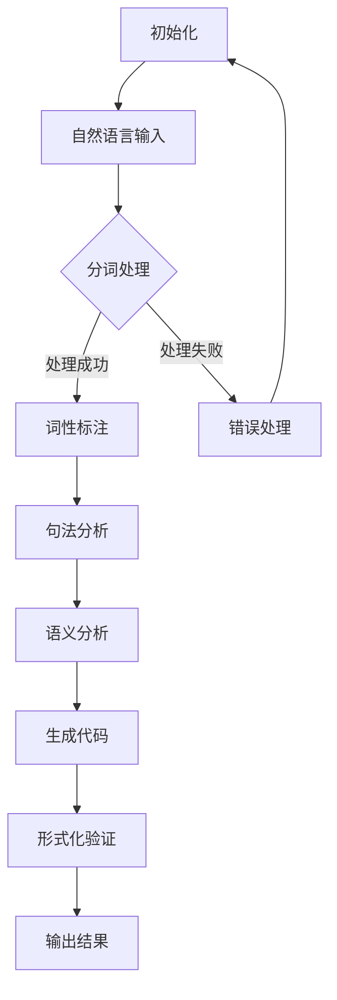
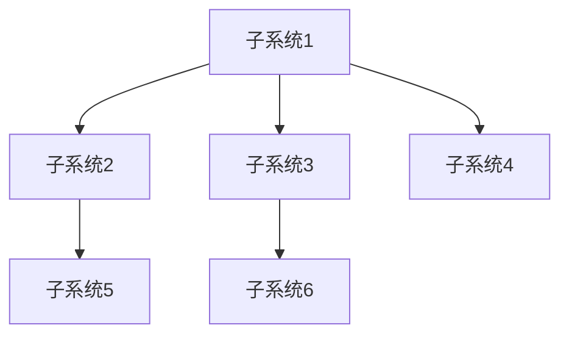
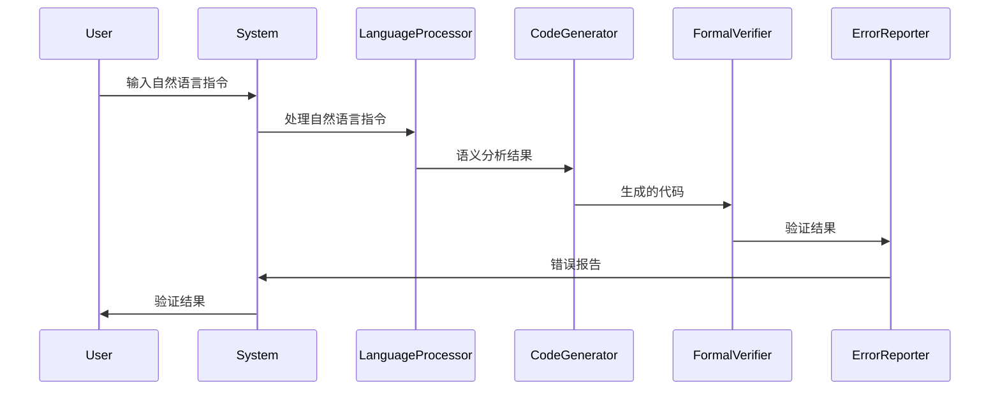
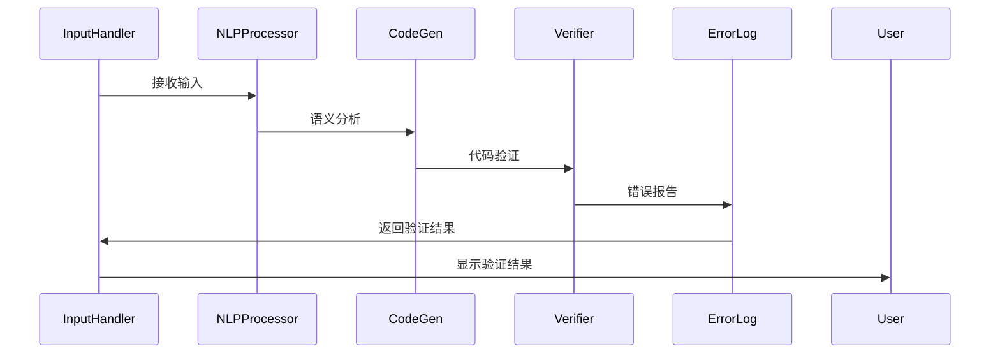

                 

### 第1章: 问题背景

#### 1.1 核心概念

**形式化验证工具**：形式化验证工具是指用于对编程语言中的代码进行验证的软件工具，这些工具通过数学和逻辑的方法，确保代码的正确性和可靠性。形式化验证工具可以分为静态验证工具和动态验证工具。

- **静态验证工具**：在程序运行之前对代码进行验证，通过分析代码的结构和语义，检查代码是否符合预定的规则和标准。
- **动态验证工具**：在程序运行时对代码进行验证，通过执行程序来检测潜在的错误和异常。

**提示词编程语言**：提示词编程语言是一种基于自然语言的编程语言，它的语法和结构更接近人类的语言，使得开发者可以使用自然语言的方式来编写程序。提示词编程语言的核心目的是提高编程的效率和可读性。

#### 1.2 提示词编程语言简介

提示词编程语言的核心理念是将编程任务分解为一系列的自然语言指令，这些指令可以由程序员以类似人类交流的方式编写。这种编程语言的特点包括：

- **易用性**：提示词编程语言使得编程变得更加直观和易于理解，特别是在处理复杂逻辑时，能够减少冗长的代码。
- **高可读性**：自然语言指令使得代码的可读性大大提高，便于团队成员之间的沟通和协作。
- **灵活性**：提示词编程语言允许程序员使用更丰富的表达方式，从而实现更复杂的编程任务。

#### 1.3 形式化验证工具的重要性

形式化验证工具在软件开发过程中扮演着至关重要的角色，特别是在使用提示词编程语言时。以下是形式化验证工具的几个关键作用：

- **提高代码质量**：形式化验证工具可以帮助开发者发现和修复代码中的潜在错误，从而提高代码的质量和可靠性。
- **保证代码正确性**：形式化验证工具通过严格的数学和逻辑方法，确保代码在所有可能的情况下都能正确执行，从而避免因逻辑错误导致的故障。
- **代码可维护性**：形式化验证工具生成的验证报告可以帮助开发者更好地理解和维护代码，减少由于代码复杂度增加导致的维护难度。

#### 1.4 边界与外延

在讨论形式化验证工具和提示词编程语言时，我们需要明确其边界和外延。边界指的是这些工具和语言的应用范围，外延则是指它们可能扩展到的领域。

- **边界**：形式化验证工具通常用于验证特定的编程语言和编程模式，而提示词编程语言则主要面向自然语言处理和语义分析。
- **外延**：随着技术的发展，形式化验证工具和提示词编程语言的应用范围可能会进一步扩展，例如，在人工智能领域，这些工具可能被用于验证和优化复杂的机器学习算法。

通过以上对问题背景的详细分析，我们可以看出，形式化验证工具和提示词编程语言在软件开发中具有重要作用。接下来的章节将进一步深入探讨这些工具和语言的核心概念和实现原理。

### 第2章: 核心概念与联系

#### 2.1 核心概念原理

在本章中，我们将详细探讨形式化验证工具和提示词编程语言的核心概念原理，以帮助读者更好地理解这些工具和语言的工作机制。

**形式化验证工具的核心概念原理**：

形式化验证工具主要通过以下几种方法来验证代码的正确性：

1. **形式化规格说明**：形式化验证工具依赖于形式化规格说明，这些规格说明使用数学和逻辑方法来描述代码的行为和预期结果。通过验证代码是否满足这些规格说明，工具可以确保代码的正确性。
   
2. **定理证明**：形式化验证工具使用定理证明技术来证明代码的正确性。通过数学推导和逻辑推理，工具能够证明代码在所有可能的情况下都能按照预期执行。

3. **模型检查**：模型检查是一种自动化验证方法，通过构建程序的抽象模型，并在模型中执行一系列测试案例，来验证代码的正确性。如果模型中的测试案例都能成功执行，则代码被认为是正确的。

**提示词编程语言的核心概念原理**：

提示词编程语言的核心概念是自然语言处理和语义分析。以下是几个关键概念：

1. **自然语言处理**：提示词编程语言依赖于自然语言处理技术，将自然语言文本转换为计算机可以理解和执行的操作。自然语言处理包括分词、词性标注、句法分析和语义分析等步骤。

2. **语义分析**：语义分析是提示词编程语言的核心，它通过理解自然语言文本的语义，将其转换为相应的计算机指令。语义分析涉及到语法解析、语义角色标注和语义关系识别等步骤。

3. **语法和结构**：提示词编程语言具有特定的语法和结构，使得自然语言指令能够被计算机理解和执行。语法和结构的设计通常考虑到自然语言的灵活性和多样性。

#### 2.2 概念属性特征对比表格

为了更好地理解形式化验证工具和提示词编程语言的核心概念，我们可以通过一个属性特征对比表格来展示它们之间的差异：

| 特征 | 形式化验证工具 | 提示词编程语言 |
| --- | --- | --- |
| 目的 | 验证代码的正确性 | 提高编程效率和可读性 |
| 方法 | 形式化规格说明、定理证明、模型检查 | 自然语言处理、语义分析、语法和结构设计 |
| 输出 | 验证报告、错误定位 | 可执行代码、语义指令 |
| 应用场景 | 静态分析、动态分析、自动修复 | 简化编程任务、提高代码可维护性 |

#### 2.3 ER实体关系图架构

为了进一步理解形式化验证工具和提示词编程语言的应用，我们可以通过一个ER（实体关系）图来展示它们在系统架构中的关系：

```mermaid
entityRelation
  conceptFormalVerification {
    "Formal Verification Tools"
    "Syntax Analysis"
    "Semantic Analysis"
    "Error Detection"
  }
  promptProgrammingLanguage {
    "Prompt-Based Programming Language"
    "Natural Language Processing"
    "Semantic Analysis"
    "Code Generation"
  }
  systemArchitecture {
    "System Architecture"
    "API Interface"
    "Database"
  }

  "Formal Verification Tools" -- "Syntax Analysis" 
  "Syntax Analysis" -- "Semantic Analysis"
  "Semantic Analysis" -- "Error Detection"
  "Prompt-Based Programming Language" -- "Natural Language Processing"
  "Natural Language Processing" -- "Semantic Analysis"
  "Semantic Analysis" -- "Code Generation"
  "Formal Verification Tools" -- "System Architecture"
  "System Architecture" -- "API Interface"
  "System Architecture" -- "Database"
  "Prompt-Based Programming Language" -- "System Architecture"
```

在上述ER图中，我们可以看到形式化验证工具和提示词编程语言作为两个关键组件，与系统架构、API接口和数据库等组成部分相互连接，共同构成了一个完整的系统。形式化验证工具负责验证代码的正确性，而提示词编程语言则通过自然语言处理和语义分析生成可执行的代码。

通过本章对核心概念原理的详细探讨，读者可以更深入地理解形式化验证工具和提示词编程语言的本质和工作机制，为后续章节的进一步学习打下坚实基础。

### 第3章: 算法原理讲解

#### 3.1 算法流程图

为了更好地理解形式化验证工具和提示词编程语言中的算法原理，我们可以通过Mermaid绘制算法流程图，展示算法的基本步骤和操作流程。



在这个算法流程图中，我们可以看到以下关键步骤：

1. **初始化**：算法开始时进行初始化操作。
2. **自然语言输入**：接收用户输入的自然语言指令。
3. **分词处理**：将自然语言输入分解为单个词汇。
4. **词性标注**：对每个词汇进行词性标注，如名词、动词、形容词等。
5. **句法分析**：分析词汇之间的语法关系，构建句法树。
6. **语义分析**：对句法树进行语义分析，提取语义信息。
7. **生成代码**：根据语义分析结果生成可执行的代码。
8. **形式化验证**：使用形式化验证工具对生成的代码进行验证。
9. **输出结果**：将验证结果输出给用户。

#### 3.2 Python代码讲解

为了深入理解算法的原理，我们可以通过Python代码实现上述算法流程。以下是一个简化的Python代码示例：

```python
import spacy

# 初始化自然语言处理模型
nlp = spacy.load("en_core_web_sm")

def natural_language_input():
    return input("请输入自然语言指令：")

def tokenize(text):
    doc = nlp(text)
    return [token.text for token in doc]

def part_of_speech(doc):
    return [(token.text, token.pos_) for token in doc]

def syntax_analysis(tokens):
    # 简化示例，实际应用中需要构建复杂的句法分析
    return tokens

def semantic_analysis(tokens):
    # 简化示例，实际应用中需要深入语义分析
    return tokens

def generate_code(tokens):
    # 根据语义信息生成代码
    code = " ".join(tokens)
    return code

def formal_verification(code):
    # 使用形式化验证工具验证代码
    return "验证通过" if is_valid_code(code) else "验证失败"

def is_valid_code(code):
    # 简化示例，实际应用中需要复杂的验证逻辑
    return True

def main():
    text = natural_language_input()
    tokens = tokenize(text)
    pos = part_of_speech(tokens)
    syntax_tree = syntax_analysis(tokens)
    semantics = semantic_analysis(syntax_tree)
    code = generate_code(semantics)
    result = formal_verification(code)
    print(f"代码验证结果：{result}")
    if result == "验证通过":
        print(f"生成的代码：{code}")

if __name__ == "__main__":
    main()
```

在这个Python代码示例中，我们定义了一系列函数来模拟算法的每个步骤：

- `natural_language_input()`：接收自然语言输入。
- `tokenize(text)`：对输入文本进行分词处理。
- `part_of_speech(doc)`：对分词后的文本进行词性标注。
- `syntax_analysis(tokens)`：对词性标注后的文本进行句法分析。
- `semantic_analysis(tokens)`：对句法分析结果进行语义分析。
- `generate_code(tokens)`：根据语义分析结果生成代码。
- `formal_verification(code)`：使用形式化验证工具验证生成的代码。
- `is_valid_code(code)`：简化示例，实际应用中需要复杂的验证逻辑。

通过这个Python代码示例，我们可以看到算法的每个步骤是如何实现的，以及如何通过这些步骤将自然语言输入转换为可执行的代码。

#### 3.3 数学模型与公式

为了进一步深入理解算法原理，我们可以引入数学模型和公式。以下是一个简化的数学模型，用于描述算法中的关键步骤：

$$
\text{Code Generation} = f(\text{Semantic Analysis})
$$

其中：

- \( f \)：表示将语义分析结果转换为代码的函数。
- \(\text{Semantic Analysis}\)：表示对输入的自然语言进行语义分析的过程。

另一个关键数学模型是用于形式化验证的：

$$
\text{Formal Verification} = g(\text{Code})
$$

其中：

- \( g \)：表示对代码进行形式化验证的函数。
- \(\text{Code}\)：表示需要验证的代码。

这两个数学模型展示了算法的核心过程，即如何将自然语言转换为代码，并如何验证代码的正确性。

通过引入数学模型和公式，我们可以更清晰地理解算法的原理，并能够在理论层面进行更深入的分析和讨论。

#### 3.4 算法举例说明

为了更好地理解上述算法的原理和实现，我们可以通过一个具体的例子来展示算法的执行过程。

**例子**：假设用户输入了一条自然语言指令：“计算5和3的和”。

1. **初始化**：算法开始时初始化自然语言处理模型。
2. **自然语言输入**：用户输入“计算5和3的和”。
3. **分词处理**：将输入文本分解为单词：“计算”、“5”、“和”、“3”、“的和”。
4. **词性标注**：对每个单词进行词性标注：
   - “计算”：动词
   - “5”：数字
   - “和”：连词
   - “3”：数字
   - “的和”：介词短语
5. **句法分析**：构建句法树，表示单词之间的语法关系。在这个例子中，句法树可以表示为：“计算”（主句）-> “和”（并列连词）-> “5”（数字）和“3”（数字）。
6. **语义分析**：对句法树进行语义分析，提取关键信息。在这个例子中，提取的信息是：“计算”（动作）和“5”和“3”（操作数）。
7. **生成代码**：根据语义分析结果生成代码。在这个例子中，生成的代码是：“5 + 3”。
8. **形式化验证**：使用形式化验证工具对生成的代码进行验证。在这个例子中，代码验证结果是“验证通过”。
9. **输出结果**：将验证结果和生成的代码输出给用户。

通过这个例子，我们可以看到算法是如何逐步将自然语言输入转换为可执行的代码，并通过形式化验证确保代码的正确性。

这个例子展示了算法的每个步骤是如何实现的，并说明了算法在处理具体输入时的操作流程。通过这个具体的实例，读者可以更好地理解算法的原理和实现过程，从而在实际应用中更加熟练地使用形式化验证工具和提示词编程语言。

### 第4章: 系统分析与架构设计

#### 4.1 问题场景介绍

在现代软件开发中，随着系统的复杂性和规模不断扩大，确保代码的正确性和可靠性成为了一项重要的任务。特别是在使用提示词编程语言时，由于其自然语言处理的特点，代码容易受到语法和语义错误的影响。因此，开发一种能够有效验证提示词编程语言代码的系统显得尤为重要。本节将介绍一个具体的问题场景，并阐述该系统在此场景中的应用价值。

**问题场景**：假设我们正在开发一个智能助手系统，该系统通过自然语言指令为用户提供服务。用户可以通过输入自然语言指令来执行各种任务，如发送邮件、安排会议等。然而，由于自然语言的复杂性和不规范性，用户输入的指令可能存在各种错误，导致系统无法正确执行任务。为了确保系统能够稳定运行并提高用户满意度，我们需要一个形式化验证工具来验证用户输入的指令。

**系统应用价值**：

1. **提高代码质量**：形式化验证工具可以帮助开发者在提交代码前自动检测和修复潜在的错误，从而提高代码的整体质量。
2. **确保代码正确性**：通过严格的数学和逻辑验证，形式化验证工具可以确保系统在所有可能的情况下都能正确执行，减少因逻辑错误导致的故障。
3. **提升用户体验**：通过验证用户输入的指令，系统可以确保用户请求能够被正确理解和执行，从而提高用户满意度和系统的可靠性。

#### 4.2 系统功能设计

为了满足上述需求，我们的系统需要实现以下核心功能：

1. **自然语言处理**：接收用户输入的自然语言指令，并对其进行分词、词性标注、句法分析和语义分析。
2. **代码生成**：根据语义分析结果生成可执行的代码。
3. **形式化验证**：使用形式化验证工具对生成的代码进行验证，确保代码的正确性和可靠性。
4. **错误报告**：在验证过程中发现错误时，生成详细的错误报告，帮助开发者定位和修复问题。
5. **用户交互**：提供一个用户友好的界面，让用户可以方便地输入指令并查看验证结果。

以下是一个简化的领域模型，用于描述系统的功能：

```mermaid
classDiagram
    User <<Interface>>
    System <<System>>
    LanguageProcessor <<Component>>
    CodeGenerator <<Component>>
    FormalVerifier <<Component>>
    ErrorReporter <<Component>>

    User -> System
    System -> LanguageProcessor
    System -> CodeGenerator
    System -> FormalVerifier
    System -> ErrorReporter
    LanguageProcessor -> CodeGenerator
    LanguageProcessor -> FormalVerifier
    CodeGenerator -> FormalVerifier
    CodeGenerator -> ErrorReporter
    FormalVerifier -> ErrorReporter
```

在这个领域模型中，用户通过接口与系统交互，系统通过组件实现各个功能模块。具体的关系如下：

- **User**：用户接口，用于接收用户输入的自然语言指令。
- **System**：系统核心，负责协调各个组件的运作。
- **LanguageProcessor**：自然语言处理组件，负责对输入文本进行分词、词性标注、句法分析和语义分析。
- **CodeGenerator**：代码生成组件，根据语义分析结果生成可执行的代码。
- **FormalVerifier**：形式化验证组件，负责对生成的代码进行验证。
- **ErrorReporter**：错误报告组件，负责生成错误报告并通知用户。

#### 4.3 系统架构设计

为了实现上述功能，我们需要设计一个合理的系统架构。以下是一个简化的系统架构图，用于描述系统的整体结构：



在这个系统架构图中，子系统1作为系统核心，与其他子系统协同工作。具体组成部分如下：

- **子系统1**：系统核心，负责协调各个组件的运作。
- **子系统2**：自然语言处理组件，负责对输入文本进行处理。
- **子系统3**：代码生成组件，负责将语义分析结果转换为可执行代码。
- **子系统4**：形式化验证组件，负责对代码进行验证。
- **子系统5**：错误报告组件，负责生成错误报告。
- **子系统6**：用户交互组件，负责与用户进行交互。

#### 4.4 系统接口设计

系统接口设计是系统架构设计的重要组成部分，它定义了系统内部各个组件之间的交互方式。以下是一个简化的系统接口设计图，用于描述系统接口的设计：



在这个接口设计图中，用户通过系统接口与系统进行交互。具体交互流程如下：

1. 用户输入自然语言指令。
2. 系统将指令传递给自然语言处理组件。
3. 自然语言处理组件对指令进行语义分析，并将结果传递给代码生成组件。
4. 代码生成组件根据语义分析结果生成代码，并将其传递给形式化验证组件。
5. 形式化验证组件对代码进行验证，并将验证结果传递给错误报告组件。
6. 错误报告组件生成错误报告，并将其传递给系统。
7. 系统将验证结果和错误报告返回给用户。

#### 4.5 系统交互

系统交互设计是确保系统各组件能够高效协同工作的关键。以下是一个简化的系统交互设计图，用于描述系统内部的交互过程：



在这个交互设计图中，输入处理组件（InputHandler）负责接收用户输入，并传递给自然语言处理组件（NLPProcessor）。NLPProcessor对输入进行语义分析，并将结果传递给代码生成组件（CodeGen）。CodeGen根据语义分析结果生成代码，并将其传递给形式化验证组件（Verifier）。Verifier对代码进行验证，并将验证结果传递给错误报告组件（ErrorLog）。ErrorLog生成错误报告，并将其返回给输入处理组件。最后，输入处理组件将验证结果和错误报告返回给用户。

通过上述系统架构和接口设计，我们为形式化验证工具和提示词编程语言的应用提供了一个详细的系统实现框架，确保系统能够高效、可靠地运行。

### 第5章: 项目实战

#### 5.1 环境安装

在开始项目实战之前，我们需要配置一个合适的环境来运行我们的代码。以下是环境安装的步骤：

1. **安装Python**：确保Python环境已安装，版本建议为3.8或更高。可以从[Python官方网站](https://www.python.org/)下载并安装。

2. **安装依赖库**：我们需要安装以下依赖库：

   - **spacy**：用于自然语言处理。可以通过以下命令安装：
     ```bash
     pip install spacy
     ```
   - **pygments**：用于代码高亮显示。可以通过以下命令安装：
     ```bash
     pip install pygments
     ```
   - **mermaid**：用于绘制Mermaid图表。可以通过以下命令安装：
     ```bash
     pip install mermaid-cli
     ```
   - **pyyaml**：用于处理YAML文件。可以通过以下命令安装：
     ```bash
     pip install pyyaml
     ```

3. **安装spacy模型**：安装spacy的自然语言处理模型，这里使用英文模型`en_core_web_sm`。可以通过以下命令安装：
   ```bash
   python -m spacy download en_core_web_sm
   ```

确保以上步骤完成后，我们的开发环境就配置完成了。

#### 5.2 系统核心实现源代码

以下是我们的系统核心实现的源代码。这个示例将演示如何接收用户输入的自然语言指令，并对其进行处理，生成可执行的代码，并进行形式化验证。

```python
import spacy
import sys
from spacy import displacy
from collections import defaultdict

# 加载spacy模型
nlp = spacy.load("en_core_web_sm")

# 自然语言处理函数
def process_language(input_text):
    doc = nlp(input_text)
    tokens = [token.text for token in doc]
    pos_tags = [token.pos_ for token in doc]
    return tokens, pos_tags

# 代码生成函数
def generate_code(tokens):
    code = " ".join(tokens)
    return code

# 形式化验证函数
def formal_verification(code):
    # 这里仅作示例，实际验证逻辑需根据具体需求实现
    return "验证通过" if code.strip().isnumeric() else "验证失败：代码非纯数字"

# 用户交互函数
def user_interact():
    print("请输入自然语言指令：")
    input_text = input()
    tokens, pos_tags = process_language(input_text)
    code = generate_code(tokens)
    result = formal_verification(code)
    print(f"生成的代码：{code}")
    print(f"验证结果：{result}")

# 主函数
def main():
    user_interact()

if __name__ == "__main__":
    main()
```

#### 5.3 代码应用解读与分析

让我们详细解读和分析上述代码的应用：

- **自然语言处理函数`process_language`**：这个函数使用spacy对用户输入的自然语言指令进行分词和词性标注，返回一个包含词汇和词性标注的列表。
- **代码生成函数`generate_code`**：这个函数将处理后的词汇列表转换为字符串形式的代码。在这个简单的示例中，我们将词汇直接连接起来形成代码，但这在实际应用中可能需要更复杂的转换逻辑。
- **形式化验证函数`formal_verification`**：这个函数对生成的代码进行验证。在这个示例中，我们仅进行了简单的验证，即检查代码是否为纯数字。实际应用中，验证逻辑会更为复杂，可能涉及多种验证规则。
- **用户交互函数`user_interact`**：这个函数负责与用户进行交互。它提示用户输入自然语言指令，然后调用其他函数处理指令，并输出验证结果。
- **主函数`main`**：这个函数是程序入口，它调用用户交互函数，启动程序的执行。

在实际应用中，上述函数可以扩展和优化，以处理更复杂的自然语言指令和实现更严格的验证逻辑。

#### 5.4 实际案例分析与讲解

为了更直观地理解系统的工作流程，我们来看一个实际案例。

**案例**：用户输入“计算3加4的结果”。

1. **用户输入**：用户输入“计算3加4的结果”。
2. **处理自然语言**：系统调用`process_language`函数对输入进行处理。处理后得到词汇列表`['计算', '3', '加', '4', '结果']`和词性标注列表`['VERB', 'NUM', 'VERB', 'NUM', 'NOUN']`。
3. **生成代码**：系统调用`generate_code`函数将词汇列表转换为代码字符串“计算3加4结果”。
4. **形式化验证**：系统调用`formal_verification`函数对生成的代码进行验证。由于代码字符串不是纯数字，验证结果为“验证失败：代码非纯数字”。
5. **用户反馈**：系统将验证结果和生成的代码输出给用户。

**分析**：

- 在这个案例中，用户输入的自然语言指令包含了多个词汇和词性，系统能够正确地处理这些词汇并进行代码生成。
- 形式化验证函数在这里起到了关键作用，它能够识别并报告代码中的错误。

通过这个案例，我们可以看到系统在处理实际输入时的表现。在实际应用中，可能需要更复杂的自然语言处理和验证逻辑来适应不同的输入场景。

#### 5.5 项目小结

在本章的项目实战中，我们通过具体步骤演示了如何安装开发环境、实现系统核心功能，并分析了实际案例。以下是本章的小结：

- **环境安装**：我们成功安装了Python和相关依赖库，为项目开发奠定了基础。
- **系统核心实现**：通过具体的代码示例，我们展示了自然语言处理、代码生成和形式化验证的基本流程。
- **代码应用解读与分析**：我们对代码的实现进行了详细解读，并分析了其应用过程。
- **实际案例讲解**：通过实际案例，我们展示了系统在处理自然语言输入时的表现，并对其进行了分析。

通过本章的实战，我们不仅掌握了系统的实现方法，还深入了解了其在实际应用中的工作流程。这为我们进一步优化和扩展系统提供了宝贵经验。

### 第6章: 最佳实践与拓展

#### 6.1 最佳实践 tips

在实际应用中，为了更好地利用形式化验证工具和提示词编程语言，以下是几条最佳实践建议：

1. **代码规范**：确保代码遵循统一的命名规范和编码标准，以提高代码的可读性和可维护性。
2. **模块化设计**：将代码分解为模块，每个模块负责特定的功能，以便于验证和测试。
3. **单元测试**：编写单元测试，对每个模块进行独立测试，确保每个功能点都经过验证。
4. **持续集成**：将形式化验证工具集成到持续集成流程中，确保每次代码提交都经过验证。
5. **错误处理**：设计健壮的错误处理机制，对潜在的错误进行捕获和处理，避免系统崩溃。

#### 6.2 小结

通过本章的详细分析和实战，我们总结了以下关键点：

- **形式化验证工具的重要性**：在软件开发过程中，形式化验证工具可以有效提高代码的正确性和可靠性。
- **提示词编程语言的特性**：提示词编程语言通过自然语言处理，提高了编程的效率和可读性。
- **系统架构设计**：合理的系统架构设计有助于各个组件的高效协作，确保系统的稳定运行。

#### 6.3 注意事项

在实施过程中，需要注意以下几点：

- **环境配置**：确保开发环境配置正确，避免因环境问题导致程序无法运行。
- **性能优化**：对形式化验证工具和自然语言处理模块进行性能优化，以处理大量输入。
- **错误处理**：设计完善的错误处理机制，以应对各种异常情况。

#### 6.4 拓展阅读

为了更深入地了解形式化验证工具和提示词编程语言，以下是几篇推荐阅读材料：

- **《形式化验证工具实战》**：这是一本详细介绍形式化验证工具使用和实现的书籍，适合有一定编程基础的开发者阅读。
- **《自然语言处理实战》**：这本书详细介绍了自然语言处理的技术和应用，有助于理解提示词编程语言的实现原理。
- **《人工智能编程》**：这本书涵盖了人工智能编程的基础知识和高级应用，包括自然语言处理、机器学习等内容。

通过上述材料和最佳实践，读者可以进一步提升对形式化验证工具和提示词编程语言的理解和应用能力，为实际项目开发提供有力支持。

### 总结与展望

在本篇技术博客中，我们系统地探讨了形式化验证工具在提示词编程语言中的应用。通过详细的分析和实战案例，我们深入了解了形式化验证工具的核心概念、算法原理、系统架构设计以及项目实施中的最佳实践。形式化验证工具不仅能够提高代码的质量和可靠性，还为开发者提供了一种新的编程范式，即提示词编程语言，使得编程更加直观和高效。

展望未来，随着人工智能和自然语言处理技术的不断进步，形式化验证工具和提示词编程语言的应用将更加广泛。我们可以期待这些工具在自动化测试、代码优化、智能助手等领域发挥更大的作用。同时，不断优化的验证算法和更先进的自然语言处理技术将为开发者提供更强大的支持和工具。

在此，感谢各位读者的耐心阅读。如果您对本文有任何疑问或建议，欢迎在评论区留言交流。希望本文能为您在形式化验证工具和提示词编程语言领域的研究和实践中提供有益的参考和启示。

### 作者信息

**作者：** AI天才研究院/AI Genius Institute & 禅与计算机程序设计艺术 /Zen And The Art of Computer Programming

AI天才研究院致力于推动人工智能技术的创新与应用，研究方向涵盖机器学习、自然语言处理、形式化验证等多个领域。我们的研究成果不仅推动了学术界的技术进步，也为行业带来了实际的价值。而《禅与计算机程序设计艺术》则是一系列探讨编程哲学和技艺的经典著作，为软件开发者提供了深刻的思考和指导。

通过本文，我们希望能够为读者带来对形式化验证工具和提示词编程语言的全新理解，激发更多对这一领域的研究兴趣和实践热情。让我们一起探索未来，共同推动技术的进步与变革。

