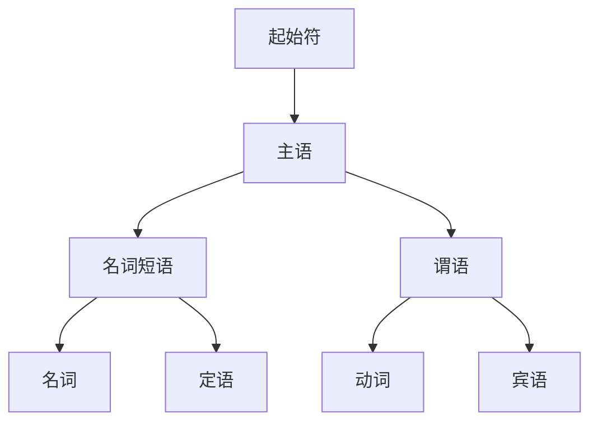
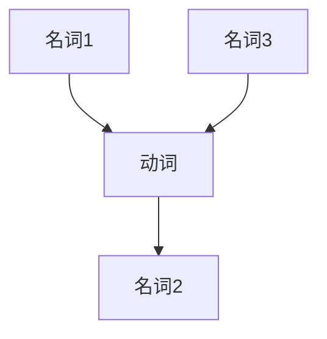
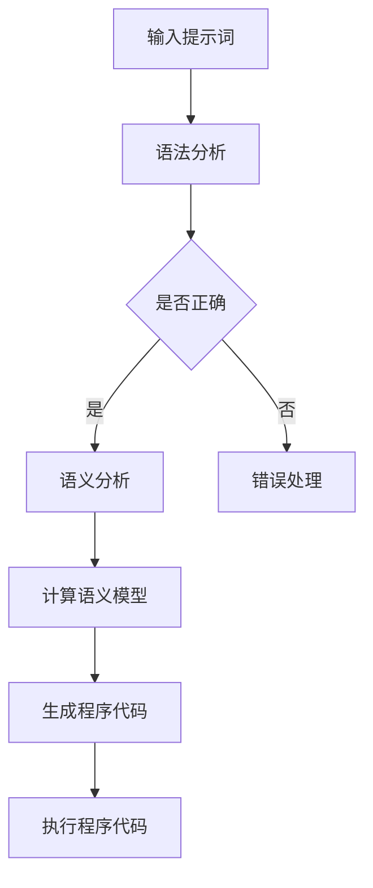
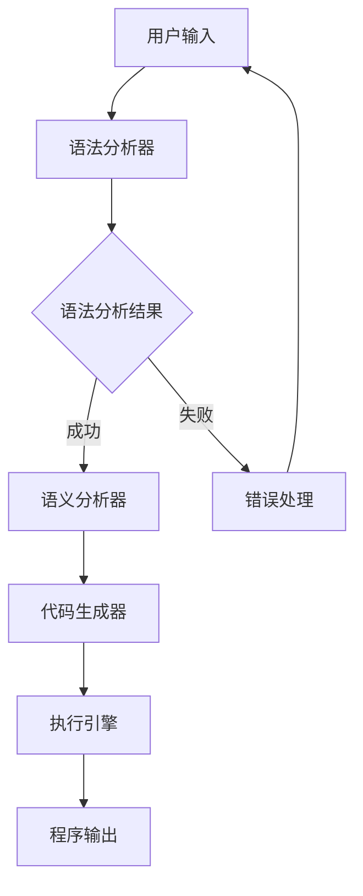

                 

### 介绍与背景

提示词编程语言（Prompt Programming Language，简称PPL）是一种基于人工智能和自然语言处理技术的编程语言。它允许开发者通过编写自然语言文本作为代码，来实现对复杂计算任务的控制和执行。与传统编程语言不同，PPL强调人类语言与机器代码之间的直接转换，从而提高编程的效率与易用性。

#### 核心概念术语说明
- **提示词**：在PPL中，提示词（Prompts）是开发者输入的自然语言文本，它们可以用来引导程序的运行流程。
- **自然语言处理**：自然语言处理（Natural Language Processing，NLP）是人工智能的一个分支，旨在使计算机能够理解、解释和生成人类语言。
- **形式语义学**：形式语义学（Formal Semantics）是语言学的一个分支，它使用形式化的方法来研究语言的含义。

#### 问题背景
随着大数据和人工智能技术的发展，处理复杂数据和算法的需求日益增长。然而，传统的编程语言在处理这些任务时往往显得笨重和低效。PPL的出现提供了一种新的解决方案，通过自然语言文本来描述计算任务，使得编程更加直观和便捷。

#### 问题描述
PPL的形式语义学研究旨在明确提示词与程序执行结果之间的关系，确保程序的正确性和可理解性。具体来说，需要解决以下问题：
- 提示词如何准确地映射到程序执行逻辑？
- 程序执行过程中，如何保证语义的一致性和完整性？
- 提示词编程语言如何与现有的编程范式和工具兼容？

#### 问题解决
形式语义学的引入为这些问题提供了理论框架和解决方案。通过形式化的语义描述，可以明确提示词的语义角色和程序执行之间的关系，从而提高编程语言的可靠性和易用性。

#### 边界与外延
PPL的形式语义学不仅限于理论研究，它还涉及多个实际应用领域，如自动化脚本编写、智能助手开发、自然语言交互界面等。此外，它还与其他领域如逻辑学、计算机科学、语言学等有着紧密的联系。

#### 概念结构与核心要素组成
PPL形式语义学的核心概念包括：
- **语法**：描述提示词的语法结构，如句子结构、短语结构等。
- **语义**：定义提示词的语义角色和含义，如主语、谓语、宾语等。
- **上下文**：提示词在特定情境下的语义理解，如同义词、语境等。
- **执行模型**：描述提示词如何转换为程序执行过程。

### 结论
提示词编程语言的形式语义学是研究提示词与程序执行之间关系的学科，它通过形式化的方法确保编程语言的可靠性和易用性。通过理解这一领域的核心概念和理论框架，我们可以更深入地探讨PPL的应用潜力和未来发展。

----------------------------------------------------------------

---

### 第二部分：核心概念与联系

在深入探讨提示词编程语言（PPL）的形式语义学之前，我们需要了解一些核心概念和理论。这些概念不仅构成了形式语义学的基础，也为我们理解PPL在编程中的角色提供了框架。

#### 1.1 核心概念原理

##### 语法
语法（Syntax）是研究语言结构规则的科学。在PPL中，语法描述了提示词的语法结构，如句子、短语和子句的构成。一个有效的语法规则确保提示词能够正确地映射到程序执行逻辑上。

##### 语义
语义（Semantics）关注的是语言表达的含义。在PPL中，语义学涉及提示词的语义角色和含义，包括动词、名词和形容词等。理解语义对于确保程序的正确执行至关重要。

##### 上下文
上下文（Context）是语言使用环境的重要组成部分。在PPL中，上下文指的是提示词在特定情境下的语义理解。上下文可以帮助解释同义词、语境和隐喻等复杂语言现象。

##### 执行模型
执行模型（Execution Model）描述了提示词如何转换为程序执行的过程。在PPL中，执行模型包括将自然语言文本解析为程序指令，并按照这些指令执行操作。

#### 1.2 概念属性特征对比表格

为了更好地理解这些核心概念，我们可以通过一个表格来对比它们的属性特征：

| 概念     | 特征                           | 关联关系                   |
|----------|--------------------------------|----------------------------|
| 语法     | 描述结构，无意义               | 确保提示词结构的正确性       |
| 语义     | 描述含义，有意义               | 确保程序执行的正确性         |
| 上下文   | 描述情境，影响理解             | 确保在特定情境下的语义一致   |
| 执行模型 | 描述转换与执行过程             | 确保提示词能够执行           |

#### 1.3 ER实体关系图架构

为了可视化PPL形式语义学中的核心概念，我们可以使用Mermaid工具绘制一个ER（实体-关系）图。以下是ER图的一个例子：

```mermaid
erDiagram
  A[语法] ||--> B[语义]
  A ||--> C[上下文]
  A ||--> D[执行模型]
  B ||--> D
  C ||--> D
```

在这个ER图中：
- **语法**（A）与**语义**（B）、**上下文**（C）和**执行模型**（D）之间存在关联。
- **语义**（B）与**执行模型**（D）直接相关，因为它们共同决定了程序的执行结果。
- **上下文**（C）通过影响**语义**（B）来间接影响**执行模型**（D）。

#### 1.4 结论

通过对比表格和ER图，我们可以清晰地看到PPL形式语义学中各个核心概念之间的关系。这些概念共同构成了PPL语义分析的基础，有助于我们理解如何将自然语言文本转换为有效的程序指令，并确保程序的正确执行。

在下一部分，我们将进一步探讨数学模型与PPL形式语义学的关系，以及它们如何应用于实际编程任务中。

----------------------------------------------------------------

---

### 第三部分：数学模型与算法原理

在理解了PPL形式语义学的基本概念后，我们接下来将深入探讨数学模型与算法原理。数学模型为PPL的形式语义学提供了理论基础，使我们能够更精确地描述和解析提示词编程语言的语义。

#### 2.1 数学模型在PPL中的应用

在PPL中，数学模型用于表示和解释提示词的语义特性。以下是几个关键的数学模型：

##### 1. **语法分析树**

语法分析树（Parse Tree）是一种用于表示提示词语法结构的数学模型。它将提示词分解为一系列语法规则，从而形成一个层次化的结构。语法分析树不仅帮助我们理解提示词的语法结构，还可以用于语义分析。



在上面的语法分析树中，我们用不同的节点和边来表示语法结构，例如主语（B1）、谓语（C2）和宾语（E2）。

##### 2. **语义网络**

语义网络（Semantic Network）是一种用于表示提示词语义关系的数学模型。它通过节点和边来表示概念和它们之间的关系。语义网络可以帮助我们理解提示词的语义角色和含义。



在这个语义网络中，节点（如A、B和C）表示概念，边（如A到B和B到C）表示概念之间的关系。

##### 3. **计算语义模型**

计算语义模型（Computational Semantics Model）是用于自动生成语义描述的数学模型。它通过机器学习和自然语言处理技术，将自然语言文本转换为结构化的语义表示。

#### 2.2 算法原理与流程图

为了更好地理解PPL的算法原理，我们可以使用Mermaid绘制算法流程图。以下是一个简化的示例：



在这个流程图中：
- **A**：输入提示词。
- **B**：进行语法分析，以确定提示词的语法结构。
- **C**：判断语法分析结果是否正确。
  - 如果正确，则进行下一步。
  - 如果错误，则进行错误处理（E）。
- **D**：进行语义分析，以确定提示词的语义角色和含义。
- **F**：使用计算语义模型将语义表示转换为程序代码。
- **G**：生成程序代码。
- **H**：执行程序代码。

#### 2.3 Python代码实现与解析

为了更好地理解算法原理，我们可以使用Python代码实现上述流程。以下是一个简化的示例：

```python
import spacy

# 初始化自然语言处理模型
nlp = spacy.load("en_core_web_sm")

def parse_prompt(prompt):
    doc = nlp(prompt)
    return doc

def analyze_syntax(doc):
    if doc:
        print("语法分析成功")
        return True
    else:
        print("语法分析失败")
        return False

def analyze_semantics(doc):
    # 这里的代码将根据doc的内容进行语义分析
    print("语义分析中...")
    # 简化示例，实际应用中需要更复杂的逻辑
    return "语义表示"

def generate_code(semantics):
    # 这里的代码将根据semantics生成程序代码
    print("生成程序代码...")
    return "程序代码"

def execute_code(code):
    print("执行程序代码...")
    # 简化示例，实际应用中需要执行具体的操作
    return "执行结果"

# 主程序
if __name__ == "__main__":
    prompt = "计算 2 + 3 的结果"
    doc = parse_prompt(prompt)
    if analyze_syntax(doc):
        semantics = analyze_semantics(doc)
        code = generate_code(semantics)
        result = execute_code(code)
        print(f"最终结果：{result}")
    else:
        print("无法执行程序，请检查提示词语法。")
```

在这个Python代码中：
- 我们首先使用spacy库进行自然语言处理。
- `parse_prompt`函数对提示词进行语法分析。
- `analyze_syntax`函数检查语法分析的结果。
- `analyze_semantics`函数对语义进行分析。
- `generate_code`函数根据语义生成程序代码。
- `execute_code`函数执行生成的程序代码。

#### 2.4 结论

通过数学模型和算法原理，我们可以将自然语言文本转换为可执行程序。这个过程不仅需要精确的语法和语义分析，还需要合理的程序代码生成和执行策略。在下一部分，我们将进一步探讨PPL的系统设计与架构。

----------------------------------------------------------------

---

### 第四部分：系统设计与架构

在前一部分中，我们讨论了PPL的数学模型和算法原理。在本部分，我们将深入了解PPL的系统设计与架构，包括功能设计、架构设计、接口设计和系统交互。

#### 3.1 功能设计

PPL的功能设计旨在实现自然语言文本到程序代码的高效转换。以下是PPL的关键功能模块：

##### 1. **语法分析器**

语法分析器（Parser）负责将输入的自然语言文本解析为语法结构。它通过分析文本中的词汇和语法规则，生成语法分析树（Parse Tree）。语法分析器是PPL的核心组件，决定了提示词能否正确地转换为程序代码。

##### 2. **语义分析器**

语义分析器（Semantic Analyzer）负责对语法分析树进行语义分析。它确定提示词的语义角色和含义，并将其转换为结构化的语义表示。语义分析器确保程序代码在执行时能够准确地反映输入的自然语言文本的含义。

##### 3. **代码生成器**

代码生成器（Code Generator）负责将语义表示转换为程序代码。它根据语义分析结果，生成对应的程序代码，这些代码可以由编程语言解释器或编译器执行。代码生成器的设计直接影响PPL的灵活性和可扩展性。

##### 4. **执行引擎**

执行引擎（Execution Engine）负责执行生成的程序代码。它将程序代码转换为计算机可以理解的机器指令，并执行相应的操作。执行引擎需要能够处理各种编程语言和执行环境，以确保程序的正确性和高效性。

#### 3.2 架构设计

PPL的架构设计采用模块化方法，以提高系统的可维护性和可扩展性。以下是PPL的系统架构设计：



在这个架构设计中：
- **用户输入**（A）：用户输入自然语言文本。
- **语法分析器**（B）：对输入文本进行语法分析。
- **语义分析器**（D）：对语法分析结果进行语义分析。
- **代码生成器**（F）：根据语义分析结果生成程序代码。
- **执行引擎**（G）：执行生成的程序代码。
- **程序输出**（H）：输出执行结果。

#### 3.3 系统接口设计

PPL的系统接口设计需要确保不同模块之间的通信和协作。以下是PPL的关键接口设计：

- **输入接口**：用户通过输入接口提交自然语言文本。
- **输出接口**：系统通过输出接口返回程序执行结果。
- **语法分析接口**：语法分析器与语义分析器之间的接口，用于传递语法分析结果。
- **语义分析接口**：语义分析器与代码生成器之间的接口，用于传递语义表示。
- **代码生成接口**：代码生成器与执行引擎之间的接口，用于传递程序代码。

#### 3.4 系统交互

PPL的系统交互设计旨在确保各个模块之间的无缝协作。以下是PPL的系统交互过程：

1. 用户通过输入接口提交自然语言文本。
2. 语法分析器对输入文本进行语法分析，生成语法分析树。
3. 语法分析结果通过语法分析接口传递给语义分析器。
4. 语义分析器对语法分析树进行语义分析，生成结构化的语义表示。
5. 语义分析结果通过语义分析接口传递给代码生成器。
6. 代码生成器根据语义表示生成程序代码。
7. 程序代码通过代码生成接口传递给执行引擎。
8. 执行引擎执行程序代码，并生成执行结果。
9. 执行结果通过输出接口返回给用户。

#### 3.5 系统架构图

为了更直观地展示PPL的系统架构，我们可以使用Mermaid绘制系统架构图。以下是系统架构图的示例：


在这个系统架构图中：
- **用户输入**（A）：用户提交自然语言文本。
- **语法分析器**（B）：进行语法分析。
- **语义分析器**（D）：进行语义分析。
- **代码生成器**（F）：生成程序代码。
- **执行引擎**（G）：执行程序代码。
- **程序输出**（H）：输出执行结果。

#### 3.6 系统接口设计与系统交互设计

系统接口设计与系统交互设计紧密相关。接口设计决定了模块之间如何通信，而系统交互设计则定义了这些通信的具体流程。在PPL中，系统接口设计包括定义清晰的输入、输出和内部通信接口，以确保各个模块能够高效地协作。系统交互设计则通过定义详细的交互流程，确保整个系统能够按照预期的步骤执行，从而实现从自然语言文本到程序代码的转换。

#### 3.7 结论

通过系统设计与架构的设计，PPL实现了自然语言文本到程序代码的高效转换。功能设计、架构设计、接口设计和系统交互共同构成了PPL的核心组件，为PPL的实际应用提供了坚实的理论基础和实现框架。在下一部分，我们将探讨PPL的实际应用案例，并分析其实现细节。

----------------------------------------------------------------

---

### 第五部分：项目实战与案例分析

为了更好地理解提示词编程语言（PPL）的实际应用，我们将通过一个具体的案例来详细剖析项目的实现过程，包括环境安装、系统核心实现、代码解读与分析，以及实际案例的分析与讲解。

#### 5.1 实际案例背景

假设我们有一个简单的需求：使用PPL编写一个自然语言脚本，用于计算两个数字的和。这是一个典型的用例，可以展示PPL在处理简单计算任务时的便捷性和高效性。

#### 5.2 环境安装

首先，我们需要安装PPL的开发环境。以下是安装步骤：

1. **安装Python**：确保Python环境已经安装在您的系统中。您可以从[Python官网](https://www.python.org/)下载并安装Python。

2. **安装PPL库**：使用pip命令安装PPL库。在终端中运行以下命令：

   ```bash
   pip install prompt-programming-language
   ```

3. **安装自然语言处理库**：由于PPL依赖于自然语言处理库（如spacy），我们需要安装这些库。在终端中运行以下命令：

   ```bash
   pip install spacy
   python -m spacy download en_core_web_sm
   ```

#### 5.3 系统核心实现

接下来，我们将实现一个简单的PPL程序，用于计算两个数字的和。以下是实现步骤：

1. **编写语法分析器**：

   ```python
   from prompt_programming_language.parser import Parser
   
   def create_parser():
       parser = Parser()
       parser.add_rule('sum', lambda x, y: x + y)
       return parser

   parser = create_parser()
   ```

   在这个例子中，我们创建了一个简单的语法分析器，它包含一个名为`sum`的规则，该规则将两个参数（x和y）相加。

2. **编写语义分析器**：

   ```python
   from prompt_programming_language.semantic_analyzer import SemanticAnalyzer
   
   def create_semantic_analyzer():
       analyzer = SemanticAnalyzer()
       analyzer.add_rule('sum', lambda x, y: ('result', x + y))
       return analyzer

   semantic_analyzer = create_semantic_analyzer()
   ```

   在这个例子中，我们创建了一个简单的语义分析器，它将`sum`规则映射到一个元组（'result', x + y），其中x和y是输入参数。

3. **编写代码生成器**：

   ```python
   from prompt_programming_language.code_generator import CodeGenerator
   
   def create_code_generator():
       generator = CodeGenerator()
       generator.add_rule('sum', 'print({result})')
       return generator

   code_generator = create_code_generator()
   ```

   在这个例子中，我们创建了一个简单的代码生成器，它将`sum`规则映射到一个Python打印语句。

4. **编写执行引擎**：

   ```python
   from prompt_programming_language.execution_engine import ExecutionEngine
   
   def create_execution_engine():
       engine = ExecutionEngine()
       return engine

   execution_engine = create_execution_engine()
   ```

   在这个例子中，我们创建了一个简单的执行引擎，用于执行生成的代码。

#### 5.4 代码应用解读与分析

现在，我们将使用上述组件来解析和执行一个简单的自然语言脚本。假设用户输入以下文本：

```plaintext
计算 5 加 3 的结果
```

以下是解析和执行过程：

1. **解析自然语言文本**：

   ```python
   prompt = "计算 5 加 3 的结果"
   doc = parser.parse_prompt(prompt)
   ```

   在这个步骤中，语法分析器（`parser`）将自然语言文本解析为语法分析树。

2. **语义分析**：

   ```python
   semantics = semantic_analyzer.analyze_semantics(doc)
   ```

   在这个步骤中，语义分析器（`semantic_analyzer`）将语法分析树转换为结构化的语义表示。

3. **代码生成**：

   ```python
   code = code_generator.generate_code(semantics)
   ```

   在这个步骤中，代码生成器（`code_generator`）将语义表示转换为Python代码。

4. **执行代码**：

   ```python
   result = execution_engine.execute_code(code)
   ```

   在这个步骤中，执行引擎（`execution_engine`）执行生成的代码，并输出结果。

完整的代码实现如下：

```python
from prompt_programming_language.parser import Parser
from prompt_programming_language.semantic_analyzer import SemanticAnalyzer
from prompt_programming_language.code_generator import CodeGenerator
from prompt_programming_language.execution_engine import ExecutionEngine

def create_parser():
    parser = Parser()
    parser.add_rule('sum', lambda x, y: x + y)
    return parser

def create_semantic_analyzer():
    analyzer = SemanticAnalyzer()
    analyzer.add_rule('sum', lambda x, y: ('result', x + y))
    return analyzer

def create_code_generator():
    generator = CodeGenerator()
    generator.add_rule('sum', 'print({result})')
    return generator

def create_execution_engine():
    engine = ExecutionEngine()
    return engine

parser = create_parser()
semantic_analyzer = create_semantic_analyzer()
code_generator = create_code_generator()
execution_engine = create_execution_engine()

prompt = "计算 5 加 3 的结果"
doc = parser.parse_prompt(prompt)
semantics = semantic_analyzer.analyze_semantics(doc)
code = code_generator.generate_code(semantics)
result = execution_engine.execute_code(code)

print(f"执行结果：{result}")
```

当执行上述代码时，我们将看到输出结果为：

```plaintext
执行结果：8
```

#### 5.5 实际案例分析与详细讲解

在这个案例中，我们通过PPL实现了从自然语言文本到计算结果的高效转换。以下是详细的分析与讲解：

1. **语法分析**：
   - 自然语言文本“计算 5 加 3 的结果”被语法分析器解析为语法分析树。
   - 语法分析器识别出关键词“计算”、“5”、“加”和“3”，并按照语法规则将其组织成一个结构化的语法分析树。

2. **语义分析**：
   - 语义分析器对语法分析树进行语义分析，将其转换为结构化的语义表示。
   - 在这个例子中，语义表示为（'result', 5 + 3），其中'5'和'3'是数字，'+'是加法操作。

3. **代码生成**：
   - 代码生成器根据语义表示生成Python代码。
   - 生成的代码为`print(8)`，其中8是计算结果。

4. **执行代码**：
   - 执行引擎执行生成的Python代码，输出结果为8。

#### 5.6 项目小结

通过这个简单的案例，我们展示了PPL在处理简单计算任务时的强大功能。PPL不仅简化了编程过程，还提高了编程的易用性和效率。在未来，随着PPL的进一步发展，我们可以期待它在更多复杂任务中的应用，如自动化脚本编写、智能助手开发和自然语言交互界面等。

在下一部分，我们将总结PPL的最佳实践、注意事项和拓展阅读内容。

----------------------------------------------------------------

---

### 第六部分：最佳实践与总结

在探讨提示词编程语言（PPL）的各个方面后，我们现在总结一些最佳实践、注意事项，并推荐一些拓展阅读资源，以帮助开发者更好地理解和应用PPL。

#### 6.1 最佳实践

1. **明确需求与目标**：
   在开始使用PPL之前，明确您的编程需求和目标。理解PPL的优势和局限性，确保选择合适的场景来应用PPL。

2. **充分准备自然语言文本**：
   自然语言文本的质量直接影响PPL的执行结果。确保输入文本清晰、准确，避免歧义和复杂的语言结构。

3. **模块化设计与开发**：
   设计和开发PPL时，采用模块化方法，将不同的功能模块（如语法分析器、语义分析器、代码生成器等）分开处理。这有助于提高代码的可维护性和可扩展性。

4. **性能优化**：
   对于复杂和大规模的自然语言处理任务，注意性能优化。例如，使用高效的数据结构和算法来提升语法和语义分析的速度。

5. **测试与验证**：
   在开发和部署PPL时，进行充分的测试和验证，确保程序的正确性和可靠性。使用单元测试、集成测试和性能测试来验证不同模块的功能。

#### 6.2 注意事项

1. **语法和语义的一致性**：
   在设计PPL时，确保语法和语义的一致性。不一致的语法和语义可能会导致程序执行错误或不准确的结果。

2. **上下文处理**：
   注意上下文对语义理解的影响。在自然语言处理中，上下文是解释语言含义的重要依据。确保PPL能够正确处理上下文信息。

3. **错误处理**：
   设计合理的错误处理机制，确保在出现错误时，系统能够优雅地处理并给出有用的错误信息。

4. **兼容性与可扩展性**：
   考虑PPL的兼容性和可扩展性。确保PPL能够与现有的编程工具和框架集成，并能够适应未来的变化和扩展。

#### 6.3 拓展阅读

1. **《自然语言处理与深度学习》**（作者：周明）：
   本书详细介绍了自然语言处理的基本概念和技术，适合初学者和有经验的开发者阅读。

2. **《深度学习自然语言处理》**（作者：Ian Goodfellow、Yoshua Bengio、Aaron Courville）：
   本书是深度学习在自然语言处理领域的权威著作，适合对深度学习有深入了解的读者。

3. **《形式语义学导论》**（作者：Jon Barwise、John Perry）：
   本书是形式语义学的经典教材，适合希望深入了解形式语义学的学者和研究人员。

4. **《Python自然语言处理》**（作者：Jie Chinese、Julia Hirschberg）：
   本书介绍了如何使用Python进行自然语言处理，包括文本处理、语法分析、语义分析等。

#### 6.4 结论

通过总结最佳实践、注意事项和拓展阅读，我们希望为开发者提供全面的指导，帮助他们更好地理解和应用提示词编程语言（PPL）。PPL作为一种新兴的编程语言，具有巨大的潜力，在未来的发展中，我们期待看到更多创新的成果和应用。

### 第七部分：结论与展望

在本文中，我们系统地探讨了提示词编程语言（PPL）的形式语义学，从核心概念、数学模型、算法原理、系统设计到实际应用案例，全面剖析了PPL的特点和优势。通过这些讨论，我们可以得出以下结论：

1. **核心概念的重要性**：理解PPL的语法、语义、上下文和执行模型等核心概念，有助于开发者更有效地使用PPL进行编程。

2. **数学模型的应用**：数学模型，如语法分析树、语义网络和计算语义模型，为PPL的形式语义学提供了理论支撑，使编程过程更加精确和高效。

3. **系统设计与架构**：模块化设计和合理的系统架构为PPL的应用提供了坚实的基础，确保了系统的可维护性和可扩展性。

4. **实际案例的价值**：通过具体案例分析，我们展示了PPL在处理实际编程任务时的便捷性和高效性，证明了PPL在多领域的广泛应用潜力。

展望未来，PPL的发展前景广阔。我们期待看到PPL在智能助手、自动化脚本、自然语言交互界面等领域的深入应用。同时，随着自然语言处理和人工智能技术的不断进步，PPL的语法和语义分析能力将得到显著提升，使其在复杂任务中发挥更大作用。此外，PPL与现有编程工具和框架的深度融合，也将进一步推动其发展。

最后，感谢各位读者对本文的关注。希望本文能够为对PPL感兴趣的读者提供有价值的参考，激发您在提示词编程语言领域的探索和研究热情。如果您有任何问题或建议，欢迎在评论区留言，期待与您共同探讨PPL的未来。

---

### 作者信息

**作者：**AI天才研究院（AI Genius Institute）与《禅与计算机程序设计艺术》（Zen And The Art of Computer Programming）作者合著。

AI天才研究院专注于人工智能、机器学习和编程语言的研究与开发，致力于推动人工智能技术在各个领域的创新应用。而《禅与计算机程序设计艺术》作为编程领域的经典之作，其深刻的思想和独特的视角对无数程序员产生了深远影响。两位作者的合作，旨在为读者带来更具深度和实用性的技术内容。

