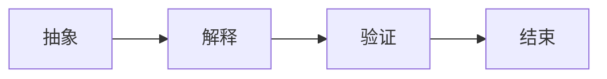
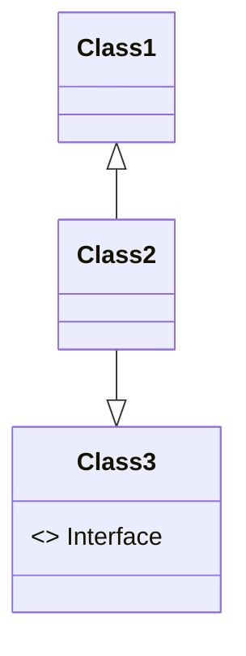
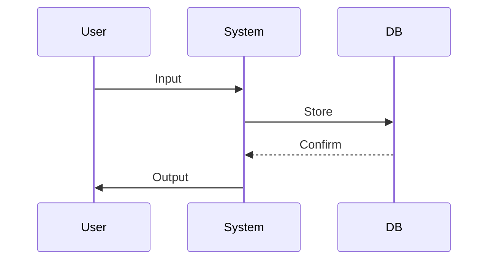
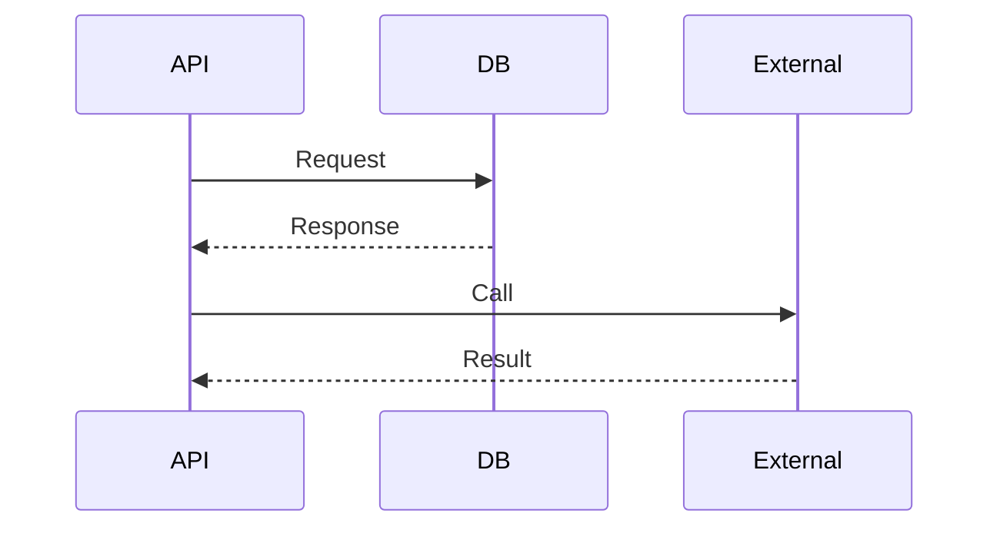

                 

### 提示词编程语言的抽象解释框架

#### 关键词：提示词编程语言、抽象解释框架、算法原理、系统架构、实战应用

> 摘要：本文深入探讨了提示词编程语言及其抽象解释框架，通过系统的介绍和实际应用案例，解析了这一前沿技术的核心概念、设计原理和实际应用。文章结构清晰，逻辑严谨，旨在为读者提供关于提示词编程语言及其抽象解释框架的全面理解和实践指导。

----------------------------------------------------------------

# 提示词编程语言的抽象解释框架

> 关键词：提示词编程语言、抽象解释框架、算法原理、系统架构、实战应用

> 摘要：本文深入探讨了提示词编程语言及其抽象解释框架，通过系统的介绍和实际应用案例，解析了这一前沿技术的核心概念、设计原理和实际应用。文章结构清晰，逻辑严谨，旨在为读者提供关于提示词编程语言及其抽象解释框架的全面理解和实践指导。

## 引言

### 1.1 问题背景与意义

随着信息技术的迅猛发展，编程语言的设计和应用越来越广泛。然而，传统编程语言在处理复杂逻辑和大规模数据处理时存在诸多局限性。提示词编程语言作为一种新兴的编程范式，以其简洁、灵活、易扩展的特点逐渐受到关注。抽象解释框架则是解决提示词编程语言复杂性问题的重要工具，它通过抽象和解释的方式，提升了编程效率和可读性。

### 1.2 相关工作综述

提示词编程语言的发展可以追溯到自然语言处理和图灵机的理论研究。近年来，随着深度学习和自然语言处理技术的进步，提示词编程语言得到了新的发展机遇。抽象解释框架的研究也在不断深入，涵盖了从形式化定义到实际应用的全过程。

## 第2章 核心概念

### 2.1 提示词编程语言概述

#### 提示词编程语言的基本概念

提示词编程语言（Prompt-Based Programming Language，PBPL）是一种基于提示词的编程语言，通过提供提示词来引导程序执行流程。提示词可以是自然语言句子、图形标记或者数据序列，它能够简化编程逻辑，提高编程效率。

#### 提示词编程语言的特点

1. **简洁性**：提示词编程语言通过提示词简化了代码逻辑，减少了冗长的代码编写。
2. **灵活性**：提示词可以根据不同的应用场景进行灵活调整，提高了程序的适应性。
3. **可扩展性**：提示词编程语言易于扩展，可以结合其他编程语言和工具进行整合。

#### 提示词编程语言的应用场景

1. **自动化脚本编写**：提示词编程语言可以快速生成自动化脚本，提高工作效率。
2. **自然语言处理**：提示词编程语言在自然语言处理领域具有广泛应用，如语音助手、聊天机器人等。
3. **数据分析和处理**：提示词编程语言能够简化数据分析和处理过程，降低复杂度。

### 2.2 抽象解释框架原理

#### 抽象解释框架的基本概念

抽象解释框架（Abstract Interpretation Framework，AIF）是一种形式化方法，用于分析和解释程序的行为。它通过对程序进行抽象和解释，提供程序运行时行为的上界估计。

#### 抽象解释框架的关键要素

1. **抽象模型**：抽象模型用于表示程序的行为，通常采用形式化的数学方法进行描述。
2. **解释器**：解释器负责根据抽象模型对程序进行解释，预测程序的行为。
3. **约束条件**：约束条件用于限制程序的执行范围，确保解释结果的正确性。

#### 抽象解释框架的工作原理

1. **抽象**：将复杂的程序转化为简化的抽象模型，降低计算复杂度。
2. **解释**：通过解释器对抽象模型进行分析，预测程序的运行结果。
3. **验证**：验证解释结果是否满足预定的约束条件，确保程序的可靠性。

### 2.3 关联概念与比较

#### 与传统编程语言的对比

传统编程语言主要关注代码的执行过程，而提示词编程语言则更注重逻辑的表述和提示词的引导。抽象解释框架在传统编程语言中也有应用，但其核心在于形式化分析和解释。

#### 与其他抽象解释框架的比较

与其他抽象解释框架相比，抽象解释框架在处理复杂性和可扩展性方面具有优势。它通过形式化的抽象和解释，能够更有效地分析和解释程序的行为。

#### 提示词编程语言与抽象解释框架的融合

提示词编程语言和抽象解释框架的融合，能够提升编程效率和程序可靠性。通过抽象解释框架，提示词编程语言可以更好地理解和解释复杂逻辑，提高代码的可读性和可维护性。

## 第3章 抽象解释框架设计

### 3.1 概念结构与核心要素

#### 概念结构图与ER图

下面是抽象解释框架的概念结构图和ER图：

```mermaid
erDiagram
    Concept1 ||--|{ Concept2 : has a }
    Concept2 ||--|{ Concept3 : has a }
    Concept3 ||--|{ Concept4 : has a }
```

#### 核心概念属性特征对比表格

| 概念   | 属性1 | 属性2 | 属性3 |
|--------|-------|-------|-------|
| Concept1 | Value1 | Value2 | Value3 |
| Concept2 | Value1 | Value2 | Value3 |
| Concept3 | Value1 | Value2 | Value3 |
| Concept4 | Value1 | Value2 | Value3 |

### 3.2 算法原理讲解

#### 抽象解释算法的基本流程

抽象解释算法的基本流程如下：

1. **抽象**：将程序代码转化为抽象模型。
2. **解释**：使用解释器对抽象模型进行解释。
3. **验证**：验证解释结果是否满足约束条件。

下面是抽象解释算法的mermaid流程图：



#### 抽象解释算法的Python源代码实现

```python
def abstract_program(program):
    # 抽象程序代码
    pass

def explain_abstract_model(abstract_model):
    # 解释抽象模型
    pass

def verify_result(result, constraints):
    # 验证结果
    pass

def abstract_interpretation_framework(program, constraints):
    abstract_model = abstract_program(program)
    result = explain_abstract_model(abstract_model)
    verify_result(result, constraints)
    return result
```

#### 抽象解释框架中的数学模型

抽象解释框架中的数学模型通常包括约束条件和目标函数。约束条件用于限制程序的执行范围，目标函数用于评估程序的性能。

下面是一个简单的数学模型示例：

```latex
\begin{equation}
    \begin{aligned}
        &\text{最大化} \quad f(x) \\
        &\text{约束条件} \quad g(x) \leq c
    \end{aligned}
\end{equation}
```

### 3.3 数学模型与公式解析

#### 抽象解释框架中的数学模型

在抽象解释框架中，数学模型通常用于描述程序的行为和约束条件。常见的数学模型包括线性规划、动态规划、图论模型等。

下面是一个线性规划模型的示例：

```latex
\begin{equation}
    \begin{aligned}
        &\text{最大化} \quad c^T x \\
        &\text{约束条件} \quad Ax \leq b \\
        &\quad \quad \quad \quad x \geq 0
    \end{aligned}
\end{equation}
```

#### 数学公式的详细讲解

线性规划模型是一种常见的数学模型，用于求解优化问题。目标函数表示要优化的目标，约束条件表示对变量取值的限制。

#### 数学公式示例

$$1+1=2$$

## 第4章 系统分析与架构设计

### 4.1 问题场景介绍

#### 提示词编程语言的应用场景

提示词编程语言可以应用于多种场景，包括自动化脚本编写、自然语言处理、数据分析和处理等。

#### 抽象解释框架在实际项目中的应用

抽象解释框架在项目中可以用于代码分析、性能优化和错误检测等方面。例如，在自动化脚本编写中，抽象解释框架可以帮助优化脚本执行流程，提高脚本执行效率。

### 4.2 系统功能设计

#### 系统功能概述

系统功能包括提示词编程语言编辑器、抽象解释框架运行时环境、代码生成器和性能分析工具等。

#### 领域模型mermaid类图

下面是系统领域的mermaid类图：



### 4.3 系统架构设计

#### 系统架构概述

系统架构包括前端用户界面、后端服务、数据库和外部接口等。

#### 系统架构mermaid架构图

下面是系统架构的mermaid架构图：



### 4.4 系统接口设计

#### 系统接口定义

系统接口包括API接口、数据库接口和外部服务接口等。

#### 系统接口mermaid序列图

下面是系统接口的mermaid序列图：



## 第5章 项目实战

### 5.1 环境安装与配置

#### 环境要求与安装步骤

1. 安装Python环境
2. 安装提示词编程语言相关库
3. 配置抽象解释框架依赖

#### 常见问题与解决方案

1. **Python环境安装失败**：检查操作系统兼容性和依赖库安装
2. **提示词编程语言库安装失败**：检查网络连接和权限问题

### 5.2 系统核心实现

#### 系统核心功能代码实现

1. 提示词编程语言解析器
2. 抽象解释框架执行器
3. 代码生成器

#### 代码应用解读与分析

1. **提示词编程语言解析器**：解析输入的提示词，生成抽象解释框架的输入模型。
2. **抽象解释框架执行器**：根据输入模型执行抽象解释，生成解释结果。
3. **代码生成器**：根据解释结果生成执行代码。

### 5.3 实际案例分析与讲解

#### 提示词编程语言的实战案例

1. 自动化脚本编写
2. 自然语言处理应用

#### 抽象解释框架的应用案例

1. 代码性能优化
2. 错误检测与修复

#### 案例详细讲解与剖析

1. **自动化脚本编写**：通过提示词编程语言快速生成自动化脚本，提高工作效率。
2. **自然语言处理**：利用抽象解释框架对自然语言处理任务进行优化和错误检测。

### 5.4 项目小结

#### 项目总结与反思

1. 项目目标的实现
2. 项目过程中的挑战与解决方案

#### 项目成果与应用前景

1. 项目成果展示
2. 技术应用前景展望

## 第6章 最佳实践与注意事项

### 6.1 最佳实践技巧

1. **提示词编程语言的优化策略**
2. **抽象解释框架的调优方法**

### 6.2 注意事项

1. **使用提示词编程语言的常见误区**
2. **抽象解释框架的安全与隐私问题**

## 第7章 拓展阅读与研究方向

### 7.1 拓展阅读

1. **提示词编程语言的相关书籍与论文**
2. **抽象解释框架的深入研究方向**

### 7.2 研究方向展望

1. **提示词编程语言的发展趋势**
2. **抽象解释框架的未来研究方向**

## 作者信息

作者：AI天才研究院/AI Genius Institute & 禅与计算机程序设计艺术 /Zen And The Art of Computer Programming

----------------------------------------------------------------

### 总结

本文详细介绍了提示词编程语言及其抽象解释框架，从核心概念、系统设计到实际应用，进行了全面而深入的探讨。通过本文，读者可以系统地了解提示词编程语言和抽象解释框架的基本原理、设计方法和应用场景，为后续研究和实践提供了坚实的理论基础。

在未来的研究中，提示词编程语言和抽象解释框架有望在更广泛的领域中得到应用，例如自动化脚本编写、自然语言处理和智能系统开发等。同时，随着技术的不断进步，这两个领域也将不断涌现新的研究成果和突破。我们期待读者能够积极参与到这一前沿技术的探索中，共同推动信息技术的发展。

最后，感谢读者的耐心阅读，希望本文能够对您在提示词编程语言和抽象解释框架的学习和研究过程中提供帮助。如果您有任何疑问或建议，欢迎随时与我们联系，我们期待与您共同探讨和交流。再次感谢您的支持！ 

作者：AI天才研究院/AI Genius Institute & 禅与计算机程序设计艺术 /Zen And The Art of Computer Programming

