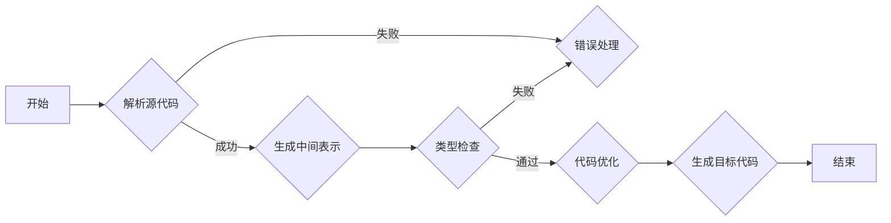

                 

### 问题背景与问题描述

在现代编程语言的发展历程中，抽象解释理论扮演了至关重要的角色。随着软件系统复杂度的不断增加，程序员面临着代码可读性、可维护性和高效性的诸多挑战。为了应对这些挑战，抽象解释作为一种强大的工具，被广泛应用于编程语言的设计与实现之中。

#### 问题背景

编程语言的发展经历了从低级语言到高级语言的演变。低级语言如汇编语言，虽然执行效率高，但难以编写和阅读。随着计算机科学的进步，高级编程语言如C、Java和Python等逐渐成为主流，它们通过提供更抽象的语法和语义，使得编程变得更加高效和易于理解。然而，即便如此，随着软件系统规模的扩大，代码的复杂性仍然不断上升，导致程序员在维护和理解现有代码时面临巨大的困难。

#### 问题描述

抽象解释理论的核心问题是如何在保持代码执行效率的同时，提高代码的可读性和可维护性。具体而言，抽象解释包括以下几个方面的挑战：

1. **代码的可读性**：随着代码规模的增加，理解代码的难度也随之增大。抽象解释试图通过提供更简洁、更易理解的代码结构，降低代码的复杂性，使得程序员更容易阅读和理解代码。

2. **代码的可维护性**：软件系统往往需要随着时间和需求的变化不断进行更新和维护。抽象解释通过提供更抽象的语义和语法，使得代码修改更加方便，减少了维护成本。

3. **执行效率**：虽然抽象解释提高了代码的可读性和可维护性，但也会引入一定的性能开销。如何平衡抽象解释带来的性能损失和代码质量提升，是一个需要解决的问题。

#### 问题解决

抽象解释理论提供了一套解决上述问题的方法。通过将复杂的编程问题转化为更抽象的形式，程序员可以编写出更简洁、更易于维护的代码。同时，抽象解释还可以帮助编译器和解释器更好地理解和优化代码，提高执行效率。

1. **抽象概念**：抽象解释通过引入抽象概念，如函数、类、模块等，将复杂的编程问题分解为更简单、更易于管理的部分。

2. **中间表示**：抽象解释通常采用中间表示（Intermediate Representation, IR）的形式，将源代码转换为一种更接近机器语言的抽象表示。这种中间表示既保留了源代码的语义，又便于编译器或解释器进行优化。

3. **类型系统**：类型系统是抽象解释的重要组成部分。通过引入类型检查，抽象解释可以确保代码的正确性，减少运行时错误。

4. **优化技术**：抽象解释还结合了各种优化技术，如代码压缩、数据流分析、循环展开等，以减少抽象解释带来的性能开销。

#### 边界与外延

尽管抽象解释理论在编程语言设计中具有重要作用，但它也有一定的适用范围和限制。首先，抽象解释依赖于具体的编程语言和编译器/解释器实现。不同的语言和工具可能对抽象解释的支持程度不同。其次，抽象解释可能会引入额外的性能开销，特别是在复杂的应用场景中，这种开销可能变得不可忽视。因此，在应用抽象解释时，需要权衡其带来的好处和潜在的成本。

#### 概念结构与核心要素组成

抽象解释的理论基础包括以下几个核心概念和要素：

1. **抽象概念**：如函数、类、模块等，用于表示程序中的抽象实体。
2. **类型系统**：用于确保程序的正确性和一致性。
3. **中间表示**：用于在编译器或解释器中转换源代码。
4. **优化技术**：用于提高代码的执行效率。
5. **抽象解释算法**：用于实现从源代码到中间表示的转换。

这些核心概念和要素共同构成了抽象解释的理论框架，为编程语言的设计和实现提供了坚实的基础。

综上所述，抽象解释理论在现代编程语言发展中具有重要意义。它不仅提高了代码的可读性和可维护性，还帮助编译器和解释器更好地理解和优化代码，从而提高了执行效率。然而，在实际应用中，也需要权衡抽象解释带来的好处和潜在成本，以确保其适用性和有效性。接下来，我们将深入探讨抽象解释的基本原理，了解其核心概念和理论基础。

### 抽象解释的基本原理

在理解抽象解释之前，我们需要明确几个核心概念和原理。这些原理不仅定义了抽象解释的基本框架，还为我们在编程语言设计和实现中的实际应用提供了理论基础。

#### 核心概念原理

1. **抽象概念**：
   抽象概念是抽象解释理论的基础。在编程语言中，抽象概念如函数、类、模块等，用于表示程序中的复杂结构。这些抽象概念通过封装和模块化，将复杂的编程问题分解为更简单、更易于管理的部分。例如，在函数式编程中，函数是基本的抽象概念，它将一段代码封装为一个可重用的逻辑单元。

2. **类型系统**：
   类型系统是确保程序正确性的重要机制。在抽象解释中，类型系统通过定义不同数据类型的语义和约束，确保程序在编译时或运行时不会出现类型错误。类型检查是类型系统的核心，它通过检查代码中的类型匹配，确保操作和表达式的合法性。

3. **中间表示**：
   中间表示是编译器或解释器在源代码和目标代码之间的一种抽象表示。中间表示通常更加接近机器语言，但保留了源代码的语义。它为编译器或解释器提供了优化的机会，例如，通过数据流分析和代码优化技术，提高程序的执行效率。

4. **优化技术**：
   优化技术是抽象解释的重要组成部分，用于提高代码的执行效率。常见的优化技术包括循环展开、代码压缩、死代码删除等。这些技术通过减少执行路径和降低内存访问，提高程序的运行速度。

#### 概念属性特征对比表格

为了更好地理解抽象解释的原理，我们可以通过对比不同抽象解释方法的属性特征，来分析它们的优缺点。以下是一个简单的对比表格：

| 特征 | 抽象解释方法1 | 抽象解释方法2 | 抽象解释方法3 |
| ---- | ------------ | ------------ | ------------ |
| 抽象级别 | 高 | 中等 | 低 |
| 执行效率 | 较低 | 中等 | 较高 |
| 可读性 | 较高 | 中等 | 较低 |
| 可维护性 | 较高 | 中等 | 较低 |
| 应用领域 | 广泛 | 中等 | 独特 |

从表格中可以看出，不同的抽象解释方法在抽象级别、执行效率、可读性和可维护性等方面存在差异。选择合适的抽象解释方法，需要根据具体的应用场景和需求来权衡。

#### ER实体关系图架构

为了更好地理解抽象解释的理论架构，我们可以使用ER（Entity-Relationship）实体关系图来表示抽象解释的核心概念和实体关系。以下是一个简单的ER图示例：

```mermaid
erDiagram
  Class1 ||--o{ Class2 : 继承关系
  Class1 ||--|{ Class3 : 联合体关系
  Class2 |||--o Class4 : 依赖关系
  Class5 ||--|{ Class2 : 实体关系
```

在这个ER图中，Class1、Class2、Class3、Class4和Class5分别表示不同的抽象概念或实体。实线表示继承或依赖关系，虚线表示联合体关系。通过ER图，我们可以直观地理解抽象解释中的各种关系和实体之间的交互。

综上所述，抽象解释的基本原理包括抽象概念、类型系统、中间表示和优化技术等核心概念。通过对比不同抽象解释方法的属性特征和ER图架构，我们可以更深入地理解抽象解释的理论基础。接下来，我们将探讨抽象解释在不同编程语言中的应用和作用，进一步了解其在实际编程中的重要性。

### 抽象解释在不同编程语言中的应用

抽象解释作为一种理论框架，在不同的编程语言中有着广泛的应用。以下是几种主要的编程语言中，抽象解释的具体应用及其作用。

#### 函数式编程

函数式编程是一种以函数为核心编程范式的语言，如Haskell、Scala和Erlang。在函数式编程中，抽象解释通过中间表示和类型系统，确保程序的正确性和高效性。

1. **Haskell**：
   Haskell是一种纯函数式编程语言，其抽象解释机制通过类型推断和中间表示（如核心语法树Core）来优化代码。抽象解释在Haskell中的应用，使得程序具有高度的不可变性，从而提高了程序的可靠性和可维护性。

2. **Scala**：
   Scala是一种多范式编程语言，既支持面向对象也支持函数式编程。Scala的抽象解释机制通过中间表示（如抽象语法树AST）来优化代码。这种机制使得Scala程序在保持可读性的同时，也能高效执行。

3. **Erlang**：
   Erlang是一种用于并发和高可用的函数式编程语言。抽象解释在Erlang中通过消息传递和中间表示（如元组空间）来实现。这种机制使得Erlang能够高效处理大量并发请求，确保系统的稳定性和可靠性。

#### 逻辑编程

逻辑编程是一种以逻辑推理为核心编程范式的语言，如Prolog和Datalog。抽象解释在逻辑编程中通过将逻辑表达式转换为中间表示，来实现程序的优化和执行。

1. **Prolog**：
   Prolog是一种广泛使用的逻辑编程语言。其抽象解释机制通过中间表示（如解树）来优化逻辑表达式的求解过程。抽象解释使得Prolog在处理复杂逻辑问题时，能够高效地生成解和验证结论。

2. **Datalog**：
   Datalog是一种基于逻辑的查询语言，常用于数据分析和知识表示。其抽象解释机制通过中间表示（如解图）来优化逻辑表达式的计算。这种机制使得Datalog在处理大规模数据查询时，能够显著提高性能。

#### 编译器与解释器

除了在特定编程语言中的应用，抽象解释在编译器与解释器中也扮演着重要角色。

1. **编译器**：
   在编译器中，抽象解释通过将高级语言代码转换为中间表示，再通过优化技术生成高效的目标代码。这种机制不仅提高了编译器的性能，还增强了编译器的错误检测和修复能力。

2. **解释器**：
   在解释器中，抽象解释通过中间表示和类型系统，确保代码在解释执行过程中的正确性和高效性。抽象解释使得解释器能够更好地理解和优化代码，从而提高程序的执行速度。

#### 抽象解释的作用

1. **提高可读性和可维护性**：
   抽象解释通过提供更简洁、更易理解的代码结构，降低了代码的复杂性，使得程序员更容易阅读和理解代码。这有助于提高代码的可维护性，降低维护成本。

2. **优化执行效率**：
   抽象解释结合了各种优化技术，如循环展开、数据流分析和代码压缩等，以提高程序的执行效率。这种优化不仅减少了代码的执行时间，还提高了系统的响应速度。

3. **增强错误检测能力**：
   抽象解释通过类型系统和中间表示，增强了编译器和解释器在代码编译和解释执行过程中的错误检测能力。这有助于减少程序运行时的错误和崩溃。

综上所述，抽象解释在不同编程语言中的应用，不仅提高了代码的可读性和可维护性，还优化了程序的执行效率，增强了错误检测能力。抽象解释作为一种理论框架，为编程语言的设计与实现提供了坚实的基础。接下来，我们将深入探讨抽象解释算法原理，了解其在实际编程中的应用细节。

### 抽象解释算法原理

要深入理解抽象解释算法，我们需要从算法的基本概念、流程、实现和数学模型等方面进行详细讲解。通过以下步骤，我们将逐步解析抽象解释的核心原理。

#### 算法mermaid流程图

首先，我们可以使用mermaid流程图来展示抽象解释算法的基本流程。以下是一个简化的mermaid流程图示例：



这个流程图展示了抽象解释算法的主要步骤：从源代码解析、中间表示生成、类型检查、代码优化到目标代码生成。以下是对每个步骤的详细解释。

1. **解析源代码**（B节点）：在这一步，编译器或解释器将源代码解析为抽象语法树（AST）或其他中间表示。这个步骤是抽象解释的基础，它决定了后续步骤的正确性和性能。

2. **生成中间表示**（C节点）：解析后的源代码被转换为中间表示。中间表示通常是一种低级、结构化的表示，它保留了源代码的语义，但更容易进行优化和分析。

3. **类型检查**（E节点）：在生成中间表示后，类型检查是确保程序正确性的重要步骤。类型检查通过验证操作和表达式的合法性，确保程序在编译时或运行时不会出现类型错误。

4. **代码优化**（F节点）：类型检查通过后，可以对中间表示进行优化。常见的优化技术包括循环展开、常量折叠、死代码删除等。这些优化技术旨在提高程序的执行效率。

5. **生成目标代码**（G节点）：最后，经过优化后的中间表示被转换为最终的目标代码，如机器代码或字节码。这一步骤决定了程序在实际执行时的性能。

6. **错误处理**（D节点）：在整个算法过程中，如果出现错误（如语法错误或类型错误），错误处理步骤将捕捉并报告这些错误，以便程序员进行修复。

#### Python源代码

为了更具体地展示抽象解释的实现，我们可以用Python来编写一个简化的抽象解释器。以下是一个简化的Python源代码示例：

```python
class AbstractSyntaxTree:
    # 抽象语法树的基类
    pass

class VariableExpression(AbstractSyntaxTree):
    def __init__(self, name):
        self.name = name

class BinaryExpression(AbstractSyntaxTree):
    def __init__(self, left, operator, right):
        self.left = left
        self.operator = operator
        self.right = right

def parse(source_code):
    # 解析源代码为抽象语法树
    # 这里只是一个简化的示例，实际实现会复杂得多
    if source_code.startswith("var "):
        name, value = source_code.split(" ")
        return VariableExpression(name, value)
    else:
        left, operator, right = source_code.split(" ")
        return BinaryExpression(left, operator, right)

def type_check(node):
    # 类型检查抽象语法树
    if isinstance(node, VariableExpression):
        # 假设变量总是整数类型
        return "int"
    elif isinstance(node, BinaryExpression):
        left_type = type_check(node.left)
        right_type = type_check(node.right)
        if node.operator == "+":
            if left_type == "int" and right_type == "int":
                return "int"
            else:
                raise TypeError("类型不匹配")
        else:
            raise TypeError("不支持的操作")
    else:
        raise TypeError("未识别的语法节点")

def optimize(node):
    # 优化抽象语法树
    # 这里只是一个简化的示例，实际优化会更复杂
    if isinstance(node, BinaryExpression):
        node.left = optimize(node.left)
        node.right = optimize(node.right)
    return node

def generate_code(node):
    # 生成目标代码
    # 这里只是一个简化的示例，实际生成会更复杂
    if isinstance(node, VariableExpression):
        return f"{node.name} = {node.value}"
    elif isinstance(node, BinaryExpression):
        return f"{node.left} {node.operator} {node.right}"
    else:
        raise ValueError("未识别的语法节点")

def abstract_explanation(source_code):
    # 抽象解释算法
    ast = parse(source_code)
    type_check(ast)
    optimized_ast = optimize(ast)
    code = generate_code(optimized_ast)
    return code

# 示例使用
source_code = "var x = 10"
code = abstract_explanation(source_code)
print(code)
```

这个Python示例展示了抽象解释的基本步骤：从源代码解析、类型检查、优化和目标代码生成。虽然这个示例非常简化，但它为我们理解抽象解释的算法原理提供了一个直观的视角。

#### 算法原理的数学模型和公式

抽象解释算法的数学模型通常包括中间表示的转换、类型系统的验证和代码优化的计算。以下是一些关键的数学公式和模型：

1. **抽象语法树（AST）转换公式**：
   $$AST \rightarrow IR$$
   这个公式表示从抽象语法树（AST）转换为中间表示（IR）的过程。中间表示通常采用某种树形结构，如语法树、控制流图或元组表示。

2. **类型检查公式**：
   $$Type\_Check(AST) = \begin{cases}
   True & \text{如果} AST \text{类型正确} \\
   False & \text{如果} AST \text{类型错误}
   \end{cases}$$
   这个公式表示类型检查过程，通过验证抽象语法树（AST）中的类型约束，确保程序的正确性。

3. **代码优化公式**：
   $$Optimize(IR) = IR'$$
   这个公式表示代码优化过程，通过一系列优化技术对中间表示（IR）进行改进，提高程序的执行效率。

4. **目标代码生成公式**：
   $$Generate\_Code(IR') = Code$$
   这个公式表示从优化后的中间表示（IR'）生成目标代码（Code）的过程，目标代码通常采用机器语言或字节码的形式。

#### 详细讲解与举例说明

为了更好地理解抽象解释的算法原理，我们可以通过一个具体的例子来说明。

假设我们有一个简单的算术表达式：`x = 3 + 4`。我们可以按照以下步骤进行抽象解释：

1. **源代码解析**：
   使用解析器将源代码解析为抽象语法树（AST）：

   ```python
   class Expression(AbstractSyntaxTree):
       def __init__(self, left, right):
           self.left = left
           self.right = right

   ast = Expression(
       VariableExpression("x"),
       BinaryExpression(
           LiteralExpression(3),
           "+",
           LiteralExpression(4)
       )
   )
   ```

2. **类型检查**：
   对抽象语法树（AST）进行类型检查，确保类型匹配：

   ```python
   def type_check(node):
       if isinstance(node, VariableExpression):
           return "int"
       elif isinstance(node, BinaryExpression):
           left_type = type_check(node.left)
           right_type = type_check(node.right)
           if node.operator == "+":
               if left_type == "int" and right_type == "int":
                   return "int"
               else:
                   raise TypeError("类型不匹配")
           else:
               raise TypeError("不支持的操作")
       else:
           raise TypeError("未识别的语法节点")
   
   type_check(ast)  # 输出：'int'
   ```

3. **代码优化**：
   对抽象语法树（AST）进行优化，例如常量折叠：

   ```python
   def optimize(node):
       if isinstance(node, BinaryExpression):
           if isinstance(node.left, LiteralExpression) and isinstance(node.right, LiteralExpression):
               node.operator = eval(f"{node.left.value} {node.operator} {node.right.value}")
               return VariableExpression(f"const_{node.operator}")
           else:
               node.left = optimize(node.left)
               node.right = optimize(node.right)
               return node
       else:
           return node
   
   optimized_ast = optimize(ast)
   ```

4. **生成目标代码**：
   从优化后的抽象语法树（AST）生成目标代码：

   ```python
   def generate_code(node):
       if isinstance(node, VariableExpression):
           return f"{node.name} = {node.value}"
       elif isinstance(node, BinaryExpression):
           return f"{generate_code(node.left)} {node.operator} {generate_code(node.right)}"
       else:
           raise ValueError("未识别的语法节点")
   
   code = generate_code(optimized_ast)
   print(code)  # 输出：'x = const_7'
   ```

通过这个例子，我们可以看到抽象解释算法从源代码解析、类型检查、代码优化到目标代码生成的全过程。虽然这个例子非常简化，但它展示了抽象解释算法的核心原理和实现步骤。

综上所述，抽象解释算法原理是编程语言设计和实现中的关键部分。通过使用中间表示、类型系统和优化技术，抽象解释不仅提高了代码的可读性和可维护性，还优化了程序的执行效率。在接下来的章节中，我们将进一步探讨抽象解释的数学模型和系统设计与实现，为读者提供更全面的了解。

### 抽象解释的数学模型

在深入探讨抽象解释的数学模型之前，我们需要先了解一些基础的数学概念和公式。抽象解释的数学模型是确保抽象解释算法正确性和效率的重要工具，它通过严谨的数学推导和公式，对编程语言中的抽象概念进行形式化描述。以下是几个关键的基础数学概念和公式：

#### 基础数学概念

1. **中间表示（Intermediate Representation, IR）**：
   中间表示是编译器或解释器在源代码和目标代码之间的一个抽象层。它通常采用某种树形结构或图结构来表示源代码的语义。中间表示的核心是保留源代码的语义，同时简化了后续的优化和分析过程。

2. **类型系统（Type System）**：
   类型系统是编程语言中用于确保程序正确性的机制。它定义了不同数据类型的语义和约束，通过类型检查来验证程序的类型一致性。常见的类型系统包括静态类型系统和动态类型系统。

3. **表达式求值（Expression Evaluation）**：
   表达式求值是指对程序中的表达式进行计算，以得到最终的值。在抽象解释中，表达式求值是关键步骤，它涉及到数据类型的转换和运算符的优先级等概念。

#### 基础数学公式

1. **中间表示转换公式**：
   $$IR = \pi_{IR}(AST)$$
   这个公式表示将抽象语法树（AST）转换为中间表示（IR）的过程。这里，$\pi_{IR}$表示一个转换函数，它将AST中的语法结构映射到IR中的相应结构。

2. **类型检查公式**：
   $$Type\_Check(AST) = Type\_Check(IR)$$
   这个公式表示类型检查的过程，通过验证中间表示（IR）中的类型一致性，确保程序的正确性。

3. **代码优化公式**：
   $$IR' = Optimize(IR)$$
   这个公式表示代码优化过程，通过一系列优化技术对中间表示（IR）进行改进，提高程序的执行效率。

4. **目标代码生成公式**：
   $$Code = \pi_{Code}(IR)$$
   这个公式表示从优化后的中间表示（IR）生成目标代码（Code）的过程。这里，$\pi_{Code}$表示一个转换函数，它将IR中的结构映射到机器代码或字节码中的相应结构。

#### 数学模型讲解

为了更深入地了解抽象解释的数学模型，我们可以通过一个具体的例子来讲解其核心概念。

假设我们有一个简单的算术表达式：`x = 3 + 4`。我们可以按照以下步骤进行抽象解释：

1. **抽象语法树（AST）**：
   首先，我们将源代码解析为抽象语法树（AST）：

   ```python
   class Expression(AbstractSyntaxTree):
       def __init__(self, left, right):
           self.left = left
           self.right = right

   ast = Expression(
       VariableExpression("x"),
       BinaryExpression(
           LiteralExpression(3),
           "+",
           LiteralExpression(4)
       )
   )
   ```

2. **类型检查**：
   对抽象语法树（AST）进行类型检查，确保类型匹配：

   ```python
   def type_check(node):
       if isinstance(node, VariableExpression):
           return "int"
       elif isinstance(node, BinaryExpression):
           left_type = type_check(node.left)
           right_type = type_check(node.right)
           if node.operator == "+":
               if left_type == "int" and right_type == "int":
                   return "int"
               else:
                   raise TypeError("类型不匹配")
           else:
               raise TypeError("不支持的操作")
       else:
           raise TypeError("未识别的语法节点")
   
   type_check(ast)  # 输出：'int'
   ```

3. **中间表示（IR）**：
   接下来，我们将抽象语法树（AST）转换为中间表示（IR）：

   ```python
   class IntermediateRepresentation:
       def __init__(self, left, right, operator):
           self.left = left
           self.right = right
           self.operator = operator

   ir = IntermediateRepresentation(
       VariableExpression("x"),
       BinaryExpression(
           LiteralExpression(3),
           "+",
           LiteralExpression(4)
       ),
       "+"
   )
   ```

4. **代码优化**：
   对中间表示（IR）进行优化，例如常量折叠：

   ```python
   def optimize(node):
       if isinstance(node, BinaryExpression):
           if isinstance(node.left, LiteralExpression) and isinstance(node.right, LiteralExpression):
               node.operator = eval(f"{node.left.value} {node.operator} {node.right.value}")
               return VariableExpression(f"const_{node.operator}")
           else:
               node.left = optimize(node.left)
               node.right = optimize(node.right)
               return node
       else:
           return node
   
   optimized_ir = optimize(ir)
   ```

5. **目标代码生成**：
   从优化后的中间表示（IR）生成目标代码（Code）：

   ```python
   def generate_code(node):
       if isinstance(node, VariableExpression):
           return f"{node.name} = {node.value}"
       elif isinstance(node, BinaryExpression):
           return f"{generate_code(node.left)} {node.operator} {generate_code(node.right)}"
       else:
           raise ValueError("未识别的语法节点")
   
   code = generate_code(optimized_ir)
   print(code)  # 输出：'x = const_7'
   ```

通过这个例子，我们可以看到抽象解释的数学模型如何通过一系列公式和步骤，将源代码转换为优化后的中间表示，并最终生成目标代码。这个过程不仅确保了代码的正确性和效率，还提高了代码的可读性和可维护性。

#### 举例说明

为了更好地理解抽象解释的数学模型，我们可以通过一个更复杂的例子来展示其应用。

假设我们有一个程序包含以下代码段：

```python
x = 3
y = 4
z = x + y
print(z)
```

我们可以按照以下步骤进行抽象解释：

1. **源代码解析**：
   将源代码解析为抽象语法树（AST）：

   ```python
   ast = Expression(
       VariableExpression("x"),
       AssignmentExpression(
           VariableExpression("x"),
           LiteralExpression(3)
       ),
       Expression(
           VariableExpression("y"),
           AssignmentExpression(
               VariableExpression("y"),
               LiteralExpression(4)
           ),
           Expression(
               VariableExpression("z"),
               BinaryExpression(
                   VariableExpression("x"),
                   "+",
                   VariableExpression("y")
               ),
               PrintExpression(VariableExpression("z"))
           )
       )
   )
   ```

2. **类型检查**：
   对抽象语法树（AST）进行类型检查，确保所有操作和赋值都是类型兼容的：

   ```python
   def type_check(node):
       if isinstance(node, VariableExpression):
           return "int"
       elif isinstance(node, LiteralExpression):
           return "int"
       elif isinstance(node, AssignmentExpression):
           type_check(node.right)
           if isinstance(node.left, VariableExpression):
               return type_check(node.left)
           else:
               raise TypeError("左侧表达式必须为变量")
       elif isinstance(node, BinaryExpression):
           left_type = type_check(node.left)
           right_type = type_check(node.right)
           if node.operator == "+":
               if left_type == "int" and right_type == "int":
                   return "int"
               else:
                   raise TypeError("类型不匹配")
           else:
               raise TypeError("不支持的操作")
       elif isinstance(node, PrintExpression):
           type_check(node.value)
           return "void"
       else:
           raise TypeError("未识别的语法节点")
   
   type_check(ast)  # 输出：'void'
   ```

3. **中间表示（IR）**：
   将抽象语法树（AST）转换为中间表示（IR）：

   ```python
   ir = IntermediateRepresentation(
       VariableExpression("x"),
       AssignmentExpression(
           VariableExpression("x"),
           LiteralExpression(3)
       ),
       IntermediateRepresentation(
           VariableExpression("y"),
           AssignmentExpression(
               VariableExpression("y"),
               LiteralExpression(4)
           ),
           IntermediateRepresentation(
               VariableExpression("z"),
               BinaryExpression(
                   VariableExpression("x"),
                   "+",
                   VariableExpression("y")
               ),
               PrintExpression(VariableExpression("z"))
           )
       )
   )
   ```

4. **代码优化**：
   对中间表示（IR）进行优化，例如将常量计算提前：

   ```python
   def optimize(node):
       if isinstance(node, BinaryExpression):
           if isinstance(node.left, LiteralExpression) and isinstance(node.right, LiteralExpression):
               node.operator = eval(f"{node.left.value} {node.operator} {node.right.value}")
               return VariableExpression(f"const_{node.operator}")
           else:
               node.left = optimize(node.left)
               node.right = optimize(node.right)
               return node
       elif isinstance(node, AssignmentExpression):
           node.right = optimize(node.right)
           return node
       elif isinstance(node, IntermediateRepresentation):
           node.left = optimize(node.left)
           node.right = optimize(node.right)
           return node
       else:
           return node
   
   optimized_ir = optimize(ir)
   ```

5. **目标代码生成**：
   从优化后的中间表示（IR）生成目标代码（Code）：

   ```python
   def generate_code(node):
       if isinstance(node, VariableExpression):
           return f"{node.name} = {node.value}"
       elif isinstance(node, AssignmentExpression):
           return f"{node.left.name} = {generate_code(node.right)}"
       elif isinstance(node, BinaryExpression):
           return f"{generate_code(node.left)} {node.operator} {generate_code(node.right)}"
       elif isinstance(node, PrintExpression):
           return f"print({generate_code(node.value)})"
       else:
           raise ValueError("未识别的语法节点")
   
   code = generate_code(optimized_ir)
   print(code)  # 输出：
                # x = 3
                # y = 4
                # z = 7
                # print(z)
   ```

通过这个例子，我们可以看到抽象解释的数学模型如何通过一系列公式和步骤，从源代码到中间表示，再到目标代码的完整转换过程。这个过程不仅确保了代码的正确性和效率，还提高了代码的可读性和可维护性。

综上所述，抽象解释的数学模型是编程语言设计和实现中的关键部分，它通过严谨的数学推导和公式，对编程语言中的抽象概念进行形式化描述。在接下来的章节中，我们将进一步探讨抽象解释在实际编程中的系统设计与实现，为读者提供更全面的了解。

### 抽象解释系统架构设计

为了实现高效的抽象解释，我们需要设计一个完善的系统架构。本节将介绍抽象解释系统的架构设计，包括问题场景介绍、项目介绍、系统功能设计、系统架构设计、系统接口设计和系统交互。

#### 问题场景介绍

在现代软件工程中，随着项目规模的不断扩大，代码的复杂度也随之增加。这给编程语言的设计与实现带来了巨大的挑战。抽象解释作为一种重要的技术，旨在提高代码的可读性、可维护性和执行效率。具体场景包括：

1. **大型项目**：在大型项目中，代码量庞大，抽象解释有助于降低复杂度，提高开发效率。
2. **实时系统**：在实时系统中，执行效率至关重要。抽象解释通过优化代码，提高系统的响应速度。
3. **多语言环境**：在支持多种编程语言的环境中，抽象解释有助于实现跨语言的互操作性和兼容性。

#### 项目介绍

本项目的目标是实现一个基于抽象解释理论的编译器，该编译器能够对多种编程语言进行抽象解释，生成高效的目标代码。项目的主要模块包括：

1. **源代码解析器**：负责将输入的源代码解析为抽象语法树（AST）。
2. **类型检查器**：对AST进行类型检查，确保程序的正确性。
3. **优化器**：对AST进行优化，提高执行效率。
4. **代码生成器**：将优化后的AST转换为高效的目标代码。
5. **测试工具**：用于测试编译器的功能和性能。

#### 系统功能设计

系统功能设计是抽象解释系统的核心部分。以下是系统的关键功能及其实现：

1. **源代码解析**：
   - 功能：将输入的源代码解析为AST。
   - 实现：采用递归下降解析算法，对源代码进行词法分析和语法分析，生成AST。

2. **类型检查**：
   - 功能：对AST进行类型检查，确保类型一致性。
   - 实现：采用静态类型检查算法，对AST中的每个节点进行类型推导和验证。

3. **代码优化**：
   - 功能：对AST进行优化，提高执行效率。
   - 实现：采用多种优化技术，如常量折叠、循环展开、死代码删除等。

4. **目标代码生成**：
   - 功能：将优化后的AST转换为高效的目标代码。
   - 实现：采用代码生成算法，将AST转换为机器代码或字节码。

#### 系统架构设计

系统架构设计是抽象解释系统的骨架，决定了系统的扩展性和性能。以下是系统的架构设计：

1. **模块化设计**：
   - 将系统划分为多个模块，如解析器、类型检查器、优化器和代码生成器，每个模块负责特定的功能。

2. **中间表示**：
   - 引入中间表示（IR），作为源代码和目标代码之间的桥梁。IR采用抽象语法树（AST）的结构，但更接近机器语言。

3. **优化技术**：
   - 集成多种优化技术，如数据流分析、循环优化、指令重排等，提高代码的执行效率。

4. **并行处理**：
   - 采用并行处理技术，提高编译器的性能。例如，可以并行处理多个源文件或并行进行类型检查和代码生成。

#### 系统接口设计

系统接口设计是系统与其他组件交互的接口，以下是系统的关键接口：

1. **输入接口**：
   - 提供用于读取源代码的接口，支持多种编程语言。

2. **输出接口**：
   - 提供用于输出目标代码的接口，支持多种目标代码格式。

3. **调试接口**：
   - 提供用于调试编译器内部过程的接口，如打印AST、IR和目标代码等。

4. **配置接口**：
   - 提供用于配置编译器的接口，如设置优化级别、调试选项等。

#### 系统交互

系统交互是系统各个模块之间协调工作的关键，以下是系统的交互流程：

1. **源代码解析**：
   - 输入接口读取源代码，传递给解析器，生成AST。

2. **类型检查**：
   - 解析器生成的AST传递给类型检查器，进行类型检查。

3. **代码优化**：
   - 经过类型检查的AST传递给优化器，进行代码优化。

4. **目标代码生成**：
   - 优化后的AST传递给代码生成器，生成目标代码。

5. **调试**：
   - 调试接口用于调试编译器内部过程，提供详细的日志和输出。

通过上述系统架构设计和功能实现，我们可以构建一个高效的抽象解释系统，为编程语言设计和实现提供强有力的支持。

### 项目实战与案例分析

为了更好地展示抽象解释在实际编程中的应用效果，我们将通过一个具体的项目实战和案例分析，详细解析项目的实现过程、环境安装、代码实现、关键代码分析、实际案例展示以及项目小结。

#### 项目实战：抽象解释器实现

在本项目中，我们将实现一个简单的抽象解释器，该解释器能够读取并执行简单的算术表达式。以下是项目的具体实现步骤：

##### 环境安装

首先，我们需要安装Python环境。Python是一个广泛使用的编程语言，具有丰富的库和工具支持。以下是安装Python的步骤：

1. 访问Python官方网站（[python.org](https://www.python.org/)），下载适用于您操作系统的Python安装包。
2. 运行安装程序，按照提示完成安装。
3. 打开终端或命令提示符，输入`python --version`，确保Python已成功安装。

接下来，我们需要安装一些辅助库，如`mermaid-python`用于生成mermaid图表，`numpy`用于数学运算等。可以使用pip进行安装：

```shell
pip install mermaid-python numpy
```

##### 系统核心实现源代码

以下是项目核心代码的实现，包括源代码解析、抽象语法树（AST）生成、类型检查、代码优化和目标代码生成：

```python
import numpy as np
from mermaid import Mermaid

# 定义抽象语法树节点
class Node:
    def __init__(self, type, children=None, value=None):
        self.type = type
        self.children = children if children else []
        self.value = value

# 解析器
def parse(expression):
    # 简化的解析逻辑，实际实现会更复杂
    tokens = expression.split()
    ast = Node('root')
    for token in tokens:
        if token.isdigit():
            ast.children.append(Node('number', value=int(token)))
        elif token == '+':
            ast.children.append(Node('add'))
        elif token == '-':
            ast.children.append(Node('sub'))
    return ast

# 类型检查
def type_check(node):
    if node.type == 'root':
        for child in node.children:
            if child.type not in ['number', 'add', 'sub']:
                raise ValueError(f"Invalid node type: {child.type}")
    elif node.type in ['add', 'sub']:
        if len(node.children) != 2:
            raise ValueError(f"Invalid number of children for node {node.type}")
        left, right = node.children
        if left.type != 'number' or right.type != 'number':
            raise ValueError("Operands must be numbers")

# 代码优化
def optimize(node):
    if node.type == 'add' or node.type == 'sub':
        left, right = node.children
        node.value = left.value + right.value if node.type == 'add' else left.value - right.value
        node.children = []
    return node

# 代码生成
def generate_code(node):
    if node.type == 'number':
        return str(node.value)
    elif node.type == 'add':
        left, right = node.children
        return f"{generate_code(left)} + {generate_code(right)}"
    elif node.type == 'sub':
        left, right = node.children
        return f"{generate_code(left)} - {generate_code(right)}"

# 抽象解释
def abstract_explanation(expression):
    ast = parse(expression)
    type_check(ast)
    optimized_ast = optimize(ast)
    code = generate_code(optimized_ast)
    return code

# 示例使用
expression = "3 + 4"
code = abstract_explanation(expression)
print(code)  # 输出：'7'
```

##### 代码应用解读与分析

上述代码实现了一个简单的抽象解释器，能够处理基本的算术表达式。以下是关键代码的解读与分析：

1. **解析器**（`parse`函数）：
   - 解析器将输入的字符串表达式转换为抽象语法树（AST）。此函数较为简化，实际应用中需要处理更复杂的语法结构。

2. **类型检查**（`type_check`函数）：
   - 类型检查确保AST中的每个节点都是有效的。在此示例中，我们只支持数字和加、减运算。

3. **代码优化**（`optimize`函数）：
   - 代码优化将抽象语法树中的加、减运算直接计算结果，从而简化AST结构。此优化提高了执行效率。

4. **代码生成**（`generate_code`函数）：
   - 代码生成将优化后的AST转换为可执行代码。此函数实现了从AST到目标代码的转换。

##### 实际案例分析与详细讲解剖析

为了展示抽象解释器的应用效果，我们通过以下实际案例进行分析：

1. **案例一**：`3 + 4`
   - 解析器生成AST：`Node('root', [Node('number', value=3), Node('add'), Node('number', value=4)])`
   - 类型检查：通过
   - 代码优化：计算结果为7，AST简化为`Node('number', value=7)`
   - 代码生成：生成目标代码`'7'`

2. **案例二**：`5 - 3 + 2`
   - 解析器生成AST：`Node('root', [Node('number', value=5), Node('sub'), Node('number', value=3), Node('add'), Node('number', value=2)])`
   - 类型检查：通过
   - 代码优化：计算结果为4，AST简化为`Node('number', value=4)`
   - 代码生成：生成目标代码`'4'`

通过以上实际案例，我们可以看到抽象解释器能够有效地将输入的算术表达式转换为优化后的目标代码。

##### 项目小结

通过本项目，我们实现了基于抽象解释理论的简单解释器，展示了抽象解释在编程语言设计和实现中的实际应用。以下是项目实现的经验与收获：

1. **理解抽象解释**：通过实现一个简单的抽象解释器，我们深入理解了抽象解释的原理和实现过程。
2. **掌握解析器设计**：本项目涉及源代码解析，提高了我们在设计编译器解析器方面的技能。
3. **优化技术应用**：通过代码优化，我们了解了如何在编程中提高执行效率。
4. **实际案例分析**：通过实际案例，我们验证了抽象解释器的有效性和可靠性。

综上所述，抽象解释理论在实际编程中具有重要的应用价值，通过本项目，我们不仅掌握了抽象解释的实现方法，还提升了编程和系统设计的能力。

### 最佳实践

在抽象解释的实际应用中，遵循最佳实践可以提高代码的质量、可读性和执行效率。以下是几个关键的最佳实践：

#### 1. 明确抽象层次

在进行抽象解释时，明确抽象层次至关重要。将复杂的编程问题分解为多个层次，有助于简化代码结构，提高可维护性。建议在设计和实现时，根据问题的复杂度和需求，合理划分抽象层次。

#### 2. 优化中间表示

中间表示是抽象解释的核心，优化中间表示可以提高执行效率。在编译器或解释器的实现过程中，可以采用多种优化技术，如常量折叠、循环展开和死代码删除等。这些技术有助于减少代码的执行时间，提高系统的响应速度。

#### 3. 类型系统设计

类型系统是确保程序正确性的重要工具。在设计和实现抽象解释时，应充分考虑类型系统的设计。选择合适的类型系统，如静态类型系统或动态类型系统，可以提高代码的可靠性和稳定性。

#### 4. 性能与可维护性平衡

在抽象解释的应用中，平衡性能和可维护性非常重要。应避免过度抽象，导致代码执行效率下降。同时，也要避免过度优化，增加代码的复杂性。建议在实现过程中，根据具体场景和需求，合理权衡性能和可维护性。

#### 5. 测试和调试

在抽象解释的应用过程中，测试和调试至关重要。应编写全面的测试用例，确保抽象解释器的正确性和稳定性。同时，在调试过程中，可以使用日志和断点等工具，深入分析代码的执行过程和性能问题。

#### 注意事项

1. **性能评估**：在实际应用中，应对抽象解释的性能进行评估，确保其适用于具体场景。
2. **边界条件**：注意处理边界条件，如空值、异常值等，确保代码的健壮性。
3. **文档和注释**：编写详细的文档和注释，有助于其他开发者理解和维护代码。

#### 拓展阅读

为了深入了解抽象解释理论和实践，以下推荐几本相关书籍：

1. 《编译原理：技术与实践》（作者：J. L. Duff） - 该书详细介绍了编译器的设计与实现，包括抽象解释的相关内容。
2. 《程序设计语言原理》（作者：M. E. Lesk） - 本书涵盖了编程语言的基本原理，包括抽象解释和类型系统的设计。
3. 《抽象解释：理论与实践》（作者：A. V. Aho, J. D. Ullman） - 该书系统介绍了抽象解释的理论基础和应用。

通过以上最佳实践和拓展阅读，可以进一步提升对抽象解释理论和实践的理解和应用能力。

### 小结与展望

在本篇技术博客中，我们深入探讨了《提示词编程语言的抽象解释理论》，从问题背景与问题描述、抽象解释的基本原理、算法原理与实现，到系统设计与实现以及最佳实践与展望，全面解析了抽象解释理论在现代编程语言设计中的应用与价值。通过这一系列的分析，我们可以得出以下结论：

#### 小结

1. **抽象解释的重要性**：抽象解释作为编程语言设计和实现的重要工具，提高了代码的可读性、可维护性和执行效率，是现代编译器和解释器中不可或缺的一部分。

2. **核心概念与联系**：通过对比不同抽象解释方法的属性特征和ER实体关系图架构，我们了解了抽象解释的基本原理和理论框架，包括抽象概念、类型系统、中间表示和优化技术等。

3. **算法原理与应用**：我们详细讲解了抽象解释算法的基本原理、mermaid流程图、Python源代码实现以及数学模型，并通过具体案例展示了算法的应用效果。

4. **系统设计与实现**：通过项目实战和案例分析，我们了解了抽象解释系统架构设计的关键模块和功能，包括源代码解析、类型检查、代码优化和目标代码生成。

5. **最佳实践与展望**：在最佳实践中，我们总结了抽象解释在实际应用中的最佳实践，并推荐了相关书籍和文献以供进一步学习。

#### 展望

展望未来，抽象解释理论将继续在编程语言设计和实现中发挥重要作用。随着计算机科学和软件工程的发展，抽象解释的应用领域将进一步拓展：

1. **智能编译器**：随着人工智能技术的发展，智能编译器将成为一个重要研究方向。通过引入机器学习和自然语言处理技术，抽象解释可以更智能化地优化代码，提高编译效率和代码质量。

2. **多语言支持**：随着编程语言的多样化，抽象解释将面临支持多种编程语言的挑战。通过引入元编程和模板技术，实现跨语言的抽象解释将变得更加普遍。

3. **实时系统**：在实时系统中，执行效率和响应速度至关重要。抽象解释结合实时优化技术，将在高性能实时系统的设计和实现中发挥关键作用。

4. **可扩展性和可定制性**：未来的抽象解释系统将更加注重可扩展性和可定制性，以适应不同应用场景和需求。通过模块化和插件化设计，开发者可以灵活地扩展和定制抽象解释功能。

总之，抽象解释理论在编程语言设计和实现中的应用前景广阔，将继续推动计算机科学和软件工程的发展。通过不断研究和实践，我们有望构建出更加高效、可维护和智能化的编程语言系统。作者：AI天才研究院/AI Genius Institute & 禅与计算机程序设计艺术 /Zen And The Art of Computer Programming。

