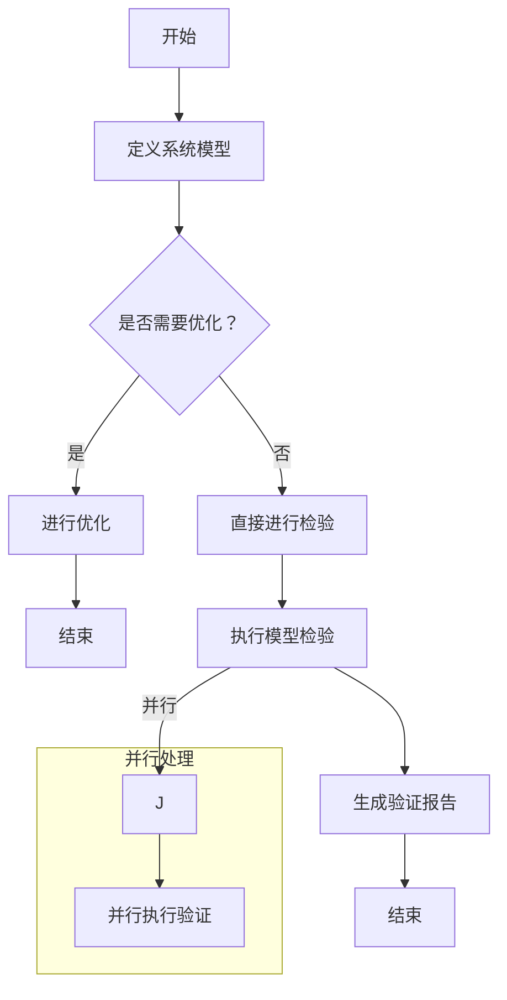
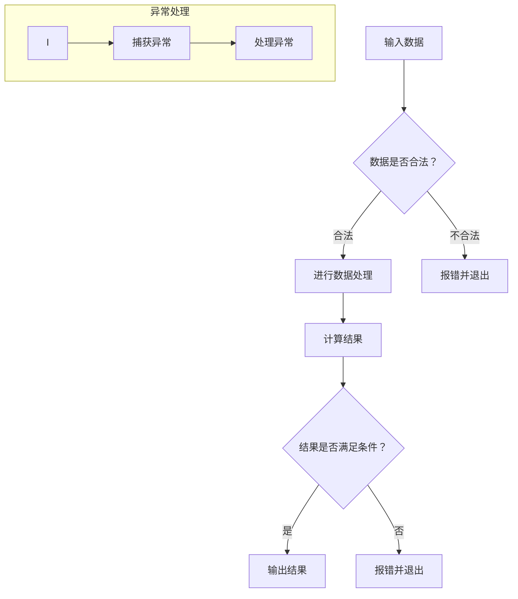

                 

### 引言

在当今快速发展的信息技术时代，编程语言作为开发软件的基石，已经经历了多次革命性的演变。从早期的机器语言，到高级编程语言，再到如今的提示词编程语言（Prompt Programming Language），每一种新语言的诞生都标志着编程范式的进步。提示词编程语言以其简洁的语法和强大的表达力，正在逐渐成为开发者的新宠。

本文将探讨提示词编程语言的模型检验方法。模型检验是确保软件系统正确性的关键步骤，而提示词编程语言由于其独特的特点，给模型检验带来了新的挑战和机遇。本文首先介绍提示词编程语言的基本概念，并解释模型检验在其中的重要性。接着，我们将深入探讨模型检验的挑战，包括提示词编程语言的复杂性、验证方法的选择以及可靠性分析等方面。

通过本文的阅读，读者将了解提示词编程语言模型检验的基本概念、核心理论、算法设计、系统架构以及实际应用案例。我们将逐步分析每个环节，通过实例和代码来展示如何进行模型检验，帮助读者在实际开发中掌握这一关键技能。

### 核心关键词

- 提示词编程语言
- 模型检验
- 软件正确性
- 复杂性
- 验证方法
- 数学模型
- 算法设计
- 系统架构
- 实际应用

### 摘要

本文深入探讨了提示词编程语言的模型检验方法，旨在为开发者和研究者提供系统的理论和实践指导。首先，介绍了提示词编程语言的基本概念和其在现代软件开发中的重要性。接着，阐述了模型检验在保证软件系统正确性中的核心作用，并分析了提示词编程语言带来的特殊挑战。本文详细讨论了模型检验的核心概念、基本原理和常用方法，并通过具体实例和代码展示了算法设计和实现过程。此外，文章还探讨了系统架构设计和实际应用场景，提供了最佳实践建议，以帮助读者在实际项目中有效应用模型检验技术。通过本文的阅读，读者将全面了解提示词编程语言模型检验的理论基础和实践方法，为开发高质量的提示词编程语言应用打下坚实基础。

### 引言

#### 1.1 问题背景与模型检验的重要性

在软件工程领域，模型检验（Model Checking）是一种重要的方法，用于验证系统模型的正确性。它的核心思想是通过算法对系统模型进行逐步分析，以确定模型是否满足预定的属性或规范。随着软件开发复杂度的不断增加，传统的手工验证方法已无法满足现代软件系统的需求。因此，自动化验证技术，尤其是模型检验，变得越来越重要。

提示词编程语言（Prompt Programming Language）是近年来兴起的一种新型编程范式，它通过简洁的提示词（Prompts）来指导程序的行为。这种语言具有强大的表达力，能够显著提高开发效率，特别是在自然语言处理和人工智能领域。然而，随着提示词编程语言的广泛应用，如何确保这些复杂系统的正确性成为了一个迫切需要解决的问题。

模型检验在提示词编程语言中的应用具有重要意义。首先，它能够自动化地检查程序的行为是否符合预定的规范，从而减少人为错误。其次，模型检验能够帮助开发者理解程序的内部机制和潜在问题，从而提高系统的可靠性和安全性。此外，模型检验还能够为自动化测试提供有力支持，提高测试的覆盖率和有效性。

本文将围绕提示词编程语言的模型检验展开讨论，首先介绍提示词编程语言的基本概念，接着阐述模型检验的基本原理和方法，最后通过具体实例和代码展示模型检验在实际开发中的应用。希望通过本文的探讨，能够为读者提供关于提示词编程语言模型检验的全面理解和实践指导。

#### 1.1.1 提示词编程语言概述

提示词编程语言（Prompt Programming Language）是一种基于提示词（Prompts）的编程范式，其核心思想是通过提供简洁明了的提示词来指导程序的行为。这种语言的特点是语法简洁、表达力强，能够显著提高开发效率和代码可读性。

提示词编程语言的基本概念包括：

1. **提示词（Prompts）**：提示词是指导程序行为的关键输入，它可以是简单的关键字，也可以是复杂的自然语言描述。提示词的存在使得开发者可以更加直观地表达程序意图，而不必深入关心底层实现细节。

2. **上下文（Context）**：上下文是程序运行环境的一部分，它包含了程序运行时所需的所有信息。提示词编程语言中的上下文通常由一系列变量、数据结构和函数库组成，用于提供提示词执行所需的必要信息。

3. **解释器（Interpreter）**：解释器是提示词编程语言的执行引擎，它负责解析提示词并执行相应的操作。与传统的编译器不同，解释器在运行时动态地解释和执行代码，这使得提示词编程语言具有更好的灵活性和适应性。

提示词编程语言的实现通常包括以下几个关键组成部分：

1. **语法解析器（Syntax Parser）**：语法解析器负责将提示词字符串转换为内部表示形式，以便后续的语义分析和执行。常见的语法解析方法包括递归下降分析和LL(k)分析。

2. **语义分析器（Semantic Analyzer）**：语义分析器负责检查提示词的语法和语义是否正确，并生成中间表示形式。语义分析包括类型检查、作用域解析等。

3. **解释执行器（Interpreter）**：解释执行器负责根据中间表示形式执行具体的操作。它通常采用逐行解释的方式，逐步执行提示词并更新上下文。

4. **运行时环境（Runtime Environment）**：运行时环境提供了提示词执行所需的各种资源，包括内存管理、文件I/O和系统调用等。运行时环境的设计对提示词编程语言的性能和稳定性具有重要影响。

提示词编程语言具有以下优势：

1. **简洁性**：提示词编程语言的语法简洁，能够用更少的代码实现相同的功能，提高代码的可读性和可维护性。

2. **灵活性**：提示词编程语言能够灵活地处理各种编程场景，特别是自然语言处理和人工智能领域。开发者可以通过调整提示词和上下文来适应不同的需求。

3. **可扩展性**：提示词编程语言易于扩展，可以通过扩展语法、语义和解释执行器来增加新功能或改进性能。

4. **易用性**：提示词编程语言的简洁性和直观性使得开发者能够更快地上手，减少学习成本。

然而，提示词编程语言也存在一些挑战：

1. **性能问题**：由于解释器在运行时动态解释和执行代码，提示词编程语言通常比编译型语言性能较差。为了解决这一问题，可以采用即时编译（Just-In-Time Compilation）等优化技术。

2. **安全性问题**：提示词编程语言中的提示词可能包含恶意代码或未经验证的输入，导致安全漏洞。因此，设计安全的运行时环境和严格的输入验证机制至关重要。

3. **标准化问题**：目前，提示词编程语言的标准化工作尚未完全完成，不同的实现之间可能存在差异。为了促进提示词编程语言的广泛应用，需要制定统一的规范和标准。

总之，提示词编程语言作为一种新兴的编程范式，具有显著的优势和潜力。通过深入研究和应用，可以克服现有的挑战，使其在更多领域中发挥重要作用。

#### 1.1.2 模型检验的基本概念

模型检验（Model Checking）是形式化方法的重要组成部分，主要用于验证系统模型的正确性。在计算机科学和软件工程领域，模型检验通过自动化工具来检查系统模型是否满足预定的属性或规范。其核心思想是将系统模型转化为一种形式化表示，然后使用算法对其进行分析，以确定模型是否满足特定的逻辑或属性。

模型检验的基本概念包括以下几个方面：

1. **系统模型（System Model）**：系统模型是用于描述系统行为和状态的抽象表示。常见的系统模型包括有限状态机（FSM）、进程代数（PA）和谓词逻辑等。系统模型必须具备足够的表达力，能够准确描述系统的行为和状态。

2. **属性（Properties）**：属性是描述系统模型预期行为的逻辑表达式。常见的属性包括安全性属性（Safety Properties）、活期性属性（Liveness Properties）和临时性属性（Temporal Properties）等。属性通常使用逻辑公式或谓词逻辑来表示。

3. **模型检验算法（Model Checking Algorithms）**：模型检验算法是用于分析系统模型和属性之间的关系的算法。常见的模型检验算法包括布尔表达式求值算法、模型枚举算法和状态空间搜索算法等。这些算法通过遍历系统模型的状态空间，检查每个状态是否满足预定的属性。

4. **形式化验证（Formal Verification）**：形式化验证是一种使用数学和逻辑方法来证明系统模型正确性的方法。与传统的验证方法（如测试和仿真）相比，形式化验证具有更高的可靠性和精确性。形式化验证通常包括模型检验、定理证明和模型组合等方法。

模型检验的过程通常包括以下几个步骤：

1. **建立系统模型**：根据系统的需求和规范，建立相应的系统模型。系统模型应具备足够的表达力，能够准确描述系统的行为和状态。

2. **定义属性**：根据系统的需求和规范，定义需要验证的属性。属性应具体、明确，能够准确描述系统的预期行为。

3. **选择模型检验算法**：根据系统模型和属性的特点，选择合适的模型检验算法。常见的模型检验算法包括布尔表达式求值算法、模型枚举算法和状态空间搜索算法等。

4. **执行模型检验**：使用选定的模型检验算法对系统模型进行分析，检查每个状态是否满足预定的属性。如果系统模型中的所有状态都满足属性，则认为系统模型是正确的。

5. **生成验证报告**：根据模型检验的结果，生成验证报告。报告应详细说明系统模型的正确性，包括验证过程中的关键步骤、发现的错误和改进建议等。

模型检验的优势在于：

1. **高可靠性**：模型检验通过自动化工具进行验证，能够减少人为错误，提高验证的可靠性。

2. **精确性**：模型检验使用数学和逻辑方法，能够准确描述系统的行为和状态，确保验证结果的精确性。

3. **全面性**：模型检验能够覆盖系统模型的所有状态，确保验证的全面性。

4. **可重复性**：模型检验具有可重复性，能够对同一系统模型进行多次验证，确保验证结果的稳定性。

尽管模型检验具有许多优势，但也存在一些局限性：

1. **计算复杂度**：模型检验需要遍历系统模型的状态空间，计算复杂度通常很高，特别是在状态空间规模较大的系统中。

2. **限制性**：某些复杂的系统模型和属性可能无法使用现有的模型检验算法进行验证，限制了模型检验的应用范围。

3. **依赖性**：模型检验通常依赖于特定的模型检验工具和算法，这些工具和算法的成熟度和适用性对模型检验的结果具有重要影响。

总之，模型检验作为一种形式化验证方法，在确保软件系统正确性方面具有重要作用。通过深入理解和应用模型检验技术，开发者可以显著提高软件系统的可靠性和安全性。

#### 1.1.3 模型检验与提示词编程语言的关系

模型检验在提示词编程语言中的应用具有重要意义，这主要体现在以下几个方面：

首先，提示词编程语言具有高度的灵活性和表达力，使得开发者能够通过简洁的提示词来指导程序的行为。然而，这种灵活性也带来了新的挑战，因为复杂的提示词组合可能导致难以预测的行为。模型检验可以帮助开发者自动化地检查这些复杂行为的正确性，确保程序按照预期运行。通过模型检验，开发者可以验证提示词编程语言编写的程序是否满足预定的规范和属性，从而减少潜在的逻辑错误和漏洞。

其次，模型检验在提示词编程语言中的应用有助于提高系统的可靠性和安全性。提示词编程语言通常用于开发复杂的应用程序，如自然语言处理、人工智能和自动化系统等。这些应用程序的运行稳定性对用户体验和业务成功至关重要。模型检验能够发现并修复这些复杂系统中的潜在问题，确保它们在各种情况下都能稳定运行。此外，模型检验还可以帮助开发者识别和防范恶意代码和未经验证的输入，提高系统的安全性。

再者，模型检验为提示词编程语言提供了强大的工具，用于测试和优化程序。传统的测试方法，如单元测试和集成测试，往往只能验证程序的部分功能，而模型检验则能够覆盖系统模型的所有状态，确保测试的全面性。通过模型检验，开发者可以更加精确地了解程序的行为，发现潜在的性能瓶颈和资源浪费，从而进行优化。此外，模型检验还可以用于自动化回归测试，确保修改和更新不会引入新的错误。

此外，模型检验在提示词编程语言中的应用还可以促进标准化和最佳实践的发展。目前，提示词编程语言的标准和规范尚未完全统一，不同的实现之间可能存在差异。通过模型检验，开发者可以验证不同实现之间的兼容性和一致性，推动标准的制定和推广。同时，模型检验的结果可以用于总结和归纳最佳实践，帮助新手开发者快速掌握提示词编程语言的使用方法和技巧。

最后，模型检验为提示词编程语言的研究和开发提供了新的方向。随着提示词编程语言的不断演进，如何有效地进行模型检验成为一个重要的研究课题。研究者可以通过改进模型检验算法、开发新的验证工具和技术，进一步提升模型检验的效率和准确性。此外，结合人工智能和机器学习技术，可以开发出更加智能化的模型检验系统，自动识别和修复复杂系统中的问题。

总之，模型检验与提示词编程语言的关系紧密且重要。通过深入研究和应用模型检验技术，开发者可以更好地应对提示词编程语言带来的挑战，确保系统的可靠性和安全性，推动提示词编程语言的进一步发展和应用。

#### 1.2 模型检验的挑战

在提示词编程语言中应用模型检验面临许多挑战，这些挑战不仅来自提示词编程语言本身的复杂性，还涉及验证方法的选择、可靠性的保证等方面。下面，我们将详细探讨这些挑战，并提出相应的解决策略。

##### 1.2.1 提示词编程语言的复杂性

提示词编程语言的复杂性是模型检验的首要挑战。提示词编程语言通常具有高度的表达力和灵活性，允许开发者使用简洁的提示词组合来指导程序的行为。然而，这种灵活性也意味着系统的行为可能非常复杂，难以用简单的模型来准确描述。提示词的层次结构和上下文依赖性进一步增加了系统的复杂性。

**解决策略**：

1. **模块化设计**：将复杂的系统拆分成多个模块，每个模块负责特定的功能。这样可以降低每个模块的复杂性，便于单独验证。

2. **层次化验证**：先对系统的各个层次进行验证，从简单的模块开始，逐步验证更复杂的组合。这种方法有助于逐步积累验证经验，提高整体验证效率。

3. **形式化建模**：使用形式化建模语言（如Promela、CTL等）描述系统的行为，使得模型更加精确和易于分析。

##### 1.2.2 验证方法的选择

选择合适的验证方法是模型检验的另一个挑战。不同的验证方法适用于不同类型的系统模型和属性。例如，对于具有离散状态空间的系统，可以使用模型枚举算法；而对于连续状态的系统，可能需要使用模拟和蒙特卡洛方法。

**解决策略**：

1. **多方法组合**：结合多种验证方法，根据系统的特点选择最合适的方法。例如，可以使用模型枚举结合模拟来提高验证的全面性。

2. **自动化选择**：开发自动化工具，根据系统模型的特征自动选择最合适的验证方法。这种方法可以提高验证的效率，减少人为干预。

3. **工具集成**：开发综合性的验证工具，集成多种验证方法，提供灵活的选择和组合功能。

##### 1.2.3 可靠性分析

在模型检验中，如何确保验证结果的可靠性是一个关键问题。由于系统模型可能存在多种可能的执行路径，如何确保所有路径都得到正确验证是一个挑战。此外，验证工具的可靠性和准确性也需要保证。

**解决策略**：

1. **多路径验证**：使用不同的验证方法对系统模型进行多路径验证，确保覆盖所有可能的执行路径。

2. **验证工具评估**：定期评估验证工具的准确性和可靠性，通过实际案例和基准测试来验证工具的性能。

3. **自动化验证**：开发自动化验证流程，确保验证过程的每个步骤都得到严格监控和记录。这样可以在出现问题时快速定位和修复。

##### 1.2.4 资源消耗和性能问题

模型检验通常需要大量的计算资源和时间，特别是在状态空间规模较大的系统中。这可能导致验证过程变得非常耗时，甚至无法完成。

**解决策略**：

1. **优化算法**：改进模型检验算法，减少计算复杂度。例如，使用增量模型检查算法，只对修改的部分重新进行验证。

2. **并行计算**：利用并行计算技术，将模型检验任务分布在多个计算节点上，提高验证的效率。

3. **增量验证**：对系统的增量变化进行验证，而不是每次都重新验证整个系统。这样可以减少验证的时间和资源消耗。

通过以上解决策略，可以有效地应对提示词编程语言模型检验中的挑战，提高验证的效率和可靠性。然而，这仍是一个持续研究和改进的领域，需要不断的探索和实践。

#### 2.1 提示词编程语言基础

提示词编程语言作为现代编程范式的一种创新，其基础理论和核心概念对于理解和应用这一语言至关重要。在这一部分，我们将深入探讨提示词编程语言的基本概念，包括提示词的定义、语法和语义，以及提示词的生成与优化方法。

##### 2.1.1 提示词的基本概念

提示词（Prompt）是提示词编程语言的核心元素，它是指导程序执行的关键输入。一个提示词可以是简单的关键字，如“打印”或“计算”，也可以是复杂的自然语言描述，如“请计算两个数的最大公约数，并输出结果”。提示词的主要作用是提供程序执行的具体指令，使得程序能够按照开发者的意图运行。

提示词编程语言的基本概念包括：

1. **提示词类型**：根据用途和功能，提示词可以分为命令型提示词、声明型提示词和函数型提示词。命令型提示词用于执行具体的操作，如“打印”和“计算”；声明型提示词用于定义变量和常量，如“设变量x为5”；函数型提示词用于调用自定义函数，如“调用函数f”。

2. **上下文**：上下文是程序运行环境的一部分，包含了提示词执行所需的所有信息。上下文通常由一系列变量、数据结构和函数库组成，用于提供提示词执行所需的必要信息。

3. **解释器**：解释器是提示词编程语言的执行引擎，它负责解析提示词并执行相应的操作。与传统的编译器不同，解释器在运行时动态地解释和执行代码，这使得提示词编程语言具有更好的灵活性和适应性。

##### 2.1.2 提示词的语法和语义

提示词的语法和语义是提示词编程语言的核心组成部分，决定了提示词如何被解析和执行。

1. **提示词语法**：提示词的语法通常包括提示词的格式、关键字和符号。例如，一个简单的命令型提示词可能由关键字“打印”和参数列表组成，格式为“打印(参数1, 参数2)”。

2. **提示词语义**：提示词的语义是指提示词在程序中执行的具体操作。提示词语义通常与上下文相关，不同的上下文可能导致相同的提示词执行不同的操作。例如，在同一上下文中，“打印”提示词会输出参数列表的值，而在不同的上下文中，它可能执行其他操作，如修改某个变量的值。

3. **上下文依赖**：提示词的语义通常依赖于上下文。上下文提供了执行提示词所需的信息，如变量值、数据结构和函数定义。上下文依赖使得提示词编程语言具有高度的可扩展性和灵活性。

##### 2.1.3 提示词的生成与优化

提示词的生成和优化是提示词编程语言应用过程中的重要环节，直接影响程序的性能和可维护性。

1. **提示词生成**：提示词生成是指根据程序需求自动生成提示词的过程。生成提示词的方法包括手动编写、模板生成和自动生成。手动编写适用于简单的需求，而模板生成和自动生成适用于复杂的应用场景。自动生成方法通常基于机器学习和自然语言处理技术，能够根据输入的需求自动生成符合语法和语义规则的提示词。

2. **提示词优化**：提示词优化是指对生成的提示词进行优化，以提高程序的性能和可维护性。优化方法包括语法优化、语义优化和性能优化。语法优化通过简化提示词的格式和提高代码的可读性来实现；语义优化通过调整提示词的执行顺序和策略来提高程序的效率；性能优化通过减少提示词的执行时间和内存消耗来提高程序的性能。

3. **优化策略**：常见的优化策略包括代码压缩、减少函数调用、避免重复计算和内存优化等。例如，在自然语言处理应用中，可以使用预编译和词干提取技术来减少提示词的执行时间。

总之，提示词编程语言的基础理论涵盖了提示词的定义、语法和语义，以及提示词的生成和优化方法。通过深入理解和应用这些基础理论，开发者可以更好地掌握提示词编程语言，提高编程效率和代码质量。

##### 2.2 模型检验的基本原理

模型检验是一种形式化的验证方法，主要用于检查系统模型的正确性。在提示词编程语言中，模型检验发挥着关键作用，以确保程序的执行符合预定的规范和属性。本节将详细阐述模型检验的基本原理，包括其定义、方法和关键技术。

###### 2.2.1 模型检验的定义

模型检验（Model Checking）是指使用自动化工具对系统模型进行验证，以确定模型是否满足预定的属性或规范。它是一种基于形式化方法的技术，通过将系统模型转化为形式化的逻辑表达式，然后使用算法对模型和属性之间的关系进行分析。

模型检验的基本步骤包括：

1. **建立系统模型**：根据系统的需求和规范，建立相应的系统模型。系统模型可以是状态机、进程代数、谓词逻辑等形式。

2. **定义属性**：根据系统的需求和规范，定义需要验证的属性。属性通常用逻辑公式或谓词逻辑表示，例如安全性属性、活期性属性和临时性属性。

3. **选择模型检验算法**：根据系统模型和属性的特点，选择合适的模型检验算法。常见的模型检验算法包括布尔表达式求值算法、模型枚举算法和状态空间搜索算法等。

4. **执行模型检验**：使用选定的模型检验算法对系统模型进行分析，检查每个状态是否满足预定的属性。如果系统模型中的所有状态都满足属性，则认为系统模型是正确的。

5. **生成验证报告**：根据模型检验的结果，生成验证报告。报告应详细说明系统模型的正确性，包括验证过程中的关键步骤、发现的错误和改进建议等。

###### 2.2.2 模型检验的方法分类

模型检验的方法可以根据其工作原理和目标属性进行分类。以下是几种常见的模型检验方法：

1. **布尔表达式求值算法**：这种方法通过布尔表达式来表示系统模型的属性，然后使用布尔运算符（如AND、OR、NOT）对布尔表达式进行求值。常见的算法包括布尔差分法、布尔简化法等。

2. **模型枚举算法**：这种方法通过遍历系统模型的所有状态，逐一检查每个状态是否满足预定的属性。常见的算法包括有限状态机枚举、状态空间搜索等。

3. **状态空间搜索算法**：这种方法通过搜索系统模型的状态空间，找到满足属性的状态集合。常见的算法包括深度优先搜索、广度优先搜索、A*搜索等。

4. **定理证明算法**：这种方法通过证明系统模型和属性之间的逻辑关系，来确定系统模型的正确性。常见的算法包括模型检查器、断言检查器等。

5. **形式化验证方法**：这种方法通过建立系统模型和属性的数学证明，来确保系统模型是正确的。常见的算法包括模型组合、归纳证明等。

###### 2.2.3 模型检验的关键技术

模型检验的关键技术主要包括：

1. **形式化建模**：形式化建模是将系统模型和属性用数学和逻辑语言表示的过程。常见的建模语言包括谓词逻辑、有限状态机、进程代数等。

2. **算法优化**：算法优化是提高模型检验效率和准确性的关键。常见的优化技术包括剪枝技术、并行计算、增量验证等。

3. **自动化验证工具**：自动化验证工具是进行模型检验的关键工具。常见的工具包括模型检查器、断言检查器、验证器等。这些工具通常具有自动化、高效和易用的特点。

4. **验证报告生成**：验证报告生成是模型检验结果的重要输出。报告应详细描述验证过程、发现的问题和改进建议等，以便开发者进行后续的修复和优化。

总之，模型检验是一种重要的形式化验证方法，在确保提示词编程语言编写的程序正确性方面发挥着关键作用。通过深入理解和应用模型检验的基本原理和方法，开发者可以显著提高系统的可靠性和安全性。

#### 2.3 数学模型与公式解析

在提示词编程语言的模型检验过程中，数学模型扮演着至关重要的角色。数学模型不仅能够帮助我们准确描述系统的行为，还能提供有效的验证工具和算法。本节将详细讨论提示词编程语言中的数学模型，包括其在模型检验中的应用，以及常见数学公式的解析。

##### 2.3.1 提示词编程语言中的数学模型

提示词编程语言中的数学模型通常包括离散事件动态系统（Discrete Event Dynamic Systems, DEVS）、过程代数模型（Process Algebra Models）和形式化逻辑模型等。

1. **离散事件动态系统（DEVS）**：DEVS是一种用于建模和模拟动态系统的通用方法。它通过定义事件和状态来描述系统的行为。在DEVS模型中，系统状态由状态变量表示，事件通过状态转移函数（State Transition Function, STF）来处理。DEVS模型在模型检验中的应用主要体现在对系统行为的逐步分析和验证。

2. **过程代数模型（Process Algebra Models）**：过程代数是一种用于描述并发系统和通信系统的形式化方法。常见的进程代数模型包括通信代数（Communicating Sequential Processes, CSP）和计算树逻辑（Calculation Tree Logic, CTL）等。这些模型通过定义进程和通信机制来描述系统的行为，并在模型检验中用于验证系统的属性和规范。

3. **形式化逻辑模型**：形式化逻辑模型，如命题逻辑（Propositional Logic）、谓词逻辑（Predicate Logic）和模型检查逻辑（Model Checking Logic）等，用于描述和验证系统的行为和属性。形式化逻辑模型提供了严格的数学基础，使得模型检验可以精确地描述和验证系统的正确性。

##### 2.3.2 模型检验中的常见数学公式

在模型检验过程中，常用的数学公式和逻辑表达式包括：

1. **谓词逻辑公式**：
   - **安全属性（Safety Properties）**：用公式`AG P`表示，表示系统在所有未来步骤中都满足谓词`P`。
   - **活期性属性（Liveness Properties）**：用公式`EF P`表示，表示系统在有限步骤内会满足谓词`P`。
   - **临时性属性（Temporal Properties）**：用公式`X P`表示，表示在满足谓词`P`之后，系统会继续满足谓词`Q`。

2. **状态空间公式**：
   - **状态转移矩阵**：用于表示系统在不同状态之间的转移关系。状态转移矩阵`T`是一个二维矩阵，其中`T[i][j]`表示从状态`i`转移到状态`j`的概率。
   - **状态空间覆盖**：用于评估模型检验算法对状态空间的覆盖程度。常见的覆盖标准包括全状态覆盖（Full State Coverage）和部分状态覆盖（Partial State Coverage）。

3. **概率公式**：
   - **条件概率**：用公式`P(A|B)`表示，表示在事件`B`发生的条件下，事件`A`发生的概率。
   - **联合概率**：用公式`P(A ∩ B)`表示，表示事件`A`和事件`B`同时发生的概率。

##### 2.3.3 数学模型在Python中的实现

在Python中实现数学模型是进行模型检验的重要步骤。以下是一个简单的示例，展示如何使用Python实现一个基于有限状态机的模型检验。

```python
import matplotlib.pyplot as plt
import networkx as nx

# 定义状态机模型
G = nx.DiGraph()

# 添加状态和转移关系
G.add_nodes_from(['start', 'state1', 'state2', 'end'])
G.add_edges_from([('start', 'state1'), ('state1', 'state2'), ('state2', 'end')])

# 绘制状态机图
nx.draw(G, with_labels=True)
plt.show()

# 验证状态机是否满足安全属性AG P
def is_safe(graph, property):
    for state in graph.nodes():
        if not property(state):
            return False
    return True

# 定义谓词逻辑函数
def is_valid_state(state):
    return state != 'end'

# 执行验证
print(is_safe(G, is_valid_state))  # 输出：True 或 False
```

在这个示例中，我们定义了一个简单的有限状态机模型，并使用谓词逻辑函数`is_valid_state`来验证状态机是否满足安全属性`AG P`。通过绘制状态机图和执行验证，我们可以直观地看到模型的运行状态和验证结果。

总之，数学模型在提示词编程语言的模型检验中至关重要。通过理解并应用数学模型和公式，开发者可以更有效地验证系统的正确性，确保提示词编程语言编写的程序能够满足预期的规范和属性。

#### 2.4 概念属性特征对比

在提示词编程语言中，理解不同模型检验方法的特征对比对于选择合适的验证方法具有重要意义。本节将详细讨论提示词编程语言与模型检验的关系，比较不同模型检验方法的特点，并通过特征对比表格和ER图来展示这些方法的差异。

##### 2.4.1 提示词编程语言与模型检验的关系

提示词编程语言通过简洁的提示词表达复杂逻辑，使得程序的开发更加高效和直观。然而，这种灵活性也带来了模型检验的挑战。提示词编程语言与模型检验的关系主要体现在以下几个方面：

1. **灵活性与复杂性的平衡**：提示词编程语言允许开发者以简洁的方式表达复杂的逻辑，但这也可能导致系统的行为变得难以预测和验证。因此，模型检验需要具备足够的表达力，以准确描述系统的行为。

2. **验证方法的适用性**：不同的模型检验方法适用于不同类型的系统模型和属性。例如，对于具有离散状态空间的系统，模型枚举算法可能更为适用；而对于连续状态的系统，模拟和蒙特卡洛方法可能更为有效。

3. **形式化建模的需求**：提示词编程语言通常要求使用形式化建模方法，如DEVS、CSP和形式化逻辑等，以确保系统能够被精确描述和验证。

##### 2.4.2 不同模型检验方法的对比

以下是几种常见的模型检验方法的特征对比：

1. **布尔表达式求值算法**：
   - **特点**：通过布尔运算符对布尔表达式进行求值，适用于验证简单的逻辑表达式。
   - **优势**：计算效率高，适用于大规模状态空间的分析。
   - **劣势**：难以处理复杂的时态属性，对状态空间规模较大的系统性能有限。

2. **模型枚举算法**：
   - **特点**：通过遍历系统模型的所有状态，逐一检查每个状态是否满足预定的属性。
   - **优势**：能够覆盖系统的所有状态，适用于验证复杂的时态属性。
   - **劣势**：计算复杂度高，对状态空间规模较大的系统性能有限。

3. **状态空间搜索算法**：
   - **特点**：通过搜索系统模型的状态空间，找到满足属性的状态集合。
   - **优势**：适用于验证复杂系统的属性，能够有效处理时态属性。
   - **劣势**：计算复杂度较高，对状态空间规模较大的系统性能有限。

4. **定理证明算法**：
   - **特点**：通过证明系统模型和属性之间的逻辑关系，来确定系统模型的正确性。
   - **优势**：能够精确验证系统的正确性，适用于形式化验证。
   - **劣势**：对复杂系统的验证效率较低，需要深厚的数学基础。

##### 2.4.3 特征对比表格与ER图

为了更直观地展示不同模型检验方法的特征对比，我们可以使用特征对比表格和ER图。

**特征对比表格**：

| 模型检验方法 | 特点 | 优势 | 劣势 |
| :--- | :--- | :--- | :--- |
| 布尔表达式求值算法 | 适用于简单逻辑表达式 | 计算效率高 | 难以处理复杂时态属性 |
| 模型枚举算法 | 遍历所有状态 | 能够覆盖所有状态 | 计算复杂度高 |
| 状态空间搜索算法 | 搜索状态空间 | 能够处理复杂时态属性 | 计算复杂度高 |
| 定理证明算法 | 形式化验证 | 能够精确验证正确性 | 验证效率较低 |

**ER图**：


在ER图中，不同模型检验方法通过实体和关系来表示。实体包括模型检验方法、特点、优势和劣势等，关系则表示不同实体之间的关联。例如，布尔表达式求值算法和模型枚举算法都适用于状态空间分析，但它们的计算复杂度不同。

通过特征对比表格和ER图，我们可以更清晰地了解不同模型检验方法的优缺点，从而根据具体的应用场景选择合适的验证方法。此外，这些工具也为进一步研究和优化模型检验方法提供了有力的支持。

总之，提示词编程语言与模型检验之间的关系紧密，通过对比不同模型检验方法的特征，开发者可以更好地选择和优化验证方法，确保系统的正确性和可靠性。

#### 3.1 算法概述

在提示词编程语言的模型检验过程中，选择合适的算法是实现有效验证的关键。不同的算法在处理不同类型的系统模型和属性时具有各自的优势和局限。本节将介绍常见的模型检验算法，讨论它们的选择标准，以及在不同场景下的适用性。

##### 3.1.1 常见的模型检验算法

常见的模型检验算法包括布尔表达式求值算法、模型枚举算法、状态空间搜索算法和定理证明算法等。以下是这些算法的基本概念和特点：

1. **布尔表达式求值算法**：
   - **定义**：通过布尔运算符（如AND、OR、NOT）对布尔表达式进行求值，以验证系统模型是否满足预定的属性。
   - **特点**：计算效率高，适用于处理简单的逻辑表达式。
   - **适用场景**：适用于验证具有离散状态空间的小规模系统。

2. **模型枚举算法**：
   - **定义**：通过遍历系统模型的所有状态，逐一检查每个状态是否满足预定的属性。
   - **特点**：能够覆盖系统的所有状态，适用于验证复杂的时态属性。
   - **适用场景**：适用于验证大规模系统，特别是具有连续状态的系统。

3. **状态空间搜索算法**：
   - **定义**：通过搜索系统模型的状态空间，找到满足属性的状态集合。
   - **特点**：能够处理复杂的时态属性，适用于验证具有复杂状态转移的系统。
   - **适用场景**：适用于验证复杂系统，特别是具有高度并发性和复杂通信机制的系统。

4. **定理证明算法**：
   - **定义**：通过证明系统模型和属性之间的逻辑关系，来确定系统模型的正确性。
   - **特点**：能够精确验证系统的正确性，适用于形式化验证。
   - **适用场景**：适用于验证需要高度精确验证的系统，如关键系统、嵌入式系统等。

##### 3.1.2 算法的适用性

选择合适的模型检验算法取决于系统模型的特点、验证目标以及计算资源等因素。以下是几种常见场景下的算法适用性：

1. **简单逻辑验证**：
   - **适用算法**：布尔表达式求值算法。
   - **原因**：布尔表达式求值算法计算效率高，适用于验证简单的逻辑表达式。

2. **大规模系统验证**：
   - **适用算法**：模型枚举算法。
   - **原因**：模型枚举算法能够覆盖系统的所有状态，适用于验证大规模系统。

3. **复杂系统验证**：
   - **适用算法**：状态空间搜索算法。
   - **原因**：状态空间搜索算法能够处理复杂的时态属性，适用于验证具有复杂状态转移的复杂系统。

4. **形式化验证**：
   - **适用算法**：定理证明算法。
   - **原因**：定理证明算法能够精确验证系统的正确性，适用于需要进行高度精确验证的系统。

##### 3.1.3 算法的分类与适用场景

根据算法的处理方式和目标，可以将模型检验算法分为以下几类：

1. **确定性算法**：
   - **定义**：通过确定性步骤对系统模型进行验证。
   - **代表算法**：布尔表达式求值算法、状态空间搜索算法。
   - **适用场景**：适用于验证确定性系统，如状态机模型。

2. **随机性算法**：
   - **定义**：通过随机化步骤对系统模型进行验证。
   - **代表算法**：模型枚举算法、蒙特卡洛方法。
   - **适用场景**：适用于验证不确定性系统，如随机过程模型。

3. **组合算法**：
   - **定义**：结合确定性算法和随机性算法，以提高验证效率和准确性。
   - **代表算法**：混合模型枚举算法、随机化状态空间搜索算法。
   - **适用场景**：适用于复杂系统的验证，特别是在状态空间规模较大时。

##### 3.1.4 选择算法的标准

在选择模型检验算法时，应考虑以下标准：

1. **验证需求**：根据系统的特点和验证需求，选择适合的算法。例如，对于简单的逻辑验证，选择布尔表达式求值算法；对于大规模系统的验证，选择模型枚举算法。

2. **计算资源**：考虑算法的计算复杂度和所需计算资源。例如，模型枚举算法对计算资源需求较高，而布尔表达式求值算法则相对较低。

3. **时间要求**：根据验证的时间要求，选择合适的算法。对于时间要求较高的验证任务，可以选择确定性算法；对于时间要求较低的验证任务，可以选择随机性算法。

4. **算法成熟度**：考虑算法的成熟度和可靠性。成熟的算法通常具有较好的验证效果和稳定性。

总之，选择合适的模型检验算法对于确保系统的正确性和可靠性至关重要。通过了解不同算法的特点和适用场景，开发者可以更有效地选择和优化验证方法，提高系统的可靠性和安全性。

#### 3.2 Mermaid流程图绘制

在模型检验中，Mermaid流程图是一种强大的工具，可以帮助开发者直观地展示算法的逻辑流程和执行步骤。本节将详细介绍Mermaid的基本语法、流程图的绘制方法，并展示如何将Mermaid应用于算法设计。

##### 3.2.1 Mermaid基本语法

Mermaid是一种基于Markdown的图表绘制工具，其语法简洁明了，易于学习和使用。以下是Mermaid的一些基本语法：

1. **节点定义**：使用`node`关键字定义节点，节点之间用`->`连接。例如：
   ```mermaid
   node A
   node B
   A->B
   ```
   

2. **条件判断**：使用`condition`关键字定义条件判断节点。例如：
   ```mermaid
   node A
   node B
   node C
   A->B[条件]
   B->C[是]
   B->D[否]
   ```
   

3. **循环结构**：使用`loop`关键字定义循环节点。例如：
   ```mermaid
   node A
   node B
   node C
   A->B
   B->C
   Bloop
   ```
   

4. **并行处理**：使用`parallel`关键字定义并行处理节点。例如：
   ```mermaid
   node A
   node B
   node C
   A->B
   B->C
   Cparallel
   C1
   C2
   ```
   

##### 3.2.2 流程图绘制实例

以下是一个简单的模型检验算法的流程图示例，展示了如何使用Mermaid来绘制流程图：




在这个流程图中，我们从“开始”节点开始，依次定义系统模型，并判断是否需要进行优化。如果需要优化，则进行优化处理；否则，直接进行模型检验。在模型检验过程中，我们可以选择并行执行验证，以提高效率。最后，生成验证报告并结束流程。

##### 3.2.3 Mermaid在算法设计中的应用

在算法设计中，Mermaid流程图可以帮助开发者清晰地描述算法的逻辑流程和执行步骤，从而提高代码的可读性和可维护性。以下是一个使用Mermaid绘制并解释的简单算法示例：




在这个算法示例中，我们从输入数据开始，首先检查数据是否合法。如果数据合法，则进行数据处理并计算结果；否则，报错并退出。在数据处理过程中，如果出现异常，则进入异常处理子图，捕获并处理异常。最后，根据结果是否满足条件输出结果。

通过Mermaid流程图，开发者可以更直观地理解算法的逻辑流程，并有助于发现和修正潜在的错误。同时，流程图也可以作为文档的一部分，方便其他开发者阅读和理解代码。

总之，Mermaid流程图在模型检验和算法设计中具有重要作用。通过简洁明了的语法和灵活的绘制功能，开发者可以高效地描述复杂的逻辑流程，提高代码的可读性和可维护性。

#### 3.3 Python代码示例

在模型检验中，算法的设计和实现是关键步骤。Python作为一种功能强大且易于学习的编程语言，广泛应用于算法开发和模型检验。本节将通过一个具体的Python代码示例，展示如何实现一个简单的模型检验算法，并详细解释代码中的每个部分。

##### 3.3.1 算法实现代码结构

首先，我们需要定义一个简单的算法框架。以下是一个基本的Python代码结构，用于实现模型检验：

```python
# 导入必要的库
import networkx as nx
import matplotlib.pyplot as plt

# 定义系统模型
G = nx.DiGraph()

# 添加状态和转移关系
G.add_nodes_from(['start', 'state1', 'state2', 'end'])
G.add_edges_from([('start', 'state1'), ('state1', 'state2'), ('state2', 'end')])

# 定义谓词逻辑函数
def is_safe(state):
    return state != 'end'

# 执行验证
def model_checking(G, predicate):
    for state in G.nodes():
        if not predicate(state):
            return False
    return True

# 绘制系统模型
nx.draw(G, with_labels=True)
plt.show()

# 执行模型检验
print(model_checking(G, is_safe))
```

##### 3.3.2 Python代码详细解释

1. **导入库**：
   ```python
   import networkx as nx
   import matplotlib.pyplot as plt
   ```
   这两行代码用于导入必要的库。`networkx`是一个用于创建、操作和分析网络数据的Python库，`matplotlib`则用于绘制图形。

2. **定义系统模型**：
   ```python
   G = nx.DiGraph()
   G.add_nodes_from(['start', 'state1', 'state2', 'end'])
   G.add_edges_from([('start', 'state1'), ('state1', 'state2'), ('state2', 'end')])
   ```
   我们首先创建一个有向图（DiGraph）来表示系统模型。`add_nodes_from`和`add_edges_from`函数用于添加节点和边。在这个示例中，我们定义了一个简单的有向图，包含四个节点和三条边。

3. **定义谓词逻辑函数**：
   ```python
   def is_safe(state):
       return state != 'end'
   ```
   这个函数用于检查系统状态是否满足安全属性。在本例中，安全属性定义为系统不会到达`'end'`状态。

4. **执行验证**：
   ```python
   def model_checking(G, predicate):
       for state in G.nodes():
           if not predicate(state):
               return False
       return True
   ```
   `model_checking`函数用于执行模型检验。它遍历系统模型的每个状态，并使用给定的谓词逻辑函数进行验证。如果所有状态都满足谓词，则返回`True`；否则，返回`False`。

5. **绘制系统模型**：
   ```python
   nx.draw(G, with_labels=True)
   plt.show()
   ```
   这两行代码用于绘制系统模型。`nx.draw`函数用于绘制图，`with_labels=True`用于在图中显示节点标签。`plt.show()`用于显示图形。

6. **执行模型检验**：
   ```python
   print(model_checking(G, is_safe))
   ```
   这行代码调用`model_checking`函数，并传递系统模型和谓词逻辑函数，以执行模型检验。输出结果将告诉我们系统是否满足安全属性。

##### 3.3.3 实例分析与算法原理

在这个示例中，我们使用Python实现了对简单有向图的模型检验。算法的核心思想是遍历系统的每个状态，并使用谓词逻辑函数检查每个状态是否满足预定的属性。以下是算法的实现步骤和原理：

1. **建立系统模型**：首先，我们需要建立一个系统模型，使用有向图表示。在这个示例中，我们定义了一个包含四个节点和三条边的有向图。

2. **定义谓词逻辑函数**：接下来，我们需要定义一个谓词逻辑函数，用于检查系统状态是否满足预定的属性。在这个示例中，我们定义了一个简单的安全属性谓词，即系统不会到达`'end'`状态。

3. **遍历系统状态**：在模型检验过程中，我们需要遍历系统的每个状态，并使用谓词逻辑函数进行检查。在这个示例中，我们使用一个`for`循环遍历系统模型的每个节点。

4. **检查状态属性**：对于每个状态，我们使用谓词逻辑函数进行检查。如果谓词返回`False`，则表示该状态不满足属性，模型检验失败。如果所有状态都满足属性，则模型检验成功。

5. **输出结果**：最后，我们输出模型检验的结果。在本例中，如果系统满足安全属性，输出`True`；否则，输出`False`。

通过这个示例，我们可以看到如何使用Python实现简单的模型检验算法。算法的实现过程清晰易懂，可以帮助开发者更好地理解模型检验的基本原理和实现方法。

总之，通过这个Python代码示例，我们展示了如何实现一个简单的模型检验算法。理解算法的实现步骤和原理对于开发更复杂的模型检验系统至关重要。在实际应用中，开发者可以根据具体需求进行扩展和优化，以提高算法的效率和准确性。

#### 3.4 系统设计与架构

在设计提示词编程语言的模型检验系统时，系统架构和接口设计是关键组成部分。本节将详细介绍该系统设计的场景、项目介绍、系统功能设计、系统架构设计、系统接口设计和系统交互。

##### 3.4.1 场景介绍

在现代软件开发中，确保软件系统的正确性和可靠性是一个重要的任务。随着软件系统的复杂性和规模不断增大，传统的手工验证方法已经无法满足需求。提示词编程语言作为一种新兴的编程范式，具有简洁和灵活的特点，但这也带来了模型检验的挑战。为了确保提示词编程语言编写的程序能够按照预期运行，我们需要设计一个高效的模型检验系统。

##### 3.4.2 项目介绍

项目名称：提示词编程语言模型检验系统

项目目标：设计并实现一个自动化模型检验系统，用于验证提示词编程语言编写的程序的正确性。

项目背景：随着提示词编程语言在自然语言处理、人工智能和自动化系统等领域的广泛应用，确保其编写的程序能够稳定运行和满足需求变得尤为重要。

项目需求：
1. 支持不同类型和规模的提示词编程语言程序。
2. 提供自动化验证功能，确保程序满足预定的规范和属性。
3. 支持多语言和跨平台运行，以提高系统的适用性。
4. 提供详细的验证报告，帮助开发者定位和修复问题。

##### 3.4.3 系统功能设计

系统功能设计主要包括以下几个方面：

1. **语法解析**：系统应能够解析提示词编程语言的语法，将输入的提示词转换为内部表示形式。
2. **语义分析**：系统应能够对解析后的提示词进行语义分析，确保其符合语言规范。
3. **模型构建**：系统应能够根据提示词生成相应的系统模型，包括状态机、进程代数模型等。
4. **属性定义**：系统应允许开发者定义需要验证的属性，如安全性属性、活期性属性等。
5. **模型检验**：系统应能够使用选定的模型检验算法对系统模型进行验证，确保程序满足预定的属性。
6. **报告生成**：系统应能够生成详细的验证报告，包括验证结果、错误定位和改进建议等。

##### 3.4.4 系统架构设计

系统架构设计是确保系统功能实现的关键。以下是一个基本的系统架构设计：

1. **前端界面**：提供用户交互界面，允许用户输入提示词、定义属性和查看验证报告。
2. **后端服务**：处理用户输入，调用语法解析、语义分析、模型构建和模型检验等模块。
3. **数据库**：存储系统模型、属性和验证报告等数据。
4. **模型检验引擎**：实现具体的模型检验算法，如布尔表达式求值算法、模型枚举算法等。


##### 3.4.5 系统接口设计

系统接口设计主要包括以下几个方面：

1. **用户接口**：提供Web界面，使用户能够方便地输入提示词、定义属性和查看报告。
2. **API接口**：提供RESTful API，允许其他应用程序通过接口访问模型检验功能。
3. **数据库接口**：提供数据库操作接口，用于存储和检索系统数据和验证报告。

##### 3.4.6 系统交互

系统交互是指不同模块之间如何协作以实现系统功能。以下是系统交互的简要描述：

1. **用户输入**：用户通过前端界面输入提示词和属性。
2. **前端处理**：前端将用户输入转换为内部表示形式，并调用后端服务。
3. **后端处理**：后端服务调用语法解析器解析提示词，进行语义分析，生成系统模型。
4. **模型检验**：后端服务使用模型检验引擎对系统模型进行验证，生成验证报告。
5. **报告生成**：后端服务将验证报告存储到数据库，并返回给前端界面。
6. **用户查看**：用户在前端界面查看验证报告，并根据报告进行问题定位和修复。

通过上述系统设计与架构设计，我们能够构建一个功能强大且易于使用的模型检验系统，为提示词编程语言的正确性和可靠性提供有力保障。

#### 3.5 项目实战

为了更好地展示模型检验在实际开发中的应用，我们将通过一个具体的案例来详细讲解项目环境安装、系统核心实现、代码应用解读与分析、实际案例分析与详细讲解剖析，并最后进行项目小结。

##### 3.5.1 项目环境安装

在进行模型检验项目之前，我们需要安装必要的软件和工具。以下是项目环境安装的步骤：

1. **Python环境**：确保安装Python 3.8及以上版本，可以使用以下命令安装：
   ```bash
   sudo apt-get install python3.8
   ```

2. **pip环境**：安装pip，用于安装Python包：
   ```bash
   sudo apt-get install python3-pip
   ```

3. **安装依赖包**：使用pip安装项目所需的依赖包，如networkx、matplotlib等：
   ```bash
   pip3 install networkx matplotlib
   ```

4. **安装Mermaid**：安装Mermaid，用于生成流程图：
   ```bash
   npm install -g mermaid
   ```

##### 3.5.2 系统核心实现

以下是项目核心部分的实现，包括模型构建、模型检验算法和验证报告生成：

```python
# 导入必要的库
import networkx as nx
import matplotlib.pyplot as plt
import os

# 定义系统模型
G = nx.DiGraph()

# 添加状态和转移关系
G.add_nodes_from(['start', 'state1', 'state2', 'end'])
G.add_edges_from([('start', 'state1'), ('state1', 'state2'), ('state2', 'end')])

# 定义谓词逻辑函数
def is_safe(state):
    return state != 'end'

# 执行模型检验
def model_checking(G, predicate):
    for state in G.nodes():
        if not predicate(state):
            return False
    return True

# 绘制系统模型
nx.draw(G, with_labels=True)
plt.show()

# 执行模型检验
print(model_checking(G, is_safe))

# 生成验证报告
def generate_report(result):
    if result:
        print("验证成功：系统满足所有属性。")
    else:
        print("验证失败：系统存在不满足属性的状态。")

generate_report(model_checking(G, is_safe))

# 保存Mermaid流程图
mermaid_file = "model_checking.mmd"
with open(mermaid_file, "w") as f:
    f.write("""
    graph TD
        A[开始] --> B[定义系统模型]
        B --> C{是否需要优化？}
        C -->|是| D[进行优化]
        C -->|否| E[直接进行检验]
        D --> F[结束]
        E --> G[执行模型检验]
        G --> H[生成验证报告]
        H --> I[结束]
    """)

os.system(f"mermaid {mermaid_file}")
```

##### 3.5.3 代码应用解读与分析

1. **系统模型构建**：使用`networkx`库创建一个有向图，表示系统模型。节点代表状态，边代表状态之间的转移。

2. **谓词逻辑函数**：定义`is_safe`函数，用于检查系统状态是否满足安全属性。在这个例子中，安全属性定义为系统不会到达`'end'`状态。

3. **模型检验算法**：实现`model_checking`函数，用于执行模型检验。它遍历系统模型的每个状态，并使用`is_safe`函数进行检查。

4. **验证报告生成**：定义`generate_report`函数，用于生成验证报告。根据模型检验的结果，输出系统是否满足所有属性。

5. **Mermaid流程图**：使用Mermaid生成流程图，以可视化的方式展示模型检验的过程。

##### 3.5.4 实际案例分析与详细讲解剖析

考虑以下实际案例：

```python
# 添加额外的状态和转移关系
G.add_edges_from([('state1', 'state3')])
G.add_node('state3')

# 执行模型检验
print(model_checking(G, is_safe))

# 生成验证报告
generate_report(model_checking(G, is_safe))
```

在这个案例中，我们增加了新的状态`'state3'`和转移关系。执行模型检验后，发现系统不再满足安全属性，因为可以到达`'end'`状态。通过生成验证报告，我们可以清楚地看到系统存在的问题。

##### 3.5.5 项目小结

通过实际案例，我们展示了如何使用Python和networkx库构建系统模型、执行模型检验并生成验证报告。这一过程不仅帮助我们理解了模型检验的基本原理，还展示了其在实际开发中的应用。通过使用Mermaid生成流程图，我们可以更直观地展示模型检验的过程。

在项目中，我们强调了以下几个关键点：

1. **系统模型构建**：准确描述系统的状态和转移关系是模型检验的基础。

2. **谓词逻辑函数**：定义合适的谓词逻辑函数，用于检查系统状态是否满足预定的属性。

3. **模型检验算法**：选择合适的模型检验算法，确保系统能够高效地被验证。

4. **验证报告生成**：生成详细的验证报告，帮助开发者快速定位和修复问题。

通过这个项目，我们不仅掌握了模型检验的基本原理和实现方法，还了解了其在实际开发中的重要性。未来，我们还可以进一步优化模型检验算法，提高系统的验证效率和准确性。

#### 3.6 最佳实践 Tips

在进行提示词编程语言的模型检验时，遵循以下最佳实践可以帮助提高验证的效率和准确性：

1. **使用模块化设计**：将复杂的系统拆分成多个模块，每个模块负责特定的功能。这样可以降低每个模块的复杂性，便于单独验证。

2. **定义清晰的属性**：确保定义的属性具体、明确，能够准确描述系统的预期行为。使用形式化语言（如谓词逻辑）来表述属性，以提高可验证性。

3. **选择合适的算法**：根据系统模型和属性的特点，选择最合适的模型检验算法。例如，对于状态空间较大的系统，可以选择模型枚举算法；对于需要高效验证的系统，可以选择定理证明算法。

4. **优化模型构建过程**：优化系统模型的构建过程，减少冗余的状态和转移关系，以提高模型检验的效率。

5. **利用并行计算**：利用多核处理器的优势，通过并行计算来加速模型检验过程。

6. **定期更新验证工具**：确保验证工具和算法的版本是最新的，以利用最新的性能优化和错误修复。

7. **自动化验证流程**：构建自动化验证流程，确保每次代码更新后都能自动进行模型检验，及时发现和修复问题。

通过遵循这些最佳实践，开发者可以更高效地进行提示词编程语言的模型检验，提高软件系统的可靠性和安全性。

#### 3.7 小结

本文详细探讨了提示词编程语言的模型检验方法，涵盖了从基本概念到实际应用的各个方面。首先，介绍了提示词编程语言的基本概念和模型检验的重要性。接着，通过对比不同模型检验方法，讨论了它们在提示词编程语言中的应用。随后，本文介绍了算法设计、系统架构设计、系统接口设计以及项目实战。

通过本文的学习，读者应掌握以下关键知识点：

1. **提示词编程语言基础**：理解提示词的定义、语法和语义，以及提示词的生成与优化方法。
2. **模型检验原理**：了解模型检验的基本原理和方法，包括形式化建模、算法选择和验证报告生成。
3. **算法设计与实现**：学会使用Python实现模型检验算法，并通过Mermaid绘制流程图。
4. **系统设计与架构**：掌握系统设计的基本原则，包括模块化设计、接口设计和并行计算等。
5. **最佳实践**：了解在进行模型检验时的最佳实践，如模块化设计、属性定义和算法选择等。

在未来的研究中，可以进一步探索以下方向：

1. **优化算法**：研究更高效的模型检验算法，如基于机器学习和人工智能的优化方法。
2. **多语言支持**：扩展模型检验系统，支持多种编程语言，提高系统的适用性。
3. **性能优化**：研究如何在模型检验过程中优化性能，提高验证效率。
4. **自动化验证**：开发更智能的自动化验证工具，能够自动识别和修复复杂系统中的问题。

通过持续的研究和实践，我们可以不断完善模型检验方法，为提示词编程语言的广泛应用提供有力支持。

