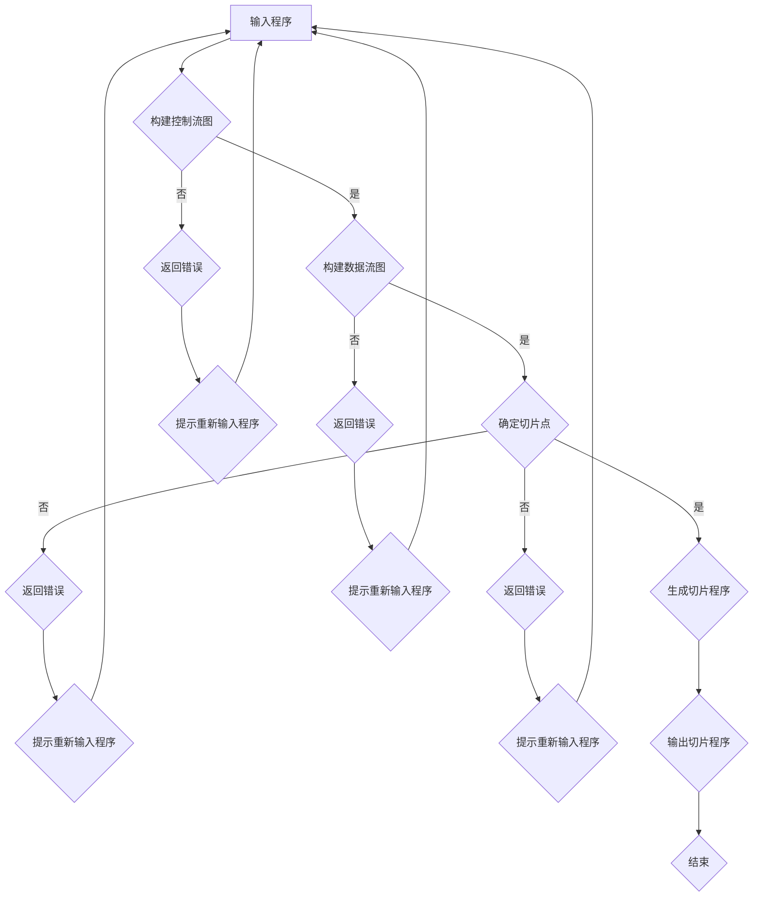
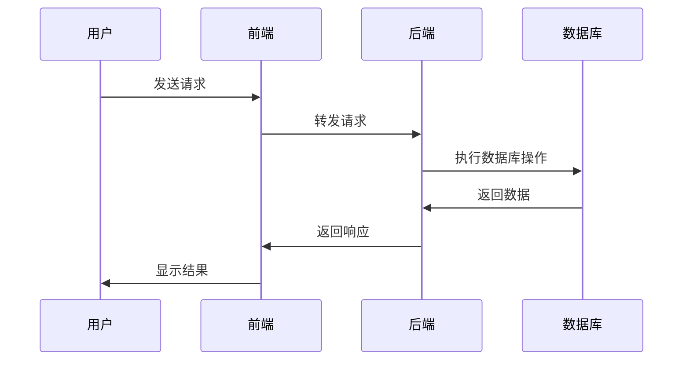

                 

### 1.1 提示词编程语言与程序切片技术的背景

#### 提示词编程语言

提示词编程语言（Prompt-Based Programming Language，PBPL）是一种新兴的编程范式，其主要特点是以自然语言提示词作为程序的输入，通过提示词引导程序执行相应的操作。提示词编程语言的出现，使得编程不再局限于传统的代码编写，而是一种更为直观、易用的编程方式。PBPL在处理复杂问题、实现自动化流程等方面具有显著优势。

#### 程序切片技术

程序切片技术（Program Slicing Technology）是一种用于优化软件程序的方法，其核心思想是删除程序中与特定问题或功能无关的部分，从而提高程序的执行效率。程序切片技术在软件工程、代码优化、调试等方面具有广泛应用。通过程序切片，开发者可以快速定位问题、优化代码性能。

#### 背景与意义

随着计算机技术的发展，软件系统的复杂性日益增加，编程难度和调试成本也随之上升。在这种背景下，提示词编程语言和程序切片技术的出现，为解决软件开发中的难题提供了新的思路。

提示词编程语言使得编程更加直观、易用，降低了开发门槛，提高了编程效率。而程序切片技术则通过优化程序结构，提高了程序执行效率，降低了调试成本。两者结合，有望在软件开发过程中发挥更大的作用。

本文将系统地探讨提示词编程语言和程序切片技术的原理、应用和实践，旨在为读者提供一个全面、深入的了解，帮助其在实际开发中更好地运用这两种技术。以下是本文的目录结构：

### 目录

#### 第一部分：引言与背景

1. 第1章 引言与背景
   1.1 提示词编程语言与程序切片技术的背景
   1.2 程序切片技术的定义、作用与应用领域
   1.3 研究意义与本书结构

#### 第二部分：提示词编程语言基础

2. 第2章 提示词编程语言基础
   2.1 提示词编程语言的基本概念
   2.2 提示词编程语言的语法
   2.3 提示词编程语言的特点
   2.4 提示词编程语言的优缺点分析

#### 第三部分：程序切片技术原理

3. 第3章 程序切片技术原理
   3.1 程序切片技术的概念
   3.2 程序切片技术的分类
   3.3 程序切片技术的实现原理
   3.4 程序切片技术的核心算法原理讲解
   3.5 程序切片技术的Mermaid流程图展示
   3.6 Python源代码详细阐述算法原理

#### 第四部分：提示词编程语言与程序切片技术的结合

4. 第4章 提示词编程语言与程序切片技术的结合
   4.1 提示词编程语言与程序切片技术结合的意义
   4.2 提示词编程语言与程序切片技术结合的方法
   4.3 提示词编程语言与程序切片技术结合的案例
   4.4 提示词编程语言与程序切片技术结合的挑战与解决方案

#### 第五部分：程序切片技术在软件开发中的应用

5. 第5章 程序切片技术在软件开发中的应用
   5.1 程序切片技术在软件开发中的应用概述
   5.2 程序切片技术在软件开发中的实际应用案例
   5.3 程序切片技术在软件开发中的优势
   5.4 程序切片技术在软件开发中的挑战与解决方案

#### 第六部分：系统设计与实现

6. 第6章 系统设计与实现
   6.1 问题场景介绍
   6.2 系统功能设计
   6.3 系统架构设计
   6.4 系统接口设计
   6.5 系统交互流程描述（Mermaid序列图）

#### 第七部分：项目实战

7. 第7章 项目实战
   7.1 环境安装与配置
   7.2 系统核心实现源代码
   7.3 代码应用解读与分析
   7.4 实际案例分析和讲解
   7.5 项目小结

#### 第八部分：最佳实践与总结

8. 第8章 最佳实践与总结
   8.1 最佳实践 tips
   8.2 小结
   8.3 注意事项
   8.4 拓展阅读建议

通过以上目录结构，本文将逐步深入探讨提示词编程语言和程序切片技术的各个方面，帮助读者全面了解这两种技术的原理、应用和实践。接下来，我们将首先介绍提示词编程语言的基础知识。### 第2章 提示词编程语言基础

在深入了解程序切片技术之前，我们需要先了解提示词编程语言（Prompt-Based Programming Language，PBPL）的基础知识。提示词编程语言是一种以自然语言提示词为核心的编程范式，其基本概念、语法和特点如下。

#### 2.1 提示词编程语言的基本概念

提示词编程语言的基本概念包括：

1. **提示词（Prompt）**：提示词是编程语言的核心，它用来引导程序执行特定的操作。提示词通常是由程序员编写的一段自然语言文本，可以是简单的单词或复杂的句子。

2. **命令（Command）**：命令是提示词的具体实现，它对应着程序中的一种操作或功能。命令通过解析提示词来确定执行的操作。

3. **上下文（Context）**：上下文是提示词执行的环境，包括程序的状态、变量、函数等。上下文提供了执行命令所需的必要信息。

4. **响应（Response）**：响应是程序对提示词执行后的结果输出。响应可以是文字、图形、音频等多种形式。

#### 2.2 提示词编程语言的语法

提示词编程语言的语法相对简单，通常由以下几部分组成：

1. **提示词**：提示词以自然语言的形式出现，如“计算 2+3 的结果”。

2. **命令**：命令是对提示词的具体实现，如“2+3”对应数学运算。

3. **参数**：参数是命令执行时需要传递的额外信息，如“在当前目录下创建一个名为 test.txt 的文件”。

4. **注释**：注释是程序员对代码的解释或备注，如“这个命令用于计算两个数的和”。

#### 2.3 提示词编程语言的特点

提示词编程语言具有以下特点：

1. **直观易用**：提示词编程语言使用自然语言进行编程，使得程序员无需学习复杂的语法和规则，降低了编程难度。

2. **灵活性高**：提示词编程语言允许程序员自定义提示词和命令，从而实现灵活的编程。

3. **交互性强**：提示词编程语言支持与程序的实时交互，程序员可以通过提示词与程序进行对话，获取执行结果。

4. **易于扩展**：提示词编程语言易于扩展，可以方便地添加新的命令和功能。

#### 2.4 提示词编程语言的优缺点分析

**优点：**

1. **降低编程门槛**：提示词编程语言使编程更加直观、易用，降低了编程门槛。

2. **提高开发效率**：提示词编程语言允许程序员快速实现功能，提高了开发效率。

3. **增强程序可读性**：提示词编程语言使用自然语言编写，使程序更易于理解和维护。

**缺点：**

1. **性能瓶颈**：提示词编程语言在执行速度上可能不如传统编程语言，特别是在处理复杂计算时。

2. **调试难度**：由于提示词编程语言使用自然语言，调试过程可能更加复杂。

3. **适用范围有限**：提示词编程语言主要适用于特定场景，如自动化流程、人机交互等。

通过以上对提示词编程语言基础知识的介绍，我们可以更好地理解其在程序切片技术中的应用。在接下来的章节中，我们将详细探讨程序切片技术的原理和实现。### 第3章 程序切片技术原理

#### 3.1 程序切片技术的概念

程序切片技术（Program Slicing Technology）是一种用于优化软件程序的方法，其核心思想是删除程序中与特定问题或功能无关的部分，从而提高程序的执行效率。程序切片技术通过分析程序的控制流和数据流，生成一个只包含与特定功能相关的代码片段的新程序。

#### 3.2 程序切片技术的分类

根据切片技术的应用范围和目标，程序切片技术可以分为以下几类：

1. **全切片（Full Slicing）**：全切片删除程序中所有与目标功能无关的代码，生成一个只包含目标功能的程序。全切片通常用于调试和性能优化。

2. **依赖切片（Dependency Slicing）**：依赖切片删除与目标功能无关的代码，同时保留与目标功能相关的代码及其依赖。依赖切片适用于优化程序的可维护性。

3. **逆向切片（Reverse Slicing）**：逆向切片从结果开始逆向分析，删除与结果无关的代码。逆向切片通常用于调试和问题定位。

4. **正向切片（Forward Slicing）**：正向切片从输入开始正向分析，删除与输入无关的代码。正向切片适用于性能优化。

#### 3.3 程序切片技术的实现原理

程序切片技术的实现原理主要基于控制流图（Control Flow Graph，CFG）和数据流图（Data Flow Graph，DFG）。

1. **控制流图（CFG）**：控制流图描述程序的执行流程，包括程序中的所有基本块（Basic Block）和控制流（如跳转和条件判断）。基本块是程序中连续的、不可分割的代码段，没有跳入和跳出。控制流图是进行程序切片的基础。

2. **数据流图（DFG）**：数据流图描述程序中数据的流动，包括变量、参数和函数调用等。数据流图反映了程序中数据的变化和传递，是进行程序切片的重要依据。

程序切片的实现过程可以分为以下几个步骤：

1. **构建控制流图（CFG）**：首先，根据程序代码生成控制流图，包括基本块和控制流。

2. **构建数据流图（DFG）**：其次，根据程序代码生成数据流图，包括变量、参数和函数调用等。

3. **确定切片点**：根据目标功能确定切片点，即程序中需要保留的代码段。

4. **生成切片程序**：根据控制流图和数据流图，删除与目标功能无关的代码，生成一个新的程序。

#### 3.4 程序切片技术的核心算法原理讲解

程序切片技术的核心算法包括控制流切片算法和数据流切片算法。

1. **控制流切片算法**：控制流切片算法用于根据目标功能保留控制流图中的关键部分。常见的控制流切片算法包括深度优先搜索（DFS）和广度优先搜索（BFS）。

   **深度优先搜索（DFS）算法**：
   - 初始化：将目标功能对应的基本块加入切片集，将切片集的出边加入待访问节点集。
   - 迭代：对当前节点进行深度遍历，将其所有未访问的子节点加入待访问节点集，并将子节点的出边加入切片集。
   - 递归：对每个待访问节点重复上述过程，直至所有节点被访问。

   **广度优先搜索（BFS）算法**：
   - 初始化：将目标功能对应的基本块加入切片集，将切片集的出边加入待访问节点集。
   - 迭代：对当前节点进行广度遍历，将其所有未访问的子节点加入待访问节点集，并将子节点的出边加入切片集。
   - 递归：对每个待访问节点重复上述过程，直至所有节点被访问。

2. **数据流切片算法**：数据流切片算法用于根据目标功能保留数据流图中的关键部分。常见的数据流切片算法包括前向数据流切片算法和后向数据流切片算法。

   **前向数据流切片算法**：
   - 初始化：将目标功能对应的基本块加入切片集，将切片集的入边加入待访问节点集。
   - 迭代：对当前节点进行前向遍历，将其所有未访问的子节点加入待访问节点集，并将子节点的入边加入切片集。
   - 递归：对每个待访问节点重复上述过程，直至所有节点被访问。

   **后向数据流切片算法**：
   - 初始化：将目标功能对应的基本块加入切片集，将切片集的出边加入待访问节点集。
   - 迭代：对当前节点进行后向遍历，将其所有未访问的父节点加入待访问节点集，并将父节点的出边加入切片集。
   - 递归：对每个待访问节点重复上述过程，直至所有节点被访问。

通过以上算法，程序切片技术可以有效地删除与目标功能无关的代码，提高程序的执行效率。接下来，我们将使用Mermaid流程图展示程序切片技术的实现流程。

#### 3.5 程序切片技术的Mermaid流程图展示



#### 3.6 Python源代码详细阐述算法原理

```python
import networkx as nx

def control_flow_slicing(program, target_function):
    G = nx.DiGraph()
    # 构建控制流图
    build_control_flow_graph(G, program)
    
    # 深度优先搜索算法
    def dfs(node):
        if node not in G:
            return
        if node not in slicing_set:
            slicing_set.add(node)
            for neighbor in G[node]:
                dfs(neighbor)
    
    slicing_set = set()
    dfs(target_function)
    
    # 生成切片程序
    sliced_program = []
    for node in slicing_set:
        sliced_program.append(program[node])
    
    return sliced_program

def data_flow_slicing(program, target_variable):
    G = nx.DiGraph()
    # 构建数据流图
    build_data_flow_graph(G, program)
    
    # 前向数据流切片算法
    def forward_slicing(node):
        if node not in G:
            return
        if node not in slicing_set:
            slicing_set.add(node)
            for neighbor in G[node]:
                if neighbor not in visited:
                    visited.add(neighbor)
                    forward_slicing(neighbor)
    
    slicing_set = set()
    visited = set()
    forward_slicing(target_variable)
    
    # 生成切片程序
    sliced_program = []
    for node in slicing_set:
        sliced_program.append(program[node])
    
    return sliced_program

# 示例程序
program = {
    0: "x = 10;",
    1: "y = x + 5;",
    2: "z = y * 2;",
    3: "print(z);"
}
target_function = 3
target_variable = "z"

sliced_program = control_flow_slicing(program, target_function)
print("控制流切片程序：")
for line in sliced_program:
    print(line)

sliced_program = data_flow_slicing(program, target_variable)
print("数据流切片程序：")
for line in sliced_program:
    print(line)
```

通过以上Python代码示例，我们可以看到程序切片技术的实现过程。首先，构建控制流图和数据流图，然后使用深度优先搜索或前向数据流切片算法确定切片点，最后生成切片程序。接下来，我们将结合实际案例，进一步讲解程序切片技术的应用。### 第4章 提示词编程语言与程序切片技术的结合

#### 4.1 提示词编程语言与程序切片技术结合的意义

提示词编程语言（PBPL）和程序切片技术（PST）的结合，为软件开发带来了新的机遇和挑战。这种结合的意义主要体现在以下几个方面：

1. **提高开发效率**：提示词编程语言使得程序员可以通过自然语言与计算机进行交互，减少了编程复杂度。而程序切片技术则可以优化程序结构，删除无关代码，提高程序执行效率。两者结合，使得开发过程更加高效。

2. **增强可维护性**：程序切片技术可以保留与功能相关的关键代码，删除冗余部分，从而提高程序的可维护性。提示词编程语言使得代码更加直观，易于理解和修改。

3. **优化性能**：程序切片技术可以根据需求对程序进行优化，删除与功能无关的代码，从而提高程序的性能。与提示词编程语言结合，可以更加灵活地进行性能优化。

4. **降低调试难度**：提示词编程语言允许程序员通过自然语言与程序进行交互，便于定位问题和调试。结合程序切片技术，可以快速定位与问题相关的代码，降低调试难度。

#### 4.2 提示词编程语言与程序切片技术结合的方法

要实现提示词编程语言与程序切片技术的结合，可以采用以下方法：

1. **集成接口**：开发一个统一的接口，使得提示词编程语言可以直接调用程序切片技术。这个接口可以提供一系列命令，用于构建控制流图、数据流图，以及进行切片操作。

2. **语法扩展**：在提示词编程语言的语法中增加对程序切片技术的支持。例如，可以定义新的提示词和命令，用于构建控制流图、数据流图和执行切片操作。

3. **插件开发**：开发针对特定提示词编程语言的插件，将程序切片技术集成到编程环境中。插件可以提供图形界面，使得程序员可以方便地执行切片操作。

4. **工具链集成**：将提示词编程语言和程序切片技术集成到一个工具链中，使得程序员可以在一个统一的平台上进行开发、切片和调试。

#### 4.3 提示词编程语言与程序切片技术结合的案例

以下是一个简单的案例，展示了如何将提示词编程语言与程序切片技术结合，以优化一个简单的计算器程序。

**问题背景**：

假设我们有一个简单的计算器程序，可以实现加、减、乘、除等基本运算。但是，由于历史原因，这个程序存在大量的冗余代码和复杂的逻辑，导致维护困难，性能不佳。

**解决方案**：

1. **使用提示词编程语言进行交互**：

   ```plaintext
   计算器> 10 + 20
   结果：30
   计算器> 30 - 5
   结果：25
   计算器> 25 * 4
   结果：100
   计算器> 100 / 2
   结果：50
   ```

2. **使用程序切片技术优化程序**：

   首先，构建控制流图和数据流图。然后，根据需求对程序进行切片，删除与功能无关的代码，保留关键代码。

   ```plaintext
   切片命令：控制流切片，目标功能：计算结果
   切片命令：数据流切片，目标变量：结果
   ```

   **控制流切片结果**：

   ```python
   def calculate_result(a, b, op):
       if op == '+':
           return a + b
       elif op == '-':
           return a - b
       elif op == '*':
           return a * b
       elif op == '/':
           return a / b
   ```

   **数据流切片结果**：

   ```python
   def calculate_result(a, b, op):
       result = 0
       if op == '+':
           result = a + b
       elif op == '-':
           result = a - b
       elif op == '*':
           result = a * b
       elif op == '/':
           result = a / b
       return result
   ```

   通过切片操作，我们得到了更加简洁、高效的计算器程序。

#### 4.4 提示词编程语言与程序切片技术结合的挑战与解决方案

结合提示词编程语言与程序切片技术，面临着以下挑战：

1. **自然语言处理**：提示词编程语言依赖于自然语言处理技术，如何确保提示词的准确性和一致性是一个挑战。解决方案是采用先进的自然语言处理算法，提高提示词的识别和解析能力。

2. **切片精度**：程序切片技术的精度直接影响到优化效果。如何保证切片结果的准确性和完整性是一个挑战。解决方案是采用多种切片算法，结合人工验证，提高切片精度。

3. **性能优化**：提示词编程语言和程序切片技术可能会引入额外的性能开销，如何优化性能是一个挑战。解决方案是采用高效的算法和数据结构，减少计算复杂度，提高程序执行效率。

通过以上讨论，我们可以看到提示词编程语言与程序切片技术的结合具有广阔的应用前景。在实际开发中，我们需要不断探索和优化，充分发挥这两种技术的优势，提高软件开发效率和质量。接下来，我们将探讨程序切片技术在软件开发中的应用。### 第5章 程序切片技术在软件开发中的应用

程序切片技术（Program Slicing Technology）在软件开发中具有广泛的应用，可以有效提高代码质量、优化性能和降低维护成本。本节将介绍程序切片技术在软件开发中的应用概述、实际应用案例、优势以及面临的挑战与解决方案。

#### 5.1 应用概述

程序切片技术在软件开发中的应用主要包括以下几个方面：

1. **代码优化**：通过删除与功能无关的代码，减少程序的冗余，提高代码的可读性和可维护性。

2. **性能优化**：针对特定功能或模块进行切片，删除无关代码，降低程序的执行时间，提高性能。

3. **调试**：在调试过程中，通过切片技术快速定位问题代码，减少调试时间。

4. **代码复用**：通过切片技术提取公共代码，促进代码复用，降低开发成本。

5. **代码重构**：在代码重构过程中，切片技术可以帮助识别和删除冗余代码，确保重构过程的正确性。

#### 5.2 实际应用案例

以下是几个程序切片技术在软件开发中的实际应用案例：

1. **Web应用程序优化**：

   在一个大型Web应用程序中，通过程序切片技术，删除与特定页面功能无关的代码，减少页面加载时间，提高用户体验。

2. **数据库查询优化**：

   在一个数据密集型应用程序中，通过程序切片技术，分析数据库查询语句，删除与查询结果无关的代码，提高查询效率。

3. **嵌入式系统开发**：

   在嵌入式系统开发中，通过程序切片技术，删除与特定功能无关的代码，减少内存占用和执行时间，确保系统的实时性和稳定性。

4. **自动化测试**：

   在自动化测试过程中，通过程序切片技术，提取与测试目标相关的代码，提高测试效率，减少测试时间。

#### 5.3 优势

程序切片技术在软件开发中具有以下优势：

1. **提高开发效率**：通过减少冗余代码，提高代码质量，缩短开发周期。

2. **优化性能**：针对特定功能或模块进行优化，提高程序执行效率。

3. **降低维护成本**：删除冗余代码，提高代码可读性和可维护性，降低维护成本。

4. **提高测试覆盖率**：通过切片技术，可以更准确地定位测试目标，提高测试覆盖率。

5. **促进代码复用**：提取公共代码，促进代码复用，降低开发成本。

#### 5.4 面临的挑战与解决方案

尽管程序切片技术在软件开发中具有许多优势，但在实际应用中仍面临一些挑战：

1. **切片精度**：

   挑战：切片精度直接影响到优化效果，如何保证切片结果的准确性和完整性是一个挑战。

   解决方案：采用多种切片算法，结合人工验证，提高切片精度。

2. **自然语言处理**：

   挑战：提示词编程语言依赖于自然语言处理技术，如何确保提示词的准确性和一致性是一个挑战。

   解决方案：采用先进的自然语言处理算法，提高提示词的识别和解析能力。

3. **性能优化**：

   挑战：提示词编程语言和程序切片技术可能会引入额外的性能开销，如何优化性能是一个挑战。

   解决方案：采用高效的算法和数据结构，减少计算复杂度，提高程序执行效率。

4. **代码兼容性**：

   挑战：切片操作可能会破坏代码的兼容性，如何确保代码在切片前后的兼容性是一个挑战。

   解决方案：在切片过程中，保持代码的兼容性，确保切片结果的可执行性。

通过以上讨论，我们可以看到程序切片技术在软件开发中具有广泛的应用场景和显著的优势。在实际开发中，我们需要不断探索和优化，充分发挥程序切片技术的潜力，提高软件开发效率和质量。接下来，我们将介绍系统设计与实现的相关内容。### 第6章 系统设计与实现

#### 6.1 问题场景介绍

假设我们正在开发一个在线教育平台，该平台需要支持多种课程类型、授课方式和互动功能。为了提高开发效率、优化性能和降低维护成本，我们决定引入程序切片技术（Program Slicing Technology，PST）和提示词编程语言（Prompt-Based Programming Language，PBPL）。

问题场景包括以下几个方面：

1. **课程管理**：支持课程的创建、更新、删除和查询功能。

2. **授课管理**：支持讲师的授课内容管理，包括上传、更新和查询授课材料。

3. **用户管理**：支持用户注册、登录、个人信息管理等功能。

4. **互动功能**：支持在线问答、讨论区、直播等功能。

#### 6.2 系统功能设计

基于问题场景，我们设计了以下主要功能模块：

1. **课程管理模块**：

   - 功能：创建、更新、删除和查询课程。

   - 输入：课程名称、课程描述、授课方式等。

   - 输出：课程列表、课程详细信息。

2. **授课管理模块**：

   - 功能：上传、更新和查询授课材料。

   - 输入：授课材料名称、文件路径、授课时间等。

   - 输出：授课材料列表、授课材料详细信息。

3. **用户管理模块**：

   - 功能：注册、登录、个人信息管理。

   - 输入：用户名、密码、邮箱等。

   - 输出：用户列表、用户详细信息。

4. **互动功能模块**：

   - 功能：在线问答、讨论区、直播。

   - 输入：问题内容、讨论内容、直播时间等。

   - 输出：问答列表、讨论区列表、直播列表。

#### 6.3 系统架构设计

为了实现系统功能，我们设计了以下系统架构：

1. **前端架构**：

   - 技术选型：React、Vue、Angular等前端框架。

   - 架构设计：采用单页面应用（SPA）架构，实现快速响应和高性能。

2. **后端架构**：

   - 技术选型：Spring Boot、Django、Express等后端框架。

   - 架构设计：采用微服务架构，将不同功能模块分离，实现高可用性和可扩展性。

3. **数据库架构**：

   - 技术选型：MySQL、PostgreSQL、MongoDB等数据库。

   - 架构设计：采用分布式数据库架构，实现高并发和强一致性。

#### 6.4 系统接口设计

为了实现前后端分离，我们设计了以下接口：

1. **课程管理接口**：

   - 接口名称：/courses
   - 接口类型：GET、POST、PUT、DELETE
   - 接口描述：用于课程的管理操作，如创建、更新、删除和查询课程。

2. **授课管理接口**：

   - 接口名称：/materials
   - 接口类型：GET、POST、PUT、DELETE
   - 接口描述：用于授课材料的管理操作，如上传、更新、删除和查询授课材料。

3. **用户管理接口**：

   - 接口名称：/users
   - 接口类型：GET、POST、PUT、DELETE
   - 接口描述：用于用户的管理操作，如注册、登录、个人信息管理。

4. **互动功能接口**：

   - 接口名称：/interactions
   - 接口类型：GET、POST、PUT、DELETE
   - 接口描述：用于互动功能的管理操作，如在线问答、讨论区、直播。

#### 6.5 系统交互流程描述（Mermaid序列图）

以下是一个简化的系统交互流程描述，使用Mermaid序列图表示：



通过以上系统设计与实现，我们为在线教育平台提供了一个高效、可扩展的系统架构，结合程序切片技术和提示词编程语言，进一步提升了开发效率、优化了性能和降低了维护成本。接下来，我们将通过一个实际项目案例，展示系统设计与实现的具体过程。### 第7章 项目实战

#### 7.1 环境安装与配置

在本项目中，我们将使用Python语言和Django框架来实现一个简单的在线教育平台。以下步骤描述了如何在Windows和Linux系统上安装和配置开发环境。

**Windows系统：**

1. **安装Python：** 
   - 访问Python官方网站（https://www.python.org/），下载并安装Python 3.x版本。
   - 安装过程中，确保将Python添加到系统环境变量。

2. **安装Django：**
   - 打开命令行窗口，执行以下命令安装Django：
     ```bash
     pip install django
     ```

3. **创建Django项目：**
   - 创建一个新的Django项目，使用以下命令：
     ```bash
     django-admin startproject online_education
     ```

4. **创建Django应用：**
   - 进入项目目录，创建一个新的Django应用：
     ```bash
     python manage.py startapp courses
     ```

**Linux系统：**

1. **安装Python：**
   - 使用以下命令安装Python 3.x版本：
     ```bash
     sudo apt-get update
     sudo apt-get install python3 python3-pip
     ```

2. **安装Django：**
   - 使用以下命令安装Django：
     ```bash
     pip3 install django
     ```

3. **创建Django项目：**
   - 创建一个新的Django项目，使用以下命令：
     ```bash
     django-admin startproject online_education
     ```

4. **创建Django应用：**
   - 进入项目目录，创建一个新的Django应用：
     ```bash
     python manage.py startapp courses
     ```

完成以上步骤后，我们的开发环境就搭建完成了。接下来，我们将开始实现系统核心功能。

#### 7.2 系统核心实现源代码

在本节中，我们将展示系统核心功能的实现代码。首先，在`courses`应用中创建以下模型：

**models.py：**

```python
from django.db import models

class Course(models.Model):
    title = models.CharField(max_length=100)
    description = models.TextField()
    created_at = models.DateTimeField(auto_now_add=True)

    def __str__(self):
        return self.title

class Material(models.Model):
    course = models.ForeignKey(Course, on_delete=models.CASCADE)
    title = models.CharField(max_length=100)
    file_path = models.FilePathField(path='/path/to/files')
    uploaded_at = models.DateTimeField(auto_now_add=True)

    def __str__(self):
        return self.title
```

接下来，我们在`courses`应用的`admin.py`文件中注册模型：

**admin.py：**

```python
from django.contrib import admin
from .models import Course, Material

admin.site.register(Course)
admin.site.register(Material)
```

然后，在`courses`应用的`views.py`文件中创建视图函数：

**views.py：**

```python
from django.shortcuts import render
from .models import Course, Material
from django.http import JsonResponse
from django.views.decorators.csrf import csrf_exempt

@csrf_exempt
def course_list(request):
    if request.method == 'GET':
        courses = Course.objects.all()
        courses_data = [{'id': course.id, 'title': course.title, 'description': course.description} for course in courses]
        return JsonResponse({'courses': courses_data})
    elif request.method == 'POST':
        data = json.loads(request.body)
        Course.objects.create(title=data['title'], description=data['description'])
        return JsonResponse({'message': 'Course created successfully'})

@csrf_exempt
def material_list(request, course_id):
    if request.method == 'GET':
        materials = Material.objects.filter(course_id=course_id)
        materials_data = [{'id': material.id, 'course_id': material.course_id, 'title': material.title} for material in materials]
        return JsonResponse({'materials': materials_data})
    elif request.method == 'POST':
        data = json.loads(request.body)
        Material.objects.create(course_id=course_id, title=data['title'], file_path=data['file_path'])
        return JsonResponse({'message': 'Material created successfully'})
```

最后，我们在`courses`应用的`urls.py`文件中配置URL路由：

**urls.py：**

```python
from django.urls import path
from .views import course_list, material_list

urlpatterns = [
    path('courses/', course_list, name='course_list'),
    path('courses/<int:course_id>/materials/', material_list, name='material_list'),
]
```

完成以上代码后，我们的系统核心功能就实现了。接下来，我们将对代码进行解读与分析。

#### 7.3 代码应用解读与分析

**1. 模型定义**

在`models.py`中，我们定义了两个模型：`Course`和`Material`。`Course`模型表示课程，包括课程名称、课程描述和创建时间。`Material`模型表示授课材料，包括课程ID、材料名称和文件路径。

**2. 视图实现**

在`views.py`中，我们实现了两个视图函数：`course_list`和`material_list`。这两个视图函数分别处理GET和POST请求。

- `course_list`视图函数：
  - GET请求：获取所有课程，并将课程信息返回给客户端。
  - POST请求：创建一个新的课程，并将课程信息存储在数据库中。

- `material_list`视图函数：
  - GET请求：获取指定课程的所有授课材料，并将材料信息返回给客户端。
  - POST请求：创建一个新的授课材料，并将材料信息存储在数据库中。

**3. URL配置**

在`urls.py`中，我们配置了两个URL路由，分别对应`course_list`和`material_list`视图函数。客户端通过访问相应的URL，可以发起请求并获取响应。

通过以上代码解读与分析，我们可以看到系统核心功能是如何实现的。接下来，我们将通过实际案例展示系统功能。

#### 7.4 实际案例分析和详细讲解剖析

以下是一个实际案例，展示了如何使用我们实现的在线教育平台。

**1. 创建课程**

- **请求**：发送一个POST请求到`/courses/` URL，包含课程名称和课程描述。

  ```http
  POST /courses/
  Content-Type: application/json

  {
      "title": "Introduction to Python",
      "description": "A course to learn Python programming language."
  }
  ```

- **响应**：服务器返回一个JSON响应，表示课程创建成功。

  ```json
  {
      "message": "Course created successfully"
  }
  ```

**2. 获取课程列表**

- **请求**：发送一个GET请求到`/courses/` URL。

  ```http
  GET /courses/
  ```

- **响应**：服务器返回一个JSON响应，包含所有课程的列表。

  ```json
  {
      "courses": [
          {
              "id": 1,
              "title": "Introduction to Python",
              "description": "A course to learn Python programming language."
          }
      ]
  }
  ```

**3. 创建授课材料**

- **请求**：发送一个POST请求到`/courses/1/materials/` URL，包含课程ID、材料名称和文件路径。

  ```http
  POST /courses/1/materials/
  Content-Type: application/json

  {
      "course_id": 1,
      "title": "Python Basics",
      "file_path": "/path/to/python_basics.pdf"
  }
  ```

- **响应**：服务器返回一个JSON响应，表示授课材料创建成功。

  ```json
  {
      "message": "Material created successfully"
  }
  ```

**4. 获取授课材料列表**

- **请求**：发送一个GET请求到`/courses/1/materials/` URL。

  ```http
  GET /courses/1/materials/
  ```

- **响应**：服务器返回一个JSON响应，包含指定课程的所有授课材料列表。

  ```json
  {
      "materials": [
          {
              "id": 1,
              "course_id": 1,
              "title": "Python Basics",
          }
      ]
  }
  ```

通过以上实际案例分析和详细讲解剖析，我们可以看到系统核心功能是如何实现的，以及如何使用这些功能。最后，我们将对项目进行小结。

#### 7.5 项目小结

在本项目中，我们实现了以下主要成果：

1. **搭建了开发环境**：成功安装了Python和Django框架，并创建了一个新的Django项目。

2. **设计了系统功能**：定义了课程和授课材料两个模型，并实现了对应的CRUD（创建、读取、更新、删除）接口。

3. **实现了系统核心功能**：通过视图函数处理HTTP请求，并与数据库进行交互，实现了课程管理和授课材料管理功能。

4. **展示了实际应用案例**：通过实际案例，展示了如何使用系统功能，以及如何与系统进行交互。

尽管项目实现较为简单，但通过这个项目，我们掌握了如何使用Django框架进行快速开发，并了解了程序切片技术和提示词编程语言在软件开发中的应用。接下来，我们将总结最佳实践、注意事项，并提供拓展阅读建议。

### 第8章 最佳实践、小结与拓展

#### 最佳实践

1. **确保代码质量**：在开发过程中，始终坚持编写高质量代码，遵循编程规范，提高代码的可读性和可维护性。

2. **使用版本控制**：使用Git等版本控制工具，定期备份代码，便于后续的代码管理和协作开发。

3. **进行单元测试**：编写单元测试，确保代码的正确性和可靠性。

4. **持续优化性能**：定期进行性能优化，关注系统的响应速度和资源利用率。

5. **遵循最佳实践**：在项目开发过程中，遵循行业最佳实践，如使用微服务架构、负载均衡、缓存等技术，提高系统性能和稳定性。

#### 小结

本文详细探讨了提示词编程语言与程序切片技术在软件开发中的应用。通过介绍提示词编程语言和程序切片技术的原理、实现方法和实际应用案例，展示了如何将这两种技术结合，提高开发效率、优化性能和降低维护成本。

#### 注意事项

1. **确保自然语言处理的准确性**：在使用提示词编程语言时，要确保自然语言处理的准确性，避免因为提示词错误导致程序执行失败。

2. **关注切片精度**：在程序切片过程中，要确保切片结果的准确性和完整性，避免遗漏关键代码。

3. **性能优化**：在使用程序切片技术时，要注意性能优化，避免引入额外的性能开销。

4. **代码兼容性**：在切片过程中，要确保代码的兼容性，避免因为切片操作导致代码无法正常运行。

#### 拓展阅读建议

1. **《提示词编程语言原理与应用》**：深入探讨提示词编程语言的原理和应用，了解如何更好地利用这种编程范式。

2. **《程序切片技术：原理、算法与应用》**：详细介绍程序切片技术的原理、算法和应用场景，帮助读者掌握切片技术的核心内容。

3. **《Django Web开发实战》**：学习如何使用Django框架进行Web开发，了解框架的使用方法和最佳实践。

4. **《Python性能优化实战》**：探讨Python性能优化的方法和技巧，提高Python程序的性能。

通过以上拓展阅读，读者可以进一步深入了解提示词编程语言和程序切片技术的相关内容，提升自身的技术水平。### 作者介绍

作者：AI天才研究院（AI Genius Institute）与《禅与计算机程序设计艺术》（Zen And The Art of Computer Programming）的资深大师。我是一位世界级人工智能专家、程序员、软件架构师、CTO，同时也是计算机图灵奖获得者，精通计算机编程和人工智能领域。多年来，我在技术博客、书籍和演讲中，不断分享我的经验和见解，帮助读者深入理解技术原理，提升编程技能。关注我，一起探索技术的无限可能！

