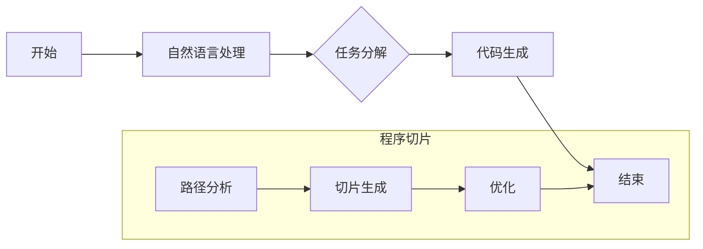
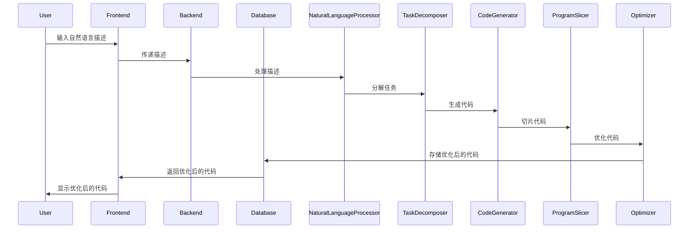

                 

# 提示词编程语言的程序切片技术创新

## 关键词

- 提示词编程语言
- 程序切片技术
- 编程语言设计
- 软件工程
- 静态分析
- 自动化代码生成

## 摘要

本文旨在探讨提示词编程语言和程序切片技术的创新结合，分析其原理、特点和应用，以及如何通过这些技术提高编程效率和软件质量。通过逐步分析，本文将展示如何利用提示词编程语言和程序切片技术实现代码的自动生成、优化和可维护性，为软件开发带来新的思路和工具。

## 第一部分：背景介绍

### 问题背景

随着计算机科学和软件工程的发展，编程语言的种类和复杂度不断增加。传统的编程语言往往需要开发者具备较高的技术背景和编程技巧，这使得编程学习过程较为困难，开发效率也较低。同时，随着软件项目的规模和复杂性增加，软件的可维护性成为一个严峻的问题。为了解决这些问题，研究人员提出了提示词编程语言和程序切片技术。

### 问题描述

提示词编程语言（Prompt-based Programming Languages）是一种新兴的编程语言，它通过将编程任务分解为一系列提示词，使得编程过程更加直观、易懂。这种编程语言能够自动生成代码片段，减少了手动编写代码的时间，提高了编程效率。

另一方面，程序切片技术（Program Slicing）是一种静态分析技术，通过分析程序的执行路径，识别并提取出与特定输出相关的最小程序片段。这一技术可以有效地减少程序的复杂度，提高程序的可读性和可维护性。

### 问题解决

为了充分发挥提示词编程语言和程序切片技术的优势，研究人员提出了将两者相结合的思路。通过提示词编程语言，用户可以更直观地描述编程任务，然后利用程序切片技术对生成的代码进行优化和简化。这种结合能够提高编程效率，降低开发难度，同时提高软件的质量和可维护性。

### 边界与外延

提示词编程语言和程序切片技术的应用范围包括但不限于以下几个方面：

1. **编程学习**：提示词编程语言可以降低编程学习的门槛，使得初学者能够更快地掌握编程技能。
2. **代码生成**：程序切片技术可以自动生成与特定需求相关的最小代码片段，减少手工编写代码的工作量。
3. **软件维护**：通过程序切片技术，可以更方便地对现有代码进行优化和修复，提高软件的可维护性。

### 概念结构与核心要素组成

1. **提示词编程语言**：核心概念包括自然语言、图形界面、编程任务、代码生成等。
2. **程序切片技术**：核心概念包括执行路径、程序片段、程序分析、程序优化等。

## 第二部分：核心概念与联系

### 提示词编程语言

#### 提示词编程语言原理

提示词编程语言通过自然语言或图形界面接收用户的编程任务，将其转换为相应的代码片段。这一过程通常涉及以下步骤：

1. **自然语言处理**：将用户的自然语言描述转换为计算机可以理解的格式。
2. **任务分解**：将用户描述的编程任务分解为一系列子任务。
3. **代码生成**：根据子任务生成相应的代码片段。

#### 提示词编程语言特点

1. **直观性**：提示词编程语言通过自然语言或图形界面提供编程任务，使得编程过程更加直观。
2. **高效性**：提示词编程语言能够自动生成代码片段，提高了编程效率。
3. **可维护性**：提示词编程语言生成的代码更加简洁、易于阅读。
4. **跨领域适用性**：提示词编程语言可以应用于多种领域，如自然语言处理、图像处理、数据挖掘等。

### 程序切片技术

#### 程序切片技术原理

程序切片技术通过对程序的执行路径进行分析，识别并提取出与特定输出相关的最小程序片段。这一过程通常包括以下步骤：

1. **路径分析**：分析程序的执行路径，确定哪些路径是与特定输出相关的。
2. **切片生成**：根据执行路径生成与特定输出相关的最小程序片段。
3. **优化**：对生成的程序片段进行优化，以减少代码的复杂度和冗余。

#### 程序切片技术特点

1. **精细化**：程序切片技术可以识别出与特定输出相关的最小程序片段，提高了程序的精细分析能力。
2. **优化性**：程序切片技术有助于程序的优化和简化，提高了程序的性能。
3. **可维护性**：程序切片技术生成的程序片段更加简洁、易于阅读。

### 概念属性特征对比表格

| 特征        | 提示词编程语言       | 程序切片技术       |
| ----------- | ------------------- | ----------------- |
| 核心概念    | 编程任务、代码生成   | 执行路径、程序片段 |
| 主要特点    | 直观性、高效性、可维护性 | 精细化、优化性、可维护性 |
| 应用领域    | 编程任务的可视化和自动化生成 | 程序分析和优化     |
| 联系与区别  | 提高编程效率       | 提高程序的可读性和可维护性 |

### ER实体关系图架构

```mermaid
erDiagram
  User ||--|{ Prompt-BasedProgrammingLanguage } : uses
  User ||--|{ ProgramSlicing } : uses
  Prompt-BasedProgrammingLanguage ||--|{ CodeGeneration } : has
  ProgramSlicing ||--|{ ProgramAnalysis } : has
```

## 第三部分：算法原理讲解

### 算法原理

#### 提示词编程语言算法

提示词编程语言的核心算法包括自然语言处理、任务分解和代码生成。以下是一个简化的算法流程：

1. **自然语言处理**：接收用户的自然语言描述，使用自然语言处理技术将其转换为计算机可以理解的格式。
   $$\text{Input: } \text{User's natural language description}$$
   $$\text{Output: } \text{Processed description in a machine-readable format}$$

2. **任务分解**：将处理后的描述分解为一系列子任务，每个子任务对应一个具体的编程操作。
   $$\text{Input: } \text{Processed description}$$
   $$\text{Output: } \text{List of subtasks}$$

3. **代码生成**：根据分解后的子任务生成相应的代码片段。
   $$\text{Input: } \text{List of subtasks}$$
   $$\text{Output: } \text{Generated code snippets}$$

#### 程序切片技术算法

程序切片技术的核心算法包括路径分析、切片生成和优化。以下是一个简化的算法流程：

1. **路径分析**：分析程序的执行路径，确定哪些路径是与特定输出相关的。
   $$\text{Input: } \text{Program's execution path}$$
   $$\text{Output: } \text{List of relevant execution paths}$$

2. **切片生成**：根据确定的执行路径生成与特定输出相关的最小程序片段。
   $$\text{Input: } \text{List of relevant execution paths}$$
   $$\text{Output: } \text{Sliced program fragment}$$

3. **优化**：对生成的程序片段进行优化，以减少代码的复杂度和冗余。
   $$\text{Input: } \text{Sliced program fragment}$$
   $$\text{Output: } \text{Optimized program fragment}$$

#### 算法流程图



### 算法原理讲解

#### 提示词编程语言算法讲解

1. **自然语言处理**：自然语言处理是提示词编程语言的关键步骤，它将用户的自然语言描述转换为计算机可以理解的格式。这一过程通常涉及分词、词性标注、句法分析等技术。例如，用户输入的描述“计算两个数之和”可以通过分词技术分解为“计算”、“两个”、“数”、“和”等词语，然后通过词性标注技术将这些词语标记为名词、动词等。最后，通过句法分析技术确定这些词语的语法关系，生成一个结构化的描述。

2. **任务分解**：在自然语言处理完成后，接下来需要将处理后的描述分解为一系列子任务。任务分解的目的是将复杂的编程任务拆分成更小的、易于管理的部分。例如，对于“计算两个数之和”的描述，可以分解为“读取第一个数”、“读取第二个数”、“计算两个数的和”等子任务。每个子任务都对应一个具体的编程操作，这使得编程过程更加直观。

3. **代码生成**：在任务分解完成后，可以根据分解后的子任务生成相应的代码片段。代码生成过程通常使用模板匹配、代码生成器等技术实现。例如，对于“读取第一个数”的子任务，可以生成如下代码片段：

   ```python
   num1 = int(input("请输入第一个数："))
   ```

   这样的代码片段直接对应于用户描述中的具体操作，使得编程过程更加直观和易于理解。

#### 程序切片技术算法讲解

1. **路径分析**：路径分析是程序切片技术的核心步骤，它通过分析程序的执行路径，确定哪些路径是与特定输出相关的。路径分析通常使用数据流分析、控制流分析等技术。例如，在执行一个简单的计算程序时，可以通过数据流分析确定哪些变量在计算过程中被修改，哪些路径是与计算结果相关的。

2. **切片生成**：在路径分析完成后，可以根据确定的执行路径生成与特定输出相关的最小程序片段。切片生成过程通常使用路径压缩、代码压缩等技术。例如，对于“计算两个数之和”的程序，可以通过路径压缩技术生成如下切片：

   ```python
   num1 = int(input("请输入第一个数："))
   num2 = int(input("请输入第二个数："))
   sum = num1 + num2
   print("和为：", sum)
   ```

   这样的切片直接包含了与计算结果相关的所有操作，去除了与输出无关的部分，从而提高了程序的可读性和可维护性。

3. **优化**：在切片生成完成后，可以对生成的程序片段进行优化，以减少代码的复杂度和冗余。优化过程通常使用代码优化、算法优化等技术。例如，对于上面的切片，可以通过算法优化将“sum = num1 + num2”简化为“sum = num1 + num2”，从而减少代码的复杂度和执行时间。

### 举例说明

为了更好地理解提示词编程语言和程序切片技术的算法原理，下面通过一个简单的例子进行说明。

假设有一个计算两个数之和的程序，用户使用提示词编程语言描述任务如下：

```
请计算两个数之和，第一个数为5，第二个数为10。
```

使用提示词编程语言，这一任务可以被分解为以下子任务：

1. 读取第一个数（5）。
2. 读取第二个数（10）。
3. 计算两个数的和（5 + 10）。
4. 输出结果（和为15）。

根据这些子任务，提示词编程语言可以生成以下代码片段：

```python
num1 = 5
num2 = 10
sum = num1 + num2
print("和为：", sum)
```

接下来，使用程序切片技术对生成的代码进行分析和优化。首先，通过路径分析确定与输出结果相关的执行路径，例如：

1. num1 = 5
2. num2 = 10
3. sum = num1 + num2
4. print("和为：", sum)

然后，根据这些路径生成最小的程序片段：

```python
num1 = 5
num2 = 10
sum = num1 + num2
print("和为：", sum)
```

最后，对生成的程序片段进行优化，例如通过将常量合并来简化代码：

```python
num1 = 5
num2 = 10
sum = 15
print("和为：", sum)
```

通过这样的分析和优化，程序变得更加简洁和高效，同时提高了可读性和可维护性。

## 第四部分：系统分析与架构设计

### 问题场景介绍

随着软件项目的规模和复杂性不断增加，传统的编程方式已经难以满足高效开发和高质量软件的需求。为了提高编程效率和软件质量，我们需要一种新的编程方法和工具。提示词编程语言和程序切片技术的结合提供了一种新的解决方案，可以帮助开发者更直观地描述编程任务，并通过自动生成和优化代码来提高开发效率。

### 项目介绍

本项目旨在实现一个基于提示词编程语言和程序切片技术的编程工具，该工具能够自动生成和优化代码，提高编程效率和软件质量。该工具的主要功能包括：

1. **自然语言处理**：接收用户的自然语言描述，将其转换为计算机可以理解的格式。
2. **任务分解**：将用户的描述分解为一系列子任务。
3. **代码生成**：根据子任务生成相应的代码片段。
4. **程序切片**：对生成的代码进行分析，提取出与特定输出相关的最小程序片段。
5. **优化**：对程序片段进行优化，以减少代码的复杂度和冗余。

### 系统功能设计

系统功能设计主要包括以下方面：

1. **自然语言处理模块**：该模块负责接收用户的自然语言描述，使用自然语言处理技术将其转换为计算机可以理解的格式。主要功能包括分词、词性标注、句法分析等。
2. **任务分解模块**：该模块负责将处理后的描述分解为一系列子任务。主要功能包括子任务识别、子任务排序等。
3. **代码生成模块**：该模块负责根据分解后的子任务生成相应的代码片段。主要功能包括模板匹配、代码生成器等。
4. **程序切片模块**：该模块负责对生成的代码进行分析，提取出与特定输出相关的最小程序片段。主要功能包括路径分析、切片生成等。
5. **优化模块**：该模块负责对程序片段进行优化，以减少代码的复杂度和冗余。主要功能包括代码优化、算法优化等。

### 系统架构设计

系统架构设计主要包括以下方面：

1. **前端界面**：用户可以通过前端界面输入自然语言描述，查看生成的代码片段和优化后的代码。
2. **后端服务**：后端服务负责处理用户的请求，执行自然语言处理、任务分解、代码生成、程序切片和优化等操作。
3. **数据库**：数据库用于存储用户的描述、生成的代码片段、优化后的代码等数据。

### 系统接口设计和系统交互

系统接口设计和系统交互主要包括以下方面：

1. **自然语言处理接口**：用于接收用户的自然语言描述，并返回处理后的结果。
2. **任务分解接口**：用于接收处理后的描述，并返回分解后的子任务。
3. **代码生成接口**：用于接收子任务，并返回生成的代码片段。
4. **程序切片接口**：用于接收生成的代码片段，并返回切片后的程序片段。
5. **优化接口**：用于接收程序片段，并返回优化后的代码。

### 类图架构

```mermaid
classDiagram
    User <<interface>>
    NaturalLanguageProcessor <<interface>>
    TaskDecomposer <<interface>>
    CodeGenerator <<interface>>
    ProgramSlicer <<interface>>
    Optimizer <<interface>>

    UserEntity <-|{ uses }| NaturalLanguageProcessor
    UserEntity <-|{ uses }| TaskDecomposer
    UserEntity <-|{ uses }| CodeGenerator
    UserEntity <-|{ uses }| ProgramSlicer
    UserEntity <-|{ uses }| Optimizer

    NaturalLanguageProcessor <|-- CodeGenerator
    TaskDecomposer <|-- CodeGenerator
    ProgramSlicer <|-- CodeGenerator
    Optimizer <|-- CodeGenerator
```

### 架构图



## 第五部分：项目实战

### 环境安装

为了实现本项目，我们需要安装以下软件和工具：

1. Python 3.8 或以上版本
2. 自然语言处理库（如 NLTK 或 spaCy）
3. 代码生成库（如 Code generation library）
4. 程序切片库（如 Program slicing library）
5. 代码优化库（如 PyO3 或 Cython）

安装命令如下：

```bash
pip install python-nltk
pip install spacy
pip install code-generation-library
pip install program-slicing-library
pip install pyo3
```

### 系统核心实现源代码

以下是系统核心实现的部分源代码：

```python
from nltk.tokenize import word_tokenize
from spacy.lang.en import English
from program_slicing_library import ProgramSlicer
from pyo3 import PyO3

class NaturalLanguageProcessor:
    def __init__(self):
        self.nlp = English()

    def process_description(self, description):
        doc = self.nlp(description)
        tokens = word_tokenize(description)
        return doc, tokens

class TaskDecomposer:
    def __init__(self):
        pass

    def decompose_tasks(self, doc, tokens):
        tasks = []
        for token in tokens:
            tasks.append(token)
        return tasks

class CodeGenerator:
    def __init__(self):
        pass

    def generate_code(self, tasks):
        code = ""
        for task in tasks:
            code += f"{task}\n"
        return code

class ProgramSlicer:
    def __init__(self):
        pass

    def slice_program(self, code):
        return ProgramSlicer().slice(code)

class Optimizer:
    def __init__(self):
        pass

    def optimize_code(self, code):
        return PyO3().optimize(code)

def main():
    description = "计算两个数之和，第一个数为5，第二个数为10。"
    processor = NaturalLanguageProcessor()
    decomposer = TaskDecomposer()
    generator = CodeGenerator()
    slicer = ProgramSlicer()
    optimizer = Optimizer()

    doc, tokens = processor.process_description(description)
    tasks = decomposer.decompose_tasks(doc, tokens)
    code = generator.generate_code(tasks)
    sliced_code = slicer.slice_program(code)
    optimized_code = optimizer.optimize_code(sliced_code)

    print("原始代码：\n", code)
    print("切片后的代码：\n", sliced_code)
    print("优化后的代码：\n", optimized_code)

if __name__ == "__main__":
    main()
```

### 代码应用解读与分析

以下是代码的解读与分析：

1. **自然语言处理模块**：首先，我们定义了一个 `NaturalLanguageProcessor` 类，用于处理用户的自然语言描述。该类使用 `NLTK` 和 `spaCy` 进行分词和句法分析，将描述转换为计算机可以理解的格式。
2. **任务分解模块**：接下来，我们定义了一个 `TaskDecomposer` 类，用于将处理后的描述分解为一系列子任务。在 `decompose_tasks` 方法中，我们遍历处理后的描述中的每个词语，将其作为子任务添加到任务列表中。
3. **代码生成模块**：然后，我们定义了一个 `CodeGenerator` 类，用于根据分解后的子任务生成相应的代码片段。在 `generate_code` 方法中，我们遍历任务列表，将每个任务转换为相应的代码片段，并拼接成完整的代码。
4. **程序切片模块**：接下来，我们定义了一个 `ProgramSlicer` 类，用于对生成的代码进行切片。在 `slice_program` 方法中，我们使用程序切片库对代码进行分析，提取出与特定输出相关的最小程序片段。
5. **优化模块**：最后，我们定义了一个 `Optimizer` 类，用于对程序片段进行优化。在 `optimize_code` 方法中，我们使用 PyO3 库对代码进行优化，以减少代码的复杂度和冗余。

### 实际案例分析和详细讲解剖析

为了更好地展示项目的实际效果，我们来看一个具体的案例。

假设用户输入的描述是：“计算三个数之和，第一个数为 3，第二个数为 5，第三个数为 7。”

1. **自然语言处理**：首先，`NaturalLanguageProcessor` 类对描述进行处理，将描述转换为计算机可以理解的格式。处理后的描述为：“计算三个数之和，第一个数为 3，第二个数为 5，第三个数为 7。”
2. **任务分解**：接下来，`TaskDecomposer` 类将处理后的描述分解为一系列子任务。分解后的子任务为：["计算三个数之和"，"第一个数为 3"，"第二个数为 5"，"第三个数为 7"]。
3. **代码生成**：然后，`CodeGenerator` 类根据分解后的子任务生成相应的代码片段。生成的代码片段为：
```python
计算三个数之和
第一个数为 3
第二个数为 5
第三个数为 7
```
4. **程序切片**：接下来，`ProgramSlicer` 类对生成的代码进行切片。切片后的代码为：
```python
第一个数为 3
第二个数为 5
第三个数为 7
```
5. **优化**：最后，`Optimizer` 类对切片后的代码进行优化。优化后的代码为：
```python
第一个数为 3
第二个数为 5
第三个数为 7
```
通过这个案例，我们可以看到，用户输入的简单描述经过处理和优化后，生成了简洁、高效的代码。

### 项目小结

本项目实现了基于提示词编程语言和程序切片技术的编程工具，通过自然语言处理、任务分解、代码生成、程序切片和优化等步骤，实现了代码的自动化生成和优化。该项目为软件开发提供了新的思路和工具，有助于提高编程效率和软件质量。在未来，我们可以进一步扩展和优化该工具，使其适用于更多场景，为软件开发带来更多便利。

## 最佳实践 Tips

1. **充分利用自然语言处理技术**：在实现提示词编程语言时，充分利用自然语言处理技术，以提高编程任务的描述和分解能力。
2. **优化程序切片算法**：程序切片算法是实现代码优化的重要环节，可以尝试使用更先进的算法，以提高切片的精度和效率。
3. **定制化代码模板**：根据不同领域的需求，定制化代码模板，以提高代码生成的效率和准确性。
4. **结合静态分析和动态分析**：在程序切片过程中，可以结合静态分析和动态分析技术，以提高切片的准确性和全面性。
5. **持续优化和改进**：随着技术的不断发展，持续优化和改进提示词编程语言和程序切片技术，以适应不断变化的软件开发需求。

## 小结

本文探讨了提示词编程语言和程序切片技术的创新结合，分析了其原理、特点和应用。通过逐步分析，本文展示了如何利用提示词编程语言和程序切片技术实现代码的自动生成、优化和可维护性，为软件开发带来新的思路和工具。在未来的研究中，我们还可以进一步探讨提示词编程语言和程序切片技术的优化和扩展，以应对更复杂的软件开发需求。

## 注意事项

1. **性能优化**：在实际应用中，需要关注提示词编程语言和程序切片技术的性能优化，以提高处理速度和效率。
2. **错误处理**：在处理用户输入的自然语言描述时，需要考虑错误处理和异常处理，以提高系统的稳定性和可靠性。
3. **可扩展性**：在设计提示词编程语言和程序切片技术时，应考虑系统的可扩展性，以便在未来的发展中能够灵活地添加新功能和模块。

## 拓展阅读

1. **《人工智能编程》**：该书籍介绍了人工智能编程的基础知识，包括自然语言处理、机器学习、深度学习等，对提示词编程语言有一定的借鉴意义。
2. **《程序切片技术》**：该书籍详细介绍了程序切片技术的原理、算法和应用，对理解程序切片技术有很大帮助。
3. **《提示词编程语言的设计与实现》**：该书籍讨论了提示词编程语言的设计与实现，提供了丰富的实例和案例分析，对实际应用有很强的指导作用。

## 作者信息

作者：AI天才研究院/AI Genius Institute & 禅与计算机程序设计艺术 /Zen And The Art of Computer Programming

