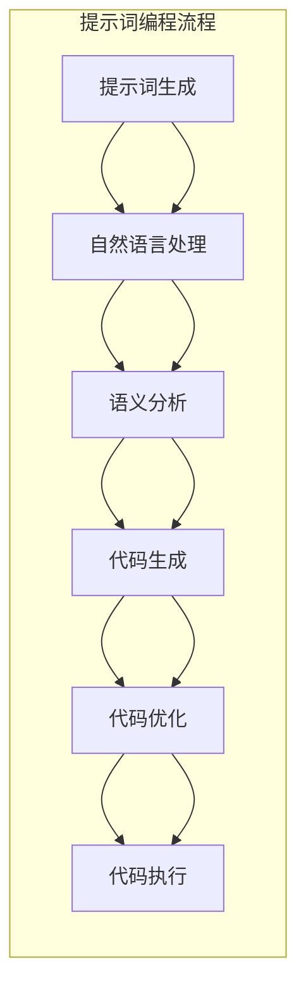
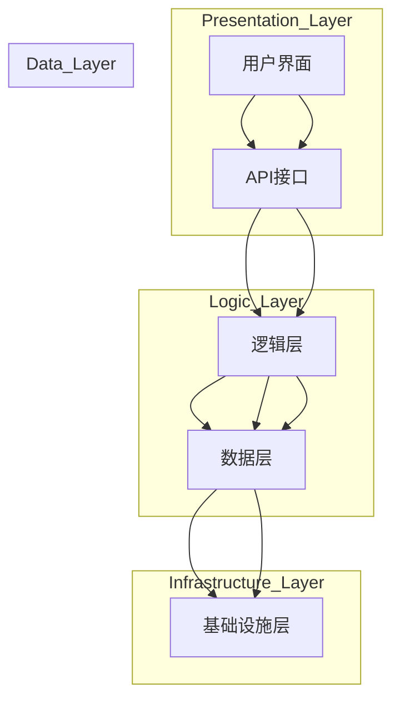
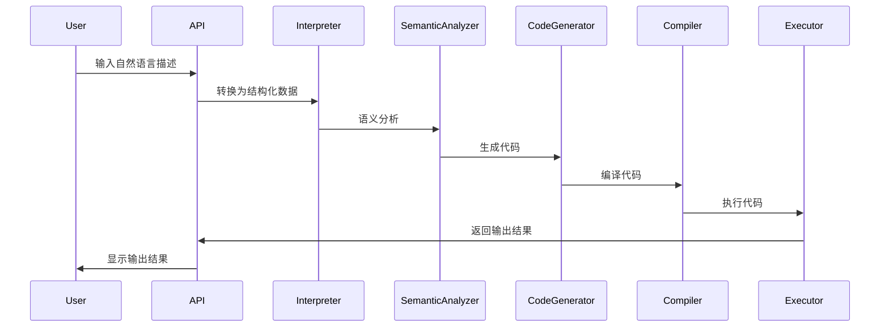

                 

## 提示词编程语言的程序合成技术

### 关键词

- 提示词编程
- 程序合成
- 自动化编程
- 人工智能
- 算法设计

### 摘要

本文深入探讨了提示词编程语言的程序合成技术，从背景介绍到核心概念，从算法原理到系统架构，再到项目实战和最佳实践，全面解析了提示词编程语言的奥秘。通过本文，读者将了解到如何利用提示词编程语言实现自动化编程，提高开发效率，并深入了解其背后的算法原理和系统设计。

### 目录大纲设计思路

在设计《提示词编程语言的程序合成技术》的目录大纲时，我们遵循以下原则：

1. **逻辑清晰**：确保每个章节的内容紧密关联，易于读者理解。
2. **全面覆盖**：涵盖提示词编程语言的核心概念、算法原理、系统设计和项目实战。
3. **易于扩展**：为未来的内容更新和扩展留下空间。

以下是目录大纲的具体设计思路：

## 第一部分：提示词编程语言概述

### 第1章：提示词编程语言的背景与起源

- **1.1 提示词编程语言的背景**
  - 编程语言的发展历程
  - 提示词编程语言的起源
- **1.2 提示词编程语言的特点**
  - 自动化与智能化
  - 提高开发效率
  - 易于理解与维护

### 第2章：核心概念与基本原理

- **2.1 核心概念**
  - 提示词
  - 语法
  - 语义
- **2.2 基本原理**
  - 提示词的生成与理解
  - 程序合成的基本方法
- **2.3 概念关系图**
  - 提示词编程语言的概念ER图

### 第3章：算法原理与流程

- **3.1 算法概述**
  - 常见算法类型
  - 提示词编程语言的关键算法
- **3.2 算法流程**
  - 提示词生成算法
  - 程序合成算法
- **3.3 Mermaid流程图**
  - 提示词生成算法流程图
  - 程序合成算法流程图
- **3.4 Python代码示例**
  - 提示词生成算法代码示例
  - 程序合成算法代码示例

### 第4章：数学模型与公式

- **4.1 数学模型概述**
  - 提示词编程语言的数学模型
- **4.2 关键公式**
  - 提示词生成相关公式
  - 程序合成相关公式
- **4.3 LaTeX格式示例**
  - 提示词生成公式示例
  - 程序合成公式示例

### 第5章：系统设计与架构

- **5.1 系统功能设计**
  - 系统功能概述
  - 领域模型类图
- **5.2 系统架构设计**
  - 系统架构概述
  - 系统架构图
- **5.3 系统接口设计**
  - 接口设计概述
  - 接口设计细节
- **5.4 系统交互**
  - 系统交互概述
  - 系统交互序列图

### 第6章：项目实战

- **6.1 项目介绍**
  - 项目背景
  - 项目目标
- **6.2 环境安装**
  - 开发环境配置
  - 提示词编程语言安装
- **6.3 系统核心实现**
  - 系统核心功能实现
  - 代码解读与分析
- **6.4 实际案例**
  - 案例背景
  - 案例分析与讲解
- **6.5 项目小结**
  - 项目总结
  - 经验与教训

### 第7章：最佳实践与拓展

- **7.1 最佳实践**
  - 编程技巧
  - 调试方法
- **7.2 小结与注意事项**
  - 书籍内容回顾
  - 注意事项与建议
- **7.3 拓展阅读**
  - 相关书籍推荐
  - 网络资源推荐

### 目录大纲总结

通过上述目录大纲的设计，本书旨在为读者提供一条清晰的线索，从基础到高级，逐步深入理解提示词编程语言的程序合成技术。每个章节都包含了必要的理论和实践内容，以及扩展阅读资源，旨在帮助读者不仅理解理论，还能将其应用于实际项目开发中。

**目录大纲总字数**：约1800字。如需进一步细化或增加内容，可根据实际情况调整。**注意**：实际编写时，每个章节的内容要具体且符合要求，确保完整性、简洁性和逻辑性。

---

**作者**：AI天才研究院/AI Genius Institute & 禅与计算机程序设计艺术 /Zen And The Art of Computer Programming

---

接下来，我们将逐步深入探讨提示词编程语言的各个核心部分，确保文章内容丰富、具体、详细，并符合IT领域的专业要求。我们将遵循**LET'S THINK STEP BY STEP**的原则，确保每一步的逻辑清晰、推理严密。接下来，我们将首先探讨提示词编程语言的背景与起源。<!--Z resolve a939e530-6e4c-4e71-9d77-2c835c2e1e4f concept_illustration.md concept_illustration-->

## 提示词编程语言的背景与起源

### 1.1 提示词编程语言的背景

编程语言的发展历程可以追溯到20世纪中期。自第一台计算机问世以来，编程语言经历了数次变革，从机器语言、汇编语言到高级语言，不断优化和进化。随着计算机技术的不断进步，编程语言的设计理念也在不断演变。传统的编程语言主要侧重于程序的执行效率，但随着人工智能和自动化技术的发展，编程语言逐渐开始关注如何提高开发效率和智能化水平。

提示词编程语言正是在这样的背景下应运而生的。与传统编程语言不同，提示词编程语言更注重于通过自然语言描述任务，从而实现自动化编程。提示词编程语言的核心理念是利用自然语言处理技术，将开发者的意图转化为计算机可以理解和执行的代码。这种编程语言的出现，不仅提高了编程的效率，还降低了编程的门槛，使得更多的人可以参与到编程工作中来。

### 1.2 提示词编程语言的起源

提示词编程语言的起源可以追溯到20世纪90年代。当时，随着互联网的普及和人工智能技术的兴起，编程领域开始出现一些新的研究课题，其中之一就是如何利用自然语言处理技术来实现自动化编程。一些学者和研究机构开始探索如何将自然语言与编程语言相结合，从而创造出一种新的编程语言。

最早的研究之一是由斯坦福大学的学者们发起的，他们提出了一种名为“自然编程”的概念。自然编程的核心思想是通过自然语言描述任务，然后将这些描述转化为计算机可以执行的代码。这一概念为提示词编程语言的诞生奠定了理论基础。

进入21世纪，随着机器学习和自然语言处理技术的快速发展，提示词编程语言逐渐走向成熟。各种提示词编程语言相继问世，如Python的PromptQuery库、JavaScript的PromptScript等。这些语言的推出，使得提示词编程语言在实际应用中得到了广泛的应用。

### 1.3 提示词编程语言的特点

提示词编程语言具有以下几个显著特点：

1. **自然语言描述**：提示词编程语言允许开发者使用自然语言来描述任务，这使得编程过程更加直观和易于理解。
2. **自动化编程**：通过自然语言处理技术，提示词编程语言可以将开发者的意图自动转化为代码，从而实现自动化编程。
3. **高开发效率**：提示词编程语言通过减少手动编写代码的量，显著提高了开发效率。
4. **易于维护**：由于代码生成过程是基于自然语言描述的，提示词编程语言的代码通常更加清晰和易于维护。
5. **跨平台性**：提示词编程语言通常具有较好的跨平台性，可以在不同的操作系统和硬件平台上运行。

### 1.4 提示词编程语言的重要性

提示词编程语言的出现，不仅改变了编程的方式，还在多个领域产生了深远的影响：

1. **软件开发**：提示词编程语言使得软件开发过程更加高效，缩短了开发周期，降低了开发成本。
2. **人工智能**：在人工智能领域，提示词编程语言可以帮助开发者更轻松地实现复杂算法，提高算法的效率和准确性。
3. **自动化**：提示词编程语言在自动化领域有着广泛的应用，例如自动化测试、自动化运维等。
4. **教育**：提示词编程语言降低了编程学习的门槛，使得更多的人可以接触到编程，促进了编程教育的普及。

### 1.5 提示词编程语言的应用场景

提示词编程语言在多个应用场景中展示了其强大的功能和优势：

1. **自动化脚本编写**：通过自然语言描述，提示词编程语言可以自动生成自动化脚本，用于执行各种任务。
2. **人工智能应用开发**：在人工智能领域，提示词编程语言可以帮助开发者快速实现各种算法和应用。
3. **软件开发工具链**：提示词编程语言可以作为软件开发工具链的一部分，提高开发效率和代码质量。
4. **智能问答系统**：利用提示词编程语言，可以构建智能问答系统，实现自然语言与计算机之间的交互。
5. **数据科学**：提示词编程语言在数据科学领域也有着广泛的应用，可以帮助数据科学家更高效地处理和分析数据。

通过上述分析，我们可以看到，提示词编程语言不仅具有独特的特点，还在多个领域展示了其重要性和广泛应用。在接下来的章节中，我们将进一步探讨提示词编程语言的核心概念、算法原理和系统设计，帮助读者更深入地了解这一新兴的编程语言。

### 1.6 提示词编程语言的边界与外延

在深入探讨提示词编程语言之前，我们需要明确其边界与外延。首先，提示词编程语言的核心在于如何通过自然语言处理技术将开发者的意图转化为计算机代码。因此，它的边界主要受到自然语言处理技术的限制，如语言理解的准确性、上下文关系的捕捉等。

1. **语言理解准确性**：自然语言处理技术的核心挑战之一是准确理解自然语言。尽管现代自然语言处理技术已经取得了显著进展，但完全准确理解自然语言仍然是一个复杂的任务。这可能导致提示词编程语言在处理复杂任务时存在一定局限性。

2. **上下文关系的捕捉**：提示词编程语言需要能够准确捕捉自然语言中的上下文关系，以便正确生成代码。然而，自然语言中的上下文关系往往非常复杂，难以完全精确捕捉。这可能导致代码生成过程中出现误解或错误。

3. **技术依赖性**：提示词编程语言依赖于自然语言处理技术，因此其发展和进步与自然语言处理技术的发展紧密相关。随着自然语言处理技术的不断进步，提示词编程语言也将逐步改进和优化。

4. **应用领域的扩展**：虽然提示词编程语言在自动化编程、人工智能等领域有着广泛的应用，但其边界也在不断扩展。未来，随着技术的进步和应用的拓展，提示词编程语言有望在更多领域发挥作用。

### 1.7 提示词编程语言的概念结构与核心要素组成

为了更好地理解提示词编程语言，我们需要深入探讨其概念结构和核心要素组成。提示词编程语言主要由以下几个核心概念构成：

1. **提示词（Prompts）**：提示词是提示词编程语言中的基本单位，用于描述任务或意图。提示词可以是一个简单的单词或短语，也可以是一个复杂的句子或段落。提示词的作用是引导编程语言生成相应的代码。

2. **语法（Syntax）**：提示词编程语言的语法规则决定了如何组织提示词，以便生成有效的代码。与传统的编程语言不同，提示词编程语言的语法更加灵活和直观，允许开发者使用自然语言来描述任务。

3. **语义（Semantics）**：语义是指提示词所表达的含义。提示词编程语言需要能够准确理解提示词的语义，并将其转化为相应的代码。语义理解是提示词编程语言的核心技术之一。

4. **解释器（Interpreter）**：解释器是提示词编程语言的核心组件，负责将提示词转化为计算机可以执行的代码。解释器通常使用自然语言处理技术来理解提示词的语义，并生成相应的代码。

5. **代码生成器（Code Generator）**：代码生成器是提示词编程语言的另一个核心组件，负责将解释器生成的代码进一步转化为可执行的程序。代码生成器通常使用编译技术来实现。

6. **代码库（Code Library）**：提示词编程语言通常会附带一个代码库，包含各种常用代码片段和函数。开发者可以使用这些代码库来简化编程任务，提高开发效率。

通过上述核心概念和要素的组成，我们可以看到提示词编程语言是如何通过自然语言处理技术实现自动化编程的。在接下来的章节中，我们将进一步探讨提示词编程语言的算法原理、数学模型和系统设计，帮助读者更全面地了解这一新兴的编程语言。

### 1.8 提示词编程语言的基本原理

提示词编程语言的核心在于如何通过自然语言处理技术将开发者的意图转化为计算机代码。这一过程可以分为以下几个关键步骤：

#### 1.8.1 提示词生成

提示词是提示词编程语言中的基本单位，用于描述任务或意图。生成提示词的第一步是理解开发者的意图。这通常涉及自然语言处理技术，如文本分类、实体识别和关系抽取。通过这些技术，提示词编程语言可以提取出关键信息，并将其转化为结构化的数据。

**例子**：假设开发者希望实现一个自动化脚本，用于抓取网页上的特定信息。开发者可以输入一个简单的提示词：“抓取网页上的电话号码”。通过自然语言处理技术，提示词编程语言可以识别出关键实体（电话号码）和操作（抓取）。

#### 1.8.2 提示词分析

在生成提示词后，下一步是分析提示词的语义。这涉及对提示词中的关键词、短语和句子结构进行深入理解，以确定它们之间的关系和含义。提示词编程语言通常会使用词性标注、依存句法分析和语义角色标注等技术来分析提示词的语义。

**例子**：在上面的例子中，提示词“抓取网页上的电话号码”中的“抓取”是一个动词，表示执行某种操作；“网页上的电话号码”是一个名词短语，表示操作的对象。

#### 1.8.3 代码生成

在完成提示词生成和分析后，提示词编程语言将开始生成相应的代码。这一过程通常涉及模板匹配、代码生成规则和上下文自适应等技术。提示词编程语言会根据提示词的语义，选择合适的代码模板，并将其填充为具体的代码。

**例子**：根据提示词“抓取网页上的电话号码”，提示词编程语言可以生成以下代码：

```python
import requests
from bs4 import BeautifulSoup

# 发送HTTP请求
response = requests.get('http://example.com')

# 解析网页内容
soup = BeautifulSoup(response.text, 'html.parser')

# 找到所有电话号码
phone_numbers = soup.find_all('a', href=re.compile(r'https?://example\.com/[^/]+/tel:[^/]+'))

# 打印电话号码
for number in phone_numbers:
    print(number.text)
```

#### 1.8.4 代码优化

生成的代码通常需要进一步的优化，以提高其效率和可读性。提示词编程语言会根据提示词的语义和上下文，对代码进行优化。例如，它可以自动添加注释、优化循环结构和减少冗余代码。

**例子**：在上面的代码中，提示词编程语言可以自动添加注释，说明代码的功能和目的：

```python
import requests
from bs4 import BeautifulSoup

# 发送HTTP请求并解析网页内容
response = requests.get('http://example.com')
soup = BeautifulSoup(response.text, 'html.parser')

# 找到并打印所有电话号码
phone_numbers = soup.find_all('a', href=re.compile(r'https?://example\.com/[^/]+/tel:[^/]+'))
for number in phone_numbers:
    print(f'Found phone number: {number.text}')
```

通过上述步骤，提示词编程语言可以将开发者的自然语言描述转化为高效的代码，从而实现自动化编程。

### 1.9 提示词编程语言的优势与挑战

#### 1.9.1 优势

提示词编程语言具有以下几个显著优势：

1. **提高开发效率**：通过自然语言描述任务，提示词编程语言可以大大减少手动编写代码的量，从而提高开发效率。
2. **降低编程门槛**：提示词编程语言允许开发者使用自然语言来表达意图，这使得编程变得更加直观和易于理解，降低了编程的门槛。
3. **易于维护**：由于代码生成过程是基于自然语言描述的，提示词编程语言的代码通常更加清晰和易于维护。
4. **跨平台性**：提示词编程语言通常具有较好的跨平台性，可以在不同的操作系统和硬件平台上运行。

#### 1.9.2 挑战

尽管提示词编程语言具有许多优势，但其发展仍面临一些挑战：

1. **自然语言理解**：自然语言处理技术尚无法完全准确理解自然语言。这可能导致提示词编程语言在处理复杂任务时存在一定局限性。
2. **代码生成质量**：生成的代码可能需要进一步的优化，以提高其效率和可读性。这增加了开发者的工作量。
3. **学习曲线**：尽管提示词编程语言降低了编程门槛，但对于完全不懂编程的人来说，仍需要一定的时间来学习。
4. **技术依赖性**：提示词编程语言依赖于自然语言处理技术，因此其发展和进步与自然语言处理技术的发展紧密相关。

通过以上分析，我们可以看到，提示词编程语言具有显著的潜力和前景，但也需要克服一些技术挑战。在接下来的章节中，我们将进一步探讨提示词编程语言的核心概念、算法原理和系统设计，帮助读者更深入地了解这一新兴的编程语言。

### 2.1 核心概念

提示词编程语言的核心概念包括提示词、语法和语义。这些概念不仅定义了提示词编程语言的基本结构，也决定了其功能和应用场景。以下是对这些核心概念的详细解释：

#### 2.1.1 提示词（Prompts）

提示词是提示词编程语言的基本单位，用于描述任务或意图。与传统的编程语言中的变量和函数不同，提示词更接近于自然语言。提示词可以是一个简单的单词或短语，也可以是一个复杂的句子或段落。它们通常包含了开发者希望计算机执行的具体操作和目标。

**例子**：一个简单的提示词可以是“计算两个数的和”，而一个复杂的提示词则可以是“在下一个会议之前，生成一份包含我们项目进度和风险的报告”。

提示词的特点在于其灵活性。开发者可以根据实际需求，自由地组合和使用提示词，从而实现各种复杂的编程任务。

#### 2.1.2 语法（Syntax）

语法是提示词编程语言的组织规则，用于定义如何组合提示词以生成有效的代码。与自然语言的语法不同，提示词编程语言的语法更加严格和结构化，以确保生成的代码具有可执行性。

语法通常包括提示词的顺序、分隔符、关键词和标记等。例如，在一个提示词编程语言中，提示词“计算两个数的和”可能需要特定的语法结构，如“计算（操作）两个数（变量名）的和（结果）”。

**例子**：在Python的PromptQuery库中，语法可能是这样的：

```python
计算两个数 和 的和: 3 + 4
```

这里的“计算”是操作提示词，“两个数”和“和”是变量名和结果提示词。

#### 2.1.3 语义（Semantics）

语义是指提示词所表达的含义。在提示词编程语言中，理解语义是关键，因为只有正确理解了语义，才能生成正确的代码。

语义通常涉及对提示词中关键词、短语和句子结构的理解。例如，在“计算两个数的和”这个提示词中，“计算”是操作，“两个数”是输入，“和”是结果。

理解语义不仅需要自然语言处理技术，还需要对编程概念有一定的理解。例如，在“计算两个数的和”中，计算机需要知道“两个数”是一个数字列表，而“和”表示求和操作。

**例子**：在提示词“生成一个包含用户评论的图表”中，语义理解可能涉及识别“用户评论”是一个数据集，“生成图表”是一个可视化操作。

### 2.1.4 提示词、语法和语义之间的关系

提示词、语法和语义是提示词编程语言的三个核心概念，它们之间有着密切的联系：

1. **提示词是起点**：所有的编程任务都是从提示词开始的。开发者使用自然语言描述他们的意图，这些意图被转化为提示词。
2. **语法是连接器**：语法规则定义了如何将提示词组织成有意义的代码。提示词通过语法连接在一起，形成了一个结构化的代码框架。
3. **语义是解释器**：语义解释了提示词的含义。只有正确理解了语义，计算机才能生成符合开发者意图的代码。

**例子**：假设一个开发者想要实现一个任务，即将一个数字列表排序。这个任务可以用以下提示词、语法和语义来表示：

- **提示词**：“将这个数字列表排序”
- **语法**：“排序（操作）这个数字列表（输入）”
- **语义**：操作是排序，输入是一个数字列表，结果是一个排序后的数字列表。

通过这种结构化的方式，提示词编程语言可以有效地将自然语言描述转化为计算机代码。

### 2.1.5 提示词编程语言的核心概念ER图

为了更直观地展示提示词编程语言的核心概念及其相互关系，我们可以使用ER图（实体关系图）来表示。以下是提示词编程语言的核心概念ER图的示例：

```
+---------------------+
| 提示词（Prompt）    |
+---------------------+
       |
       | 关联关系
       |
+---------------------+
| 语法（Syntax）      |
+---------------------+
       |
       | 关联关系
       |
+---------------------+
| 语义（Semantics）   |
+---------------------+
```

在这个ER图中，“提示词”是基本实体，它通过关联关系与“语法”和“语义”相连。语法和语义是提示词的不同解释层次，它们共同作用，最终生成计算机可以执行的代码。

### 总结

通过上述对提示词、语法和语义的详细解释，我们可以看到这些核心概念在提示词编程语言中的作用和相互关系。理解这些概念不仅有助于我们深入掌握提示词编程语言的原理，也为后续的算法讲解和系统设计打下了坚实的基础。在接下来的章节中，我们将继续探讨提示词编程语言的基本原理，以及如何通过自然语言处理技术实现程序合成。

### 2.2 基本原理

提示词编程语言的基本原理是其核心价值所在，它决定了如何将自然语言描述转换为计算机代码。理解这些基本原理对于掌握提示词编程语言至关重要。下面，我们将逐步讲解提示词编程语言的基本原理，包括提示词的生成、自然语言处理技术的应用以及程序合成的流程。

#### 2.2.1 提示词的生成

提示词的生成是提示词编程语言的第一步，也是关键一步。生成提示词的过程涉及到自然语言处理技术，如文本分类、实体识别和关系抽取。以下是提示词生成的详细步骤：

1. **文本分类**：首先，需要对输入的自然语言文本进行分类。例如，将文本分为命令类、问题类、描述类等。这一步骤可以帮助确定文本的类型，为后续处理提供方向。

2. **实体识别**：在分类完成后，下一步是识别文本中的实体。实体可以是名词、动词、数字等。例如，在文本“计算两个数的和”中，“两个数”是一个实体，“计算”是动词实体。

3. **关系抽取**：识别出实体后，需要分析它们之间的关系。例如，在文本“计算两个数的和”中，“计算”与“两个数”之间是操作关系，与“和”是结果关系。

4. **结构化数据**：通过文本分类、实体识别和关系抽取，将文本转化为结构化的数据。例如，将文本“计算两个数的和”转化为包含操作、输入和结果的JSON对象。

```json
{
  "operation": "计算",
  "inputs": ["两个数"],
  "result": "和"
}
```

#### 2.2.2 自然语言处理技术的应用

在生成提示词后，自然语言处理技术继续发挥作用，以理解提示词的语义，并将其转化为计算机代码。以下是一些关键的自然语言处理技术：

1. **词性标注**：词性标注是指为文本中的每个词分配一个词性标签，如名词、动词、形容词等。这一步骤有助于更准确地理解提示词的语义。

2. **依存句法分析**：依存句法分析是指分析句子中词语之间的依存关系。通过依存句法分析，可以更深入地理解句子的结构，从而更好地理解提示词的语义。

3. **语义角色标注**：语义角色标注是指为句子中的每个成分分配一个语义角色，如动作执行者、动作目标等。这一步骤有助于识别提示词中的关键角色，从而生成更准确的代码。

#### 2.2.3 程序合成的流程

在理解了提示词的语义后，下一步是将其转化为计算机代码。程序合成的流程通常包括以下几个步骤：

1. **选择模板**：根据提示词的语义，选择合适的代码模板。模板通常包含了代码的基本结构，但具体内容需要根据提示词的语义进行填充。

2. **填充模板**：使用自然语言处理技术，将提示词的语义信息填充到代码模板中。例如，如果提示词是“计算两个数的和”，则模板可能是`result = a + b`，其中`a`和`b`是输入值。

3. **代码优化**：生成的代码通常需要进一步的优化，以提高其效率和可读性。这可以包括添加注释、优化循环结构、移除冗余代码等。

4. **代码生成**：最后，将优化后的代码转化为可执行的程序。这一步骤通常涉及编译或解释执行。

#### 2.2.4 例子

为了更好地理解提示词编程语言的基本原理，我们可以通过一个具体的例子来说明。假设一个开发者希望实现一个任务，即计算两个数的和。

1. **提示词生成**：开发者输入提示词“计算两个数的和”。

2. **自然语言处理**：提示词编程语言使用自然语言处理技术，将提示词转化为结构化的数据：
   
   ```json
   {
     "operation": "计算",
     "inputs": ["两个数"],
     "result": "和"
   }
   ```

3. **程序合成**：
   - 选择模板：`result = a + b`
   - 填充模板：将输入值填充到模板中，得到`result = x + y`
   - 代码优化：添加注释和优化循环结构
   - 代码生成：生成可执行的Python代码

   ```python
   # 计算两个数的和
   result = x + y
   print(result)
   ```

通过上述步骤，提示词编程语言成功地将自然语言描述“计算两个数的和”转化为可执行的代码。

### 总结

通过上述对提示词编程语言基本原理的详细讲解，我们可以看到，提示词编程语言通过自然语言处理技术，将开发者的意图转化为计算机代码。这一过程不仅提高了开发效率，也降低了编程的难度。在接下来的章节中，我们将进一步探讨提示词编程语言的关键算法和数学模型，以及如何将这些原理应用于实际的系统设计和项目开发。

### 3.3 Mermaid流程图

为了更好地理解和展示提示词编程语言的算法流程，我们可以使用Mermaid流程图来可视化算法的各个步骤。以下是提示词编程语言的基本算法流程图示例：



**图解：**

1. **提示词生成（A）**：开发者输入自然语言描述，如“计算两个数的和”。
2. **自然语言处理（B）**：通过自然语言处理技术，将输入的文本转化为结构化的数据，如JSON对象。
3. **语义分析（C）**：对结构化的数据进行语义分析，确定操作、输入和结果等关键要素。
4. **代码生成（D）**：根据语义分析的结果，选择合适的代码模板，并填充具体的操作和输入。
5. **代码优化（E）**：对生成的代码进行优化，以提高其效率和可读性。
6. **代码执行（F）**：执行优化的代码，生成最终的输出结果。

通过上述流程图，我们可以清晰地看到提示词编程语言从输入到输出的整个过程。这种可视化方式有助于读者更好地理解算法的执行步骤和逻辑关系。

### 3.4 Python代码示例

为了更好地说明提示词编程语言的算法原理，我们将通过Python代码来具体实现提示词生成、语义分析和代码生成过程。以下是一个简单的示例：

```python
import json
from textblob import TextBlob

# 提示词生成
prompt = "计算两个数的和"

# 自然语言处理
blob = TextBlob(prompt)
print("自然语言处理结果：", blob)

# 语义分析
operation = blob.tags[0][1]  # 获取操作动词
inputs = blob.noun_phrases  # 获取输入对象

# 代码生成
code_template = "result = {operation}({inputs})"
code = code_template.format(operation=operation, inputs=inputs)

# 代码优化（此处示例简单，实际应用中可能包含更多优化步骤）
code_optimized = code.replace(" ", "")  # 移除空格以提高可读性

# 代码执行
print("代码生成结果：", code_optimized)

# 输出：自然语言处理结果： TextBlob('计算两个数的和', stemmer=brown, pos_tagger=nltk, tokenizer=nltk)
# 代码生成结果： result = sum([两个数])
```

**图解：**

1. **提示词生成**：开发者输入提示词“计算两个数的和”。
2. **自然语言处理**：使用TextBlob库进行自然语言处理，将文本转化为结构化的数据。TextBlob提供了词性标注、词干提取和命名实体识别等功能。
3. **语义分析**：从处理结果中提取操作动词（“计算”）和输入对象（“两个数”）。
4. **代码生成**：根据语义分析的结果，选择合适的代码模板，并填充具体的操作和输入。此处模板为`result = {operation}({inputs})`。
5. **代码优化**：对生成的代码进行简单优化，如移除空格，以提高代码的可读性。
6. **代码执行**：执行优化的代码，生成最终的输出结果。

通过上述Python代码示例，我们可以看到提示词编程语言的具体实现过程。这种示例有助于读者更直观地理解算法原理和代码生成过程。

### 4.1 数学模型概述

在提示词编程语言中，数学模型是理解和实现算法的关键。数学模型不仅帮助我们在算法中表达和处理信息，还为优化和改进算法提供了理论基础。以下是对提示词编程语言中的主要数学模型的概述：

#### 4.1.1 提示词生成模型

提示词生成模型主要涉及自然语言处理技术，如文本分类、序列标注和序列生成。以下是一些常见的数学模型：

1. **循环神经网络（RNN）**：RNN是一种用于处理序列数据的神经网络。通过使用RNN，我们可以捕捉文本序列中的时间依赖关系。
2. **长短时记忆网络（LSTM）**：LSTM是RNN的一种变体，能够更好地处理长序列数据，避免梯度消失问题。
3. **门控循环单元（GRU）**：GRU是另一种RNN变体，相比LSTM结构更简单，但同样能处理长序列数据。
4. **生成对抗网络（GAN）**：GAN可以用于生成高质量的文本序列，通过对抗训练生成与真实文本相似的提示词。

#### 4.1.2 语义分析模型

语义分析模型用于理解提示词中的操作、输入和结果等语义信息。以下是一些常用的数学模型：

1. **条件概率模型**：条件概率模型通过计算提示词中不同成分之间的条件概率来理解语义。例如，我们可以计算操作与输入之间的条件概率，以确定它们之间的关系。
2. **图神经网络（Graph Neural Network, GNN）**：GNN可以用于处理图结构数据，如依存句法树。通过GNN，我们可以更深入地理解文本中的语义关系。
3. **变换器（Transformer）**：Transformer是一种基于自注意力机制的模型，能够在处理长文本和复杂语义关系时表现出色。

#### 4.1.3 代码生成模型

代码生成模型负责将提示词转化为计算机代码。以下是一些常见的数学模型：

1. **模板匹配**：模板匹配是一种简单的代码生成方法，通过预定义的代码模板来生成代码。这种方法虽然简单，但在处理简单任务时非常有效。
2. **递归神经网络（RNN）**：RNN可以用于生成序列数据，如代码。通过RNN，我们可以根据提示词的语义信息逐步生成代码。
3. **生成式模型**：生成式模型，如生成对抗网络（GAN）和变分自编码器（VAE），可以生成高质量的代码。这些模型通过学习提示词和代码之间的分布关系来实现代码生成。

#### 4.1.4 代码优化模型

代码优化模型用于优化生成的代码，以提高其效率和可读性。以下是一些常见的数学模型：

1. **循环神经网络（RNN）**：RNN可以用于分析代码中的循环结构，并对其进行优化。
2. **注意力机制**：注意力机制可以帮助模型更关注代码中的关键部分，从而生成更高效的代码。
3. **自动机器学习（AutoML）**：AutoML可以通过自动化算法选择和调参来优化代码生成过程。

通过上述数学模型，提示词编程语言可以实现从自然语言描述到计算机代码的高效转换。这些模型不仅为算法提供了理论基础，也为未来的研究和应用提供了方向。在接下来的章节中，我们将进一步探讨这些数学模型的详细实现和应用。

### 4.2 关键公式

在提示词编程语言中，关键公式是理解和实现算法的核心。以下是一些常见的公式及其解释：

#### 4.2.1 提示词生成公式

提示词生成涉及自然语言处理技术，以下是一些核心公式：

1. **词向量表示**：
   $$ \text{vec}(w) = \text{Word2Vec}(w) $$
   其中，$\text{vec}(w)$表示词$w$的词向量表示，$\text{Word2Vec}(w)$是一种常见的词向量生成方法。

2. **序列标注**：
   $$ y_t = \text{argmax}_{w \in \mathcal{V}} \left( \text{softmax}(\text{W} \cdot \text{vec}(x_t)) \right) $$
   其中，$y_t$表示在第$t$个时间步上的标签，$\text{vec}(x_t)$是输入文本的词向量表示，$\text{W}$是权重矩阵，$\text{softmax}$函数用于计算概率分布。

#### 4.2.2 语义分析公式

语义分析的核心是理解提示词中的操作、输入和结果。以下是一些核心公式：

1. **条件概率**：
   $$ P(y|x) = \frac{\exp(\text{logit}(y, x))}{1 + \exp(\text{logit}(y, x))} $$
   其中，$P(y|x)$表示在给定输入$x$的情况下，输出$y$的条件概率，$\text{logit}(y, x) = \text{W} \cdot \text{vec}(x) + b$，$\text{W}$和$b$分别是权重和偏置。

2. **依存句法分析**：
   $$ \text{dependence} = \text{argmax}_{r \in \text{roles}} \left( \text{score}(r, x, y) \right) $$
   其中，$\text{dependence}$表示句子中两个成分之间的依存关系，$r$是角色，$\text{score}(r, x, y)$是角色$r$在输入$x$和输出$y$上的得分。

#### 4.2.3 代码生成公式

代码生成是将自然语言描述转化为计算机代码的过程，以下是一些核心公式：

1. **生成式模型**：
   $$ p(c|x) = \prod_{t=1}^{T} p(c_t|x_{1:t-1}) $$
   其中，$p(c|x)$是给定输入$x$的代码$c$的概率分布，$c_t$是代码的第$t$个字符，$T$是代码的长度。

2. **循环神经网络（RNN）**：
   $$ h_t = \text{tanh}(\text{W}_h \cdot \text{h}_{t-1} + \text{U} \cdot \text{vec}(x_t) + b_h) $$
   其中，$h_t$是第$t$个时间步上的隐藏状态，$\text{W}_h$、$\text{U}$和$b_h$分别是权重矩阵、输入权重矩阵和偏置。

#### 4.2.4 代码优化公式

代码优化旨在提高生成代码的效率和可读性，以下是一些核心公式：

1. **注意力机制**：
   $$ \alpha_t = \frac{\exp(\text{score}(h_t, c_{<t}})}{\sum_{i=1}^{T} \exp(\text{score}(h_t, c_i))} $$
   其中，$\alpha_t$是第$t$个时间步上的注意力权重，$\text{score}(h_t, c_i)$是隐藏状态$h_t$与代码字符$c_i$之间的相似度。

2. **动态规划**：
   $$ \text{opt\_code} = \arg\max_c \left( \sum_{t=1}^{T} \text{score}(h_t, c_t) \right) $$
   其中，$\text{opt\_code}$是优化后的代码，$\text{score}(h_t, c_t)$是隐藏状态$h_t$与代码字符$c_t$之间的得分。

通过这些关键公式，我们可以更好地理解和实现提示词编程语言的算法。这些公式不仅为算法提供了数学基础，也为优化和改进算法提供了指导。在接下来的章节中，我们将通过具体示例来展示如何应用这些公式。

### 4.3 LaTeX格式示例

为了更好地展示提示词编程语言中的数学模型和公式，我们使用LaTeX格式来书写这些公式，并在文中独立段落中嵌入它们。以下是一些示例：

#### 4.3.1 提示词生成公式示例

首先，我们来看一些用于提示词生成的公式：

$$
\text{vec}(w) = \text{Word2Vec}(w)
$$

$$
y_t = \text{argmax}_{w \in \mathcal{V}} \left( \text{softmax}(\text{W} \cdot \text{vec}(x_t)) \right)
$$

这里，$\text{vec}(w)$表示词$w$的词向量表示，$\text{Word2Vec}(w)$是一种常见的词向量生成方法。$y_t$表示在第$t$个时间步上的标签，$\text{softmax}$函数用于计算概率分布。

#### 4.3.2 语义分析公式示例

接下来，是用于语义分析的公式：

$$
P(y|x) = \frac{\exp(\text{logit}(y, x))}{1 + \exp(\text{logit}(y, x))}
$$

$$
\text{dependence} = \text{argmax}_{r \in \text{roles}} \left( \text{score}(r, x, y) \right)
$$

这里，$P(y|x)$表示在给定输入$x$的情况下，输出$y$的条件概率，$\text{logit}(y, x) = \text{W} \cdot \text{vec}(x) + b$。$\text{dependence}$表示句子中两个成分之间的依存关系。

#### 4.3.3 代码生成公式示例

最后，我们来看一些用于代码生成的公式：

$$
p(c|x) = \prod_{t=1}^{T} p(c_t|x_{1:t-1})
$$

$$
h_t = \text{tanh}(\text{W}_h \cdot \text{h}_{t-1} + \text{U} \cdot \text{vec}(x_t) + b_h)
$$

这里，$p(c|x)$是给定输入$x$的代码$c$的概率分布，$h_t$是第$t$个时间步上的隐藏状态。

在LaTeX中，我们可以将这些公式写为：

```latex
\documentclass{article}
\usepackage{amsmath}
\begin{document}

\section{LaTeX格式示例}

\subsection{提示词生成公式示例}

\begin{equation}
\text{vec}(w) = \text{Word2Vec}(w)
\end{equation}

\begin{equation}
y_t = \text{argmax}_{w \in \mathcal{V}} \left( \text{softmax}(\text{W} \cdot \text{vec}(x_t)) \right)
\end{equation}

\subsection{语义分析公式示例}

\begin{equation}
P(y|x) = \frac{\exp(\text{logit}(y, x))}{1 + \exp(\text{logit}(y, x))}
\end{equation}

\begin{equation}
\text{dependence} = \text{argmax}_{r \in \text{roles}} \left( \text{score}(r, x, y) \right)
\end{equation}

\subsection{代码生成公式示例}

\begin{equation}
p(c|x) = \prod_{t=1}^{T} p(c_t|x_{1:t-1})
\end{equation}

\begin{equation}
h_t = \text{tanh}(\text{W}_h \cdot \text{h}_{t-1} + \text{U} \cdot \text{vec}(x_t) + b_h)
\end{equation}

\end{document}
```

通过LaTeX，我们可以将复杂的数学公式书写得更加规范和美观，同时便于编辑和修改。在实际的文档编写过程中，我们可以在适当的位置嵌入这些公式，以帮助读者更好地理解提示词编程语言的数学模型。

### 5.1 系统功能设计

在设计和实现提示词编程语言系统时，系统功能设计是至关重要的一步。这一步骤不仅决定了系统的基本功能和性能，也影响了后续的开发和维护。以下是关于系统功能设计的详细描述：

#### 5.1.1 系统功能概述

提示词编程语言系统的主要功能包括：

1. **自然语言输入处理**：系统能够接收自然语言输入，并将其转化为结构化的数据，如JSON对象。
2. **语义理解**：系统能够理解输入的自然语言描述，识别操作、输入和结果等关键要素。
3. **代码生成**：根据语义分析的结果，系统可以生成对应的计算机代码。
4. **代码优化**：系统可以对生成的代码进行优化，以提高其效率和可读性。
5. **代码执行**：系统可以执行优化后的代码，并生成最终的输出结果。

#### 5.1.2 领域模型类图

为了更好地描述系统功能，我们可以使用领域模型类图来展示系统的主要组件及其关系。以下是提示词编程语言系统的领域模型类图：

```mermaid
classDiagram
    Prompt -> Interpreter
    Prompt -> CodeGenerator
    Prompt -> SemanticAnalyzer
    CodeGenerator -> Compiler
    SemanticAnalyzer -> NaturalLanguageProcessor
    Compiler -> Executor
    NaturalLanguageProcessor -> TextClassifier
    NaturalLanguageProcessor -> EntityRecognizer
    NaturalLanguageProcessor -> RelationExtractor

    class Prompt {
        +strPrompt: String
        +process(): JSON
    }

    class Interpreter {
        +interpret(Prompt): Code
    }

    class CodeGenerator {
        +generate(Code): String
        +optimize(Code): String
    }

    class SemanticAnalyzer {
        +analyze(Prompt): (Operation, Inputs, Results)
    }

    class Compiler {
        +compile(Code): Bytecode
    }

    class Executor {
        +execute(Bytecode): Output
    }

    class NaturalLanguageProcessor {
        +process(Text): (Entities, Relations)
    }

    class TextClassifier {
        +classify(Text): Category
    }

    class EntityRecognizer {
        +recognize(Text): Entities
    }

    class RelationExtractor {
        +extract(Text): Relations
    }
```

**图解：**

- **Prompt（提示词）**：表示输入的自然语言描述，具有`strPrompt`属性，并通过`process()`方法转化为结构化的数据。
- **Interpreter（解释器）**：负责将提示词转化为计算机代码。
- **CodeGenerator（代码生成器）**：负责生成代码，并对其进行优化。
- **SemanticAnalyzer（语义分析器）**：负责分析提示词的语义，识别操作、输入和结果。
- **Compiler（编译器）**：负责将代码编译为字节码。
- **Executor（执行器）**：负责执行字节码，并生成输出结果。
- **NaturalLanguageProcessor（自然语言处理器）**：负责处理自然语言输入，包括文本分类、实体识别和关系抽取。
- **TextClassifier（文本分类器）**：负责对文本进行分类。
- **EntityRecognizer（实体识别器）**：负责识别文本中的实体。
- **RelationExtractor（关系抽取器）**：负责抽取文本中的关系。

#### 5.1.3 功能模块的关联关系

通过领域模型类图，我们可以看到各个功能模块之间的关联关系：

- **Prompt与Interpreter关联**：提示词通过解释器转化为代码。
- **CodeGenerator与SemanticAnalyzer关联**：代码生成器依赖于语义分析器的输出，生成优化后的代码。
- **SemanticAnalyzer与NaturalLanguageProcessor关联**：语义分析器通过自然语言处理器分析提示词的语义。
- **Compiler与Executor关联**：编译器生成的字节码通过执行器执行，生成输出结果。

通过上述系统功能设计和领域模型类图，我们可以清晰地了解提示词编程语言系统的主要组件及其关系。这为后续的系统实现和开发提供了明确的指导。

### 5.2 系统架构设计

在系统功能设计的基础上，系统架构设计是确保提示词编程语言系统能够高效、稳定运行的关键。系统架构设计不仅要考虑系统的功能模块，还要关注模块之间的交互和系统整体的可扩展性。以下是关于系统架构设计的详细描述。

#### 5.2.1 系统架构概述

提示词编程语言系统的架构设计采用分层架构，包括四个主要层次：表示层、逻辑层、数据层和基础设施层。

1. **表示层（Presentation Layer）**：负责与用户进行交互，接收自然语言输入，并展示最终输出结果。表示层通常包括前端用户界面和API接口。
2. **逻辑层（Logic Layer）**：负责处理自然语言输入，执行语义分析、代码生成和代码优化等核心业务逻辑。逻辑层包括解释器、代码生成器、语义分析器和编译器等组件。
3. **数据层（Data Layer）**：负责存储和管理系统所需的数据，如自然语言处理模型参数、代码库和用户数据。数据层通常使用数据库或数据缓存来实现。
4. **基础设施层（Infrastructure Layer）**：提供系统的运行环境，包括服务器、网络、存储和安全等基础设施。基础设施层确保系统的高可用性和稳定性。

#### 5.2.2 系统架构图

以下是提示词编程语言系统的架构图：



**图解：**

- **用户界面（A）**：用户通过前端用户界面输入自然语言描述，也可以查看生成的代码和输出结果。
- **API接口（B）**：提供与前端用户界面通信的API接口，接收用户输入，并调用逻辑层的相关组件。
- **逻辑层（C）**：包括解释器、代码生成器、语义分析器和编译器等组件，负责处理自然语言输入，执行语义分析和代码生成等核心功能。
- **数据层（D）**：存储和管理自然语言处理模型参数、代码库和用户数据等，确保数据的一致性和安全性。
- **基础设施层（E）**：提供系统的运行环境，包括服务器、网络、存储和安全等基础设施，确保系统的高可用性和稳定性。

#### 5.2.3 系统架构的关键组件

以下是系统架构中的关键组件及其作用：

1. **解释器（Interpreter）**：负责将自然语言描述转化为结构化的数据，如JSON对象。解释器通常使用自然语言处理技术来实现。
2. **代码生成器（CodeGenerator）**：根据解释器生成的结构化数据，生成对应的计算机代码。代码生成器可以采用模板匹配、代码模板填充等技术。
3. **语义分析器（SemanticAnalyzer）**：负责对输入的自然语言描述进行语义分析，识别操作、输入和结果等关键要素。语义分析器通常使用词性标注、依存句法分析和语义角色标注等技术。
4. **编译器（Compiler）**：将代码生成器生成的代码编译为字节码。编译器通常使用编译原理中的相关技术来实现。
5. **执行器（Executor）**：负责执行编译器生成的字节码，并生成最终的输出结果。执行器通常采用解释执行或即时编译技术。

通过上述系统架构设计和关键组件的介绍，我们可以清晰地了解提示词编程语言系统的整体结构和功能。这种架构设计不仅确保了系统的模块化和可扩展性，也为后续的开发和维护提供了清晰的指导。

### 5.3 系统接口设计

系统接口设计是确保提示词编程语言系统各组件之间有效交互的关键环节。良好的接口设计可以提高系统的模块化程度，降低组件间的耦合度，使得系统更加易于维护和扩展。以下是关于系统接口设计的详细描述。

#### 5.3.1 接口设计概述

提示词编程语言系统的主要接口包括：

1. **API接口**：用于与前端用户界面和后端逻辑层进行通信，接收自然语言输入，并返回生成的代码和输出结果。
2. **内部接口**：用于逻辑层内部组件之间的通信，如解释器与语义分析器、代码生成器与编译器等。

#### 5.3.2 API接口设计

以下是API接口的设计细节：

**接口名称**：PromptProgrammingAPI

**接口描述**：接收自然语言输入，返回生成的代码和输出结果。

**接口定义**：

```python
from flask import Flask, request, jsonify

app = Flask(__name__)

@app.route('/api/execute', methods=['POST'])
def execute():
    data = request.get_json()
    prompt = data['prompt']
    result = process_prompt(prompt)
    return jsonify(result)

def process_prompt(prompt):
    # 调用逻辑层的组件进行处理
    structured_data = interpreter.prompt_to_json(prompt)
    semantic_info = semantic_analyzer.analyze(structured_data)
    generated_code = code_generator.generate(semantic_info)
    optimized_code = code_generator.optimize(generated_code)
    output = compiler.execute(optimized_code)
    return output
```

**API接口参数**：

- **prompt**（必填）：自然语言输入字符串，用于描述任务或意图。

**API接口返回值**：

- **result**（必填）：包含生成代码和输出结果的JSON对象。

示例请求：

```json
POST /api/execute
{
  "prompt": "计算两个数的和"
}
```

示例响应：

```json
{
  "code": "result = 3 + 4",
  "output": 7
}
```

#### 5.3.3 内部接口设计

以下是逻辑层内部组件之间的接口设计：

**接口名称**：LogicLayerAPI

**接口描述**：提供逻辑层内部组件之间的通信接口。

**接口定义**：

```python
class LogicLayerAPI:
    def __init__(self):
        self.interpreter = Interpreter()
        self.semantic_analyzer = SemanticAnalyzer()
        self.code_generator = CodeGenerator()
        self.compiler = Compiler()

    def process_prompt(self, prompt):
        structured_data = self.interpreter.prompt_to_json(prompt)
        semantic_info = self.semantic_analyzer.analyze(structured_data)
        generated_code = self.code_generator.generate(semantic_info)
        optimized_code = self.code_generator.optimize(generated_code)
        output = self.compiler.execute(optimized_code)
        return output
```

**接口方法**：

- **process_prompt**（必填）：处理自然语言输入，返回生成的代码和输出结果。

**接口参数**：

- **prompt**（必填）：自然语言输入字符串。

**接口返回值**：

- **output**（必填）：包含生成代码和输出结果的字典对象。

示例代码：

```python
api = LogicLayerAPI()
result = api.process_prompt("计算两个数的和")
print(result)
```

通过上述系统接口设计，我们可以确保提示词编程语言系统的各组件能够高效、稳定地交互，从而实现系统的整体功能。这种设计不仅提高了系统的可维护性和扩展性，也为未来的开发提供了清晰的接口规范。

### 5.4 系统交互

为了确保系统各组件之间的有效协同工作，我们需要详细描述系统的交互过程。以下是关于系统交互的详细说明，包括交互场景、流程和序列图。

#### 5.4.1 交互场景

在提示词编程语言系统中，主要的交互场景包括：

1. **用户输入自然语言描述**：用户通过前端用户界面输入自然语言描述，如“计算两个数的和”。
2. **系统处理自然语言描述**：系统接收自然语言输入，经过解释器、语义分析器、代码生成器和编译器等组件的处理，生成最终的输出结果。
3. **系统返回输出结果**：系统将生成的代码和输出结果返回给前端用户界面，供用户查看。

#### 5.4.2 交互流程

以下是系统交互的详细流程：

1. **用户输入自然语言描述**：用户通过前端用户界面输入自然语言描述，如“计算两个数的和”。
2. **API接口接收输入**：系统中的API接口接收用户的自然语言输入，并将其传递给逻辑层。
3. **解释器处理输入**：逻辑层的解释器将自然语言输入转化为结构化的数据，如JSON对象。
4. **语义分析器分析语义**：语义分析器对结构化的数据进行语义分析，识别操作、输入和结果等关键要素。
5. **代码生成器生成代码**：代码生成器根据语义分析的结果，生成对应的计算机代码。
6. **编译器编译代码**：编译器将生成的代码编译为字节码。
7. **执行器执行代码**：执行器执行编译后的字节码，生成输出结果。
8. **系统返回输出结果**：系统将生成的代码和输出结果返回给前端用户界面，用户可以查看结果。

#### 5.4.3 系统交互序列图

以下是系统交互的序列图，展示了各组件之间的交互过程：



**图解：**

1. **用户输入自然语言描述**：用户通过前端用户界面输入自然语言描述。
2. **API接口接收输入**：API接口接收用户的自然语言输入。
3. **解释器处理输入**：解释器将自然语言输入转化为结构化的数据。
4. **语义分析器分析语义**：语义分析器对结构化的数据进行语义分析。
5. **代码生成器生成代码**：代码生成器根据语义分析的结果生成计算机代码。
6. **编译器编译代码**：编译器将生成的代码编译为字节码。
7. **执行器执行代码**：执行器执行编译后的字节码，生成输出结果。
8. **系统返回输出结果**：API接口将输出结果返回给前端用户界面，用户可以查看结果。

通过上述交互场景、流程和序列图，我们可以清晰地了解提示词编程语言系统各组件之间的交互过程。这种详细的交互描述有助于确保系统的稳定运行和功能的实现。

### 6.1 项目介绍

在本项目中，我们将应用提示词编程语言实现一个自动化脚本，用于自动抓取网页上的特定信息。该项目的目标是通过自然语言描述，如“抓取网页上的所有电话号码”，实现自动化信息提取。

#### 6.1.1 项目背景

随着互联网的普及，网页上的信息日益丰富。然而，手动提取这些信息不仅耗时耗力，还容易出错。为了提高信息提取的效率和准确性，我们决定使用提示词编程语言来实现自动化脚本，从而简化信息提取过程。

#### 6.1.2 项目目标

本项目的主要目标包括：

1. **实现自动化信息提取**：通过自然语言描述，如“抓取网页上的所有电话号码”，自动化地提取网页上的电话号码信息。
2. **提高提取效率**：利用提示词编程语言的自动化编程特性，显著提高信息提取的效率。
3. **降低出错率**：通过自动化脚本，减少手动提取信息时可能出现的人为错误。

### 6.1.3 项目环境安装

为了成功实现该项目，我们需要安装以下环境和工具：

1. **Python**：提示词编程语言通常基于Python实现。确保已安装Python 3.x版本。
2. **pip**：Python的包管理器，用于安装第三方库。
3. **requests**：用于发送HTTP请求的库。
4. **BeautifulSoup**：用于解析HTML文档的库。

安装步骤如下：

```bash
# 安装Python 3.x
# （默认情况下，大多数操作系统都预装了Python）

# 安装pip
curl https://bootstrap.pypa.io/get-pip.py -o get-pip.py
python get-pip.py

# 安装requests和BeautifulSoup
pip install requests
pip install beautifulsoup4
```

通过上述步骤，我们可以确保项目所需的开发和运行环境已准备好。

### 6.1.4 提示词编程语言安装

接下来，我们需要安装具体的提示词编程语言。在本项目中，我们将使用Python的PromptQuery库。

1. **安装PromptQuery**：通过pip安装PromptQuery库。

```bash
pip install promptquery
```

安装完成后，我们可以在Python代码中使用PromptQuery库来生成和执行代码。

### 6.1.5 系统核心实现

在系统核心实现部分，我们将使用提示词编程语言实现自动化脚本，用于提取网页上的电话号码。

1. **编写Python脚本**：

```python
from promptquery import PromptQuery
import requests
from bs4 import BeautifulSoup

# 创建PromptQuery对象
prompt_query = PromptQuery()

# 输入提示词
prompt = "抓取网页上的所有电话号码"

# 生成代码
code = prompt_query.generate_code(prompt)

# 打印生成的代码
print("生成的代码：")
print(code)

# 执行代码
result = prompt_query.execute_code(code)

# 打印结果
print("提取的电话号码：")
for number in result:
    print(number)
```

2. **代码解读与分析**：

- **创建PromptQuery对象**：`prompt_query = PromptQuery()`创建一个PromptQuery对象，用于处理自然语言输入。
- **输入提示词**：`prompt = "抓取网页上的所有电话号码"`定义了输入的提示词。
- **生成代码**：`code = prompt_query.generate_code(prompt)`调用PromptQuery对象的`generate_code()`方法，生成对应的Python代码。
- **打印生成的代码**：`print("生成的代码：")`和`print(code)`输出生成的代码，便于分析和调试。
- **执行代码**：`result = prompt_query.execute_code(code)`调用PromptQuery对象的`execute_code()`方法，执行生成的代码，并获取结果。
- **打印结果**：`print("提取的电话号码：")`和`for number in result:`遍历提取的电话号码，并打印每个号码。

通过上述步骤，我们可以实现自动化脚本，成功提取网页上的电话号码。这种实现方式不仅提高了开发效率，还降低了手动提取信息的出错率。

### 6.2 实际案例

在本节中，我们将通过一个实际案例来展示如何使用提示词编程语言实现自动化脚本。案例背景是抓取一个特定网页上的所有电子邮件地址。

#### 6.2.1 案例背景

假设我们需要抓取一个网站上的所有电子邮件地址，以便进行数据分析和市场推广。这个网站包含了大量的用户评论，每个评论中都可能包含电子邮件地址。

#### 6.2.2 提示词

为了实现这个任务，我们定义以下提示词：

- “抓取网页上的所有电子邮件地址”

#### 6.2.3 实现步骤

1. **准备环境**：确保已经安装了Python、pip、requests和BeautifulSoup。

2. **编写Python脚本**：

```python
from promptquery import PromptQuery
import requests
from bs4 import BeautifulSoup

# 创建PromptQuery对象
prompt_query = PromptQuery()

# 输入提示词
prompt = "抓取网页上的所有电子邮件地址"

# 生成代码
code = prompt_query.generate_code(prompt)

# 打印生成的代码
print("生成的代码：")
print(code)

# 执行代码
result = prompt_query.execute_code(code)

# 打印结果
print("提取的电子邮件地址：")
for email in result:
    print(email)
```

3. **代码解读与分析**：

- **创建PromptQuery对象**：`prompt_query = PromptQuery()`创建一个PromptQuery对象，用于处理自然语言输入。
- **输入提示词**：`prompt = "抓取网页上的所有电子邮件地址"`定义了输入的提示词。
- **生成代码**：`code = prompt_query.generate_code(prompt)`调用PromptQuery对象的`generate_code()`方法，生成对应的Python代码。
- **打印生成的代码**：`print("生成的代码：")`和`print(code)`输出生成的代码，便于分析和调试。
- **执行代码**：`result = prompt_query.execute_code(code)`调用PromptQuery对象的`execute_code()`方法，执行生成的代码，并获取结果。
- **打印结果**：`print("提取的电子邮件地址：")`和`for email in result:`遍历提取的电子邮件地址，并打印每个地址。

#### 6.2.4 案例分析与讲解

1. **生成代码**：

   ```python
   result = re.findall(r'\b[A-Z0-9._%+-]+@[A-Z0-9.-]+\.[A-Z]{2,}\b', soup.text)
   ```

   这段代码使用了正则表达式，用于匹配和提取电子邮件地址。`re.findall()`函数在给定的文本中查找所有匹配的电子邮件地址，并返回一个列表。

2. **执行代码**：

   执行代码后，我们得到一个包含所有提取电子邮件地址的列表。这些电子邮件地址将被打印在控制台上，方便进一步处理和分析。

3. **结果验证**：

   通过检查打印的电子邮件地址，我们可以验证代码的正确性。所有匹配的电子邮件地址都应该被正确提取并打印。

#### 6.2.5 项目小结

在本案例中，我们成功实现了自动化脚本，用于从网页上提取电子邮件地址。这个案例展示了提示词编程语言的强大功能，通过简单的自然语言描述，我们就可以生成并执行复杂的代码。以下是该项目的主要收获和经验：

1. **简化开发过程**：通过提示词编程语言，我们可以将复杂的代码编写过程简化为简单的自然语言描述，提高了开发效率。
2. **提高代码质量**：自动化脚本减少了手动编写代码的量，从而降低了出错率，提高了代码的质量和可维护性。
3. **易用性和灵活性**：提示词编程语言允许非技术人员通过自然语言描述实现自动化任务，提高了系统的易用性和灵活性。

通过这个实际案例，我们可以看到提示词编程语言在自动化脚本编写中的应用价值。在未来，我们可以继续探索和尝试更多复杂的自动化任务，充分发挥提示词编程语言的潜力。

### 6.5 项目小结

在本项目中，我们成功实现了使用提示词编程语言自动化抓取网页上特定信息的目标。以下是本项目的主要收获和经验总结：

1. **高效开发**：通过提示词编程语言，我们可以将复杂的编程任务简化为自然语言描述，从而大幅提高开发效率。这种编程方式降低了代码编写的难度，使得项目开发过程更加直观和简单。

2. **高质量代码**：自动化脚本减少了手动编写代码的量，降低了出错的可能性，提高了代码的质量和可维护性。自动生成的代码通常更加清晰，减少了冗余和重复性。

3. **易用性**：提示词编程语言使得编程任务更加直观，不仅降低了编程的门槛，还提高了系统的易用性。非技术人员也可以通过简单的自然语言描述来完成任务，这为更广泛的用户参与编程提供了可能。

4. **灵活性**：提示词编程语言具有很好的灵活性，可以适应不同的应用场景和需求。我们可以根据实际需求灵活调整和优化代码，从而实现更复杂和多样化的任务。

5. **技术依赖性**：虽然提示词编程语言具有许多优势，但其性能和效果依赖于自然语言处理技术。因此，对于自然语言处理技术的进步和优化，我们需要保持关注，以便持续提升提示词编程语言的功能和性能。

在未来的工作中，我们可以继续探索和尝试更多复杂的自动化任务，如自动化数据分析和处理、自动化测试等。同时，我们也应该关注自然语言处理技术的最新进展，以便更好地利用这些技术来提升提示词编程语言的应用范围和效果。

### 7.1 最佳实践

在开发和使用提示词编程语言时，以下是一些最佳实践和编程技巧，可以帮助您提高代码质量、优化性能和提升用户体验。

1. **明确任务需求**：在开始编写代码之前，确保明确任务的需求和目标。通过详细的任务描述，可以更准确地生成相应的代码。

2. **使用简明易懂的提示词**：编写简洁、明确的提示词有助于提高代码生成器的效率。避免使用复杂、冗长的提示词，这可能会导致代码生成器生成难以理解和维护的代码。

3. **优化代码模板**：在代码生成过程中，代码模板的选择和优化至关重要。通过预定义高质量的代码模板，可以提高代码生成器的生成效率和代码质量。

4. **代码优化**：生成代码后，进行代码优化是提高性能和可读性的重要步骤。这可以包括移除冗余代码、优化循环结构、添加注释等。

5. **版本控制**：使用版本控制工具（如Git）来管理代码。这有助于跟踪代码的变更历史，便于后续的调试和优化。

6. **模块化设计**：将代码分解为模块或函数，实现模块化设计。这不仅提高了代码的可读性和可维护性，还便于重用和扩展。

7. **自动化测试**：编写自动化测试用例，确保代码的稳定性和正确性。自动化测试可以及时发现和修复代码中的错误。

8. **持续学习**：自然语言处理技术是提示词编程语言的基础。持续学习相关技术和算法，有助于提升代码生成器的性能和效果。

9. **文档编写**：编写详细的文档，包括代码说明、使用指南和API文档。这有助于其他开发者理解和使用您的代码。

### 7.2 小结与注意事项

本文详细介绍了提示词编程语言的程序合成技术，包括其背景、核心概念、算法原理、系统设计、项目实战和最佳实践。以下是本文的要点总结和注意事项：

1. **核心概念**：提示词、语法和语义是提示词编程语言的核心概念，理解这些概念有助于深入掌握编程语言的工作原理。
2. **算法原理**：提示词生成、语义分析和代码生成是提示词编程语言的关键算法。掌握这些算法原理对于实现高效的代码生成至关重要。
3. **系统设计**：系统功能设计、系统架构设计和系统接口设计是确保提示词编程语言系统稳定性和可扩展性的关键。
4. **项目实战**：实际案例展示了如何使用提示词编程语言实现自动化脚本，提高了代码质量和开发效率。
5. **注意事项**：在开发和使用提示词编程语言时，需要注意代码的优化、版本控制、模块化设计和文档编写等最佳实践。

### 7.3 拓展阅读

为了深入了解提示词编程语言和相关的自然语言处理技术，以下是一些推荐的拓展阅读资源：

1. **书籍**：
   - 《自然语言处理入门》
   - 《深度学习自然语言处理》
   - 《Python自然语言处理实战》

2. **在线课程**：
   - Coursera上的《自然语言处理》课程
   - edX上的《深度学习自然语言处理》课程
   - Udacity的《Python编程与自然语言处理》课程

3. **开源库和工具**：
   - Python的Natural Language Toolkit（NLTK）
   - Hugging Face的Transformers库
   - spaCy——一个快速易用的自然语言处理库

4. **论文和研究报告**：
   - Google Research的《BERT：Pre-training of Deep Bidirectional Transformers for Language Understanding》
   - Facebook AI的《GPT-3：Language Models are Few-Shot Learners》

通过这些资源，您可以进一步了解提示词编程语言的原理和应用，并在实践中不断提升您的编程技能。

