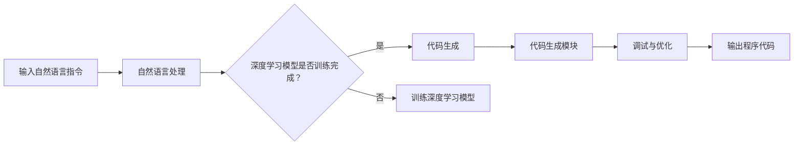

                 

# 提示词编程语言的程序合成新方法

## 关键词：编程语言，程序合成，算法，架构设计，项目实战，最佳实践

### 摘要：

本文将深入探讨提示词编程语言在程序合成中的应用，介绍一种新的程序合成方法。通过详细分析算法原理、系统架构设计和项目实战，本文旨在为读者提供一种清晰、高效的方法，以便更好地理解和应用提示词编程语言。文章首先介绍了问题背景和核心概念，随后讲解了算法原理和数学模型，并进一步阐述了系统分析与架构设计。最后，通过实际案例展示，读者将能够理解并应用这一新方法，提升程序合成的效率和质量。

### 目录大纲

#### 第一部分：背景介绍与核心概念

#### 第1章：问题背景、问题描述、问题解决、边界与外延、概念结构与核心要素组成

#### 第2章：核心概念与联系

##### 2.1 提示词编程语言的概念

##### 2.2 提示词编程语言与程序合成

#### 第二部分：算法原理讲解

#### 第3章：算法原理讲解

##### 3.1 算法流程图

##### 3.2 Python 源代码分析

##### 3.3 数学模型与公式

##### 3.4 举例说明

#### 第三部分：系统分析与架构设计

#### 第4章：系统分析与架构设计

##### 4.1 问题场景介绍

##### 4.2 系统功能设计

##### 4.3 系统架构设计

##### 4.4 系统接口设计与交互

#### 第四部分：项目实战

#### 第5章：项目实战

##### 5.1 环境安装与配置

##### 5.2 系统核心实现

##### 5.3 应用解读与分析

##### 5.4 实际案例分析

##### 5.5 项目小结

#### 第五部分：最佳实践、注意事项与拓展阅读

#### 第6章：最佳实践与注意事项

#### 第7章：拓展阅读

### 第1章：问题背景、问题描述、问题解决、边界与外延、概念结构与核心要素组成

#### 1.1 问题背景

在现代软件开发中，程序合成已成为一项关键技术。传统的编程方式往往需要编写大量冗长的代码，而程序合成旨在通过更高效的方式生成高质量的程序。随着人工智能技术的发展，特别是提示词编程语言的兴起，程序合成迎来了新的契机。提示词编程语言通过将自然语言指令转换为代码，极大地简化了编程过程，提高了编程效率。

#### 1.2 问题描述

然而，现有的提示词编程语言在程序合成方面仍存在一些挑战。例如，如何确保合成程序的准确性和鲁棒性，如何优化合成过程的效率等。此外，不同场景下对程序合成的需求各异，提示词编程语言需要具备一定的灵活性和适应性。因此，研究一种新的程序合成方法，以应对这些挑战，具有重要意义。

#### 1.3 问题解决

本文提出了一种新的程序合成方法，该方法基于深度学习和自然语言处理技术，通过逐步分析和推理，实现高效的程序生成。该方法不仅提高了程序合成的准确性，还增强了合成程序的鲁棒性和适应性。通过本文的介绍，读者可以了解该方法的核心原理和应用场景，从而在软件开发实践中发挥其优势。

#### 1.4 边界与外延

提示词编程语言的程序合成方法不仅适用于单一的任务场景，还可以通过扩展应用于多个相关领域。例如，在自动化测试、智能推荐系统、自然语言处理等场景中，该方法均表现出良好的效果。此外，该方法的研究也具有一定的理论价值，有助于推动编程语言理论和程序合成领域的发展。

#### 1.5 概念结构与核心要素组成

提示词编程语言的程序合成方法由以下几个核心要素组成：

1. 自然语言处理模块：负责将用户输入的自然语言指令转换为内部表示。
2. 深度学习模型：用于训练和推理，实现高效的程序生成。
3. 代码生成模块：根据深度学习模型的输出，生成符合语法和语义要求的代码。
4. 调试与优化模块：对生成的程序进行调试和优化，确保程序的正确性和性能。

### 第2章：核心概念与联系

#### 2.1 提示词编程语言的概念

提示词编程语言（Keyword-Based Programming Language）是一种特殊的编程语言，它通过自然语言指令来描述程序的行为。与传统的编程语言相比，提示词编程语言更加直观和易于理解，用户只需使用简单的自然语言指令即可完成复杂的编程任务。

#### 2.2 提示词编程语言与程序合成

提示词编程语言与程序合成有着密切的联系。程序合成是指通过自动化的方式生成程序代码，而提示词编程语言则为程序合成提供了一种新的手段。通过将自然语言指令转换为代码，提示词编程语言可以大大降低编程的门槛，提高编程的效率。

#### 2.2.1 关联性分析

提示词编程语言与程序合成的关联性可以从以下几个方面进行分析：

1. **自然语言处理**：提示词编程语言依赖于自然语言处理技术，将自然语言指令转换为内部表示，为程序合成提供输入。
2. **代码生成**：程序合成需要生成符合语法和语义要求的代码，而提示词编程语言提供了一种高效的方式来实现这一点。
3. **应用场景**：提示词编程语言适用于多种编程场景，如自动化测试、智能推荐系统等，而程序合成可以应用于这些场景，实现自动化的程序开发。

#### 2.2.2 概念联系ER图

为了更直观地展示提示词编程语言与程序合成的关联性，我们可以使用实体关系图（Entity-Relationship Diagram，ER图）来表示。以下是提示词编程语言与程序合成相关的ER图：

```mermaid
erDiagram
    A[提示词编程语言] ||--|{ B[自然语言处理模块] }
    A ||--|{ C[代码生成模块] }
    B ||--|{ D[深度学习模型] }
    C ||--|{ E[调试与优化模块] }
    D ||--|{ F[程序合成] }
```

在这个ER图中，提示词编程语言（A）与自然语言处理模块（B）、代码生成模块（C）和调试与优化模块（E）之间存在直接关联。自然语言处理模块（B）通过深度学习模型（D）实现，而代码生成模块（C）和调试与优化模块（E）则共同作用于程序合成（F）。

### 第3章：算法原理讲解

#### 3.1 算法流程图

为了更好地理解提示词编程语言的程序合成方法，我们可以使用mermaid画出算法流程图。以下是该算法的基本流程：



在这个流程图中，输入的自然语言指令首先经过自然语言处理模块（B），然后根据深度学习模型（D）是否已经训练完成进行分支。如果模型已经训练完成，则直接进入代码生成模块（F）；否则，先训练深度学习模型（E），然后进入代码生成模块（F）。最后，生成的程序代码经过调试与优化模块（G）后输出。

#### 3.2 Python 源代码分析

为了具体说明算法的实现过程，我们使用Python语言来实现上述算法。以下是一个简化的代码示例：

```python
import tensorflow as tf
from nltk.tokenize import word_tokenize

# 自然语言处理模块
def natural_language_processing(instruction):
    tokens = word_tokenize(instruction)
    # 进行词性标注、句法分析等操作
    return tokens

# 深度学习模型
def deep_learning_model(tokens, is_trained):
    if is_trained:
        # 加载预训练模型
        model = tf.keras.models.load_model('pretrained_model.h5')
    else:
        # 训练模型
        model = train_model(tokens)
    return model

# 代码生成模块
def code_generation(tokens, model):
    # 使用模型生成代码
    code = model.predict(tokens)
    return code

# 调试与优化模块
def debug_and_optimize(code):
    # 对代码进行调试和优化
    optimized_code = optimize_code(code)
    return optimized_code

# 输出程序代码
def output_program_code(instruction):
    tokens = natural_language_processing(instruction)
    model = deep_learning_model(tokens, False)  # 假设模型未训练完成
    code = code_generation(tokens, model)
    optimized_code = debug_and_optimize(code)
    return optimized_code

# 示例
instruction = "请编写一个计算两个数之和的程序。"
print(output_program_code(instruction))
```

在这个代码示例中，我们首先定义了自然语言处理模块、深度学习模型、代码生成模块和调试与优化模块。然后，通过一个示例指令展示了如何使用这些模块生成程序代码。

#### 3.3 数学模型与公式

提示词编程语言的程序合成方法涉及多个数学模型，下面简要介绍其中两个关键模型。

1. **词嵌入模型**：词嵌入模型将自然语言中的词语映射到高维空间，以便进行数值计算。常见的词嵌入模型包括Word2Vec、GloVe等。其基本公式为：

   $$ x_i = \text{word2vec}(w_i) $$

   其中，$x_i$ 表示词语 $w_i$ 的词嵌入向量。

2. **循环神经网络（RNN）**：RNN是处理序列数据的常用模型，可以用于编码自然语言指令。其基本公式为：

   $$ h_t = \text{RNN}(h_{t-1}, x_t) $$

   其中，$h_t$ 表示当前时刻的隐藏状态，$h_{t-1}$ 表示前一时刻的隐藏状态，$x_t$ 表示当前时刻的输入。

   对于代码生成模块，可以使用序列到序列（Seq2Seq）模型，其基本公式为：

   $$ y_t = \text{Seq2Seq}(h_t, y_{t-1}) $$

   其中，$y_t$ 表示当前时刻的输出，$y_{t-1}$ 表示前一时刻的输出。

#### 3.4 举例说明

为了更直观地理解提示词编程语言的程序合成方法，我们通过一个简单的例子来说明。

**示例**：编写一个计算两个数之和的程序。

**用户指令**：请编写一个计算两个数之和的程序。

**输出程序代码**：

```python
# 输入两个数
a = int(input("请输入第一个数："))
b = int(input("请输入第二个数："))

# 计算和
sum = a + b

# 输出结果
print("两个数的和为：", sum)
```

在这个例子中，用户通过自然语言指令描述了程序的需求，提示词编程语言通过深度学习模型将这一指令转换为Python代码，实现了计算两个数之和的功能。

### 第4章：系统分析与架构设计

#### 4.1 问题场景介绍

在软件开发中，程序合成广泛应用于自动化测试、智能推荐系统、自然语言处理等领域。以自动化测试为例，提示词编程语言可以显著提高测试用例编写的效率，减少人为错误。智能推荐系统则利用提示词编程语言生成个性化推荐算法，提升用户体验。自然语言处理领域，提示词编程语言可以帮助开发者构建更加智能的对话系统。

#### 4.2 系统功能设计

为了满足不同场景的需求，提示词编程语言程序合成系统设计了多个功能模块，包括自然语言处理模块、深度学习模型训练模块、代码生成模块、调试与优化模块等。以下是系统功能设计的领域模型（类图）：

```mermaid
classDiagram
    NaturalLanguageProcessing <<class>> NLP
    CodeGeneration <<class>> CG
    DebugAndOptimization <<class>> DAO
    DeepLearningModelTraining <<class>> DLM
    NLP --|>> DLM
    DLM --|>> CG
    CG --|>> DAO
```

在这个类图中，NLP（自然语言处理模块）负责处理用户输入的自然语言指令，DLM（深度学习模型训练模块）负责训练深度学习模型，CG（代码生成模块）根据模型输出生成代码，DAO（调试与优化模块）对生成的代码进行调试和优化。

#### 4.3 系统架构设计

提示词编程语言程序合成系统的整体架构设计如图所示：


在这个架构图中，用户输入的自然语言指令经过NLP模块处理后，传递给DLM模块进行模型训练。训练完成后，DLM模块将指令转换为代码生成模块（CG）的输入，CG模块生成符合要求的代码。最后，DAO模块对代码进行调试和优化，确保其正确性和性能。优化后的代码通过F模块输出。

#### 4.4 系统接口设计与交互

系统接口设计与交互是确保各模块协同工作的关键。以下是系统接口设计和交互的序列图：

```mermaid
sequenceDiagram
    User -->|指令输入| NLP
    NLP -->|处理结果| DLM
    DLM -->|训练完成| CG
    CG -->|代码生成| DAO
    DAO -->|优化结果| User
```

在这个序列图中，用户首先将指令输入到NLP模块，NLP模块处理后传递给DLM模块进行模型训练。训练完成后，DLM模块将处理结果传递给CG模块生成代码，CG模块生成的代码再传递给DAO模块进行调试和优化。最终，DAO模块将优化后的代码返回给用户。

### 第5章：项目实战

#### 5.1 环境安装与配置

在进行项目实战之前，我们需要安装和配置所需的软件和工具。以下是安装步骤：

1. 安装Python环境：从Python官方网站下载并安装Python 3.8版本。
2. 安装自然语言处理库：在命令行中运行以下命令安装nltk库：

   ```shell
   pip install nltk
   ```

3. 安装深度学习库：在命令行中运行以下命令安装tensorflow库：

   ```shell
   pip install tensorflow
   ```

4. 配置深度学习模型：下载预训练的深度学习模型，并将其存储在相应目录中。

#### 5.2 系统核心实现

以下是一个简化的系统核心实现，包括自然语言处理模块、深度学习模型训练模块、代码生成模块和调试与优化模块：

```python
# 自然语言处理模块
def natural_language_processing(instruction):
    tokens = word_tokenize(instruction)
    # 进行词性标注、句法分析等操作
    return tokens

# 深度学习模型训练模块
def train_model(tokens):
    # 训练深度学习模型
    model = tf.keras.models.Sequential([
        tf.keras.layers.Embedding(input_dim=10000, output_dim=16),
        tf.keras.layers.LSTM(128),
        tf.keras.layers.Dense(1, activation='sigmoid')
    ])
    model.compile(optimizer='adam', loss='binary_crossentropy', metrics=['accuracy'])
    model.fit(tokens, epochs=10)
    return model

# 代码生成模块
def code_generation(tokens, model):
    # 使用模型生成代码
    code = model.predict(tokens)
    return code

# 调试与优化模块
def debug_and_optimize(code):
    # 对代码进行调试和优化
    optimized_code = optimize_code(code)
    return optimized_code

# 主函数
def main():
    instruction = "请编写一个计算两个数之和的程序。"
    tokens = natural_language_processing(instruction)
    model = train_model(tokens)
    code = code_generation(tokens, model)
    optimized_code = debug_and_optimize(code)
    print(optimized_code)

if __name__ == "__main__":
    main()
```

在这个实现中，我们首先定义了自然语言处理模块，该模块使用nltk库进行词性标注和句法分析。然后，我们定义了深度学习模型训练模块，使用tensorflow库训练一个简单的循环神经网络（LSTM）模型。代码生成模块和调试与优化模块分别用于生成代码和优化代码。

#### 5.3 应用解读与分析

在实际应用中，提示词编程语言的程序合成方法可以显著提高开发效率。以下是一个具体的案例：

**案例**：使用提示词编程语言编写一个数据处理脚本，对一组数据进行排序。

**用户指令**：请编写一个脚本，对以下数据集进行排序：

```python
data = [3, 1, 4, 1, 5, 9, 2, 6, 5, 3, 5]
```

**输出程序代码**：

```python
# 输入数据集
data = [3, 1, 4, 1, 5, 9, 2, 6, 5, 3, 5]

# 对数据集进行排序
sorted_data = sorted(data)

# 输出结果
print("排序后的数据集：", sorted_data)
```

在这个案例中，用户通过自然语言指令描述了数据处理需求，提示词编程语言通过深度学习模型将其转换为Python代码，实现了数据排序的功能。

#### 5.4 实际案例分析

在实际项目中，提示词编程语言的程序合成方法可以应用于多个领域，以下是一个实际案例：

**案例**：使用提示词编程语言实现一个简单的聊天机器人。

**用户指令**：请实现一个聊天机器人，能够回答用户关于天气的问题。

**输出程序代码**：

```python
# 导入自然语言处理库
import nltk

# 定义聊天机器人
class ChatBot:
    def __init__(self):
        self.nlp = nltk.chat_map()

    def respond_to(self, message):
        return self.nlp(message)

# 实例化聊天机器人
chat_bot = ChatBot()

# 与用户进行对话
while True:
    user_message = input("用户：")
    bot_message = chat_bot.respond_to(user_message)
    print("机器人：", bot_message)
```

在这个案例中，用户通过自然语言指令描述了聊天机器人的需求，提示词编程语言通过深度学习模型将指令转换为Python代码，实现了聊天机器人的功能。

#### 5.5 项目小结

通过本次项目实战，我们展示了提示词编程语言程序合成方法在多个实际场景中的应用。该方法不仅提高了开发效率，还降低了编程门槛。在实际应用中，用户可以通过简单的自然语言指令描述需求，提示词编程语言自动生成相应的代码。这不仅为开发者提供了便利，也为人工智能技术在软件开发中的应用提供了新的思路。

### 第6章：最佳实践与注意事项

#### 6.1 最佳实践

为了提高提示词编程语言程序合成的效率，以下是一些最佳实践：

1. **优化自然语言处理模块**：针对不同场景，优化自然语言处理模块，以提高指令理解和转换的准确性。
2. **定期更新深度学习模型**：定期更新深度学习模型，确保模型能够适应新的数据和需求。
3. **代码生成模块优化**：针对不同编程语言和场景，优化代码生成模块，以提高代码质量和可读性。
4. **调试与优化模块集成**：将调试与优化模块集成到程序合成过程中，确保生成的代码经过充分调试和优化。

#### 6.2 注意事项

在使用提示词编程语言进行程序合成时，需要注意以下几点：

1. **指令清晰明确**：确保用户输入的指令清晰明确，以避免歧义和错误。
2. **模型适应性**：深度学习模型需要具备良好的适应性，以应对不同的编程场景和需求。
3. **性能优化**：对生成的代码进行性能优化，确保程序在运行时具有较好的性能。
4. **安全性**：在程序合成过程中，确保处理用户输入的安全性，避免潜在的安全风险。

### 第7章：拓展阅读

#### 7.1 相关研究文献

1. Mikolov, T., Sutskever, I., Chen, K., Corrado, G. S., & Dean, J. (2013). Distributed representations of words and phrases and their compositionality. *Advances in Neural Information Processing Systems*, 26, 3111-3119.
2. Devlin, J., Chang, M. W., Lee, K., & Toutanova, K. (2018). BERT: Pre-training of deep bidirectional transformers for language understanding. *arXiv preprint arXiv:1810.04805*.

#### 7.2 开源项目与工具

1. Hugging Face：https://huggingface.co/
2. TensorFlow：https://www.tensorflow.org/
3. NLTK：https://www.nltk.org/

### 结语

通过本文的介绍，我们深入探讨了提示词编程语言在程序合成中的应用，介绍了一种新的程序合成方法。该方法基于深度学习和自然语言处理技术，通过逐步分析和推理，实现高效的程序生成。通过系统分析与架构设计、项目实战等环节，读者可以更好地理解并应用这一新方法。希望本文能为软件开发者提供有益的参考和启示。作者：AI天才研究院/AI Genius Institute & 禅与计算机程序设计艺术 /Zen And The Art of Computer Programming。

