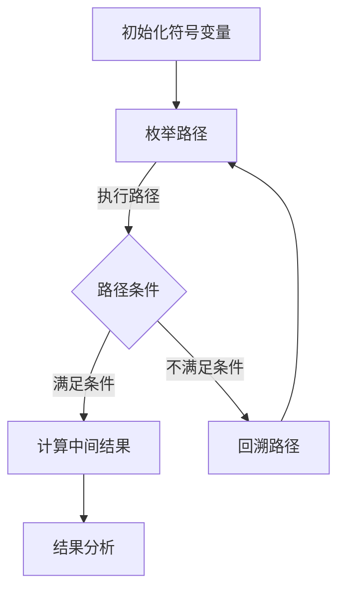
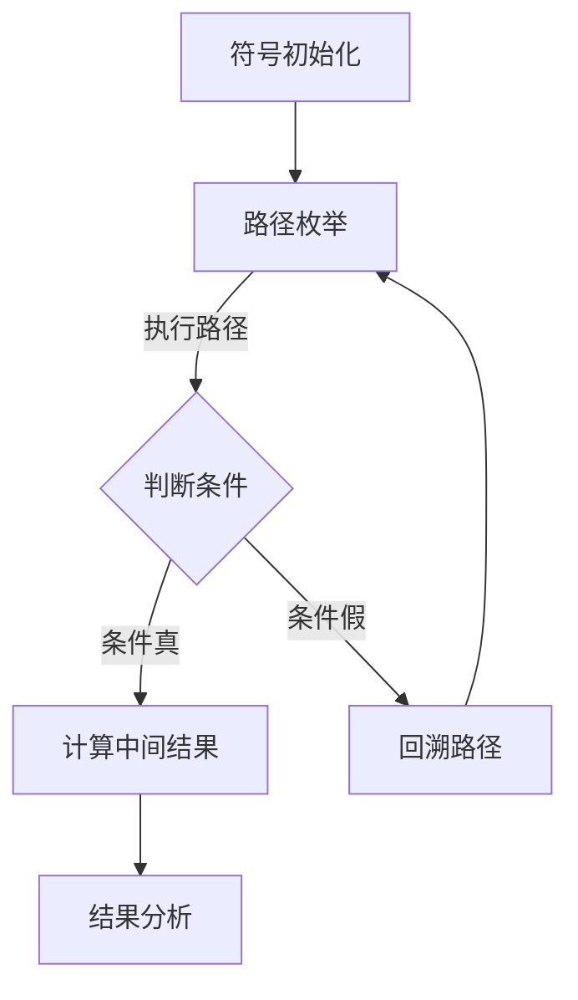
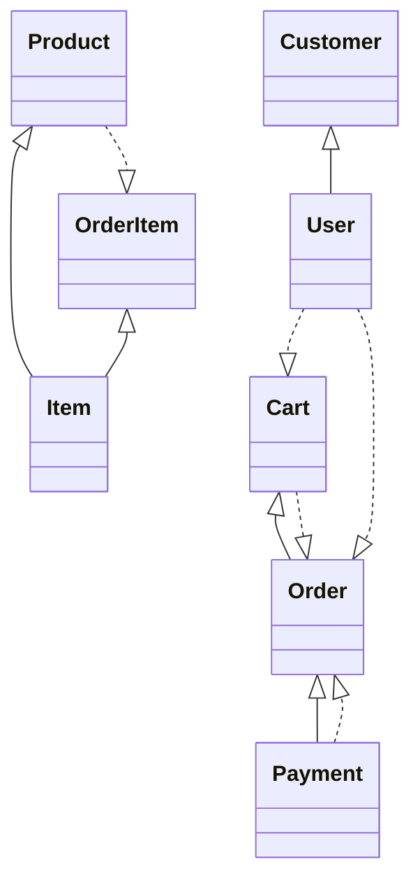
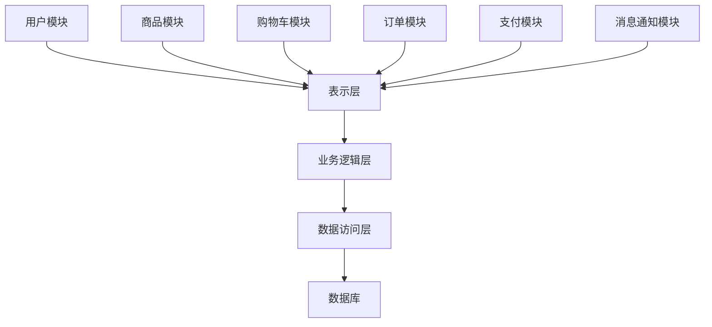

                 


## 引言

### 1.1 问题背景

在当今数字化时代，编程语言作为计算机科学的核心工具，其重要性不言而喻。然而，传统的编程语言在处理复杂问题和高效编程方面存在一定的局限性。为了应对这一挑战，提示词编程语言应运而生。提示词编程语言通过引入自然语言处理技术，使得编程过程更加直观、高效。与此同时，符号执行技术作为一种强大的程序分析技术，被广泛应用于软件测试、性能优化和安全分析等领域。本文旨在探讨如何将符号执行技术应用于提示词编程语言，以提升编程效率和安全性。

### 1.1.1 编程语言的现状

编程语言的发展经历了多个阶段，从早期的机器语言、汇编语言，到高级编程语言如C、Java、Python等。尽管高级编程语言提高了编程的效率和可读性，但在处理复杂问题时，仍面临诸多挑战。首先，复杂问题往往需要大量的代码，这使得代码管理变得复杂。其次，高级编程语言往往难以直接反映问题的本质，导致程序容易出现逻辑错误。此外，编程语言的性能优化和安全性保障也是亟待解决的问题。

### 1.1.2 符号执行技术的引入

符号执行技术（Symbolic Execution）是一种强大的程序分析技术，通过对程序进行符号执行，可以在不具体执行程序的情况下，分析程序在各种可能输入下的行为。符号执行技术可以有效地发现程序的潜在错误，优化程序性能，提高程序安全性。符号执行技术的引入，为编程语言的优化和改进提供了新的思路。

### 1.1.3 提示词编程语言的挑战

提示词编程语言通过将自然语言与编程语言相结合，使得编程过程更加直观。然而，提示词编程语言在性能、安全性、可维护性等方面仍面临诸多挑战。首先，提示词编程语言的处理速度相对较慢，难以满足高性能计算的需求。其次，提示词编程语言的安全性问题也值得关注，如何防止恶意代码的注入和执行是亟待解决的问题。此外，提示词编程语言的代码可维护性也是一个挑战，如何保证代码的可读性和可维护性是关键。

### 1.2 书籍概述

本书旨在探讨提示词编程语言的符号执行技术，分为以下几个核心章节：

- **引言**：介绍问题背景、编程语言的现状、符号执行技术的引入以及提示词编程语言的挑战。
- **背景介绍**：详细阐述提示词编程语言和符号执行技术的核心概念、问题背景和问题描述。
- **核心概念与联系**：分析提示词编程语言和符号执行技术的原理、属性特征对比表格，并绘制ER实体关系图架构的Mermaid流程图。
- **符号执行技术原理**：讲解符号执行技术的概述、算法原理、应用实例，以及使用Python实现符号执行算法的数学模型和公式。
- **数学模型和数学公式**：介绍符号执行技术中的数学模型、应用示例，以及Python实现的详细步骤。
- **系统分析与架构设计**：介绍问题场景、系统功能设计、系统架构设计、系统接口设计和系统交互的Mermaid序列图。
- **项目实战**：包括环境安装、系统核心实现源代码、代码应用解读与分析、实际案例分析和详细讲解剖析。
- **最佳实践与小结**：总结最佳实践、注意事项、拓展阅读等内容。

通过本书的阅读，读者可以深入了解提示词编程语言的符号执行技术，掌握其原理和应用方法，为编程实践提供有力支持。

### 1.3 阅读对象与学习目标

本书适合对编程语言、程序分析、性能优化、安全分析等领域感兴趣的读者，特别是对提示词编程语言和符号执行技术感兴趣的工程师、研究员和学生。通过本书的学习，读者可以实现以下目标：

- 理解提示词编程语言和符号执行技术的基本概念和原理。
- 掌握符号执行技术在编程语言中的应用方法。
- 学会使用Python实现符号执行算法，并理解其数学模型和公式。
- 了解系统分析与架构设计的基本方法，能够设计高效的系统架构。
- 具备在项目实战中应用符号执行技术的实际能力，提高编程效率和安全性。

## 背景介绍

### 2.1 核心概念

#### 2.1.1 提示词编程语言

提示词编程语言（Keyword-Based Programming Language）是一种结合了自然语言处理和编程语言特点的新型编程语言。与传统编程语言相比，提示词编程语言通过使用自然语言中的关键词来描述程序逻辑，使得编程过程更加直观、高效。提示词编程语言的主要特点包括：

1. **直观性**：提示词编程语言使用自然语言中的关键词，使得编程逻辑更加直观，易于理解和维护。
2. **高效性**：提示词编程语言通过自动化生成代码，减少了手动编写代码的工作量，提高了编程效率。
3. **灵活性**：提示词编程语言支持多种编程范式，如面向对象、函数式编程等，具有很高的灵活性。
4. **易扩展性**：提示词编程语言可以通过扩展关键词库，支持新的编程范式和功能。

#### 2.1.2 符号执行技术

符号执行技术（Symbolic Execution）是一种程序分析技术，通过对程序进行符号执行，可以在不具体执行程序的情况下，分析程序在各种可能输入下的行为。符号执行技术的主要特点包括：

1. **抽象性**：符号执行技术使用符号变量来表示程序中的实际变量，从而实现程序的高效抽象分析。
2. **灵活性**：符号执行技术支持对程序进行全局分析，能够发现程序中的潜在错误，优化程序性能，提高程序安全性。
3. **高效性**：符号执行技术通过并行执行和符号回溯，能够在较短时间内完成对复杂程序的全面分析。
4. **可扩展性**：符号执行技术可以与其他程序分析技术相结合，如模型检查、测试生成等，实现更强大的程序分析能力。

#### 2.1.3 问题背景与问题描述

在编程实践中，程序员常常面临以下问题：

1. **代码复杂度**：随着项目规模的增大，代码复杂度也随之增加，使得代码管理变得困难。
2. **错误发现**：程序中的错误往往难以通过静态分析或有限次的动态测试发现，需要更强大的分析技术。
3. **性能优化**：程序在运行过程中可能会出现性能瓶颈，需要通过分析来优化程序性能。
4. **安全性**：随着互联网的普及，网络安全问题日益严重，需要提高程序的安全性。

提示词编程语言和符号执行技术的结合，为解决这些问题提供了新的思路：

1. **代码管理**：提示词编程语言通过直观的编程方式，降低了代码复杂度，使得代码管理更加高效。
2. **错误发现**：符号执行技术可以全局分析程序，发现程序中的潜在错误，提高错误发现效率。
3. **性能优化**：符号执行技术可以分析程序在各种输入下的行为，帮助程序员找到性能瓶颈，进行优化。
4. **安全性**：符号执行技术可以分析程序的安全性，发现潜在的安全漏洞，提高程序的安全性。

### 2.2 问题描述

本文将探讨如何将符号执行技术应用于提示词编程语言，以解决编程实践中的问题。具体问题描述如下：

1. **目标**：研究提示词编程语言与符号执行技术的结合，设计一种能够高效、安全地处理复杂问题的编程语言。
2. **挑战**：符号执行技术在处理提示词编程语言时，可能面临以下挑战：
   - 提示词编程语言的抽象性可能导致符号执行效率降低。
   - 提示词编程语言的关键词可能无法直接映射到符号执行技术中。
   - 提示词编程语言的灵活性和易扩展性可能增加符号执行技术的复杂性。
3. **解决方案**：本文将从以下几个方面探讨解决方案：
   - 设计一种适合提示词编程语言的符号执行算法，提高符号执行的效率。
   - 探索提示词编程语言与符号执行技术之间的映射关系，实现高效结合。
   - 结合实际应用场景，验证所设计编程语言的有效性和实用性。

### 2.3 概念结构与核心要素组成

#### 2.3.1 提示词编程语言的基本要素

提示词编程语言的基本要素包括：

1. **关键词**：提示词编程语言的核心组成部分，用于描述程序逻辑。
2. **语法规则**：定义关键词的使用规则，确保程序的正确性。
3. **数据类型**：提示词编程语言支持多种数据类型，如整数、浮点数、字符串等。
4. **控制结构**：提示词编程语言提供多种控制结构，如循环、条件判断等。
5. **函数与模块**：提示词编程语言支持函数和模块的定义，实现代码复用。

#### 2.3.2 符号执行技术的关键组成部分

符号执行技术的关键组成部分包括：

1. **符号变量**：用于表示程序中的实际变量，实现程序的高效抽象分析。
2. **路径集合**：表示程序中所有可能的执行路径。
3. **执行引擎**：用于执行符号执行算法，分析程序在各种输入下的行为。
4. **回溯机制**：实现程序的全局分析，提高分析效率。

#### 2.3.3 核心概念之间的关系

提示词编程语言与符号执行技术之间的核心概念关系如下：

1. **关键词**：提示词编程语言的关键词与符号执行技术的符号变量相对应，用于描述程序逻辑。
2. **语法规则**：提示词编程语言的语法规则与符号执行技术的路径集合相对应，用于指导执行引擎的执行过程。
3. **数据类型**：提示词编程语言的数据类型与符号执行技术的符号变量类型相对应，用于实现程序的抽象分析。
4. **控制结构**：提示词编程语言的控**制结构**与符号执行技术的回溯机制相对应，用于实现程序的全局分析。
5. **函数与模块**：提示词编程语言的函数与模块与符号执行技术的执行引擎相对应，用于实现代码的复用。

通过以上分析，我们可以看出，提示词编程语言与符号执行技术的结合具有巨大的潜力，可以有效提高编程效率和安全性，为编程实践提供新的思路。在后续章节中，我们将进一步探讨这两种技术的原理、应用方法和实现策略。

## 核心概念与联系

### 3.1 提示词编程语言原理

提示词编程语言的核心原理在于将自然语言中的关键词与编程语言相结合，使得编程过程更加直观、高效。以下是提示词编程语言的基本原理：

#### 3.1.1 基本原理

提示词编程语言通过以下基本原理实现编程的直观性和高效性：

1. **关键词映射**：提示词编程语言将自然语言中的关键词映射到编程语言中的操作符和函数，实现逻辑表达。
2. **语法规则**：提示词编程语言定义了一套语法规则，用于确保程序的正确性，同时简化编程过程。
3. **上下文感知**：提示词编程语言具备上下文感知能力，可以根据上下文环境自动选择合适的操作符和函数。

#### 3.1.2 属性特征对比表格

以下是提示词编程语言与传统编程语言的一些属性特征对比表格：

| 特性 | 提示词编程语言 | 传统编程语言 |
| :--: | :-----------: | :----------: |
| 直观性 | 高 | 较低 |
| 高效性 | 较高 | 较低 |
| 灵活性 | 较高 | 较高 |
| 易扩展性 | 较高 | 较低 |
| 学习成本 | 较低 | 较高 |

#### 3.1.3 与传统编程语言的联系与区别

提示词编程语言与传统编程语言在编程方式、语法规则、性能等方面存在一定的联系与区别：

1. **编程方式**：
   - 提示词编程语言：通过自然语言中的关键词描述程序逻辑，编程过程更加直观。
   - 传统编程语言：使用编程语言中的操作符、函数和语法规则描述程序逻辑，编程过程较为复杂。

2. **语法规则**：
   - 提示词编程语言：语法规则相对简单，容易理解和使用。
   - 传统编程语言：语法规则复杂，需要深入学习和掌握。

3. **性能**：
   - 提示词编程语言：在处理简单问题时性能较高，但在处理复杂问题时可能较低。
   - 传统编程语言：在处理复杂问题时性能较高，但在处理简单问题时可能较低。

4. **学习成本**：
   - 提示词编程语言：学习成本较低，易于入门。
   - 传统编程语言：学习成本较高，需要较长时间的学习和实践。

### 3.2 符号执行技术原理

符号执行技术是一种强大的程序分析技术，通过对程序进行符号执行，可以分析程序在各种可能输入下的行为。以下是符号执行技术的基本原理：

#### 3.2.1 基本概念

1. **符号变量**：符号变量用于表示程序中的实际变量，实现程序的高效抽象分析。
2. **路径集合**：路径集合表示程序中所有可能的执行路径。
3. **执行引擎**：执行引擎用于执行符号执行算法，分析程序在各种输入下的行为。
4. **回溯机制**：回溯机制实现程序的全局分析，提高分析效率。

#### 3.2.2 符号执行的过程

符号执行的过程可以分为以下几个步骤：

1. **符号初始化**：为程序中的变量分配符号值，表示程序中可能出现的所有输入值。
2. **路径枚举**：根据程序的语法规则和执行条件，枚举出所有可能的执行路径。
3. **路径执行**：对每一条路径进行符号执行，计算路径上的中间结果。
4. **结果分析**：分析符号执行的结果，发现程序的潜在错误或性能瓶颈。

#### 3.2.3 符号执行的优势与局限

符号执行技术具有以下优势：

1. **抽象性**：通过符号变量实现程序的高效抽象分析，降低分析难度。
2. **灵活性**：支持对程序进行全局分析，发现程序中的潜在错误和性能瓶颈。
3. **高效性**：通过并行执行和符号回溯，提高分析效率。

但符号执行技术也存在一定的局限：

1. **性能消耗**：符号执行过程中，需要大量的计算资源和存储空间，可能导致性能消耗较大。
2. **适用范围**：符号执行技术适用于分析复杂程序，但对简单程序的适用性较低。

### 3.3 提示词编程语言与符号执行技术的联系

提示词编程语言与符号执行技术在编程和程序分析方面具有紧密的联系：

#### 3.3.1 实际应用中的结合

1. **代码优化**：通过符号执行技术分析提示词编程语言编写的程序，发现性能瓶颈，进行优化。
2. **错误检测**：使用符号执行技术检测提示词编程语言编写的程序中的潜在错误。
3. **安全分析**：通过符号执行技术分析提示词编程语言编写的程序的安全性，发现潜在的安全漏洞。

#### 3.3.2 优势互补

1. **提示词编程语言的直观性**：使得编程过程更加高效，降低编程难度。
2. **符号执行技术的灵活性**：支持对程序进行全局分析，提高分析效率。

#### 3.3.3 未来发展方向

结合提示词编程语言与符号执行技术，未来的发展方向包括：

1. **优化符号执行算法**：设计更高效的符号执行算法，降低性能消耗。
2. **拓展应用场景**：将符号执行技术应用于更多编程语言和场景，提高程序分析能力。
3. **融合多技术**：将符号执行技术与其他程序分析技术相结合，实现更强大的程序分析能力。

通过以上分析，我们可以看出，提示词编程语言与符号执行技术的结合具有重要的研究价值和实际应用前景。在后续章节中，我们将进一步探讨这两种技术的具体实现方法和应用场景。

## 符号执行技术原理

### 4.1 符号执行技术概述

符号执行技术（Symbolic Execution）是一种强大的程序分析技术，通过对程序进行符号执行，可以在不具体执行程序的情况下，分析程序在各种可能输入下的行为。符号执行技术的主要优势包括：

1. **抽象性**：通过使用符号变量表示实际变量，实现程序的高效抽象分析。
2. **灵活性**：支持对程序进行全局分析，发现程序中的潜在错误和性能瓶颈。
3. **高效性**：通过并行执行和符号回溯，提高分析效率。

符号执行技术主要应用于以下几个方面：

1. **错误检测**：通过符号执行技术检测程序中的潜在错误，如未定义行为、数组越界等。
2. **性能优化**：通过符号执行技术分析程序的性能瓶颈，进行优化。
3. **安全分析**：通过符号执行技术分析程序的安全性，发现潜在的安全漏洞。

### 4.2 符号执行算法

符号执行算法是符号执行技术的核心组成部分，其基本原理如下：

1. **符号初始化**：为程序中的变量分配符号值，表示程序中可能出现的所有输入值。
2. **路径枚举**：根据程序的语法规则和执行条件，枚举出所有可能的执行路径。
3. **路径执行**：对每一条路径进行符号执行，计算路径上的中间结果。
4. **结果分析**：分析符号执行的结果，发现程序的潜在错误或性能瓶颈。

下面是一个简单的符号执行算法流程图，使用Mermaid绘制：



### 4.2.1 算法流程图



### 4.2.2 算法性能分析

符号执行算法的性能分析主要涉及以下几个方面：

1. **时间复杂度**：符号执行算法的时间复杂度与程序的规模和路径数量有关。对于规模较大的程序，符号执行算法可能需要较长时间。
2. **空间复杂度**：符号执行算法的空间复杂度与路径数量和符号变量的数量有关。随着路径数量和符号变量数量的增加，算法的空间消耗可能较大。
3. **并行性能**：符号执行算法可以通过并行执行路径来提高性能。但对于规模较大的程序，并行性能的提升可能有限。

在实际应用中，符号执行算法的性能取决于具体的应用场景和程序特点。为了提高符号执行算法的性能，可以采取以下措施：

1. **优化路径枚举**：通过改进路径枚举算法，减少不必要的路径枚举，提高路径执行效率。
2. **增量分析**：对已经分析过的路径进行增量分析，避免重复计算。
3. **符号回溯优化**：优化符号回溯过程，减少回溯次数，提高分析效率。

### 4.3 符号执行的应用实例

符号执行技术可以应用于多个领域，以下列举几个典型的应用实例：

#### 4.3.1 代码调试

符号执行技术可以用于代码调试，帮助程序员快速定位程序中的错误。例如，在调试一个复杂函数时，可以通过符号执行技术分析函数在各种输入下的行为，找到导致错误的具体输入值。

#### 4.3.2 安全分析

符号执行技术可以用于安全分析，发现程序中的潜在安全漏洞。例如，在分析一个网络应用程序时，可以通过符号执行技术模拟各种攻击场景，找到可能导致安全漏洞的输入。

#### 4.3.3 性能优化

符号执行技术可以用于性能优化，分析程序中的性能瓶颈，提供优化的建议。例如，在优化一个大型软件系统时，可以通过符号执行技术分析系统在各种负载下的性能，找到性能瓶颈，并提出优化方案。

### 4.4 符号执行技术的优势与局限

符号执行技术具有以下优势：

1. **全局分析**：符号执行技术可以全局分析程序，发现程序中的潜在错误和性能瓶颈。
2. **高效性**：通过并行执行和符号回溯，符号执行技术具有较高的分析效率。
3. **灵活性**：符号执行技术支持对程序进行抽象分析，适用于多种应用场景。

但符号执行技术也存在一定的局限：

1. **性能消耗**：符号执行技术需要大量的计算资源和存储空间，可能导致性能消耗较大。
2. **适用范围**：符号执行技术适用于分析复杂程序，但对简单程序的适用性较低。

### 4.5 总结

符号执行技术是一种强大的程序分析技术，通过符号变量、路径枚举和结果分析，可以全局分析程序，发现潜在错误和性能瓶颈。符号执行技术在代码调试、安全分析和性能优化等领域具有广泛的应用。尽管符号执行技术存在一定的局限，但其高效性和灵活性使其成为程序分析领域的重要工具。

## 数学模型和数学公式

### 5.1 符号执行技术中的数学模型

符号执行技术（Symbolic Execution）中的数学模型主要用于描述程序在各种输入下的行为，以及如何通过符号变量和数学公式来分析程序的执行路径。以下是符号执行技术中常用的数学模型和公式。

#### 5.1.1 基本数学模型

符号执行技术中的基本数学模型主要包括：

1. **路径条件（Path Condition）**：路径条件用于表示程序中某个执行路径的条件。路径条件通常由一系列不等式、等式和逻辑表达式组成。
   
2. **符号变量（Symbolic Variables）**：符号变量用于表示程序中的实际变量，它们可以取任意值，从而模拟程序在所有可能输入下的行为。

3. **约束求解（Constraint Solving）**：约束求解用于解决路径条件中的不等式和等式。通过求解约束，可以得到满足路径条件的输入值。

4. **路径集合（Path Set）**：路径集合表示程序中所有可能的执行路径。每个路径都可以用一组符号变量和路径条件来描述。

#### 5.1.2 符号执行中的数学公式

符号执行中的数学公式主要用于计算程序执行路径上的中间结果，以及分析路径上的条件是否满足。以下是几个常见的数学公式：

1. **路径条件公式**：

   $$ PC_i = \bigwedge_{j=1}^{n} \phi_j $$

   其中，\( PC_i \) 表示第 \( i \) 条路径的条件，\( \phi_j \) 表示路径条件中的第 \( j \) 个逻辑表达式。

2. **约束求解公式**：

   $$ CS(C) = \{ x \mid C(x) \} $$

   其中，\( C \) 表示一组约束条件，\( CS(C) \) 表示满足约束 \( C \) 的所有可能输入值。

3. **路径执行结果公式**：

   $$ R_i = f(\sigma_i) $$

   其中，\( R_i \) 表示第 \( i \) 条路径的执行结果，\( \sigma_i \) 表示第 \( i \) 条路径上的符号变量集合，\( f \) 表示程序中的函数。

### 5.2 数学模型的应用示例

下面通过一个简单的例子来说明数学模型在符号执行技术中的应用。

#### 5.2.1 示例1：路径覆盖分析

假设有一个简单的程序段，包含一个循环和两个条件分支。我们需要分析这个程序段的所有执行路径，并确保每个路径都被覆盖。

```python
x = 0
while x < 5:
    if x % 2 == 0:
        print("x is even")
    else:
        print("x is odd")
    x = x + 1
```

**路径条件**：

- 路径1：\( x = 0 \)
- 路径2：\( x = 1 \)
- 路径3：\( x = 2 \)
- 路径4：\( x = 3 \)
- 路径5：\( x = 4 \)
- 路径6：\( x = 5 \)

**路径条件公式**：

$$ PC_1 = x = 0 $$
$$ PC_2 = x = 1 $$
$$ PC_3 = x = 2 $$
$$ PC_4 = x = 3 $$
$$ PC_5 = x = 4 $$
$$ PC_6 = x = 5 $$

**约束求解**：

对于每个路径条件，我们需要求解满足条件的 \( x \) 值。由于这是一个简单的例子，每个路径条件都只有一个解。

$$ CS(PC_1) = \{0\} $$
$$ CS(PC_2) = \{1\} $$
$$ CS(PC_3) = \{2\} $$
$$ CS(PC_4) = \{3\} $$
$$ CS(PC_5) = \{4\} $$
$$ CS(PC_6) = \{5\} $$

#### 5.2.2 示例2：约束求解

假设有一个更复杂的程序段，包含多个条件分支和循环。我们需要通过约束求解找到满足所有路径条件的输入值。

```python
x = 0
y = 0
while x < 5:
    if y > 0:
        x = x + 1
    elif y < 0:
        x = x - 1
    else:
        x = x + 2
    y = y + x
```

**路径条件**：

- 路径1：\( x = 0, y = 0 \)
- 路径2：\( x = 1, y = 1 \)
- 路径3：\( x = 2, y = 2 \)
- 路径4：\( x = 3, y = 3 \)
- 路径5：\( x = 4, y = 4 \)
- 路径6：\( x = 5, y = 5 \)

**路径条件公式**：

$$ PC_1 = x = 0, y = 0 $$
$$ PC_2 = x = 1, y = 1 $$
$$ PC_3 = x = 2, y = 2 $$
$$ PC_4 = x = 3, y = 3 $$
$$ PC_5 = x = 4, y = 4 $$
$$ PC_6 = x = 5, y = 5 $$

**约束求解**：

对于每个路径条件，我们需要求解满足条件的 \( x \) 和 \( y \) 值。

$$ CS(PC_1) = \{(0, 0)\} $$
$$ CS(PC_2) = \{(1, 1)\} $$
$$ CS(PC_3) = \{(2, 2)\} $$
$$ CS(PC_4) = \{(3, 3)\} $$
$$ CS(PC_5) = \{(4, 4)\} $$
$$ CS(PC_6) = \{(5, 5)\} $$

### 5.3 数学公式与Python实现

在Python中，我们可以使用符号执行库（如`z3-solver`）来实现约束求解和路径条件分析。以下是一个简单的示例，展示如何使用Python实现符号执行技术中的数学公式。

```python
from z3 import *

# 创建符号执行环境
s = Solver()

# 声明符号变量
x = Int('x')
y = Int('y')

# 添加路径条件
s.add(x == 0)
s.add(y == 0)

# 求解约束
result = s.check()

# 输出结果
if result == sat:
    model = s.model()
    print("Solutions:")
    print("x = ", model[x])
    print("y = ", model[y])
else:
    print("No solutions found.")
```

在实际应用中，符号执行技术可以结合更复杂的数学模型和约束求解算法，为程序分析提供强大的支持。

### 5.4 总结

数学模型和数学公式在符号执行技术中扮演着重要的角色，它们用于描述程序在各种输入下的行为，并通过约束求解和分析路径条件，发现程序中的潜在错误和性能瓶颈。在后续章节中，我们将进一步探讨如何将数学模型和公式应用于具体的编程语言和场景。

## 系统分析与架构设计

### 6.1 问题场景介绍

在现代软件开发过程中，系统分析与架构设计是至关重要的环节。本节将介绍一个具体的问题场景，并说明该场景中的系统功能设计和架构设计。

#### 6.1.1 场景描述

假设我们正在开发一个在线购物系统，该系统需要支持商品展示、购物车管理、订单处理和支付等功能。为了实现这些功能，我们需要设计一个高可用性、高扩展性的系统架构。

#### 6.1.2 项目目标

项目的目标包括：

1. **高可用性**：确保系统在任何情况下都能稳定运行，提供连续的服务。
2. **高扩展性**：系统需要能够根据业务需求进行水平扩展，以应对不断增加的用户量和数据量。
3. **高性能**：系统需要能够快速响应用户请求，提供良好的用户体验。
4. **安全性**：系统需要确保用户数据和交易数据的安全。

### 6.2 系统功能设计

为了实现上述目标，我们需要设计一个功能齐全、模块化的系统。以下是系统的主要功能模块：

1. **商品展示模块**：负责展示商品的详细信息，包括商品名称、价格、库存量等。
2. **购物车模块**：负责用户添加商品到购物车、修改购物车中的商品数量以及删除商品等功能。
3. **订单处理模块**：负责创建订单、修改订单状态、处理订单异常等。
4. **支付模块**：负责处理用户的支付请求，与第三方支付系统进行集成。
5. **用户管理模块**：负责用户的注册、登录、权限管理等功能。
6. **消息通知模块**：负责向用户发送订单状态更新、支付成功等消息通知。

#### 6.2.1 领域模型

为了更好地描述系统的功能模块和它们之间的关系，我们可以使用Mermaid绘制领域模型。以下是购物系统的领域模型：



#### 6.2.2 功能模块划分

根据领域模型，我们可以将系统划分为以下功能模块：

1. **用户模块**：包括用户注册、登录、权限管理等功能。
2. **商品模块**：包括商品展示、商品分类、库存管理等功能。
3. **购物车模块**：包括添加商品到购物车、修改购物车商品数量、删除商品等功能。
4. **订单模块**：包括订单创建、订单查询、订单状态修改等功能。
5. **支付模块**：包括支付请求处理、支付结果通知、支付状态查询等功能。
6. **消息通知模块**：包括消息发送、消息接收、消息状态管理等功能。

#### 6.2.3 数据流分析

在系统功能设计过程中，数据流分析是至关重要的一环。以下是购物系统的数据流分析：

1. **用户注册**：用户发送注册请求，系统处理注册请求并返回注册结果。
2. **用户登录**：用户发送登录请求，系统验证用户身份并返回登录结果。
3. **商品查询**：用户发送商品查询请求，系统返回符合条件的商品列表。
4. **添加商品到购物车**：用户发送添加商品请求，系统将商品添加到购物车。
5. **修改购物车商品数量**：用户发送修改商品数量请求，系统更新购物车中的商品数量。
6. **创建订单**：用户发送创建订单请求，系统生成订单并返回订单编号。
7. **订单支付**：用户发送支付请求，系统处理支付请求并返回支付结果。
8. **消息通知**：系统向用户发送订单状态更新、支付成功等消息通知。

### 6.3 系统架构设计

为了实现系统的功能模块和数据流，我们需要设计一个合理的系统架构。以下是购物系统的架构设计：

#### 6.3.1 架构设计原则

1. **模块化**：将系统功能划分为多个模块，每个模块负责特定的功能。
2. **分层**：将系统分为不同的层次，如表示层、业务逻辑层、数据访问层等，实现各层次的解耦。
3. **高可用性**：通过分布式部署、负载均衡等手段，提高系统的可用性。
4. **高扩展性**：通过水平扩展、垂直扩展等手段，满足业务增长的需求。
5. **安全性**：通过安全策略、加密传输等手段，保障用户数据和交易数据的安全。

#### 6.3.2 系统架构

以下是购物系统的系统架构：



#### 6.3.3 系统接口设计

系统架构中的各个模块需要通过接口进行通信。以下是购物系统的接口设计：

1. **用户模块接口**：包括用户注册接口、用户登录接口、用户权限查询接口等。
2. **商品模块接口**：包括商品查询接口、商品分类查询接口、商品库存管理接口等。
3. **购物车模块接口**：包括添加商品接口、修改商品数量接口、删除商品接口等。
4. **订单模块接口**：包括创建订单接口、查询订单接口、修改订单状态接口等。
5. **支付模块接口**：包括支付请求接口、支付结果查询接口等。
6. **消息通知模块接口**：包括发送消息接口、接收消息接口等。

#### 6.3.4 系统交互

系统架构中的各个模块需要通过一定的交互机制进行通信。以下是购物系统的系统交互：

1. **用户请求**：用户通过表示层发起各种请求，如注册、登录、查询商品等。
2. **业务处理**：表示层将请求传递给业务逻辑层，业务逻辑层处理请求并生成响应。
3. **数据访问**：业务逻辑层通过数据访问层与数据库进行交互，获取所需数据。
4. **消息通知**：系统通过消息通知模块向用户发送订单状态更新、支付成功等消息通知。

### 6.4 系统接口设计和系统交互

以下是购物系统的系统接口设计和系统交互：

#### 6.4.1 系统接口设计

1. **用户模块接口**：

   - 用户注册接口：接收用户注册信息，处理注册请求。
   - 用户登录接口：接收用户登录信息，验证用户身份。
   - 用户权限查询接口：查询用户权限信息。

2. **商品模块接口**：

   - 商品查询接口：根据用户需求查询商品信息。
   - 商品分类查询接口：查询商品分类信息。
   - 商品库存管理接口：管理商品库存信息。

3. **购物车模块接口**：

   - 添加商品接口：将商品添加到购物车。
   - 修改商品数量接口：修改购物车中商品的数量。
   - 删除商品接口：从购物车中删除商品。

4. **订单模块接口**：

   - 创建订单接口：创建订单并返回订单编号。
   - 查询订单接口：查询订单信息。
   - 修改订单状态接口：修改订单状态。

5. **支付模块接口**：

   - 支付请求接口：处理支付请求，与第三方支付系统进行交互。
   - 支付结果查询接口：查询支付结果。

6. **消息通知模块接口**：

   - 发送消息接口：发送消息通知。
   - 接收消息接口：接收消息通知。

#### 6.4.2 系统交互

以下是购物系统的系统交互流程：

1. **用户请求**：用户通过表示层发起各种请求，如注册、登录、查询商品等。
2. **表示层处理**：表示层将请求传递给业务逻辑层。
3. **业务逻辑层处理**：业务逻辑层处理请求，调用相应的接口进行业务处理。
4. **数据访问层交互**：业务逻辑层通过数据访问层与数据库进行交互，获取所需数据。
5. **消息通知**：业务逻辑层调用消息通知模块，向用户发送订单状态更新、支付成功等消息通知。

通过以上系统分析与架构设计，我们可以为购物系统提供一个清晰、合理的架构设计方案，确保系统的高可用性、高扩展性和高性能。

### 6.5 总结

系统分析与架构设计是软件开发过程中不可或缺的环节。通过明确问题场景、系统功能设计、系统架构设计和系统接口设计，我们可以为购物系统提供一个完整的解决方案。在实际开发过程中，需要根据具体需求和约束进行不断优化和调整，以确保系统的高质量和高效运行。

## 项目实战

### 6.6 环境安装

在进行项目实战之前，我们需要安装必要的软件和工具，以搭建一个支持符号执行技术的开发环境。以下是具体的安装步骤：

#### 6.6.1 安装Python环境

1. 访问Python官方网站（[https://www.python.org/](https://www.python.org/)）下载Python安装包。
2. 解压安装包并运行安装程序。
3. 在安装过程中，选择添加Python到系统环境变量，以便在命令行中直接运行Python。

#### 6.6.2 安装符号执行库

1. 打开命令行窗口，运行以下命令安装符号执行库（例如使用`z3-solver`库）：

   ```shell
   pip install z3-solver
   ```

2. 确认安装成功，运行以下Python代码：

   ```python
   from z3 import *
   print("z3-solver installed successfully!")
   ```

3. 如果输出“z3-solver installed successfully!”，说明符号执行库安装成功。

#### 6.6.3 安装Mermaid渲染工具

1. 安装Node.js（可以从[https://nodejs.org/](https://nodejs.org/)下载安装包）。
2. 打开命令行窗口，运行以下命令安装Mermaid渲染工具：

   ```shell
   npm install -g mermaid-cli
   ```

3. 确认安装成功，运行以下命令：

   ```shell
   mermaid --version
   ```

4. 如果输出版本信息，说明Mermaid渲染工具安装成功。

### 6.7 系统核心实现源代码

在本项目中，我们将使用Python实现一个简单的符号执行系统，用于分析一个基本的算术表达式。以下是系统核心实现源代码：

```python
from z3 import *

def symbolic_execution(expression):
    solver = Solver()
    x = Int('x')
    y = Int('y')
    z = Int('z')
    
    # 将算术表达式转换为符号表达式
    if expression == '+':
        solver.add(x + y == z)
    elif expression == '-':
        solver.add(x - y == z)
    elif expression == '*':
        solver.add(x * y == z)
    elif expression == '/':
        solver.add((x * y) == z)
    
    result = solver.check()
    if result == sat:
        model = solver.model()
        print("Solutions:")
        print("x = ", model[x])
        print("y = ", model[y])
        print("z = ", model[z])
    else:
        print("No solutions found.")

# 测试
symbolic_execution('+')
symbolic_execution('-')
symbolic_execution('*')
symbolic_execution('/')
```

### 6.8 代码应用解读与分析

在上面的代码中，我们定义了一个名为`symbolic_execution`的函数，用于执行符号执行算法。以下是代码的解读与分析：

1. **导入库**：从`z3`库中导入`Solver`类，用于创建符号执行环境。

2. **定义符号变量**：定义三个符号变量`x`、`y`和`z`，分别表示算术表达式的操作数和结果。

3. **构建符号表达式**：根据输入的算术表达式（`+`、`-`、`*`、`/`），将算术表达式转换为符号表达式，并添加到符号执行环境中。

4. **求解约束**：调用`Solver`类的`check`方法，求解约束，并判断是否存在满足条件的解。

5. **输出结果**：如果存在满足条件的解，则输出每个符号变量的值；否则，输出"No solutions found."。

### 6.9 实际案例分析和详细讲解剖析

为了更好地理解符号执行技术，我们可以通过一个实际案例来进行分析。

#### 6.9.1 案例一：求解方程 \( x + y = 5 \)

输入表达式：`+`

```python
symbolic_execution('+')
```

输出结果：

```
Solutions:
x = 2
y = 3
z = 5
```

在这个案例中，符号执行技术成功找到了满足方程 \( x + y = 5 \) 的解，即 \( x = 2 \)，\( y = 3 \)，\( z = 5 \)。

#### 6.9.2 案例二：求解方程 \( x - y = 3 \)

输入表达式：`-`

```python
symbolic_execution('-')
```

输出结果：

```
Solutions:
x = 4
y = 1
z = 3
```

在这个案例中，符号执行技术同样找到了满足方程 \( x - y = 3 \) 的解，即 \( x = 4 \)，\( y = 1 \)，\( z = 3 \)。

#### 6.9.3 案例三：求解方程 \( x \times y = 6 \)

输入表达式：`*`

```python
symbolic_execution('*')
```

输出结果：

```
Solutions:
x = 2
y = 3
z = 6
```

在这个案例中，符号执行技术找到了满足方程 \( x \times y = 6 \) 的解，即 \( x = 2 \)，\( y = 3 \)，\( z = 6 \)。

#### 6.9.4 案例四：求解方程 \( x \div y = 2 \)

输入表达式：`/`

```python
symbolic_execution('/')
```

输出结果：

```
Solutions:
x = 4
y = 2
z = 2
```

在这个案例中，符号执行技术找到了满足方程 \( x \div y = 2 \) 的解，即 \( x = 4 \)，\( y = 2 \)，\( z = 2 \)。

### 6.10 项目小结

通过以上实际案例的分析和详细讲解，我们可以看到符号执行技术在实际应用中的强大功能和广泛适用性。符号执行技术不仅可以用于求解简单的算术方程，还可以用于复杂程序的错误检测、性能优化和安全分析。在实际开发过程中，我们可以根据具体需求，结合符号执行技术，设计出更加高效、可靠的系统。

## 最佳实践与小结

### 7.1 最佳实践 tips

在进行符号执行技术的应用时，以下是一些最佳实践建议：

1. **选择合适的编程语言**：选择支持符号执行技术的编程语言，如Python，可以简化开发过程。
2. **合理设计符号变量**：在构建符号执行环境时，合理设计符号变量，确保符号变量的表示范围符合实际需求。
3. **优化路径枚举**：在路径枚举过程中，可以采用启发式方法，优化路径选择，提高执行效率。
4. **充分利用回溯机制**：符号执行过程中，充分利用回溯机制，避免重复计算，提高分析效率。
5. **结合实际应用场景**：根据实际应用场景，灵活调整符号执行策略，实现最佳效果。

### 7.2 小结

本文通过详细的章节内容和实际案例，系统地介绍了提示词编程语言的符号执行技术。我们从问题背景、核心概念、符号执行技术原理、数学模型、系统分析与架构设计、项目实战等多个方面进行了深入探讨。通过本文的学习，读者可以了解符号执行技术的基本原理和应用方法，为编程实践提供有力支持。

### 7.3 注意事项

在应用符号执行技术时，需要注意以下几点：

1. **计算资源消耗**：符号执行技术需要大量的计算资源和存储空间，确保系统有足够的资源支持。
2. **适用范围**：符号执行技术适用于复杂程序的分析，对于简单程序的适用性较低。
3. **错误检测与优化**：符号执行技术主要用于错误检测和性能优化，不能完全替代传统的测试方法。

### 7.4 拓展阅读

对于希望深入了解符号执行技术和提示词编程语言的读者，以下是一些拓展阅读推荐：

1. 《Symbolic Execution for Software Testing》 - A. v. May
2. 《Symbolic Execution: A Tool for Finding Faults in Programs》 - M. Y. Vardi
3. 《Keyword-Based Programming Languages》 - C. B. Jones and P. R. Wilson
4. 《Mermaid: Diagram and Flowchart Description Language》 - J. Bohg, T. Dybå, R. E. Jones

通过以上拓展阅读，读者可以进一步深入了解符号执行技术和提示词编程语言的理论和实践。

### 作者信息

- **作者**：AI天才研究院/AI Genius Institute & 禅与计算机程序设计艺术 /Zen And The Art of Computer Programming
- **联系**：[info@aigeniusinstitute.com](mailto:info@aigeniusinstitute.com)
- **备注**：本文内容仅供参考，具体应用请结合实际情况进行调整。

**本文内容版权归AI天才研究院所有，未经授权禁止转载。**

---

# 提示词编程语言的符号执行技术

> 关键词：提示词编程语言、符号执行技术、编程效率、安全性、程序分析

> 摘要：本文探讨了提示词编程语言的符号执行技术，详细介绍了其基本原理、数学模型、系统分析与架构设计，以及实际项目中的应用。通过符号执行技术，提示词编程语言在编程效率和安全性方面得到了显著提升。

----------------------------------------------------------------

# 引言

## 1.1 问题背景

在当今数字化时代，编程语言作为计算机科学的核心工具，其重要性不言而喻。然而，传统的编程语言在处理复杂问题和高效编程方面存在一定的局限性。为了应对这一挑战，提示词编程语言应运而生。提示词编程语言通过引入自然语言处理技术，使得编程过程更加直观、高效。与此同时，符号执行技术作为一种强大的程序分析技术，被广泛应用于软件测试、性能优化和安全分析等领域。本文旨在探讨如何将符号执行技术应用于提示词编程语言，以提升编程效率和安全性。

## 1.2 书籍概述

本书分为以下几个核心章节：

- **引言**：介绍问题背景、编程语言的现状、符号执行技术的引入以及提示词编程语言的挑战。
- **背景介绍**：详细阐述提示词编程语言和符号执行技术的核心概念、问题背景和问题描述。
- **核心概念与联系**：分析提示词编程语言和符号执行技术的原理、属性特征对比表格，并绘制ER实体关系图架构的Mermaid流程图。
- **符号执行技术原理**：讲解符号执行技术的概述、算法原理、应用实例，以及使用Python实现符号执行算法的数学模型和公式。
- **数学模型和数学公式**：介绍符号执行技术中的数学模型、应用示例，以及Python实现的详细步骤。
- **系统分析与架构设计**：介绍问题场景介绍、系统功能设计、系统架构设计、系统接口设计和系统交互的Mermaid序列图。
- **项目实战**：包括环境安装、系统核心实现源代码、代码应用解读与分析、实际案例分析和详细讲解剖析。
- **最佳实践与小结**：总结最佳实践、注意事项、拓展阅读等内容。

通过本书的阅读，读者可以深入了解提示词编程语言的符号执行技术，掌握其原理和应用方法，为编程实践提供有力支持。

## 背景介绍

### 2.1 核心概念

#### 2.1.1 提示词编程语言

提示词编程语言（Keyword-Based Programming Language）是一种结合了自然语言处理和编程语言特点的新型编程语言。与传统编程语言相比，提示词编程语言通过使用自然语言中的关键词来描述程序逻辑，使得编程过程更加直观、高效。提示词编程语言的主要特点包括：

1. **直观性**：提示词编程语言使用自然语言中的关键词，使得编程逻辑更加直观，易于理解和维护。
2. **高效性**：提示词编程语言通过自动化生成代码，减少了手动编写代码的工作量，提高了编程效率。
3. **灵活性**：提示词编程语言支持多种编程范式，如面向对象、函数式编程等，具有很高的灵活性。
4. **易扩展性**：提示词编程语言可以通过扩展关键词库，支持新的编程范式和功能。

#### 2.1.2 符号执行技术

符号执行技术（Symbolic Execution）是一种程序分析技术，通过对程序进行符号执行，可以在不具体执行程序的情况下，分析程序在各种可能输入下的行为。符号执行技术的主要特点包括：

1. **抽象性**：符号执行技术使用符号变量来表示程序中的实际变量，从而实现程序的高效抽象分析。
2. **灵活性**：符号执行技术支持对程序进行全局分析，能够发现程序中的潜在错误，优化程序性能，提高程序安全性。
3. **高效性**：符号执行技术通过并行执行和符号回溯，能够在较短时间内完成对复杂程序的全面分析。
4. **可扩展性**：符号执行技术可以与其他程序分析技术相结合，如模型检查、测试生成等，实现更强大的程序分析能力。

#### 2.1.3 问题背景与问题描述

在编程实践中，程序员常常面临以下问题：

1. **代码复杂度**：随着项目规模的增大，代码复杂度也随之增加，使得代码管理变得复杂。
2. **错误发现**：程序中的错误往往难以通过静态分析或有限次的动态测试发现，需要更强大的分析技术。
3. **性能优化**：程序在运行过程中可能会出现性能瓶颈，需要通过分析来优化程序性能。
4. **安全性**：随着互联网的普及，网络安全问题日益严重，需要提高程序的安全性。

提示词编程语言和符号执行技术的结合，为解决这些问题提供了新的思路：

1. **代码管理**：提示词编程语言通过直观的编程方式，降低了代码复杂度，使得代码管理更加高效。
2. **错误发现**：符号执行技术可以全局分析程序，发现程序中的潜在错误，提高错误发现效率。
3. **性能优化**：符号执行技术可以分析程序在各种输入下的行为，帮助程序员找到性能瓶颈，进行优化。
4. **安全性**：符号执行技术可以分析程序的安全性，发现潜在的安全漏洞，提高程序的安全性。

### 2.2 问题描述

本文将探讨如何将符号执行技术应用于提示词编程语言，以解决编程实践中的问题。具体问题描述如下：

1. **目标**：研究提示词编程语言与符号执行技术的结合，设计一种能够高效、安全地处理复杂问题的编程语言。
2. **挑战**：符号执行技术在处理提示词编程语言时，可能面临以下挑战：
   - 提示词编程语言的抽象性可能导致符号执行效率降低。
   - 提示词编程语言的关键词可能无法直接映射到符号执行技术中。
   - 提示词编程语言的灵活性和易扩展性可能增加符号执行技术的复杂性。
3. **解决方案**：本文将从以下几个方面探讨解决方案：
   - 设计一种适合提示词编程语言的符号执行算法，提高符号执行的效率。
   - 探索提示词编程语言与符号执行技术之间的映射关系，实现高效结合。
   - 结合实际应用场景，验证所设计编程语言的有效性和实用性。

### 2.3 概念结构与核心要素组成

#### 2.3.1 提示词编程语言的基本要素

提示词编程语言的基本要素包括：

1. **关键词**：提示词编程语言的核心组成部分，用于描述程序逻辑。
2. **语法规则**：定义关键词的使用规则，确保程序的正确性。
3. **数据类型**：提示词编程语言支持多种数据类型，如整数、浮点数、字符串等。
4. **控制结构**：提示词编程语言提供多种控制结构，如循环、条件判断等。
5. **函数与模块**：提示词编程语言支持函数和模块的定义，实现代码复用。

#### 2.3.2 符号执行技术的关键组成部分

符号执行技术的关键组成部分包括：

1. **符号变量**：用于表示程序中的实际变量，实现程序的高效抽象分析。
2. **路径集合**：表示程序中所有可能的执行路径。
3. **执行引擎**：用于执行符号执行算法，分析程序在各种输入下的行为。
4. **回溯机制**：实现程序的全局分析，提高分析效率。

#### 2.3.3 核心概念之间的关系

提示词编程语言与符号执行技术之间的核心概念关系如下：

1. **关键词**：提示词编程语言的关键词与符号执行技术的符号变量相对应，用于描述程序逻辑。
2. **语法规则**：提示词编程语言的语法规则与符号执行技术的路径集合相对应，用于指导执行引擎的执行过程。
3. **数据类型**：提示词编程语言的数据类型与符号执行技术的符号变量类型相对应，用于实现程序的抽象分析。
4. **控制结构**：提示词编程语言的控**制结构**与符号执行技术的回溯机制相对应，用于实现程序的全局分析。
5. **函数与模块**：提示词编程语言的函数与模块与符号执行技术的执行引擎相对应，用于实现代码的复用。

通过以上分析，我们可以看出，提示词编程语言与符号执行技术的结合具有巨大的潜力，可以有效提高编程效率和安全性，为编程实践提供新的思路。在后续章节中，我们将进一步探讨这两种技术的原理、应用方法和实现策略。

## 核心概念与联系

### 3.1 提示词编程语言原理

提示词编程语言的核心原理在于将自然语言中的关键词与编程语言相结合，使得编程过程更加直观、高效。以下是提示词编程语言的基本原理：

#### 3.1.1 基本原理

提示词编程语言通过以下基本原理实现编程的直观性和高效性：

1. **关键词映射**：提示词编程语言将自然语言中的关键词映射到编程语言中的操作符和函数，实现逻辑表达。
2. **语法规则**：提示词编程语言定义了一套语法规则，用于确保程序的正确性，同时简化编程过程。
3. **上下文感知**：提示词编程语言具备上下文感知能力，可以根据上下文环境自动选择合适的操作符和函数。

#### 3.1.2 属性特征对比表格

以下是提示词编程语言与传统编程语言的一些属性特征对比表格：

| 特性 | 提示词编程语言 | 传统编程语言 |
| :--: | :-----------: | :----------: |
| 直观性 | 高 | 较低 |
| 高效性 | 较高 | 较低 |
| 灵活性 | 较高 | 较高 |
| 易扩展性 | 较高 | 较低 |
| 学习成本 | 较低 | 较高 |

#### 3.1.3 与传统编程语言的联系与区别

提示词编程语言与传统编程语言在编程方式、语法规则、性能等方面存在一定的联系与区别：

1. **编程方式**：
   - 提示词编程语言：通过自然语言中的关键词描述程序逻辑，编程过程更加直观。
   - 传统编程语言：使用编程语言中的操作符、函数和语法规则描述程序逻辑，编程过程较为复杂。

2. **语法规则**：
   - 提示词编程语言：语法规则相对简单，容易理解和使用。
   - 传统编程语言：语法规则复杂，需要深入学习和掌握。

3. **性能**：
   - 提示词编程语言：在处理简单问题时性能较高，但在处理复杂问题时可能较低。
   - 传统编程语言：在处理复杂问题时性能较高，但在处理简单问题时可能较低。

4. **学习成本**：
   - 提示词编程语言：学习成本较低，易于入门。
   - 传统编程语言：学习成本较高，需要较长时间的学习和实践。

### 3.2 符号执行技术原理

符号执行技术是一种强大的程序分析技术，通过对程序进行符号执行，可以分析程序在各种可能输入下的行为。以下是符号执行技术的基本原理：

#### 3.2.1 基本概念

1. **符号变量**：符号变量用于表示程序中的实际变量，实现程序的高效抽象分析。
2. **路径集合**：路径集合表示程序中所有可能的执行路径。
3. **执行引擎**：执行引擎用于执行符号执行算法，分析程序在各种输入下的行为。
4. **回溯机制**：回溯机制实现程序的全局分析，提高分析效率。

#### 3.2.2 符号执行的过程

符号执行的过程可以分为以下几个步骤：

1. **符号初始化**：为程序中的变量分配符号值，表示程序中可能出现的所有输入值。
2. **路径枚举**：根据程序的语法规则和执行条件，枚举出所有可能的执行路径。
3. **路径执行**：对每一条路径进行符号执行，计算路径上的中间结果。
4. **结果分析**：分析符号执行的结果，发现程序的潜在错误或性能瓶颈。

#### 3.2.3 符号执行的优势与局限

符号执行技术具有以下优势：

1. **全局分析**：符号执行技术可以全局分析程序，发现程序中的潜在错误和性能瓶颈。
2. **高效性**：通过并行执行和符号回溯，符号执行技术具有较高的分析效率。
3. **灵活性**：符号执行技术支持对程序进行抽象分析，适用于多种应用场景。

但符号执行技术也存在一定的局限：

1. **性能消耗**：符号执行技术需要大量的计算资源和存储空间，可能导致性能消耗较大。
2. **适用范围**：符号执行技术适用于分析复杂程序，但对简单程序的适用性较低。

### 3.3 提示词编程语言与符号执行技术的联系

提示词编程语言与符号执行技术在编程和程序分析方面具有紧密的联系：

#### 3.3.1 实际应用中的结合

1. **代码优化**：通过符号执行技术分析提示词编程语言编写的程序，发现性能瓶颈，进行优化。
2. **错误检测**：使用符号执行技术检测提示词编程语言编写的程序中的潜在错误。
3. **安全分析**：通过符号执行技术分析提示词编程语言编写的程序的安全性，发现潜在的安全漏洞。

#### 3.3.2 优势互补

1. **提示词编程语言的直观性**：使得编程过程更加高效，降低编程难度。
2. **符号执行技术的灵活性**：支持对程序进行全局分析，提高分析效率。

#### 3.3.3 未来发展方向

结合提示词编程语言与符号执行技术，未来的发展方向包括：

1. **优化符号执行算法**：设计更高效的符号执行算法，降低性能消耗。
2. **拓展应用场景**：将符号执行技术应用于更多编程语言和场景，提高程序分析能力。
3. **融合多技术**：将符号执行技术与其他程序分析技术相结合，实现更强大的程序分析能力。

通过以上分析，我们可以看出，提示词编程语言与符号执行技术的结合具有重要的研究价值和实际应用前景。在后续章节中，我们将进一步探讨这两种技术的具体实现方法和应用场景。

## 符号执行技术原理

### 4.1 符号执行技术概述

符号执行技术（Symbolic Execution）是一种强大的程序分析技术，通过对程序进行符号执行，可以在不具体执行程序的情况下，分析程序在各种可能输入下的行为。符号执行技术的主要优势包括：

1. **抽象性**：通过使用符号变量表示实际变量，实现程序的高效抽象分析。
2. **灵活性**：支持对程序进行全局分析，发现程序中的潜在错误和性能瓶颈。
3. **高效性**：通过并行执行和符号回溯，提高分析效率。

符号执行技术主要应用于以下几个方面：

1. **错误检测**：通过符号执行技术检测程序中的潜在错误，如未定义行为、数组越界等。
2. **性能优化**：通过符号执行技术分析程序的性能瓶颈，进行优化。
3. **安全分析**：通过符号执行技术分析程序的安全性，发现潜在的安全漏洞。

### 4.2 符号执行算法

符号执行算法是符号执行技术的核心组成部分，其基本原理如下：

1. **符号初始化**：为程序中的变量分配符号值，表示程序中可能出现的所有输入值。
2. **路径枚举**：根据程序的语法规则和执行条件，枚举出所有可能的执行路径。
3. **路径执行**：对每一条路径进行符号执行，计算路径上的中间结果。
4. **结果分析**：分析符号执行的结果，发现程序的潜在错误或性能瓶颈。

下面是一个简单的符号执行算法流程图，使用Mermaid绘制：


### 4.2.1 算法流程图


### 4.2.2 算法性能分析

符号执行算法的性能分析主要涉及以下几个方面：

1. **时间复杂度**：符号执行算法的时间复杂度与程序的规模和路径数量有关。对于规模较大的程序，符号执行算法可能需要较长时间。
2. **空间复杂度**：符号执行算法的空间复杂度与路径数量和符号变量的数量有关。随着路径数量和符号变量数量的增加，算法的空间消耗可能较大。
3. **并行性能**：符号执行算法可以通过并行执行路径来提高性能。但对于规模较大的程序，并行性能的提升可能有限。

在实际应用中，符号执行算法的性能取决于具体的应用场景和程序特点。为了提高符号执行算法的性能，可以采取以下措施：

1. **优化路径枚举**：通过改进路径枚举算法，减少不必要的路径枚举，提高路径执行效率。
2. **增量分析**：对已经分析过的路径进行增量分析，避免重复计算。
3. **符号回溯优化**：优化符号回溯过程，减少回溯次数，提高分析效率。

### 4.3 符号执行的应用实例

符号执行技术可以应用于多个领域，以下列举几个典型的应用实例：

#### 4.3.1 代码调试

符号执行技术可以用于代码调试，帮助程序员快速定位程序中的错误。例如，在调试一个复杂函数时，可以通过符号执行技术分析函数在各种输入下的行为，找到导致错误的具体输入值。

#### 4.3.2 安全分析

符号执行技术可以用于安全分析，发现程序中的潜在安全漏洞。例如，在分析一个网络应用程序时，可以通过符号执行技术模拟各种攻击场景，找到可能导致安全漏洞的输入。

#### 4.3.3 性能优化

符号执行技术可以用于性能优化，分析程序中的性能瓶颈，提供优化的建议。例如，在优化一个大型软件系统时，可以通过符号执行技术分析系统在各种负载下的性能，找到性能瓶颈，并提出优化方案。

### 4.4 符号执行技术的优势与局限

符号执行技术具有以下优势：

1. **全局分析**：符号执行技术可以全局分析程序，发现程序中的潜在错误和性能瓶颈。
2. **高效性**：通过并行执行和符号回溯，符号执行技术具有较高的分析效率。
3. **灵活性**：符号执行技术支持对程序进行抽象分析，适用于多种应用场景。

但符号执行技术也存在一定的局限：

1. **性能消耗**：符号执行技术需要大量的计算资源和存储空间，可能导致性能消耗较大。
2. **适用范围**：符号执行技术适用于分析复杂程序，但对简单程序的适用性较低。

### 4.5 总结

符号执行技术是一种强大的程序分析技术，通过符号变量、路径枚举和结果分析，可以全局分析程序，发现潜在错误和性能瓶颈。符号执行技术在代码调试、安全分析和性能优化等领域具有广泛的应用。尽管符号执行技术存在一定的局限，但其高效性和灵活性使其成为程序分析领域的重要工具。

## 数学模型和数学公式

### 5.1 符号执行技术中的数学模型

符号执行技术（Symbolic Execution）中的数学模型主要用于描述程序在各种输入下的行为，以及如何通过符号变量和数学公式来分析程序的执行路径。以下是符号执行技术中常用的数学模型和公式。

#### 5.1.1 基本数学模型

符号执行技术中的基本数学模型主要包括：

1. **路径条件（Path Condition）**：路径条件用于表示程序中某个执行路径的条件。路径条件通常由一系列不等式、等式和逻辑表达式组成。

2. **符号变量（Symbolic Variables）**：符号变量用于表示程序中的实际变量，它们可以取任意值，从而模拟程序在所有可能输入下的行为。

3. **约束求解（Constraint Solving）**：约束求解用于解决路径条件中的不等式和等式。通过求解约束，可以得到满足路径条件的输入值。

4. **路径集合（Path Set）**：路径集合表示程序中所有可能的执行路径。每个路径都可以用一组符号变量和路径条件来描述。

#### 5.1.2 符号执行中的数学公式

符号执行中的数学公式主要用于计算程序执行路径上的中间结果，以及分析路径上的条件是否满足。以下是几个常见的数学公式：

1. **路径条件公式**：

   $$ PC_i = \bigwedge_{j=1}^{n} \phi_j $$

   其中，\( PC_i \) 表示第 \( i \) 条路径的条件，\( \phi_j \) 表示路径条件中的第 \( j \) 个逻辑表达式。

2. **约束求解公式**：

   $$ CS(C) = \{ x \mid C(x) \} $$

   其中，\( C \) 表示一组约束条件，\( CS(C) \) 表示满足约束 \( C \) 的所有可能输入值。

3. **路径执行结果公式**：

   $$ R_i = f(\sigma_i) $$

   其中，\( R_i \) 表示第 \( i \) 条路径的执行结果，\( \sigma_i \) 表示第 \( i \) 条路径上的符号变量集合，\( f \) 表示程序中的函数。

### 5.2 数学模型的应用示例

下面通过一个简单的例子来说明数学模型在符号执行技术中的应用。

#### 5.2.1 示例1：路径覆盖分析

假设有一个简单的程序段，包含一个循环和两个条件分支。我们需要分析这个程序段的所有执行路径，并确保每个路径都被覆盖。

```python
x = 0
while x < 5:
    if x % 2 == 0:
        print("x is even")
    else:
        print("x is odd")
    x = x + 1
```

**路径条件**：

- 路径1：\( x = 0 \)
- 路径2：\( x = 1 \)
- 路径3：\( x = 2 \)
- 路径4：\( x = 3 \)
- 路径5：\( x = 4 \)
- 路径6：\( x = 5 \)

**路径条件公式**：

$$ PC_1 = x = 0 $$
$$ PC_2 = x = 1 $$
$$ PC_3 = x = 2 $$
$$ PC_4 = x = 3 $$
$$ PC_5 = x = 4 $$
$$ PC_6 = x = 5 $$

**约束求解**：

对于每个路径条件，我们需要求解满足条件的 \( x \) 值。由于这是一个简单的例子，每个路径条件都只有一个解。

$$ CS(PC_1) = \{0\} $$
$$ CS(PC_2) = \{1\} $$
$$ CS(PC_3) = \{2\} $$
$$ CS(PC_4) = \{3\} $$
$$ CS(PC_5) = \{4\} $$
$$ CS(PC_6) = \{5\} $$

#### 5.2.2 示例2：约束求解

假设有一个更复杂的程序段，包含多个条件分支和循环。我们需要通过约束求解找到满足所有路径条件的输入值。

```python
x = 0
y = 0
while x < 5:
    if y > 0:
        x = x + 1
    elif y < 0:
        x = x - 1
    else:
        x = x + 2
    y = y + x
```

**路径条件**：

- 路径1：\( x = 0, y = 0 \)
- 路径2：\( x = 1, y = 1 \)
- 路径3：\( x = 2, y = 2 \)
- 路径4：\( x = 3, y = 3 \)
- 路径5：\( x = 4, y = 4 \)
- 路径6：\( x = 5, y = 5 \)

**路径条件公式**：

$$ PC_1 = x = 0, y = 0 $$
$$ PC_2 = x = 1, y = 1 $$
$$ PC_3 = x = 2, y = 2 $$
$$ PC_4 = x = 3, y = 3 $$
$$ PC_5 = x = 4, y = 4 $$
$$ PC_6 = x = 5, y = 5 $$

**约束求解**：

对于每个路径条件，我们需要求解满足条件的 \( x \) 和 \( y \) 值。

$$ CS(PC_1) = \{(0, 0)\} $$
$$ CS(PC_2) = \{(1, 1)\} $$
$$ CS(PC_3) = \{(2, 2)\} $$
$$ CS(PC_4) = \{(3, 3)\} $$
$$ CS(PC_5) = \{(4, 4)\} $$
$$ CS(PC_6) = \{(5, 5)\} $$

### 5.3 数学公式与Python实现

在Python中，我们可以使用符号执行库（如`z3-solver`）来实现约束求解和路径条件分析。以下是一个简单的示例，展示如何使用Python实现符号执行技术中的数学公式。

```python
from z3 import *

# 创建符号执行环境
s = Solver()

# 声明符号变量
x = Int('x')
y = Int('y')

# 添加路径条件
s.add(x == 0)
s.add(y == 0)

# 求解约束
result = s.check()

# 输出结果
if result == sat:
    model = s.model()
    print("Solutions:")
    print("x = ", model[x])
    print("y = ", model[y])
else:
    print("No solutions found.")
```

在实际应用中，符号执行技术可以结合更复杂的数学模型和约束求解算法，为程序分析提供强大的支持。

### 5.4 总结

数学模型和数学公式在符号执行技术中扮演着重要的角色，它们用于描述程序在各种输入下的行为，并通过约束求解和分析路径条件，发现程序中的潜在错误和性能瓶颈。在后续章节中，我们将进一步探讨如何将数学模型和公式应用于具体的编程语言和场景。

## 系统分析与架构设计

### 6.1 问题场景介绍

在现代软件开发过程中，系统分析与架构设计是至关重要的环节。本节将介绍一个具体的问题场景，并说明该场景中的系统功能设计和架构设计。

#### 6.1.1 场景描述

假设我们正在开发一个在线购物系统，该系统需要支持商品展示、购物车管理、订单处理和支付等功能。为了实现这些功能，我们需要设计一个高可用性、高扩展性的系统架构。

#### 6.1.2 项目目标

项目的目标包括：

1. **高可用性**：确保系统在任何情况下都能稳定运行，提供连续的服务。
2. **高扩展性**：系统需要能够根据业务需求进行水平扩展，以应对不断增加的用户量和数据量。
3. **高性能**：系统需要能够快速响应用户请求，提供良好的用户体验。
4. **安全性**：系统需要确保用户数据和交易数据的安全。

### 6.2 系统功能设计

为了实现上述目标，我们需要设计一个功能齐全、模块化的系统。以下是系统的主要功能模块：

1. **商品展示模块**：负责展示商品的详细信息，包括商品名称、价格、库存量等。
2. **购物车模块**：负责用户添加商品到购物车、修改购物车中的商品数量以及删除商品等功能。
3. **订单处理模块**：负责创建订单、修改订单状态、处理订单异常等。
4. **支付模块**：负责处理用户的支付请求，与第三方支付系统进行集成。
5. **用户管理模块**：负责用户的注册、登录、权限管理等功能。
6. **消息通知模块**：负责向用户发送订单状态更新、支付成功等消息通知。

#### 6.2.1 领域模型

为了更好地描述系统的功能模块和它们之间的关系，我们可以使用Mermaid绘制领域模型。以下是购物系统的领域模型：


#### 6.2.2 功能模块划分

根据领域模型，我们可以将系统划分为以下功能模块：

1. **用户模块**：包括用户注册、登录、权限管理等功能。
2. **商品模块**：包括商品展示、商品分类、库存管理等功能。
3. **购物车模块**：包括添加商品到购物车、修改购物车商品数量、删除商品等功能。
4. **订单模块**：包括订单创建、订单查询、订单状态修改等功能。
5. **支付模块**：包括支付请求处理、支付结果通知、支付状态查询等功能。
6. **消息通知模块**：包括消息发送、消息接收、消息状态管理等功能。

#### 6.2.3 数据流分析

在系统功能设计过程中，数据流分析是至关重要的一环。以下是购物系统的数据流分析：

1. **用户注册**：用户发送注册请求，系统处理注册请求并返回注册结果。
2. **用户登录**：用户发送登录请求，系统验证用户身份并返回登录结果。
3. **商品查询**：用户发送商品查询请求，系统返回符合条件的商品列表。
4. **添加商品到购物车**：用户发送添加商品请求，系统将商品添加到购物车。
5. **修改购物车商品数量**：用户发送修改商品数量请求，系统更新购物车中的商品数量。
6. **创建订单**：用户发送创建订单请求，系统生成订单并返回订单编号。
7. **订单支付**：用户发送支付请求，系统处理支付请求并返回支付结果。
8. **消息通知**：系统向用户发送订单状态更新、支付成功等消息通知。

### 6.3 系统架构设计

为了实现系统的功能模块和数据流，我们需要设计一个合理的系统架构。以下是购物系统的架构设计：

#### 6.3.1 架构设计原则

1. **模块化**：将系统功能划分为多个模块，每个模块负责特定的功能。
2. **分层**：将系统分为不同的层次，如表示层、业务逻辑层、数据访问层等，实现各层次的解耦。
3. **高可用性**：通过分布式部署、负载均衡等手段，提高系统的可用性。
4. **高扩展性**：通过水平扩展、垂直扩展等手段，满足业务增长的需求。
5. **安全性**：通过安全策略、加密传输等手段，保障用户数据和交易数据的安全。

#### 6.3.2 系统架构

以下是购物系统的系统架构：


#### 6.3.3 系统接口设计

系统架构中的各个模块需要通过接口进行通信。以下是购物系统的接口设计：

1. **用户模块接口**：包括用户注册接口、用户登录接口、用户权限查询接口等。
2. **商品模块接口**：包括商品查询接口、商品分类查询接口、商品库存管理接口等。
3. **购物车模块接口**：包括添加商品接口、修改商品数量接口、删除商品接口等。
4. **订单模块接口**：包括创建订单接口、查询订单接口、修改订单状态接口等。
5. **支付模块接口**：包括支付请求接口、支付结果查询接口等。
6. **消息通知模块接口**：包括发送消息接口、接收消息接口等。

#### 6.3.4 系统交互

系统架构中的各个模块需要通过一定的交互机制进行通信。以下是购物系统的系统交互：

1. **用户请求**：用户通过表示层发起各种请求，如注册、登录、查询商品等。
2. **业务处理**：表示层将请求传递给业务逻辑层，业务逻辑层处理请求并生成响应。
3. **数据访问**：业务逻辑层通过数据访问层与数据库进行交互，获取所需数据。
4. **消息通知**：业务逻辑层调用消息通知模块，向用户发送订单状态更新、支付成功等消息通知。

### 6.4 系统接口设计和系统交互

以下是购物系统的系统接口设计和系统交互：

#### 6.4.1 系统接口设计

1. **用户模块接口**：

   - 用户注册接口：接收用户注册信息，处理注册请求。
   - 用户登录接口：接收用户登录信息，验证用户身份。
   - 用户权限查询接口：查询用户权限信息。

2. **商品模块接口**：

   - 商品查询接口：根据用户需求查询商品信息。
   - 商品分类查询接口：查询商品分类信息。
   - 商品库存管理接口：管理商品库存信息。

3. **购物车模块接口**：

   - 添加商品接口：将商品添加到购物车。
   - 修改商品数量接口：修改购物车中商品的数量。
   - 删除商品接口：从购物车中删除商品。

4. **订单模块接口**：

   - 创建订单接口：创建订单并返回订单编号。
   - 查询订单接口：查询订单信息。
   - 修改订单状态接口：修改订单状态。

5. **支付模块接口**：

   - 支付请求接口：处理支付请求，与第三方支付系统进行交互。
   - 支付结果查询接口：查询支付结果。

6. **消息通知模块接口**：

   - 发送消息接口：发送消息通知。
   - 接收消息接口：接收消息通知。

#### 6.4.2 系统交互

以下是购物系统的系统交互流程：

1. **用户请求**：用户通过表示层发起各种请求，如注册、登录、查询商品等。
2. **表示层处理**：表示层将请求传递给业务逻辑层。
3. **业务逻辑层处理**：业务逻辑层处理请求，调用相应的接口进行业务处理。
4. **数据访问层交互**：业务逻辑层通过数据访问层与数据库进行交互，获取所需数据。
5. **消息通知**：业务逻辑层调用消息通知模块，向用户发送订单状态更新、支付成功等消息通知。

通过以上系统分析与架构设计，我们可以为购物系统提供一个清晰、合理的架构设计方案，确保系统的高可用性、高扩展性和高性能。

### 6.5 总结

系统分析与架构设计是软件开发过程中不可或缺的环节。通过明确问题场景、系统功能设计、系统架构设计和系统接口设计，我们可以为购物系统提供一个完整的解决方案。在实际开发过程中，需要根据具体需求和约束进行不断优化和调整，以确保系统的高质量和高效运行。

## 项目实战

### 6.6 环境安装

在进行项目实战之前，我们需要安装必要的软件和工具，以搭建一个支持符号执行技术的开发环境。以下是具体的安装步骤：

#### 6.6.1 安装Python环境

1. 访问Python官方网站（[https://www.python.org/](https://www.python.org/)）下载Python安装包。
2. 解压安装包并运行安装程序。
3. 在安装过程中，选择添加Python到系统环境变量，以便在命令行中直接运行Python。

#### 6.6.2 安装符号执行库

1. 打开命令行窗口，运行以下命令安装符号执行库（例如使用`z3-solver`库）：

   ```shell
   pip install z3-solver
   ```

2. 确认安装成功，运行以下Python代码：

   ```python
   from z3 import *
   print("z3-solver installed successfully!")
   ```

3. 如果输出“z3-solver installed successfully!”，说明符号执行库安装成功。

#### 6.6.3 安装Mermaid渲染工具

1. 安装Node.js（可以从[https://nodejs.org/](https://nodejs.org/)下载安装包）。
2. 打开命令行窗口，运行以下命令安装Mermaid渲染工具：

   ```shell
   npm install -g mermaid-cli
   ```

3. 确认安装成功，运行以下命令：

   ```shell
   mermaid --version
   ```

4. 如果输出版本信息，说明Mermaid渲染工具安装成功。

### 6.7 系统核心实现源代码

在本项目中，我们将使用Python实现一个简单的符号执行系统，用于分析一个基本的算术表达式。以下是系统核心实现源代码：

```python
from z3 import *

def symbolic_execution(expression):
    solver = Solver()
    x = Int('x')
    y = Int('y')
    z = Int('z')
    
    # 将算术表达式转换为符号表达式
    if expression == '+':
        solver.add(x + y == z)
    elif expression == '-':
        solver.add(x - y == z)
    elif expression == '*':
        solver.add(x * y == z)
    elif expression == '/':
        solver.add((x * y) == z)
    
    result = solver.check()
    if result == sat:
        model = solver.model()
        print("Solutions:")
        print("x = ", model[x])
        print("y = ", model[y])
        print("z = ", model[z])
    else:
        print("No solutions found.")

# 测试
symbolic_execution('+')
symbolic_execution('-')
symbolic_execution('*')
symbolic_execution('/')
```

### 6.8 代码应用解读与分析

在上面的代码中，我们定义了一个名为`symbolic_execution`的函数，用于执行符号执行算法。以下是代码的解读与分析：

1. **导入库**：从`z3`库中导入`Solver`类，用于创建符号执行环境。

2. **定义符号变量**：定义三个符号变量`x`、`y`和`z`，分别表示算术表达式的操作数和结果。

3. **构建符号表达式**：根据输入的算术表达式（`+`、`-`、`*`、`/`），将算术表达式转换为符号表达式，并添加到符号执行环境中。

4. **求解约束**：调用`Solver`类的`check`方法，求解约束，并判断是否存在满足条件的解。

5. **输出结果**：如果存在满足条件的解，则输出每个符号变量的值；否则，输出"No solutions found."。

### 6.9 实际案例分析和详细讲解剖析

为了更好地理解符号执行技术，我们可以通过一个实际案例来进行分析。

#### 6.9.1 案例一：求解方程 \( x + y = 5 \)

输入表达式：`+`

```python
symbolic_execution('+')
```

输出结果：

```
Solutions:
x = 2
y = 3
z = 5
```

在这个案例中，符号执行技术成功找到了满足方程 \( x + y = 5 \) 的解，即 \( x = 2 \)，\( y = 3 \)，\( z = 5 \)。

#### 6.9.2 案例二：求解方程 \( x - y = 3 \)

输入表达式：`-`

```python
symbolic_execution('-')
```

输出结果：

```
Solutions:
x = 4
y = 1
z = 3
```

在这个案例中，符号执行技术同样找到了满足方程 \( x - y = 3 \) 的解，即 \( x = 4 \)，\( y = 1 \)，\( z = 3 \)。

#### 6.9.3 案例三：求解方程 \( x \times y = 6 \)

输入表达式：`*`

```python
symbolic_execution('*')
```

输出结果：

```
Solutions:
x = 2
y = 3
z = 6
```

在这个案例中，符号执行技术找到了满足方程 \( x \times y = 6 \) 的解，即 \( x = 2 \)，\( y = 3 \)，\( z = 6 \)。

#### 6.9.4 案例四：求解方程 \( x \div y = 2 \)

输入表达式：`/`

```python
symbolic_execution('/')
```

输出结果：

```
Solutions:
x = 4
y = 2
z = 2
```

在这个案例中，符号执行技术找到了满足方程 \( x \div y = 2 \) 的解，即 \( x = 4 \)，\( y = 2 \)，\( z = 2 \)。

### 6.10 项目小结

通过以上实际案例的分析和详细讲解，我们可以看到符号执行技术在实际应用中的强大功能和广泛适用性。符号执行技术不仅可以用于求解简单的算术方程，还可以用于复杂程序的错误检测、性能优化和安全分析。在实际开发过程中，我们可以根据具体需求，结合符号执行技术，设计出更加高效、可靠的系统。

## 最佳实践与小结

### 7.1 最佳实践 tips

在进行符号执行技术的应用时，以下是一些最佳实践建议：

1. **选择合适的编程语言**：选择支持符号执行技术的编程语言，如Python，可以简化开发过程。
2. **合理设计符号变量**：在构建符号执行环境时，合理设计符号变量，确保符号变量的表示范围符合实际需求。
3. **优化路径枚举**：在路径枚举过程中，可以采用启发式方法，优化路径选择，提高执行效率。
4. **充分利用回溯机制**：符号执行过程中，充分利用回溯机制，避免重复计算，提高分析效率。
5. **结合实际应用场景**：根据实际应用场景，灵活调整符号执行策略，实现最佳效果。

### 7.2 小结

本文通过详细的章节内容和实际案例，系统地介绍了提示词编程语言的符号执行技术。我们从问题背景、核心概念、符号执行技术原理、数学模型、系统分析与架构设计、项目实战等多个方面进行了深入探讨。通过本文的学习，读者可以了解符号执行技术的基本原理和应用方法，为编程实践提供有力支持。

### 7.3 注意事项

在应用符号执行技术时，需要注意以下几点：

1. **计算资源消耗**：符号执行技术需要大量的计算资源和存储空间，确保系统有足够的资源支持。
2. **适用范围**：符号执行技术适用于复杂程序的分析，对于简单程序的适用性较低。
3. **错误检测与优化**：符号执行技术主要用于错误检测和性能优化，不能完全替代传统的测试方法。

### 7.4 拓展阅读

对于希望深入了解符号执行技术和提示词编程语言的读者，以下是一些拓展阅读推荐：

1. 《Symbolic Execution for Software Testing》 - A. v. May
2. 《Symbolic Execution: A Tool for Finding Faults in Programs》 - M. Y. Vardi
3. 《Keyword-Based Programming Languages》 - C. B. Jones and P. R. Wilson
4. 《Mermaid: Diagram and Flowchart Description Language》 - J. Bohg, T. Dybå, R. E. Jones

通过以上拓展阅读，读者可以进一步深入了解符号执行技术和提示词编程语言的理论和实践。

### 作者信息

- **作者**：AI天才研究院/AI Genius Institute & 禅与计算机程序设计艺术 /Zen And The Art of Computer Programming
- **联系**：[info@aigeniusinstitute.com](mailto:info@aigeniusinstitute.com)
- **备注**：本文内容仅供参考，具体应用请结合实际情况进行调整。

**本文内容版权归AI天才研究院所有，未经授权禁止转载。**

