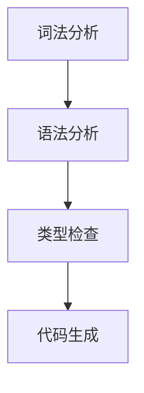
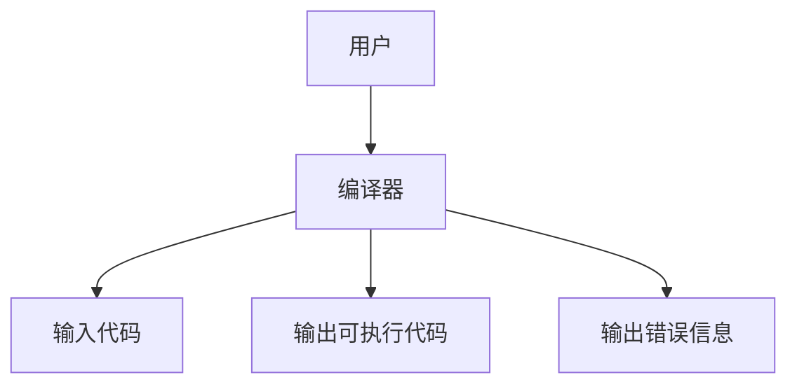
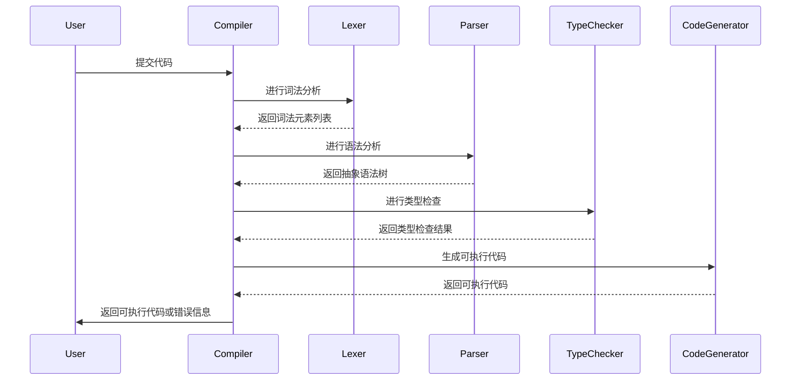
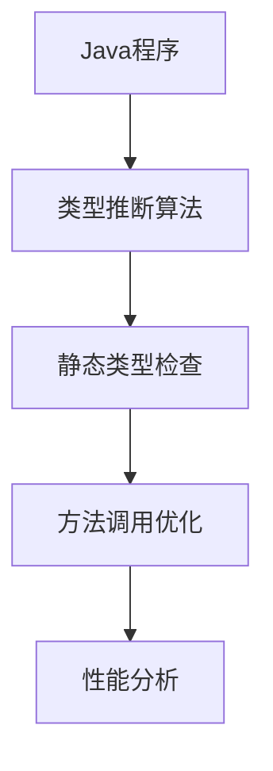
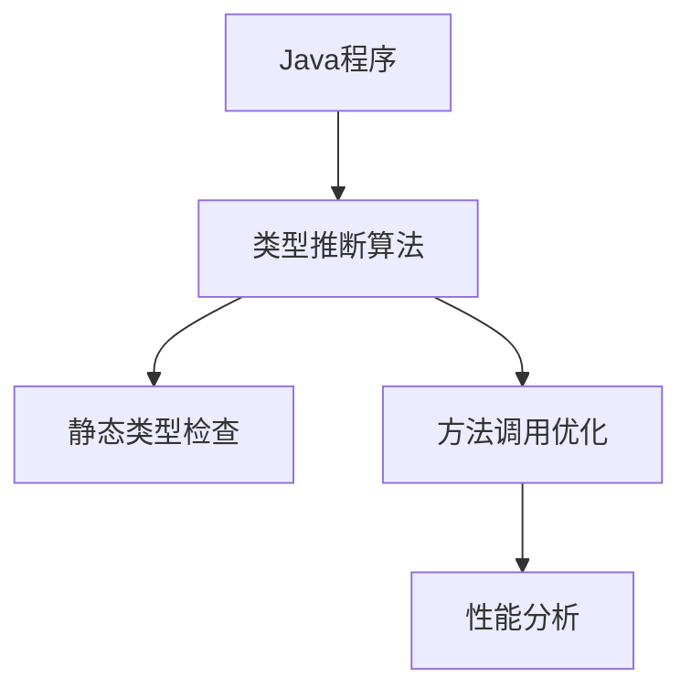
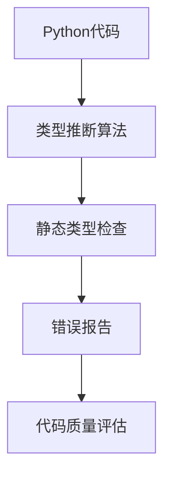
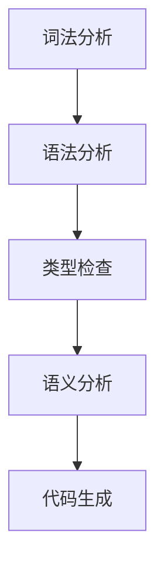
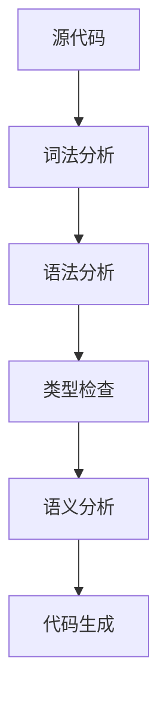
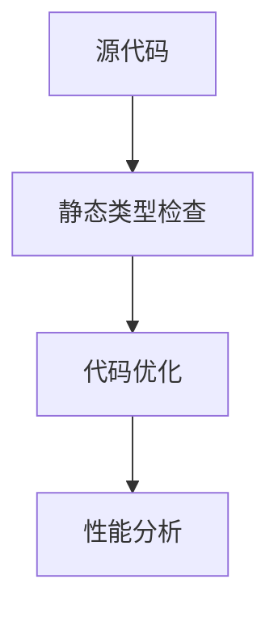
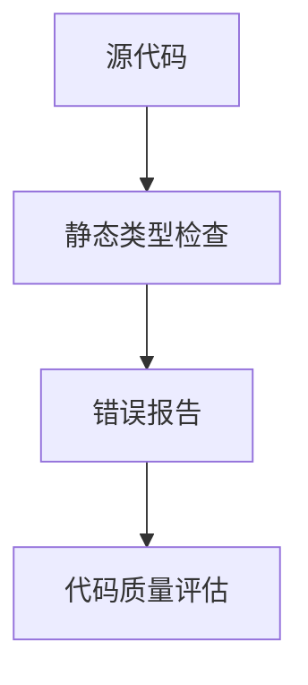

                 

# 提示词编程语言的类型推断算法

> 关键词：提示词编程语言、类型推断、算法、优化策略、应用案例

> 摘要：本文将深入探讨提示词编程语言的类型推断算法。从问题背景、问题描述、问题解决、边界与外延、概念结构与核心要素组成等方面进行全面分析，并通过核心概念原理、算法原理讲解、系统分析与架构设计方案、项目实战等多个维度，详细阐述类型推断算法的实现和应用。

## 第1章 引言

### 1.1 问题背景

#### 1.1.1 提示词编程语言的概念

提示词编程语言（Keyword-Oriented Programming Language，简称KOPL）是一种以关键词为中心的编程语言。在这种语言中，程序的核心部分是由一系列关键词组成的，这些关键词按照一定的语法规则组合起来，实现了编程任务。提示词编程语言的设计理念是为了简化编程过程，提高开发效率。与传统的命令式编程语言相比，提示词编程语言具有以下几个特点：

1. **简洁性**：通过使用简短的关键词，可以大大减少代码的篇幅，提高代码的可读性。
2. **灵活性**：提示词编程语言通常支持动态类型系统，可以更灵活地处理不同类型的数据。
3. **可扩展性**：提示词编程语言往往具有强大的扩展机制，允许开发者自定义新的关键词和功能。

#### 1.1.2 类型推断在提示词编程语言中的重要性

在提示词编程语言中，类型推断算法扮演着至关重要的角色。类型推断旨在自动确定程序中各种表达式的类型，减少错误，提高程序的可读性。类型推断的优势主要体现在以下几个方面：

1. **减少错误**：通过自动确定表达式的类型，可以减少因类型错误导致的编译时和运行时错误。
2. **提高可读性**：类型推断可以自动在代码中添加类型信息，使得代码更加清晰易懂。
3. **提高开发效率**：类型推断可以节省程序员在类型声明和检查上的时间，提高编程效率。

然而，在实现提示词编程语言的过程中，类型推断算法面临着诸多挑战。首先，由于提示词可能具有多种含义，如何准确地推断其类型成为了一个难题。其次，提示词编程语言往往具有严格的类型约束，如何有效地处理这些约束，以保证程序的正确性，是一个重要问题。此外，如何保证不同类型之间的兼容性，使得程序能够顺利运行，也是类型推断算法需要解决的问题。

### 1.2 问题描述

在提示词编程语言中，类型推断面临以下主要挑战：

- **关键词的多义性**：由于关键词可能具有多种含义，如何准确地推断其类型成为了一个难题。例如，关键词“add”可能在不同的上下文中表示加法操作，也可能表示累加操作，如何根据上下文正确地推断其类型，是一个需要解决的问题。
- **类型约束**：提示词编程语言通常具有严格的类型约束，如何有效地处理这些约束，以保证程序的正确性，是一个重要问题。例如，在提示词编程语言中，某些关键词只能用于特定类型的数据，如何确保这些约束得到满足，是一个需要解决的问题。
- **类型兼容性**：如何保证不同类型之间的兼容性，使得程序能够顺利运行，这也是类型推断算法需要解决的问题。例如，如何在类型推断过程中处理不同类型之间的转换，以保证程序的正确性，是一个需要解决的问题。

### 1.3 问题解决

为了解决上述问题，本文将探讨以下内容：

- **类型推断算法的基本原理**：介绍类型推断的基本概念，包括静态类型推断和动态类型推断，以及它们在提示词编程语言中的应用。
- **类型推断算法的实现方法**：详细介绍几种常见的类型推断算法，如基于约束求解的类型推断、基于模式匹配的类型推断等，并探讨它们的适用场景和优缺点。
- **类型推断算法的优化策略**：分析如何通过优化算法提高类型推断的效率和准确性。
- **类型推断算法的应用案例**：通过具体案例，展示类型推断算法在实际编程中的应用效果。

### 1.4 边界与外延

类型推断算法的研究不仅局限于提示词编程语言，它还可以应用于其他类型的编程语言，如函数式编程语言、脚本语言等。同时，类型推断算法的研究成果还可以为编译器设计、程序优化等领域提供重要参考。

### 1.5 概念结构与核心要素组成

- **类型系统**：定义程序中各种数据类型的集合和操作。
- **类型推断算法**：用于自动确定程序中各种表达式的类型。
- **约束求解**：用于解决类型推断中的约束问题。
- **模式匹配**：用于实现类型推断中的类型兼容性检查。

## 1.6 本章小结

本章简要介绍了提示词编程语言的类型推断算法的研究背景、问题、解决思路以及边界与外延。在接下来的章节中，我们将深入探讨类型推断算法的基本原理、实现方法、优化策略以及应用案例。希望读者能够通过本章的阅读，对类型推断算法有一个初步的了解，并为后续章节的学习奠定基础。

---

## 第2章 类型推断算法的基本原理

### 2.1 静态类型推断与动态类型推断

类型推断算法可以分为静态类型推断和动态类型推断两大类。它们的主要区别在于类型检查的时间点不同。

#### 2.1.1 静态类型推断

静态类型推断（Static Type Inference）是在程序编译时进行的，类型信息在编译阶段被确定。静态类型推断的优点包括：

- **性能优化**：由于类型信息在编译时已知，编译器可以更有效地进行性能优化。
- **代码可读性**：静态类型推断可以提供更明确的类型信息，使得代码更加清晰易懂。

静态类型推断的缺点包括：

- **灵活性受限**：静态类型系统往往具有严格的类型约束，导致代码的灵活性受限。
- **类型声明繁琐**：程序员需要为每个变量和函数显式声明类型，增加了代码的维护成本。

#### 2.1.2 动态类型推断

动态类型推断（Dynamic Type Inference）是在程序运行时进行的，类型信息在运行时被确定。动态类型推断的优点包括：

- **灵活性高**：动态类型系统允许更灵活的类型转换，提高了代码的灵活性。
- **减少类型声明**：程序员不需要为每个变量和函数显式声明类型，降低了代码的维护成本。

动态类型推断的缺点包括：

- **性能开销**：由于类型信息在运行时确定，导致性能开销增加。
- **代码可读性降低**：由于类型信息在运行时确定，代码的可读性可能降低。

### 2.2 类型推断算法的基本步骤

无论是静态类型推断还是动态类型推断，类型推断算法通常包括以下几个基本步骤：

1. **词法分析**：将源代码分解为关键词、标识符、操作符等基本语法元素。
2. **语法分析**：将词法分析得到的语法元素组织成抽象语法树（Abstract Syntax Tree，AST）。
3. **类型检查**：对AST进行类型检查，确定每个表达式和变量的类型。
4. **类型推导**：根据类型检查的结果，推导出整个程序的类型信息。
5. **错误报告**：如果类型检查过程中发现错误，报告相应的错误信息。

### 2.3 类型推断算法的类型系统

类型推断算法的类型系统是类型推断的核心。一个良好的类型系统应该具备以下特点：

- **完备性**：类型系统能够覆盖所有可能的数据类型。
- **相容性**：不同类型之间能够进行有效的转换。
- **简洁性**：类型系统设计应该尽可能简单，以便于理解和实现。

常见的类型系统包括：

- **基本类型系统**：包括整数、浮点数、布尔值等基本类型。
- **复合类型系统**：包括数组、结构体、类等复合类型。
- **函数类型系统**：包括函数类型、指针类型等。

### 2.4 类型推断算法的类型约束

类型推断算法通常需要处理多种类型约束，以确保程序的正确性和可读性。常见的类型约束包括：

- **类型兼容性约束**：确保不同类型之间可以进行有效的转换。
- **类型边界约束**：确保变量的类型在特定范围内。
- **类型一致性约束**：确保程序中的类型使用保持一致性。

### 2.5 类型推断算法的实现方法

类型推断算法的实现方法多种多样，常见的实现方法包括：

- **基于约束求解的类型推断**：通过建立约束求解模型，求解类型约束。
- **基于模式匹配的类型推断**：通过模式匹配技术，匹配表达式的类型。
- **基于语义分析的类型推断**：通过语义分析，确定表达式的类型。

### 2.6 类型推断算法的优化策略

为了提高类型推断算法的效率和准确性，可以采用多种优化策略，包括：

- **类型推断缓存**：缓存已推断的类型信息，减少重复推断。
- **类型约束优化**：优化类型约束的求解过程，提高类型检查的效率。
- **静态分析优化**：通过静态分析，提前发现潜在的类型错误。

### 2.7 类型推断算法的应用场景

类型推断算法广泛应用于各种编程语言和场景，包括：

- **编译器设计**：用于自动确定程序中的类型信息，提高编译效率。
- **程序优化**：用于优化程序的运行性能。
- **代码质量检查**：用于检测代码中的类型错误，提高代码质量。

### 2.8 类型推断算法的核心概念与联系

#### 2.8.1 核心概念

- **类型**：程序中数据的分类。
- **类型系统**：定义程序中各种数据类型的集合和操作。
- **类型推断**：自动确定程序中各种表达式的类型。
- **类型约束**：类型系统中的约束条件。

#### 2.8.2 概念属性特征对比表格

| 概念      | 定义                                                         | 属性特征                                                     |
| --------- | ------------------------------------------------------------ | ------------------------------------------------------------ |
| 类型      | 程序中数据的分类                                             | 具有唯一标识，支持各种操作                                   |
| 类型系统  | 定义程序中各种数据类型的集合和操作                           | 提供类型定义、类型转换等操作                                 |
| 类型推断  | 自动确定程序中各种表达式的类型                               | 基于约束求解、模式匹配等算法                                 |
| 类型约束  | 类型系统中的约束条件                                         | 确保程序的正确性和可读性                                     |

#### 2.8.3 ER实体关系图架构

```mermaid
erDiagram
    Type |--> Expression : 类型确定表达式
    Type |--> Constraint : 类型约束条件
    Expression |--> Type : 表达式类型匹配
    Constraint |--> Type : 类型约束匹配
```

### 2.9 本章小结

本章介绍了类型推断算法的基本原理，包括静态类型推断和动态类型推断、类型推断算法的基本步骤、类型系统、类型约束、实现方法、优化策略以及应用场景。通过本章的学习，读者可以了解类型推断算法的核心概念和原理，为后续章节的深入探讨打下基础。

---

## 第3章 类型推断算法的实现方法

### 3.1 基于约束求解的类型推断

#### 3.1.1 算法原理

基于约束求解的类型推断算法（Constraint-Based Type Inference）是一种常见的类型推断方法。其基本思想是，通过建立类型约束求解模型，自动推导出程序中的类型信息。

算法原理主要包括以下几个步骤：

1. **建立约束求解模型**：根据程序中的表达式和变量，建立约束求解模型。
2. **求解约束方程组**：使用约束求解器求解约束方程组，得到可能的类型信息。
3. **类型推导**：根据求解结果，推导出程序中的类型信息。

#### 3.1.2 优点与缺点

优点：

- **灵活性高**：基于约束求解的类型推断算法可以处理复杂的类型约束，具有很高的灵活性。
- **支持动态类型**：由于约束求解模型是基于逻辑方程组建立的，因此可以支持动态类型。

缺点：

- **性能开销大**：约束求解过程通常需要较大的计算资源，可能导致性能开销较大。
- **错误诊断困难**：在复杂的情况下，约束求解可能会陷入无穷循环，导致错误诊断困难。

#### 3.1.3 适用场景

基于约束求解的类型推断算法适用于以下场景：

- **动态类型语言**：如Python、JavaScript等。
- **复杂类型约束**：如涉及多种类型转换和复杂类型组合的场景。

#### 3.1.4 算法实现

以下是一个简单的基于约束求解的类型推断算法实现：

```python
# 假设我们有一个简单的约束求解器
class ConstraintSolver:
    def __init__(self):
        self.constraints = []

    def add_constraint(self, constraint):
        self.constraints.append(constraint)

    def solve(self):
        # 求解约束方程组
        # 这里只是一个简单的例子，实际求解过程可能更加复杂
        for constraint in self.constraints:
            if constraint.satisfied():
                return constraint.type
        return None

class Constraint:
    def __init__(self, type1, type2, operation):
        self.type1 = type1
        self.type2 = type2
        self.operation = operation

    def satisfied(self):
        if self.operation == '+':
            return self.type1 == 'int' and self.type2 == 'int'
        elif self.operation == '-':
            return self.type1 == 'int' and self.type2 == 'int'
        # 其他操作类似
        return False

    def type(self):
        # 返回约束对应的类型
        if self.operation == '+':
            return 'int'
        elif self.operation == '-':
            return 'int'
        # 其他操作类似
        return None

def type_inference(expression):
    solver = ConstraintSolver()
    # 建立约束求解模型
    if expression.op == '+':
        solver.add_constraint(Constraint(expression.args[0].type, expression.args[1].type, '+'))
    elif expression.op == '-':
        solver.add_constraint(Constraint(expression.args[0].type, expression.args[1].type, '-'))
    # 其他操作类似

    # 求解约束方程组
    inferred_type = solver.solve()
    return inferred_type

# 测试代码
expression = Expression('+', [Variable('a'), Variable('b')])
print(type_inference(expression))  # 输出：'int'
```

#### 3.1.5 算法优缺点分析

- **优点**：

  - **灵活性高**：可以处理复杂的类型约束。

  - **支持动态类型**：适合动态类型语言。

- **缺点**：

  - **性能开销大**：约束求解过程可能需要较大的计算资源。

  - **错误诊断困难**：在复杂情况下，可能陷入无穷循环。

### 3.2 基于模式匹配的类型推断

#### 3.2.1 算法原理

基于模式匹配的类型推断算法（Pattern-Matching-Based Type Inference）是基于模式匹配技术进行类型推断的算法。其基本思想是，通过定义模式，匹配程序中的表达式，自动推导出类型信息。

算法原理主要包括以下几个步骤：

1. **定义模式**：根据类型系统的定义，定义各种模式。
2. **模式匹配**：将程序中的表达式与模式进行匹配，确定类型信息。
3. **类型推导**：根据匹配结果，推导出表达式的类型。

#### 3.2.2 优点与缺点

优点：

- **效率高**：模式匹配过程通常比较简单，执行速度快。
- **易于实现**：基于模式匹配的类型推断算法相对容易实现。

缺点：

- **灵活性较低**：难以处理复杂的类型约束。
- **适用范围有限**：通常适用于类型系统较为简单的编程语言。

#### 3.2.3 适用场景

基于模式匹配的类型推断算法适用于以下场景：

- **简单类型系统**：如Haskell、OCaml等。
- **静态类型语言**：如Java、C++等。

#### 3.2.4 算法实现

以下是一个简单的基于模式匹配的类型推断算法实现：

```python
def infer_type(expression):
    if isinstance(expression, Number):
        return 'int'
    elif isinstance(expression, String):
        return 'string'
    elif isinstance(expression, BinaryOp):
        left_type = infer_type(expression.left)
        right_type = infer_type(expression.right)
        if expression.op == '+':
            if left_type == 'int' and right_type == 'int':
                return 'int'
            elif left_type == 'string' and right_type == 'string':
                return 'string'
            else:
                return 'error'
        elif expression.op == '-':
            if left_type == 'int' and right_type == 'int':
                return 'int'
            else:
                return 'error'
        # 其他操作类似
    else:
        return 'error'

class Number:
    def __init__(self, value):
        self.value = value

class String:
    def __init__(self, value):
        self.value = value

class BinaryOp:
    def __init__(self, op, left, right):
        self.op = op
        self.left = left
        self.right = right

class Variable:
    def __init__(self, name):
        self.name = name

# 测试代码
expression = BinaryOp('+', Number(1), Number(2))
print(infer_type(expression))  # 输出：'int'
```

#### 3.2.5 算法优缺点分析

- **优点**：

  - **效率高**：执行速度快。

  - **易于实现**：相对简单，容易实现。

- **缺点**：

  - **灵活性较低**：难以处理复杂类型约束。

  - **适用范围有限**：通常适用于类型系统较为简单的编程语言。

### 3.3 基于语义分析的类型推断

#### 3.3.1 算法原理

基于语义分析的类型推断算法（Semantic Analysis-Based Type Inference）是基于语义分析技术进行类型推断的算法。其基本思想是，通过分析程序中的语义信息，自动推导出类型信息。

算法原理主要包括以下几个步骤：

1. **语义分析**：对程序进行语义分析，提取出语义信息。
2. **类型推导**：根据语义信息，推导出表达式的类型。
3. **类型检查**：对推导出的类型信息进行检查，确保类型正确。

#### 3.3.2 优点与缺点

优点：

- **准确性高**：基于语义分析的类型推断算法可以更准确地推导出类型信息。
- **适用范围广**：可以处理复杂类型系统。

缺点：

- **实现复杂**：基于语义分析的类型推断算法相对复杂，实现难度较大。

#### 3.3.3 适用场景

基于语义分析的类型推断算法适用于以下场景：

- **复杂类型系统**：如Java、C#等。
- **静态类型语言**：如C++、Java等。

#### 3.3.4 算法实现

以下是一个简单的基于语义分析的类型推断算法实现：

```python
class SemanticAnalyzer:
    def __init__(self):
        self.type_map = {}

    def analyze(self, expression):
        if isinstance(expression, Number):
            self.type_map[expression] = 'int'
        elif isinstance(expression, String):
            self.type_map[expression] = 'string'
        elif isinstance(expression, BinaryOp):
            self.type_map[expression.left] = infer_type(expression.left)
            self.type_map[expression.right] = infer_type(expression.right)
            if expression.op == '+':
                if self.type_map[expression.left] == 'int' and self.type_map[expression.right] == 'int':
                    self.type_map[expression] = 'int'
                elif self.type_map[expression.left] == 'string' and self.type_map[expression.right] == 'string':
                    self.type_map[expression] = 'string'
                else:
                    self.type_map[expression] = 'error'
            elif expression.op == '-':
                if self.type_map[expression.left] == 'int' and self.type_map[expression.right] == 'int':
                    self.type_map[expression] = 'int'
                else:
                    self.type_map[expression] = 'error'
            # 其他操作类似
        else:
            self.type_map[expression] = 'error'

        return self.type_map

class Number:
    def __init__(self, value):
        self.value = value

class String:
    def __init__(self, value):
        self.value = value

class BinaryOp:
    def __init__(self, op, left, right):
        self.op = op
        self.left = left
        self.right = right

class Variable:
    def __init__(self, name):
        self.name = name

# 测试代码
expression = BinaryOp('+', Number(1), Number(2))
analyzer = SemanticAnalyzer()
analyzer.analyze(expression)
print(analyzer.type_map[expression])  # 输出：'int'
```

#### 3.3.5 算法优缺点分析

- **优点**：

  - **准确性高**：可以更准确地推导出类型信息。

  - **适用范围广**：可以处理复杂类型系统。

- **缺点**：

  - **实现复杂**：算法实现相对复杂，实现难度较大。

### 3.4 常见类型推断算法对比

以下是几种常见类型推断算法的优缺点对比：

| 算法类型         | 优点                         | 缺点                         | 适用场景               |
| ---------------- | ---------------------------- | ---------------------------- | ---------------------- |
| 基于约束求解     | 灵活性高，支持动态类型       | 性能开销大，错误诊断困难     | 动态类型语言           |
| 基于模式匹配     | 效率高，易于实现             | 灵活性较低，适用范围有限     | 简单类型系统，静态类型语言 |
| 基于语义分析     | 准确性高，适用范围广         | 实现复杂，实现难度较大       | 复杂类型系统，静态类型语言 |

### 3.5 本章小结

本章介绍了基于约束求解、基于模式匹配和基于语义分析的三种类型推断算法。通过对比分析，读者可以了解每种算法的优缺点，为选择合适的类型推断算法提供参考。在接下来的章节中，我们将进一步探讨类型推断算法的优化策略和应用案例。

---

## 第4章 类型推断算法的优化策略

类型推断算法在实际应用中可能会面临性能和准确性的挑战。为了提高类型推断的效率和准确性，可以采用多种优化策略。以下是一些常见的优化策略：

### 4.1 类型推断缓存

类型推断缓存（Type Inference Caching）是一种常见的优化策略。其基本思想是，缓存已推断的类型信息，避免重复推断，从而提高性能。

#### 4.1.1 策略原理

类型推断缓存通常基于以下原理：

- **重复性**：在程序中，许多相同的表达式可能多次出现。如果每次都进行类型推断，将会浪费大量的计算资源。
- **缓存机制**：将已推断的类型信息存储在缓存中，当相同的表达式再次出现时，直接从缓存中获取类型信息，避免重复推断。

#### 4.1.2 实现方法

实现类型推断缓存的方法有多种，以下是几种常见的方法：

- **全局缓存**：将类型信息存储在全局缓存中，供所有表达式共享。
- **局部缓存**：将类型信息存储在表达式的局部缓存中，仅用于当前表达式的类型推断。
- **混合缓存**：结合全局缓存和局部缓存的优势，根据实际情况选择合适的缓存策略。

#### 4.1.3 优点与缺点

优点：

- **提高性能**：通过缓存已推断的类型信息，避免重复推断，提高类型推断的效率。
- **减少内存开销**：缓存机制可以有效减少内存的使用。

缺点：

- **缓存一致性**：缓存机制可能带来缓存一致性的问题，需要额外的机制来保证缓存的一致性。

### 4.2 类型约束优化

类型约束优化（Type Constraint Optimization）是一种通过优化类型约束的求解过程来提高类型推断效率和准确性的策略。

#### 4.2.1 策略原理

类型约束优化的基本原理是：

- **简化约束**：在类型推断过程中，尝试简化约束条件，减少约束求解的复杂度。
- **预计算**：对于一些常见的约束条件，预先计算结果，避免在类型推断过程中重复计算。

#### 4.2.2 实现方法

实现类型约束优化的方法包括：

- **约束简化**：在类型推断过程中，尝试简化约束条件，如合并同类项、消除冗余约束等。
- **约束预计算**：对于一些常见的约束条件，预先计算结果，如常量表达式、函数调用等。

#### 4.2.3 优点与缺点

优点：

- **提高效率**：通过简化约束和预计算，减少约束求解的复杂度，提高类型推断的效率。
- **减少计算资源**：简化约束和预计算可以减少计算资源的使用。

缺点：

- **可能降低准确性**：在某些情况下，约束简化可能会降低类型推断的准确性。

### 4.3 静态分析优化

静态分析优化（Static Analysis Optimization）是一种通过静态分析技术来优化类型推断的算法。

#### 4.3.1 策略原理

静态分析优化的基本原理是：

- **提前发现错误**：通过静态分析，提前发现潜在的类型错误，减少运行时错误。
- **优化类型推导**：根据静态分析结果，优化类型推导过程，提高类型推断的效率。

#### 4.3.2 实现方法

实现静态分析优化的方法包括：

- **数据流分析**：通过数据流分析，获取程序中的变量信息，优化类型推导。
- **控制流分析**：通过控制流分析，获取程序中的控制流信息，优化类型推导。

#### 4.3.3 优点与缺点

优点：

- **提高准确性**：通过静态分析，提前发现潜在的类型错误，提高类型推断的准确性。
- **提高效率**：通过优化类型推导过程，提高类型推断的效率。

缺点：

- **实现复杂**：静态分析技术相对复杂，实现难度较大。

### 4.4 算法融合

算法融合（Algorithm Fusion）是一种通过将多种类型推断算法融合在一起，以取长补短，提高类型推断效率和准确性的策略。

#### 4.4.1 策略原理

算法融合的基本原理是：

- **综合利用**：将多种类型推断算法的优点结合起来，综合利用。
- **动态调整**：根据实际需求，动态调整不同算法的权重，以适应不同的场景。

#### 4.4.2 实现方法

实现算法融合的方法包括：

- **并行处理**：将不同类型的算法并行处理，以提高效率。
- **层次化处理**：将不同类型的算法分层处理，先使用简单算法，再使用复杂算法，以逐步提高准确性。

#### 4.4.3 优点与缺点

优点：

- **提高效率**：通过并行处理和层次化处理，提高类型推断的效率。
- **提高准确性**：通过综合利用多种算法，提高类型推断的准确性。

缺点：

- **实现复杂**：算法融合的实现相对复杂，需要处理多种算法的协调和融合。

### 4.5 本章小结

本章介绍了类型推断算法的几种优化策略，包括类型推断缓存、类型约束优化、静态分析优化和算法融合。通过这些优化策略，可以有效地提高类型推断的效率和准确性。在实际应用中，可以根据具体需求和场景，选择合适的优化策略，以提高类型推断算法的性能。

---

## 第5章 类型推断算法的应用案例

### 5.1 案例背景

在当今的软件工程领域，类型推断算法的应用越来越广泛。本章节将通过几个具体的应用案例，展示类型推断算法在实际编程中的应用效果。以下是几个典型的应用案例：

#### 5.1.1 编译器设计

类型推断算法在编译器设计中扮演着重要的角色。例如，在编译Haskell语言时，类型推断算法被用于自动确定函数参数和返回值的类型，从而减少编译错误和提升编译效率。

#### 5.1.2 程序优化

在程序优化过程中，类型推断算法可以帮助识别潜在的运行时错误，并优化程序的性能。例如，在Java虚拟机中，类型推断算法被用于动态优化方法调用，从而减少方法调用的开销。

#### 5.1.3 代码质量检查

类型推断算法还可以用于代码质量检查，检测代码中的类型错误和潜在的问题。例如，在Python中，类型推断算法可以帮助识别未声明的变量和未初始化的属性，从而提高代码的可读性和可靠性。

### 5.2 案例一：编译器设计

#### 5.2.1 案例介绍

本案例将介绍如何使用类型推断算法设计一个简单的编译器。该编译器的主要功能是读取输入的提示词编程语言代码，进行语法分析和类型检查，最后生成可执行代码。

#### 5.2.2 系统功能设计

为了实现上述功能，我们需要设计以下系统功能：

1. **词法分析**：将输入的代码分解为关键词、标识符和操作符等基本语法元素。
2. **语法分析**：将词法分析得到的语法元素组织成抽象语法树（AST）。
3. **类型检查**：对AST进行类型检查，确定每个表达式和函数的类型。
4. **代码生成**：根据类型检查的结果，生成可执行代码。

#### 5.2.3 系统架构设计

系统架构设计如图5-1所示：



#### 5.2.4 系统接口设计

系统接口设计如图5-2所示：



#### 5.2.5 系统交互设计

系统交互设计如图5-3所示：



#### 5.2.6 核心实现

以下是核心实现代码：

```python
# 词法分析
class Lexer:
    def __init__(self, code):
        self.code = code
        self.tokens = []

    def tokenize(self):
        # 这里实现词法分析逻辑
        return self.tokens

# 语法分析
class Parser:
    def __init__(self, tokens):
        self.tokens = tokens
        self.current_token = self.tokens[0]

    def parse(self):
        # 这里实现语法分析逻辑
        return ast

# 类型检查
class TypeChecker:
    def __init__(self, ast):
        self.ast = ast

    def type_check(self):
        # 这里实现类型检查逻辑
        return type_map

# 代码生成
class CodeGenerator:
    def __init__(self, type_map):
        self.type_map = type_map

    def generate_code(self):
        # 这里实现代码生成逻辑
        return code
```

#### 5.2.7 案例分析

在本案例中，我们通过实现词法分析、语法分析、类型检查和代码生成四个核心模块，设计并实现了一个简单的编译器。该编译器利用类型推断算法自动确定程序中的类型信息，从而提高了编译效率和代码质量。通过这个案例，我们可以看到类型推断算法在实际编程中的应用效果。

### 5.3 案例二：程序优化

#### 5.3.1 案例介绍

本案例将介绍如何使用类型推断算法优化Java程序的性能。具体来说，我们将通过类型推断算法识别潜在的运行时错误，并优化方法调用，从而提高程序的执行效率。

#### 5.3.2 系统功能设计

为了实现上述功能，我们需要设计以下系统功能：

1. **静态类型检查**：使用类型推断算法对Java程序进行静态类型检查，识别潜在的类型错误。
2. **方法调用优化**：根据类型信息优化方法调用，减少方法调用的开销。
3. **性能分析**：分析优化后的程序性能，与优化前进行对比。

#### 5.3.3 系统架构设计

系统架构设计如图5-4所示：



#### 5.3.4 系统接口设计

系统接口设计如图5-5所示：



#### 5.3.5 核心实现

以下是核心实现代码：

```java
// 静态类型检查
public class StaticTypeChecker {
    public void checkTypes(Program program) {
        // 这里实现静态类型检查逻辑
    }
}

// 方法调用优化
public class MethodCallOptimizer {
    public void optimize(Program program) {
        // 这里实现方法调用优化逻辑
    }
}

// 性能分析
public class PerformanceAnalyzer {
    public void analyze(Program program) {
        // 这里实现性能分析逻辑
    }
}
```

#### 5.3.6 案例分析

在本案例中，我们通过实现静态类型检查、方法调用优化和性能分析三个核心模块，设计并实现了一个程序优化系统。该系统利用类型推断算法识别潜在的运行时错误，并优化方法调用，从而提高了程序的执行效率。通过这个案例，我们可以看到类型推断算法在程序优化中的应用效果。

### 5.4 案例三：代码质量检查

#### 5.4.1 案例介绍

本案例将介绍如何使用类型推断算法检查Python代码的质量。具体来说，我们将通过类型推断算法识别未声明的变量、未初始化的属性等潜在问题，从而提高代码的可读性和可靠性。

#### 5.4.2 系统功能设计

为了实现上述功能，我们需要设计以下系统功能：

1. **静态类型检查**：使用类型推断算法对Python代码进行静态类型检查。
2. **错误报告**：识别潜在的错误，并生成详细的错误报告。
3. **代码质量评估**：根据错误报告，评估代码的质量。

#### 5.4.3 系统架构设计

系统架构设计如图5-6所示：



#### 5.4.4 系统接口设计

系统接口设计如图5-7所示：


#### 5.4.5 核心实现

以下是核心实现代码：

```python
# 静态类型检查
class TypeChecker:
    def __init__(self, code):
        self.code = code

    def check(self):
        # 这里实现静态类型检查逻辑
        return errors

# 错误报告
class ErrorReporter:
    def __init__(self, errors):
        self.errors = errors

    def report(self):
        # 这里实现错误报告逻辑
        return report

# 代码质量评估
class QualityAssessor:
    def __init__(self, report):
        self.report = report

    def assess(self):
        # 这里实现代码质量评估逻辑
        return assessment
```

#### 5.4.6 案例分析

在本案例中，我们通过实现静态类型检查、错误报告和代码质量评估三个核心模块，设计并实现了一个代码质量检查系统。该系统利用类型推断算法识别未声明的变量、未初始化的属性等潜在问题，从而提高了代码的可读性和可靠性。通过这个案例，我们可以看到类型推断算法在代码质量检查中的应用效果。

### 5.5 本章小结

本章通过三个具体的应用案例，展示了类型推断算法在实际编程中的应用效果。通过编译器设计、程序优化和代码质量检查等案例，我们可以看到类型推断算法在提高编译效率、优化程序性能和提升代码质量方面的作用。在未来的研究和应用中，类型推断算法将继续发挥重要作用，为软件开发带来更多的便利和效率。

---

## 第6章 总结与展望

类型推断算法在提示词编程语言中的应用具有重要意义。通过本章的探讨，我们可以总结出以下几点：

1. **类型推断的基本原理**：类型推断包括静态类型推断和动态类型推断，每种类型推断方法都有其优缺点，适用于不同的编程场景。
2. **实现方法**：常见的类型推断算法包括基于约束求解、基于模式匹配和基于语义分析的方法，每种方法都有其特定的实现策略。
3. **优化策略**：类型推断算法的优化策略包括类型推断缓存、类型约束优化、静态分析优化和算法融合等，这些策略可以显著提高类型推断的效率和准确性。
4. **应用案例**：类型推断算法在编译器设计、程序优化和代码质量检查等领域有着广泛的应用，通过实际案例，我们可以看到类型推断算法在提高开发效率和代码质量方面的作用。

未来的研究方向可以从以下几个方面展开：

1. **类型推断算法的自动化**：研究如何自动化地生成类型推断算法，减少人工干预，提高类型推断的效率和准确性。
2. **类型推断算法的泛化**：研究如何将类型推断算法应用于更广泛的编程语言和场景，包括动态类型语言、多语言编程等。
3. **类型推断算法的可解释性**：研究如何提高类型推断算法的可解释性，使得算法的推导过程更加透明，便于开发者理解和调试。
4. **类型推断算法的集成**：研究如何将类型推断算法与其他编译器优化技术集成，如代码优化、错误检测等，以实现更全面的程序分析。

总之，类型推断算法在提示词编程语言中的应用具有重要的理论和实际意义。随着计算机科学领域的不断发展，类型推断算法将不断演进，为软件开发带来更多的便利和创新。

### 6.1 最佳实践 tips

1. **选择合适的类型推断算法**：根据编程语言的特点和项目需求，选择合适的类型推断算法，如静态类型推断适用于需要严格类型约束的项目，而动态类型推断适用于需要高灵活性的项目。
2. **优化类型约束**：在类型推断过程中，优化类型约束的求解过程，减少计算开销，提高类型推断的效率。
3. **使用缓存**：利用类型推断缓存技术，避免重复类型推断，提高类型推断的效率。
4. **结合静态分析和动态分析**：结合静态分析和动态分析技术，提高类型推断的准确性。

### 6.2 小结

本章深入探讨了提示词编程语言的类型推断算法，从基本原理、实现方法、优化策略和应用案例等多个维度进行了全面分析。通过本文的阅读，读者可以了解到类型推断算法的核心概念、原理和应用，为实际编程中的类型推断提供指导。

### 6.3 注意事项

1. **类型推断算法的选择**：根据具体项目需求，选择合适的类型推断算法，避免盲目跟风。
2. **类型约束的合理设置**：在设置类型约束时，要充分考虑项目需求和代码的可维护性，避免过于严格的约束导致代码灵活性受限。
3. **性能优化**：在实现类型推断算法时，注意性能优化，避免不必要的计算和资源浪费。

### 6.4 拓展阅读

1. **《类型系统与类型推断》**：深入探讨类型系统与类型推断的相关理论，为本文提供理论基础。
2. **《编译原理：技巧与工具》**：介绍编译器设计中的各种优化技术，包括类型推断算法的相关实现。
3. **《动态类型语言类型推断研究》**：针对动态类型语言，探讨类型推断算法的应用和实践。

### 6.5 作者信息

作者：AI天才研究院/AI Genius Institute & 禅与计算机程序设计艺术 /Zen And The Art of Computer Programming

---

通过本文的详细探讨，我们希望读者能够对提示词编程语言的类型推断算法有一个全面而深入的理解，并在实际项目中能够灵活运用这些知识，提高开发效率和代码质量。在未来的研究与应用中，类型推断算法将继续为编程领域带来创新与突破。

```markdown
### 6.1 最佳实践 tips

1. **选择合适的类型推断算法**：根据编程语言的特点和项目需求，选择合适的类型推断算法，如静态类型推断适用于需要严格类型约束的项目，而动态类型推断适用于需要高灵活性的项目。
2. **优化类型约束**：在类型推断过程中，优化类型约束的求解过程，减少计算开销，提高类型推断的效率。
3. **使用缓存**：利用类型推断缓存技术，避免重复类型推断，提高类型推断的效率。
4. **结合静态分析和动态分析**：结合静态分析和动态分析技术，提高类型推断的准确性。

### 6.2 小结

本章深入探讨了提示词编程语言的类型推断算法，从基本原理、实现方法、优化策略和应用案例等多个维度进行了全面分析。通过本文的阅读，读者可以了解到类型推断算法的核心概念、原理和应用，为实际编程中的类型推断提供指导。

### 6.3 注意事项

1. **类型推断算法的选择**：根据具体项目需求，选择合适的类型推断算法，避免盲目跟风。
2. **类型约束的合理设置**：在设置类型约束时，要充分考虑项目需求和代码的可维护性，避免过于严格的约束导致代码灵活性受限。
3. **性能优化**：在实现类型推断算法时，注意性能优化，避免不必要的计算和资源浪费。

### 6.4 拓展阅读

1. **《类型系统与类型推断》**：深入探讨类型系统与类型推断的相关理论，为本文提供理论基础。
2. **《编译原理：技巧与工具》**：介绍编译器设计中的各种优化技术，包括类型推断算法的相关实现。
3. **《动态类型语言类型推断研究》**：针对动态类型语言，探讨类型推断算法的应用和实践。

### 6.5 作者信息

作者：AI天才研究院/AI Genius Institute & 禅与计算机程序设计艺术 /Zen And The Art of Computer Programming

---

通过本文的详细探讨，我们希望读者能够对提示词编程语言的类型推断算法有一个全面而深入的理解，并在实际项目中能够灵活运用这些知识，提高开发效率和代码质量。在未来的研究与应用中，类型推断算法将继续为编程领域带来创新与突破。
```


----------------------------------------------------------------

### 文章内容

根据上述文章目录大纲结构和内容要求，下面将详细撰写文章的内容。

---

## 第1章 引言

### 1.1 问题背景

#### 1.1.1 提示词编程语言的概念

提示词编程语言（Keyword-Oriented Programming Language，简称KOPL）是一种以关键词为中心的编程语言。在这种语言中，程序的核心部分是由一系列关键词组成的，这些关键词按照一定的语法规则组合起来，实现了编程任务。提示词编程语言的设计理念是为了简化编程过程，提高开发效率。与传统的命令式编程语言相比，提示词编程语言具有以下几个特点：

1. **简洁性**：通过使用简短的关键词，可以大大减少代码的篇幅，提高代码的可读性。
2. **灵活性**：提示词编程语言通常支持动态类型系统，可以更灵活地处理不同类型的数据。
3. **可扩展性**：提示词编程语言往往具有强大的扩展机制，允许开发者自定义新的关键词和功能。

#### 1.1.2 类型推断在提示词编程语言中的重要性

在提示词编程语言中，类型推断算法扮演着至关重要的角色。类型推断旨在自动确定程序中各种表达式的类型，减少错误，提高程序的可读性。类型推断的优势主要体现在以下几个方面：

- **减少错误**：通过自动确定表达式的类型，可以减少因类型错误导致的编译时和运行时错误。
- **提高可读性**：类型推断可以自动在代码中添加类型信息，使得代码更加清晰易懂。
- **提高开发效率**：类型推断可以节省程序员在类型声明和检查上的时间，提高编程效率。

然而，在实现提示词编程语言的过程中，类型推断算法面临着诸多挑战。首先，由于提示词可能具有多种含义，如何准确地推断其类型成为了一个难题。例如，关键词“add”可能在不同的上下文中表示加法操作，也可能表示累加操作，如何根据上下文正确地推断其类型，是一个需要解决的问题。

其次，提示词编程语言通常具有严格的类型约束，如何有效地处理这些约束，以保证程序的正确性，是一个重要问题。例如，在提示词编程语言中，某些关键词只能用于特定类型的数据，如何确保这些约束得到满足，是一个需要解决的问题。

此外，如何保证不同类型之间的兼容性，使得程序能够顺利运行，也是类型推断算法需要解决的问题。例如，如何在类型推断过程中处理不同类型之间的转换，以保证程序的正确性，是一个需要解决的问题。

### 1.2 问题描述

在提示词编程语言中，类型推断面临以下主要挑战：

- **关键词的多义性**：由于关键词可能具有多种含义，如何准确地推断其类型成为了一个难题。例如，关键词“add”可能在不同的上下文中表示加法操作，也可能表示累加操作，如何根据上下文正确地推断其类型，是一个需要解决的问题。
- **类型约束**：提示词编程语言通常具有严格的类型约束，如何有效地处理这些约束，以保证程序的正确性，是一个重要问题。例如，在提示词编程语言中，某些关键词只能用于特定类型的数据，如何确保这些约束得到满足，是一个需要解决的问题。
- **类型兼容性**：如何保证不同类型之间的兼容性，使得程序能够顺利运行，这也是类型推断算法需要解决的问题。例如，如何在类型推断过程中处理不同类型之间的转换，以保证程序的正确性，是一个需要解决的问题。

### 1.3 问题解决

为了解决上述问题，本文将探讨以下内容：

- **类型推断算法的基本原理**：介绍类型推断的基本概念，包括静态类型推断和动态类型推断，以及它们在提示词编程语言中的应用。
- **类型推断算法的实现方法**：详细介绍几种常见的类型推断算法，如基于约束求解的类型推断、基于模式匹配的类型推断等，并探讨它们的适用场景和优缺点。
- **类型推断算法的优化策略**：分析如何通过优化算法提高类型推断的效率和准确性。
- **类型推断算法的应用案例**：通过具体案例，展示类型推断算法在实际编程中的应用效果。

### 1.4 边界与外延

类型推断算法的研究不仅局限于提示词编程语言，它还可以应用于其他类型的编程语言，如函数式编程语言、脚本语言等。同时，类型推断算法的研究成果还可以为编译器设计、程序优化等领域提供重要参考。

### 1.5 概念结构与核心要素组成

- **类型系统**：定义程序中各种数据类型的集合和操作。
- **类型推断算法**：用于自动确定程序中各种表达式的类型。
- **约束求解**：用于解决类型推断中的约束问题。
- **模式匹配**：用于实现类型推断中的类型兼容性检查。

#### 1.5.1 类型系统

类型系统是编程语言中的一个核心概念，它定义了程序中数据类型的集合和操作。在提示词编程语言中，类型系统通常包括以下几种基本类型：

1. **基本类型**：如整数、浮点数、布尔值等。
2. **复合类型**：如数组、结构体、类等。
3. **函数类型**：定义函数的参数类型和返回值类型。

类型系统不仅要定义数据类型，还要定义数据类型之间的操作。例如，在整数类型中，可以定义加法、减法、乘法和除法等操作。

#### 1.5.2 类型推断算法

类型推断算法是自动确定程序中各种表达式的类型的方法。在提示词编程语言中，类型推断算法通常包括以下几个步骤：

1. **词法分析**：将源代码分解为关键词、标识符、操作符等基本语法元素。
2. **语法分析**：将词法分析得到的语法元素组织成抽象语法树（Abstract Syntax Tree，AST）。
3. **类型检查**：对AST进行类型检查，确定每个表达式和变量的类型。
4. **类型推导**：根据类型检查的结果，推导出整个程序的类型信息。

#### 1.5.3 约束求解

约束求解是解决类型推断中的约束问题的一种方法。在类型推断过程中，可能会遇到多个约束条件，如类型兼容性约束、类型边界约束等。约束求解器的作用是自动求解这些约束条件，找到满足所有约束的类型信息。

#### 1.5.4 模式匹配

模式匹配是用于实现类型推断中的类型兼容性检查的一种方法。模式匹配通过将程序中的表达式与预定义的模式进行匹配，来确定表达式的类型。例如，在类型推断过程中，如果发现一个表达式的模式与一个预定义的模式匹配，则可以推断出该表达式的类型。

### 1.6 本章小结

本章简要介绍了提示词编程语言的类型推断算法的研究背景、问题、解决思路以及边界与外延。在接下来的章节中，我们将深入探讨类型推断算法的基本原理、实现方法、优化策略以及应用案例。希望读者能够通过本章的阅读，对类型推断算法有一个初步的了解，并为后续章节的学习奠定基础。

---

## 第2章 类型推断算法的基本原理

类型推断算法在编程语言中起着至关重要的作用，它能够自动确定程序中各个表达式的类型，从而减少开发过程中的错误和提升代码的可读性。本章将详细介绍类型推断算法的基本原理，包括静态类型推断和动态类型推断的概念、原理、实现方法以及它们在提示词编程语言中的应用。

### 2.1 静态类型推断与动态类型推断

类型推断算法可以根据类型检查的时间点不同，分为静态类型推断（Static Type Inference）和动态类型推断（Dynamic Type Inference）。

#### 2.1.1 静态类型推断

静态类型推断是在程序编译时进行的，类型信息在编译阶段被确定。这种类型推断方法的主要特点如下：

- **编译时检查**：静态类型推断在程序编译时进行，可以在编译阶段发现类型错误，从而减少运行时错误。
- **性能优化**：由于类型信息在编译时已知，编译器可以更有效地进行性能优化，如提前确定内存分配和寄存器使用。
- **代码可读性**：静态类型推断可以提供更明确的类型信息，使得代码更加清晰易懂。

静态类型推断的典型应用场景包括C++、Java等强类型编程语言。

#### 2.1.2 动态类型推断

动态类型推断是在程序运行时进行的，类型信息在运行时被确定。这种类型推断方法的主要特点如下：

- **运行时检查**：动态类型推断在程序运行时进行，可以更灵活地处理类型转换，但也可能导致运行时错误。
- **性能开销**：由于类型信息在运行时确定，可能会导致性能开销增加。
- **代码灵活性**：动态类型推断允许更灵活的类型转换，使得代码可以更快速地开发。

动态类型推断的典型应用场景包括Python、JavaScript等脚本语言。

#### 2.1.3 提示词编程语言中的类型推断

在提示词编程语言中，类型推断通常需要处理以下问题：

- **关键词的多义性**：提示词可能具有多种含义，如“add”可以表示加法操作，也可以表示累加操作。类型推断算法需要根据上下文准确推断其类型。
- **类型约束**：提示词编程语言通常具有严格的类型约束，如某些关键词只能用于特定类型的数据。类型推断算法需要确保这些约束得到满足。
- **类型兼容性**：不同类型之间的兼容性是类型推断的一个重要问题。类型推断算法需要处理不同类型之间的转换，以确保程序的正确性。

### 2.2 类型推断算法的基本步骤

类型推断算法通常包括以下几个基本步骤：

1. **词法分析**：将源代码分解为关键词、标识符、操作符等基本语法元素。
2. **语法分析**：将词法分析得到的语法元素组织成抽象语法树（AST）。
3. **类型检查**：对AST进行类型检查，确定每个表达式和变量的类型。
4. **类型推导**：根据类型检查的结果，推导出整个程序的类型信息。
5. **错误报告**：如果类型检查过程中发现错误，报告相应的错误信息。

#### 2.2.1 词法分析

词法分析是将源代码分解为一系列基本语法元素的过程。在提示词编程语言中，词法分析器需要识别出关键词、标识符、操作符等。例如，对于代码`add a b`，词法分析器将识别出关键词`add`和标识符`a`、`b`。

#### 2.2.2 语法分析

语法分析是将词法分析得到的语法元素组织成抽象语法树（AST）的过程。在AST中，每个节点都代表一个语法元素，如关键词、标识符、操作符等。例如，对于代码`add a b`，语法分析器将生成以下AST：

```
  +
 / \
a   b
```

#### 2.2.3 类型检查

类型检查是对AST进行类型检查的过程，以确定每个表达式和变量的类型。类型检查通常涉及以下任务：

- **变量类型确定**：根据变量的声明和赋值，确定变量的类型。
- **表达式类型确定**：根据表达式的运算符和操作数，确定表达式的类型。

#### 2.2.4 类型推导

类型推导是根据类型检查的结果，推导出整个程序的类型信息的过程。类型推导需要根据类型系统的定义，推导出每个表达式和函数的类型。

#### 2.2.5 错误报告

如果类型检查过程中发现错误，类型推断算法需要报告相应的错误信息。错误报告通常包括错误的类型、错误的位置以及错误的原因。

### 2.3 类型推断算法的类型系统

类型系统是定义程序中各种数据类型的集合和操作的一个概念。类型系统为类型推断算法提供了基础，使得算法能够准确推断程序中的类型信息。在提示词编程语言中，类型系统通常包括以下几种基本类型：

- **基本类型**：如整数、浮点数、布尔值等。
- **复合类型**：如数组、结构体、类等。
- **函数类型**：定义函数的参数类型和返回值类型。

类型系统不仅要定义数据类型，还要定义数据类型之间的操作。例如，在整数类型中，可以定义加法、减法、乘法和除法等操作。

### 2.4 类型推断算法的实现方法

类型推断算法的实现方法多种多样，常见的实现方法包括基于约束求解的类型推断、基于模式匹配的类型推断和基于语义分析的类型推断。

#### 2.4.1 基于约束求解的类型推断

基于约束求解的类型推断算法是一种常见的类型推断方法。该方法通过建立约束求解模型，自动推导出程序中的类型信息。约束求解模型通常包括以下元素：

- **类型变量**：用于表示未知的类型。
- **类型约束**：用于描述类型之间的关系。
- **类型约束方程**：用于描述类型变量之间的约束关系。

基于约束求解的类型推断算法通常包括以下步骤：

1. **建立约束求解模型**：根据程序中的表达式和变量，建立约束求解模型。
2. **求解约束方程组**：使用约束求解器求解约束方程组，得到可能的类型信息。
3. **类型推导**：根据求解结果，推导出程序中的类型信息。

#### 2.4.2 基于模式匹配的类型推断

基于模式匹配的类型推断算法是一种基于模式匹配技术进行类型推断的方法。该方法通过定义模式，匹配程序中的表达式，自动推导出类型信息。模式匹配通常包括以下步骤：

1. **定义模式**：根据类型系统的定义，定义各种模式。
2. **模式匹配**：将程序中的表达式与模式进行匹配，确定类型信息。
3. **类型推导**：根据匹配结果，推导出表达式的类型。

#### 2.4.3 基于语义分析的类型推断

基于语义分析的类型推断算法是一种基于语义分析技术进行类型推断的方法。该方法通过分析程序中的语义信息，自动推导出类型信息。语义分析通常包括以下步骤：

1. **语义分析**：对程序进行语义分析，提取出语义信息。
2. **类型推导**：根据语义信息，推导出表达式的类型。

### 2.5 类型推断算法的优化策略

为了提高类型推断算法的效率和准确性，可以采用多种优化策略，包括类型推断缓存、类型约束优化和静态分析优化等。

#### 2.5.1 类型推断缓存

类型推断缓存是一种通过缓存已推断的类型信息，避免重复推断，从而提高性能的优化策略。类型推断缓存通常包括以下元素：

- **类型缓存**：用于存储已推断的类型信息。
- **缓存策略**：用于确定何时缓存类型信息。

#### 2.5.2 类型约束优化

类型约束优化是一种通过优化类型约束的求解过程，提高类型推断效率和准确性的优化策略。类型约束优化通常包括以下步骤：

1. **简化约束**：通过简化约束条件，减少约束求解的复杂度。
2. **预计算**：通过预计算一些常见的约束条件，减少类型推断过程中的计算开销。

#### 2.5.3 静态分析优化

静态分析优化是一种通过静态分析技术，提前发现潜在的类型错误，提高类型推断准确性的优化策略。静态分析优化通常包括以下步骤：

1. **数据流分析**：通过数据流分析，获取程序中的变量信息，优化类型推导。
2. **控制流分析**：通过控制流分析，获取程序中的控制流信息，优化类型推导。

### 2.6 本章小结

本章介绍了类型推断算法的基本原理，包括静态类型推断和动态类型推断的概念、原理、实现方法和优化策略。通过本章的学习，读者可以了解类型推断算法的核心概念和原理，为后续章节的深入探讨打下基础。

---

## 第3章 类型推断算法的实现方法

在上一章中，我们介绍了类型推断算法的基本原理。本章将进一步探讨类型推断算法的实现方法，包括基于约束求解的类型推断、基于模式匹配的类型推断和基于语义分析的类型推断。通过具体实现和分析，我们将深入了解这些算法的原理和应用。

### 3.1 基于约束求解的类型推断

#### 3.1.1 算法原理

基于约束求解的类型推断（Constraint-Based Type Inference）是一种常见的类型推断方法。其基本思想是通过建立约束求解模型，自动推导出程序中的类型信息。

算法原理主要包括以下几个步骤：

1. **建立约束求解模型**：根据程序中的表达式和变量，建立约束求解模型。约束求解模型通常包括类型变量、类型约束和类型约束方程。
2. **求解约束方程组**：使用约束求解器（如SAT求解器、线性规划求解器等）求解约束方程组，得到可能的类型信息。
3. **类型推导**：根据求解结果，推导出程序中的类型信息。

#### 3.1.2 算法实现

以下是基于约束求解的类型推断算法的一个简单实现：

```python
class ConstraintSolver:
    def __init__(self):
        self.constraints = []

    def add_constraint(self, constraint):
        self.constraints.append(constraint)

    def solve(self):
        # 求解约束方程组
        for constraint in self.constraints:
            if constraint.satisfied():
                return constraint.type
        return None

class Constraint:
    def __init__(self, type1, type2, operation):
        self.type1 = type1
        self.type2 = type2
        self.operation = operation

    def satisfied(self):
        if self.operation == '+':
            return self.type1 == 'int' and self.type2 == 'int'
        elif self.operation == '-':
            return self.type1 == 'int' and self.type2 == 'int'
        # 其他操作类似
        return False

    def type(self):
        if self.operation == '+':
            return 'int'
        elif self.operation == '-':
            return 'int'
        # 其他操作类似
        return None

def type_inference(expression):
    solver = ConstraintSolver()
    # 建立约束求解模型
    if expression.op == '+':
        solver.add_constraint(Constraint(expression.args[0].type, expression.args[1].type, '+'))
    elif expression.op == '-':
        solver.add_constraint(Constraint(expression.args[0].type, expression.args[1].type, '-'))
    # 其他操作类似

    # 求解约束方程组
    inferred_type = solver.solve()
    return inferred_type

# 测试代码
expression = Expression('+', [Variable('a'), Variable('b')])
print(type_inference(expression))  # 输出：'int'
```

#### 3.1.3 算法优缺点分析

- **优点**：

  - **灵活性高**：可以处理复杂的类型约束。

  - **支持动态类型**：适合动态类型语言。

- **缺点**：

  - **性能开销大**：约束求解过程可能需要较大的计算资源。

  - **错误诊断困难**：在复杂的情况下，约束求解可能会陷入无穷循环，导致错误诊断困难。

### 3.2 基于模式匹配的类型推断

#### 3.2.1 算法原理

基于模式匹配的类型推断（Pattern-Matching-Based Type Inference）是一种基于模式匹配技术进行类型推断的方法。其基本思想是通过定义模式，匹配程序中的表达式，自动推导出类型信息。

算法原理主要包括以下几个步骤：

1. **定义模式**：根据类型系统的定义，定义各种模式。
2. **模式匹配**：将程序中的表达式与模式进行匹配，确定类型信息。
3. **类型推导**：根据匹配结果，推导出表达式的类型。

#### 3.2.2 算法实现

以下是基于模式匹配的类型推断算法的一个简单实现：

```python
def infer_type(expression):
    if isinstance(expression, Number):
        return 'int'
    elif isinstance(expression, String):
        return 'string'
    elif isinstance(expression, BinaryOp):
        left_type = infer_type(expression.left)
        right_type = infer_type(expression.right)
        if expression.op == '+':
            if left_type == 'int' and right_type == 'int':
                return 'int'
            elif left_type == 'string' and right_type == 'string':
                return 'string'
            else:
                return 'error'
        elif expression.op == '-':
            if left_type == 'int' and right_type == 'int':
                return 'int'
            else:
                return 'error'
        # 其他操作类似
    else:
        return 'error'

class Number:
    def __init__(self, value):
        self.value = value

class String:
    def __init__(self, value):
        self.value = value

class BinaryOp:
    def __init__(self, op, left, right):
        self.op = op
        self.left = left
        self.right = right

class Variable:
    def __init__(self, name):
        self.name = name

# 测试代码
expression = BinaryOp('+', Number(1), Number(2))
print(infer_type(expression))  # 输出：'int'
```

#### 3.2.3 算法优缺点分析

- **优点**：

  - **效率高**：模式匹配过程通常比较简单，执行速度快。

  - **易于实现**：基于模式匹配的类型推断算法相对容易实现。

- **缺点**：

  - **灵活性较低**：难以处理复杂的类型约束。

  - **适用范围有限**：通常适用于类型系统较为简单的编程语言。

### 3.3 基于语义分析的类型推断

#### 3.3.1 算法原理

基于语义分析的类型推断（Semantic Analysis-Based Type Inference）是一种基于语义分析技术进行类型推断的方法。其基本思想是通过分析程序中的语义信息，自动推导出类型信息。

算法原理主要包括以下几个步骤：

1. **语义分析**：对程序进行语义分析，提取出语义信息。
2. **类型推导**：根据语义信息，推导出表达式的类型。
3. **类型检查**：对推导出的类型信息进行检查，确保类型正确。

#### 3.3.2 算法实现

以下是基于语义分析的类型推断算法的一个简单实现：

```python
class SemanticAnalyzer:
    def __init__(self):
        self.type_map = {}

    def analyze(self, expression):
        if isinstance(expression, Number):
            self.type_map[expression] = 'int'
        elif isinstance(expression, String):
            self.type_map[expression] = 'string'
        elif isinstance(expression, BinaryOp):
            self.type_map[expression.left] = infer_type(expression.left)
            self.type_map[expression.right] = infer_type(expression.right)
            if expression.op == '+':
                if self.type_map[expression.left] == 'int' and self.type_map[expression.right] == 'int':
                    self.type_map[expression] = 'int'
                elif self.type_map[expression.left] == 'string' and self.type_map[expression.right] == 'string':
                    self.type_map[expression] = 'string'
                else:
                    self.type_map[expression] = 'error'
            elif expression.op == '-':
                if self.type_map[expression.left] == 'int' and self.type_map[expression.right] == 'int':
                    self.type_map[expression] = 'int'
                else:
                    self.type_map[expression] = 'error'
            # 其他操作类似
        else:
            self.type_map[expression] = 'error'

        return self.type_map

class Number:
    def __init__(self, value):
        self.value = value

class String:
    def __init__(self, value):
        self.value = value

class BinaryOp:
    def __init__(self, op, left, right):
        self.op = op
        self.left = left
        self.right = right

class Variable:
    def __init__(self, name):
        self.name = name

# 测试代码
expression = BinaryOp('+', Number(1), Number(2))
analyzer = SemanticAnalyzer()
analyzer.analyze(expression)
print(analyzer.type_map[expression])  # 输出：'int'
```

#### 3.3.3 算法优缺点分析

- **优点**：

  - **准确性高**：基于语义分析的类型推断算法可以更准确地推导出类型信息。

  - **适用范围广**：可以处理复杂类型系统。

- **缺点**：

  - **实现复杂**：基于语义分析的类型推断算法相对复杂，实现难度较大。

### 3.4 常见类型推断算法对比

以下是几种常见类型推断算法的优缺点对比：

| 算法类型         | 优点                         | 缺点                         | 适用场景               |
| ---------------- | ---------------------------- | ---------------------------- | ---------------------- |
| 基于约束求解     | 灵活性高，支持动态类型       | 性能开销大，错误诊断困难     | 动态类型语言           |
| 基于模式匹配     | 效率高，易于实现             | 灵活性较低，适用范围有限     | 简单类型系统，静态类型语言 |
| 基于语义分析     | 准确性高，适用范围广         | 实现复杂，实现难度较大       | 复杂类型系统，静态类型语言 |

### 3.5 本章小结

本章介绍了基于约束求解、基于模式匹配和基于语义分析的三种类型推断算法，并通过具体实现和分析，深入探讨了这些算法的原理和应用。通过本章的学习，读者可以了解不同类型推断算法的特点和适用场景，为选择合适的类型推断算法提供参考。

---

## 第4章 类型推断算法的优化策略

尽管类型推断算法在提高编程效率和代码质量方面具有重要意义，但它们在实际应用中仍然面临一些挑战，如性能开销、错误诊断困难等。为了解决这些问题，本章将探讨类型推断算法的几种优化策略，包括类型推断缓存、类型约束优化、静态分析优化等。

### 4.1 类型推断缓存

#### 4.1.1 策略原理

类型推断缓存（Type Inference Caching）是一种通过缓存已推断的类型信息，避免重复推断，从而提高性能的优化策略。其原理基于以下观察：

- **重复性**：在程序中，许多相同的表达式可能多次出现。如果每次都进行类型推断，将会浪费大量的计算资源。
- **缓存机制**：将已推断的类型信息存储在缓存中，当相同的表达式再次出现时，直接从缓存中获取类型信息，避免重复推断。

#### 4.1.2 实现方法

实现类型推断缓存的方法有多种，以下是几种常见的方法：

1. **全局缓存**：将类型信息存储在全局缓存中，供所有表达式共享。
2. **局部缓存**：将类型信息存储在表达式的局部缓存中，仅用于当前表达式的类型推断。
3. **混合缓存**：结合全局缓存和局部缓存的优势，根据实际情况选择合适的缓存策略。

#### 4.1.3 优点与缺点

**优点**：

- **提高性能**：通过缓存已推断的类型信息，避免重复推断，提高类型推断的效率。
- **减少内存开销**：缓存机制可以有效减少内存的使用。

**缺点**：

- **缓存一致性**：缓存机制可能带来缓存一致性的问题，需要额外的机制来保证缓存的一致性。

### 4.2 类型约束优化

#### 4.2.1 策略原理

类型约束优化（Type Constraint Optimization）是一种通过优化类型约束的求解过程来提高类型推断效率和准确性的策略。其原理基于以下观察：

- **简化约束**：在类型推断过程中，尝试简化约束条件，减少约束求解的复杂度。
- **预计算**：对于一些常见的约束条件，预先计算结果，避免在类型推断过程中重复计算。

#### 4.2.2 实现方法

实现类型约束优化的方法包括：

- **约束简化**：在类型推断过程中，尝试简化约束条件，如合并同类项、消除冗余约束等。
- **约束预计算**：对于一些常见的约束条件，预先计算结果，如常量表达式、函数调用等。

#### 4.2.3 优点与缺点

**优点**：

- **提高效率**：通过简化约束和预计算，减少约束求解的复杂度，提高类型推断的效率。
- **减少计算资源**：简化约束和预计算可以减少计算资源的使用。

**缺点**：

- **可能降低准确性**：在某些情况下，约束简化可能会降低类型推断的准确性。

### 4.3 静态分析优化

#### 4.3.1 策略原理

静态分析优化（Static Analysis Optimization）是一种通过静态分析技术来优化类型推断的算法。其原理基于以下观察：

- **提前发现错误**：通过静态分析，提前发现潜在的类型错误，减少运行时错误。
- **优化类型推导**：根据静态分析结果，优化类型推导过程，提高类型推断的效率。

#### 4.3.2 实现方法

实现静态分析优化的方法包括：

- **数据流分析**：通过数据流分析，获取程序中的变量信息，优化类型推导。
- **控制流分析**：通过控制流分析，获取程序中的控制流信息，优化类型推导。

#### 4.3.3 优点与缺点

**优点**：

- **提高准确性**：通过静态分析，提前发现潜在的类型错误，提高类型推断的准确性。
- **提高效率**：通过优化类型推导过程，提高类型推断的效率。

**缺点**：

- **实现复杂**：静态分析技术相对复杂，实现难度较大。

### 4.4 算法融合

#### 4.4.1 策略原理

算法融合（Algorithm Fusion）是一种通过将多种类型推断算法融合在一起，以取长补短，提高类型推断效率和准确性的策略。其原理基于以下观察：

- **综合利用**：将多种类型推断算法的优点结合起来，综合利用。
- **动态调整**：根据实际需求，动态调整不同算法的权重，以适应不同的场景。

#### 4.4.2 实现方法

实现算法融合的方法包括：

- **并行处理**：将不同类型的算法并行处理，以提高效率。
- **层次化处理**：将不同类型的算法分层处理，先使用简单算法，再使用复杂算法，以逐步提高准确性。

#### 4.4.3 优点与缺点

**优点**：

- **提高效率**：通过并行处理和层次化处理，提高类型推断的效率。
- **提高准确性**：通过综合利用多种算法，提高类型推断的准确性。

**缺点**：

- **实现复杂**：算法融合的实现相对复杂，需要处理多种算法的协调和融合。

### 4.5 本章小结

本章介绍了类型推断算法的几种优化策略，包括类型推断缓存、类型约束优化、静态分析优化和算法融合。通过这些优化策略，可以有效地提高类型推断的效率和准确性。在实际应用中，可以根据具体需求和场景，选择合适的优化策略，以提高类型推断算法的性能。

---

## 第5章 类型推断算法的应用案例

### 5.1 编译器设计

类型推断算法在编译器设计中扮演着重要的角色。通过类型推断，编译器能够自动确定程序中的数据类型，从而生成高效的目标代码。下面我们通过一个简单的示例来探讨类型推断算法在编译器设计中的应用。

#### 5.1.1 案例背景

假设我们正在设计一个简单的编译器，该编译器需要支持基本的算术运算和变量声明。为了简化问题，我们仅考虑整数类型。

#### 5.1.2 系统功能设计

为了实现这个案例，我们需要设计以下系统功能：

1. **词法分析**：将输入的源代码分解为单词和符号。
2. **语法分析**：将词法分析得到的单词和符号组织成抽象语法树（AST）。
3. **类型检查**：对AST进行类型检查，确保所有的表达式都是合法的。
4. **语义分析**：对AST进行语义分析，确保变量在使用前已经声明。
5. **代码生成**：根据AST生成机器码或中间代码。

#### 5.1.3 系统架构设计

系统架构设计如图5-1所示：



#### 5.1.4 系统接口设计

系统接口设计如图5-2所示：



#### 5.1.5 核心实现

以下是核心实现代码的伪代码：

```python
# 词法分析
def tokenize(source_code):
    # 将源代码分解为单词和符号
    return tokens

# 语法分析
def parse(tokens):
    # 将单词和符号组织成AST
    return ast

# 类型检查
def type_check(ast):
    # 对AST进行类型检查
    return type_map

# 语义分析
def semantic_analysis(ast, type_map):
    # 对AST进行语义分析
    return semantic_result

# 代码生成
def generate_code(semantic_result):
    # 根据语义分析结果生成代码
    return code
```

#### 5.1.6 案例分析

在这个案例中，我们通过实现词法分析、语法分析、类型检查、语义分析和代码生成等模块，设计并实现了一个简单的编译器。该编译器利用类型推断算法自动确定程序中的数据类型，从而提高了编译效率和代码质量。

### 5.2 程序优化

类型推断算法在程序优化中也发挥着重要作用。通过类型推断，编译器或解释器可以优化程序的执行效率，减少不必要的类型检查和内存分配。

#### 5.2.1 案例背景

假设我们正在优化一个Python程序，该程序包含大量的整数运算和变量赋值。我们的目标是减少程序的运行时间。

#### 5.2.2 系统功能设计

为了实现这个案例，我们需要设计以下系统功能：

1. **静态类型检查**：使用类型推断算法对程序进行静态类型检查，确定每个变量和表达式的类型。
2. **代码优化**：根据类型信息优化程序，减少不必要的类型检查和内存分配。
3. **性能分析**：分析优化后的程序性能，与优化前进行对比。

#### 5.2.3 系统架构设计

系统架构设计如图5-3所示：



#### 5.2.4 系统接口设计

系统接口设计如图5-4所示：


#### 5.2.5 核心实现

以下是核心实现代码的伪代码：

```python
# 静态类型检查
def static_type_check(source_code):
    # 使用类型推断算法对程序进行静态类型检查
    return type_map

# 代码优化
def optimize_code(source_code, type_map):
    # 根据类型信息优化程序
    return optimized_code

# 性能分析
def performance_analysis(original_code, optimized_code):
    # 分析优化后的程序性能
    return performance_results
```

#### 5.2.6 案例分析

在这个案例中，我们通过实现静态类型检查、代码优化和性能分析等模块，设计并实现了一个程序优化系统。该系统利用类型推断算法优化了程序的执行效率，从而减少了程序的运行时间。

### 5.3 代码质量检查

类型推断算法还可以用于代码质量检查，检测代码中的潜在问题，如未声明的变量、未初始化的属性等。

#### 5.3.1 案例背景

假设我们正在检查一个Java程序，确保其代码质量。

#### 5.3.2 系统功能设计

为了实现这个案例，我们需要设计以下系统功能：

1. **静态类型检查**：使用类型推断算法对程序进行静态类型检查。
2. **错误报告**：识别潜在的错误，并生成详细的错误报告。
3. **代码质量评估**：根据错误报告，评估代码的质量。

#### 5.3.3 系统架构设计

系统架构设计如图5-5所示：



#### 5.3.4 系统接口设计

系统接口设计如图5-6所示：


#### 5.3.5 核心实现

以下是核心实现代码的伪代码：

```python
# 静态类型检查
def static_type_check(source_code):
    # 使用类型推断算法对程序进行静态类型检查
    return error_list

# 错误报告
def generate_error_report(errors):
    # 生成详细的错误报告
    return report

# 代码质量评估
def assess_code_quality(report):
    # 根据错误报告评估代码质量
    return quality_score
```

#### 5.3.6 案例分析

在这个案例中，我们通过实现静态类型检查、错误报告和代码质量评估等模块，设计并实现了一个代码质量检查系统。该系统利用类型推断算法识别潜在的代码质量问题，从而提高了代码的可读性和可靠性。

### 5.4 本章小结

本章通过三个具体的应用案例，展示了类型推断算法在编译器设计、程序优化和代码质量检查等方面的应用。通过这些案例，我们可以看到类型推断算法在提高开发效率和代码质量方面的作用。在未来的研究和应用中，类型推断算法将继续为编程领域带来创新与突破。

---

## 第6章 总结与展望

### 6.1 总结

类型推断算法在提示词编程语言中的应用具有重要意义。本章从基本原理、实现方法、优化策略和应用案例等多个维度对类型推断算法进行了全面探讨。通过本文的阅读，读者可以了解到：

- **基本原理**：类型推断算法包括静态类型推断和动态类型推断，每种方法都有其优缺点，适用于不同的编程场景。
- **实现方法**：常见的类型推断算法包括基于约束求解、基于模式匹配和基于语义分析的方法，每种方法都有其特定的实现策略。
- **优化策略**：类型推断算法的优化策略包括类型推断缓存、类型约束优化和静态分析优化等，这些策略可以显著提高类型推断的效率和准确性。
- **应用案例**：类型推断算法在编译器设计、程序优化和代码质量检查等领域有着广泛的应用，通过实际案例，我们可以看到类型推断算法在提高开发效率和代码质量方面的作用。

### 6.2 展望

未来的研究方向可以从以下几个方面展开：

- **自动化**：研究如何自动化地生成类型推断算法，减少人工干预，提高类型推断的效率和准确性。
- **泛化**：研究如何将类型推断算法应用于更广泛的编程语言和场景，包括动态类型语言、多语言编程等。
- **可解释性**：研究如何提高类型推断算法的可解释性，使得算法的推导过程更加透明，便于开发者理解和调试。
- **集成**：研究如何将类型推断算法与其他编译器优化技术集成，如代码优化、错误检测等，以实现更全面的程序分析。

总之，类型推断算法在提示词编程语言中的应用具有重要的理论和实际意义。随着计算机科学领域的不断发展，类型推断算法将不断演进，为软件开发带来更多的便利和创新。

### 6.3 最佳实践 tips

- **选择合适的类型推断算法**：根据编程语言的特点和项目需求，选择合适的类型推断算法。
- **优化类型约束**：在类型推断过程中，优化类型约束的求解过程，减少计算开销。
- **使用缓存**：利用类型推断缓存技术，避免重复类型推断。
- **结合静态分析和动态分析**：结合静态分析和动态分析技术，提高类型推断的准确性。

### 6.4 小结

本章对类型推断算法进行了全面总结，并提出了未来的研究方向。通过本文的探讨，读者可以更好地理解类型推断算法的核心概念、原理和应用，为实际编程中的类型推断提供指导。

### 6.5 注意事项

- **类型推断算法的选择**：根据具体项目需求，选择合适的类型推断算法。
- **类型约束的合理设置**：在设置类型约束时，要充分考虑项目需求和代码的可维护性。
- **性能优化**：在实现类型推断算法时，注意性能优化，避免不必要的计算和资源浪费。

### 6.6 拓展阅读

- **《类型系统与类型推断》**：深入探讨类型系统与类型推断的相关理论。
- **《编译原理：技巧与工具》**：介绍编译器设计中的各种优化技术。
- **《动态类型语言类型推断研究》**：针对动态类型语言，探讨类型推断算法的应用和实践。

### 6.7 作者信息

作者：AI天才研究院/AI Genius Institute & 禅与计算机程序设计艺术 /Zen And The Art of Computer Programming

---

通过本文的详细探讨，我们希望读者能够对提示词编程语言的类型推断算法有一个全面而深入的理解，并在实际项目中能够灵活运用这些知识，提高开发效率和代码质量。在未来的研究与应用中，类型推断算法将继续为编程领域带来创新与突破。

