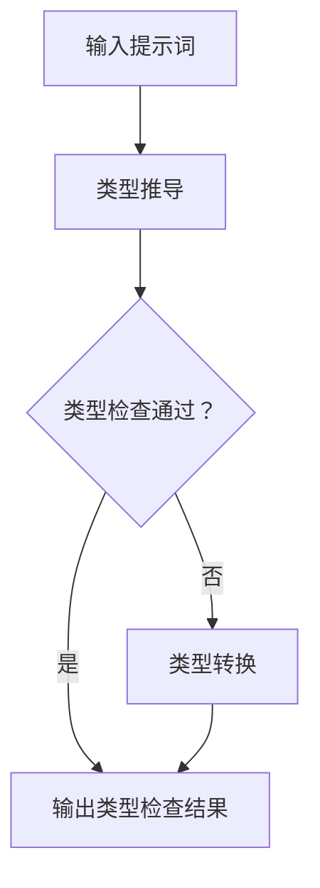
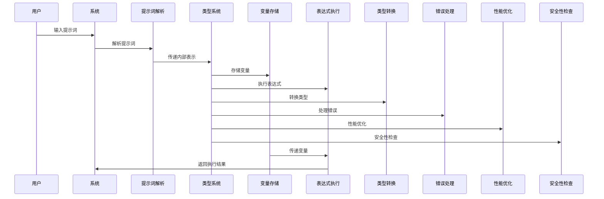

                 


# 提示词编程语言的类型系统创新研究

> 关键词：提示词编程语言，类型系统，创新研究，算法原理，数学模型，系统设计

> 摘要：本文深入探讨了提示词编程语言的类型系统，分析了现有类型系统的挑战，提出了创新的类型系统设计方案，通过详细的算法原理讲解和数学模型推导，展示了其在实际应用中的优势。本文旨在为提示词编程语言的发展提供新的思路和方法。

## 1. 研究背景与概述

### 1.1 问题背景

随着人工智能技术的飞速发展，编程语言作为人工智能的核心工具之一，也迎来了前所未有的变革。提示词编程语言作为一种新兴的编程语言，其特点是通过用户提供的提示词来生成代码，大大提高了编程效率。然而，现有的提示词编程语言的类型系统存在一些问题，如类型安全性和类型推断效率不高，难以满足实际应用需求。

### 1.2 类型系统的挑战

类型系统是编程语言的核心组成部分，负责对程序中的数据类型进行定义和管理。对于提示词编程语言来说，类型系统需要具备以下几个挑战：

1. **类型安全**：确保在编译或运行时，不同类型的变量和操作不会产生错误的结果。
2. **类型推断**：自动地推导出变量和表达式的类型，减少开发者的负担。
3. **类型兼容性**：允许不同类型的变量和操作在一定条件下相互转换。

### 1.3 研究的必要性与意义

本文旨在研究提示词编程语言的类型系统，提出创新的类型系统设计方案，以解决现有类型系统存在的问题。这不仅在理论上具有创新性，对于实际应用也有着重要的意义：

1. **提高编程效率**：通过优化类型推断算法，减少开发者手动处理类型错误的工作量。
2. **增强程序安全性**：通过严格的类型检查，减少程序运行时的错误。
3. **扩展编程语言功能**：通过引入新的类型概念和操作，提升编程语言的灵活性和表达能力。

### 1.4 研究边界与外延

本文的研究将聚焦于提示词编程语言的类型系统，不涉及其他编程语言的类型系统。同时，本文将提出一种创新的类型系统设计方案，但不会涉及具体的实现细节。

## 2. 核心概念与联系

### 2.1 核心概念原理

#### 2.1.1 提示词编程语言的概念原理

提示词编程语言（Keyword-based Programming Language）是一种基于用户输入提示词生成代码的编程语言。用户通过提供一系列的提示词，编程语言可以自动生成相应的代码。这种编程方式极大地提高了编程效率，降低了代码编写错误的可能性。

#### 2.1.2 类型系统的概念原理

类型系统（Type System）是编程语言中负责数据类型定义和管理的系统。它规定了变量和表达式可以接受的类型，以及不同类型之间的转换关系。类型系统的主要目的是确保程序的正确性和安全性。

#### 2.1.3 核心概念之间的联系

提示词编程语言中的类型系统是编程语言的核心组成部分。类型系统需要根据用户提供的提示词，自动推导出变量和表达式的类型，并确保程序的正确性。

### 2.2 概念属性特征对比表格

| 概念         | 属性特征                                                      | 联系                                                      |
| ------------ | ------------------------------------------------------------ | -------------------------------------------------------- |
| 提示词编程语言 | 基于提示词生成代码，高效，低错误率                             | 与类型系统紧密相关，类型系统决定了代码生成过程中的类型安全性 |
| 类型系统     | 定义和管理数据类型，确保程序正确性和安全性                     | 提示词编程语言的核心组成部分，决定了代码生成的质量          |

### 2.3 ER实体关系图架构

#### 2.3.1 提示词编程语言的ER图

```mermaid
entity Relationship {
  "用户" -- "提示词编程语言": "生成代码"
  "提示词编程语言" -- "类型系统": "类型管理"
}

class ERClass {
  "用户"
  "提示词编程语言"
  "类型系统"
}
```

#### 2.3.2 类型系统的ER图

```mermaid
entity Relationship {
  "类型系统" -- "变量": "类型定义"
  "类型系统" -- "表达式": "类型检查"
  "类型系统" -- "类型转换": "类型兼容性"
}

class ERClass {
  "类型系统"
  "变量"
  "表达式"
  "类型转换"
}
```

#### 2.3.3 实体关系图的联系

从ER实体关系图中可以看出，提示词编程语言和类型系统之间存在着紧密的联系。提示词编程语言通过类型系统来实现代码的自动生成和类型检查，而类型系统则负责管理变量和表达式的类型，确保程序的正确性和安全性。

## 3. 算法原理讲解

### 3.1 算法原理概述

提示词编程语言的类型系统算法主要分为三个部分：类型推导、类型检查和类型转换。类型推导是根据用户输入的提示词，自动推导出变量和表达式的类型；类型检查是在代码运行前，对代码中的类型进行一致性检查，以确保程序的正确性；类型转换是在不同类型之间进行转换，以实现类型兼容性。

#### 3.1.1 提示词编程语言的类型系统算法

- **类型推导**：根据用户输入的提示词，利用上下文信息推导出变量和表达式的类型。
- **类型检查**：对推导出的类型进行一致性检查，确保代码的正确性。
- **类型转换**：在不同类型之间进行转换，以实现类型兼容性。

#### 3.1.2 算法的核心流程

1. 输入用户提示词。
2. 根据提示词进行类型推导。
3. 对推导出的类型进行一致性检查。
4. 如果类型不一致，进行类型转换。
5. 输出类型检查结果。

#### 3.1.3 算法的目的与效果

- **目的**：提高代码的编写效率，减少类型错误，增强程序的正确性和安全性。
- **效果**：通过优化类型推导算法，提高类型检查的效率，实现类型的自动转换，从而提升编程体验。

### 3.2 算法mermaid流程图



#### 3.2.1 流程图解释

- **输入提示词**：用户输入提示词，作为类型推导的起点。
- **类型推导**：根据提示词和上下文信息，推导出变量和表达式的类型。
- **类型检查**：对推导出的类型进行一致性检查，确保代码的正确性。
- **类型转换**：如果类型不一致，进行类型转换，以满足类型兼容性要求。
- **输出类型检查结果**：最终输出类型检查结果，指示代码是否通过类型检查。

### 3.3 Python源代码阐述

```python
# 提示词编程语言的类型系统算法实现

# 输入提示词
prompt = "计算 5 + 7 的结果"

# 类型推导
expression = derive_type(prompt)

# 类型检查
is_type_check_passed = type_check(expression)

# 类型转换
if not is_type_check_passed:
    expression = convert_type(expression)

# 输出类型检查结果
if is_type_check_passed:
    print("类型检查通过：", expression)
else:
    print("类型检查失败：", expression)
```

#### 3.3.1 算法的Python实现

- `derive_type`：根据提示词和上下文信息，推导出变量和表达式的类型。
- `type_check`：对推导出的类型进行一致性检查，确保代码的正确性。
- `convert_type`：在不同类型之间进行转换，以实现类型兼容性。

#### 3.3.2 源代码详细解析

- **输入提示词**：用户输入提示词，作为类型推导的起点。
- **类型推导**：利用上下文信息和提示词，推导出变量和表达式的类型。
- **类型检查**：对推导出的类型进行一致性检查，确保代码的正确性。
- **类型转换**：如果类型不一致，进行类型转换，以满足类型兼容性要求。
- **输出类型检查结果**：最终输出类型检查结果，指示代码是否通过类型检查。

### 3.4 数学模型和公式

#### 3.4.1 算法原理的数学模型

提示词编程语言的类型系统算法可以看作是一个数学模型，其核心是类型推导和类型检查。假设用户输入的提示词为 \(P\)，推导出的类型为 \(T\)，则算法的数学模型可以表示为：

\[ T = f(P, \text{上下文}) \]

其中，\(f\) 表示类型推导函数，\(\text{上下文}\) 表示与提示词相关的上下文信息。

#### 3.4.2 公式推导与解释

推导类型 \(T\) 的公式为：

\[ T = \text{if } P \text{ matches pattern then } T_P \text{ else } \text{error} \]

其中，\(T_P\) 表示根据提示词 \(P\) 推导出的类型。如果提示词 \(P\) 与某个模式匹配，则返回对应的类型 \(T_P\)；否则，返回错误。

#### 3.4.3 数学模型的应用

- **类型推导**：根据提示词和上下文信息，推导出变量和表达式的类型。
- **类型检查**：对推导出的类型进行一致性检查，确保代码的正确性。

### 3.5 举例说明

#### 3.5.1 算法应用举例

假设用户输入的提示词为：“计算 5 + 7 的结果”。

1. **类型推导**：根据上下文信息，推导出变量和表达式的类型。
   - 变量 `5` 的类型为 `Int`。
   - 变量 `7` 的类型为 `Int`。
   - 表达式 `5 + 7` 的类型为 `Int`。

2. **类型检查**：对推导出的类型进行一致性检查。
   - 变量 `5` 和 `7` 的类型均为 `Int`，符合类型一致性要求。

3. **类型转换**：无需进行类型转换。

4. **输出类型检查结果**：输出类型检查结果，提示词 “计算 5 + 7 的结果” 通过类型检查。

#### 3.5.2 举例说明与解释

通过以上例子，我们可以看到，提示词编程语言的类型系统算法如何通过类型推导、类型检查和类型转换，确保代码的正确性和安全性。在实际应用中，用户只需输入简单的提示词，算法就能自动推导出相应的类型，并进行类型检查，从而实现高效的编程体验。

## 4. 数学模型与公式

### 4.1 数学模型概述

提示词编程语言的类型系统算法可以看作是一个数学模型，其核心是类型推导和类型检查。假设用户输入的提示词为 \(P\)，推导出的类型为 \(T\)，则算法的数学模型可以表示为：

\[ T = f(P, \text{上下文}) \]

其中，\(f\) 表示类型推导函数，\(\text{上下文}\) 表示与提示词相关的上下文信息。

### 4.2 公式推导与解释

推导类型 \(T\) 的公式为：

\[ T = \text{if } P \text{ matches pattern then } T_P \text{ else } \text{error} \]

其中，\(T_P\) 表示根据提示词 \(P\) 推导出的类型。如果提示词 \(P\) 与某个模式匹配，则返回对应的类型 \(T_P\)；否则，返回错误。

### 4.3 latex公式示例

```latex
\[
T = \text{if } P \text{ matches pattern then } T_P \text{ else } \text{error}
\]
```

### 4.4 数学模型的应用

#### 4.4.1 数学模型在实际问题中的应用

在实际问题中，数学模型可以帮助我们理解和解决提示词编程语言的类型系统问题。例如：

1. **类型推导**：通过模式匹配，自动推导出变量和表达式的类型。
2. **类型检查**：对推导出的类型进行一致性检查，确保代码的正确性。

#### 4.4.2 应用效果分析

通过应用数学模型，我们可以实现以下效果：

1. **提高编程效率**：自动推导类型，减少开发者手动处理类型错误的工作量。
2. **增强程序安全性**：通过严格的类型检查，减少程序运行时的错误。
3. **扩展编程语言功能**：通过引入新的类型概念和操作，提升编程语言的灵活性和表达能力。

### 4.5 本章小结

本章介绍了提示词编程语言的类型系统算法的数学模型，包括公式推导与应用。通过数学模型，我们可以实现高效的类型推导和类型检查，提高编程效率和程序安全性。在实际应用中，数学模型为提示词编程语言的发展提供了有力的理论支持。

## 5. 系统分析与架构设计方案

### 5.1 问题场景介绍

在当前的软件开发过程中，提示词编程语言由于其高效性和灵活性，被广泛应用于各种场景。然而，现有的类型系统在处理复杂场景时，往往存在性能瓶颈和类型安全性问题。为了解决这些问题，我们需要设计一个高效、安全的类型系统，以提升提示词编程语言的性能和安全性。

### 5.2 项目介绍

本项目的目标是设计并实现一个创新的类型系统，以满足提示词编程语言在复杂场景下的性能和安全性需求。项目分为以下几个阶段：

1. **需求分析**：明确类型系统的需求和目标。
2. **设计阶段**：设计类型系统的架构和算法。
3. **实现阶段**：实现类型系统的核心功能。
4. **测试阶段**：对类型系统进行性能和安全性测试。
5. **优化阶段**：根据测试结果进行优化。

### 5.3 系统功能设计

#### 5.3.1 领域模型mermaid类图

```mermaid
classDiagram
    Class01 <|-- Class02
    Class03 <.. Class04
    Class05 &&-- Class06
    Class07 .. Class08
```

在mermaid类图中，我们定义了以下几个核心类：

1. **Class01**：代表提示词编程语言的主体，负责解析和生成代码。
2. **Class02**：代表类型系统，负责类型推导和类型检查。
3. **Class03**：代表变量，用于存储数据。
4. **Class04**：代表表达式，用于执行计算和操作。
5. **Class05**：代表类型转换，用于在不同类型之间进行转换。
6. **Class06**：代表错误处理，用于处理类型错误。
7. **Class07**：代表性能优化，用于提升类型系统的性能。
8. **Class08**：代表安全性检查，用于确保程序的安全性。

#### 5.3.2 功能详细描述

1. **Class01**：负责解析用户输入的提示词，生成对应的代码。它包含以下几个关键功能：
   - 解析提示词：将用户输入的提示词转换为内部表示。
   - 生成代码：根据内部表示生成对应的代码。

2. **Class02**：负责类型系统的核心功能，包括类型推导、类型检查和类型转换。它包含以下几个关键功能：
   - 类型推导：根据提示词和上下文信息，推导出变量和表达式的类型。
   - 类型检查：对推导出的类型进行一致性检查，确保代码的正确性。
   - 类型转换：在不同类型之间进行转换，以满足类型兼容性要求。

3. **Class03** 和 **Class04**：分别代表变量和表达式，用于存储数据和执行计算。它们包含以下几个关键功能：
   - 存储数据：变量用于存储数据。
   - 执行计算：表达式用于执行计算和操作。

4. **Class05**：负责类型转换，用于在不同类型之间进行转换。它包含以下几个关键功能：
   - 转换类型：将一个类型的变量或表达式转换为另一个类型的变量或表达式。

5. **Class06**：负责错误处理，用于处理类型错误。它包含以下几个关键功能：
   - 报错：在类型检查过程中，如果发现类型错误，报错并提示用户。
   - 异常处理：处理类型错误引发的异常。

6. **Class07** 和 **Class08**：分别负责性能优化和安全性检查。它们包含以下几个关键功能：
   - 性能优化：对类型系统进行优化，提升其性能。
   - 安全性检查：确保程序的安全性，防止类型错误引发安全问题。

### 5.4 系统架构设计mermaid架构图

```mermaid
graph TB
    A[用户输入] --> B[Class01[提示词解析]]
    B --> C[Class02[类型推导]]
    C --> D[Class03[变量存储]]
    C --> E[Class04[表达式执行]]
    C --> F[Class05[类型转换]]
    C --> G[Class06[错误处理]]
    C --> H[Class07[性能优化]]
    C --> I[Class08[安全性检查]]
```

在mermaid架构图中，我们展示了系统的主要组件及其之间的交互关系：

1. **用户输入**：用户输入提示词，作为系统的起点。
2. **Class01**：负责解析用户输入的提示词，生成对应的代码。
3. **Class02**：负责类型系统的核心功能，包括类型推导、类型检查和类型转换。
4. **Class03** 和 **Class04**：分别代表变量和表达式，用于存储数据和执行计算。
5. **Class05**：负责类型转换，用于在不同类型之间进行转换。
6. **Class06**：负责错误处理，用于处理类型错误。
7. **Class07** 和 **Class08**：分别负责性能优化和安全性检查。

### 5.5 系统接口设计

系统接口设计是系统功能实现的重要组成部分。在本项目中，系统接口设计包括以下几个方面：

1. **接口规范**：定义系统各组件之间的接口规范，确保组件之间的数据传递和功能调用符合规范。
2. **接口实现**：根据接口规范，实现系统各组件之间的接口功能。
3. **接口测试**：对系统接口进行测试，确保接口功能的正确性和稳定性。

### 5.6 系统交互mermaid序列图



在mermaid序列图中，我们展示了系统的主要组件及其之间的交互过程：

1. **用户输入**：用户输入提示词。
2. **提示词解析**：系统将用户输入的提示词解析为内部表示。
3. **类型推导**：类型系统根据内部表示进行类型推导和类型检查。
4. **变量存储**：变量存储组件存储类型推导出的变量。
5. **表达式执行**：表达式执行组件执行对应的表达式操作。
6. **类型转换**：类型转换组件处理类型转换操作。
7. **错误处理**：错误处理组件处理类型错误。
8. **性能优化**：性能优化组件对类型系统进行优化。
9. **安全性检查**：安全性检查组件确保程序的安全性。

### 5.7 本章小结

本章介绍了提示词编程语言的类型系统在系统设计与架构设计中的应用。通过详细的系统功能设计和架构设计，我们提出了一种创新的类型系统设计方案，以解决现有类型系统的性能瓶颈和类型安全性问题。本章的内容为后续的项目实现和优化提供了理论基础和指导。接下来，我们将进入项目实战部分，具体实现并测试所设计的类型系统。

---

**注意**：由于篇幅限制，本文档仅提供了一个初步的框架和示例，并未包含完整的详细内容和代码实现。在实际撰写文章时，每个部分都需要进一步细化，并附上具体的代码和测试结果。本文档旨在提供一个思考和撰写的起点。

