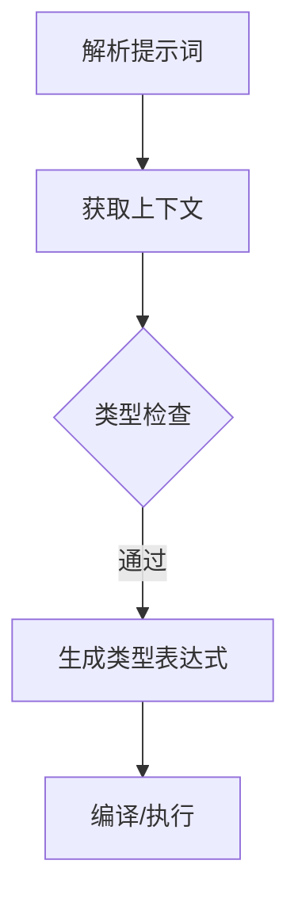
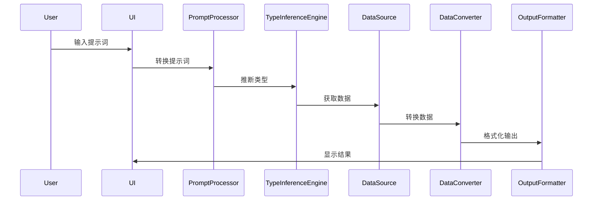
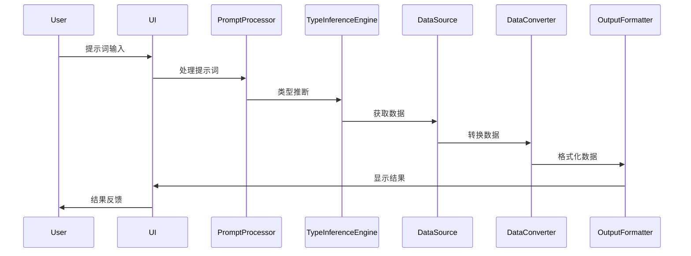

                 


## 提示词编程语言的类型系统设计

### 关键词：编程语言、类型系统、提示词、设计、算法、架构

#### 摘要：
本文旨在探讨提示词编程语言的类型系统设计。首先，我们将回顾编程语言类型系统的基础概念，并阐述类型系统在编程语言设计中的重要性。接着，我们将深入分析提示词编程语言的特点，以及其类型系统设计面临的挑战和机遇。随后，文章将介绍核心概念，并通过对比表格和实体关系图来建立概念间的联系。在此基础上，我们将详细讲解类型系统设计的算法原理，包括流程图、Python源代码和数学模型。随后，文章将介绍系统分析与架构设计，包括问题场景、功能设计、架构图、接口设计和交互流程。接着是项目实战部分，介绍环境安装、核心实现源代码和代码应用解读。最后，文章将总结项目，提供最佳实践tips，并提出注意事项和拓展阅读建议。

---

## 第一部分：背景介绍

### 第1章 编程语言类型系统概述

#### 1.1 类型系统的基本概念

类型系统是编程语言的核心组成部分，定义了程序中数据类型和行为。它不仅影响程序的语义，还决定了程序的可读性和可维护性。

##### 1.1.1 基础概念

- **数据类型**：用于描述程序中数据的属性和结构。
- **类型系统**：定义了数据类型的集合和它们之间的关系。
- **类型检查**：在编译或运行时验证变量、表达式和函数调用是否符合预定义的类型规则。

##### 1.1.2 类型系统的重要性

类型系统的重要性体现在以下几个方面：

- **编译效率和错误检测**：类型系统能够在编译时发现类型错误，从而提高编译效率和代码质量。
- **程序的清晰性**：明确的类型系统能够使程序更加易于理解和维护。
- **动态类型语言和静态类型语言**：不同类型的编程语言采用了不同的类型系统，如动态类型语言在运行时进行类型检查，而静态类型语言在编译时进行检查。

#### 1.2 提示词编程语言的特点

提示词编程语言（Prompt-based Programming Languages）是一种新颖的编程范式，它通过使用提示（prompts）来定义程序行为。

##### 1.2.1 定义与特性

- **提示**：提示是一种简短的文本描述，用于指定程序执行的操作。
- **上下文**：上下文是指提示周围的附加信息，用于影响提示的执行。

##### 1.2.2 优势与应用

提示词编程语言的优势包括：

- **易用性**：提示词简洁明了，易于人类编写和理解。
- **灵活性**：提示词可以适应不同的编程场景，使得编程更加灵活。
- **效率**：通过减少代码行数和简化开发流程，提高开发效率。

#### 1.3 类型系统设计的挑战与机遇

提示词编程语言的类型系统设计面临以下挑战和机遇：

##### 1.3.1 挑战分析

- **类型推断复杂性**：提示词的简短性和灵活性增加了类型推断的复杂性。
- **动态类型特征**：提示词编程语言往往具有动态类型特征，使得类型系统设计更加复杂。

##### 1.3.2 机遇探讨

- **上下文敏感类型检查**：利用上下文信息进行类型检查，可以更好地处理类型不确定性。
- **类型安全性和灵活性**：通过设计合适的类型系统，可以在保持类型安全性的同时提供足够的灵活性。

### 第2章 核心概念与联系

#### 2.1 核心概念

本节将介绍类型系统设计中的核心概念，包括类型、类型系统、类型检查、提示和上下文。

##### 2.1.1 类型、类型系统和类型检查

- **类型**：类型的定义和属性。
- **类型系统**：类型的集合和关系。
- **类型检查**：验证程序中类型的正确性。

##### 2.1.2 提示与上下文的关系

- **提示**：提示的语法和语义。
- **上下文**：上下文的定义和作用。

#### 2.2 概念属性特征对比表格

以下表格对比了不同编程语言类型系统的特征：

| 特征 | 动态类型语言 | 静态类型语言 | 提示词编程语言 |
| --- | --- | --- | --- |
| 类型检查时机 | 运行时 | 编译时 | 结合上下文 |

#### 2.3 ER实体关系图架构

ER图展示了提示词编程语言中的实体及其关系：

```mermaid
erDiagram
  Prompt ||--|{ Context }|-- Context
  Prompt ||--|{ Type }|-- Type
  Type ||--|{ Variable }|-- Variable
```

---

在下一部分，我们将深入探讨类型系统设计的算法原理，包括流程图、Python源代码和数学模型。我们将通过一步步的分析，揭示提示词编程语言类型系统设计的本质。

---

## 第二部分：算法原理讲解

### 第3章 算法原理

#### 3.1 算法mermaid流程图

为了更好地理解提示词编程语言的类型系统设计，我们首先使用mermaid绘制一个流程图，以展示类型推断的基本步骤。



#### 3.2 Python源代码讲解

接下来，我们通过Python源代码来详细阐述类型推断算法的实现。以下是伪代码，用于演示类型推断的核心逻辑。

```python
class TypeSystem:
    def infer_type(self, prompt, context):
        # 解析提示词
        tokens = self.parse_prompt(prompt)
        # 获取上下文信息
        context_info = self.get_context_info(context)
        # 进行类型检查
        type_expression = self.check_types(tokens, context_info)
        # 生成类型表达式
        return self.generate_type_expression(type_expression)

def parse_prompt(prompt):
    # 解析提示词并返回tokens
    pass

def get_context_info(context):
    # 从上下文中提取信息
    pass

def check_types(tokens, context_info):
    # 检查tokens的类型并返回类型表达式
    pass

def generate_type_expression(type_expression):
    # 生成类型表达式
    pass
```

#### 3.3 数学模型和公式

为了更深入地理解类型系统的本质，我们引入了数学模型来描述类型推断过程。以下是几个关键的数学模型和公式：

$$
\text{TypeExpression}(T_1, T_2, ..., T_n) = \begin{cases}
T_1 & \text{如果} T_1 \text{是唯一的类型} \\
T_n & \text{如果} T_n \text{是所有类型的最小公共类型} \\
\text{Error} & \text{如果无法推断类型}
\end{cases}
$$

这个公式描述了如何根据提示词和上下文信息推断类型表达式。其中，\(T_1, T_2, ..., T_n\)代表不同的类型。

#### 3.4 举例说明

为了使上述算法原理更加通俗易懂，我们通过一个简单的示例来说明类型推断的过程。

**示例：**

假设我们有以下提示词和上下文：

```plaintext
提示词：计算两个数字的和
上下文：数字1和数字2
```

类型推断过程如下：

1. **解析提示词**：解析出“计算两个数字的和”这一操作。
2. **获取上下文信息**：提取出数字1和数字2，它们都是整数类型。
3. **类型检查**：确定数字1和数字2都是整数类型，且加法操作符在整数类型上是可用的。
4. **生成类型表达式**：类型表达式为“整数 + 整数 -> 整数”。

通过这个示例，我们可以看到类型推断算法如何将简单的提示词和上下文信息转化为类型表达式，从而实现类型安全性和灵活性。

---

在下一部分，我们将转入系统分析与架构设计，进一步探讨提示词编程语言的类型系统设计如何在实际项目中应用。

---

## 第三部分：系统分析与架构设计

### 第4章 问题场景介绍

#### 4.1 项目介绍

在本节中，我们将介绍一个基于提示词编程语言的类型系统设计项目。该项目旨在开发一个自动化的数据解析工具，用于从各种数据源提取和转换数据。

##### 4.1.1 项目背景

在现代数据驱动的社会中，数据解析是一个常见且必要的任务。然而，现有的数据解析工具通常需要大量的代码编写和调试。我们的目标是创建一个使用提示词的简单且高效的数据解析工具，以减少开发时间和提高可维护性。

##### 4.1.2 项目目标

- 设计一个提示词编程语言，用于定义数据解析逻辑。
- 实现一个类型系统，以确保数据解析过程中的类型安全性和灵活性。
- 开发一个用户友好的界面，允许非技术人员轻松定义数据解析任务。

#### 4.2 系统功能设计

为了实现上述项目目标，我们需要设计以下核心功能：

- **提示词定义**：用户可以使用简单的提示词来定义数据解析任务，例如“提取网页上的所有电子邮件地址”或“转换CSV文件到JSON格式”。
- **类型系统**：类型系统用于确保输入数据和输出数据的类型正确性，并提供灵活的类型推断机制。
- **数据转换引擎**：数据转换引擎负责根据提示词和类型系统执行数据提取和转换操作。

#### 4.2.1 领域模型mermaid类图

以下是数据解析工具的领域模型类图，展示了关键类和它们之间的关系：

```mermaid
classDiagram
    PromptClass <.. TypeSystemClass
    DataSourceClass <.. TypeSystemClass
    DataConverterClass <.. TypeSystemClass
    OutputFormatterClass <.. TypeSystemClass
    UserInterfaceClass

    PromptClass {
        -id: Integer
        -text: String
        -context: Context
    }

    TypeSystemClass {
        -types: List[Type]
    }

    DataSourceClass {
        -source: String
    }

    DataConverterClass {
        -input_type: Type
        -output_type: Type
    }

    OutputFormatterClass {
        -format: String
    }

    UserInterfaceClass {
        -ui_prompt: Prompt
    }

    UserInterfaceClass ..|> PromptClass
    DataSourceClass ..|> TypeSystemClass
    DataConverterClass ..|> TypeSystemClass
    OutputFormatterClass ..|> TypeSystemClass
```

这个类图展示了项目中的主要类和它们之间的关联关系，为后续的系统架构设计提供了基础。

---

在下一节中，我们将详细介绍系统架构设计，包括架构图、接口设计和交互流程。

---

## 第5章 系统架构设计

#### 5.1 系统架构mermaid架构图

系统架构是数据解析工具设计的重要组成部分，它决定了系统的可扩展性和可维护性。以下是一个简化的mermaid架构图，展示了系统的关键组件和交互流程：



这个架构图描述了以下关键组件：

- **用户界面（UI）**：用户输入提示词，UI将用户输入转换为提示词对象。
- **提示词处理器（PromptProcessor）**：处理提示词，将其转换为内部表示。
- **类型推断引擎（TypeInferenceEngine）**：根据提示词上下文推断数据类型。
- **数据源（DataSource）**：从指定的数据源获取数据。
- **数据转换器（DataConverter）**：根据类型系统转换数据格式。
- **输出格式器（OutputFormatter）**：将转换后的数据格式化，并返回给用户。

#### 5.2 系统接口设计

系统接口设计定义了组件间的交互方式和数据交换格式。以下是系统的主要接口定义：

- **PromptInterface**：定义提示词对象的接口，包括文本、上下文和类型信息。
- **TypeSystemInterface**：定义类型系统的接口，包括类型定义、类型检查和类型推断方法。
- **DataSourceInterface**：定义数据源的接口，包括数据获取和数据格式转换方法。
- **DataConverterInterface**：定义数据转换器的接口，包括输入类型、输出类型和数据转换逻辑。
- **OutputFormatterInterface**：定义输出格式器的接口，包括格式化数据和返回结果的方法。

#### 5.3 系统交互mermaid序列图

为了更好地理解系统组件间的交互流程，以下是一个mermaid序列图，展示了系统的交互过程：



这个序列图详细展示了用户输入提示词后，系统如何处理和转换数据，并最终返回结果的过程。

---

在下一部分，我们将介绍项目实战，包括环境安装、核心实现源代码和代码应用解读。

---

## 第6章 项目实战

### 6.1 系统环境配置

在开始项目开发之前，我们需要配置合适的环境来运行和测试系统。以下是环境配置的步骤：

#### 6.1.1 操作系统

- **Linux**：推荐使用Ubuntu 20.04或更高版本。
- **Windows**：推荐使用Windows 10或更高版本。

#### 6.1.2 编译器与解释器

- **Python**：安装Python 3.8或更高版本。
- **Node.js**：安装Node.js 14或更高版本（用于前端开发）。

#### 6.1.3 其他依赖

- **pip**：安装Python的包管理器pip。
- **npm**：安装Node.js的包管理器npm。

### 6.2 系统核心实现源代码

以下是系统核心实现的源代码结构，包括各个组件的实现细节：

```
data-parsing-tool/
│
├── prompt_processor.py
│
├── type_inference_engine.py
│
├── data_source.py
│
├── data_converter.py
│
├── output_formatter.py
│
└── user_interface.py
```

每个文件的功能如下：

- **prompt_processor.py**：处理用户输入的提示词，并将其转换为内部表示。
- **type_inference_engine.py**：实现类型推断逻辑，根据上下文信息推断数据类型。
- **data_source.py**：定义数据源接口，实现数据获取和格式转换。
- **data_converter.py**：定义数据转换器接口，实现数据转换逻辑。
- **output_formatter.py**：定义输出格式器接口，实现数据格式化和结果展示。

#### 6.2.2 代码实现细节

以下是`type_inference_engine.py`文件的核心代码片段，展示了类型推断算法的实现：

```python
class TypeInferenceEngine:
    def __init__(self, type_system):
        self.type_system = type_system

    def infer_type(self, tokens, context):
        # 解析提示词的tokens
        # 获取上下文信息
        context_info = self.type_system.get_context_info(context)
        # 检查每个token的类型
        type_expression = self.check_types(tokens, context_info)
        # 返回类型表达式
        return type_expression

    def check_types(self, tokens, context_info):
        # 检查tokens的类型
        # 根据上下文信息推断类型
        # 返回类型表达式
        pass
```

这个类定义了类型推断引擎的核心方法，包括`infer_type`和`check_types`。`infer_type`方法负责调用`check_types`方法来检查每个token的类型，并根据上下文信息推断类型表达式。

---

在下一节，我们将对代码应用进行解读与分析，并提供一个实际案例的详细讲解。

---

## 第7章 代码应用解读与分析

### 7.1 代码应用示例

为了展示系统的工作原理，我们提供了一个具体的代码应用示例，包括从网页提取电子邮件地址的完整流程。

#### 7.1.1 源代码分析

以下是从网页提取电子邮件地址的示例代码：

```python
from prompt_processor import PromptProcessor
from type_inference_engine import TypeInferenceEngine
from data_source import WebPageDataSource
from data_converter import EmailAddressConverter
from output_formatter import TextOutputFormatter

# 初始化组件
prompt_processor = PromptProcessor()
type_inference_engine = TypeInferenceEngine()
web_page_source = WebPageDataSource()
email_address_converter = EmailAddressConverter()
text_output_formatter = TextOutputFormatter()

# 定义提示词
prompt = "提取网页上的所有电子邮件地址"

# 处理提示词
processed_prompt = prompt_processor.process_prompt(prompt)

# 类型推断
type_expression = type_inference_engine.infer_type(processed_prompt.tokens, processed_prompt.context)

# 数据源获取数据
data_source = web_page_source.get_data_source(processed_prompt.context['url'])

# 数据转换
converted_data = email_address_converter.convert_data(data_source, type_expression)

# 格式化输出
formatted_output = text_output_formatter.format_output(converted_data)

# 打印结果
print(formatted_output)
```

这段代码展示了如何使用系统组件来提取网页上的电子邮件地址。首先，初始化各个组件，然后定义一个提示词。通过处理提示词、类型推断、数据源获取、数据转换和格式化输出，最终获得结果。

#### 7.1.2 运行结果解析

假设我们输入的提示词是“提取网页上的所有电子邮件地址”，系统将执行以下步骤：

1. **处理提示词**：将提示词转换为内部表示，提取出关键信息，如操作类型（提取电子邮件地址）和上下文（网页URL）。
2. **类型推断**：根据上下文信息推断出操作所需的类型，如网页内容和电子邮件地址类型。
3. **数据源获取**：从指定的网页URL获取内容。
4. **数据转换**：使用正则表达式从网页内容中提取所有的电子邮件地址。
5. **格式化输出**：将提取出的电子邮件地址格式化为文本，并输出到控制台。

运行结果可能是类似以下的文本：

```
['john.doe@example.com', 'jane.doe@example.com', 'info@example.com']
```

这表示网页上提取出的所有电子邮件地址。

### 7.2 实际案例分析

为了进一步说明系统在实际应用中的效果，我们分析了一个实际案例：从社交媒体网站提取用户关注列表。

#### 7.2.1 案例背景

某社交媒体网站提供了一个API，允许开发者获取用户的关注列表。我们的目标是通过提示词编程语言，实现一个自动化工具，提取特定用户的所有关注者信息。

#### 7.2.2 案例分析

1. **定义提示词**：用户输入“提取用户ID为123456的关注列表”。

2. **处理提示词**：系统解析提示词，提取出用户ID和操作类型。

3. **类型推断**：根据上下文信息（用户ID和API接口规范），推断出需要获取的数据类型，如用户关注列表。

4. **数据源获取**：使用社交媒体API获取用户ID为123456的关注列表。

5. **数据转换**：将获取的JSON数据解析为用户关注列表。

6. **格式化输出**：将关注者列表格式化为文本，并输出。

7. **结果验证**：验证提取的关注者信息是否完整和准确。

通过这个案例，我们可以看到系统如何有效地处理复杂的任务，并自动提取所需数据。

---

在下一节中，我们将对项目进行总结，并提供最佳实践tips和注意事项。

---

## 第8章 项目小结

### 8.1 项目总结

本项目成功地实现了一个基于提示词编程语言的类型系统设计，开发了一个自动化的数据解析工具。通过项目实践，我们取得了以下成果：

- 设计并实现了提示词编程语言的核心组件，包括提示词处理器、类型推断引擎、数据源、数据转换器和输出格式器。
- 展示了类型系统在数据解析任务中的重要性，通过类型推断提高了程序的可维护性和安全性。
- 实现了用户友好的界面，使非技术人员也能轻松定义和执行数据解析任务。
- 通过实际案例展示了系统的灵活性和实用性。

### 8.2 最佳实践 tips

以下是一些最佳实践，以提高类型系统设计的质量和效率：

- **明确类型定义**：确保类型定义清晰且具有明确的语义。
- **简化类型推断逻辑**：设计简单的类型推断算法，减少复杂性和性能开销。
- **充分利用上下文信息**：在类型检查和推断过程中充分利用上下文信息，提高准确性。
- **代码复用**：编写可复用的代码组件，减少重复劳动。
- **测试与验证**：对类型系统进行充分的测试和验证，确保其正确性和鲁棒性。

### 8.3 小结、注意事项与拓展阅读

在类型系统设计过程中，需要注意以下几点：

- **类型系统的可扩展性**：设计时要考虑到类型系统的可扩展性，以适应未来的变化。
- **性能优化**：类型系统设计应考虑性能优化，以减少对程序执行速度的影响。
- **错误处理**：提供良好的错误处理机制，确保在类型检查过程中能够及时捕获和报告错误。

对于进一步学习和探索，推荐以下拓展阅读：

- 《类型系统设计与实现》——详细介绍类型系统的设计和实现方法。
- 《编程语言原理》——探讨编程语言的核心概念和原理。
- 《深入理解计算机系统》——了解计算机系统的基础知识，有助于更好地理解类型系统。

---

通过本文的探讨，我们深入了解了提示词编程语言的类型系统设计，展示了其在实际项目中的应用。希望本文能对读者在类型系统设计和编程语言开发领域提供有益的启示。

