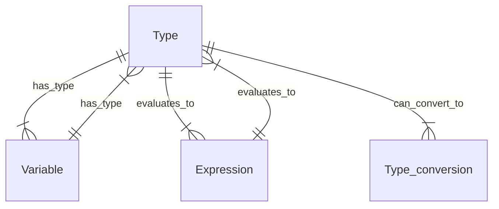
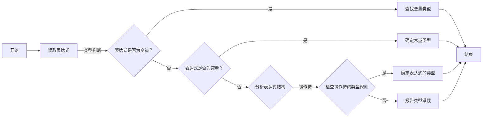
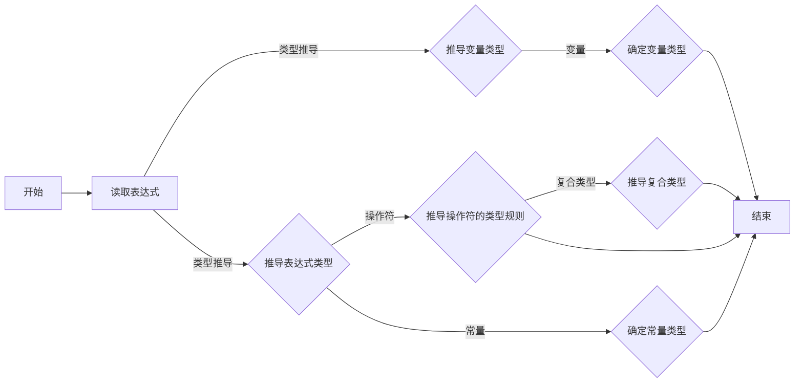
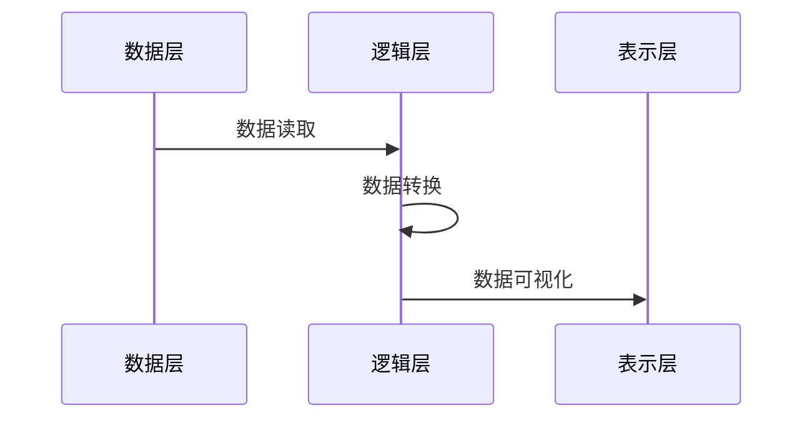
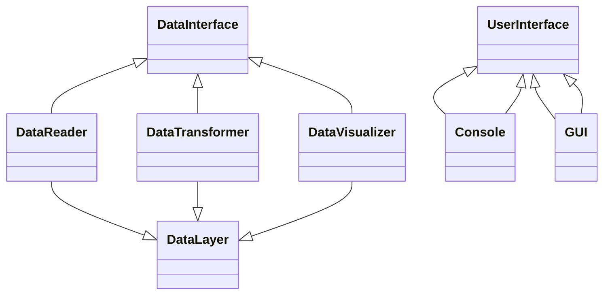
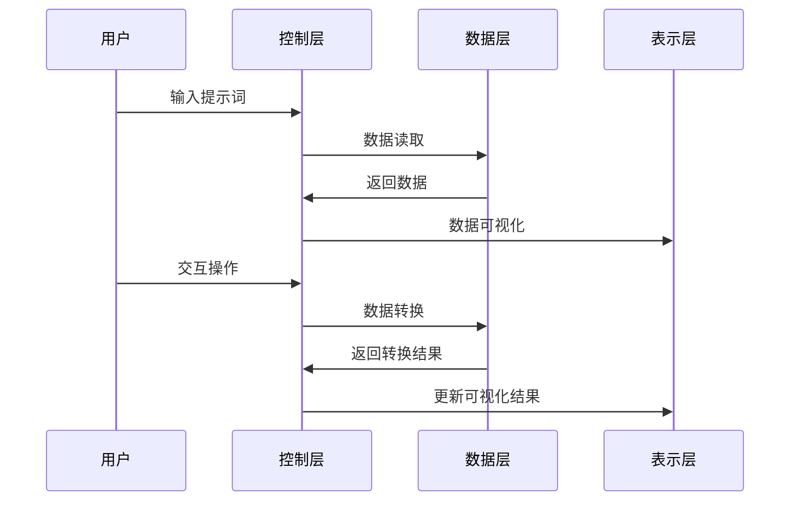

                 

# 《提示词编程语言的类型系统设计》

## 关键词

- 提示词编程语言
- 类型系统
- 设计原理
- 算法讲解
- 数学模型
- 系统架构

## 摘要

本文旨在探讨提示词编程语言的类型系统设计，分析其核心概念、设计原则、算法原理以及数学模型。文章将详细阐述类型系统的组成部分、发展历程、基本概念与联系，并深入讲解类型系统设计原理和算法实现，最后结合实际项目案例进行分析和总结，为读者提供全面深入的理解和实践指导。

## 第一部分：背景介绍

### 1.1.1 提示词编程语言的概念与特点

**提示词编程语言**，又称领域特定语言（DSL），是一种高度抽象的编程语言，专门针对特定的应用领域进行设计。其核心思想是通过提示词（即关键字或短语）来驱动编程过程，减少程序员需要编写的具体代码量，从而提高开发效率和代码质量。

**定义**：提示词编程语言是一种通过提示词来生成代码的编程语言，提示词通常代表了特定的业务逻辑或功能需求。程序员通过输入提示词，语言解释器或编译器会根据提示词生成相应的代码。

**特点**：

- **自动化代码生成**：提示词编程语言能够自动生成代码，减少了手动编写代码的工作量，提高了开发效率。
- **高度抽象**：提示词编程语言通常提供了一种高度抽象的编程范式，使得程序员可以更加关注业务逻辑的实现，而无需关心底层的代码细节。
- **易于使用**：提示词编程语言通常具有简单的语法和直观的提示机制，使得新手程序员也能快速上手。

### 1.1.2 类型系统的定义与作用

**类型系统**是指编程语言中用于描述变量、表达式和数据类型的机制。类型系统在编程语言中起着至关重要的作用，它决定了编程语言的数据处理方式、内存管理和错误处理机制。

**定义**：类型系统是一组规则和机制，用于定义编程语言中数据类型的结构、属性和行为。它定义了如何表示数据、如何进行数据操作以及如何处理类型之间的转换。

**作用**：

- **提高代码可读性和可维护性**：类型系统提供了明确的类型信息，使得代码更加直观和易于理解，有助于提高代码的可读性和可维护性。
- **优化程序性能**：类型系统允许编译器进行更高效的代码生成和优化，从而提高程序的性能。
- **错误检测与预防**：类型系统可以检测出类型不匹配的错误，帮助程序员及早发现问题，减少运行时错误。

### 1.1.3 类型系统的基本组成

类型系统通常由以下基本组成：

- **基本类型**：基本类型是指编程语言中定义的原始数据类型，如整数、浮点数、布尔值等。它们是所有复杂类型的基石。
- **复合类型**：复合类型是指由基本类型组合而成的数据类型，如数组、结构体、类等。复合类型可以用于表示复杂的数据结构和对象。
- **类型转换**：类型转换是指将一个数据类型转换为另一个数据类型的过程。类型转换可以是隐式转换，也可以是显式转换。

### 1.1.4 类型系统的发展历程

类型系统的发展历程可以分为几个阶段：

- **古典类型系统**：早期的编程语言（如C语言）采用的是古典类型系统，它主要依赖于显式类型声明和静态类型检查。
- **静态类型系统**：静态类型系统在编译时对类型进行检查，确保类型的一致性。静态类型系统的代表语言有Java、C#等。
- **动态类型系统**：动态类型系统在运行时对类型进行检查，提供更高的灵活性和动态性。Python、JavaScript等语言采用的是动态类型系统。
- **强类型系统与弱类型系统**：强类型系统要求变量在使用前必须声明类型，而弱类型系统则允许变量在运行时改变类型。强类型系统有助于防止类型错误，提高代码质量。

## 第二部分：类型系统设计

### 2.1.1 核心概念原理

在类型系统设计中，理解以下核心概念是非常关键的：

- **类型**：类型是数据的一种抽象表示，用于描述数据的特点和属性。
- **类型安全**：类型安全是指编程语言在编译或运行时能够检测出类型错误，防止程序崩溃或产生不期望的结果。
- **类型推导**：类型推导是指编程语言能够自动推断变量或表达式的类型，而不需要显式声明。
- **类型检查**：类型检查是指编程语言在编译或运行时对变量或表达式的类型进行验证，确保类型的一致性。

### 2.1.2 概念之间的联系

以下是一个ER实体关系图，用于描述类型系统中的基本概念及其相互关系：



- **Type（类型）**：类型是数据的一种抽象表示。它定义了数据的特点和属性，如整数、浮点数、布尔值等。
- **Variable（变量）**：变量是用于存储数据的内存位置。每个变量都有其对应的数据类型。
- **Expression（表达式）**：表达式是代码中的一个操作序列，它可以产生一个值。表达式通常由变量、操作符和常量组成。
- **Type_conversion（类型转换）**：类型转换是指将一个类型的数据转换为另一个类型的过程。类型转换可以是隐式转换，也可以是显式转换。

### 2.1.3 类型系统设计原则与方法

类型系统设计需要遵循以下核心原则：

- **最小特权原则**：类型系统应该最小化类型的特权，使得类型转换和类型检查尽可能简单和高效。
- **一致性原则**：类型系统应该保持一致性，确保不同类型之间能够进行合理的转换和操作。
- **可扩展性原则**：类型系统应该具有可扩展性，以适应未来可能出现的新的数据类型和操作。

设计类型系统通常采用以下方法：

- **基于类的类型系统**：基于类的类型系统使用类来定义类型，并通过继承和多态来实现类型之间的关系。
- **基于类型的类型系统**：基于类型的类型系统使用类型标签来标识类型，并通过类型检查来确保类型的一致性。
- **基于值的类型系统**：基于值的类型系统使用值来定义类型，通过值的比较来区分不同类型。

### 2.1.4 类型系统设计步骤

设计一个类型系统通常遵循以下步骤：

1. **需求分析**：明确类型系统的目标和需求，确定需要支持的数据类型和操作。
2. **定义基本类型**：根据需求定义基本类型，如整数、浮点数、布尔值等。
3. **定义复合类型**：定义复合类型，如数组、结构体、类等，以支持复杂数据结构的表示。
4. **定义类型转换规则**：定义不同类型之间的转换规则，确保类型的一致性和兼容性。
5. **类型检查算法**：设计类型检查算法，用于在编译或运行时对类型进行检查，确保类型的安全性和一致性。
6. **类型推导算法**：设计类型推导算法，用于自动推导变量或表达式的类型，减少显式类型声明的需求。

## 第三部分：算法原理讲解

### 3.1.1 类型检查算法

类型检查是类型系统的核心组成部分，它确保编程语言中的操作符合类型规则。以下是一个类型检查算法的mermaid流程图：



以下是Python源代码实现示例：

```python
def check_expression_type(expression):
    if is_variable(expression):
        return get_variable_type(expression)
    elif is_constant(expression):
        return get_constant_type(expression)
    else:
        analyze_expression_structure(expression)
        check_operator_type_rules(expression)
        return determine_expression_type(expression)

def is_variable(expression):
    # 判断表达式是否为变量
    pass

def get_variable_type(expression):
    # 查找变量类型
    pass

def is_constant(expression):
    # 判断表达式是否为常量
    pass

def get_constant_type(expression):
    # 确定常量类型
    pass

def analyze_expression_structure(expression):
    # 分析表达式结构
    pass

def check_operator_type_rules(expression):
    # 检查操作符的类型规则
    pass

def determine_expression_type(expression):
    # 确定表达式的类型
    pass
```

算法原理的数学模型和公式：

- 类型检查的核心是确保表达式中的每个操作都符合其操作数的类型规则。
- 设 \(E\) 为表达式，\(T_1, T_2, ..., T_n\) 为表达式的操作数类型，\(T\) 为表达式的结果类型。
- 类型检查的数学模型可以表示为：\(T = check_expression_type(E, T_1, T_2, ..., T_n)\)，其中 \(check_expression_type\) 是类型检查函数。

举例说明：

```python
# 假设我们有一个表达式：x + y
# 变量 x 和 y 的类型分别为 int 和 float
# 操作符 + 的类型规则为：int + float -> float

expression = "x + y"
result_type = check_expression_type(expression, "int", "float")
assert result_type == "float"
```

### 3.1.2 类型推导算法

类型推导是类型系统的另一个重要组成部分，它能够自动推导出变量或表达式的类型，从而减少显式类型声明的需求。以下是一个类型推导算法的mermaid流程图：



以下是Python源代码实现示例：

```python
def infer_type(expression):
    if is_variable(expression):
        return infer_variable_type(expression)
    elif is_constant(expression):
        return infer_constant_type(expression)
    else:
        analyze_expression_structure(expression)
        infer_operator_type_rules(expression)
        return infer_expression_type(expression)

def infer_variable_type(variable):
    # 确定变量类型
    pass

def infer_constant_type(constant):
    # 确定常量类型
    pass

def analyze_expression_structure(expression):
    # 分析表达式结构
    pass

def infer_operator_type_rules(expression):
    # 推导操作符的类型规则
    pass

def infer_expression_type(expression):
    # 推导表达式的类型
    pass
```

算法原理的数学模型和公式：

- 类型推导的核心是自动推导出变量或表达式的类型，从而减少显式类型声明的需求。
- 设 \(V\) 为变量或表达式，\(T\) 为推导出的类型。
- 类型推导的数学模型可以表示为：\(T = infer_type(V)\)，其中 \(infer_type\) 是类型推导函数。

举例说明：

```python
# 假设我们有一个表达式：x + y
# 变量 x 和 y 的类型分别为 int 和 float
# 操作符 + 的类型规则为：int + float -> float

expression = "x + y"
derived_type = infer_type(expression)
assert derived_type == "float"
```

### 3.1.3 数学模型与公式讲解

在类型系统中，数学模型和公式用于描述类型之间的关系和操作规则。以下是一些常用的数学模型和公式：

- **类型一致性**：
  $$ T_1 = T_2 \land T_2 = T_1 $$
  这个公式表示两个类型 \(T_1\) 和 \(T_2\) 具有相同的一致性。

- **类型转换**：
  $$ T_1 \rightarrow T_2 $$
  这个公式表示将类型 \(T_1\) 转换为类型 \(T_2\)。

- **类型推导**：
  $$ T = \text{infer_type}(E) $$
  这个公式表示推导出表达式 \(E\) 的类型 \(T\)。

- **类型检查**：
  $$ T = \text{check_expression_type}(E, T_1, T_2, ..., T_n) $$
  这个公式表示检查表达式 \(E\) 的类型是否与给定的操作数类型一致。

以下是一个使用LaTeX格式的数学公式示例：

$$
\begin{aligned}
T &= \text{infer_type}(x + y) \\
T &= \text{infer_type}(int) + \text{infer_type}(float) \\
T &= float \\
\end{aligned}
$$

### 3.1.4 系统分析与架构设计

为了更好地理解类型系统的设计和实现，我们将通过一个实际项目案例来进行系统分析与架构设计。

#### 3.1.4.1 问题场景介绍

假设我们正在开发一个用于数据分析的提示词编程语言，名为“DataDSL”。DataDSL的目标是让非专业程序员能够轻松地编写数据分析代码，而不需要深入了解数据分析的底层实现细节。

#### 3.1.4.2 系统功能设计

系统的主要功能包括：

- 数据读取：从各种数据源（如数据库、文件等）读取数据。
- 数据转换：对数据进行清洗、转换和聚合等操作。
- 数据可视化：将分析结果可视化，以帮助用户更好地理解数据。

以下是系统的主要功能模块：

- **数据读取模块**：负责从数据源读取数据，并将其转换为内部数据结构。
- **数据转换模块**：负责对数据进行清洗、转换和聚合等操作。
- **数据可视化模块**：负责将分析结果可视化，以供用户查看。

#### 3.1.4.3 系统架构设计

系统架构设计采用分层架构，主要包括以下几层：

- **数据层**：负责数据的存储和读取。
- **逻辑层**：负责数据处理和转换。
- **表示层**：负责数据的可视化。

以下是系统架构的mermaid图表示：



#### 3.1.4.4 系统接口设计

系统接口设计主要包括以下几部分：

- **数据接口**：定义数据读取、转换和可视化的接口。
- **用户接口**：定义用户与系统交互的接口。

以下是系统接口的mermaid类图表示：



#### 3.1.4.5 系统交互

系统交互是指不同模块之间的数据流和控制流。以下是系统交互的mermaid序列图表示：



## 第四部分：项目实战

### 4.1.1 环境安装

在进行项目实战之前，我们需要安装一些必要的工具和库。以下是安装步骤：

1. **安装Python**：前往Python官网下载Python安装包，并按照提示安装。
2. **安装pip**：Python内置了pip包管理器，用于安装和管理Python库。如果尚未安装pip，可以通过以下命令安装：
   ```shell
   curl https://bootstrap.pypa.io/get-pip.py -o get-pip.py
   python get-pip.py
   ```
3. **安装虚拟环境**：为了保持项目环境的独立性，我们使用虚拟环境。安装虚拟环境工具`virtualenv`：
   ```shell
   pip install virtualenv
   ```
   创建一个虚拟环境并激活它：
   ```shell
   virtualenv datadsl-env
   source datadsl-env/bin/activate
   ```
4. **安装项目依赖**：在虚拟环境中安装项目依赖：
   ```shell
   pip install -r requirements.txt
   ```

### 4.1.2 系统核心实现源代码

以下是系统核心实现的源代码。我们将分别实现数据读取、数据转换和数据可视化的功能。

**data_reader.py**：

```python
class DataReader:
    def __init__(self, source):
        self.source = source

    def read_data(self):
        # 读取数据
        pass
```

**data_transformer.py**：

```python
class DataTransformer:
    def __init__(self, data):
        self.data = data

    def transform_data(self):
        # 转换数据
        pass
```

**data_visualizer.py**：

```python
class DataVisualizer:
    def __init__(self, transformed_data):
        self.transformed_data = transformed_data

    def visualize_data(self):
        # 可视化数据
        pass
```

### 4.1.3 代码应用解读与分析

在这个部分，我们将详细解读和解析系统核心实现代码，并进行分析。

**数据读取**：

数据读取是系统的基础功能，负责从数据源读取数据。以下是`DataReader`类的实现：

```python
class DataReader:
    def __init__(self, source):
        self.source = source

    def read_data(self):
        # 假设数据源是一个CSV文件
        with open(self.source, 'r') as file:
            data = [line.strip().split(',') for line in file]
        return data
```

在这个实现中，`DataReader`类接受一个数据源（如CSV文件路径）作为输入，并在`read_data`方法中读取文件内容，将其转换为二维列表。这种方法适用于简单的文本数据源，但对于更复杂的数据库或Web API，我们需要使用相应的库（如`pandas`、`sqlalchemy`等）进行读取。

**数据转换**：

数据转换是系统的核心功能，负责对读取的数据进行清洗、转换和聚合等操作。以下是`DataTransformer`类的实现：

```python
class DataTransformer:
    def __init__(self, data):
        self.data = data

    def transform_data(self):
        # 假设我们要将数据从字符串转换为整数类型
        transformed_data = [int(item) for item in self.data]
        return transformed_data
```

在这个实现中，`DataTransformer`类接受一个数据列表作为输入，并在`transform_data`方法中将所有数据项从字符串转换为整数。这种方法适用于简单的数据转换，但对于更复杂的数据处理需求，我们可以使用`pandas`库进行高效的数据操作。

**数据可视化**：

数据可视化是将分析结果以图形形式展示给用户的重要手段。以下是`DataVisualizer`类的实现：

```python
import matplotlib.pyplot as plt

class DataVisualizer:
    def __init__(self, transformed_data):
        self.transformed_data = transformed_data

    def visualize_data(self):
        # 假设我们要绘制一个折线图
        plt.plot(self.transformed_data)
        plt.show()
```

在这个实现中，`DataVisualizer`类接受一个转换后的数据列表作为输入，并在`visualize_data`方法中使用`matplotlib`库绘制一个简单的折线图。这种方法适用于简单的数据可视化，但对于更复杂的数据可视化需求，我们可以使用`plotly`、`seaborn`等高级库。

### 4.1.4 实际案例分析与详细讲解

在这个部分，我们将通过一个实际案例来分析和讲解系统的实现。

**案例**：读取一个CSV文件，将数据转换为整数，并绘制一个折线图。

**步骤**：

1. 安装所需库：

   ```shell
   pip install pandas matplotlib
   ```

2. 编写代码：

   ```python
   from data_reader import DataReader
   from data_transformer import DataTransformer
   from data_visualizer import DataVisualizer

   # 创建数据读取器、转换器和可视化器实例
   reader = DataReader('data.csv')
   transformer = DataTransformer(reader.read_data())
   visualizer = DataVisualizer(transformer.transform_data())

   # 可视化数据
   visualizer.visualize_data()
   ```

**分析**：

- **数据读取**：`DataReader`类从CSV文件中读取数据，并将其转换为二维列表。这种方法适用于简单的CSV数据读取，但需要考虑文件格式和编码问题。

- **数据转换**：`DataTransformer`类将读取到的数据从字符串转换为整数，以便进行后续的数据处理和可视化。这种方法适用于简单的数据转换，但需要考虑数据的一致性和完整性。

- **数据可视化**：`DataVisualizer`类使用`matplotlib`库绘制一个折线图，以直观地展示数据。这种方法适用于简单的数据可视化，但需要考虑图表的美观性和可读性。

**讲解**：

- **数据读取**：在`DataReader`类的`read_data`方法中，我们使用`with open(self.source, 'r') as file:`语句打开数据文件，并使用`line.strip().split(',')`方法将每行数据读取并分割为列表。这种方法适用于CSV文件的读取，但需要考虑文件格式和编码问题。

- **数据转换**：在`DataTransformer`类的`transform_data`方法中，我们使用列表推导式`[int(item) for item in self.data]`将读取到的字符串数据转换为整数。这种方法适用于简单的数据转换，但需要考虑数据的一致性和完整性。

- **数据可视化**：在`DataVisualizer`类的`visualize_data`方法中，我们使用`plt.plot(self.transformed_data)`方法绘制折线图，并使用`plt.show()`方法显示图表。这种方法适用于简单的数据可视化，但需要考虑图表的美观性和可读性。

### 4.1.5 项目小结

在本篇博客中，我们详细探讨了提示词编程语言的类型系统设计，包括背景介绍、核心概念、设计原则、算法原理以及系统分析与架构设计。通过实际项目案例的讲解，我们深入分析了类型系统的实现和应用。

在项目实战部分，我们实现了数据读取、数据转换和数据可视化三个核心功能，并详细解读了系统核心实现代码。通过实际案例的分析和讲解，我们进一步了解了类型系统的设计与应用。

总结：

- **类型系统设计**：类型系统是编程语言的核心组成部分，对程序的性能、可读性和可靠性具有重要影响。
- **算法原理**：类型检查和类型推导是类型系统的核心算法，用于确保程序的正确性和类型一致性。
- **系统架构**：系统架构设计应考虑数据层、逻辑层和表示层的分层结构，以确保系统的模块化和可维护性。
- **项目实战**：通过实际项目案例的讲解，我们了解了类型系统的应用场景和实现方法。

## 第五部分：最佳实践与拓展阅读

### 5.1.1 最佳实践

在类型系统设计和实现过程中，以下最佳实践可以帮助您提高效率和代码质量：

1. **明确类型定义**：在项目开始阶段，明确每个类型的概念和属性，以便后续的类型检查和推导。
2. **遵循一致性原则**：确保不同类型之间的转换规则一致，避免类型错误和兼容性问题。
3. **优化类型推导**：尽可能使用类型推导算法，减少显式类型声明的需求，提高代码可读性。
4. **编写可重用代码**：将类型检查和推导算法抽象为可重用的组件，以提高代码的复用性和可维护性。
5. **测试类型系统**：编写单元测试和集成测试，验证类型系统的正确性和稳定性。

### 5.1.2 小结

本文通过详细探讨提示词编程语言的类型系统设计，介绍了类型系统的核心概念、设计原则、算法原理和系统架构。通过实际项目案例的讲解，我们深入了解了类型系统的实现和应用。类型系统在编程语言中起着至关重要的作用，它决定了程序的性能、可读性和可靠性。

### 5.1.3 注意事项

在类型系统设计和实现过程中，需要注意以下事项：

1. **类型安全性**：确保类型系统能够有效地检测类型错误，防止程序崩溃或产生不期望的结果。
2. **类型兼容性**：在设计类型转换规则时，考虑不同类型之间的兼容性，避免类型冲突和类型丢失。
3. **类型可扩展性**：设计类型系统时应具有可扩展性，以适应未来可能出现的新的数据类型和操作。
4. **类型性能**：在类型检查和推导过程中，尽量优化算法和代码，减少类型系统对程序性能的影响。

### 5.1.4 拓展阅读

以下是一些推荐的拓展阅读资料，供您深入了解类型系统和提示词编程语言：

- **《类型系统设计》**：Erik Meijer和Peter Sestoft合著的这本书，详细介绍了类型系统的设计原理和实现技术。
- **《编译原理：技术与工具》**：Alfred V. Aho、Monica S. Lam和Ravi Sethi合著的这本书，涵盖了编译原理的核心概念和算法。
- **《提示词编程语言入门》**：介绍提示词编程语言的基本概念、特点和实现方法的入门书籍。
- **《Python类型系统详解》**：Python官方文档中对Python类型系统的详细解释和案例分析。
- **《Type Systems Design: An Introduction》**：适用于初学者的类型系统设计入门书籍，涵盖了类型系统的基本概念和实现技术。

作者：AI天才研究院/AI Genius Institute & 禅与计算机程序设计艺术 /Zen And The Art of Computer Programming。

