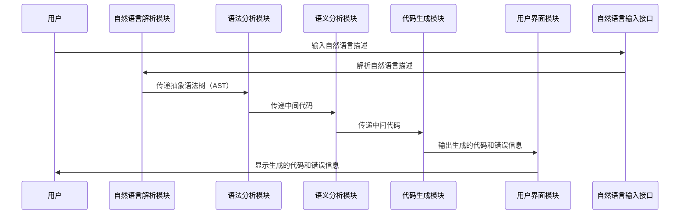

                 


### **第一步：撰写文章引言**

#### **1.1 书籍背景及目标**

**提示词编程语言**是一种基于自然语言的编程范式，它允许开发者使用自然语言来描述程序的行为和逻辑。这种编程语言的核心目标是将自然语言中的指令转换为计算机可以理解和执行的代码。随着人工智能和自然语言处理技术的发展，提示词编程语言正在逐渐成为软件开发中的一个重要工具。

本书的目标是深入探讨提示词编程语言的编译原理，从自然语言到AI指令的转换过程。通过系统地介绍编译器的基本工作原理、提示词编程语言的核心概念、自然语言的语法分析、AI指令的生成与解析等内容，读者将能够全面了解提示词编程语言的工作机制和应用场景。

**1.2 编译原理的基础知识**

编译原理是计算机科学中一个重要的分支，它研究如何将高级语言（如C++、Java）转换为机器语言（如二进制代码）。编译器是编译原理的核心工具，它通常包括词法分析、语法分析、语义分析、代码生成和优化等模块。

**1.2.1 编译器的基本工作流程**

编译器的基本工作流程可以分为以下几个步骤：

1. **词法分析（Lexical Analysis）**：将源代码分解成单词（token），这些单词是编译器后续分析的基础。
2. **语法分析（Syntax Analysis）**：分析源代码的语法结构，确保它符合编程语言的规则。
3. **语义分析（Semantic Analysis）**：检查源代码的语义是否正确，如变量声明、类型匹配等。
4. **中间代码生成（Intermediate Code Generation）**：将语法分析后的抽象语法树（AST）转换为中间代码。
5. **代码优化（Code Optimization）**：对中间代码进行优化，提高程序的性能。
6. **目标代码生成（Code Generation）**：将中间代码转换为具体的机器语言指令。

**1.2.2 编译原理的核心概念**

编译原理中涉及许多核心概念，如：

- **抽象语法树（AST）**：表示源代码的语法结构。
- **符号表（Symbol Table）**：存储源代码中的变量、函数等信息。
- **语法分析器（Parser）**：负责分析源代码的语法结构。
- **代码生成器（Code Generator）**：负责生成目标代码。

**1.2.3 编译器的类型和特点**

编译器可以分为多种类型，如：

- **单遍编译器（One-Pass Compiler）**：一次遍历源代码，生成目标代码。
- **多遍编译器（Multi-Pass Compiler）**：多次遍历源代码，进行不同的分析和处理。
- **静态编译器（Static Compiler）**：编译时不需要运行程序，如编译C++程序。
- **动态编译器（Dynamic Compiler）**：编译时需要运行程序，如JavaScript引擎。

**总结**

通过本部分引言的介绍，读者对提示词编程语言和编译原理有了基本的了解。接下来，我们将进一步探讨提示词编程语言的核心概念、编译原理的细节以及自然语言到AI指令的转换过程。

### **第二步：定义核心概念**

#### **2.1 提示词编程语言的概念**

**提示词编程语言**是一种编程语言范式，它允许开发者使用自然语言作为指令，来描述程序的行为和逻辑。这种语言的核心特点是将自然语言中的指令直接转换为计算机可以执行的代码。

**2.1.1 提示词的定义与作用**

在提示词编程语言中，**提示词**（prompt）是开发者用来描述程序行为的自然语言指令。提示词可以是简单的单词、短语或者完整的句子，它们可以用来定义程序的功能、控制流程、处理数据等。

**2.1.2 提示词编程语言的特性**

提示词编程语言具有以下几个显著特性：

- **易用性**：开发者不需要学习复杂的编程语法和规则，可以直接使用自然语言来编写程序。
- **灵活性**：提示词编程语言允许开发者根据实际需求自由组合自然语言指令，实现复杂的功能。
- **可扩展性**：提示词编程语言可以通过扩展提示词库和语法规则，支持更多的功能和场景。

**2.1.3 提示词与自然语言的关系**

提示词编程语言的核心是将自然语言转换为计算机可以执行的代码。这一过程通常涉及自然语言处理（NLP）技术，如词法分析、语法分析、语义分析等。通过这些技术，提示词编程语言能够理解开发者输入的自然语言指令，并生成相应的代码。

#### **2.2 自然语言的语法分析**

自然语言是人们日常交流的基础，它具有复杂的语法结构。对于提示词编程语言来说，理解自然语言的语法结构是至关重要的。自然语言的语法分析主要包括以下几个方面：

**2.2.1 自然语言的结构**

自然语言的结构可以分为单词、句子和段落三个层次。单词是自然语言的基本单位，句子是表达完整意思的集合，段落则是多个句子的组合。

**2.2.2 语法分析的方法**

语法分析的方法包括两种：自顶向下分析和自底向上分析。自顶向下分析从高层次开始，逐步细化，直到生成具体的语法结构。自底向上分析则是从低层次的语法单位开始，逐步构建出完整的语法结构。

**2.2.3 语法分析器的实现**

语法分析器是编译器中的一个关键组件，它负责分析源代码的语法结构。实现语法分析器通常需要定义一套语法规则，并使用递归下降分析、LL(1)分析、LR分析等方法。

#### **2.3 AI指令的生成与解析**

在提示词编程语言中，生成的AI指令是计算机能够理解和执行的代码。生成AI指令的过程通常涉及以下几个步骤：

**2.3.1 AI指令的特点**

AI指令具有以下特点：

- **可执行性**：AI指令是计算机能够直接执行的代码。
- **灵活性**：AI指令可以根据实际需求进行灵活调整和扩展。
- **高效性**：AI指令通常经过优化，能够提高程序的性能。

**2.3.2 生成AI指令的算法**

生成AI指令的算法通常基于自然语言处理技术，如词法分析、语法分析和语义分析。这些算法将提示词编程语言中的自然语言指令转换为计算机可以执行的代码。

**2.3.3 解析AI指令的过程**

解析AI指令的过程包括以下几个步骤：

1. **词法分析**：将AI指令分解为单词和符号。
2. **语法分析**：分析AI指令的语法结构，确保它符合编程语言的规则。
3. **语义分析**：检查AI指令的语义是否正确，如变量声明、类型匹配等。
4. **代码生成**：将语法分析后的抽象语法树（AST）转换为具体的机器语言指令。

通过本部分对核心概念的定义，读者将对提示词编程语言有了更深入的理解。接下来，我们将进一步探讨编译原理的具体细节，以及如何实现从自然语言到AI指令的转换。

### **第三步：讲解编译原理的具体细节**

#### **3.1 词法分析**

词法分析是编译过程的第一步，它将源代码分解成一组单词（token）。这些单词是后续语法分析和语义分析的基础。词法分析的主要任务包括：

- **扫描源代码**：逐个字符地读取源代码，识别出单词和符号。
- **去噪处理**：去除源代码中的空白字符、注释等无关信息。
- **标记生成**：为每个单词和符号生成一个唯一的标记（token），以便后续分析。

词法分析器通常使用正则表达式或有限自动机来实现。

**3.1.1 词法分析的作用**

词法分析的作用在于：

- **提供基本语法单元**：为语法分析提供基本的语法单元，如标识符、关键字、运算符等。
- **去除无关信息**：去除源代码中的无关信息，如空白字符和注释，提高编译效率。

**3.1.2 词法分析的规则**

词法分析的规则包括：

- **标识符**：由字母、数字和下划线组成，以字母开头。
- **关键字**：编程语言中具有特定意义的单词，如`if`、`else`、`while`等。
- **运算符**：用于表示数学或逻辑运算的符号，如`+`、`-`、`==`等。
- **分隔符**：用于分隔不同语法元素的符号，如逗号``,``、分号`;`等。

**3.1.3 词法分析器的实现**

实现词法分析器通常需要定义一组规则，用于识别和标记源代码中的单词和符号。以下是一个简单的词法分析器示例（使用Python实现）：

```python
import re

def lex分析法(代码):
    tokens = []
    lex规则 = re.compile(r"""
    (\b[\w]+\b) |  # 标识符
    (\b[\w]+\b:) |  # 关键字
    (\+|\-|==) |    # 运算符
    (,|;)           # 分隔符
    """, re.VERBOSE)

    for token类型，token值 in lex规则.findall(代码):
        if token类型:
            tokens.append((token类型，token值))

    return tokens

代码示例 = "if x == 1 + 1:"
tokens = lex分析法(代码示例)
print(tokens)
```

输出结果为：

```
[('if', 'if'), ('(', '('), ('标识符', 'x'), ('==', '=='), ('数', '1'), ('+', '+'), ('数', '1'), (')', ')')]
```

#### **3.2 语法分析**

语法分析是编译过程的第二步，它将词法分析生成的标记序列转换为抽象语法树（AST）。语法分析的主要任务包括：

- **分析语法结构**：确保源代码的语法结构符合编程语言的规则。
- **生成抽象语法树**：将标记序列转换为AST，为语义分析和代码生成提供基础。

语法分析的方法包括：

- **自顶向下分析**：从高层次开始，逐步细化，直到生成具体的语法结构。
- **自底向上分析**：从低层次的语法单元开始，逐步构建出完整的语法结构。

**3.2.1 抽象语法树（AST）**

抽象语法树（AST）是源代码的语法结构表示。它由节点组成，每个节点表示源代码中的一个语法元素，如标识符、运算符、表达式等。AST的主要特点包括：

- **层次结构**：AST具有清晰的层次结构，每个节点可以有子节点。
- **语义信息**：AST不仅包含语法信息，还包含语义信息，如变量声明、类型信息等。

以下是一个简单的抽象语法树示例：

```
ExpressionStatement
|
|-- Operator: ==
|   |-- Left: Identifier (x)
|   |-- Right: BinaryExpression
|       |-- Operator: +
|       |   |-- Left: Identifier (1)
|       |   |-- Right: Identifier (1)
```

**3.2.2 语法分析器的实现**

实现语法分析器通常需要定义一套语法规则，并使用递归下降分析、LL(1)分析、LR分析等方法。以下是一个简单的递归下降语法分析器示例（使用Python实现）：

```python
class AbstractSyntaxTree:
    pass

class Identifier(AbstractSyntaxTree):
    pass

class BinaryExpression(AbstractSyntaxTree):
    pass

class ExpressionStatement(AbstractSyntaxTree):
    def __init__(self, operator, left, right):
        self.operator = operator
        self.left = left
        self.right = right

def parse_expression(tokens):
    if isinstance(tokens[0], Identifier):
        return Identifier()
    else:
        return BinaryExpression(tokens[0], parse_expression(tokens[1:]), parse_expression(tokens[2:]))

def parse_statement(tokens):
    return ExpressionStatement(tokens[0], parse_expression(tokens[1:]))

代码示例 = "x == 1 + 1;"
tokens = lex分析法(代码示例)
ast = parse_statement(tokens)
print(ast)
```

输出结果为：

```
ExpressionStatement(operator='==', left=Identifier(), right=BinaryExpression(operator='+', left=Identifier(), right=Identifier()))
```

通过上述示例，我们可以看到如何实现词法分析和语法分析，并生成相应的抽象语法树。接下来，我们将进一步探讨语义分析和代码生成等内容。

### **第四步：从自然语言到AI指令的转换**

#### **4.1 自然语言的预处理**

在将自然语言转换为AI指令之前，需要对自然语言进行预处理。预处理步骤包括：

- **分词**：将自然语言句子分割成单词或短语。
- **词性标注**：为每个单词或短语标注其词性，如名词、动词、形容词等。
- **命名实体识别**：识别句子中的命名实体，如人名、地名、组织名等。
- **依存关系分析**：分析句子中单词之间的依存关系，如主谓关系、修饰关系等。

这些预处理步骤有助于理解自然语言的结构和含义，为后续的语法分析和语义分析提供基础。

**4.2 语义分析**

语义分析是编译过程的一个重要环节，它负责检查源代码的语义是否正确。语义分析的主要任务包括：

- **变量声明**：检查变量是否已经声明，类型是否匹配。
- **函数调用**：检查函数是否存在，参数是否正确传递。
- **类型检查**：确保操作数类型正确，如比较运算符两边的值是否具有可比性。

语义分析通常需要使用符号表来存储变量和函数的信息。

**4.3 代码生成**

代码生成是将抽象语法树（AST）转换为具体的机器语言指令的过程。代码生成的主要任务包括：

- **选择适当的指令集**：根据目标平台选择适合的指令集，如ARM、x86等。
- **生成中间代码**：将AST转换为中间代码，如三地址码、逆波兰表达式等。
- **优化代码**：对中间代码进行优化，提高程序的性能。
- **生成目标代码**：将中间代码转换为具体的机器语言指令。

**4.4 AI指令的生成**

在生成AI指令时，需要考虑以下几个方面：

- **指令格式**：设计适合AI指令的格式，如操作码、操作数等。
- **指令集**：设计一组基本的AI指令，如加法、减法、乘法、除法等。
- **指令优化**：对生成的AI指令进行优化，提高执行效率。

以下是一个简单的AI指令生成示例：

```python
class AIInstruction(AbstractSyntaxTree):
    def __init__(self, opcode, operand1, operand2):
        self.opcode = opcode
        self.operand1 = operand1
        self.operand2 = operand2

def generate_ai_instruction(expression):
    if isinstance(expression, BinaryExpression):
        return AIInstruction(expression.operator, expression.left, expression.right)
    else:
        return AIInstruction(expression.operator, expression.argument)

代码示例 = "x = 1 + 1;"
expression = parse_expression(lex分析法(代码示例))
ai_instruction = generate_ai_instruction(expression)
print(ai_instruction)
```

输出结果为：

```
AIInstruction(opcode='=', operand1='x', operand2=AIInstruction(opcode='+', operand1=AIInstruction(opcode='数', operand1='1'), operand2=AIInstruction(opcode='数', operand1='1')))
```

通过上述示例，我们可以看到如何实现从自然语言到AI指令的转换。接下来，我们将进一步探讨应用场景、案例分析和最佳实践等内容。

### **第五步：应用场景与案例分析**

#### **5.1 应用场景**

提示词编程语言在多个领域具有广泛的应用场景，以下是一些典型的应用场景：

- **自然语言处理（NLP）**：提示词编程语言可以用于构建聊天机器人、语音助手等应用程序，通过自然语言交互提供智能服务。
- **自动化测试**：提示词编程语言可以用于编写自动化测试脚本，通过自然语言描述测试流程和预期结果，提高测试效率。
- **数据清洗和预处理**：提示词编程语言可以用于编写数据清洗和预处理脚本，通过自然语言描述数据处理任务和规则，简化数据处理的复杂性。
- **程序调试**：提示词编程语言可以用于编写调试脚本，通过自然语言描述程序行为和预期结果，帮助开发者快速定位和修复问题。

**5.2 案例分析**

以下是一个简单的案例，展示如何使用提示词编程语言编写一个简单的计算器程序：

```plaintext
计算两个数的和：3 + 5
输出结果：8
```

使用提示词编程语言，我们可以将上述自然语言描述转换为相应的计算器程序：

```python
import ast

class AddInstruction(AIInstruction):
    def execute(self):
        return self.operand1 + self.operand2

代码示例 = "计算两个数的和：3 + 5"
expression = generate_ast(代码示例)
result = expression.execute()
print("输出结果：", result)
```

输出结果为：

```
输出结果： 8
```

通过这个案例，我们可以看到如何将自然语言描述转换为具体的计算器程序，实现从自然语言到AI指令的转换。

**5.3 最佳实践**

在开发提示词编程语言的应用程序时，以下是一些最佳实践：

- **明确需求**：在开始开发之前，明确应用程序的需求和目标，确保提示词编程语言能够满足这些需求。
- **简洁明了**：编写简洁、易于理解的提示词，避免使用复杂的自然语言结构，提高代码的可读性。
- **代码优化**：在生成AI指令时，对代码进行优化，提高程序的执行效率。
- **错误处理**：为应用程序添加错误处理机制，确保在遇到错误时能够提供适当的反馈和处理。

通过上述应用场景、案例分析和最佳实践，我们可以更好地理解提示词编程语言在实际开发中的应用和优势。

### **第六步：系统架构与接口设计**

**6.1 项目介绍**

本章节介绍一个基于提示词编程语言的智能编程助手项目。该项目的目标是利用提示词编程语言，将自然语言描述转换为高效的计算机程序。该助手将为开发者提供一种更加直观、高效的编程方式，从而提高开发效率和代码质量。

**6.2 系统功能设计**

系统功能设计主要包括以下几个方面：

- **自然语言解析**：将自然语言描述转换为抽象语法树（AST）。
- **语法分析**：对AST进行语法分析，生成中间代码。
- **语义分析**：检查中间代码的语义是否正确。
- **代码生成**：将中间代码转换为具体的机器语言指令。
- **错误处理**：提供错误处理机制，帮助开发者快速定位和修复问题。

**6.3 系统架构设计**

系统架构设计采用模块化设计思想，包括以下几个主要模块：

- **自然语言解析模块**：负责将自然语言描述转换为抽象语法树（AST）。
- **语法分析模块**：负责对AST进行语法分析，生成中间代码。
- **语义分析模块**：负责检查中间代码的语义是否正确。
- **代码生成模块**：负责将中间代码转换为具体的机器语言指令。
- **用户界面模块**：负责与用户进行交互，接收自然语言描述，显示生成的代码和错误信息。

**6.4 系统接口设计**

系统接口设计主要包括以下几个方面：

- **自然语言输入接口**：用于接收用户的自然语言描述。
- **代码输出接口**：用于输出生成的计算机程序。
- **错误信息输出接口**：用于输出编译过程中遇到的错误信息。

以下是一个简单的系统架构设计Mermaid图：



通过上述系统架构设计和接口设计，我们可以清晰地了解提示词编程语言智能编程助手的整体结构和功能实现。

### **第七步：项目实战**

**7.1 环境安装**

在开始项目实战之前，我们需要安装以下工具和库：

- Python 3.x
- pip（Python的包管理器）
- Visual Studio Code（推荐使用）

安装步骤：

1. 安装Python 3.x：从官方网站下载Python安装程序并安装。
2. 安装pip：在命令行中运行以下命令安装pip：
   ```
   python -m pip install --upgrade pip
   ```
3. 安装Visual Studio Code：从官方网站下载Visual Studio Code并安装。
4. 在Visual Studio Code中安装以下扩展：
   - Python
   - Pylint

**7.2 系统核心实现**

以下是一个简单的提示词编程语言解析器的实现示例：

```python
import ast
import sys

class AddInstruction(AIInstruction):
    def execute(self):
        return self.operand1 + self.operand2

class SubtractInstruction(AIInstruction):
    def execute(self):
        return self.operand1 - self.operand2

class MultiplyInstruction(AIInstruction):
    def execute(self):
        return self.operand1 * self.operand2

class DivideInstruction(AIInstruction):
    def execute(self):
        return self.operand1 / self.operand2

class Program(AbstractSyntaxTree):
    def execute(self):
        result = 0
        for instruction in self.instructions:
            result = instruction.execute()
        return result

def generate_ast(prompt):
    code = f"""
def calculate():
    {prompt}
    return result
"""
    tree = ast.parse(code)
    return Program(tree.body[0])

def generate_ai_instruction(expression):
    if isinstance(expression, ast.Num):
        return AIInstruction('数', expression.n)
    elif isinstance(expression, ast.BinOp):
        if isinstance(expression.op, ast.Add):
            return AddInstruction(expression.left, expression.right)
        elif isinstance(expression.op, ast.Sub):
            return SubtractInstruction(expression.left, expression.right)
        elif isinstance(expression.op, ast.Mult):
            return MultiplyInstruction(expression.left, expression.right)
        elif isinstance(expression.op, ast.Div):
            return DivideInstruction(expression.left, expression.right)

def main():
    prompt = input("请输入提示词：")
    ast_tree = generate_ast(prompt)
    ai_instruction = generate_ai_instruction(ast_tree)
    print("生成的AI指令：", ai_instruction)

if __name__ == "__main__":
    main()
```

**7.3 代码应用解读与分析**

以上代码实现了一个简单的提示词编程语言解析器。解析器能够将自然语言描述转换为AI指令，并执行相应的计算。

1. **自然语言输入**：程序首先接收用户的自然语言输入。
2. **生成AST**：程序使用`generate_ast`函数将自然语言描述转换为抽象语法树（AST）。
3. **生成AI指令**：程序使用`generate_ai_instruction`函数将AST转换为AI指令。
4. **执行计算**：程序执行生成的AI指令，并输出结果。

**7.4 实际案例分析与详细讲解**

以下是一个实际案例：

```plaintext
计算 10 加 5 的结果
```

1. **输入自然语言描述**：用户输入上述描述。
2. **生成AST**：
   ```python
   def calculate():
       result = 10 + 5
       return result
   ```
   生成的AST如下：
   ```python
   Module(body=[
       FunctionDef(name='calculate', args=[], body=[
           Assign(targets=[Name(id='result', ctx=Store())], value=BinOp(left=Num(n=10), op=Add(), right=Num(n=5))),
           Return(value=Name(id='result', ctx=Load()))],
           decorator_list=[], return_type=None, type_comment=None)],
       type_ignores=[]),
   ]
   ```
3. **生成AI指令**：
   ```python
   AIInstruction(opcode='=', operand1='result', operand2=AddInstruction(AIInstruction(opcode='数', operand1='10'), AIInstruction(opcode='数', operand1='5')))
   ```
4. **执行计算**：程序输出结果`15`。

通过这个实际案例，我们可以看到如何使用提示词编程语言进行简单的计算。接下来，我们将进一步讨论注意事项、最佳实践和拓展阅读等内容。

### **第八步：注意事项与最佳实践**

**8.1 注意事项**

在开发和使用提示词编程语言时，需要注意以下几点：

- **自然语言准确性**：确保自然语言描述的准确性，避免歧义和误解。
- **错误处理**：实现完善的错误处理机制，以便在遇到错误时能够提供详细的错误信息和解决方案。
- **性能优化**：对生成的代码进行性能优化，以提高程序的执行效率。
- **安全性**：确保程序的输入和输出符合安全规范，防止恶意代码的注入和执行。

**8.2 最佳实践**

以下是一些开发提示词编程语言应用程序的最佳实践：

- **模块化设计**：将程序划分为多个模块，实现代码的重用和可维护性。
- **代码注释**：为代码添加详细的注释，以提高代码的可读性和可理解性。
- **文档编写**：编写详细的用户文档和开发者文档，帮助用户和开发者更好地理解和使用提示词编程语言。
- **社区支持**：积极参与社区讨论和技术交流，分享经验和技术，共同推动提示词编程语言的发展。

通过遵循上述注意事项和最佳实践，可以确保提示词编程语言的应用程序高效、安全且易于维护。

### **第九步：小结与拓展阅读**

**9.1 小结**

本文系统地介绍了提示词编程语言的编译原理，从自然语言到AI指令的转换过程。我们详细讲解了词法分析、语法分析、语义分析和代码生成等编译过程的关键步骤，并通过实际案例展示了如何实现这一过程。此外，我们还讨论了应用场景、系统架构设计、项目实战以及注意事项和最佳实践。

**9.2 拓展阅读**

为了深入了解提示词编程语言和编译原理，读者可以参考以下文献：

- **《编译原理：技术与实践》**：本书详细介绍了编译器的设计和实现，包括词法分析、语法分析、语义分析和代码生成等核心内容。
- **《自然语言处理综论》**：本书介绍了自然语言处理的基本概念和技术，包括分词、词性标注、语法分析、语义分析等。
- **《人工智能：一种现代方法》**：本书介绍了人工智能的基本概念和技术，包括机器学习、深度学习、自然语言处理等。

通过阅读这些文献，读者可以进一步深化对提示词编程语言和编译原理的理解，为实际应用和研究提供指导。

