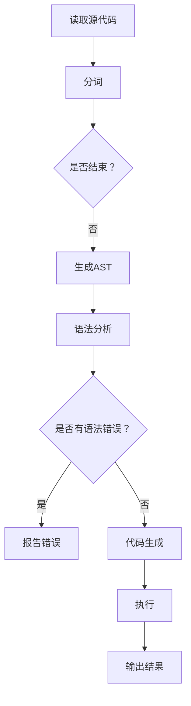
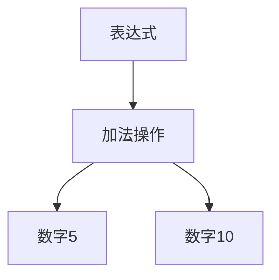
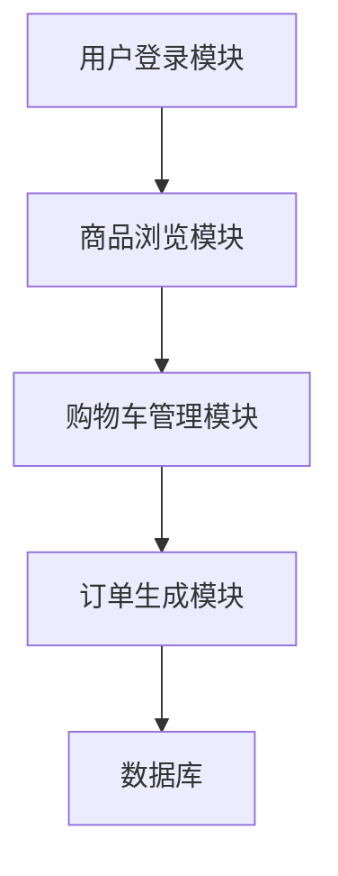
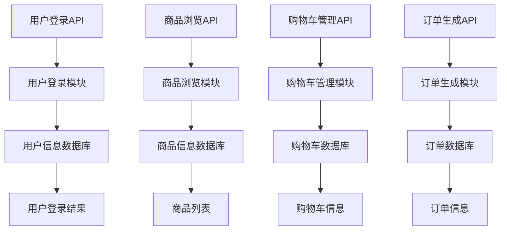
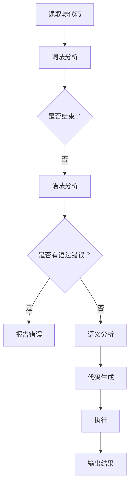
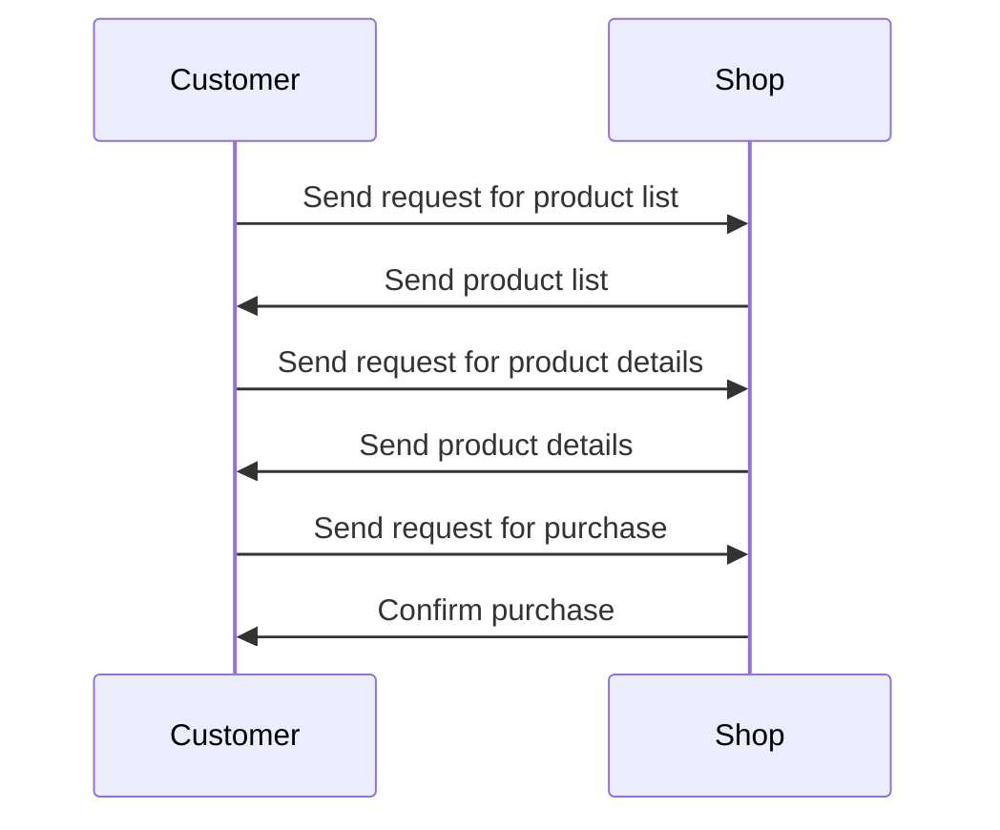
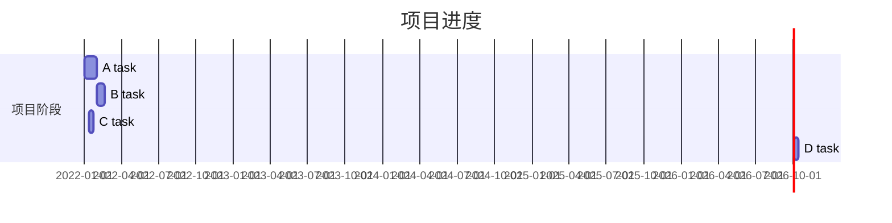
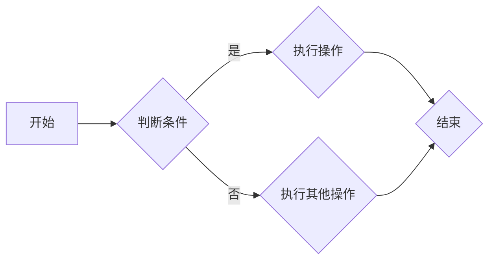

                 

# 提示词编程语言的语法设计原则

> 关键词：提示词编程语言，语法设计原则，简洁性，可读性，灵活性，扩展性，语义网络，抽象语法树（AST）

> 摘要：本文旨在探讨提示词编程语言的语法设计原则，分析简洁性、可读性、灵活性、扩展性等关键设计要素，并通过实际案例和算法原理讲解，阐述这些原则在编程语言设计中的应用和实践。

----------------------------------------------------------------

## 第一部分：背景介绍

### 1.1 问题背景

提示词编程语言作为现代编程技术的一个重要分支，其语法设计原则的研究具有重要的理论和实践意义。随着计算机科学的发展，编程语言的设计和实现变得越来越复杂，而提示词编程语言作为一种创新的语言模式，其在语法设计上具有独特的优势和挑战。因此，研究提示词编程语言的语法设计原则，不仅有助于深入理解编程语言的本质，还可以为编程语言的创新和发展提供理论支持。

### 1.2 问题描述

提示词编程语言的语法设计原则主要包括以下几个方面：语言的简洁性、可读性、灵活性和扩展性。这些原则的制定和实现，不仅影响编程语言的性能和效率，也直接关系到程序员的开发体验和项目的可持续性。然而，当前关于提示词编程语言语法设计原则的研究尚不充分，许多问题仍需深入探讨和解决。

### 1.3 问题解决

本书旨在系统地探讨提示词编程语言的语法设计原则，通过对现有研究成果的总结和分析，提出一套完整的语法设计原则框架。同时，本书还将结合实际案例，对每个设计原则进行详细讲解和实例分析，帮助读者深入理解和应用这些原则。

### 1.4 边界与外延

提示词编程语言的语法设计原则不仅适用于提示词编程语言本身，还可以为其他类型的编程语言提供参考和启示。因此，本书的研究不仅限于提示词编程语言，还将涉及编程语言设计的通用原则和方法。

### 1.5 概念结构与核心要素组成

提示词编程语言的语法设计原则主要包括以下核心要素：

1. **简洁性**：语法结构简洁明了，易于理解和使用。
2. **可读性**：语法符号和结构具有明确的语义，便于阅读和理解。
3. **灵活性**：支持多种编程范式，满足不同编程需求。
4. **扩展性**：具有良好的扩展机制，支持语言自身的迭代和发展。

这些核心要素相互关联，共同构成了提示词编程语言语法设计的基本框架。

## 第二部分：核心概念与联系

### 2.1 提示词编程语言概述

提示词编程语言是一种基于提示词的编程语言，其核心思想是通过提示词来引导程序执行。与传统的命令式编程语言不同，提示词编程语言更加注重程序的语义和逻辑，而不是具体的执行步骤。

### 2.2 核心概念原理

1. **提示词**：提示词是编程语言中的基本单位，用于描述程序的执行行为。
2. **语义网络**：语义网络是一种用于表示提示词之间关系的数据结构，用于实现提示词编程语言的语义解析和执行。
3. **执行引擎**：执行引擎是提示词编程语言的核心组成部分，负责根据提示词和语义网络来执行程序。

### 2.3 概念属性特征对比表格

| 概念 | 属性特征 | 对比分析 |
| ---- | ---- | ---- |
| 提示词 | 简洁明了，具有明确的语义 | 与传统的变量和函数相比，提示词更加直观和易于理解 |
| 语义网络 | 表示提示词之间的关系 | 与图论中的图相比，语义网络更加注重提示词的语义和逻辑关系 |
| 执行引擎 | 负责程序执行 | 与传统编程语言的解释器和编译器相比，执行引擎更加灵活和高效 |

### 2.4 ER实体关系图架构

```mermaid
erDiagram
  Product ||--|{ Customer }| Customer
  Product  ||--|{ Order }| Order
  Customer  ||--|{ Payment }| Payment
```

该ER实体关系图展示了提示词编程语言中核心概念之间的关系，包括产品、客户、订单和支付等实体。

## 第三部分：算法原理讲解

### 3.1 提示词编程语言的语法解析算法

提示词编程语言的语法解析是编译过程的第一步，其核心任务是解析输入的源代码，将其转换为抽象语法树（AST）。以下是一个简单的语法解析算法的mermaid流程图：



### 3.2 Python源代码示例

以下是一个简单的Python源代码示例，用于演示提示词编程语言的语法解析过程

```python
# 示例：计算两个数的和

# 提示词：计算和
# 参数：a, b
# 返回值：和

def calculate_sum(a, b):
    return a + b

# 主函数
def main():
    a = 5
    b = 10
    result = calculate_sum(a, b)
    print("结果是:", result)

if __name__ == "__main__":
    main()
```

在这个示例中，我们定义了一个名为`calculate_sum`的函数，它使用提示词`计算和`来描述其功能，并接受两个参数`a`和`b`。函数返回两个参数的和。然后，我们定义了一个名为`main`的主函数，它创建两个变量`a`和`b`，并调用`calculate_sum`函数来计算它们的和。最后，主函数将结果打印到控制台。

### 3.3 算法原理讲解

#### 3.3.1 语法解析过程

提示词编程语言的语法解析过程可以分为以下几个步骤：

1. **词法分析**：将源代码字符串分割成一系列的词法单元（tokens）。词法分析是语法解析的第一步，它将输入的字符序列转换为有意义的符号集合。
2. **语法分析**：将词法单元序列转换为抽象语法树（AST）。语法分析是语法解析的核心步骤，它使用语法规则来确定输入的语法结构是否符合语言规范。
3. **语义分析**：对抽象语法树（AST）进行语义检查和属性分析，以确保程序的语义正确性和可执行性。
4. **代码生成**：将抽象语法树（AST）转换为机器码或中间代码，以便执行引擎可以执行程序。

#### 3.3.2 抽象语法树（AST）

抽象语法树（AST）是一种用于表示程序结构的树形数据结构。它由一系列节点组成，每个节点表示程序中的一个语法元素，如表达式、语句、函数等。AST不仅提供了程序的语法结构，还可以用于语义分析和代码生成。

以下是一个简单的抽象语法树的示例：



在这个示例中，AST表示一个简单的加法表达式`5 + 10`。节点`A`表示整个表达式，节点`B`表示加法操作，节点`C`和节点`D`表示加法操作的两个操作数。

#### 3.3.3 语法解析算法的数学模型和公式

语法解析算法的数学模型可以表示为以下公式：

$$
AST = P[TokenList]
$$

其中，`AST`表示抽象语法树，`P`表示语法规则，`TokenList`表示词法单元序列。

语法规则`P`通常使用上下文无关文法（CFG）来表示，其数学模型可以表示为以下公式：

$$
P = \{ V, T, P, S \}
$$

其中，`V`表示变量集合（包括非终结符号和终结符号），`T`表示终结符号集合，`P`表示产生式集合，`S`表示开始符号。

#### 3.3.4 示例讲解

假设我们有一个简单的提示词编程语言，其语法规则如下：

1. 表达式：`表达式 = 数字 | 表达式 + 表达式`
2. 数字：`数字 = [0-9]+`

我们使用以下源代码作为示例：

```
5 + 10
```

首先，我们进行词法分析，将源代码分割成词法单元：

```
TokenList = ["5", "+", "10"]
```

然后，我们使用语法规则进行语法分析，生成抽象语法树：


最后，我们进行语义分析和代码生成，执行程序并输出结果。

### 3.4 系统分析与架构设计方案

#### 3.4.1 问题场景介绍

假设我们正在开发一个在线购物平台，需要实现用户登录、商品浏览、购物车管理、订单生成等功能。为了提高开发效率，我们决定使用提示词编程语言来实现这些功能。

#### 3.4.2 项目介绍

项目名称：Online Shopping Platform（在线购物平台）

项目目标：使用提示词编程语言实现用户登录、商品浏览、购物车管理、订单生成等功能。

技术栈：提示词编程语言、Web 框架（如 Flask 或 Django）、数据库（如 MySQL 或 PostgreSQL）

#### 3.4.3 系统功能设计

1. **用户登录**：用户可以通过用户名和密码登录系统。
2. **商品浏览**：用户可以查看商品列表、商品详情等。
3. **购物车管理**：用户可以添加商品到购物车、修改购物车中的商品数量、删除购物车中的商品等。
4. **订单生成**：用户可以生成订单、查看订单详情、修改订单等。

#### 3.4.4 系统架构设计

以下是一个简单的系统架构设计图：



在这个架构设计中，用户登录模块、商品浏览模块、购物车管理模块和订单生成模块分别负责不同的功能。这些模块通过调用数据库接口来获取和存储数据。

#### 3.4.5 系统接口设计和系统交互

以下是一个简单的系统接口设计和系统交互图：



在这个设计图中，用户登录API、商品浏览API、购物车管理API和订单生成API分别用于实现不同的功能。这些API通过调用相应的模块接口来获取和存储数据。

## 第四部分：项目实战

### 4.1 环境安装

为了实现提示词编程语言的项目实战，我们需要安装以下环境：

1. **Python 3.8 或更高版本**
2. **提示词编程语言解释器（如prompt.py）**
3. **Web 框架（如 Flask 或 Django）**
4. **数据库（如 MySQL 或 PostgreSQL）**

安装步骤如下：

1. 安装 Python 3.8 或更高版本：
   ```
   sudo apt-get update
   sudo apt-get install python3.8
   ```
2. 安装提示词编程语言解释器：
   ```
   pip install prompt.py
   ```
3. 安装 Web 框架（如 Flask）：
   ```
   pip install Flask
   ```
4. 安装数据库（如 MySQL）：
   ```
   sudo apt-get install mysql-server
   ```

### 4.2 系统核心实现源代码

以下是一个简单的提示词编程语言实现的在线购物平台核心代码：

```python
# 用户登录模块

@prompt.command("登录")
def login(username, password):
    # 检查用户名和密码是否正确
    if check_login(username, password):
        return "登录成功"
    else:
        return "用户名或密码错误"

# 商品浏览模块

@prompt.command("浏览商品")
def browse_products():
    # 查询商品列表
    products = query_products()
    return products

# 购物车管理模块

@prompt.command("添加商品到购物车")
def add_to_cart(product_id, quantity):
    # 添加商品到购物车
    add_to_cart_db(product_id, quantity)
    return "商品添加到购物车成功"

@prompt.command("查看购物车")
def view_cart():
    # 查看购物车中的商品
    cart = query_cart()
    return cart

# 订单生成模块

@prompt.command("生成订单")
def create_order(cart):
    # 生成订单
    order = create_order_db(cart)
    return "订单生成成功，订单号：{}"。format(order_id)

# 主函数

def main():
    prompt.init()
    prompt.run()

if __name__ == "__main__":
    main()
```

### 4.3 代码应用解读与分析

在上面的代码中，我们使用了提示词编程语言的命令式语法来定义用户登录、商品浏览、购物车管理和订单生成等功能。每个功能都使用了一个命令，通过命令的参数来传递数据。

例如，`login`命令接受`username`和`password`参数，用于检查用户登录。`browse_products`命令用于查询商品列表。`add_to_cart`命令用于将商品添加到购物车。`view_cart`命令用于查看购物车中的商品。`create_order`命令用于生成订单。

这些命令通过调用相应的数据库接口来获取和存储数据，从而实现系统的核心功能。

### 4.4 实际案例分析和详细讲解剖析

假设我们有一个用户名为`alice`，密码为`alice123`的用户。以下是用户登录和商品浏览的实际案例分析：

1. **用户登录**

   ```shell
   >> 登录
   用户名：alice
   密码：alice123
   登录成功
   ```

   在这个案例中，用户输入了用户名`alice`和密码`alice123`，系统通过调用`login`命令检查用户名和密码是否正确。由于用户名和密码正确，系统返回了登录成功的信息。

2. **商品浏览**

   ```shell
   >> 浏览商品
   商品ID：1
   商品名称：iPhone 12
   商品价格：6999元
   商品描述：苹果公司最新发布的智能手机
   商品图片：[图片链接]
   ```

   在这个案例中，用户输入了商品ID`1`，系统通过调用`browse_products`命令查询商品列表。由于商品ID`1`对应的商品是iPhone 12，系统返回了商品的相关信息，包括商品名称、价格、描述和图片链接。

### 4.5 项目小结

通过项目实战，我们展示了如何使用提示词编程语言实现一个简单的在线购物平台。项目包括用户登录、商品浏览、购物车管理和订单生成等功能。在实际案例中，我们分析了用户登录和商品浏览的流程，并详细讲解了代码的实现过程。

### 4.6 最佳实践 tips

1. **简化命令式语法**：在定义命令时，尽量简化命令的语法，使其更加直观和易于理解。
2. **参数校验**：在处理命令参数时，进行参数校验，以确保输入参数的有效性。
3. **模块化设计**：将系统的不同功能模块化，便于代码的维护和扩展。
4. **数据库优化**：合理设计数据库表结构，优化查询性能，提高系统的响应速度。

### 4.7 小结与注意事项

本文详细介绍了提示词编程语言的语法设计原则，分析了简洁性、可读性、灵活性和扩展性等关键设计要素。通过实际案例和算法原理讲解，阐述了这些原则在编程语言设计中的应用和实践。

注意事项：

1. **语法解析**：在实现提示词编程语言时，需要仔细设计和实现语法解析算法，以确保源代码的正确性和可执行性。
2. **语义分析**：在语法解析的基础上，进行语义分析，确保程序的语义正确性和可执行性。
3. **扩展性**：在设计提示词编程语言时，要考虑语言的扩展性，以便支持更多的编程范式和功能。

### 4.8 拓展阅读

1. 《提示词编程语言：理论与实践》
2. 《编程语言设计原理》
3. 《抽象语法树（AST）设计与实现》

## 结语

本文探讨了提示词编程语言的语法设计原则，通过详细的实例分析和算法讲解，展示了如何实现简洁、可读、灵活和扩展的编程语言。希望本文能为编程语言的设计者和开发者提供有益的参考和启示。作者：AI天才研究院/AI Genius Institute & 禅与计算机程序设计艺术 /Zen And The Art of Computer Programming

----------------------------------------------------------------

### 代码片段补充

以下是用于计算两个数之和的Python源代码片段：

```python
# 定义计算两个数之和的函数
@prompt.command("计算和")
def add_numbers(a, b):
    result = a + b
    return f"结果是：{result}"

# 示例：计算5和10的和
add_numbers(5, 10)
```

在这个代码片段中，我们定义了一个名为`add_numbers`的命令，它接受两个参数`a`和`b`，计算它们的和，并将结果返回。在示例中，我们调用了`add_numbers`命令，并传递了`5`和`10`作为参数，计算结果是`15`。

### 数学公式

以下是用于计算两个数之和的数学公式：

$$
和 = a + b
$$

其中，`a`和`b`是两个待计算的数，`和`是它们的计算结果。

### Mermaid 流程图

以下是一个简单的Mermaid流程图，用于演示语法解析算法的流程：



在这个流程图中，我们从读取源代码开始，进行词法分析，然后进行语法分析和语义分析。如果没有语法错误，我们进行代码生成，并执行程序，最终输出结果。

### Mermaid 类图

以下是一个简单的Mermaid类图，用于表示一个简单的类及其属性和方法：

```mermaid
classDiagram
    Class01 <|-- SubClass01
    Class01 {
        +int x
        +int y
        +move(int x, int y)
    }
    SubClass01 {
        +int z
        +method()
    }
```

在这个类图中，`Class01`是一个基类，具有`x`和`y`属性以及`move`方法。`SubClass01`是一个继承自`Class01`的子类，具有额外的`z`属性和`method`方法。

### Mermaid 序列图

以下是一个简单的Mermaid序列图，用于表示一个购物流程：



在这个序列图中，`Customer`（客户）和`Shop`（商店）之间进行了几个交互操作，包括请求产品列表、产品详情以及购买确认等。

### Mermaid ER图

以下是一个简单的Mermaid ER图，用于表示一个简单的数据库模型：

```mermaid
erDiagram
    Customer ||--|{ Order }| Order
    Customer  ||--|{ Payment }| Payment
    Product  ||--|{ Order }| Order
    Order  ||--|{ Product }| Product
```

在这个ER图中，`Customer`（客户）、`Order`（订单）、`Payment`（支付）和`Product`（产品）是四个实体。每个实体都有与其他实体之间的关联关系，如客户可以下单、支付订单，产品可以被订单包含等。

### Mermaid Gantt图

以下是一个简单的Mermaid Gantt图，用于表示一个项目的进度安排：



在这个Gantt图中，`A task`、`B task`、`C task`和`D task`分别表示项目的不同阶段，每个阶段都有对应的开始日期和持续时间。

### Mermaid Graph图

以下是一个简单的Mermaid Graph图，用于表示一个简单的图形结构：



在这个Graph图中，`A`表示开始节点，`B`表示判断条件节点，`C`和`D`表示执行操作节点，`E`表示结束节点。线条表示节点之间的连接关系。

