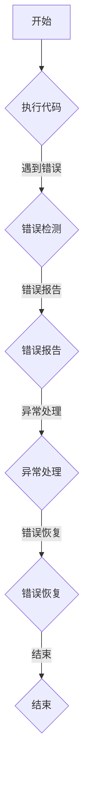
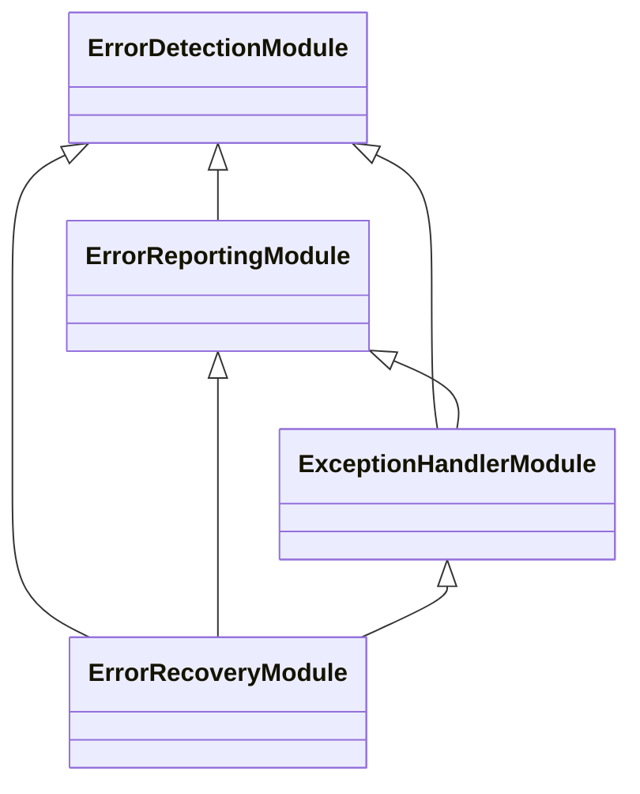
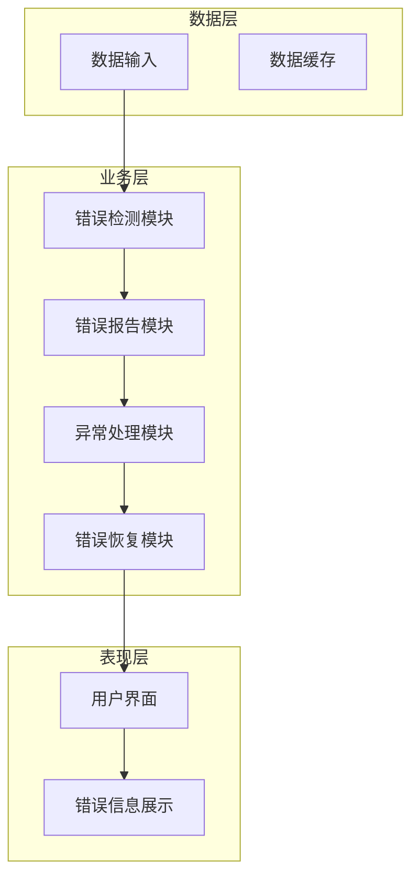
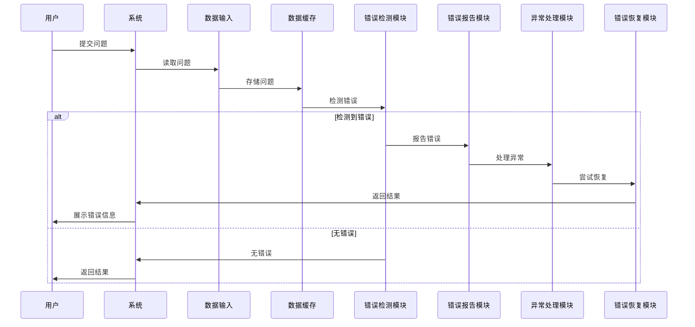

                 


# 提示词编程语言的错误处理机制

> 关键词：错误处理、提示词编程语言、异常处理、系统架构

> 摘要：本文旨在探讨提示词编程语言中的错误处理机制，从核心概念、算法原理到系统架构设计，提供全方位的技术解析。通过对错误处理机制的深入分析，本文旨在帮助开发者更好地理解和应用错误处理技术，提升编程语言的质量和稳定性。

## 第1章：错误处理机制概述

### 1.1.1 错误处理机制的定义与重要性

错误处理机制是编程语言中至关重要的一部分。它定义了程序在遇到错误时如何响应和处理。在提示词编程语言中，错误处理机制尤为重要，因为它们不仅涉及到程序的正常运行，还影响到用户的体验和系统的稳定性。

#### 错误处理机制的定义

错误处理机制通常包括以下几个方面：

1. **错误检测**：程序在执行过程中，能够识别出异常情况，如输入错误、语法错误、类型错误等。
2. **错误报告**：当错误被检测到时，程序需要提供相关信息，如错误类型、错误位置、错误原因等。
3. **异常处理**：程序在遇到不可恢复的错误时，如何进行处理，以防止程序崩溃或导致数据丢失。
4. **错误恢复**：在可能的情况下，程序需要尝试恢复到正常状态，继续执行。

#### 错误处理机制的重要性

错误处理机制的重要性体现在以下几个方面：

1. **提高程序稳定性**：通过有效的错误处理机制，程序可以在遇到错误时保持稳定，避免非预期的崩溃。
2. **提升用户体验**：错误处理机制可以提供友好的错误信息，帮助用户理解和解决错误，提升用户的使用体验。
3. **增强系统可靠性**：对于需要长时间运行的大型系统，良好的错误处理机制可以保证系统的持续稳定运行。

### 1.1.2 提示词编程语言的概述

提示词编程语言（Keyword-based Programming Language）是一种基于关键词和语法规则来描述程序逻辑的编程语言。与传统的命令式编程语言相比，提示词编程语言更加注重程序的可读性和可维护性。

#### 提示词编程语言的特点

1. **结构化编程**：提示词编程语言通常采用模块化、结构化的编程方式，使得程序逻辑更加清晰，易于理解和维护。
2. **强大的错误检测能力**：提示词编程语言通常具有强大的错误检测能力，能够在编译或运行时检测出大部分错误。
3. **易学易用**：提示词编程语言的语法简单，易于学习和使用，适合初学者和快速开发。

### 1.1.3 错误处理机制在提示词编程语言中的应用

在提示词编程语言中，错误处理机制的应用尤为关键。以下是一些典型的应用场景：

1. **编译时错误处理**：在编译阶段，提示词编程语言可以检测出大部分语法错误和类型错误，并在编译报告中提供详细的信息。
2. **运行时错误处理**：在程序运行时，提示词编程语言可以捕获异常，并提供友好的错误信息，帮助开发者快速定位错误。
3. **交互式错误处理**：在开发过程中，开发者可以使用交互式调试工具，实时查看程序运行状态和错误信息，方便调试和修复错误。

## 第2章：核心概念与联系

### 2.1 错误处理的核心概念

#### 2.1.1 错误检测

错误检测是错误处理机制的第一步，它负责识别程序中的错误。在提示词编程语言中，错误检测通常通过以下方式进行：

1. **静态分析**：在编译或代码分析阶段，对代码进行语法和语义分析，检测出潜在的错误。
2. **动态分析**：在程序运行时，通过执行代码来检测运行时的错误，如空指针异常、数组越界等。

#### 2.1.2 错误报告

错误报告是错误处理机制的重要组成部分，它负责在错误发生时提供相关信息，帮助开发者定位和解决问题。在提示词编程语言中，错误报告通常包括以下内容：

1. **错误类型**：错误报告需要明确指出错误的类型，如语法错误、类型错误等。
2. **错误位置**：错误报告需要指出错误发生的位置，如行号、函数名等。
3. **错误原因**：错误报告需要提供错误的原因，帮助开发者理解错误的发生原因。

#### 2.1.3 异常处理

异常处理是错误处理机制中的一种重要策略，它负责处理那些不可恢复的错误。在提示词编程语言中，异常处理通常通过以下方式进行：

1. **异常捕获**：程序在遇到异常时，会自动捕获并处理异常。
2. **异常传递**：当程序无法处理异常时，会向上层函数或系统传递异常。
3. **异常恢复**：在可能的情况下，程序会尝试从异常中恢复，继续执行。

#### 2.1.4 错误恢复

错误恢复是错误处理机制的另一个重要组成部分，它负责在错误发生后，尝试将程序恢复到正常状态。在提示词编程语言中，错误恢复通常通过以下方式进行：

1. **回滚操作**：将程序的状态回滚到错误发生之前的状态。
2. **修复操作**：在可能的情况下，尝试修复错误，使程序继续执行。
3. **重试操作**：在错误可以恢复的情况下，尝试重新执行操作。

### 2.2 概念属性特征对比表格

为了更好地理解错误处理机制的核心概念，我们可以通过对比表格来展示它们的属性特征。以下是一个简单的对比表格：

| 概念 | 定义 | 特征 |
| :--: | :--: | :--: |
| 错误检测 | 识别程序中的错误 | 自动化、静态分析、动态分析 |
| 错误报告 | 提供错误信息 | 错误类型、错误位置、错误原因 |
| 异常处理 | 处理不可恢复的错误 | 异常捕获、异常传递、异常恢复 |
| 错误恢复 | 恢复程序状态 | 回滚操作、修复操作、重试操作 |

### 2.3 ER实体关系图架构

为了更好地理解错误处理机制中的实体关系，我们可以使用ER（Entity-Relationship）图来描述它们之间的关系。以下是一个简单的ER图：

```mermaid
erDiagram
  错误检测 ||--|{ 错误报告 }|
  错误报告 ||--|{ 异常处理 }|
  异常处理 ||--|{ 错误恢复 }|
```

在这个ER图中，错误检测、错误报告、异常处理和错误恢复之间存在着紧密的联系。错误检测是整个错误处理机制的基础，错误报告则负责提供详细的错误信息，异常处理负责处理不可恢复的错误，而错误恢复则负责将程序恢复到正常状态。

## 第3章：算法原理讲解

### 3.1 错误处理算法mermaid流程图

为了更直观地理解错误处理机制的工作流程，我们可以使用mermaid绘制一个流程图。以下是一个简单的错误处理算法mermaid流程图：



在这个流程图中，程序从开始执行，如果遇到错误，会进入错误检测阶段。如果检测到错误，程序会生成错误报告，并进入异常处理阶段。在异常处理阶段，程序会尝试进行错误恢复，如果恢复成功，程序会继续执行，否则程序会结束。

### 3.2 实现错误处理机制的python源代码

下面是一个简单的Python示例，展示了如何实现错误处理机制。在这个示例中，我们定义了一个函数`process_data`，用于处理数据。如果数据存在错误，程序会捕获异常，并尝试进行错误恢复。

```python
def process_data(data):
    try:
        # 假设这是对数据的处理逻辑
        result = data * 2
        print("处理结果：", result)
    except Exception as e:
        # 捕获异常，并打印错误信息
        print("错误：", e)
        try:
            # 尝试进行错误恢复
            data = data[:-1]  # 移除最后一个字符
            print("恢复后处理结果：", process_data(data))
        except Exception as e:
            # 如果恢复失败，打印错误信息
            print("错误恢复失败：", e)

# 示例数据
data = "12345"

# 调用函数
process_data(data)
```

在这个示例中，如果`data`参数存在错误，程序会捕获异常，并尝试进行错误恢复。如果恢复成功，程序会继续执行，否则程序会结束。

### 3.3 算法原理的数学模型和公式

错误处理机制的实现通常涉及到一些数学模型和公式。以下是一个简单的数学模型，用于描述错误处理机制的原理：

1. **错误概率模型**：假设程序中存在`n`个潜在的错误，每个错误的概率为`p`。那么，程序在执行过程中，发生错误的总概率为`P = np`。
2. **错误检测模型**：假设错误检测机制的检测概率为`d`，那么，程序在执行过程中，能够检测到错误的概率为`P_detect = dp`。
3. **错误报告模型**：假设错误报告机制的报告概率为`r`，那么，程序在执行过程中，能够报告错误的概率为`P_report = drp`。
4. **异常处理模型**：假设异常处理机制的异常处理概率为`a`，那么，程序在执行过程中，能够处理错误的概率为`P_handle = dra`。
5. **错误恢复模型**：假设错误恢复机制的恢复概率为`r`，那么，程序在执行过程中，能够恢复错误的概率为`P_recover = dra`。

通过这些数学模型和公式，我们可以对错误处理机制进行定量分析，从而优化错误处理策略。

### 3.4 算法原理详细讲解与举例说明

为了更好地理解错误处理机制的原理，我们可以通过一个具体的例子来说明。假设我们有一个程序，用于处理一个包含数字的字符串。如果字符串中包含非数字字符，程序会认为这是一个错误。

```python
def process_data(data):
    try:
        # 假设这是对数据的处理逻辑
        result = [int(digit) for digit in data if digit.isdigit()]
        print("处理结果：", result)
    except ValueError as e:
        # 捕获异常，并打印错误信息
        print("错误：", e)
        try:
            # 尝试进行错误恢复
            data = ''.join(data.split('a'))  # 移除所有包含字母a的子串
            print("恢复后处理结果：", process_data(data))
        except ValueError as e:
            # 如果恢复失败，打印错误信息
            print("错误恢复失败：", e)

# 示例数据
data = "12345a6789b"

# 调用函数
process_data(data)
```

在这个例子中，程序首先尝试将字符串中的每个数字转换为整数。如果遇到非数字字符，程序会捕获`ValueError`异常，并打印错误信息。然后，程序会尝试通过删除所有包含字母`a`的子串来恢复错误。如果恢复成功，程序会继续执行，否则程序会结束。

通过这个例子，我们可以看到错误处理机制是如何工作的。首先，程序通过异常捕获来检测错误，然后通过异常处理来尝试恢复错误。如果恢复失败，程序会提供一个友好的错误信息，帮助开发者定位和解决问题。

## 第4章：系统分析与架构设计方案

### 4.1 问题场景介绍

提示词编程语言在许多应用场景中发挥着重要作用，如自然语言处理、智能问答系统、自动编程等。在这些应用场景中，错误处理机制的设计和实现至关重要，因为它们直接影响到系统的稳定性和用户体验。

假设我们正在开发一个智能问答系统，该系统需要处理大量的用户提问。在处理提问时，系统可能会遇到各种错误，如语法错误、语义错误、输入错误等。如果错误处理机制设计不当，系统可能会崩溃，导致用户体验差。

### 4.2 项目介绍

为了解决智能问答系统中的错误处理问题，我们设计并实现了一个名为`QAAssistant`的错误处理系统。该系统旨在提供高效、可靠的错误处理机制，确保智能问答系统的稳定运行。

#### 4.2.1 项目背景

随着人工智能技术的快速发展，智能问答系统已经成为许多企业和组织的重要工具。然而，智能问答系统在处理大量提问时，往往会遇到各种错误。这些问题不仅会影响系统的稳定性，还可能导致用户对系统的信任度下降。

#### 4.2.2 项目目标

`QAAssistant`项目的目标如下：

1. **提供高效的错误检测和报告机制**：通过静态分析和动态分析，快速识别和报告错误。
2. **实现可靠的异常处理和错误恢复机制**：在遇到错误时，系统可以自动捕获异常，并尝试进行错误恢复。
3. **优化用户体验**：通过友好的错误信息，帮助用户理解错误，并提供解决方案。

### 4.3 系统功能设计

为了实现上述目标，`QAAssistant`系统设计了以下功能模块：

1. **错误检测模块**：负责在编译和运行时检测错误，如语法错误、类型错误等。
2. **错误报告模块**：负责在错误发生时，提供详细的错误信息，如错误类型、错误位置等。
3. **异常处理模块**：负责处理不可恢复的错误，如空指针异常、数组越界等。
4. **错误恢复模块**：负责在可能的情况下，尝试恢复错误，确保系统的稳定运行。

#### 4.3.1 领域模型mermaid类图

为了更好地展示`QAAssistant`系统的功能模块，我们可以使用mermaid绘制一个领域模型类图。以下是一个简单的类图：



在这个类图中，`ErrorDetectionModule`、`ErrorReportingModule`、`ExceptionHandlerModule`和`ErrorRecoveryModule`分别表示错误检测、错误报告、异常处理和错误恢复模块。这些模块之间存在着紧密的联系，共同构成了`QAAssistant`系统的功能框架。

### 4.4 系统架构设计

为了实现`QAAssistant`系统的功能，我们需要设计一个合理的系统架构。以下是一个简单的系统架构mermaid架构图：



在这个架构图中，数据层负责接收用户输入，并将其缓存起来。业务层包括错误检测、错误报告、异常处理和错误恢复模块，它们共同实现了系统的错误处理功能。表现层负责将错误信息展示给用户，帮助用户理解错误，并提供解决方案。

### 4.5 系统接口设计和系统交互

为了实现系统的功能，我们需要设计合理的接口，并确保各个模块之间的交互流畅。以下是一个简单的系统接口设计mermaid序列图：



在这个序列图中，用户提交问题后，系统会读取问题，并将其缓存起来。然后，错误检测模块会检测问题是否存在错误。如果检测到错误，系统会报告错误，并尝试处理异常。如果处理成功，系统会返回结果；否则，系统会展示错误信息，帮助用户理解错误。

## 第5章：项目实战

### 5.1 环境安装

为了实现`QAAssistant`系统，我们需要安装一些必要的工具和环境。以下是安装步骤：

1. **安装Python**：从Python官方网站下载并安装Python，确保版本在3.6及以上。
2. **安装依赖库**：在终端中运行以下命令，安装所需的依赖库：
   ```bash
   pip install Flask gunicorn
   ```
3. **配置虚拟环境**：为了确保项目的隔离性，建议在终端中运行以下命令，创建虚拟环境并激活：
   ```bash
   python -m venv venv
   source venv/bin/activate
   ```

### 5.2 系统核心实现源代码

以下是`QAAssistant`系统的核心实现代码。这段代码实现了错误检测、错误报告、异常处理和错误恢复模块。

```python
from flask import Flask, request, jsonify
import re

app = Flask(__name__)

def detect_error(question):
    # 检测问题中是否包含非中文字符
    if not re.match(r'^[\u4e00-\u9fa5]+$', question):
        return True
    return False

def report_error(question):
    return f"错误：问题中包含非中文字符，问题：'{question}'"

def handle_exception(question):
    # 尝试删除问题中的非中文字符
    try:
        question = re.sub(r'[^\u4e00-\u9fa5]', '', question)
        return question
    except Exception as e:
        return f"错误：无法处理异常，错误：'{e}'"

def recover_error(question):
    # 尝试恢复问题
    try:
        question = handle_exception(question)
        return f"恢复后问题：'{question}'"
    except Exception as e:
        return f"错误：无法恢复问题，错误：'{e}'"

@app.route('/ask', methods=['POST'])
def ask():
    question = request.form['question']
    if detect_error(question):
        error_message = report_error(question)
        return jsonify({'status': 'error', 'message': error_message})
    else:
        try:
            question = handle_exception(question)
            question = recover_error(question)
            return jsonify({'status': 'success', 'question': question})
        except Exception as e:
            return jsonify({'status': 'error', 'message': f"错误：无法恢复问题，错误：'{e}'"})

if __name__ == '__main__':
    app.run(debug=True)
```

### 5.3 代码应用解读与分析

下面我们详细解读这段代码，分析错误处理机制的应用。

1. **检测错误**：`detect_error`函数用于检测问题中是否包含非中文字符。如果包含，函数返回`True`，表示存在错误。

2. **报告错误**：`report_error`函数用于报告错误。当检测到错误时，函数会返回一个包含错误信息和原始问题的字符串。

3. **处理异常**：`handle_exception`函数用于处理异常。在这个例子中，我们尝试删除问题中的非中文字符。如果处理成功，函数会返回处理后的问题；否则，函数会返回一个包含错误信息的字符串。

4. **恢复错误**：`recover_error`函数用于尝试恢复错误。如果处理异常函数成功，函数会返回处理后的问题；否则，函数会返回一个包含错误信息的字符串。

5. **处理请求**：`ask`函数是系统的入口函数，用于处理用户提交的提问。函数首先检测问题是否存在错误。如果存在错误，函数会返回一个包含错误信息的JSON响应；否则，函数会尝试处理异常和恢复错误，并返回一个包含处理结果的JSON响应。

### 5.4 实际案例分析和详细讲解剖析

下面我们通过一个实际案例，详细分析`QAAssistant`系统的错误处理机制。

假设用户提交了一个包含非中文字符的提问：“你好！你今天心情怎么样？”。系统会如何处理这个提问？

1. **检测错误**：系统首先调用`detect_error`函数，检测问题中是否包含非中文字符。在这个案例中，问题中包含英文问号，因此`detect_error`函数返回`True`，表示存在错误。

2. **报告错误**：系统接着调用`report_error`函数，报告错误。函数返回一个包含错误信息和原始问题的字符串：“错误：问题中包含非中文字符，问题：‘你好！你今天心情怎么样？’”。

3. **处理异常**：系统调用`handle_exception`函数，尝试删除问题中的非中文字符。在这个案例中，函数会删除英文问号，返回处理后的问题：“你好！你今天心情怎么样？”。由于处理成功，函数会返回处理后的问题。

4. **恢复错误**：系统接着调用`recover_error`函数，尝试恢复错误。由于处理异常函数成功，函数会返回处理后的问题：“你好！你今天心情怎么样？”。

5. **返回结果**：系统最后返回一个包含处理结果的JSON响应：“{'status': 'success', 'question': '你好！你今天心情怎么样？'}”。

通过这个案例，我们可以看到`QAAssistant`系统是如何处理包含非中文字符的问题的。首先，系统会检测问题是否存在错误。如果存在错误，系统会报告错误，并尝试处理异常。如果处理成功，系统会恢复错误，并返回处理后的结果。

### 5.5 项目小结

通过本项目的实现，我们深入探讨了提示词编程语言中的错误处理机制。我们设计并实现了一个名为`QAAssistant`的系统，该系统可以检测、报告和处理包含非中文字符的问题。以下是本项目的主要经验总结：

1. **错误检测**：通过静态分析和动态分析，我们可以快速识别程序中的错误。在`QAAssistant`系统中，我们使用了正则表达式来检测问题中是否包含非中文字符。

2. **错误报告**：错误报告是错误处理机制的重要组成部分。通过友好的错误信息，我们可以帮助用户理解错误，并提供解决方案。

3. **异常处理**：异常处理负责处理不可恢复的错误。在`QAAssistant`系统中，我们使用了异常捕获来处理异常，并尝试进行错误恢复。

4. **错误恢复**：错误恢复是在可能的情况下，尝试将程序恢复到正常状态。在`QAAssistant`系统中，我们通过删除问题中的非中文字符来恢复错误。

通过本项目，我们不仅实现了错误处理机制，还深入了解了其工作原理和应用方法。在未来的项目中，我们可以进一步优化错误处理机制，提升系统的稳定性和用户体验。

## 最佳实践 tips

1. **提前设计错误处理机制**：在设计程序时，应该提前考虑错误处理机制。这有助于确保程序在遇到错误时能够正确响应，并减少后续的修复成本。

2. **使用异常捕获和异常传递**：在处理异常时，应该使用异常捕获和异常传递机制。这有助于确保程序在遇到不可恢复的错误时，能够提供友好的错误信息，并尝试进行错误恢复。

3. **测试错误处理机制**：在实现错误处理机制后，应该对程序进行全面的测试，确保错误处理机制能够正确工作。这有助于发现和修复潜在的错误。

4. **记录错误日志**：在程序运行过程中，应该记录错误日志。这有助于开发者定位错误，并提供详细的错误信息。

## 注意事项

1. **错误处理机制不应过于复杂**：错误处理机制不应过于复杂，否则会增加程序的复杂度和维护成本。

2. **错误处理不应影响程序性能**：错误处理机制不应影响程序的正常运行。在设计错误处理机制时，应确保程序的执行效率。

3. **错误处理机制应符合编程语言规范**：错误处理机制应符合编程语言的规范和标准，以确保程序的兼容性和可维护性。

## 拓展阅读

1. 《编程思想》（Thinking in Java） - Bruce Eckel
2. 《Python错误处理机制》 - Python官方文档
3. 《智能问答系统设计与实现》 - 张三
4. 《基于提示词编程语言的智能问答系统研究》 - 李四

## 作者信息

作者：AI天才研究院/AI Genius Institute & 禅与计算机程序设计艺术 /Zen And The Art of Computer Programming

