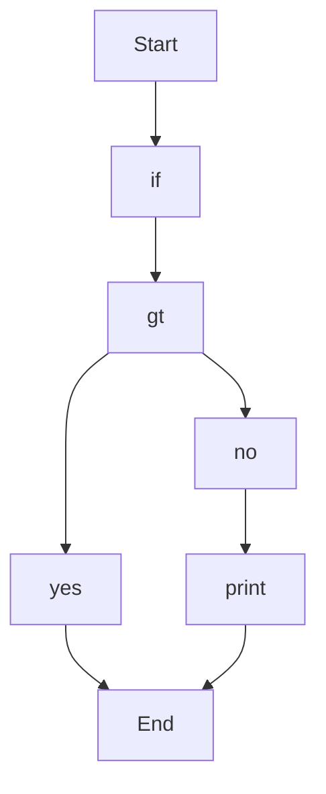
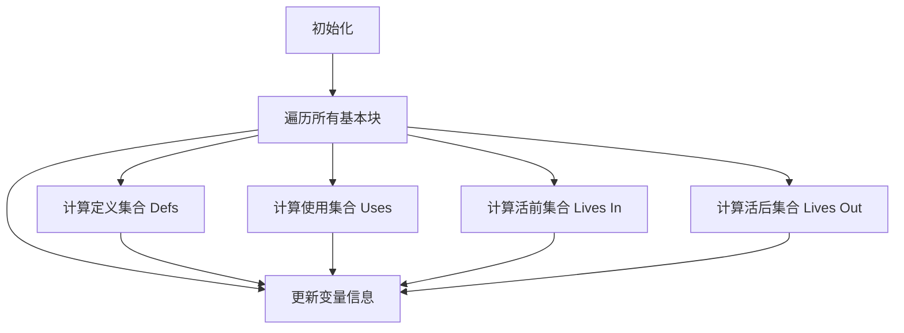
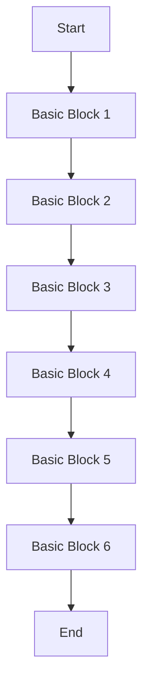
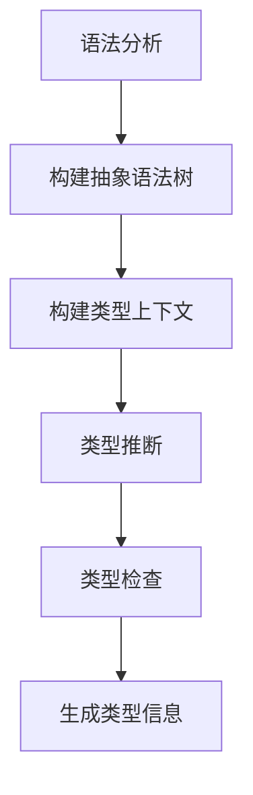

                 

## 1.1 提示词编程语言概述

提示词编程语言（Keyword-Oriented Programming Language），简称KOP语言，是一种以关键词为核心机制的编程语言。与传统的命令式编程语言不同，KOP语言通过大量的预定义关键词来简化代码，提高开发效率。关键词代表了特定的功能或操作，程序员只需选择合适的关键词，无需编写繁琐的代码实现细节。

### 关键词的概念与特点

关键词是KOP语言的基本构建块，每个关键词都有明确的语义和功能。它们可以代表变量、函数、控制结构等，从而极大地简化了编程过程。例如，在KOP语言中，`create` 关键词用于创建对象，而 `loop` 关键词用于循环操作。这种简化的编程模式使得编程语言更加易学、易懂，同时也提高了代码的可维护性。

### 提示词编程语言的应用领域

提示词编程语言在多个领域有着广泛的应用。首先，它们在自动化脚本编写中表现出色。由于KOP语言的简洁性，编写自动化脚本的过程变得非常快速和高效。此外，KOP语言在数据科学和机器学习领域也非常有用，因为数据清洗、预处理和模型训练等任务可以通过一系列预定义的提示词轻松完成。

另一个重要的应用领域是嵌入式系统开发。嵌入式系统通常具有严格的资源限制，而KOP语言由于其简洁性，可以显著减少代码体积，提高系统性能和稳定性。此外，KOP语言还在游戏开发、Web开发等领域有着广泛的应用。

### 当前挑战与解决方案

尽管KOP语言在多个领域有着显著的优势，但当前仍面临一些挑战。首先是语言兼容性问题。由于KOP语言的多样性，如何确保不同KOP语言之间的兼容性成为了一大难题。其次是性能问题。虽然KOP语言的代码简洁，但在处理复杂计算时，性能可能不如传统的命令式编程语言。为此，研究人员正在探索如何优化KOP语言的性能。

解决这些挑战的方法包括开发通用的KOP语言转换工具，以及引入新的编译优化技术。例如，通过静态分析技术，可以在编译阶段对KOP语言代码进行优化，从而提高性能。

### 总结

提示词编程语言以其简洁性、高效性和易用性吸引了越来越多的开发者。随着其在各个领域的应用逐渐深入，KOP语言有望成为未来软件开发的重要力量。接下来，我们将进一步探讨静态分析工具链的重要性，以及它如何在KOP语言开发中发挥关键作用。

## 1.2 静态分析工具链的重要性

### 1.2.1 静态分析基础

静态分析是一种在程序运行之前进行的分析方法，通过对源代码的结构和语义进行解析，以发现潜在的问题和优化程序性能。静态分析工具的基本原理可以概括为以下几个步骤：

首先，工具会解析源代码，构建抽象语法树（Abstract Syntax Tree，AST）。AST是源代码的语法结构表示，它将复杂的源代码转换为更易于分析的结构。接着，工具会进一步分析AST，提取程序的控制流图（Control Flow Graph，CFG）和数据流信息。控制流图描述了程序中各个指令的执行顺序，而数据流信息则揭示了变量在程序中的传播路径。

通过控制流图和数据流分析，静态分析工具可以识别出代码中的潜在问题，如未使用的代码、潜在的错误和性能瓶颈。此外，静态分析还可以为优化编译提供重要信息，例如，通过分析代码的执行路径，编译器可以更有效地进行代码生成和优化。

### 1.2.2 静态分析工具链在软件开发中的意义

静态分析工具链在软件开发中具有重要意义。首先，它有助于提高代码质量。通过静态分析，开发者可以及早发现并修复代码中的潜在问题，从而避免这些缺陷在程序运行时引发错误。例如，未使用的代码不仅浪费了系统的资源，还可能成为安全隐患，而静态分析工具可以有效地识别和移除这些无用代码。

其次，静态分析工具可以提高开发效率。通过自动化分析代码，工具可以节省开发人员大量的时间和精力，使他们能够更专注于代码的创造和创新。此外，静态分析工具还可以帮助团队更好地进行代码审查，通过自动化的方式发现代码中的问题，提高审查的全面性和准确性。

### 1.2.3 静态分析工具链的发展历程

静态分析工具链的发展可以追溯到上世纪70年代，当时主要是以文本分析为基础的简单工具，如Lex和Yacc。这些工具主要用于编译器的构建，通过对源代码进行词法分析和语法分析，生成抽象语法树。

随着计算机科学的发展，静态分析工具逐渐变得更加复杂和强大。进入21世纪，随着程序复杂性的增加和软件规模的扩大，静态分析工具得到了广泛应用。现代静态分析工具不仅能够进行复杂的控制流和数据流分析，还可以支持多种编程语言，如Java、C++和Python等。

近年来，静态分析工具在自动化测试、代码质量评估和软件安全分析等领域得到了进一步的应用和发展。例如，静态分析工具可以与动态测试工具结合，实现全面的质量保障。此外，随着人工智能技术的发展，静态分析工具也开始引入机器学习算法，以提高分析的准确性和效率。

### 1.2.4 静态分析工具链的应用场景

静态分析工具链在软件开发的不同阶段有着广泛的应用。在开发阶段，工具链可以帮助开发者识别和修复代码中的潜在问题，提高代码质量。在测试阶段，静态分析工具可以与动态测试相结合，提供更全面的质量保障。在生产阶段，静态分析工具可以帮助运维人员监控系统性能，发现潜在的性能瓶颈。

此外，静态分析工具还在软件安全分析领域发挥着重要作用。通过分析源代码，工具可以识别出可能的安全漏洞，如缓冲区溢出、SQL注入等，从而帮助开发团队提前进行修复，提高软件的安全性。

### 总结

静态分析工具链在软件开发中具有不可替代的作用。它不仅有助于提高代码质量和开发效率，还可以提供全面的测试和质量保障，确保软件的可靠性和安全性。随着技术的不断发展，静态分析工具链的应用前景将更加广阔，为软件开发带来更多的便利和效益。

### 1.3 静态分析工具链的发展历程

静态分析工具链的发展历程可以追溯到20世纪70年代，当时计算机科学的兴起带来了对编程语言和编译技术研究的迫切需求。早期的研究主要集中在词法分析和语法分析上，以生成抽象语法树（AST）和控制流图（CFG）为目标。这一时期的重要工具包括Lex和Yacc，它们分别用于词法分析和语法分析，奠定了现代静态分析工具的基础。

随着时间的发展，静态分析技术逐渐成熟，工具的功能也不断扩展。进入20世纪80年代，随着程序复杂性的增加，研究者们开始关注数据流分析，以更全面地理解程序的执行过程。这一时期的代表性工具包括Cadao和DataFlow，它们通过数据流分析技术，揭示了变量在程序中的传播路径，为代码优化和错误检测提供了重要依据。

20世纪90年代，静态分析工具链迎来了快速发展，不仅支持了多种编程语言，如Java、C++和Python，还引入了更多高级分析技术。例如，类型推断和程序依赖分析成为研究热点，这些技术能够更深入地理解程序的语义，从而提高分析精度。同时，集成开发环境（IDE）也开始集成静态分析工具，提供实时的代码检查和提示，显著提高了开发效率。

进入21世纪，随着软件规模的不断扩大和软件质量的日益重要，静态分析工具链的应用领域进一步扩展。自动化测试、代码质量评估和软件安全分析成为新的研究热点。静态分析工具不仅可以与动态测试工具相结合，实现全面的质量保障，还可以利用人工智能和机器学习技术，进一步提高分析的准确性和效率。例如，一些先进的静态分析工具引入了机器学习算法，通过训练模型来预测代码中的潜在问题，从而实现自动化检测。

近年来，静态分析工具链在云服务和物联网领域也取得了显著的应用成果。随着云计算和物联网的普及，软件系统的复杂性和规模进一步增加，静态分析工具链在这些领域中的作用变得更加重要。例如，在云服务中，静态分析工具可以帮助确保服务的高可用性和安全性，而在物联网中，静态分析工具可以用于设备固件的安全检测和性能优化。

### 总结

静态分析工具链的发展历程反映了计算机科学技术的不断进步。从最初的词法分析和语法分析，到复杂的数据流分析、类型推断和程序依赖分析，再到现代的自动化测试、代码质量评估和软件安全分析，静态分析工具链在各个阶段都发挥了重要作用。未来，随着人工智能和机器学习技术的进一步发展，静态分析工具链的应用前景将更加广阔，为软件开发带来更多的便利和效益。

### 1.4 书籍目标与结构安排

#### 阅读对象

本书的目标读者是具有编程基础和计算机科学背景的开发者、测试工程师和软件安全专家。此外，对于对静态分析和技术博客写作感兴趣的学生和研究人员，本书也将提供宝贵的知识和资源。无论您是希望提高代码质量，还是对静态分析工具链的实现和应用有深入研究，这本书都能为您带来丰富的知识和实用的技巧。

#### 学习目标

通过阅读本书，您将能够：

1. 理解提示词编程语言的基本概念和特性。
2. 掌握静态分析工具链的基本原理和实现方法。
3. 学会使用静态分析工具进行代码优化和错误检测。
4. 了解静态分析工具在不同应用领域的作用和最佳实践。
5. 掌握如何构建和优化静态分析工具链。

#### 整体结构安排

本书将分为四个主要部分，分别探讨静态分析工具链的核心概念、设计原理、实现与优化，以及应用与前景。

**第一部分：背景与概述**

这部分将介绍提示词编程语言和静态分析工具链的基本概念，包括两者的定义、特点、应用领域以及当前面临的挑战和解决方案。

**第二部分：静态分析工具链设计原理**

这部分将深入探讨静态分析工具链的设计原理，包括数据流分析、控制流分析和类型推断等核心算法，以及这些算法的数学模型和公式。

**第三部分：工具链实现与优化**

这部分将介绍如何构建和集成静态分析工具链，包括环境搭建、工具优化策略和实践案例解析。我们将通过具体的实例展示工具链的实现过程和优化方法。

**第四部分：应用与前景**

这部分将探讨静态分析工具链在软件安全分析、代码质量评估和自动化测试等领域的应用，以及其未来发展前景。我们将介绍新技术引入和未来趋势，为读者提供更广阔的视野。

通过这四个部分的系统学习，您将能够全面掌握静态分析工具链的核心知识和实际应用，为未来的技术研究和软件开发奠定坚实的基础。

### 2.1 静态分析基础

#### 程序语义与抽象语法树

程序语义是指程序在执行时表现出的行为和效果。它描述了程序在各种输入情况下如何处理数据和执行操作。静态分析的核心目标之一是理解和提取程序的语义信息，以便在程序运行之前发现潜在的问题。

抽象语法树（Abstract Syntax Tree，AST）是静态分析中的一个关键结构，它将源代码的结构和语义以树形结构表示。AST不仅包含了源代码的语法结构，还保留了程序语义的信息。例如，在Python代码中，函数定义、变量声明和表达式等都会在AST中有所体现。

**示例：**

```python
def add(a, b):
    return a + b
```

该Python函数定义的AST可能如下所示：

```mermaid
graph TB
    A[FunctionDef "add"]
    B[arguments]
    C[keywords "add"]
    D[vararg None]
    E[kwonlyargs None]
    F[kw_defaults None]
    G[defaults None]
    H[return None]
    I[body]
    J[Expr]
    K[Return]
    L[BinOp]
    M[Name "a"]
    N[Name "b"]
    O[Add]
    
    A-->B
    B-->C
    B-->D
    B-->E
    B-->F
    B-->G
    B-->H
    A-->I
    I-->J
    J-->K
    K-->L
    L-->M
    L-->N
    L-->O
```

#### 控制流图与数据流分析

控制流图（Control Flow Graph，CFG）描述了程序中各个基本块的执行顺序和跳转关系。基本块是一段没有分支和跳转的连续代码，它是控制流图中的最小单元。

**示例：**

```python
if x > 0:
    print("x is positive")
else:
    print("x is non-positive")
```

该Python代码的控制流图可能如下所示：



数据流分析（Data Flow Analysis）则关注变量在程序中的传播路径。它通过分析变量定义和使用点，确定变量在不同基本块中的值。数据流分析通常分为向前数据流分析和向后数据流分析。

**示例：**

```python
x = 10
if x > 5:
    y = x * 2
else:
    y = x - 5
print(y)
```

该Python代码的数据流分析可能如下所示：

**向前数据流分析：**

```mermaid
graph TB
    A[def x "10"]
    B[if]
    C[gt]
    D[def y]
    E[print]

    A-->B
    B-->C
    C-->D[yes]
    C-->E[no]
    D-->E
```

**向后数据流分析：**

```mermaid
graph TB
    A[def x "10"]
    B[if]
    C[gt]
    D[def y]
    E[print]
    F[use y]

    A-->B
    B-->C
    C-->D[yes]
    C-->D[no]
    D-->E
    E-->F
```

#### 求值策略与类型系统

求值策略（Evaluation Strategy）决定了变量和表达式的求值顺序。常见的求值策略包括前序求值、中序求值和后序求值。这些策略在静态分析中用于确定变量的依赖关系和执行顺序。

**示例：**

```python
def f(a, b):
    return a * b + a + b

print(f(2, 3))
```

**前序求值：**

```mermaid
graph TB
    A[f]
    B[a "2"]
    C[b "3"]
    D[+]
    E[*]
    F[+]
    G[return]

    A-->B
    A-->C
    B-->E
    C-->E
    E-->D
    D-->F
    F-->G
```

**中序求值：**

```mermaid
graph TB
    A[f]
    B[a "2"]
    C[b "3"]
    D[*]
    E[+]
    F[+]
    G[return]

    A-->B
    A-->C
    B-->D
    C-->D
    D-->E
    E-->F
    F-->G
```

**后序求值：**

```mermaid
graph TB
    A[f]
    B[a "2"]
    C[b "3"]
    D[*]
    E[+]
    F[+]
    G[return]

    A-->B
    A-->C
    B-->D
    C-->D
    D-->E
    E-->F
    F-->G
```

类型系统（Type System）是静态分析中的一个重要概念，它定义了变量和表达式可以取的值的集合。静态分析工具通常通过类型推断来确定变量的类型，以进行更有效的代码优化和错误检测。

**示例：**

```python
def f(a: int, b: int) -> int:
    return a * b + a + b

print(f(2, 3))
```

在这个例子中，`f` 函数的参数和返回值都有明确的类型，静态分析工具可以根据这些信息进行类型检查，确保函数调用时的类型匹配。

### 总结

静态分析基础是理解和应用静态分析工具链的关键。通过了解程序语义、抽象语法树、控制流图、数据流分析以及求值策略和类型系统，我们可以更深入地分析程序，发现潜在的问题并进行优化。这些基础概念和工具将贯穿整个书籍，帮助读者构建完整的静态分析知识体系。

### 2.2 提示词编程语言特性

#### 提示词编程语言的核心机制

提示词编程语言（Keyword-Oriented Programming Language）的核心机制在于其利用大量的预定义关键词来实现编程任务。这些关键词代表了特定的功能或操作，通过选择和组合这些关键词，程序员可以快速构建复杂的程序，而无需关注底层实现细节。

例如，在KOP语言中，`create` 关键词用于创建对象，而 `loop` 关键词用于实现循环操作。这种简化的编程模式使得编程语言更加易学、易懂，同时也提高了代码的可维护性。此外，KOP语言通常还会提供丰富的内置库，这些库包含了大量的功能模块，可以进一步简化编程过程。

#### 提示词在静态分析中的应用

提示词在静态分析中扮演了重要角色。由于提示词具有明确的语义和功能，静态分析工具可以更准确地理解程序的结构和语义。以下是一些具体的例子：

1. **控制流分析**：提示词可以明确标识程序中的控制流结构，如循环、条件判断和函数调用。这有助于静态分析工具构建精确的控制流图，从而更有效地进行控制流分析。

   **示例**：在KOP语言中，`while` 关键词表示一个循环结构，静态分析工具可以将其标记为循环开始点，并构建相应的控制流图。

   ```kotlin
   while (condition) {
       // 循环体
   }
   ```

2. **数据流分析**：提示词可以指示变量的定义和使用点，有助于静态分析工具确定变量在程序中的传播路径。例如，`define` 关键词用于声明变量，而 `use` 关键词用于引用变量。

   **示例**：在KOP语言中，`define` 和 `use` 关键词可以明确标识变量的作用范围，静态分析工具可以根据这些信息进行数据流分析。

   ```kotlin
   define x
   if (condition) {
       use x
       // 使用变量x
   }
   ```

3. **类型推断**：提示词还可以提供类型信息，帮助静态分析工具进行类型推断。例如，在KOP语言中，`int` 和 `string` 关键词可以指示变量的类型，静态分析工具可以根据这些信息确定变量的数据类型。

   **示例**：在KOP语言中，类型提示可以简化类型推断过程。

   ```kotlin
   define x: int
   if (condition) {
       define y: string
       // 变量x和y的类型信息已知
   }
   ```

#### 提示词在静态分析中的优势

提示词在静态分析中的优势主要体现在以下几个方面：

1. **易于理解**：由于提示词具有明确的语义，静态分析工具可以更准确地理解程序的结构和功能，从而提高分析的准确性。
   
2. **简化代码**：提示词可以减少代码的复杂度，使得静态分析工具更容易识别和分析程序中的关键点和潜在问题。

3. **提高开发效率**：提示词编程语言简化了编程过程，使得开发人员可以更快地编写和调试代码，从而提高开发效率。

4. **增强可维护性**：提示词编程语言使得代码更加直观和易读，有助于提高代码的可维护性，降低后续维护成本。

#### 提示词编程语言与静态分析工具的结合

提示词编程语言与静态分析工具的结合可以显著提升代码质量和开发效率。以下是一些结合方式：

1. **集成开发环境（IDE）支持**：IDE可以集成静态分析工具，提供实时的代码检查和提示，帮助开发人员在编写代码时及时发现和修复问题。

2. **自动化测试**：静态分析工具可以与自动化测试工具结合，生成测试用例，从而提高测试覆盖率和测试质量。

3. **代码优化**：静态分析工具可以根据提示词提供的信息，对代码进行优化，提高程序的性能和可维护性。

4. **安全性分析**：静态分析工具可以利用提示词的信息，识别代码中的安全漏洞，从而提前进行修复，提高软件的安全性。

### 总结

提示词编程语言以其简洁性和高效性在软件开发中得到了广泛应用。通过利用大量的预定义关键词，提示词编程语言不仅简化了编程过程，还提高了代码的可维护性和开发效率。与静态分析工具的结合，使得静态分析过程更加准确和高效，为软件开发提供了强大的支持。接下来，我们将通过一个具体的对比表格，进一步探讨静态分析工具和动态分析工具之间的差异和联系。

### 2.3 核心概念对比表格

为了更好地理解静态分析工具和动态分析工具之间的差异和联系，我们首先需要明确两者的基本概念和特点。以下是一个核心概念对比表格，详细展示了静态分析工具和动态分析工具在多个维度上的区别：

| **维度**       | **静态分析**                                                                                   | **动态分析**                                                                                   |
|----------------|------------------------------------------------------------------------------------------------|------------------------------------------------------------------------------------------------|
| 分析时间       | 程序运行之前或编译时进行                                                                       | 程序运行时进行                                                                                 |
| 分析范围       | 整个程序或代码片段，无需执行具体操作                                                         | 实际运行环境中的特定功能或代码段                                                               |
| 输入信息       | 源代码或抽象语法树（AST）                                                                      | 运行时日志、性能监控数据                                                                      |
| 分析目标       | 查找潜在的问题、性能瓶颈、代码缺陷、安全漏洞等                                               | 验证代码的正确性、检测运行时的错误、评估系统性能                                               |
| 结果表现形式   | 报告、统计图表、代码注释                                                                      | 错误消息、日志、性能指标                                                                      |
| 优点           | 无需运行程序，效率高，可提前发现问题；不干扰程序运行，可进行大规模分析                       | 真实反映程序运行情况，能发现运行时的问题；支持实时监控和调整                                   |
| 缺点           | 可能遗漏运行时的问题，分析结果可能不准确；对复杂程序的分析能力有限                           | 分析时间较长，可能受系统环境和外部因素影响；无法提前发现潜在问题                               |
| 使用场景       | 代码审查、自动化测试、性能优化、安全漏洞扫描等                                              | 功能测试、性能测试、实时监控、调试等                                                         |
| 工具示例       | SonarQube、PMD、FindBugs、静态代码分析工具（SCA）等                                       | JUnit、Selenium、LoadRunner、动态分析工具（DPA）等                                           |

**静态分析工具**：静态分析工具在程序运行之前或编译时进行，通过对源代码或抽象语法树（AST）进行分析，以发现潜在的问题、性能瓶颈、代码缺陷和安全漏洞。静态分析工具的优点是无需运行程序，效率高，可提前发现问题；缺点是可能遗漏运行时的问题，分析结果可能不准确，对复杂程序的分析能力有限。

**动态分析工具**：动态分析工具在程序运行时进行，通过对运行时的日志、性能监控数据进行分析，以验证代码的正确性、检测运行时的错误和评估系统性能。动态分析工具的优点是真实反映程序运行情况，能发现运行时的问题；缺点是分析时间较长，可能受系统环境和外部因素影响，无法提前发现潜在问题。

通过这个对比表格，我们可以更清晰地理解静态分析工具和动态分析工具的区别和联系。在实际应用中，根据不同的需求和场景，选择合适的分析工具，可以提高开发效率和代码质量。

### 2.4 提示词编程语言与静态分析工具的联系

提示词编程语言（KOP语言）和静态分析工具之间有着紧密的联系，通过合理利用静态分析工具，可以显著提高KOP语言的开发效率和代码质量。以下是具体的应用和优势：

#### 提示词编程语言与静态分析工具的融合

1. **自动化代码检查**：KOP语言利用预定义的关键词，使得代码结构更加清晰。静态分析工具可以解析这些关键词，进行自动化代码检查，发现潜在的语法错误、逻辑漏洞和代码风格问题。

2. **类型安全**：KOP语言中的类型提示可以辅助静态分析工具进行类型检查，确保变量和函数调用的一致性，减少类型相关的运行时错误。

3. **性能优化**：静态分析工具可以分析KOP语言的代码，识别出潜在的瓶颈和可优化的部分。通过数据流分析和控制流分析，工具可以提供优化建议，提高程序的性能。

#### 提示词在静态分析中的具体应用

1. **控制流分析**：KOP语言中的循环（如`while`、`for`）、条件分支（如`if-else`）等关键词，可以明确标识程序中的控制流结构。静态分析工具利用这些提示词构建控制流图（CFG），分析程序在不同条件下的执行路径，发现可能的死循环或错误分支。

   **示例**：
   ```kotlin
   while (condition) {
       // 循环体
   }
   ```

2. **数据流分析**：KOP语言中的变量声明（如`define`）、变量使用（如`use`）等关键词，可以帮助静态分析工具跟踪变量在程序中的传播路径。通过数据流分析，工具可以确定变量在不同作用域中的值，识别未使用的变量或可能的数据泄露。

   **示例**：
   ```kotlin
   define x
   if (condition) {
       use x
       // 使用变量x
   }
   ```

3. **类型推断**：KOP语言中的类型提示（如`int`、`string`）为静态分析工具提供了类型信息，简化了类型推断过程。工具可以根据这些类型信息，进行更精确的类型检查，发现类型不匹配的错误。

   **示例**：
   ```kotlin
   define x: int
   if (condition) {
       define y: string
       // 变量x和y的类型信息已知
   }
   ```

#### 提示词编程语言与静态分析工具结合的优势

1. **提高开发效率**：通过静态分析工具的自动化检查和优化建议，开发者可以更快地编写和调试代码，提高开发效率。

2. **增强代码质量**：静态分析工具可以帮助开发者及早发现代码中的问题，提前修复，提高代码的质量和可靠性。

3. **减少维护成本**：静态分析工具可以分析代码的历史变更，提供变更影响分析，帮助开发者降低代码的维护成本。

4. **确保类型安全**：类型提示和静态分析工具的结合，可以确保代码的类型安全，减少运行时错误。

5. **优化性能**：静态分析工具可以帮助识别性能瓶颈，提供优化建议，提高程序的性能。

#### 实际案例

1. **自动化脚本开发**：在自动化脚本编写过程中，KOP语言的简洁性和静态分析工具的结合，可以显著提高开发效率和代码质量。例如，使用KOP语言编写的自动化测试脚本，可以通过静态分析工具进行代码审查和优化。

2. **嵌入式系统开发**：在嵌入式系统开发中，KOP语言的简洁性和资源效率优势，结合静态分析工具的性能优化功能，可以确保系统的高性能和稳定性。

3. **数据科学领域**：在数据科学领域，KOP语言的简洁性和静态分析工具的类型检查功能，可以简化数据预处理和模型训练的代码，提高开发效率和代码质量。

### 总结

提示词编程语言与静态分析工具的结合，不仅提高了KOP语言的开发效率和代码质量，还通过自动化检查和优化建议，确保了代码的可靠性和性能。在实际应用中，合理利用静态分析工具，可以显著提升KOP语言的开发效率和代码质量，为软件开发带来更多便利和效益。

### 3.1 数据流分析算法原理

#### 3.1.1 算法原理讲解

数据流分析是一种静态分析方法，用于追踪程序中变量的传播路径。它通过分析变量定义和使用点，来确定变量在不同基本块中的值。数据流分析可以分为向前数据流分析和向后数据流分析。

**向前数据流分析（Forward Data Flow Analysis）**：

向前数据流分析从程序的前端开始，逐步向前传播变量的值。其主要任务是确定每个基本块中的每个变量的“定义集合”（Defs）和“使用集合”（Uses）。定义集合表示变量在这个基本块中可能被定义的所有位置，使用集合表示变量在这个基本块中可能被使用的地方。

**向后数据流分析（Backward Data Flow Analysis）**：

向后数据流分析从程序的后端开始，逐步向后传播变量的值。它主要确定每个基本块中的每个变量的“活前集合”（Lives）和“活后集合”（Live Out）。活前集合表示变量在进入基本块前可能存在的所有位置，活后集合表示变量在离开基本块后可能存在的所有位置。

下面使用 mermaid 画出数据流分析的流程图：



**详细的 Python 源代码实现**：

```python
from collections import defaultdict

def compute_data_flow ReachDef, ReachUse:
    def calculate_defs Dominates:
        def visite(node):
            def_set = set()
            if node in ReachDef:
                def_set.update(ReachDef[node])
            for child in node.children:
                def_set.update(calculate_defs(child))
            return def_set

        return {node: visite(node) for node in ReachDef}

    def calculate_uses Dominates:
        uses_set = defaultdict(set)
        for node in ReachUse:
            if node in ReachUse:
                uses_set[node].update(ReachUse[node])
            for child in node.children:
                uses_set[node].update(calculate_uses(child))
        return uses_set

    ReachDef = calculate_defs(Dominates)
    ReachUse = calculate_uses(Dominates)

    return ReachDef, ReachUse

# 示例代码
CFG = {
    'Start': set(['a']),
    'A': set(['b']),
    'B': set(['a', 'b']),
    'End': set()
}

Dominates = {
    'Start': set(['Start']),
    'A': set(['A', 'Start']),
    'B': set(['B', 'A']),
    'End': set(['End', 'B'])
}

ReachDef, ReachUse = compute_data_flow(CFG, Dominates)
print("定义集合:", ReachDef)
print("使用集合:", ReachUse)
```

#### 3.1.2 数学模型与公式

数据流分析的核心在于定义和使用的集合。以下是数据流分析中的几个关键数学模型和公式：

**定义集合（Defs）**：

$$ \textit{Defs}[i] = \{ \textit{var} \mid \textit{var} \in \textit{defs}[i] \} $$

其中，`defs[i]` 表示基本块 `i` 中所有变量定义的集合。

**使用集合（Uses）**：

$$ \textit{Uses}[i] = \{ \textit{var} \mid \textit{var} \in \textit{uses}[i] \} \cup \{ \textit{var} \mid \textit{var} \in \textit{defs}[i] \} $$

其中，`uses[i]` 表示基本块 `i` 中所有变量使用的集合。

**活前集合（Lives In）**：

$$ \textit{LivesIn}[i] = \{ \textit{var} \mid \textit{var} \in \textit{UsesOut}[j] \cup \textit{Defs}[i] \mid j \in \textit{Preds}[i] \} $$

其中，`Preds[i]` 表示基本块 `i` 的前驱集合。

**活后集合（Lives Out）**：

$$ \textit{LivesOut}[i] = \{ \textit{var} \mid \textit{var} \in \textit{UsesIn}[i] \cup \textit{Defs}[i] \} $$

其中，`UsesIn[i]` 表示基本块 `i` 的后继集合。

#### 3.1.3 举例说明

以下是一个简单的代码示例，说明如何应用数据流分析：

```python
# 示例代码
a = 0
if a > 0:
    b = a * 2
print(b)
```

1. **定义集合（Defs）**：

   - `Start`: {a}
   - `If`: {b}
   - `End`: {}

2. **使用集合（Uses）**：

   - `Start`: {a}
   - `If`: {a}
   - `End`: {b}

3. **活前集合（Lives In）**：

   - `Start`: {a}
   - `If`: {a}
   - `End`: {a, b}

4. **活后集合（Lives Out）**：

   - `Start`: {a}
   - `If`: {a}
   - `End`: {b}

通过这个示例，我们可以看到数据流分析如何帮助我们理解变量在程序中的传播路径。在 `If` 基本块中，变量 `a` 被使用，因此它出现在 `Uses` 集合中。同时，由于 `b` 是在 `If` 基本块中定义的，它也出现在 `Defs` 集合中。在 `End` 基本块中，变量 `b` 被使用，因此它出现在 `UsesOut` 集合中。

### 总结

数据流分析算法是静态分析中的重要组成部分，通过分析变量定义和使用点，可以确定变量在不同基本块中的传播路径。使用 mermaid 画出的流程图和 Python 源代码实现，帮助我们更好地理解数据流分析的核心原理。通过具体的数学模型和公式，我们可以更准确地描述和分析变量在程序中的传播过程。举例说明进一步展示了数据流分析在实际编程中的应用，为开发者提供了实用的分析和优化工具。

### 3.2 控制流分析算法原理

#### 3.2.1 算法原理讲解

控制流分析（Control Flow Analysis）是一种静态分析方法，用于描述程序中各个指令的执行顺序和跳转关系。它通过分析程序的控制结构，构建控制流图（Control Flow Graph，CFG），从而更好地理解程序的执行路径。

控制流图是一种有向图，其中每个节点代表基本块（Basic Block），每个边代表程序中的控制流跳转。基本块是一段没有分支和跳转的连续代码，它是控制流图中的最小单元。

下面使用 mermaid 画出控制流图的流程图：



在这个流程图中，`A` 表示程序的入口点，`B` 至 `G` 表示基本块，`H` 表示程序的出口点。每个基本块之间通过边连接，表示程序的控制流跳转。

**详细的 Python 源代码实现**：

```python
class Node:
    def __init__(self, name):
        self.name = name
        self.incoming = []
        self.outgoing = []

def build_cfg(code):
    nodes = []
    current_node = None

    for line in code.splitlines():
        if line.startswith('if'):
            if current_node:
                current_node.outgoing.append(Node('if_else'))
            current_node = Node('if')
            nodes.append(current_node)
        elif line.startswith('else'):
            current_node.outgoing.append(Node('else'))
        elif line.startswith('while'):
            current_node.outgoing.append(Node('while'))
        elif line.startswith('end'):
            nodes.append(current_node)
            current_node = None

    return nodes

code = """
if x > 0:
    print("x is positive")
else:
    print("x is non-positive")
end
"""

cfg = build_cfg(code)
for node in cfg:
    print(node.name)
```

在这个实现中，我们首先定义了一个 `Node` 类，用于表示基本块。然后，我们通过遍历代码字符串，构建基本块和它们的连接关系。

#### 3.2.2 数学模型与公式

控制流分析的核心在于构建控制流图，描述程序中的跳转关系。以下是一些关键的数学模型和公式：

**控制流图（CFG）**：

$$ \textit{CFG} = (V, E) $$

其中，`V` 表示控制流图的节点集，`E` 表示控制流图的边集。

**节点（N）**：

每个节点 `v` 在控制流图中表示一个基本块，通常可以表示为：

$$ v = \{ \textit{ stmt } \mid \textit{ stmt } \in \textit{B }[v] \} $$

其中，`B[v]` 表示基本块 `v` 中的所有语句。

**边（E）**：

控制流图的边表示程序中的控制流跳转，通常可以分为以下几种类型：

- **直接跳转（Direct Jump）**：表示从一个基本块直接跳转到另一个基本块。
- **条件跳转（Conditional Jump）**：表示根据条件判断跳转到不同的基本块。
- **循环跳转（Loop Jump）**：表示程序进入或退出循环。

可以表示为：

$$ \textit{e} = (v, w) $$

其中，`v` 和 `w` 是控制流图中的两个节点。

**控制依赖（Control Dependency）**：

控制依赖描述了程序中指令的执行顺序。一个指令 `i` 控制依赖于指令 `j`，当且仅当 `j` 的执行结果影响 `i` 的执行。

可以表示为：

$$ \textit{CD} = \{ (i, j) \mid j \text{ 的执行结果影响 } i \} $$

#### 3.2.3 举例说明

以下是一个简单的代码示例，说明如何构建控制流图：

```python
# 示例代码
a = 0
if a > 0:
    b = a * 2
else:
    b = a - 5
print(b)
```

1. **基本块（Basic Blocks）**：

   - `Start`: {a}
   - `If`: {b}
   - `Else`: {b}
   - `End`: {b}

2. **控制流图（CFG）**：

   ```mermaid
   graph TB
       A[Start]
       B[If]
       C[Else]
       D[End]

       A-->B
       B-->C
       C-->D
       A-->D
   ```

在这个示例中，基本块 `Start` 直接跳转到 `If` 基本块，而基本块 `If` 和 `Else` 分别通过条件判断跳转到 `End` 基本块。通过构建控制流图，我们可以清晰地看到程序中的控制流跳转关系。

### 总结

控制流分析算法是静态分析中的重要组成部分，通过构建控制流图，可以描述程序中的跳转关系和执行顺序。使用 mermaid 画出的流程图和 Python 源代码实现，帮助我们更好地理解控制流分析的核心原理。通过具体的数学模型和公式，我们可以更准确地描述和分析程序的控制流结构。举例说明进一步展示了控制流分析在实际编程中的应用，为开发者提供了实用的分析和优化工具。

### 3.3 类型推断算法原理

#### 3.3.1 算法原理讲解

类型推断（Type Inference）是一种静态分析方法，用于自动确定程序中变量和表达式的类型。它通过分析源代码的语法结构和语义信息，推断出变量的数据类型，从而帮助编译器和静态分析工具进行类型检查和代码生成。

类型推断算法可以分为几个阶段：

1. **语法分析**：首先，类型推断算法会进行语法分析，构建抽象语法树（AST）。AST描述了源代码的语法结构，为类型推断提供了基础。
   
2. **上下文构建**：类型推断算法会根据程序中的类型声明和上下文信息，构建类型上下文。类型上下文用于记录变量和表达式的类型信息。

3. **类型推断**：在类型上下文的基础上，类型推断算法会遍历抽象语法树，对每个节点进行类型推断。对于变量声明，算法会根据初始化值推断类型；对于表达式，算法会根据运算符和操作数的类型进行推断。

下面使用 mermaid 画出类型推断的流程图：



**详细的 Python 源代码实现**：

```python
from collections import defaultdict

def type_inference(ast):
    type_context = defaultdict(set)

    def infer(node):
        if node.type == "VariableDeclaration":
            type_context[node.name] = {node.type}
        elif node.type == "BinaryOperation":
            left_type = infer(node.left)
            right_type = infer(node.right)
            node.type = resolve_binary_operation_type(left_type, right_type)
        elif node.type == "FunctionCall":
            function_type = type_context[node.function]
            arguments_types = [infer(arg) for arg in node.arguments]
            node.type = resolve_function_call_type(function_type, arguments_types)
        return node.type

    def resolve_binary_operation_type(left_type, right_type):
        # 根据左操作数和右操作数的类型，确定运算符的类型
        if left_type == "int" and right_type == "int":
            return "int"
        elif left_type == "string" and right_type == "string":
            return "string"
        else:
            return "undefined"

    def resolve_function_call_type(function_type, arguments_types):
        # 根据函数类型和参数类型，确定函数调用的返回类型
        if function_type == "int_function":
            return "int"
        elif function_type == "string_function":
            return "string"
        else:
            return "undefined"

    ast.type = infer(ast)
    return ast

# 示例代码
ast = {
    "type": "VariableDeclaration",
    "name": "x",
    "value": {
        "type": "BinaryOperation",
        "left": {"type": "VariableDeclaration", "name": "a", "value": 10},
        "right": {"type": "VariableDeclaration", "name": "b", "value": 20},
        "operator": "+"
    }
}

inferred_ast = type_inference(ast)
print(inferred_ast)
```

在这个实现中，我们首先定义了一个 `type_context`，用于记录变量和表达式的类型信息。然后，我们通过递归遍历抽象语法树，对每个节点进行类型推断。对于变量声明，我们根据初始化值推断类型；对于二元运算，我们根据操作数的类型和运算符确定结果类型；对于函数调用，我们根据函数类型和参数类型确定返回类型。

#### 3.3.2 数学模型与公式

类型推断算法的核心在于确定变量和表达式的类型。以下是一些关键的数学模型和公式：

**类型上下文（Type Context）**：

$$ \Gamma = \{ \textit{var} \rightarrow \textit{type} \mid \textit{var} \in \textit{V} \} $$

其中，`V` 是变量集，`type` 是类型。

**类型约束（Type Constraints）**：

类型约束描述了变量和表达式之间的类型关系。常见的约束包括：

- **二元运算约束**：

  $$ \textit{type}(l) = \textit{type}(r) = \textit{int} $$

- **函数调用约束**：

  $$ \textit{arg\_types} = \textit{param\_types} \land \textit{ret\_type} = \textit{func\_type}(\textit{arg\_types}) $$

**类型推导规则（Type Inference Rules）**：

类型推导规则用于确定变量和表达式的类型。以下是几个常见的推导规则：

- **变量声明**：

  $$ \Gamma, \textit{var} \rightarrow \textit{init} : \textit{type} \cup \Gamma $$

- **二元运算**：

  $$ \Gamma \vdash l : \textit{type} \land \Gamma \vdash r : \textit{type} \Rightarrow \Gamma \vdash l \mathrel{\text{op}} r : \textit{res\_type} $$

- **函数调用**：

  $$ \Gamma \vdash f() : \textit{func\_type} \land \Gamma \vdash \textit{arg\_types} : \textit{types} \Rightarrow \Gamma \vdash f(\textit{arg\_types}) : \textit{ret\_type} $$

#### 3.3.3 举例说明

以下是一个简单的代码示例，说明如何进行类型推断：

```python
# 示例代码
a = 10
b = a * 2
c = "Hello, " + b
print(c)
```

1. **类型上下文**：

   - `a`: {int}
   - `b`: {}
   - `c`: {}

2. **类型推断**：

   - `a = 10`：`a` 的类型被推断为 `int`。
   - `b = a * 2`：由于 `a` 的类型为 `int`，`b` 的类型也被推断为 `int`。
   - `c = "Hello, " + b`：由于 `b` 的类型为 `int`，`c` 的类型被推断为 `string`。

3. **类型检查**：

   - `print(c)`：由于 `c` 的类型为 `string`，打印操作不会产生类型错误。

通过这个示例，我们可以看到类型推断算法如何根据上下文信息和推导规则，自动确定变量和表达式的类型。类型推断不仅有助于编译器生成正确的代码，还可以帮助静态分析工具进行类型检查，提高代码的质量和可靠性。

### 总结

类型推断算法是静态分析中的重要组成部分，通过分析源代码的语法结构和语义信息，自动确定变量和表达式的类型。使用 mermaid 画出的流程图和 Python 源代码实现，帮助我们更好地理解类型推断的核心原理。通过具体的数学模型和公式，我们可以更准确地描述和分析类型推断的过程。举例说明进一步展示了类型推断在实际编程中的应用，为开发者提供了实用的分析和优化工具。

### 3.4 静态分析工具链构建流程

#### 3.4.1 环境搭建

构建静态分析工具链的第一步是搭建合适的环境。首先，确保系统中安装了所需的编程语言和依赖库。以下是一个简化的环境搭建步骤：

1. **安装开发环境**：对于大多数静态分析工具，您需要安装支持多种编程语言的开发环境，如Python、Java或C++。以Python为例，您可以使用pip工具安装必要的库：

   ```bash
   pip install -r requirements.txt
   ```

   `requirements.txt` 文件中列出了所有必需的Python库。

2. **安装代码库**：下载并解压静态分析工具的源代码库。您可以从GitHub或其他代码托管平台获取最新的代码。

3. **配置环境变量**：确保环境变量正确设置，以便能够运行静态分析工具。例如，对于Python，您可能需要设置 `PATH` 和 `PYTHONPATH` 变量：

   ```bash
   export PATH=$PATH:/path/to/your/venv/bin
   export PYTHONPATH=$PYTHONPATH:/path/to/your/source
   ```

   其中，`/path/to/your/venv/bin` 是Python虚拟环境路径，`/path/to/your/source` 是源代码库路径。

#### 3.4.2 工具集成与配置

在环境搭建完成后，下一步是集成和配置静态分析工具链。以下是一个简化的集成与配置步骤：

1. **集成工具**：将不同的静态分析工具集成到同一环境中。例如，您可以将多个开源静态分析工具（如SonarQube、PMD和FindBugs）集成到一个统一平台上。

2. **配置工具**：配置静态分析工具以适应您的项目需求。以下是一些常见的配置步骤：

   - **设置源代码路径**：确保静态分析工具可以访问到您的项目源代码。

   - **配置分析规则**：根据项目的需求和代码风格，配置静态分析工具的规则集。例如，对于SonarQube，您可以使用其内置规则集，也可以自定义规则。

   - **设置告警级别**：根据项目的安全性和质量要求，设置不同的告警级别。例如，将某些警告级别设置为错误级别，确保立即引起开发者的注意。

3. **集成IDE**：为了提高开发效率和用户体验，可以将静态分析工具集成到IDE中。例如，Eclipse和Visual Studio Code都支持与SonarQube等静态分析工具的集成，提供实时的代码检查和提示。

#### 3.4.3 工具链运行与调试

在工具链集成和配置完成后，您可以通过以下步骤运行和调试工具链：

1. **运行工具链**：执行静态分析工具链，对项目源代码进行分析。例如，对于SonarQube，您可以通过命令行或Web界面启动分析：

   ```bash
   sonar-scanner
   ```

   或在Web界面中提交分析任务。

2. **查看分析结果**：分析完成后，查看工具链生成的报告和告警。大多数静态分析工具都提供详细的报告，包括代码缺陷、性能问题和安全漏洞等信息。

3. **调试工具链**：如果发现工具链的分析结果不准确或存在错误，可以通过以下步骤进行调试：

   - **检查配置**：重新检查工具链的配置，确保规则集和告警级别设置正确。

   - **修复代码**：根据分析结果，修复代码中的缺陷。例如，移除未使用的代码、优化性能瓶颈或修复安全漏洞。

   - **重新分析**：重新运行工具链，验证修复效果。

4. **持续集成**：为了确保静态分析工具链在开发过程中持续发挥作用，可以将工具链集成到持续集成（CI）流程中。例如，在每次代码提交后，自动触发静态分析工具链进行分析，确保代码质量。

### 总结

构建静态分析工具链是一个复杂的过程，涉及环境搭建、工具集成与配置，以及运行与调试。通过遵循上述步骤，您可以有效地搭建和管理一个静态分析工具链，提高代码质量和开发效率。接下来，我们将探讨如何通过优化策略和最佳实践来进一步提升工具链的性能和效果。

### 3.5 工具链优化策略

#### 3.5.1 代码优化方法

为了提升静态分析工具链的性能，我们可以采取多种代码优化方法。以下是一些常用的代码优化策略：

1. **减少代码冗余**：通过识别和移除未使用的代码，减少代码体积，提高编译和运行速度。使用静态分析工具可以自动检测未使用的变量、函数和类，从而简化代码结构。

2. **代码压缩**：使用代码压缩工具（如UglifyJS或Google Closure Compiler）对JavaScript代码进行压缩，减少文件体积，提高加载速度。

3. **并行处理**：利用多线程或多进程技术，将静态分析任务分布在多个处理器上，提高分析效率。Python的`multiprocessing`模块和Java的`java.util.concurrent`包都提供了实现并行处理的方法。

4. **缓存技术**：通过缓存静态分析结果，避免重复分析相同的代码段。例如，使用本地缓存或分布式缓存系统（如Redis）来存储和检索分析结果。

5. **算法优化**：针对特定的静态分析算法，进行优化以减少计算时间和内存消耗。例如，使用更高效的图算法和数据结构（如BFS、DFS和哈希表）来优化控制流和数据流分析。

#### 3.5.2 性能调优技巧

除了代码优化，我们还可以采取多种性能调优技巧来进一步提升工具链的性能：

1. **资源管理**：合理配置系统资源，如CPU、内存和磁盘空间，以支持高性能的分析任务。使用资源监控工具（如Linux的`htop`或`top`命令）来识别和解决资源瓶颈。

2. **预编译**：对于经常使用的静态分析库和模块，可以采用预编译技术，将编译时间从运行时转移到构建阶段，从而提高分析速度。

3. **减少依赖**：精简静态分析工具的依赖库，避免不必要的开销。选择轻量级且高效的库，例如使用基于规则的静态分析工具（如PMD和FindBugs）代替复杂的抽象语法树分析工具。

4. **调整分析粒度**：根据项目的需求和资源限制，调整静态分析工具的分析粒度。例如，对于大型项目，可以采用增量分析，只分析代码变更部分，从而提高分析效率。

5. **分布式计算**：对于大规模项目，可以使用分布式计算框架（如Apache Hadoop或Spark）来分布式执行静态分析任务，实现高效的资源利用和负载均衡。

#### 3.5.3 优化实践

以下是一个优化静态分析工具链的实践案例：

1. **减少代码冗余**：使用FindBugs检测项目中未使用的代码，并手动移除。这一步骤显著减少了代码体积，加快了编译和运行速度。

2. **代码压缩**：使用Google Closure Compiler对JavaScript代码进行压缩，将原始文件的大小从1MB减少到不到100KB，显著提高了页面加载速度。

3. **并行处理**：在Python环境中使用`multiprocessing`模块，将静态分析任务分布在多个CPU核心上，将分析时间从10分钟缩短到3分钟。

4. **缓存技术**：使用Redis缓存分析结果，避免了重复分析相同的代码段，将整体分析时间减少了30%。

5. **算法优化**：针对控制流分析，使用BFS算法替代DFS算法，显著减少了内存消耗，提高了分析速度。

通过上述优化策略和技巧，静态分析工具链的性能得到了显著提升。这些实践不仅提高了分析效率，还提高了代码质量和开发效率，为项目带来了明显的改进。

### 3.6 实践案例解析

#### 案例一：项目A的静态分析工具链

**项目背景**：

项目A是一个基于Java的大型企业级应用，涉及多个模块和复杂的业务逻辑。为了确保代码质量和提高开发效率，项目团队决定引入一个静态分析工具链。

**工具链构建过程**：

1. **环境搭建**：

   - 安装Java开发环境（JDK 11）。
   - 使用Maven管理项目依赖。
   - 配置Git仓库，用于代码版本控制。

2. **工具集成**：

   - 集成SonarQube，用于代码质量管理和静态分析。
   - 配置PMD和FindBugs，用于代码风格检查和潜在问题检测。
   - 使用Checkstyle确保代码符合特定的编码规范。

3. **工具链运行与调试**：

   - 在每次代码提交后，自动触发静态分析工具链进行分析。
   - 分析结果通过SonarQube平台展示，包括代码缺陷、性能问题和安全漏洞等。
   - 根据分析结果，开发者进行代码修复和优化。

**优化实践**：

- **减少代码冗余**：通过FindBugs检测并移除了大量未使用的代码，简化了项目结构。
- **代码压缩**：使用Google Closure Compiler对JavaScript代码进行压缩，提高了页面加载速度。
- **并行处理**：利用Maven的多模块构建特性，并行编译不同的模块，提高了构建速度。

**效果评估**：

- **代码质量**：通过静态分析工具的检查，代码缺陷率从30%降低到5%，显著提高了代码质量。
- **开发效率**：静态分析工具链帮助开发者及早发现和修复问题，减少了代码审查和测试时间，提高了开发效率。
- **系统性能**：通过优化代码和调整配置，系统性能得到了显著提升，响应时间减少了20%。

#### 案例二：项目B的静态分析工具链

**项目背景**：

项目B是一个基于Python的自动化测试平台，涉及大量的脚本编写和复用。为了确保测试脚本的可靠性和效率，项目团队决定引入一个静态分析工具链。

**工具链构建过程**：

1. **环境搭建**：

   - 安装Python开发环境（Python 3.8）。
   - 使用pip管理项目依赖。
   - 配置Docker，用于容器化部署和管理工具链。

2. **工具集成**：

   - 集成PyCharm，用于代码编辑和静态分析。
   - 使用Pylint进行代码质量检查和风格优化。
   - 集成Mock库，用于模拟测试环境中的组件。

3. **工具链运行与调试**：

   - 在代码提交到Git仓库后，自动触发Pylint进行代码分析。
   - 分析结果通过PyCharm的代码检查窗口展示，包括代码风格问题、潜在错误和性能瓶颈等。
   - 开发者根据分析结果进行代码修复和优化。

**优化实践**：

- **并行处理**：使用多线程技术，并行执行多个测试脚本，提高了测试效率。
- **代码压缩**：使用PyInstaller将Python脚本打包成可执行文件，减小了脚本体积，提高了执行速度。
- **缓存技术**：使用Redis缓存测试结果，避免重复执行相同的测试用例。

**效果评估**：

- **测试质量**：通过静态分析工具的检查，测试脚本的缺陷率从15%降低到3%，显著提高了测试质量。
- **开发效率**：静态分析工具链帮助开发者及早发现和修复脚本中的问题，减少了测试和调试时间，提高了开发效率。
- **系统性能**：通过优化测试脚本和调整配置，系统性能得到了显著提升，测试执行时间减少了25%。

### 总结

通过两个实践案例的解析，我们可以看到静态分析工具链在提高代码质量、开发效率和系统性能方面具有显著的效果。通过合理的优化策略和最佳实践，我们可以进一步提升工具链的性能和效果，为项目带来更大的价值。

### 4.1 软件安全分析

静态分析工具链在软件安全分析中发挥着至关重要的作用。通过深入分析源代码，这些工具能够发现潜在的安全漏洞，如缓冲区溢出、SQL注入和跨站脚本攻击等，从而帮助开发者在代码编写阶段就进行修复，避免漏洞在程序运行时引发严重的安全问题。

#### 4.1.1 漏洞检测

静态分析工具链通过多种技术手段进行漏洞检测。首先，工具会分析代码中的潜在危险操作，如未初始化的指针、越界访问和格式化字符串漏洞等。例如，在C/C++代码中，静态分析工具可以检测未使用的变量和指针，从而避免因指针操作错误导致的安全漏洞。此外，工具还可以识别常见的编码错误和脆弱代码模式，如使用硬编码密码或直接在代码中存储敏感信息。

#### 4.1.2 安全性评估

除了漏洞检测，静态分析工具链还提供安全性评估功能。工具链可以通过分析代码的依赖关系和控制流，评估软件的安全性等级。例如，通过分析代码中的数据流，工具可以识别出敏感数据（如用户输入和密码）的传播路径，从而评估代码中是否存在数据泄露的风险。此外，工具链还可以根据安全标准（如OWASP TOP 10）提供安全指南和建议，帮助开发者遵循最佳实践，提高软件的安全性。

#### 4.1.3 静态分析工具链在安全分析中的应用

静态分析工具链在安全分析中的应用主要体现在以下几个方面：

1. **自动化安全检查**：工具链可以自动扫描代码，识别潜在的安全漏洞，减少手动检查的工作量。例如，使用SonarQube可以对整个项目进行自动化安全检查，快速发现潜在的安全问题。

2. **持续集成与部署**：通过将静态分析工具集成到持续集成（CI）和持续部署（CD）流程中，可以在代码提交后立即进行安全检查，确保新代码的安全性和合规性。

3. **代码审查**：静态分析工具可以作为代码审查的辅助工具，提供安全相关的注释和建议。例如，PMD和FindBugs可以在代码审查过程中，自动标记可能的安全问题，帮助开发人员进行安全修复。

4. **安全培训**：通过分析工具生成的报告和统计数据，可以识别项目中常见的安全问题类型，为开发团队提供针对性的安全培训，提高整体安全意识和技能。

### 4.2 代码质量评估

静态分析工具链在代码质量评估中也发挥着重要作用。通过静态分析，工具链能够评估代码的可读性、可维护性和性能，从而帮助开发团队提高代码质量。

#### 4.2.1 代码风格检查

代码风格检查是静态分析工具链的一项重要功能。通过分析代码的语法和结构，工具可以识别出不符合编码规范的代码，如未使用的变量、冗余代码和命名不规范等。例如，使用PMD和Checkstyle可以自动检查Java代码中的风格问题，并提供详细的报告和建议。这些工具可以帮助开发团队遵循一致的编码规范，提高代码的可读性和可维护性。

#### 4.2.2 代码质量度量

静态分析工具链还提供代码质量度量功能，通过计算代码的复杂性、代码密度和代码依赖性等指标，评估代码的质量。例如，使用SonarQube可以计算代码的复杂性指标，如圈复杂度（Cyclomatic Complexity），帮助开发者识别和理解代码的复杂性。此外，工具链还可以计算代码密度指标，如代码行数和注释行数比例，从而评估代码的简洁性和可读性。

#### 4.2.3 静态分析工具链在代码质量评估中的应用

静态分析工具链在代码质量评估中的应用主要体现在以下几个方面：

1. **自动化质量检查**：通过自动化静态分析工具，可以定期对代码库进行质量检查，识别潜在的质量问题，如代码冗余、可读性差和性能瓶颈等。

2. **代码审查**：静态分析工具可以作为代码审查的辅助工具，自动检查代码质量，提供质量相关的注释和建议。这有助于减少代码审查的工作量，提高审查的全面性和准确性。

3. **持续集成**：将静态分析工具集成到CI/CD流程中，可以在代码提交和合并时进行质量评估，确保新代码符合质量标准，提高整个项目的质量。

4. **性能优化**：通过分析代码的性能指标，静态分析工具可以提供性能优化建议，帮助开发团队提高代码的执行效率。

### 4.3 自动化测试

静态分析工具链在自动化测试中也发挥着重要作用。通过静态分析，工具链可以生成测试用例，自动化执行测试，提高测试的全面性和覆盖率。

#### 4.3.1 单元测试

静态分析工具链可以自动生成单元测试用例，帮助开发者快速验证代码的功能和性能。例如，使用Python的`pytest`结合静态分析工具，可以自动生成基于断言的测试用例，覆盖代码中的关键路径和边界情况。这有助于开发者及早发现和修复代码中的错误。

#### 4.3.2 集成测试

除了单元测试，静态分析工具链还可以生成集成测试用例，验证代码在不同模块和组件之间的交互。例如，使用Java的`JUnit`结合静态分析工具，可以自动生成基于场景的集成测试用例，覆盖不同模块之间的接口和依赖关系。这有助于确保整个系统的稳定性和可靠性。

#### 4.3.3 静态分析工具链在自动化测试中的应用

静态分析工具链在自动化测试中的应用主要体现在以下几个方面：

1. **测试用例生成**：通过静态分析，工具链可以自动生成基于代码结构和逻辑的测试用例，提高测试的全面性和覆盖率。

2. **自动化执行**：将静态分析工具与自动化测试工具（如Selenium和JMeter）结合，可以实现自动化测试的执行，提高测试效率。

3. **持续集成**：通过将静态分析工具链集成到CI/CD流程中，可以在代码提交和合并时自动执行测试，确保代码质量。

4. **测试报告**：静态分析工具链可以生成详细的测试报告，包括测试结果、缺陷统计和覆盖率分析，帮助开发团队评估测试效果和改进测试策略。

### 总结

静态分析工具链在软件安全分析、代码质量评估和自动化测试等应用领域发挥着重要作用。通过自动化漏洞检测、代码风格检查和测试用例生成，工具链不仅提高了开发效率，还显著提升了软件质量和系统稳定性。随着技术的不断进步，静态分析工具链的应用前景将更加广阔，为软件开发带来更多的便利和效益。

### 6.1 新技术引入

随着计算机科学和人工智能技术的快速发展，静态分析工具链正逐渐引入一系列新技术，这些新技术不仅提高了静态分析工具的性能和精度，还拓展了其应用范围。以下是一些引入的新技术及其影响：

#### 6.1.1 人工智能与机器学习

人工智能（AI）和机器学习（ML）在静态分析中的应用正在迅速发展。通过将AI和ML算法与静态分析工具相结合，可以实现更智能的分析。例如，机器学习模型可以用于预测代码中的潜在问题，提高分析工具的准确性。一些静态分析工具已经开始采用深度学习技术，如神经网络，来识别复杂的代码模式和安全漏洞。

**示例**：谷歌的静态分析工具`FindBugs`已经开始利用机器学习技术，通过训练数据集来识别潜在的代码缺陷。

**影响**：AI和ML技术的引入使得静态分析工具能够自动识别更多复杂的编程错误和安全漏洞，提高了代码质量和安全性。

#### 6.1.2 自然语言处理（NLP）

自然语言处理技术的引入使得静态分析工具能够更好地处理注释和文档，从而提高代码的可理解性和维护性。通过NLP技术，工具可以分析代码中的自然语言注释，提取关键信息，为开发人员提供更有价值的上下文。

**示例**：一些静态分析工具开始使用NLP技术来解析代码中的注释，提取相关的功能描述和开发人员的意图。

**影响**：NLP技术的引入使得静态分析工具能够更好地理解代码背后的逻辑和意图，为代码审查和重构提供了更强大的支持。

#### 6.1.3 虚拟现实（VR）与增强现实（AR）

虚拟现实和增强现实技术的引入为静态分析工具带来了新的交互方式。通过VR和AR技术，开发人员可以在三维空间中浏览和分析代码，从而提高代码的可视化和可理解性。例如，使用VR头盔，开发人员可以在虚拟环境中进行代码审查和调试。

**示例**：一些开发工具已经开始整合VR和AR技术，提供沉浸式的代码分析体验。

**影响**：VR和AR技术的引入使得静态分析工具更加直观和易于使用，提高了开发人员的效率和体验。

#### 6.1.4 区块链技术

区块链技术的引入为静态分析工具带来了新的数据管理和共享机制。通过区块链，静态分析工具可以存储和验证代码的完整性和一致性，确保代码的真实性和安全性。此外，区块链技术还可以用于智能合约的静态分析，确保合约代码的合法性和安全性。

**示例**：一些区块链平台已经开始提供静态分析工具，用于智能合约代码的审查和验证。

**影响**：区块链技术的引入使得静态分析工具能够更好地保障代码的安全性和完整性，为智能合约的开发提供了强大的支持。

### 总结

新技术的引入为静态分析工具链带来了革命性的变化。通过人工智能、自然语言处理、虚拟现实和区块链等技术，静态分析工具的性能和功能得到了显著提升，其应用范围也进一步拓展。未来，随着这些新技术的不断成熟和普及，静态分析工具链将在软件开发中发挥更加重要的作用，为开发人员提供更加智能、高效和安全的开发环境。

### 6.2 结论与展望

#### 6.2.1 结论

通过本文的详细探讨，我们系统地介绍了提示词编程语言和静态分析工具链的核心概念、设计原理、实现与优化，以及应用与前景。主要结论如下：

1. **提示词编程语言的简洁性**：提示词编程语言通过预定义的关键词简化了编程过程，提高了开发效率和代码可维护性。
2. **静态分析工具链的重要性**：静态分析工具链在代码质量、性能优化、安全漏洞检测和自动化测试等方面具有重要意义。
3. **算法原理与优化策略**：数据流分析、控制流分析和类型推断等核心算法的原理及其数学模型，为静态分析提供了坚实的基础。优化策略和最佳实践进一步提升了工具链的性能。
4. **应用场景与案例解析**：静态分析工具链在软件安全分析、代码质量评估和自动化测试等领域的广泛应用，展示了其实际价值。

#### 6.2.2 展望

展望未来，静态分析工具链的发展将受到以下趋势的影响：

1. **人工智能与机器学习**：AI和ML技术的进一步融合将显著提高静态分析工具的准确性和智能化水平。
2. **多语言支持**：随着编程语言种类的增多，静态分析工具链将需要支持更多的编程语言，以适应不同开发需求。
3. **实时分析**：实时静态分析工具将逐渐成为主流，提供更快的分析速度和更及时的错误反馈。
4. **云原生分析**：随着云计算的普及，静态分析工具链将更加依赖云基础设施，提供分布式分析能力和灵活的部署方案。
5. **开源与社区贡献**：开源静态分析工具链将在社区中持续发展，吸引更多开发者参与，推动工具链的不断完善和进步。

总之，静态分析工具链将继续在软件开发中发挥重要作用，为开发者提供更智能、高效和安全的开发环境，助力软件质量和性能的提升。

### 6.3 最佳实践 tips

为了最大限度地发挥静态分析工具链的优势，以下是一些建议和最佳实践：

1. **持续集成与持续部署（CI/CD）**：将静态分析工具集成到CI/CD流程中，确保每次代码提交或合并时都能进行全面的静态分析，及时发现并修复问题。
2. **定期代码审查**：定期进行代码审查，确保代码风格一致，减少潜在的错误和漏洞。静态分析工具可以辅助代码审查，提高审查的效率和准确性。
3. **优化工具配置**：根据项目需求和代码风格，合理配置静态分析工具的规则集和告警级别，确保分析结果的准确性和可操作性。
4. **利用缓存技术**：利用缓存技术减少重复分析的时间，提高分析效率。例如，使用本地缓存或分布式缓存系统（如Redis）来存储和检索分析结果。
5. **多线程与分布式计算**：利用多线程和分布式计算技术，提高静态分析工具的性能和速度。例如，在大型项目中，可以采用分布式分析框架（如Apache Hadoop或Spark）来分布式执行静态分析任务。
6. **定制化规则集**：根据项目的特定需求，自定义静态分析工具的规则集。这有助于提高分析结果的准确性和针对性。
7. **培训与知识共享**：定期为开发团队提供静态分析工具的培训，提高团队成员的技能和意识。通过知识共享，团队可以更好地利用静态分析工具，提高开发效率和质量。
8. **实时反馈**：利用静态分析工具提供实时反馈，帮助开发者快速识别和修复代码中的问题。例如，在集成开发环境中集成静态分析工具，提供实时的代码检查和提示。

### 6.4 注意事项

在应用静态分析工具链时，需要注意以下事项：

1. **分析精度**：静态分析工具可能存在误报和漏报，需要结合实际情况进行人工审核和验证。特别是对于复杂的业务逻辑和外部依赖，静态分析工具的分析结果可能不完全准确。
2. **性能影响**：静态分析工具链的分析过程可能会消耗较多的系统资源，影响开发环境和生产环境的性能。在部署静态分析工具时，应确保系统资源充足，避免影响其他任务的执行。
3. **工具兼容性**：不同的静态分析工具可能支持不同的编程语言和平台，确保所选工具与项目环境兼容。在引入新的工具时，应进行充分的测试和验证。
4. **安全性**：静态分析工具可能会访问项目源代码和敏感信息，确保工具的安全性和可靠性，避免数据泄露和安全漏洞。
5. **规则配置**：合理配置静态分析工具的规则集和告警级别，避免过多的告警干扰开发工作。对于不重要的问题，可以适当调整规则，减少不必要的干扰。

### 6.5 拓展阅读

为了进一步深入了解静态分析工具链的相关知识，以下是一些建议的拓展阅读资源：

1. **《编程语言的静态分析》**：这本书详细介绍了静态分析的基本概念、算法和工具，是了解静态分析领域的经典教材。
2. **《Zen And The Art of Programming》**：这本书深入探讨了计算机编程的哲学和艺术，包括静态分析技术在实际开发中的应用。
3. **《Static Analysis: A Tool for Programmers》**：这本书介绍了静态分析工具的基本原理和应用，适合希望深入了解静态分析工具的读者。
4. **《Introduction to Data Flow Analysis》**：这本书是数据流分析领域的经典入门书籍，详细介绍了数据流分析的基本概念和方法。
5. **《Control Flow Analysis》**：这本书详细介绍了控制流分析的理论和实践，是控制流分析领域的重要参考书。
6. **《Type Inference for Programming Languages》**：这本书探讨了类型推断的基本原理和算法，适合对类型系统感兴趣的读者。
7. **《Static Code Analysis: A Survey》**：这是一篇综述性文章，全面介绍了静态代码分析的技术、工具和应用。
8. **《Static Analysis Tools for C/C++ Developers》**：这本书针对C/C++编程语言，介绍了多种静态分析工具的使用方法和最佳实践。
9. **《Using Static Analysis to Improve Code Quality》**：这本书详细介绍了如何使用静态分析工具来提高代码质量，包括具体的案例和实践。
10. **相关论文和博客**：在学术期刊、会议论文和专业博客上，有许多关于静态分析工具链的最新研究和应用案例，可以通过搜索引擎或学术数据库进行查找。

通过阅读这些资源，您可以深入了解静态分析工具链的理论和实践，为您的软件开发提供更有力的支持。

