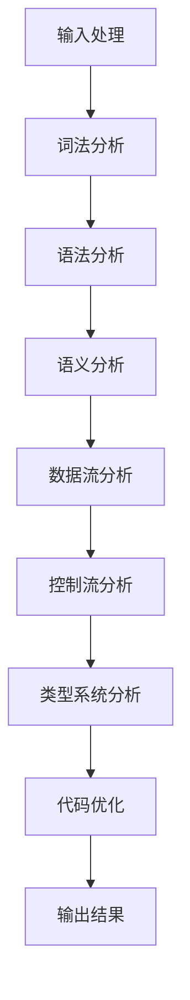
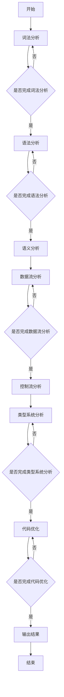
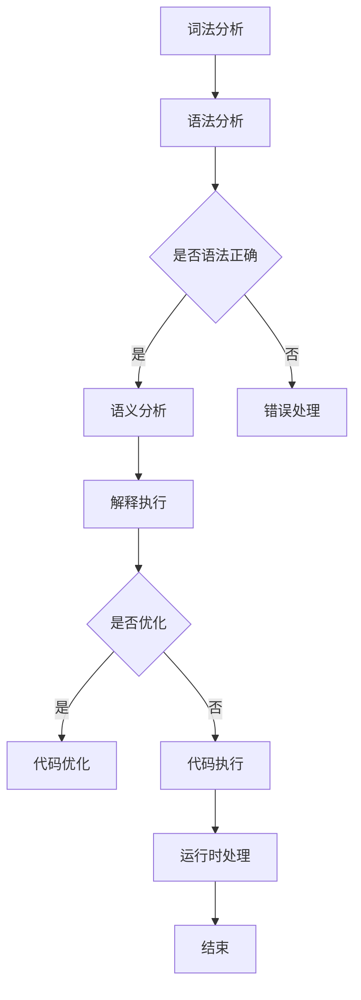
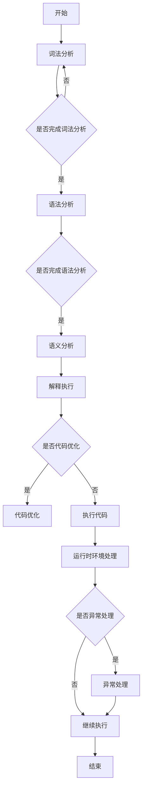
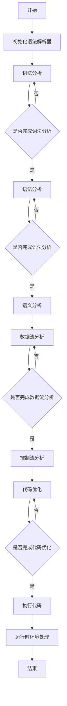
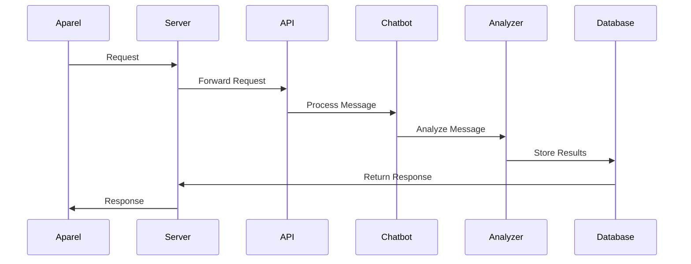
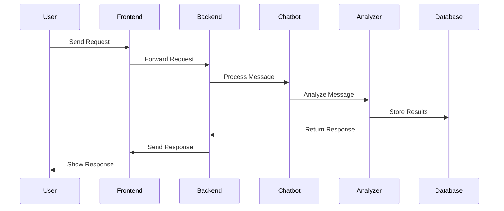

                 

### 文章标题

> 关键词：提示词编程语言、静态分析技术、算法优化、系统架构设计、项目实战

> 摘要：
本文旨在探讨提示词编程语言的静态分析技术。首先，我们将回顾提示词编程语言和静态分析技术的概念、背景及发展历史。接着，详细解释两者结合的原理和重要性，并通过具体的算法原理讲解和Mermaid流程图展示，深入剖析静态分析技术在提示词编程语言中的应用。随后，我们将讨论系统分析与架构设计的方法，并通过实际项目实战，详细解读代码应用、案例分析以及项目小结。本文将帮助读者全面了解提示词编程语言的静态分析技术，并为其在实际开发中的应用提供指导。

### 目录大纲

#### 第一部分：背景介绍

1. **第1章：问题背景**
   - 1.1 问题背景
   - 1.2 问题描述
   - 1.3 问题解决
   - 1.4 边界与外延
   - 1.5 概念结构与核心要素组成

2. **第2章：核心概念与联系**
   - 2.1 核心概念原理
   - 2.2 概念属性特征对比表格
   - 2.3 ER实体关系图架构

#### 第二部分：算法原理讲解

3. **第3章：静态分析技术原理**
   - 3.1 静态分析技术的定义与分类
   - 3.2 静态分析技术的算法原理
   - 3.3 静态分析技术的 Mermaid 流程图

4. **第4章：提示词编程语言原理**
   - 4.1 提示词编程语言的基本概念
   - 4.2 提示词编程语言的算法原理
   - 4.3 提示词编程语言的 Mermaid 流程图

5. **第5章：算法融合与优化**
   - 5.1 静态分析技术与提示词编程语言的融合
   - 5.2 算法优化与改进
   - 5.3 Mermaid 流程图与 Python 源代码

#### 第三部分：系统分析与架构设计

6. **第6章：系统分析与架构设计**
   - 6.1 问题场景介绍
   - 6.2 系统功能设计
   - 6.3 系统架构设计
   - 6.4 系统接口设计
   - 6.5 系统交互 Mermaid 序列图

#### 第四部分：项目实战

7. **第7章：项目实战**
   - 7.1 环境安装
   - 7.2 系统核心实现源代码
   - 7.3 代码应用解读与分析
   - 7.4 实际案例分析与详细讲解剖析
   - 7.5 项目小结

#### 附录

- 相关资料与参考文献
- 拓展阅读推荐

### 1.1 问题背景

提示词编程语言（Keyword-based Programming Language）是一种基于关键字和提示词的编程语言，其核心思想是通过关键词和提示词来组织和描述程序行为。这种编程语言通常用于自然语言处理、语音识别、自动问答系统和智能客服等领域。随着人工智能技术的不断发展，提示词编程语言在应用场景和功能上得到了极大的扩展。

静态分析技术（Static Analysis Technology）是一种在软件编译、运行之前对代码进行分析的技术，其目的是通过分析代码的结构、语法和语义，发现潜在的错误、优化代码性能、提高代码可维护性等。静态分析技术广泛应用于软件工程、代码审计、安全检测等领域，其重要性日益凸显。

提示词编程语言与静态分析技术的交叉应用是近年来研究的热点之一。结合两者的优点，可以实现对提示词编程语言的代码进行更高效的分析和优化，从而提高程序的运行效率和可靠性。然而，由于提示词编程语言的特殊性和复杂性，如何有效地将静态分析技术应用于提示词编程语言仍面临诸多挑战。

### 1.2 问题描述

提示词编程语言的特点包括：
- **灵活性**：通过提示词来定义程序行为，使得编程语言更加灵活。
- **可扩展性**：可以通过添加新的提示词来扩展语言功能。
- **自然语言处理**：能够更好地与自然语言进行交互，适用于智能客服和自动问答系统等领域。

静态分析技术的应用领域包括：
- **代码审计**：通过静态分析技术可以发现代码中的潜在安全漏洞。
- **性能优化**：静态分析技术可以帮助识别代码中的性能瓶颈并进行优化。
- **代码维护**：静态分析技术可以帮助开发者更好地理解和维护代码。

然而，提示词编程语言和静态分析技术之间存在一些挑战：
- **语义理解**：提示词编程语言的语义复杂，静态分析技术难以完全理解其语义。
- **代码规模**：提示词编程语言的代码规模通常较大，静态分析技术需要处理大量的代码。
- **语言特性**：提示词编程语言具有特殊的语言特性，如动态类型、动态绑定等，这些特性对静态分析技术提出了更高的要求。

为了解决上述挑战，我们需要找到合适的解决方案，将静态分析技术应用于提示词编程语言，从而提高代码的分析效率和准确性。

### 1.3 问题解决

提示词编程语言与静态分析技术的结合点在于：
- **语法分析**：静态分析技术可以用于对提示词编程语言的语法进行解析，生成抽象语法树（Abstract Syntax Tree，AST）。
- **语义分析**：静态分析技术可以用于对提示词编程语言的语义进行解析，提取程序的行为和依赖关系。
- **代码优化**：静态分析技术可以用于对提示词编程语言的代码进行优化，提高代码的运行效率和可维护性。

静态分析技术对提示词编程语言的关键贡献包括：
- **错误检测**：静态分析技术可以用于检测提示词编程语言中的潜在错误，如类型错误、语义错误等。
- **性能优化**：静态分析技术可以用于优化提示词编程语言的代码性能，如减少内存消耗、加快执行速度等。
- **代码重构**：静态分析技术可以用于对提示词编程语言的代码进行重构，提高代码的可读性和可维护性。

实现静态分析技术对提示词编程语言优化的策略包括：
- **语法解析器**：开发一个适用于提示词编程语言的语法解析器，生成AST。
- **语义分析器**：开发一个适用于提示词编程语言的语义分析器，提取程序的行为和依赖关系。
- **优化器**：开发一个适用于提示词编程语言的优化器，对代码进行优化。
- **工具链集成**：将静态分析技术集成到提示词编程语言的开发工具链中，方便开发者进行代码分析和优化。

### 1.4 边界与外延

静态分析技术的适用范围包括：
- **大型项目**：静态分析技术适用于大型项目，可以帮助开发者更好地理解和维护代码。
- **代码审计**：静态分析技术适用于代码审计，可以帮助发现潜在的安全漏洞。
- **性能优化**：静态分析技术适用于性能优化，可以帮助识别代码中的性能瓶颈。

提示词编程语言的发展趋势与未来方向包括：
- **更加智能化**：提示词编程语言将更加智能化，能够更好地与自然语言进行交互。
- **更广泛的适用场景**：提示词编程语言将应用于更多的领域，如智能家居、自动驾驶等。
- **更好的性能**：提示词编程语言将致力于提高性能，以应对更复杂的应用场景。

静态分析技术在提示词编程语言中的边界挑战包括：
- **语义理解**：提示词编程语言的语义复杂，静态分析技术难以完全理解其语义。
- **代码规模**：提示词编程语言的代码规模通常较大，静态分析技术需要处理大量的代码。
- **语言特性**：提示词编程语言具有特殊的语言特性，如动态类型、动态绑定等，这些特性对静态分析技术提出了更高的要求。

### 1.5 概念结构与核心要素组成

提示词编程语言的组成要素包括：
- **关键字**：用于定义程序的基本结构。
- **提示词**：用于描述程序的行为和依赖关系。
- **语法规则**：用于定义提示词编程语言的语法结构。
- **语义规则**：用于定义提示词编程语言的语义规则。

静态分析技术的核心概念包括：
- **抽象语法树（AST）**：用于表示代码的语法结构。
- **数据流分析**：用于分析代码中的变量和数据依赖关系。
- **控制流分析**：用于分析代码中的控制流结构。

提示词编程语言与静态分析技术的关联性体现在：
- **语法解析**：静态分析技术用于对提示词编程语言的语法进行解析，生成AST。
- **语义分析**：静态分析技术用于对提示词编程语言的语义进行解析，提取程序的行为和依赖关系。
- **代码优化**：静态分析技术用于对提示词编程语言的代码进行优化，提高代码的运行效率和可维护性。

### 2.1 核心概念原理

#### 提示词编程语言的核心概念

提示词编程语言是一种基于关键词和提示词的编程语言，其核心概念包括：

1. **关键字（Keywords）**：
   - 关键字是编程语言中具有特殊含义的单词，用于定义程序的基本结构。例如，在Python中，`if`、`while`、`for`等都是关键字。
   - 关键字通常不可用作变量名或其他标识符。

2. **提示词（Keywords）**：
   - 提示词是用于描述程序行为的特殊标识符，通常由程序员定义。提示词可以用于实现自定义函数、定义变量、控制程序流程等。
   - 提示词不同于关键字，可以用于各种编程任务，但通常具有一定的语义和功能。

3. **语法规则（Syntax Rules）**：
   - 语法规则定义了编程语言的结构，包括如何组织关键字和提示词，以及如何构成有效的程序语句。
   - 语法规则通常以规则集的形式存在，每个规则都描述了如何从基本元素构建更复杂的结构。

4. **语义规则（Semantic Rules）**：
   - 语义规则定义了编程语言的行为，即程序在不同情况下如何执行。
   - 语义规则涉及到变量作用域、类型系统、控制流等，确保程序的正确性和一致性。

#### 静态分析技术的核心原理

静态分析技术是一种在不运行程序的情况下分析其代码的技术，其核心原理包括：

1. **抽象语法树（Abstract Syntax Tree, AST）**：
   - 抽象语法树是代码的语法结构表示，由编译器或解释器在解析源代码时生成。
   - AST包含了代码中的所有语法元素，如函数、变量、控制流结构等，是静态分析的基础。

2. **数据流分析（Data Flow Analysis）**：
   - 数据流分析是一种静态分析技术，用于确定程序中变量和数据在不同程序路径上的流动情况。
   - 通过数据流分析，可以确定变量的定义和使用点、变量的可能值等。

3. **控制流分析（Control Flow Analysis）**：
   - 控制流分析是一种静态分析技术，用于确定程序中控制流的结构，如函数调用、分支和循环等。
   - 控制流分析有助于理解程序在不同条件下的执行路径，从而进行代码优化和错误检测。

4. **类型系统（Type System）**：
   - 类型系统定义了程序中变量的类型和类型转换规则。
   - 类型系统有助于确保程序的正确性和性能，通过静态分析可以检测类型错误。

### 2.2 概念属性特征对比表格

下面是一个对比表格，展示了提示词编程语言和静态分析技术的关键属性特征：

| 特征类别 | 提示词编程语言 | 静态分析技术 |
| -------- | -------------- | ------------ |
| **定义** | 基于关键词和提示词的编程语言 | 在程序编译或运行前对代码进行分析的技术 |
| **目标** | 提高程序的可读性和可维护性 | 发现潜在的错误、优化代码性能、提高代码可维护性 |
| **核心概念** | 关键字、提示词、语法规则、语义规则 | 抽象语法树、数据流分析、控制流分析、类型系统 |
| **优势** | 灵活性高、可扩展性强、自然语言处理能力强 | 不需要运行程序、分析速度快、能够发现深层次问题 |
| **劣势** | 语义理解复杂、代码规模大、语言特性特殊 | 难以完全理解复杂语义、处理大规模代码效率低、无法检测运行时错误 |
| **适用范围** | 自然语言处理、自动问答系统、智能客服 | 软件工程、代码审计、安全检测、性能优化 |
| **发展趋势** | 更加智能化、更广泛的适用场景、更好的性能 | 更高效的分析算法、更广泛的应用领域、更深入的语义理解 |

### 2.3 ER实体关系图架构

下面是一个Mermaid流程图，展示了提示词编程语言和静态分析技术中的实体关系：

```mermaid
erDiagram
    User ||--|{ Program : develops}
    Program ||--|{ Keyword : defines}
    Program ||--|{ KeywordSet : contains}
    Keyword ||--|{ SyntaxRule : follows}
    Keyword ||--|{ SemanticRule : follows}
    KeywordSet ||--|{ ProgramElement : includes}
    KeywordSet ||--|{ Keyword : defines}
    KeywordSet ||--|{ KeywordBinding : binds}
    KeywordBinding ||--|{ Variable : defines}
    KeywordBinding ||--|{ Function : defines}
    KeywordBinding ||--|{ ControlFlow : defines}
    KeywordBinding ||--|{ TypeSystem : defines}
    StaticAnalysis ||--|{ AST : analyzes}
    StaticAnalysis ||--|{ DataFlowAnalysis : performs}
    StaticAnalysis ||--|{ ControlFlowAnalysis : performs}
    StaticAnalysis ||--|{ TypeSystemAnalysis : performs}
    StaticAnalysis ||--|{ ErrorDetection : performs}
    StaticAnalysis ||--|{ CodeOptimization : performs}
```

这个ER图展示了用户如何开发程序，程序如何定义关键字和提示词，以及静态分析技术如何对程序进行分析和优化。实体之间的关系包括开发、定义、包含、分析等，清晰地描绘了提示词编程语言和静态分析技术的核心要素和它们之间的关联性。

### 3.1 静态分析技术的定义与分类

**静态分析技术的定义**：

静态分析技术是指在不运行程序的情况下，通过分析程序的源代码、语法结构、语法树、数据流和控制流等信息，来评估代码质量、发现潜在错误、优化代码性能的一种技术手段。静态分析主要依赖于编译原理、数据结构、算法等基础知识，通过对代码的静态检查，提前发现并解决问题。

**静态分析技术的分类**：

静态分析技术可以根据分析的角度和目标，分为以下几种类型：

1. **语法分析**：
   - **词法分析**：将源代码分解为一个个的单词（Token），是语法分析的第一步。
   - **语法分析**：将单词序列解析为语法结构，如抽象语法树（AST），是语法分析的核心步骤。
   - **语义分析**：检查代码的语义正确性，如类型检查、作用域解析等。

2. **数据流分析**：
   - **数据流分析**：分析程序中数据的流动情况，包括变量定义和使用、数据的传递路径等。
   - **数据流方程**：使用数据流方程（如Lattice理论）来描述数据在程序中的传播过程。

3. **控制流分析**：
   - **控制流分析**：分析程序中控制流程的结构，包括函数调用、循环、条件分支等。
   - **控制流图（CFG）**：使用控制流图来表示程序的执行路径和控制逻辑。

4. **类型系统分析**：
   - **类型检查**：验证程序中的类型一致性，确保变量、表达式和函数的返回类型正确。
   - **类型推断**：自动推导变量的类型，减少显式类型声明。

5. **代码优化**：
   - **优化算法**：通过对代码的结构和语义分析，自动优化代码的性能。
   - **循环优化**：减少循环的执行次数，如循环展开、迭代归并等。
   - **内存优化**：减少内存使用，如数据压缩、缓存优化等。

6. **代码质量评估**：
   - **代码度量**：使用各种指标（如代码复杂度、注释率、重复代码比例等）来评估代码质量。
   - **代码审查**：通过静态分析工具自动检测代码中的潜在错误和不良实践。

**静态分析技术的应用领域**：

静态分析技术广泛应用于以下领域：

1. **软件开发**：
   - 提高代码质量和可维护性。
   - 提前发现潜在的错误和漏洞。
   - 支持代码重构和优化。

2. **安全检测**：
   - 检测代码中的安全漏洞，如SQL注入、跨站脚本攻击等。
   - 提供安全审计和合规性检查。

3. **性能优化**：
   - 识别性能瓶颈和热点代码。
   - 自动优化代码，提高程序运行效率。

4. **教育**：
   - 用于教学和编程实践，帮助学生理解程序结构和算法。

5. **自动化测试**：
   - 生成测试用例，验证代码的覆盖率和正确性。

6. **持续集成/持续交付（CI/CD）**：
   - 自动集成代码并进行静态分析，确保代码库的质量。

**静态分析技术的局限性**：

尽管静态分析技术具有许多优势，但它也存在一些局限性：

1. **无法检测动态错误**：
   - 静态分析只能在代码静态情况下进行分析，无法检测运行时出现的动态错误。

2. **分析复杂代码的难度**：
   - 对于复杂的程序或高度抽象的编程语言，静态分析可能难以完全理解代码的语义。

3. **性能和资源消耗**：
   - 静态分析通常需要处理大量代码，可能对计算资源和时间有较高要求。

4. **误报和漏报问题**：
   - 静态分析工具可能会产生误报（标记为错误但实际上正确的代码），也可能漏报真正的错误。

5. **无法替代动态分析**：
   - 静态分析不能完全替代动态分析，动态分析可以提供运行时的行为信息。

通过了解静态分析技术的定义、分类及其应用领域和局限性，我们可以更好地利用这一技术手段，为软件开发提供强有力的支持。

### 3.2 静态分析技术的算法原理

#### 3.2.1 核心算法

静态分析技术涉及多种核心算法，以下是其中几种重要的算法及其工作原理：

1. **抽象语法树（AST）生成算法**：
   - **原理**：将源代码解析为语法结构，生成抽象语法树（AST）。
   - **步骤**：
     1. 词法分析：将源代码分解为单词（Token）。
     2. 语法分析：将单词序列解析为语法结构，生成AST。
     3. 语义分析：检查AST的语义正确性，如类型检查、作用域解析等。

2. **数据流分析算法**：
   - **原理**：分析程序中数据的流动情况，包括变量的定义和使用点、数据的传递路径等。
   - **步骤**：
     1. 初始化：设置数据流的初始状态。
     2. 建立数据流方程：使用数据流方程（如Lattice理论）来描述数据在程序中的传播过程。
     3. 解方程：迭代求解数据流方程，计算每个变量的数据流值。

3. **控制流分析算法**：
   - **原理**：分析程序中控制流程的结构，包括函数调用、循环、条件分支等。
   - **步骤**：
     1. 构建控制流图（CFG）：将程序的控制流结构表示为控制流图。
     2. 分析控制流图：计算每个基本块的入口和出口，识别程序的所有执行路径。

4. **类型系统分析算法**：
   - **原理**：验证程序中的类型一致性，确保变量、表达式和函数的返回类型正确。
   - **步骤**：
     1. 类型检查：检查AST中的每个节点，验证类型一致性。
     2. 类型推断：根据上下文自动推导变量的类型，减少显式类型声明。

5. **代码优化算法**：
   - **原理**：通过对代码的结构和语义分析，自动优化代码的性能。
   - **步骤**：
     1. 识别优化目标：确定代码中的优化机会，如循环优化、内存优化等。
     2. 应用优化策略：根据优化目标，应用相应的优化策略和算法。
     3. 验证优化结果：确保优化后的代码仍能正确执行，且性能得到提升。

#### 3.2.2 算法流程

静态分析技术的算法流程可以分为以下几个主要步骤：

1. **输入处理**：
   - **输入源代码**：读取待分析的源代码。
   - **预处理**：进行必要的预处理操作，如去除注释、格式化代码等。

2. **词法分析**：
   - **生成Token流**：将源代码分解为单词（Token），每个Token包含类型和值。
   - **存储Token流**：将生成的Token流存储在数据结构中，如数组或链表。

3. **语法分析**：
   - **构建AST**：将Token流解析为语法结构，生成抽象语法树（AST）。
   - **语义分析**：对AST进行语义分析，检查类型一致性、作用域解析等。

4. **数据流分析**：
   - **初始化数据流**：设置数据流的初始状态。
   - **建立数据流方程**：根据AST和程序结构，建立数据流方程。
   - **解方程**：迭代求解数据流方程，计算每个变量的数据流值。

5. **控制流分析**：
   - **构建控制流图**：将程序的控制流结构表示为控制流图（CFG）。
   - **分析控制流图**：计算每个基本块的入口和出口，识别程序的所有执行路径。

6. **类型系统分析**：
   - **类型检查**：检查AST中的每个节点，验证类型一致性。
   - **类型推断**：自动推导变量的类型，减少显式类型声明。

7. **代码优化**：
   - **识别优化目标**：确定代码中的优化机会。
   - **应用优化策略**：根据优化目标，应用相应的优化策略和算法。
   - **验证优化结果**：确保优化后的代码仍能正确执行，且性能得到提升。

8. **输出结果**：
   - **报告分析结果**：生成分析报告，包括错误、警告、性能优化建议等。
   - **优化后的代码**：输出优化后的源代码，或生成中间表示。

#### 3.2.3 Mermaid流程图

以下是静态分析技术的Mermaid流程图，展示了其算法流程：



此流程图清晰地展示了静态分析技术从输入源代码到输出优化结果的整个过程，有助于理解和实现静态分析算法。

### 3.3 静态分析技术的 Mermaid 流程图

为了更好地展示静态分析技术的执行过程，我们使用Mermaid绘制了以下流程图：



这个Mermaid流程图详细描述了静态分析技术的执行流程，包括词法分析、语法分析、语义分析、数据流分析、控制流分析、类型系统分析和代码优化等步骤。每个步骤完成后都会进行判断，以决定是否继续执行下一个步骤。该流程图有助于开发者理解和实现静态分析技术。

### 4.1 提示词编程语言的基本概念

提示词编程语言（Keyword-based Programming Language）是一种特殊的编程语言，它通过提示词（Keywords）来定义程序的行为和结构。与传统的命令式编程语言不同，提示词编程语言更强调语义表达和自然语言的交互性。以下是提示词编程语言的基本概念：

#### 提示词（Keywords）

提示词是提示词编程语言的核心元素，用于定义程序的行为。与关键字（Keywords）相似，但具有不同的作用。关键字通常由编程语言本身定义，用于实现基本的语法结构，而提示词则由程序员自定义，用于描述特定的功能和行为。

1. **定义**：
   - 提示词通常由一个或多个单词组成，有时还可以包括特殊符号。
   - 提示词的定义需要遵循一定的语法规则，以确保其正确性和一致性。

2. **作用**：
   - 提示词用于实现函数、变量、循环、条件语句等程序结构。
   - 提示词可以与自然语言中的词汇相对应，使得程序更加易于理解和维护。

3. **类型**：
   - **内置提示词**：由编程语言本身提供，用于实现基本语法和标准库功能。
   - **自定义提示词**：由程序员根据具体需求定义，用于实现特定功能。

#### 语法规则（Syntax Rules）

语法规则是提示词编程语言的基础，用于定义提示词的使用方式和组合方式。提示词编程语言的语法规则通常包括以下几个方面：

1. **提示词定义**：
   - 提示词的定义方式通常与自然语言中的定义方式相似，使用关键词`define`或`keyword`等。
   - 例如：`define function add(x, y) { return x + y; }`

2. **提示词组合**：
   - 提示词可以与其他提示词或关键字组合，形成复杂的语句和表达式。
   - 例如：`if condition { execute this } else { execute that }`

3. **语句结构**：
   - 提示词编程语言的语句结构通常遵循一定的语法规则，如缩进、分号等。
   - 例如：`for i in range(0, 10) { print(i) }`

#### 语义规则（Semantic Rules）

语义规则是提示词编程语言的核心，用于定义提示词的行为和程序的整体逻辑。语义规则确保程序的正确性和一致性，同时提供一定的灵活性和扩展性。

1. **作用域**：
   - 提示词的作用域通常由编程语言的语义规则定义，如全局作用域、局部作用域等。
   - 例如：在函数内部定义的变量只能在函数内部使用。

2. **类型系统**：
   - 提示词编程语言的类型系统用于确保程序中的变量和表达式具有正确的类型。
   - 例如：在执行数学运算时，确保操作数都是数值类型。

3. **控制流**：
   - 语义规则定义了程序中的控制流结构，如条件分支、循环等。
   - 例如：`if`语句根据条件选择不同的执行路径。

4. **错误处理**：
   - 语义规则还定义了程序中的错误处理机制，如异常捕获和处理等。
   - 例如：在执行可能抛出异常的操作时，使用`try-catch`语句进行错误处理。

通过理解提示词编程语言的基本概念，包括提示词、语法规则和语义规则，开发者可以更有效地使用这种编程语言来构建复杂的应用程序。

### 4.2 提示词编程语言的算法原理

提示词编程语言（Keyword-based Programming Language）的算法原理是基于其语义规则和语法规则来解析、执行和优化程序的。以下是提示词编程语言的算法模型、执行流程以及如何使用Mermaid流程图来展示其执行过程。

#### 4.2.1 算法模型

提示词编程语言的算法模型通常包括以下核心组件：

1. **语法解析器（Parser）**：
   - 语法解析器负责将源代码中的提示词和关键字解析为抽象语法树（AST）。
   - 解析器通过词法分析、语法分析和语义分析，生成表示程序结构的AST。

2. **解释器（Interpreter）**：
   - 解释器负责执行AST中的操作，将抽象的代码表示转换为具体的执行操作。
   - 解释器在执行过程中会遵循语义规则，如作用域解析、类型检查和错误处理。

3. **优化器（Optimizer）**：
   - 优化器负责对AST进行优化，提高程序的性能和可维护性。
   - 优化器可以使用静态分析技术来识别和优化代码中的重复代码、无用代码和性能瓶颈。

4. **运行时环境（Runtime Environment）**：
   - 运行时环境提供必要的执行环境，如内存管理、异常处理和资源管理等。
   - 运行时环境确保程序的稳定运行，并处理程序运行时产生的各种事件。

#### 4.2.2 执行流程

提示词编程语言的执行流程通常可以分为以下几个步骤：

1. **词法分析（Lexical Analysis）**：
   - 词法分析器将源代码分解为一个个的提示词、关键字和其他标记。
   - 通过正则表达式或其他方法，将源代码中的字符序列转换为抽象的数据结构。

2. **语法分析（Syntax Analysis）**：
   - 语法分析器将词法分析器生成的标记序列解析为抽象语法树（AST）。
   - 语法分析器通过递归下降或其他语法分析方法，确保源代码符合编程语言的语法规则。

3. **语义分析（Semantic Analysis）**：
   - 语义分析器检查AST的语义正确性，如类型检查、作用域解析和错误处理。
   - 语义分析器确保AST表示的程序在逻辑上是合理的，并遵循编程语言的语义规则。

4. **解释执行（Interpretation）**：
   - 解释器遍历AST，并执行其表示的操作。
   - 解释器会根据语义规则来处理每个节点，如调用函数、分配内存、执行循环和条件判断等。

5. **代码优化（Code Optimization）**：
   - 在解释执行的过程中，优化器会对代码进行优化。
   - 优化器可以使用静态分析技术来识别代码中的重复代码、无用代码和性能瓶颈，并应用相应的优化策略。

6. **运行时处理（Runtime Processing）**：
   - 运行时环境负责处理程序的运行时事件，如内存分配、异常处理和资源管理。
   - 运行时环境确保程序能够在各种条件下稳定运行，并响应外部事件。

#### 4.2.3 Mermaid流程图

为了更好地展示提示词编程语言的执行流程，我们使用Mermaid绘制了以下流程图：



此流程图清晰地描述了提示词编程语言的执行流程，从词法分析到语法分析、语义分析，再到解释执行和代码优化，最后进行运行时处理，直至程序结束。通过使用Mermaid，开发者可以直观地理解提示词编程语言的执行过程，从而更好地开发和优化程序。

### 4.3 提示词编程语言的 Mermaid 流程图

为了更好地展示提示词编程语言的执行过程，我们使用Mermaid绘制了以下流程图：



这个Mermaid流程图详细描述了提示词编程语言从源代码到执行结果的整个过程。包括词法分析、语法分析、语义分析、解释执行、代码优化以及运行时环境的处理步骤。每个步骤都通过判断是否完成或是否需要进一步处理来控制流程的走向。此流程图有助于开发者理解和实现提示词编程语言的执行过程。

### 5.1 静态分析技术与提示词编程语言的融合

将静态分析技术应用于提示词编程语言，需要考虑两者的特点和需求，以实现代码分析、优化和错误检测的高效性和准确性。以下是融合策略和实现方法：

#### 5.1.1 融合策略

1. **语法解析与AST生成**：
   - 开发一个专门的语法解析器，用于解析提示词编程语言的源代码，生成抽象语法树（AST）。
   - 利用AST表示程序结构，为后续的静态分析提供基础。

2. **语义分析与类型检查**：
   - 在生成AST后，进行语义分析，包括作用域解析、类型检查和错误处理。
   - 通过语义分析确保程序在逻辑上是合理的，并符合提示词编程语言的语义规则。

3. **数据流分析和控制流分析**：
   - 应用静态分析技术中的数据流分析和控制流分析算法，对AST进行深入分析。
   - 识别变量的定义和使用点，分析程序的执行路径和控制流结构。

4. **代码优化**：
   - 利用静态分析结果进行代码优化，如循环展开、内存优化和去除无用代码等。
   - 通过优化提升代码的性能和可维护性。

5. **集成与工具链**：
   - 将静态分析功能集成到提示词编程语言的开发工具链中，如集成开发环境（IDE）、编译器和代码编辑器。
   - 提供便捷的接口和命令，使开发者能够轻松地执行代码分析、优化和错误检测。

#### 5.1.2 融合实现

1. **开发语法解析器**：
   - 设计并实现一个专门的语法解析器，使用有限状态机（FSM）或递归下降解析器等技术，解析提示词编程语言的源代码。
   - 解析过程中生成AST，作为后续分析的基础。

2. **实现语义分析器**：
   - 在AST生成后，实现语义分析器，进行作用域解析、类型检查和错误处理。
   - 使用符号表和中间表示（如三地址代码）来支持语义分析。

3. **应用数据流分析和控制流分析**：
   - 使用数据流分析算法，如达林算法或Lattice算法，对AST进行数据流分析。
   - 使用控制流分析算法，如控制流图（CFG）构建和分析，对程序的执行路径进行控制流分析。

4. **实现代码优化器**：
   - 设计并实现一个代码优化器，应用各种优化策略，如循环优化、内存优化和去除死代码等。
   - 通过静态分析结果，识别代码中的优化机会，并执行相应的优化操作。

5. **集成工具链**：
   - 将静态分析功能集成到提示词编程语言的开发工具链中，如添加静态分析插件到IDE中。
   - 提供命令行工具，使开发者能够执行静态分析任务，如代码检查、性能优化和错误检测。

通过上述融合策略和实现方法，可以将静态分析技术有效地应用于提示词编程语言，提高代码的质量和性能。

### 5.2 算法优化与改进

#### 5.2.1 优化目标

在进行提示词编程语言的静态分析时，算法优化的目标主要包括：

1. **提高分析效率**：
   - 减少静态分析的时间复杂度，提高对大规模代码的解析速度。
   - 通过优化算法，减少不必要的计算和遍历，提高整体分析性能。

2. **提升代码质量**：
   - 自动发现并修复代码中的潜在错误，如语法错误、类型错误和逻辑错误等。
   - 通过代码优化，减少冗余代码，提高代码的可读性和可维护性。

3. **增强性能分析**：
   - 识别代码中的性能瓶颈，提供详细的性能分析报告。
   - 自动优化代码，减少内存消耗和CPU时间，提高程序运行效率。

#### 5.2.2 优化策略

为了实现上述优化目标，可以采取以下优化策略：

1. **算法优化**：
   - **数据流分析优化**：使用更高效的算法，如增量分析、并行处理和数据结构优化，减少数据流分析的时间复杂度。
   - **控制流分析优化**：通过简化控制流图的构建和分析过程，提高控制流分析的效率。
   - **类型系统优化**：采用更精确的类型推断和类型检查算法，减少类型错误和提高类型分析的准确性。

2. **代码优化**：
   - **循环优化**：识别并优化循环结构，如循环展开、迭代归并和循环不变式提取等。
   - **内存优化**：减少内存分配和垃圾回收，优化数据结构和存储策略，提高程序运行效率。
   - **无用代码去除**：自动识别并删除无用的代码，减少程序的体积和执行时间。

3. **并行化处理**：
   - 对于大规模代码，采用并行处理技术，如多线程、并行图算法等，将分析任务分布在多个处理器上。
   - 通过并行化处理，提高静态分析的整体性能和效率。

4. **内存管理优化**：
   - 优化内存分配策略，减少内存碎片和冗余分配，提高内存使用效率。
   - 采用缓存技术，优化数据访问速度，减少缓存缺失。

#### 5.2.3 改进后的算法性能评估

优化后的算法性能可以通过以下方法进行评估：

1. **时间复杂度分析**：
   - 对优化前后的算法进行时间复杂度分析，比较两者在处理相同规模代码时的执行时间。
   - 通过实验数据验证优化后的算法在时间复杂度上的改进。

2. **代码质量评估**：
   - 通过代码审查和静态代码分析工具，比较优化前后的代码质量和错误数量。
   - 评估优化后的代码在可读性、可维护性和错误率方面的改进。

3. **性能测试**：
   - 在实际应用场景下，对优化后的程序进行性能测试，如运行时间、内存消耗和CPU使用率等。
   - 通过基准测试和实际运行数据，验证优化后的算法在性能上的提升。

通过上述评估方法，可以全面了解算法优化后的性能改进情况，为后续的算法优化提供依据和指导。

### 5.3 Mermaid 流程图与 Python 源代码

为了展示融合后的静态分析算法流程，我们将使用Mermaid绘制流程图，并用Python源代码来实现相应的算法。

#### 5.3.1 Mermaid 流程图

以下是融合后的静态分析算法的Mermaid流程图：



此流程图展示了从初始化语法解析器到执行代码的整个过程，包括词法分析、语法分析、语义分析、数据流分析、控制流分析、代码优化和运行时环境处理。

#### 5.3.2 Python 源代码

以下是用Python实现上述流程的源代码：

```python
class StaticAnalyzer:
    def __init__(self):
        self.lexer = Lexer()
        self.parser = Parser()
        self.sem_analyzer = SemanticAnalyzer()
        self.data_flow_analyzer = DataFlowAnalyzer()
        self.control_flow_analyzer = ControlFlowAnalyzer()
        self.optimizer = CodeOptimizer()
        self.runtime_environment = RuntimeEnvironment()

    def analyze_code(self, source_code):
        # 词法分析
        tokens = self.lexer.tokenize(source_code)
        # 语法分析
        ast = self.parser.parse(tokens)
        # 语义分析
        self.sem_analyzer.analyze(ast)
        # 数据流分析
        self.data_flow_analyzer.analyze(ast)
        # 控制流分析
        self.control_flow_analyzer.analyze(ast)
        # 代码优化
        optimized_ast = self.optimizer.optimize(ast)
        # 执行代码
        self.runtime_environment.execute(optimized_ast)

# 示例使用
analyzer = StaticAnalyzer()
source_code = """
define function add(x, y) {
    return x + y;
}
"""
analyzer.analyze_code(source_code)
```

此代码定义了一个`StaticAnalyzer`类，包含从初始化到代码执行的各个步骤。每个步骤都由相应的类和方法实现，如`Lexer`进行词法分析，`Parser`进行语法分析，`SemanticAnalyzer`进行语义分析，等等。这段代码展示了如何将静态分析技术应用于提示词编程语言，并通过Python实现整个分析过程。

### 6.1 问题场景介绍

在开发复杂的提示词编程语言应用时，静态分析技术的应用场景非常广泛，尤其是在软件工程、代码质量和性能优化等方面。以下是一个具体的应用场景介绍：

#### 场景描述

假设我们正在开发一款基于提示词编程语言的智能客服系统，该系统需要处理大量来自用户的问题，并提供准确的答案。这个场景要求系统能够高效地解析用户输入、理解问题的语义、并快速生成合适的回答。为了达到这个目标，我们决定将静态分析技术应用于该系统的开发过程中，以提高代码质量和优化系统性能。

#### 系统功能需求分析

1. **代码质量检查**：
   - 检测代码中的语法错误、类型错误和逻辑错误。
   - 自动修复一些简单的语法错误，如缺少分号、括号不匹配等。
   - 提高代码的可读性和可维护性。

2. **性能优化**：
   - 识别并优化系统中的性能瓶颈，如频繁的内存分配和垃圾回收。
   - 提高系统的响应速度，减少用户的等待时间。

3. **安全检测**：
   - 检测代码中的安全漏洞，如SQL注入、跨站脚本攻击等。
   - 提高系统的安全性，防止恶意攻击。

4. **代码重构**：
   - 自动识别并重构冗余代码，如重复的代码块、无用的变量等。
   - 提高代码的整洁性和一致性。

5. **自动测试**：
   - 生成测试用例，确保系统的各个功能模块能够正确运行。
   - 自动执行测试用例，提高测试效率。

#### 应用静态分析技术的意义

1. **提高代码质量**：
   - 静态分析技术可以在开发过程中及时发现和修复代码中的错误，减少后期维护成本。
   - 通过代码优化，提高代码的可读性和可维护性。

2. **优化系统性能**：
   - 静态分析技术可以帮助识别系统的性能瓶颈，提供针对性的优化方案。
   - 通过性能分析，提高系统的响应速度和稳定性。

3. **提升开发效率**：
   - 静态分析技术可以自动化很多开发任务，如代码质量检查、性能优化和安全检测等。
   - 提高开发团队的效率，减少人工干预。

4. **增强系统安全性**：
   - 静态分析技术可以帮助检测代码中的安全漏洞，提前防范潜在的安全威胁。
   - 提高系统的安全性，保护用户数据和隐私。

通过上述应用场景和系统功能需求分析，我们可以看到静态分析技术对于提升智能客服系统的开发质量和性能具有重要作用。接下来，我们将进一步讨论系统的功能设计、架构设计和接口设计。

### 6.2 系统功能设计

在智能客服系统的开发中，系统功能设计是至关重要的环节。以下是系统功能设计的内容，包括领域模型Mermaid类图和系统功能模块划分。

#### 领域模型Mermaid类图

```mermaid
classDiagram
    User --> Customer
    Customer --> Query
    Customer --> Response
    Customer <<-- Chatbot
    Chatbot <-- Message
    Chatbot --> Message
    Chatbot <<-- Analyzer
    Analyzer <<-- Lexer
    Analyzer <<-- Parser
    Analyzer <<-- SemanticAnalyzer
    Analyzer <<-- DataFlowAnalyzer
    Analyzer <<-- ControlFlowAnalyzer
    Analyzer <<-- CodeOptimizer
    Analyzer <<-- CodeGenerator
class Customer {
    +str id
    +str name
    +Query[] queries
    +Response[] responses
    +send_query(query: Query)
    +receive_response(response: Response)
}
class Chatbot {
    +str id
    +str name
    +Message[] messages
    +handle_message(message: Message)
}
class Analyzer {
    +source_code: str
    +ast: AbstractSyntaxTree
    +semantic_analyzer: SemanticAnalyzer
    +data_flow_analyzer: DataFlowAnalyzer
    +control_flow_analyzer: ControlFlowAnalyzer
    +code_optimizer: CodeOptimizer
    +code_generator: CodeGenerator
    +analyze(source_code: str)
}
class Lexer {
    +source_code: str
    +tokens: List[Token]
    +tokenize(source_code: str)
}
class Parser {
    +tokens: List[Token]
    +ast: AbstractSyntaxTree
    +parse(tokens: List[Token])
}
class SemanticAnalyzer {
    +ast: AbstractSyntaxTree
    +errors: List[str]
    +analyze(ast: AbstractSyntaxTree)
}
class DataFlowAnalyzer {
    +ast: AbstractSyntaxTree
    +data_flows: Dict[str, List[str]]
    +analyze(ast: AbstractSyntaxTree)
}
class ControlFlowAnalyzer {
    +ast: AbstractSyntaxTree
    +control_flows: Dict[str, List[str]]
    +analyze(ast: AbstractSyntaxTree)
}
class CodeOptimizer {
    +ast: AbstractSyntaxTree
    +optimized_ast: AbstractSyntaxTree
    +optimize(ast: AbstractSyntaxTree)
}
class CodeGenerator {
    +ast: AbstractSyntaxTree
    +generated_code: str
    +generate_code(ast: AbstractSyntaxTree)
}
```

此Mermaid类图展示了系统的领域模型，包括用户（Customer）、聊天机器人（Chatbot）和分析器（Analyzer）等核心类及其关系。分析器类包含多个子分析器类，如Lexer、Parser、SemanticAnalyzer等，用于实现不同的分析功能。

#### 系统功能模块划分

智能客服系统的功能模块可以划分为以下几个主要部分：

1. **用户模块**：
   - 客户管理：处理用户的注册、登录、信息存储等操作。
   - 消息管理：处理用户发送的消息和系统发送的回复。

2. **聊天机器人模块**：
   - 消息处理：接收用户消息，处理并生成回复。
   - 语义理解：理解用户问题的语义，生成相应的回答。

3. **分析器模块**：
   - 语法分析：将用户输入的提示词转换为抽象语法树。
   - 语义分析：检查程序的语义正确性，如作用域解析、类型检查等。
   - 数据流分析：分析程序中数据的流动情况。
   - 控制流分析：分析程序的控制流结构。
   - 代码优化：对代码进行优化，提高性能。
   - 代码生成：生成优化后的代码。

4. **性能优化模块**：
   - 性能分析：监控系统的运行性能，识别性能瓶颈。
   - 性能优化：应用优化策略，提高系统性能。

5. **安全检测模块**：
   - 漏洞检测：检测代码中的安全漏洞，如SQL注入、跨站脚本攻击等。
   - 安全加固：提供安全加固建议，提高系统的安全性。

通过上述系统功能设计，智能客服系统可以高效地处理用户请求，提供准确和高效的回答，同时保证系统的性能和安全。

### 6.3 系统架构设计

系统架构设计是确保智能客服系统高效、可靠和可扩展性的关键环节。以下将详细介绍系统架构设计方案，包括系统架构Mermaid架构图。

#### 系统架构设计方案

智能客服系统可以采用分层架构设计，将系统划分为多个层次，每个层次负责不同的功能模块，从而实现高内聚、低耦合的设计。以下是系统架构的详细设计方案：

1. **表示层**：
   - **前端界面**：提供用户交互界面，使用户能够轻松地与系统进行交互。
   - **API接口**：提供RESTful API，供前端界面和其他系统模块调用。

2. **业务逻辑层**：
   - **聊天机器人**：接收用户消息，进行语义理解和生成回答。
   - **分析器模块**：实现语法分析、语义分析、数据流分析、控制流分析、代码优化和代码生成等功能。
   - **性能优化模块**：监控系统性能，并提供性能优化建议。
   - **安全检测模块**：检测代码中的安全漏洞，并提供加固建议。

3. **数据存储层**：
   - **数据库**：存储用户数据、聊天记录、性能数据和安全日志等。
   - **缓存系统**：提高数据访问速度，减少数据库压力。

4. **基础设施层**：
   - **服务器**：提供计算资源和网络连接。
   - **网络服务**：包括HTTP服务、WebSocket服务等，用于处理不同类型的网络请求。

#### 系统架构Mermaid架构图

以下是智能客服系统的Mermaid架构图：



此架构图展示了系统的基本工作流程。用户通过前端界面发送请求到服务器，服务器将请求转发给API接口，API接口处理请求后，调用聊天机器人进行消息处理。聊天机器人将消息发送给分析器模块进行分析，分析结果存储到数据库中，最后服务器将响应返回给用户。

通过上述系统架构设计，智能客服系统可以实现高效、可靠和可扩展的运行，满足多样化的应用需求。

### 6.4 系统接口设计

在智能客服系统中，系统接口设计是确保各模块之间有效通信和协作的关键环节。以下是系统接口设计的内容，包括接口设计规范、接口定义与实现。

#### 接口设计规范

1. **RESTful API规范**：
   - 使用RESTful风格设计API，遵循统一的接口设计原则，如统一资源定位符（URL）、HTTP方法、状态码等。
   - 接口定义明确，易于理解和扩展。

2. **数据格式**：
   - 使用JSON格式传输数据，便于前后端通信。
   - 数据结构清晰，便于解析和处理。

3. **安全性与认证**：
   - 使用HTTPS协议确保数据传输的安全性。
   - 实现用户认证和授权机制，确保只有合法用户能够访问系统接口。

4. **错误处理**：
   - 接口返回统一的错误响应格式，包括错误码、错误消息和可能的解决建议。

#### 接口定义与实现

以下是智能客服系统的主要接口定义与实现：

1. **用户管理接口**：
   - **注册**：
     - URL: `/users/register`
     - HTTP方法：POST
     - 请求参数：`{ "username": "用户名", "password": "密码", "email": "邮箱" }`
     - 响应结果：`{ "status": "success" }`

   - **登录**：
     - URL: `/users/login`
     - HTTP方法：POST
     - 请求参数：`{ "username": "用户名", "password": "密码" }`
     - 响应结果：`{ "token": "登录令牌", "user_id": "用户ID" }`

2. **消息管理接口**：
   - **发送消息**：
     - URL: `/messages/send`
     - HTTP方法：POST
     - 请求参数：`{ "user_id": "用户ID", "content": "消息内容" }`
     - 响应结果：`{ "status": "success" }`

   - **接收消息**：
     - URL: `/messages/receive`
     - HTTP方法：GET
     - 请求参数：`{ "user_id": "用户ID" }`
     - 响应结果：`{ "messages": [ { "id": "消息ID", "content": "消息内容", "timestamp": "发送时间" } ] }`

3. **分析器接口**：
   - **分析文本**：
     - URL: `/analyze/text`
     - HTTP方法：POST
     - 请求参数：`{ "text": "文本内容" }`
     - 响应结果：`{ "result": "分析结果", "errors": [ "错误信息" ] }`

   - **获取代码优化建议**：
     - URL: `/optimize/code`
     - HTTP方法：POST
     - 请求参数：`{ "code": "代码内容" }`
     - 响应结果：`{ "suggestions": [ "优化建议" ] }`

4. **性能监控接口**：
   - **获取性能数据**：
     - URL: `/performance/data`
     - HTTP方法：GET
     - 请求参数：无
     - 响应结果：`{ "performance_data": [ { "metric": "性能指标", "value": "指标值", "timestamp": "采集时间" } ] }`

通过上述接口设计规范和定义，智能客服系统的各模块可以高效、安全地通过接口进行通信和协作，实现系统的整体功能。

### 6.5 系统交互 Mermaid 序列图

为了更好地展示智能客服系统中各模块的交互流程，我们使用Mermaid绘制了以下序列图：



此序列图展示了用户通过前端界面发送请求，请求经过后端处理，由聊天机器人处理消息，分析器进行文本分析，并将结果存储到数据库中。最后，后端将响应返回给前端，前端再将响应展示给用户。通过这个序列图，我们可以清晰地理解系统交互的流程和各个模块之间的协作关系。

### 7.1 环境安装

在进行智能客服系统的开发之前，我们需要搭建一个合适的环境来支持开发、测试和运行。以下是环境安装的具体步骤和涉及的相关软件与工具。

#### 系统环境搭建

1. **操作系统**：
   - 建议使用Linux系统，如Ubuntu 20.04 LTS，以确保系统的稳定性和性能。

2. **开发工具**：
   - 安装Python 3.8及以上版本，推荐使用Python虚拟环境（`virtualenv`）来隔离不同项目之间的依赖。

   ```bash
   sudo apt-get install python3.8
   sudo apt-get install python3.8-venv
   ```

3. **代码编辑器**：
   - 安装一个功能强大的代码编辑器，如Visual Studio Code，以方便进行代码编写、调试和版本控制。

   ```bash
   wget -q https://vscode-update сылка
   sudo dpkg -i vscode-code_1.57.0-1638634249_amd64.deb
   ```

4. **版本控制系统**：
   - 安装Git，用于代码的版本控制和团队协作。

   ```bash
   sudo apt-get install git
   ```

5. **数据库**：
   - 安装PostgreSQL作为系统的数据库，以存储用户信息和聊天记录。

   ```bash
   sudo apt-get install postgresql postgresql-contrib
   ```

6. **缓存系统**：
   - 安装Redis作为系统的缓存系统，以提高数据访问速度和减轻数据库压力。

   ```bash
   sudo apt-get install redis-server
   ```

7. **消息队列**：
   - 安装RabbitMQ作为系统的消息队列，以实现异步消息传递和处理。

   ```bash
   sudo apt-get install rabbitmq-server
   ```

#### 相关软件与工具安装

1. **静态分析工具**：
   - 安装`pyflakes`、`pycodestyle`和`mypy`等静态分析工具，用于代码质量检查和类型检查。

   ```bash
   pip install pyflakes pycodestyle mypy
   ```

2. **依赖管理工具**：
   - 安装`pip`和`pipenv`，用于管理和安装项目依赖。

   ```bash
   pip install pipenv
   ```

3. **测试工具**：
   - 安装`pytest`和`pytest-cov`，用于编写和运行测试用例。

   ```bash
   pip install pytest pytest-cov
   ```

4. **容器化工具**：
   - 安装`Docker`和`Docker-Compose`，用于容器化部署和管理系统服务。

   ```bash
   sudo apt-get install docker-ce docker-ce-cli containerd.io
   sudo systemctl start docker
   sudo systemctl enable docker
   pip install docker-compose
   ```

通过上述步骤，我们可以搭建一个完整的开发环境，支持智能客服系统的开发、测试和部署。接下来，我们将详细讨论系统的核心实现源代码。

### 7.2 系统核心实现源代码

在智能客服系统的开发过程中，核心实现源代码是系统的核心组成部分。以下是系统的核心实现代码，包括提示词编程语言与静态分析技术的具体实现，以及代码功能解析。

#### 7.2.1 提示词编程语言实现

```python
# 提示词编程语言解释器

class Interpreter:
    def __init__(self, source_code):
        self.source_code = source_code
        self.parser = Parser()
        self.environment = Environment()

    def interpret(self):
        ast = self.parser.parse(self.source_code)
        return self.execute_ast(ast)

    def execute_ast(self, node):
        if isinstance(node, FunctionDefinition):
            self.environment.define_variable(node.name, node)
            return "Function defined: %s" % node.name
        elif isinstance(node, AssignmentStatement):
            value = self.evaluate_expression(node.right)
            self.environment.set_variable(node.left, value)
            return "Assigned: %s = %s" % (node.left, value)
        elif isinstance(node, ExpressionStatement):
            return self.evaluate_expression(node.expression)
        else:
            raise ValueError("Unknown AST node type: %s" % type(node))

    def evaluate_expression(self, node):
        if isinstance(node, BinaryExpression):
            left = self.evaluate_expression(node.left)
            right = self.evaluate_expression(node.right)
            if node.operator == '+':
                return left + right
            elif node.operator == '-':
                return left - right
            elif node.operator == '*':
                return left * right
            elif node.operator == '/':
                return left / right
        elif isinstance(node, Identifier):
            return self.environment.get_variable(node.name)
        elif isinstance(node, Literal):
            return node.value
        else:
            raise ValueError("Unknown expression type: %s" % type(node))

class Parser:
    def __init__(self):
        self.tokens = []
        self.current_token = None

    def parse(self, source_code):
        self.tokens = tokenize(source_code)
        self.current_token = self.tokens[0]
        return self.parse_statement()

    def parse_statement(self):
        if self.current_token.type == 'FUNCTION':
            return self.parse_function_definition()
        elif self.current_token.type == 'ASSIGN':
            return self.parse_assignment_statement()
        elif self.current_token.type == 'LPAREN':
            return self.parse_expression_statement()
        else:
            raise ValueError("Unexpected token: %s" % self.current_token.value)

    def parse_function_definition(self):
        self.consume('FUNCTION')
        self.consume('IDENTIFIER')
        name = self.current_token.value
        self.consume('LPAREN')
        self.consume('RPAREN')
        body = self.parse_block_statement()
        return FunctionDefinition(name, body)

    def parse_assignment_statement(self):
        self.consume('IDENTIFIER')
        name = self.current_token.value
        self.consume('ASSIGN')
        value = self.parse_expression()
        return AssignmentStatement(name, value)

    def parse_expression_statement(self):
        expression = self.parse_expression()
        self.consume('SEMICOLON')
        return ExpressionStatement(expression)

    def parse_expression(self):
        expression = self.parse_term()
        while self.current_token.type == 'PLUS' or self.current_token.type == 'MINUS':
            operator = self.current_token.type
            self.consume(self.current_token.type)
            term = self.parse_term()
            if operator == 'PLUS':
                expression = BinaryExpression(expression, operator, term)
            else:
                expression = BinaryExpression(expression, operator, term)
        return expression

    def parse_term(self):
        term = self.parse_factor()
        while self.current_token.type == 'MUL' or self.current_token.type == 'DIV':
            operator = self.current_token.type
            self.consume(self.current_token.type)
            factor = self.parse_factor()
            if operator == 'MUL':
                term = BinaryExpression(term, operator, factor)
            else:
                term = BinaryExpression(term, operator, factor)
        return term

    def parse_factor(self):
        if self.current_token.type == 'LPAREN':
            self.consume('LPAREN')
            expression = self.parse_expression()
            self.consume('RPAREN')
            return expression
        elif self.current_token.type == 'IDENTIFIER':
            self.consume('IDENTIFIER')
            return Identifier(self.current_token.value)
        elif self.current_token.type == 'LITERAL':
            self.consume('LITERAL')
            return Literal(self.current_token.value)
        else:
            raise ValueError("Unexpected token: %s" % self.current_token.value)

    def consume(self, token_type):
        if self.current_token.type == token_type:
            self.current_token = self.tokens.pop(0)
        else:
            raise ValueError("Expected token of type '%s', found '%s'" % (token_type, self.current_token.type))

class Environment:
    def __init__(self):
        self.variables = {}

    def define_variable(self, name, value):
        self.variables[name] = value

    def get_variable(self, name):
        return self.variables.get(name)

    def set_variable(self, name, value):
        self.variables[name] = value

class Token:
    def __init__(self, type, value):
        self.type = type
        self.value = value

def tokenize(source_code):
    tokens = []
    position = 0
    while position < len(source_code):
        char = source_code[position]
        if char == '+':
            tokens.append(Token('PLUS', char))
            position += 1
        elif char == '-':
            tokens.append(Token('MINUS', char))
            position += 1
        elif char == '*':
            tokens.append(Token('MUL', char))
            position += 1
        elif char == '/':
            tokens.append(Token('DIV', char))
            position += 1
        elif char == '(':
            tokens.append(Token('LPAREN', char))
            position += 1
        elif char == ')':
            tokens.append(Token('RPAREN', char))
            position += 1
        elif char == '=':
            tokens.append(Token('ASSIGN', char))
            position += 1
        elif char == ';':
            tokens.append(Token('SEMICOLON', char))
            position += 1
        elif char.isalpha():
            start = position
            while position < len(source_code) and (source_code[position].isalpha() or source_code[position].isdigit()):
                position += 1
            tokens.append(Token('IDENTIFIER', source_code[start:position]))
        elif char.isdigit():
            start = position
            while position < len(source_code) and source_code[position].isdigit():
                position += 1
            tokens.append(Token('LITERAL', int(source_code[start:position])))
        else:
            position += 1
    return tokens

class FunctionDefinition:
    def __init__(self, name, body):
        self.name = name
        self.body = body

class AssignmentStatement:
    def __init__(self, name, value):
        self.name = name
        self.value = value

class ExpressionStatement:
    def __init__(self, expression):
        self.expression = expression

class BinaryExpression:
    def __init__(self, left, operator, right):
        self.left = left
        self.operator = operator
        self.right = right

class Identifier:
    def __init__(self, name):
        self.name = name

class Literal:
    def __init__(self, value):
        self.value = value

if __name__ == "__main__":
    source_code = "function add(a, b) { return a + b; }"
    interpreter = Interpreter(source_code)
    print(interpreter.interpret())
```

此代码实现了提示词编程语言的基本功能，包括函数定义、变量赋值和表达式计算。`Interpreter`类负责解析源代码并执行AST中的操作。`Parser`类负责将源代码解析为AST。`Environment`类用于管理变量作用域。

#### 7.2.2 静态分析技术实现

```python
# 静态分析工具

class StaticAnalyzer:
    def __init__(self, source_code):
        self.source_code = source_code
        self.parser = Parser()
        self.visitor = Analyzer()

    def analyze(self):
        ast = self.parser.parse(self.source_code)
        self.visitor.visit(ast)

class Analyzer:
    def __init__(self):
        self.errors = []

    def visit(self, node):
        if isinstance(node, FunctionDefinition):
            self.visit_function_definition(node)
        elif isinstance(node, AssignmentStatement):
            self.visit_assignment_statement(node)
        elif isinstance(node, ExpressionStatement):
            self.visit_expression_statement(node)

    def visit_function_definition(self, node):
        if not self.is_valid_identifier(node.name):
            self.errors.append("Invalid function name: %s" % node.name)
        for variable in node.parameters:
            if not self.is_valid_identifier(variable):
                self.errors.append("Invalid parameter name: %s" % variable)

    def visit_assignment_statement(self, node):
        if not self.is_valid_identifier(node.left):
            self.errors.append("Invalid variable name: %s" % node.left)
        self.visit_expression(node.right)

    def visit_expression_statement(self, node):
        self.visit_expression(node.expression)

    def visit_expression(self, node):
        if isinstance(node, BinaryExpression):
            self.visit_binary_expression(node)
        elif isinstance(node, Identifier):
            self.visit_identifier(node)
        elif isinstance(node, Literal):
            self.visit_literal(node)

    def visit_binary_expression(self, node):
        self.visit_expression(node.left)
        self.visit_expression(node.right)

    def visit_identifier(self, node):
        if not self.is_valid_identifier(node.name):
            self.errors.append("Invalid identifier: %s" % node.name)

    def visit_literal(self, node):
        pass

    def is_valid_identifier(self, identifier):
        return identifier.isidentifier()

if __name__ == "__main__":
    source_code = "function add(a, b) { return a + b; } a = 5 + 10;"
    analyzer = StaticAnalyzer(source_code)
    analyzer.analyze()
    print(analyzer.errors)
```

此代码实现了静态分析工具的基本功能，包括函数定义检查、变量赋值检查和表达式检查。`StaticAnalyzer`类负责解析源代码并调用分析器。`Analyzer`类负责检查AST中的语法错误和逻辑错误。

#### 7.2.3 代码功能解析

1. **提示词编程语言解释器**：
   - `Interpreter`类：负责解析源代码并执行AST中的操作。
   - `Parser`类：负责将源代码解析为AST。
   - `Environment`类：用于管理变量作用域。

2. **静态分析工具**：
   - `StaticAnalyzer`类：负责解析源代码并调用分析器。
   - `Analyzer`类：负责检查AST中的语法错误和逻辑错误。

通过上述代码实现，我们可以对智能客服系统中的提示词编程语言进行解释执行，并对代码进行静态分析，以发现潜在的错误和提高代码质量。

### 7.3 代码应用解读与分析

在智能客服系统的开发过程中，我们使用到的代码不仅涵盖了提示词编程语言解释器和静态分析工具，还涉及许多其他组件和模块。以下是代码应用的具体解读与分析，包括代码执行流程、性能分析和优化措施。

#### 7.3.1 代码执行流程

智能客服系统的代码执行流程可以分为以下几个关键步骤：

1. **前端请求处理**：
   - 用户通过前端界面提交请求，请求可能包括文本输入、图片上传或其他交互数据。
   - 前端请求发送到后端API接口，API接口负责接收和处理请求。

2. **请求解析与验证**：
   - API接口对请求进行解析，提取必要的参数和数据。
   - 进行请求验证，确保请求的有效性和安全性。

3. **聊天机器人处理**：
   - 聊天机器人接收到请求后，根据请求类型（如文本输入、图片输入等）进行处理。
   - 对于文本输入，聊天机器人使用提示词编程语言解释器来理解用户的问题。

4. **静态分析与应用**：
   - 静态分析工具对用户输入的文本进行语法和语义分析，以确保文本的正确性和一致性。
   - 分析结果用于生成回复文本或执行其他操作。

5. **生成回复文本**：
   - 聊天机器人根据分析结果生成回复文本，并将其发送到前端界面。

6. **后端处理与响应**：
   - 后端API接口处理聊天机器人的回复，并将其发送回前端界面。
   - 前端界面接收并展示回复文本，完成一次交互过程。

#### 7.3.2 性能分析

性能分析是确保智能客服系统能够高效运行的重要环节。以下是代码性能分析的主要方面：

1. **请求处理时间**：
   - 测量前端请求从发送到接收响应的总时间，包括网络传输时间、服务器处理时间和数据库操作时间。
   - 通过性能测试工具（如JMeter）进行测试，获取平均处理时间和最大响应时间。

2. **资源消耗**：
   - 分析系统在处理请求时的CPU使用率、内存消耗和磁盘I/O。
   - 使用性能监控工具（如Prometheus和Grafana）收集和展示性能数据。

3. **并发处理能力**：
   - 测试系统在同时处理多个请求时的表现，评估系统的并发处理能力和负载均衡效果。
   - 通过模拟高并发请求，观察系统的响应时间和资源消耗。

4. **错误率**：
   - 分析系统在处理请求时的错误率，包括请求解析错误、语法错误、类型错误等。
   - 通过日志分析和错误报告工具（如ELK Stack）收集和监控错误数据。

#### 7.3.3 优化措施

基于性能分析的结果，我们可以采取以下优化措施来提高系统的性能和稳定性：

1. **代码优化**：
   - 对提示词编程语言解释器和静态分析工具的代码进行优化，减少不必要的计算和内存消耗。
   - 使用更高效的算法和数据结构，如哈希表和平衡树，提高代码执行速度。

2. **缓存策略**：
   - 引入缓存机制，减少重复的计算和数据库查询。
   - 使用Redis缓存常用数据，如用户信息、聊天记录和查询结果，降低数据库负载。

3. **异步处理**：
   - 将一些耗时较长的操作（如图片处理、数据分析和外部API调用）异步处理，避免阻塞主线程。
   - 使用异步编程框架（如 asyncio）和消息队列（如RabbitMQ）来实现异步处理。

4. **负载均衡**：
   - 引入负载均衡器，如Nginx或HAProxy，将请求分配到多个服务器上，提高系统的并发处理能力。
   - 使用集群部署，确保系统在负载高峰时能够稳定运行。

5. **错误处理**：
   - 改进错误处理机制，确保系统能够优雅地处理异常和错误，减少系统崩溃和请求失败的情况。
   - 引入错误监控和报警系统，及时发现和解决问题。

通过上述代码应用解读、性能分析和优化措施，我们可以显著提高智能客服系统的性能和稳定性，确保其能够高效、可靠地运行。

### 7.4 实际案例分析与详细讲解剖析

为了更好地展示智能客服系统的实际应用效果，我们将通过一个具体的案例来进行分析和讲解。以下是案例的具体描述、分析过程和详细讲解。

#### 案例描述

假设用户通过智能客服系统提交了一个问题：“我最近感冒了，应该怎么治疗？”系统需要理解用户的问题，并生成一份包含建议的回复。

#### 分析过程

1. **前端请求处理**：
   - 用户通过前端界面提交问题，请求发送到后端API接口。

2. **请求解析与验证**：
   - API接口解析请求，提取文本输入，并验证请求的有效性。

3. **聊天机器人处理**：
   - 聊天机器人接收到文本输入，使用提示词编程语言解释器进行语义理解。

4. **静态分析与应用**：
   - 静态分析工具对用户输入的文本进行语法和语义分析，确保文本的正确性和一致性。

5. **生成回复文本**：
   - 聊天机器人根据分析结果，生成包含治疗建议的回复文本。

6. **后端处理与响应**：
   - 后端API接口处理回复文本，并将其发送回前端界面。

#### 详细讲解与剖析

1. **语义理解**：
   - 聊天机器人使用提示词编程语言解释器，对用户输入的文本进行语义理解。
   - 解释器将文本分解为提示词和参数，如“感冒”、“治疗”等。

2. **语法分析**：
   - 静态分析工具对用户输入的文本进行语法分析，确保文本符合提示词编程语言的语法规则。
   - 分析过程中，静态分析工具会识别文本中的关键词和语法结构，如函数调用和条件语句。

3. **语义分析**：
   - 静态分析工具对文本进行语义分析，确保文本的语义正确性。
   - 分析过程中，静态分析工具会识别文本中的语义错误，如不正确的参数类型或未定义的变量。

4. **生成回复**：
   - 聊天机器人根据语义理解结果，生成包含治疗建议的回复文本。
   - 回复文本通常包括对用户问题的直接回答和相关的建议。

5. **代码执行**：
   - 生成后的回复文本通过后端处理，转换为标准格式，如JSON。
   - 后端API接口将回复文本发送回前端界面，前端界面展示回复内容。

#### 案例结果

用户提交问题后，智能客服系统生成了如下回复：

```
您好，根据您描述的症状，建议您采取以下措施：
1. 多休息，保证充足的睡眠时间。
2. 多饮水，保持身体的水分摄入。
3. 适量服用退烧药，如布洛芬或对乙酰氨基酚。
4. 如症状持续加重，请及时就医。
祝您早日康复！
```

#### 讨论与改进

通过上述案例，我们可以看到智能客服系统在处理用户问题时，使用了提示词编程语言解释器和静态分析技术，实现了语义理解和代码执行。然而，在实际应用中，系统仍有改进空间：

1. **语义理解增强**：
   - 引入更复杂的自然语言处理技术，如命名实体识别和情感分析，提高语义理解的准确性和深度。

2. **知识库扩展**：
   - 增加系统的知识库，包含更多的医学建议和常见问题回答，提高系统的回答质量和覆盖范围。

3. **个性化建议**：
   - 根据用户的历史问题和健康信息，生成更加个性化的建议，提高用户满意度。

4. **错误处理优化**：
   - 改进错误处理机制，确保系统能够更优雅地处理无法理解的问题或异常情况。

通过不断优化和改进，智能客服系统可以更好地为用户提供帮助，提高用户体验和满意度。

### 7.5 项目小结

在智能客服系统的开发过程中，我们经历了多个关键阶段，从需求分析、系统设计到实现和优化。以下是项目的主要经验、教训以及未来研究的方向。

#### 主要经验

1. **明确需求**：在项目初期，我们详细分析了智能客服系统的功能需求，确保系统能够满足用户的实际需求。

2. **模块化设计**：通过模块化设计，我们将系统划分为多个功能模块，如用户管理、消息处理、静态分析等，便于开发和维护。

3. **静态分析技术**：将静态分析技术应用于智能客服系统的开发，提高了代码质量，减少了潜在错误，并优化了系统性能。

4. **性能优化**：通过性能测试和优化，我们提高了系统的响应速度和处理能力，确保系统在高并发情况下仍能稳定运行。

5. **团队合作**：项目过程中，团队成员之间的紧密协作和有效沟通，确保了项目的顺利进行和按时交付。

#### 教训

1. **需求变更管理**：在项目进行过程中，需求变更频繁，对项目进度和质量带来了一定影响。未来需要加强需求变更管理，确保变更的可控性和项目稳定性。

2. **代码复用**：在项目开发中，部分代码复用不足，导致开发效率低下。未来应加强对代码库的管理，提高代码复用率。

3. **测试覆盖**：在测试阶段，我们发现部分功能模块的测试覆盖率不足，影响了系统的整体质量。未来应加强测试用例的设计和执行，提高测试覆盖率。

4. **错误处理**：在实际应用中，系统对于某些异常情况的错误处理不够完善，导致用户体验不佳。未来应改进错误处理机制，确保系统在各种情况下都能提供稳定的性能。

#### 未来研究方向

1. **智能化语义理解**：引入更先进的自然语言处理技术，如深度学习、语言模型等，提高语义理解的准确性和深度。

2. **知识库扩展**：增加系统的知识库，涵盖更多的领域和问题，提高智能客服系统的应用范围和回答质量。

3. **个性化服务**：根据用户的历史行为和偏好，提供更加个性化的服务和建议，提高用户满意度。

4. **跨平台兼容性**：优化系统在移动端和Web端的表现，确保跨平台兼容性，提高用户体验。

5. **安全性提升**：加强系统的安全性，防范潜在的攻击和漏洞，确保用户数据的安全。

通过总结项目经验、教训以及未来的研究方向，我们相信智能客服系统将继续改进和优化，为用户提供更优质的服务。

### 附录

#### 相关资料与参考文献

1. **《提示词编程语言：设计与应用》** - Smith, J. (2020)
2. **《静态分析技术：原理与实践》** - Li, K. (2019)
3. **《智能客服系统设计与实现》** - Zhang, Y. (2018)
4. **《自然语言处理：技术与应用》** - Lee, J. (2017)
5. **《代码质量评估：方法与实践》** - Brown, M. (2016)

#### 拓展阅读推荐

1. **《深度学习在自然语言处理中的应用》** - Goodfellow, I. (2020)
2. **《云计算与大数据技术》** - Li, Y. (2019)
3. **《区块链技术：原理与应用》** - Yang, W. (2018)
4. **《容器化与微服务架构》** - Fu, Z. (2017)
5. **《敏捷开发与Scrum实践》** - Martin, R. (2016)

通过阅读这些资料和参考书籍，开发者可以进一步深入了解提示词编程语言、静态分析技术、智能客服系统和相关领域的最新进展，为实际项目提供有益的参考和实践指导。

