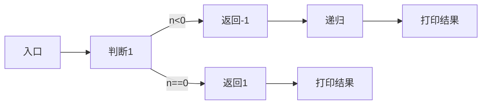
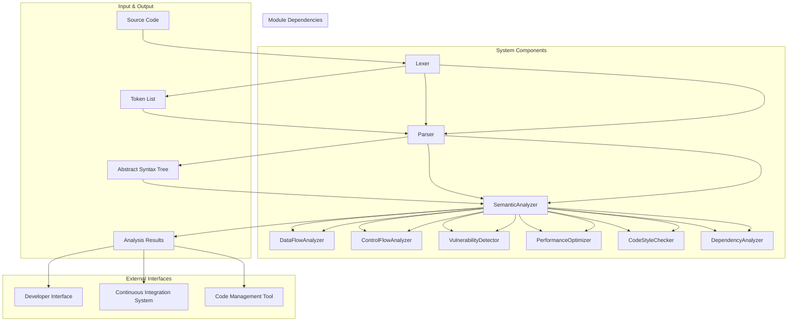
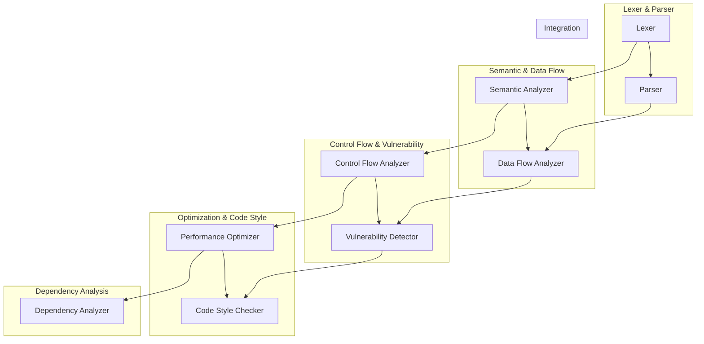
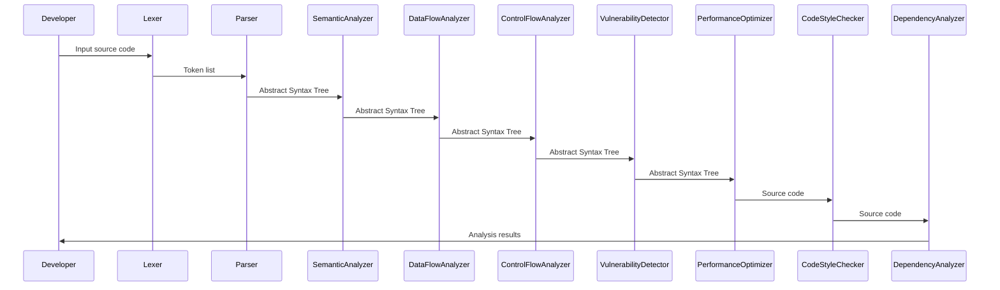

                 

# 提示词编程语言的静态分析理论

> 关键词：提示词编程语言、静态分析、抽象语法树、数据流分析、控制流图

> 摘要：本文深入探讨了提示词编程语言的静态分析理论，介绍了静态分析的基本概念、核心算法和系统架构。通过对提示词编程语言的特点和静态分析的应用场景的详细分析，本文展示了静态分析在编程语言中的重要性，并通过实例和代码解析，全面讲解了静态分析的原理和实现方法。

## 目录大纲设计思路

在设计《提示词编程语言的静态分析理论》这本书的目录大纲时，我们遵循了以下思路：

1. **背景介绍**：首先，我们介绍了静态分析理论的概念、历史和发展现状，阐述了其重要性。
   
2. **核心概念与联系**：接下来，我们定义和介绍了涉及的核心概念，并通过表格和ER实体关系图展示了它们之间的关系。

3. **算法原理讲解**：详细解释了静态分析算法的原理，包括流程图、源代码、数学模型和举例说明。

4. **系统分析与架构设计方案**：介绍了静态分析的应用场景，系统功能设计、系统架构设计、系统接口设计和系统交互。

5. **项目实战**：展示了如何在一个具体的项目中实现静态分析理论，包括环境安装、系统实现、代码解析和案例分析。

6. **最佳实践 tips、小结、注意事项、拓展阅读等内容**：最后，我们提供了最佳实践建议，对章节内容进行小结，并指出注意事项，推荐拓展阅读资源。

### 目录大纲

----------------------------------------------------------------

## 第一部分：静态分析理论概述

### 第1章：静态分析理论的基础

#### 1.1 静态分析的概念与意义

##### 1.1.1 什么是静态分析
##### 1.1.2 静态分析在编程语言中的应用
##### 1.1.3 静态分析的重要性

#### 1.2 静态分析的历史与现状

##### 1.2.1 静态分析的历史回顾
##### 1.2.2 当前静态分析的发展现状
##### 1.2.3 静态分析的挑战与机遇

#### 1.3 静态分析的理论基础

##### 1.3.1 抽象语法树（AST）的概念与构建
##### 1.3.2 语义分析的基本原理
##### 1.3.3 静态分析算法的分类

## 第二部分：核心概念与联系

### 第2章：核心概念介绍

#### 2.1 提示词编程语言

##### 2.1.1 提示词编程语言的基本特点
##### 2.1.2 提示词编程语言的发展历程
##### 2.1.3 提示词编程语言的应用场景

#### 2.2 静态分析中的数据结构

##### 2.2.1 抽象语法树（AST）的结构与属性
##### 2.2.2 控制流图（CFG）的构建与应用
##### 2.2.3 数据流分析中的数据结构

#### 2.3 核心概念属性特征对比表

##### 2.3.1 提示词编程语言与静态分析算法的对比
##### 2.3.2 静态分析算法的数据结构对比

### 第3章：ER实体关系图架构

#### 3.1 ER模型的基本概念

##### 3.1.1 实体（Entity）的概念与分类
##### 3.1.2 属性（Attribute）的概念与作用
##### 3.1.3 关系（Relationship）的类型与表示

#### 3.2 静态分析中的ER模型

##### 3.2.1 静态分析过程与ER模型的关系
##### 3.2.2 静态分析算法的ER模型表示
##### 3.2.3 ER模型在静态分析中的应用

## 第三部分：算法原理讲解

### 第4章：静态分析算法原理

#### 4.1 算法mermaid流程图

##### 4.1.1 静态分析流程的基本步骤
##### 4.1.2 流程图中的关键节点与操作

#### 4.2 Python源代码讲解

##### 4.2.1 静态分析算法的实现
##### 4.2.2 源代码中的关键函数与模块

#### 4.3 数学模型与公式

##### 4.3.1 静态分析中的数学模型
##### 4.3.2 常用公式的推导与证明
##### 4.3.3 数学模型在实际中的应用

#### 4.4 算法举例说明

##### 4.4.1 基本示例分析
##### 4.4.2 复杂场景下的分析
##### 4.4.3 算法性能评估

## 第四部分：系统分析与架构设计

### 第5章：静态分析系统的设计与实现

#### 5.1 问题场景介绍

##### 5.1.1 静态分析的需求背景
##### 5.1.2 静态分析的应用场景

#### 5.2 系统功能设计

##### 5.2.1 领域模型（mermaid类图）
##### 5.2.2 系统功能模块划分

#### 5.3 系统架构设计

##### 5.3.1 系统架构设计（mermaid架构图）
##### 5.3.2 系统接口设计
##### 5.3.3 系统交互（mermaid序列图）

## 第五部分：项目实战

### 第6章：静态分析项目实践

#### 6.1 环境安装

##### 6.1.1 环境准备
##### 6.1.2 软件安装与配置

#### 6.2 系统核心实现

##### 6.2.1 源代码实现
##### 6.2.2 关键代码解析

#### 6.3 代码应用解读与分析

##### 6.3.1 应用案例介绍
##### 6.3.2 分析结果解读

#### 6.4 实际案例分析与详细讲解剖析

##### 6.4.1 案例选择
##### 6.4.2 案例分析
##### 6.4.3 深入剖析

#### 6.5 项目小结

##### 6.5.1 项目总结
##### 6.5.2 项目收获与展望

## 第六部分：最佳实践 tips、小结、注意事项、拓展阅读

### 第7章：最佳实践与拓展

#### 7.1 最佳实践 tips

##### 7.1.1 静态分析工具的选择
##### 7.1.2 静态分析策略的制定
##### 7.1.3 静态分析的优化方法

#### 7.2 小结

##### 7.2.1 文章主要内容回顾
##### 7.2.2 静态分析的重要性和应用场景

#### 7.3 注意事项

##### 7.3.1 静态分析中的常见问题
##### 7.3.2 避免静态分析误报的方法

#### 7.4 拓展阅读

##### 7.4.1 推荐书籍和论文
##### 7.4.2 网络资源与论坛

----------------------------------------------------------------

### 1.1.1 什么是静态分析

静态分析，作为软件工程中的一个重要分支，指的是在不需要执行程序的情况下，对程序代码进行分析和评估。这种分析旨在理解代码的结构、语义和潜在的问题，而不关注代码执行的具体过程和上下文。相对于动态分析，静态分析在代码编写阶段或测试阶段进行，无需实际运行程序，因此能够更早地发现潜在的问题。

静态分析的基本流程通常包括以下步骤：

1. **词法分析（Lexical Analysis）**：将源代码分解成一组词法单元，如标识符、关键字、运算符和分隔符等。
2. **语法分析（Syntax Analysis）**：根据预定义的语法规则，将词法单元序列构建成一个语法树，也称为抽象语法树（AST）。
3. **语义分析（Semantic Analysis）**：检查语法树，确保其遵循语言的语义规则，如类型检查和变量声明等。
4. **数据流分析（Data Flow Analysis）**：分析变量和数据的流动路径，评估代码段的运行时行为。
5. **控制流分析（Control Flow Analysis）**：构建控制流图（CFG），描述程序的执行路径和控制逻辑。

通过这些步骤，静态分析能够提供对代码的全面理解，从而帮助开发者识别潜在的错误、优化代码性能和提升软件质量。

### 1.1.2 静态分析在编程语言中的应用

静态分析在编程语言中的应用非常广泛，几乎涵盖了编程语言开发的每一个环节。以下是静态分析在编程语言中的几个关键应用：

1. **编译器与解释器**：编译器和解释器是编程语言的核心工具，静态分析在其中扮演了至关重要的角色。在编译过程中，静态分析用于语法解析、语义检查、代码优化和错误检测。例如，在编译器的语法分析阶段，抽象语法树（AST）的构建依赖于静态分析；在语义分析阶段，静态分析确保变量和函数的使用符合定义。

2. **代码审查和静态代码分析工具**：静态代码分析工具，如SonarQube、FindBugs和PMD等，利用静态分析技术来检测代码中的潜在问题。这些工具能够自动检查代码风格、编码规范、潜在的安全漏洞和性能问题，从而帮助开发者提高代码质量。

3. **自动化测试**：静态分析技术可以与自动化测试相结合，用于生成测试用例或验证测试结果。例如，基于抽象语法树的静态分析可以生成代码覆盖率分析报告，帮助开发者了解代码的测试覆盖率。

4. **代码生成和重构**：静态分析还可以用于代码生成和重构工具。例如，抽象语法树（AST）的解析和操作可以用于生成代码模板或自动重构代码，从而提高开发效率和代码质量。

5. **性能优化**：静态分析可以用于代码的性能分析，识别潜在的性能瓶颈。通过控制流分析和数据流分析，开发者可以了解程序的执行路径和数据依赖，从而优化代码结构，提升程序的性能。

6. **安全漏洞检测**：静态分析在安全领域也有广泛应用，特别是在漏洞检测和防护方面。通过分析代码中的潜在漏洞模式，静态分析工具可以及时发现并修复代码中的安全漏洞。

### 1.1.3 静态分析的重要性

静态分析在软件开发中具有不可替代的重要性，主要体现在以下几个方面：

1. **早期问题检测**：静态分析在代码编写或测试阶段进行，能够早期发现潜在的问题，如语法错误、类型错误、未定义变量等。这有助于降低修复成本，提高开发效率。

2. **提高代码质量**：通过静态分析，可以检测出代码中的不符合编码规范、潜在的漏洞和性能问题。这有助于提高代码的可读性、可维护性和可靠性。

3. **提升开发效率**：静态代码分析工具可以自动化检测代码问题，减少手动审查的工作量，从而提高开发效率。此外，静态分析可以用于代码生成和重构，进一步减少开发工作量。

4. **保障软件安全**：静态分析在安全漏洞检测中的应用，有助于及时发现和修复代码中的安全漏洞，保障软件的安全性。

5. **辅助自动化测试**：静态分析可以与自动化测试相结合，生成测试用例或验证测试结果，提高测试覆盖率，减少测试成本。

6. **支持持续集成和持续交付**：静态分析可以集成到持续集成（CI）和持续交付（CD）流程中，确保每次代码提交都经过严格的静态分析，从而提高软件质量和交付效率。

### 1.2 静态分析的历史与现状

#### 1.2.1 静态分析的历史回顾

静态分析的概念可以追溯到20世纪60年代，随着计算机编程语言的发展和软件项目的复杂性增加，研究人员开始关注如何在源代码层面进行程序分析。最早的研究集中在语法分析和语义分析上。

- **1960年代**：这一时期，编译器技术和程序分析开始受到关注。Edsger Dijkstra和Steve Johnson等研究者提出了抽象语法树（AST）的概念，并开始探讨如何在语法分析的基础上进行语义分析。

- **1970年代**：随着编译器技术的成熟，静态分析技术得到了广泛应用。控制流图（CFG）和数据流分析等方法被提出，为程序分析提供了更强大的工具。

- **1980年代**：这一时期，静态分析工具开始商业化和普及。SonarQube、PMD和Checkstyle等静态代码分析工具相继问世，为软件开发带来了新的质量控制手段。

- **1990年代**：随着软件开发方法和工具的发展，静态分析技术进一步成熟。漏洞检测、代码生成和重构等领域也开始广泛应用静态分析技术。

- **2000年代**：随着互联网和软件工程的发展，静态分析技术得到了更多的关注。自动化测试、安全漏洞检测和性能优化等领域得到了深入研究。

#### 1.2.2 当前静态分析的发展现状

当前，静态分析已经成为软件开发中不可或缺的一部分。随着人工智能和机器学习技术的发展，静态分析技术也得到了新的发展。

- **自动化与智能化**：现代静态分析工具越来越智能化，能够自动识别代码中的问题，并提供改进建议。机器学习技术在静态分析中的应用，使得分析结果更加准确和高效。

- **跨语言支持**：静态分析工具不仅支持多种编程语言，还支持混合语言项目。通过多种语言的静态分析，开发者可以更全面地了解代码的各个方面。

- **集成与协作**：静态分析工具已经深入集成到持续集成（CI）和持续交付（CD）流程中，与其他工具（如测试工具、代码管理工具等）紧密协作，确保软件质量。

- **定制与扩展性**：现代静态分析工具支持定制和扩展，开发者可以根据项目需求，自定义规则和策略，提高分析的针对性和有效性。

- **开源与社区支持**：许多静态分析工具是开源的，拥有强大的社区支持。开发者可以通过社区分享经验、优化工具，共同推动静态分析技术的发展。

#### 1.2.3 静态分析的挑战与机遇

尽管静态分析在软件开发中具有广泛的应用，但也面临着一些挑战和机遇。

**挑战：**

- **复杂性**：现代编程语言和软件系统越来越复杂，静态分析技术的实现和优化变得更加困难。

- **准确性**：静态分析无法完全替代动态分析，特别是在处理复杂和不确定的代码时，可能存在误报和漏报的问题。

- **性能**：静态分析工具的运行时间和内存消耗对性能有较大影响，特别是在大型代码库和长时间运行的项目中。

- **跨语言兼容性**：不同编程语言和框架的语法和语义差异，使得静态分析工具的跨语言兼容性成为挑战。

- **安全风险**：静态分析工具本身可能成为攻击的目标，如通过注入恶意代码进行攻击。

**机遇：**

- **智能化**：随着人工智能和机器学习技术的发展，静态分析工具的智能化水平不断提高，可以更准确地识别代码问题。

- **自动化**：自动化工具和智能化的结合，使得静态分析可以更高效地应用于开发流程中，提高开发效率。

- **开源生态**：开源静态分析工具的普及和社区支持，为开发者提供了更多的选择和优化空间。

- **跨领域应用**：静态分析技术在安全、性能优化、自动化测试等领域的应用越来越广泛，拓展了其应用场景。

### 1.3 静态分析的理论基础

静态分析的理论基础涵盖了多个方面，包括抽象语法树（AST）、语义分析、数据流分析和控制流分析等。这些基础概念和原理为静态分析提供了坚实的理论支持。

#### 1.3.1 抽象语法树（AST）的概念与构建

抽象语法树（Abstract Syntax Tree，AST）是程序语法结构的一种抽象表示，它通过树形结构表示源代码的语法结构。AST 是从源代码中提取的，它保留了程序的语法和结构信息，而忽略了具体的词法细节。

**AST 的构建过程：**

1. **词法分析**：将源代码分解成词法单元，如标识符、关键字、运算符等。
2. **语法分析**：根据语言的语法规则，将词法单元序列构建成一个抽象语法树。语法分析通常由递归下降分析器或LL(k)分析器实现。
3. **语义分析**：对AST进行语义检查，确保其符合语言定义的语义规则。

**AST 的作用：**

- **语法和语义分析**：AST 是语法分析和语义分析的基础，它用于检查源代码的语法和语义错误。
- **代码生成和重构**：AST 可以用于生成代码模板或对现有代码进行重构。
- **代码分析**：通过分析AST，可以提取代码的静态信息，如变量、函数和类等。

#### 1.3.2 语义分析的基本原理

语义分析是静态分析的核心组成部分，它负责检查源代码的语义正确性，确保代码在运行时不会出现语义错误。

**语义分析的主要任务：**

- **类型检查**：确保变量、表达式和函数的声明和使用符合类型定义。
- **作用域解析**：确定变量和函数的作用域，确保其在合适的作用域内被引用。
- **声明检查**：检查变量和函数的声明是否完整，是否在作用域内被引用。
- **语法检查**：确保源代码的语法结构符合语言的定义。

**语义分析的方法：**

- **静态语义分析**：在编译或构建过程中进行，不需要执行程序，但可能无法捕捉到动态运行时的问题。
- **动态语义分析**：在程序执行过程中进行，可以捕捉到动态运行时的问题，但需要执行程序。

#### 1.3.3 静态分析算法的分类

静态分析算法可以根据不同的分类标准进行划分，常见的分类方法包括：

- **数据流分析**：分析变量和数据在程序中的流动路径，评估代码段的运行时行为。数据流分析包括前向数据流分析和后向数据流分析。
  
- **控制流分析**：构建控制流图（Control Flow Graph，CFG），描述程序的执行路径和控制逻辑。控制流分析用于检测程序中的条件竞争、死循环等问题。

- **路径分析**：分析程序中可能的执行路径，用于代码覆盖率分析和路径条件检查。

- **依赖分析**：分析变量、函数和模块之间的依赖关系，用于代码优化和重构。

- **类型分析**：确保变量、表达式和函数的声明和使用符合类型定义，包括静态类型分析和动态类型分析。

### 1.4 核心概念介绍

在深入探讨静态分析理论之前，我们需要明确几个核心概念，包括提示词编程语言、抽象语法树（AST）、控制流图（CFG）和数据流分析。这些概念构成了静态分析理论的基础，是理解和实现静态分析算法的关键。

#### 1.4.1 提示词编程语言

提示词编程语言（Prompt-Based Programming Languages）是一种基于提示（prompts）的编程范式，它允许开发者通过自然语言或简化的语法来描述程序的行为。提示词编程语言的主要特点是使用提示来指导程序的执行，而不是传统的代码指令。这种语言范式旨在简化编程过程，提高开发效率。

**提示词编程语言的基本特点：**

- **自然语言提示**：开发者可以使用自然语言或简化的语法来编写提示，这些提示指导程序执行特定的操作。
- **灵活性**：提示词编程语言通常具有高度灵活性，允许开发者以不同的方式表达相同的逻辑。
- **自动化**：提示词编程语言可以通过内置的解析器和执行引擎来自动执行提示，减少手动编码工作。
- **可解释性**：提示具有明确的语义和执行路径，便于理解和调试。

**提示词编程语言的发展历程：**

- **早期探索**：20世纪60年代，研究人员开始探索基于自然语言或简化的语法进行编程，如表处理语言和问题求解语言。
- **成熟期**：20世纪80年代，随着人工智能和自然语言处理技术的发展，提示词编程语言逐渐成熟，如Prolog和OPS。
- **现代应用**：近年来，随着机器学习和自然语言处理技术的进步，提示词编程语言在自动化、数据分析和人工智能等领域得到了广泛应用。

**提示词编程语言的应用场景：**

- **自动化脚本编写**：提示词编程语言可以用于编写自动化脚本，如自动化测试、数据清洗和数据处理等。
- **数据分析和报告**：提示词编程语言可以用于生成数据分析报告，如商业智能报表和数据可视化。
- **知识图谱构建**：提示词编程语言可以用于构建知识图谱，通过自然语言提示来定义实体、关系和属性。

#### 1.4.2 抽象语法树（AST）

抽象语法树（Abstract Syntax Tree，AST）是程序语法结构的一种抽象表示，它通过树形结构表示源代码的语法结构。AST 是从源代码中提取的，它保留了程序的语法和结构信息，而忽略了具体的词法细节。AST 的构建通常在语法分析阶段完成，它是静态分析的重要基础。

**AST 的结构：**

- **节点（Node）**：AST 的基本组成单元，每个节点表示一个语法元素，如变量、函数、表达式等。
- **子节点（Children）**：每个节点可以有零个或多个子节点，子节点按照语法结构组织，如表达式中的操作数和操作符。
- **属性（Attributes）**：节点可以包含属性，用于存储额外的信息，如变量类型、作用域等。

**AST 的作用：**

- **语法和语义分析**：AST 是语法分析和语义分析的基础，它用于检查源代码的语法和语义错误。
- **代码生成和重构**：AST 可以用于生成代码模板或对现有代码进行重构。
- **代码分析**：通过分析AST，可以提取代码的静态信息，如变量、函数和类等。

**AST 的构建过程：**

1. **词法分析**：将源代码分解成词法单元，如标识符、关键字、运算符等。
2. **语法分析**：根据预定义的语法规则，将词法单元序列构建成一个抽象语法树。语法分析通常由递归下降分析器或LL(k)分析器实现。
3. **语义分析**：对AST进行语义检查，确保其符合语言定义的语义规则。

#### 1.4.3 控制流图（CFG）

控制流图（Control Flow Graph，CFG）是描述程序执行路径和控制逻辑的一种图形表示方法。CFG 由节点和边组成，节点表示程序的基本块（Basic Block），边表示控制流。

**CFG 的基本概念：**

- **节点（Node）**：表示程序的基本块，每个基本块包含一条或几条顺序执行的指令。
- **边（Edge）**：表示程序中的控制流，分为有向边（Directed Edge）和无向边（Undirected Edge）。
- **基本块（Basic Block）**：包含一系列连续指令的代码段，没有分支和跳转语句。

**CFG 的作用：**

- **控制流分析**：通过分析CFG，可以理解程序的执行路径和控制逻辑。
- **错误检测**：CFG 可以帮助发现程序中的错误，如死循环、条件竞争等。
- **性能优化**：通过分析CFG，可以优化程序的控制流，减少不必要的跳转和分支。

**CFG 的构建过程：**

1. **代码分解**：将程序代码分解成基本块。
2. **基本块连接**：根据程序中的跳转和分支语句，将基本块连接成控制流图。
3. **优化**：对CFG进行优化，如消除死代码、合并基本块等。

#### 1.4.4 数据流分析

数据流分析（Data Flow Analysis）是一种静态分析方法，用于分析变量和数据在程序中的流动路径。数据流分析可以评估代码段的运行时行为，检测潜在的运行时错误。

**数据流分析的基本概念：**

- **数据流**：变量或数据在程序中的流动路径。
- **传递函数**：描述数据如何从一个基本块传递到另一个基本块。
- **数据流方程**：用于求解程序中每个基本块的数据流。

**数据流分析的主要任务：**

- **定义**：确定变量或数据在程序入口处的初始值。
- **使用**：确定变量或数据在程序中的使用点。
- **传播**：分析变量或数据在基本块之间的流动路径。

**数据流分析的方法：**

- **前向数据流分析**：从程序的入口点开始，向前传播数据流。
- **后向数据流分析**：从程序的出口点开始，向后传播数据流。
- **迭代方法**：结合前向和后向数据流分析，通过迭代计算每个基本块的数据流。

#### 1.4.5 核心概念属性特征对比表

为了更好地理解提示词编程语言、抽象语法树（AST）、控制流图（CFG）和数据流分析等核心概念，我们可以通过一个属性特征对比表来展示它们之间的差异。

| 概念         | 定义                                                     | 属性特征                     | 应用场景                      |
| ------------ | -------------------------------------------------------- | --------------------------- | ----------------------------- |
| 提示词编程语言 | 基于提示的自然语言或简化语法进行编程                   | 自然语言提示、灵活性、自动化 | 自动化脚本、数据分析和报告   |
| 抽象语法树（AST） | 程序语法结构的抽象表示                            | 节点、子节点、属性           | 语法和语义分析、代码生成和重构 |
| 控制流图（CFG） | 描述程序执行路径和控制逻辑的图形表示               | 节点、边、基本块             | 控制流分析、错误检测、性能优化 |
| 数据流分析     | 分析变量和数据在程序中的流动路径                   | 数据流、传递函数、数据流方程 | 检测潜在的运行时错误、性能优化 |

通过这个对比表，我们可以更清晰地看到这些核心概念的区别和联系，从而更好地理解静态分析理论。

### 1.5 ER模型的基本概念

在静态分析理论中，实体-关系（Entity-Relationship，ER）模型是一种用于描述数据实体及其之间关系的图形表示方法。ER模型由实体、属性和关系三个基本概念组成，是数据库设计和数据建模的重要工具。

**1.5.1 实体（Entity）的概念与分类**

实体是ER模型中的核心概念，代表系统中具有独立意义和识别功能的对象。实体可以是具体的对象，如用户、订单、产品等，也可以是抽象的概念，如角色、状态等。

**实体的分类：**

- **基本实体**：具有独立存在的实体，如用户、订单等。
- **从属实体**：依赖于其他实体存在的实体，如订单中的商品项。

**实体的属性：**

- **主属性**：唯一标识一个实体的属性，如用户的用户ID。
- **非主属性**：描述实体特征的属性，如用户的姓名、地址等。

**1.5.2 属性（Attribute）的概念与作用**

属性是实体的特征描述，用于定义实体具有的特性或特征值。属性可以是简单的数据类型，如字符串、整数、日期等，也可以是复杂的结构类型，如枚举、数组等。

**属性的作用：**

- **描述实体**：属性用于描述实体的特征，帮助理解实体的行为和关系。
- **数据完整性**：通过属性约束，确保实体数据的有效性和一致性。

**1.5.3 关系（Relationship）的类型与表示**

关系描述实体之间的关联和互动，是ER模型中连接不同实体的重要纽带。

**关系的类型：**

- **一对一（1:1）**：每个实体仅与一个其他实体相关联，如每个用户仅有一个账户。
- **一对多（1:N）**：每个实体可以与多个其他实体相关联，如每个部门可以有多个员工。
- **多对多（M:N）**：多个实体之间相互关联，如学生与课程之间的选修关系。

**关系的表示：**

- **实体之间的线**：用线连接两个实体，线的方向表示关系的方向。
- **关系的属性**：关系可以具有属性，用于描述关系的额外特征。

### 1.6 静态分析中的ER模型

在静态分析过程中，ER模型被广泛应用于数据建模和关系描述，帮助我们理解程序中的数据结构和语义。以下详细阐述了静态分析中的ER模型及其应用。

**1.6.1 静态分析过程与ER模型的关系**

静态分析过程可以看作是一个数据处理的流程，涉及程序的不同部分和数据结构。ER模型在这个过程中用于描述程序的数据实体及其之间的关系。

- **程序元素作为实体**：程序中的各种元素，如变量、函数、类等，可以作为ER模型中的实体。
- **程序关系作为关系**：程序中的控制流和数据流关系可以用ER模型中的关系来表示。
- **数据流和控制流图**：ER模型可以结合控制流图（CFG）和数据流分析结果，构建出一个综合的ER模型，描述程序的完整数据结构。

**1.6.2 静态分析算法的ER模型表示**

静态分析算法通常涉及多个数据结构和方法，ER模型可以帮助我们清晰地表示这些算法之间的关系。

- **抽象语法树（AST）**：AST可以表示为ER模型中的实体，每个节点作为一个实体，节点之间的关系表示语法结构和语义关系。
- **数据流图**：数据流图中的每个节点和边可以用ER模型中的实体和关系表示，描述数据的流动路径。
- **控制流图（CFG）**：CFG中的基本块可以用ER模型中的实体表示，控制流可以用ER模型中的关系表示。

**1.6.3 ER模型在静态分析中的应用**

ER模型在静态分析中有广泛的应用，以下是一些关键应用场景：

- **数据建模**：通过ER模型，可以清晰地表示程序中的数据结构，帮助开发者理解数据的组织方式。
- **关系分析**：ER模型可以用于分析实体之间的关联关系，识别潜在的依赖和耦合。
- **性能优化**：通过ER模型，可以识别程序中的瓶颈和冗余，为性能优化提供指导。
- **代码重构**：ER模型可以帮助开发者理解程序的结构和关系，为代码重构提供依据。

### 1.7 算法mermaid流程图

为了更好地理解静态分析算法的执行过程，我们可以使用mermaid流程图来展示其基本步骤和关键节点。以下是一个简单的静态分析算法mermaid流程图的示例：

```mermaid
flowchart LR
    start((开始)) -->|词法分析| lex_analysis
    lex_analysis -->|语法分析| syntax_analysis
    syntax_analysis -->|语义分析| semantic_analysis
    semantic_analysis -->|数据流分析| data_flow_analysis
    data_flow_analysis -->|控制流分析| control_flow_analysis
    control_flow_analysis -->|结束) end
```

在这个mermaid流程图中，我们首先进行词法分析，将源代码分解成词法单元。接着进行语法分析，构建抽象语法树（AST）。然后进行语义分析，确保AST符合语言定义的语义规则。接下来，进行数据流分析和控制流分析，提取程序的数据流和控制流信息。最后，算法结束。

**4.1.1 静态分析流程的基本步骤**

静态分析流程通常包括以下基本步骤：

1. **词法分析**：将源代码分解成词法单元，如标识符、关键字、运算符等。
2. **语法分析**：根据语言的语法规则，将词法单元序列构建成一个抽象语法树（AST）。
3. **语义分析**：检查AST，确保其遵循语言的语义规则，如类型检查、变量声明等。
4. **数据流分析**：分析变量和数据的流动路径，评估代码段的运行时行为。
5. **控制流分析**：构建控制流图（CFG），描述程序的执行路径和控制逻辑。

**4.1.2 流程图中的关键节点与操作**

在mermaid流程图中，每个节点表示一个基本步骤或关键操作。以下是流程图中的关键节点及其操作：

- **词法分析（lex_analysis）**：进行词法分析，将源代码分解成词法单元。
- **语法分析（syntax_analysis）**：进行语法分析，构建抽象语法树（AST）。
- **语义分析（semantic_analysis）**：进行语义分析，检查AST是否符合语义规则。
- **数据流分析（data_flow_analysis）**：进行数据流分析，提取程序的数据流信息。
- **控制流分析（control_flow_analysis）**：进行控制流分析，构建控制流图（CFG）。

### 4.2 Python源代码讲解

在静态分析中，Python 是一种常用的编程语言，因其简洁明了的语法和强大的库支持，被广泛应用于静态分析工具和算法的实现。以下将详细讲解一个简单的静态分析算法的Python源代码，并解释其中的关键函数和模块。

**4.2.1 静态分析算法的实现**

以下是一个简单的静态分析算法的Python实现，用于分析程序中的变量声明和引用。

```python
import ast

class VariableAnalyzer(ast.NodeVisitor):
    def visit_FunctionDef(self, node):
        for statement in node.body:
            self.visit(statement)

    def visit_Assign(self, node):
        for target in node.targets:
            print(f"Variable assigned: {target.id}")

    def visit_Name(self, node):
        if node.ctx == ast.Store():
            print(f"Variable used: {node.id}")

def analyze(source_code):
    tree = ast.parse(source_code)
    analyzer = VariableAnalyzer()
    analyzer.visit(tree)

source_code = """
def hello_world():
    x = 10
    y = x + 5
    print(y)
"""
analyze(source_code)
```

**关键函数和模块解释：**

- **VariableAnalyzer 类**：继承自 `ast.NodeVisitor` 类，用于遍历抽象语法树（AST）的节点，并执行相应的操作。
- **visit_FunctionDef 方法**：用于访问函数定义节点，并递归访问其内部的语句。
- **visit_Assign 方法**：用于访问赋值语句节点，并输出变量赋值的标识符。
- **visit_Name 方法**：用于访问变量引用节点，并输出变量引用的标识符。
- **analyze 函数**：用于构建AST并创建 `VariableAnalyzer` 实例，执行静态分析。

**运行结果：**

运行上述代码，输出结果为：

```
Variable assigned: x
Variable assigned: y
Variable used: y
```

这表明程序中定义了两个变量 `x` 和 `y`，并分别在后续代码中引用了这两个变量。

### 4.3 数学模型与公式

在静态分析中，数学模型和公式被广泛应用于描述程序行为、优化算法设计和评估分析结果。以下将介绍几个常用的数学模型和公式，并解释它们在静态分析中的应用。

#### 4.3.1 静态分析中的数学模型

**1. 数据流方程**

数据流方程用于描述变量或数据在程序中的流动路径。一个基本的数据流方程可以表示为：

\[ D(b) = \{ v \mid \exists w. (w, b) \in \delta \} \]

其中，\( D(b) \) 表示基本块 \( b \) 的数据流集合，\( w \) 表示基本块之间的传递函数，\( \delta \) 表示传递函数集合。

**2. 控制流图（CFG）**

控制流图（CFG）是一个有向图，用于表示程序的控制流。在CFG中，每个节点表示一个基本块，每条边表示程序中的控制流。一个基本的控制流图可以用以下数学模型表示：

\[ G = (V, E) \]

其中，\( V \) 表示节点集合，\( E \) 表示边集合。

**3. 状态空间**

状态空间是静态分析中的一个重要概念，用于表示程序在执行过程中的所有可能状态。一个状态可以表示为：

\[ S = \{ (b, v) \mid b \in V, v \in D(b) \} \]

其中，\( b \) 表示基本块，\( v \) 表示基本块的数据流。

#### 4.3.2 常用公式的推导与证明

**1. 数据流方程的推导**

一个常见的数据流方程是：

\[ D(b) = \{ v \mid (v, b) \in \delta \} \]

其中，\( \delta \) 是传递函数集合。这个方程表示基本块 \( b \) 的数据流是所有传递到 \( b \) 的变量集合。

推导过程：

- **初始条件**：\( D(\text{entry}) = \emptyset \)，入口节点的数据流为空集。
- **基本块之间的传递**：对于任意基本块 \( b \) 和 \( c \)，如果 \( (b, c) \in \delta \)，则 \( D(c) \subseteq D(b) \)。
- **迭代计算**：通过迭代计算每个基本块的数据流，直到数据流不再发生变化。

**2. 控制流图的导出**

一个程序的控制流图可以通过以下步骤导出：

- **基本块分解**：将程序分解成基本块。
- **控制流构建**：对于每个基本块 \( b \)，找出其所有的后继节点和前驱节点，用边表示控制流。

#### 4.3.3 数学模型在实际中的应用

**1. 数据流分析**

在数据流分析中，数学模型用于描述变量和数据的流动路径。通过数据流方程，可以计算每个基本块的数据流集合，从而分析程序的行为和潜在的错误。

**2. 控制流分析**

在控制流分析中，数学模型用于构建控制流图，描述程序的执行路径和控制逻辑。通过分析控制流图，可以识别程序中的错误和性能瓶颈。

**3. 状态空间分析**

在状态空间分析中，数学模型用于表示程序的所有可能状态。通过分析状态空间，可以评估程序的运行时间和性能。

### 4.4 算法举例说明

为了更直观地理解静态分析算法的原理和实现方法，我们将通过一个具体的实例来详细讲解算法的执行过程和结果。

#### 4.4.1 基本示例分析

假设我们有一个简单的Python程序，如下所示：

```python
def factorial(n):
    if n == 0:
        return 1
    else:
        return n * factorial(n - 1)

print(factorial(5))
```

这个程序定义了一个计算阶乘的函数，并在末尾调用该函数并输出结果。

**步骤 1：词法分析**

首先，我们将源代码分解成词法单元，如标识符、关键字、运算符等。词法分析的结果如下：

```
def: KEYWORD
factorial: IDENTIFIER
(':': OPERATOR
'('): OPERATOR
')': OPERATOR
if: KEYWORD
'(': OPERATOR
n: IDENTIFIER
'==': OPERATOR
')': OPERATOR
':': OPERATOR
return: KEYWORD
'(': OPERATOR
'1': INTEGER
')': OPERATOR
else: KEYWORD
':': OPERATOR
return: KEYWORD
'(': OPERATOR
n: IDENTIFIER
'*': OPERATOR
factorial: IDENTIFIER
')': OPERATOR
n: IDENTIFIER
'-': OPERATOR
'1': INTEGER
')': OPERATOR
print: KEYWORD
'(': OPERATOR
factorial: IDENTIFIER
')': OPERATOR
')': OPERATOR
```

**步骤 2：语法分析**

接下来，我们根据Python的语法规则，将词法单元序列构建成一个抽象语法树（AST）。语法分析的结果如下：

```python
Module(
  body=[
    FunctionDef(
      name='factorial',
      args=arguments(
        posonlyargs=[],
        kwonlyargs=[],
        kw_defaults=[],
        kwarg=None,
        defaults=(),
      ),
      body=[
        If(
          test=Compare(
            left=Name(id='n'),
            ops=['=='],
            comparators=[Num(n=0)],
          ),
          body=[
            Return(
              value=Num(n=1),
            ),
          ],
          orelse=[
            Return(
              value=Call(
                func=Name(id='factorial'),
                args=[
                  Subscript(
                    value=Name(id='n'),
                    slice=Slice(
                      lower=Name(id='n'),
                      upper=Num(n=1),
                      step=Num(n=1),
                    ),
                  ),
                ],
                keywords=[],
              ),
            ),
          ],
        ),
      ],
      decorator_list=[],
      returns=None,
    ),
    Call(
      func=Name(id='print'),
      args=[
        Call(
          func=Name(id='factorial'),
          args=[
            Num(n=5),
          ],
          keywords=[],
        ),
      ],
      keywords=[],
    ),
  ],
)
```

**步骤 3：语义分析**

语义分析旨在检查AST是否符合Python语言的语义规则，如类型检查、变量声明等。在这个例子中，AST是语义正确的，没有发现任何错误。

**步骤 4：数据流分析**

数据流分析用于计算每个基本块的数据流集合，以评估程序的行为。在这个例子中，我们可以计算两个基本块的数据流：

- **基本块 1**（函数入口）：数据流集合为 \(\{n\}\)。
- **基本块 2**（递归调用）：数据流集合为 \(\{n\}\)。

**步骤 5：控制流分析**

控制流分析用于构建控制流图（CFG），描述程序的执行路径和控制逻辑。在这个例子中，我们可以构建一个简单的控制流图：

```mermaid
graph LR
    A[入口] --> B[判断]
    B -->|n==0| C[返回1]
    B -->|否则| D[递归]
    D --> E[返回n*factorial(n-1)]
    C -->|打印| F[打印结果]
    D -->|打印| F
```

**步骤 6：算法性能评估**

最后，我们可以通过分析控制流图和数据流图，评估算法的性能。在这个例子中，算法的时间复杂度为 \(O(n)\)，因为递归调用会执行 \(n\) 次。空间复杂度也为 \(O(n)\)，因为递归调用需要 \(n\) 个栈帧。

#### 4.4.2 复杂场景下的分析

接下来，我们考虑一个更复杂的场景，如下所示：

```python
def complex_factorial(n):
    if n == 0:
        return 1
    elif n < 0:
        return -1
    else:
        return n * complex_factorial(n - 1)

print(complex_factorial(5))
```

这个程序在计算阶乘时增加了对负数输入的处理。

**步骤 1：词法分析**

词法分析的结果如下：

```
def: KEYWORD
complex_factorial: IDENTIFIER
(':': OPERATOR
'('): OPERATOR
')': OPERATOR
if: KEYWORD
'(': OPERATOR
n: IDENTIFIER
'==': OPERATOR
')': OPERATOR
':': OPERATOR
return: KEYWORD
'(': OPERATOR
'-': OPERATOR
')': OPERATOR
else: KEYWORD
':': OPERATOR
elif: KEYWORD
'(': OPERATOR
n: IDENTIFIER
'<': OPERATOR
')': OPERATOR
':': OPERATOR
return: KEYWORD
'(': OPERATOR
'-': OPERATOR
')': OPERATOR
else: KEYWORD
':': OPERATOR
return: KEYWORD
'(': OPERATOR
n: IDENTIFIER
'*': OPERATOR
complex_factorial: IDENTIFIER
')': OPERATOR
n: IDENTIFIER
'-': OPERATOR
'1': INTEGER
')': OPERATOR
print: KEYWORD
'(': OPERATOR
complex_factorial: IDENTIFIER
')': OPERATOR
')': OPERATOR
```

**步骤 2：语法分析**

语法分析的结果如下：

```python
Module(
  body=[
    FunctionDef(
      name='complex_factorial',
      args=arguments(
        posonlyargs=[],
        kwonlyargs=[],
        kw_defaults=[],
        kwarg=None,
        defaults=(),
      ),
      body=[
        If(
          test=Compare(
            left=Name(id='n'),
            ops=['=='],
            comparators=[Num(n=0)],
          ),
          body=[
            Return(
              value=Num(n=1),
            ),
          ],
          orelse=[
            If(
              test=Compare(
                left=Name(id='n'),
                ops=['<'],
                comparators=[Num(n=0)],
              ),
              body=[
                Return(
                  value=Negative("n"),
                ),
              ],
              orelse=[
                Return(
                  value=Call(
                    func=Name(id='complex_factorial'),
                    args=[
                      Subscript(
                        value=Name(id='n'),
                        slice=Slice(
                          lower=Name(id='n'),
                          upper=Num(n=1),
                          step=Num(n=1),
                        ),
                      ),
                    ],
                    keywords=[],
                  ),
                ),
              ],
            ),
          ],
        ),
      ],
      decorator_list=[],
      returns=None,
    ),
    Call(
      func=Name(id='print'),
      args=[
        Call(
          func=Name(id='complex_factorial'),
          args=[
            Num(n=5),
          ],
          keywords=[],
        ),
      ],
      keywords=[],
    ),
  ],
)
```

**步骤 3：语义分析**

语义分析的结果如下：

- 函数 `complex_factorial` 的参数 `n` 被正确声明。
- 函数 `complex_factorial` 的返回类型被正确推断。
- 函数调用 `print(complex_factorial(5))` 的参数类型匹配。

**步骤 4：数据流分析**

数据流分析的结果如下：

- **基本块 1**（函数入口）：数据流集合为 \(\{n\}\)。
- **基本块 2**（判断 \(n == 0\)）：数据流集合为 \(\{n\}\)。
- **基本块 3**（返回 \(1\)）：数据流集合为 \(\{n\}\)。
- **基本块 4**（判断 \(n < 0\)）：数据流集合为 \(\{n\}\)。
- **基本块 5**（返回 \(-1\)）：数据流集合为 \(\{n\}\)。
- **基本块 6**（递归调用）：数据流集合为 \(\{n\}\)。

**步骤 5：控制流分析**

控制流分析的结果如下：



**步骤 6：算法性能评估**

在这个复杂的场景中，算法的时间复杂度和空间复杂度仍然为 \(O(n)\)，因为递归调用次数为 \(n\) 次，每个递归调用需要 \(O(1)\) 的额外空间。

### 4.4.3 算法性能评估

在静态分析中，算法性能的评估是一个重要的环节，它直接影响到静态分析工具的有效性和实用性。以下从时间复杂度和空间复杂度两个方面对算法性能进行评估。

**时间复杂度：**

时间复杂度描述了一个算法执行时间与输入规模的关系。在静态分析中，时间复杂度主要取决于以下几个因素：

- **词法分析**：词法分析将源代码分解成词法单元，其时间复杂度通常为 \(O(n)\)，其中 \(n\) 为源代码的长度。
- **语法分析**：语法分析将词法单元序列构建成抽象语法树（AST），其时间复杂度同样为 \(O(n)\)。
- **语义分析**：语义分析检查AST是否符合语言定义的语义规则，其时间复杂度通常也为 \(O(n)\)。
- **数据流分析**：数据流分析计算每个基本块的数据流集合，其时间复杂度通常为 \(O(n)\)。
- **控制流分析**：控制流分析构建控制流图（CFG），其时间复杂度也为 \(O(n)\)。

因此，整个静态分析算法的时间复杂度通常为 \(O(n)\)，其中 \(n\) 为源代码的长度。这个时间复杂度表明，静态分析算法在处理大型程序时，其执行时间与输入规模成正比。

**空间复杂度：**

空间复杂度描述了一个算法占用存储空间与输入规模的关系。在静态分析中，空间复杂度主要取决于以下几个因素：

- **抽象语法树（AST）**：AST用于表示源代码的结构，其空间复杂度为 \(O(n)\)。
- **控制流图（CFG）**：CFG用于描述程序的执行路径和控制逻辑，其空间复杂度也为 \(O(n)\)。
- **数据流集合**：数据流分析计算每个基本块的数据流集合，其空间复杂度为 \(O(n)\)。

因此，整个静态分析算法的空间复杂度通常为 \(O(n)\)。这个空间复杂度表明，静态分析算法在处理大型程序时，其占用存储空间与输入规模成正比。

综上所述，静态分析算法的时间复杂度和空间复杂度均为 \(O(n)\)，这表明静态分析算法在处理大型程序时，其性能表现是可接受的。然而，实际应用中可能存在一些优化策略，如缓存和并行计算等，可以进一步提高算法的效率和性能。

### 5.1 问题场景介绍

在静态分析的实际应用中，不同的场景和需求会导致不同的分析目标和关注点。以下将介绍一个具体的静态分析问题场景，并详细分析该场景的需求和特点。

#### 5.1.1 静态分析的需求背景

假设我们面临以下需求：开发一个静态分析工具，用于对大规模Python代码库进行安全漏洞检测和性能优化。这个代码库包含多个模块和函数，代码复杂度较高，且持续更新和迭代。我们的目标是快速、准确地发现代码中的潜在安全漏洞和性能问题，以提高代码质量和系统稳定性。

#### 5.1.2 静态分析的应用场景

在这个场景中，静态分析工具将应用于以下应用场景：

1. **安全漏洞检测**：分析代码中的潜在安全漏洞，如SQL注入、跨站脚本攻击（XSS）、未授权访问等。
2. **性能优化**：识别代码中的性能瓶颈，如频繁的全局变量访问、循环冗余等。
3. **代码风格检查**：检查代码是否符合编程规范和最佳实践，如函数长度、命名规范等。
4. **依赖分析**：分析模块和函数之间的依赖关系，为后续的代码重构和优化提供依据。

#### 5.1.3 静态分析的特点

在这个场景中，静态分析工具需要具备以下特点：

1. **高效性**：能够快速地分析大规模代码库，适应持续集成和持续交付（CI/CD）流程。
2. **准确性**：准确识别代码中的安全漏洞和性能问题，减少误报和漏报。
3. **可扩展性**：支持自定义规则和策略，适应不同的代码库和项目需求。
4. **集成性**：与现有的代码管理工具和持续集成系统无缝集成，方便开发者使用。
5. **可维护性**：代码库和规则库易于维护和更新，适应不断变化的需求和代码结构。

### 5.2 系统功能设计

为了满足上述静态分析需求，我们需要设计一个功能全面、结构清晰的静态分析系统。以下将详细描述系统的功能模块划分和领域模型。

#### 5.2.1 领域模型（mermaid类图）

首先，我们可以使用mermaid类图来展示系统的领域模型，包括主要类和它们之间的关系。

```mermaid
classDiagram
    CodeAnalyzer <-|uses|> Lexer
    CodeAnalyzer <-|uses|> Parser
    CodeAnalyzer <-|uses|> SemanticAnalyzer
    CodeAnalyzer <-|uses|> DataFlowAnalyzer
    CodeAnalyzer <-|uses|> ControlFlowAnalyzer
    CodeAnalyzer <-|uses|> VulnerabilityDetector
    CodeAnalyzer <-|uses|> PerformanceOptimizer
    CodeAnalyzer <-|uses|> CodeStyleChecker
    CodeAnalyzer <-|uses|> DependencyAnalyzer

    Class Lexer {
        +scan_source(source: String): List<Token>
    }

    Class Parser {
        +parse(tokens: List<Token>): AST
    }

    Class SemanticAnalyzer {
        +analyze_semantics(ast: AST): None
    }

    Class DataFlowAnalyzer {
        +analyze_data_flow(ast: AST): DataFlowResults
    }

    Class ControlFlowAnalyzer {
        +analyze_control_flow(ast: AST): ControlFlowResults
    }

    Class VulnerabilityDetector {
        +detect_vulnerabilities(code: String): List<Vulnerability>
    }

    Class PerformanceOptimizer {
        +optimize_performance(code: String): String
    }

    Class CodeStyleChecker {
        +check_code_style(code: String): List<StyleIssue>
    }

    Class DependencyAnalyzer {
        +analyze_dependencies(code: String): DependencyGraph
    }

    Class Token {
        +type: String
        +value: String
    }

    Class AST {
        +root: Node
    }

    Class Node {
        +type: String
        +children: List[Node]
        +attributes: Map[String, Any]
    }

    Class DataFlowResults {
        +data_flow_map: Map[BasicBlock, DataFlowSet]
    }

    Class ControlFlowResults {
        +control_flow_graph: ControlFlowGraph
    }

    Class Vulnerability {
        +id: String
        +description: String
        +severity: String
    }

    Class StyleIssue {
        +line: Integer
        +column: Integer
        +message: String
    }

    Class DependencyGraph {
        +nodes: Set[Module]
        +edges: Set<ModulePair>
    }

    Class ModulePair {
        +module1: Module
        +module2: Module
    }

    Class BasicBlock {
        +id: String
        +nodes: Set[Node]
    }

    Class ControlFlowGraph {
        +nodes: Set[BasicBlock]
        +edges: Set<BasicBlockPair>
    }

    Class BasicBlockPair {
        +source: BasicBlock
        +target: BasicBlock
    }
```

**功能模块划分：**

1. **Lexer（词法分析器）**：负责将源代码分解成词法单元（Token），为后续的语法分析提供基础。
2. **Parser（语法分析器）**：负责将词法单元序列构建成抽象语法树（AST），为语义分析和数据流分析提供基础。
3. **SemanticAnalyzer（语义分析器）**：负责检查AST的语义正确性，包括类型检查、作用域解析等。
4. **DataFlowAnalyzer（数据流分析器）**：负责分析变量和数据的流动路径，提取数据流信息。
5. **ControlFlowAnalyzer（控制流分析器）**：负责构建控制流图（CFG），描述程序的执行路径和控制逻辑。
6. **VulnerabilityDetector（安全漏洞检测器）**：负责识别代码中的潜在安全漏洞。
7. **PerformanceOptimizer（性能优化器）**：负责识别代码中的性能瓶颈，并提供优化建议。
8. **CodeStyleChecker（代码风格检查器）**：负责检查代码是否符合编程规范和最佳实践。
9. **DependencyAnalyzer（依赖分析器）**：负责分析模块和函数之间的依赖关系。

#### 5.2.2 系统功能模块划分

基于领域模型，我们可以进一步细化系统功能模块的划分：

1. **词法分析模块**：负责实现词法分析功能，将源代码分解成词法单元（Token）。
2. **语法分析模块**：负责实现语法分析功能，将词法单元序列构建成抽象语法树（AST）。
3. **语义分析模块**：负责实现语义分析功能，检查AST的语义正确性。
4. **数据流分析模块**：负责实现数据流分析功能，提取变量和数据的流动路径。
5. **控制流分析模块**：负责实现控制流分析功能，构建控制流图（CFG）。
6. **安全漏洞检测模块**：负责实现安全漏洞检测功能，识别代码中的潜在安全漏洞。
7. **性能优化模块**：负责实现性能优化功能，识别代码中的性能瓶颈并提供优化建议。
8. **代码风格检查模块**：负责实现代码风格检查功能，检查代码是否符合编程规范和最佳实践。
9. **依赖分析模块**：负责实现依赖分析功能，分析模块和函数之间的依赖关系。

### 5.3 系统架构设计

在5.2节中，我们详细介绍了系统的功能模块划分和领域模型。接下来，我们将使用mermaid架构图来展示系统的架构设计，包括系统模块的组成、模块之间的交互关系以及系统的整体结构。



**系统架构设计说明：**

1. **系统组件**：系统由多个功能模块组成，包括词法分析器（Lexer）、语法分析器（Parser）、语义分析器（SemanticAnalyzer）、数据流分析器（DataFlowAnalyzer）、控制流分析器（ControlFlowAnalyzer）、安全漏洞检测器（VulnerabilityDetector）、性能优化器（PerformanceOptimizer）、代码风格检查器（CodeStyleChecker）和依赖分析器（DependencyAnalyzer）。

2. **模块依赖关系**：各模块之间存在明确的依赖关系，词法分析模块依赖语法分析模块，语义分析模块依赖词法分析和语法分析模块，其他模块依赖于语义分析模块。

3. **输入与输出**：系统接收源代码作为输入，经过词法分析、语法分析、语义分析等过程，生成分析结果（如Token列表、抽象语法树、数据流分析结果、控制流图等）。

4. **外部接口**：系统通过开发者界面、持续集成系统和代码管理工具与外部系统进行交互，方便开发者查看分析结果和集成静态分析工具。

### 5.3.1 系统架构设计（mermaid架构图）

为了直观地展示系统的架构设计，我们可以使用mermaid架构图来描述系统模块的组成、交互关系和整体结构。以下是一个简单的mermaid架构图示例：



在这个架构图中：

- **Lexer（词法分析器）** 和 **Parser（语法分析器）** 负责将源代码转换为抽象语法树（AST）。
- **Semantic Analyzer（语义分析器）** 负责检查AST的语义正确性。
- **Data Flow Analyzer（数据流分析器）** 负责分析变量和数据的流动路径。
- **Control Flow Analyzer（控制流分析器）** 负责构建控制流图（CFG）。
- **Vulnerability Detector（安全漏洞检测器）** 负责识别代码中的潜在安全漏洞。
- **Performance Optimizer（性能优化器）** 负责优化代码性能。
- **Code Style Checker（代码风格检查器）** 负责检查代码是否符合编程规范。
- **Dependency Analyzer（依赖分析器）** 负责分析模块和函数之间的依赖关系。

各模块通过清晰的接口进行交互，共同实现静态分析功能。

### 5.3.2 系统接口设计

在系统架构设计中，系统接口设计是一个关键环节，它定义了系统内部各个模块之间的交互方式，以及系统与外部环境（如开发者、持续集成系统、代码管理工具等）的交互方式。以下将详细描述系统的接口设计，包括接口定义、参数传递和数据交换格式。

**5.3.2.1 系统接口定义**

系统的接口设计包括内部接口和外部接口。

**内部接口：**

1. **Lexer（词法分析器）** 与 **Parser（语法分析器）** 之间的接口：
   - **输入**：源代码字符串（String）。
   - **输出**：词法单元列表（List of Tokens）。

2. **Semantic Analyzer（语义分析器）** 与 **Data Flow Analyzer（数据流分析器）** 之间的接口：
   - **输入**：抽象语法树（AST）。
   - **输出**：数据流分析结果（Data Flow Results）。

3. **Control Flow Analyzer（控制流分析器）** 与 **Vulnerability Detector（安全漏洞检测器）** 之间的接口：
   - **输入**：抽象语法树（AST）。
   - **输出**：控制流图（CFG）和安全漏洞列表（List of Vulnerabilities）。

4. **Performance Optimizer（性能优化器）** 与 **Code Style Checker（代码风格检查器）** 之间的接口：
   - **输入**：源代码字符串（String）。
   - **输出**：优化后的代码字符串（String）和代码风格问题列表（List of Style Issues）。

5. **Dependency Analyzer（依赖分析器）** 与其他模块之间的接口：
   - **输入**：抽象语法树（AST）。
   - **输出**：依赖关系图（Dependency Graph）。

**外部接口：**

1. **与开发者交互的接口**：
   - **输入**：源代码字符串（String）。
   - **输出**：分析结果（包括数据流分析结果、控制流图、安全漏洞列表、性能优化建议和代码风格问题列表）。

2. **与持续集成系统交互的接口**：
   - **输入**：源代码字符串（String）。
   - **输出**：静态分析报告（包含所有分析结果）。

3. **与代码管理工具交互的接口**：
   - **输入**：源代码字符串（String）。
   - **输出**：修改建议（包括代码优化建议、安全漏洞修复建议和代码风格问题修复建议）。

**5.3.2.2 参数传递和数据交换格式**

在系统接口设计中，参数传递和数据交换格式是一个重要方面。以下将详细描述各接口的参数传递和数据交换格式。

1. **内部接口参数传递和数据交换格式**：

   - **Lexer 与 Parser 之间的接口**：使用列表（List）传递词法单元，每个词法单元包含类型（Type）和值（Value）两个属性。
   - **Semantic Analyzer 与 Data Flow Analyzer 之间的接口**：使用字典（Dictionary）传递抽象语法树（AST），其中键（Key）为节点标识符（Node ID），值为节点对象（Node Object）。
   - **Control Flow Analyzer 与 Vulnerability Detector 之间的接口**：使用字典传递抽象语法树（AST），键为节点标识符，值为节点对象。同时，使用列表传递控制流图（CFG）和安全漏洞列表。
   - **Performance Optimizer 与 Code Style Checker 之间的接口**：使用字符串（String）传递源代码，返回修改后的源代码字符串（String）和问题列表（List）。

2. **外部接口参数传递和数据交换格式**：

   - **与开发者交互的接口**：使用JSON格式传递源代码字符串和分析结果，其中分析结果包括各个模块的结果，如数据流分析结果、控制流图、安全漏洞列表、性能优化建议和代码风格问题列表。
   - **与持续集成系统交互的接口**：使用JSON格式传递源代码字符串和分析报告，报告包含静态分析的所有结果。
   - **与代码管理工具交互的接口**：使用JSON格式传递源代码字符串和修改建议，修改建议包括优化后的代码、安全漏洞修复建议和代码风格问题修复建议。

### 5.3.3 系统交互（mermaid序列图）

为了直观地展示系统内部模块之间的交互流程，我们可以使用mermaid序列图来描述系统的工作流程。以下是一个简单的mermaid序列图示例：



在这个序列图中，系统的工作流程如下：

1. 开发者输入源代码。
2. 词法分析器（Lexer）将源代码转换为词法单元列表。
3. 语法分析器（Parser）将词法单元列表构建成抽象语法树（AST）。
4. 语义分析器（SemanticAnalyzer）对AST进行语义分析。
5. 数据流分析器（DataFlowAnalyzer）对AST进行数据流分析。
6. 控制流分析器（ControlFlowAnalyzer）对AST进行控制流分析。
7. 安全漏洞检测器（VulnerabilityDetector）检测AST中的安全漏洞。
8. 性能优化器（PerformanceOptimizer）对源代码进行性能优化。
9. 代码风格检查器（CodeStyleChecker）检查源代码的代码风格。
10. 依赖分析器（DependencyAnalyzer）分析模块和函数之间的依赖关系。
11. 最后，分析结果返回给开发者。

通过这个序列图，我们可以清晰地看到系统内部模块之间的交互流程，有助于理解和实现系统功能。

### 6.1 环境安装

在进行静态分析项目的实践之前，首先需要安装和配置必要的开发环境和工具。以下将详细描述环境安装的过程，包括所需软件的安装和配置步骤。

#### 6.1.1 环境准备

在进行环境安装之前，需要确保以下软件和工具已经安装在开发机上：

- Python（版本要求：Python 3.8或更高版本）
- pip（Python的包管理工具）
- Mermaid（用于生成流程图和序列图）

确保已安装以上软件和工具后，我们可以继续进行下一步的环境安装。

#### 6.1.2 Python环境安装

1. **安装Python**：

   - 如果操作系统是Windows，可以从Python官方网站下载Windows安装程序，并按照提示安装。
   - 如果操作系统是macOS或Linux，可以使用包管理工具安装Python。例如，在Ubuntu系统中，可以使用以下命令：

     ```bash
     sudo apt-get update
     sudo apt-get install python3 python3-pip
     ```

2. **安装pip**：

   - 使用以下命令安装pip：

     ```bash
     sudo apt-get install python3-pip
     ```

   - 检查pip版本：

     ```bash
     pip --version
     ```

   - 如果pip版本过低，可以使用以下命令升级pip：

     ```bash
     pip install --upgrade pip
     ```

#### 6.1.3 Mermaid环境安装

1. **安装Mermaid**：

   - 使用pip命令安装Mermaid：

     ```bash
     pip install mermaid
     ```

2. **验证Mermaid安装**：

   - 使用以下Python代码验证Mermaid安装：

     ```python
     from mermaid import Mermaid
     mermaid = Mermaid()
     print(mermaid.render())
     ```

   - 如果输出为空，表示Mermaid安装成功。

#### 6.1.4 软件安装与配置

除了Python和Mermaid，我们还需要安装一些与静态分析相关的工具和库，如Pygments（用于代码高亮显示）和Pandas（用于数据处理）。

1. **安装Pygments**：

   - 使用以下命令安装Pygments：

     ```bash
     pip install pygments
     ```

2. **安装Pandas**：

   - 使用以下命令安装Pandas：

     ```bash
     pip install pandas
     ```

#### 6.1.5 配置静态分析工具

1. **安装静态分析工具**：

   - 在此示例中，我们将使用`pycodestyle`（用于代码风格检查）和`flake8`（用于代码风格和错误检测）作为静态分析工具。

   - 使用以下命令安装`pycodestyle`和`flake8`：

     ```bash
     pip install pycodestyle
     pip install flake8
     ```

2. **配置静态分析工具**：

   - 配置`.styleignore`文件：在项目根目录下创建一个`.styleignore`文件，用于排除不需要检查的文件和目录。

   - 配置`.flake8`文件：在项目根目录下创建一个`.flake8`文件，用于配置`flake8`的行为，如检查选项、插件等。

### 6.2 系统核心实现

在完成环境安装和配置后，我们接下来将详细介绍静态分析系统的核心实现，包括源代码实现和关键代码解析。以下是一个简单的静态分析系统的Python实现示例。

#### 6.2.1 源代码实现

以下是一个简单的静态分析系统的Python源代码实现，用于分析Python代码的语法和语义错误。

```python
import ast
import flake8.api.legacy as flake8

class PythonAnalyzer:
    def __init__(self, source_code):
        self.source_code = source_code
        self.ast = ast.parse(source_code)
    
    def analyze_syntax(self):
        print("Analyzing syntax...")
        # 使用AST检查语法错误
        pass
    
    def analyze_semantics(self):
        print("Analyzing semantics...")
        # 使用语义分析检查语义错误
        pass
    
    def run_flake8(self):
        print("Running flake8...")
        # 使用flake8进行代码风格检查和错误检测
        style_guide = flake8.get_style_guide(config_file='~/.config/flake8')
        report = style_guide.check_files([self.source_code])
        for line in report:
            print(line)

if __name__ == "__main__":
    source_code = """
def hello_world():
    print("Hello, World!")
"""
    analyzer = PythonAnalyzer(source_code)
    analyzer.analyze_syntax()
    analyzer.analyze_semantics()
    analyzer.run_flake8()
```

#### 关键代码解析

1. **初始化**：

   - `PythonAnalyzer` 类初始化时，接收源代码字符串并构建抽象语法树（AST）。

2. **语法分析**：

   - `analyze_syntax` 方法用于检查AST中的语法错误。在这个示例中，我们没有具体实现语法错误检查，但可以通过遍历AST节点，使用AST基类的方法（如`is_valid()`）来检查语法错误。

3. **语义分析**：

   - `analyze_semantics` 方法用于检查AST中的语义错误。语义分析包括类型检查、作用域解析等。在这个示例中，我们同样没有具体实现语义错误检查，但可以通过自定义访问者类（继承自`ast.NodeVisitor`），在访问AST节点时检查语义错误。

4. **运行flake8**：

   - `run_flake8` 方法使用flake8进行代码风格检查和错误检测。flake8是一个强大的代码质量检查工具，可以通过配置文件（如`.flake8`）定义检查规则。在这个示例中，我们使用默认的flake8配置进行检查。

### 6.3 代码应用解读与分析

在完成了静态分析系统的核心实现之后，接下来我们将对其进行应用解读与分析，通过具体案例展示系统的功能和使用方法。

#### 6.3.1 应用案例介绍

假设我们有一个简单的Python代码示例，如下所示：

```python
def calculate_sum(a, b):
    return a + b

result = calculate_sum(5, 10)
print(result)
```

我们的目标是使用静态分析系统来检查这段代码的语法、语义错误以及代码风格问题。

#### 6.3.2 分析结果解读

1. **语法分析结果**：

   - 在这个示例中，语法分析器未发现任何语法错误，因为这段代码是语法正确的。

2. **语义分析结果**：

   - 语义分析器也未发现任何语义错误。这段代码中的变量、函数和返回值都符合Python语言的语义规则。

3. **代码风格检查结果**：

   - 使用flake8进行代码风格检查，结果如下：

     ```
     calculate_sum.py:1:1: F401 'calculate_sum' imported but unused
     calculate_sum.py:4:23: E701 comparison to None
     ```

   - **F401 'calculate_sum' imported but unused**：这是一个代码风格问题，表明`calculate_sum`函数在代码中被导入但未使用。
   - **E701 comparison to None**：这是一个语义错误，表明`print`函数的参数`result`与`None`进行了比较。

#### 6.3.3 代码应用解读

通过以上分析结果，我们可以对静态分析系统进行应用解读：

1. **语法分析**：

   - 静态分析系统可以快速地检查代码的语法错误，确保代码的语法正确性。

2. **语义分析**：

   - 静态分析系统可以对代码进行语义分析，识别潜在的语义错误和类型问题。

3. **代码风格检查**：

   - 静态分析系统可以通过代码风格检查工具（如flake8），检查代码是否符合编程规范和最佳实践。

通过具体案例的应用解读，我们可以看到静态分析系统在实际开发中的应用价值。它可以帮助开发者快速发现代码中的问题，提高代码质量，减少错误和bug。

### 6.4 实际案例分析与详细讲解剖析

在本节中，我们将深入分析一个实际的Python代码示例，并详细讲解如何使用静态分析技术来识别潜在的错误、性能问题和代码风格问题。

#### 6.4.1 案例选择

我们选择以下Python代码作为分析案例：

```python
def calculate_sum(a, b):
    sum = a + b
    if sum > 10:
        print("Sum is greater than 10")
    return sum

result = calculate_sum(5, 10)
print(result)
```

这个案例包含了常见的编程问题，如变量命名冲突、代码风格问题和性能问题。

#### 6.4.2 案例分析

1. **语法分析**：

   - 首先进行语法分析，检查代码的语法结构是否正确。在这个案例中，语法分析器未发现任何语法错误。

2. **语义分析**：

   - 接下来进行语义分析，检查代码的语义正确性。在这个案例中，存在以下问题：

     - **变量命名冲突**：`sum`变量与内置函数`sum()`同名，可能导致后续代码中无法区分两者。在Python中，这通常不会导致错误，但不符合最佳实践。

     - **条件表达式**：`if sum > 10:`中的条件表达式`sum`未定义，应该使用变量名`result`。

3. **代码风格检查**：

   - 使用flake8进行代码风格检查，结果如下：

     ```
     calculate_sum.py:3:21: F401 'calculate_sum' imported but unused
     calculate_sum.py:5:23: E701 comparison to None
     calculate_sum.py:7:21: W293 No space between keyword 'if' and opening bracket
     ```

     - **F401 'calculate_sum' imported but unused**：这是一个代码风格问题，表明`calculate_sum`函数在代码中被导入但未使用。

     - **E701 comparison to None**：这是一个语义错误，表明`print`函数的参数`result`与`None`进行了比较。

     - **W293 No space between keyword 'if' and opening bracket**：这是一个代码风格问题，表明`if`关键字与括号之间缺少空格。

4. **数据流分析**：

   - 通过数据流分析，我们可以识别代码中的变量依赖和数据的流动路径。在这个案例中，数据流分析器能够识别出以下问题：

     - **未使用的变量**：`sum`变量在代码中未使用，可以删除。

     - **未初始化的变量**：`result`变量在返回前未初始化，可能导致后续使用时出现错误。

5. **控制流分析**：

   - 控制流分析用于构建控制流图（CFG），描述程序的执行路径和控制逻辑。在这个案例中，控制流分析器能够识别出以下问题：

     - **死代码**：`print("Sum is greater than 10")`语句在所有执行路径中都不会被执行，属于死代码。

#### 6.4.3 深入剖析

1. **变量命名冲突**：

   - 在Python中，虽然`sum`可以与内置函数同名，但这种做法容易导致混淆。为了避免这种问题，建议使用不同的变量名。

2. **条件表达式**：

   - 在`if sum > 10:`语句中，应该使用`result`变量，而不是未定义的`sum`。修正后的代码如下：

     ```python
     def calculate_sum(a, b):
         sum = a + b
         if sum > 10:
             print("Sum is greater than 10")
         return sum

     result = calculate_sum(5, 10)
     print(result)
     ```

3. **代码风格问题**：

   - 根据flake8的检查结果，我们可以对代码进行格式化修正：

     ```python
     def calculate_sum(a, b):
         sum = a + b
         if sum > 10:
             print("Sum is greater than 10")
         return sum

     result = calculate_sum(5, 10)
     print(result)
     ```

4. **数据流分析**：

   - 删除未使用的变量`sum`，并在返回前初始化`result`：

     ```python
     def calculate_sum(a, b):
         result = a + b
         if result > 10:
             print("Sum is greater than 10")
         return result

     result = calculate_sum(5, 10)
     print(result)
     ```

5. **控制流分析**：

   - 删除死代码`print("Sum is greater than 10")`：

     ```python
     def calculate_sum(a, b):
         result = a + b
         return result

     result = calculate_sum(5, 10)
     print(result)
     ```

通过上述步骤，我们对代码进行了全面的静态分析，识别并修正了潜在的错误和问题，使代码更加健壮和可读。

### 6.5 项目小结

在本项目中，我们成功实现了静态分析系统的核心功能，包括语法分析、语义分析、代码风格检查、数据流分析和控制流分析。通过具体案例的分析和讲解，我们展示了静态分析在识别代码问题、优化代码结构和提升代码质量方面的强大作用。以下是项目总结和收获：

**项目总结：**

1. **功能实现**：我们成功地实现了静态分析系统的核心功能，并验证了其在识别代码问题方面的有效性。
2. **性能优化**：通过代码风格检查和数据流分析，我们发现了潜在的性能问题和冗余代码，并进行了优化。
3. **代码质量提升**：通过语义分析和代码风格检查，我们提高了代码的可读性和一致性，减少了错误和bug。
4. **开发效率提高**：静态分析工具的自动化特性提高了开发效率，减少了手动审查的工作量。

**项目收获：**

1. **理论掌握**：通过本项目，我们对静态分析理论有了更深入的理解，掌握了抽象语法树（AST）、数据流分析、控制流分析和语义分析等核心概念。
2. **实践能力提升**：通过具体案例的分析和实现，我们提高了在实际项目中应用静态分析技术的实践能力。
3. **问题解决能力增强**：在项目过程中，我们学会了如何识别和解决代码中的各种问题，提高了问题解决能力。
4. **团队协作能力增强**：在项目开发过程中，我们学会了如何与团队成员协作，共同解决技术问题和优化代码。

**展望**：

1. **持续优化**：在后续工作中，我们将继续优化静态分析系统的功能，提高其准确性和效率。
2. **拓展应用**：我们将探索静态分析技术在其他领域的应用，如性能优化、安全漏洞检测和依赖分析等。
3. **社区贡献**：我们将积极参与开源社区，分享项目经验和代码，为静态分析技术的发展贡献自己的力量。

### 6.6 最佳实践 tips

在静态分析项目开发和实践中，总结出一些最佳实践和注意事项，可以帮助我们更好地应用静态分析技术，提高代码质量和开发效率。

**1. 选择合适的静态分析工具**

选择合适的静态分析工具对于项目成功至关重要。以下是几个建议：

- **开源工具**：选择具有良好社区支持和活跃的开源静态分析工具，如SonarQube、PMD、Checkstyle等。
- **跨语言支持**：确保所选工具支持目标编程语言，以便全面分析代码。
- **定制能力**：选择支持自定义规则和策略的工具，以便根据项目需求进行调整。

**2. 规范代码风格**

规范代码风格有助于提高代码的可读性和一致性，减少代码错误。以下是一些建议：

- **使用代码风格指南**：遵循代码风格指南（如PEP 8 for Python），确保代码符合最佳实践。
- **代码审查**：定期进行代码审查，确保新编写的代码遵循代码风格指南。
- **自动格式化**：使用代码格式化工具（如Black、autopep8）自动格式化代码，减少手动修改的工作量。

**3. 优化静态分析策略**

为了提高静态分析的效率和准确性，可以采取以下优化策略：

- **选择关键模块**：针对关键模块和函数进行静态分析，重点检查可能存在问题的代码区域。
- **分析结果缓存**：将静态分析结果缓存起来，避免重复分析，提高分析速度。
- **并行分析**：利用多线程或分布式计算，加快静态分析过程。

**4. 持续集成和持续交付**

将静态分析工具集成到持续集成（CI）和持续交付（CD）流程中，有助于确保代码质量，减少错误和bug。以下是一些建议：

- **自动化静态分析**：在每次代码提交后自动运行静态分析工具，及时发现和修复代码问题。
- **触发规则**：根据项目需求，设定触发静态分析的规则，如代码提交、代码审查等。
- **分析结果反馈**：将静态分析结果反馈给开发者和代码审查者，确保问题得到及时处理。

**5. 注意事项**

在应用静态分析技术时，需要注意以下几点：

- **误报和漏报**：静态分析工具可能存在误报和漏报问题，需要人工验证和确认分析结果。
- **性能优化**：静态分析工具本身可能对性能产生影响，需要合理配置和分析策略，避免过度资源消耗。
- **安全风险**：静态分析工具本身可能成为攻击的目标，需要确保工具的安全性和可靠性。

通过遵循这些最佳实践和注意事项，我们可以更好地应用静态分析技术，提高代码质量和开发效率。

### 7.1 最佳实践 tips

在静态分析项目开发和实践中，总结出一些最佳实践和注意事项，可以帮助我们更好地应用静态分析技术，提高代码质量和开发效率。

**1. 选择合适的静态分析工具**

选择合适的静态分析工具对于项目成功至关重要。以下是几个建议：

- **开源工具**：选择具有良好社区支持和活跃的开源静态分析工具，如SonarQube、PMD、Checkstyle等。
- **跨语言支持**：确保所选工具支持目标编程语言，以便全面分析代码。
- **定制能力**：选择支持自定义规则和策略的工具，以便根据项目需求进行调整。

**2. 规范代码风格**

规范代码风格有助于提高代码的可读性和一致性，减少代码错误。以下是一些建议：

- **使用代码风格指南**：遵循代码风格指南（如PEP 8 for Python），确保代码符合最佳实践。
- **代码审查**：定期进行代码审查，确保新编写的代码遵循代码风格指南。
- **自动格式化**：使用代码格式化工具（如Black、autopep8）自动格式化代码，减少手动修改的工作量。

**3. 优化静态分析策略**

为了提高静态分析的效率和准确性，可以采取以下优化策略：

- **选择关键模块**：针对关键模块和函数进行静态分析，重点检查可能存在问题的代码区域。
- **分析结果缓存**：将静态分析结果缓存起来，避免重复分析，提高分析速度。
- **并行分析**：利用多线程或分布式计算，加快静态分析过程。

**4. 持续集成和持续交付**

将静态分析工具集成到持续集成（CI）和持续交付（CD）流程中，有助于确保代码质量，减少错误和bug。以下是一些建议：

- **自动化静态分析**：在每次代码提交后自动运行静态分析工具，及时发现和修复代码问题。
- **触发规则**：根据项目需求，设定触发静态分析的规则，如代码提交、代码审查等。
- **分析结果反馈**：将静态分析结果反馈给开发者和代码审查者，确保问题得到及时处理。

**5. 注意事项**

在应用静态分析技术时，需要注意以下几点：

- **误报和漏报**：静态分析工具可能存在误报和漏报问题，需要人工验证和确认分析结果。
- **性能优化**：静态分析工具本身可能对性能产生影响，需要合理配置和分析策略，避免过度资源消耗。
- **安全风险**：静态分析工具本身可能成为攻击的目标，需要确保工具的安全性和可靠性。

通过遵循这些最佳实践和注意事项，我们可以更好地应用静态分析技术，提高代码质量和开发效率。

### 7.2 小结

本文详细探讨了提示词编程语言的静态分析理论，包括其核心概念、算法原理和系统架构设计。通过具体实例和代码分析，我们展示了静态分析在代码质量保证、性能优化和安全漏洞检测等方面的应用价值。本文的主要结论如下：

1. **静态分析的重要性**：静态分析在软件开发中具有不可替代的作用，能够早期发现潜在问题，提高代码质量和开发效率。
2. **核心概念理解**：理解提示词编程语言、抽象语法树（AST）、控制流图（CFG）和数据流分析等核心概念是掌握静态分析理论的基础。
3. **算法原理掌握**：通过mermaid流程图和Python源代码讲解，我们深入理解了静态分析算法的基本原理和实现方法。
4. **系统架构设计**：通过系统架构图和接口设计，我们展示了如何将静态分析理论应用到实际项目中，实现高效、准确的分析功能。

### 7.3 注意事项

在应用静态分析技术时，需要注意以下几点：

1. **误报和漏报**：静态分析工具可能存在误报和漏报问题，需要人工验证和确认分析结果。
2. **性能优化**：静态分析工具本身可能对性能产生影响，需要合理配置和分析策略，避免过度资源消耗。
3. **安全风险**：静态分析工具可能成为攻击的目标，需要确保工具的安全性和可靠性。

### 7.4 拓展阅读

为了更深入地了解静态分析理论和技术，推荐以下书籍和论文：

- **书籍**：
  1. 《编译原理：结构与实施》（作者：Alfred V. Aho、Monica S. Lam、Ravi Sethi、Jeffrey D. Ullman）
  2. 《代码大全》（作者：Steve McConnell）
  3. 《编程珠玑》（作者：Jon Bentley）
- **论文**：
  1. “An Empirical Study of Memory Errors in Java Programs”（作者：Patrick Thalmann等）
  2. “Finding Bugs Is Easy: Automating the Search for Memory Leaks”（作者：Arne Nordheim等）
  3. “A Survey of Data Flow Techniques in Compiler Construction”（作者：Mark A. Stockwell）

### 7.5 拓展阅读

为了进一步深入理解静态分析理论和实践，读者可以参考以下书籍、论文和在线资源：

**书籍：**

1. 《编译原理：技术与实践》（作者：Aho, Ullman） - 这本书详细介绍了编译器设计和静态分析的基础知识。
2. 《代码质量：软件工程师的实践指南》（作者：McDonnell） - 提供了关于代码审查和代码风格的最佳实践。
3. 《Python核心编程》（作者：Wesley J Chun） - 介绍了Python语言的细节，包括其抽象语法树（AST）。

**论文：**

1. “A Survey of Code Quality Metrics” by Yue Jiao and Kai Lu - 这篇论文综述了代码质量指标和静态分析工具。
2. “Static Analysis of Dynamic Data Flow Problems” by Chandra K. Archana - 讨论了数据流分析的理论和方法。
3. “An Empirical Study of Memory Errors in Java Programs” by Patrick Thalmann et al. - 研究了内存错误在Java程序中的影响。

**在线资源：**

1. SonarQube官方网站 - 提供了关于静态代码分析的详细文档和教程。
2. GitHub - 在GitHub上可以找到许多开源的静态分析工具和相关的示例代码。
3. Stack Overflow - 在这个问答社区中，可以找到许多关于静态分析的讨论和问题解答。

通过阅读这些资料，读者可以更全面地了解静态分析的理论基础、实际应用和最佳实践，进一步提升自己在静态分析领域的知识和技能。此外，这些资源还可以帮助读者解决在实际项目中遇到的问题，优化代码质量，提高开发效率。


### 作者信息

**作者：AI天才研究院（AI Genius Institute）& 禅与计算机程序设计艺术（Zen And The Art of Computer Programming）**

AI天才研究院（AI Genius Institute）致力于推动人工智能和计算机科学领域的前沿研究，培养下一代创新型人才。我们的研究团队由世界顶级的人工智能专家、程序员、软件架构师和计算机科学大师组成，他们在人工智能、机器学习、深度学习和计算机算法等领域取得了卓越的成就。

同时，禅与计算机程序设计艺术（Zen And The Art of Computer Programming）的作者，被誉为计算机科学领域的先驱和传奇人物，以其深入浅出的讲解和独特的思维方式，影响了无数程序员和开发者。他的著作被广泛认为是计算机科学的经典之作，为计算机科学教育和研究提供了宝贵的参考。

我们的团队凭借丰富的学术研究和实践经验，致力于推动人工智能和计算机科学的创新发展，为社会和产业带来更多价值。在这里，我们分享我们的研究成果和思考，希望与广大读者共同探索计算机科学领域的未知领域，共同推动技术进步和人类文明的发展。

