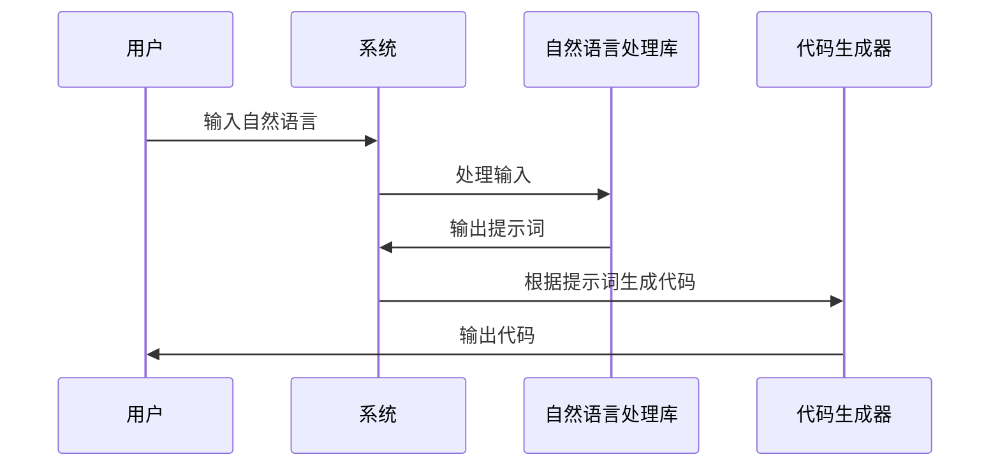
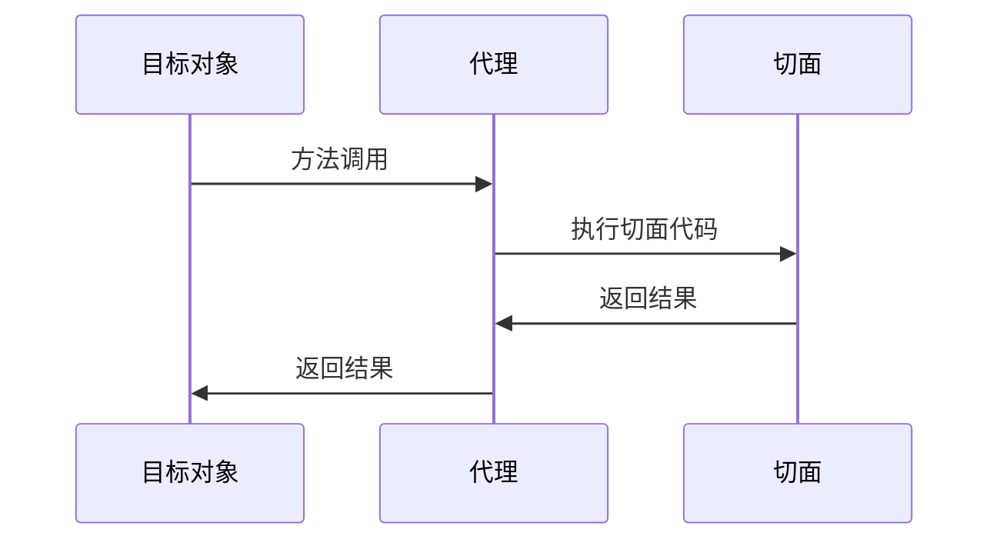
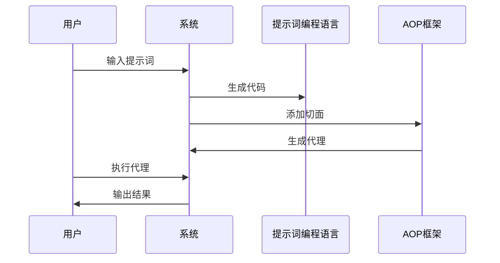
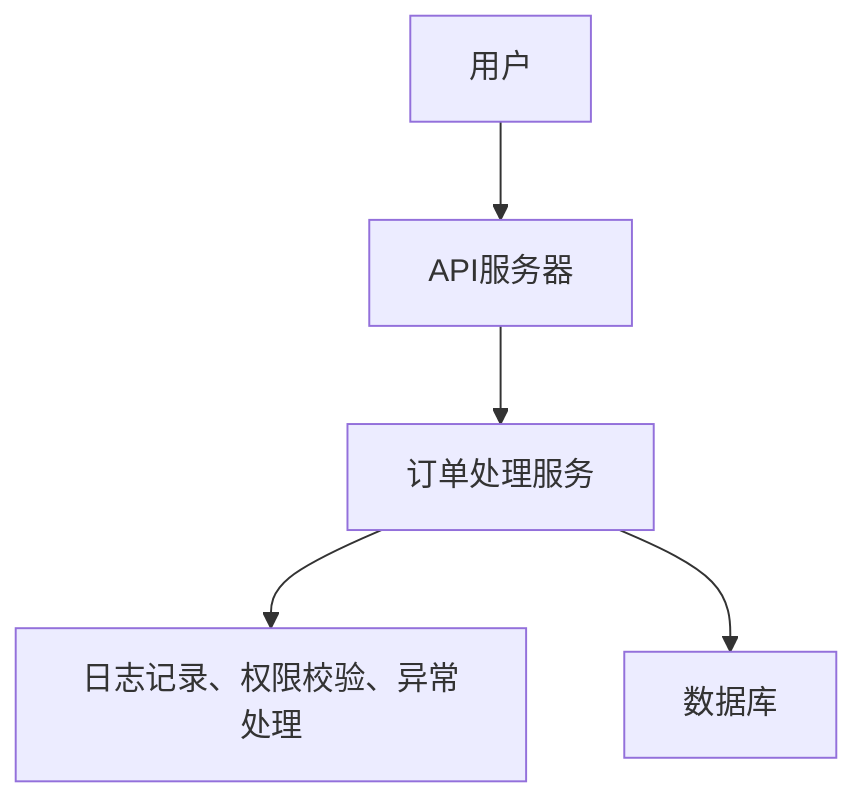
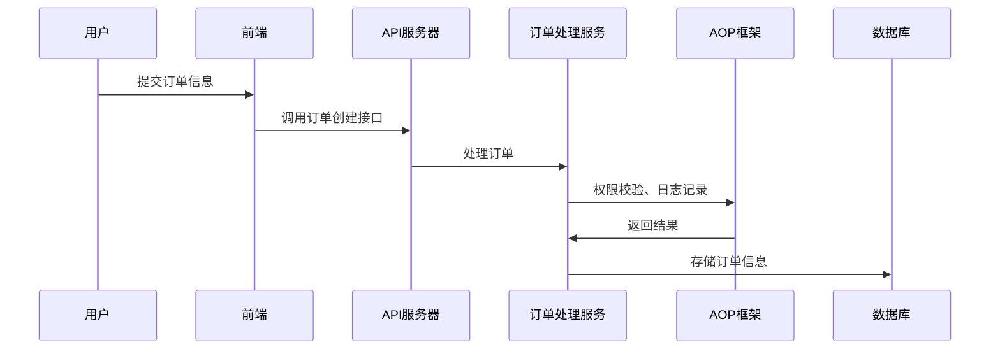

                 

# 提示词编程语言的面向切面编程

> 关键词：提示词编程语言，面向切面编程，AOP，自然语言处理，代码生成，开发效率

> 摘要：本文旨在探讨提示词编程语言与面向切面编程（AOP）的结合，分析其在现代软件开发中的应用。首先，我们将介绍提示词编程语言的基础概念和特点，然后探讨面向切面编程的基本原理和优势，接着分析二者结合的可能性和实现方法，最后通过一个实际案例展示这种结合带来的高效性和便捷性。

## 第一部分: 背景介绍与核心概念

### 第1章: 提示词编程语言与面向切面编程

#### 1.1 问题背景

现代软件开发面临着日益复杂的问题，如代码冗余、维护困难、开发效率低下等。传统的编程方法往往使得开发者需要花费大量时间来处理这些横切关注点，导致核心业务逻辑被淹没在繁琐的代码中。

为了解决这些问题，提示词编程语言和面向切面编程应运而生。提示词编程语言通过简短的提示，自动生成代码，简化了开发流程；面向切面编程将横切关注点从业务逻辑中分离出来，提高了代码的可维护性和可复用性。

#### 1.2 问题描述

如何在提示词编程语言中实现面向切面编程？如何利用提示词提高AOP的编程效率？提示词编程语言与AOP的结合有哪些边界和可能性？

#### 1.3 问题解决

本文将分析提示词编程语言的特性，探讨其在AOP中的应用；设计AOP框架与提示词编程语言的整合方案；通过一个实际案例验证这种结合的有效性。

#### 1.4 核心概念与联系

##### 核心概念原理

- 提示词编程语言：利用自然语言或简短的提示，实现代码自动生成。
- 面向切面编程（AOP）：通过将横切关注点从业务逻辑中分离出来，提高代码模块化程度。

##### 概念属性特征对比表格

| 概念        | 特性                        |
|-------------|-----------------------------|
| 提示词编程语言 | 自动生成代码，简化开发流程   |
| 面向切面编程 | 分离横切关注点，提高代码可维护性 |

##### ER实体关系图架构

```mermaid
erDiagram
  用户 -->|提交| 提示词
  用户 -->|生成| 代码
  代码 -->|包含| 关注点
```

## 第2章: 提示词编程语言基础

### 2.1 提示词编程语言的定义

提示词编程语言是一种基于提示词（Prompt）的编程方法，通过自然语言或简短的提示，实现代码自动生成。与传统编程语言不同，提示词编程语言注重开发效率，减少代码编写时间。

### 2.2 提示词编程语言的原理

提示词编程语言的原理主要涉及以下几个方面：

- **提示词生成算法**：基于自然语言处理技术，将用户的自然语言输入转换为提示词。
- **提示词的语义解析**：理解提示词的含义，生成相应的代码。

##### 提示词生成算法流程



### 2.3 提示词编程语言的特点

- **高效性**：通过提示词实现代码自动生成，提高开发效率。
- **灵活性**：支持多种编程范式，如面向对象、函数式编程等。
- **可维护性**：简化代码结构，降低维护难度。

### 2.4 提示词编程语言的应用场景

- **后端开发**：如API自动生成、数据库迁移等。
- **前端开发**：如界面布局自动生成、CSS样式生成等。
- **测试**：如自动化测试用例生成等。

### 2.5 提示词编程语言的实现

- **基础设施**：如自然语言处理库、代码生成工具等。
- **实现方法**：如基于模板的代码生成、基于机器学习的代码生成等。

### 2.6 提示词编程语言的挑战与机遇

- **挑战**：语义理解准确性、代码生成效率等。
- **机遇**：提高开发效率、降低开发成本等。

### 2.7 本章小结

本文介绍了提示词编程语言的基础概念、原理和特点，以及其在不同应用场景中的优势。在下一章，我们将探讨面向切面编程的基础知识，分析其与提示词编程语言的结合。

----------------------------------------------------------------

## 第3章: 面向切面编程基础

### 3.1 面向切面编程的定义

面向切面编程（Aspect-Oriented Programming，简称AOP）是一种编程范式，旨在将横切关注点从业务逻辑中分离出来，以提高代码的可维护性和可复用性。横切关注点是指那些影响多个模块的代码，如日志记录、权限校验、事务管理等。

### 3.2 AOP的核心概念

- **横切关注点**：那些影响多个模块的代码，如日志记录、权限校验、事务管理等。
- **切面（Aspect）**：包含横切关注点的代码片段，用于封装横切逻辑。
- **代理（Proxy）**：实现切面的中间层，用于拦截目标对象的调用，并在特定时机执行切面代码。

### 3.3 AOP的原理

AOP的实现原理主要基于动态代理和字节码增强技术。在Java中，常见的AOP实现框架有AspectJ、Spring AOP等。以下是一个简单的AOP实现流程：

1. **定义切面**：在AspectJ中，通过注解或XML配置定义切面和切点。
2. **生成代理**：通过Cglib或JavaAssist等动态代理技术，生成目标对象的代理。
3. **拦截调用**：在代理中拦截目标对象的调用，并在特定时机执行切面代码。

##### AOP实现流程



### 3.4 AOP的优势

- **提高代码可维护性**：将横切关注点分离出来，降低代码耦合度。
- **提高代码可复用性**：切面代码可独立维护，提高复用性。
- **提高开发效率**：减少重复代码，简化开发流程。

### 3.5 AOP的应用场景

- **日志记录**：如日志管理、性能监控等。
- **安全控制**：如权限校验、异常处理等。
- **缓存处理**：如缓存管理、缓存策略等。

### 3.6 AOP的实现方法

- **基于代理的实现**：如Java中的Cglib、JavaAssist等。
- **基于字节码增强的实现**：如AspectJ、Spring AOP等。

### 3.7 本章小结

本文介绍了面向切面编程的基础知识，包括核心概念、原理和优势。在下一章，我们将探讨提示词编程语言与AOP的结合，分析其在现代软件开发中的应用和优势。

----------------------------------------------------------------

## 第二部分：提示词编程语言与AOP的结合

### 第4章: 提示词编程语言与AOP的整合

#### 4.1 整合背景

提示词编程语言和面向切面编程都是为了解决现代软件开发中的问题而生的。提示词编程语言通过自动生成代码，简化了开发流程，提高了开发效率；而面向切面编程通过将横切关注点分离出来，提高了代码的可维护性和可复用性。那么，如何将这两种方法结合起来，发挥它们各自的优势呢？

#### 4.2 整合原理

将提示词编程语言与AOP整合，可以通过以下步骤实现：

1. **定义提示词**：用户输入提示词，描述需要实现的功能。
2. **生成代码**：基于提示词，提示词编程语言自动生成相应的代码。
3. **添加切面**：将生成的代码中需要实现横切关注点的部分，封装成切面。
4. **生成代理**：基于切面，生成目标对象的代理。
5. **执行代理**：通过代理，执行切面代码，实现横切关注点的分离和封装。

##### 整合原理



#### 4.3 整合优势

- **高效性**：通过提示词编程语言，实现代码自动生成，简化了开发流程；通过AOP，将横切关注点分离出来，提高了代码的可维护性和可复用性。
- **灵活性**：提示词编程语言支持多种编程范式，如面向对象、函数式编程等；AOP可以灵活地处理横切关注点，提高代码的模块化程度。
- **便捷性**：用户只需输入提示词，即可实现代码生成和AOP功能，简化了开发过程。

#### 4.4 整合挑战

- **语义理解**：提示词编程语言需要准确地理解用户的提示词，生成正确的代码。
- **代码生成**：生成的代码需要满足AOP的要求，实现横切关注点的分离和封装。

#### 4.5 本章小结

本文介绍了提示词编程语言与AOP的整合原理和优势，分析了可能面临的挑战。在下一章，我们将通过一个实际案例，展示这种整合在实际开发中的应用和效果。

----------------------------------------------------------------

## 第5章: 实际案例：基于提示词编程语言的AOP框架

### 5.1 项目背景

在一家电商公司，为了提高开发效率和代码质量，我们决定尝试使用基于提示词编程语言的AOP框架。具体场景是，在订单处理系统中，需要对订单的创建、更新和删除操作进行日志记录、权限校验和异常处理等横切关注点的管理。

### 5.2 项目介绍

本项目旨在实现一个基于提示词编程语言的AOP框架，用于简化电商订单处理系统的开发过程。项目的主要功能包括：

- **日志记录**：记录订单的创建、更新和删除操作，便于后续审计和问题排查。
- **权限校验**：确保只有具有相应权限的用户才能执行特定操作。
- **异常处理**：对订单处理过程中的异常情况进行捕获和处理。

### 5.3 系统功能设计

在订单处理系统中，我们需要实现以下功能：

- **订单创建**：用户下单后，系统自动生成订单并保存到数据库。
- **订单更新**：用户修改订单信息后，系统更新数据库中的订单记录。
- **订单删除**：用户取消订单后，系统删除数据库中的订单记录。

为了实现这些功能，我们使用了提示词编程语言和AOP框架。具体流程如下：

1. **用户下单**：用户通过前端界面提交订单信息，系统接收并处理订单。
2. **生成订单**：基于提示词，提示词编程语言自动生成订单创建的代码，并将订单信息保存到数据库。
3. **权限校验**：在订单创建之前，AOP框架拦截订单创建的代码，检查用户权限。
4. **日志记录**：AOP框架在订单创建、更新和删除操作前后，记录相应的日志信息。
5. **异常处理**：在订单处理过程中，如果发生异常，AOP框架捕获异常，并给出相应的处理建议。

### 5.4 系统架构设计

本项目的系统架构设计如下：

- **前端界面**：用户通过前端界面提交订单信息。
- **API服务器**：接收前端提交的订单信息，并调用后端服务处理订单。
- **订单处理服务**：基于提示词编程语言，自动生成订单处理的代码。
- **AOP框架**：用于实现日志记录、权限校验和异常处理等功能。
- **数据库**：存储订单数据和相关日志信息。

##### 系统架构图



### 5.5 系统接口设计

在订单处理服务中，我们定义了以下接口：

- **订单创建接口**：用于创建订单，并返回订单ID。
- **订单更新接口**：用于更新订单信息。
- **订单删除接口**：用于删除订单。

接口设计如下：

```python
class OrderService:
  def create_order(order_data):
    # 创建订单并返回订单ID
    pass

  def update_order(order_id, order_data):
    # 更新订单信息
    pass

  def delete_order(order_id):
    # 删除订单
    pass
```

### 5.6 系统交互设计

在订单处理过程中，系统的主要交互如下：

1. **用户下单**：用户提交订单信息，前端调用订单创建接口。
2. **订单创建**：后端接收到订单信息后，使用提示词编程语言生成订单创建代码，并调用数据库存储订单。
3. **权限校验**：AOP框架在订单创建之前，检查用户权限，只有具有相应权限的用户才能创建订单。
4. **日志记录**：AOP框架在订单创建前后，记录相应的日志信息。
5. **异常处理**：如果订单创建过程中发生异常，AOP框架捕获异常，并给出相应的处理建议。

##### 系统交互图



### 5.7 项目小结

通过使用基于提示词编程语言的AOP框架，我们成功地简化了电商订单处理系统的开发过程。提示词编程语言提高了开发效率，AOP框架提高了代码的可维护性和可复用性。在后续的开发中，我们将继续探索这种整合方法在其他业务场景中的应用。

### 5.8 最佳实践 tips

- **充分理解提示词**：在使用提示词编程语言时，确保提示词的准确性，避免生成错误的代码。
- **合理使用AOP**：避免过度使用AOP，导致代码难以理解和维护。
- **优化日志记录**：合理配置日志记录的级别和格式，避免日志过多影响系统性能。

### 5.9 小结与拓展阅读

本文通过一个实际案例，展示了基于提示词编程语言的AOP框架在电商订单处理系统中的应用。我们分析了项目背景、系统功能设计、系统架构设计、系统接口设计和系统交互设计，并总结了项目的优势和小结。

拓展阅读：

- 《AspectJ in Action》：一本关于AspectJ的实战指南，详细介绍AOP的应用和实践。
- 《Natural Language Processing with Python》：一本关于自然语言处理的入门书籍，介绍如何使用Python进行提示词编程。

作者：AI天才研究院/AI Genius Institute & 禅与计算机程序设计艺术 /Zen And The Art of Computer Programming

