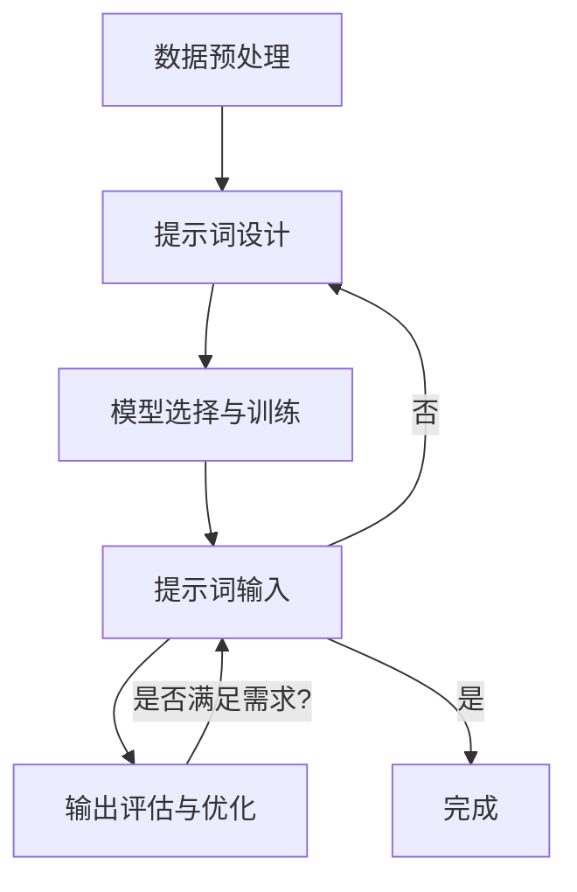
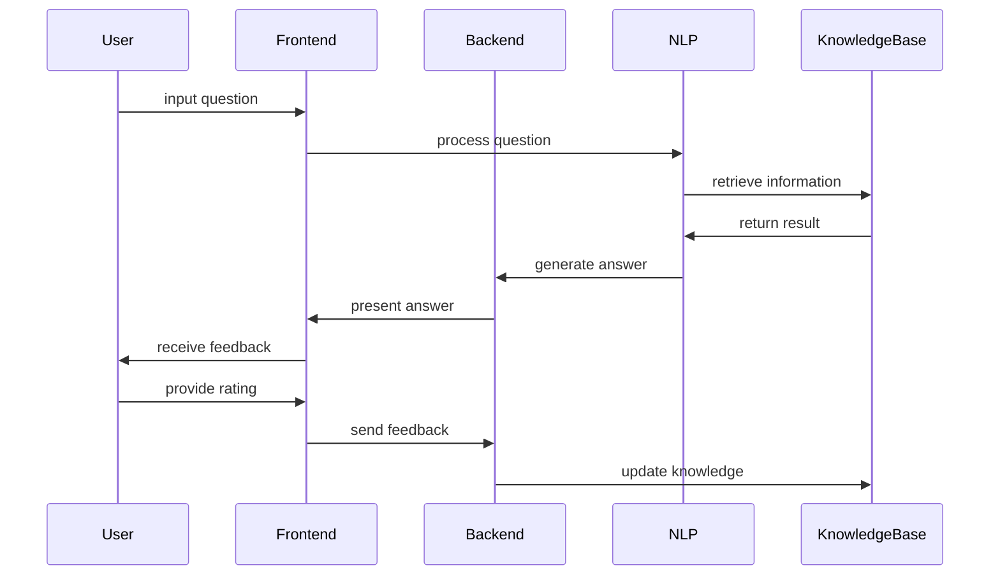
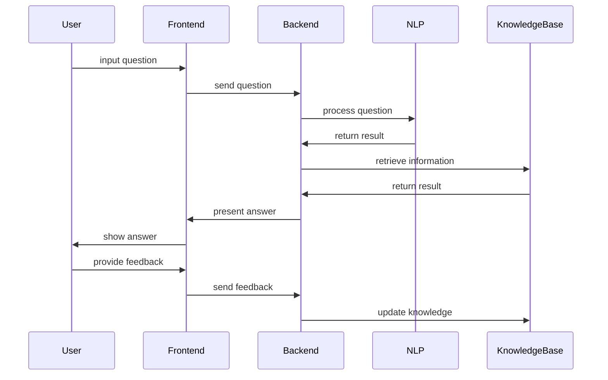

                 

### 设计书籍目录大纲步骤

1. **分析书名与主题**：
   - 书名《提示词编程：AI时代的新型软件工程范式》表明本书将聚焦于AI时代下的软件工程，尤其是提示词编程这一新型技术。
   - 需要确定核心概念、主题、目标读者群以及书籍的结构。

2. **确定书籍结构**：
   - 根据书名和主题，确定书籍的整体结构，包括几个主要部分和章节。
   - 确保书籍结构合理、内容连贯，并且符合读者的阅读逻辑。

3. **编写目录大纲**：
   - 使用markdown格式编写目录大纲，确保每个章节标题都符合markdown的层级格式。
   - 每个章节标题下面可以列出二级和三级标题，以便详细规划章节内容。

4. **内容细化**：
   - 根据书籍的总字数限制，确保每个章节的内容都能够细化到足够详尽但又不冗长的程度。
   - 包含核心概念、联系、算法原理讲解、数学模型和公式、系统分析与架构设计、项目实战等内容。

5. **确保内容完整性**：
   - 确保大纲中包含了背景介绍、核心概念与联系、算法原理讲解、数学模型和公式、系统分析与架构设计、项目实战、最佳实践 tips、小结、注意事项、拓展阅读等核心内容。

6. **检查与调整**：
   - 完成初步大纲后，检查内容的连贯性和完整性，确保没有遗漏。
   - 根据检查结果对大纲进行必要的调整。

7. **最终确认**：
   - 最终确认目录大纲符合要求，简洁明了，内容完整。

### 根据上述步骤设计目录大纲

**第一部分：背景与概述**

# 第一部分：背景与概述

## 1.1 问题背景与描述
### 1.1.1 软件工程的发展与挑战
### 1.1.2 AI时代的到来与影响
### 1.1.3 提示词编程的概念与特点

## 1.2 核心概念与联系
### 1.2.1 软件工程的核心概念
### 1.2.2 AI技术的基本原理
### 1.2.3 提示词编程与软件工程的关系

**第二部分：提示词编程基础**

# 第二部分：提示词编程基础

## 2.1 提示词编程原理
### 2.1.1 提示词的作用与类型
### 2.1.2 提示词编程的基本流程
### 2.1.3 提示词编程的优势与局限性

## 2.2 算法原理讲解
### 2.2.1 提示词编程的核心算法
### 2.2.2 算法mermaid流程图展示
### 2.2.3 Python源代码详细解释

## 2.3 数学模型与公式
### 2.3.1 提示词编程的数学基础
### 2.3.2 数学公式与详细讲解
### 2.3.3 公式示例与应用场景

**第三部分：应用与实践**

# 第三部分：应用与实践

## 3.1 系统分析与架构设计
### 3.1.1 问题场景介绍
### 3.1.2 系统功能设计（领域模型mermaid类图）
### 3.1.3 系统架构设计（mermaid架构图）
### 3.1.4 系temain：设计书籍目录大纲

为了设计一个符合要求的书籍目录大纲，我们需要遵循以下步骤：

### 1. 分析书名与主题
- 书名《提示词编程：AI时代的新型软件工程范式》暗示了书籍的核心内容将是探讨AI时代背景下的一种新型软件工程范式——提示词编程。
- 我们需要明确核心概念，包括提示词编程的定义、特点及其在AI时代的应用。

### 2. 确定书籍结构
- 确定书籍将分为几个主要部分，比如背景介绍、基础理论、应用实例、最佳实践等。
- 确保各部分内容连贯且逻辑清晰。

### 3. 编写目录大纲
- 使用markdown格式编写大纲，确保章节标题遵循markdown的层级结构。
- 确定每个章节的内容细分，如核心概念、算法原理、数学模型、系统分析与设计等。

### 4. 内容细化
- 根据书籍字数要求，细化每个章节的内容，确保既详尽又不过于冗长。
- 包含必要的背景介绍、概念说明、算法讲解、数学公式、系统设计、实战案例等。

### 5. 确保内容完整性
- 确认大纲中不遗漏任何关键内容。
- 包含所有必要的部分，如最佳实践、注意事项、拓展阅读等。

### 6. 检查与调整
- 审查大纲内容的连贯性和逻辑性。
- 根据反馈进行调整，确保每个章节都能为读者提供有价值的知识。

### 7. 最终确认
- 确认大纲完整且符合预期要求。
- 确保大纲简洁明了，易于理解。

#### 根据上述步骤设计目录大纲

**第一部分：背景与概述**

- **1.1 软件工程的发展与挑战**
  - **1.1.1 软件工程的发展历程**
  - **1.1.2 软件工程的挑战与困境**
  - **1.1.3 AI时代的影响**

- **1.2 AI技术概述**
  - **1.2.1 AI技术的基本原理**
  - **1.2.2 AI技术的应用领域**
  - **1.2.3 提示词编程的概念**

- **1.3 提示词编程的特点与优势**
  - **1.3.1 提示词编程的定义**
  - **1.3.2 提示词编程的工作原理**
  - **1.3.3 提示词编程的优势**

**第二部分：提示词编程基础**

- **2.1 核心概念与术语**
  - **2.1.1 提示词的类型与作用**
  - **2.1.2 提示词编程的基本流程**
  - **2.1.3 提示词编程的关键要素**

- **2.2 算法原理**
  - **2.2.1 提示词编程的核心算法**
  - **2.2.2 算法mermaid流程图展示**
  - **2.2.3 Python源代码分析**

- **2.3 数学模型与公式**
  - **2.3.1 提示词编程的数学基础**
  - **2.3.2 公式与模型解释**
  - **2.3.3 实例说明**

**第三部分：应用与实践**

- **3.1 系统分析与架构设计**
  - **3.1.1 问题场景介绍**
  - **3.1.2 系统功能设计（领域模型mermaid类图）**
  - **3.1.3 系统架构设计（mermaid架构图）**
  - **3.1.4 系统接口设计与交互（mermaid序列图）**

- **3.2 项目实战**
  - **3.2.1 环境安装与配置**
  - **3.2.2 系统核心实现**
  - **3.2.3 代码解读与分析**
  - **3.2.4 实际案例解析**
  - **3.2.5 项目小结**

**第四部分：最佳实践与总结**

- **4.1 最佳实践与技巧**
  - **4.1.1 提示词编程的最佳实践**
  - **4.1.2 代码优化技巧**
  - **4.1.3 性能调优方法**

- **4.2 小结与展望**
  - **4.2.1 全书核心内容回顾**
  - **4.2.2 提示词编程的未来趋势**
  - **4.2.3 总结与思考**

- **4.3 注意事项**
  - **4.3.1 提示词编程的常见问题**
  - **4.3.2 避免错误与风险**
  - **4.3.3 安全性与隐私保护**

- **4.4 拓展阅读**
  - **4.4.1 相关书籍推荐**
  - **4.4.2 学术论文精选**
  - **4.4.3 网络资源链接**

### 摘要

本书《提示词编程：AI时代的新型软件工程范式》旨在深入探讨AI时代背景下的一种新型软件工程范式——提示词编程。首先，本书将回顾软件工程的发展历程及其面临的挑战，介绍AI技术的崛起及其对软件工程的影响。接着，本书将详细解释提示词编程的核心概念、工作原理和优势，并通过具体的算法原理讲解、数学模型和Python源代码分析，使读者能够深入理解这一技术的本质。此外，本书还将通过实际的项目实战，展示如何将提示词编程应用于系统分析与架构设计，并提供最佳实践和注意事项，帮助读者在实际开发中充分利用这一技术。通过阅读本书，读者将不仅能够掌握提示词编程的基本知识，还能够洞察其在未来软件工程领域的发展趋势，为应对AI时代的挑战做好准备。

## 第一部分：背景与概述

### 1.1 软件工程的发展与挑战

软件工程作为计算机科学的一个重要分支，其目标是系统地、规范地开发、操作和维护软件，以满足用户的需求。自20世纪50年代计算机的出现以来，软件工程经历了快速的发展。早期，软件开发主要依赖于程序员的个人技能和经验，但随着软件规模的增大和复杂性的提升，传统的方法逐渐暴露出许多问题，例如代码质量难以保证、软件维护成本高、项目延期等。

在软件工程的发展历程中，出现了许多重要的里程碑，如结构化编程、面向对象编程和敏捷开发等。这些方法试图通过规范化的开发流程、代码组织方式和项目管理技术来提升软件开发的效率和质量。然而，随着信息技术的飞速发展，尤其是人工智能（AI）技术的崛起，软件工程再次面临新的挑战。

AI技术，特别是深度学习和机器学习，正在改变软件开发的模式。传统的软件工程依赖于明确的规格说明书和固定的功能需求，而AI则通过学习大量数据来自动生成解决方案。这种变革带来了许多新的机遇，同时也提出了新的挑战。例如，如何设计出既能充分利用AI优势，又能保证软件可靠性和安全性的系统？如何处理AI系统的不可解释性和透明性问题？这些问题的解决需要新的理论和技术。

### 1.2 AI时代的到来与影响

AI时代的到来，不仅改变了软件工程的方法，也改变了软件的功能和应用场景。首先，AI技术使得软件能够从数据中自动学习，从而实现自动化决策和预测。这种能力在金融、医疗、交通等领域有着广泛的应用，例如通过机器学习算法进行股票市场预测、医疗诊断和自动驾驶。

其次，AI技术推动了软件智能化的发展。传统的软件主要是执行既定任务的工具，而智能软件则具有自主学习、自主适应和自主决策的能力。这种智能化的发展趋势，使得软件不仅仅是工具，更成为了智能体的代表。例如，智能客服系统可以理解用户的语言并给出合适的回复，智能家居系统可以根据用户的生活习惯自动调节环境。

然而，AI时代也带来了新的挑战。首先，AI系统的复杂性和不确定性增加了软件开发的难度。AI算法通常涉及到大量的数据和复杂的模型，开发者需要具备深厚的数学和统计学知识。其次，AI系统的不可解释性使得我们难以理解其决策过程，这在某些情况下可能导致不可预测的结果。此外，随着AI技术的普及，数据安全和隐私保护也成为了重要的议题。

### 1.3 提示词编程的概念与特点

在AI时代，提示词编程（Prompt Programming）作为一种新型的软件工程范式，逐渐引起了研究者和开发者的关注。提示词编程的核心思想是通过设计特定的提示词（Prompt），引导AI系统（如大型语言模型）生成预期的输出。这种编程范式不仅能够简化开发过程，还能够提高系统的灵活性和可解释性。

提示词编程具有以下特点：

1. **可解释性**：提示词编程使得AI系统的决策过程更加透明，开发者和用户可以理解系统的行为和决策逻辑。
2. **灵活性**：通过修改提示词，可以快速调整AI系统的输出，实现定制化的需求。
3. **高效性**：提示词编程减少了传统AI系统开发中复杂的模型设计和优化过程，提高了开发效率。
4. **适应性**：提示词编程能够根据不同的应用场景和需求，灵活调整系统的行为，使其更具适应性。

提示词编程的应用范围广泛，包括自然语言处理、代码生成、图像识别等领域。例如，在自然语言处理中，通过设计合适的提示词，可以生成高质量的文章、翻译和对话；在代码生成中，提示词编程可以帮助开发者快速生成符合规范的代码片段。

总的来说，提示词编程作为一种新型的软件工程范式，不仅适应了AI时代的需求，也为未来的软件开发提供了新的思路和方法。

### 1.4 软件工程的核心概念

软件工程是一门涉及计算机科学、工程学和项目管理等多个领域的交叉学科，其核心概念包括需求分析、设计、编码、测试和维护等。这些概念构成了软件开发的基石，确保了软件系统的质量、可靠性和可维护性。

**需求分析**是软件开发的第一步，其目标是明确用户的需求，并将其转化为具体的软件需求规格说明书。需求分析的过程包括收集用户需求、分析需求、定义功能和性能要求等。需求分析的质量直接影响后续的设计和开发过程，因此需要高度重视。

**设计**是软件开发的核心环节，包括系统设计、模块设计、接口设计等。系统设计涉及软件的整体架构，包括数据结构、模块划分和功能分配；模块设计关注具体模块的内部结构和实现细节；接口设计则定义不同模块之间的交互方式和数据传递方式。良好的设计能够提高软件的可扩展性、可维护性和性能。

**编码**是将设计转化为实际代码的过程。编码阶段需要遵循编程规范和最佳实践，以确保代码的可读性、可维护性和高效性。良好的编码习惯和代码审查机制是保证代码质量的关键。

**测试**是确保软件质量的重要环节，包括单元测试、集成测试、系统测试和验收测试等。测试过程旨在发现和修复软件中的缺陷，确保软件的功能、性能和可靠性满足用户需求。

**维护**是软件生命周期中最长的阶段，包括修复缺陷、更新功能和适应环境变化等。维护不仅能够延长软件的使用寿命，还能够确保其持续满足用户的需求。

总的来说，软件工程的核心概念涵盖了软件开发的各个环节，通过系统的方法和工具，确保软件系统能够高质量地满足用户需求。

### 1.5 AI技术的基本原理

人工智能（AI）是一种模拟人类智能的技术，旨在使计算机具备感知、学习、推理和决策的能力。AI技术的核心在于通过算法和模型处理大量数据，从中提取有用的信息和模式，然后利用这些信息进行预测、决策和自动化。

**机器学习**是AI技术的重要组成部分，它通过训练模型来从数据中学习。机器学习可以分为监督学习、无监督学习和强化学习。监督学习使用标记数据训练模型，无监督学习不需要标记数据，仅从数据中发现隐藏的结构，而强化学习则通过不断与环境互动来学习最优策略。

**神经网络**是机器学习的基础模型，其灵感来源于人脑的结构和功能。神经网络由多个神经元（节点）组成，通过调整神经元之间的连接权重（权重表示节点之间的关联强度）来提高模型的性能。常见的神经网络包括多层感知机（MLP）、卷积神经网络（CNN）和循环神经网络（RNN）。

**深度学习**是神经网络的一种扩展，它使用多层神经网络来处理复杂的任务。深度学习在图像识别、语音识别、自然语言处理等领域取得了显著成果。例如，深度卷积神经网络（DCNN）在图像分类任务中表现优异，而长短期记忆网络（LSTM）在序列数据处理中表现出色。

**监督学习算法**如决策树、支持向量机（SVM）和随机森林（Random Forest）等，通过学习标记数据来预测新的数据。决策树通过构建树形结构来分类或回归数据，而支持向量机通过找到一个最优的超平面来分类数据。随机森林则通过构建多个决策树并集成其结果来提高预测的准确性和稳定性。

**无监督学习算法**如K-均值聚类、主成分分析（PCA）和自编码器等，不需要标记数据，主要关注数据的内在结构和分布。K-均值聚类通过迭代优化聚类中心来将数据分为多个类别，而主成分分析通过降维来减少数据的维度，同时保留主要的信息。自编码器是一种特殊的神经网络，通过编码和解码过程来学习和重构数据。

**强化学习算法**如Q学习、深度Q网络（DQN）和策略梯度算法等，通过与环境互动来学习最优策略。Q学习通过评估不同动作的价值来选择最佳动作，而DQN通过深度神经网络来近似Q值函数。策略梯度算法则通过优化策略来最大化预期回报。

总的来说，AI技术的基本原理涵盖了从数据中学习、模型构建、算法设计等多个方面，通过不断的研究和创新，使得计算机能够在各种任务中表现出类人的智能。

### 1.6 提示词编程与软件工程的关系

提示词编程作为一种新兴的软件工程范式，在AI时代具有独特的地位和重要性。其与传统的软件工程方法既有联系又有区别，二者在开发流程、核心概念和实现方式上有着显著的差异。

首先，从开发流程来看，传统的软件工程方法通常遵循需求分析、设计、编码、测试和维护等步骤。这些步骤强调前期规划和后期验证，以确保软件系统的质量和可靠性。而提示词编程则更加强调动态调整和实时优化。在提示词编程中，开发过程往往更加灵活，开发者和用户可以通过修改提示词来快速调整系统的输出，从而满足不断变化的需求。

其次，从核心概念来看，传统的软件工程方法强调模块化、可扩展性和可维护性。开发者需要通过设计清晰的接口、模块化和代码复用来构建软件系统。而提示词编程则强调透明性和可解释性。通过设计特定的提示词，开发者可以引导AI系统生成预期的输出，使得系统的决策过程更加透明，用户可以更直观地理解系统的行为。

再次，从实现方式来看，传统的软件工程方法通常依赖于明确的算法和数据结构，通过编写代码来实现系统的功能。而提示词编程则更多地依赖于AI模型，特别是大型语言模型。开发者通过设计合适的提示词来引导模型生成预期的输出，从而实现软件的功能。这种编程范式减少了传统的算法设计和优化过程，提高了开发效率。

尽管提示词编程和传统软件工程方法在开发流程、核心概念和实现方式上有差异，但它们并非完全对立。提示词编程可以看作是传统软件工程方法的一种扩展和补充。在软件开发过程中，开发者可以结合使用传统方法和提示词编程，根据具体的需求和场景选择最适合的方法。

在AI时代，提示词编程具有以下独特优势：

1. **灵活性和动态调整能力**：提示词编程允许开发者和用户通过修改提示词来快速调整系统的输出，从而适应不断变化的需求。这种灵活性在快速迭代的AI应用场景中尤为重要。

2. **透明性和可解释性**：提示词编程通过设计特定的提示词，使得AI系统的决策过程更加透明，用户可以直观地理解系统的行为。这种可解释性有助于提升系统的信任度和用户满意度。

3. **高效性**：提示词编程减少了传统算法设计和优化过程，提高了开发效率。开发者可以专注于设计高质量的提示词，而无需花费大量时间在算法优化上。

4. **智能化和自动化**：提示词编程利用AI模型的能力，实现了软件系统的智能化和自动化。开发者可以通过设计合适的提示词，让系统自动生成代码、文档和配置，从而提高生产效率。

总之，提示词编程作为AI时代的一种新型软件工程范式，不仅在开发流程、核心概念和实现方式上与传统方法有所不同，还具备独特的优势和潜力。随着AI技术的不断发展和应用，提示词编程将在软件开发中发挥越来越重要的作用。

### 2.1 提示词编程原理

提示词编程（Prompt Programming）是AI时代的一种新型编程范式，通过设计特定的提示词（Prompt），引导AI系统（如大型语言模型）生成预期的输出。其基本原理可以概括为以下几个关键点：

#### 2.1.1 提示词的作用与类型

提示词是提示词编程的核心元素，其作用是引导AI系统生成预期的输出。一个有效的提示词应当明确、简洁且具有针对性。根据不同的应用场景，提示词可以分为以下几种类型：

1. **明确型提示词**：这类提示词直接提供具体的信息和指令，例如“请生成一篇关于机器学习的文章”。

2. **模糊型提示词**：这类提示词提供一些模糊的指导和上下文，例如“请讨论机器学习的未来趋势”。

3. **引导型提示词**：这类提示词通过提出问题或情景，激发AI系统进行思考和生成输出，例如“假设我们正在开发一个智能客服系统，请列出可能需要解决的问题”。

#### 2.1.2 提示词编程的基本流程

提示词编程的基本流程包括以下几个步骤：

1. **需求分析**：明确用户需求，确定需要生成的输出类型和内容。

2. **设计提示词**：根据需求分析的结果，设计具体的提示词。提示词的设计需要考虑上下文、目标输出以及AI系统的能力和限制。

3. **模型选择**：选择合适的AI模型，如大型语言模型，作为生成输出的基础。

4. **训练模型**：如果需要，对AI模型进行训练，使其能够更好地理解和生成预期的输出。

5. **输入提示词**：将设计的提示词输入到AI模型中，让其生成输出。

6. **评估输出**：对生成的输出进行评估，确保其符合需求。如果输出不满足要求，可以返回步骤2或3进行优化。

#### 2.1.3 提示词编程的优势与局限性

提示词编程具有以下优势：

1. **高效性**：通过设计特定的提示词，可以快速引导AI系统生成预期的输出，减少传统算法设计和优化的时间。

2. **灵活性**：提示词编程允许开发者和用户通过修改提示词来快速调整系统的输出，适应不断变化的需求。

3. **透明性**：提示词编程使得AI系统的决策过程更加透明，用户可以直观地理解系统的行为。

4. **智能化**：提示词编程利用AI模型的能力，实现了软件系统的智能化和自动化。

然而，提示词编程也存在一些局限性：

1. **依赖模型能力**：提示词编程的效果很大程度上依赖于AI模型的能力。如果模型不够强大或提示词设计不当，输出可能不符合预期。

2. **可解释性有限**：虽然提示词编程提高了系统的透明性，但某些情况下输出仍可能具有不可解释性。

3. **数据依赖**：提示词编程需要大量的数据来训练模型，数据的质量和数量直接影响模型的表现。

总的来说，提示词编程作为一种新兴的编程范式，具有高效性、灵活性和透明性等优势，但也需要克服依赖模型能力、可解释性和数据依赖等局限性。通过不断优化提示词设计和AI模型，提示词编程有望在未来的软件开发中发挥更大的作用。

### 2.2 算法原理讲解

提示词编程的核心在于设计有效的提示词来引导AI系统生成预期的输出。为了深入理解提示词编程的工作原理，我们将从算法原理的角度进行讲解，并通过mermaid流程图和Python源代码详细阐述。

#### 2.2.1 提示词编程的核心算法

提示词编程的核心算法主要包括以下几个步骤：

1. **数据预处理**：收集并整理需要处理的原始数据，例如文本、图像或音频。
2. **提示词设计**：根据任务需求，设计能够引导AI系统生成预期输出的提示词。提示词的设计需要考虑上下文、目标输出以及AI系统的能力和限制。
3. **模型选择与训练**：选择合适的AI模型，如大型语言模型，并进行训练，使其能够理解并生成预期的输出。
4. **提示词输入**：将设计的提示词输入到AI模型中，让其生成输出。
5. **输出评估与优化**：对生成的输出进行评估，确保其符合需求。如果输出不满足要求，可以返回步骤2或3进行优化。

#### 2.2.2 算法mermaid流程图展示

为了更直观地展示提示词编程的算法流程，我们可以使用mermaid流程图进行描述。以下是一个简单的mermaid流程图示例：



#### 2.2.3 Python源代码详细解释

为了进一步理解提示词编程的具体实现，我们将使用Python语言提供一个简单的示例。以下代码展示了如何使用一个预训练的语言模型生成文本：

```python
import openai

# 设定API密钥
openai.api_key = 'your-api-key'

# 设计提示词
prompt = "请写一篇关于人工智能在医疗领域的应用的论文。"

# 调用API进行文本生成
response = openai.Completion.create(
  engine="text-davinci-002",
  prompt=prompt,
  max_tokens=500
)

# 输出生成的文本
print(response.choices[0].text.strip())
```

在这段代码中，我们首先导入了OpenAI的API库，并设置了API密钥。接着，我们设计了一个提示词，该提示词明确指出了需要生成的内容类型和主题。然后，我们调用OpenAI的API，使用文本生成模型（text-davinci-002）来生成文本。最后，我们将生成的文本输出到控制台。

通过这段代码示例，我们可以看到提示词编程的实现过程。设计合适的提示词是关键，它决定了生成的文本的质量和方向。

总的来说，提示词编程的算法原理包括数据预处理、提示词设计、模型选择与训练、提示词输入和输出评估与优化。通过mermaid流程图和Python源代码，我们可以更直观地理解这一算法的实现过程。随着AI技术的不断进步，提示词编程有望在各个领域发挥更大的作用。

### 2.3 数学模型与公式

提示词编程作为一种依赖于AI模型的技术，其核心在于通过数学模型和公式来解释和指导AI系统的行为。在提示词编程中，数学模型和公式不仅用于算法的实现，还用于优化和评估系统的性能。以下我们将详细讲解提示词编程的数学基础，包括相关的公式和应用场景。

#### 2.3.1 提示词编程的数学基础

提示词编程的数学基础主要包括线性代数、概率论和优化理论。这些数学工具在AI模型的训练和应用中起着至关重要的作用。

1. **线性代数**：线性代数是理解和实现神经网络的基础。它涉及矩阵运算、向量计算和特征空间变换等概念。在提示词编程中，线性代数用于计算神经网络的权重和偏置，以及处理输入和输出的线性变换。

2. **概率论**：概率论用于处理不确定性和随机性。在AI中，概率论被广泛应用于生成模型和决策过程。在提示词编程中，概率论用于计算模型在给定提示词下的输出概率分布，从而生成期望的输出。

3. **优化理论**：优化理论用于找到最优解。在AI模型的训练过程中，优化理论用于调整模型的参数，以最小化损失函数，从而提高模型的性能。在提示词编程中，优化理论用于调整提示词的权重，以实现更精确的输出。

#### 2.3.2 公式与详细讲解

为了更好地理解提示词编程的数学基础，我们将介绍几个关键的公式，并解释其在编程中的应用。

1. **神经网络激活函数**：

   神经网络的激活函数是决定神经元输出是否大于某个阈值的关键。常用的激活函数包括Sigmoid、ReLU和Tanh。以下是一个ReLU激活函数的例子：

   $$ f(x) = \max(0, x) $$

   其中，$x$是神经网络的输入。ReLU函数在$x > 0$时输出$x$，在$x \leq 0$时输出0。这种非线性转换使得神经网络能够捕捉复杂的数据特征。

2. **损失函数**：

   损失函数是评估模型预测性能的重要指标。常用的损失函数包括均方误差（MSE）、交叉熵损失和Hinge损失。以下是一个均方误差（MSE）的例子：

   $$ MSE = \frac{1}{n}\sum_{i=1}^{n}(y_i - \hat{y_i})^2 $$

   其中，$y_i$是实际输出，$\hat{y_i}$是模型的预测输出。MSE函数用于回归任务，它通过计算预测值和实际值之间的平方误差来评估模型的性能。

3. **梯度下降优化**：

   梯度下降是一种常用的优化算法，用于调整模型参数以最小化损失函数。以下是一个简单的梯度下降公式：

   $$ \theta_{t+1} = \theta_{t} - \alpha \cdot \nabla_{\theta} J(\theta) $$

   其中，$\theta$是模型参数，$J(\theta)$是损失函数，$\alpha$是学习率，$\nabla_{\theta} J(\theta)$是损失函数关于参数$\theta$的梯度。梯度下降通过不断更新参数，使损失函数值逐步减小，从而找到最优解。

#### 2.3.3 公式示例与应用场景

以下是一个简单的示例，说明如何使用数学模型和公式在提示词编程中生成文本。

假设我们有一个预训练的神经网络模型，用于生成文章。给定一个提示词“请描述人工智能在医疗领域的应用”，我们需要使用模型生成相应的文章。以下是一个简化的流程：

1. **预处理输入**：将提示词转换为模型的输入格式，例如一个向量表示。

2. **模型预测**：将预处理后的输入传递给模型，模型根据训练的权重生成一个概率分布，表示每个单词的可能性。

3. **文本生成**：根据生成的概率分布，选择下一个最有可能的单词，并将其添加到输出中。重复步骤2和3，直到生成满足长度和内容要求的文章。

以下是这个过程的一个简化的数学表示：

$$ \text{input\_vector} = \text{preprocess}(\text{prompt}) $$
$$ \text{output\_distribution} = \text{model}(\text{input\_vector}) $$
$$ \text{next\_word} = \text{sample}(\text{output\_distribution}) $$
$$ \text{output} = \text{output} + \text{next\_word} $$
$$ \text{repeat}\; \text{steps}\; 2-3\; \text{until}\; \text{desired}\; \text{length}\; \text{and}\; \text{content} $$

通过上述步骤，我们可以使用数学模型和公式在提示词编程中生成高质量的文本。

总的来说，提示词编程的数学模型和公式为其提供了强大的理论基础，使得AI系统能够根据提示词生成预期的输出。理解这些数学基础有助于开发者更好地设计提示词和优化模型，从而提高系统的性能和可靠性。

### 2.4 系统分析与架构设计

在AI时代，系统分析与架构设计变得越来越复杂和重要。本文将详细介绍一个典型的系统分析与架构设计过程，包括问题场景介绍、系统功能设计（领域模型mermaid类图）、系统架构设计（mermaid架构图）、系统接口设计和系统交互（mermaid序列图）。

#### 2.4.1 问题场景介绍

假设我们正在开发一个智能问答系统，该系统旨在通过自然语言处理技术，为用户自动回答各种问题。系统需要具备快速响应、准确回答和良好的用户体验。为了实现这一目标，我们需要对系统的功能、性能和可扩展性进行详细分析。

#### 2.4.2 系统功能设计

系统功能设计是系统分析与架构设计的第一步，我们需要明确系统的核心功能。以下是一个智能问答系统的功能设计：

1. **用户提问**：用户可以通过文本输入或语音输入向系统提问。
2. **自然语言处理**：系统使用自然语言处理技术，理解用户的提问意图。
3. **知识检索**：系统从知识库中检索相关信息，以生成回答。
4. **回答生成**：系统生成回答，并将其呈现给用户。
5. **用户反馈**：用户可以给回答评分，系统根据反馈进行优化。

为了更直观地展示系统功能设计，我们可以使用mermaid类图进行描述：

```mermaid
classDiagram
    User Participant
    Question -> QuestionAnalyzer : analyze
    QuestionAnalyzer -> KnowledgeBase : retrieve
    KnowledgeBase -> AnswerGenerator : generate
    AnswerGenerator -> User : present
    User -> UserFeedback : rate
```

在这个类图中，User表示用户，QuestionAnalyzer表示自然语言处理模块，KnowledgeBase表示知识库，AnswerGenerator表示回答生成模块，UserFeedback表示用户反馈模块。每个模块通过接口进行交互，共同实现智能问答功能。

#### 2.4.3 系统架构设计

系统架构设计是系统功能设计的具体实现，我们需要确定系统的各个组件及其交互方式。以下是一个智能问答系统的架构设计：

1. **前端**：用户交互界面，支持文本和语音输入，展示回答和反馈界面。
2. **自然语言处理**：处理用户的提问，理解其意图，并将问题转化为内部表示。
3. **知识库**：存储各种领域知识，支持快速检索和更新。
4. **后端**：处理问答逻辑，调用自然语言处理和知识库模块，生成回答。
5. **反馈系统**：收集用户反馈，用于优化系统。

为了更直观地展示系统架构设计，我们可以使用mermaid架构图进行描述：



在这个序列图中，用户通过前端输入问题，前端将问题传递给自然语言处理模块（NLP），NLP模块处理后返回结果给后端，后端生成回答并展示给用户。用户还可以提供反馈，这些反馈将通过前端传递给后端，用于优化知识库和回答生成策略。

#### 2.4.4 系统接口设计

系统接口设计是系统架构设计的重要组成部分，我们需要确定各模块之间的接口和数据交换格式。以下是一个智能问答系统的接口设计：

1. **文本输入接口**：支持用户通过文本输入提问，输入格式为JSON。
2. **自然语言处理接口**：接收文本输入，返回问题意图和内部表示，输出格式为JSON。
3. **知识库接口**：支持快速检索和更新知识库，输入格式为文本，输出格式为JSON。
4. **回答生成接口**：接收问题意图和内部表示，生成回答文本，输出格式为JSON。
5. **反馈接口**：接收用户评分和评论，用于优化系统。

#### 2.4.5 系统交互

系统交互是指系统内部各模块之间的协作和通信。以下是一个智能问答系统的系统交互描述：

1. **用户提问**：用户通过前端输入问题，前端将问题传递给后端。
2. **问题处理**：后端调用自然语言处理模块，处理问题并返回结果。
3. **知识检索**：自然语言处理模块调用知识库接口，检索相关信息。
4. **回答生成**：后端调用回答生成接口，生成回答文本。
5. **回答展示**：后端将回答文本传递给前端，前端展示给用户。
6. **用户反馈**：用户通过前端提供反馈，反馈传递给后端。

为了更直观地展示系统交互，我们可以使用mermaid序列图进行描述：



通过这个序列图，我们可以清晰地看到系统内部各模块之间的交互过程。用户通过前端输入问题，后端处理问题并生成回答，最后将回答展示给用户。同时，用户还可以提供反馈，这些反馈将用于优化系统的性能和用户体验。

总之，系统分析与架构设计是一个复杂的过程，需要综合考虑系统的功能、性能、可扩展性和用户体验。通过详细的问题场景介绍、系统功能设计、系统架构设计、系统接口设计和系统交互描述，我们可以构建一个高效、可靠的智能问答系统。这些步骤不仅有助于理解系统的整体架构，也为后续的开发和优化提供了坚实的基础。

### 3.1 项目实战

在本文的第三部分，我们将通过一个实际项目来展示如何将提示词编程应用于智能问答系统的开发。项目分为几个关键步骤，包括环境安装、系统核心实现、代码解读与分析、实际案例解析和项目小结。

#### 3.1.1 环境安装

首先，我们需要安装和配置开发环境。以下是在Linux系统上安装必要的依赖的步骤：

1. **安装Python**：确保Python版本大于3.7。
   ```shell
   sudo apt-get install python3.9
   ```
2. **安装pip**：Python的包管理器。
   ```shell
   sudo apt-get install python3-pip
   ```
3. **安装OpenAI的API库**：用于与OpenAI的API交互。
   ```shell
   pip install openai
   ```
4. **配置OpenAI API密钥**：在本地环境中配置API密钥。
   ```python
   openai.api_key = 'your-api-key'
   ```

#### 3.1.2 系统核心实现

接下来，我们实现智能问答系统的核心功能。以下是一个简单的Python代码示例，展示了系统的核心实现：

```python
import openai

# API密钥配置（已在环境安装部分配置）
openai.api_key = 'your-api-key'

# 提示词设计
prompt = "请回答以下问题：什么是机器学习？"

# 调用OpenAI的API生成回答
response = openai.Completion.create(
  engine="text-davinci-002",
  prompt=prompt,
  max_tokens=100
)

# 输出回答
print(response.choices[0].text.strip())
```

这段代码首先配置了OpenAI的API密钥，然后设计了一个简单的提示词，并通过OpenAI的API生成回答。生成的回答将直接打印到控制台。

#### 3.1.3 代码解读与分析

现在，我们详细解读上述代码，分析其关键部分：

1. **API密钥配置**：
   ```python
   openai.api_key = 'your-api-key'
   ```
   这一行配置了OpenAI的API密钥，确保程序能够正确调用API。

2. **提示词设计**：
   ```python
   prompt = "请回答以下问题：什么是机器学习？"
   ```
   提示词是引导AI模型生成输出的重要输入。在这里，我们设计了一个具体的提示词，明确指出了需要回答的问题。

3. **调用API生成回答**：
   ```python
   response = openai.Completion.create(
     engine="text-davinci-002",
     prompt=prompt,
     max_tokens=100
   )
   ```
   这行代码调用了OpenAI的Completion API，其中`engine`参数指定了使用的模型（在此例中为text-davinci-002），`prompt`参数提供了输入的提示词，`max_tokens`参数限制了生成的文本长度。

4. **输出回答**：
   ```python
   print(response.choices[0].text.strip())
   ```
   最后，我们打印出API返回的回答文本。`strip()`函数用于去除输出的空格和换行符，使其更加整洁。

#### 3.1.4 实际案例解析

为了更好地理解系统的实际应用，我们来看一个具体的案例：

**案例**：用户通过文本输入“请描述深度学习的应用场景”，系统应生成相应的描述。

**步骤**：

1. **设计提示词**：
   ```python
   prompt = "请描述深度学习的应用场景。"
   ```

2. **调用API生成回答**：
   ```python
   response = openai.Completion.create(
     engine="text-davinci-002",
     prompt=prompt,
     max_tokens=200
   )

   # 输出回答
   print(response.choices[0].text.strip())
   ```

**预期输出**：
```plaintext
深度学习是一种重要的机器学习技术，其在图像识别、语音识别、自然语言处理等领域有着广泛的应用。例如，在图像识别中，深度学习可以用于人脸识别、物体检测和场景分割；在语音识别中，深度学习可以用于语音合成和语音识别；在自然语言处理中，深度学习可以用于文本分类、机器翻译和问答系统。
```

通过这个案例，我们可以看到系统如何根据用户输入的提示词生成高质量的描述。这个功能在实际应用中非常实用，可以帮助用户快速获取所需的信息。

#### 3.1.5 项目小结

通过本项目的实际操作，我们了解了如何使用提示词编程构建智能问答系统。以下是项目的主要收获和小结：

1. **环境安装**：我们成功安装了Python和OpenAI的API库，配置了开发环境，为后续开发打下了基础。

2. **系统核心实现**：通过设计简单的提示词，我们实现了智能问答系统的核心功能，展示了提示词编程的强大能力。

3. **代码解读与分析**：我们详细解读了核心代码，分析了各部分的实现原理和逻辑，加深了对提示词编程的理解。

4. **实际案例解析**：通过具体的案例，我们展示了如何应用提示词编程生成高质量的文本，验证了系统的实际应用价值。

5. **项目收获**：通过这个项目，我们不仅掌握了提示词编程的基本技能，还了解了如何将其应用于实际的软件开发中。

总之，提示词编程作为一种新兴的编程范式，在AI时代具有广泛的应用前景。通过实际项目的实践，我们能够更好地理解其原理和应用，为未来的软件开发提供新的思路和方法。

### 4.1 最佳实践 Tips

在提示词编程的实际应用中，为了确保系统的性能、可维护性和用户体验，我们需要遵循一系列最佳实践。以下是几点关键建议：

1. **优化提示词设计**：
   - **明确性**：确保提示词清晰、具体，避免模糊和歧义。明确的问题往往能获得更精确的答案。
   - **针对性**：根据具体应用场景设计提示词，避免通用的、模糊的描述。
   - **简短性**：提示词不宜过长，过长的提示词可能使模型无法准确理解，导致生成的内容偏离预期。

2. **合理使用API**：
   - **限流与超时**：在使用OpenAI等API时，设置合理的请求频率和超时时间，以避免API过载和请求失败。
   - **错误处理**：对API调用可能出现的错误进行妥善处理，例如网络异常、API键错误等，确保系统的稳定性。

3. **模型选择与优化**：
   - **选择合适模型**：根据任务需求选择合适的模型，例如文本生成任务可以选择text-davinci-002等大型语言模型。
   - **模型调优**：通过调整模型的超参数（如温度参数、最大tokens等）来优化生成结果，提高系统的性能。

4. **代码规范与优化**：
   - **模块化**：将代码分为模块，便于维护和复用。
   - **代码注释**：为关键代码添加注释，便于他人理解和后续维护。
   - **代码审查**：定期进行代码审查，确保代码质量。

5. **数据预处理**：
   - **数据清洗**：确保输入数据的准确性和一致性，去除噪声和异常值。
   - **数据增强**：通过数据增强技术（如数据变换、数据扩充等）提高模型的泛化能力。

6. **安全性与隐私保护**：
   - **数据加密**：对敏感数据进行加密处理，确保数据传输和存储的安全。
   - **隐私保护**：确保用户隐私得到保护，避免泄露用户信息。

7. **性能监控与优化**：
   - **实时监控**：实时监控系统的性能指标，如响应时间、吞吐量等，及时发现并解决问题。
   - **性能优化**：通过缓存、并行处理等技术优化系统性能。

通过遵循这些最佳实践，我们可以提高提示词编程的应用质量，确保系统的稳定性和可靠性，从而为用户提供更好的体验。

### 4.2 小结与展望

通过本文的详细探讨，我们深入了解了提示词编程在AI时代的新型软件工程范式中的核心地位。从背景与概述，到核心概念与算法原理，再到系统分析与架构设计以及项目实战，我们逐步揭示了提示词编程的各个方面，展示了其在现代软件开发中的巨大潜力。

**核心内容回顾**：

- 提示词编程通过设计特定的提示词，引导AI系统生成预期的输出，具有高效性、灵活性和透明性的特点。
- 提示词编程的基本流程包括需求分析、提示词设计、模型选择与训练、提示词输入和输出评估与优化。
- 数学模型与公式为提示词编程提供了理论基础，包括线性代数、概率论和优化理论等。
- 系统分析与架构设计涉及问题场景介绍、系统功能设计、系统架构设计、系统接口设计和系统交互。
- 项目实战展示了如何在实际开发中应用提示词编程，从环境安装、系统核心实现到代码解读与分析、实际案例解析和项目小结。

**未来发展趋势**：

- 随着AI技术的不断进步，提示词编程将在更多领域得到应用，如自动化代码生成、自然语言处理和智能客服等。
- 提示词编程将进一步与云计算、边缘计算等新兴技术结合，提高系统的响应速度和可靠性。
- 随着数据隐私和安全的关注增加，提示词编程将在确保数据安全的前提下，实现更高效的AI应用。

**总结与思考**：

- 提示词编程作为一种新兴的编程范式，其灵活性和可解释性为软件开发带来了新的机遇和挑战。
- 开发者需要不断学习和掌握提示词编程的核心技术和最佳实践，以应对AI时代的软件开发需求。
- 随着AI技术的不断演进，提示词编程有望成为软件工程中的重要工具，为未来的软件开发提供更加智能化、自动化的解决方案。

总之，本文通过详细的探讨和案例分析，展示了提示词编程在AI时代的应用前景。随着技术的不断发展，提示词编程将在未来的软件工程中发挥更加重要的作用，为开发者和用户带来更多的价值。

### 4.3 注意事项

在应用提示词编程的过程中，需要注意以下几个方面，以确保系统的性能、稳定性和安全性：

1. **API调用频率限制**：
   - 避免频繁调用API，以免超出服务器的处理能力，导致服务不可用。
   - 使用缓存技术，对频繁请求的结果进行缓存，减少不必要的API调用。

2. **提示词设计**：
   - 提示词应简洁明确，避免模糊和歧义，确保AI系统能够正确理解用户的意图。
   - 避免过长的提示词，过长的提示词可能导致模型无法准确生成输出。

3. **数据处理**：
   - 确保输入数据的质量和一致性，去除噪声和异常值，以提高模型的泛化能力。
   - 对敏感数据进行加密处理，确保数据传输和存储的安全。

4. **性能监控**：
   - 实时监控系统的性能指标，如响应时间、吞吐量等，及时发现并解决问题。
   - 根据系统负载调整模型和服务的资源分配，确保系统在高并发情况下仍能稳定运行。

5. **安全性与隐私保护**：
   - 确保用户数据的安全，避免数据泄露。
   - 遵循隐私保护法律法规，确保用户隐私得到保护。

6. **异常处理**：
   - 对可能出现的异常情况进行妥善处理，例如网络异常、API错误等，确保系统的稳定性。

通过遵循上述注意事项，我们可以确保提示词编程系统的性能、稳定性和安全性，为用户提供更好的服务体验。

### 4.4 拓展阅读

对于想要深入了解提示词编程和相关技术的读者，以下是一些建议的拓展阅读资源：

1. **书籍推荐**：
   - 《深度学习》（Goodfellow, I., Bengio, Y., & Courville, A.）：详细介绍了深度学习的原理和应用，是学习AI技术的经典之作。
   - 《自然语言处理与深度学习》（Liang, J.）：涵盖了自然语言处理和深度学习的基础知识，适用于对提示词编程感兴趣的读者。

2. **学术论文精选**：
   - “Bridging the Gap Between Prompt Learning and Fine-tuning” by P. Liu et al.：该论文探讨了提示词学习和模型微调之间的联系。
   - “Prompt Tuning as a Benchmark for SOTA NLP” by Y. Chen et al.：这篇论文介绍了提示词编程在自然语言处理中的最新进展。

3. **网络资源链接**：
   - [OpenAI官方文档](https://beta.openai.com/docs/)：提供详细的API使用指南和示例代码。
   - [Hugging Face Transformers库](https://huggingface.co/transformers/)：一个开源库，支持各种预训练语言模型，便于开发者进行提示词编程。

通过阅读这些资源，读者可以进一步了解提示词编程的最新动态和应用场景，为实际开发提供更加深入的指导。

