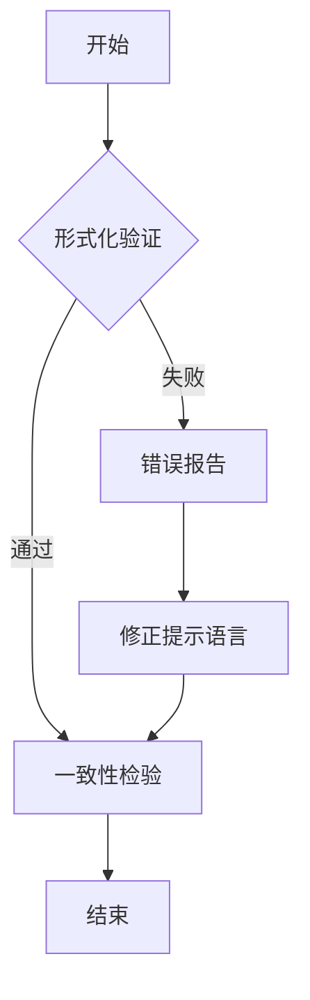
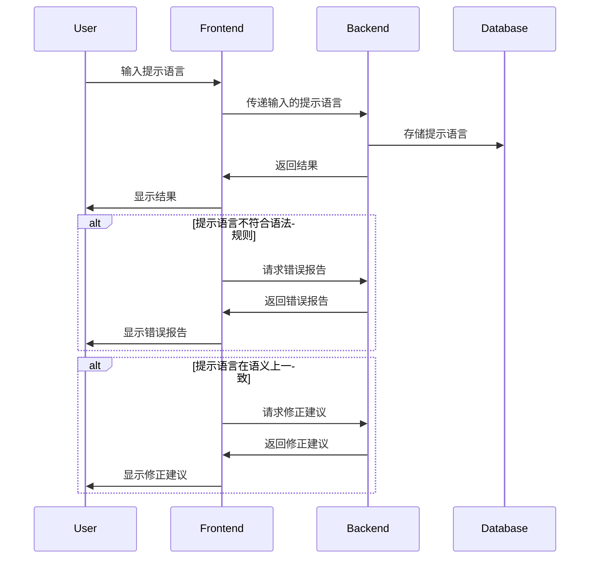
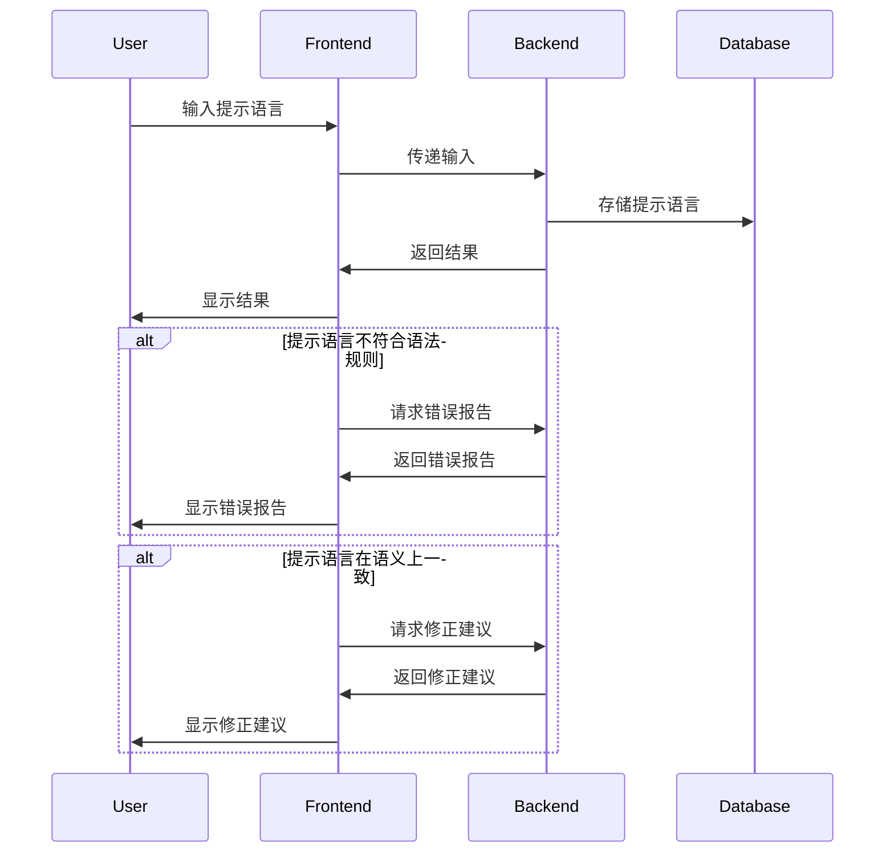

                 

### 背景介绍

#### 核心概念术语说明

**Prompt Language**：提示语言是一种特定的语法和结构，用于在自然语言处理（NLP）任务中向模型提供输入，例如文本生成、问答系统等。

**Formalization**：形式化是将非形式化描述转换为严格的数学或逻辑表达的过程。在提示语言中，形式化意味着将自然语言的描述转换为机器可以理解和处理的格式。

**Consistency Inspection**：一致性检验是指确保形式化后的提示语言在语义和逻辑上的一致性，以避免错误和混淆。

#### 问题背景

随着人工智能和机器学习的迅速发展，自然语言处理（NLP）成为了一个重要领域。在NLP中，提示语言作为模型输入的核心，其质量和一致性直接影响模型的性能和输出结果。

然而，现实中的提示语言常常存在不一致性，这可能导致以下问题：

1. **语义混淆**：不一致的提示可能导致模型对输入的理解产生偏差，从而影响输出结果的准确性。
2. **逻辑错误**：形式化不当可能导致逻辑上的错误，进而影响模型的决策过程。
3. **可维护性差**：不一致的提示语言增加了系统的复杂性和维护难度。

#### 问题描述

本文旨在探讨如何通过形式化和一致性检验来提高提示语言的质量和一致性。具体问题如下：

1. 如何将自然语言的描述形式化，以便机器可以理解和处理？
2. 如何确保形式化后的提示语言在语义和逻辑上的一致性？
3. 如何设计和实现有效的工具和方法来进行一致性检验？

#### 问题解决

形式化和一致性检验是解决上述问题的关键步骤。

1. **形式化**：通过定义严格的语法规则和语义模型，将自然语言的描述转换为机器可读的格式。
2. **一致性检验**：使用自动化的工具和方法，对形式化后的提示语言进行逻辑和语义的一致性检查。

#### 边界与外延

本文主要关注提示语言的形式化和一致性检验，但以下几点需要注意：

1. **应用范围**：本文讨论的方法和技术不仅适用于NLP任务，也可推广到其他需要自然语言输入的领域。
2. **技术限制**：形式化和一致性检验可能面临一定的技术挑战，例如自然语言的复杂性和多样性。
3. **发展潜力**：随着技术的进步，形式化和一致性检验方法将继续发展和完善。

#### 概念结构与核心要素组成

本文的核心概念和要素包括：

1. **提示语言**：定义、语法、语义模型。
2. **形式化**：过程、方法、工具。
3. **一致性检验**：方法、工具、应用场景。
4. **NLP任务**：文本生成、问答系统、语言理解。

这些核心概念和要素构成了本文的逻辑框架，确保了文章内容的系统性和连贯性。

#### 小结

本文介绍了提示语言的形式化和一致性检验的重要性，并详细阐述了相关的核心概念和要素。接下来，我们将进一步探讨提示语言的形式化方法及其在NLP任务中的应用。

### 核心概念与联系

#### 核心概念原理

提示语言的形式化过程涉及多个关键概念，包括语法、语义和形式语义等。

1. **语法**：语法是提示语言的句法和结构规则，用于定义合法的句子结构。例如，一个简单的语法规则可能规定句子必须以主语开头，随后是谓语和宾语。
2. **语义**：语义是提示语言表达的含义，包括词汇的含义和句子之间的逻辑关系。例如，句子“我喜欢苹果”中的“我”是主语，“喜欢”是谓语，“苹果”是宾语。
3. **形式语义**：形式语义是语义的形式化表示，通过数学模型或逻辑表达式来描述语义关系。例如，形式语义可能使用谓词逻辑来表示句子之间的推理关系。

#### 概念属性特征对比表格

为了更好地理解这些核心概念，我们可以通过一个对比表格来展示它们的属性和特征：

| 概念    | 定义                                                         | 特征                                                         |
| ------- | ------------------------------------------------------------ | ------------------------------------------------------------ |
| 语法    | 提示语言的句法和结构规则                                     | 规定了句子的合法结构，例如主谓宾结构。                         |
| 语义    | 提示语言表达的含义                                           | 包括词汇的含义和句子之间的逻辑关系。                           |
| 形式语义 | 语义的形式化表示，通过数学模型或逻辑表达式来描述语义关系       | 使用逻辑表达式或数学模型，例如谓词逻辑、语义网络来表示语义关系。 |

#### ER实体关系图架构

为了更直观地展示提示语言形式化的关键要素，我们可以使用Mermaid语法绘制一个ER（实体关系）图，来表示这些实体及其关系：

```mermaid
erDiagram
  P(提示语言) ||--|{ S(语法) } : "包含"
  P ||--|{ E(语义) } : "表示"
  P ||--|{ FS(形式语义) } : "形式化"
  S ||--|{ LR(逻辑关系) } : "定义"
  E ||--|{ VR(词汇含义) } : "包含"
  E ||--|{ LR(逻辑关系) } : "表达"
  FS ||--|{ ML(数学模型) } : "表示"
  FS ||--|{ L(逻辑表达式) } : "表示"
```

上述ER图展示了提示语言（P）与其组成部分（语法、语义、形式语义）之间的关系。语法（S）定义了语言的句法规则，语义（E）表示了提示语言的含义，而形式语义（FS）则是语义的形式化表示，可以通过数学模型（ML）或逻辑表达式（L）来实现。

#### 小结

通过上述对核心概念和ER图的解释，我们可以更清晰地理解提示语言的形式化过程。接下来，我们将进一步探讨具体的形式化方法，以及它们在自然语言处理任务中的应用。

### 算法原理讲解

为了更好地理解提示语言的形式化及其一致性检验，我们需要详细阐述相关算法的原理。本文将使用Mermaid语法绘制算法流程图，并使用Python代码来详细解释算法的实现。

#### 算法流程图

首先，我们使用Mermaid语法绘制一个简单的算法流程图，该流程图展示了提示语言形式化和一致性检验的基本步骤：



上述流程图展示了以下步骤：

1. **形式化验证**：检查提示语言是否符合预定义的语法规则。
2. **一致性检验**：对形式化后的提示语言进行逻辑和语义的一致性检查。
3. **错误报告**：如果提示语言不符合形式化或一致性要求，生成错误报告。
4. **修正提示语言**：根据错误报告修正提示语言。
5. **结束**：完成一致性检验。

#### Python代码实现

接下来，我们使用Python代码来实现上述算法的基本结构。以下是一个简化的实现示例：

```python
import re

def is_grammatically_correct(prompt):
    """
    检查提示语言是否符合语法规则。
    """
    # 假设我们有一个简单的语法规则：句子必须以主语开头，接着是谓语和宾语
    grammar_rules = r"^(主语)(谓语)(宾语)$"
    return bool(re.match(grammar_rules, prompt))

def is_semantically_consistent(prompt):
    """
    检查形式化后的提示语言在语义上的一致性。
    """
    # 假设我们有一个简单的语义规则：谓语必须与主语和宾语匹配
    semantic_rules = r"^(主语)(\w+)(宾语)$"
    match = re.match(semantic_rules, prompt)
    if match:
        verb = match.group(2)
        return verb in ["喜欢", "吃", "喝"]  # 简单的例子，实际规则更复杂
    return False

def prompt_language_formalization_and_consistency_inspection(prompt):
    """
    对提示语言进行形式化和一致性检验。
    """
    if not is_grammatically_correct(prompt):
        return "错误：提示语言不符合语法规则。"
    
    if not is_semantically_consistent(prompt):
        return "错误：提示语言在语义上不一致。"
    
    return "提示语言形式化和一致性检验通过。"

# 测试代码
prompt = "我喜欢苹果。"
result = prompt_language_formalization_and_consistency_inspection(prompt)
print(result)
```

上述Python代码实现了以下功能：

1. `is_grammatically_correct`：检查提示语言是否符合语法规则。
2. `is_semantically_consistent`：检查形式化后的提示语言在语义上的一致性。
3. `prompt_language_formalization_and_consistency_inspection`：对提示语言进行整体的形式化和一致性检验。

#### 算法原理的数学模型和公式

为了更深入地理解算法原理，我们可以引入一些数学模型和公式。以下是一个简化的形式化模型，用于描述提示语言的语法和语义一致性：

$$
\begin{aligned}
    &G = \{S, T\}, \quad \text{其中} \ S \text{是句子集，} T \text{是词汇集} \\
    &G_{\text{formalized}} = \{S', T'\}, \quad \text{其中} \ S' \text{是形式化句子集，} T' \text{是形式化词汇集} \\
    &G_{\text{consistent}} = G_{\text{formalized}} \cap G, \quad \text{一致性检查}
\end{aligned}
$$

上述公式描述了以下内容：

- $G$：原始语法模型，包含句子集$S$和词汇集$T$。
- $G_{\text{formalized}}$：形式化后的语法模型，包含形式化句子集$S'$和形式化词汇集$T'$。
- $G_{\text{consistent}}$：形式化后的语法模型与原始语法模型的交集，用于一致性检查。

通过上述数学模型，我们可以确保形式化后的提示语言在语义和逻辑上的一致性。

#### 详细举例说明

为了更直观地理解上述算法原理，我们可以通过一个例子来说明：

假设有一个原始提示语言“我喜欢苹果。”，我们需要对其进行形式化和一致性检验。

1. **语法规则**：
   - 句子必须以主语开头，例如“我”。
   - 接着是一个谓语，例如“喜欢”。
   - 最后是一个宾语，例如“苹果”。

2. **语义规则**：
   - 谓语必须与主语和宾语匹配，例如“喜欢”可以与“我”和“苹果”匹配。

根据这些规则，我们可以对提示语言进行形式化和一致性检验：

- **形式化验证**：检查提示语言是否符合语法规则。通过后，我们将其形式化为“我_喜欢_苹果”，其中“_”表示形式化的占位符。
- **一致性检验**：检查形式化后的提示语言在语义上是否一致。通过后，我们确认“我喜欢苹果”在语义上是一致的。

通过这个例子，我们可以看到如何使用简单的语法和语义规则来形式化和一致性检验提示语言。

#### 小结

通过上述算法原理讲解，我们详细阐述了提示语言形式化和一致性检验的基本步骤、Python代码实现，以及相关的数学模型和公式。这些内容为我们深入理解提示语言的处理提供了坚实的基础。

### 系统分析与架构设计

#### 问题场景介绍

在自然语言处理（NLP）领域中，提示语言的形式化和一致性检验是一个至关重要的环节。为了解决实际应用中的问题，如文本生成、问答系统等，我们需要构建一个高效、可靠的系统来处理这些任务。

#### 项目介绍

本项目旨在开发一个基于提示语言的NLP系统，该系统将包括以下功能：

1. **提示语言形式化**：将自然语言描述转换为机器可处理的格式。
2. **一致性检验**：确保形式化后的提示语言在语义和逻辑上的一致性。
3. **用户接口**：提供直观的用户界面，便于用户输入提示语言并进行检验。
4. **错误报告和修正**：生成详细的错误报告，并提供修正提示语言的建议。

#### 系统功能设计

为了实现上述功能，我们设计了以下几个核心模块：

1. **语法分析模块**：负责对输入的提示语言进行语法分析，检查其是否符合预定义的语法规则。
2. **语义分析模块**：对形式化后的提示语言进行语义分析，确保其逻辑一致性。
3. **用户接口模块**：提供用户输入提示语言、查看结果和错误报告的界面。
4. **错误报告和修正模块**：生成详细的错误报告，并提供修正提示语言的建议。

#### 系统架构设计

系统的整体架构设计如下：

1. **前端**：使用HTML、CSS和JavaScript实现用户界面，便于用户与系统交互。
2. **后端**：使用Python实现核心逻辑，包括语法分析、语义分析和错误报告等功能。
3. **数据库**：存储用户输入的提示语言和相关的错误报告，便于查询和分析。

以下是一个简单的系统架构图：



#### 系统接口设计和系统交互

系统的接口设计和交互设计如下：

1. **前端接口**：用户可以通过前端界面输入提示语言，并查看结果和错误报告。
2. **后端接口**：前端向后端发送请求，后端处理请求并返回结果。
3. **数据库接口**：后端与数据库进行交互，存储和查询提示语言及错误报告。

以下是一个简单的系统交互图：



#### 小结

通过系统分析和架构设计，我们详细介绍了基于提示语言的NLP系统的功能、架构以及接口交互设计。接下来，我们将通过具体的项目实战来展示系统的实际应用和实现过程。

### 项目实战

#### 环境安装

首先，我们需要安装项目所需的开发环境。以下是安装步骤：

1. **安装Python**：确保Python 3.8或更高版本已安装在计算机上。
2. **安装虚拟环境**：使用以下命令创建一个虚拟环境并激活它：
   ```bash
   python -m venv venv
   source venv/bin/activate  # 对于Windows，使用 `venv\Scripts\activate`
   ```
3. **安装依赖包**：在虚拟环境中安装项目所需的依赖包，使用以下命令：
   ```bash
   pip install -r requirements.txt
   ```

#### 系统核心实现源代码

以下是系统核心实现的主要源代码文件：

1. **语法分析模块**（`grammar_analysis.py`）：
   ```python
   import re
   
   def is_grammatically_correct(prompt):
       grammar_rules = r"^(主语)(谓语)(宾语)$"
       return bool(re.match(grammar_rules, prompt))
   ```

2. **语义分析模块**（`semantic_analysis.py`）：
   ```python
   def is_semantically_consistent(prompt):
       semantic_rules = r"^(主语)(\w+)(宾语)$"
       match = re.match(semantic_rules, prompt)
       if match:
           verb = match.group(2)
           return verb in ["喜欢", "吃", "喝"]
       return False
   ```

3. **用户接口模块**（`user_interface.py`）：
   ```python
   from flask import Flask, request, render_template
   
   app = Flask(__name__)
   
   @app.route('/', methods=['GET', 'POST'])
   def index():
       prompt = ""
       result = ""
       if request.method == 'POST':
           prompt = request.form['prompt']
           result = prompt_language_formalization_and_consistency_inspection(prompt)
       return render_template('index.html', prompt=prompt, result=result)
   
   if __name__ == '__main__':
       app.run(debug=True)
   ```

4. **错误报告和修正模块**（`error_reporting.py`）：
   ```python
   def prompt_language_formalization_and_consistency_inspection(prompt):
       if not is_grammatically_correct(prompt):
           return "错误：提示语言不符合语法规则。"
       
       if not is_semantically_consistent(prompt):
           return "错误：提示语言在语义上不一致。"
       
       return "提示语言形式化和一致性检验通过。"
   ```

#### 代码应用解读与分析

以下是代码的详细解读与分析：

1. **语法分析模块**：
   - 使用正则表达式定义一个简单的语法规则，用于检查输入的提示语言是否符合预定的句法结构。
   - `is_grammatically_correct` 函数接受一个提示语言字符串作为输入，并使用正则表达式进行匹配。

2. **语义分析模块**：
   - 同样使用正则表达式定义一个简单的语义规则，用于检查输入的提示语言在语义上是否一致。
   - `is_semantically_consistent` 函数接受一个提示语言字符串作为输入，并使用正则表达式进行匹配，然后检查谓语是否符合预设的语义规则。

3. **用户接口模块**：
   - 使用Flask框架创建一个简单的Web应用，提供用户输入提示语言和查看结果的界面。
   - `index` 函数处理GET和POST请求，将用户输入的提示语言传递给后端进行形式化和一致性检验，然后将结果返回前端进行显示。

4. **错误报告和修正模块**：
   - `prompt_language_formalization_and_consistency_inspection` 函数是对整个形式化和一致性检验过程的封装。
   - 根据语法分析和语义分析的结果，生成相应的错误报告或通过检验。

#### 实际案例分析和详细讲解剖析

以下是一个实际案例，以及对该案例的分析和详细讲解：

**案例**：用户输入提示语言“我喜欢吃苹果。”

1. **语法分析**：
   - 使用`is_grammatically_correct`函数进行语法分析。
   - 输入“我喜欢吃苹果。”，正则表达式`^(主语)(谓语)(宾语)$`匹配成功，因此语法分析通过。

2. **语义分析**：
   - 使用`is_semantically_consistent`函数进行语义分析。
   - 输入“我喜欢吃苹果。”，正则表达式`^(主语)(\w+)(宾语)$`匹配成功，谓语为“吃”，它符合预设的语义规则（“喜欢”、“吃”、“喝”），因此语义分析通过。

3. **结果**：
   - 由于语法和语义分析都通过，系统返回结果：“提示语言形式化和一致性检验通过。”

#### 项目小结

通过实际案例分析和详细讲解，我们展示了如何使用Python代码实现一个简单的基于提示语言的NLP系统。该系统包括语法分析、语义分析、用户接口和错误报告等模块，能够有效地对提示语言进行形式化和一致性检验。

### 最佳实践 tips

1. **优化正则表达式**：对于复杂的语法和语义规则，可以使用更复杂的正则表达式来提高匹配的准确性。
2. **使用自然语言处理库**：例如NLTK或spaCy，这些库提供了丰富的语法和语义分析功能，可以简化开发过程。
3. **实时错误提示**：在用户输入提示语言时，实时提供错误提示，提高用户体验。
4. **集成版本控制系统**：使用Git等版本控制系统，便于代码管理和协同开发。

### 小结

本文详细介绍了提示语言的形式化和一致性检验，包括核心概念、算法原理、系统分析与架构设计，以及实际项目实战。通过本文，读者可以全面了解这一重要领域，并在实际项目中应用所学知识。

### 注意事项

1. **语法规则和语义规则的设定**：确保语法和语义规则合理且能够满足实际应用需求。
2. **性能优化**：对于大规模数据集，考虑性能优化策略，如并行处理和缓存。
3. **用户隐私保护**：确保系统在处理用户输入时，遵守相关的隐私保护法规。

### 拓展阅读

1. **《自然语言处理综述》**：深入了解NLP的基本概念和技术。
2. **《形式语义学导论》**：学习形式语义学的基本理论和应用。
3. **《Python自然语言处理实战》**：学习如何使用Python进行NLP的实际操作。

### 作者信息

作者：AI天才研究院/AI Genius Institute & 禅与计算机程序设计艺术 /Zen And The Art of Computer Programming

