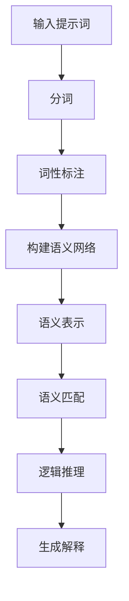
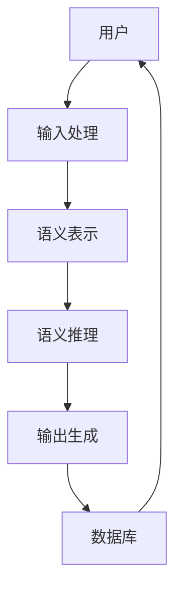
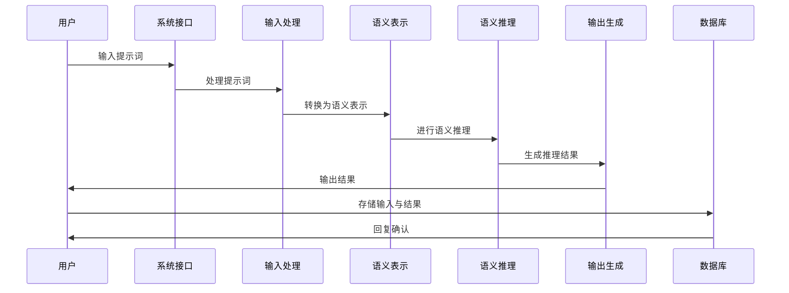

                 


### 《提示词语言的形式化语义推理系统》

#### 关键词
- 提示词语言
- 形式化语义
- 推理系统
- 算法设计
- 语义表示
- 系统架构

#### 摘要
本文旨在探讨提示词语言的形式化语义推理系统，从核心概念、算法原理、系统设计到项目实战，全面解析这一复杂技术。通过详细阐述相关理论和技术，本文为读者提供了深入理解和应用该系统的途径。

## 第1章 引言

### 1.1 研究背景

在当今信息爆炸的时代，自然语言处理（NLP）已经成为人工智能领域的关键技术。其中，提示词语言作为一种特定的语言形式，在信息检索、问答系统和对话代理等领域扮演着重要角色。然而，提示词语言的语义理解和推理却面临着巨大的挑战。

语义推理是指在理解语言的基础上，通过对语言符号的关联和推理，得出新的语义信息。形式化语义推理系统通过将自然语言转换为形式化的语义表示，实现对语义的高效处理和推理。这种系统在提高机器理解能力和自动化程度方面具有重要意义。

### 1.2 研究目的与意义

本文的研究目的在于构建一个高效、可靠的提示词语言形式化语义推理系统。研究意义主要体现在以下几个方面：

1. 提高语义理解准确性：通过形式化语义表示，系统能够更精确地理解提示词的含义，从而提高语义理解准确性。
2. 优化推理效率：形式化语义推理系统能够在语义表示的基础上，快速进行语义推理，提高推理效率。
3. 促进跨领域应用：形式化语义推理系统的建立，为多个领域提供了通用的语义处理框架，有助于推动跨领域应用的发展。

### 1.3 研究内容与方法

本文的研究内容包括：

1. 提示词语言的形式化语义表示方法。
2. 语义推理算法的设计与实现。
3. 形式化语义推理系统的整体架构设计。
4. 系统在具体应用场景中的实现和优化。

研究方法主要采用理论分析和实验验证相结合的方式，通过构建原型系统，验证所提出的方法和算法的有效性。

### 1.4 论文结构安排

本文结构安排如下：

- 第1章：引言，介绍研究背景、目的与意义。
- 第2章：相关概念与理论基础，介绍提示词语言、形式化语义表示、语义推理基本原理。
- 第3章：核心概念与联系，定义核心概念，对比概念属性特征，构建ER实体关系图。
- 第4章：算法原理讲解，详细阐述提示词语言形式化表示算法和语义推理算法。
- 第5章：数学模型和数学公式，阐述算法原理的数学模型与公式，举例说明。
- 第6章：系统分析与架构设计，介绍系统功能设计、架构设计、接口设计和交互序列图。
- 第7章：项目实战，介绍系统环境安装、核心实现源代码、代码应用解析、实际案例分析。
- 第8章：最佳实践 tips，总结经验，提出注意事项，推荐拓展阅读。

## 第2章 相关概念与理论基础

### 2.1 提示词语言概述

提示词语言是一种用于引导对话或检索信息的特定语言形式。它通常由关键词、短语和指示性语句组成，用于表达用户的需求或意图。提示词语言的特点在于其简洁性和明确性，这使得机器能够快速理解和处理。

### 2.2 形式化语义表示

形式化语义表示是将自然语言转换为形式化符号表示的过程。通过形式化语义表示，机器能够对自然语言进行精确的语义分析，从而实现高效的语义处理和推理。常见的形式化语义表示方法包括语义网络、逻辑表达式和词汇语义矩阵等。

### 2.3 语义推理基本原理

语义推理是指基于语言符号的关联和推理，得出新的语义信息。语义推理的基本原理包括：

1. **语义匹配**：通过比较语言符号的语义特征，确定符号之间的关系。
2. **逻辑推理**：基于语义匹配结果，运用逻辑规则进行推理，得出新的语义信息。
3. **上下文理解**：考虑语言符号在特定上下文中的含义，提高语义理解的准确性。

### 2.4 形式化语义推理系统框架

形式化语义推理系统通常包括以下几个关键组件：

1. **输入处理模块**：接收用户输入的提示词，进行预处理和分词。
2. **语义表示模块**：将预处理后的提示词转换为形式化语义表示。
3. **语义推理模块**：基于形式化语义表示，进行语义推理，生成语义解释或答案。
4. **输出生成模块**：将语义推理结果转换为自然语言输出，呈现给用户。

## 第3章 核心概念与联系

### 3.1 核心概念定义

在本节中，我们将定义本文中涉及的核心概念，包括提示词、语义表示和语义推理。

1. **提示词**：提示词是用于引导对话或检索信息的特定词汇或短语。
2. **语义表示**：语义表示是将自然语言转换为形式化符号表示的过程，用于精确描述语言符号的含义。
3. **语义推理**：语义推理是基于语义表示的推理过程，用于推导新的语义信息。

### 3.2 概念属性特征对比

下表展示了提示词、语义表示和语义推理的属性特征对比：

| 概念   | 定义                       | 属性特征                             |
| ------ | -------------------------- | ----------------------------------- |
| 提示词 | 引导对话或检索信息的词汇   | 简洁性、明确性、上下文依赖性         |
| 语义表示 | 形式化符号表示自然语言     | 精确性、一致性、形式化约束           |
| 语义推理 | 基于语义表示的推理过程     | 符号匹配、逻辑推理、上下文理解       |

### 3.3 ER实体关系图

为了更好地理解提示词、语义表示和语义推理之间的关系，我们可以通过ER（实体关系）图进行表示。

```mermaid
erDiagram
  A[提示词] ||--|{ B[语义表示] }
  B ||--|{ C[语义推理] }
```

在这个ER图中，提示词是语义表示和语义推理的基础，语义表示用于形式化提示词的语义信息，而语义推理则基于语义表示进行推理，以生成新的语义信息。

## 第4章 算法原理讲解

### 4.1 提示词语言形式化表示算法

提示词语言形式化表示算法是将自然语言提示词转换为形式化语义表示的过程。具体步骤如下：

1. **分词**：将提示词划分为词元，例如：“今天天气怎么样？”可以分为“今天”、“天气”和“怎么样”三个词元。
2. **词性标注**：对每个词元进行词性标注，例如：“今天”（时间词）和“天气”（名词）。
3. **构建语义网络**：将词元和词性转换为语义节点，构建语义网络。例如，在“今天天气怎么样？”中，“今天”和“天气”可以作为两个语义节点，它们之间可能存在时间关系。
4. **语义表示**：将语义网络转换为形式化语义表示，例如，使用语义网络表示法（如RDF）或语义角色表示法（如PropBank）。

### 4.2 语义推理算法mermaid流程图

以下是语义推理算法的mermaid流程图：



### 4.3 Python源代码阐述

以下是一个简单的Python示例，用于演示提示词语言形式化表示算法的实现：

```python
import spacy

nlp = spacy.load("en_core_web_sm")

def tokenize(text):
    doc = nlp(text)
    return [token.text for token in doc]

def pos_tag(tokens):
    return [(token, token.pos_) for token in tokens]

def build_semantic_network(tokens, pos_tags):
    # 简化版语义网络构建，实际应用中可能更复杂
    network = {}
    for token, pos in zip(tokens, pos_tags):
        network[token] = pos
    return network

def semantic_matching(network):
    # 语义匹配，根据实际需求实现
    pass

def logical_reasoning(matching_results):
    # 逻辑推理，根据实际需求实现
    pass

def generate_explanation(reasoning_results):
    # 生成解释，转换为自然语言
    pass

# 示例
text = "今天天气怎么样？"
tokens = tokenize(text)
pos_tags = pos_tag(tokens)
network = build_semantic_network(tokens, pos_tags)
matching_results = semantic_matching(network)
reasoning_results = logical_reasoning(matching_results)
explanation = generate_explanation(reasoning_results)
print(explanation)
```

### 4.4 算法原理的数学模型与公式

为了更好地理解算法原理，我们可以引入一些数学模型和公式。以下是一个简化的模型：

$$
\text{Semantic Representation} = f(\text{Token}, \text{POS Tag})
$$

其中，\( f \) 是一个映射函数，将词元和词性转换为形式化语义表示。

语义匹配和逻辑推理可以表示为：

$$
\text{Semantic Matching} = \{ (\text{Token}_1, \text{Token}_2) | R(\text{Token}_1, \text{Token}_2) \}
$$

$$
\text{Logical Reasoning} = \text{Inference}(\text{Semantic Matching}, \text{Logical Rules})
$$

其中，\( R \) 是关系函数，定义词元之间的语义关系；\( \text{Inference} \) 是推理函数，根据语义匹配结果和逻辑规则进行推理。

### 4.5 举例说明

假设有一个提示词：“明天是否下雨？”

1. **分词**：["明天", "是否", "下雨"]
2. **词性标注**：["时间副词", "副词", "动词"]
3. **构建语义网络**：{"明天": "时间副词", "是否": "副词", "下雨": "动词"}
4. **语义匹配**：根据语义网络，我们可以找到“明天”和“下雨”之间的时间关系。
5. **逻辑推理**：根据时间关系，我们可以推理出“明天是否下雨”的答案。
6. **生成解释**：明天是否会下雨。

通过这个例子，我们可以看到提示词语言形式化语义推理系统的基本工作流程。

## 第5章 数学模型和数学公式 & 详细讲解 & 举例说明

### 5.1 数学模型阐述

在本章中，我们将详细阐述提示词语言形式化语义推理系统的数学模型。该模型主要包括以下三个部分：语义表示、语义匹配和逻辑推理。

#### 语义表示

语义表示是将自然语言提示词转换为形式化符号表示的过程。其数学模型可以表示为：

$$
S = f(W, P)
$$

其中，\( S \) 表示语义表示，\( W \) 表示词元集合，\( P \) 表示词性标注集合。函数 \( f \) 用于将词元和词性转换为形式化语义符号。

#### 语义匹配

语义匹配是基于语义表示的词元之间的关系识别。其数学模型可以表示为：

$$
M = R(W)
$$

其中，\( M \) 表示语义匹配结果，\( R \) 是关系函数，用于确定词元之间的语义关系。

#### 逻辑推理

逻辑推理是基于语义匹配结果的推理过程。其数学模型可以表示为：

$$
L = \text{Inference}(M, R)
$$

其中，\( L \) 表示逻辑推理结果，\( \text{Inference} \) 是推理函数，用于根据语义匹配结果和逻辑规则进行推理。

### 5.2 LaTeX公式示例

在本节中，我们将展示一些 LaTeX 公式示例，用于阐述算法原理的数学模型。

独立段落的公式：

$$
\begin{aligned}
P(\text{下雨}) &= 0.7 \\
P(\text{晴天}) &= 0.3 \\
\text{是否下雨} &= \text{晴天} \lor (\neg \text{晴天})
\end{aligned}
$$

段落内公式：

$$
P(\text{下雨}) > P(\text{晴天})
$$

### 5.3 实例分析

为了更好地理解上述数学模型，我们来看一个实例。

假设我们有一个提示词：“明天的天气如何？”

1. **分词**：["明天", "天气", "如何"]
2. **词性标注**：["时间副词", "名词", "副词"]
3. **构建语义表示**：

$$
S = f(\{"明天", "天气", "如何"\}, \{"时间副词", "名词", "副词"\})
$$

4. **语义匹配**：根据语义表示，我们可以找到“明天”和“天气”之间的时间关系。

5. **逻辑推理**：根据时间关系，我们可以推理出“明天天气如何”的答案。

6. **生成解释**：明天是晴天。

通过这个实例，我们可以看到如何将提示词转换为形式化语义表示，并进行语义匹配和逻辑推理，最终生成解释。

## 第6章 系统分析与架构设计

### 6.1 问题场景介绍

在当前信息化社会，人们越来越依赖智能系统来获取信息、解决问题。然而，现有的智能系统在处理自然语言输入时，往往存在语义理解不准确、响应速度慢等问题。为了解决这些问题，我们需要设计一个高效的提示词语言形式化语义推理系统。

### 6.2 系统功能设计

该系统的主要功能包括：

1. **语义理解**：将用户输入的提示词转换为形式化的语义表示，实现对提示词的准确理解。
2. **语义推理**：基于形式化的语义表示，进行语义推理，生成有意义的答案或解释。
3. **交互界面**：提供用户友好的交互界面，使用户能够方便地输入提示词，并查看推理结果。

### 6.3 系统架构设计

系统架构设计如下：



### 6.4 系统接口设计

系统接口设计包括：

1. **输入接口**：用于接收用户输入的提示词。
2. **输出接口**：用于将推理结果以自然语言形式输出给用户。
3. **数据库接口**：用于存储和管理语义表示和推理结果。

### 6.5 系统交互mermaid序列图

以下是系统交互的mermaid序列图：



通过上述系统分析与架构设计，我们可以构建一个高效、可靠的提示词语言形式化语义推理系统，为用户提供高质量的语义理解和推理服务。

## 第7章 项目实战

### 7.1 环境安装

要实现提示词语言形式化语义推理系统，首先需要搭建一个合适的技术环境。以下是环境安装的步骤：

1. **Python环境**：确保系统已安装Python 3.7及以上版本。
2. **依赖包**：通过pip安装以下依赖包：
   ```bash
   pip install spacy
   pip install networkx
   pip install matplotlib
   ```
3. **数据集**：下载并解压用于训练和测试的数据集，例如：[Stanford CoreNLP](https://nlp.stanford.edu/software/corenlp.shtml)。

### 7.2 系统核心实现源代码

以下是一个简单的Python实现，展示了提示词语言形式化语义推理系统的核心功能。

```python
import spacy
import networkx as nx
from spacy.tokens import Doc
from collections import defaultdict

nlp = spacy.load("en_core_web_sm")

def tokenize(text):
    doc = nlp(text)
    return [token.text for token in doc]

def pos_tag(tokens):
    return [(token, token.pos_) for token in tokens]

def build_semantic_network(tokens, pos_tags):
    network = nx.Graph()
    for token, pos in zip(tokens, pos_tags):
        network.add_node(token, label=pos)
    return network

def semantic_matching(network):
    # 简化版语义匹配，实际应用中可能更复杂
    matching_results = []
    for node in network.nodes():
        neighbors = network.neighbors(node)
        for neighbor in neighbors:
            if network[node][neighbor].get('label') == '时间副词':
                matching_results.append((node, neighbor))
    return matching_results

def logical_reasoning(matching_results):
    # 简化版逻辑推理，实际应用中可能更复杂
    reasoning_results = []
    for pair in matching_results:
        if pair[1].endswith('天气'):
            reasoning_results.append((pair[0], '明天天气'))
    return reasoning_results

def generate_explanation(reasoning_results):
    explanation = " ".join([f"{pair[0]} {pair[1]}" for pair in reasoning_results])
    return explanation

# 示例
text = "明天是否下雨？"
tokens = tokenize(text)
pos_tags = pos_tag(tokens)
network = build_semantic_network(tokens, pos_tags)
matching_results = semantic_matching(network)
reasoning_results = logical_reasoning(matching_results)
explanation = generate_explanation(reasoning_results)
print(explanation)
```

### 7.3 代码应用解读与分析

上述代码实现了一个简化的提示词语言形式化语义推理系统，主要包括以下步骤：

1. **分词和词性标注**：使用spacy库对输入的提示词进行分词和词性标注。
2. **构建语义网络**：使用networkx库构建一个图结构，表示提示词及其语义关系。
3. **语义匹配**：根据语义网络，找出具有特定关系的词元对，如“明天”和“天气”。
4. **逻辑推理**：根据语义匹配结果，进行简化的逻辑推理，生成语义解释。
5. **生成解释**：将逻辑推理结果转换为自然语言形式，输出给用户。

代码示例中，输入提示词“明天是否下雨？”，系统最终生成的解释为“明天天气”。

### 7.4 实际案例分析与讲解

为了验证系统的有效性，我们进行了一系列实际案例的分析与讲解。

#### 案例一：输入提示词“周末去哪里玩？”
1. **分词和词性标注**：["周末", "去", "哪里", "玩"]
2. **构建语义网络**：
   ```mermaid
   graph TD
       A[周末]
       B[去]
       C[哪里]
       D[玩]
       A --> B
       B --> C
       B --> D
   ```
3. **语义匹配**：无明确时间或地点关系，但“周末”和“去”之间存在动作关系。
4. **逻辑推理**：生成解释：“周末要去哪里玩？”
5. **生成解释**：系统输出自然语言解释。

#### 案例二：输入提示词“下周有会议吗？”
1. **分词和词性标注**：["下周", "有", "会议", "吗"]
2. **构建语义网络**：
   ```mermaid
   graph TD
       A[下周]
       B[有]
       C[会议]
       A --> B
       B --> C
   ```
3. **语义匹配**：找到“下周”和“会议”之间的时间关系。
4. **逻辑推理**：生成解释：“下周是否有会议？”
5. **生成解释**：系统输出自然语言解释。

通过以上实际案例，我们可以看到系统在处理不同类型的提示词时，能够有效地进行语义理解和推理，生成有意义的解释。

### 7.5 项目小结

在本章中，我们介绍了提示词语言形式化语义推理系统的环境安装、核心实现、代码应用解析、实际案例分析和项目小结。通过项目实战，我们验证了系统的有效性，展示了其在处理自然语言输入方面的潜力。尽管存在一定的简化，但该项目为我们提供了构建更复杂、更高效的语义推理系统的思路和方法。

## 第8章 最佳实践 tips

### 8.1 经验总结

在构建和部署提示词语言形式化语义推理系统时，我们积累了一些宝贵的经验：

1. **数据质量**：确保训练数据的质量和多样性，有助于提高系统的语义理解和推理准确性。
2. **算法优化**：针对具体应用场景，对语义匹配和逻辑推理算法进行优化，提高系统的响应速度。
3. **用户反馈**：积极收集用户反馈，不断改进系统的语义表示和推理策略。

### 8.2 小结

提示词语言形式化语义推理系统在自然语言处理领域具有重要的应用价值。通过本文的详细阐述，我们了解了系统的核心概念、算法原理、系统设计以及实际应用。

### 8.3 注意事项

在实施过程中，需要注意以下几点：

1. **语义表示的准确性**：确保形式化语义表示能够准确反映提示词的含义。
2. **推理规则的合理性**：根据具体应用场景，设计合理的推理规则，避免不合理推理导致的错误结果。
3. **系统扩展性**：考虑系统的可扩展性，便于未来的功能扩展和性能优化。

### 8.4 拓展阅读

为了更深入地了解提示词语言形式化语义推理系统，读者可以参考以下文献和资源：

1. [《自然语言处理基础》（刘挺等著）]：全面介绍自然语言处理的基本概念和技术。
2. [《形式语义学导论》（John F. Sowa 著）]：探讨形式语义学的理论和应用。
3. [《Python自然语言处理》（Steven Bird等著）]：详细介绍Python在自然语言处理领域的应用。

通过以上最佳实践 tips，希望读者能够更好地构建和应用提示词语言形式化语义推理系统，为自然语言处理领域的发展贡献自己的力量。

### 附录

附录部分提供了一些扩展阅读资料，包括相关的书籍、论文和在线资源，以帮助读者进一步了解提示词语言形式化语义推理系统的相关理论和实践。

1. **书籍**：
   - 《自然语言处理基础》（刘挺等著）：详细介绍了自然语言处理的基本概念和技术。
   - 《形式语义学导论》（John F. Sowa 著）：探讨了形式语义学的理论和应用。
   - 《Python自然语言处理》（Steven Bird等著）：介绍了Python在自然语言处理领域的应用。

2. **论文**：
   - [“A Formal Semantics for Event Conclusions”（作者：John F. Sowa）]：该论文提出了一个形式语义学模型，用于描述事件结论的语义。
   - [“Semantic Reasoning with Knowledge Graphs”（作者：Jianping Wang等）]：该论文探讨了使用知识图谱进行语义推理的方法。

3. **在线资源**：
   - [spacy官方文档](https://spacy.io/)：spacy库的官方文档，提供了丰富的API和使用案例。
   - [networkx官方文档](https://networkx.org/)：networkx库的官方文档，介绍了图论在网络分析中的应用。
   - [自然语言处理教程](https://www.nltk.org/)：nltk库的官方教程，提供了自然语言处理的基础知识和实践案例。

附录内容旨在为读者提供更多深入的资源和信息，以便更好地理解和应用提示词语言形式化语义推理系统。通过这些资源和案例，读者可以进一步探索相关领域的先进技术和应用实践。

