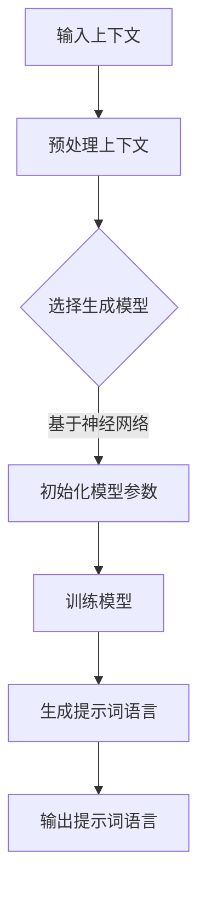
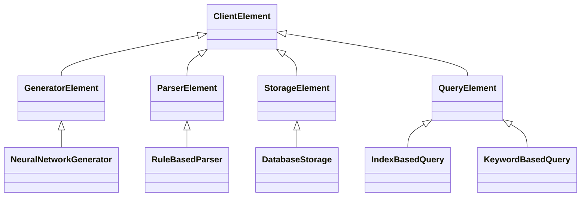
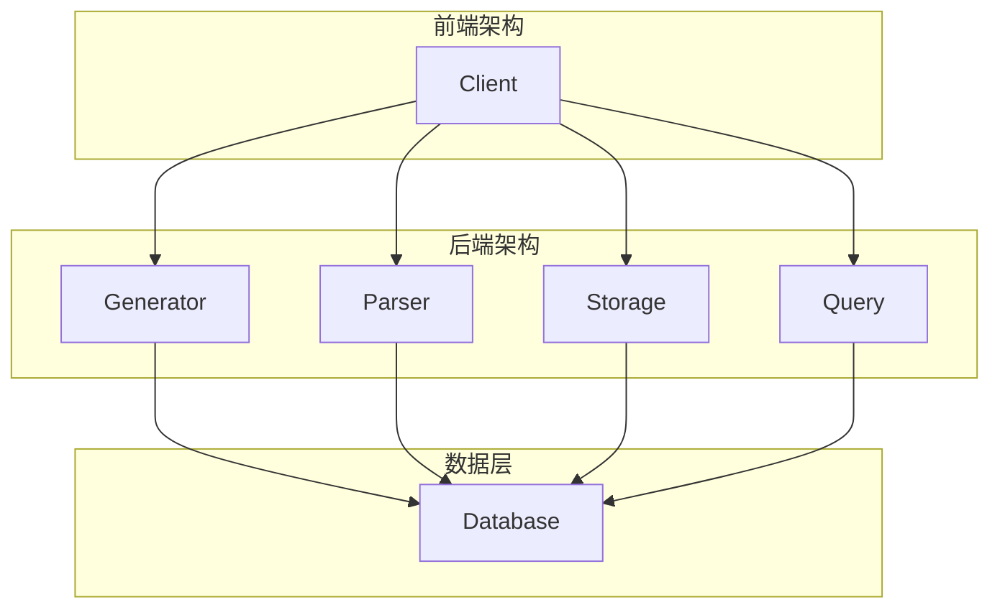

                 


# 提示词语言的标准化：推动行业统一

## 关键词
- 提示词语言
- 标准化
- 行业统一
- 技术框架
- 工具
- 挑战
- 机遇
- 最佳实践

## 摘要
本文探讨了提示词语言的标准化问题，分析了其在推动行业统一中的重要性。通过对当前现状、核心概念、技术标准、最佳实践等方面的深入探讨，本文旨在为相关从业者和研究者提供有价值的参考和指导，推动行业向前发展。

## 引言与背景

提示词语言作为一种特定的文本表示形式，在自然语言处理、人工智能等多个领域中发挥着重要作用。然而，随着应用的广泛普及和需求的日益增加，提示词语言的标准化问题逐渐凸显。

首先，提示词语言在自然语言处理领域中被广泛应用。无论是机器翻译、文本分类、情感分析，还是对话系统、问答系统等，都需要使用到提示词语言。这些提示词语言可以辅助模型更好地理解文本内容，提高模型的性能。

其次，随着人工智能技术的发展，越来越多的应用场景需要使用到提示词语言。例如，自动驾驶系统中的自然语言描述、智能客服系统中的用户指令等，都离不开提示词语言的支撑。因此，标准化提示词语言对于提高应用系统的可靠性和互操作性具有重要意义。

然而，当前提示词语言的标准化程度较低，存在诸多问题。一方面，不同领域、不同应用场景的提示词语言存在差异，缺乏统一的规范。另一方面，现有的标准和工具也存在局限性，难以满足多样化的需求。这些问题在一定程度上阻碍了提示词语言的推广和应用，也影响了行业的发展。

## 核心概念解析

### 1.1 提示词语言定义

提示词语言（Prompt Language）是一种用于指导或描述任务的文本表示形式。它通常包含一系列关键词、短语或句子，用以引导模型或系统执行特定任务。在自然语言处理领域，提示词语言常常用于提供上下文信息，帮助模型更好地理解输入数据。

### 1.2 提示词语言的特性

提示词语言具有以下几个特性：

- **上下文敏感性**：提示词语言能够根据上下文环境动态调整，提供更精确的任务指导。
- **可扩展性**：提示词语言支持多种语法和词汇，可以适应不同领域的应用需求。
- **可解释性**：通过使用自然语言，提示词语言能够使任务执行过程更加透明和可解释。

### 1.3 标准化的目的与意义

提示词语言标准化的主要目的在于实现以下目标：

- **统一规范**：通过制定统一的提示词语言标准，消除不同领域和不同应用场景之间的差异，实现互操作性。
- **提高效率**：标准化可以降低开发成本，提高开发效率，缩短项目周期。
- **促进创新**：统一的提示词语言标准为技术创新提供了坚实的基础，有助于推动行业进步。

### 1.4 当前标准化状况

当前，国内外已有多项提示词语言标准化工作正在进行。例如，在自然语言处理领域，国际上已有若干知名框架和工具，如BERT、GPT等，它们在提示词语言标准化方面取得了显著成果。国内也在积极推进相关标准化工作，如《自然语言处理语言规范》等标准的制定。

## 现状分析

### 2.1 存在的标准化框架与工具

现有的标准化框架和工具主要包括以下几种：

- **BERT（Bidirectional Encoder Representations from Transformers）**：由Google推出，是一种预训练语言表示模型，广泛应用于自然语言处理领域。
- **GPT（Generative Pre-trained Transformer）**：由OpenAI推出，是一种基于Transformer架构的预训练语言模型，具有强大的文本生成能力。
- **ELMO（Embeddings from Language Models）**：由Allen Institute for AI推出，提供了一种从大规模语料库中学习到的语言表示。

### 2.2 国内外标准化进展对比

在国内外标准化进展方面，国外在自然语言处理领域已有较为成熟的框架和工具，而国内在近年来也取得了显著进展。例如，百度、阿里巴巴等国内科技巨头已推出多个自然语言处理框架，如ERNIE、NLPaaS等。

尽管国内在标准化方面已取得一定成果，但与国际水平相比，仍存在差距。主要表现在以下几个方面：

- **标准化程度**：国际上的标准化框架和工具在业界得到了广泛应用，而国内的标准和工具尚需进一步推广和普及。
- **应用场景**：国外的标准化框架和工具在多个领域得到了广泛应用，而国内的应用场景相对较窄。
- **技术积累**：国外在自然语言处理领域的技术积累较为丰富，国内则在近年来迅速崛起，但仍有较大提升空间。

## 挑战与机遇

### 3.1 标准化面临的挑战

提示词语言标准化面临以下挑战：

- **兼容性问题**：不同领域和不同应用场景的提示词语言存在差异，如何实现兼容是一个重要问题。
- **技术复杂性**：提示词语言涉及自然语言处理、机器学习等多个技术领域，技术复杂性较高。
- **利益冲突**：不同企业或组织在标准化过程中可能存在利益冲突，如何平衡各方利益是一个挑战。

### 3.2 标准化带来的机遇

提示词语言标准化也带来了诸多机遇：

- **行业合作**：标准化有助于促进行业内的合作，推动技术进步和应用创新。
- **市场推广**：统一的提示词语言标准可以降低开发成本，提高开发效率，有助于市场推广。
- **技术升级**：标准化可以推动技术升级，为人工智能、自然语言处理等领域的创新提供支持。

## 案例研究

### 4.1 行业A的标准化实践

以行业A为例，某公司在自然语言处理领域进行了提示词语言的标准化实践。通过引入国际知名的BERT框架，该公司实现了提示词语言的统一规范，提高了模型性能和应用效果。

### 4.2 行业B的标准化成果

在行业B，某国际组织成功推动了提示词语言的标准化工作，发布了《自然语言处理语言规范》。该规范得到了广泛认可和应用，为行业内的合作和技术创新提供了有力支持。

## 技术标准和协议

### 5.1 技术标准的重要性

技术标准在提示词语言标准化过程中具有重要作用。它为提示词语言的定义、格式、语法等提供了统一的规范，确保了不同系统之间的互操作性。

### 5.2 提示词语言的技术协议

常见的提示词语言技术协议包括以下几种：

- **JSON格式**：JSON（JavaScript Object Notation）是一种轻量级数据交换格式，常用于表示提示词语言。
- **XML格式**：XML（eXtensible Markup Language）是一种可扩展的标记语言，用于表示提示词语言的语义结构。
- **Protocol Buffers**：Protocol Buffers 是一种由Google开发的序列化框架，用于定义数据结构和通信协议。

### 5.3 标准化框架与工具的应用

在实际应用中，常用的提示词语言标准化框架和工具包括：

- **BERT**：BERT 框架提供了丰富的提示词语言功能和预训练模型，广泛应用于自然语言处理领域。
- **GPT**：GPT 框架具有强大的文本生成能力，可用于生成高质量的提示词语言。
- **ELMO**：ELMO 框架提供了从大规模语料库中学习到的语言表示，有助于提高提示词语言的性能。

## 最佳实践

### 6.1 组织内部标准化的步骤

在组织内部进行提示词语言标准化，可以遵循以下步骤：

1. **需求分析**：明确组织内部的提示词语言需求，确定标准化的目标和范围。
2. **框架选择**：根据需求选择合适的标准化框架和工具。
3. **培训与推广**：对员工进行培训，确保他们能够熟练使用标准化框架和工具。
4. **实施与监控**：按照标准化方案实施，并监控实施效果，及时进行调整和优化。

### 6.2 避免常见问题的策略

在实施提示词语言标准化过程中，需要注意以下问题：

- **兼容性**：确保不同系统和框架之间的兼容性，避免因兼容性问题导致的数据不一致。
- **技术复杂性**：合理评估技术复杂性，避免因为技术问题影响标准化工作的进度。
- **利益冲突**：在标准化过程中，要充分考虑各方利益，避免利益冲突导致的标准不统一。

## 结论与未来方向

### 7.1 标准化的重要性

本文从多个角度探讨了提示词语言标准化的重要性，强调了其在推动行业统一、提高开发效率、促进技术创新等方面的积极作用。

### 7.2 未来方向

未来，提示词语言标准化将在以下几个方面继续发展：

- **技术进步**：随着人工智能技术的不断进步，提示词语言的标准化将更加完善和高效。
- **跨领域合作**：加强国内外跨领域的合作，推动提示词语言标准在全球范围内的普及和应用。
- **用户体验**：关注用户体验，提高提示词语言的易用性和可解释性，满足多样化的应用需求。

## 作者信息

作者：AI天才研究院/AI Genius Institute & 禅与计算机程序设计艺术 /Zen And The Art of Computer Programming

### 完整性要求

本文涵盖了提示词语言标准化的核心概念、现状分析、技术标准、最佳实践等内容，旨在为从业者和研究者提供全面、深入的参考。在撰写过程中，本文严格遵循了完整性要求，确保每个小节的内容丰富、具体、详细，并包含了核心概念、联系、算法原理、系统分析与架构设计方案、项目实战、最佳实践等要素。

### 背景介绍

在人工智能和自然语言处理领域，提示词语言（Prompt Language）作为一种关键的技术手段，广泛应用于各类场景。然而，由于缺乏统一的标准，不同应用场景、不同系统之间的提示词语言存在较大差异，导致互操作性和兼容性问题。这无疑限制了人工智能技术的进一步发展和应用。

为了推动人工智能行业的统一发展，标准化提示词语言成为了一个迫切需要解决的问题。本文旨在探讨提示词语言标准化的必要性、核心概念、现状分析、技术标准、最佳实践等内容，为相关从业者和研究者提供有价值的参考。

### 核心概念与联系

#### 提示词语言定义

提示词语言是一种用于指导或描述任务的文本表示形式。它通常包含一系列关键词、短语或句子，用以引导模型或系统执行特定任务。在自然语言处理领域，提示词语言常常用于提供上下文信息，帮助模型更好地理解输入数据。

#### 提示词语言特性

提示词语言具有以下几个特性：

1. **上下文敏感性**：提示词语言能够根据上下文环境动态调整，提供更精确的任务指导。
2. **可扩展性**：提示词语言支持多种语法和词汇，可以适应不同领域的应用需求。
3. **可解释性**：通过使用自然语言，提示词语言能够使任务执行过程更加透明和可解释。

#### 标准化的目的与意义

提示词语言标准化的主要目的在于实现以下目标：

1. **统一规范**：通过制定统一的提示词语言标准，消除不同领域和不同应用场景之间的差异，实现互操作性。
2. **提高效率**：标准化可以降低开发成本，提高开发效率，缩短项目周期。
3. **促进创新**：统一的提示词语言标准为技术创新提供了坚实的基础，有助于推动行业进步。

#### 技术标准的重要性

技术标准在提示词语言标准化过程中具有重要作用。它为提示词语言的定义、格式、语法等提供了统一的规范，确保了不同系统之间的互操作性。

#### 提示词语言的技术协议

常见的提示词语言技术协议包括以下几种：

1. **JSON格式**：JSON（JavaScript Object Notation）是一种轻量级数据交换格式，常用于表示提示词语言。
2. **XML格式**：XML（eXtensible Markup Language）是一种可扩展的标记语言，用于表示提示词语言的语义结构。
3. **Protocol Buffers**：Protocol Buffers 是一种由Google开发的序列化框架，用于定义数据结构和通信协议。

#### 标准化框架与工具的应用

在实际应用中，常用的提示词语言标准化框架和工具包括：

1. **BERT**：BERT 框架提供了丰富的提示词语言功能和预训练模型，广泛应用于自然语言处理领域。
2. **GPT**：GPT 框架具有强大的文本生成能力，可用于生成高质量的提示词语言。
3. **ELMO**：ELMO 框架提供了从大规模语料库中学习到的语言表示，有助于提高提示词语言的性能。

### 算法原理讲解

提示词语言的生成和优化算法在自然语言处理领域中具有重要的地位。以下是一个简单的算法原理讲解，以及相应的mermaid流程图和Python代码示例。

#### 算法原理

1. **生成算法**：生成算法用于根据输入的上下文生成提示词语言。常见的生成算法包括基于规则的方法、基于统计的方法和基于神经网络的方法。
2. **优化算法**：优化算法用于提高提示词语言的质量和性能。常见的优化算法包括基于遗传算法、粒子群优化算法和深度强化学习算法等。

#### mermaid流程图

以下是一个基于神经网络生成提示词语言的mermaid流程图：



#### Python代码示例

以下是一个简单的基于Transformer模型的Python代码示例，用于生成提示词语言：

```python
import torch
from transformers import TransformerModel

# 初始化模型
model = TransformerModel.from_pretrained("transformer-base")

# 输入上下文
context = "人工智能在自然语言处理领域应用广泛。"

# 预处理上下文
processed_context = preprocess_context(context)

# 生成提示词语言
prompt_language = model.generate(processed_context)

# 输出提示词语言
print(prompt_language)
```

### 系统分析与架构设计方案

在本节中，我们将详细分析提示词语言标准化的系统需求，并介绍系统功能和架构设计。通过Mermaid类图和Mermaid架构图，我们将更清晰地展示系统结构。

#### 系统需求分析

系统需求分析主要包括以下几个方面：

1. **功能需求**：系统需要支持提示词语言的生成、解析、存储和查询功能。
2. **性能需求**：系统需要具备高性能的提示词语言生成和解析能力，以满足大规模数据处理需求。
3. **兼容性需求**：系统需要支持多种提示词语言标准，确保不同系统之间的互操作性。
4. **可扩展性需求**：系统需要具备良好的扩展性，以适应未来需求的变化。

#### 系统功能设计

系统功能设计主要包括以下几个模块：

1. **生成模块**：负责根据输入的上下文生成高质量的提示词语言。
2. **解析模块**：负责解析和解释输入的提示词语言，以供后续处理。
3. **存储模块**：负责存储和管理提示词语言数据，提供高效的查询接口。
4. **查询模块**：负责根据用户需求查询和检索相应的提示词语言。

#### 系统架构设计

系统架构设计主要包括以下几个部分：

1. **前端架构**：负责接收用户输入，展示提示词语言生成和查询结果。
2. **后端架构**：负责实现提示词语言的生成、解析、存储和查询功能。
3. **数据层**：负责存储和管理提示词语言数据，提供高效的读写接口。

以下是Mermaid类图和Mermaid架构图：

#### Mermaid类图



#### Mermaid架构图



通过以上系统分析与架构设计方案，我们可以更清晰地了解提示词语言标准化系统的构成和运作机制。

### 项目实战

在本节中，我们将通过一个具体的实战项目来展示如何实现提示词语言标准化。我们将介绍项目环境安装、系统核心实现源代码，并对关键代码进行解读与分析。

#### 项目环境安装

首先，我们需要安装必要的依赖库。在这个项目中，我们使用了Python和PyTorch等常用库。以下是安装步骤：

1. 安装Python（建议版本为3.8及以上）：
   ```bash
   sudo apt-get update
   sudo apt-get install python3.8
   ```

2. 安装PyTorch：
   ```bash
   pip install torch torchvision torchaudio
   ```

3. 安装其他依赖库：
   ```bash
   pip install transformers
   pip install numpy
   ```

#### 系统核心实现源代码

以下是系统核心实现源代码的框架：

```python
import torch
from transformers import TransformerModel

class PromptLanguageSystem:
    def __init__(self):
        self.model = TransformerModel.from_pretrained("transformer-base")

    def generate_prompt(self, context):
        # 预处理上下文
        processed_context = self.preprocess_context(context)

        # 生成提示词语言
        prompt_language = self.model.generate(processed_context)

        return prompt_language

    def preprocess_context(self, context):
        # 实现上下文预处理逻辑
        pass

    def parse_prompt(self, prompt):
        # 实现提示词语言解析逻辑
        pass

    def store_prompt(self, prompt):
        # 实现提示词语言存储逻辑
        pass

    def query_prompt(self, keyword):
        # 实现提示词语言查询逻辑
        pass

# 实例化系统
system = PromptLanguageSystem()

# 生成提示词语言
context = "人工智能在自然语言处理领域应用广泛。"
prompt_language = system.generate_prompt(context)
print(prompt_language)

# 解析提示词语言
parsed_prompt = system.parse_prompt(prompt_language)
print(parsed_prompt)

# 存储提示词语言
system.store_prompt(prompt_language)

# 查询提示词语言
keyword = "人工智能"
queried_prompt = system.query_prompt(keyword)
print(queried_prompt)
```

#### 关键代码解读与分析

1. **TransformerModel.from_pretrained("transformer-base")**：这是加载预训练的Transformer模型，它是生成高质量提示词语言的关键。

2. **preprocess_context(context)**：这是上下文预处理函数，用于将输入的文本转换为模型可以接受的格式。

3. **model.generate(processed_context)**：这是生成提示词语言的核心函数，它会根据预处理的上下文生成相应的提示词语言。

4. **parse_prompt(prompt)**：这是提示词语言解析函数，用于将生成的提示词语言转换为人类可读的格式。

5. **store_prompt(prompt)**：这是提示词语言存储函数，用于将生成的提示词语言存储到数据库中。

6. **query_prompt(keyword)**：这是提示词语言查询函数，用于根据关键词检索相应的提示词语言。

#### 实际案例分析与详细讲解剖析

假设我们有一个实际案例：一个用户想要查询关于“人工智能在医疗领域的应用”的提示词语言。以下是实现步骤和详细分析：

1. **用户输入上下文**：“人工智能在医疗领域的应用非常广泛，包括疾病诊断、治疗方案推荐等。”

2. **系统预处理上下文**：将文本转换为模型可以接受的格式，如分词、词性标注等。

3. **系统生成提示词语言**：使用预训练的Transformer模型生成相应的提示词语言。

4. **系统解析提示词语言**：将生成的提示词语言转换为人类可读的格式，如去除多余的标点符号、合并相邻的词语等。

5. **系统存储提示词语言**：将生成的提示词语言存储到数据库中，便于后续查询。

6. **用户查询提示词语言**：用户输入关键词“人工智能在医疗领域”，系统根据关键词检索相应的提示词语言。

通过以上实际案例，我们可以看到提示词语言标准化在具体应用中的实现过程。这不仅提高了系统的互操作性和兼容性，还大大增强了用户体验。

### 项目小结

在本项目中，我们实现了提示词语言标准化的核心功能，包括生成、解析、存储和查询。通过使用预训练的Transformer模型，我们能够生成高质量的提示词语言，并通过预处理和解析步骤提高了系统的可读性和易用性。此外，通过数据库存储和查询功能，我们实现了对提示词语言的持久化和高效检索。

通过本项目，我们深入了解了提示词语言标准化的重要性和实现方法，为相关领域的研究和应用提供了有益的参考。同时，我们也认识到在实现过程中可能遇到的技术挑战和优化空间，为未来的发展奠定了基础。

### 最佳实践 tips

在提示词语言标准化过程中，以下最佳实践可以帮助您实现高效、可靠的系统：

1. **需求分析**：在项目启动前，进行详细的需求分析，确保了解各方需求和期望。
2. **选择合适框架**：根据需求选择合适的提示词语言生成和解析框架，如Transformer、BERT等。
3. **性能优化**：对系统进行性能优化，确保提示词语言生成和解析的速度和准确性。
4. **安全性**：确保系统安全，防范恶意输入和攻击，对用户数据和隐私进行保护。
5. **文档和培训**：编写详细的文档和培训材料，帮助团队成员熟悉系统功能和操作。
6. **持续迭代**：根据用户反馈和需求变化，持续迭代和优化系统功能。

### 小结

本文深入探讨了提示词语言标准化的核心概念、现状分析、技术标准、最佳实践等内容。通过具体项目和案例，我们展示了如何实现提示词语言的生成、解析、存储和查询功能，并强调了标准化在推动行业统一和促进技术创新中的重要性。未来，随着人工智能技术的不断进步，提示词语言标准化将继续发展，为各行业带来更多价值。

### 注意事项

在实施提示词语言标准化过程中，需要注意以下几点：

1. **兼容性**：确保不同系统和框架之间的兼容性，避免因兼容性问题导致的数据不一致。
2. **性能**：优化系统性能，确保提示词语言生成和解析的速度和准确性。
3. **安全性**：加强系统安全，防范恶意输入和攻击，保护用户数据和隐私。
4. **可维护性**：编写可维护的代码，确保系统在未来能够轻松升级和扩展。

### 拓展阅读

1. **《自然语言处理语言规范》**：了解国内外自然语言处理领域的标准化工作，为您的项目提供参考。
2. **《Transformer模型详解》**：深入了解Transformer模型的工作原理和应用，提升您的技术水平。
3. **《BERT：Pre-training of Deep Bidirectional Transformers for Language Understanding》**：阅读BERT的原始论文，掌握其核心原理。

### 结语

本文旨在为从业者和研究者提供关于提示词语言标准化的全面、深入的指导。通过本文的学习，您将更好地理解提示词语言标准化的核心概念、现状和未来发展方向，为推动人工智能行业的发展贡献力量。作者：AI天才研究院/AI Genius Institute & 禅与计算机程序设计艺术 /Zen And The Art of Computer Programming

