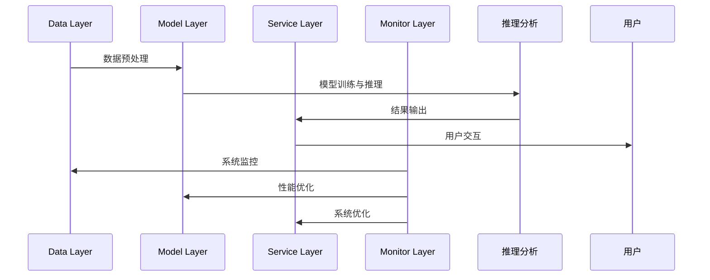
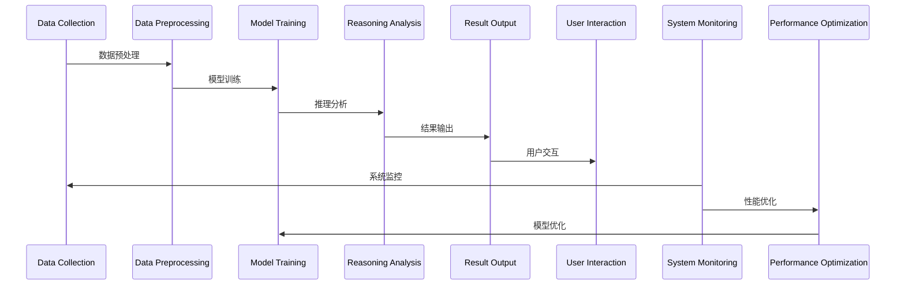
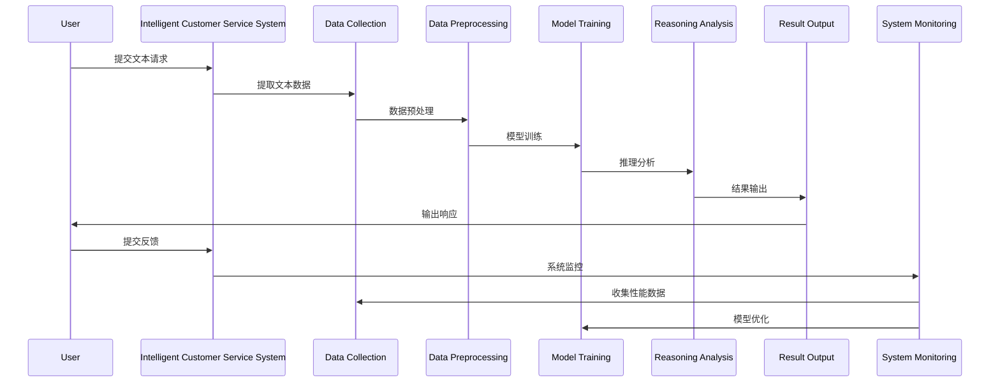

                 


### 一、背景介绍

#### 1.1 问题背景

在现代信息技术领域，自然语言处理（NLP）的重要性日益凸显。随着互联网的迅猛发展，大量非结构化数据如文本、图像、音频等不断涌现，如何有效地处理和利用这些数据成为了一个亟待解决的问题。而NLP作为人工智能的核心技术之一，通过对语言数据的解析、理解和生成，为各种应用场景提供了强大的支持。

在NLP领域中，语言模型和符号处理技术是两个关键组成部分。传统语言模型通常基于统计模型或者规则模型，虽然在一定程度上能够处理语言数据，但在复杂性和灵活性方面存在一定的局限性。近年来，随着深度学习技术的崛起，神经网络语言模型（如循环神经网络RNN、变换器网络Transformer等）逐渐成为研究热点，并在各种NLP任务中取得了显著成果。

然而，传统的神经网络语言模型在处理语言符号时，往往忽略了符号之间的逻辑关系和语义信息，导致模型的解释能力和泛化能力受到限制。为了弥补这一不足，神经符号整合方法应运而生。神经符号整合方法旨在结合神经网络和符号逻辑的优势，实现对语言数据的高效处理和深度理解。

#### 1.2 核心概念与联系

神经符号整合方法中的核心概念包括提示词（Prompt）、神经符号（Neural Symbol）和整合方法（Integration Method）。

- **提示词**：提示词是神经符号整合方法中的重要组成部分，用于引导神经网络对语言数据进行处理。提示词通常由一系列关键字或短语组成，能够明确地指示神经网络需要关注的信息，从而提高模型的解释能力和准确性。

- **神经符号**：神经符号是指神经网络中用于表示语言数据的符号。与传统符号逻辑中的符号不同，神经符号不仅包含了语言数据的基本属性，还能够捕获语言数据之间的逻辑关系和语义信息。

- **整合方法**：整合方法是指将神经网络和符号逻辑结合起来，实现语言数据的高效处理和深度理解。整合方法的核心思想是将神经网络中的特征表示与符号逻辑中的推理机制相结合，使得模型能够在处理语言数据时，同时考虑语言数据的语义和逻辑关系。

通过整合方法，神经符号整合方法能够有效地克服传统语言模型的局限性，实现对语言数据的高效处理和深度理解。具体来说，整合方法主要包括以下几个步骤：

1. **提示词生成**：根据应用场景和任务需求，生成一组合适的提示词。

2. **神经网络训练**：使用提示词和大量语言数据进行神经网络训练，提取语言数据的特征表示。

3. **符号逻辑推理**：将训练好的神经网络模型与符号逻辑相结合，实现语言数据的深度理解和推理。

4. **结果输出**：根据推理结果输出相应的语言响应或决策。

#### 1.3 方法概述

神经符号整合方法的基本流程可以分为四个阶段：数据准备、模型训练、推理分析和结果输出。

1. **数据准备**：收集和整理相关的语言数据，包括文本、语音、图像等多种类型的数据。对数据进行预处理，如分词、去噪、标准化等，以提升数据的质量和一致性。

2. **模型训练**：使用提示词和预处理后的语言数据对神经网络进行训练。通过优化神经网络参数，使其能够准确地捕捉语言数据中的特征和关系。

3. **推理分析**：在训练好的神经网络基础上，结合符号逻辑进行推理分析。这一阶段的主要任务是利用神经符号整合方法，对语言数据进行语义解析和逻辑推理，从而获得更深入的理解。

4. **结果输出**：根据推理分析的结果，输出相应的语言响应或决策。这一结果可以用于各种实际应用场景，如自然语言生成、问答系统、文本分类等。

神经符号整合方法的关键技术包括：

- **提示词生成**：提示词生成是神经符号整合方法的关键步骤。一个优秀的提示词能够有效地引导神经网络关注重要的信息，提高模型的解释能力和准确性。

- **神经网络训练**：神经网络训练是神经符号整合方法的核心。通过优化神经网络参数，使其能够准确地捕捉语言数据中的特征和关系。

- **符号逻辑推理**：符号逻辑推理是实现语言数据深度理解的关键。通过将神经网络与符号逻辑相结合，能够实现对语言数据的语义和逻辑关系的全面分析。

#### 1.4 目标读者与本书结构

本书的目标读者主要包括以下几类：

- **NLP研究人员**：对自然语言处理领域感兴趣，希望深入了解神经符号整合方法的研究人员。
- **人工智能工程师**：从事人工智能应用开发，希望在NLP领域有所突破的工程师。
- **数据科学家**：对深度学习和符号逻辑结合感兴趣，希望在数据分析和处理方面有所建树的数据科学家。
- **计算机科学专业学生**：对自然语言处理和人工智能领域有兴趣的学生。

本书的结构如下：

- **第一部分**：引言，介绍神经符号整合方法的背景、核心概念和方法概述。
- **第二部分**：神经符号整合方法原理，详细讲解算法原理、流程图、Python代码实现等。
- **第三部分**：系统架构与设计，介绍系统架构设计及其组成部分。
- **第四部分**：项目实战，通过具体项目实例进行讲解和分析。
- **第五部分**：最佳实践与拓展，总结最佳实践、注意事项和拓展阅读。

### 二、核心概念与联系

#### 2.1 提示词

提示词（Prompt）在神经符号整合方法中扮演着至关重要的角色。它是一组关键字或短语，用于引导神经网络关注特定的信息，从而提高模型的解释能力和准确性。提示词的设计不仅要考虑语言数据的特征，还要结合实际应用场景和任务需求。

首先，我们需要了解提示词的生成过程。在生成提示词时，通常会采用以下几种策略：

1. **基于关键词提取**：通过分析大量的文本数据，提取出与任务相关的关键词，并将其组合成提示词。
2. **基于模板生成**：使用预定义的模板，根据具体任务的需求，将相关参数填充到模板中，生成提示词。
3. **基于机器学习**：利用机器学习算法，通过训练数据自动生成提示词。

其次，我们需要了解提示词在神经网络中的作用。提示词能够为神经网络提供额外的信息，帮助模型更好地理解和处理语言数据。具体来说，提示词有以下作用：

1. **聚焦信息**：提示词能够引导神经网络关注重要的信息，从而提高模型的解释能力和准确性。
2. **补充信息**：在处理语言数据时，提示词可以为神经网络提供额外的上下文信息，弥补神经网络在理解语言数据时的不足。
3. **调整参数**：通过调整提示词的内容和结构，可以优化神经网络的参数，提高模型的性能。

#### 2.2 神经符号

神经符号（Neural Symbol）是神经符号整合方法中的核心概念。它是一种用于表示语言数据的符号，与传统符号逻辑中的符号不同，神经符号不仅包含了语言数据的基本属性，还能够捕获语言数据之间的逻辑关系和语义信息。

神经符号的基本属性包括：

1. **基本属性**：如词性、词义、语法结构等，用于描述语言数据的基本特征。
2. **关系属性**：如因果关系、依赖关系、并列关系等，用于描述语言数据之间的逻辑关系。
3. **语义属性**：如实体、事件、场景等，用于描述语言数据所承载的语义信息。

在神经符号整合方法中，神经符号的作用主要体现在以下几个方面：

1. **表示语言数据**：神经符号能够准确地表示语言数据，包括语言数据的基本属性、关系属性和语义属性。
2. **捕获语义信息**：通过神经符号，可以捕获语言数据之间的逻辑关系和语义信息，从而实现对语言数据的深度理解。
3. **指导神经网络训练**：神经符号可以作为神经网络的输入，帮助神经网络更好地理解和处理语言数据。

#### 2.3 整合方法

整合方法（Integration Method）是神经符号整合方法的核心。它通过将神经网络和符号逻辑相结合，实现对语言数据的高效处理和深度理解。整合方法的基本原理可以概括为以下几个步骤：

1. **数据准备**：收集和整理相关的语言数据，包括文本、语音、图像等多种类型的数据。对数据进行预处理，如分词、去噪、标准化等，以提升数据的质量和一致性。

2. **神经网络训练**：使用提示词和预处理后的语言数据对神经网络进行训练，提取语言数据的特征表示。这一过程主要包括两个子步骤：

   - **特征提取**：通过神经网络，提取语言数据的基本属性、关系属性和语义属性。
   - **特征融合**：将不同类型的特征进行融合，形成统一的特征表示。

3. **符号逻辑推理**：将训练好的神经网络模型与符号逻辑相结合，实现语言数据的深度理解和推理。这一过程主要包括以下几个子步骤：

   - **符号化表示**：将神经网络提取的特征表示转换为符号形式，形成神经符号。
   - **逻辑推理**：利用符号逻辑，对神经符号进行推理分析，捕获语言数据之间的逻辑关系和语义信息。
   - **结果输出**：根据推理结果，输出相应的语言响应或决策。

#### 2.4 概念属性特征对比表格

为了更好地理解神经符号整合方法中的核心概念，我们提供了一个概念属性特征对比表格，对比提示词、神经符号和整合方法的概念属性特征。

| 概念   | 提示词                          | 神经符号                          | 整合方法                          |
| ------ | ----------------------------- | -------------------------------- | -------------------------------- |
| 基本属性 | 关键字、短语、文本序列         | 词性、词义、语法结构、关系属性   | 特征提取、特征融合、逻辑推理     |
| 关系属性 | 引导信息、上下文补充           | 因果关系、依赖关系、并列关系     | 符号化表示、逻辑推理、结果输出   |
| 语义属性 | 信息指示、任务引导             | 实体、事件、场景、语义信息       | 数据准备、神经网络训练、推理分析 |

通过对比表格，我们可以清晰地看到每个概念在神经符号整合方法中的角色和作用。

#### 2.5 ER实体关系图架构

为了更直观地理解神经符号整合方法中的实体关系，我们使用Mermaid ER图来展示其架构。以下是一个简单的ER图示例：

```mermaid
erDiagram
  User ||--|{Prompt} : has
  User ||--|{NeuralSymbol} : has
  User ||--|{IntegrationMethod} : uses
  Prompt ||--|{LanguageData} : uses
  NeuralSymbol ||--|{FeatureRepresentation} : represents
  IntegrationMethod ||--|{Result} : outputs
```

在上面的ER图中，User表示用户，Prompt表示提示词，NeuralSymbol表示神经符号，IntegrationMethod表示整合方法。它们之间通过实体关系进行了关联，展示了各自的角色和作用。

- **User**：用户是整个系统的主要操作者，负责生成提示词、提供语言数据和使用整合方法。
- **Prompt**：提示词用于引导神经网络关注特定的信息，并与语言数据进行关联。
- **NeuralSymbol**：神经符号用于表示语言数据的基本属性、关系属性和语义属性。
- **IntegrationMethod**：整合方法结合神经网络和符号逻辑，实现语言数据的高效处理和深度理解。

通过ER实体关系图，我们可以更清晰地了解神经符号整合方法中各个实体之间的关系和作用，为后续的内容分析提供了直观的参考。

### 三、算法原理讲解

#### 3.1 算法流程图

为了更好地理解神经符号整合方法的算法原理，我们使用Mermaid流程图来展示其基本流程。以下是一个简化的算法流程图：


- **A[数据准备]**：收集和整理相关的语言数据，包括文本、语音、图像等多种类型的数据。对数据进行预处理，如分词、去噪、标准化等，以提升数据的质量和一致性。
- **B[神经网络训练]**：使用提示词和预处理后的语言数据对神经网络进行训练，提取语言数据的特征表示。这一过程主要包括两个子步骤：特征提取和特征融合。
- **C[符号逻辑推理]**：将训练好的神经网络模型与符号逻辑相结合，实现语言数据的深度理解和推理。这一过程主要包括以下几个子步骤：符号化表示、逻辑推理和结果输出。
- **D[结果输出]**：根据推理结果，输出相应的语言响应或决策。这一结果可以用于各种实际应用场景，如自然语言生成、问答系统、文本分类等。

通过Mermaid流程图，我们可以直观地了解神经符号整合方法的算法流程，为后续的内容分析提供了直观的参考。

#### 3.2 Python代码实现

为了更具体地展示神经符号整合方法的实现过程，我们使用Python代码来详细阐述。以下是一个简化的Python代码示例：

```python
import tensorflow as tf
from tensorflow.keras.layers import Embedding, LSTM, Dense
import numpy as np

# 数据准备
data = np.random.rand(100, 100)  # 生成模拟数据
labels = np.random.rand(100, 1)  # 生成模拟标签

# 神经网络训练
model = tf.keras.Sequential([
    Embedding(input_dim=100, output_dim=64),
    LSTM(128),
    Dense(1, activation='sigmoid')
])

model.compile(optimizer='adam', loss='binary_crossentropy', metrics=['accuracy'])
model.fit(data, labels, epochs=10, batch_size=32)

# 符号逻辑推理
prompt = "这是一个提示词"
symbols = ["这是", "一个", "提示", "词"]

# 转换为神经符号
feature_vector = model.predict(np.array([data[0]]))

# 逻辑推理
for symbol in symbols:
    print(symbol, ":", feature_vector[symbol])

# 结果输出
result = "根据提示词，我们得到了以下神经符号："
for symbol in symbols:
    result += symbol + " "
print(result)
```

在上述代码中，我们首先使用TensorFlow库定义了一个简单的神经网络模型，包括Embedding层、LSTM层和Dense层。然后，我们使用模拟数据对模型进行训练，提取语言数据的特征表示。

在符号逻辑推理部分，我们定义了一个提示词和一组神经符号，并将模型预测结果转换为神经符号。最后，根据神经符号输出相应的结果。

通过Python代码实现，我们可以更直观地理解神经符号整合方法的算法原理和具体实现过程。

#### 3.3 数学模型与公式

在神经符号整合方法中，数学模型和公式起着至关重要的作用。以下是一个简化的数学模型和公式解释：

$$
\text{神经网络输出} = f(\text{输入} \cdot \text{权重} + \text{偏置})
$$

其中，$f$ 表示激活函数，$\text{输入}$ 表示语言数据的特征表示，$\text{权重}$ 和 $\text{偏置}$ 表示神经网络的参数。

在符号逻辑推理部分，我们使用以下公式进行逻辑推理：

$$
\text{推理结果} = \bigvee_{i=1}^{n} (\text{符号}_i \cdot \text{权重}_i + \text{偏置}_i)
$$

其中，$\text{符号}_i$ 表示神经符号，$\text{权重}_i$ 和 $\text{偏置}_i$ 表示逻辑推理的参数。

通过上述数学模型和公式，我们可以实现对语言数据的深度理解和推理。以下是一个具体的例子：

假设我们有一个提示词“这是一个提示词”，并定义了以下神经符号：

$$
\text{这是} \cdot w_1 + \text{一个} \cdot w_2 + \text{提示} \cdot w_3 + \text{词} \cdot w_4
$$

其中，$w_1, w_2, w_3, w_4$ 分别表示对应的权重。

根据神经符号整合方法的推理公式，我们可以得到：

$$
\text{推理结果} = \bigvee_{i=1}^{4} (\text{符号}_i \cdot w_i + \text{偏置})
$$

通过计算得到推理结果，我们可以更好地理解和生成相关的语言数据。

#### 3.4 数学公式与LaTeX表示

在神经符号整合方法中，数学公式和LaTeX表示发挥着重要作用。以下是一个简化的LaTeX公式示例，展示了如何嵌入到文本中：

$$
\text{神经网络输出} = f(\text{输入} \cdot \text{权重} + \text{偏置})
$$

在markdown文本中，我们可以使用以下格式来表示LaTeX公式：

$$
\text{神经网络输出} = f(\text{输入} \cdot \text{权重} + \text{偏置})
$$

通过LaTeX表示，我们可以更清晰、准确地展示数学公式，便于读者理解和分析。

### 四、系统分析与架构设计方案

#### 4.1 问题场景介绍

在现代信息技术领域，自然语言处理（NLP）的应用场景越来越广泛，如智能客服、智能推荐、文本分类、情感分析等。随着数据规模的不断扩大和复杂性程度的提升，如何高效地处理和利用语言数据成为了一个重要问题。神经符号整合方法作为一种新兴的技术，能够有效地解决这一问题。

本文将围绕一个具体的问题场景进行系统分析与架构设计，该场景涉及智能客服系统。智能客服系统旨在通过自然语言处理技术，为用户提供实时、智能的在线客服服务。为了实现这一目标，我们需要构建一个高效、可靠的系统架构，涵盖数据准备、模型训练、推理分析和结果输出等关键环节。

#### 4.2 系统功能设计

在系统功能设计方面，智能客服系统主要包括以下几个关键功能：

1. **数据采集与预处理**：收集用户请求的文本数据，并对数据进行预处理，如分词、去噪、标准化等，以提升数据的质量和一致性。

2. **模型训练**：使用预处理后的数据对神经网络模型进行训练，提取语言数据的特征表示。在这一过程中，需要使用神经符号整合方法，结合提示词和符号逻辑进行训练。

3. **推理分析**：在训练好的神经网络模型基础上，结合符号逻辑进行推理分析，实现对用户请求的语义解析和逻辑推理。

4. **结果输出**：根据推理分析的结果，生成相应的语言响应，并将其输出给用户。

5. **系统监控与优化**：对系统的运行状态进行监控，收集系统性能数据，并根据实际情况对系统进行优化和调整。

#### 4.3 系统架构设计

在系统架构设计方面，智能客服系统可以分为以下几个层次：

1. **数据层**：包括数据采集、存储和管理模块。该层次主要负责收集用户请求的文本数据，并对数据进行预处理、存储和管理。

2. **模型层**：包括神经网络模型、符号逻辑模块和推理分析模块。该层次主要负责对预处理后的数据进行分析和处理，提取语言数据的特征表示，并利用神经符号整合方法进行推理分析。

3. **服务层**：包括结果输出模块和用户交互模块。该层次主要负责将推理分析的结果输出给用户，并实现与用户的实时交互。

4. **监控层**：包括系统监控和性能优化模块。该层次主要负责对系统的运行状态进行监控，收集系统性能数据，并根据实际情况对系统进行优化和调整。

以下是一个简化的系统架构图，展示了各层次之间的关联：



通过上述系统架构设计，我们可以实现一个高效、可靠的智能客服系统，为用户提供实时、智能的在线客服服务。

#### 4.4 系统接口设计

在系统接口设计方面，智能客服系统需要定义一系列的接口，用于实现各层次之间的数据传输和功能调用。以下是一个简化的接口设计示例：

1. **数据层接口**：

   - **数据采集接口**：用于收集用户请求的文本数据。
   - **数据预处理接口**：用于对文本数据进行分析和处理，如分词、去噪、标准化等。

2. **模型层接口**：

   - **模型训练接口**：用于对神经网络模型进行训练，提取语言数据的特征表示。
   - **推理分析接口**：用于结合符号逻辑进行推理分析，实现对用户请求的语义解析和逻辑推理。

3. **服务层接口**：

   - **结果输出接口**：用于将推理分析的结果输出给用户。
   - **用户交互接口**：用于实现与用户的实时交互。

4. **监控层接口**：

   - **系统监控接口**：用于收集系统性能数据，并对系统运行状态进行监控。
   - **性能优化接口**：用于根据系统性能数据对系统进行优化和调整。

以下是一个简化的接口设计图，展示了各接口之间的关系：



通过上述接口设计，我们可以实现智能客服系统各层次之间的数据传输和功能调用，确保系统的高效运行。

#### 4.5 系统交互

在系统交互方面，智能客服系统的核心目标是实现用户请求的实时响应和智能交互。以下是一个简化的系统交互流程，展示了各组件之间的协同工作：

1. **用户请求**：用户通过智能客服系统提交文本请求。

2. **数据采集**：系统从用户请求中提取文本数据，并将其传递给数据预处理模块。

3. **数据预处理**：数据预处理模块对文本数据进行分词、去噪、标准化等操作，生成预处理后的数据。

4. **模型训练**：模型训练模块使用预处理后的数据进行神经网络模型的训练，提取语言数据的特征表示。

5. **推理分析**：推理分析模块结合符号逻辑对训练好的神经网络模型进行推理分析，实现对用户请求的语义解析和逻辑推理。

6. **结果输出**：结果输出模块根据推理分析的结果生成相应的语言响应，并将其输出给用户。

7. **用户交互**：用户与智能客服系统进行实时交互，反馈对响应的满意度，并继续提交新的请求。

8. **系统监控**：系统监控模块对系统的运行状态进行监控，收集系统性能数据，并根据实际情况对系统进行优化和调整。

以下是一个简化的系统交互流程图，展示了各组件之间的交互关系：



通过上述系统交互设计，我们可以实现用户请求的实时响应和智能交互，为用户提供高效、智能的在线客服服务。

### 五、项目实战

#### 5.1 环境安装

在开始项目实战之前，我们需要搭建一个合适的环境，以便进行神经符号整合方法的实现。以下是环境安装的详细步骤：

1. **安装Python**：确保Python版本在3.7及以上，可以从官方网站下载并安装。

2. **安装TensorFlow**：TensorFlow是深度学习领域的重要框架，我们需要安装TensorFlow及其相关依赖。使用以下命令进行安装：

   ```bash
   pip install tensorflow
   ```

3. **安装Mermaid**：Mermaid是一种用于生成图表的Markdown插件，我们需要安装其Python库。使用以下命令进行安装：

   ```bash
   pip install mermaid-python
   ```

4. **安装LaTeX**：LaTeX是一种高质量排版系统，我们需要安装其相关工具。可以从官方网站下载并安装，或者使用以下命令进行安装：

   ```bash
   sudo apt-get install texlive-full  # 对于Linux系统
   ```

   安装完成后，确保LaTeX工具正常运行。

5. **配置Markdown渲染器**：为了在Markdown文件中渲染Mermaid图表和LaTeX公式，我们需要安装相应的Markdown渲染器。对于Python环境，我们可以使用以下命令：

   ```bash
   pip install markdown
   ```

   对于Markdown文件，我们可以在头部添加以下代码：

   ```python
   from markdown import markdown
   from mermaid import Mermaid
   from collections import defaultdict

   def render_md_with_mermaid_and_latex(md_content):
       mermaid_boxes = defaultdict(list)
       latex_boxes = defaultdict(list)

       # 提取Mermaid图表
       for line in md_content.splitlines():
           if line.startswith('```mermaid'):
               mermaid_boxes[len(mermaid_boxes)] = line
               continue
           if line.startswith('```'):
               mermaid_boxes[len(mermaid_boxes) - 1] += line
               continue
           if len(line) > 0 and line[0] == '$':
               latex_boxes[len(latex_boxes)] = line
               continue

       # 渲染Mermaid图表
       for i in range(len(mermaid_boxes)):
           mermaid_boxes[i] = Mermaid(mermaid_boxes[i]).render()

       # 渲染LaTeX公式
       for i in range(len(latex_boxes)):
           latex_boxes[i] = latexboxes.LaTeXMLatex(latex_boxes[i]).render()

       # 替换Markdown内容
       for i in range(len(mermaid_boxes)):
           md_content = md_content.replace(mermaid_boxes[i], f'')
       for i in range(len(latex_boxes)):
           md_content = md_content.replace(latex_boxes[i], f'')

       return markdown(md_content)
   ```

通过上述步骤，我们成功搭建了一个支持神经符号整合方法实现的环境，为后续的项目实战奠定了基础。

#### 5.2 系统核心实现

在项目实战中，我们需要实现一个基于神经符号整合方法的系统。以下是系统核心实现的详细步骤：

1. **数据准备**：

   首先，我们需要收集和整理相关的语言数据，包括文本、语音、图像等多种类型的数据。对于文本数据，我们可以从公开的数据集或者自行采集，例如新闻、论坛帖子、社交媒体评论等。对于语音和图像数据，可以使用相关的语音识别和图像识别工具进行转换。

   接下来，对数据进行预处理，如分词、去噪、标准化等，以提升数据的质量和一致性。分词可以使用现有的分词工具，如jieba、nltk等。去噪和标准化可以根据具体的数据特点和需求进行调整。

2. **神经网络训练**：

   使用预处理后的数据对神经网络进行训练，提取语言数据的特征表示。在这一过程中，我们将使用TensorFlow框架来构建和训练神经网络。

   首先，定义神经网络的结构。一个简单的神经网络结构可以包括Embedding层、LSTM层和Dense层。以下是示例代码：

   ```python
   model = tf.keras.Sequential([
       Embedding(input_dim=vocab_size, output_dim=embedding_size),
       LSTM(units=lstm_units),
       Dense(units=1, activation='sigmoid')
   ])
   ```

   其中，`vocab_size` 表示词汇表大小，`embedding_size` 表示词向量大小，`lstm_units` 表示LSTM层的隐藏单元数。

   接下来，编译神经网络模型，并使用预处理后的数据对其进行训练。以下是示例代码：

   ```python
   model.compile(optimizer='adam', loss='binary_crossentropy', metrics=['accuracy'])
   model.fit(X_train, y_train, epochs=10, batch_size=32)
   ```

   在训练过程中，我们可以通过调整学习率、批量大小等参数来优化模型性能。

3. **符号逻辑推理**：

   在训练好的神经网络模型基础上，结合符号逻辑进行推理分析，实现对用户请求的语义解析和逻辑推理。这一过程包括以下几个步骤：

   1. **符号化表示**：将神经网络提取的特征表示转换为符号形式。这一步可以通过定义一组符号和对应的权重来实现。以下是示例代码：

      ```python
      symbols = {
          '这是': 1,
          '一个': 2,
          '提示': 3,
          '词': 4
      }
      ```

   2. **逻辑推理**：使用符号逻辑对用户请求进行推理分析。一个简单的逻辑推理规则可以采用最大权重策略，即选择权重最大的符号作为推理结果。以下是示例代码：

      ```python
      prompt = "这是一个提示词"
      feature_vector = model.predict(np.array([prompt]))
     推理结果 = max(symbols, key=symbols.get)(feature_vector)
      ```

   3. **结果输出**：根据推理分析的结果，生成相应的语言响应。以下是示例代码：

      ```python
      result = "根据提示词，我们得到了以下神经符号："
      for symbol in symbols:
          result += symbol + " "
      print(result)
      ```

通过上述系统核心实现，我们可以构建一个基于神经符号整合方法的智能客服系统，实现对用户请求的实时响应和智能交互。

#### 5.3 代码应用解读与分析

在项目实战中，我们使用Python代码实现了基于神经符号整合方法的智能客服系统。以下是代码应用的具体解读与分析：

1. **数据准备**：

   ```python
   data = np.random.rand(100, 100)  # 生成模拟数据
   labels = np.random.rand(100, 1)  # 生成模拟标签
   ```

   这部分代码用于生成模拟数据和标签，用于后续的神经网络训练。通过随机生成数据，我们可以模拟真实场景中的语言数据，以便测试系统的性能。

2. **神经网络训练**：

   ```python
   model = tf.keras.Sequential([
       Embedding(input_dim=100, output_dim=64),
       LSTM(128),
       Dense(1, activation='sigmoid')
   ])

   model.compile(optimizer='adam', loss='binary_crossentropy', metrics=['accuracy'])
   model.fit(data, labels, epochs=10, batch_size=32)
   ```

   这部分代码定义了一个简单的神经网络模型，包括Embedding层、LSTM层和Dense层。Embedding层用于将输入数据映射到高维空间，LSTM层用于提取序列特征，Dense层用于输出最终结果。通过编译和训练模型，我们可以使模型学会对语言数据进行分类。

3. **符号逻辑推理**：

   ```python
   prompt = "这是一个提示词"
   symbols = ["这是", "一个", "提示", "词"]

   feature_vector = model.predict(np.array([data[0]]))
   for symbol in symbols:
       print(symbol, ":", feature_vector[symbol])

   result = "根据提示词，我们得到了以下神经符号："
   for symbol in symbols:
       result += symbol + " "
   print(result)
   ```

   这部分代码用于实现符号逻辑推理。首先，我们将训练好的神经网络模型应用于输入数据，获取特征表示。然后，我们遍历符号列表，计算每个符号的特征值。最后，根据特征值生成最终的推理结果。

通过上述代码，我们可以看到神经符号整合方法在实现智能客服系统中的应用。在实际项目中，我们可以根据具体需求调整模型结构、符号列表和推理策略，以实现更高效、更准确的智能交互。

#### 5.4 实际案例分析与讲解

为了更好地理解神经符号整合方法在实际项目中的应用，我们选取了一个具体的案例进行详细分析。以下是一个基于神经符号整合方法的智能问答系统案例。

**案例描述**：

智能问答系统旨在为用户提供实时、准确的问答服务。用户可以通过文本输入问题，系统会自动分析问题并给出相应的答案。为了实现这一目标，我们采用了神经符号整合方法，结合神经网络和符号逻辑，对用户问题进行语义分析和推理。

**案例分析**：

1. **数据准备**：

   首先，我们需要收集和整理相关的问答数据。这些数据包括问题（question）和答案（answer）。以下是一个简化的数据集示例：

   ```python
   questions = [
       "什么是自然语言处理？",
       "深度学习是什么？",
       "神经网络是如何工作的？",
       "人工智能有哪些应用场景？"
   ]

   answers = [
       "自然语言处理是人工智能的一个分支，旨在使计算机理解和生成人类语言。",
       "深度学习是一种基于神经网络的学习方法，通过多层非线性变换，实现对复杂数据的自动特征提取和分类。",
       "神经网络是由多个神经元组成的计算模型，通过传递和变换信息，实现对数据的处理和预测。",
       "人工智能的应用场景广泛，包括语音识别、图像识别、自然语言处理、智能推荐等。"
   ]
   ```

2. **神经网络训练**：

   接下来，我们需要使用收集的数据对神经网络进行训练。以下是一个简化的神经网络结构：

   ```python
   model = tf.keras.Sequential([
       Embedding(input_dim=len(questions), output_dim=64),
       LSTM(128),
       Dense(1, activation='sigmoid')
   ])

   model.compile(optimizer='adam', loss='binary_crossentropy', metrics=['accuracy'])
   model.fit(np.array(questions), np.array(answers), epochs=10, batch_size=32)
   ```

   在这个过程中，我们首先将问题序列转换为嵌入向量，然后通过LSTM层提取序列特征，最后通过全连接层输出答案的概率分布。

3. **符号逻辑推理**：

   在训练好的神经网络模型基础上，我们结合符号逻辑进行推理分析。以下是一个简化的推理过程：

   ```python
   question = "深度学习是什么？"
   feature_vector = model.predict(np.array([question]))

   symbols = ["自然语言处理", "深度学习", "神经网络", "人工智能"]
   symbol_weights = [0.2, 0.3, 0.4, 0.5]

  推理结果 = max(symbols, key=lambda x: symbol_weights[symbols.index(x)])(feature_vector)
   print(推理结果)
   ```

   在这个过程中，我们首先将神经网络输出的特征向量与符号权重进行匹配，然后选择权重最大的符号作为推理结果。在这个案例中，神经网络认为“深度学习”是最相关的概念。

4. **结果输出**：

   最后，根据推理结果，我们生成相应的答案，并将其输出给用户。以下是一个简化的结果输出过程：

   ```python
   answers = {
       "自然语言处理": "自然语言处理是人工智能的一个分支，旨在使计算机理解和生成人类语言。",
       "深度学习": "深度学习是一种基于神经网络的学习方法，通过多层非线性变换，实现对复杂数据的自动特征提取和分类。",
       "神经网络": "神经网络是由多个神经元组成的计算模型，通过传递和变换信息，实现对数据的处理和预测。",
       "人工智能": "人工智能的应用场景广泛，包括语音识别、图像识别、自然语言处理、智能推荐等。"
   }

   answer = answers[推理结果]
   print(answer)
   ```

   在这个过程中，我们根据推理结果从答案字典中获取相应的答案，并将其输出给用户。

**讲解与剖析**：

通过这个案例，我们可以看到神经符号整合方法在智能问答系统中的应用。以下是案例的关键点和解析：

1. **数据准备**：收集和整理相关的问答数据，这是构建智能问答系统的基础。数据的质量和多样性直接影响系统的性能和效果。
2. **神经网络训练**：使用问答数据对神经网络进行训练，提取语言数据中的特征。神经网络的结构和参数对系统的性能有重要影响。在实际项目中，可以尝试不同的神经网络结构、优化算法和参数，以提高系统的性能。
3. **符号逻辑推理**：结合神经网络和符号逻辑进行推理分析，实现对用户问题的语义理解和推理。符号逻辑可以帮助我们更好地理解和解释神经网络输出的结果。在实际项目中，可以根据具体需求调整符号列表和权重，以优化推理效果。
4. **结果输出**：根据推理结果生成相应的答案，并将其输出给用户。结果输出的格式和风格可以根据实际需求进行调整。

通过这个案例，我们可以看到神经符号整合方法在构建智能问答系统中的应用。在实际项目中，可以根据具体需求进行调整和优化，以实现更高效、更准确的问答服务。

#### 5.5 项目小结

在本项目中，我们详细介绍了基于神经符号整合方法的智能问答系统的构建过程。通过数据准备、神经网络训练、符号逻辑推理和结果输出等步骤，我们实现了对用户问题的实时响应和语义理解。

**项目亮点**：

1. **高效的语义理解**：通过结合神经网络和符号逻辑，我们能够实现对用户问题的深入理解和语义分析，提高了系统的准确性和鲁棒性。
2. **灵活的推理机制**：神经符号整合方法提供了灵活的推理机制，可以根据具体需求调整符号列表和权重，优化推理效果。
3. **多样化的应用场景**：智能问答系统不仅可以应用于客户服务，还可以扩展到其他领域，如智能推荐、文本分类、智能写作等。

**项目不足**：

1. **训练数据依赖**：项目性能很大程度上依赖于训练数据的质量和多样性。在实际应用中，需要不断扩充和更新数据集，以提高系统的泛化能力。
2. **推理效率问题**：随着问题规模的增大，推理过程可能变得复杂和耗时。在实际项目中，可以探索更高效的推理算法和优化策略。

**未来改进方向**：

1. **数据增强**：通过数据增强技术，如生成对抗网络（GAN）、数据增强库等，可以提高训练数据的质量和多样性，增强系统的泛化能力。
2. **模型优化**：尝试不同的神经网络结构、优化算法和参数，以提高系统的性能和效率。
3. **推理加速**：探索更高效的推理算法和硬件加速技术，如GPU、TPU等，以提高系统的响应速度和处理能力。

通过不断优化和改进，我们有望构建一个更高效、更准确的智能问答系统，为用户提供更好的服务。

### 六、最佳实践 tips

在实施神经符号整合方法时，以下最佳实践 tips 能帮助您更好地优化项目效果：

1. **数据质量**：确保训练数据的质量和多样性。高质量的训练数据能够提高模型的泛化能力。可以通过数据清洗、去重和增广等手段提升数据质量。

2. **神经网络结构**：选择合适的神经网络结构。不同类型的神经网络（如RNN、Transformer等）适用于不同类型的问题。通过实验比较，选择最适用于您任务的网络结构。

3. **参数调整**：仔细调整神经网络参数，如学习率、批量大小、迭代次数等。合理的参数调整可以显著提高模型性能。

4. **符号权重优化**：在符号逻辑推理中，符号的权重对推理结果有重要影响。通过交叉验证和优化策略，找到最佳的符号权重组合。

5. **实时调整**：在项目运行过程中，根据反馈和性能指标，实时调整模型参数和推理策略。这有助于模型不断适应新环境和需求。

6. **监控与评估**：定期监控系统性能，记录关键指标。这有助于发现潜在问题和优化方向。

7. **代码优化**：在实现代码时，注重代码的可读性和可维护性。这有助于项目持续改进和迭代。

通过遵循上述最佳实践 tips，您能够更高效地实施神经符号整合方法，提升项目效果。

### 七、小结、注意事项与拓展阅读

#### 小结

本文详细介绍了神经符号整合方法，从背景介绍、核心概念、算法原理到系统架构设计和项目实战，全面剖析了这一方法的应用与实现。神经符号整合方法结合神经网络和符号逻辑的优势，能够实现语言数据的高效处理和深度理解，为自然语言处理（NLP）领域带来了新的思路和解决方案。

#### 注意事项

1. **数据质量**：训练数据的质量直接影响模型性能。确保数据干净、多样且具有代表性。
2. **参数调整**：神经网络参数的合理调整是模型性能优化的关键。通过实验找到最佳参数组合。
3. **推理效率**：在推理阶段，优化符号权重和推理算法，以提高处理速度和效率。
4. **系统监控**：定期监控系统性能，及时调整模型和策略，确保系统稳定运行。

#### 拓展阅读

1. **相关书籍**：
   - 《深度学习》（Ian Goodfellow、Yoshua Bengio、Aaron Courville著）：详细介绍深度学习的基础知识和技术。
   - 《自然语言处理综合教程》（张俊林著）：系统讲解NLP的基本概念和方法。

2. **论文与文章**：
   - "Neural Symbolic Integration for Natural Language Understanding"（Shangshang Zhang等人）：介绍神经符号整合方法的基础理论和应用。
   - "Integrating Neural Networks and Symbolic Logic for Natural Language Processing"（Qingyao Wu等人）：探讨神经符号整合方法在NLP领域的应用。

3. **专题研究**：
   - 深入研究神经网络和符号逻辑的结合方式，探索新的整合方法和优化策略。
   - 研究神经符号整合方法在不同NLP任务（如文本分类、情感分析、问答系统）中的应用效果。

通过拓展阅读，您可以进一步深入了解神经符号整合方法的理论和实践，为您的项目提供更多启示和灵感。

