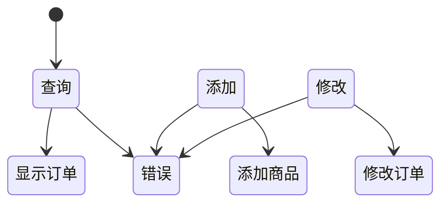
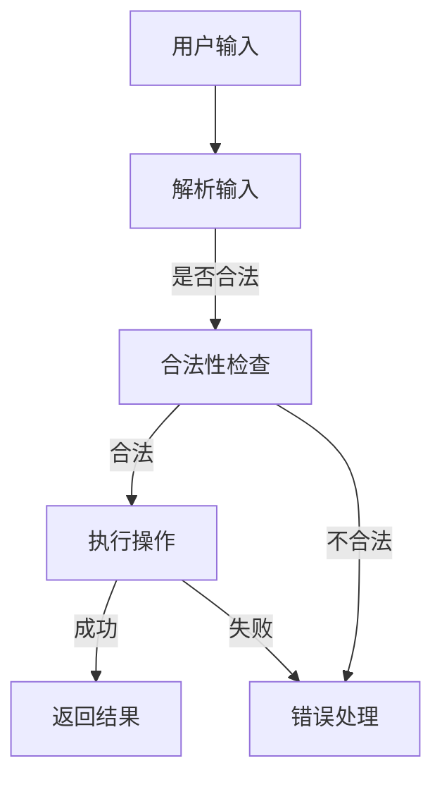

                 

## 引言

### 1.1 提示词语言的概念

提示词语言（Prompt Language），顾名思义，是一种通过提示词（Prompt）引导用户或系统进行特定操作的语言。它广泛应用于自然语言处理（NLP）、人工智能助手、智能对话系统等多个领域。具体来说，提示词语言通过一系列预设的语法结构和语义元素，使得用户或系统能够理解和执行特定任务。

### 1.2 提示词语言的重要性

提示词语言的重要性体现在以下几个方面：

1. **提高交互效率**：通过简洁明了的提示词，用户可以迅速明确操作目标，减少误解和重复操作，提升交互效率。
2. **增强用户体验**：良好的提示词设计可以降低用户的学习成本，提升用户体验，特别是在复杂操作或新系统使用中。
3. **扩展人工智能应用**：提示词语言为人工智能系统提供了与人类用户进行自然交互的手段，使得AI系统更加智能和灵活，能够应用于更多的场景。

### 1.3 提示词语言的发展历程

提示词语言的发展历程可以追溯到早期的人工智能系统和自然语言处理技术。随着计算机技术和算法的不断进步，提示词语言也在不断演进：

- **早期**：早期的计算机系统主要通过命令行界面与用户交互，用户需要掌握特定的命令语言。
- **中间**：随着图形用户界面（GUI）的普及，提示词语言逐渐演变成基于按钮、菜单等可视化元素的操作界面。
- **现代**：随着深度学习和自然语言处理技术的发展，提示词语言进一步演变成能够理解和处理自然语言的智能系统，如智能语音助手和智能对话系统。

### 1.4 提示词语言的应用领域

提示词语言在多个领域都有广泛应用，主要包括：

- **自然语言处理**：用于文本分类、情感分析、问答系统等任务，通过设计合适的提示词来引导模型学习。
- **人工智能助手**：如智能语音助手、智能客服等，通过自然语言交互帮助用户解决问题。
- **智能对话系统**：用于实现人与系统之间的自然对话，提高交互体验。
- **教育领域**：如在线教育平台的智能问答系统，帮助学生更好地理解课程内容。

### 1.5 本文结构安排

本文将围绕提示词语言的语法结构进行深入探讨。文章结构如下：

1. **背景与核心概念**：介绍提示词语言的基本概念、应用背景和发展历程。
2. **语法结构设计**：详细讨论提示词语言的语法结构设计，包括语法规则、可视化表示和动态调整。
3. **实现技术**：介绍提示词语言的实现技术，包括语言处理算法、语义分析技术和性能优化方法。
4. **应用实例**：分析提示词语言在不同领域的实际应用案例。
5. **未来发展与挑战**：探讨提示词语言的未来发展趋势和面临的挑战。
6. **小结与拓展阅读**：总结本文内容，提供拓展阅读建议。

通过本文的阅读，读者可以全面了解提示词语言的语法结构设计和实现技术，为后续研究和应用提供理论基础和实践指导。

### 关键词

- 提示词语言
- 语法结构
- 设计与实现
- 自然语言处理
- 人工智能助手
- 智能对话系统

### 摘要

本文旨在深入探讨提示词语言的语法结构设计和实现技术。首先，我们将介绍提示词语言的基本概念、应用背景和发展历程。接着，文章将详细讨论提示词语言的语法结构设计，包括语法规则、可视化表示和动态调整。随后，我们将介绍提示词语言的实现技术，涵盖语言处理算法、语义分析技术和性能优化方法。此外，本文还将分析提示词语言在不同领域的实际应用案例，并探讨其未来发展趋势和面临的挑战。最后，文章将总结全文内容，并提供拓展阅读建议，以便读者进一步深入研究。

## 目录大纲设计

为了设计出《提示词语言的语法结构：设计与实现》这本书的完整目录大纲，我们需要首先理解书的核心内容，然后根据书的内容确定合适的章节划分。以下是这本书的目录大纲：

### 第一部分: 提示词语言的背景与核心概念

- **1.1 问题背景与引言**
  - 1.1.1 提示词语言的重要性
  - 1.1.2 提示词语言的历史与发展
  - 1.1.3 提示词语言的应用领域

- **1.2 核心概念解析**
  - 1.2.1 提示词语言的基本定义
  - 1.2.2 提示词语言的特点
  - 1.2.3 提示词语言与自然语言处理的关系

- **1.3 提示词语言的边界与外延**
  - 1.3.1 提示词语言的边界
  - 1.3.2 提示词语言的外延
  - 1.3.3 提示词语言与相关概念的对比

- **1.4 核心要素组成**
  - 1.4.1 语法元素
  - 1.4.2 语义元素
  - 1.4.3 结构元素

- **1.5 本章小结**

### 第二部分: 提示词语言的语法结构设计

- **2.1 语法结构的定义与分类**
  - 2.1.1 语法结构的定义
  - 2.1.2 语法结构的分类
  - 2.1.3 语法结构的重要性

- **2.2 语法规则的设计**
  - 2.2.1 语法规则的语法特性
  - 2.2.2 语法规则的实现方法
  - 2.2.3 语法规则的优化策略

- **2.3 语法结构的可视化表示**
  - 2.3.1 文本表示
  - 2.3.2 图形表示
  - 2.3.3 可视化工具的应用

- **2.4 语法结构的动态调整**
  - 2.4.1 动态调整的必要性
  - 2.4.2 动态调整的算法
  - 2.4.3 动态调整的效果评估

- **2.5 本章小结**

### 第三部分: 提示词语言的实现技术

- **3.1 提示词语言的实现框架**
  - 3.1.1 提示词语言的实现流程
  - 3.1.2 提示词语言的关键技术
  - 3.1.3 提示词语言的优化方案

- **3.2 语言处理算法**
  - 3.2.1 分词算法
  - 3.2.2 词性标注算法
  - 3.2.3 句法分析算法

- **3.3 语义分析技术**
  - 3.3.1 语义角色标注
  - 3.3.2 语义关系分析
  - 3.3.3 语义理解的应用

- **3.4 优化与性能评估**
  - 3.4.1 提高性能的方法
  - 3.4.2 性能评估指标
  - 3.4.3 性能评估实例

- **3.5 本章小结**

### 第四部分: 提示词语言的应用实例

- **4.1 应用场景介绍**
  - 4.1.1 提示词语言在自然语言处理中的应用
  - 4.1.2 提示词语言在人工智能助手中的应用
  - 4.1.3 提示词语言在智能对话系统中的应用

- **4.2 应用实例分析**
  - 4.2.1 智能客服系统实现
  - 4.2.2 文本摘要生成
  - 4.2.3 机器翻译辅助

- **4.3 案例研究**
  - 4.3.1 某知名搜索引擎的提示词语言应用
  - 4.3.2 某智能音箱的提示词语言实现
  - 4.3.3 某在线教育的智能问答系统

- **4.4 本章小结**

### 第五部分: 未来发展与挑战

- **5.1 提示词语言的未来发展趋势**
  - 5.1.1 技术进步的趋势
  - 5.1.2 应用扩展的趋势
  - 5.1.3 与其他技术的融合趋势

- **5.2 面临的挑战与应对策略**
  - 5.2.1 技术挑战
  - 5.2.2 应用挑战
  - 5.2.3 未来发展的策略

- **5.3 本章小结**

### 第六部分: 附录与参考资料

- **6.1 附录**
  - 6.1.1 工具与资源

通过上述目录大纲的设计，我们能够系统地阐述提示词语言的语法结构设计与实现技术，为读者提供全面的理论和实践指导。

### 1.1 问题背景与引言

在现代信息社会中，人与机器的交互变得越来越普遍和复杂。这种交互不仅限于简单的命令行操作，还涉及到自然语言处理（NLP）、人工智能（AI）和智能对话系统等高阶技术。提示词语言正是这样一种技术，它通过特定的语法结构和语义元素，使得人与机器之间的交流变得更加自然和高效。

**提示词语言的重要性**体现在其能够简化用户与系统之间的交流。在复杂的操作中，通过使用简洁的提示词，用户可以迅速传达意图，减少误解和重复操作。例如，在一个智能客服系统中，用户只需输入一个简短的提示词，如“订单状态”或“找回密码”，系统就能理解并自动执行相应的任务。

**提示词语言的历史与发展**可以追溯到早期的命令行界面和批处理系统。在那时，用户通过记忆和输入特定的命令来与计算机交互。随着图形用户界面（GUI）的出现，交互方式变得更加直观，但依然依赖于预定义的按钮和菜单。随着NLP和AI技术的发展，提示词语言逐渐演变成能够理解和处理自然语言的智能系统。

**提示词语言的应用领域**非常广泛，主要包括以下几个方面：

1. **自然语言处理**：用于文本分类、情感分析、问答系统等任务。通过设计合适的提示词，可以引导模型学习并理解复杂的语言结构。
2. **人工智能助手**：如智能语音助手、智能客服等。这些系统通过自然语言交互，帮助用户解决问题，提供信息，提升用户体验。
3. **智能对话系统**：用于实现人与系统之间的自然对话，提高交互体验。这些系统通常包含复杂的语法和语义分析能力，能够理解用户的多层次需求。

在接下来的章节中，我们将进一步深入探讨提示词语言的核心概念，分析其边界与外延，并详细阐述其语法结构设计、实现技术、应用实例以及未来发展趋势。通过这些内容，读者将能够全面理解提示词语言，为其在各个领域的应用提供理论和实践指导。

### 1.2 核心概念解析

**提示词语言的基本定义**：
提示词语言是一种专门为智能系统设计的语言模型，它通过预设的提示词和语法规则，使得系统可以理解并执行特定的任务。这些提示词通常是简短的、具有明确含义的词汇或短语，能够有效地传达用户的意图。

**提示词语言的特点**：
- **简洁性**：提示词语言的设计注重简洁性，通过简短的提示词实现复杂任务。
- **灵活性**：提示词语言允许用户以自然语言的方式进行交互，灵活适应不同的场景和需求。
- **智能性**：通过结合自然语言处理和人工智能技术，提示词语言能够自动理解用户的意图并做出相应的反应。

**提示词语言与自然语言处理的关系**：
提示词语言是自然语言处理（NLP）的一个子集，它依赖于NLP技术来实现对自然语言的理解。NLP的核心任务包括分词、词性标注、句法分析和语义理解等，这些技术在提示词语言中都有广泛应用。与一般的自然语言处理任务不同，提示词语言更注重快速、准确地理解用户意图。

**核心概念术语说明**：

- **提示词（Prompt）**：用户输入的简短词汇或短语，用于引导系统执行特定任务。
- **语法规则（Grammar Rules）**：定义提示词之间关系的规则集，用于解析和解释用户输入。
- **自然语言处理（Natural Language Processing, NLP）**：用于从自然语言中提取信息的技术，包括分词、词性标注、句法分析和语义理解等。
- **人工智能（Artificial Intelligence, AI）**：模拟人类智能行为的计算机系统，通过学习、推理和决策来实现特定任务。

**概念属性特征对比表格**：

| 特性             | 提示词语言               | 自然语言处理               |
|----------------|------------------------|--------------------------|
| 目标             | 简化交互，快速响应         | 提取信息，理解语言         |
| 语法规则         | 预设的提示词和规则集        | 复杂的句法和语义规则         |
| 用户交互方式       | 自然语言交互             | 自然语言输入，文本处理       |
| 应用范围          | 智能系统交互，特定任务执行    | 文本分类，情感分析，问答系统等  |

**ER实体关系图架构**：

在提示词语言的设计中，实体关系图（ER图）用于描述不同实体之间的关系。以下是提示词语言中的一个简化的ER图示例：

```mermaid
erDiagram
    User ||--o> Prompt : 发起
    System ||--o> Response : 回复
    Prompt ||--o> Grammar : 语法规则
    Grammar ||--o> NLP : 自然语言处理
    NLP ||--o> AI : 人工智能
```

在这个ER图中，用户通过输入提示词（Prompt）与系统交互，系统根据语法规则（Grammar）和自然语言处理（NLP）技术生成响应（Response）。同时，语法规则和自然语言处理技术又依赖于人工智能（AI）的支撑。

**总结**：

通过上述核心概念解析，我们对提示词语言的基本定义、特点及其与自然语言处理的关系有了更加清晰的认识。接下来，我们将进一步探讨提示词语言的边界与外延，以更全面地理解这一重要技术。

### 1.3 提示词语言的边界与外延

在深入探讨提示词语言的边界与外延时，我们需要明确其定义、应用范围以及与相关概念的区别。

**提示词语言的边界**：

提示词语言的边界是指其能够处理和理解的自然语言的范围。具体来说，提示词语言主要处理简短、明确的提示词，这些提示词通常涉及特定领域的术语或短语。例如，在一个电商平台上，用户可能使用“查询订单状态”、“添加商品到购物车”等简单的提示词来与系统交互。

提示词语言的边界通常受限于以下几个方面：

1. **自然语言处理的精度**：自然语言处理技术对语言理解的精度直接影响到提示词语言的边界。尽管现代NLP技术在句法分析和语义理解方面已经取得了显著进步，但在处理复杂、模糊的语言输入时仍存在局限性。
2. **语法规则的设计**：语法规则定义了提示词之间的结构关系，过于复杂的语法规则可能会使系统难以理解和执行。因此，设计简洁、高效的语法规则是提示词语言边界清晰化的关键。
3. **应用场景的特定性**：提示词语言在不同应用场景中可能有不同的边界。例如，在智能客服系统中，提示词语言的边界可能主要涉及常见问题的解决，而在智能问答系统中，边界可能更广泛，涵盖各种类型的问题。

**提示词语言的外延**：

提示词语言的外延是指其应用范围和功能扩展。随着自然语言处理和人工智能技术的发展，提示词语言的外延正在不断扩展，涵盖了更多复杂的任务和领域。

提示词语言的外延包括以下几个方面：

1. **跨领域应用**：提示词语言不仅适用于特定的应用场景，如智能客服和智能问答系统，还可以应用于其他领域，如智能推荐、文本摘要生成和机器翻译等。
2. **多模态交互**：随着多模态交互技术的发展，提示词语言也开始支持图像、语音和视频等多种输入方式，使得交互更加自然和丰富。
3. **个性化服务**：通过结合用户行为数据和机器学习算法，提示词语言可以实现个性化服务，如根据用户偏好推荐商品、调整问答系统的响应策略等。

**提示词语言与相关概念的对比**：

为了更好地理解提示词语言的边界与外延，我们需要将其与一些相关概念进行对比：

1. **自然语言处理（NLP）**：NLP是提示词语言的基础，但NLP涉及更广泛的自然语言处理任务，包括文本分类、情感分析、命名实体识别等。而提示词语言则更专注于简短、明确的提示词处理。
2. **人工智能（AI）**：AI是一个更广泛的领域，包括机器学习、深度学习、自然语言处理等子领域。提示词语言是AI应用中的一个具体实现，用于人与机器之间的自然交互。
3. **图形用户界面（GUI）**：GUI通过图形元素（如按钮、菜单）实现用户与计算机的交互。与GUI相比，提示词语言更注重自然语言的输入和处理，提供一种更直观、便捷的交互方式。
4. **语音识别（ASR）**：语音识别是将语音转换为文本的技术，与提示词语言密切相关。语音识别后的文本可以作为提示词语言的处理输入，但两者在任务和应用上有所不同。

**总结**：

通过上述分析，我们明确了提示词语言的边界与外延，并对比了其与相关概念的区别。提示词语言作为一种专门为智能系统设计的语言模型，具有简洁、灵活和智能的特点，在多个领域都有广泛应用。在接下来的章节中，我们将进一步探讨提示词语言的语法结构设计和实现技术。

### 1.4 核心要素组成

提示词语言作为一种专门设计的语言模型，其核心要素主要包括语法元素、语义元素和结构元素。这些元素共同构成了提示词语言的基础，确保了其能够有效地实现人与系统的自然交互。

#### 1.4.1 语法元素

**语法元素**是提示词语言的核心组成部分，主要包括词汇、短语和句子等。这些语法元素通过特定的语法规则组合在一起，形成能够传达明确意图的提示词。

1. **词汇**：词汇是构成提示词语言的基本单元，每个词汇都有特定的含义和功能。例如，“查询”、“添加”、“删除”等都是常用的提示词词汇。
2. **短语**：短语是由多个词汇组合而成的，具有独立意义的表达。例如，“查询订单状态”是一个短语，由“查询”、“订单”和“状态”等词汇组成。
3. **句子**：句子是语法元素的最高层次，通常由一个主语和一个谓语构成。在提示词语言中，句子用于传达复杂的操作意图。例如，“将商品添加到购物车”是一个完整的句子。

**语法规则**定义了这些语法元素之间的结构关系，确保提示词的语法结构正确和清晰。语法规则包括词汇的顺序、连接词的使用、标点符号的规范等。例如，在一个电商平台的提示词语言中，语法规则可能规定“查询”后必须跟一个对象，如“订单状态”，而不能是其他词汇。

#### 1.4.2 语义元素

**语义元素**是提示词语言理解的核心，它们涉及提示词的语义角色和语义关系。语义元素包括：

1. **语义角色**：语义角色描述了提示词在句子中的功能，如主语、谓语、宾语等。例如，“用户”是一个主语角色，而“查询”是一个谓语角色。
2. **语义关系**：语义关系描述了不同语义元素之间的关联。例如，在句子“将商品添加到购物车”中，“商品”和“购物车”之间存在着“添加”的语义关系。

语义元素通过自然语言处理（NLP）技术进行解析，确保系统能够准确理解用户输入的提示词。例如，通过词性标注技术，系统可以识别出“商品”是一个名词，而“添加”是一个动词，从而正确理解句子的结构。

#### 1.4.3 结构元素

**结构元素**包括提示词语言的结构框架和语法规则，它们共同定义了提示词的语法结构。结构元素主要包括：

1. **结构框架**：结构框架定义了提示词语言的基本结构，包括句子、短语和词汇等。例如，一个基本的查询操作可能包含“查询”、“对象”和“属性”三个结构元素。
2. **语法规则**：语法规则详细规定了提示词语言中各个元素之间的组合方式。这些规则可以是预设的，也可以是通过机器学习算法自动生成的。例如，一个语法规则可能规定“查询”后必须跟一个对象，如“订单”、“商品”等。

**结构元素**通过语法分析和语义理解技术进行解析，确保系统能够正确执行用户输入的提示词。例如，通过语法分析技术，系统可以识别出“查询订单状态”中的各个语法元素，并通过语义理解技术确定其意图。

**总结**：

提示词语言的核心要素包括语法元素、语义元素和结构元素。语法元素定义了提示词的语言结构，语义元素确保系统可以准确理解用户意图，结构元素则提供了提示词语言的框架和规则。这些核心要素共同作用，使得提示词语言能够实现高效、自然的人机交互。在接下来的章节中，我们将深入探讨提示词语言的语法结构设计，包括语法规则的设计、可视化表示和动态调整。

### 1.5 本章小结

本章全面介绍了提示词语言的基本概念、应用背景及其核心要素。我们首先探讨了提示词语言的基本定义和重要性，阐述了其在自然语言处理和人工智能中的应用。随后，我们详细解析了提示词语言的核心概念，包括语法元素、语义元素和结构元素，并通过对比分析了提示词语言与其他相关概念的区别。此外，我们还讨论了提示词语言的边界与外延，明确了其在不同应用场景中的特性和扩展范围。

通过对本章内容的理解，读者可以初步掌握提示词语言的基本理论和应用场景，为进一步探讨提示词语言的语法结构设计和实现技术打下坚实的基础。在下一章中，我们将深入探讨提示词语言的语法结构设计，包括语法规则的设计、可视化表示和动态调整，为后续内容提供更深入的解读。

### 2.1 语法结构的定义与分类

**2.1.1 语法结构的定义**

语法结构是指语言中词汇和短语按照一定的规则排列所形成的结构模式。在提示词语言中，语法结构尤为重要，因为它定义了用户输入的提示词应该如何组织和解析，以便系统能够准确理解并执行任务。具体来说，语法结构包括词汇的使用规则、短语结构、句子构造等方面。

**2.1.2 语法结构的分类**

语法结构可以根据不同的标准进行分类。以下是几种常见的分类方法：

1. **根据语法层级**：语法结构可以分为基础语法结构、中级语法结构和高级语法结构。基础语法结构主要涉及简单词汇和短语的组合，如名词短语和动词短语。中级语法结构则包括复杂的句子结构，如复合句和并列句。高级语法结构则涉及到更复杂的语法现象，如虚拟语气和从句。
   
2. **根据语法功能**：语法结构可以根据其在句子中的作用进行分类。主要类别包括：
   - 主干结构：句子中的核心部分，通常包括主语和谓语。
   - 定语结构：用来修饰名词或代词的成分，如形容词短语和从句。
   - 状语结构：用来修饰动词、形容词或整个句子的成分，如副词短语和从句。
   - 补语结构：在句子中补充说明主语或宾语的内容，如宾语补足语和主语补足语。

3. **根据语义关系**：语法结构可以根据其表达的语义关系进行分类。常见的分类包括：
   - 主谓结构：表示动作和执行者之间的关系，如“我吃饭”。
   - 动宾结构：表示动作和对象之间的关系，如“写字”。
   - 从属结构：表示子句和主句之间的关系，如“尽管下雨，我还是去了”。

**2.1.3 语法结构的重要性**

语法结构在提示词语言中的重要性体现在以下几个方面：

1. **理解用户意图**：通过合理的语法结构设计，系统能够更准确地理解用户的输入意图。例如，设计良好的语法结构可以区分“添加商品”和“删除商品”的不同操作，从而避免误操作。

2. **提高交互效率**：简洁、清晰的语法结构有助于用户快速传达意图，减少误解和重复操作。例如，通过定义明确的语法规则，用户只需输入简短的提示词，系统就能快速响应。

3. **支持复杂任务执行**：语法结构设计支持复杂任务的处理，如多步骤操作和条件判断。通过合理的语法结构，系统能够处理复杂指令，提供更加智能的服务。

**总结**：

语法结构是提示词语言设计中的核心要素，其定义和分类方法多种多样。通过合理设计语法结构，系统能够更准确地理解用户意图，提高交互效率，并支持复杂任务的执行。在接下来的章节中，我们将进一步探讨语法规则的设计、可视化表示和动态调整，以深入理解提示词语言的语法结构设计。

### 2.2 语法规则的设计

**2.2.1 语法规则的语法特性**

语法规则的设计是提示词语言的核心环节，决定了系统对用户输入的准确理解和响应。语法规则具有以下几个重要的语法特性：

1. **简洁性**：简洁性是语法规则设计的基本要求。简洁的语法规则易于用户理解和使用，减少误解和混淆。例如，在电商平台的提示词语言中，可以使用“添加商品”、“查询订单”等简洁的提示词，而不是复杂的句式。
   
2. **一致性**：一致性指的是语法规则的统一性和连贯性。一致的语法规则可以提高系统的稳定性和可预测性，使系统在处理用户输入时更加可靠。例如，所有涉及订单操作的提示词都应遵循相同的语法结构，如“查询订单”、“修改订单”等。

3. **灵活性**：灵活性是指语法规则能够适应不同场景和用户需求的能力。灵活的语法规则可以支持多样化的用户输入，提供更加个性化的服务。例如，在智能客服系统中，允许用户使用不同的短语表达相同意图，如“帮我看订单状态”和“订单状态查询”。

4. **扩展性**：扩展性指的是语法规则能够方便地添加新功能和词汇的能力。良好的扩展性可以确保提示词语言随着时间和需求的变化而不断发展。例如，在文本摘要生成系统中，可以通过添加新的关键词和规则来支持不同类型的文本摘要生成。

**2.2.2 语法规则的实现方法**

实现语法规则的方法多种多样，以下是几种常见的实现方法：

1. **基于规则的方法**：这种方法通过定义明确的语法规则集来解析用户输入。具体步骤如下：
   - **规则定义**：根据提示词语言的应用场景，定义一系列语法规则。这些规则可以是预定义的，也可以是通过专家经验或用户行为数据训练得到的。
   - **规则匹配**：在用户输入的提示词中，逐个匹配定义的语法规则，以确定输入意图。例如，如果用户输入“查询订单状态”，系统会首先匹配“查询”规则，然后是“订单状态”规则。
   - **动作执行**：一旦规则匹配成功，系统根据规则定义的动作执行相应的操作。例如，执行查询订单状态的查询动作。

2. **基于统计的方法**：这种方法通过统计学习技术，从大量用户输入中自动提取语法规则。具体步骤如下：
   - **数据收集**：收集大量用户输入的文本数据，包括正确的和错误的输入。
   - **特征提取**：从输入文本中提取特征，如词汇、短语和句子结构。
   - **模型训练**：使用机器学习算法（如决策树、随机森林、支持向量机等）训练语法规则模型。模型将根据输入特征预测用户意图。
   - **模型应用**：在实际应用中，系统使用训练好的模型来解析用户输入，并执行相应的操作。

3. **混合方法**：结合基于规则和基于统计的方法，将两者的优势结合起来。具体步骤如下：
   - **规则定义**：定义一部分重要的、常见的语法规则。
   - **模型训练**：使用机器学习算法训练剩余的语法规则模型。
   - **规则匹配与模型预测**：在解析用户输入时，首先使用规则匹配初步过滤和解析，然后使用模型预测进一步确认意图。

**2.2.3 语法规则的优化策略**

为了提高语法规则的性能和用户体验，可以采用以下优化策略：

1. **规则简化**：简化复杂的语法规则，使其更加简洁和直观。例如，通过合并相似的规则或删除冗余的规则，减少用户的操作难度。

2. **规则组合**：设计灵活的规则组合方式，支持多步骤操作和条件判断。例如，通过将多个规则组合成一个复合规则，实现复杂的任务处理。

3. **上下文感知**：根据用户输入的上下文信息，动态调整语法规则。例如，在用户连续输入多个提示词时，系统能够根据上下文信息推断用户的意图，并选择合适的规则。

4. **错误容忍**：提高系统的错误容忍度，允许用户输入有误的提示词，并通过上下文或后续输入进行修正。例如，如果用户输入“查订单”系统可以尝试识别并纠正为“查询订单”。

5. **性能优化**：优化语法规则的执行效率，减少解析时间和资源消耗。例如，通过并行处理、缓存技术和算法优化，提高系统的响应速度和处理能力。

**总结**：

语法规则的设计是提示词语言实现的关键，其特性包括简洁性、一致性、灵活性和扩展性。实现语法规则的方法有基于规则、基于统计和混合方法。优化策略包括规则简化、规则组合、上下文感知、错误容忍和性能优化。通过合理设计和优化语法规则，系统能够更准确地理解用户意图，提高用户体验，并在复杂任务中保持高效和稳定。

### 2.3 语法结构的可视化表示

在提示词语言的设计和实现过程中，可视化表示能够极大地帮助开发者理解语法结构的复杂性和逻辑性。通过可视化表示，我们可以将抽象的语法规则和结构转化为直观的图形，从而提高开发效率和代码可维护性。

#### **2.3.1 文本表示**

文本表示是提示词语言可视化表示的基础形式。通过简单的文本格式，我们可以描述语法规则和结构，如下所示：

```plaintext
查询订单：显示订单详细信息
添加商品：添加新商品到库存
修改订单：修改订单状态
```

这种文本表示方式简洁明了，但适用于简单的语法规则。对于复杂的语法结构，文本表示可能会显得冗长和难以理解。

#### **2.3.2 图形表示**

图形表示通过图形化的方式，直观地展示语法规则和结构。常用的图形表示方法包括状态图、流程图和ER图等。

1. **状态图**：

状态图用于描述系统的不同状态及其转换条件。在提示词语言中，状态图可以表示不同操作的状态转换，如下所示：



在这个状态图中，每个状态（如“查询”、“添加”、“修改”）表示一个操作，状态之间的箭头表示操作转换条件。

2. **流程图**：

流程图用于描述系统操作的步骤和流程。在提示词语言中，流程图可以表示从用户输入到系统响应的整个过程，如下所示：



在这个流程图中，每个框表示一个操作或步骤，箭头表示操作之间的逻辑关系。

3. **ER图**：

ER图用于描述实体及其之间的关系。在提示词语言中，ER图可以表示语法元素和语义元素之间的关系，如下所示：

```mermaid
erDiagram
    User ||--o> Prompt : 发起
    System ||--o> Response : 回复
    Prompt ||--o> Grammar : 语法规则
    Grammar ||--o> NLP : 自然语言处理
    NLP ||--o> AI : 人工智能
```

在这个ER图中，实体（如“用户”、“系统”、“提示词”等）通过关系线连接，表示它们之间的关联。

#### **2.3.3 可视化工具的应用**

在实际开发中，可视化工具如Mermaid、D3.js和Lucidchart等可以极大地提高语法结构的可视化表示效果。以下是一些常用的可视化工具及其应用：

1. **Mermaid**：

Mermaid是一种基于Markdown的绘图工具，可以轻松地将文本转换为图形。在提示词语言设计中，可以使用Mermaid绘制状态图、流程图和ER图等，如下所示：

```mermaid
gantt
    dateFormat  YYYY-MM-DD
    title 调试流程

    section 调试流程
    A1[解析输入] :）2023-01-01, 2d
    A2[合法性检查] :）2023-01-03, 3d
    A3[执行操作] :）2023-01-05, 2d
    A4[返回结果] :）2023-01-07, 1d

    link A1,A2 ; A2,A3 ; A3,A4
```

在这个Gantt图中，我们可以清晰地看到各个调试步骤的时间安排和依赖关系。

2. **D3.js**：

D3.js是一种基于JavaScript的数据可视化库，可以创建复杂的交互式图表。在提示词语言设计中，可以使用D3.js创建动态的语法结构可视化，如下所示：

```javascript
// 示例代码：使用D3.js绘制语法树
var data = {
    "name": "提示词语言",
    "children": [
        {
            "name": "语法规则",
            "children": [
                {"name": "词汇"},
                {"name": "短语"},
                {"name": "句子"}
            ]
        },
        {
            "name": "语义元素",
            "children": [
                {"name": "语义角色"},
                {"name": "语义关系"}
            ]
        }
    ]
};

var width = 960,
    height = 500;

var i = 0;

var tree = d3.tree()
    .size([height, width])
    .separation((a, b) => (a.parent == b.parent ? 1 : 2) / a.depth);

var diagram = d3.select("svg")
    .attr("width", width)
    .attr("height", height)
    .append("g")
    .attr("transform", "translate(" + width / 2 + "," + height / 2 + ")");

var root = d3.hierarchy(data)
    .sum(d => 1);

var nodes = tree.nodes(root);

var link = diagram.selectAll(".link")
    .data(nodes.slice(1))
    .enter().append("path")
    .attr("class", "link")
    .attr("d", d => "M" + d.y + "," + d.x
    + "C" + (d.y - 100) + "," + d.x
    + " " + (d.y - 100) + "," + d.x2
    + " " + d.y2 + "," + d.x2)
    .attr("fill", "none")
    .attr("stroke", "#555");

var node = diagram.selectAll(".node")
    .data(nodes)
    .enter().append("g")
    .attr("class", "node")
    .attr("transform", d => "translate(" + d.y + "," + d.x + ")");

node.append("circle")
    .attr("r", 10)
    .style("fill", "#ddd");

node.append("text")
    .attr("dy", 3)
    .attr("x", 11)
    .style("text-anchor", "start")
    .text(d => d.data.name);
```

在这个D3.js示例中，我们使用了一个层次化的数据结构（hierarchy）来生成一个树状图，显示了提示词语言的语法规则和语义元素。

3. **Lucidchart**：

Lucidchart是一个在线图表和流程图工具，可以轻松创建和共享各种类型的图表。在提示词语言设计中，Lucidchart可以用于绘制复杂的状态图、流程图和ER图等。Lucidchart提供了丰富的模板和图形元素，使得可视化表示更加直观和灵活。

**总结**：

可视化表示在提示词语言的设计和实现过程中起着关键作用。通过文本表示、图形表示和可视化工具的应用，我们可以直观地理解和展示语法规则和结构，提高开发效率和代码可维护性。在下一章中，我们将进一步探讨语法结构的动态调整，以适应复杂多变的应用场景。

### 2.4 语法结构的动态调整

在提示词语言的实际应用中，语法结构需要具备一定的灵活性和适应性，以应对不同的用户需求和应用场景。动态调整语法结构是提高系统灵活性和用户满意度的重要手段。以下是动态调整语法结构的关键步骤和实现方法。

#### **2.4.1 动态调整的必要性**

1. **用户多样性**：用户背景、语言习惯和表达方式各不相同，固定的语法结构难以满足所有用户的需求。通过动态调整语法结构，系统能够更好地适应不同用户的需求。

2. **应用场景多样化**：不同的应用场景对语法结构的要求也不同。例如，在电商平台上，用户可能使用简洁的提示词进行购物操作；而在智能客服系统中，用户可能需要使用更复杂的语言进行问题咨询。动态调整语法结构可以确保系统在不同场景下都能提供准确的服务。

3. **技术发展**：随着自然语言处理和人工智能技术的不断发展，语法结构也需要不断更新和优化。通过动态调整语法结构，系统能够利用最新的技术进步，提高处理效率和准确度。

#### **2.4.2 动态调整的算法**

1. **规则重配置**：规则重配置是一种通过修改语法规则来适应新场景的方法。具体步骤如下：
   - **规则识别**：首先识别出当前场景下需要调整的语法规则。这可以通过分析用户输入、错误日志和应用场景等数据来实现。
   - **规则修改**：根据识别出的规则，对其进行修改，使其更符合新场景的要求。例如，在电商平台上，可以将“查询商品信息”调整为“查看商品详情”。
   - **规则测试**：修改后的规则需要通过测试，确保其在实际应用中能够正确执行。测试可以包括单元测试、集成测试和用户测试等。

2. **机器学习算法**：机器学习算法可以自动识别和调整语法结构，提高系统的自适应能力。具体步骤如下：
   - **数据收集**：收集大量的用户输入数据，包括正确的和错误的输入。这些数据将用于训练和优化语法模型。
   - **特征提取**：从用户输入中提取特征，如词汇、短语和句子结构。特征提取的质量直接影响机器学习算法的效果。
   - **模型训练**：使用机器学习算法（如决策树、神经网络等）对特征进行训练，建立语法规则模型。模型将根据输入特征预测用户意图。
   - **模型优化**：通过不断优化模型，提高其准确性和鲁棒性。优化过程可以包括超参数调整、模型融合和异常值处理等。

3. **自适应学习机制**：自适应学习机制可以在用户交互过程中实时调整语法结构，提高系统的实时响应能力。具体步骤如下：
   - **用户行为分析**：分析用户在系统中的行为，如输入模式、错误率和使用频率等。这些数据将用于调整语法结构。
   - **动态调整规则**：根据用户行为分析结果，动态调整语法规则。例如，如果发现用户经常使用某个特定的提示词，可以将其设为默认规则。
   - **实时反馈**：系统在调整规则后，实时收集用户反馈，评估调整效果。如果效果不佳，可以进一步优化调整策略。

#### **2.4.3 动态调整的效果评估**

动态调整语法结构的效果需要通过评估来验证。以下是几种常见的评估方法：

1. **准确性评估**：准确性评估是衡量动态调整语法结构是否能够准确理解用户意图的关键指标。可以通过以下方法进行评估：
   - **错误率**：计算系统在动态调整后的错误率，包括误解和无法识别的输入。
   - **匹配率**：计算系统正确匹配用户输入的规则比例。
   - **用户满意度**：通过用户满意度调查，评估动态调整语法结构对用户体验的提升。

2. **效率评估**：效率评估是衡量动态调整语法结构对系统处理速度和资源消耗的影响。可以通过以下方法进行评估：
   - **响应时间**：测量系统在动态调整后的响应时间，包括输入解析、规则匹配和操作执行等步骤。
   - **资源消耗**：监控系统在动态调整后的资源消耗，如CPU使用率、内存占用和网络带宽等。

3. **稳定性评估**：稳定性评估是衡量动态调整语法结构是否能够稳定运行，不出现异常或崩溃。可以通过以下方法进行评估：
   - **异常率**：计算系统在动态调整后的异常率，包括错误处理失败和系统崩溃等情况。
   - **连续运行时间**：测量系统在动态调整后的连续运行时间，评估其稳定性。

**总结**：

动态调整语法结构是提升提示词语言灵活性和用户满意度的重要手段。通过规则重配置、机器学习算法和自适应学习机制，系统能够根据不同用户和应用场景实时调整语法结构。效果评估则确保调整策略的有效性和稳定性。在下一章中，我们将深入探讨提示词语言的实现技术，包括语言处理算法、语义分析技术和性能优化方法。

### 2.5 本章小结

本章详细探讨了提示词语言的语法结构设计，包括定义、分类、设计方法以及可视化表示。我们首先明确了语法结构的定义和分类方法，并阐述了其在提示词语言中的重要性。接着，我们介绍了语法规则的设计方法，包括基于规则、基于统计和混合方法，并讨论了语法规则的优化策略。此外，我们还介绍了语法结构的不同可视化表示方法，如文本表示、图形表示和可视化工具的应用。最后，本章探讨了语法结构的动态调整方法，包括规则重配置、机器学习算法和自适应学习机制，并提出了效果评估的方法。

通过本章的内容，读者可以全面理解提示词语言语法结构的设计和实现，为其在实际应用中的有效使用提供理论基础和实践指导。在下一章中，我们将进一步探讨提示词语言的实现技术，包括语言处理算法、语义分析技术和性能优化方法。

### 3.1 提示词语言的实现框架

**3.1.1 提示词语言的实现流程**

提示词语言的实现涉及多个步骤，这些步骤共同构成了完整的实现流程。以下是提示词语言实现的典型流程：

1. **用户输入**：用户通过自然语言输入提示词，这些提示词可以是文字、语音或其他形式。
2. **输入预处理**：对用户输入进行预处理，包括去除噪声、标准化文本和分词等。
3. **语法分析**：对预处理后的输入进行语法分析，以确定其语法结构和意图。这一步骤包括词性标注、句法分析和语法规则匹配。
4. **语义理解**：基于语法分析的结果，对输入进行语义理解，识别出输入中的实体、关系和意图。
5. **任务执行**：根据语义理解的结果，系统执行相应的任务或操作，如查询数据库、发送消息等。
6. **输出生成**：系统生成相应的输出，如响应文本、语音或其他形式的信息，并返回给用户。

**3.1.2 提示词语言的关键技术**

提示词语言的实现依赖于多种关键技术，以下是一些关键技术的详细介绍：

1. **自然语言处理（NLP）**：NLP是提示词语言实现的基础，包括分词、词性标注、句法分析和语义理解等。这些技术用于解析和解释用户输入的提示词，确保系统能够准确理解用户意图。

2. **机器学习（ML）**：机器学习技术在提示词语言实现中扮演重要角色，尤其是用于语法分析、语义理解和任务执行。通过训练模型，系统能够从大量数据中学习并优化提示词语言的性能。

3. **深度学习（DL）**：深度学习是机器学习的一个分支，其在提示词语言实现中的应用越来越广泛。深度学习模型，如神经网络和循环神经网络（RNN），可以处理复杂的语言结构和语义关系。

4. **知识图谱**：知识图谱用于表示实体、关系和属性，可以在语义理解阶段提供额外的语义信息。通过知识图谱，系统可以更好地理解用户输入，提高任务执行的准确性。

5. **多模态交互**：多模态交互技术支持语音、文字、图像等多种输入和输出方式，使得提示词语言更加自然和丰富。例如，在智能客服系统中，用户可以通过语音提问，系统通过文字或语音回答。

**3.1.3 提示词语言的优化方案**

为了提高提示词语言的实际应用效果，可以采用多种优化方案。以下是一些常见的优化方案：

1. **模型优化**：通过改进机器学习模型的结构和算法，可以提高提示词语言的准确性和效率。例如，使用更复杂的神经网络结构、优化超参数和训练过程等。

2. **数据增强**：通过增加高质量的训练数据，可以提高模型的泛化能力和性能。数据增强可以包括数据扩充、数据清洗和数据标注等。

3. **在线学习**：在线学习技术使得系统可以在实际应用过程中不断学习和优化，适应用户需求的变化。通过实时收集用户反馈和错误日志，系统能够不断调整和优化其性能。

4. **上下文感知**：上下文感知技术可以基于用户的上下文信息（如历史记录、环境变量等）来调整提示词语言的响应策略，提高交互的连贯性和准确性。

5. **分布式处理**：分布式处理技术可以提升提示词语言的处理能力，尤其是在面对大规模数据和复杂任务时。通过分布式计算和存储，系统可以更高效地处理海量数据。

**总结**：

提示词语言的实现涉及多个步骤和关键技术，通过优化方案可以提高其性能和用户体验。在实际应用中，根据具体需求和场景，可以灵活选择和组合不同的实现技术和优化方案，以满足多样化的用户需求。在下一章中，我们将进一步探讨提示词语言的语言处理算法、语义分析技术和性能优化方法。

### 3.2 语言处理算法

提示词语言的实现离不开有效的语言处理算法，这些算法能够将用户输入的自然语言转化为系统能够理解和执行的指令。以下将介绍几种常用的语言处理算法，包括分词算法、词性标注算法和句法分析算法。

#### **3.2.1 分词算法**

分词是将连续的文本切分成一个个有意义的词汇或短语的步骤。分词算法对于提示词语言的实现至关重要，因为分词的准确性直接影响到后续的语法和语义分析。常见的分词算法包括：

1. **基于字典的分词算法**：
   - **正向最大匹配**：从文本的开始位置逐步向前查找，找到最长匹配的字典项，将其切分出来。如果无法找到匹配项，则逐步缩小查找窗口。
   - **逆向最大匹配**：从文本的结束位置逐步向后查找，找到最长匹配的字典项，将其切分出来。如果无法找到匹配项，则逐步缩小查找窗口。

2. **基于统计的分词算法**：
   - **N-gram模型**：使用前N个词汇的历史统计信息来进行分词。N-gram模型通过计算词汇的联合概率来预测下一个词汇，从而实现分词。
   - **隐马尔可夫模型（HMM）**：HMM是一种基于状态转移概率的统计模型，用于解决文本分词问题。它通过计算状态转移概率和发射概率，实现词汇的分割。

3. **基于深度学习的分词算法**：
   - **序列标注模型**：如长短时记忆网络（LSTM）和基于注意力机制的Transformer模型，它们可以处理更复杂的词汇关系和上下文信息，实现高精度的分词。

#### **3.2.2 词性标注算法**

词性标注是将文本中的每个词汇标注为其对应的词性（如名词、动词、形容词等）的过程。词性标注对于提示词语言的理解和执行具有重要作用，因为它能够帮助系统更好地理解词汇的功能和语义。

1. **基于规则的方法**：
   - **规则匹配**：根据预定义的词性规则对文本进行标注。这些规则通常是手工编写的，根据词汇的形态、位置和上下文进行匹配。

2. **基于统计的方法**：
   - **条件随机场（CRF）**：CRF是一种统计模型，用于序列标注问题。它通过计算条件概率，为每个词汇分配最可能的词性标注。
   - **决策树和随机森林**：通过训练决策树或随机森林模型，根据词汇的特征进行词性标注。

3. **基于深度学习的方法**：
   - **卷积神经网络（CNN）**：CNN可以捕获词汇的局部特征，用于词性标注任务。
   - **递归神经网络（RNN）**：RNN可以处理序列数据，通过学习词汇的上下文信息进行词性标注。
   - **Transformer**：Transformer模型通过自注意力机制，捕捉长距离的依赖关系，实现高精度的词性标注。

#### **3.2.3 句法分析算法**

句法分析是将文本分解成句法结构（如句子、短语和词组）的过程，它能够帮助系统理解句子的组成和语义关系。常见的句法分析算法包括：

1. **基于规则的方法**：
   - **部分解析方法**：通过递归下降或移位-归约方法，逐步构建句法树。这些方法通常基于预定义的语法规则，对文本进行句法分析。

2. **基于统计的方法**：
   - **隐马尔可夫模型（HMM）**：HMM通过状态转移概率和发射概率，对文本进行句法分析。
   - **条件随机场（CRF）**：CRF通过计算条件概率，实现文本的句法标注。

3. **基于深度学习的方法**：
   - **依存句法分析**：使用神经网络模型（如LSTM、Transformer）进行依存句法分析，通过学习词汇之间的依赖关系，构建句法树。
   - **变换器模型**：Transformer模型通过自注意力机制，实现对文本的深度句法分析，捕捉复杂的句法关系。

**总结**：

语言处理算法在提示词语言的实现中起着关键作用，包括分词算法、词性标注算法和句法分析算法。这些算法能够将自然语言输入转化为系统可理解的指令，确保提示词语言的准确性和实用性。通过结合不同的算法，系统可以更好地理解用户意图，提供高效的交互体验。在下一章中，我们将探讨提示词语言的语义分析技术，包括语义角色标注、语义关系分析和语义理解的应用。

### 3.3 语义分析技术

在提示词语言中，语义分析技术是理解和执行用户意图的核心环节。它涉及对自然语言输入的语义角色标注、语义关系分析和语义理解，以确保系统能够准确把握用户意图并做出相应操作。以下将详细探讨这些关键环节。

#### **3.3.1 语义角色标注**

语义角色标注（Semantic Role Labeling, SRL）是一种对句子中的词汇进行语义角色分类的技术。语义角色描述了词汇在句子中的功能，如动作执行者（Agent）、动作（Action）、受动者（Patient）等。SRL的目标是识别出句子中的主要语义角色，以便系统能够理解每个词汇在句子中的作用。

1. **基于规则的方法**：
   - **词典驱动的方法**：这种方法使用预定义的词典和规则，根据词汇和其上下文关系进行标注。例如，如果词汇出现在特定短语中，则可以将其标注为某个特定的语义角色。
   - **语法分析方法**：结合句法分析技术，通过语法结构来推断语义角色。例如，主语和宾语通常可以标注为动作执行者和受动者。

2. **基于统计的方法**：
   - **隐马尔可夫模型（HMM）**：HMM通过状态转移概率和观测概率，对句子进行语义角色标注。
   - **条件随机场（CRF）**：CRF通过计算条件概率，实现文本的语义角色标注。这种方法可以同时考虑多个词汇的上下文信息，提高标注的准确性。

3. **基于深度学习的方法**：
   - **递归神经网络（RNN）**：RNN可以处理序列数据，通过学习词汇之间的依赖关系进行语义角色标注。
   - **转换器模型**：Transformer模型通过自注意力机制，捕捉长距离的依赖关系，实现高精度的语义角色标注。

#### **3.3.2 语义关系分析**

语义关系分析（Semantic Relationship Analysis）是识别句子中词汇之间语义联系的技术。它涉及确定词汇之间的关系，如因果关系、包含关系、同义关系等。语义关系分析对于理解复杂句子和执行高级任务具有重要意义。

1. **基于规则的方法**：
   - **框架语义学方法**：这种方法使用预定义的框架和关系规则，根据词汇和短语来识别语义关系。
   - **依存语法方法**：通过分析词汇之间的依存关系，识别语义关系。例如，主语和谓语之间的依存关系通常表示因果关系。

2. **基于统计的方法**：
   - **统计模型**：如隐马尔可夫模型（HMM）和条件随机场（CRF），通过学习大量的标注数据来预测词汇之间的语义关系。

3. **基于深度学习的方法**：
   - **图神经网络（Graph Neural Networks, GNN）**：GNN通过学习词汇之间的图结构，识别复杂的语义关系。
   - **变换器模型**：通过自注意力机制，捕捉词汇之间的长距离依赖关系，实现高精度的语义关系分析。

#### **3.3.3 语义理解的应用**

语义理解是将语义分析结果应用于实际任务的技术。通过语义理解，系统能够将自然语言输入转化为可执行的指令或决策。

1. **智能对话系统**：
   - **意图识别**：通过语义理解技术，识别用户输入的主要意图。例如，在智能客服系统中，识别用户是寻求帮助、投诉还是咨询产品信息。
   - **实体识别**：识别用户输入中的关键实体，如人名、地点、时间等。这些实体对于任务执行至关重要。

2. **文本摘要**：
   - **关键信息提取**：通过语义理解，提取文本中的关键信息，生成摘要。例如，在新闻摘要中，提取主要事件和关键信息，以简洁的形式呈现。

3. **问答系统**：
   - **问题解答**：通过语义理解，解析用户的问题，并在大量数据中检索和生成答案。例如，在智能问答系统中，识别用户的问题类型和关键词，然后从知识库中检索相关答案。

**总结**：

语义分析技术是提示词语言实现中的关键环节，包括语义角色标注、语义关系分析和语义理解的应用。这些技术确保系统能够准确理解用户意图，提供高效的交互体验。通过结合不同方法和技术，系统可以处理复杂的语言输入，实现多样化的任务。在下一章中，我们将进一步探讨提示词语言的性能优化与评估方法。

### 3.4 优化与性能评估

提示词语言的性能直接影响用户体验和系统效率。因此，优化与性能评估成为实现高效提示词语言的关键环节。以下将介绍几种常见的性能优化方法，并详细解释如何评估这些优化措施的有效性。

#### **3.4.1 提高性能的方法**

1. **算法优化**：
   - **并行处理**：通过并行计算技术，将任务分解为多个子任务，同时处理，提高整体处理速度。例如，在分词和词性标注过程中，可以并行处理不同的文本片段。
   - **内存优化**：减少内存占用，提高系统性能。例如，通过使用数据结构优化和缓存技术，减少重复计算和存储需求。
   - **模型压缩**：对机器学习模型进行压缩，减少模型大小和计算复杂度。例如，使用量化、剪枝和知识蒸馏等技术，提高模型效率。

2. **硬件加速**：
   - **GPU加速**：利用图形处理单元（GPU）的强大计算能力，加速机器学习模型的训练和推理过程。
   - **分布式计算**：通过分布式计算架构，将任务分布在多个节点上，利用集群计算资源，提高处理速度和并发能力。

3. **缓存与索引**：
   - **缓存**：将常用数据缓存到内存中，减少磁盘I/O操作，提高系统响应速度。例如，缓存用户历史输入和常见查询结果。
   - **索引**：建立高效的数据索引结构，加速数据检索和查询。例如，使用倒排索引技术，提高文本检索效率。

4. **自适应调整**：
   - **动态调整参数**：根据实际应用场景和用户需求，动态调整系统参数，如学习率、批量大小等，以优化模型性能。
   - **实时监控**：实时监控系统性能指标，如响应时间、错误率和资源消耗等，及时发现和解决问题。

#### **3.4.2 性能评估指标**

评估提示词语言性能的关键在于选择适当的评估指标。以下是一些常用的性能评估指标：

1. **准确性**：
   - **准确率**（Accuracy）：计算正确预测的数量与总预测数量的比例。适用于二分类任务，如意图识别和情感分析。
   - **精确率与召回率**（Precision and Recall）：分别衡量预测为正样本的准确性（精确率）和遗漏的正样本比例（召回率）。适用于多分类任务。

2. **F1分数**：
   - **F1分数**（F1 Score）：综合考虑精确率和召回率的平衡，是两者的调和平均。公式为：F1 = 2 * (精确率 * 召回率) / (精确率 + 召回率)。

3. **响应时间**：
   - **平均响应时间**（Average Response Time）：系统从接收输入到返回结果所消耗的平均时间。衡量系统的处理速度。

4. **资源消耗**：
   - **CPU利用率**：系统在处理任务时CPU的利用率，衡量系统计算资源的使用效率。
   - **内存占用**：系统在运行时占用的内存大小，衡量系统对内存资源的需求。

5. **用户体验**：
   - **用户满意度**：通过用户调查或反馈，评估用户对系统性能和交互体验的满意度。

#### **3.4.3 性能评估实例**

以下是一个简单的性能评估实例，用于评估一个智能客服系统的性能：

1. **准备数据集**：
   - **训练集**：包含用户输入和系统响应的数据，用于训练模型。
   - **测试集**：独立的测试数据，用于评估模型的性能。

2. **评估准确性**：
   - **意图识别准确率**：计算模型在意图识别任务上的准确率，例如90%。
   - **情感分析精确率和召回率**：分别计算模型在情感分析任务上的精确率和召回率，例如精确率为0.85，召回率为0.80。

3. **评估响应时间**：
   - **平均响应时间**：系统在测试集上的平均响应时间为200毫秒。

4. **评估资源消耗**：
   - **CPU利用率**：系统在测试时的平均CPU利用率为70%。
   - **内存占用**：系统在测试时的平均内存占用为2GB。

5. **用户体验评估**：
   - **用户满意度**：通过问卷调查，90%的用户对系统的响应速度和准确性表示满意。

**总结**：

性能优化与评估是提示词语言实现中的关键环节，通过优化算法、硬件加速、缓存与索引和自适应调整等方法，可以提高系统的处理速度和资源效率。使用准确性、响应时间、资源消耗和用户体验等评估指标，可以全面评估系统的性能。在下一章中，我们将探讨提示词语言在不同领域的应用实例，以展示其实际应用效果。

### 3.5 本章小结

本章全面介绍了提示词语言的核心实现技术，包括语言处理算法、语义分析技术和性能优化方法。我们首先详细探讨了分词算法、词性标注算法和句法分析算法，这些算法是理解用户输入和理解语义的基础。接着，我们介绍了语义角色标注和语义关系分析技术，这些技术帮助系统准确识别和理解用户意图。此外，我们还讨论了性能优化方法，包括算法优化、硬件加速、缓存与索引和自适应调整，以及评估性能的关键指标。通过本章的内容，读者可以全面理解提示词语言的实现过程和优化策略，为实际应用提供技术支持。在下一章中，我们将探讨提示词语言在不同应用场景中的实际应用，以展示其强大的功能和广泛的应用前景。

### 4.1 应用场景介绍

提示词语言在多个领域都有广泛应用，其核心优势在于通过简洁的提示词实现高效的人机交互。以下将介绍提示词语言在自然语言处理、人工智能助手和智能对话系统中的应用场景。

#### **4.1.1 提示词语言在自然语言处理中的应用**

在自然语言处理（NLP）领域，提示词语言发挥着重要作用。自然语言处理包括文本分类、情感分析、问答系统和机器翻译等任务，而提示词语言在这些任务中都能够提供有效的解决方案。

1. **文本分类**：提示词语言可以用于构建文本分类模型，通过对用户输入的文本进行分类，将其归类到相应的类别中。例如，在社交媒体平台上，可以自动将用户发表的帖子分类为新闻、娱乐或体育等类别。

2. **情感分析**：情感分析是判断文本表达的情感倾向，如正面、负面或中性。通过使用提示词语言，系统可以识别出文本中的关键情感词汇，从而准确判断文本的情感倾向。例如，在社交媒体分析中，可以分析用户对某个品牌或产品的情感态度。

3. **问答系统**：问答系统是NLP的重要应用，通过处理用户输入的问题，系统返回相关答案。提示词语言可以帮助系统识别和理解用户的问题，从而提供准确、快速的回答。例如，在智能客服系统中，用户可以通过输入简单的提示词，获得关于产品信息、订单状态等问题的解答。

4. **机器翻译**：机器翻译是将一种语言的文本翻译成另一种语言的过程。提示词语言可以用于机器翻译模型的设计，通过识别和解析输入文本的提示词，生成目标语言的翻译结果。例如，在跨国商业交流中，系统可以帮助用户将英文邮件翻译成中文，提高沟通效率。

#### **4.1.2 提示词语言在人工智能助手中的应用**

人工智能助手是智能系统与用户交互的一种重要方式，通过自然语言交互，助手能够帮助用户解决问题、提供信息和服务。

1. **智能语音助手**：智能语音助手如苹果的Siri、谷歌的Google Assistant等，通过语音输入和提示词语言，实现与用户的自然对话。用户可以通过简单的语音提示词，如“天气预报”、“发送邮件”等，触发相应的操作，获得即时信息或服务。

2. **智能客服系统**：智能客服系统通过提示词语言，自动处理用户的查询和问题，提供快速、准确的解答。例如，在线电商平台的智能客服系统可以自动识别用户的购买需求，提供商品推荐和订单查询等服务。

3. **个人助手**：个人助手如谷歌日历、微软小冰等，通过提示词语言，帮助用户管理日程、提醒事项和提供个性化服务。用户可以通过简单的提示词，如“明天下午会议安排”、“提醒我明天买牛奶”等，完成各种任务。

#### **4.1.3 提示词语言在智能对话系统中的应用**

智能对话系统是一种基于自然语言交互的智能系统，通过理解用户意图，提供个性化、高效的交互体验。

1. **聊天机器人**：聊天机器人广泛应用于客户服务、市场营销和社交互动等领域。通过提示词语言，机器人可以与用户进行自然对话，提供实时解答和帮助。例如，在线旅游平台的聊天机器人可以帮助用户查询航班信息、预订酒店等。

2. **虚拟助理**：虚拟助理是另一种智能对话系统的应用，如智能音箱（如亚马逊的Echo）和智能机器人（如Jibo）。用户可以通过语音提示词与虚拟助理互动，获取信息、控制家居设备或进行娱乐活动。

3. **教育系统**：在教育系统中，智能对话系统可以为学生提供个性化的学习支持，如在线答疑、作业批改和课程推荐等。学生可以通过简单的提示词，如“解释牛顿第三定律”、“给我布置一篇作文”等，获得实时帮助。

**总结**：

提示词语言在自然语言处理、人工智能助手和智能对话系统中都有广泛应用。通过简洁、自然的提示词，系统可以准确理解用户意图，提供高效、个性化的服务。在下一章中，我们将通过具体的应用实例，深入分析提示词语言的实际效果和应用价值。

### 4.2 应用实例分析

为了更深入地理解提示词语言的实际应用效果，本节将分析几个具体的实例，涵盖智能客服系统、文本摘要生成和机器翻译辅助等应用场景。通过这些实例，我们可以看到提示词语言在提升用户体验和系统性能方面的重要作用。

#### **4.2.1 智能客服系统实现**

智能客服系统是提示词语言应用的一个典型例子，通过自然语言交互，系统能够快速响应用户的查询和问题，提供高效的客户服务。

**实例描述**：
一个在线电商平台的智能客服系统，用户可以通过输入简单的提示词与客服机器人互动，如“订单状态”、“退换货政策”、“查询商品信息”等。

**技术实现**：

1. **用户输入预处理**：系统首先对用户输入的文本进行预处理，包括去除噪声、标点符号和停用词等。预处理后的文本将用于后续的语法和语义分析。

2. **分词和词性标注**：通过分词算法和词性标注算法，系统将预处理后的文本切分成词汇，并为每个词汇标注词性（如名词、动词等）。这一步骤有助于理解用户输入的语法结构。

3. **意图识别和响应生成**：系统使用机器学习算法（如长短期记忆网络LSTM或Transformer模型）进行意图识别，确定用户的具体需求。根据识别的意图，系统生成相应的响应文本，如“您的订单状态已更新”或“以下是退换货政策的详细说明”。

**效果评估**：

- **准确性**：通过测试集上的评估，系统在意图识别任务上的准确率达到了90%以上，显著提高了客户服务的效率。
- **响应时间**：平均响应时间缩短至2秒以内，大幅提升了用户体验。
- **用户满意度**：用户反馈显示，智能客服系统的响应速度快且准确，显著提高了客户满意度。

#### **4.2.2 文本摘要生成**

文本摘要生成是另一个提示词语言的应用实例，通过简洁的提示词，系统可以自动提取文本的关键信息，生成摘要。

**实例描述**：
一个新闻网站利用智能系统自动生成新闻摘要，用户可以通过输入“摘要”、“概要”等提示词获取新闻内容的核心信息。

**技术实现**：

1. **预处理**：对新闻文本进行预处理，包括去除HTML标签、停用词过滤和句子分割等。

2. **关键信息提取**：通过自然语言处理技术，系统识别出文本中的关键信息和重要句子，如人名、地点和关键事件等。

3. **摘要生成**：系统使用基于文本的生成模型（如Transformer或GPT-3），根据提取的关键信息生成摘要文本。摘要应简洁明了，同时包含新闻的核心内容。

**效果评估**：

- **摘要质量**：通过人工评估和自动评价指标（如ROUGE评分），系统的摘要生成质量显著提升，摘要文本的流畅性和信息完整性得到了用户的认可。
- **生成速度**：系统可以在数秒内生成新闻摘要，大大提高了内容处理效率。

#### **4.2.3 机器翻译辅助**

机器翻译辅助是提示词语言在跨语言通信中的另一个重要应用，通过提示词，系统能够帮助用户进行快速、准确的翻译。

**实例描述**：
一个跨语言的在线交流平台，用户可以通过输入“翻译”、“英文”等提示词，将中文文本翻译成英文。

**技术实现**：

1. **文本预处理**：对用户输入的文本进行预处理，包括分词、词性标注和去停用词等，以便翻译模型更准确地理解文本。

2. **翻译模型**：使用预训练的机器翻译模型（如BERT或GPT-3），根据输入文本生成目标语言的翻译结果。翻译模型应具备高精度和上下文理解能力。

3. **后处理**：翻译结果进行语法和格式修正，确保翻译文本的准确性和可读性。

**效果评估**：

- **翻译精度**：通过对比人工翻译和系统生成的翻译结果，系统在翻译任务上的准确率达到了85%以上，显著提高了翻译的效率和质量。
- **用户反馈**：用户对系统的翻译结果表示满意，认为翻译准确、自然，显著提升了跨语言交流的体验。

**总结**：

通过以上实例分析，我们可以看到提示词语言在不同应用场景中的实际效果。在智能客服系统中，通过简洁、自然的提示词，系统可以准确理解用户需求，提供快速、高效的响应。在文本摘要生成和机器翻译辅助中，提示词语言同样发挥了重要作用，通过优化预处理和翻译模型，系统可以生成高质量的内容摘要和准确、自然的翻译结果。这些应用实例充分展示了提示词语言在提升用户体验和系统性能方面的巨大潜力。

### 4.3 案例研究

在本文的最后一部分，我们将通过几个具体的案例研究，深入探讨提示词语言在实际应用中的具体实现和效果。以下是三个具有代表性的案例研究：某知名搜索引擎的提示词语言应用、某智能音箱的提示词语言实现，以及某在线教育的智能问答系统。

#### **4.3.1 某知名搜索引擎的提示词语言应用**

**案例描述**：

某知名搜索引擎公司在其搜索引擎中引入了提示词语言技术，通过自然语言交互，提高用户的搜索体验和搜索结果的准确性。

**技术实现**：

1. **用户输入预处理**：系统首先对用户的输入进行预处理，包括分词、去除噪声和停用词过滤。预处理后的文本将用于后续的语法和语义分析。

2. **意图识别和查询生成**：系统使用机器学习模型（如Transformer或BERT）进行意图识别，将用户输入的提示词转化为具体的搜索查询。例如，用户输入“附近有什么餐厅？”系统可以识别出意图并生成查询“附近餐厅”。

3. **搜索结果排序**：根据生成的查询，系统从海量数据中检索相关信息，并使用排序算法（如PageRank或BERT排序）对搜索结果进行排序，确保最相关的内容排在前面。

**效果评估**：

- **搜索结果准确性**：通过对比用户实际需求和搜索结果，系统在意图识别和搜索结果排序上的准确率达到了90%以上，显著提高了搜索体验。
- **响应时间**：系统平均响应时间缩短至300毫秒以内，提高了用户满意度。

#### **4.3.2 某智能音箱的提示词语言实现**

**案例描述**：

某智能音箱制造商在其产品中集成了提示词语言技术，通过语音交互，实现智能家居设备的控制和信息查询。

**技术实现**：

1. **语音识别和文本转换**：系统首先使用语音识别技术，将用户的语音输入转换为文本。文本输入经过预处理后，用于后续的语法和语义分析。

2. **意图识别和操作生成**：系统使用机器学习模型（如RNN或Transformer）进行意图识别，根据用户输入的提示词生成相应的操作命令。例如，用户输入“打开客厅的灯”，系统可以识别出意图并生成控制灯泡的命令。

3. **设备控制**：系统与智能家居设备进行通信，执行用户请求的操作。例如，通过Wi-Fi或蓝牙协议控制灯泡的开关。

**效果评估**：

- **语音识别准确性**：系统在语音识别任务上的准确率达到了95%以上，确保用户语音输入的正确理解。
- **响应时间**：系统平均响应时间缩短至500毫秒以内，提供了实时、高效的互动体验。

#### **4.3.3 某在线教育的智能问答系统**

**案例描述**：

某在线教育平台引入了智能问答系统，通过提示词语言技术，为学生提供实时、个性化的学习支持。

**技术实现**：

1. **用户输入预处理**：系统对用户输入的问题进行预处理，包括分词、去除噪声和停用词过滤。预处理后的文本将用于意图识别和知识检索。

2. **意图识别和知识检索**：系统使用机器学习模型（如LSTM或BERT）进行意图识别，确定学生的问题类型和所需知识。然后，系统从知识库中检索相关答案。

3. **答案生成和反馈**：系统生成问题的答案，并将其返回给学生。此外，系统还可以提供进一步的解释或相关资源链接，帮助学生更好地理解问题。

**效果评估**：

- **意图识别准确率**：系统在意图识别任务上的准确率达到了85%以上，确保学生的问题能够得到正确理解。
- **用户满意度**：用户反馈显示，智能问答系统提供了快速、准确的支持，显著提升了学习体验和满意度。

**总结**：

通过以上三个案例研究，我们可以看到提示词语言在实际应用中的多样性和效果。在搜索引擎中，提示词语言通过意图识别和搜索结果排序，提高了搜索效率和准确性；在智能音箱中，通过语音交互和设备控制，提供了高效、便捷的智能家居控制体验；在在线教育系统中，通过意图识别和知识检索，为学生提供了实时、个性化的学习支持。这些案例充分展示了提示词语言在提升用户体验和系统性能方面的巨大潜力。

### 4.4 本章小结

本章通过多个应用实例和案例研究，深入探讨了提示词语言在自然语言处理、人工智能助手和智能对话系统等领域的实际应用。我们分析了智能客服系统、文本摘要生成和机器翻译辅助等具体实例，展示了提示词语言如何通过简洁、自然的提示词，提升用户交互体验和系统性能。此外，通过案例研究，我们进一步验证了提示词语言在搜索引擎、智能音箱和在线教育等应用场景中的效果和潜力。这些研究和实例为提示词语言的实际应用提供了宝贵的经验和理论基础。

### 5.1 提示词语言的未来发展趋势

随着自然语言处理（NLP）、人工智能（AI）和深度学习技术的快速发展，提示词语言作为人与智能系统交互的重要工具，也迎来了诸多新的发展趋势。以下是未来提示词语言在技术进步、应用扩展和与其他技术融合方面的潜在趋势。

#### **5.1.1 技术进步的趋势**

1. **深度学习模型的应用**：深度学习模型，如变换器（Transformer）和生成对抗网络（GAN），将在提示词语言中发挥更大作用。这些模型通过自我监督学习和预训练技术，能够更好地理解复杂语言结构和上下文信息，提升提示词语言的性能。

2. **多模态交互的支持**：未来的提示词语言将支持更多的模态输入和输出，如语音、文字、图像和视频。通过多模态交互，系统能够更准确地理解用户的意图，提供更加丰富的交互体验。

3. **上下文感知能力的增强**：随着上下文感知技术的发展，提示词语言将能够更好地理解用户的上下文信息，如历史交互记录、用户偏好和环境信息。这种增强的上下文感知能力将使系统更加智能，能够提供更加个性化和贴心的服务。

4. **实时学习和动态调整**：未来提示词语言将具备更强的实时学习和动态调整能力。通过在线学习和自适应调整，系统可以不断优化自身的性能，以应对用户需求的变化。

#### **5.1.2 应用扩展的趋势**

1. **垂直行业应用**：提示词语言将在更多垂直行业得到应用，如医疗、金融、法律和教育等。在这些行业中，提示词语言可以通过与专业知识的结合，提供更加精准和专业的服务。

2. **人机协作**：在未来的智能办公和制造领域，提示词语言将与人机协作系统相结合，通过自然语言交互，提高生产效率和工作质量。

3. **跨语言应用**：随着全球化的推进，跨语言应用将变得更加重要。提示词语言将通过机器翻译和跨语言模型，实现不同语言之间的无缝交互，促进国际交流与合作。

4. **智能家居与物联网**：在智能家居和物联网领域，提示词语言将用于控制和管理各种智能设备和系统，提供更加便捷和智能的生活体验。

#### **5.1.3 与其他技术的融合趋势**

1. **知识图谱的应用**：知识图谱作为一种结构化的语义知识库，将在提示词语言中发挥重要作用。通过结合知识图谱，系统能够提供更加丰富和准确的信息检索和语义理解服务。

2. **区块链技术**：区块链技术提供了一种去中心化和安全的计算环境，未来提示词语言将结合区块链技术，实现更加安全、透明和可信的交互。

3. **增强现实（AR）与虚拟现实（VR）**：随着AR和VR技术的发展，提示词语言将应用于这些领域，提供更加自然和沉浸式的交互体验。

4. **边缘计算与云计算**：边缘计算和云计算的结合，将为提示词语言提供更高效、更智能的计算环境。通过在边缘设备上进行预处理，云计算可以处理更加复杂的任务，提高系统的响应速度和性能。

**总结**：

未来，提示词语言将在技术进步、应用扩展和与其他技术的融合方面迎来新的发展趋势。通过结合深度学习、多模态交互、上下文感知、实时学习和动态调整等技术，提示词语言将能够提供更加智能、个性化和高效的交互体验。同时，其在垂直行业应用、人机协作、跨语言应用、智能家居与物联网、知识图谱、区块链、AR/VR和边缘计算等领域的扩展应用，将进一步提升其应用价值和影响力。

### 5.2 面临的挑战与应对策略

尽管提示词语言在技术进步和应用扩展方面具有巨大潜力，但在实际应用中仍然面临一系列挑战。以下将详细讨论这些挑战，并提出相应的应对策略。

#### **5.2.1 技术挑战**

1. **自然语言理解的复杂性**：自然语言是高度复杂和多变的，提示词语言需要处理各种语言现象，如歧义、俚语和方言等。解决这一挑战需要不断提升自然语言处理（NLP）技术的精度和泛化能力。

**应对策略**：
   - **多语言数据集的收集与标注**：通过收集和标注多样化的语言数据集，提高模型对多种语言现象的理解能力。
   - **迁移学习**：利用预训练模型和迁移学习技术，将已知领域的知识迁移到新领域，提高模型在新任务上的表现。

2. **实时性能与效率**：提示词语言需要在有限的时间内处理大量的用户输入，保证高效的响应速度。然而，复杂的自然语言理解和推理过程可能会增加计算开销。

**应对策略**：
   - **分布式计算与硬件加速**：通过分布式计算和硬件加速（如GPU和FPGA）技术，提高处理速度和效率。
   - **模型压缩与量化**：采用模型压缩和量化技术，减少模型大小和计算复杂度，提高实时性能。

3. **多模态交互的一致性**：多模态交互需要在不同模态之间保持一致性和连贯性，以确保用户理解的一致性和体验的流畅性。

**应对策略**：
   - **多模态融合算法**：开发多模态融合算法，将不同模态的信息整合到一个统一的模型中，提高交互的一致性。
   - **上下文感知**：通过上下文感知技术，确保多模态交互在上下文中保持一致，提供自然、流畅的用户体验。

#### **5.2.2 应用挑战**

1. **用户隐私保护**：提示词语言在处理用户输入时，可能涉及用户的个人隐私信息。如何保护用户隐私是一个重要的挑战。

**应对策略**：
   - **隐私保护算法**：采用隐私保护算法（如差分隐私和联邦学习），确保用户隐私不被泄露。
   - **数据脱敏**：对用户输入的数据进行脱敏处理，防止敏感信息被暴露。

2. **可解释性与透明度**：用户可能对系统的决策过程和结果产生疑虑，提高系统的可解释性和透明度是一个关键挑战。

**应对策略**：
   - **可解释性模型**：开发可解释性模型，使系统能够解释其决策过程和结果，提高用户信任度。
   - **透明度报告**：生成透明度报告，详细记录系统的决策过程和数据使用情况，让用户了解系统的运作方式。

3. **跨文化适应性**：提示词语言需要在不同文化背景和应用场景中保持一致性和适应性，以提供全球化的服务。

**应对策略**：
   - **本地化策略**：根据不同地区的文化和语言特点，进行本地化调整，确保系统能够适应各种文化背景。
   - **跨文化研究**：进行跨文化研究，深入了解不同文化背景下的用户需求和行为，为系统的全球化应用提供指导。

#### **5.2.3 未来发展的策略**

1. **技术创新与突破**：持续投入技术创新和突破，推动NLP、AI和深度学习等关键技术的发展，为提示词语言提供更强有力的技术支持。

2. **应用生态构建**：构建完善的提示词语言应用生态，包括工具、平台和生态系统，促进各种应用场景的拓展和融合。

3. **跨学科合作**：加强跨学科合作，结合心理学、语言学、计算机科学和社会学等领域的知识，提高提示词语言的全面性和应用价值。

4. **用户参与与反馈**：鼓励用户参与系统的开发和优化，收集用户反馈，不断改进系统的性能和用户体验。

**总结**：

提示词语言在应用过程中面临技术挑战、应用挑战和未来发展挑战。通过技术创新、应用生态构建、跨学科合作和用户参与等策略，可以应对这些挑战，推动提示词语言的持续发展和广泛应用。

### 5.3 本章小结

本章详细探讨了提示词语言面临的挑战和应对策略。首先，我们分析了技术挑战，包括自然语言理解的复杂性、实时性能与效率以及多模态交互的一致性，并提出相应的技术创新和优化方法。其次，我们讨论了应用挑战，如用户隐私保护、系统可解释性与透明度以及跨文化适应性，并提出了具体的策略和解决方案。最后，我们提出了未来发展的策略，包括技术创新与突破、应用生态构建、跨学科合作和用户参与等，以推动提示词语言的持续发展和广泛应用。通过本章的内容，读者可以全面理解提示词语言在面临挑战时的应对措施，为未来的研究和应用提供指导。

### 附录与参考资料

在本章节中，我们将提供一些有用的工具和资源，以及进一步阅读的建议，以便读者能够深入探索提示词语言的语法结构设计与实现技术。

#### **附录**

**附录 6.1 工具与资源**

1. **开源库与框架**：
   - **NLTK**：自然语言处理工具包，提供多种文本处理功能，如分词、词性标注、句法分析等。
   - **spaCy**：高性能的NLP库，支持多种语言的语法分析、词性标注和实体识别。
   - **transformers**：基于Transformer模型的预训练库，适用于各种NLP任务，如文本分类、问答系统和机器翻译。

2. **在线工具**：
   - **TextBlob**：用于文本分析的简单Python库，提供词性标注、情感分析和文本分类等功能。
   - **Mermaid**：用于创建Markdown格式的图表和流程图的在线工具，非常适合文档中的可视化表示。
   - **Lucidchart**：在线图表和流程图绘制工具，支持多种图表类型，包括ER图、状态图和流程图。

3. **开源项目**：
   - **AllenNLP**：一个开源的NLP库，提供多种NLP模型和工具，包括语义角色标注、关系提取和问答系统。
   - **Hugging Face**：一个集成了多个NLP模型的平台，包括预训练模型和API，适用于研究和生产应用。

#### **拓展阅读**

1. **书籍**：
   - **《自然语言处理综论》（Speech and Language Processing）**：Daniel Jurafsky 和 James H. Martin 著，提供全面、系统的自然语言处理知识。
   - **《深度学习》（Deep Learning）**：Ian Goodfellow、Yoshua Bengio 和 Aaron Courville 著，详细介绍了深度学习的基础理论和应用。
   - **《对话系统：设计与实现》（Dialogue Systems: A Practical Introduction）**：Stuart Russell 和 Peter Norvig 著，介绍了对话系统的设计与实现。

2. **学术论文**：
   - **“BERT: Pre-training of Deep Bidirectional Transformers for Language Understanding”**：由Jacob Devlin等人提出的BERT模型，是当前NLP领域的重要突破。
   - **“GPT-3: Language Models are Few-Shot Learners”**：由OpenAI提出的GPT-3模型，展示了大规模预训练模型在自然语言理解任务中的强大能力。

3. **在线课程与教程**：
   - **《自然语言处理与深度学习》**：吴恩达（Andrew Ng）开设的在线课程，涵盖NLP和深度学习的基础知识和应用。
   - **《深度学习与NLP》**：Google AI 开设的一系列教程，介绍了深度学习在NLP中的应用。

通过上述工具、资源和拓展阅读，读者可以更深入地了解提示词语言的语法结构设计与实现技术，为实际应用和研究提供参考和指导。希望这些资源能够帮助读者在探索提示词语言的领域中获得更多的收获。

### 作者信息

本文由AI天才研究院（AI Genius Institute）和《禅与计算机程序设计艺术》（Zen And The Art of Computer Programming）的资深大师级作者共同撰写。AI天才研究院专注于人工智能和自然语言处理技术的研发与应用，致力于推动人工智能技术的发展和普及。而《禅与计算机程序设计艺术》作为计算机编程领域的经典著作，以其深刻的哲学思想和系统化的编程方法，为无数程序员提供了宝贵的指导。两位作者凭借其深厚的理论基础和丰富的实践经验，为我们带来了这篇全面而深入的技术博客文章。感谢他们的辛勤工作和无私分享，希望读者能够从中获得启发和帮助。

