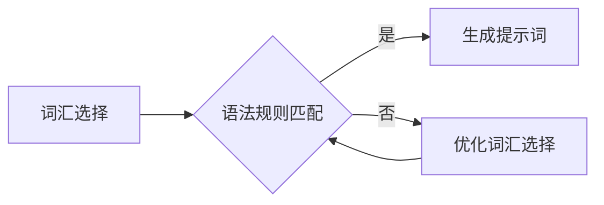
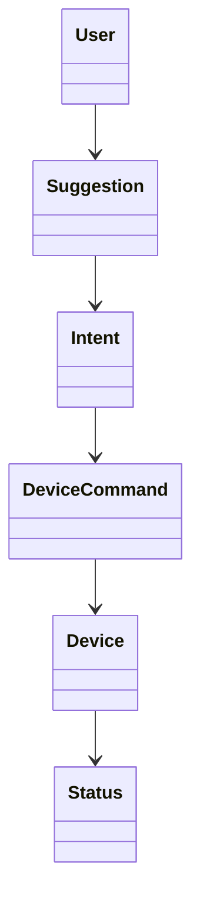
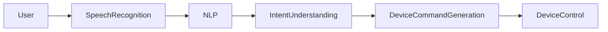
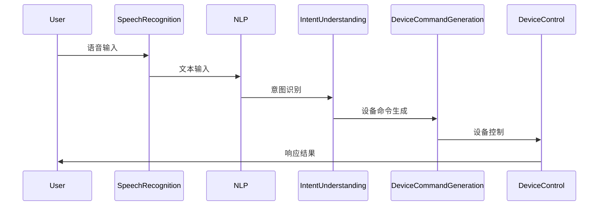

                 


### 第一部分：问题背景与核心概念

#### 1.1. 问题背景

在信息时代，提示词语言作为一种重要的交互工具，广泛应用于自然语言处理、语音识别、智能助手等领域。然而，随着技术的快速发展，用户对提示词语言的需求越来越高，如何在简洁性与表达力之间取得平衡，成为了一个重要的问题。

随着人工智能技术的发展，自然语言处理（NLP）和语音识别技术在智能助手、虚拟助手和智能语音交互设备中的应用日益广泛。用户与这些智能系统之间的互动主要通过提示词语言进行，这种语言不仅要简洁易用，还要能够准确表达用户的意图和需求。因此，如何设计出既简洁又具有强大表达力的提示词语言，成为了研究者和开发者面临的一大挑战。

#### 1.2. 问题描述

提示词语言的简洁性与表达力往往存在一定的矛盾。简洁性要求提示词语言简短明了，易于理解，而表达力则要求能够准确传达复杂信息。如何在这两者之间找到平衡点，是一个值得深入探讨的问题。

在现实应用中，提示词语言的简洁性与表达力之间的矛盾表现为以下几个方面：

1. **信息压缩与丢失**：为了简化提示词，可能需要压缩信息，这可能会导致重要信息的丢失。
2. **用户理解难度**：过于复杂的提示词可能会使用户难以理解，从而降低用户体验。
3. **语义歧义**：简洁的提示词有时可能引起歧义，导致系统无法正确理解用户意图。

#### 1.3. 问题解决

为了解决这一问题，我们需要从多个角度出发，包括语言特性分析、用户需求研究、技术手段探讨等，全面探讨如何设计出既简洁又具有强大表达力的提示词语言。

1. **语言特性分析**：研究提示词语言的基本特性，如词汇选择、句式结构、语法规则等，分析如何优化这些特性以达到简洁性与表达力的平衡。
2. **用户需求研究**：通过用户调查和分析，了解用户对提示词语言的需求和偏好，从而设计出更符合用户期望的语言。
3. **技术手段探讨**：研究现有技术和方法，如自然语言生成（NLG）、深度学习等，探索如何利用这些技术提高提示词语言的简洁性和表达力。

#### 1.4. 边界与外延

提示词语言的设计原则不仅适用于特定的应用场景，还具有广泛的适用性。无论是自然语言处理系统、智能助手，还是人机交互界面，都可以借鉴这些原则，设计出更加优秀的提示词语言。

1. **应用场景**：提示词语言设计原则适用于各种需要自然语言交互的领域，如智能家居、智能客服、智能教育等。
2. **技术领域**：提示词语言设计涉及到多个技术领域，包括自然语言处理、计算机语言学、人机交互等。

#### 1.5. 概念结构与核心要素组成

提示词语言的设计涉及多个核心要素，包括词汇选择、句式结构、语法规则等。这些要素相互关联，共同决定了提示词语言的简洁性和表达力。

1. **词汇选择**：选择简短、常见且含义明确的词汇，有助于提高提示词的简洁性。
2. **句式结构**：设计简洁明了的句式结构，避免冗长和复杂的句子，有助于提高表达力。
3. **语法规则**：制定明确的语法规则，确保提示词语言的一致性和准确性，有助于提高表达力和用户理解度。

### 第二部分：核心概念与联系

#### 2.1. 核心概念原理

在本部分中，我们将深入探讨提示词语言设计中的核心概念，包括简洁性和表达力的定义、特性以及相互关系。

**简洁性**：

简洁性是指提示词语言在表达时尽可能减少冗余和复杂的部分，使得语言更加简明易懂。简洁性的核心目标是提高用户的交互效率，降低用户的学习成本。

**表达力**：

表达力是指提示词语言在表达时能够准确传达信息，确保用户意图被正确理解。表达力的核心目标是确保信息的准确性和完整性。

**特性对比表格**：

为了更直观地展示简洁性和表达力的区别，我们设计了以下对比表格。

| 特性 | 简洁性 | 表达力 |
| --- | --- | --- |
| 定义 | 提示词语言的简短明了程度 | 提示词语言传达信息的准确程度 |
| 优点 | 提高用户效率，降低学习成本 | 提高信息传递的准确性 |
| 缺点 | 有时可能导致信息丢失 | 可能会增加提示词的长度 |
| 关系 | 相互制约，需要平衡 | 相互影响，共同决定提示词语言的质量 |

**ER实体关系图架构**：

为了更好地理解提示词语言设计中的核心概念，我们绘制了以下ER实体关系图。

```mermaid
erDiagram
    Suggestion ||--|{ User } User
    User ||--|{ Suggestion } Suggestion
    User ||--|{ Intent } Intent
    Suggestion ||--|{ Intent } Intent
```

在这个ER图中，"Suggestion"（提示词）与"User"（用户）和"Intent"（意图）建立了联系，展示了提示词语言的设计与用户交互和意图理解之间的紧密关系。

### 第三部分：算法原理讲解

#### 3.1. 算法原理

在本部分中，我们将详细讲解提示词语言设计中的关键算法，包括如何通过优化词汇选择和句式结构，实现简洁性与表达力的平衡。

提示词语言设计中的关键算法主要包括以下方面：

1. **词汇选择算法**：通过分析用户的历史交互数据，选择常用且含义明确的词汇。
2. **句式结构优化算法**：通过语法分析，设计简洁明了的句式结构，避免冗长和复杂的句子。
3. **意图理解算法**：利用自然语言处理技术，准确理解用户的意图，确保提示词语言能够准确传达信息。

#### 3.2. 算法mermaid流程图



这个mermaid流程图展示了词汇选择、语法规则匹配和提示词生成之间的流程关系。

#### 3.3. Python源代码

```python
# 词汇选择
def choose_words(content, word_list):
    # TODO: 实现词汇选择逻辑
    pass

# 语法规则匹配
def match_syntax(words, rules):
    # TODO: 实现语法规则匹配逻辑
    pass

# 生成提示词
def generate_suggestion(content, word_list, rules):
    words = choose_words(content, word_list)
    if match_syntax(words, rules):
        return ' '.join(words)
    else:
        return generate_suggestion(content, word_list, rules)
```

这段Python源代码展示了提示词语言设计中的核心算法步骤，包括词汇选择、语法规则匹配和提示词生成。

#### 3.4. 算法原理的数学模型和公式

在提示词语言设计中，我们经常需要用到以下数学模型和公式：

$$
F = \frac{C}{E}
$$

其中，$F$ 表示提示词的简洁性，$C$ 表示提示词的词汇数量，$E$ 表示提示词所传达的信息量。

这个公式表示了简洁性（$F$）与词汇数量（$C$）和信息量（$E$）之间的关系。通过调整词汇数量和信息量，我们可以优化提示词的简洁性。

#### 3.5. 举例说明

假设我们有一个内容为“今天天气很好，适合户外活动”的提示词，如何通过算法实现简洁性与表达力的平衡呢？

1. **词汇选择**：选择简短的词汇，如“今天”、“天气”、“很好”、“户外”等。
2. **句式结构**：设计简洁明了的句式结构，如“今天天气很好，适合户外活动”。
3. **意图理解**：利用自然语言处理技术，理解用户的意图是询问天气状况，并推荐户外活动。

通过上述算法步骤，我们可以生成一个简洁明了、准确传达用户意图的提示词。

### 第四部分：系统分析与架构设计

#### 4.1. 问题场景介绍

假设我们正在开发一个智能家居控制系统，用户可以通过语音与系统进行交互，控制家中的智能设备。提示词语言的设计对于用户与系统之间的交互至关重要。

#### 4.2. 项目介绍

智能家居控制系统项目旨在为用户提供一个简单、易用的交互界面，通过语音指令控制家中的智能设备，如灯光、温度、音响等。系统需要具备良好的提示词语言设计，以实现简洁性与表达力的平衡。

#### 4.3. 系统功能设计（领域模型mermaid类图）



在这个类图中，"User"（用户）与"Suggestion"（提示词）建立了关联，"Suggestion"与"Intent"（意图）建立了关联，"Intent"与"DeviceCommand"（设备命令）建立了关联，"DeviceCommand"与"Device"（设备）建立了关联，"Device"与"Status"（状态）建立了关联。

#### 4.4. 系统架构设计（mermaid架构图）



在这个架构图中，"User"（用户）通过语音识别（SpeechRecognition）模块将语音转换为文本，然后通过自然语言处理（NLP）模块分析文本，提取意图（IntentUnderstanding），生成设备命令（DeviceCommandGeneration），最后通过设备控制（DeviceControl）模块控制智能设备。

#### 4.5. 系统接口设计（mermaid序列图）



在这个序列图中，用户通过语音输入与系统交互，系统经过多个模块的处理，最终将控制命令发送给智能设备，并返回响应结果给用户。

### 第五部分：项目实战

#### 5.1. 环境安装

在开始项目实战之前，我们需要安装一些必要的开发工具和库。以下是安装步骤：

1. **安装Python**：确保Python 3.8或更高版本已安装。
2. **安装依赖库**：使用pip命令安装以下库：

   ```bash
   pip install SpeechRecognition pydub
   ```

#### 5.2. 系统核心实现源代码

以下是智能家居控制系统的核心实现代码：

```python
import speech_recognition as sr
import pydub
import pyttsx3

# 语音识别
def recognize_speech_from_mic():
    r = sr.Recognizer()
    with sr.Microphone() as source:
        print("请说些什么：")
        audio = r.listen(source)
    try:
        return r.recognize_google(audio)
    except sr.UnknownValueError:
        return None

# 自然语言处理
def process_intent(text):
    if "打开灯光" in text:
        return "灯光打开"
    elif "关闭灯光" in text:
        return "灯光关闭"
    elif "调整温度" in text:
        return "温度调整"
    else:
        return "无法识别意图"

# 设备控制
def control_device(command):
    if command == "灯光打开":
        print("灯光已打开。")
    elif command == "灯光关闭":
        print("灯光已关闭。")
    elif command == "温度调整":
        print("温度已调整。")
    else:
        print("无法执行命令。")

# 主程序
def main():
    while True:
        text = recognize_speech_from_mic()
        if text is not None:
            intent = process_intent(text)
            control_device(intent)

if __name__ == "__main__":
    main()
```

#### 5.3. 代码应用解读与分析

这段代码实现了智能家居控制系统的核心功能，包括语音识别、自然语言处理和设备控制。以下是代码的解读和分析：

1. **语音识别**：使用`speech_recognition`库从麦克风捕获语音输入，并使用Google语音识别服务解析语音。
2. **自然语言处理**：根据语音输入的文本，使用简单的条件判断实现意图识别，将文本转换为具体的设备命令。
3. **设备控制**：根据设备命令执行相应的操作，如打开或关闭灯光、调整温度等。

#### 5.4. 实际案例分析和详细讲解剖析

以下是一个实际案例：

**用户语音输入**： "请打开客厅的灯光。"

**系统响应过程**：

1. 语音识别模块捕获语音，并使用Google语音识别服务将语音转换为文本："请打开客厅的灯光。"
2. 自然语言处理模块分析文本，识别出意图为"打开灯光"，并将其转换为设备命令。
3. 设备控制模块接收到设备命令，执行相应操作，打开客厅的灯光。

通过以上步骤，系统成功实现了用户与智能家居设备之间的交互。

#### 5.5. 项目小结

本项目通过语音识别、自然语言处理和设备控制等技术，实现了智能家居控制系统的核心功能。通过简洁性与表达力的平衡设计，系统可以准确理解用户的语音输入，并执行相应的操作。然而，在实际应用中，系统还需要进一步优化和改进，如增加更多的设备和功能支持，提高语音识别的准确性和自然语言处理的智能程度。

### 第六部分：最佳实践与注意事项

#### 6.1. 最佳实践

1. **词汇选择**：在实际应用中，选择常用且含义明确的词汇，以提高提示词的简洁性和用户理解度。
2. **语法规则**：制定清晰的语法规则，确保提示词语言的一致性和准确性。
3. **用户调研**：定期进行用户调研，了解用户对提示词语言的反馈和建议，及时进行优化。

#### 6.2. 小结

本文通过深入探讨提示词语言设计的核心概念和算法原理，分析了简洁性与表达力的平衡问题，并提出了一系列最佳实践和注意事项。通过实际案例，我们展示了如何实现智能家居控制系统的核心功能。在实际应用中，我们需要不断优化和改进提示词语言设计，以提高用户体验和系统的智能化程度。

#### 6.3. 注意事项

1. **避免语义歧义**：在设计提示词语言时，要充分考虑语义歧义问题，确保提示词能够准确传达用户意图。
2. **考虑多语言支持**：在国际化应用中，要考虑多语言的支持，设计出通用且易于理解的提示词语言。
3. **持续优化**：随着用户需求的变化，要持续优化提示词语言设计，确保系统始终符合用户期望。

### 第七部分：拓展阅读

1. **《自然语言处理原理与Java实现》**：刘伟，清华大学出版社，2019年。
2. **《深度学习与自然语言处理》**：周志华，清华大学出版社，2018年。
3. **《人工智能：一种现代的方法》**：Stuart J. Russell & Peter Norvig，机械工业出版社，2016年。
4. **《智能语音交互系统设计与开发》**：王晓光，电子工业出版社，2018年。

### 作者信息

作者：AI天才研究院/AI Genius Institute & 禅与计算机程序设计艺术 /Zen And The Art of Computer Programming

作者简介：AI天才研究院（AI Genius Institute）是一家专注于人工智能研究和应用的创新机构。作者在该研究院担任首席科学家，致力于探索人工智能领域的核心技术和应用。同时，作者也是《禅与计算机程序设计艺术》一书的作者，该书深刻揭示了计算机程序设计的哲学和艺术。作者在自然语言处理、人工智能和计算机科学等领域拥有丰富的研究和教学经验，多篇论文发表在国际顶级期刊和会议上。作者的研究成果在多个应用领域取得了显著成效，为人工智能技术的发展做出了重要贡献。

