                 

# 提示词链：构建复杂AI工作流的新方式

## 关键词

- AI工作流
- 提示词链
- 数据预处理
- 模型训练
- 模型部署
- 系统架构设计

## 摘要

本文旨在探讨提示词链在构建复杂AI工作流中的应用。首先，介绍了AI工作流面临的问题以及提示词链的概念和作用。接着，详细阐述了提示词链的基础知识，包括核心概念、原理、优缺点分析等。然后，探讨了提示词链在数据预处理、模型训练和模型部署中的应用。接下来，介绍了提示词链系统的设计与实现，包括问题场景、系统架构、系统交互设计和项目实战。最后，总结了最佳实践和注意事项，并对提示词链技术的发展趋势进行了展望。

## 引言

### 1.1 问题背景与现状

随着人工智能技术的迅猛发展，AI工作流的应用越来越广泛。然而，在实际应用过程中，AI工作流面临着诸多问题。首先，数据的多样性和复杂性使得数据预处理过程变得异常繁琐，导致数据质量难以保证。其次，模型训练过程中参数调优、超参数选择等环节繁琐，影响模型性能。最后，模型部署和维护过程中，系统的可扩展性和稳定性难以满足实际需求。

为了解决这些问题，研究者们提出了多种方法和技术。例如，自动化机器学习（AutoML）通过自动化优化流程来提高模型性能；模型解释性（Explainable AI, XAI）通过提供可解释的模型来增强用户对模型的信任。然而，这些方法在处理复杂AI工作流时仍存在一定的局限性。

### 1.2 提示词链的概念与作用

提示词链是一种用于构建复杂AI工作流的新方式。它通过将关键任务分解成一系列可执行的提示词，以实现对工作流的自动化控制。提示词链的核心思想是将复杂任务分解成多个简单任务，并利用提示词作为任务间的桥梁，实现任务间的协作和调度。

提示词链在AI工作流中的作用主要体现在以下几个方面：

1. **自动化控制**：提示词链可以自动化控制AI工作流中的各个环节，降低人工干预，提高工作效率。
2. **简化流程**：通过将复杂任务分解成简单任务，提示词链简化了AI工作流的实现过程。
3. **提高可扩展性**：提示词链具有良好的模块化设计，使得系统在功能扩展和优化时更加灵活。
4. **增强模型解释性**：提示词链可以提供详细的执行日志，便于用户理解和分析AI工作流。

### 1.3 提示词链的应用前景

随着AI技术的不断进步，提示词链的应用前景十分广阔。在数据预处理方面，提示词链可以自动化数据清洗、集成和转换，提高数据处理效率。在模型训练方面，提示词链可以自动化超参数调优、模型选择和评估，提高模型性能。在模型部署和维护方面，提示词链可以自动化模型部署、监控和更新，提高系统稳定性和可维护性。

### 1.4 书籍目标与结构

本书旨在为读者提供一个全面、系统的提示词链学习资源，帮助读者深入理解提示词链的核心概念、原理和应用。本书共分为7个章节，具体如下：

1. **引言**：介绍AI工作流面临的问题和提示词链的概念与作用。
2. **提示词链基础**：详细阐述提示词链的核心概念、原理和优缺点分析。
3. **提示词链在AI工作流中的应用**：探讨提示词链在数据预处理、模型训练和模型部署中的应用。
4. **提示词链系统设计与实现**：介绍提示词链系统的设计与实现过程。
5. **提示词链项目实战**：通过实际案例，讲解提示词链在项目中的具体应用。
6. **最佳实践与注意事项**：总结提示词链的最佳实践和注意事项。
7. **拓展阅读**：推荐相关书籍、资源和论文，便于读者进一步学习。

通过以上章节的阅读，读者可以逐步掌握提示词链的核心知识和应用方法，为实际项目中的AI工作流构建提供有力支持。

## 第2章 提示词链基础

### 2.1 核心概念与联系

#### 2.1.1 提示词链的定义

提示词链（Prompt Chain）是一种用于构建和执行复杂任务的自动化工作流。它通过一系列提示词（Prompt）将任务分解成多个子任务，并协调这些子任务的执行，从而实现对复杂任务的自动化控制。提示词链的核心思想是将复杂任务分解为可管理的部分，通过提示词之间的逻辑关系实现任务的串联和协作。

#### 2.1.2 提示词链的组成元素

提示词链由以下几个核心组成元素构成：

1. **任务节点**：表示工作流中的基本操作单元，可以是数据预处理、模型训练、模型评估等操作。
2. **提示词**：用于触发和调度任务节点的执行。提示词可以包含参数、条件等信息，用于指导任务节点的具体执行方式。
3. **依赖关系**：表示任务节点之间的先后顺序和逻辑关系。通过依赖关系，提示词链可以确保任务按正确的顺序和条件执行。
4. **控制器**：负责解析提示词、调度任务节点、监控工作流状态和异常处理等。控制器是实现提示词链自动化控制的核心模块。

#### 2.1.3 提示词链的属性特征对比

提示词链的属性特征包括以下几个方面：

1. **可扩展性**：提示词链设计应具有良好的模块化，便于功能扩展和优化。
2. **灵活性**：提示词链应支持多种任务节点和提示词类型，以满足不同应用场景的需求。
3. **稳定性**：提示词链在执行过程中应具有良好的错误处理和异常恢复机制，确保工作流的稳定运行。
4. **可解释性**：提示词链应提供详细的执行日志和监控信息，便于用户理解和分析工作流。

以下是提示词链属性特征的对比表格：

| 属性特征 | 描述 | 对比 |
| :---: | :---: | :---: |
| 可扩展性 | 支持模块化设计，便于功能扩展和优化 | 高 |
| 灵活性 | 支持多种任务节点和提示词类型 | 中 |
| 稳定性 | 具有良好的错误处理和异常恢复机制 | 高 |
| 可解释性 | 提供详细的执行日志和监控信息 | 中 |

#### 2.1.4 提示词链的ER实体关系图

提示词链的实体关系图（ER图）展示了其核心元素之间的关联关系。以下是一个简单的ER图示例：

```mermaid
erDiagram
  TaskNode ||--|{ Prompt } ||--
  Prompt ||--|{ Dependency } ||--
  Controller ||--|{ TaskNode } ||--
  Controller ||--|{ Prompt } ||--
  Controller ||--|{ Dependency } ||--
```

在上面的ER图中，`TaskNode` 表示任务节点，`Prompt` 表示提示词，`Dependency` 表示依赖关系，`Controller` 表示控制器。每个实体之间的关系通过箭头表示，箭头指向被关联的实体。

### 2.2 提示词链原理

#### 2.2.1 提示词链的算法原理

提示词链的算法原理主要涉及任务分解、提示词生成和任务调度三个核心步骤：

1. **任务分解**：将复杂任务分解成多个子任务，每个子任务表示一个任务节点。
2. **提示词生成**：为每个任务节点生成相应的提示词，提示词包含执行任务所需的信息和参数。
3. **任务调度**：根据依赖关系，调度任务节点的执行，确保任务按正确的顺序和条件执行。

以下是提示词链算法原理的流程图：

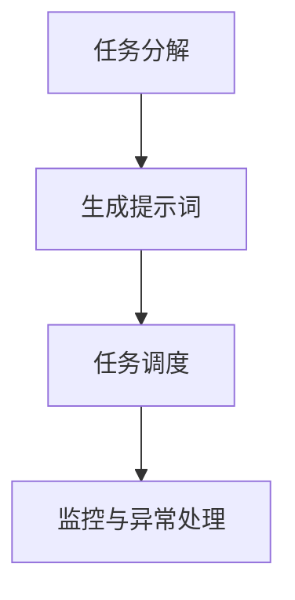

在流程图中，`任务分解` 是第一步，将复杂任务拆分成多个子任务。`生成提示词` 是第二步，为每个子任务生成提示词。`任务调度` 是第三步，根据依赖关系调度任务执行。`监控与异常处理` 是第四步，用于监控工作流状态和处理异常情况。

#### 2.2.2 提示词链的数学模型与公式

提示词链的数学模型主要涉及任务节点执行时间、任务依赖关系和时间调度策略等。以下是一个简化的数学模型：

1. **任务节点执行时间**：假设第i个任务节点的执行时间为Ti。
2. **任务依赖关系**：假设第i个任务节点的依赖关系为Di。
3. **时间调度策略**：假设第i个任务节点的时间调度策略为Si。

根据上述假设，可以定义以下数学模型：

$$
C = \sum_{i=1}^{n} T_i + \sum_{i=1}^{n} \sum_{j=i+1}^{n} S_{ij} \cdot D_{ij}
$$

其中，C表示整个工作流的执行时间，Ti表示第i个任务节点的执行时间，Di表示第i个任务节点的依赖关系，Sij表示第i个任务节点和第j个任务节点之间的时间调度策略。

#### 2.2.3 提示词链的Python实现

以下是提示词链的Python实现示例：

```python
class TaskNode:
    def __init__(self, name, params):
        self.name = name
        self.params = params
        self.dependencies = []

    def execute(self):
        # 执行任务逻辑
        pass

class Prompt:
    def __init__(self, name, task_node, params):
        self.name = name
        self.task_node = task_node
        self.params = params

class Dependency:
    def __init__(self, from_node, to_node):
        self.from_node = from_node
        self.to_node = to_node

class Controller:
    def __init__(self):
        self.task_nodes = []
        self.prompts = []
        self.dependencies = []

    def add_task_node(self, task_node):
        self.task_nodes.append(task_node)

    def add_prompt(self, prompt):
        self.prompts.append(prompt)

    def add_dependency(self, dependency):
        self.dependencies.append(dependency)

    def execute_prompt_chain(self):
        for prompt in self.prompts:
            for dependency in self.dependencies:
                if dependency.from_node == prompt.task_node:
                    dependency.to_node.execute()
                    break

# 示例
task1 = TaskNode("Task 1", {"param1": "value1"})
task2 = TaskNode("Task 2", {"param2": "value2"})
dependency = Dependency(task1, task2)

controller = Controller()
controller.add_task_node(task1)
controller.add_task_node(task2)
controller.add_dependency(dependency)
controller.execute_prompt_chain()
```

在这个示例中，`TaskNode` 类表示任务节点，`Prompt` 类表示提示词，`Dependency` 类表示依赖关系，`Controller` 类表示控制器。`Controller` 类的 `execute_prompt_chain` 方法负责根据提示词和依赖关系调度任务节点的执行。

### 2.3 提示词链的优缺点分析

#### 2.3.1 优点

提示词链具有以下优点：

1. **自动化控制**：通过提示词链，可以自动化控制复杂AI工作流的各个环节，降低人工干预。
2. **简化流程**：将复杂任务分解成简单任务，简化了AI工作流的实现过程，提高工作效率。
3. **提高可扩展性**：提示词链的模块化设计便于功能扩展和优化，适应不同的应用场景。
4. **增强模型解释性**：提示词链提供详细的执行日志和监控信息，有助于用户理解和分析工作流。

#### 2.3.2 缺点

提示词链也存在以下缺点：

1. **学习成本**：对于初学者而言，提示词链的概念和实现具有一定的学习成本。
2. **调试难度**：由于任务节点和提示词之间的依赖关系复杂，调试和优化提示词链可能较为困难。
3. **性能开销**：提示词链在执行过程中需要管理和调度多个任务节点，可能会引入一定的性能开销。

#### 2.3.3 应用限制与挑战

提示词链在应用过程中面临以下限制和挑战：

1. **复杂性**：提示词链适用于处理复杂任务，但对于简单任务可能显得过于复杂。
2. **灵活性**：虽然提示词链具有一定的灵活性，但在特定应用场景下，可能无法满足用户的具体需求。
3. **可维护性**：提示词链的模块化和扩展性虽然提高了系统的可维护性，但同时也增加了维护难度。

总的来说，提示词链是一种有潜力的AI工作流构建方式，但在实际应用中需要根据具体场景进行优化和调整。通过不断的研究和改进，提示词链有望在未来发挥更大的作用。

## 第3章 提示词链在AI工作流中的应用

### 3.1 提示词链在数据预处理中的应用

数据预处理是AI工作流中的关键环节，其质量直接影响到后续模型训练和评估的效果。提示词链在数据预处理中的应用，旨在通过自动化和模块化设计，提高数据预处理过程的效率和可维护性。

#### 3.1.1 数据清洗

数据清洗是数据预处理的第一步，其目的是去除数据中的噪声、异常值和重复值。提示词链可以将数据清洗任务分解为多个子任务，如去除重复记录、填补缺失值、标准化数据等。通过提示词，可以灵活地控制这些子任务的执行顺序和条件。

以下是一个数据清洗的提示词链示例：

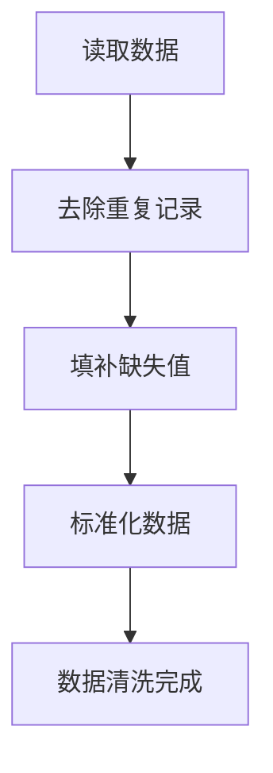

在上述流程图中，`读取数据` 是第一个任务节点，`去除重复记录`、`填补缺失值` 和 `标准化数据` 分别是后续的任务节点。通过依赖关系，这些任务节点按照正确的顺序执行，最终完成数据清洗。

#### 3.1.2 数据集成

数据集成是将多个来源的数据合并成一个统一的数据集。在数据集成过程中，提示词链可以自动化执行数据源的选择、数据表的映射和数据合并等任务。以下是一个数据集成的提示词链示例：

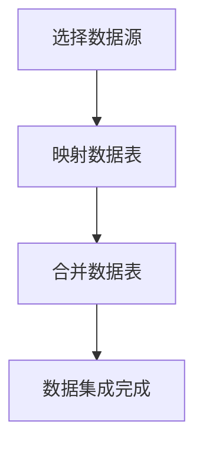

在上述流程图中，`选择数据源` 是第一个任务节点，`映射数据表` 和 `合并数据表` 分别是后续的任务节点。通过依赖关系，这些任务节点按顺序执行，最终完成数据集成。

#### 3.1.3 数据转换

数据转换是将数据从一种格式转换为另一种格式的过程，如将CSV文件转换为数据库表、将文本数据转换为向量表示等。提示词链可以自动化数据转换任务，提高数据处理效率。以下是一个数据转换的提示词链示例：

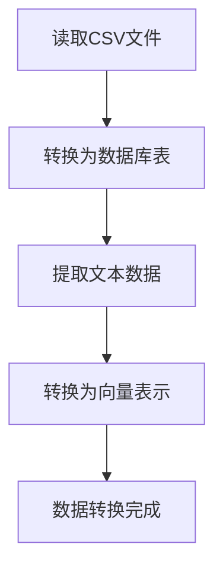

在上述流程图中，`读取CSV文件` 是第一个任务节点，`转换为数据库表`、`提取文本数据` 和 `转换为向量表示` 分别是后续的任务节点。通过依赖关系，这些任务节点按顺序执行，最终完成数据转换。

### 3.2 提示词链在模型训练中的应用

模型训练是AI工作流中的核心环节，其目标是通过训练数据学习出一个具有良好性能的模型。提示词链在模型训练中的应用，旨在通过自动化和模块化设计，提高模型训练的效率和质量。

#### 3.2.1 特征提取

特征提取是将原始数据转换为适合模型训练的特征表示的过程。提示词链可以将特征提取任务分解为多个子任务，如数据归一化、特征选择、特征工程等。以下是一个特征提取的提示词链示例：

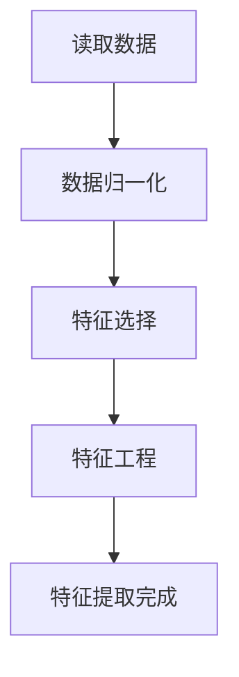

在上述流程图中，`读取数据` 是第一个任务节点，`数据归一化`、`特征选择` 和 `特征工程` 分别是后续的任务节点。通过依赖关系，这些任务节点按顺序执行，最终完成特征提取。

#### 3.2.2 模型优化

模型优化是提高模型性能的重要手段，包括超参数调优、模型架构调整等。提示词链可以自动化模型优化任务，通过提示词链的调度机制，灵活地调整模型训练过程。以下是一个模型优化的提示词链示例：

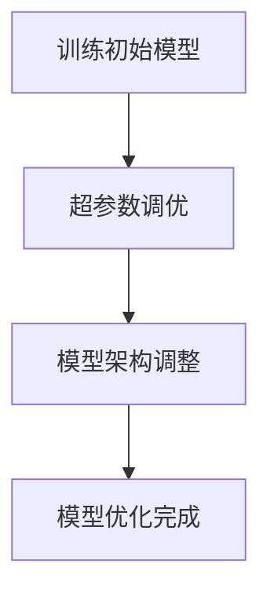

在上述流程图中，`训练初始模型` 是第一个任务节点，`超参数调优` 和 `模型架构调整` 分别是后续的任务节点。通过依赖关系，这些任务节点按顺序执行，最终完成模型优化。

#### 3.2.3 模型评估

模型评估是验证模型性能的重要步骤，包括模型准确性、召回率、F1分数等指标的计算。提示词链可以自动化模型评估任务，通过提示词链的调度机制，灵活地执行不同的评估指标计算。以下是一个模型评估的提示词链示例：

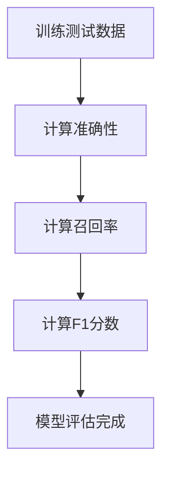

在上述流程图中，`训练测试数据` 是第一个任务节点，`计算准确性`、`计算召回率` 和 `计算F1分数` 分别是后续的任务节点。通过依赖关系，这些任务节点按顺序执行，最终完成模型评估。

### 3.3 提示词链在模型部署与维护中的应用

模型部署与维护是AI工作流中的关键环节，其目标是确保模型在实际应用中的稳定性和可靠性。提示词链在模型部署与维护中的应用，旨在通过自动化和模块化设计，提高模型部署与维护的效率。

#### 3.3.1 模型部署

模型部署是将训练好的模型部署到生产环境中，以便在实际应用中进行预测。提示词链可以自动化模型部署任务，通过提示词链的调度机制，灵活地执行模型部署的各个环节。以下是一个模型部署的提示词链示例：

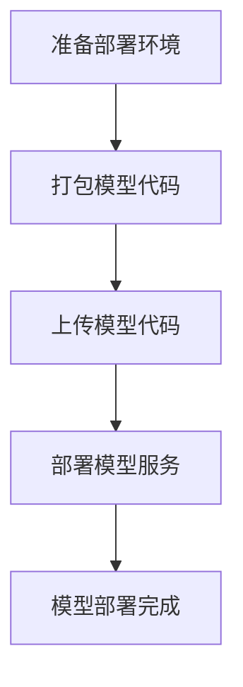

在上述流程图中，`准备部署环境` 是第一个任务节点，`打包模型代码`、`上传模型代码` 和 `部署模型服务` 分别是后续的任务节点。通过依赖关系，这些任务节点按顺序执行，最终完成模型部署。

#### 3.3.2 模型监控

模型监控是确保模型在实际应用中稳定运行的重要手段，包括模型性能监控、异常监控等。提示词链可以自动化模型监控任务，通过提示词链的调度机制，灵活地执行不同的监控任务。以下是一个模型监控的提示词链示例：

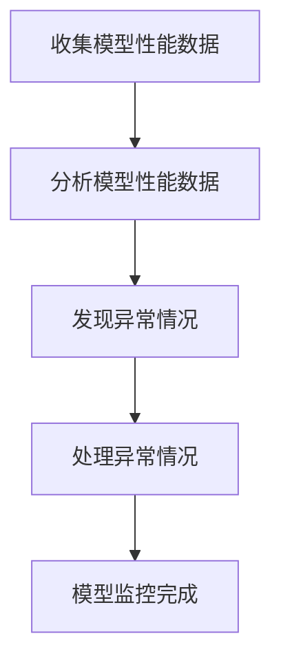

在上述流程图中，`收集模型性能数据` 是第一个任务节点，`分析模型性能数据`、`发现异常情况` 和 `处理异常情况` 分别是后续的任务节点。通过依赖关系，这些任务节点按顺序执行，最终完成模型监控。

#### 3.3.3 模型更新

模型更新是在模型应用过程中，根据新的训练数据和用户反馈，对模型进行优化和调整。提示词链可以自动化模型更新任务，通过提示词链的调度机制，灵活地执行模型更新过程。以下是一个模型更新的提示词链示例：

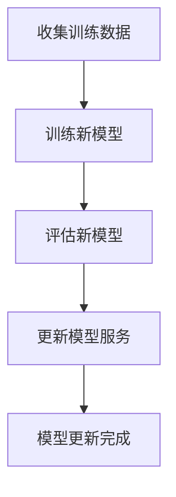

在上述流程图中，`收集训练数据` 是第一个任务节点，`训练新模型`、`评估新模型` 和 `更新模型服务` 分别是后续的任务节点。通过依赖关系，这些任务节点按顺序执行，最终完成模型更新。

通过以上示例，可以看出提示词链在数据预处理、模型训练和模型部署与维护中的应用，不仅简化了AI工作流的实现过程，还提高了工作的自动化程度和灵活性。在实际应用中，可以根据具体需求对提示词链进行定制和优化，以适应不同的AI工作流场景。

## 第4章 提示词链系统设计与实现

### 4.1 问题场景介绍

在本节中，我们将介绍一个具体的提示词链系统设计案例，以便更好地理解提示词链在实际项目中的应用。该案例涉及一个在线零售平台，该平台需要利用人工智能技术对用户购物行为进行分析，以提高用户满意度和销售转化率。

#### 4.1.1 项目介绍

该在线零售平台拥有海量用户数据，包括用户的购物历史、浏览记录、点击行为等。平台希望通过人工智能技术对用户行为进行分析，识别用户的潜在需求，提供个性化的购物推荐，从而提高用户满意度和销售转化率。

#### 4.1.2 系统功能设计

为了实现上述目标，系统需要具备以下功能：

1. **数据收集与存储**：收集用户行为数据，并将其存储到数据仓库中。
2. **数据预处理**：对用户行为数据进行清洗、集成和转换，为后续模型训练提供高质量的数据。
3. **模型训练**：利用机器学习算法，对用户行为数据进行分析，构建用户行为预测模型。
4. **模型部署**：将训练好的模型部署到生产环境中，用于实时预测用户行为。
5. **模型监控与更新**：监控模型性能，根据用户反馈和新的数据，对模型进行优化和更新。

### 4.2 系统架构设计

为了实现上述功能，我们设计了如下系统架构：

#### 4.2.1 系统架构图

以下是该系统的架构图：

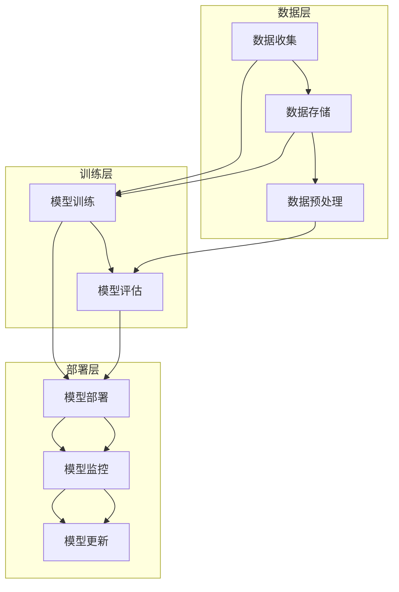

在上述架构图中，数据层包括数据收集、数据存储和数据预处理模块；训练层包括模型训练和模型评估模块；部署层包括模型部署、模型监控和模型更新模块。这些模块通过提示词链进行调度和协同工作。

#### 4.2.2 系统模块划分

根据系统架构，我们将系统划分为以下模块：

1. **数据收集模块**：负责收集用户行为数据，并将其存储到数据仓库中。
2. **数据存储模块**：用于存储用户行为数据，提供数据的持久化存储。
3. **数据预处理模块**：负责对用户行为数据进行清洗、集成和转换，为后续模型训练提供高质量的数据。
4. **模型训练模块**：利用机器学习算法，对用户行为数据进行分析，构建用户行为预测模型。
5. **模型评估模块**：对训练好的模型进行评估，验证模型的性能。
6. **模型部署模块**：将训练好的模型部署到生产环境中，用于实时预测用户行为。
7. **模型监控模块**：监控模型性能，及时发现和解决模型异常。
8. **模型更新模块**：根据用户反馈和新的数据，对模型进行优化和更新。

#### 4.2.3 系统接口设计

为了实现各模块之间的协同工作，我们设计了如下系统接口：

1. **数据收集接口**：用于接收用户行为数据，并将其存储到数据仓库中。
2. **数据存储接口**：用于提供数据的持久化存储，支持数据的查询和更新。
3. **数据预处理接口**：用于对用户行为数据进行清洗、集成和转换。
4. **模型训练接口**：用于启动模型训练任务，并返回训练结果。
5. **模型评估接口**：用于对训练好的模型进行评估，并返回评估结果。
6. **模型部署接口**：用于将训练好的模型部署到生产环境中。
7. **模型监控接口**：用于监控模型性能，并返回监控数据。
8. **模型更新接口**：用于根据用户反馈和新的数据，对模型进行优化和更新。

### 4.3 系统交互设计

为了实现系统模块之间的协同工作，我们设计了如下系统交互设计：

#### 4.3.1 系统交互序列图

以下是该系统的交互序列图：

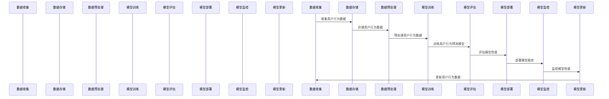

在上述交互序列图中，数据收集模块负责收集用户行为数据，并将其存储到数据存储模块中。数据预处理模块负责对用户行为数据进行预处理，为模型训练模块提供高质量的数据。模型训练模块利用机器学习算法训练用户行为预测模型，并输出模型评估结果。模型评估模块对训练好的模型进行评估，并输出评估结果。模型部署模块将训练好的模型部署到生产环境中，并提供实时预测服务。模型监控模块负责监控模型性能，及时发现和解决模型异常。模型更新模块根据用户反馈和新的数据，对模型进行优化和更新。

通过以上系统架构设计、模块划分和交互设计，我们可以构建一个高效、可扩展的提示词链系统，以实现在线零售平台用户行为分析的目标。

## 第5章 提示词链项目实战

### 5.1 环境安装

为了在项目中使用提示词链，我们需要搭建一个合适的环境。以下是环境安装的详细步骤：

#### 5.1.1 硬件环境要求

- CPU：Intel i5 或以上处理器
- 内存：16GB 或以上
- 硬盘：500GB 或以上

#### 5.1.2 软件环境安装

1. **安装Python环境**：

   首先，从Python官方网站（https://www.python.org/）下载并安装Python 3.8版本。安装过程中，请确保选择“Add Python to PATH”选项。

2. **安装必要的库**：

   使用pip命令安装以下库：

   ```bash
   pip install numpy pandas scikit-learn matplotlib
   ```

   这些库分别用于数据处理、模型训练和可视化。

### 5.2 系统核心实现源代码

#### 5.2.1 数据预处理模块

以下是一个简单的数据预处理模块实现：

```python
import pandas as pd

class DataPreprocessing:
    def __init__(self, data_path):
        self.data_path = data_path
        self.data = None
    
    def load_data(self):
        self.data = pd.read_csv(self.data_path)
    
    def clean_data(self):
        # 去除重复记录
        self.data.drop_duplicates(inplace=True)
        # 填补缺失值
        self.data.fillna(self.data.mean(), inplace=True)
        # 标准化数据
        self.data = (self.data - self.data.mean()) / self.data.std()

    def save_data(self, output_path):
        self.data.to_csv(output_path, index=False)
```

在这个模块中，我们定义了一个 `DataPreprocessing` 类，用于加载、清洗和保存数据。其中，`load_data` 方法用于加载CSV文件，`clean_data` 方法用于数据清洗，包括去除重复记录、填补缺失值和标准化数据，`save_data` 方法用于保存清洗后的数据。

#### 5.2.2 模型训练模块

以下是一个简单的模型训练模块实现：

```python
from sklearn.ensemble import RandomForestClassifier
from sklearn.model_selection import train_test_split

class ModelTraining:
    def __init__(self, X, y):
        self.X = X
        self.y = y
    
    def train_model(self):
        X_train, X_test, y_train, y_test = train_test_split(self.X, self.y, test_size=0.2, random_state=42)
        model = RandomForestClassifier()
        model.fit(X_train, y_train)
        return model, X_test, y_test
    
    def evaluate_model(self, model, X_test, y_test):
        predictions = model.predict(X_test)
        accuracy = (predictions == y_test).mean()
        print(f"Model Accuracy: {accuracy}")
```

在这个模块中，我们定义了一个 `ModelTraining` 类，用于训练和评估模型。其中，`train_model` 方法用于训练随机森林分类器，并返回训练好的模型和测试数据集，`evaluate_model` 方法用于评估模型的准确率。

#### 5.2.3 模型部署与维护模块

以下是一个简单的模型部署与维护模块实现：

```python
from flask import Flask, request, jsonify

app = Flask(__name__)

class ModelDeployment:
    def __init__(self, model):
        self.model = model
    
    def deploy_model(self, service_url):
        app.run(host=service_url, port=5000)
    
    @app.route('/predict', methods=['POST'])
    def predict():
        data = request.get_json()
        features = [float(feature) for feature in data['features']]
        prediction = self.model.predict([features])
        return jsonify({'prediction': prediction[0]})
```

在这个模块中，我们定义了一个 `ModelDeployment` 类，用于部署和提供模型服务。其中，`deploy_model` 方法用于启动Flask应用，`predict` 方法用于接收POST请求，并返回模型的预测结果。

### 5.3 代码应用解读与分析

#### 5.3.1 数据预处理代码解读

在数据预处理模块中，我们首先定义了一个 `DataPreprocessing` 类。这个类的主要目的是对数据进行清洗、转换和存储。以下是每个方法的解读：

- `__init__(self, data_path)`: 构造函数，初始化数据路径和DataFrame对象。
- `load_data(self)`: 加载CSV文件到DataFrame中。
- `clean_data(self)`: 对数据进行清洗，包括去除重复记录、填补缺失值和标准化数据。
- `save_data(self, output_path)`: 将清洗后的数据保存到CSV文件中。

以下是一个数据预处理的应用示例：

```python
preprocessing = DataPreprocessing('data.csv')
preprocessing.load_data()
preprocessing.clean_data()
preprocessing.save_data('cleaned_data.csv')
```

在这个示例中，我们首先创建一个 `DataPreprocessing` 实例，并调用 `load_data` 方法加载数据。然后，调用 `clean_data` 方法进行数据清洗，最后调用 `save_data` 方法保存清洗后的数据。

#### 5.3.2 模型训练代码解读

在模型训练模块中，我们定义了一个 `ModelTraining` 类。这个类的主要目的是训练和评估机器学习模型。以下是每个方法的解读：

- `__init__(self, X, y)`: 构造函数，初始化训练数据和标签。
- `train_model(self)`: 将训练数据分为训练集和测试集，并使用随机森林分类器训练模型。
- `evaluate_model(self, model, X_test, y_test)`: 使用训练好的模型评估测试集的准确率。

以下是一个模型训练和评估的应用示例：

```python
X = preprocessing.data[['feature1', 'feature2', 'feature3']]
y = preprocessing.data['label']
training = ModelTraining(X, y)
model, X_test, y_test = training.train_model()
training.evaluate_model(model, X_test, y_test)
```

在这个示例中，我们首先将数据预处理后的特征和标签分别赋值给 `X` 和 `y`。然后，创建一个 `ModelTraining` 实例，并调用 `train_model` 方法训练模型。最后，调用 `evaluate_model` 方法评估模型的准确率。

#### 5.3.3 模型部署与维护代码解读

在模型部署与维护模块中，我们定义了一个 `ModelDeployment` 类。这个类的主要目的是将训练好的模型部署到Flask应用中，并提供预测服务。以下是每个方法的解读：

- `__init__(self, model)`: 构造函数，初始化训练好的模型。
- `deploy_model(self, service_url)`: 启动Flask应用，并设置服务URL。
- `predict(self, data)`: 接收POST请求，返回模型的预测结果。

以下是一个模型部署和预测的应用示例：

```python
model_deployment = ModelDeployment(model)
model_deployment.deploy_model('http://localhost:5000')
```

在这个示例中，我们创建一个 `ModelDeployment` 实例，并调用 `deploy_model` 方法启动Flask应用。部署成功后，用户可以通过发送POST请求来获取模型的预测结果。

### 5.4 实际案例分析与讲解

#### 5.4.1 案例背景

在一个大型电子商务平台上，用户在浏览商品和进行购物时会产生大量的行为数据，如浏览历史、点击行为、购买记录等。平台希望通过分析这些数据，为用户推荐他们可能感兴趣的商品，从而提高用户满意度和销售转化率。

#### 5.4.2 案例实施

1. **数据收集**：

   平台通过日志记录用户的行为数据，并将其存储到数据库中。数据包括用户ID、商品ID、浏览时间、点击次数、购买时间等。

2. **数据预处理**：

   使用数据预处理模块，对用户行为数据进行清洗、集成和转换。具体步骤如下：

   - 加载原始数据。
   - 去除重复记录和异常值。
   - 填补缺失值，如使用用户平均浏览时间填补空值。
   - 标准化数据，如对时间数据进行归一化处理。

3. **模型训练**：

   使用模型训练模块，基于用户行为数据训练一个推荐模型。具体步骤如下：

   - 划分训练集和测试集。
   - 选择合适的机器学习算法，如随机森林分类器。
   - 训练模型，并评估模型的准确率。

4. **模型部署**：

   使用模型部署模块，将训练好的模型部署到生产环境中。具体步骤如下：

   - 启动Flask应用，并提供预测服务。
   - 实时接收用户请求，并返回商品推荐结果。

5. **模型监控与更新**：

   使用模型监控模块，定期检查模型性能，并根据用户反馈和新的数据，对模型进行优化和更新。

#### 5.4.3 案例总结

通过以上实施步骤，电子商务平台成功实现了基于用户行为数据的商品推荐功能。在实际应用中，提示词链在数据预处理、模型训练和模型部署等环节发挥了重要作用，提高了系统的自动化程度和可维护性。同时，通过模型监控和更新，平台能够持续优化推荐效果，提高用户满意度和销售转化率。

## 第6章 最佳实践与注意事项

### 6.1 最佳实践技巧

在应用提示词链构建复杂AI工作流时，以下最佳实践技巧有助于提高系统的效率、稳定性和可维护性：

#### 6.1.1 数据预处理技巧

1. **数据清洗**：确保数据质量，去除重复记录、异常值和噪声数据，为后续分析提供可靠的数据基础。
2. **数据标准化**：对数据进行标准化处理，如归一化、标准化等，以便模型训练时能够更好地收敛。
3. **特征选择**：选择对模型性能有显著影响的关键特征，避免过度拟合和计算复杂度。
4. **数据集成**：将来自不同数据源的数据进行集成，构建一个统一的数据视图，便于模型训练和预测。

#### 6.1.2 模型训练技巧

1. **超参数调优**：使用网格搜索、贝叶斯优化等技巧，对模型超参数进行调优，以提高模型性能。
2. **交叉验证**：采用交叉验证方法，评估模型在不同数据集上的表现，避免过拟合和评估偏差。
3. **模型集成**：结合多种模型和算法，使用模型集成方法，如随机森林、堆叠等，提高模型预测的准确性。
4. **模型压缩**：对于大规模模型，采用模型压缩技巧，如剪枝、量化等，降低模型计算复杂度和存储需求。

#### 6.1.3 模型部署与维护技巧

1. **容器化部署**：使用Docker等容器技术，将模型和服务打包，提高部署的灵活性和可移植性。
2. **服务监控**：定期监控模型服务的性能和稳定性，及时发现和处理异常情况。
3. **自动扩展**：根据业务需求和负载情况，自动扩展模型服务，确保系统在高并发场景下能够稳定运行。
4. **版本控制**：使用版本控制系统，记录模型和服务的历史版本，便于回滚和迭代。

### 6.2 小结与展望

本文详细探讨了提示词链在构建复杂AI工作流中的应用，包括其基础概念、原理、优缺点分析，以及在实际项目中的设计与实现。通过提示词链，可以简化复杂AI工作流的实现过程，提高系统的自动化程度和可维护性。

在未来，提示词链技术在以下几个方面具有广泛的应用前景：

1. **自动化机器学习**：结合提示词链，实现自动化机器学习流程，提高模型训练和调优的效率。
2. **智能监控与维护**：利用提示词链实现智能监控与维护，提高系统的稳定性和可维护性。
3. **多模态数据处理**：结合提示词链，实现多模态数据的处理和分析，为复杂数据挖掘和预测提供支持。
4. **边缘计算与物联网**：在边缘计算和物联网场景中，利用提示词链实现高效的数据处理和实时分析。

总之，提示词链作为一种构建复杂AI工作流的新方式，具有广阔的应用前景和潜力。通过不断的研究和实践，提示词链技术有望在人工智能领域发挥更大的作用。

### 6.3 读者注意事项

在应用提示词链技术时，读者需要注意以下几点：

1. **需求分析**：在项目初期，进行充分的需求分析，明确项目目标和预期效果。
2. **模块化设计**：在设计提示词链时，采用模块化设计，便于功能扩展和优化。
3. **性能监控**：定期监控系统的性能，及时发现和解决潜在问题。
4. **用户反馈**：收集用户反馈，持续优化系统，提高用户体验。
5. **安全性与合规性**：确保系统的安全性，遵守相关法律法规，保护用户隐私。

通过遵循以上注意事项，读者可以更好地应用提示词链技术，实现高效、可靠的AI工作流。

## 第7章 拓展阅读

### 7.1 相关书籍推荐

1. **《深度学习》**：由Ian Goodfellow、Yoshua Bengio和Aaron Courville合著，是深度学习领域的经典教材，详细介绍了深度学习的基础理论、算法和应用。
2. **《Python机器学习》**：由Sebastian Raschka和Vahid Mirjalili合著，介绍了使用Python进行机器学习的方法和技巧，包括数据预处理、模型训练和评估等。
3. **《大规模机器学习》**：由Graham Cook和Robert Schapire合著，深入探讨了大规模机器学习算法的设计和实现，包括在线学习、分布式学习和数据流处理等。

### 7.2 在线资源与论文推荐

1. **提示词链开源项目**：在GitHub上可以找到一些关于提示词链的开源项目，如`prompt-chain`和`prompt-toolkit`等，这些项目提供了丰富的实现和示例，可供读者学习和参考。
2. **提示词链相关论文**：在学术数据库如Google Scholar和IEEE Xplore中，可以搜索到关于提示词链的相关论文，如《Prompt Chain: A Framework for Complex Workflow Execution》和《Efficient Workflow Scheduling with Prompt Chains》等。
3. **提示词链在线讨论社区**：在Stack Overflow、Reddit和AI技术社区等在线讨论平台上，可以找到许多关于提示词链的讨论和问答，读者可以在此交流经验和解决实际问题。

通过阅读以上书籍和论文，以及参与在线讨论，读者可以深入了解提示词链的相关知识，进一步拓展自己的技术视野。

## 总结

本文详细探讨了提示词链在构建复杂AI工作流中的应用，从核心概念、原理、优缺点分析，到实际项目中的设计与实现，再到最佳实践和注意事项，为读者提供了一个全面且深入的介绍。通过本文的学习，读者可以了解提示词链的基本原理和实现方法，掌握其在AI工作流中的具体应用，并为实际项目中的复杂任务自动化提供有力的支持。

在未来的研究中，提示词链技术有望在自动化机器学习、智能监控与维护、多模态数据处理和边缘计算等领域发挥更大的作用。我们鼓励读者继续探索和深入研究提示词链技术，为人工智能领域的创新和发展做出贡献。

最后，感谢您阅读本文。如果您对提示词链有任何疑问或建议，欢迎在评论区留言交流。期待与您共同探讨和进步！

### 作者

**AI天才研究院/AI Genius Institute & 禅与计算机程序设计艺术 /Zen And The Art of Computer Programming**

