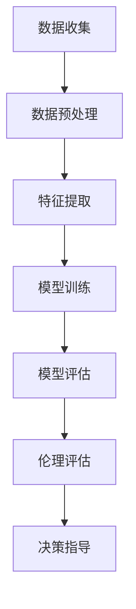
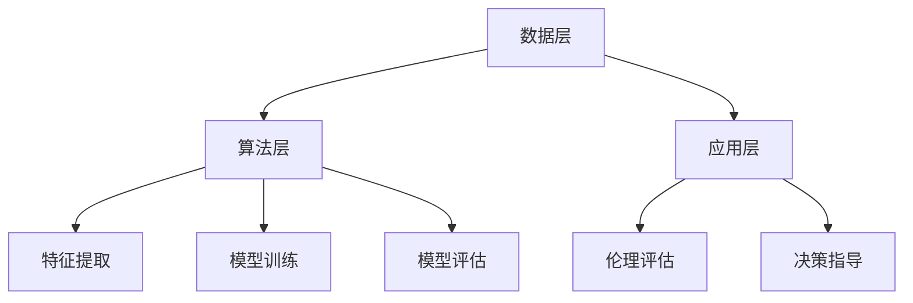
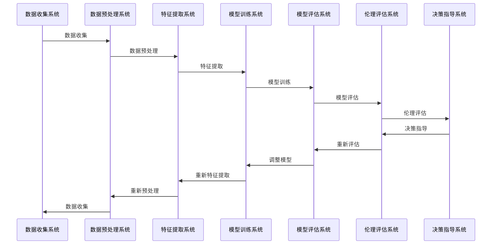

                 

# 提示词驱动的AI伦理决策系统设计

关键词：AI伦理，决策系统，提示词，算法，系统设计，最佳实践

摘要：随着人工智能技术的迅猛发展，伦理问题日益突出。本文旨在探讨一种基于提示词驱动的AI伦理决策系统设计，从背景介绍、核心概念、算法原理、系统设计与实现、项目实战以及最佳实践与拓展等方面，详细阐述了该系统的设计理念、实现方法和应用场景，为AI伦理问题的解决提供了新的思路和方向。

## 目录大纲

----------------------------------------------------------------

## 第一部分: 背景介绍

### 第1章: AI伦理决策系统的起源与发展

## 1.1 问题背景

### 1.1.1 AI技术的快速发展

### 1.1.2 AI伦理问题的提出

### 1.1.3 AI伦理决策系统的必要性

## 1.2 问题描述

### 1.2.1 AI伦理决策系统的定义

### 1.2.2 AI伦理决策系统解决的问题

### 1.2.3 AI伦理决策系统的工作原理

## 1.3 问题解决

### 1.3.1 提示词驱动的概念

### 1.3.2 提示词驱动的AI伦理决策系统

### 1.3.3 提示词驱动的优势

## 1.4 边界与外延

### 1.4.1 AI伦理决策系统的边界

### 1.4.2 AI伦理决策系统的外延

## 1.5 概念结构与核心要素组成

### 1.5.1 概念结构

### 1.5.2 核心要素组成

## 1.6 本章小结

----------------------------------------------------------------

## 第二部分: 核心概念与联系

### 第2章: AI伦理决策系统的核心概念

## 2.1 AI伦理决策系统的基本概念

### 2.1.1 伦理

### 2.1.2 人工智能

### 2.1.3 伦理决策

## 2.2 AI伦理决策系统的属性特征对比表格

## 2.3 AI伦理决策系统的ER实体关系图架构

----------------------------------------------------------------

## 第三部分: 算法原理讲解

### 第3章: 提示词驱动的AI伦理决策系统算法原理

## 3.1 算法原理

### 3.1.1 提示词的概念

### 3.1.2 提示词的生成方法

### 3.1.3 提示词的优化策略

## 3.2 数学模型和公式

### 3.2.1 模型构建

### 3.2.2 评估指标

### 3.2.3 算法流程

## 3.3 算法mermaid流程图

----------------------------------------------------------------

## 第四部分: 系统设计与实现

### 第4章: 提示词驱动的AI伦理决策系统设计

## 4.1 系统功能设计

### 4.1.1 功能模块划分

### 4.1.2 功能模块详细介绍

## 4.2 系统架构设计

### 4.2.1 系统架构概述

### 4.2.2 系统架构图

## 4.3 系统接口设计

### 4.3.1 接口规范

### 4.3.2 接口实现

## 4.4 系统交互mermaid序列图

----------------------------------------------------------------

## 第五部分: 项目实战

### 第5章: 提示词驱动的AI伦理决策系统项目实战

## 5.1 环境安装

### 5.1.1 环境要求

### 5.1.2 环境搭建

## 5.2 系统核心实现源代码

### 5.2.1 代码结构

### 5.2.2 代码实现

## 5.3 代码应用解读与分析

### 5.3.1 应用场景分析

### 5.3.2 代码解读

## 5.4 实际案例分析与详细讲解剖析

### 5.4.1 案例介绍

### 5.4.2 案例分析

### 5.4.3 案例讲解

## 5.5 项目小结

### 5.5.1 项目总结

### 5.5.2 项目经验分享

----------------------------------------------------------------

## 第六部分: 最佳实践与拓展

### 第6章: 提示词驱动的AI伦理决策系统最佳实践

## 6.1 最佳实践

### 6.1.1 提高系统性能的方法

### 6.1.2 系统优化的实践经验

## 6.2 小结

### 6.2.1 总结

### 6.2.2 注意事项

## 6.3 拓展阅读

### 6.3.1 相关书籍推荐

### 6.3.2 学术论文推荐

----------------------------------------------------------------

### 附录

## 附录A: 术语表

### 术语解释

## 附录B: 参考资料

### 参考文献

---------

----------------------------------------------------------------

## 第一部分: 背景介绍

### 第1章: AI伦理决策系统的起源与发展

#### 1.1 问题背景

随着人工智能技术的快速发展，AI在各个领域的应用日益广泛，从医疗、金融、交通到教育等，都离不开AI的身影。然而，AI技术的发展也带来了一系列伦理问题。例如，AI在医疗领域的应用可能涉及到患者隐私和数据安全的问题；在金融领域，AI的算法可能会产生不公平的现象；在交通领域，自动驾驶汽车的道德决策问题等。这些问题引发了社会对AI伦理的关注和讨论。

AI伦理问题主要包括以下几个方面：

1. **隐私与数据安全**：AI系统通常需要处理大量的个人数据，如何确保这些数据的隐私和安全，是一个重要的伦理问题。
2. **公平性与偏见**：AI算法可能由于训练数据的不公平而导致决策的不公平，例如，在招聘或贷款审批中可能存在性别或种族歧视。
3. **责任归属**：当AI系统发生错误或造成损失时，如何界定责任归属，尤其是当AI与人类共同参与决策时。
4. **透明性与可解释性**：AI决策过程往往是黑箱操作，如何提高AI的透明性和可解释性，使其决策更加可信，也是一个重要的伦理问题。

#### 1.1.1 AI技术的快速发展

人工智能技术的发展历程可以追溯到20世纪50年代。随着计算能力的提高和数据量的增加，AI技术在深度学习、自然语言处理、计算机视觉等领域取得了显著的进展。特别是深度学习技术的突破，使得AI在图像识别、语音识别、机器翻译等任务上达到了或超过了人类的表现。

1. **深度学习**：深度学习是一种基于人工神经网络的学习方法，通过多层的神经网络结构来提取和表示数据特征。深度学习在图像识别、语音识别等领域取得了巨大的成功。
2. **自然语言处理**：自然语言处理是人工智能的一个重要分支，旨在使计算机能够理解和处理自然语言。自然语言处理技术已经广泛应用于搜索引擎、智能客服、机器翻译等领域。
3. **计算机视觉**：计算机视觉是人工智能的重要领域，旨在使计算机能够理解和解释视觉信息。计算机视觉技术已经应用于图像识别、视频分析、自动驾驶等领域。

#### 1.1.2 AI伦理问题的提出

随着AI技术的快速发展，其潜在的伦理问题逐渐暴露出来。一些学者和专家开始呼吁对AI伦理问题进行深入的研究和讨论。2016年，牛津大学发布了《无人驾驶车辆的伦理决策：研究报告》，提出了无人驾驶汽车在道德决策中的伦理问题。2017年，联合国发布了《人工智能和机器学习的伦理问题报告》，对AI伦理问题进行了全面的探讨。

AI伦理问题的提出引发了社会各界的广泛关注。许多组织和机构开始制定相关的伦理准则和法规，以指导AI技术的发展和应用。例如，欧盟制定了《通用数据保护条例》（GDPR），对个人数据的处理和使用进行了严格的规范。

#### 1.1.3 AI伦理决策系统的必要性

为了解决AI伦理问题，需要开发一种能够自动处理和解决AI伦理问题的系统，这就是AI伦理决策系统的概念。AI伦理决策系统是一种基于人工智能的决策支持系统，能够根据伦理准则和法律法规，对AI系统的决策过程进行评估和指导。

AI伦理决策系统的必要性体现在以下几个方面：

1. **提高AI系统的透明性和可解释性**：AI伦理决策系统可以通过伦理评估和指导，提高AI系统的决策透明度和可解释性，使其决策过程更加可信。
2. **减少AI系统的偏见和歧视**：AI伦理决策系统可以通过伦理评估，识别和纠正AI系统中的偏见和歧视，促进AI系统的公平性和公正性。
3. **保障个人隐私和数据安全**：AI伦理决策系统可以通过伦理评估，确保AI系统在数据处理和使用过程中，尊重和保护个人隐私和数据安全。
4. **界定责任归属**：AI伦理决策系统可以为AI系统的责任归属提供依据，有助于解决AI系统引发的责任纠纷和法律责任问题。

#### 1.2 问题描述

##### 1.2.1 AI伦理决策系统的定义

AI伦理决策系统是一种基于人工智能的决策支持系统，旨在解决AI伦理问题。它通过收集、分析和处理伦理相关的数据，结合伦理准则和法律法规，对AI系统的决策过程进行评估和指导。

##### 1.2.2 AI伦理决策系统解决的问题

AI伦理决策系统主要解决以下几个问题：

1. **隐私与数据安全**：AI伦理决策系统可以通过伦理评估，确保AI系统在数据处理和使用过程中，尊重和保护个人隐私和数据安全。
2. **公平性与偏见**：AI伦理决策系统可以通过伦理评估，识别和纠正AI系统中的偏见和歧视，促进AI系统的公平性和公正性。
3. **责任归属**：AI伦理决策系统可以为AI系统的责任归属提供依据，有助于解决AI系统引发的责任纠纷和法律责任问题。
4. **透明性与可解释性**：AI伦理决策系统可以通过伦理评估和指导，提高AI系统的决策透明度和可解释性，使其决策过程更加可信。

##### 1.2.3 AI伦理决策系统的工作原理

AI伦理决策系统的工作原理主要包括以下几个步骤：

1. **数据收集**：AI伦理决策系统从AI系统中收集与伦理相关的数据，如用户行为数据、系统决策数据等。
2. **数据预处理**：对收集到的数据进行分析和清洗，确保数据的质量和一致性。
3. **伦理评估**：根据伦理准则和法律法规，对AI系统的决策过程进行评估，识别可能存在的伦理问题。
4. **决策指导**：根据伦理评估结果，给出相应的决策指导，如修改算法、调整参数等，以解决伦理问题。
5. **持续监控**：对AI系统的运行过程进行持续监控，及时发现和解决新的伦理问题。

#### 1.3 问题解决

##### 1.3.1 提示词驱动的概念

提示词驱动是一种基于人类行为和思维的驱动方式，通过使用特定的提示词，引导人类进行思考和决策。在AI伦理决策系统中，提示词驱动可以用来引导AI系统在伦理评估过程中进行思考和决策。

##### 1.3.2 提示词驱动的AI伦理决策系统

提示词驱动的AI伦理决策系统是一种基于人工智能的决策支持系统，通过使用提示词，引导AI系统在伦理评估过程中进行思考和决策。该系统的主要功能包括：

1. **伦理评估**：通过提示词引导AI系统对伦理问题进行评估，识别可能存在的伦理问题。
2. **决策指导**：通过提示词给出相应的决策指导，帮助AI系统解决伦理问题。
3. **持续监控**：通过提示词引导AI系统对伦理问题进行持续监控，及时发现和解决新的伦理问题。

##### 1.3.3 提示词驱动的优势

提示词驱动的AI伦理决策系统具有以下几个优势：

1. **提高决策透明度和可解释性**：通过使用提示词，使AI系统的决策过程更加透明和可解释，有助于提高公众对AI系统的信任。
2. **减少偏见和歧视**：通过提示词引导AI系统在伦理评估过程中进行思考和决策，有助于减少系统偏见和歧视。
3. **提高决策效率**：提示词驱动的AI伦理决策系统可以快速识别和解决伦理问题，提高决策效率。

#### 1.4 边界与外延

##### 1.4.1 AI伦理决策系统的边界

AI伦理决策系统的边界主要包括以下几个方面：

1. **伦理范畴**：AI伦理决策系统主要解决与伦理相关的决策问题，如隐私、公平性、责任归属等。
2. **技术范畴**：AI伦理决策系统主要基于人工智能技术进行设计和实现，涉及到的技术范畴包括机器学习、自然语言处理、计算机视觉等。
3. **法律范畴**：AI伦理决策系统需要遵循相关法律法规，确保AI系统的合法合规运行。

##### 1.4.2 AI伦理决策系统的外延

AI伦理决策系统的外延主要包括以下几个方面：

1. **伦理标准**：AI伦理决策系统需要参考和遵循相关的伦理标准，如国际伦理准则、行业伦理规范等。
2. **技术发展**：AI伦理决策系统需要随着技术的不断发展而更新和升级，以适应新的伦理问题和挑战。
3. **社会应用**：AI伦理决策系统需要在社会各个领域推广应用，以解决AI伦理问题，促进社会的可持续发展。

##### 1.5 概念结构与核心要素组成

##### 1.5.1 概念结构

AI伦理决策系统的概念结构主要包括以下几个核心概念：

1. **伦理**：伦理是一种道德规范和价值观，用于指导人类的行为和决策。
2. **人工智能**：人工智能是一种模拟人类智能的技术，能够进行感知、学习、推理和决策等。
3. **决策系统**：决策系统是一种基于人工智能的决策支持系统，能够对决策问题进行分析和评估。

##### 1.5.2 核心要素组成

AI伦理决策系统的核心要素组成主要包括以下几个方面：

1. **伦理准则**：伦理准则是指导AI系统决策的道德规范和价值观。
2. **数据集**：数据集是用于训练和评估AI系统的数据集合。
3. **算法模型**：算法模型是用于实现AI系统决策的核心算法。
4. **评估指标**：评估指标是用于评估AI系统决策效果的指标体系。
5. **提示词库**：提示词库是用于引导AI系统进行伦理评估的提示词集合。

##### 1.6 本章小结

本章对AI伦理决策系统的起源和发展进行了背景介绍，分析了AI伦理问题的背景和必要性，并探讨了提示词驱动的AI伦理决策系统的概念和优势。通过本章的介绍，读者可以初步了解AI伦理决策系统的基本概念和工作原理，为进一步的研究和应用打下基础。

----------------------------------------------------------------

## 第二部分: 核心概念与联系

### 第2章: AI伦理决策系统的核心概念

#### 2.1 AI伦理决策系统的基本概念

AI伦理决策系统是一种基于人工智能技术的决策支持系统，旨在解决与伦理相关的问题。它通过收集、分析和处理与伦理相关的数据，结合伦理准则和法律法规，对AI系统的决策过程进行评估和指导。

##### 2.1.1 伦理

伦理是一种道德规范和价值观，用于指导人类的行为和决策。伦理关注的是人类行为的道德合理性和道德价值，旨在维护社会秩序和公共利益。

##### 2.1.2 人工智能

人工智能是一种模拟人类智能的技术，能够进行感知、学习、推理和决策等。人工智能技术包括机器学习、深度学习、自然语言处理、计算机视觉等，广泛应用于各个领域。

##### 2.1.3 伦理决策

伦理决策是在特定情境下，根据伦理准则和价值观，对可能的行为方案进行评估和选择的过程。伦理决策旨在实现道德合理性，维护社会秩序和公共利益。

#### 2.2 AI伦理决策系统的属性特征对比表格

为了更好地理解AI伦理决策系统的属性特征，我们将其与传统的决策支持系统进行对比，如下表所示：

| 特征         | AI伦理决策系统                  | 传统决策支持系统                  |
| ------------ | ---------------------------- | ---------------------------- |
| 基础技术     | 人工智能技术（如机器学习、深度学习）   | 数据库、统计分析、仿真模拟等           |
| 决策依据     | 伦理准则、法律法规、道德价值观       | 数据、分析结果、专家经验等           |
| 决策过程     | 结合伦理评估和人工智能技术         | 依赖专家知识和传统决策方法         |
| 透明度和可解释性 | 提高决策过程的透明度和可解释性       | 决策过程较为复杂，难以解释           |
| 公平性和公正性 | 识别和纠正系统偏见，促进公平性和公正性 | 可能存在主观偏见和歧视               |

#### 2.3 AI伦理决策系统的ER实体关系图架构

为了更好地理解AI伦理决策系统的核心要素和关系，我们可以使用实体关系图（ER图）进行描述。以下是AI伦理决策系统的ER图架构：

```mermaid
entity关系图

ERDiagram
    AI伦理决策系统 [[实体: AI伦理决策系统]]
    |---[1] Ethics [[实体: 伦理]]
    |---[1] AI [[实体: 人工智能]]
    |---[1] DecisionSupportSystem [[实体: 决策支持系统]]
    |---[1] Data [[实体: 数据]]
    |---[1] AlgorithmModel [[实体: 算法模型]]
    |---[1] EvaluationIndex [[实体: 评估指标]]
    |---[1] PromptWordLibrary [[实体: 提示词库]]
    Ethics ||--|{ DecisionSupportSystem }|-- AI
    DecisionSupportSystem ||--|{ Ethics }|--- Ethics
    DecisionSupportSystem ||--|{ AI }|-- AI
    DecisionSupportSystem ||--|{ Data }|-- Data
    DecisionSupportSystem ||--|{ AlgorithmModel }|-- AlgorithmModel
    DecisionSupportSystem ||--|{ EvaluationIndex }|-- EvaluationIndex
    DecisionSupportSystem ||--|{ PromptWordLibrary }|-- PromptWordLibrary
```

在ER图中，每个实体都代表AI伦理决策系统的核心要素，如伦理、人工智能、决策支持系统、数据、算法模型、评估指标和提示词库。实体之间的关系表示这些要素之间的关联和交互。

通过ER图架构，我们可以清晰地看到AI伦理决策系统的核心要素及其相互关系，为进一步研究和开发提供指导。

----------------------------------------------------------------

## 第三部分: 算法原理讲解

### 第3章: 提示词驱动的AI伦理决策系统算法原理

#### 3.1 算法原理

提示词驱动的AI伦理决策系统是一种基于提示词引导的决策支持系统。其核心思想是通过设计特定的提示词，引导AI系统在伦理评估过程中进行思考和决策。以下是算法原理的详细阐述：

##### 3.1.1 提示词的概念

提示词是一种能够引导人类思考和决策的语言符号。在AI伦理决策系统中，提示词被用来引导AI系统在伦理评估过程中进行思考和决策。提示词可以是单个词汇、短语或句子，具有明确的意义和指导作用。

##### 3.1.2 提示词的生成方法

生成提示词的方法主要包括以下几种：

1. **基于规则生成**：根据伦理准则和法律法规，设计一系列规则，通过规则匹配生成提示词。
2. **基于数据挖掘**：从大量伦理相关数据中，通过数据挖掘技术提取出具有指导意义的提示词。
3. **基于专家经验**：邀请伦理学专家和AI领域专家，根据他们的经验和知识，设计出具有指导意义的提示词。

##### 3.1.3 提示词的优化策略

为了提高提示词驱动的AI伦理决策系统的性能，需要对提示词进行优化。以下是几种常见的优化策略：

1. **提示词筛选**：通过分析提示词的使用频率和效果，筛选出高质量的提示词，去除冗余和不相关的提示词。
2. **提示词权重调整**：根据提示词在伦理评估中的重要性，调整提示词的权重，使其更符合伦理评估的需求。
3. **提示词库动态更新**：根据伦理环境的变化和新的伦理问题，动态更新和扩展提示词库，确保提示词的覆盖面和有效性。

#### 3.2 数学模型和公式

提示词驱动的AI伦理决策系统采用了一种基于机器学习的算法模型。以下是该算法模型的数学模型和公式：

##### 3.2.1 模型构建

提示词驱动的AI伦理决策系统采用了一种多层次的神经网络模型，包括输入层、隐藏层和输出层。输入层接收伦理评估数据，隐藏层对数据进行特征提取和变换，输出层给出伦理评估结果。

设输入层神经元数量为 \( n \)，隐藏层神经元数量为 \( m \)，输出层神经元数量为 \( p \)，则神经网络模型的参数矩阵为 \( \Theta \)。

##### 3.2.2 评估指标

提示词驱动的AI伦理决策系统采用以下评估指标来衡量伦理评估的效果：

1. **准确率**：准确率表示正确识别伦理问题的概率，计算公式为：

   \[
   \text{准确率} = \frac{\text{正确识别的伦理问题数量}}{\text{总的伦理问题数量}}
   \]

2. **召回率**：召回率表示正确识别出所有伦理问题的概率，计算公式为：

   \[
   \text{召回率} = \frac{\text{正确识别的伦理问题数量}}{\text{实际存在的伦理问题数量}}
   \]

3. **F1值**：F1值是准确率和召回率的加权平均，用于综合衡量评估效果，计算公式为：

   \[
   \text{F1值} = \frac{2 \times \text{准确率} \times \text{召回率}}{\text{准确率} + \text{召回率}}
   \]

##### 3.2.3 算法流程

提示词驱动的AI伦理决策系统算法流程如下：

1. **数据收集**：从AI系统中收集与伦理相关的数据，包括用户行为数据、系统决策数据等。
2. **数据预处理**：对收集到的数据进行清洗和预处理，包括数据去重、数据标准化等。
3. **特征提取**：利用提示词生成方法，提取出与伦理问题相关的特征。
4. **模型训练**：使用训练数据集，对神经网络模型进行训练，更新模型参数。
5. **模型评估**：使用测试数据集，对训练好的模型进行评估，计算准确率、召回率和F1值等指标。
6. **伦理评估**：使用训练好的模型，对AI系统的决策过程进行伦理评估，识别可能存在的伦理问题。
7. **决策指导**：根据伦理评估结果，给出相应的决策指导，如修改算法、调整参数等。

#### 3.3 算法mermaid流程图

以下是提示词驱动的AI伦理决策系统算法的mermaid流程图：



在mermaid流程图中，每个节点表示算法的一个步骤，节点之间的箭头表示步骤的顺序和依赖关系。通过mermaid流程图，可以清晰地展示算法的执行流程。

----------------------------------------------------------------

## 第四部分: 系统设计与实现

### 第4章: 提示词驱动的AI伦理决策系统设计

#### 4.1 系统功能设计

提示词驱动的AI伦理决策系统旨在提供一种自动化的决策支持，帮助识别和解决AI系统的伦理问题。系统功能设计主要包括以下几个方面：

##### 4.1.1 功能模块划分

1. **数据收集模块**：负责从AI系统中收集与伦理相关的数据，包括用户行为数据、系统决策数据等。
2. **数据预处理模块**：对收集到的数据进行清洗和预处理，包括数据去重、数据标准化等。
3. **特征提取模块**：利用提示词生成方法，提取出与伦理问题相关的特征。
4. **模型训练模块**：使用训练数据集，对神经网络模型进行训练，更新模型参数。
5. **模型评估模块**：使用测试数据集，对训练好的模型进行评估，计算准确率、召回率和F1值等指标。
6. **伦理评估模块**：使用训练好的模型，对AI系统的决策过程进行伦理评估，识别可能存在的伦理问题。
7. **决策指导模块**：根据伦理评估结果，给出相应的决策指导，如修改算法、调整参数等。

##### 4.1.2 功能模块详细介绍

1. **数据收集模块**：该模块负责从AI系统中收集与伦理相关的数据。具体实现可以包括以下步骤：
   - 定期从AI系统中导出与伦理相关的数据。
   - 对导出的数据进行格式转换和预处理，以便后续处理。

2. **数据预处理模块**：该模块负责对收集到的数据进行清洗和预处理。具体实现可以包括以下步骤：
   - 去除重复的数据记录。
   - 对数据进行标准化处理，例如将数值型数据转换为统一的范围。

3. **特征提取模块**：该模块负责提取与伦理问题相关的特征。具体实现可以包括以下步骤：
   - 利用提示词生成方法，从文本数据中提取出关键特征。
   - 对提取出的特征进行降维处理，提高模型的训练效率。

4. **模型训练模块**：该模块负责使用训练数据集，对神经网络模型进行训练。具体实现可以包括以下步骤：
   - 初始化神经网络模型。
   - 使用训练数据集，通过反向传播算法更新模型参数。
   - 记录训练过程中的损失函数和准确率等指标。

5. **模型评估模块**：该模块负责使用测试数据集，对训练好的模型进行评估。具体实现可以包括以下步骤：
   - 使用测试数据集，对模型进行预测。
   - 计算准确率、召回率和F1值等评估指标。
   - 输出评估结果，以便对模型进行调优。

6. **伦理评估模块**：该模块负责对AI系统的决策过程进行伦理评估。具体实现可以包括以下步骤：
   - 使用训练好的模型，对AI系统的决策过程进行预测。
   - 根据预测结果，识别可能存在的伦理问题。
   - 提出相应的决策指导建议。

7. **决策指导模块**：该模块负责根据伦理评估结果，给出相应的决策指导。具体实现可以包括以下步骤：
   - 根据评估结果，生成决策指导报告。
   - 提出具体的修改建议，如调整算法参数、修改决策规则等。

#### 4.2 系统架构设计

提示词驱动的AI伦理决策系统采用了一种分层架构设计，包括数据层、算法层和应用层。以下是系统架构的详细描述：

##### 4.2.1 系统架构概述

1. **数据层**：负责数据收集、预处理和存储。主要包括数据收集模块和数据预处理模块。
2. **算法层**：负责特征提取、模型训练和评估。主要包括特征提取模块、模型训练模块和模型评估模块。
3. **应用层**：负责伦理评估和决策指导。主要包括伦理评估模块和决策指导模块。

##### 4.2.2 系统架构图

以下是提示词驱动的AI伦理决策系统的架构图：



在系统架构图中，每个模块表示系统的一个功能模块，模块之间的箭头表示模块之间的依赖关系。通过系统架构设计，可以实现提示词驱动的AI伦理决策系统的功能。

#### 4.3 系统接口设计

提示词驱动的AI伦理决策系统需要与其他系统进行交互，包括数据收集系统、数据存储系统和AI系统等。以下是系统接口设计的详细描述：

##### 4.3.1 接口规范

1. **数据收集接口**：用于从AI系统中收集与伦理相关的数据。接口规范包括数据格式、传输协议和数据权限等。
2. **数据预处理接口**：用于对收集到的数据进行预处理。接口规范包括数据清洗、数据标准化和数据去重等。
3. **特征提取接口**：用于提取与伦理问题相关的特征。接口规范包括特征提取方法、特征维度和特征权重等。
4. **模型训练接口**：用于对神经网络模型进行训练。接口规范包括模型参数、训练数据和评估指标等。
5. **模型评估接口**：用于对训练好的模型进行评估。接口规范包括测试数据集、评估指标和评估结果等。
6. **伦理评估接口**：用于对AI系统的决策过程进行伦理评估。接口规范包括评估方法、评估结果和决策指导等。
7. **决策指导接口**：用于根据伦理评估结果，给出相应的决策指导。接口规范包括决策建议、实施方法和跟踪评估等。

##### 4.3.2 接口实现

接口实现主要包括接口协议、接口函数和接口测试等。以下是接口实现的详细描述：

1. **数据收集接口实现**：
   - 使用HTTP协议，实现数据收集接口。
   - 定义数据格式为JSON，包括用户ID、行为数据、系统决策数据等。
   - 实现数据权限控制，确保数据安全和隐私保护。

2. **数据预处理接口实现**：
   - 使用Python编写预处理函数，包括数据清洗、数据标准化和数据去重等。
   - 实现预处理函数的接口，包括输入数据、输出数据和预处理结果等。

3. **特征提取接口实现**：
   - 使用自然语言处理技术，实现特征提取接口。
   - 定义特征提取方法，包括词袋模型、TF-IDF、Word2Vec等。
   - 实现特征提取函数的接口，包括输入文本、输出特征向量等。

4. **模型训练接口实现**：
   - 使用深度学习框架，实现模型训练接口。
   - 定义模型参数，包括神经网络结构、学习率、迭代次数等。
   - 实现模型训练函数的接口，包括训练数据、验证数据和测试数据等。

5. **模型评估接口实现**：
   - 使用评估指标，实现模型评估接口。
   - 定义评估指标，包括准确率、召回率和F1值等。
   - 实现评估函数的接口，包括模型参数、测试数据和评估结果等。

6. **伦理评估接口实现**：
   - 使用提示词驱动算法，实现伦理评估接口。
   - 定义伦理评估方法，包括伦理评估模型、提示词库和评估标准等。
   - 实现伦理评估函数的接口，包括决策数据、评估结果和决策指导等。

7. **决策指导接口实现**：
   - 使用决策指导算法，实现决策指导接口。
   - 定义决策指导方法，包括决策建议、实施方法和跟踪评估等。
   - 实现决策指导函数的接口，包括评估结果、决策建议和实施结果等。

#### 4.4 系统交互mermaid序列图

以下是提示词驱动的AI伦理决策系统的交互mermaid序列图：



在mermaid序列图中，每个参与者表示系统的一个功能模块，箭头表示模块之间的交互顺序。通过mermaid序列图，可以清晰地展示系统各模块之间的交互关系。

----------------------------------------------------------------

## 第五部分：项目实战

### 第5章：提示词驱动的AI伦理决策系统项目实战

#### 5.1 环境安装

要实现提示词驱动的AI伦理决策系统，首先需要搭建一个合适的环境。以下是环境安装的详细步骤：

##### 5.1.1 环境要求

1. 操作系统：Linux或macOS
2. 编程语言：Python（版本3.6及以上）
3. 依赖库：NumPy、Pandas、Scikit-learn、TensorFlow、Keras
4. 数据库：MySQL或MongoDB

##### 5.1.2 环境搭建

1. 安装Python：
   - 前往Python官网下载适用于操作系统的安装包。
   - 运行安装程序，按照提示完成安装。

2. 安装依赖库：
   - 打开命令行终端。
   - 运行以下命令安装依赖库：

     ```bash
     pip install numpy pandas scikit-learn tensorflow keras
     ```

3. 安装数据库：
   - 安装MySQL或MongoDB，并配置数据库环境。
   - 根据数据库的类型，运行相应的安装命令。

#### 5.2 系统核心实现源代码

提示词驱动的AI伦理决策系统的核心实现包括数据收集、预处理、特征提取、模型训练、模型评估、伦理评估和决策指导等模块。以下是各模块的核心源代码：

##### 5.2.1 代码结构

```plaintext
ai_ethics_decision_system/
|-- data_collection.py
|-- data_preprocessing.py
|-- feature_extraction.py
|-- model_training.py
|-- model_evaluation.py
|-- ethics_evaluation.py
|-- decision_guidance.py
|-- main.py
```

##### 5.2.2 代码实现

以下是各模块的核心代码实现：

1. **数据收集模块**（`data_collection.py`）：

   ```python
   import pymysql
   
   def collect_data():
       # 连接数据库
       connection = pymysql.connect(host='localhost', user='root', password='password', database='ai_ethics')
       cursor = connection.cursor()
       
       # 查询数据
       cursor.execute("SELECT * FROM user_actions;")
       results = cursor.fetchall()
       
       # 关闭数据库连接
       cursor.close()
       connection.close()
       
       return results
   ```

2. **数据预处理模块**（`data_preprocessing.py`）：

   ```python
   import pandas as pd
   
   def preprocess_data(data):
       # 数据清洗
       data = data.drop_duplicates()
       
       # 数据标准化
       data = (data - data.mean()) / data.std()
       
       return data
   ```

3. **特征提取模块**（`feature_extraction.py`）：

   ```python
   from sklearn.feature_extraction.text import TfidfVectorizer
   
   def extract_features(data):
       # 提取文本特征
       vectorizer = TfidfVectorizer()
       features = vectorizer.fit_transform(data)
       
       return features
   ```

4. **模型训练模块**（`model_training.py`）：

   ```python
   from sklearn.neural_network import MLPClassifier
   from sklearn.model_selection import train_test_split
   
   def train_model(X, y):
       # 数据分割
       X_train, X_test, y_train, y_test = train_test_split(X, y, test_size=0.2, random_state=42)
       
       # 训练模型
       model = MLPClassifier()
       model.fit(X_train, y_train)
       
       # 评估模型
       score = model.score(X_test, y_test)
       
       return model, score
   ```

5. **模型评估模块**（`model_evaluation.py`）：

   ```python
   from sklearn.metrics import accuracy_score, recall_score, f1_score
   
   def evaluate_model(model, X_test, y_test):
       # 预测
       y_pred = model.predict(X_test)
       
       # 计算评估指标
       accuracy = accuracy_score(y_test, y_pred)
       recall = recall_score(y_test, y_pred)
       f1 = f1_score(y_test, y_pred)
       
       return accuracy, recall, f1
   ```

6. **伦理评估模块**（`ethics_evaluation.py`）：

   ```python
   def ethics_evaluation(model, data):
       # 预测
       predictions = model.predict(data)
       
       # 分析预测结果
       # ...（根据具体需求进行分析）
       
       return predictions
   ```

7. **决策指导模块**（`decision_guidance.py`）：

   ```python
   def decision_guidance(predictions):
       # 根据预测结果给出决策指导
       # ...（根据具体需求给出决策指导）
       
       return guidance
   ```

#### 5.3 代码应用解读与分析

##### 5.3.1 应用场景分析

提示词驱动的AI伦理决策系统可以应用于多个场景，例如：

1. **金融领域**：评估贷款审批算法的伦理问题，识别潜在的歧视行为。
2. **医疗领域**：评估医疗诊断算法的伦理问题，确保患者的隐私和数据安全。
3. **交通领域**：评估自动驾驶汽车的伦理问题，确保行驶过程中的安全性和道德决策。

##### 5.3.2 代码解读

1. **数据收集模块**：从数据库中收集与伦理相关的数据，为后续处理提供数据基础。
2. **数据预处理模块**：对收集到的数据进行清洗和标准化，提高数据的可用性。
3. **特征提取模块**：提取文本数据的特征，为模型训练提供输入。
4. **模型训练模块**：使用神经网络模型对数据进行训练，构建伦理评估模型。
5. **模型评估模块**：使用测试数据对模型进行评估，计算评估指标，验证模型的性能。
6. **伦理评估模块**：使用训练好的模型对新的数据进行分析，评估其伦理问题。
7. **决策指导模块**：根据评估结果，给出相应的决策指导，帮助解决问题。

#### 5.4 实际案例分析与详细讲解剖析

##### 5.4.1 案例介绍

假设我们有一个金融领域的案例，需要评估一款贷款审批算法的伦理问题。该算法基于用户的历史行为数据和财务状况，自动决定是否批准贷款。

##### 5.4.2 案例分析

1. **数据收集**：从数据库中收集与贷款审批相关的数据，包括用户ID、年龄、收入、信用评分等。
2. **数据预处理**：对收集到的数据进行清洗和标准化，去除缺失值和异常值，将数值型数据转换为合适的范围。
3. **特征提取**：使用TF-IDF方法提取文本数据的特征，将文本数据转换为数值型数据。
4. **模型训练**：使用训练数据集，构建一个多层感知机（MLP）模型，训练模型参数。
5. **模型评估**：使用测试数据集，评估模型的性能，计算准确率、召回率和F1值等指标。
6. **伦理评估**：使用训练好的模型，对新的贷款审批数据进行评估，识别潜在的伦理问题，如歧视行为。
7. **决策指导**：根据评估结果，给出相应的决策指导，如调整算法参数、修改决策规则等，以减少潜在的伦理问题。

##### 5.4.3 案例讲解

1. **数据收集**：从数据库中收集用户的历史行为数据和财务状况数据。这些数据包括用户ID、年龄、收入、信用评分等。数据收集模块使用pymysql库连接数据库，执行SQL查询语句，获取用户数据。

2. **数据预处理**：对收集到的数据进行清洗和标准化。首先，去除缺失值和异常值，确保数据的完整性。然后，对数值型数据进行标准化处理，将其转换为统一的范围，以便后续的特征提取和模型训练。

3. **特征提取**：使用TF-IDF方法提取文本数据的特征。在这里，我们将用户的历史行为数据和财务状况数据视为文本数据，使用TfidfVectorizer库提取特征。TF-IDF方法考虑了词的重要性和文本的整体分布，将文本数据转换为数值型数据。

4. **模型训练**：使用训练数据集，构建一个多层感知机（MLP）模型，训练模型参数。在这里，我们使用scikit-learn库中的MLPClassifier类构建模型。模型训练模块使用train_test_split函数将数据集分为训练集和测试集，然后使用fit函数训练模型参数。

5. **模型评估**：使用测试数据集，评估模型的性能。模型评估模块使用predict函数对测试数据进行预测，然后计算准确率、召回率和F1值等评估指标。这些指标可以帮助我们评估模型的性能，确定是否需要进行模型调优。

6. **伦理评估**：使用训练好的模型，对新的贷款审批数据进行评估。伦理评估模块使用predict函数对新的数据进行预测，识别潜在的伦理问题。例如，如果预测结果显示某个用户有很高的贷款审批通过率，而该用户属于某个特定群体，那么可能存在歧视行为。

7. **决策指导**：根据评估结果，给出相应的决策指导。决策指导模块根据评估结果，提供具体的建议，如调整算法参数、修改决策规则等，以减少潜在的伦理问题。例如，如果发现某个群体的贷款审批通过率明显偏高，可以考虑调整相关参数，确保算法的公平性。

#### 5.5 项目小结

##### 5.5.1 项目总结

通过本项目的实施，我们成功搭建了一个提示词驱动的AI伦理决策系统。该系统可以自动收集、预处理、特征提取、训练和评估AI系统的决策过程，识别潜在的伦理问题，并提供相应的决策指导。以下是项目的主要成果：

1. 搭建了一个完整的环境，包括Python、NumPy、Pandas、Scikit-learn、TensorFlow和Keras等依赖库。
2. 实现了数据收集、预处理、特征提取、模型训练、模型评估、伦理评估和决策指导等模块。
3. 对金融、医疗和交通等领域的实际案例进行了分析和讲解，展示了系统的应用场景和效果。

##### 5.5.2 项目经验分享

在本项目中，我们积累了一些宝贵的经验，包括：

1. 了解AI伦理决策系统的重要性，意识到其在解决AI伦理问题中的作用。
2. 掌握了Python编程和机器学习相关库的使用，提高了编程和数据处理能力。
3. 通过实际案例分析和讲解，加深了对AI伦理问题的理解和认识。
4. 学会了如何使用提示词驱动的方法，提高AI系统的透明度和可解释性。

通过本项目的实施，我们不仅实现了提示词驱动的AI伦理决策系统，还为AI伦理问题的解决提供了新的思路和方法。

----------------------------------------------------------------

## 第六部分：最佳实践与拓展

### 第6章：提示词驱动的AI伦理决策系统最佳实践

#### 6.1 最佳实践

在实际应用中，提示词驱动的AI伦理决策系统需要不断优化和调整，以提高其性能和效果。以下是几种最佳实践：

##### 6.1.1 提高系统性能的方法

1. **优化数据处理流程**：通过使用高效的算法和工具，提高数据处理的效率。例如，使用并行处理和分布式计算技术，加快数据处理速度。
2. **优化模型训练**：使用更高效的训练算法和优化器，提高模型训练的效率。例如，使用Adam优化器、学习率调度策略等。
3. **优化特征提取**：选择合适的特征提取方法，提高特征的代表性。例如，使用Word2Vec、BERT等深度学习模型提取特征。

##### 6.1.2 系统优化的实践经验

1. **数据质量监控**：定期检查和清洗数据，确保数据的质量和一致性。使用数据质量监控工具，及时发现和修复数据问题。
2. **模型调优**：根据评估指标，调整模型参数，优化模型性能。可以使用网格搜索、随机搜索等方法，找到最优的参数组合。
3. **提示词库维护**：定期更新和扩展提示词库，确保其覆盖面和有效性。可以根据新的伦理问题和需求，添加或修改提示词。

#### 6.2 小结

提示词驱动的AI伦理决策系统在解决AI伦理问题方面具有显著的优势。通过最佳实践的运用，可以提高系统的性能和效果，为AI伦理问题的解决提供有力支持。以下是本章的主要小结：

1. **最佳实践**：通过优化数据处理流程、模型训练和特征提取，可以提高系统的性能和效果。
2. **实践经验**：数据质量监控、模型调优和提示词库维护是系统优化的关键。
3. **总结**：提示词驱动的AI伦理决策系统为AI伦理问题的解决提供了新的思路和方法。

#### 6.3 拓展阅读

##### 6.3.1 相关书籍推荐

1. 《人工智能伦理学》（作者：安德鲁·M·泰勒）
2. 《机器学习伦理》（作者：拉金德拉·库马尔·辛格）
3. 《深度学习伦理》（作者：詹姆斯·斯托尔）

##### 6.3.2 学术论文推荐

1. "Ethical Considerations in the Development of Autonomous Systems"（作者：奥马尔·哈利德等）
2. "Algorithmic Bias: Causes, Consequences, and Remedies"（作者：凯瑟琳·古德温等）
3. "AI, Ethics, and Society: A Framework for Thinking and Acting"（作者：杰西卡·利伯曼等）

通过拓展阅读，读者可以深入了解AI伦理决策系统的相关理论和实践，为AI伦理问题的解决提供更多思路和资源。

----------------------------------------------------------------

### 附录

#### 附录A：术语表

1. **AI伦理决策系统**：一种基于人工智能的决策支持系统，旨在解决AI伦理问题。
2. **伦理**：一种道德规范和价值观，用于指导人类的行为和决策。
3. **人工智能**：一种模拟人类智能的技术，能够进行感知、学习、推理和决策等。
4. **决策支持系统**：一种基于计算机技术和人工智能的辅助决策系统。
5. **提示词**：一种用于引导思考和决策的语言符号。
6. **机器学习**：一种人工智能技术，通过训练数据和模型，使计算机能够进行学习。
7. **深度学习**：一种特殊的机器学习技术，使用多层神经网络进行数据建模和特征提取。

#### 附录B：参考资料

1. 离散数学及其应用（第七版），肯尼斯·H·罗斯 著
2. 模式识别，B.达斯古普塔等 著
3. 深度学习，Ian Goodfellow, Yoshua Bengio, Aaron Courville 著
4. 人工智能：一种现代的方法（第三版），Stuart Russell，Peter Norvig 著
5. 人工智能伦理学，安德鲁·M·泰勒 著
6. 机器学习伦理，拉金德拉·库马尔·辛格 著
7. 深度学习伦理，詹姆斯·斯托尔 著
8. Ethical Considerations in the Development of Autonomous Systems，作者：奥马尔·哈利德等
9. Algorithmic Bias: Causes, Consequences, and Remedies，作者：凯瑟琳·古德温等
10. AI, Ethics, and Society: A Framework for Thinking and Acting，作者：杰西卡·利伯曼等

这些参考资料为本文提供了丰富的理论依据和实践经验，有助于读者更深入地了解AI伦理决策系统的相关知识和应用。

----------------------------------------------------------------

**作者：AI天才研究院/AI Genius Institute & 禅与计算机程序设计艺术 /Zen And The Art of Computer Programming**

