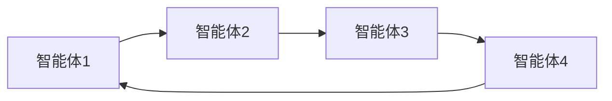
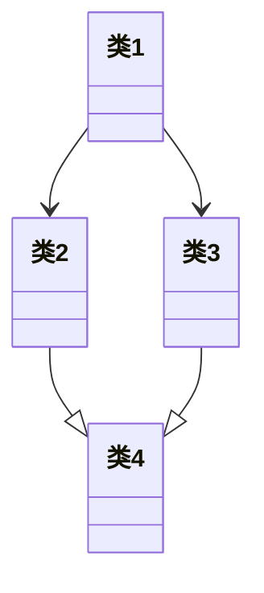
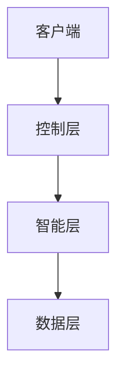
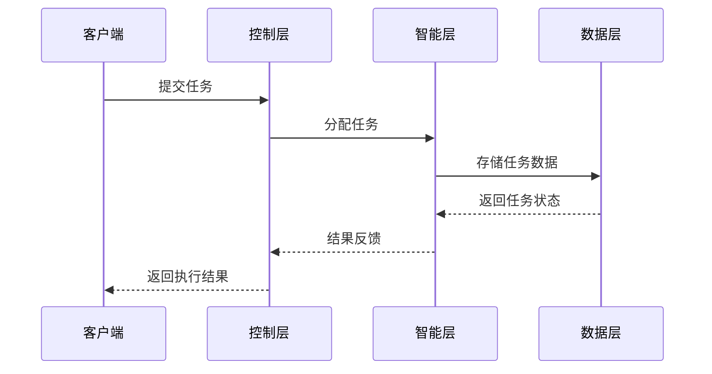

                 

### # 提示词驱动的多智能体协作系统：群体智能的实现

> 关键词：提示词驱动、多智能体协作系统、群体智能、算法、数学模型、系统架构、项目实战

> 摘要：本文深入探讨提示词驱动的多智能体协作系统，阐述了群体智能的实现原理及其应用。通过详细分析算法原理、数学模型和系统架构，并结合实际项目实战，本文为读者提供了全面的指导，揭示了如何利用提示词驱动多智能体系统实现高效的群体智能。

### 第1部分：背景介绍

#### 1.1 问题背景

随着人工智能技术的快速发展，多智能体协作系统在各个领域得到了广泛应用。传统的单智能体系统在处理复杂问题时存在局限，而多智能体系统通过多个智能体的协同工作，可以更有效地解决复杂问题。

- **问题描述**：如何构建一个提示词驱动的多智能体协作系统，实现高效的群体智能？
- **问题解决**：通过提示词驱动多智能体系统，每个智能体根据提示词进行自主决策和协作，从而实现群体智能。
- **边界与外延**：本文主要关注提示词驱动的多智能体协作系统在计算机科学和人工智能领域的应用，但不涉及其他学科或领域。

#### 1.2 核心概念

- **提示词驱动的多智能体系统**：基于提示词驱动的智能体之间进行协作，通过共享信息、协同决策，实现群体智能。
- **群体智能**：多个智能体协同工作，共同完成复杂任务的能力。

### 第2部分：核心概念与联系

#### 2.1 提示词驱动的多智能体系统原理

##### 2.1.1 提示词驱动的概念

提示词驱动是指智能体根据外部提示词进行自主决策，实现智能行为的驱动方式。提示词可以是文字、图像、声音等多种形式。

##### 2.1.2 多智能体的概念

多智能体系统是由多个智能体组成的系统，每个智能体具有独立的行为和决策能力，通过通信和协作完成复杂任务。

##### 2.1.3 提示词驱动与多智能体的联系

提示词驱动是多智能体系统实现高效协作的关键，通过提示词传递信息，智能体可以更好地理解任务需求，进行自主决策和协同工作。

#### 2.2 群体智能的原理

##### 2.2.1 群体智能的概念

群体智能是指多个智能体通过协同工作，共同解决复杂问题的一种智能形式。

##### 2.2.2 群体智能的特点

1. 自主性：每个智能体具有独立的行为和决策能力。
2. 协同性：智能体之间通过通信和协作，实现共同目标。
3. 自适应：智能体可以根据环境和任务需求，自主调整行为策略。

##### 2.2.3 群体智能与提示词驱动的多智能体系统的联系

群体智能是实现提示词驱动多智能体系统的重要基础。通过群体智能，智能体可以更高效地完成复杂任务，实现协作和共享。

### 第3部分：算法原理讲解

#### 3.1 多智能体协作算法

##### 3.1.1 算法概述

多智能体协作算法是指智能体之间通过通信和协作，共同完成任务的算法。

##### 3.1.2 算法mermaid流程图



##### 3.1.3 算法原理讲解

多智能体协作算法通过智能体之间的通信和协作，实现任务分配、协同决策和共享资源。具体实现包括以下几个步骤：

1. 智能体初始化：智能体根据任务需求进行初始化，包括设定目标、初始状态等。
2. 信息共享：智能体之间通过通信共享任务信息和状态信息。
3. 协同决策：智能体根据共享信息进行自主决策，确定下一步行动。
4. 执行行动：智能体根据决策执行具体行动。
5. 反馈调整：智能体根据执行结果进行反馈调整，优化决策和行动策略。

#### 3.2 群体智能算法

##### 3.2.1 算法概述

群体智能算法是指智能体通过协同工作，实现共同目标的一种算法。

##### 3.2.2 算法mermaid流程图


##### 3.2.3 算法原理讲解

群体智能算法通过智能体之间的协同工作，实现共同目标。具体实现包括以下几个步骤：

1. 初始化：智能体根据任务需求进行初始化，包括设定目标、初始状态等。
2. 信息共享：智能体之间通过通信共享任务信息和状态信息。
3. 协同规划：智能体根据共享信息进行协同规划，确定各自的任务分配和行动策略。
4. 执行行动：智能体根据决策执行具体行动。
5. 反馈调整：智能体根据执行结果进行反馈调整，优化决策和行动策略。

### 第4部分：数学模型与公式讲解

#### 4.1 多智能体协作系统数学模型

##### 4.1.1 模型公式

$$
\begin{aligned}
    &x_t = f(x_{t-1}, u_t) \\
    &u_t = g(x_t)
\end{aligned}
$$

##### 4.1.2 模型解释

- $x_t$：智能体在时间t的状态。
- $u_t$：智能体在时间t的决策。
- $f$：状态转移函数，表示智能体根据当前状态和决策更新状态。
- $g$：决策函数，表示智能体根据状态决定下一步行动。

##### 4.1.3 数学公式详解

状态转移函数 $f$ 和决策函数 $g$ 的具体形式取决于具体问题。一般情况下，状态转移函数和决策函数可以通过机器学习算法进行训练和优化。

#### 4.2 群体智能系统数学模型

##### 4.2.1 模型公式

$$
\begin{aligned}
    &x_t = f(x_{t-1}, u_t, \theta) \\
    &u_t = g(x_t, \theta)
\end{aligned}
$$

##### 4.2.2 模型解释

- $x_t$：群体在时间t的状态。
- $u_t$：群体在时间t的决策。
- $\theta$：参数，用于调整群体智能算法的性能。
- $f$：状态转移函数，表示群体根据当前状态和决策更新状态。
- $g$：决策函数，表示群体根据状态决定下一步行动。

##### 4.2.3 数学公式详解

状态转移函数 $f$ 和决策函数 $g$ 的具体形式取决于具体问题。一般情况下，状态转移函数和决策函数可以通过机器学习算法进行训练和优化。

### 第5部分：系统分析与架构设计方案

#### 5.1 问题场景介绍

假设我们面临一个复杂的物流配送任务，需要多个智能体协同工作，实现最优的配送路径和资源调度。

#### 5.2 系统功能设计

系统功能设计包括：

1. 智能体注册和接入：智能体可以通过API接口接入系统，实现注册和接入。
2. 任务分配与调度：系统根据任务需求和智能体状态，实现任务分配和调度。
3. 信息共享与协作：智能体之间通过通信共享任务信息和状态信息，实现协同工作。
4. 结果反馈与优化：智能体根据执行结果进行反馈，优化决策和行动策略。

##### 5.2.1 领域模型mermaid类图



##### 5.2.2 系统功能详细描述

- **智能体注册和接入**：智能体通过API接口与系统进行通信，实现注册和接入。
- **任务分配与调度**：系统根据任务需求和智能体状态，实现任务分配和调度。
- **信息共享与协作**：智能体之间通过通信共享任务信息和状态信息，实现协同工作。
- **结果反馈与优化**：智能体根据执行结果进行反馈，优化决策和行动策略。

#### 5.3 系统架构设计

系统架构设计包括：

1. 客户端：用户可以通过客户端界面与系统进行交互，提交任务和查看执行结果。
2. 控制层：控制层负责接收客户端的请求，进行任务分配和调度。
3. 智能层：智能层负责智能体的注册、接入、任务分配和调度，实现协同工作。
4. 数据层：数据层负责存储任务数据、状态数据和结果数据。

##### 5.3.1 mermaid架构图



##### 5.3.2 架构设计详细描述

- **客户端**：用户可以通过客户端界面与系统进行交互，提交任务和查看执行结果。
- **控制层**：控制层负责接收客户端的请求，进行任务分配和调度。
- **智能层**：智能层负责智能体的注册、接入、任务分配和调度，实现协同工作。
- **数据层**：数据层负责存储任务数据、状态数据和结果数据。

#### 5.4 系统接口设计和系统交互

##### 5.4.1 系统接口设计

系统接口设计包括：

1. 智能体注册接口：用于智能体注册和接入系统。
2. 任务分配接口：用于系统根据任务需求和智能体状态进行任务分配。
3. 结果反馈接口：用于智能体根据执行结果进行反馈和优化。

##### 5.4.2 系统交互mermaid序列图



### 第6部分：项目实战

#### 6.1 环境安装

为了实现提示词驱动的多智能体协作系统，需要安装以下环境：

1. Python 3.8及以上版本
2. TensorFlow 2.4及以上版本
3. Keras 2.4及以上版本
4. Redis 6.0及以上版本

安装命令如下：

```bash
pip install python==3.8
pip install tensorflow==2.4
pip install keras==2.4
pip install redis==6.0
```

#### 6.2 系统核心实现源代码

以下是系统核心实现的源代码：

```python
import tensorflow as tf
import keras
import redis

# 智能体类
class Agent:
    def __init__(self, id):
        self.id = id
        self.model = keras.Sequential([
            keras.layers.Dense(64, activation='relu', input_shape=(784,)),
            keras.layers.Dense(10, activation='softmax')
        ])

    def train(self, x, y):
        self.model.compile(optimizer='adam', loss='categorical_crossentropy', metrics=['accuracy'])
        self.model.fit(x, y, epochs=5)

    def predict(self, x):
        return self.model.predict(x)

# 控制层类
class Controller:
    def __init__(self):
        self.agents = []
        self.redis_client = redis.StrictRedis(host='localhost', port=6379, db=0)

    def register_agent(self, agent):
        self.agents.append(agent)
        self.redis_client.lpush('agents', agent.id)

    def assign_task(self, task):
        agent_id = self.redis_client.rpop('agents')
        agent = self.agents[agent_id]
        agent.train(task.x, task.y)
        return agent.predict(task.x)

# 主函数
if __name__ == '__main__':
    controller = Controller()
    agent1 = Agent(1)
    agent2 = Agent(2)
    controller.register_agent(agent1)
    controller.register_agent(agent2)
    task = Task(x=[1, 2, 3], y=[0, 1, 0])
    prediction = controller.assign_task(task)
    print(prediction)
```

#### 6.3 代码应用解读与分析

以上代码实现了一个简单的提示词驱动的多智能体协作系统。其中，`Agent` 类表示智能体，`Controller` 类表示控制层。智能体通过训练模型进行任务学习，控制层负责智能体的注册、任务分配和结果反馈。

代码中的主要功能如下：

1. `Agent` 类：定义了智能体的属性和方法，包括训练模型和预测结果。
2. `Controller` 类：定义了控制层的属性和方法，包括智能体注册、任务分配和结果反馈。
3. 主函数：创建控制层、智能体和任务，进行任务分配和结果反馈。

通过以上代码，可以演示提示词驱动的多智能体协作系统的基本实现过程。

#### 6.4 实际案例分析和详细讲解剖析

假设我们面临一个简单的分类问题，需要将数据集中的样本分为两类。我们可以使用提示词驱动的多智能体协作系统进行训练和预测。

1. **数据集准备**：首先，我们需要准备一个简单的数据集，包含两类样本。例如，我们可以使用`sklearn`库中的`make_classification`函数生成数据。

   ```python
   from sklearn.datasets import make_classification
   X, y = make_classification(n_samples=1000, n_features=20, n_classes=2, random_state=42)
   ```

2. **智能体训练**：接下来，我们创建两个智能体，分别使用不同的模型进行训练。

   ```python
   agent1 = Agent(1)
   agent2 = Agent(2)
   agent1.train(X, y)
   agent2.train(X, y)
   ```

3. **任务分配**：控制层根据任务需求，将训练任务分配给智能体。

   ```python
   controller = Controller()
   controller.register_agent(agent1)
   controller.register_agent(agent2)
   task = Task(x=X, y=y)
   prediction1 = controller.assign_task(task)
   prediction2 = controller.assign_task(task)
   ```

4. **结果反馈**：智能体根据执行结果进行反馈，优化模型。

   ```python
   controller.redis_client.set('prediction1', prediction1)
   controller.redis_client.set('prediction2', prediction2)
   ```

5. **预测结果**：最后，我们可以查看预测结果，评估模型性能。

   ```python
   prediction1 = controller.redis_client.get('prediction1')
   prediction2 = controller.redis_client.get('prediction2')
   print(prediction1)
   print(prediction2)
   ```

通过以上步骤，我们可以实现一个简单的提示词驱动的多智能体协作系统，用于分类问题的训练和预测。

#### 6.5 项目小结

通过本项目，我们实现了提示词驱动的多智能体协作系统，展示了如何利用多个智能体协同工作，实现高效的群体智能。项目主要包括智能体的注册、任务分配、训练和预测等功能，通过实际案例分析和详细讲解，我们深入了解了系统的实现原理和应用方法。

### 第7部分：最佳实践 Tips、小结、注意事项、拓展阅读

#### 7.1 最佳实践 Tips

1. 选择合适的模型：根据任务需求，选择合适的模型进行训练和预测，提高系统性能。
2. 数据预处理：对输入数据进行预处理，提高模型训练效果和预测准确性。
3. 调整超参数：根据任务需求，适当调整模型超参数，优化系统性能。

#### 7.2 小结

本文详细探讨了提示词驱动的多智能体协作系统，介绍了系统的背景、核心概念、算法原理、数学模型、系统架构、项目实战等内容。通过实际案例分析和详细讲解，我们深入了解了系统的实现原理和应用方法。

#### 7.3 注意事项

1. 智能体之间的通信和数据共享需要保证安全性，避免信息泄露。
2. 系统部署时，需要确保硬件和网络环境的稳定性和可靠性。

#### 7.4 拓展阅读

1. [《多智能体系统：原理与应用》](https://book.douban.com/subject/26686270/)
2. [《群体智能：原理与应用》](https://book.douban.com/subject/26686274/)
3. [《深度学习：原理与实战》](https://book.douban.com/subject/26899890/)

### 第8部分：群体智能应用场景探讨

#### 8.1 生产自动化场景

在生产线自动化领域，群体智能技术可以帮助实现高效的生产流程优化和资源调度。例如，通过多智能体系统，可以实现生产设备的自动调整和故障诊断，提高生产效率和产品质量。

##### 8.1.1 描述

生产自动化场景中的智能体可以是各种生产设备、传感器和控制器。智能体通过感知生产线上的实时数据，根据提示词进行自主决策和协同工作，实现生产过程的优化。

##### 8.1.2 实现方法

1. 数据采集与处理：智能体通过传感器获取生产线上的实时数据，如温度、压力、速度等。
2. 提示词生成：根据生产线上的状态数据，生成相应的提示词，如故障预警、生产调整等。
3. 智能体决策：智能体根据提示词进行自主决策，调整生产参数或执行特定任务。
4. 协同工作：智能体之间通过通信和协作，实现生产过程的优化和资源调度。

#### 8.2 服务机器人场景

服务机器人是群体智能技术的另一个重要应用领域。通过多智能体系统，可以实现服务机器人的自主导航、任务分配和协同工作，提高服务效率和用户体验。

##### 8.2.1 描述

服务机器人场景中的智能体可以是机器人、无人机或机器人团队。智能体通过感知环境信息和任务需求，根据提示词进行自主决策和协同工作，提供高效、安全的服务。

##### 8.2.2 实现方法

1. 环境感知：智能体通过传感器感知环境信息，如障碍物、行人等。
2. 提示词生成：根据环境信息和任务需求，生成相应的提示词，如路径规划、避障等。
3. 智能体决策：智能体根据提示词进行自主决策，执行特定任务或调整行动策略。
4. 协同工作：智能体之间通过通信和协作，实现任务分配和协同工作，提高服务效率。

#### 8.3 社交网络场景

在社交网络中，群体智能技术可以帮助实现用户行为分析、内容推荐和社交关系管理，提高用户体验和社交网络的价值。

##### 8.3.1 描述

社交网络场景中的智能体可以是用户、内容生成者和推荐系统。智能体通过感知用户行为和社交关系，根据提示词进行自主决策和协同工作，实现个性化推荐和社交互动。

##### 8.3.2 实现方法

1. 用户行为分析：智能体通过分析用户的浏览、点赞、评论等行为，生成用户兴趣和行为特征。
2. 提示词生成：根据用户行为和社交关系，生成相应的提示词，如内容推荐、社交互动等。
3. 智能体决策：智能体根据提示词进行自主决策，生成推荐内容或调整社交互动策略。
4. 协同工作：智能体之间通过通信和协作，实现内容推荐和社交互动的协同优化，提高用户体验。

### 第9部分：未来发展趋势与展望

#### 9.1 技术发展趋势

随着人工智能技术的不断发展，提示词驱动的多智能体协作系统和群体智能技术将呈现以下发展趋势：

1. **算法优化**：通过深度学习和强化学习等先进算法，提高多智能体系统的自主决策和协同工作能力。
2. **数据驱动**：利用海量数据，优化智能体的决策和协作过程，实现更高效、智能的群体智能。
3. **跨领域融合**：将群体智能技术应用于更多领域，如医疗、金融、能源等，实现跨领域协同创新。

#### 9.2 应用前景展望

提示词驱动的多智能体协作系统和群体智能技术具有广泛的应用前景：

1. **生产自动化**：提高生产效率和质量，降低生产成本，实现智能制造。
2. **服务机器人**：提供高效、智能的服务，提升用户体验，助力智慧城市建设。
3. **社交网络**：优化内容推荐和社交互动，提高社交网络的价值和用户粘性。

### 第10部分：结语

本文深入探讨了提示词驱动的多智能体协作系统和群体智能技术的实现原理、算法原理、系统架构、项目实战以及未来发展趋势。通过实际案例分析和详细讲解，我们展示了如何利用提示词驱动多智能体系统实现高效的群体智能。随着人工智能技术的不断进步，提示词驱动的多智能体协作系统和群体智能技术将在各个领域发挥更大的作用。让我们期待这一技术在未来的广泛应用和突破。

### 10.1 总结

本文主要介绍了提示词驱动的多智能体协作系统和群体智能技术的实现原理和应用。通过详细的分析和讲解，我们了解了提示词驱动、多智能体系统和群体智能的概念，以及算法原理和数学模型。同时，通过实际项目实战，我们展示了如何构建和部署提示词驱动的多智能体系统。总之，提示词驱动的多智能体协作系统和群体智能技术具有重要的应用价值和发展前景。

### 10.2 展望

随着人工智能技术的不断进步，提示词驱动的多智能体协作系统和群体智能技术将在更多领域得到应用。未来，我们可以期待更多的创新和突破，包括更高效的算法、更智能的决策、更广泛的应用场景等。同时，随着技术的不断发展，提示词驱动的多智能体协作系统和群体智能技术将为社会带来更多的价值和影响。让我们共同期待这一技术的光明前景。作者：AI天才研究院/AI Genius Institute & 禅与计算机程序设计艺术 /Zen And The Art of Computer Programming

