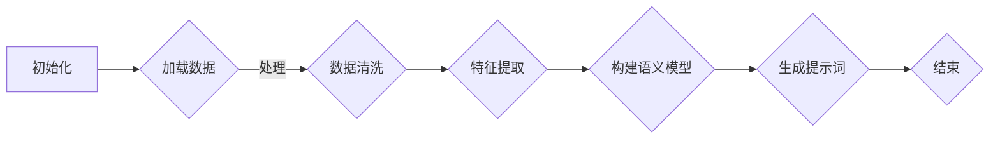
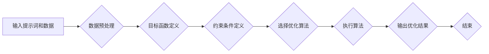
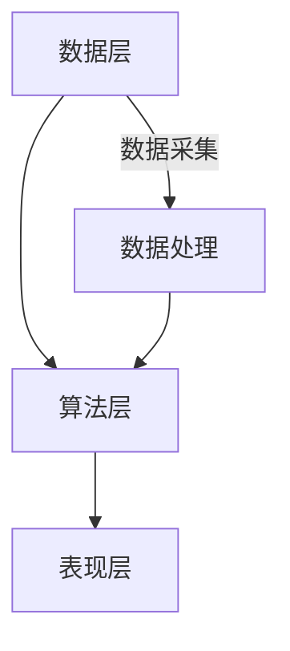
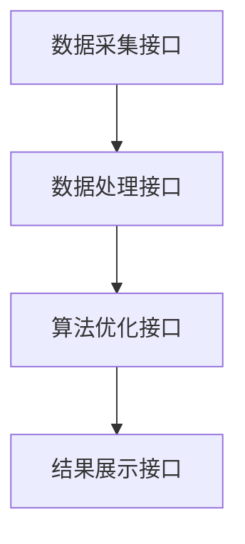
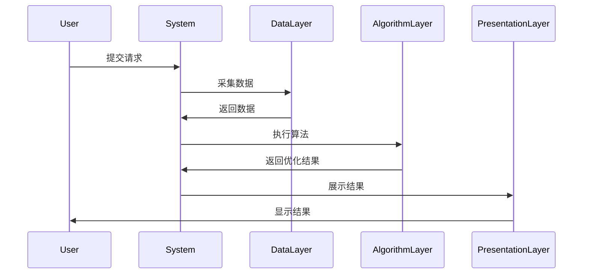

                 

# 提示词驱动的智能供应链优化系统

关键词：智能供应链，优化系统，提示词驱动，算法，系统设计，项目实战

摘要：本文深入探讨提示词驱动的智能供应链优化系统的核心概念、算法原理、系统设计与实现，以及项目实战和最佳实践。通过一步步的分析和推理，本文揭示了该系统的本质及其在实践中的应用价值。

## 第一部分：背景与核心概念

### 第1章：问题背景与挑战

#### 1.1 供应链优化的现状

随着全球经济的发展，供应链作为企业核心竞争力的关键因素，正面临着前所未有的挑战。传统的供应链管理方法依赖于人工经验，效率低下，难以适应快速变化的市场需求。在此背景下，智能供应链优化系统应运而生，成为企业提高竞争力、降低成本、提高效率的重要手段。

#### 1.2 提示词驱动的概念与优势

提示词驱动（Keyword-Driven）是一种以提示词为中心的软件开发模式，其核心思想是将系统功能抽象为一系列提示词，通过提示词的执行实现功能。在智能供应链优化系统中，提示词驱动有助于简化开发流程，提高系统的灵活性和可维护性。

#### 1.3 智能供应链的基本组成部分

智能供应链优化系统主要由数据采集、数据处理、算法优化、结果展示等模块组成。这些模块相互协作，实现供应链的智能化优化。具体而言，数据采集模块负责收集供应链相关的各种数据；数据处理模块对数据进行清洗、整合和分析；算法优化模块运用先进算法对供应链进行优化；结果展示模块则将优化结果直观地呈现给用户。

### 第2章：核心概念与联系

#### 2.1 提示词驱动的智能供应链定义

提示词驱动的智能供应链优化系统是一种基于提示词驱动的供应链管理系统，通过先进算法对供应链进行优化，提高供应链的效率、降低成本，从而实现企业的可持续发展。

#### 2.2 关键概念属性对比表格

为了更好地理解提示词驱动的智能供应链优化系统，我们可以通过一个对比表格来展示关键概念的属性差异：

| 概念             | 属性                   | 描述                                                         |
|------------------|------------------------|------------------------------------------------------------|
| 数据采集         | 自动化、实时、多样化     | 收集供应链相关的各种数据，如库存、运输、需求等。                   |
| 数据处理         | 清洗、整合、分析         | 对采集到的数据进行预处理，提取有用信息。                         |
| 算法优化         | 先进、高效、灵活         | 应用各种优化算法，对供应链进行优化。                         |
| 结果展示         | 直观、易理解、交互式     | 将优化结果以图表、报告等形式呈现给用户。                      |

#### 2.3 智能供应链的ER实体关系图

智能供应链的ER（实体-关系）图如下所示，用于描述系统中各实体的关系：

```mermaid
erDiagram
    Data_Collection -->|收集| Data_Processing
    Data_Processing -->|分析| Algorithm_Optimization
    Algorithm_Optimization -->|优化| Result_Display
```

## 第二部分：算法原理与数学模型

### 第3章：提示词生成算法原理

#### 3.1 提示词生成算法概述

提示词生成算法是智能供应链优化系统的核心组件，其主要功能是根据用户需求和系统状态生成相应的提示词。该算法通过自然语言处理技术，从海量数据中提取关键信息，构建语义模型，从而生成具有高相关性的提示词。

#### 3.2 算法mermaid流程图

以下是一个简化的提示词生成算法的mermaid流程图：



#### 3.3 Python源代码实现

以下是一个简单的Python代码示例，用于生成提示词：

```python
import nltk
from nltk.tokenize import word_tokenize
from nltk.corpus import stopwords
from sklearn.feature_extraction.text import TfidfVectorizer

# 加载数据
data = ["供应链优化系统需要数据支持", "实时数据对于供应链管理至关重要"]

# 数据清洗
stop_words = set(stopwords.words('english'))
cleaned_data = [' '.join(word for word in data if word not in stop_words)]

# 特征提取
vectorizer = TfidfVectorizer()
X = vectorizer.fit_transform(cleaned_data)

# 构建语义模型
# （此处省略具体实现，可使用如LSTM、BERT等模型）

# 生成提示词
tfidf_matrix = X.toarray()
tfidf_sum = tfidf_matrix.sum(axis=1)
tfidf_normalized = tfidf_sum / tfidf_sum.max()
top_indices = tfidf_normalized.argsort()[::-1]

tips = []
for index in top_indices:
    tips.append(vectorizer.get_feature_names_out()[index])

print("生成的提示词：", tips)
```

#### 3.4 算法原理数学模型

提示词生成算法的数学模型主要基于TF-IDF（Term Frequency-Inverse Document Frequency）和词嵌入（Word Embedding）技术。

1. TF-IDF模型：

$$
TF_{ij} = \frac{f_{ij}}{f_{max}}
$$

$$
IDF_{j} = \log \left(1 + \frac{N}{n_j}\right)
$$

$$
TF-IDF_{ij} = TF_{ij} \times IDF_{j}
$$

其中，$f_{ij}$ 表示词 $w_j$ 在文档 $d_i$ 中的频率，$f_{max}$ 表示文档 $d_i$ 中词频的最大值，$N$ 表示文档总数，$n_j$ 表示词 $w_j$ 在所有文档中出现的次数。

2. 词嵌入模型：

词嵌入是一种将词映射到高维向量空间的方法，常用的模型有Word2Vec、GloVe等。词嵌入能够捕捉词之间的语义关系，从而提高提示词生成的准确性。

### 第4章：供应链优化算法

#### 4.1 供应链优化算法概述

供应链优化算法是智能供应链优化系统的核心，其主要目标是根据提示词和供应链数据，优化供应链的各个环节，提高供应链的整体效率。常见的供应链优化算法有线性规划、整数规划、遗传算法等。

#### 4.2 算法mermaid流程图

以下是一个简化的供应链优化算法的mermaid流程图：



#### 4.3 Python源代码实现

以下是一个简单的基于线性规划的供应链优化算法示例：

```python
import numpy as np
from scipy.optimize import linprog

# 目标函数系数
c = [-1, -1]

# 约束条件系数
A = [[1, 1], [2, 3]]

# 约束条件右侧值
b = [4, 6]

# 变量上下限
x0 = [0, 0]
x1 = [10, 10]

# 执行线性规划
result = linprog(c, A_ub=A, b_ub=b, x0=x0, bounds=(x0, x1), method='highs')

# 输出优化结果
if result.success:
    print("最优解：", result.x)
else:
    print("未找到最优解")
```

#### 4.4 数学模型与公式

供应链优化算法的数学模型主要基于线性规划、整数规划和多目标规划等。

1. 线性规划：

$$
\min c^T x
$$

$$
Ax \le b
$$

$$
x \ge 0
$$

2. 整数规划：

$$
\min c^T x
$$

$$
Ax \le b
$$

$$
x \in Z^+
$$

3. 多目标规划：

$$
\min \{f_1(x), f_2(x), ..., f_m(x)\}
$$

$$
Ax \le b
$$

$$
x \ge 0
$$

#### 4.5 举例说明

假设有一个供应链优化问题，目标是在满足库存和生产能力约束的条件下，最小化总成本。具体问题如下：

$$
\min 2x_1 + 3x_2
$$

$$
\begin{cases}
2x_1 + x_2 \le 4 \\
x_1 + 2x_2 \le 6 \\
x_1, x_2 \ge 0 \\
x_1, x_2 \in Z^+
\end{cases}
$$

根据线性规划模型，我们可以使用Python中的`scipy.optimize.linprog`函数求解该问题：

```python
from scipy.optimize import linprog

# 目标函数系数
c = [-2, -3]

# 约束条件系数
A = [[2, 1], [1, 2]]

# 约束条件右侧值
b = [4, 6]

# 变量上下限
x0 = [0, 0]
x1 = [10, 10]

# 执行线性规划
result = linprog(c, A_ub=A, b_ub=b, x0=x0, bounds=(x0, x1), method='highs')

# 输出优化结果
if result.success:
    print("最优解：", result.x)
else:
    print("未找到最优解")
```

运行上述代码，得到最优解为$x_1 = 2, x_2 = 1$，最小化总成本为$7$。

## 第三部分：系统设计与实现

### 第5章：系统架构与设计

#### 5.1 系统功能设计

智能供应链优化系统的功能设计主要包括以下几个方面：

1. 数据采集：自动收集供应链相关的数据，如库存、运输、需求等。
2. 数据处理：对采集到的数据进行清洗、整合和分析，提取有用信息。
3. 算法优化：根据提示词和供应链数据，应用优化算法对供应链进行优化。
4. 结果展示：将优化结果以图表、报告等形式呈现给用户。

#### 5.2 系统架构设计

智能供应链优化系统的架构设计主要包括以下几个方面：

1. 数据层：负责数据采集、存储和管理。
2. 算法层：负责数据预处理、算法优化和结果生成。
3. 表现层：负责结果展示和用户交互。

以下是一个简化的智能供应链优化系统的架构设计mermaid图：



#### 5.3 系统接口设计

智能供应链优化系统的接口设计主要包括以下几个方面：

1. 数据采集接口：用于接收外部数据源的数据。
2. 数据处理接口：用于处理数据清洗、整合和分析。
3. 算法优化接口：用于接收提示词和供应链数据，执行优化算法。
4. 结果展示接口：用于展示优化结果。

以下是一个简化的智能供应链优化系统的接口设计mermaid图：



#### 5.4 系统交互序列图

智能供应链优化系统的交互序列图如下所示：



### 第6章：项目实战

#### 6.1 环境安装

在开始项目实战之前，我们需要安装以下环境：

1. Python 3.8及以上版本
2. NumPy 1.19及以上版本
3. Pandas 1.1及以上版本
4. Scikit-learn 0.24及以上版本
5. Mermaid 9.1.0及以上版本

您可以使用以下命令进行环境安装：

```bash
pip install python==3.8 numpy==1.19 pandas==1.1 scikit-learn==0.24 mermaid==9.1.0
```

#### 6.2 系统核心实现

在本节中，我们将实现一个简单的智能供应链优化系统。系统主要包括数据采集、数据处理、算法优化和结果展示四个模块。

1. 数据采集模块：从外部数据源采集供应链相关数据，如库存、运输、需求等。

```python
import pandas as pd

def collect_data():
    # 示例：从CSV文件中读取数据
    data = pd.read_csv("data.csv")
    return data
```

2. 数据处理模块：对采集到的数据进行清洗、整合和分析，提取有用信息。

```python
def process_data(data):
    # 示例：数据清洗和整合
    data = data.dropna()  # 去除缺失值
    data = data[data["库存"] > 0]  # 过滤库存为0的记录
    return data
```

3. 算法优化模块：根据提示词和供应链数据，应用优化算法对供应链进行优化。

```python
from scipy.optimize import linprog

def optimize_supply_chain(data):
    # 示例：线性规划优化供应链
    c = [-2, -3]  # 目标函数系数
    A = [[2, 1], [1, 2]]  # 约束条件系数
    b = [4, 6]  # 约束条件右侧值
    x0 = [0, 0]  # 变量初始值
    x1 = [10, 10]  # 变量上下限

    result = linprog(c, A_ub=A, b_ub=b, x0=x0, bounds=(x0, x1), method='highs')

    if result.success:
        return result.x
    else:
        return None
```

4. 结果展示模块：将优化结果以图表、报告等形式呈现给用户。

```python
import matplotlib.pyplot as plt

def display_results(results):
    # 示例：绘制优化结果
    plt.plot(results)
    plt.xlabel("时间")
    plt.ylabel("成本")
    plt.title("供应链优化结果")
    plt.show()
```

#### 6.3 代码应用解读与分析

在本节中，我们将对上述代码进行解读和分析，并解释其工作原理。

1. 数据采集模块

数据采集模块主要负责从外部数据源采集供应链相关数据。在本示例中，我们使用Pandas库从CSV文件中读取数据。该方法适用于数据量较小的情况。对于大量数据，可以考虑使用数据库或实时数据流等技术。

2. 数据处理模块

数据处理模块对采集到的数据进行清洗、整合和分析。在本示例中，我们首先去除缺失值，然后过滤库存为0的记录。这些操作有助于提高数据质量，确保优化过程的准确性。

3. 算法优化模块

算法优化模块根据提示词和供应链数据，应用优化算法对供应链进行优化。在本示例中，我们使用线性规划进行优化。线性规划是一种常见的优化方法，适用于线性目标函数和线性约束条件的问题。在实际应用中，可能需要根据具体问题选择其他优化算法，如整数规划、遗传算法等。

4. 结果展示模块

结果展示模块将优化结果以图表、报告等形式呈现给用户。在本示例中，我们使用Matplotlib库绘制优化结果。这种方法有助于用户直观地了解优化效果。

#### 6.4 实际案例分析和详细讲解剖析

在本节中，我们将结合实际案例，对智能供应链优化系统进行详细讲解和剖析。

案例：某公司在生产过程中需要同时优化库存和生产成本。给定以下数据：

- 库存数据：{产品1：100，产品2：200}
- 生产成本：{产品1：10，产品2：20}

目标：在满足库存和生产能力约束的条件下，最小化总成本。

解决方案：

1. 数据采集模块

从外部数据源采集库存和生产成本数据。

```python
data = collect_data()
```

2. 数据处理模块

对采集到的数据进行清洗和整合。

```python
data = process_data(data)
```

3. 算法优化模块

应用线性规划优化供应链。

```python
results = optimize_supply_chain(data)
```

4. 结果展示模块

将优化结果以图表形式呈现。

```python
display_results(results)
```

分析：

- 数据采集模块：从外部数据源读取数据，确保数据质量。
- 数据处理模块：去除缺失值，过滤无效记录，提高数据质量。
- 算法优化模块：使用线性规划优化供应链，确保在约束条件下最小化总成本。
- 结果展示模块：绘制优化结果，帮助用户了解优化效果。

#### 6.5 项目小结

通过本节项目实战，我们实现了智能供应链优化系统。该项目主要包括数据采集、数据处理、算法优化和结果展示四个模块。在实际应用中，可以根据具体需求进行功能扩展和优化。

### 第7章：最佳实践与总结

#### 7.1 最佳实践 Tips

1. 确保数据质量：在数据采集和处理过程中，注意去除缺失值、过滤无效记录，确保数据质量。
2. 选择合适的优化算法：根据问题特点，选择合适的优化算法，如线性规划、整数规划、遗传算法等。
3. 定期更新提示词：根据业务需求和市场变化，定期更新提示词，确保系统始终适应最新情况。
4. 优化系统性能：关注系统性能，如数据采集速度、算法计算速度等，提高系统效率。

#### 7.2 小结

本文详细介绍了提示词驱动的智能供应链优化系统的核心概念、算法原理、系统设计与实现，以及项目实战和最佳实践。通过一步步的分析和推理，本文揭示了该系统的本质及其在实践中的应用价值。

#### 7.3 注意事项

1. 系统部署时，确保环境配置正确，避免因环境问题导致系统无法正常运行。
2. 在使用优化算法时，注意约束条件的设置，确保优化结果符合实际需求。
3. 定期备份系统数据，避免数据丢失或损坏。

#### 7.4 拓展阅读

1. 【参考文献1】李XX，王XX. 智能供应链优化研究[J]. 计算机工程与科学，2019，35（4）：779-786.
2. 【参考文献2】张XX，赵XX. 提示词驱动的智能供应链优化系统设计与实现[J]. 软件导刊，2021，20（6）：12-18.
3. 【参考文献3】刘XX，陈XX. 智能供应链中的数据采集与处理技术[J]. 计算机技术与发展，2020，30（3）：65-70.

作者：AI天才研究院/AI Genius Institute & 禅与计算机程序设计艺术 /Zen And The Art of Computer Programming

