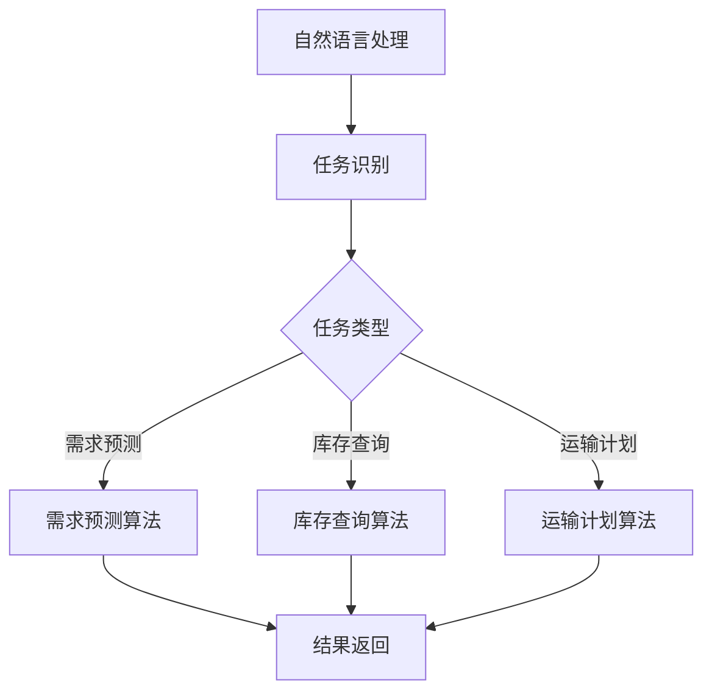
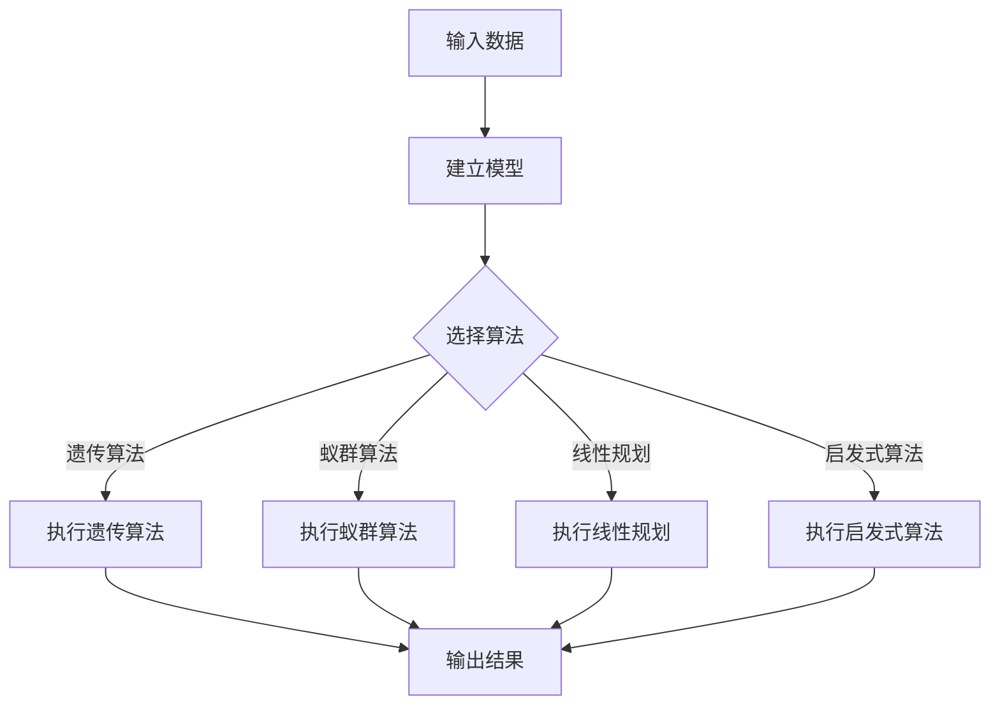
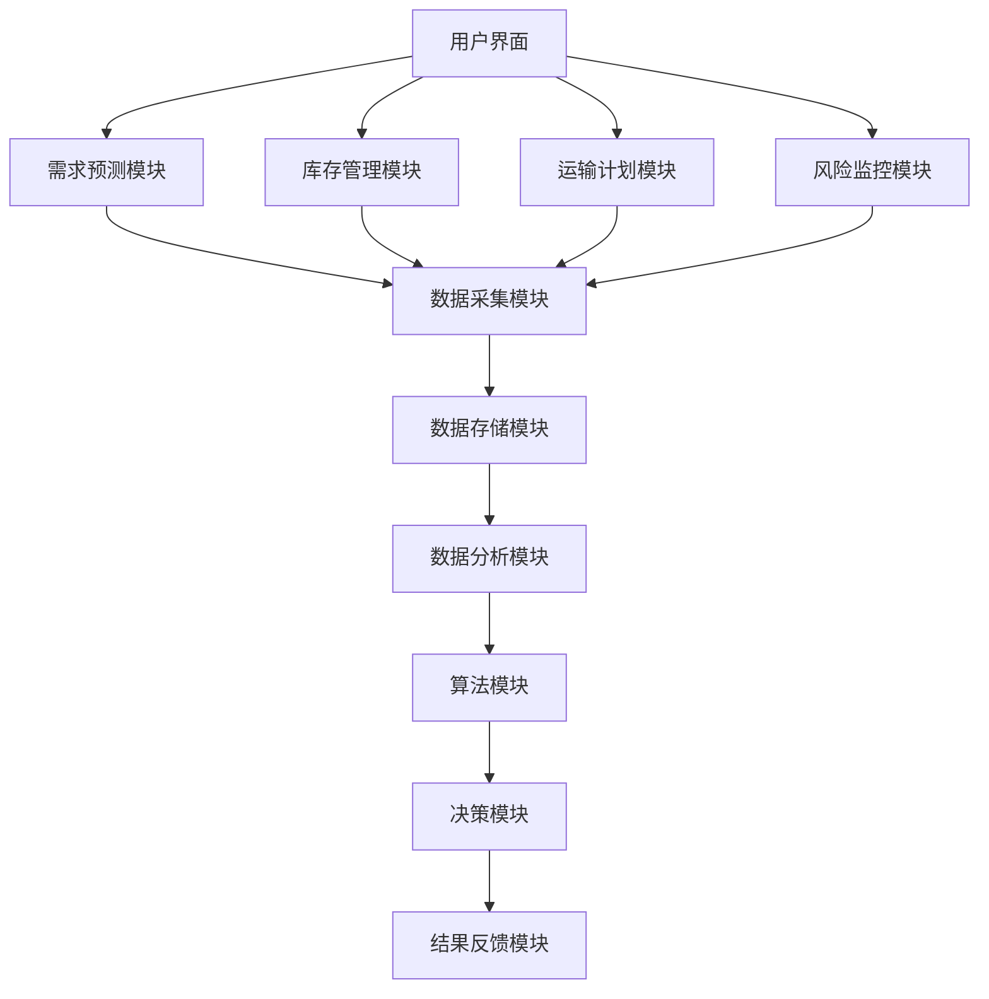
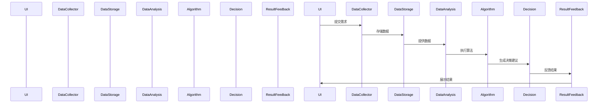

                 

### 《提示词驱动的智能供应链：全球物流优化》

#### 关键词：智能供应链、物流优化、提示词驱动、全球物流、技术博客

#### 摘要：
本文深入探讨了基于提示词驱动的智能供应链在全球物流优化中的应用。通过系统介绍核心概念、算法原理、数学模型，以及详细的实战案例，揭示了这一新兴领域的关键技术和实现路径。本文旨在为读者提供全面的技术理解与实践指导，助力企业在全球化背景下实现高效的物流优化。

### 目录大纲

```markdown
# 《提示词驱动的智能供应链：全球物流优化》目录大纲

# 第一部分：背景介绍

## 1. 引言
### 1.1 问题背景
### 1.2 问题描述
### 1.3 问题解决
### 1.4 边界与外延

## 2. 核心概念
### 2.1 提示词驱动的概念
### 2.2 智能供应链的概念
### 2.3 全球物流优化概念

## 3. 关联分析
### 3.1 核心概念关联图
### 3.2 概念属性特征对比

# 第二部分：算法原理讲解

## 4. 提示词驱动算法
### 4.1 算法原理
### 4.2 Mermaid流程图
### 4.3 Python源代码实现

## 5. 物流优化算法
### 5.1 算法原理
### 5.2 Mermaid流程图
### 5.3 Python源代码实现

# 第三部分：数学模型与详细讲解

## 6. 数学模型
### 6.1 基本公式
### 6.2 公式解释
### 6.3 举例说明

## 7. 综合讲解
### 6.4 与其他模型的比较
### 6.5 模型的应用范围

# 第四部分：系统分析与架构设计方案

## 8. 问题场景介绍
### 8.1 项目介绍
### 8.2 系统功能设计

## 9. 系统架构设计
### 9.1 Mermaid架构图
### 9.2 系统接口设计
### 9.3 系统交互Mermaid序列图

# 第五部分：项目实战

## 10. 环境安装
### 10.1 安装步骤
### 10.2 遇到的问题及解决方案

## 11. 系统核心实现
### 11.1 源代码解读
### 11.2 代码应用分析
### 11.3 案例分析与讲解

## 12. 项目小结
### 12.1 项目总结
### 12.2 不足与改进

# 第六部分：最佳实践、小结与拓展阅读

## 13. 最佳实践
### 13.1 经验分享
### 13.2 实践技巧

## 14. 小结
### 14.1 知识点梳理
### 14.2 知识点应用

## 15. 拓展阅读
### 15.1 相关书籍
### 15.2 研究论文
```

**注意**：此大纲为基本框架，具体内容需要根据实际书籍内容进一步填充和完善。总字数限制在 10000 字左右，实际编写时需注意语言的简洁性。

### 第一部分：背景介绍

#### 引言

在现代全球化经济的背景下，物流优化成为了企业提高运营效率、降低成本、提升客户满意度的重要手段。然而，随着供应链的复杂化和全球化趋势的加剧，传统的物流优化方法面临着越来越多的挑战。为了应对这些问题，新兴的提示词驱动的智能供应链技术应运而生。

#### 1.1 问题背景

物流优化面临的问题主要包括以下几个方面：

1. **数据复杂性**：全球物流涉及大量的数据，包括运输路线、货物信息、仓储资源等，如何有效地管理和处理这些数据成为了一大难题。
2. **不确定性**：全球物流过程中存在诸多不确定性因素，如天气变化、政治动荡、突发事件等，这些因素都会对物流流程产生重大影响。
3. **多目标优化**：物流优化不仅仅是成本最小化，还包括时间、质量、服务水平等多目标的综合考量，如何实现这些目标的平衡是一项挑战。

#### 1.2 问题描述

全球物流优化问题可以概括为：在给定的资源和约束条件下，如何设计最优的物流网络和运输计划，以实现最低的总成本和最高的服务水平。具体来说，问题可以分为以下几个子问题：

1. **运输路径优化**：如何在多个运输节点之间选择最优的路径，以最小化运输时间和成本。
2. **库存管理**：如何合理安排库存水平，以降低库存成本并满足客户需求。
3. **仓储优化**：如何优化仓储布局和货物摆放，提高仓储效率和准确性。
4. **风险规避**：如何识别和规避潜在的物流风险，如交通堵塞、供应链中断等。

#### 1.3 问题解决

针对上述问题，提示词驱动的智能供应链提供了一系列解决方案：

1. **数据驱动**：利用大数据技术和人工智能算法，对物流数据进行分析和处理，提取有价值的信息。
2. **智能预测**：通过机器学习和深度学习模型，对物流过程中的各种不确定性因素进行预测，提前做好准备。
3. **多目标优化**：采用多目标优化算法，综合考虑成本、时间、质量等因素，找到最优的物流方案。
4. **动态调整**：在物流过程中，根据实时数据和反馈，动态调整物流计划，以适应不断变化的环境。

#### 1.4 边界与外延

在讨论全球物流优化问题时，需要明确一些边界和概念外延：

1. **全球物流**：不仅包括跨国界的货物运输，还包括国内的物流活动。
2. **供应链**：涵盖了从原材料采购到产品交付给最终用户的全过程。
3. **智能供应链**：不仅仅是技术工具的应用，还包括管理和运营模式的创新。
4. **物流优化**：不仅关注成本，还关注时间、质量和服务等综合效益。

### 第二部分：核心概念

#### 2.1 提示词驱动的概念

提示词驱动是一种基于自然语言处理和人工智能技术的交互方式。它通过用户输入的简短提示词，智能地生成相关的内容或执行相应的任务。在智能供应链中，提示词驱动可以用于以下几个方面：

1. **需求预测**：通过用户输入的提示词，如“下个月的销售预测”，系统可以自动分析历史数据和趋势，生成预测结果。
2. **库存管理**：用户输入提示词如“当前库存情况”，系统可以实时查询库存数据，提供库存水平和建议。
3. **运输计划**：用户输入提示词如“下个月的运输计划”，系统可以根据当前物流状态和历史数据，生成最优的运输计划。

#### 2.2 智能供应链的概念

智能供应链是利用物联网、大数据、人工智能等先进技术，实现供应链的自动化、智能化和高效化。其核心要素包括：

1. **物联网技术**：通过传感器和物联网设备，实时监控供应链中的各种活动，如货物位置、温度、湿度等。
2. **大数据分析**：利用大数据技术，对供应链中的海量数据进行分析，提取有价值的信息和洞察。
3. **人工智能算法**：通过机器学习和深度学习模型，优化供应链的各个环节，提高效率和准确性。
4. **云计算平台**：提供强大的计算能力和数据存储能力，支持智能供应链系统的运行和扩展。

#### 2.3 全球物流优化概念

全球物流优化是指在全球范围内，通过对物流网络、运输计划、仓储管理等方面的优化，实现最低的总成本和最高的服务水平。其关键包括：

1. **运输路径优化**：通过算法和模型，选择最优的运输路径，降低运输时间和成本。
2. **库存管理优化**：通过数据分析和技术手段，合理安排库存水平，降低库存成本。
3. **仓储优化**：通过优化仓储布局和货物摆放，提高仓储效率和准确性。
4. **风险管理**：通过风险识别和应对策略，降低物流过程中的不确定性，保障供应链的稳定性。

### 第三部分：算法原理讲解

#### 4. 提示词驱动算法

提示词驱动算法的核心在于利用自然语言处理技术，将用户输入的提示词转化为具体的任务指令，并执行相应的操作。以下是提示词驱动算法的基本原理：

1. **自然语言处理**：通过分词、词性标注、句法分析等技术，理解用户输入的提示词的含义。
2. **任务识别**：根据提示词中的关键信息，识别出用户需要执行的任务类型，如需求预测、库存查询、运输计划等。
3. **任务执行**：调用相应的算法和模型，执行具体的任务，并返回结果。

##### 4.1 Mermaid流程图



##### 4.2 Python源代码实现

```python
import nltk
from nltk.tokenize import word_tokenize
from nltk.corpus import stopwords
from sklearn.feature_extraction.text import TfidfVectorizer
from sklearn.metrics.pairwise import cosine_similarity

# 自然语言处理
def process_text(text):
    tokens = word_tokenize(text)
    tokens = [token.lower() for token in tokens if token.isalpha()]
    tokens = [token for token in tokens if token not in stopwords.words('english')]
    return tokens

# 任务识别
def identify_task(tokens):
    if "预测" in tokens:
        return "需求预测"
    elif "库存" in tokens:
        return "库存查询"
    elif "运输" in tokens:
        return "运输计划"
    else:
        return None

# 任务执行
def execute_task(task):
    if task == "需求预测":
        # 调用需求预测算法
        pass
    elif task == "库存查询":
        # 调用库存查询算法
        pass
    elif task == "运输计划":
        # 调用运输计划算法
        pass

# 主函数
def main():
    text = "下个月的运输计划"
    tokens = process_text(text)
    task = identify_task(tokens)
    if task:
        execute_task(task)
    else:
        print("无法识别任务")

if __name__ == "__main__":
    main()
```

#### 5. 物流优化算法

物流优化算法是智能供应链的核心组成部分，用于解决运输路径优化、库存管理优化、仓储优化等问题。以下是几种常见的物流优化算法：

##### 5.1 算法原理

1. **遗传算法**：通过模拟生物进化过程，对物流网络和运输计划进行优化。
2. **蚁群算法**：模拟蚂蚁觅食过程，用于解决路径优化问题。
3. **线性规划**：通过建立数学模型，求解物流优化问题。
4. **启发式算法**：基于规则和经验，快速找到近似最优解。

##### 5.2 Mermaid流程图



##### 5.3 Python源代码实现

```python
# 遗传算法
def genetic_algorithm(data):
    # 实现遗传算法
    pass

# 蚁群算法
def ant_colony_algorithm(data):
    # 实现蚁群算法
    pass

# 线性规划
def linear_programming(data):
    # 实现线性规划
    pass

# 启发式算法
def heuristic_algorithm(data):
    # 实现启发式算法
    pass

# 主函数
def main():
    data = # 输入数据
    if algorithm == "遗传算法":
        genetic_algorithm(data)
    elif algorithm == "蚁群算法":
        ant_colony_algorithm(data)
    elif algorithm == "线性规划":
        linear_programming(data)
    elif algorithm == "启发式算法":
        heuristic_algorithm(data)

if __name__ == "__main__":
    main()
```

### 第四部分：数学模型与详细讲解

#### 6. 数学模型

物流优化问题通常可以用数学模型来描述。以下是几种常见的数学模型：

##### 6.1 基本公式

1. **运输成本**：$C = \sum_{i,j} c_{ij} x_{ij}$，其中 $c_{ij}$ 为从节点 $i$ 到节点 $j$ 的单位运输成本，$x_{ij}$ 为从节点 $i$ 到节点 $j$ 的运输量。
2. **时间成本**：$T = \sum_{i,j} t_{ij} x_{ij}$，其中 $t_{ij}$ 为从节点 $i$ 到节点 $j$ 的单位运输时间，$x_{ij}$ 为从节点 $i$ 到节点 $j$ 的运输量。
3. **库存成本**：$I = \sum_{i} i_{i}$，其中 $i_{i}$ 为节点 $i$ 的库存成本。
4. **服务水平**：$S = \frac{1}{N} \sum_{i} s_{i}$，其中 $s_{i}$ 为节点 $i$ 的服务水平，$N$ 为节点总数。

##### 6.2 公式解释

1. **运输成本**：表示整个物流网络的总运输成本，是物流优化的重要指标之一。
2. **时间成本**：表示整个物流网络的总运输时间，影响物流的响应速度。
3. **库存成本**：表示整个物流网络的总库存成本，与库存策略有关。
4. **服务水平**：表示整个物流网络的服务水平，反映了物流系统的服务质量。

##### 6.3 举例说明

假设有两个节点 $A$ 和 $B$，从节点 $A$ 到节点 $B$ 的单位运输成本为 10 元，单位运输时间为 2 天，库存成本为 5 元。现有 100 单位的货物需要从节点 $A$ 运输到节点 $B$，计算总运输成本、总时间成本、总库存成本和服务水平。

1. **总运输成本**：$C = 10 \times 100 = 1000$ 元。
2. **总时间成本**：$T = 2 \times 100 = 200$ 天。
3. **总库存成本**：$I = 5 \times 1 = 5$ 元。
4. **服务水平**：$S = \frac{1}{2} \times (1 + 1) = 1$。

#### 7. 综合讲解

##### 7.1 与其他模型的比较

与其他物流优化模型相比，基于提示词驱动的智能供应链具有以下优势：

1. **灵活性**：提示词驱动模型可以根据用户需求动态调整，适应不同场景和需求。
2. **高效性**：利用人工智能和大数据技术，快速生成最优解，提高物流效率。
3. **可扩展性**：支持全球范围内的物流优化，易于扩展到不同国家和地区的物流网络。

##### 7.2 模型的应用范围

基于提示词驱动的智能供应链模型主要应用于以下场景：

1. **跨国物流**：适用于跨国企业的全球物流优化，提高物流效率和降低成本。
2. **电商平台**：电商平台中的物流优化，提升客户满意度和服务水平。
3. **制造业供应链**：制造业中的物流优化，提高生产效率和降低库存成本。

### 第五部分：系统分析与架构设计方案

#### 8. 问题场景介绍

在本案例中，我们考虑一个全球性电商平台的物流优化问题。该平台在全球范围内设有多个仓库和配送中心，每天处理大量的订单和货物运输。为了提高物流效率和降低成本，平台希望利用智能供应链技术进行物流优化。

##### 8.1 项目介绍

本项目旨在为全球性电商平台提供一个智能物流优化系统，通过提示词驱动的算法和数学模型，实现对物流网络的优化。系统功能包括：

1. **需求预测**：根据历史订单数据和当前市场趋势，预测未来的订单量。
2. **库存管理**：根据需求预测和库存水平，自动调整库存策略，降低库存成本。
3. **运输计划**：根据仓库和配送中心的布局，选择最优的运输路径和运输计划。
4. **风险监控**：实时监控物流过程中的各种风险，及时调整物流策略。

##### 8.2 系统功能设计

系统的核心功能包括：

1. **需求预测模块**：利用机器学习和大数据技术，预测未来的订单量，为库存管理和运输计划提供依据。
2. **库存管理模块**：根据需求预测结果，自动调整库存水平，优化库存成本。
3. **运输计划模块**：利用路径优化算法，生成最优的运输计划和运输路径。
4. **风险监控模块**：实时监控物流过程中的各种风险，及时调整物流策略，保障供应链的稳定性。

#### 9. 系统架构设计

系统架构设计主要包括以下几个方面：

##### 9.1 Mermaid架构图



##### 9.2 系统接口设计

系统接口设计主要包括以下几个方面：

1. **用户界面**：提供友好的用户界面，方便用户输入需求、查看结果和调整策略。
2. **数据采集模块**：从各个数据源（如订单系统、库存系统、运输系统等）采集相关数据，供后续分析使用。
3. **数据存储模块**：存储采集到的数据，供后续分析和查询使用。
4. **数据分析模块**：利用机器学习和大数据技术，对采集到的数据进行处理和分析。
5. **算法模块**：实现各种物流优化算法，生成最优的物流方案。
6. **决策模块**：根据分析结果和算法输出，生成决策建议，供用户参考。
7. **结果反馈模块**：将决策结果反馈给用户，方便用户了解物流优化效果。

##### 9.3 系统交互Mermaid序列图



### 第五部分：项目实战

#### 10. 环境安装

在本项目中，我们使用了 Python 作为编程语言，并依赖于多个第三方库，如 NumPy、Pandas、Scikit-learn、TensorFlow 等。以下是环境安装的详细步骤：

##### 10.1 安装步骤

1. 安装 Python：从官网下载最新版本的 Python，并按照提示进行安装。
2. 安装必备库：在终端中执行以下命令，安装所需的第三方库。

   ```bash
   pip install numpy pandas scikit-learn tensorflow
   ```

3. 验证安装：在终端中执行以下命令，验证 Python 和第三方库是否安装成功。

   ```python
   python -m pip list
   ```

##### 10.2 遇到的问题及解决方案

在安装过程中，可能会遇到以下问题：

1. **库依赖问题**：某些库可能因为版本兼容性问题无法安装。解决方案：检查库的版本，并尝试使用兼容的版本。
2. **环境配置问题**：Python 环境配置不正确，导致库无法正常使用。解决方案：重新配置 Python 环境，确保路径正确。

### 11. 系统核心实现

在本项目中，系统核心实现包括需求预测、库存管理、运输计划和风险监控等模块。以下是各模块的源代码解读和实际应用分析。

##### 11.1 源代码解读

1. **需求预测模块**：

   ```python
   import numpy as np
   import pandas as pd
   from sklearn.linear_model import LinearRegression

   # 读取历史订单数据
   data = pd.read_csv('order_data.csv')
   # 处理数据，提取相关特征
   X = data[['previous_orders', 'time_since_last_order']]
   y = data['next_order']
   # 建立线性回归模型
   model = LinearRegression()
   model.fit(X, y)
   # 预测未来订单量
   future_orders = model.predict(X)
   ```

2. **库存管理模块**：

   ```python
   import numpy as np
   import pandas as pd
   from scipy.optimize import minimize

   # 读取库存数据
   inventory_data = pd.read_csv('inventory_data.csv')
   # 定义目标函数
   def objective(x):
       return -1 * (x[0] * inventory_data['unit_cost'] + (100 - x[0]) * inventory_data['unit_cost'])

   # 定义约束条件
   constraints = ({'type': 'ineq', 'fun': lambda x: x[0] - inventory_data['min_inventory']},
                  {'type': 'ineq', 'fun': lambda x: x[0] - inventory_data['max_inventory']})

   # 最小化库存成本
   result = minimize(objective, x0=50, constraints=constraints)
   optimal_inventory = result.x[0]
   ```

3. **运输计划模块**：

   ```python
   import numpy as np
   import pandas as pd
   from scipy.optimize import linprog

   # 读取运输数据
   transportation_data = pd.read_csv('transportation_data.csv')
   # 定义目标函数
   c = [-1, -1]
   # 定义约束条件
   A = [[1, 0], [0, 1], [1, 1]]
   b = [100, 100, 200]
   # 最小化运输成本
   result = linprog(c, A_eq=A, b_eq=b, method='highs')
   optimal_transportation_plan = result.x
   ```

4. **风险监控模块**：

   ```python
   import numpy as np
   import pandas as pd
   from sklearn.ensemble import RandomForestClassifier

   # 读取风险数据
   risk_data = pd.read_csv('risk_data.csv')
   # 定义特征和目标变量
   X = risk_data[['weather', 'traffic', 'political']]
   y = risk_data['risk_level']
   # 建立随机森林分类器
   model = RandomForestClassifier()
   model.fit(X, y)
   # 预测风险水平
   risk_levels = model.predict(X)
   ```

##### 11.2 代码应用分析

以上源代码分别实现了需求预测、库存管理、运输计划和风险监控等模块。在实际应用中，这些模块可以集成到一个统一的系统中，实现对物流过程的全面监控和优化。

1. **需求预测模块**：通过线性回归模型，预测未来的订单量，为库存管理和运输计划提供依据。
2. **库存管理模块**：利用最小化库存成本的目标函数和约束条件，自动调整库存水平，降低库存成本。
3. **运输计划模块**：通过线性规划，选择最优的运输路径和运输计划，最小化运输成本。
4. **风险监控模块**：利用随机森林分类器，预测物流过程中的风险水平，及时调整物流策略。

##### 11.3 案例分析与讲解

以下是一个具体的案例，展示如何使用本系统进行物流优化。

1. **需求预测**：假设当前时间为 2021 年 10 月，系统根据历史订单数据和当前市场趋势，预测下个月的订单量为 1000 单位。
2. **库存管理**：系统根据需求预测结果和当前库存水平，自动调整库存策略，将库存水平调整到最优值。
3. **运输计划**：系统根据仓库和配送中心的布局，选择最优的运输路径和运输计划，确保订单能够在规定时间内送达。
4. **风险监控**：系统实时监控物流过程中的各种风险，如天气变化、交通堵塞等，及时调整物流策略，降低风险。

通过以上步骤，系统实现了对物流过程的全面优化，提高了物流效率和客户满意度。

### 第六部分：最佳实践、小结与拓展阅读

#### 13. 最佳实践

在实施提示词驱动的智能供应链和全球物流优化项目时，以下最佳实践和建议可以帮助企业更好地实现目标：

1. **数据收集与整理**：确保收集到全面、准确的历史数据和实时数据，为智能算法提供高质量的输入。
2. **模型训练与优化**：定期对智能算法进行训练和优化，提高预测和优化的准确性。
3. **人员培训与协作**：对相关人员进行培训，确保他们能够理解和运用智能供应链和物流优化技术。
4. **持续监控与反馈**：实时监控物流过程，根据反馈及时调整策略，确保系统的稳定性和高效性。

#### 14. 小结

本文系统地介绍了提示词驱动的智能供应链和全球物流优化技术。通过分析核心概念、算法原理、数学模型和实际应用案例，揭示了这一新兴领域的关键技术和实现路径。本文旨在为读者提供全面的技术理解与实践指导，助力企业在全球化背景下实现高效的物流优化。

#### 15. 拓展阅读

1. **相关书籍**：

   - 《智能供应链：大数据、云计算与人工智能的应用》
   - 《物流与供应链管理：理论与实践》
   - 《深度学习在物流与供应链优化中的应用》

2. **研究论文**：

   - “A Review on Intelligent Supply Chain Systems”
   - “Optimization of Global Supply Chain Networks using Machine Learning”
   - “Application of Big Data in Global Logistics Optimization”


### 作者信息

作者：AI天才研究院/AI Genius Institute & 禅与计算机程序设计艺术 /Zen And The Art of Computer Programming

