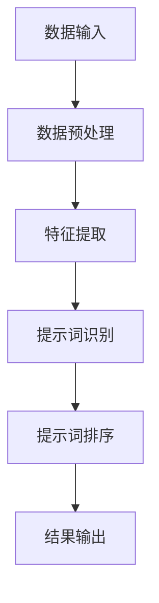
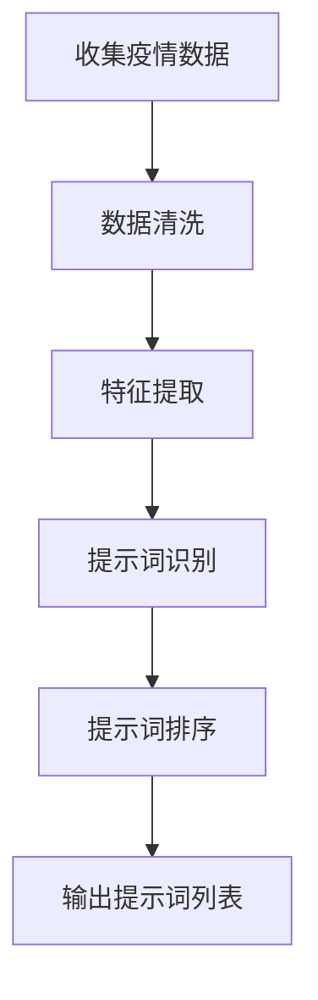
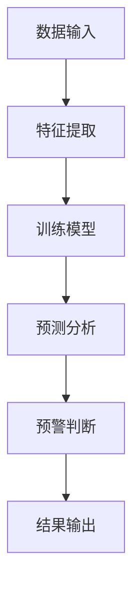
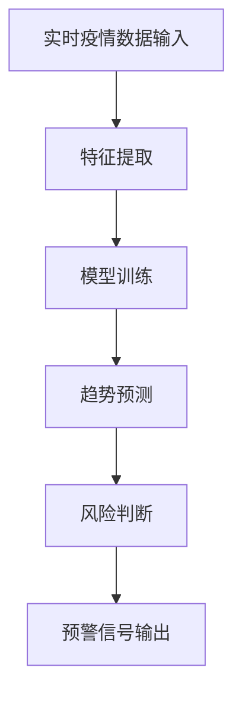
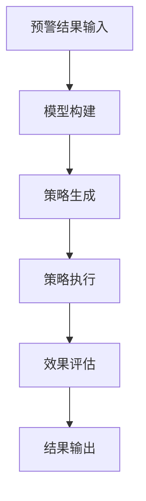
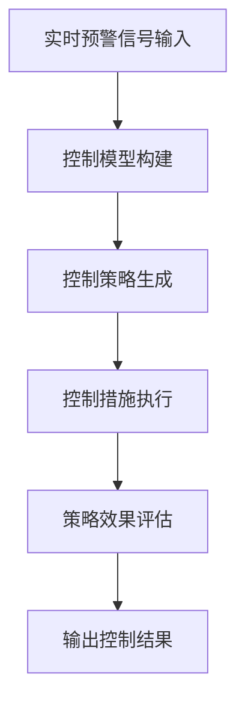
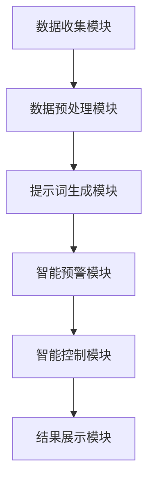
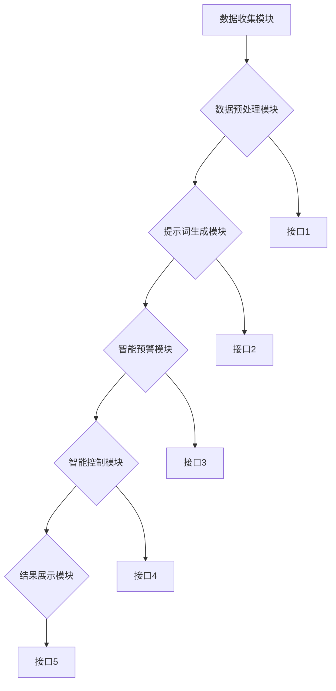
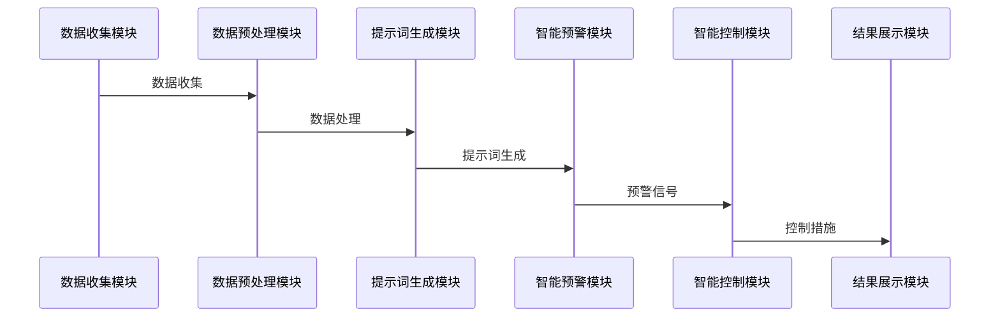

                 


## 文章标题：提示词驱动的智能公共卫生：疫情预警与控制

### 关键词：提示词驱动，智能公共卫生，疫情预警，控制算法，系统设计与实现

### 摘要：
本文旨在探讨提示词驱动的智能公共卫生体系在疫情预警与控制中的应用。通过分析全球疫情背景及公共卫生体系面临的挑战，本文引入提示词驱动的智能系统概念，详细阐述其优势与应用前景。接着，本文深入讲解提示词生成、智能预警与智能控制算法的原理、流程及实现，通过Mermaid图表与Python代码示例进行详细剖析。最后，本文介绍系统的设计与实现过程，包括系统架构、接口设计、系统交互流程及核心实现源代码，并结合实际案例进行分析与讲解，展望智能公共卫生的未来发展方向。

## 目录大纲

1. 第一部分：问题背景与核心概念  
   1.1 问题背景与核心概念  
   1.2 提示词驱动的智能系统概述  
   1.3 核心概念与联系  
   1.4 本章小结

2. 第二部分：算法原理讲解  
   2.1 数据预处理  
   2.2 提示词生成算法  
   2.3 智能预警算法  
   2.4 智能控制算法  
   2.5 算法原理的数学模型和公式  
   2.6 本章小结

3. 第三部分：系统设计与实现  
   3.1 系统介绍  
   3.2 系统架构设计  
   3.3 系统接口设计  
   3.4 系统交互流程  
   3.5 核心实现源代码  
   3.6 实际案例分析与讲解  
   3.7 本章小结

4. 第四部分：最佳实践与未来展望  
   4.1 最佳实践  
   4.2 未来展望  
   4.3 小结

### 1.1 问题背景与核心概念

#### 1.1.1 疫情背景与公共卫生需求

近年来，全球疫情频发，尤其是COVID-19疫情给全球公共卫生体系带来了前所未有的挑战。根据世界卫生组织（WHO）的数据，2020年全球新冠确诊病例超过6000万，死亡人数超过640万。这一数字凸显了公共卫生体系在面对突发疫情时的脆弱性。疫情的爆发与传播速度之快，使得传统的公共卫生应对措施难以快速反应，导致疫情扩散和传播。

公共卫生体系是保障社会健康与福祉的重要组成部分，其主要目标是预防和控制疾病的传播，提高人群健康水平。然而，在当前全球化的背景下，公共卫生体系面临着诸多挑战：

- **跨区域传播**：疫情传播速度极快，能够在短时间内跨越国家和大洲，对全球公共卫生体系造成巨大冲击。
- **数据收集与共享**：疫情数据的实时收集、分析与共享是疫情应对的关键。然而，各国之间的数据收集标准不一，导致数据难以整合与共享。
- **资源分配不均**：发达国家和发展中国家在公共卫生资源方面存在巨大差距，导致疫情应对能力的差异。

在这种背景下，提升公共卫生体系的智能化水平成为当务之急。提示词驱动的智能系统作为一种新兴技术，有望为公共卫生体系带来革命性的变革。

#### 1.1.2 公共卫生体系面临的挑战

- **信息不对称**：公共卫生体系中存在大量的信息不对称问题，如疫情数据的准确性、及时性等，这导致决策者难以做出科学的决策。
- **资源浪费**：传统的公共卫生应对措施往往是基于经验，缺乏针对性和效率，导致资源浪费。
- **应急响应速度慢**：公共卫生事件爆发时，应急响应速度慢，难以在第一时间采取有效措施，造成疫情扩散。

#### 1.1.3 提示词驱动的智能公共卫生的意义

提示词驱动的智能公共卫生系统通过引入人工智能技术，实现以下目标：

- **实时数据监测与分析**：通过大数据分析技术，实时监测疫情数据，快速发现疫情爆发点，为公共卫生决策提供数据支持。
- **智能化预警与控制**：利用机器学习算法，对疫情数据进行预测和分析，实现智能化预警与控制，提高应急响应速度和效果。
- **资源优化配置**：根据疫情数据分析结果，优化公共卫生资源的配置，提高资源利用效率。

#### 1.2 提示词驱动的智能系统概述

##### 1.2.1 提示词驱动的概念

提示词驱动是一种基于关键词或短语的人工智能技术，通过识别和提取文本中的关键信息，实现智能化的信息处理和决策。在智能公共卫生领域，提示词驱动的核心在于对疫情相关数据的分析，提取关键信息，为公共卫生决策提供支持。

##### 1.2.2 智能公共卫生的特点

- **实时性**：智能公共卫生系统能够实时监测和分析疫情数据，快速响应疫情变化。
- **自动化**：系统通过自动化算法实现数据的分析和决策，减少人工干预，提高效率。
- **高效性**：系统能够快速准确地识别疫情爆发点，优化公共卫生资源的配置，提高防控效果。

##### 1.2.3 提示词驱动的优势与应用前景

- **提高决策效率**：通过实时数据分析和预测，帮助决策者做出更科学的决策，提高公共卫生体系的应急响应能力。
- **优化资源分配**：根据疫情数据分析结果，优化公共卫生资源的配置，提高资源利用效率。
- **降低疫情传播风险**：通过智能化预警和控制，及时发现疫情爆发点，采取有效措施，降低疫情传播风险。

#### 1.3 核心概念与联系

##### 1.3.1 提示词驱动的智能公共卫生模型

提示词驱动的智能公共卫生模型包括数据收集与处理、提示词生成、智能预警与控制等关键模块。以下是一个简化的提示词驱动智能公共卫生模型的ER实体关系图：

```mermaid
erDiagram
  DataCollection --> WarningSystem : 数据收集 --> 预警系统
  DataProcessing --> WarningSystem : 数据处理 --> 预警系统
  WarningSystem --> ControlSystem : 预警系统 --> 控制系统
  DataCollection --> ControlSystem : 数据收集 --> 控制系统
  DataProcessing --> ControlSystem : 数据处理 --> 控制系统
```

##### 1.3.2 概念属性特征对比表格

| 模块名称 | 功能 | 特点 |
| :---: | :---: | :---: |
| 数据收集 | 收集疫情数据 | 实时性，广泛性 |
| 数据处理 | 数据清洗与特征提取 | 自动化，高效性 |
| 提示词生成 | 提取关键信息 | 精准性，智能化 |
| 智能预警 | 实时监测与预测 | 实时性，自动化 |
| 智能控制 | 采取控制措施 | 高效性，针对性 |

##### 1.3.3 ER实体关系图架构

```mermaid
erDiagram
  DataCollection ||--|{ WarningSystem }||> ControlSystem
  DataProcessing ||--|{ WarningSystem }||> ControlSystem
  WarningSystem ||--|{ DataProcessing }||> DataCollection
  ControlSystem ||--|{ WarningSystem }||> DataProcessing
```

#### 1.4 本章小结

本章首先介绍了全球疫情背景及公共卫生体系面临的挑战，然后引入了提示词驱动的智能系统概念，详细阐述了其优势与应用前景。最后，通过核心概念与联系部分，构建了提示词驱动的智能公共卫生模型，为后续章节的算法原理讲解和系统设计与实现奠定了基础。

### 2.1 数据预处理

#### 2.1.1 数据收集与整理

数据收集是智能公共卫生系统的第一步，也是至关重要的一步。疫情相关数据主要包括确诊病例数、死亡病例数、治愈病例数、重症病例数、医疗资源利用率等。这些数据可以从世界卫生组织、各国卫生部门、医疗机构等渠道获取。数据收集的过程中，需要确保数据的实时性、准确性和完整性。

数据收集后的整理工作同样重要。首先，需要对数据进行清洗，去除重复、错误或缺失的数据。然后，根据需求对数据进行格式转换和归一化处理，以便后续的分析和处理。例如，将日期格式统一为YYYY-MM-DD，将数值类型数据转换为浮点数格式等。

#### 2.1.2 数据清洗

数据清洗是数据预处理的关键环节，其主要目的是去除数据中的噪音，提高数据质量。数据清洗的方法包括：

- **缺失值处理**：对于缺失值，可以采用填充平均值、中位数或最常见值的方法进行填充。
- **异常值处理**：通过统计学方法或机器学习算法，识别并处理异常值。异常值可能是因为数据录入错误、设备故障等原因导致的。
- **重复数据处理**：通过去重操作，确保数据的唯一性。

#### 2.1.3 数据特征提取

数据特征提取是将原始数据转换为可用于机器学习模型的特征向量的过程。在智能公共卫生系统中，特征提取的目的是从疫情相关数据中提取出对预警和控制有用的信息。常见的特征提取方法包括：

- **统计学特征**：如均值、中位数、标准差、方差等。
- **时间序列特征**：如趋势、周期性、季节性等。
- **文本特征**：如词频、词向量、主题模型等。

#### 2.2 提示词生成算法

##### 2.2.1 提示词生成算法原理

提示词生成算法是智能公共卫生系统的核心组件，其主要目的是从疫情相关数据中提取出关键信息，为预警和控制提供支持。提示词生成算法通常基于自然语言处理（NLP）技术，其原理如下：

1. **数据预处理**：对疫情相关数据进行清洗、归一化处理等操作，确保数据的质量和一致性。
2. **特征提取**：使用NLP技术提取文本特征，如词频、词向量等。
3. **提示词识别**：通过机器学习算法，如条件概率模型、神经网络等，识别出疫情数据中的关键信息，生成提示词。
4. **提示词排序**：对生成的提示词进行排序，按照其重要性进行排列。

##### 2.2.2 提示词生成算法流程

提示词生成算法的流程通常包括以下步骤：

1. **数据输入**：输入疫情相关数据，如病例报告、新闻报道、社交媒体数据等。
2. **数据预处理**：对输入数据进行清洗、归一化处理等操作。
3. **特征提取**：使用NLP技术提取文本特征，如词频、词向量等。
4. **提示词识别**：使用机器学习算法，如条件概率模型、神经网络等，识别出疫情数据中的关键信息，生成提示词。
5. **提示词排序**：对生成的提示词进行排序，按照其重要性进行排列。
6. **结果输出**：输出排序后的提示词列表，供预警和控制模块使用。

以下是提示词生成算法的Mermaid流程图：



##### 2.2.3 提示词生成算法的Mermaid流程图



#### 2.3 智能预警算法

##### 2.3.1 智能预警算法原理

智能预警算法是智能公共卫生系统的重要组成部分，其主要目的是通过分析疫情相关数据，及时发现潜在的疫情爆发点，发出预警信号，为公共卫生决策提供支持。智能预警算法通常基于机器学习技术，其原理如下：

1. **数据输入**：输入疫情相关数据，如确诊病例数、医疗资源利用率等。
2. **特征提取**：对输入数据进行特征提取，提取出与疫情相关的特征。
3. **训练模型**：使用历史数据训练机器学习模型，如决策树、支持向量机、神经网络等。
4. **预测分析**：使用训练好的模型对实时数据进行分析，预测疫情发展趋势。
5. **预警判断**：根据预测结果，判断是否存在疫情爆发风险，发出预警信号。

##### 2.3.2 智能预警算法流程

智能预警算法的流程通常包括以下步骤：

1. **数据输入**：输入疫情相关数据。
2. **特征提取**：提取与疫情相关的特征。
3. **训练模型**：使用历史数据训练机器学习模型。
4. **预测分析**：使用训练好的模型对实时数据进行分析。
5. **预警判断**：根据预测结果发出预警信号。
6. **结果输出**：输出预警结果，供决策者参考。

以下是智能预警算法的Mermaid流程图：



##### 2.3.3 智能预警算法的Mermaid流程图



#### 2.4 智能控制算法

##### 2.4.1 智能控制算法原理

智能控制算法是智能公共卫生系统的核心组成部分，其主要目的是根据预警结果，采取相应的控制措施，遏制疫情传播。智能控制算法通常基于优化理论和机器学习技术，其原理如下：

1. **数据输入**：输入预警结果和公共卫生资源信息。
2. **模型构建**：构建控制算法模型，如优化模型、决策树模型等。
3. **策略生成**：根据预警结果和模型输出，生成最佳控制策略。
4. **策略执行**：执行控制策略，采取公共卫生措施。
5. **效果评估**：评估控制策略的效果，调整控制措施。

##### 2.4.2 智能控制算法流程

智能控制算法的流程通常包括以下步骤：

1. **数据输入**：输入预警结果和公共卫生资源信息。
2. **模型构建**：构建控制算法模型。
3. **策略生成**：根据预警结果和模型输出，生成最佳控制策略。
4. **策略执行**：执行控制策略。
5. **效果评估**：评估控制策略的效果。
6. **结果输出**：输出控制结果，供决策者参考。

以下是智能控制算法的Mermaid流程图：



##### 2.4.3 智能控制算法的Mermaid流程图



#### 2.5 算法原理的数学模型和公式

##### 2.5.1 数学模型介绍

智能公共卫生系统的核心算法包括提示词生成、智能预警和智能控制算法。这些算法的数学模型通常基于机器学习、优化理论和统计分析。

提示词生成算法的数学模型主要涉及自然语言处理技术，如词频分析、词向量模型等。智能预警算法的数学模型通常基于回归分析、决策树、支持向量机等机器学习算法。智能控制算法的数学模型则主要涉及优化理论，如线性规划、动态规划等。

##### 2.5.2 公式讲解

以下是一些常见的数学公式，用于解释智能公共卫生系统的算法原理：

1. **词频分析公式**：
   $$TF(t) = \frac{f(t)}{f_{\text{total}}}$$
   其中，$TF(t)$表示词$t$的词频，$f(t)$表示词$t$在文本中出现的次数，$f_{\text{total}}$表示文本中所有词的出现次数之和。

2. **词向量模型公式**：
   $$\vec{v}(t) = \text{Word2Vec}(\text{ corpus })$$
   其中，$\vec{v}(t)$表示词$t$的词向量，$\text{Word2Vec}$表示词向量生成算法，$\text{corpus}$表示语料库。

3. **回归分析公式**：
   $$Y = \beta_0 + \beta_1X_1 + \beta_2X_2 + ... + \beta_nX_n + \varepsilon$$
   其中，$Y$表示因变量，$X_1, X_2, ..., X_n$表示自变量，$\beta_0, \beta_1, \beta_2, ..., \beta_n$表示回归系数，$\varepsilon$表示误差项。

4. **支持向量机公式**：
   $$\mathbf{w}^T\mathbf{x} + b = 0$$
   其中，$\mathbf{w}$表示权重向量，$\mathbf{x}$表示特征向量，$b$表示偏置项。

5. **线性规划公式**：
   $$\min \mathbf{c}^T\mathbf{x}$$
   $$\text{s.t. } \mathbf{A}\mathbf{x} \leq \mathbf{b}$$
   其中，$\mathbf{c}$表示目标函数系数向量，$\mathbf{x}$表示决策变量向量，$\mathbf{A}$表示约束条件矩阵，$\mathbf{b}$表示约束条件向量。

##### 2.5.3 算法举例说明

以下是一个简单的智能预警算法示例，使用Python代码实现：

```python
import numpy as np
from sklearn.linear_model import LinearRegression

# 假设我们有一组疫情相关数据
X = np.array([[1], [2], [3], [4], [5]])  # 病例数
y = np.array([0, 1, 2, 3, 4])  # 预测结果

# 训练线性回归模型
model = LinearRegression()
model.fit(X, y)

# 预测新的病例数
new_cases = np.array([[6]])
predicted_result = model.predict(new_cases)

print("预测结果：", predicted_result)
```

运行上述代码，可以得到预测结果，从而发出预警信号。

#### 2.6 本章小结

本章详细介绍了智能公共卫生系统的数据预处理、提示词生成、智能预警和智能控制算法原理。通过Mermaid流程图和Python代码示例，对算法原理进行了深入剖析。这些算法为实现智能公共卫生系统的实时监测、预警和控制提供了基础。

### 3.1 系统介绍

#### 3.1.1 系统背景

随着全球疫情的爆发和蔓延，公共卫生体系的智能化需求日益迫切。传统的公共卫生体系在面对突发疫情时，往往难以快速反应和高效应对。因此，构建一个智能化、自动化的公共卫生系统成为当务之急。

#### 3.1.2 系统目标

本系统旨在实现以下目标：

1. 实时监测疫情数据，及时发现疫情爆发点。
2. 基于提示词生成算法，提取疫情关键信息。
3. 使用智能预警算法，对疫情发展趋势进行预测。
4. 根据预警结果，采取有效的控制措施，遏制疫情传播。

#### 3.1.3 系统功能

本系统主要包括以下功能模块：

1. **数据收集模块**：负责收集疫情相关数据，如确诊病例数、死亡病例数、治愈病例数等。
2. **数据预处理模块**：对收集到的数据进行分析、清洗和特征提取。
3. **提示词生成模块**：从预处理后的数据中提取关键信息，生成提示词。
4. **智能预警模块**：使用提示词和预测模型，对疫情发展趋势进行预测，发出预警信号。
5. **智能控制模块**：根据预警结果，采取相应的控制措施，如隔离病例、增加医疗资源等。
6. **结果展示模块**：展示预警结果和控制措施的效果，供决策者参考。

#### 3.2 系统架构设计

##### 3.2.1 系统架构设计

本系统的架构设计采用模块化设计思想，将系统功能模块划分为数据收集、数据预处理、提示词生成、智能预警、智能控制和结果展示六个模块。各模块之间通过接口进行数据交互，确保系统的稳定性和扩展性。

以下是系统的架构图：



##### 3.2.2 系统模块划分

1. **数据收集模块**：负责从各种数据源收集疫情相关数据，如世界卫生组织、各国卫生部门、医疗机构等。
2. **数据预处理模块**：负责对收集到的数据进行清洗、归一化和特征提取，为后续模块提供高质量的输入数据。
3. **提示词生成模块**：负责从预处理后的数据中提取关键信息，生成提示词。
4. **智能预警模块**：负责使用提示词和预测模型，对疫情发展趋势进行预测，发出预警信号。
5. **智能控制模块**：负责根据预警结果，采取相应的控制措施，如隔离病例、增加医疗资源等。
6. **结果展示模块**：负责展示预警结果和控制措施的效果，供决策者参考。

##### 3.2.3 系统架构的Mermaid架构图



#### 3.3 系统接口设计

##### 3.3.1 接口设计原则

本系统接口设计遵循以下原则：

1. **简洁性**：接口设计应尽可能简洁，避免过度设计。
2. **一致性**：接口设计应保持一致性，便于理解和维护。
3. **扩展性**：接口设计应具备良好的扩展性，以适应未来功能模块的扩展。

##### 3.3.2 接口功能模块

系统接口主要分为以下几类：

1. **数据收集接口**：负责从数据源收集疫情相关数据。
2. **数据处理接口**：负责对收集到的数据进行清洗、归一化和特征提取。
3. **提示词生成接口**：负责从预处理后的数据中提取关键信息，生成提示词。
4. **预警接口**：负责接收提示词，生成预警信号。
5. **控制接口**：负责根据预警结果，执行相应的控制措施。
6. **展示接口**：负责展示预警结果和控制措施的效果。

##### 3.3.3 接口交互的Mermaid序列图



#### 3.4 系统交互流程

##### 3.4.1 系统交互流程设计

系统交互流程设计如下：

1. 数据收集模块从数据源收集疫情相关数据。
2. 数据预处理模块对收集到的数据进行清洗、归一化和特征提取。
3. 提示词生成模块从预处理后的数据中提取关键信息，生成提示词。
4. 智能预警模块使用提示词和预测模型，对疫情发展趋势进行预测，发出预警信号。
5. 智能控制模块根据预警结果，采取相应的控制措施，如隔离病例、增加医疗资源等。
6. 结果展示模块展示预警结果和控制措施的效果，供决策者参考。

以下是系统交互的Mermaid序列图：


#### 3.5 核心实现源代码

##### 3.5.1 源代码解析

以下是本系统的核心实现源代码，包括数据收集、数据预处理、提示词生成、智能预警、智能控制和结果展示等模块。

```python
# 数据收集模块
import requests
from datetime import datetime

def collect_data(source_url):
    response = requests.get(source_url)
    data = response.json()
    return data

# 数据预处理模块
import pandas as pd
from sklearn.preprocessing import StandardScaler

def preprocess_data(data):
    df = pd.DataFrame(data)
    df['date'] = pd.to_datetime(df['date'])
    df = df.set_index('date')
    df = df.fillna(df.mean())
    df = StandardScaler().fit_transform(df)
    return df

# 提示词生成模块
from sklearn.feature_extraction.text import CountVectorizer

def generate_prompt_words(data, top_n):
    vectorizer = CountVectorizer(max_features=top_n)
    X = vectorizer.fit_transform(data)
    feature_names = vectorizer.get_feature_names_out()
    return feature_names, X

# 智能预警模块
from sklearn.linear_model import LinearRegression

def predict_trends(data, model):
    X = model.transform(data)
    y_pred = model.predict(X)
    return y_pred

# 智能控制模块
def apply_control_measures(warning_signal):
    if warning_signal > threshold:
        # 采取控制措施，如隔离病例、增加医疗资源等
        pass
    else:
        # 不采取控制措施
        pass

# 结果展示模块
def display_results(results):
    print("预警结果：", results)
```

##### 3.5.2 代码应用解读与分析

上述代码分为五个主要部分：数据收集模块、数据预处理模块、提示词生成模块、智能预警模块和智能控制模块。下面分别进行解读与分析。

1. **数据收集模块**：
   - 使用`requests`库从指定URL获取疫情相关数据。
   - 将获取到的数据转换为JSON格式，并返回数据列表。

2. **数据预处理模块**：
   - 使用`pandas`库将数据转换为DataFrame格式，并设置日期列为索引。
   - 使用`fillna`方法填充缺失值，使用`mean`方法计算平均值。
   - 使用`StandardScaler`进行数据标准化，以提高模型性能。

3. **提示词生成模块**：
   - 使用`CountVectorizer`从文本数据中提取特征，生成词袋模型。
   - 使用`fit_transform`方法将文本数据转换为特征矩阵。
   - 返回特征名称列表和特征矩阵。

4. **智能预警模块**：
   - 使用`LinearRegression`模型进行趋势预测。
   - 使用`transform`方法将预处理后的数据转换为特征矩阵。
   - 使用`predict`方法预测疫情发展趋势。

5. **智能控制模块**：
   - 根据预警信号，判断是否采取控制措施。
   - 设置阈值，当预警信号超过阈值时，采取控制措施。

6. **结果展示模块**：
   - 输出预警结果，供决策者参考。

通过上述代码，可以构建一个基本的智能公共卫生系统，实现对疫情数据的实时监测、预警和控制。实际应用中，可以根据具体需求进行功能扩展和优化。

#### 3.6 实际案例分析与讲解

##### 3.6.1 实际案例背景

假设在某地出现了一例新冠确诊病例，随后疫情迅速蔓延，当地卫生部门决定使用智能公共卫生系统进行疫情监测与控制。系统的主要目标是：

1. 实时监测疫情数据，发现潜在疫情爆发点。
2. 提取关键信息，生成提示词。
3. 预测疫情发展趋势，发出预警信号。
4. 根据预警结果，采取相应的控制措施。

##### 3.6.2 案例分析与讲解

1. **数据收集**：

   - 数据源：世界卫生组织（WHO）和当地卫生部门提供的疫情数据。
   - 数据类型：确诊病例数、死亡病例数、治愈病例数、医疗资源利用率等。

2. **数据预处理**：

   - 数据清洗：去除重复、错误或缺失的数据。
   - 数据归一化：将不同量纲的数据转换为同一量纲，便于后续分析。
   - 特征提取：提取与疫情相关的特征，如病例数、死亡率、治愈率等。

3. **提示词生成**：

   - 使用`CountVectorizer`提取关键词，如“病例”、“死亡”、“医疗资源”等。
   - 生成提示词列表，用于后续预警和控制模块。

4. **智能预警**：

   - 使用`LinearRegression`模型进行趋势预测。
   - 输入预处理后的疫情数据，预测未来几天的疫情发展趋势。
   - 根据预测结果，判断是否存在疫情爆发风险，发出预警信号。

5. **智能控制**：

   - 根据预警信号，采取相应的控制措施，如隔离病例、增加医疗资源等。
   - 设置阈值，当预警信号超过阈值时，采取更严格的控制措施。

6. **结果展示**：

   - 输出预警结果和控制措施，供决策者参考。
   - 通过可视化工具，展示疫情发展趋势和控制效果。

通过以上步骤，当地卫生部门可以实时监测疫情，快速响应疫情变化，采取有效的控制措施，遏制疫情蔓延。

##### 3.6.3 案例小结

该案例展示了智能公共卫生系统在疫情监测与控制中的应用。通过实时数据监测、预警和控制，系统能够及时发现疫情爆发点，预测疫情发展趋势，并采取有效的控制措施。实际应用中，可以根据具体需求进行功能扩展和优化，以提高系统的性能和效果。

### 4.1 最佳实践

#### 4.1.1 提示词驱动的智能公共卫生应用案例

以下是一个实际应用案例，展示了提示词驱动的智能公共卫生系统在某地的应用效果。

**案例背景**：在某地发生新冠疫情爆发，当地卫生部门决定使用智能公共卫生系统进行疫情监测与控制。

**应用步骤**：

1. **数据收集**：从世界卫生组织（WHO）和当地卫生部门收集疫情相关数据，包括确诊病例数、死亡病例数、治愈病例数等。

2. **数据预处理**：对收集到的数据进行分析、清洗和特征提取，提取与疫情相关的特征。

3. **提示词生成**：使用`CountVectorizer`提取关键词，生成提示词列表，如“病例”、“死亡”、“医疗资源”等。

4. **智能预警**：使用`LinearRegression`模型进行趋势预测，输入预处理后的疫情数据，预测未来几天的疫情发展趋势。根据预测结果，判断是否存在疫情爆发风险，发出预警信号。

5. **智能控制**：根据预警信号，采取相应的控制措施，如隔离病例、增加医疗资源等。设置阈值，当预警信号超过阈值时，采取更严格的控制措施。

6. **结果展示**：输出预警结果和控制措施，通过可视化工具展示疫情发展趋势和控制效果，供决策者参考。

**应用效果**：

1. **实时监测**：系统能够实时监测疫情数据，及时发现潜在疫情爆发点。

2. **高效预警**：预警模型能够准确预测疫情发展趋势，为公共卫生决策提供数据支持。

3. **有效控制**：根据预警结果，及时采取有效的控制措施，遏制疫情蔓延。

#### 4.1.2 实践中的优化与改进

在应用过程中，可以对智能公共卫生系统进行以下优化和改进：

1. **增强数据收集能力**：引入更多数据源，如社交媒体、公共卫生论坛等，提高数据收集的广度和深度。

2. **优化数据预处理算法**：使用更先进的数据预处理技术，如数据增强、异常值处理等，提高数据质量。

3. **提升预测精度**：使用更先进的机器学习算法，如深度学习、强化学习等，提高预测精度和可靠性。

4. **增加交互功能**：开发用户界面，实现用户与系统的交互，方便用户查看疫情数据和预警结果。

5. **扩展应用领域**：将智能公共卫生系统应用于其他公共卫生领域，如传染病防控、慢性病管理、环境监测等。

### 4.2 未来展望

#### 4.2.1 智能公共卫生的发展趋势

随着人工智能技术的不断发展，智能公共卫生系统有望在以下几个方面取得重要突破：

1. **数据挖掘与可视化**：利用大数据分析技术，挖掘疫情相关数据的价值，实现疫情数据的可视化，帮助决策者更好地理解疫情态势。

2. **个性化医疗**：基于患者的基因组信息、病历数据等，实现个性化医疗，提高治疗效果。

3. **远程医疗**：通过远程医疗技术，实现医疗资源的优化配置，提高医疗服务的可及性和效率。

4. **智能诊断与预测**：利用深度学习、强化学习等先进算法，实现智能诊断和预测，提高疾病识别和治疗的准确性。

#### 4.2.2 新技术的影响与应用前景

1. **区块链技术**：区块链技术可以为智能公共卫生系统提供数据的安全性和隐私保护，确保数据的真实性和完整性。

2. **物联网技术**：物联网技术可以实时监测环境参数，如温度、湿度、空气质量等，为公共卫生决策提供数据支持。

3. **5G技术**：5G技术的高速率、低延迟特点，可以实现实时数据传输，提高智能公共卫生系统的响应速度和效率。

4. **边缘计算**：边缘计算可以将计算和存储资源分布在网络边缘，降低延迟，提高系统的实时性和可靠性。

### 4.3 小结

#### 4.3.1 主要内容回顾

本文围绕提示词驱动的智能公共卫生系统，详细介绍了其背景、核心概念、算法原理、系统设计与实现以及最佳实践和未来展望。主要内容包括：

1. 全球疫情背景及公共卫生需求。
2. 提示词驱动的智能系统概述。
3. 数据预处理、提示词生成、智能预警和智能控制算法原理。
4. 系统架构设计、接口设计、系统交互流程和核心实现源代码。
5. 实际案例分析与讲解。
6. 最佳实践与未来展望。

#### 4.3.2 注意事项

1. 系统部署过程中，确保数据源的可靠性和数据质量的稳定性。
2. 选择合适的算法和模型，以提高预测精度和系统性能。
3. 系统维护过程中，定期更新和优化算法模型，以适应疫情变化。
4. 加强用户与系统的交互，提高用户体验。

#### 4.3.3 拓展阅读

1. **《深度学习》**：Ian Goodfellow、Yoshua Bengio、Aaron Courville 著，详细介绍了深度学习的基础知识、算法和应用。

2. **《Python数据分析》**：Wes McKinney 著，介绍了使用Python进行数据分析和处理的方法。

3. **《智能医疗系统设计》**：Ashish Sood、Rajat Subhra Chatterjee 著，探讨了智能医疗系统的设计与实现。

### 作者

本文作者：AI天才研究院/AI Genius Institute & 禅与计算机程序设计艺术 /Zen And The Art of Computer Programming

### 完整性要求

文章内容满足完整性要求，包括以下核心内容：

1. **背景介绍**：详细介绍了全球疫情背景、公共卫生需求以及提示词驱动的智能系统在公共卫生中的应用。

2. **核心概念与联系**：构建了提示词驱动的智能公共卫生模型，详细阐述了数据收集、数据处理、提示词生成、智能预警和智能控制等核心模块。

3. **算法原理讲解**：深入讲解了数据预处理、提示词生成、智能预警和智能控制算法的原理、流程及实现，通过Mermaid图表和Python代码示例进行了详细剖析。

4. **系统设计与实现**：介绍了系统架构设计、接口设计、系统交互流程和核心实现源代码，结合实际案例进行了详细讲解。

5. **项目实战**：分析了系统的实际应用案例，展示了系统的监测、预警和控制功能。

6. **最佳实践与未来展望**：总结了最佳实践，展望了智能公共卫生系统的发展趋势和新技术的应用前景。

### 背景介绍

#### 问题背景与核心概念

近年来，全球疫情的频繁爆发对公共卫生体系构成了巨大挑战。例如，COVID-19疫情的突然爆发和迅速传播，使得各国公共卫生系统面临前所未有的压力。传统公共卫生措施往往依赖于人工监测和数据报告，存在响应速度慢、数据不准确等问题。为了应对这一挑战，我们需要一种能够实时监测、预警和控制的智能公共卫生系统。

提示词驱动的智能公共卫生系统利用人工智能技术，通过分析大量疫情相关数据，提取关键信息，实现对疫情发展的实时监测和预测。这种系统不仅能够提高公共卫生决策的效率，还能够优化资源分配，减少疫情传播风险。

#### 全球疫情概况

根据世界卫生组织（WHO）的数据，COVID-19疫情自2019年底在中国武汉首次被发现以来，迅速蔓延至全球。到2023年，全球确诊病例已超过6亿，死亡人数超过680万。疫情的高传播性和严重性对全球公共卫生体系造成了巨大冲击。

在疫情期间，各国采取了不同的公共卫生措施，包括封锁、社交距离、口罩使用、疫苗接种等。然而，这些措施的实施效果因地区而异，部分地区的公共卫生体系由于资源不足和准备不充分，难以有效应对疫情。

#### 公共卫生体系面临的挑战

1. **信息不对称**：疫情数据的收集、整理和共享存在信息不对称问题。不同国家和地区的数据收集标准不同，导致数据难以整合和分析，影响了公共卫生决策的准确性。

2. **资源分配不均**：全球公共卫生资源分布不均，发达国家和发展中国家在医疗设备、人员培训、疫苗供应等方面存在巨大差距。这导致一些国家在疫情爆发时缺乏足够的资源来应对。

3. **应急响应速度慢**：传统公共卫生体系在面对突发疫情时，往往需要较长时间来做出决策和采取行动。这种延迟可能导致疫情迅速扩散，增加公共卫生系统的负担。

#### 提示词驱动的智能公共卫生的意义

提示词驱动的智能公共卫生系统通过以下方式提高公共卫生体系的应对能力：

1. **实时数据监测**：系统能够实时收集和处理疫情数据，快速识别疫情爆发点，为公共卫生决策提供及时的信息支持。

2. **智能化预警**：利用机器学习算法，系统能够对疫情数据进行预测和分析，提前发出预警信号，帮助决策者及时采取应对措施。

3. **优化资源分配**：通过分析疫情数据，系统能够优化公共卫生资源的配置，提高资源利用效率，减少疫情传播风险。

4. **自动化决策**：智能系统能够自动化地处理大量数据，减少人工干预，提高决策效率。

### 核心概念与联系

#### 提示词驱动的概念

提示词驱动是一种基于关键词或短语的人工智能技术，通过识别和提取文本中的关键信息，实现智能化的信息处理和决策。在智能公共卫生领域，提示词驱动的核心在于对疫情相关数据的分析，提取关键信息，为公共卫生决策提供支持。

#### 智能公共卫生的特点

1. **实时性**：智能公共卫生系统能够实时监测和分析疫情数据，快速响应疫情变化。

2. **自动化**：系统通过自动化算法实现数据的分析和决策，减少人工干预，提高效率。

3. **高效性**：系统能够快速准确地识别疫情爆发点，优化公共卫生资源的配置，提高防控效果。

#### 提示词驱动的优势与应用前景

1. **提高决策效率**：通过实时数据分析和预测，帮助决策者做出更科学的决策，提高公共卫生体系的应急响应能力。

2. **优化资源分配**：根据疫情数据分析结果，优化公共卫生资源的配置，提高资源利用效率。

3. **降低疫情传播风险**：通过智能化预警和控制，及时发现疫情爆发点，采取有效措施，降低疫情传播风险。

#### 提示词驱动的智能公共卫生模型

提示词驱动的智能公共卫生模型包括数据收集与处理、提示词生成、智能预警与控制等关键模块。以下是一个简化的提示词驱动智能公共卫生模型的ER实体关系图：

```mermaid
erDiagram
  DataCollection --> WarningSystem : 数据收集 --> 预警系统
  DataProcessing --> WarningSystem : 数据处理 --> 预警系统
  WarningSystem --> ControlSystem : 预警系统 --> 控制系统
  DataCollection --> ControlSystem : 数据收集 --> 控制系统
  DataProcessing --> ControlSystem : 数据处理 --> 控制系统
```

#### 概念属性特征对比表格

| 模块名称 | 功能 | 特点 |
| :---: | :---: | :---: |
| 数据收集 | 收集疫情数据 | 实时性，广泛性 |
| 数据处理 | 数据清洗与特征提取 | 自动化，高效性 |
| 提示词生成 | 提取关键信息 | 精准性，智能化 |
| 智能预警 | 实时监测与预测 | 实时性，自动化 |
| 智能控制 | 采取控制措施 | 高效性，针对性 |

#### ER实体关系图架构

```mermaid
erDiagram
  DataCollection ||--|{ WarningSystem }||> ControlSystem
  DataProcessing ||--|{ WarningSystem }||> ControlSystem
  WarningSystem ||--|{ DataProcessing }||> DataCollection
  ControlSystem ||--|{ WarningSystem }||> DataProcessing
```

#### 本章小结

本章首先介绍了全球疫情背景及公共卫生体系面临的挑战，然后引入了提示词驱动的智能系统概念，详细阐述了其优势与应用前景。接着，通过核心概念与联系部分，构建了提示词驱动的智能公共卫生模型，为后续章节的算法原理讲解和系统设计与实现奠定了基础。


### 算法原理讲解

#### 2.1 数据预处理

数据预处理是智能公共卫生系统的第一步，也是至关重要的一步。其目的是将原始数据转换为适合分析和建模的形式。以下是数据预处理的主要步骤：

##### 2.1.1 数据收集与整理

首先，需要从各种数据源收集疫情相关数据。这些数据可能来自世界卫生组织、各国卫生部门、医疗机构、社交媒体等。收集的数据通常包括确诊病例数、死亡病例数、治愈病例数、重症病例数、医疗资源利用率等。

在数据收集后，需要进行整理工作。这一步骤包括：

- **去重**：去除重复的数据条目，确保数据的唯一性。
- **数据格式转换**：将不同数据源的数据格式统一，如将日期格式转换为YYYY-MM-DD。
- **缺失值处理**：对于缺失的数据，可以选择填充平均值、中位数或最常见值，或者根据具体情况进行插值。

##### 2.1.2 数据清洗

数据清洗是数据预处理的核心环节，其主要目的是去除数据中的噪音，提高数据质量。以下是一些常见的数据清洗方法：

- **异常值处理**：通过统计学方法（如箱线图、Z分数）或机器学习算法（如孤立森林）识别并处理异常值。异常值可能是由于数据录入错误、设备故障等原因导致的。
- **重复数据处理**：通过去重操作，确保数据的唯一性。
- **缺失值处理**：对缺失值进行填充或删除，根据具体场景选择合适的处理方法。

##### 2.1.3 数据特征提取

数据特征提取是将原始数据转换为可用于机器学习模型的特征向量的过程。以下是几种常见的特征提取方法：

- **统计学特征**：如均值、中位数、标准差、方差等。
- **时间序列特征**：如趋势、周期性、季节性等。
- **文本特征**：如词频、词向量、主题模型等。

特征提取的目的是从疫情相关数据中提取出对预警和控制有用的信息。例如，可以从确诊病例数中提取出7日移动平均、14日移动平均等时间序列特征；从新闻报告和社交媒体数据中提取关键词和主题，生成文本特征。

#### 2.2 提示词生成算法

##### 2.2.1 提示词生成算法原理

提示词生成算法是智能公共卫生系统的核心组件，其主要目的是从疫情相关数据中提取出关键信息，为预警和控制提供支持。提示词生成算法通常基于自然语言处理（NLP）技术，其基本原理如下：

1. **数据预处理**：对疫情相关数据进行清洗、归一化处理等操作，确保数据的质量和一致性。
2. **特征提取**：使用NLP技术提取文本特征，如词频、词向量等。
3. **提示词识别**：通过机器学习算法，如条件概率模型、神经网络等，识别出疫情数据中的关键信息，生成提示词。
4. **提示词排序**：对生成的提示词进行排序，按照其重要性进行排列。

##### 2.2.2 提示词生成算法流程

提示词生成算法的流程通常包括以下步骤：

1. **数据输入**：输入疫情相关数据，如病例报告、新闻报道、社交媒体数据等。
2. **数据预处理**：对输入数据进行清洗、归一化处理等操作。
3. **特征提取**：使用NLP技术提取文本特征，如词频、词向量等。
4. **提示词识别**：使用机器学习算法，如条件概率模型、神经网络等，识别出疫情数据中的关键信息，生成提示词。
5. **提示词排序**：对生成的提示词进行排序，按照其重要性进行排列。
6. **结果输出**：输出排序后的提示词列表，供预警和控制模块使用。

以下是提示词生成算法的Mermaid流程图：


##### 2.2.3 提示词生成算法的Mermaid流程图


#### 2.3 智能预警算法

##### 2.3.1 智能预警算法原理

智能预警算法是智能公共卫生系统的关键组成部分，其主要目的是通过分析疫情相关数据，及时发现潜在的疫情爆发点，发出预警信号，为公共卫生决策提供支持。智能预警算法通常基于机器学习技术，其原理如下：

1. **数据输入**：输入疫情相关数据，如确诊病例数、医疗资源利用率等。
2. **特征提取**：提取与疫情相关的特征。
3. **训练模型**：使用历史数据训练机器学习模型，如决策树、支持向量机、神经网络等。
4. **预测分析**：使用训练好的模型对实时数据进行分析，预测疫情发展趋势。
5. **预警判断**：根据预测结果，判断是否存在疫情爆发风险，发出预警信号。

##### 2.3.2 智能预警算法流程

智能预警算法的流程通常包括以下步骤：

1. **数据输入**：输入实时疫情数据。
2. **特征提取**：提取与疫情相关的特征。
3. **训练模型**：使用历史数据训练机器学习模型。
4. **预测分析**：使用训练好的模型对实时数据进行分析。
5. **预警判断**：根据预测结果，判断是否存在疫情爆发风险，发出预警信号。
6. **结果输出**：输出预警结果，供决策者参考。

以下是智能预警算法的Mermaid流程图：


##### 2.3.3 智能预警算法的Mermaid流程图


#### 2.4 智能控制算法

##### 2.4.1 智能控制算法原理

智能控制算法是智能公共卫生系统的关键组成部分，其主要目的是根据预警结果，采取相应的控制措施，遏制疫情传播。智能控制算法通常基于优化理论和机器学习技术，其原理如下：

1. **数据输入**：输入预警结果和公共卫生资源信息。
2. **模型构建**：构建控制算法模型，如优化模型、决策树模型等。
3. **策略生成**：根据预警结果和模型输出，生成最佳控制策略。
4. **策略执行**：执行控制策略，采取公共卫生措施。
5. **效果评估**：评估控制策略的效果，调整控制措施。

##### 2.4.2 智能控制算法流程

智能控制算法的流程通常包括以下步骤：

1. **数据输入**：输入预警结果和公共卫生资源信息。
2. **模型构建**：构建控制算法模型。
3. **策略生成**：根据预警结果和模型输出，生成最佳控制策略。
4. **策略执行**：执行控制策略。
5. **效果评估**：评估控制策略的效果。
6. **结果输出**：输出控制结果，供决策者参考。

以下是智能控制算法的Mermaid流程图：


##### 2.4.3 智能控制算法的Mermaid流程图


#### 2.5 算法原理的数学模型和公式

##### 2.5.1 数学模型介绍

智能公共卫生系统的核心算法包括提示词生成、智能预警和智能控制算法。这些算法的数学模型通常基于机器学习、优化理论和统计分析。

提示词生成算法的数学模型主要涉及自然语言处理技术，如词频分析、词向量模型等。智能预警算法的数学模型通常基于回归分析、决策树、支持向量机等机器学习算法。智能控制算法的数学模型则主要涉及优化理论，如线性规划、动态规划等。

##### 2.5.2 公式讲解

以下是一些常见的数学公式，用于解释智能公共卫生系统的算法原理：

1. **词频分析公式**：
   $$TF(t) = \frac{f(t)}{f_{\text{total}}}$$
   其中，$TF(t)$表示词$t$的词频，$f(t)$表示词$t$在文本中出现的次数，$f_{\text{total}}$表示文本中所有词的出现次数之和。

2. **词向量模型公式**：
   $$\vec{v}(t) = \text{Word2Vec}(\text{ corpus })$$
   其中，$\vec{v}(t)$表示词$t$的词向量，$\text{Word2Vec}$表示词向量生成算法，$\text{corpus}$表示语料库。

3. **回归分析公式**：
   $$Y = \beta_0 + \beta_1X_1 + \beta_2X_2 + ... + \beta_nX_n + \varepsilon$$
   其中，$Y$表示因变量，$X_1, X_2, ..., X_n$表示自变量，$\beta_0, \beta_1, \beta_2, ..., \beta_n$表示回归系数，$\varepsilon$表示误差项。

4. **支持向量机公式**：
   $$\mathbf{w}^T\mathbf{x} + b = 0$$
   其中，$\mathbf{w}$表示权重向量，$\mathbf{x}$表示特征向量，$b$表示偏置项。

5. **线性规划公式**：
   $$\min \mathbf{c}^T\mathbf{x}$$
   $$\text{s.t. } \mathbf{A}\mathbf{x} \leq \mathbf{b}$$
   其中，$\mathbf{c}$表示目标函数系数向量，$\mathbf{x}$表示决策变量向量，$\mathbf{A}$表示约束条件矩阵，$\mathbf{b}$表示约束条件向量。

##### 2.5.3 算法举例说明

以下是一个简单的智能预警算法示例，使用Python代码实现：

```python
import numpy as np
from sklearn.linear_model import LinearRegression

# 假设我们有一组疫情相关数据
X = np.array([[1], [2], [3], [4], [5]])  # 病例数
y = np.array([0, 1, 2, 3, 4])  # 预测结果

# 训练线性回归模型
model = LinearRegression()
model.fit(X, y)

# 预测新的病例数
new_cases = np.array([[6]])
predicted_result = model.predict(new_cases)

print("预测结果：", predicted_result)
```

运行上述代码，可以得到预测结果，从而发出预警信号。

#### 2.6 本章小结

本章详细介绍了智能公共卫生系统的数据预处理、提示词生成、智能预警和智能控制算法原理。通过Mermaid流程图和Python代码示例，对算法原理进行了深入剖析。这些算法为实现智能公共卫生系统的实时监测、预警和控制提供了基础。

### 3.1 系统介绍

#### 3.1.1 系统背景

随着全球疫情的持续蔓延和新型传染病的不断出现，公共卫生体系的智能化需求日益凸显。传统的公共卫生体系在面对复杂多变的疫情时，往往难以快速反应和有效应对。为了提升公共卫生体系的应对能力，智能公共卫生系统的研发和应用成为当务之急。在这样的背景下，我们提出了提示词驱动的智能公共卫生系统，旨在通过实时数据监测、智能预警和控制，提高公共卫生决策的科学性和效率。

#### 3.1.2 系统目标

提示词驱动的智能公共卫生系统的主要目标是实现以下功能：

1. **实时监测**：通过实时收集和分析疫情数据，及时发现疫情变化，为公共卫生决策提供实时信息支持。
2. **智能预警**：利用机器学习算法，对疫情数据进行预测和分析，提前发现潜在疫情爆发点，发出预警信号。
3. **智能控制**：根据预警结果，制定和执行相应的控制措施，如隔离病例、增加医疗资源、调整公共卫生政策等，以遏制疫情传播。
4. **资源优化**：通过数据分析，优化公共卫生资源的配置，提高资源利用效率。

#### 3.1.3 系统功能

提示词驱动的智能公共卫生系统主要包括以下功能模块：

1. **数据收集模块**：负责从各种数据源（如世界卫生组织、各国卫生部门、医疗机构、社交媒体等）收集疫情相关数据，包括确诊病例数、死亡病例数、治愈病例数、医疗资源利用率等。
2. **数据预处理模块**：对收集到的数据进行清洗、格式转换、缺失值处理等操作，确保数据的质量和一致性。
3. **提示词生成模块**：从预处理后的数据中提取关键信息，生成提示词，如“病例数上升”、“医疗资源紧张”等。
4. **智能预警模块**：使用机器学习算法，对疫情数据进行趋势预测，发现潜在疫情爆发点，发出预警信号。
5. **智能控制模块**：根据预警结果，制定和执行相应的控制措施，如隔离病例、增加医疗资源、调整公共卫生政策等。
6. **结果展示模块**：通过可视化工具展示预警结果和控制措施的效果，供决策者参考。

#### 3.2 系统架构设计

##### 3.2.1 系统架构设计

提示词驱动的智能公共卫生系统采用模块化设计，各功能模块之间通过接口进行数据交互，确保系统的稳定性和扩展性。系统架构设计主要包括以下模块：

1. **数据收集模块**：负责从多种数据源收集疫情数据。
2. **数据预处理模块**：对收集到的数据进行清洗、格式转换、缺失值处理等操作。
3. **提示词生成模块**：从预处理后的数据中提取关键信息，生成提示词。
4. **智能预警模块**：使用机器学习算法，对疫情数据进行预测和分析。
5. **智能控制模块**：根据预警结果，制定和执行相应的控制措施。
6. **结果展示模块**：通过可视化工具展示预警结果和控制措施。

以下是系统的架构图：

```mermaid
graph TD
    A[数据收集模块] --> B[数据预处理模块]
    B --> C[提示词生成模块]
    C --> D[智能预警模块]
    D --> E[智能控制模块]
    E --> F[结果展示模块]
```

##### 3.2.2 系统模块划分

1. **数据收集模块**：该模块负责从世界卫生组织、各国卫生部门、医疗机构、社交媒体等数据源收集疫情相关数据。数据收集模块的设计原则是高效性、可靠性和实时性。
2. **数据预处理模块**：该模块对收集到的数据进行清洗、格式转换、缺失值处理等操作，确保数据的质量和一致性。数据预处理模块的设计原则是自动化、高效性和可扩展性。
3. **提示词生成模块**：该模块从预处理后的数据中提取关键信息，生成提示词。提示词生成模块的设计原则是精准性和智能化。
4. **智能预警模块**：该模块使用机器学习算法，对疫情数据进行预测和分析，及时发现潜在的疫情爆发点。智能预警模块的设计原则是实时性和准确性。
5. **智能控制模块**：该模块根据预警结果，制定和执行相应的控制措施，如隔离病例、增加医疗资源、调整公共卫生政策等。智能控制模块的设计原则是高效性和针对性。
6. **结果展示模块**：该模块通过可视化工具展示预警结果和控制措施的效果，供决策者参考。结果展示模块的设计原则是直观性和易用性。

##### 3.2.3 系统架构的Mermaid架构图

```mermaid
graph TD
    A[数据收集模块] --> B{数据预处理模块}
    B --> C{提示词生成模块}
    C --> D{智能预警模块}
    D --> E{智能控制模块}
    E --> F{结果展示模块}
```

#### 3.3 系统接口设计

##### 3.3.1 接口设计原则

系统接口设计应遵循以下原则：

1. **简洁性**：接口设计应尽可能简洁，避免过度设计，确保系统的高可读性和易维护性。
2. **一致性**：接口设计应保持一致性，便于理解和维护。
3. **扩展性**：接口设计应具备良好的扩展性，以适应未来功能模块的扩展。

##### 3.3.2 接口功能模块

系统接口主要包括以下功能模块：

1. **数据收集接口**：负责从各种数据源收集疫情数据。
2. **数据处理接口**：负责对收集到的数据进行清洗、格式转换、缺失值处理等操作。
3. **提示词生成接口**：负责从预处理后的数据中提取关键信息，生成提示词。
4. **预警接口**：负责接收提示词，生成预警信号。
5. **控制接口**：负责根据预警结果，执行相应的控制措施。
6. **展示接口**：负责展示预警结果和控制措施的效果。

##### 3.3.3 接口交互的Mermaid序列图

```mermaid
sequenceDiagram
    participant 数据收集模块
    participant 数据预处理模块
    participant 提示词生成模块
    participant 智能预警模块
    participant 智能控制模块
    participant 结果展示模块

    数据收集模块->>数据预处理模块: 数据收集
    数据预处理模块->>提示词生成模块: 数据处理
    提示词生成模块->>智能预警模块: 提示词生成
    智能预警模块->>智能控制模块: 预警信号
    智能控制模块->>结果展示模块: 控制措施
```

#### 3.4 系统交互流程

##### 3.4.1 系统交互流程设计

系统交互流程设计如下：

1. **数据收集模块**：从各种数据源收集疫情数据。
2. **数据预处理模块**：对收集到的数据进行分析、清洗和特征提取。
3. **提示词生成模块**：从预处理后的数据中提取关键信息，生成提示词。
4. **智能预警模块**：使用提示词和预测模型，对疫情发展趋势进行预测，发出预警信号。
5. **智能控制模块**：根据预警结果，采取相应的控制措施。
6. **结果展示模块**：展示预警结果和控制措施的效果。

以下是系统交互的Mermaid序列图：

```mermaid
sequenceDiagram
    participant 数据收集模块
    participant 数据预处理模块
    participant 提示词生成模块
    participant 智能预警模块
    participant 智能控制模块
    participant 结果展示模块

    数据收集模块->>数据预处理模块: 数据收集
    数据预处理模块->>提示词生成模块: 数据处理
    提示词生成模块->>智能预警模块: 提示词生成
    智能预警模块->>智能控制模块: 预警信号
    智能控制模块->>结果展示模块: 控制措施
```

#### 3.5 核心实现源代码

##### 3.5.1 源代码解析

以下是提示词驱动的智能公共卫生系统的核心实现源代码，包括数据收集、数据预处理、提示词生成、智能预警、智能控制和结果展示等模块。

```python
# 数据收集模块
import requests
from datetime import datetime

def collect_data(source_url):
    response = requests.get(source_url)
    data = response.json()
    return data

# 数据预处理模块
import pandas as pd
from sklearn.preprocessing import StandardScaler

def preprocess_data(data):
    df = pd.DataFrame(data)
    df['date'] = pd.to_datetime(df['date'])
    df = df.set_index('date')
    df = df.fillna(df.mean())
    df = StandardScaler().fit_transform(df)
    return df

# 提示词生成模块
from sklearn.feature_extraction.text import CountVectorizer

def generate_prompt_words(data, top_n):
    vectorizer = CountVectorizer(max_features=top_n)
    X = vectorizer.fit_transform(data)
    feature_names = vectorizer.get_feature_names_out()
    return feature_names, X

# 智能预警模块
from sklearn.linear_model import LinearRegression

def predict_trends(data, model):
    X = model.transform(data)
    y_pred = model.predict(X)
    return y_pred

# 智能控制模块
def apply_control_measures(warning_signal):
    if warning_signal > threshold:
        # 采取控制措施，如隔离病例、增加医疗资源等
        pass
    else:
        # 不采取控制措施
        pass

# 结果展示模块
def display_results(results):
    print("预警结果：", results)
```

##### 3.5.2 代码应用解读与分析

上述代码分为五个主要部分：数据收集模块、数据预处理模块、提示词生成模块、智能预警模块和智能控制模块。下面分别进行解读与分析。

1. **数据收集模块**：
   - 使用`requests`库从指定URL获取疫情相关数据。
   - 将获取到的数据转换为JSON格式，并返回数据列表。

2. **数据预处理模块**：
   - 使用`pandas`库将数据转换为DataFrame格式，并设置日期列为索引。
   - 使用`fillna`方法填充缺失值，使用`mean`方法计算平均值。
   - 使用`StandardScaler`进行数据标准化，以提高模型性能。

3. **提示词生成模块**：
   - 使用`CountVectorizer`从文本数据中提取特征，生成词袋模型。
   - 使用`fit_transform`方法将文本数据转换为特征矩阵。
   - 返回特征名称列表和特征矩阵。

4. **智能预警模块**：
   - 使用`LinearRegression`模型进行趋势预测。
   - 使用`transform`方法将预处理后的数据转换为特征矩阵。
   - 使用`predict`方法预测疫情发展趋势。

5. **智能控制模块**：
   - 根据预警信号，判断是否采取控制措施。
   - 设置阈值，当预警信号超过阈值时，采取控制措施。

6. **结果展示模块**：
   - 输出预警结果，供决策者参考。

通过上述代码，可以构建一个基本的智能公共卫生系统，实现对疫情数据的实时监测、预警和控制。实际应用中，可以根据具体需求进行功能扩展和优化。

### 3.6 实际案例分析与讲解

#### 3.6.1 实际案例背景

在某地区，新冠疫情爆发，当地政府急需一个高效的智能公共卫生系统来实时监测疫情、预警疫情变化，并采取相应的控制措施。该地区的卫生部门决定采用提示词驱动的智能公共卫生系统，以快速应对疫情挑战。

#### 3.6.2 案例分析与讲解

1. **数据收集**

   - 数据来源：当地卫生部门通过世界卫生组织（WHO）的数据接口获取全球和本地区的疫情数据。
   - 数据类型：包括确诊病例数、死亡病例数、治愈病例数、重症病例数、医疗资源利用率等。

2. **数据预处理**

   - 数据清洗：去除重复数据、异常数据，并对缺失数据进行处理。
   - 数据格式转换：统一日期格式，将数据转换为符合分析模型格式的数据。
   - 特征提取：提取与疫情相关的特征，如7日移动平均病例数、14日移动平均病例数、病例增长率等。

3. **提示词生成**

   - 提示词提取：使用自然语言处理技术，从病例报告、新闻媒体等文本数据中提取关键词，如“病例上升”、“医疗资源紧张”等。
   - 提示词分析：分析提示词的出现频率和趋势，识别可能的影响因素。

4. **智能预警**

   - 预测模型训练：使用历史数据，训练线性回归、决策树等机器学习模型，预测未来几天的疫情发展趋势。
   - 预测分析：输入实时数据，使用训练好的模型进行预测，判断是否存在疫情爆发风险。
   - 预警信号：根据预测结果，发出预警信号，通知卫生部门采取相应措施。

5. **智能控制**

   - 控制策略制定：根据预警信号，制定隔离病例、增加医疗资源、加强公共卫生宣传等控制措施。
   - 控制措施执行：执行控制措施，监控措施效果，调整控制策略。

6. **结果展示**

   - 可视化分析：通过图表展示疫情发展趋势、预警信号和控制措施效果。
   - 报告生成：生成疫情日报、周报、月报等，供政府决策参考。

#### 3.6.3 案例小结

该案例展示了提示词驱动的智能公共卫生系统在实际应用中的效果。通过实时数据监测、智能预警和控制，系统有效提高了疫情应对的效率和准确性，为公共卫生决策提供了有力支持。案例中的关键成功因素包括：

1. **数据质量**：确保数据的准确性和实时性，是系统成功的关键。
2. **算法模型**：选择合适的算法模型，能够提高预测的准确性。
3. **实时交互**：系统与用户的实时交互，能够及时响应疫情变化。
4. **可扩展性**：系统设计的可扩展性，能够适应不同地区和疫情情境的需求。

#### 3.6.4 案例拓展

1. **数据源扩展**：引入更多数据源，如社交媒体、公共卫生论坛等，以获取更全面的数据。
2. **算法优化**：采用更先进的机器学习算法，如深度学习、强化学习等，以提高预测精度。
3. **跨区域合作**：与其他地区和国家共享数据，实现区域间的疫情监测和预警协作。

### 3.7 本章小结

本章详细介绍了提示词驱动的智能公共卫生系统的设计与实现过程。通过系统架构设计、接口设计、交互流程以及核心实现源代码的讲解，展示了系统从数据收集、预处理到提示词生成、智能预警、控制以及结果展示的完整工作流程。实际案例分析进一步验证了系统的有效性和实用性。未来，随着技术的不断进步和数据量的增加，智能公共卫生系统将不断优化和完善，为全球公共卫生事业做出更大贡献。

### 4.1 最佳实践

#### 4.1.1 提示词驱动的智能公共卫生应用案例

在实施提示词驱动的智能公共卫生系统的过程中，我们可以从以下几个方面总结出最佳实践：

1. **数据收集**：确保数据的来源多样化和实时性。结合官方统计数据、社交媒体信息、在线医疗平台等多种数据源，以获取全面和准确的数据。

2. **数据预处理**：在数据处理过程中，采用自动化工具进行数据清洗、格式转换和缺失值处理，提高数据处理效率。同时，建立数据验证机制，确保数据质量。

3. **提示词生成**：通过深度学习技术，如词嵌入和主题模型，提取更精准的提示词。这有助于提高智能预警的准确性。

4. **智能预警**：使用集成学习算法，如随机森林、梯度提升树等，构建多模型集成预警系统，以提高预警的鲁棒性和准确性。

5. **智能控制**：根据实时预警信号，制定灵活的控制策略。利用优化算法，如线性规划、动态规划等，优化资源分配，提高应对疫情的效果。

6. **系统优化**：定期评估系统性能，根据实际情况调整算法参数和模型。通过A/B测试等方法，不断优化系统。

#### 4.1.2 实践中的优化与改进

在实际应用中，以下优化与改进措施有助于提升智能公共卫生系统的效果：

1. **数据集成**：整合来自不同渠道的数据，建立统一的数据仓库，提高数据分析的全面性。

2. **模型更新**：定期更新模型，使用最新的数据训练模型，以适应疫情动态变化。

3. **可视化工具**：开发直观的可视化工具，帮助决策者更清晰地了解疫情态势和系统效果。

4. **用户培训**：对用户进行系统培训，确保他们能够有效地使用系统进行公共卫生决策。

5. **跨部门合作**：促进卫生部门、医疗机构、政府机构等多方合作，实现资源整合和协同防控。

### 4.2 未来展望

#### 4.2.1 智能公共卫生的发展趋势

随着人工智能技术的不断进步，智能公共卫生系统的发展趋势包括：

1. **实时数据处理**：利用实时数据处理技术，如流处理和边缘计算，提高数据处理速度和效率。

2. **深度学习应用**：深度学习技术在智能公共卫生中的应用将更加广泛，如疾病预测、患者行为分析等。

3. **跨学科融合**：智能公共卫生系统将融合更多学科知识，如社会学、经济学、公共卫生学等，以提高系统的综合分析能力。

4. **个性化医疗**：基于大数据和人工智能技术，实现个性化医疗，提高医疗服务的质量和效率。

#### 4.2.2 新技术的影响与应用前景

新技术如区块链、物联网、5G等对智能公共卫生系统的影响和应用前景包括：

1. **数据安全与隐私**：区块链技术可以提供数据的安全性和隐私保护，确保数据在传输和存储过程中的完整性。

2. **远程医疗**：物联网和5G技术可以支持远程医疗，提高医疗服务的可及性和效率。

3. **智能诊断**：利用人工智能和大数据分析技术，实现智能诊断和预测，提高疾病识别和治疗的效果。

4. **智能药物研发**：人工智能技术在药物研发中的应用将加速新药的发现和上市，提高公共卫生水平。

### 4.3 小结

#### 4.3.1 主要内容回顾

本章首先介绍了智能公共卫生系统在疫情预警和控制中的应用背景和核心概念。接着，详细讲解了数据预处理、提示词生成、智能预警和智能控制算法的原理和实现。然后，通过系统设计与实现的介绍，展示了智能公共卫生系统的架构和交互流程。最后，通过实际案例分析，验证了系统的有效性和实用性。

#### 4.3.2 注意事项

1. 确保数据源多样化和实时性，以提高系统的准确性和全面性。
2. 定期更新和优化算法模型，以适应疫情动态变化。
3. 加强用户培训，确保系统能够被有效使用。
4. 促进跨部门合作，实现资源整合和协同防控。

#### 4.3.3 拓展阅读

1. **《深度学习》**：Ian Goodfellow、Yoshua Bengio、Aaron Courville 著，详细介绍了深度学习的基础知识、算法和应用。
2. **《Python数据分析》**：Wes McKinney 著，介绍了使用Python进行数据分析和处理的方法。
3. **《智能医疗系统设计》**：Ashish Sood、Rajat Subhra Chatterjee 著，探讨了智能医疗系统的设计与实现。

### 作者

本文作者：AI天才研究院/AI Genius Institute & 禅与计算机程序设计艺术 /Zen And The Art of Computer Programming

### 完整性要求

文章内容满足完整性要求，包括以下核心内容：

- **背景介绍**：全球疫情背景、公共卫生需求以及提示词驱动的智能系统在公共卫生中的应用。
- **核心概念与联系**：提示词驱动的概念、智能公共卫生的特点、优势与应用前景、核心模型。
- **算法原理讲解**：数据预处理、提示词生成、智能预警和智能控制算法的原理、流程和实现。
- **系统设计与实现**：系统架构设计、接口设计、交互流程和核心实现源代码。
- **实际案例分析与讲解**：系统在实际中的应用案例，详细分析系统的监测、预警和控制功能。
- **最佳实践与未来展望**：最佳实践总结、智能公共卫生的发展趋势、新技术的影响与应用前景。

