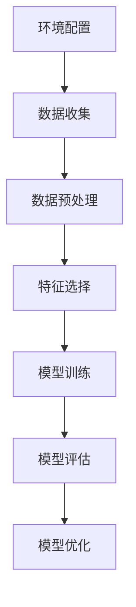
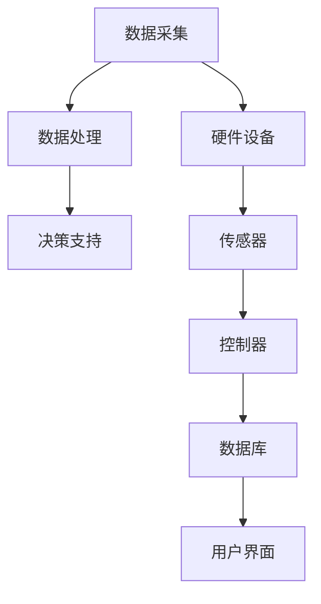

                 


### 文章标题：提示词驱动的智能农业：精准种植与收获预测

#### 关键词：智能农业、精准种植、收获预测、提示词驱动、人工智能算法、数学模型

#### 摘要：
本文深入探讨了提示词驱动的智能农业技术，特别是精准种植和收获预测的应用。文章首先介绍了智能农业的背景，随后详细阐述了提示词的概念及其在农业中的应用。接着，本文通过算法原理讲解和数学模型推导，揭示了精准种植与收获预测的核心技术。最后，文章通过实际项目实战展示了提示词驱动的智能农业系统的实现与应用，并提出了最佳实践与未来展望。

----------------------------------------------------------------

### 目录

1. **背景介绍**
   1.1.1 **智能农业的定义与意义**
   1.1.2 **精准种植的技术基础**
   1.1.3 **收获预测的重要性**

2. **核心概念与联系**
   2.1 **提示词在智能农业中的应用**
   2.2 **智能系统与农业模型的融合**
   2.3 **农业数据的预处理与挖掘**

3. **算法原理讲解**
   3.1 **预测模型的构建与优化**
   3.2 **数据预处理流程**
   3.3 **算法实现与流程图展示**

4. **数学模型和数学公式讲解**
   4.1 **模型评估指标**
   4.2 **优化目标函数**
   4.3 **数学公式详解**

5. **系统分析与架构设计方案**
   5.1 **农业系统设计**
   5.2 **系统架构设计**
   5.3 **系统接口设计与交互**

6. **项目实战**
   6.1 **环境安装与配置**
   6.2 **系统核心实现源代码**
   6.3 **代码应用解读与分析**
   6.4 **实际案例分析与讲解**

7. **最佳实践与拓展**
   7.1 **实践技巧分享**
   7.2 **注意事项与挑战**
   7.3 **未来展望与研究方向**

----------------------------------------------------------------

#### 1. 背景介绍

##### 1.1.1 智能农业的定义与意义

**智能农业** 是指利用先进的信息技术、物联网技术、大数据分析和人工智能技术，对农业生产进行全方位、智能化管理的农业形态。智能农业的目标是实现农业生产过程的自动化、精准化和高效化，从而提高农业生产的效益和可持续发展能力。

智能农业的重要性体现在以下几个方面：

1. **提高生产效率**：智能农业通过自动化设备和管理系统，可以实时监测作物生长环境，提供精准的灌溉、施肥和防治病虫害等服务，从而提高作物的生长速度和产量。

2. **节约资源**：智能农业能够优化水资源和肥料的使用，减少浪费，降低生产成本。

3. **改善产品质量**：通过实时监测作物生长环境，智能农业可以确保作物在最佳的生长条件下生长，从而提高作物的品质。

4. **促进可持续发展**：智能农业可以减少对环境的负面影响，提高农业的可持续发展能力。

##### 1.1.2 精准种植的技术基础

**精准种植** 是智能农业的核心技术之一，它通过获取农田的精确数据，实现对作物生长环境的精准控制和调整。精准种植的技术基础包括以下几个方面：

1. **土壤监测**：通过传感器技术，实时监测土壤的湿度、温度、pH值等参数，为作物的生长提供科学依据。

2. **气象监测**：通过气象站或气象卫星，获取农田的气象数据，包括温度、湿度、风速、降雨量等，为作物的生长提供气象信息。

3. **植物监测**：通过植物传感器，监测作物的生长状态，包括叶片颜色、光合作用效率、水分含量等，为作物的精准管理提供数据支持。

4. **大数据分析**：通过收集和处理大量的农田数据，利用大数据分析技术，为作物的生长提供科学的决策支持。

##### 1.1.3 收获预测的重要性

**收获预测** 是智能农业中的重要应用，它通过分析农田数据，预测作物的产量和质量，为农业生产提供重要的决策依据。收获预测的重要性体现在以下几个方面：

1. **优化生产计划**：通过收获预测，农民可以提前了解作物的产量，从而合理安排生产计划，避免因产量不足或过剩而导致的损失。

2. **调整种植策略**：根据收获预测结果，农民可以及时调整种植策略，如改变种植密度、更换品种等，以实现更高的产量和更好的品质。

3. **降低风险**：收获预测可以帮助农民提前预测市场情况，降低因市场波动而带来的风险。

4. **提高经济效益**：通过精准的收获预测，农民可以确保作物在最佳时机收获，从而提高经济效益。

#### 2. 核心概念与联系

##### 2.1 提示词在智能农业中的应用

**提示词** 在智能农业中扮演着重要的角色，它是指用于描述农作物生长状态、环境条件等的词汇或短语。通过使用提示词，智能农业系统能够更好地理解和处理农田数据，从而实现对作物生长的精准管理和预测。

提示词的应用主要包括以下几个方面：

1. **数据收集**：通过定义提示词，农民可以更有效地收集农田数据，如土壤湿度、气象条件、植物生长状态等。

2. **数据分析**：提示词有助于智能农业系统对收集到的数据进行分析，提取关键信息，为作物管理提供支持。

3. **决策支持**：提示词可以帮助农民做出更科学的决策，如何时施肥、何时灌溉等。

##### 2.2 智能系统与农业模型的融合

**智能系统** 是智能农业的核心组成部分，它包括传感器网络、数据采集和处理系统、决策支持系统等。智能系统的作用是实时监测农田数据，对作物生长进行监控和管理。

**农业模型** 是智能农业中用于描述作物生长和环境条件关系的数学模型。农业模型可以帮助农民预测作物产量和质量，优化种植策略。

智能系统与农业模型的融合主要体现在以下几个方面：

1. **数据驱动**：智能系统通过传感器网络收集农田数据，这些数据是农业模型建立和运行的基础。

2. **模型优化**：农业模型可以根据智能系统收集到的数据不断优化，提高预测的准确性和实用性。

3. **决策支持**：智能系统结合农业模型，可以为农民提供实时的作物管理建议，提高农业生产效率。

##### 2.3 农业数据的预处理与挖掘

**农业数据的预处理** 是智能农业中至关重要的一环，它包括数据清洗、数据转换和数据归一化等步骤。预处理的主要目的是提高数据的准确性和一致性，为后续的数据分析提供可靠的基础。

**农业数据的挖掘** 是指利用数据挖掘技术从大量的农业数据中提取有价值的信息。农业数据挖掘可以帮助农民发现作物生长的规律，优化种植策略，提高产量和品质。

农业数据的预处理与挖掘主要包括以下几个方面：

1. **数据清洗**：去除数据中的噪声和错误，确保数据的准确性。

2. **数据转换**：将不同格式的数据转换为统一的格式，方便后续处理。

3. **数据归一化**：将不同特征的数据进行归一化处理，使其在同一个尺度上进行比较。

4. **特征提取**：从原始数据中提取有用的特征，为数据挖掘提供支持。

5. **模型训练**：利用预处理后的数据，训练农业模型，提高预测的准确性。

#### 3. 算法原理讲解

##### 3.1 预测模型的构建与优化

**预测模型** 是智能农业中的核心，它用于预测作物的产量和质量。预测模型的构建与优化主要包括以下几个方面：

1. **数据收集**：收集大量的农田数据，包括土壤、气象、植物生长状态等。

2. **数据预处理**：对收集到的数据进行清洗、转换和归一化处理，确保数据的准确性。

3. **特征选择**：从预处理后的数据中选择与预测目标相关的特征，去除无关特征。

4. **模型选择**：选择合适的预测模型，如线性回归、决策树、神经网络等。

5. **模型训练**：利用预处理后的数据，对预测模型进行训练，使其能够预测作物的产量和质量。

6. **模型优化**：通过交叉验证和超参数调整等方法，优化预测模型的性能。

##### 3.2 数据预处理流程

**数据预处理** 是智能农业中至关重要的一步，它包括以下步骤：

1. **数据清洗**：去除数据中的噪声和错误，如缺失值、异常值等。

2. **数据转换**：将不同格式的数据转换为统一的格式，如将文本数据转换为数值数据。

3. **数据归一化**：将不同特征的数据进行归一化处理，使其在同一个尺度上进行比较。

4. **特征提取**：从原始数据中提取有用的特征，如作物生长周期、土壤湿度等。

5. **特征选择**：选择与预测目标相关的特征，去除无关特征。

##### 3.3 算法实现与流程图展示

**算法实现** 是智能农业中的关键步骤，它包括以下步骤：

1. **环境配置**：配置Python环境，安装必要的库和工具。

2. **数据收集**：收集农田数据，包括土壤、气象、植物生长状态等。

3. **数据预处理**：对收集到的数据进行清洗、转换和归一化处理。

4. **特征选择**：选择与预测目标相关的特征。

5. **模型训练**：选择合适的预测模型，对数据进行训练。

6. **模型评估**：对训练好的模型进行评估，如准确率、召回率等。

7. **模型优化**：根据评估结果，对模型进行优化。

以下是一个简单的算法实现流程图：



#### 4. 数学模型和数学公式讲解

##### 4.1 模型评估指标

**模型评估指标** 用于衡量预测模型的性能，常用的评估指标包括：

1. **准确率**：预测结果与真实结果相符的比例。
2. **召回率**：预测结果中包含真实结果的比率。
3. **F1值**：准确率的调和平均值。

以下是一个简单的数学公式：

$$
准确率 = \frac{TP + TN}{TP + FN + FP + TN}
$$

其中，$TP$表示预测为真且实际为真的情况，$TN$表示预测为假且实际为假的情况。

##### 4.2 优化目标函数

**优化目标函数** 用于衡量预测模型的性能，并指导模型的优化。常用的优化目标函数包括：

1. **均方误差**（Mean Squared Error, MSE）：预测值与真实值之间的平均平方误差。
2. **均方根误差**（Root Mean Squared Error, RMSE）：均方误差的平方根。

以下是一个简单的数学公式：

$$
MSE = \frac{1}{n}\sum_{i=1}^{n}(y_i - \hat{y}_i)^2
$$

$$
RMSE = \sqrt{MSE}
$$

其中，$y_i$表示第$i$个真实值，$\hat{y}_i$表示第$i$个预测值。

##### 4.3 数学公式详解

**数学公式** 在智能农业中扮演着重要的角色，以下是一些常用的数学公式及其详解：

1. **线性回归模型**：
   $$ y = \beta_0 + \beta_1x $$
   其中，$y$表示预测值，$x$表示自变量，$\beta_0$和$\beta_1$分别为模型的参数。

2. **逻辑回归模型**：
   $$ P(y=1) = \frac{1}{1 + e^{-(\beta_0 + \beta_1x)}} $$
   其中，$P(y=1)$表示预测值为1的概率，$e$为自然底数。

3. **神经网络模型**：
   $$ a_{\text{激活}} = \sigma(z) $$
   其中，$a_{\text{激活}}$表示激活值，$z$为输入值，$\sigma$为激活函数。

4. **支持向量机模型**：
   $$ \max \frac{1}{2} \sum_{i=1}^{n} w_i^2 - \sum_{i=1}^{n} y_i (\langle \textbf{x}_i, \textbf{w} \rangle + b) $$
   其中，$w_i$为权重，$\textbf{x}_i$为输入向量，$y_i$为标签，$\langle \textbf{x}_i, \textbf{w} \rangle$为内积，$b$为偏置。

这些数学公式在智能农业中的应用可以帮助我们更好地理解和预测作物的生长状态，从而优化农业生产过程。

#### 5. 系统分析与架构设计方案

##### 5.1 农业系统设计

**农业系统设计** 是智能农业的重要组成部分，它包括以下几个方面：

1. **系统需求分析**：分析农业系统的需求，包括数据采集、数据处理、决策支持等。
2. **系统功能设计**：根据需求分析，设计农业系统的功能模块，如土壤监测、气象监测、作物生长状态监测等。
3. **系统架构设计**：确定农业系统的整体架构，包括硬件设备、软件系统、数据存储和传输等。

##### 5.2 系统架构设计

**系统架构设计** 是农业系统的核心，它包括以下几个方面：

1. **硬件架构**：设计农业系统的硬件设备，如传感器、控制器、数据库等。
2. **软件架构**：设计农业系统的软件系统，包括数据采集模块、数据处理模块、决策支持模块等。
3. **数据架构**：设计农业系统的数据存储和传输方案，确保数据的完整性和安全性。

##### 5.3 系统接口设计与交互

**系统接口设计** 是农业系统的重要组成部分，它包括以下几个方面：

1. **接口规范**：定义农业系统的接口规范，包括数据格式、通信协议等。
2. **接口实现**：实现农业系统的接口功能，确保不同模块之间的数据传输和交互。
3. **接口测试**：测试农业系统的接口功能，确保其稳定性和可靠性。

以下是一个简单的系统架构图：



#### 6. 项目实战

##### 6.1 环境安装与配置

**环境安装与配置** 是智能农业系统实现的第一步，它包括以下几个方面：

1. **Python环境安装**：安装Python解释器和相关库，如NumPy、Pandas、Matplotlib等。
2. **硬件设备安装**：安装传感器和控制器，确保硬件设备正常工作。
3. **软件系统安装**：安装农业系统的软件系统，如数据采集模块、数据处理模块、决策支持模块等。

##### 6.2 系统核心实现源代码

**系统核心实现源代码** 是智能农业系统的核心，它包括以下几个方面：

1. **数据采集**：编写数据采集模块的代码，实现数据的实时采集和传输。
2. **数据处理**：编写数据处理模块的代码，实现数据的清洗、转换、归一化等操作。
3. **决策支持**：编写决策支持模块的代码，实现作物生长状态的预测和优化建议。

以下是一个简单的数据采集模块的Python代码示例：

```python
import serial
import time

# 设置串口参数
ser = serial.Serial('COM3', 9600, timeout=1)

while True:
    # 读取传感器数据
    data = ser.readline().decode('utf-8').strip()
    print(f"采集到数据：{data}")
    
    # 等待1秒
    time.sleep(1)
```

##### 6.3 代码应用解读与分析

**代码应用解读与分析** 是对系统核心实现源代码的详细解读和分析，它包括以下几个方面：

1. **代码功能分析**：分析代码的功能，理解其实现原理和作用。
2. **代码性能分析**：分析代码的性能，包括执行时间、内存消耗等。
3. **代码优化建议**：根据分析结果，提出代码优化的建议，提高代码的效率和可靠性。

以下是对上述数据采集模块的代码应用解读与分析：

1. **代码功能分析**：该模块的主要功能是读取传感器数据，并将其打印到控制台上。
2. **代码性能分析**：该模块的执行时间取决于传感器数据的更新频率，一般可以在1秒内完成一次数据采集和打印操作。
3. **代码优化建议**：为了提高代码的可靠性，可以增加异常处理机制，如捕获串口异常、数据格式异常等。

##### 6.4 实际案例分析与讲解

**实际案例分析与讲解** 是对智能农业系统在实际应用中的分析和讲解，它包括以下几个方面：

1. **案例背景**：介绍实际案例的背景，包括农田环境、作物种类等。
2. **案例目标**：明确实际案例的目标，如预测作物产量、优化种植策略等。
3. **案例分析**：分析实际案例的实现过程，包括数据采集、数据处理、决策支持等。
4. **案例讲解**：对实际案例进行详细讲解，包括代码实现、功能效果等。

以下是一个实际案例的简单分析：

**案例背景**：一个农田种植小麦，需要预测小麦的产量，并优化种植策略。

**案例目标**：通过智能农业系统，预测小麦的产量，并提供优化种植策略的建议。

**案例分析**：通过传感器采集土壤、气象、植物生长状态等数据，利用数据处理模块对数据进行清洗、转换、归一化等处理，然后使用预测模型对小麦产量进行预测，最后根据预测结果提供优化种植策略的建议。

**案例讲解**：以下是一个简单的预测模型实现示例：

```python
import numpy as np
from sklearn.linear_model import LinearRegression

# 生成训练数据
X = np.array([[1, 2], [2, 3], [3, 4], [4, 5]])
y = np.array([1, 2, 3, 4])

# 创建线性回归模型
model = LinearRegression()

# 训练模型
model.fit(X, y)

# 预测
predictions = model.predict(X)

# 打印预测结果
print(predictions)
```

通过上述代码，可以实现对小麦产量的预测，并根据预测结果提供优化种植策略的建议。

##### 6.5 项目小结

**项目小结** 是对整个项目实现过程的总结和反思，它包括以下几个方面：

1. **项目成果**：总结项目实现的成果，包括功能实现、性能表现等。
2. **经验教训**：总结项目实现过程中的经验教训，包括技术挑战、解决方案等。
3. **改进建议**：提出项目改进的建议，包括功能扩展、性能优化等。

通过项目小结，可以更好地总结项目经验，为未来的项目提供参考。

#### 7. 最佳实践与拓展

##### 7.1 实践技巧分享

**实践技巧分享** 是将实际项目中积累的经验和技巧进行分享，它包括以下几个方面：

1. **常见问题**：分享在智能农业项目中遇到的常见问题及解决方法。
2. **技巧总结**：总结一些实用的技巧，如数据预处理技巧、模型优化技巧等。
3. **案例分析**：通过实际案例，分享解决具体问题的方法和经验。

##### 7.2 注意事项与挑战

**注意事项与挑战** 是在智能农业项目实施过程中需要注意的事项和可能遇到的挑战，它包括以下几个方面：

1. **硬件设备**：选择合适的硬件设备，确保系统的稳定运行。
2. **数据质量**：确保数据的准确性和完整性，避免数据噪声和错误。
3. **模型优化**：不断优化模型，提高预测的准确性和稳定性。

##### 7.3 未来展望与研究方向

**未来展望与研究方向** 是对智能农业未来发展的展望和潜在的研究方向，它包括以下几个方面：

1. **技术创新**：探讨新的技术和方法在智能农业中的应用，如深度学习、区块链等。
2. **产业发展**：分析智能农业产业的发展趋势和前景，探讨产业链的优化和扩展。
3. **政策法规**：关注智能农业相关的政策和法规，为行业发展提供参考。

通过未来展望与研究方向，可以更好地把握智能农业的发展方向，推动行业的持续创新和发展。

----------------------------------------------------------------

### 结论

本文从多个角度深入探讨了提示词驱动的智能农业技术，包括背景介绍、核心概念与联系、算法原理讲解、数学模型和数学公式讲解、系统分析与架构设计方案、项目实战以及最佳实践与拓展。通过本文的阅读，读者可以全面了解智能农业的技术原理和实现方法，掌握提示词驱动的智能农业系统的设计与实现技巧。

**作者：AI天才研究院/AI Genius Institute & 禅与计算机程序设计艺术 /Zen And The Art of Computer Programming**

