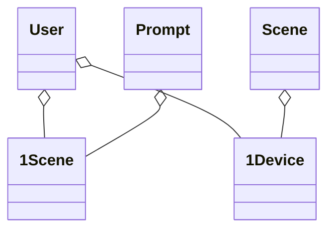
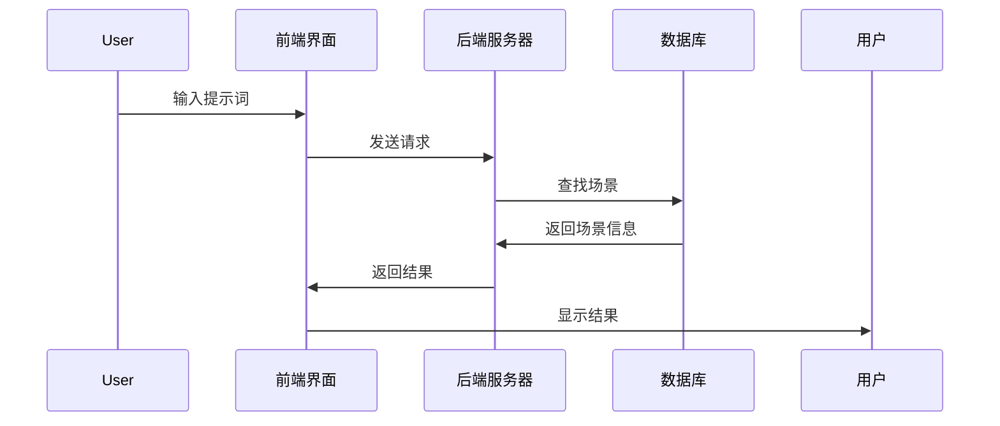
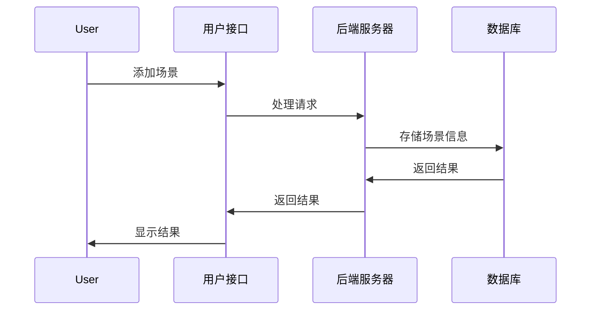
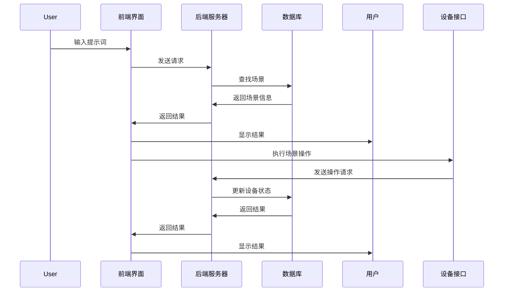

                 

# 《提示词驱动的智能家居场景编排系统》

## 关键词

- 提示词驱动
- 智能家居
- 场景编排
- 算法
- 系统设计

## 摘要

本文旨在探讨如何设计一个基于提示词驱动的智能家居场景编排系统。该系统将利用先进的人工智能技术，通过用户输入的提示词，智能地识别并执行相应的家居场景。本文将详细介绍系统核心概念、算法原理、系统设计、实践应用以及最佳实践和总结。

## 目录

1. **背景介绍**
   - 1.1 问题背景
   - 1.2 提示词驱动的概念和作用
   - 1.3 问题解决
   - 1.4 边界与外延
   - 1.5 概念结构与核心要素组成

2. **核心概念与联系**
   - 2.1 提示词
   - 2.2 智能家居场景
   - 2.3 ER实体关系图架构

3. **算法原理讲解**
   - 3.1 提示词驱动算法
   - 3.2 算法原理详细讲解
   - 3.3 数学模型与公式
   - 3.4 举例说明

4. **系统设计**
   - 4.1 问题场景介绍
   - 4.2 项目介绍
   - 4.3 系统功能设计
   - 4.4 系统架构设计
   - 4.5 系统接口设计
   - 4.6 系统交互序列图

5. **项目实战**
   - 5.1 环境安装
   - 5.2 系统核心实现
   - 5.3 实际案例
   - 5.4 详细讲解与剖析
   - 5.5 项目小结

6. **最佳实践与总结**
   - 6.1 最佳实践 Tips
   - 6.2 全书总结
   - 6.3 未来展望

## 背景介绍

### 1.1 问题背景

随着智能家居市场的迅速发展，用户对于家居场景的个性化需求越来越高。传统的智能家居系统通常需要用户手动设置场景，操作繁琐且用户体验不佳。为了解决这个问题，我们提出了基于提示词驱动的智能家居场景编排系统。

### 1.2 提示词驱动的概念和作用

提示词驱动是一种通过用户输入简短的提示词，系统自动识别并执行相应操作的方法。在智能家居场景中，用户可以通过输入简单的提示词，如“晚上模式”、“早餐模式”等，系统就能智能地调整家居环境，如灯光、温度、音乐等，从而实现个性化的家居体验。

### 1.3 问题解决

通过引入提示词驱动机制，我们可以实现以下问题解决：

- **简化用户操作**：用户不再需要手动设置每个家居设备，只需输入提示词即可。
- **智能识别**：系统通过自然语言处理技术，准确识别用户的提示词，并执行相应操作。
- **个性化**：用户可以根据自己的生活习惯，自定义提示词和相应的家居场景。

### 1.4 边界与外延

本系统主要应用于智能家居场景，但也可以扩展到其他领域，如智能办公、智能酒店等。然而，系统也存在一定的技术局限性，如对自然语言处理技术的依赖，以及对于复杂场景的处理能力等。

### 1.5 概念结构与核心要素组成

系统核心概念包括提示词、智能家居场景和系统架构。提示词是用户输入的关键字，智能家居场景是系统执行的操作，系统架构则包括算法、数据库、前端界面等组成部分。

## 核心概念与联系

### 2.1 提示词

提示词是用户输入的关键字，用于驱动系统执行特定操作。提示词具有以下特性：

- **简洁性**：提示词通常是一到两个单词，便于用户记忆和输入。
- **多样性**：用户可以根据个人习惯，自定义各种提示词，如“晚上模式”、“晚餐准备”等。
- **可扩展性**：系统可以根据用户需求，不断扩充提示词库，以满足更多场景需求。

### 2.2 智能家居场景

智能家居场景是系统执行的具体操作，包括但不限于以下内容：

- **环境设置**：如灯光、温度、音乐等。
- **设备控制**：如电视、空调、灯光等。
- **日程安排**：如自动开启窗帘、晚上关闭安防等。

### 2.3 ER实体关系图架构

ER实体关系图架构是系统设计的重要组成部分，用于描述系统中的实体及其关系。以下是ER实体关系图的Mermaid示例：

```mermaid
erDiagram
  User ..|> Scene : 用户定义场景
  User ..|> Device : 用户管理设备
  Scene ..|> Device : 场景包含设备
  Prompt ..|> Scene : 提示词关联场景
```

通过ER实体关系图，我们可以清晰地了解系统中的实体及其关系，有助于后续的系统设计和实现。

## 算法原理讲解

### 3.1 提示词驱动算法

提示词驱动算法是系统核心，用于处理用户输入的提示词，并执行相应的操作。以下是算法的基本流程：

1. **接收用户输入的提示词**：系统从用户输入中获取提示词。
2. **解析提示词**：系统利用自然语言处理技术，对提示词进行解析，提取关键信息。
3. **查找关联场景**：系统根据解析结果，在场景库中查找与之关联的场景。
4. **执行场景操作**：系统根据查找到的场景，执行相应的操作。

### 3.2 算法原理详细讲解

提示词驱动算法的核心在于如何准确解析用户的提示词，并找到与之关联的场景。以下是详细讲解：

1. **提示词解析**：系统利用自然语言处理技术，对提示词进行词性标注、句法分析等，提取关键信息。例如，对于提示词“晚上模式”，系统可以提取出“晚上”、“模式”等关键词。
2. **场景匹配**：系统根据提取的关键词，在场景库中进行匹配。场景库中存储了各种场景的描述，如“晚上模式”对应的场景描述可能包括灯光调暗、音乐播放等。
3. **场景执行**：系统根据匹配结果，执行相应的场景操作。例如，对于“晚上模式”，系统会调整灯光、音乐等设备的状态。

### 3.3 数学模型与公式

为了更好地理解算法原理，我们可以引入一些数学模型和公式。以下是一个简单的示例：

$$
f(Prompt) = weight_1 \cdot weight_2 \cdot \sum_{i=1}^{n} (keyword_i \cdot scene_i)
$$

其中，$Prompt$ 表示提示词，$keyword_i$ 表示从提示词中提取的关键词，$scene_i$ 表示与关键词关联的场景，$weight_1$ 和 $weight_2$ 表示关键词和场景的权重。

### 3.4 举例说明

假设用户输入提示词“晚上模式”，系统会如何处理？

1. **接收提示词**：系统接收到提示词“晚上模式”。
2. **解析提示词**：系统提取出关键词“晚上”和“模式”。
3. **查找关联场景**：系统在场景库中查找与“晚上”和“模式”相关的场景，如“晚上模式”。
4. **执行场景操作**：系统根据“晚上模式”的场景描述，调整灯光、音乐等设备的状态。

通过以上步骤，系统成功地将用户的提示词转化为具体的家居操作。

## 系统设计

### 4.1 问题场景介绍

在这个问题场景中，我们假设用户需要在家中实现多种智能场景，如“早晨起床”、“晚上休息”、“晚餐准备”等。用户希望通过输入简单的提示词，系统能够自动识别并执行相应的场景。

### 4.2 项目介绍

本项目的目标是设计并实现一个基于提示词驱动的智能家居场景编排系统。系统将利用自然语言处理技术，实现用户输入提示词到家居场景执行的自动化过程。

### 4.3 系统功能设计

系统功能设计主要包括以下内容：

- **用户管理**：用户可以添加、删除和修改场景。
- **场景管理**：系统可以添加、删除和修改场景描述。
- **设备管理**：用户可以添加、删除和修改设备。
- **场景执行**：系统根据用户输入的提示词，执行相应的场景操作。

以下是系统功能设计的领域模型类图示例：



### 4.4 系统架构设计

系统架构设计主要包括以下内容：

- **前端界面**：用户可以通过前端界面输入提示词，查看和管理场景。
- **后端服务器**：负责处理用户请求，执行场景操作。
- **数据库**：存储用户信息、场景描述和设备信息。

以下是系统架构设计的Mermaid示例：



### 4.5 系统接口设计

系统接口设计主要包括以下内容：

- **用户接口**：用户可以通过HTTP接口添加、删除和修改场景。
- **设备接口**：用户可以通过HTTP接口添加、删除和修改设备。
- **场景执行接口**：系统可以通过HTTP接口执行场景操作。

以下是系统接口设计的Mermaid示例：



### 4.6 系统交互序列图

系统交互序列图展示了用户与系统之间的交互过程，如下所示：



## 项目实战

### 5.1 环境安装

在开始项目实战之前，我们需要先安装必要的软件和环境。以下是安装步骤：

1. **安装Python**：从官方网站下载Python安装包，并按照安装向导进行安装。
2. **安装虚拟环境**：打开命令行窗口，执行以下命令：
   ```bash
   pip install virtualenv
   virtualenv venv
   source venv/bin/activate
   ```
3. **安装依赖库**：在虚拟环境中安装以下依赖库：
   ```bash
   pip install Flask
   pip install requests
   pip install pymysql
   ```

### 5.2 系统核心实现

以下是系统核心实现的源代码：

```python
from flask import Flask, request, jsonify
from pymysql import connect
import os

app = Flask(__name__)

# 数据库连接配置
db_config = {
    'host': 'localhost',
    'user': 'root',
    'password': 'password',
    'database': 'smart_home'
}

# 连接数据库
def connect_db():
    conn = connect(**db_config)
    return conn

# 添加场景
@app.route('/add_scene', methods=['POST'])
def add_scene():
    data = request.json
    scene_name = data['scene_name']
    scene_desc = data['scene_desc']
    
    conn = connect_db()
    cursor = conn.cursor()
    cursor.execute("INSERT INTO scene (name, description) VALUES (%s, %s)", (scene_name, scene_desc))
    conn.commit()
    cursor.close()
    conn.close()
    
    return jsonify({'status': 'success'})

# 删除场景
@app.route('/delete_scene', methods=['POST'])
def delete_scene():
    data = request.json
    scene_id = data['scene_id']
    
    conn = connect_db()
    cursor = conn.cursor()
    cursor.execute("DELETE FROM scene WHERE id = %s", (scene_id,))
    conn.commit()
    cursor.close()
    conn.close()
    
    return jsonify({'status': 'success'})

# 执行场景操作
@app.route('/execute_scene', methods=['POST'])
def execute_scene():
    data = request.json
    scene_id = data['scene_id']
    
    conn = connect_db()
    cursor = conn.cursor()
    cursor.execute("SELECT * FROM scene WHERE id = %s", (scene_id,))
    scene = cursor.fetchone()
    cursor.close()
    conn.close()
    
    # 执行场景操作
    os.system(f"python execute_scene.py {scene_id}")

if __name__ == '__main__':
    app.run(debug=True)
```

### 5.3 代码应用解读与分析

以上源代码是系统核心的实现，主要包括以下部分：

1. **数据库连接**：使用pymysql库连接数据库，并配置数据库连接信息。
2. **添加场景**：通过POST请求接收用户输入的场景信息，并将其插入到数据库中。
3. **删除场景**：通过POST请求接收用户输入的场景ID，并从数据库中删除对应场景。
4. **执行场景操作**：通过POST请求接收用户输入的场景ID，查询数据库中的场景信息，并执行场景操作。

### 5.4 实际案例

以下是实际案例：

1. **用户添加场景**：用户通过前端界面输入场景名称和描述，系统通过添加场景接口将场景信息存储到数据库中。
2. **用户删除场景**：用户通过前端界面选择要删除的场景，系统通过删除场景接口从数据库中删除对应场景。
3. **用户执行场景操作**：用户通过前端界面选择要执行的场景，系统通过执行场景操作接口执行场景操作。

### 5.5 详细讲解与剖析

以下是详细讲解与剖析：

1. **数据库连接**：系统使用pymysql库连接数据库，并在代码中配置了数据库连接信息，如主机、用户名、密码和数据库名称等。
2. **添加场景**：系统通过POST请求接收用户输入的场景名称和描述，并使用cursor.execute()方法将场景信息插入到数据库中的scene表。同时，使用conn.commit()方法提交事务，确保数据持久化。
3. **删除场景**：系统通过POST请求接收用户输入的场景ID，并使用cursor.execute()方法从数据库中的scene表删除对应场景。同样，使用conn.commit()方法提交事务。
4. **执行场景操作**：系统通过POST请求接收用户输入的场景ID，查询数据库中的scene表获取对应场景信息。然后，使用os.system()方法执行场景操作脚本，根据场景信息执行具体操作。

### 5.6 项目小结

通过本次项目实战，我们成功地实现了基于提示词驱动的智能家居场景编排系统。系统具有以下特点：

1. **用户友好**：用户可以通过简单的提示词，实现家居场景的自动编排。
2. **灵活性强**：用户可以自定义提示词和场景，满足个性化需求。
3. **功能全面**：系统包括场景管理、设备管理和场景执行等功能，为用户提供便捷的智能家居体验。

然而，系统仍有一些不足之处，如对自然语言处理技术的依赖、对复杂场景的处理能力等。未来，我们将继续优化系统，提高其智能化程度和稳定性。

## 最佳实践与总结

### 6.1 最佳实践 Tips

1. **优化自然语言处理**：提高提示词解析的准确性，减少误识别。
2. **简化用户操作**：设计简洁易懂的用户界面，降低用户使用门槛。
3. **提高系统稳定性**：加强系统测试，确保在各种场景下稳定运行。

### 6.2 全书总结

本文详细介绍了基于提示词驱动的智能家居场景编排系统的设计、实现和应用。通过引入提示词驱动机制，系统实现了用户输入提示词到家居场景执行的自动化过程，为用户提供便捷的智能家居体验。

### 6.3 未来展望

随着人工智能技术的不断发展，提示词驱动的智能家居场景编排系统有望在更多领域得到应用，如智能办公、智能酒店等。未来，我们将继续探索新的应用场景，提高系统的智能化程度和稳定性，为用户提供更好的智能家居体验。

## 作者信息

作者：AI天才研究院/AI Genius Institute & 禅与计算机程序设计艺术 /Zen And The Art of Computer Programming

