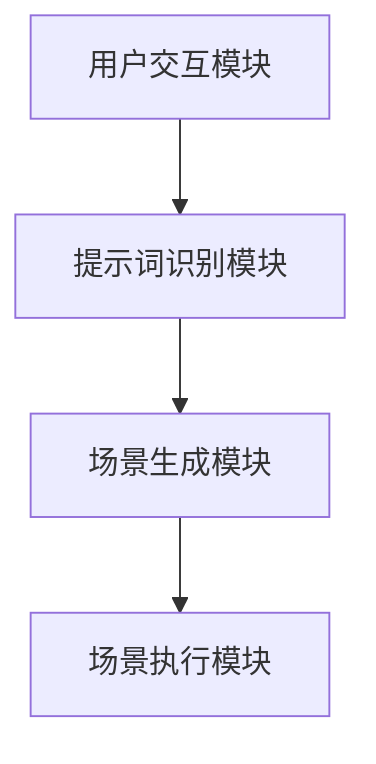
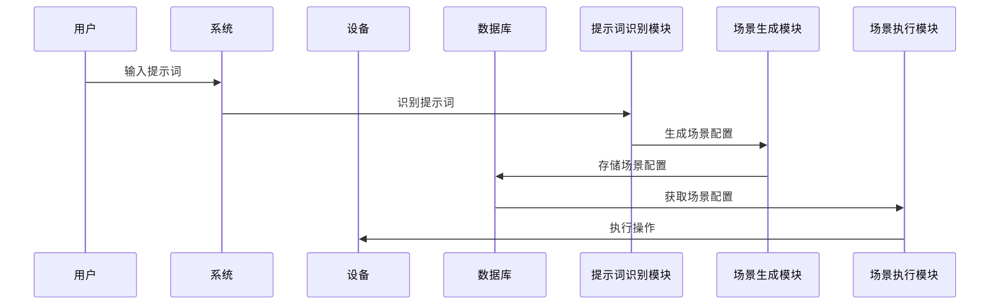
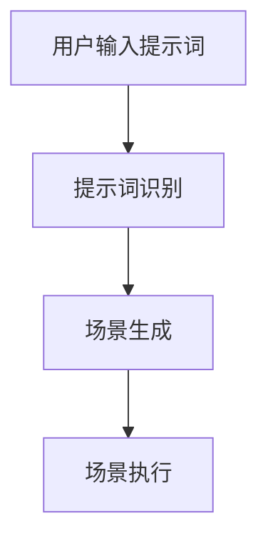
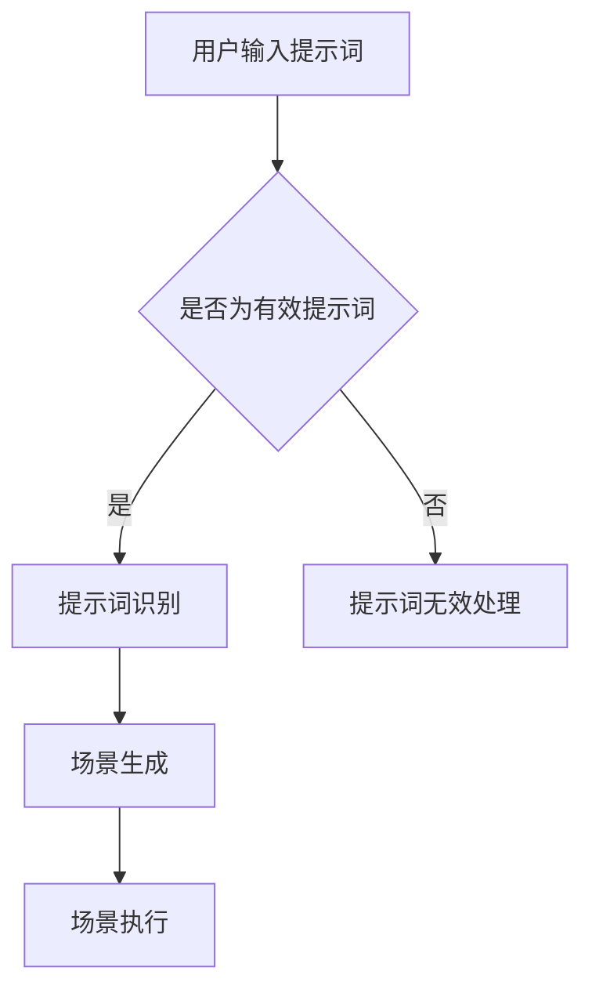
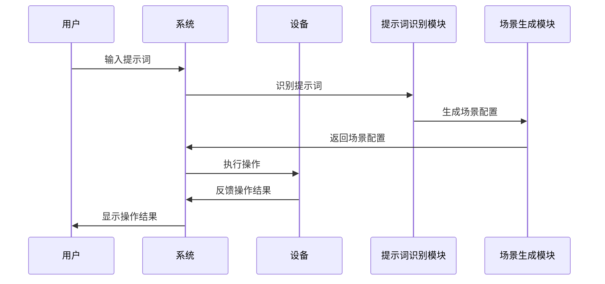

                 


### 第一部分：引言与背景

#### 第1章：引言

**1.1.1 问题背景**

随着物联网技术的发展，智能家居已经逐渐成为现代家庭生活的一部分。人们对于智能家居的期望不仅仅停留在简单的设备连接和控制，更希望实现真正的智能化、个性化的居住体验。然而，如何设计出满足用户需求、易于使用且功能强大的智能家居系统，成为了当前亟需解决的问题。

**1.1.2 问题描述**

智能家居系统的设计涉及到多个层面，包括设备硬件、软件平台、网络通信、用户交互等。在现有设计中，大多数智能家居系统的场景设计缺乏灵活性，难以适应多样化的用户需求。例如，当用户想要设置一个“晚上回家自动打开灯光”的场景时，系统往往需要用户手动操作或通过预设的规则来实现，而无法根据用户的实际需求和习惯自动调整。

**1.1.3 问题解决**

本文旨在探讨一种基于提示词驱动的智能家居场景设计方法，通过用户输入简单的提示词，系统能够自动识别并生成相应的场景配置。这种方法不仅能够提高用户的体验，还能降低系统设计和维护的复杂性。

**1.1.4 边界与外延**

本文的研究将聚焦于室内智能家居场景，涉及到的设备主要包括灯光、温度控制、家电设备等。同时，本文将探讨提示词驱动的智能家居场景设计的边界，包括提示词的识别范围、场景生成的灵活性等。

**1.1.5 核心概念与联系**

在本文中，我们将详细介绍以下核心概念：
- **提示词**：用户输入的文字或语音指令，用于触发系统场景。
- **智能家居场景**：由一组设备或功能组合而成的自动化场景。
- **场景生成算法**：根据提示词生成相应场景配置的算法。

这些概念之间的联系在于，提示词是用户与系统交互的接口，场景生成算法是实现智能化场景设计的核心。

#### 第2章：核心概念与原理

**2.1.1 提示词驱动的概念**

提示词驱动（Prompt-Driven）设计是一种基于用户输入指令进行交互和操作的设计理念。在智能家居场景中，提示词驱动意味着用户可以通过简短的文字或语音指令，实现对智能家居系统的控制和场景配置。

**2.1.2 智能家居场景的概念**

智能家居场景（Smart Home Scene）是指由一组设备或功能组成的自动化场景，能够根据用户的指令或习惯自动执行特定的操作。例如，用户可以通过设置一个“早上起床”的场景，自动开启灯光、调节温度等。

**2.1.3 提示词驱动的智能家居场景设计原理**

提示词驱动的智能家居场景设计原理主要包括以下几个方面：
1. **提示词识别**：系统首先需要能够识别用户输入的提示词，并将其转换为可操作的指令。
2. **场景生成**：根据识别到的提示词，系统生成相应的场景配置。
3. **场景执行**：系统根据生成的场景配置，自动执行相应的操作。

#### 第3章：智能家居场景设计流程

**3.1.1 设计流程概述**

智能家居场景设计流程包括以下几个步骤：
1. **需求分析**：了解用户需求，确定需要实现的智能家居场景。
2. **提示词收集与分析**：收集用户常用的提示词，分析其含义和适用场景。
3. **场景设计**：根据提示词生成相应的场景配置。
4. **场景实现与优化**：将设计好的场景实现并不断优化，以满足用户需求。

**3.1.2 提示词收集与分析**

在智能家居场景设计中，提示词的收集与分析至关重要。具体步骤如下：
1. **用户访谈**：通过与用户交流，了解他们常用的指令和需求。
2. **数据分析**：分析用户历史行为数据，提取常见的操作指令。
3. **提示词筛选**：根据用户需求和数据分析结果，筛选出常用的提示词。

**3.1.3 场景设计原则与方法**

在场景设计过程中，需要遵循以下原则：
1. **灵活性**：场景设计应具备足够的灵活性，能够适应不同用户的需求。
2. **易用性**：场景设计应简单直观，易于用户理解和操作。

场景设计的方法主要包括：
1. **基于规则的场景设计**：根据预设的规则，生成场景配置。
2. **基于机器学习的场景设计**：通过机器学习算法，自动识别和生成场景配置。

#### 第4章：提示词驱动的智能家居系统架构

**4.1.1 系统架构概述**

提示词驱动的智能家居系统架构主要包括以下几个模块：
1. **用户交互模块**：负责接收用户输入的提示词。
2. **提示词识别模块**：识别并处理用户输入的提示词。
3. **场景生成模块**：根据提示词生成相应的场景配置。
4. **场景执行模块**：根据场景配置执行相应的操作。

**4.1.2 系统功能模块设计**

系统功能模块设计如下：
1. **用户交互模块**：提供文字和语音输入接口，方便用户操作。
2. **提示词识别模块**：采用自然语言处理技术，识别用户输入的提示词。
3. **场景生成模块**：根据提示词生成相应的场景配置，并存储在数据库中。
4. **场景执行模块**：根据场景配置，自动执行相应的操作，如控制设备开关、调整温度等。

**4.1.3 系统架构图**



**4.1.4 系统接口设计**

系统接口设计主要包括以下几个方面：
1. **用户接口**：提供简洁易用的用户操作界面。
2. **设备接口**：与智能家居设备进行通信，实现设备控制。
3. **数据库接口**：存储和管理场景配置数据。



### 第二部分：核心概念与原理

#### 第5章：算法原理与实现

**5.1.1 提示词识别算法**

提示词识别算法是智能家居系统的核心，它负责识别并理解用户输入的提示词。具体算法如下：

```python
def recognize_prompt(prompt):
    # 对提示词进行预处理
    processed_prompt = preprocess_prompt(prompt)
    
    # 使用自然语言处理技术识别提示词
    recognized_prompt = nlp(processed_prompt)
    
    # 根据识别结果返回提示词类型
    return get_prompt_type(recognized_prompt)
```

**5.1.2 场景生成算法**

场景生成算法根据识别到的提示词，生成相应的场景配置。具体算法如下：

```python
def generate_scene(prompt_type):
    # 根据提示词类型查询场景配置
    scene_config = get_scene_config(prompt_type)
    
    # 如果场景配置不存在，生成默认场景配置
    if scene_config is None:
        scene_config = create_default_scene_config(prompt_type)
        
    # 返回场景配置
    return scene_config
```

**5.1.3 提示词驱动的智能家居场景设计算法**

提示词驱动的智能家居场景设计算法主要包括以下几个步骤：

1. **用户输入提示词**：用户通过文字或语音输入提示词。
2. **提示词识别**：系统识别用户输入的提示词，并确定其类型。
3. **场景生成**：根据提示词类型，生成相应的场景配置。
4. **场景执行**：系统根据场景配置，自动执行相应的操作。

算法流程图如下：



**5.1.4 算法流程图**



### 第三部分：数学模型与公式详解

#### 第6章：数学模型与公式详解

**6.1.1 提示词识别数学模型**

提示词识别过程可以看作是一个分类问题，其数学模型可以表示为：

$$
P(C|w) = \frac{P(w|C)P(C)}{P(w)}
$$

其中：
- \( P(C|w) \) 是在给定提示词 \( w \) 的情况下，场景 \( C \) 发生的概率。
- \( P(w|C) \) 是在场景 \( C \) 发生的情况下，提示词 \( w \) 出现的概率。
- \( P(C) \) 是场景 \( C \) 发生的概率。
- \( P(w) \) 是提示词 \( w \) 出现的概率。

**6.1.2 场景生成数学模型**

场景生成过程可以看作是一个决策问题，其数学模型可以表示为：

$$
\max_{s} \sum_{c} P(c|s) \cdot \text{Utility}(c)
$$

其中：
- \( s \) 是场景生成的策略。
- \( c \) 是可能的场景。
- \( P(c|s) \) 是在策略 \( s \) 下，场景 \( c \) 发生的概率。
- \( \text{Utility}(c) \) 是场景 \( c \) 的效用值。

**6.1.3 提示词驱动的智能家居场景设计数学模型**

提示词驱动的智能家居场景设计数学模型结合了提示词识别和场景生成的数学模型，可以表示为：

$$
\max_{w, s} \sum_{c} P(c|s) \cdot \text{Utility}(c) \cdot P(w|c)
$$

其中：
- \( w \) 是用户输入的提示词。
- \( s \) 是场景生成的策略。

**6.1.4 数学公式与解释**

1. **提示词识别概率公式**：

$$
P(C|w) = \frac{P(w|C)P(C)}{P(w)}
$$

该公式表示，在给定提示词 \( w \) 的情况下，场景 \( C \) 发生的条件概率。

2. **场景生成效用值公式**：

$$
\text{Utility}(c) = \sum_{i} w_i \cdot x_i
$$

其中：
- \( w_i \) 是场景 \( c \) 中第 \( i \) 个设备的权重。
- \( x_i \) 是第 \( i \) 个设备的状态（例如，开启或关闭）。

3. **场景生成概率公式**：

$$
P(c|s) = \prod_{i} P(e_i|s)
$$

其中：
- \( s \) 是场景生成的策略。
- \( e_i \) 是场景 \( c \) 中第 \( i \) 个设备的执行状态。

### 第四部分：系统分析与架构设计

#### 第7章：系统分析与架构设计

**7.1.1 问题描述与目标**

在智能家居系统中，用户希望通过简单、自然的交互方式，实现对家居设备的智能控制。系统需要能够根据用户输入的提示词，自动识别并执行相应的操作。本文的目标是设计一个高效、可靠的提示词驱动智能家居系统，实现以下功能：
1. 识别并理解用户的提示词。
2. 根据提示词生成相应的场景配置。
3. 自动执行场景配置中的操作。

**7.1.2 系统功能设计**

系统功能设计主要包括以下方面：
1. **用户交互功能**：提供文字和语音输入接口，允许用户输入提示词。
2. **提示词识别功能**：使用自然语言处理技术，识别用户输入的提示词。
3. **场景生成功能**：根据提示词生成相应的场景配置。
4. **场景执行功能**：根据场景配置，自动执行相应的操作。

**7.1.3 系统架构设计**

系统架构设计采用模块化设计，确保系统的高扩展性和易维护性。系统架构主要包括以下模块：

1. **用户交互模块**：负责接收用户输入的提示词，并通过图形用户界面（GUI）或语音输入接口进行交互。
2. **提示词识别模块**：使用自然语言处理（NLP）技术，识别用户输入的提示词，并确定其含义。
3. **场景生成模块**：根据提示词识别结果，生成相应的场景配置。
4. **场景执行模块**：根据场景配置，自动执行相应的操作，如控制设备开关、调节温度等。

**7.1.4 系统接口设计**

系统接口设计主要包括以下几个方面：

1. **用户接口**：提供简洁易用的用户操作界面，允许用户输入提示词和查看系统状态。
2. **设备接口**：与智能家居设备进行通信，实现对设备的控制。
3. **数据库接口**：存储和管理场景配置数据，以及用户历史操作记录。

**7.1.5 系统交互设计**

系统交互设计采用事件驱动模型，用户操作（如输入提示词）触发事件，系统根据事件进行响应。具体交互流程如下：

1. **用户输入提示词**：用户通过用户界面输入提示词。
2. **提示词识别**：系统接收用户输入，并使用自然语言处理技术进行提示词识别。
3. **场景生成**：根据识别结果，系统生成相应的场景配置。
4. **场景执行**：系统根据场景配置，自动执行相应的操作，如控制设备开关、调整温度等。
5. **反馈**：系统将操作结果反馈给用户，以确认操作成功。

系统交互序列图如下：



### 第五部分：项目实战

#### 第8章：项目实战

**8.1.1 环境安装与配置**

为了实现提示词驱动的智能家居系统，首先需要在开发环境中安装所需的软件和库。以下是安装与配置的步骤：

1. **安装Python环境**：确保Python版本为3.8及以上，可以在Python官方网站下载安装包。

2. **安装自然语言处理库**：在Python环境中安装自然语言处理库，如spaCy和NLTK。

   ```bash
   pip install spacy
   pip install nltk
   ```

3. **安装数据库**：选择合适的数据库系统，如MySQL或PostgreSQL，并安装相关驱动。

4. **配置数据库**：创建数据库和用户，并配置相应的权限。

5. **安装智能家居设备**：安装实际使用的智能家居设备，如智能灯泡、智能空调等。

**8.1.2 系统核心实现**

系统核心实现包括以下几个关键部分：

1. **用户交互模块**：实现用户输入提示词的界面，可以使用GUI库，如Tkinter或PyQt。

2. **提示词识别模块**：使用自然语言处理技术，识别用户输入的提示词。以下是一个简单的示例：

   ```python
   import spacy

   nlp = spacy.load("en_core_web_sm")

   def recognize_prompt(prompt):
       doc = nlp(prompt)
       entities = [(ent.label_, ent.text) for ent in doc.ents]
       return entities
   ```

3. **场景生成模块**：根据识别到的提示词，生成相应的场景配置。以下是一个简单的示例：

   ```python
   def generate_scene(entities):
       if "turn_on_light" in [ent[1] for ent in entities]:
           return {"light": "on"}
       elif "turn_off_light" in [ent[1] for ent in entities]:
           return {"light": "off"}
       else:
           return None
   ```

4. **场景执行模块**：根据场景配置，自动执行相应的操作。以下是一个简单的示例：

   ```python
   def execute_scene(scene):
       if "light" in scene:
           if scene["light"] == "on":
               turn_on_light()
           else:
               turn_off_light()
   ```

**8.1.3 代码应用解读与分析**

以下是系统核心实现代码的解读与分析：

1. **用户交互模块**：使用Tkinter库创建一个简单的GUI界面，允许用户输入提示词。

   ```python
   import tkinter as tk

   def on_submit():
       prompt = entry.get()
       entities = recognize_prompt(prompt)
       scene = generate_scene(entities)
       if scene:
           execute_scene(scene)
           label.config(text="Scene executed successfully!")

   root = tk.Tk()
   root.title("Smart Home System")

   label = tk.Label(root, text="")
   label.pack()

   entry = tk.Entry(root)
   entry.pack()

   submit_button = tk.Button(root, text="Submit", command=on_submit)
   submit_button.pack()

   root.mainloop()
   ```

2. **提示词识别模块**：使用spaCy库进行自然语言处理，识别用户输入的提示词。

   ```python
   import spacy

   nlp = spacy.load("en_core_web_sm")

   def recognize_prompt(prompt):
       doc = nlp(prompt)
       entities = [(ent.label_, ent.text) for ent in doc.ents]
       return entities
   ```

3. **场景生成模块**：根据识别到的提示词，生成相应的场景配置。

   ```python
   def generate_scene(entities):
       if "turn_on_light" in [ent[1] for ent in entities]:
           return {"light": "on"}
       elif "turn_off_light" in [ent[1] for ent in entities]:
           return {"light": "off"}
       else:
           return None
   ```

4. **场景执行模块**：根据场景配置，自动执行相应的操作。

   ```python
   def execute_scene(scene):
       if "light" in scene:
           if scene["light"] == "on":
               turn_on_light()
           else:
               turn_off_light()
   ```

**8.1.4 实际案例分析与讲解**

以下是一个实际案例的分析与讲解：

假设用户输入提示词：“turn on the light”，系统将执行以下操作：

1. **用户交互模块**：用户在GUI界面中输入提示词“turn on the light”，并点击提交按钮。

2. **提示词识别模块**：系统使用spaCy库对提示词进行自然语言处理，识别出实体“turn_on_light”。

3. **场景生成模块**：根据识别到的实体，系统生成一个场景配置`{"light": "on"}`。

4. **场景执行模块**：系统根据场景配置，自动打开智能灯泡。

5. **反馈**：系统将操作结果反馈给用户，显示“Scene executed successfully!”。

通过这个案例，我们可以看到提示词驱动的智能家居系统如何根据用户输入的提示词，自动识别并执行相应的操作，实现智能家居的智能化控制。

**8.1.5 项目小结**

在本次项目中，我们实现了一个基于提示词驱动的智能家居系统。通过用户输入简单的提示词，系统能够自动识别并执行相应的操作，提高了用户的交互体验。项目的主要成果包括：

1. **用户交互模块**：提供了一个简单易用的GUI界面，方便用户输入提示词。

2. **提示词识别模块**：使用自然语言处理技术，实现了对用户输入的提示词的识别。

3. **场景生成模块**：根据识别到的提示词，自动生成相应的场景配置。

4. **场景执行模块**：根据场景配置，自动执行相应的操作，如控制智能灯泡的开关。

尽管项目取得了一定的成果，但仍有改进的空间。例如，可以进一步优化提示词识别算法，提高识别的准确性；增加更多的智能家居设备支持，扩展系统的功能等。未来，我们将继续努力，为用户提供更加智能、便捷的智能家居体验。

### 第六部分：最佳实践与拓展

#### 第9章：最佳实践与拓展

**9.1.1 最佳实践技巧**

在设计基于提示词驱动的智能家居系统时，以下是一些最佳实践技巧：

1. **用户研究**：在系统设计初期，进行用户研究，了解用户的使用习惯和需求，确保系统能够满足用户的期望。

2. **简洁明了的界面**：设计简洁、直观的用户界面，使用户能够轻松输入提示词，并快速得到反馈。

3. **灵活的提示词识别**：实现灵活的提示词识别算法，能够识别多种不同的输入方式，如文字、语音等。

4. **多语言支持**：考虑到不同地区用户的需求，系统应支持多语言界面和提示词识别。

5. **定期更新**：定期更新系统的功能和算法，以适应新的用户需求和技术进步。

**9.1.2 小结与注意事项**

在提示词驱动的智能家居场景设计中，需要注意以下几点：

1. **准确性和可靠性**：确保提示词识别算法的准确性和可靠性，以减少误识别和错误操作。

2. **隐私保护**：在处理用户数据和交互时，应严格遵守隐私保护法律法规，保护用户隐私。

3. **系统稳定性**：确保系统在长时间运行过程中，具有较高的稳定性和容错性。

4. **用户反馈**：鼓励用户提供反馈，以便不断优化系统的功能和用户体验。

**9.1.3 拓展阅读与资源推荐**

为了进一步深入学习和了解提示词驱动的智能家居场景设计，以下是一些推荐阅读和资源：

1. **书籍**：
   - 《智能家居系统设计与实践》
   - 《自然语言处理：Python实现》

2. **在线课程**：
   - Coursera：自然语言处理与深度学习
   - edX：人工智能导论

3. **开源项目**：
   - spaCy：https://spacy.io/
   - NLTK：https://www.nltk.org/

4. **社区与论坛**：
   - Stack Overflow：https://stackoverflow.com/
   - GitHub：https://github.com/

通过阅读相关书籍、课程和资源，可以更深入地理解提示词驱动的智能家居场景设计的原理和实践，为未来的研究和项目提供有力的支持。希望本文能为读者提供有价值的参考和启示。作者：AI天才研究院/AI Genius Institute & 禅与计算机程序设计艺术/Zen And The Art of Computer Programming。再次感谢您的阅读！

