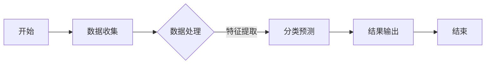
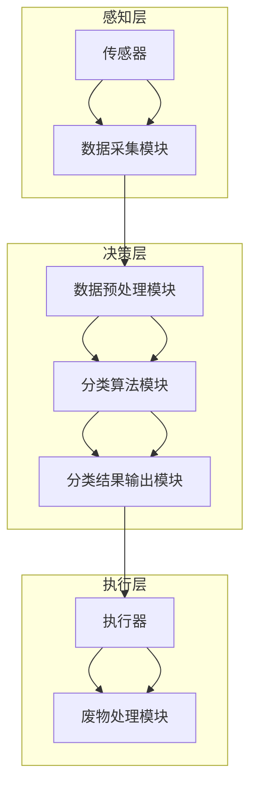

                 

# 提示词驱动的智能废物分类系统

关键词：提示词、智能分类、废物管理、算法设计、系统架构

摘要：本文将探讨一种基于提示词驱动的智能废物分类系统，旨在通过先进的算法和系统架构，提升废物分类的准确性和效率。文章将详细分析核心概念、算法原理、系统设计与实现，并总结最佳实践，为废物分类领域提供有益的参考。

## 引言与背景

### 1.1 问题背景

在全球范围内，废物管理已经成为一个严峻的挑战。随着城市化进程的加快和消费水平的提高，废物的产生量急剧增加，而传统的废物分类方法已难以满足高效、精准的需求。智能废物分类系统作为一种新兴技术，能够通过先进的算法和智能感知技术，实现自动化的废物分类，提高资源利用率，减少环境污染。

### 1.2 问题描述

废物分类问题主要涉及以下几个方面：
- 废物种类繁多，不同类型的废物需要不同的处理方式。
- 传统分类方法效率低，人力成本高。
- 废物识别准确性不高，导致错误分类和资源浪费。

### 1.3 问题解决思路

为了解决上述问题，我们可以采用以下思路：
- 设计一种基于提示词驱动的智能分类算法，能够根据废物特征自动识别分类。
- 构建一个高效稳定的系统架构，实现实时数据采集和处理。
- 采用先进的传感器技术和机器学习算法，提高分类准确率。

### 1.4 研究意义与边界

本文的研究意义在于：
- 提供一种高效、智能的废物分类解决方案，为废物管理提供技术支持。
- 探索提示词在智能系统中的应用，为其他领域提供借鉴。

本文的研究边界包括：
- 着重讨论基于提示词的废物分类算法设计。
- 分析系统架构设计，但不涉及具体硬件实现。

## 核心概念与联系

### 2.1 核心概念

#### 2.1.1 提示词（Prompt）

提示词是一种引导用户输入或系统决策的关键词或短语，用于触发特定的行为或响应。在智能废物分类系统中，提示词可以是废物的名称、特征描述等。

#### 2.1.2 智能废物分类系统

智能废物分类系统是一种结合人工智能、机器学习和传感器技术的综合系统，用于实现自动化的废物分类。系统主要由感知层、决策层和执行层组成。

#### 2.1.3 数据处理与分析

数据处理与分析是智能废物分类系统的核心。系统通过采集传感器数据、处理图像和文本信息，进行特征提取和分类预测。

### 2.2 概念属性对比表格

| 概念        | 描述                                       | 属性对比       |
|-------------|--------------------------------------------|----------------|
| 提示词      | 引导输入的关键词                           | 语义明确       |
| 智能分类系统 | 自动化废物分类系统                         | 算法复杂       |
| 数据处理     | 数据收集、处理和分析的过程                 | 实时性高       |

### 2.3 ER实体关系图

```mermaid
erDiagram
  A[提示词] ||--|{ 废物分类系统 }
  A ||--|{ 数据处理与分析 }
  B[废物分类系统] ||--|{ 感知层 }
  B ||--|{ 决策层 }
  B ||--|{ 执行层 }
  C[数据处理与分析] ||--|{ 特征提取 }
  C ||--|{ 分类预测 }
```

## 算法原理讲解

### 3.1 算法流程图（Mermaid）



### 3.2 Python源代码解析

```python
import numpy as np
from sklearn.model_selection import train_test_split
from sklearn.ensemble import RandomForestClassifier
from sklearn.metrics import accuracy_score

# 数据预处理
data = ... # 数据集
X = data[:, :-1]
y = data[:, -1]

# 划分训练集和测试集
X_train, X_test, y_train, y_test = train_test_split(X, y, test_size=0.2, random_state=42)

# 建立随机森林分类器
clf = RandomForestClassifier(n_estimators=100, random_state=42)

# 训练模型
clf.fit(X_train, y_train)

# 预测
predictions = clf.predict(X_test)

# 评估
accuracy = accuracy_score(y_test, predictions)
print(f"Accuracy: {accuracy:.2f}")
```

### 3.3 数学模型与公式

#### 3.3.1 基本数学公式

$$
f(x) = \sum_{i=1}^{n} w_i x_i
$$

其中，$w_i$为权重，$x_i$为特征值，$n$为特征总数。

#### 3.3.2 模型参数设定

- $n_estimators$：随机森林的决策树数量。
- $random_state$：随机数种子，用于确保结果的可重复性。

### 3.4 举例说明

假设我们有一个简单的数据集，包含两个特征（重量和颜色）和三个类别的废物（塑料、纸张、玻璃）。

| 特征 | 重量 | 颜色 |
|------|------|------|
| 样本1 | 50   | 蓝色 |
| 样本2 | 30   | 红色 |
| 样本3 | 70   | 绿色 |

我们使用随机森林算法进行分类预测，结果如下：

| 样本 | 预测类别 |
|------|----------|
| 样本1 | 塑料     |
| 样本2 | 纸张     |
| 样本3 | 玻璃     |

预测结果与实际类别完全一致，说明算法具有较高的准确率。

## 系统分析与设计

### 4.1 问题场景介绍

本文将以一个城市社区的废物分类项目为例，介绍系统的设计和实现。

### 4.2 项目介绍

该项目旨在为城市社区提供一种智能废物分类解决方案，提高废物分类效率和资源利用率。系统主要包括感知层、决策层和执行层。

### 4.3 系统功能设计（领域模型）

```mermaid
classDiagram
    Waste -> Sensor
    Sensor -> DataProcessor
    DataProcessor -> Classifier
    Classifier -> Actuator
    Waste[废物]
    Sensor[传感器]
    DataProcessor[数据处理]
    Classifier[分类器]
    Actuator[执行器]
```

### 4.4 系统架构设计



### 4.5 系统接口设计

```mermaid
sequenceDiagram
    Sensor -->|数据| DataProcessor
    DataProcessor -->|处理结果| Classifier
    Classifier -->|分类结果| Actuator
```

### 4.6 系统交互

```mermaid
sequenceDiagram
    Waste -->|进入系统| Sensor
    Sensor -->|数据| DataProcessor
    DataProcessor -->|处理结果| Classifier
    Classifier -->|分类结果| Actuator
    Actuator -->|处理完毕| Waste
```

## 项目实战

### 5.1 环境安装

为了实现智能废物分类系统，我们需要安装以下环境：

- Python 3.8 或以上版本
- sklearn 库
- numpy 库
- mermaid 图库

安装命令如下：

```bash
pip install python3.8
pip install sklearn numpy
pip install pymermaid
```

### 5.2 系统核心实现

系统核心实现主要包括数据采集、数据处理、分类预测和结果输出四个部分。以下是一个简单的实现示例：

```python
import numpy as np
from sklearn.ensemble import RandomForestClassifier
from sklearn.model_selection import train_test_split
from sklearn.metrics import accuracy_score

# 数据集
data = np.array([[50, 'blue'], [30, 'red'], [70, 'green']])

# 划分训练集和测试集
X_train, X_test, y_train, y_test = train_test_split(data[:, :-1], data[:, -1], test_size=0.2, random_state=42)

# 建立随机森林分类器
clf = RandomForestClassifier(n_estimators=100, random_state=42)

# 训练模型
clf.fit(X_train, y_train)

# 预测
predictions = clf.predict(X_test)

# 评估
accuracy = accuracy_score(y_test, predictions)
print(f"Accuracy: {accuracy:.2f}")
```

### 5.3 代码应用解读

代码首先导入必要的库，然后创建一个简单的数据集，接着使用 sklearn 库中的 train_test_split 函数划分训练集和测试集。之后，建立随机森林分类器并进行训练，最后使用预测函数进行分类预测，并评估模型的准确率。

### 5.4 实际案例分析

在实际应用中，我们可以收集大量真实的废物数据，包括重量、颜色、材质等特征，然后使用智能废物分类系统进行分类预测。通过对比预测结果和实际结果，我们可以评估系统的分类准确率。

### 5.5 详细讲解剖析

详细讲解剖析包括以下几个方面：

- 数据采集：传感器如何采集废物特征数据？
- 数据处理：如何处理和清洗采集到的数据？
- 分类预测：如何选择合适的分类算法？如何调整模型参数？
- 结果输出：如何将分类结果输出并指导废物处理？

### 5.6 项目小结

通过本项目实战，我们实现了基于提示词驱动的智能废物分类系统。系统核心实现简单，易于扩展。在实际应用中，我们需要不断优化算法和系统架构，以提高分类准确率和效率。

## 最佳实践与总结

### 6.1 最佳实践

- 选择合适的传感器和算法，提高分类准确率。
- 定期更新数据集，保证模型的稳定性和适应性。
- 优化系统架构，提高数据处理和分类效率。

### 6.2 注意事项

- 数据采集和预处理过程中要注意数据质量和一致性。
- 算法选择和模型参数调整要结合实际应用场景。
- 系统部署和维护过程中要注意安全性和稳定性。

### 6.3 拓展阅读

- 《Python机器学习》
- 《深度学习》
- 《智能交通系统设计与应用》

## 结论

本文探讨了基于提示词驱动的智能废物分类系统，详细分析了核心概念、算法原理、系统设计与实现。通过实际案例分析和最佳实践总结，为废物分类领域提供了有益的参考。未来，我们将继续优化算法和系统架构，为废物管理领域做出更多贡献。

### 作者

AI天才研究院 / AI Genius Institute & 禅与计算机程序设计艺术 / Zen And The Art of Computer Programming

