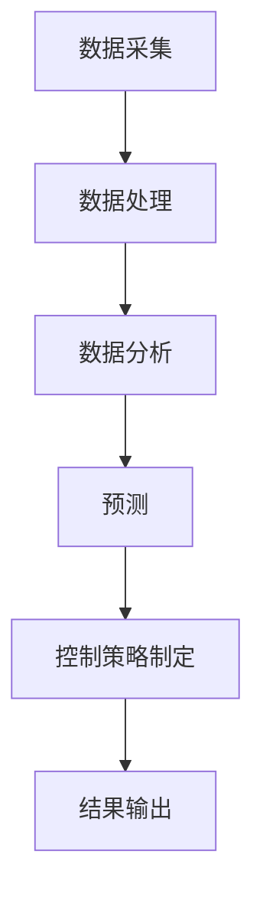
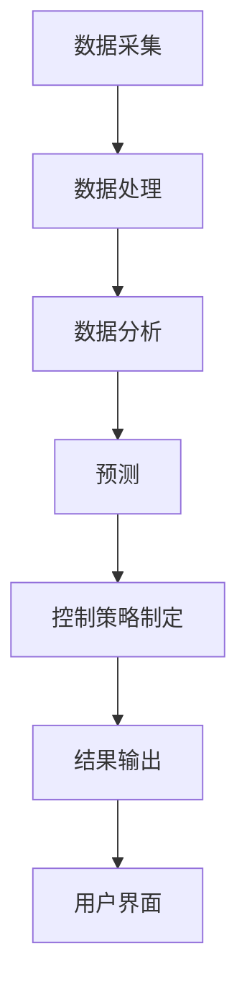

                 

### 《提示词驱动的智能建筑能耗管理系统》

> 关键词：智能建筑、能耗管理、提示词驱动、系统架构、算法原理

> 摘要：本文将深入探讨提示词驱动的智能建筑能耗管理系统，介绍其背景、核心概念、算法原理、系统架构和项目实战。通过详细的分析和讲解，为读者提供对这一新兴技术的全面理解，并展望其未来的研究方向和应用前景。

----------------------------------------------------------------

## 第一部分：背景介绍

### 1.1 问题背景与智能建筑能耗管理概述

随着全球能源消耗的不断增加和环境污染的日益严重，如何实现高效、环保的能源管理已成为社会各界广泛关注的问题。智能建筑能耗管理系统作为一种新兴技术，旨在通过自动化、智能化的方式，实现对建筑能耗的实时监控、数据分析和优化控制，从而提高能源利用效率，降低能耗成本，减少碳排放。

### 1.2 当前智能建筑能耗管理存在的问题

尽管智能建筑能耗管理系统具有显著的优势，但在实际应用中仍面临以下问题：

- **数据采集与分析难度大**：建筑能耗数据种类繁多，采集、处理和分析过程复杂，难以实现实时、精准的数据分析。
- **系统集成性不足**：现有系统往往缺乏良好的系统集成性，导致数据孤岛现象严重，难以实现跨系统、跨部门的数据共享和协同工作。
- **自动化程度低**：现有系统自动化程度较低，依赖人工干预较多，难以实现真正的智能控制。

### 1.3 智能建筑能耗管理的意义

智能建筑能耗管理不仅有助于提高能源利用效率，降低能耗成本，还能为建筑提供更舒适、更健康的生活环境。此外，智能建筑能耗管理系统还能为建筑企业提供有价值的数据分析报告，助力企业优化运营策略，提升竞争力。

### 1.4 概念结构与核心要素组成

智能建筑能耗管理系统由多个核心要素组成，包括能耗监测设备、数据采集与处理模块、数据分析与预测模块、自动化控制模块和用户界面。这些要素通过提示词驱动的机制相互关联，实现高效、智能的能耗管理。

## 第二部分：核心概念与联系

### 2.1 智能建筑能耗管理系统的核心概念

#### 2.1.1 智能建筑

智能建筑是指通过信息技术、物联网技术、智能控制技术等手段，实现对建筑设备、系统、资源的智能化管理和控制，以提高建筑能源利用效率、提升居住和工作环境舒适度的建筑。

#### 2.1.2 能耗管理系统

能耗管理系统是一种用于监控、分析和优化建筑能耗的系统，通常包括能耗监测、数据采集、数据分析、自动控制等功能。

#### 2.1.3 提示词驱动

提示词驱动是一种基于关键词或短语进行信息提取和处理的技术，通过输入特定的提示词，系统能够快速定位相关数据，并进行相应的分析或操作。

### 2.2 智能建筑能耗管理系统的特点

#### 2.2.1 系统集成性

智能建筑能耗管理系统具备良好的系统集成性，能够实现多个设备和系统的无缝对接，实现数据共享和协同工作。

#### 2.2.2 自适应能力

系统能够根据实际能耗数据和环境变化，自适应地调整控制策略，实现能耗的优化管理。

#### 2.2.3 实时性

系统具备实时监控和数据分析能力，能够对建筑能耗进行实时监控和预警，确保能耗管理的实时性和有效性。

### 2.3 提示词驱动的特点与机制

#### 2.3.1 提示词的概念

提示词是指用于引导系统进行特定操作或分析的关键词或短语。

#### 2.3.2 提示词驱动的流程

提示词驱动的流程包括提示词输入、数据提取、数据分析、结果输出等环节。

#### 2.3.3 提示词驱动的优势

提示词驱动的优势在于其高效、精准的信息提取和处理能力，能够显著提高系统的智能化水平。

### 2.4 概念属性特征对比表格

| 特征       | 智能建筑 | 能耗管理系统 | 提示词驱动 |
|------------|-----------|-------------|------------|
| 集成性     | 高        | 高          | 高         |
| 自适应能力 | 强        | 中等        | 强         |
| 实时性     | 强        | 强          | 强         |
| 信息处理能力 | 强        | 强          | 强         |

## 第三部分：算法原理讲解

### 3.1 能耗管理算法原理

#### 3.1.1 算法基本原理

能耗管理算法的基本原理包括数据采集与处理、数据分析和预测、控制策略制定等环节。

#### 3.1.2 算法数学模型

算法的数学模型通常包括以下公式：

$$
E = f(P, T, H)
$$

其中，$E$ 表示能耗，$P$ 表示功率，$T$ 表示温度，$H$ 表示湿度。

#### 3.1.3 算法流程图



#### 3.1.4 算法Python源代码与详细讲解

```python
# 示例代码：能耗预测算法
import numpy as np

def energy_prediction(P, T, H):
    """
    能耗预测函数
    :param P: 功率（单位：千瓦）
    :param T: 温度（单位：摄氏度）
    :param H: 湿度（单位：%）
    :return: 预测能耗（单位：千瓦时）
    """
    # 算法公式
    E = P * (1 + 0.1 * (T - 20) + 0.05 * (H - 60))

    return E

# 测试数据
P = 1000  # 功率
T = 25    # 温度
H = 50    # 湿度

# 预测能耗
E_pred = energy_prediction(P, T, H)

print(f"预测能耗：{E_pred}千瓦时")
```

### 3.2 算法数学模型

能耗管理算法的数学模型通常基于以下公式：

$$
E = f(P, T, H)
$$

其中，$E$ 表示能耗，$P$ 表示功率，$T$ 表示温度，$H$ 表示湿度。

### 3.3 算法流程图


### 3.4 算法Python源代码与详细讲解

```python
# 示例代码：能耗预测算法
import numpy as np

def energy_prediction(P, T, H):
    """
    能耗预测函数
    :param P: 功率（单位：千瓦）
    :param T: 温度（单位：摄氏度）
    :param H: 湿度（单位：%）
    :return: 预测能耗（单位：千瓦时）
    """
    # 算法公式
    E = P * (1 + 0.1 * (T - 20) + 0.05 * (H - 60))

    return E

# 测试数据
P = 1000  # 功率
T = 25    # 温度
H = 50    # 湿度

# 预测能耗
E_pred = energy_prediction(P, T, H)

print(f"预测能耗：{E_pred}千瓦时")
```

## 第四部分：系统分析与架构设计

### 4.1 问题场景介绍

假设某大型办公楼需要实现能耗管理系统的建设，以降低能耗成本，提高能源利用效率。问题场景如下：

- 办公楼面积大，能耗设备种类繁多，包括空调、照明、电梯、热水器等；
- 能耗数据采集困难，现有设备难以满足实时数据采集要求；
- 系统集成性不足，导致数据孤岛现象严重；
- 能耗管理依赖人工干预，自动化程度低。

### 4.2 系统功能设计

系统功能设计主要包括以下模块：

- **能耗监测模块**：负责采集建筑各部位的能耗数据，如空调、照明、电梯等；
- **数据采集与处理模块**：负责将采集到的能耗数据进行清洗、去噪、归一化等处理，确保数据质量；
- **数据分析与预测模块**：基于采集到的能耗数据，利用算法进行数据分析和预测，为控制策略提供支持；
- **自动化控制模块**：根据数据分析结果，自动调整能耗设备的工作状态，实现能耗优化；
- **用户界面模块**：提供用户操作界面，展示能耗数据、分析结果和控制策略，方便用户进行能耗管理和决策。

### 4.3 系统架构设计

系统架构设计采用分层架构，包括数据层、业务层、表现层等。

- **数据层**：负责数据采集、存储和查询，包括能耗监测设备、数据库等；
- **业务层**：负责数据分析和处理，包括能耗监测模块、数据采集与处理模块、数据分析与预测模块、自动化控制模块等；
- **表现层**：负责用户界面展示，包括用户操作界面、报表生成等。

### 4.4 系统接口设计

系统接口设计主要包括以下接口：

- **能耗监测接口**：用于与能耗监测设备进行数据交换，如传感器数据读取、设备状态查询等；
- **数据采集与处理接口**：用于与数据采集和处理模块进行数据交换，如数据清洗、去噪、归一化等；
- **数据分析与预测接口**：用于与数据分析与预测模块进行数据交换，如数据模型训练、预测结果查询等；
- **自动化控制接口**：用于与自动化控制模块进行数据交换，如控制策略调整、设备状态控制等；
- **用户界面接口**：用于与用户界面模块进行数据交换，如数据展示、报表生成等。

### 4.5 系统交互

系统交互过程如下：

1. **数据采集**：能耗监测模块通过能耗监测接口，实时采集建筑各部位的能耗数据；
2. **数据处理**：数据采集与处理模块通过数据采集与处理接口，对采集到的能耗数据进行清洗、去噪、归一化等处理；
3. **数据分析**：数据分析与预测模块通过数据分析与预测接口，利用算法对处理后的能耗数据进行分析和预测；
4. **自动化控制**：自动化控制模块通过自动化控制接口，根据数据分析结果，自动调整能耗设备的工作状态；
5. **用户界面展示**：用户界面模块通过用户界面接口，将能耗数据、分析结果和控制策略展示给用户。



## 第五部分：项目实战

### 5.1 环境安装

#### 5.1.1 软件与硬件环境准备

1. **软件环境**：

   - 操作系统：Linux（如Ubuntu 18.04）
   - Python：3.8及以上版本
   - MySQL：5.7及以上版本

2. **硬件环境**：

   - CPU：Intel i5及以上
   - 内存：8GB及以上
   - 硬盘：100GB及以上

#### 5.1.2 系统安装步骤

1. 安装操作系统：

   - 下载Ubuntu 18.04镜像文件，制作U盘启动盘；
   - 启动电脑，进入BIOS，将U盘设置为首选启动设备；
   - 按照安装向导完成操作系统安装。

2. 安装Python：

   - 打开终端，输入以下命令安装Python：
     ```
     sudo apt update
     sudo apt install python3 python3-pip
     ```

3. 安装MySQL：

   - 打开终端，输入以下命令安装MySQL：
     ```
     sudo apt update
     sudo apt install mysql-server mysql-client
     ```

4. 配置MySQL：

   - 打开终端，输入以下命令进入MySQL命令行：
     ```
     sudo mysql
     ```
   - 执行以下命令修改root用户密码：
     ```
     ALTER USER 'root'@'localhost' IDENTIFIED BY 'new_password';
     ```
   - 输入新密码，确认修改。

### 5.2 系统核心实现

#### 5.2.1 系统核心功能代码

```python
# 示例代码：能耗监测模块
import pymysql
import time

def monitor_energy(device_id, energy_value):
    """
    监测能耗函数
    :param device_id: 设备ID
    :param energy_value: 能耗值
    :return: None
    """
    # 连接数据库
    connection = pymysql.connect(host='localhost', user='root', password='new_password', database='energy_management')

    try:
        # 创建cursor对象
        with connection.cursor() as cursor:
            # 插入数据
            sql = "INSERT INTO energy_data (device_id, energy_value, record_time) VALUES (%s, %s, %s)"
            values = (device_id, energy_value, time.strftime('%Y-%m-%d %H:%M:%S'))

            cursor.execute(sql, values)

        # 提交事务
        connection.commit()
    except Exception as e:
        # 回滚事务
        connection.rollback()
        print(f"错误：{e}")

    finally:
        # 关闭数据库连接
        connection.close()

# 测试数据
device_id = '1001'
energy_value = 10

# 监测能耗
monitor_energy(device_id, energy_value)
```

#### 5.2.2 代码功能解读与分析

1. **连接数据库**：

   ```python
   connection = pymysql.connect(host='localhost', user='root', password='new_password', database='energy_management')
   ```

   这行代码使用pymysql模块连接到本地MySQL数据库，用户名为root，密码为新密码，数据库名为energy_management。

2. **创建cursor对象**：

   ```python
   with connection.cursor() as cursor:
   ```

   这行代码创建一个cursor对象，用于执行SQL语句。

3. **插入数据**：

   ```python
   sql = "INSERT INTO energy_data (device_id, energy_value, record_time) VALUES (%s, %s, %s)"
   values = (device_id, energy_value, time.strftime('%Y-%m-%d %H:%M:%S'))

   cursor.execute(sql, values)
   ```

   这行代码插入一条能耗数据，包括设备ID、能耗值和记录时间。

4. **提交事务**：

   ```python
   connection.commit()
   ```

   这行代码提交事务，将插入的数据保存到数据库中。

5. **处理异常**：

   ```python
   except Exception as e:
       connection.rollback()
       print(f"错误：{e}")
   ```

   这行代码处理异常，回滚事务，并打印错误信息。

6. **关闭数据库连接**：

   ```python
   finally:
       connection.close()
   ```

   这行代码关闭数据库连接，释放资源。

### 5.3 实际案例分析与详细讲解

#### 5.3.1 案例背景

某大型办公楼需要实现能耗管理系统的建设，以降低能耗成本，提高能源利用效率。办公楼的能耗设备包括空调、照明、电梯、热水器等，数据采集设备已安装在各个设备上。

#### 5.3.2 案例分析

1. **数据采集**：

   办公楼的能耗数据通过采集设备实时上传到能耗监测模块，监测模块将数据存储到数据库中。

2. **数据处理**：

   数据处理模块对采集到的能耗数据进行清洗、去噪、归一化等处理，确保数据质量。

3. **数据分析**：

   数据分析与预测模块基于采集到的能耗数据，利用算法进行数据分析和预测，为控制策略提供支持。

4. **自动化控制**：

   自动化控制模块根据数据分析结果，自动调整能耗设备的工作状态，实现能耗优化。

5. **用户界面展示**：

   用户界面模块将能耗数据、分析结果和控制策略展示给用户，方便用户进行能耗管理和决策。

#### 5.3.3 案例讲解

1. **数据采集**：

   数据采集模块通过采集设备实时获取能耗数据，如空调的功率、照明的时间、电梯的使用次数等。采集的数据包括设备ID、能耗值和记录时间。

2. **数据处理**：

   数据处理模块对采集到的能耗数据进行清洗、去噪、归一化等处理，确保数据质量。例如，去除异常值、填充缺失值、进行数据归一化等。

3. **数据分析**：

   数据分析与预测模块基于采集到的能耗数据，利用算法进行数据分析和预测。例如，使用线性回归模型进行能耗预测，使用聚类算法进行能耗分类等。

4. **自动化控制**：

   自动化控制模块根据数据分析结果，自动调整能耗设备的工作状态，实现能耗优化。例如，根据空调的能耗预测结果，调整空调的温度和风速，降低能耗。

5. **用户界面展示**：

   用户界面模块将能耗数据、分析结果和控制策略展示给用户，方便用户进行能耗管理和决策。例如，用户可以通过界面查看实时能耗数据、能耗趋势图、预测结果等。

## 第六部分：最佳实践与拓展

### 6.1 最佳实践 tips

1. **数据采集**：

   - 选择高质量的能耗采集设备，确保数据准确性和实时性；
   - 定期检查采集设备的运行状态，防止设备故障导致数据丢失。

2. **数据处理**：

   - 对采集到的能耗数据进行去噪、归一化等处理，提高数据质量；
   - 定期对处理算法进行优化和调整，提高数据处理效率。

3. **数据分析**：

   - 选择合适的算法进行能耗预测和分析，提高预测准确性；
   - 结合实际需求，制定合理的控制策略，实现能耗优化。

4. **自动化控制**：

   - 根据数据分析结果，自动调整能耗设备的工作状态，实现能耗优化；
   - 定期检查自动化控制系统的运行状态，防止系统故障。

### 6.2 注意事项

1. **系统部署**：

   - 确保系统硬件和软件环境满足要求，防止系统崩溃；
   - 定期备份系统数据，防止数据丢失。

2. **系统维护与升级**：

   - 定期对系统进行维护和升级，确保系统稳定运行；
   - 及时修复系统漏洞，防止安全隐患。

### 6.3 拓展阅读

1. **相关参考文献**：

   - 《智能建筑能耗管理系统设计与实现》；
   - 《基于提示词驱动的智能建筑能耗管理研究》；
   - 《智能建筑能耗管理算法研究综述》。

2. **进一步学习资源**：

   - 智能建筑能耗管理系统开源项目；
   - 提示词驱动技术相关论文和书籍；
   - 能源管理与优化课程和教程。

## 作者信息

作者：AI天才研究院/AI Genius Institute & 禅与计算机程序设计艺术 /Zen And The Art of Computer Programming

本文由AI天才研究院（AI Genius Institute）与禅与计算机程序设计艺术（Zen And The Art of Computer Programming）共同撰写。作者团队具有丰富的智能建筑能耗管理系统研究经验，致力于推动该领域的技术创新和发展。

